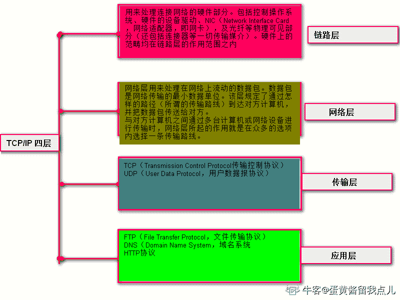
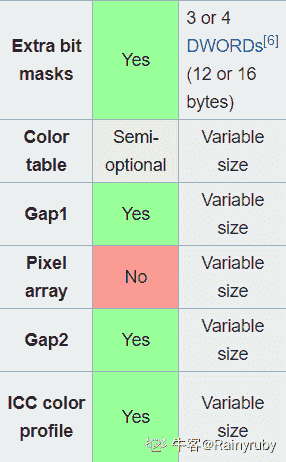

# 触宝科技 2017 秋季校招笔试后端大数据（第二批）

## 1

以下表的设计，最合理的是

正确答案: A   你的答案: 空 (错误)

```cpp
学生{id,name,age} ,学科{id,name} 分数{学生 id,学科 id,分数}
```

```cpp
学生{id,name,age} ,分数{学生 id, 学科 id, 学科 name , 分数}
```

```cpp
分数{学生 id, 学生 name，学生 age, 学科 id，学科名称, 分数, }
```

```cpp
学科{id,name},分数{学生 id，学生姓名，学生 age，学科 id,分数}
```

本题知识点

数字认证 数理统计 C++工程师 iOS 工程师 安卓工程师 运维工程师 前端工程师 算法工程师 PHP 工程师 大数据开发工程师 2017 触宝 概率论与数理统计

讨论

[offer 都是我的，冲冲冲](https://www.nowcoder.com/profile/457905418)

最主要从数据库的第一范式、第二范式、第三范式考虑：第一范式(确保每列保持原子性)即每列不再需要拆分
第二范式(确保表中的每列都和主键相关)
第三范式(确保每列都和主键列直接相关,而不是间接相关)

发表于 2020-03-09 14:58:37

* * *

[求一个实习](https://www.nowcoder.com/profile/706740927)

d 有些间接相关了

发表于 2021-07-31 20:18:09

* * *

## 2

根据 TCP/IP 协议栈的分层来看 HTTP 协议工作在哪一层

正确答案: D   你的答案: 空 (错误)

```cpp
数据链路层
```

```cpp
网络层
```

```cpp
传输层
```

```cpp
应用层
```

本题知识点

数字认证 C++工程师 iOS 工程师 安卓工程师 运维工程师 前端工程师 算法工程师 PHP 工程师 大数据开发工程师 2017 触宝

讨论

[喜羊羊威利](https://www.nowcoder.com/profile/3664020)


***应用层（Application Layer）***包含所有的高层协议，包括：

虚拟终端协议（TELNET，TELecommunications NETwork）；文件传输协议（FTP，File Transfer Protocol）；

电子邮件传输协议（SMTP，Simple Mail Transfer Protocol）；域名服务（DNS，Domain Name Service）；

网上新闻传输协议（NNTP，Net News Transfer Protocol）；超文本传送协议（HTTP，HyperText Transfer Protocol）。

发表于 2019-11-27 10:55:16

* * *

[Dilly](https://www.nowcoder.com/profile/614879283)

你告诉我这玩意属于数理统计？？？

发表于 2021-11-04 11:04:12

* * *

[SdV](https://www.nowcoder.com/profile/902082580)

谁标的知识点，无关的塞这么多

发表于 2020-08-29 17:23:01

* * *

## 3

用容积分别为 15 升和 27 升的两个杯子向一个水桶中装水，可以精确向水桶中注入多少升水

正确答案: C   你的答案: 空 (错误)

```cpp
53
```

```cpp
25
```

```cpp
33
```

```cpp
52
```

本题知识点

数字认证 数理统计 C++工程师 iOS 工程师 安卓工程师 运维工程师 前端工程师 算法工程师 PHP 工程师 大数据开发工程师 数字认证 2017 触宝

讨论

[leizeling](https://www.nowcoder.com/profile/5627520)

A:15,B:27。A 装满倒入 B，A 再装满导入 B，A 中剩 3，所以只要是 3 的倍数都可以。

发表于 2018-07-25 21:23:34

* * *

[是真的行](https://www.nowcoder.com/profile/222065054)

33=15+3*6 （先往桶里倒 15 升水，然后再往桶里倒 6 次 3 升的水，3 升水怎么得出来呢，15 升的杯装满水往 27 升空杯里倒，倒完第一次，15 升的杯再次装满水，继续往已有 15 升水的 27 升杯子里倒，只能倒进去 12 升，杯子里剩 3 升，倒进桶里；重复 6 次）

发表于 2019-03-29 20:34:10

* * *

[cah07](https://www.nowcoder.com/profile/759341181)

用容器 a 三次向桶到水，共 45 升，再用容器 b 装满水，先把容器 a 装满，b 还剩 8 升，再导入桶中，恰好 53 升

发表于 2018-08-21 00:04:19

* * *

## 4

一副牌 52 张(去掉大小王)，从中抽取两张牌，一红一黑的概率是多少

正确答案: A   你的答案: 空 (错误)

```cpp
26/51
```

```cpp
25/51
```

```cpp
26/52
```

```cpp
25/52
```

本题知识点

数字认证 数理统计 C++工程师 iOS 工程师 安卓工程师 运维工程师 前端工程师 算法工程师 PHP 工程师 大数据开发工程师 数字认证 2017 触宝

讨论

[帅气的小小全](https://www.nowcoder.com/profile/7291518)

从反面求，求出同红和同黑的概率

发表于 2018-07-13 20:47:35

* * *

## 5

字符串"//＾▽＾//\n"的长度是

正确答案: C   你的答案: 空 (错误)

```cpp
6
```

```cpp
7
```

```cpp
8
```

```cpp
9
```

本题知识点

数字认证 数理统计 C++工程师 iOS 工程师 安卓工程师 运维工程师 前端工程师 算法工程师 PHP 工程师 大数据开发工程师 数字认证 2017 触宝

讨论

[y 轴](https://www.nowcoder.com/profile/1909286)

'\n'算一个

发表于 2018-08-08 11:07:15

* * *

[zeiss](https://www.nowcoder.com/profile/216363082)

最后的'\0'应该也要算一个吧？

发表于 2018-10-02 17:24:58

* * *

## 6

一个查询语句执行后显示的结果为 1 班 80 2 班 75 3 班 NULL 则最有可能的查询语句是

正确答案: B   你的答案: 空 (错误)

```cpp
SELECT AVG(成绩) FROM 成绩表 WHERE class&lt;=3
```

```cpp
SELECT AVG(成绩) FROM 成绩表 WHERE class&lt;=3 GROUP BY class
```

```cpp
SELECT AVG(成绩) FROM 成绩表 WHERE class&lt;=3 order by class
```

```cpp
SELECT AVG(成绩) FROM 成绩表 HAVING class &lt;=3 GROUP BY class
```

本题知识点

数字认证 数理统计 C++工程师 iOS 工程师 安卓工程师 运维工程师 前端工程师 算法工程师 PHP 工程师 大数据开发工程师 数字认证 2017 触宝

讨论

[bellz](https://www.nowcoder.com/profile/977609561)

C 答案中，order by 默认是升序，不会输出题设那样的结果

发表于 2019-02-25 11:27:25

* * *

## 7

执行以下代码#define SUM(x,y) x+yint a=3;int b=2;a+=a*SUM(a,b)*b;a 的值为

正确答案: A   你的答案: 空 (错误)

```cpp
16
```

```cpp
30
```

```cpp
33
```

```cpp
39
```

本题知识点

数字认证 数理统计 C++工程师 iOS 工程师 安卓工程师 运维工程师 前端工程师 算法工程师 PHP 工程师 大数据开发工程师 2017 C 语言 触宝

讨论

[THE_LIN](https://www.nowcoder.com/profile/680957182)

**宏定义在运算过程中是以替换的形式****故运算式为：a+=a*a+b*b; (3 += 13) ==> 16** **选 A** 

发表于 2020-09-04 23:08:00

* * *

[给弟弟一个 offer](https://www.nowcoder.com/profile/895606814)

这个跟语言有关吧，python 里面直接跑就是 33 啊

```cpp
def SUM(a,b):
    return a+b
a += a*SUM(a,b)*b
print(a)
33
```

发表于 2019-09-19 02:38:01

* * *

[ScreenShot](https://www.nowcoder.com/profile/1509172)

return x+y ,not (x+y). So, when it meets the equation,it goes in this way:  a += a*a + b*b

发表于 2018-07-11 21:03:37

* * *

## 8

一个栈的入栈序列为 ABCDE，则栈的不可能的输出序列为

正确答案: D   你的答案: 空 (错误)

```cpp
DCBEA
```

```cpp
ACBED
```

```cpp
DCEBA
```

```cpp
DEBCA
```

本题知识点

数字认证 数理统计 C++工程师 iOS 工程师 安卓工程师 运维工程师 前端工程师 算法工程师 PHP 工程师 大数据开发工程师 2017 触宝

讨论

[白晓莫](https://www.nowcoder.com/profile/639357362)

A 选项：A 入栈，不出；B 入栈，不出；C 入栈，不出；，D 入栈，出栈（**D**）；C 出栈（**C**）；B 出栈（**B**）；E 入栈，出栈（**E**）；A 出栈（**A**）
**DCBEA**
B 选项：A 入栈，出栈（**A**）；B 入栈，不出；C 入栈，C 出栈（**C**）；B 出栈（**B**）；D 入栈，不出；E 入栈，出栈（**E**）；D 出栈（**D**）
**ACBED**
C 选项：A 入栈，不出；B 入栈，不出；C 入栈，不出；D 入栈，出栈（**D**）；C 出栈（**C**）；E 入栈，出栈（**E**）；B 出栈（**B**）；A 出栈（**A**）
**DCEBA**
D 选项：A 入栈，不出；B 入栈，不出；C 入栈，不出；D 入栈，出栈（**D**）；E 入栈，出栈（**E**）；
**DE**，现在出栈顺序只能为**CBA**，所以 D 错。
题目规定入栈序列为 ABCDE，但可以一边入，一边出。

发表于 2020-12-21 17:03:49

* * *

[院长灿爷](https://www.nowcoder.com/profile/817686089)

不是说栈中，先入后出；队列，先进先出么？不是特别懂，求解答。

发表于 2020-04-14 17:37:26

* * *

[9999 网络圣人](https://www.nowcoder.com/profile/866748980)

题目的意思是入栈顺序是 ABCDE，入栈的过程中存在出栈行为。栈是后进先出，d 选项中 DEBCA，DE 出栈后栈中元素为 ABC，出栈顺序必须是 ABC.

发表于 2020-11-07 08:16:37

* * *

## 9

下面数据结构能够支持随机的插入和删除操作、并具有较好的性能的是

正确答案: A   你的答案: 空 (错误)

```cpp
链表和哈希表
```

```cpp
数组和链表
```

```cpp
哈希表和队列
```

```cpp
堆栈和双向队列
```

本题知识点

数字认证 数理统计 C++工程师 iOS 工程师 安卓工程师 运维工程师 前端工程师 算法工程师 PHP 工程师 大数据开发工程师 数字认证 2017 触宝

讨论

[~~Smile](https://www.nowcoder.com/profile/3486232)

链表删除和插入操作时间复杂度为 O(1), 数组插入和删除时间复杂度为 O(n)。
[散列表](https://baike.baidu.com/item/%E6%95%A3%E5%88%97%E8%A1%A8/10027933)（Hash table，也叫哈希表），是根据关键码值(Key value)而直接进行访问的[数据结构](https://baike.baidu.com/item/%E6%95%B0%E6%8D%AE%E7%BB%93%E6%9E%84/1450)。也就是说，它通过把关键码值映射到表中一个位置来访问记录，以加快查找的速度。这个映射函数叫做[散列函数](https://baike.baidu.com/item/%E6%95%A3%E5%88%97%E5%87%BD%E6%95%B0/2366288)，存放记录的[数组](https://baike.baidu.com/item/%E6%95%B0%E7%BB%84/3794097)叫做[散列表](https://baike.baidu.com/item/%E6%95%A3%E5%88%97%E8%A1%A8/10027933)。给定表 M，存在函数 f(key)，对任意给定的关键字值 key，代入函数后若能得到包含该关键字的记录在表中的地址，则称表 M 为哈希(Hash）表，函数 f(key)为哈希(Hash) 函数。

发表于 2018-08-11 09:52:08

* * *

## 10

 1 台机器对 200 个单词进行排序花了 200 秒(使用冒泡排序)，那么花费 800 秒，大概可以对多少个单词进行排序

正确答案: A   你的答案: 空 (错误)

```cpp
400
```

```cpp
500
```

```cpp
600
```

```cpp
800
```

本题知识点

数字认证 数理统计 C++工程师 iOS 工程师 安卓工程师 运维工程师 前端工程师 算法工程师 PHP 工程师 大数据开发工程师 数字认证 2017 触宝

讨论

[J.Fan](https://www.nowcoder.com/profile/4798818)

可以这样理解，冒泡排序复杂度 O（n²），T = C*(n²)(C 是常量系数，n 是数据长度，T 是消耗时间)，把 n=200，T=200 带入可得 C=1/200，然后再将 T=800 带入，可得 n=400

发表于 2018-12-24 12:07:55

* * *

[Jean_V925](https://www.nowcoder.com/profile/226656436)

冒泡排序的时间复杂度为,n 是待排序的数组长度题目中当需要排序的数组长度变为原来的 2 倍，所需时间扩大为原来的 4 倍。所以 n 从 200 变成 400，时间变为 200 秒的 4 倍

发表于 2018-11-04 19:34:26

* * *

[问天余生](https://www.nowcoder.com/profile/1592523)

冒泡排序复杂度 O（n²）

发表于 2018-07-11 23:16:47

* * *

## 11

编译程序是一种

正确答案: A   你的答案: 空 (错误)

```cpp
翻译程序
```

```cpp
目标程序
```

```cpp
汇编程序
```

```cpp
解释程序
```

本题知识点

数字认证 数理统计 C++工程师 iOS 工程师 安卓工程师 运维工程师 前端工程师 算法工程师 PHP 工程师 大数据开发工程师 数字认证 2017 触宝

讨论

[Jean_V925](https://www.nowcoder.com/profile/226656436)

一般先编译，后执行。编译的过程理解为翻译的过程。执行过程理解为阅读翻译后的信息。

发表于 2018-11-04 16:40:06

* * *

## 12

如果某系统 12*5=61 成立，则系统采用的是()进制

正确答案: C   你的答案: 空 (错误)

```cpp
7
```

```cpp
8
```

```cpp
9
```

```cpp
10
```

本题知识点

数字认证 数理统计 C++工程师 iOS 工程师 安卓工程师 运维工程师 前端工程师 算法工程师 PHP 工程师 大数据开发工程师 2017 触宝 概率论与数理统计

讨论

[woyayaya](https://www.nowcoder.com/profile/657953894)

设为 n 进制，（n+2)*5=6*n+1。所以得 n=9

发表于 2019-02-16 22:18:23

* * *

[摆摊、卖记忆 _](https://www.nowcoder.com/profile/3987175)

A：7 进制的话，左边(1*7¹+2*7⁰)*(5*7⁰)=45   右边 6*7¹+1*7⁰=43，左右不相等；B：8 进制的话，左边(1*8¹+2*8⁰)*(5*8⁰)=50   右边 6*8¹+1*8⁰=49，左右不相等；C：9 进制的话，左边(1*9¹+2*9⁰)*(5*9⁰)=55   右边 6*9¹+1*9⁰=55，左右相等；D：8 进制的话，左边(1*10¹+2*10⁰)*(5*10⁰)=60   右边 6*10¹+1*10⁰=61，左右不相等； 所以选 C。

发表于 2018-07-22 18:31:05

* * *

[早起的虫儿 e](https://www.nowcoder.com/profile/894801862)

```cpp
设系统采用 n 进制，则 n 进制各位数代表含义如下：
 8    7    6     5    4    3    2    1    0
n⁸  n⁷  n⁶   n⁵  n⁴  n³  n²  n¹  n⁰ 
```

12=1 2 = (n¹) *1 + (n⁰) *2 = n+2     （1）5 = (n⁰)*5 = 5                                    （2）61 = (n¹)*6 + (n⁰)*1 = 6n +1           （3）联立 方程 1，2，3，得：（n+2）*5 = 6n+1   解得 n = 9

编辑于 2022-03-11 14:29:55

* * *

## 13

对于以下代码，char* p=new char[100];正确的是

正确答案: D   你的答案: 空 (错误)

```cpp
p 和 new 出来的内存都在栈上
```

```cpp
p 和 new 出来的内存都在堆上
```

```cpp
p 在堆上，new 出来的在栈上
```

```cpp
p 在栈上，new 出来的在堆上
```

本题知识点

数字认证 数理统计 C++工程师 iOS 工程师 安卓工程师 运维工程师 前端工程师 算法工程师 PHP 工程师 大数据开发工程师 2017 C++ 触宝 概率论与数理统计

讨论

[牛客职导官方账号](https://www.nowcoder.com/profile/897353)

【正确答案】D
【解析】p  查看全部)

编辑于 2021-11-18 08:38:24

* * *

[ONEFISH51](https://www.nowcoder.com/profile/8762502)

动态申请的内存存储在堆区，需要手动释放。

局部变量存储在栈区，自动释放。

发表于 2019-03-24 16:44:48

* * *

[良人轻薄年未归](https://www.nowcoder.com/profile/127862757)

char * p p 是自动变量，存放在栈上

发表于 2022-03-14 14:02:25

* * *

## 14

正常建立一条 TCP 连接需要（）个步骤，正常关闭一个 TCP 连接需要（）个步骤

正确答案: B   你的答案: 空 (错误)

```cpp
3,3
```

```cpp
3,4
```

```cpp
4,4
```

```cpp
4,3
```

本题知识点

数字认证 数理统计 C++工程师 iOS 工程师 安卓工程师 运维工程师 前端工程师 算法工程师 PHP 工程师 大数据开发工程师 数字认证 2017 触宝

讨论

[换个心情 201807101333971](https://www.nowcoder.com/profile/463617798)

3 次握手，4 次挥手

发表于 2018-07-17 14:17:30

* * *

## 15

 以下开源软件中经常被用作消息队列的是哪个

正确答案: A   你的答案: 空 (错误)

```cpp
Kafka
```

```cpp
MongoDB
```

```cpp
Hadoop
```

```cpp
Spark
```

本题知识点

数字认证 数理统计 C++工程师 iOS 工程师 安卓工程师 运维工程师 前端工程师 算法工程师 PHP 工程师 大数据开发工程师 数字认证 2017 触宝

讨论

[Jean_V925](https://www.nowcoder.com/profile/226656436)

作为中间件，消息队列是分布式应用间交换信息的重要组件。消息队列可驻留在内存或磁盘上, 队列可以存储消息直到它们被应用程序读走。通过消息队列，应用程序可以在不知道彼此位置的情况下独立处理消息，或者在处理消息前不需要等待接收此消息。所以消息队列可以解决应用解耦、异步消息、流量削锋等问题，是实现高性能、高可用、可伸缩和最终一致性架构中不可以或缺的一环。比较常见的消息队列（Message Queue）产品主要是**ActiveMQ**、**RabbitMQ**、**Apollo**、**ZeroMQ**、**Kafka**、**MetaMQ**、**RocketMQ** 其中 ZeroMQ 号称是“史上最快的消息队列”，基于 c 语言开发的，可以在任何平台通过任何代码连接。 RabbitMQ 是基于 Erlang 语言编写的开源消息队列，通过 Erlang 的 Actor 模型实现了数据的稳定可靠传输。 ActiveMQ 介于 ZeroMQ 和 RabbitMQ 之间。类似于 ZeroMQ，它可以部署于***模式和 P2P 模式。 Apache 称 Apollo 为最快、最强健的 STOMP 服务器。 Kafka 是 LinkedIn 于 2010 年 12 月开发并开源的一个分布式流平台，现在是 Apache 的顶级项目，是一个高性能跨语言分布式 Publish/Subscribe 消息队列系统。RocketMQ 是阿里开源的消息中间件，目前在 Apache 孵化，使用纯 Java 开发，具有高吞吐量、高可用性、适合大规模分布式系统应用的特点。 

> [`blog.csdn.net/liuxinghao/article/details/60875715`](https://blog.csdn.net/liuxinghao/article/details/60875715)

编辑于 2018-11-04 16:38:06

* * *

[~~Smile](https://www.nowcoder.com/profile/3486232)

[`baike.baidu.com/item/Kafka/17930165?fr=aladdin`](https://baike.baidu.com/item/Kafka/17930165?fr=aladdin)

发表于 2018-08-15 08:58:02

* * *

## 16

现有 4 个同时到达的作业 J1,J2,J3 和 J4,它们的执行时间分别是 1 小时，3 小时，5 小时，7 小时，系统按单道方式运行且采用短作业优先算法，则平均周转时间是（）小时

正确答案: D   你的答案: 空 (错误)

```cpp
4
```

```cpp
5
```

```cpp
6
```

```cpp
7.5
```

本题知识点

数字认证 数理统计 C++工程师 iOS 工程师 安卓工程师 运维工程师 前端工程师 算法工程师 PHP 工程师 大数据开发工程师 数字认证 2017 触宝

讨论

[紫夜丶听雨](https://www.nowcoder.com/profile/4959477)

> 平均周转时间 = (Σ任务 i 的等待时间 + Σ任务 i 的执行时间) / 任务数
> 由题，单道方式，直接代公式，选 D

发表于 2018-07-18 14:33:35

* * *

## 17

在给定文件中查找与设定条件相符字符串的命令

正确答案: B   你的答案: 空 (错误)

```cpp
gzip
```

```cpp
grep
```

```cpp
ls
```

```cpp
find
```

本题知识点

数字认证 数理统计 C++工程师 iOS 工程师 安卓工程师 运维工程师 前端工程师 算法工程师 PHP 工程师 大数据开发工程师 数字认证 2017 触宝

讨论

[莫库什勒](https://www.nowcoder.com/profile/9455532)

grep 命令是一种强大的文本搜索工具，它能使用正则表达式搜索文本，并把匹 配的行打印出来。grep 全称是 Global Regular Expression Print，表示全局正则表达式版本，它的使用权限是所有用户。 find 只能匹配单个字符，find 会找到匹配的字符的第一个，并返回是位置首地址，其后与之匹配字符串则不会被查找。而 grep 会查找所有与之匹配的字符串。 这里指 linux 的命令 grep。而在 c++的 string 类中，find()函数也有找匹配的字符串的功能。

编辑于 2018-09-17 18:43:29

* * *

## 18

Linux 文件权限一共 10 位长度，分成四段，第三段表示的内容是

正确答案: B   你的答案: 空 (错误)

```cpp
文件所有者的权限
```

```cpp
文件所有者所在组的权限
```

```cpp
其他用户的权限
```

```cpp
文件类型
```

本题知识点

数字认证 数理统计 C++工程师 iOS 工程师 安卓工程师 运维工程师 前端工程师 算法工程师 PHP 工程师 大数据开发工程师 数字认证 2017 触宝

讨论

[乐乐凯](https://www.nowcoder.com/profile/4431544)

概念：所有者：谁创建文件，谁就是文件的所有者，ls -ahl 命令可以查看文件的所有者所在组：

当某个用户创建了一个文件后，这个文件的所在组就是该用户所在的组

用 ls ‐ahl 命令可以看到文件的所有组

也可以使用 chgrp 组名 文件名来修改文件所在的组其他组：文件所有者和所在组用户之外的其他用户都是文件的其他组例：-rwxrw-r--1 root root 1213 Feb 2 09:39 abc 文件权限指前 10 个字符，分成字段来理解  -  rwx  rw-  r--第一段：文件（-）、目录（d）、链接（l）第二段：文件所有者的权限是 读（r）、写（w）、执行（x）第三段：与文件所有者在同一组的的权限是 读（r）、写（w）、不能执行（-）第四段：与文件所有者不在同一组的的权限是 读（r）、不能写（-）、不能执行（-） 

发表于 2018-09-04 17:02:17

* * *

[2022 爱学习](https://www.nowcoder.com/profile/407829190)

Linux 用户分为：所有者、所有者所在组、其他用户
linux 中的文件属性分四段，结构如 1/3/3/3 例如： -rwzrwz---
第一段：文件类型
-为：表示文件
d 为：表示文件夹
l 为：表示连接
b 为：表示里面可以供存储周边设备
c 为：表示里面为一次性读取装置

第二段：所有者的权限  
rwz  是指所有者具有可读可写可执行的权限

第三段：所有者所在组的权限  rwz 是指所属于这个组的成员对于这个文件具有，可读可写可执行的权限      

第四段：其他用户的权限 --- 是指其他人对于这个文件没有任何权限参见，https://blog.csdn.net/asd8705/article/details/51893134

发表于 2019-08-13 21:56:54

* * *

## 19

计算一个任意三角形的面积，S=√(p(p-a)(p-b)(p-c)),p=(a+b+c)/2,以下等价类测试用例中，不属于无效等价类的是

正确答案: A   你的答案: 空 (错误)

```cpp
a=5，b=3，c=6;
```

```cpp
a=2，b=3，c=5;
```

```cpp
a=7，b=3，c=3;
```

```cpp
a=2，b=6，c=3;
```

本题知识点

数字认证 数理统计 C++工程师 iOS 工程师 安卓工程师 运维工程师 前端工程师 算法工程师 PHP 工程师 大数据开发工程师 2017 触宝 统计学

讨论

[JackWeiXH](https://www.nowcoder.com/profile/682418827)

问的是哪组三边值能当测试用例。 根据:两边之和大于第三边，选择 A。

发表于 2018-11-24 20:57:30

* * *

[摆摊、卖记忆 _](https://www.nowcoder.com/profile/3987175)

A 可以组成三角形 B，C，D 都不能组成三角形

发表于 2018-07-22 18:39:10

* * *

## 20

在黑盒测试方法中，设计测试用例的主要根据是

正确答案: B   你的答案: 空 (错误)

```cpp
程序内部逻辑
```

```cpp
程序外部功能
```

```cpp
程序数据结构
```

```cpp
程序流程图
```

本题知识点

数字认证 数理统计 C++工程师 iOS 工程师 安卓工程师 运维工程师 前端工程师 算法工程师 PHP 工程师 大数据开发工程师 数字认证 2017 触宝

讨论

[Hollon](https://www.nowcoder.com/profile/6164894)

 黑盒测试也称功能测试或数据驱动测试，它是在已知产品所应具有的功能，通过测试来检测每个功能是否都能正常使用，在测试时，把程序看作一个不能打开的黑盆子，在完全不考虑程序内部结构和内部特性的情况下，测试者在程序接口进行测试，它只检查程序功能是否按照需求规格说明书的规定正常使用，程序是否能适当地接收输入数锯而产生正确的输出信息，并且保持外部信息（如数据库或文件）的完整性。

发表于 2018-09-03 14:37:07

* * *

[牛客等等](https://www.nowcoder.com/profile/305313315)

程序外部功能

发表于 2018-08-09 13:02:41

* * *

## 21

移动端开发中常用的数据库是

正确答案: C   你的答案: 空 (错误)

```cpp
MySQL
```

```cpp
Oracle
```

```cpp
SQLite
```

```cpp
MongoDB
```

本题知识点

数字认证 数理统计 C++工程师 iOS 工程师 安卓工程师 运维工程师 前端工程师 算法工程师 PHP 工程师 大数据开发工程师 数字认证 2017 触宝

## 22

目前移动设备主流的屏幕帧率是每秒()帧

正确答案: C   你的答案: 空 (错误)

```cpp
24
```

```cpp
30
```

```cpp
60
```

```cpp
120
```

本题知识点

数字认证 数理统计 C++工程师 iOS 工程师 安卓工程师 运维工程师 前端工程师 算法工程师 PHP 工程师 大数据开发工程师 数字认证 2017 触宝

## 23

在移动设备息屏时，以下哪种情况不一定导致大量耗电

正确答案: D   你的答案: 空 (错误)

```cpp
使用 gps 导航
```

```cpp
信号特别弱
```

```cpp
电话通话中
```

```cpp
打开过大量应用
```

本题知识点

数字认证 C++工程师 iOS 工程师 安卓工程师 运维工程师 前端工程师 算法工程师 PHP 工程师 大数据开发工程师 2017 触宝

讨论

[哦呵呵呵](https://www.nowcoder.com/profile/6800616)

通话会很费电吗？😂难道充电 5 分钟，通话两小时不能变相理解成通话省电吗…

发表于 2019-03-28 19:03:13

* * *

[缝隙里的阳光](https://www.nowcoder.com/profile/4292284)

题干说的是不一定

发表于 2018-07-18 16:55:16

* * *

[天上的星星](https://www.nowcoder.com/profile/465367133)

        个人觉得此题答案不准确，就算打开了大量应用，但一些系统安全软件可以将后台应用全部杀死从而达到省电的目的。而如果一个地方信号特别弱，该设备会一直去搜寻信号，这个是不可控的（除非是飞行模式下），故个人认为正确答案是第二个。

发表于 2018-07-13 19:01:06

* * *

## 24

从 sd 卡加载一张图片为 bitmap 并显示到屏幕上的一个 view，该 view 占用的内存主要和什么因素有关 

正确答案: D   你的答案: 空 (错误)

```cpp
图片文件大小及压缩格式
```

```cpp
图片原始分辨率
```

```cpp
view 的尺寸
```

```cpp
bitmap 分辨率和颜色位数
```

本题知识点

数字认证 C++工程师 iOS 工程师 安卓工程师 运维工程师 前端工程师 算法工程师 PHP 工程师 大数据开发工程师 2017 触宝

讨论

[Rainyruby](https://www.nowcoder.com/profile/9143098)

bitmap 必须包含的字段中（图中第二列 semioptional+No 部分），大小（第三列）可变的是 color table（决定颜色位数）和 pixel array（决定分辨率）

发表于 2020-05-21 21:48:32

* * *

## 25

这是第 25 道选择题，也是最后一道选择题。请估算一下，包括本题在内，这 25 道选择题题干及选项总共大约有多少个字符？

正确答案: C   你的答案: 空 (错误)

```cpp
500
```

```cpp
1000
```

```cpp
2000
```

```cpp
4000
```

本题知识点

数字认证 数理统计 C++工程师 iOS 工程师 安卓工程师 运维工程师 前端工程师 算法工程师 PHP 工程师 大数据开发工程师 数字认证 2017 触宝

讨论

[邱诺狼](https://www.nowcoder.com/profile/1610404)

因为这题的题干加选项共有 71 个字符，71*25=1775，最近的数是 2000，所以选 C

发表于 2018-08-02 11:03:05

* * *

## 26

给定一棵节点数为 n 的有根树, 根节点编号为 0\. 给出 1~n-1 的每个节点的父亲节点以及其所拥有的 value 值. 对每个节点下的子树(包含该节点)的最大的 value 值与子树外其他节点最大的 value 值的差的绝对值进行求和(无须对根节点 0 求).

本题知识点

数字认证 数理统计 C++工程师 iOS 工程师 安卓工程师 运维工程师 前端工程师 算法工程师 PHP 工程师 树 递归 图 大数据开发工程师 2017 触宝

## 27

对于一个正整数，我们认为它的光棍指数是它二进制表示下 1 的个数。
通常认为光棍指数越高，这个数就越孤单。那么问题来了，对于给定的[a,b]区间中。最孤单的数字是谁呢？
如果光棍指数相同，最孤单的就是最小的那个数。

本题知识点

数字认证 数理统计 C++工程师 iOS 工程师 安卓工程师 运维工程师 前端工程师 算法工程师 PHP 工程师 模拟 进制转化 数学 贪心 动态规划 大数据开发工程师 2017 触宝

讨论

[201807221218349](https://www.nowcoder.com/profile/86121755)

```cpp
# coding=utf-8
def count_one(x):
    """统计十进制数 x 的二进制表示的 1 的个数"""
    x_bi_str = bin(x)
    n = 0
    for c in x_bi_str[2:]:
        if c == "1":
            n += 1
    return n, len(x_bi_str) - 2

def all_ones(x):
    """判断某数的二进制是否全为 1"""
    n_one, n_all = count_one(x)
    return n_one == n_all

def ones2int(n_bits):
    """获取具有 n_bits 个 1 的十进制数，eg. 1111 -> 15"""
    bi_str = "1"*n_bits
    return int(bi_str , 2)

def voil_search(a, b):
    """暴力搜索"""
    most_lonely = a
    measure_lonely, _ = count_one(a)
    for x in range(a+1, b+1):
        meas, _ = count_one(x)
        if meas > measure_lonely:
            measure_lonely = meas
            most_lonely = x
    return most_lonely, measure_lonely

def search(a, b):
    """各种情况汇总"""
    # 第一种情况: 相等
    if a == b:
        return a

    # 第二种情况: b 全是 1，当然他最多
    if all_ones(b):
        return b

    # 第三种情况: 构造比 b 低一位的全 1 二进制数 b1
    n_one_b, n_all_b = count_one(b)
    b1 = ones2int(n_all_b - 1)
    #    如果 a <= b1， 那最多 1 就只能有这么多个
    if a <= b1:
        return b1

    #    最后，暴力搜索吧，这时候 a 和 b 是一个数量级的
    # 但是，暴力搜索复杂度不能满足要求

    # 递归搜索：寻找  a = 101000 与 b = 101101 的光棍数
    #        等价于  a =   1000 与 b =   1101 的光棍数
    minus_val = 0
    a_bi_str, b_bi_str = bin(a)[2:], bin(b)[2:]
    n_bits = len(a_bi_str)
    i = 0
    while a_bi_str[i] == b_bi_str[i]:
        if a_bi_str[i] == "1":
            minus_val += int(2**(n_bits - 1 - i))
        i += 1
    most_lonely = search(a - minus_val, b - minus_val)
    return most_lonely + minus_val

#===============================================================
if __name__ == "__main__":
    T = int(input())
    for i in range(T):
        # 每行输入
        num_str = input().strip().split(" ")
        a, b = int(num_str[0]), int(num_str[1])
        most_lonely = search(a, b)
        print("Case {}: {}".format(i+1, most_lonely))
```

发表于 2018-07-22 22:04:05

* * *

[Hisun100](https://www.nowcoder.com/profile/2954620)

#生成器
def decimalToBinary(item):
    while item:
        if item < 1:
            modeValue = int(item)
            break
        else:modeValue = int(item % 2)
        yield modeValue
        item = int(item / 2)        
a=0
b=15
valueSum_max = 0
# 遍历区间[a,b]内的所有整数 item
for item in range(a,b+1):
    valueSum = 0
    for value in decimalToBinary(item):
        valueSum +=value
    if valueSum >= valueSum_max:
        valueSum_max = valueSum
        guanggun = item
print(guanggun)

发表于 2018-07-21 22:39:11

* * *