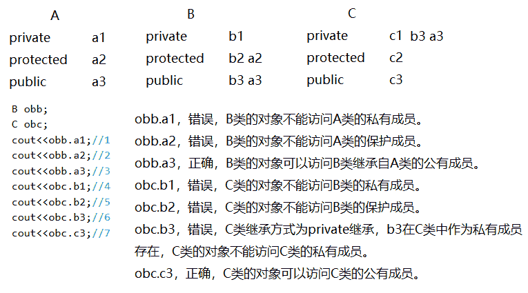
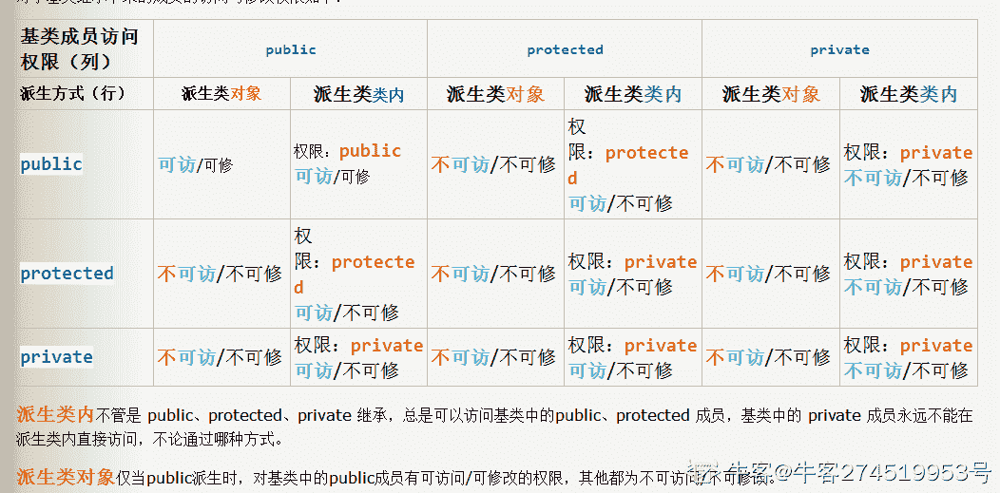
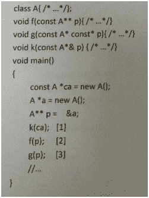
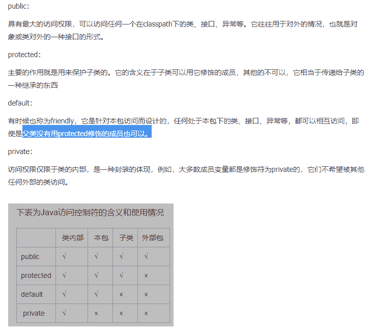
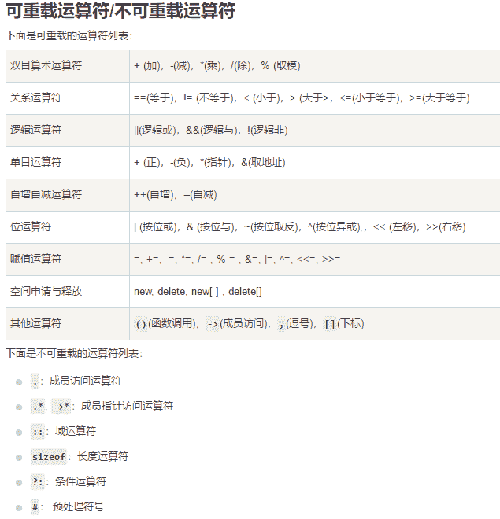

# 摩拜 2018 校招客户端开发笔试卷

## 1

以下操作中，数组比链表速度更快的是 ____

正确答案: A C E   你的答案: 空 (错误)

```cpp
原地逆序
```

```cpp
头部插入
```

```cpp
返回中间节点
```

```cpp
返回头部节点
```

```cpp
选择随机节点
```

本题知识点

摩拜 Java 工程师 C++工程师 iOS 工程师 安卓工程师 运维工程师 前端工程师 算法工程师 PHP 工程师 2018

讨论

[寻找 offer](https://www.nowcoder.com/profile/6035108)

A 选项。 链表就地逆置需要循环 n 次，而数组只需要 n/2 次。 剩下 CE 因为数据随机访问比链表快

编辑于 2018-07-15 21:32:09

* * *

[CrazyLIJingjing](https://www.nowcoder.com/profile/8072462)

链表进行倒序的时候，每俩个节点之间都需要进行指针的重定向，前节点的尾指针需要指向后节点尾指针的指向，而后节点的尾指针需要指向前节点的首部，三步倒置两个节点，后面所有的节点都需要同原理设置，时间复杂度很大。

发表于 2018-07-17 18:25:36

* * *

[猪猪侠 201806261909689](https://www.nowcoder.com/profile/352714298)

//用 C 写一个输入的整数，倒着输出整数的函数，要求用递归方法。
#include<stdio.h>
#include<iostream>
using namespace std;
int sum = 0;
int fall(int a){
    if (a == 0)return sum;

    int c;
    c = a % 10;
    a = a / 10;
    sum = sum + c;
    if (a!=0)
    sum = sum * 10;
    fall(a);

}
int main()
{
    int a;
    bool flag = true;
    cin>>a;
    if (a < 0)
    { 
        a = 0 - a;
    flag = false;
    }
    int b=fall(a);
    if (flag == false) b = 0 - b;
    printf("%d",b);
    system("pause");
}

发表于 2018-07-16 18:54:51

* * *

## 2

关于下列操作复杂度为 O(1)的是（）

正确答案: C D   你的答案: 空 (错误)

```cpp
vector 中插入元素(动态数组)
```

```cpp
set 中查找元素
```

```cpp
hash_map 中查找元素
```

```cpp
deque 尾部删除元素
```

本题知识点

摩拜 C++工程师 2018 C++

讨论

[牛客 9367371 号](https://www.nowcoder.com/profile/9367371)

set 是红黑树 故 logn

发表于 2018-07-14 01:20:25

* * *

[西邮白白](https://www.nowcoder.com/profile/132008587)

vector 插入 ,该位置插入后后面的都要改变 O(n)Set 底层红黑树  O（logn）Hash_map 底层哈希表 O（1）Deque 尾部可以直接修改 O（1）

发表于 2020-10-27 19:48:19

* * *

[牛客 842641340 号](https://www.nowcoder.com/profile/842641340)

A：如果是 push_back 的方式插入的话，时间复杂度的确是 O(1),但是假如以 iterator insert(iterator it,const T& x):这种方式插入的话，它需要先找到指定元素，然后再再它前面添加。因为有查找整个过程，所以最差可能要全部遍历，所以为 O(n)。

编辑于 2021-09-05 22:23:24

* * *

## 3

以下关于内联函数，说法正确的是（）

正确答案: A B   你的答案: 空 (错误)

```cpp
一般用于加快程序执行速度
```

```cpp
可能减小可执行文件大小
```

```cpp
可能增加可执行文件大小
```

```cpp
以上说法都不正确
```

本题知识点

摩拜 C++工程师 2018 C++ C 语言

讨论

[huzang](https://www.nowcoder.com/profile/309620146)

关于 b：当只有一个地方调用了内联函数时，编译器会在调用处将内联函数展开，这样就少了函数的跳转指令，栈的扩展指令，因此可能减小文件的大小

发表于 2018-09-19 22:32:33

* * *

[TheFurtherLo](https://www.nowcoder.com/profile/6649734)

可以把它作为一般的函数一样调用，但是由于内联函数在需要的时候，会像宏一样展开，所以执行速度确比一般函数的执行速度要快。当然，内联函数也有一定的局限性。就是函数中的执行代码不能太多了，如果，内联函数的函数体过大，一般的编译器会放弃内联方式，而采用普通的方式调用函数。(换句话说就是，你使用内联函数，只不过是向编译器提出一个申请，编译器可以拒绝你的申请）这样，内联函数就和普通函数执行效率一样了。

发表于 2018-07-17 09:24:08

* * *

[学而不知](https://www.nowcoder.com/profile/728515803)

ABC 都有可能，只要编译器多处展开就会增加，一处展开就少了部分跳转指令和栈操作

发表于 2021-12-10 18:50:43

* * *

## 4

float x 与“零值”比较的 if 语句为？

正确答案: C   你的答案: 空 (错误)

```cpp
if (x == 0)
```

```cpp
if (x &lt; 0.00001f)
```

```cpp
if (fabs(x) &lt; 0.00001f) 或 if（Math.abs(x) &lt; 0.00001f）
```

```cpp
if (x &gt; -0.00001f)
```

本题知识点

摩拜 Java 工程师 C++工程师 iOS 工程师 安卓工程师 运维工程师 前端工程师 算法工程师 PHP 工程师 安卓工程师 iOS 工程师 摩拜 2018

讨论

[TheFurtherLo](https://www.nowcoder.com/profile/6649734)

不可将浮点变量用“==”或“！=”与任何数字比较。
千万要留意，无论是 float 还是 double 类型的变量，都有精度限制。所以一定要避免将浮点变量用“==”或“！=”与数字比较，应该设法转化成“>=”或“<=”形式。应该用|x-0|<err 来判断，这里|x-0|表示绝对值，err 表示限定误差 

发表于 2018-07-17 09:31:08

* * *

## 5

假设把整数关键字 K Hash 到有 N 个槽的散列表，以下哪些散列函数比较合适（）

正确答案: B   你的答案: 空 (错误)

```cpp
H(K)=k/N
```

```cpp
H(k)=k mod N
```

```cpp
H(k)=1
```

```cpp
H(k)=(k+Random(N))mod N，其中 Random(N)返回 0 到 N-1 的整数
```

本题知识点

摩拜 Java 工程师 C++工程师 iOS 工程师 安卓工程师 运维工程师 前端工程师 算法工程师 PHP 工程师 安卓工程师 iOS 工程师 摩拜 2018

讨论

[CrazyLIJingjing](https://www.nowcoder.com/profile/8072462)

D 选项，考虑之后的 Hash 查找，如果有随机成分存在，查找难度很大

发表于 2018-07-17 18:40:49

* * *

[babble](https://www.nowcoder.com/profile/1825310)

哈希表要均匀分布，哈希函数要尽可能简单

发表于 2018-07-17 17:14:00

* * *

## 6

关于浅复制和深复制的说法，下列说法正确的是

正确答案: A B C D   你的答案: 空 (错误)

```cpp
浅层复制：只复制指向对象的指针，而不复制引用对象本身。
```

```cpp
深层复制：复制引用对象本身。
```

```cpp
如果是浅复制，修改一个对象可能会影响另外一个对象
```

```cpp
如果是深拷贝，修改一个对象不会影响到另外一个对象
```

本题知识点

摩拜 Java 工程师 C++工程师 iOS 工程师 安卓工程师 运维工程师 前端工程师 算法工程师 PHP 工程师 2018 C++

讨论

[邂逅 offer](https://www.nowcoder.com/profile/9741360)

c 选项貌似是错误的吧！浅复制，对同一个对象进行操作，应该是一定会影响把

发表于 2018-07-13 17:24:28

* * *

[livingstone](https://www.nowcoder.com/profile/588125198)

浅拷贝：简单的赋值拷贝操作，其带来的问题：当类内有指针成员变量时，浅拷贝依然会直接赋值，这样释放内存时，会重复释放同一块内存，属于非法操作。深拷贝：在堆区重新申请空间，进行拷贝操作浅层复制：只复制引用对象的指针，不复制引用对象深层赋值：只复制引用对象

发表于 2022-03-17 09:52:25

* * *

[故事而已](https://www.nowcoder.com/profile/211484657)

A B 两项描述不清楚

发表于 2022-02-09 18:38:21

* * *

## 7

下列程序编译时会出现错误，请根据行号选择错误位置( )

```cpp
#include <iostream>
using namespace std;
class A{
  int a1;
protected:
  int a2;
public:
  int a3;
};
class B: public A{
  int b1;
protected:
  int b2;
public:
  int b3;
};
class C:private B{
  int c1;
protected:
  int c2;
public:
  int c3;
};
int main(){
  B obb;
  C obc;
  cout<<obb.a1;//1
  cout<<obb.a2;//2
  cout<<obb.a3;//3
  cout<<obc.b1;//4
  cout<<obc.b2;//5
  cout<<obc.b3;//6
  cout<<obc.c3;//7
  return 0;
}
```

正确答案: A D   你的答案: 空 (错误)

```cpp
1,2
```

```cpp
2,5,7
```

```cpp
3,4,7
```

```cpp
4,5,6
```

本题知识点

摩拜 Java 工程师 C++工程师 iOS 工程师 安卓工程师 运维工程师 前端工程师 算法工程师 PHP 工程师 2018 C++

讨论

[〈(^.^)ノ](https://www.nowcoder.com/profile/1417053)



发表于 2018-07-16 22:03:17

* * *

[sunshineboom](https://www.nowcoder.com/profile/4212464)

对于第 2 个，之前一直没搞懂，仔细研究概念才明白。对于父类中的 protected 成员 a2，通过 public 继承，此时对于子类来说，权限为 protected，这个没问题。但是 protected 权限的定义是：只允许子类及本类的**成员函数**访问，所以并不能像 2 中直接引用。

发表于 2018-07-17 15:04:06

* * *

[牛客 274519953 号](https://www.nowcoder.com/profile/274519953)



发表于 2021-03-22 16:28:57

* * *

## 8

MVC 是一种常见的架构。以下描述错误的是？

正确答案: A B C   你的答案: 空 (错误)

```cpp
只有 Web 系统才能使用 MVC
```

```cpp
只有能够保存正在数据库里面的实体才能称之为模型（Model）
```

```cpp
只有以 HTML 形式显示的页面才是视图（View）
```

```cpp
模型变更之后，只有控制器（Controller）才能驱动视图变更或重新渲染视图
```

本题知识点

摩拜 Java 工程师 C++工程师 iOS 工程师 安卓工程师 运维工程师 前端工程师 算法工程师 PHP 工程师 2018

讨论

[猪猪侠 201806261909689](https://www.nowcoder.com/profile/352714298)

MVC 是一种使用 MVC（Model View Controller 模型-视图-控制器）设计创建 Web 应用程序的模式：
Model（模型）表示应用程序核心（比如数据库记录列表）。
View（视图）显示数据（数据库记录）。
Controller（控制器）处理输入（写入数据库记录）。

发表于 2018-07-16 16:57:37

* * *

## 9

下面（）数据结构常用于函数调用。

正确答案: B   你的答案: 空 (错误)

```cpp
队列
```

```cpp
栈
```

```cpp
链表
```

```cpp
数组
```

本题知识点

摩拜 Java 工程师 C++工程师 iOS 工程师 安卓工程师 运维工程师 前端工程师 算法工程师 PHP 工程师 2018

讨论

[我才不要进公司人才储备](https://www.nowcoder.com/profile/72613845)

当一个函数创建的时候，就会形成一个执行环境，也叫执行上下文，函数执行的时候就会将这个执行上下文压入执行栈（主线程）中去执行，当执行完毕后就会销毁栈（弹出栈），而闭包的话，内部含有外部的引用，所以该函数不会被销毁（弹出），后续有任务的话就继续压入执行栈（主线程）中执行。（这个也可以联想到作用域中以嵌套的方式，要确定当前环境的上级作用域，那就是包含该环境的环境，一级一级往外层，直到全局作用域，而执行栈中的最低端就是全局作用域。）

发表于 2020-03-11 23:23:34

* * *

[猪猪侠 201806261909689](https://www.nowcoder.com/profile/352714298)

堆栈的先入后出式操作顺序适用于函数的嵌套调用，队列先入先出则不适用

发表于 2018-07-16 17:01:23

* * *

## 10

如下代码段，哪种描述是正确的（）

 

正确答案: B   你的答案: 空 (错误)

```cpp
全部正确
```

```cpp
2 错，1,3 正确
```

```cpp
1,2 错，3 正确
```

```cpp
1 正确，2,3,错
```

本题知识点

摩拜 Java 工程师 C++工程师 iOS 工程师 安卓工程师 运维工程师 前端工程师 算法工程师 PHP 工程师 安卓工程师 iOS 工程师 摩拜 2018

讨论

[xxxxxxxxxxxxxxxa](https://www.nowcoder.com/profile/4397117)

c++ 规定 **不可以转化为 const **
但是** 可以转换为 const * const *。(const  A *) const * p 中 *p 不能被改变值，所以防止**转化为 const **的 BUG 发生。

发表于 2018-07-21 17:01:19

* * *

[笨狗欢乐跳](https://www.nowcoder.com/profile/1887346)

普通类型不能绑定到 const 类型上

发表于 2018-07-17 20:28:18

* * *

## 11

以下关于进程和线程描述中，错误的是（）

正确答案: B   你的答案: 空 (错误)

```cpp
进程之间可以并发执行
```

```cpp
创建或撤销进程或者线程时，系统都要为之分配和回收资源
```

```cpp
同一个进程的多个线程之间可以并发执行
```

```cpp
线程是进程的一个执行单元
```

本题知识点

摩拜 Java 工程师 C++工程师 iOS 工程师 安卓工程师 运维工程师 前端工程师 算法工程师 PHP 工程师 安卓工程师 iOS 工程师 摩拜 2018

讨论

[猪猪侠 201806261909689](https://www.nowcoder.com/profile/352714298)

进程是资源分配的基本单位；线程是系统调度的基本单位；多线程不共享：栈，寄存器。

发表于 2018-07-16 17:14:09

* * *

[寻找 offer](https://www.nowcoder.com/profile/6035108)

线程不是资源分配调度的单元。 所以不需要单独再进行资源分配

发表于 2018-07-13 14:44:57

* * *

## 12

以下对于方法覆盖的说法正确的有（）

正确答案: B C D   你的答案: 空 (错误)

```cpp
方法覆盖发生在同一类中
```

```cpp
方法的覆盖发生在子类型中
```

```cpp
方法名一定要一样
```

```cpp
参数类型一定要一样
```

```cpp
返回类型一定要一样
```

```cpp
访问权限只能一样
```

本题知识点

摩拜 Java 工程师 C++工程师 iOS 工程师 安卓工程师 运维工程师 前端工程师 算法工程师 PHP 工程师 2018

讨论

[寻找 offer](https://www.nowcoder.com/profile/6035108)

Override 返回类型可以不一致？？？那还是 Override?这答案有问题吧

发表于 2018-07-13 14:47:31

* * *

[xxxxxxxxxxxxxxxa](https://www.nowcoder.com/profile/4397117)

覆盖的条件：
1\. [基类](https://baike.baidu.com/item/%E5%9F%BA%E7%B1%BB)函数必须是[虚函数](https://baike.baidu.com/item/%E8%99%9A%E5%87%BD%E6%95%B0)（使用 virtual[关键字](https://baike.baidu.com/item/%E5%85%B3%E9%94%AE%E5%AD%97)进行声明）。2.发生覆盖的两个函数要分别位于派生类和基类中。3\. 函数名称与[参数列表](https://baike.baidu.com/item/%E5%8F%82%E6%95%B0%E5%88%97%E8%A1%A8)必须完全相同。其他非 override 的情况，派生类总是屏蔽基类同名函数。

发表于 2018-07-21 17:14:31

* * *

[猪猪侠 201806261909689](https://www.nowcoder.com/profile/352714298)

1、两同原则：同方法名、同参数表 2、子类中的覆盖方法不能使用比父类中被覆盖的方法更严格的访问权限。3、如需使用父类中原有的方法，可使用 super 关键字，该关键字引用了当前类父类的方法。

发表于 2018-07-16 17:16:08

* * *

## 13

HTTP 中 Get 与 Post 的区别中不包含下面哪一项？

正确答案: D   你的答案: 空 (错误)

```cpp
GET 请求的数据会附在 URL 之后，POST 把提交的数据则放置在是 HTTP 包的包体中
```

```cpp
GET 方式提交的数据最多只能是 1024 字节，理论上 POST 没有限制，可传较大量的数据
```

```cpp
在 ASP 中，服务端获取 GET 请求参数用 Request.QueryString，获取 POST 请求参数用 Request.Form
```

```cpp
GET 的安全性要比 POST 的安全性高
```

本题知识点

摩拜 Java 工程师 C++工程师 iOS 工程师 安卓工程师 运维工程师 前端工程师 算法工程师 PHP 工程师 安卓工程师 iOS 工程师 摩拜 2018

讨论

[TheFurtherLo](https://www.nowcoder.com/profile/6649734)

GET 和 POST 的区别：

1\. get 是从服务器上获取数据，post 是向服务器传送数据。 
get 和 post 只是一种传递数据的方式，get 也可以把数据传到服务器，他们的本质都是发送请求和接收结果。只是组织格式和数据量上面有差别，http 协议里面有介绍
  2\. get 是把参数数据队列加到提交表单的 ACTION 属性所指的 URL 中，值和表单内各个字段一一对应，在 URL 中可以看到。post 是通过 HTTP post 机制，将表单内各个字段与其内容放置在 HTML HEADER 内一起传送到 ACTION 属性所指的 URL 地址。用户看不到这个过程。 
因为 get 设计成传输小数据，而且最好是不修改服务器的数据，所以浏览器一般都在地址栏里面可以看到，但 post 一般都用来传递大数据，或比较隐私的数据，所以在地址栏看不到，能不能看到不是协议规定，是浏览器规定的。
3\. 对于 get 方式，服务器端用 Request.QueryString 获取变量的值，对于 post 方式，服务器端用 Request.Form 获取提交的数据。 
没明白，怎么获得变量和你的服务器有关，和 get 或 post 无关，服务器都对这些请求做了封装
  4\. get 传送的数据量较小，不能大于 2KB。post 传送的数据量较大，一般被默认为不受限制。但理论上，IIS4 中最大量为 80KB，IIS5 中为 100KB。 
post 基本没有限制，我想大家都上传过文件，都是用 post 方式的。只不过要修改 form 里面的那个 type 参数
  5\. get 安全性非常低，post 安全性较高。 
如果没有加密，他们安全级别都是一样的，随便一个***都可以把所有的数据监听到。

发表于 2018-07-17 15:53:56

* * *

## 14

在使用 super 和 this 关键字时，以下描述正确的是

正确答案: A   你的答案: 空 (错误)

```cpp
在子类构造方法中使用 super（）显示调用父类的构造方法，super（）必须写在子类构造方法的第一行，否则编译不通过
```

```cpp
super（）和 this（）不一定要放在构造方法内第一行
```

```cpp
this（）和 super（）可以同时出现在一个构造函数中
```

```cpp
this（）和 super（）可以在 static 环境中使用，包括 static 方法和 static 语句块
```

本题知识点

摩拜 Java 工程师 C++工程师 iOS 工程师 安卓工程师 运维工程师 前端工程师 算法工程师 PHP 工程师 安卓工程师 iOS 工程师 摩拜 2018

讨论

[TheFurtherLo](https://www.nowcoder.com/profile/6649734)

this 和 super 在用于构造函数中（一般 this 和 super 后面跟参数是用于构造函数中调用其他构造函数）时，只能是构造函数的第一条语句，因为子类本身就继承了父类的所有方法还有属性，只有在父类对象被构造出来后再执行子类的构造方法的其他语句才是合理得，而 this 为什么也必须写在第一条语句中，是因为可以通过 this 调用其他构造方法，而其他构造方法有可能会有以 super()的形式调用父类构造方法。

2、在子类中重载父类构造方法的时候，如果父类的构造方法时无参数的，可以不必写出 supe();有参数是必须写出的；

发表于 2018-07-17 15:56:58

* * *

[空帆船](https://www.nowcoder.com/profile/3656142)

```cpp
this（）和 super（）满足两个条件
1.必须放在构造方法
2.必须在构造方法第一行
```

发表于 2018-07-13 23:20:25

* * *

## 15

访问修饰符作用范围由大到小是

正确答案: C   你的答案: 空 (错误)

```cpp
private-protected-default-public
```

```cpp
private-default-protected-public
```

```cpp
public-protected-default-private
```

```cpp
public-default-protected-private
```

本题知识点

摩拜 Java 工程师 C++工程师 iOS 工程师 安卓工程师 运维工程师 前端工程师 算法工程师 PHP 工程师 安卓工程师 iOS 工程师 摩拜 2018

讨论

[猪猪侠 201806261909689](https://www.nowcoder.com/profile/352714298)



发表于 2018-07-16 17:24:10

* * *

## 16

TCP 的三次握手过程中，accept 发生在三次握手的哪个阶段？

正确答案: A   你的答案: 空 (错误)

```cpp
三次握手之后
```

```cpp
第一次握手
```

```cpp
第二次握手
```

```cpp
第三次握手
```

本题知识点

摩拜 Java 工程师 C++工程师 iOS 工程师 安卓工程师 运维工程师 前端工程师 算法工程师 PHP 工程师 2018

讨论

[寂静于暖](https://www.nowcoder.com/profile/6461901)

TCP 三次握手之后才建立连接，然后进行数据的传输

发表于 2018-07-13 21:49:15

* * *

## 17

用 C 写一个输入的整数，倒着输出整数的函数，要求用递归方法。

本题知识点

摩拜 Java 工程师 C++工程师 iOS 工程师 安卓工程师 运维工程师 前端工程师 算法工程师 PHP 工程师 模拟 递归 2018

讨论

[zoLZoz](https://www.nowcoder.com/profile/752745645)

importjava.util.Scanner;publicclassMain {    publicstaticvoidmain(String[] args){        Scanner in = newScanner(System.in);        String s = in.next();        if(s.charAt(0)=='-') {            System.out.println("-"+Integer.parseInt(newStringBuffer(s).deleteCharAt(0).reverse().toString()));        }else{            System.out.println(Integer.parseInt(newStringBuffer(s).reverse().toString()));        }    }}

发表于 2018-10-22 18:27:54

* * *

[xxxxxxxxxxxxxxxa](https://www.nowcoder.com/profile/4397117)

```cpp
#include<stdio.h>
int reverse(int num,int tmp){
    if(num == 0)
        return tmp;
    return reverse(num/10,tmp*10+num%10);
}

int reverse_front(int num){
    return num>=0? reverse(num,0):-reverse(-num,0);
}

int main(){
    int num;
    scanf("%d",&num);
    printf("%d\n",reverse_front(num));
}

```

指定用 C 语言，另外有些边界情况未讨论，此递归乃是迭代改过来的。

发表于 2018-07-21 17:57:03

* * *

[牛客 480104259 号](https://www.nowcoder.com/profile/480104259)

```cpp
#include <stdio.h>
#include <cmath>

static bool isNotZero = false;

void reverse(int a) {

    if (a > 0) {

        if (a % 10 == 0) {

            if (isNotZero == false) {
                a = a / 10;
                reverse(a);
            } else {
                printf("%d",a % 10);
                a = a / 10;
                reverse(a);
            }

        } else {
            isNotZero = true;
            printf("%d",a % 10);
            a = a / 10;
            reverse(a);
        }

    } else {
        return;
    }
}

int main () {
    int num;
    scanf("%d",&num);
    if (num < 0) {
        printf("-");
    } 

    reverse(fabs(num));

    return 0;
}

```

发表于 2018-07-17 17:02:04

* * *

## 18

属于网络层协议的是?

正确答案: B C   你的答案: 空 (错误)

```cpp
TCP
```

```cpp
IP
```

```cpp
ICMP
```

```cpp
X.25
```

本题知识点

摩拜 Java 工程师 C++工程师 iOS 工程师 安卓工程师 运维工程师 前端工程师 算法工程师 PHP 工程师 2018

讨论

[笨狗欢乐跳](https://www.nowcoder.com/profile/1887346)

[网络层](https://baike.baidu.com/item/%E7%BD%91%E7%BB%9C%E5%B1%82)协议：IP (IPv4 · IPv6) · ICMP· ICMPv6·IGMP ·IS-IS · IPsec · ARP · RARP 等[传输层](https://baike.baidu.com/item/%E4%BC%A0%E8%BE%93%E5%B1%82)协议：TCP · UDP · TLS · [DCCP](https://baike.baidu.com/item/DCCP) · SCTP · RSVP · OSPF 等[应用层](https://baike.baidu.com/item/%E5%BA%94%E7%94%A8%E5%B1%82)协议：DHCP ·[DNS](https://baike.baidu.com/item/DNS) · FTP · Gopher · HTTP· IMAP4 · IRC · NNTP · XMPP ·POP3 · SIP · SMTP ·SNMP · SSH ·TELNET · RPC · RTCP · RTP ·RTSP· SDP · SOAP · GTP · STUN · NTP· SSDP · BGP · RIP 等

发表于 2018-07-17 21:16:47

* * *

## 19

下面运算符不能被重载的是（）

正确答案: A B D   你的答案: 空 (错误)

```cpp
做用域运算符“::”
```

```cpp
对象成员运算符“.”
```

```cpp
指针成员运算符“->”
```

```cpp
三目运算符“? :”
```

本题知识点

摩拜 C++工程师 2018 C++ C 语言

讨论

[逸扬](https://www.nowcoder.com/profile/2214852)

参考自：[`www.runoob.com/cplusplus/cpp-overloading.html`](http://www.runoob.com/cplusplus/cpp-overloading.html)

发表于 2018-09-02 20:08:43

* * *

[牛客小丑 C](https://www.nowcoder.com/profile/410104169)

带点点的都不重载，记住！！！

编辑于 2021-04-12 15:27:01

* * *

[牛客 992088129 号](https://www.nowcoder.com/profile/992088129)

简而言之，sizeof 和含义点的运算符不能重载

发表于 2020-11-17 14:47:48

* * *

## 20

stl::deque 是一种什么数据类型？

正确答案: A   你的答案: 空 (错误)

```cpp
动态数组
```

```cpp
链表
```

```cpp
堆栈
```

```cpp
树
```

本题知识点

摩拜 Java 工程师 C++工程师 iOS 工程师 安卓工程师 运维工程师 前端工程师 算法工程师 PHP 工程师 2018 C++

讨论

[天天 20180916164662](https://www.nowcoder.com/profile/229190534)

deque 双端队列

发表于 2020-08-12 21:30:43

* * *

[冷板凳要坐够十年](https://www.nowcoder.com/profile/813011277)

双向队列，两端都可以加值删值，动态

发表于 2021-02-08 17:26:34

* * *

## 21

下面关于 const 正确的是（）

正确答案: A C D   你的答案: 空 (错误)

```cpp
欲阻止一个变量被改变，可以使用 const 关键字。
```

```cpp
在定义该 const 变量时，不用将其初始化。
```

```cpp
在一个函数声明中，const 可以修饰形参，表明它是一个输入参数，在函数内部不能改变其值
```

```cpp
对于类的成员函数，有时候必须指定其返回值为 const 类型，以使得其返回值不为“左值”
```

本题知识点

摩拜 C++工程师 2018 C++ C 语言

讨论

[xxxxxxxxxxxxxxxa](https://www.nowcoder.com/profile/4397117)

```cpp
const T & xxx(...)

```

上面这种情况，函数返回值不可以作为左值。而

```cpp
T & xxx(...)
```

这种情况，函数返回值可以作为左值

发表于 2018-07-22 09:21:58

* * *

[Rayfan](https://www.nowcoder.com/profile/516555903)

在定义该 const 变量时，不用将其初始化（默认值）。只能在定义的时候初始化，以后不能再赋值。如果定义的时候未初始化，则以后也不能赋值

发表于 2021-03-03 15:28:38

* * *

[黄微微](https://www.nowcoder.com/profile/132347753)

被 const 指定了的函数的返回值表示为常量，不能再当作变量被赋值（也就是不能出现在“=”的左边充当左值）

发表于 2020-09-30 22:43:42

* * *

## 22

建立 TCP 需要三次握手才能建立，而断开连接则需要几次

正确答案: C   你的答案: 空 (错误)

```cpp
1
```

```cpp
3
```

```cpp
4
```

```cpp
5
```

本题知识点

摩拜 Java 工程师 C++工程师 iOS 工程师 安卓工程师 运维工程师 前端工程师 算法工程师 PHP 工程师 安卓工程师 iOS 工程师 摩拜 2018

## 23

请考虑性能

本题知识点

摩拜 Java 工程师 C++工程师 iOS 工程师 安卓工程师 运维工程师 前端工程师 算法工程师 PHP 工程师 数学 穷举 2018

讨论

[小母牛坐电锯](https://www.nowcoder.com/profile/340967499)

```cpp
#include<stdio.h>
int main()
{
	int i,j,n;
	int count= 0;
	scanf("%d", &n);
	for (i=n-1; i>= 2; i--)
	{
		for (j = 2; j <= i; j++)
		{
			if (i%j == 0)break;
		}
		if (i == j)
			count++;
	}
	printf("%d",count);
	return 0;
}
```

发表于 2022-01-21 11:23:14

* * *

[terasum](https://www.nowcoder.com/profile/848412125)

```cpp
// 简单筛法求素数
#include<iostream>
#include<cstring>
#define MAXN 100001
using namespace std;
bool prim[MAXN] = {true};

int main(int argc, char** argv){
    memset(prim, 1, sizeof(prim));
    prim[0] = false;
    prim[1] = false;
    for(int i = 2; i < MAXN; ++i){
        if(prim[i]){
         for(int j = i*i; j < MAXN; j+=i){
            prim[j] = false;
         }
        }
    }
    int num, count = 0;
    cin>>num;
    for(int i = 2; i <= num; i++){
        if (prim[i]){
            count++;
        }
    }
    cout<<count<<endl;

} 
```

发表于 2018-07-21 23:24:37

* * *

[不问出处](https://www.nowcoder.com/profile/8468593)

| importjava.util.*;publicclassMain{    publicstaticvoidmain(String[] args){        Scanner sc = newScanner(System.in);        intn = sc.nextInt();        //int m = (int)(Math.sqrt(n));        intcount = 0;        if(n<=1)        {            count=0;        }        elseif(n==2)        {            count=1;        }        elseif(n==3)        {            count=2;        }        else        {            for(inti=2;i<n;i++)            {                booleanflag = true;                for(intj=2;j<=(int)(Math.sqrt(i));j++)                {                    if(i%j==0)                    {                        flag = false;                        break;                    }                   // break;                }                if(flag)                {                    count++;                }            }        }        System.out.println(count);    }} |

添加笔记

发表于 2018-07-19 11:02:20

* * *

## 24

已知石头重量数组。将石头分为质量最接近的两组

本题知识点

摩拜 Java 工程师 C++工程师 iOS 工程师 安卓工程师 运维工程师 前端工程师 算法工程师 PHP 工程师 动态规划 2018

讨论

[wise](https://www.nowcoder.com/profile/4382919)

两组最接近的情况为平分，那么我们可以理解成，如何将和的一半填的最满的问题，算是一个 0-1 背包问题吧。importjava.util.*;publicclassMain{    publicstaticvoidmain(String[] args)    {        Scanner scanner = newScanner(System.in);        while(scanner.hasNext())        {            String input = scanner.next();            String[] A = input.split(",");            intn = A.length;            if(n <= 1)            {                System.out.println(input + ",0");            }else{                int[] arr = newint[n];                intsum = 0;                for(inti = 0; i < n ; i++)                {                    arr[i] = Integer.valueOf(A[i]);                    sum += arr[i];                }                inthalf = sum / 2;                int[] dp = newint[half + 1];                intmax = Integer.MIN_VALUE;                for(inti = 0; i < n ; i++)                {                    for(intj = half ; j >= arr[i] ; j--)                    {                        dp[j] = dp[j - arr[i]] + arr[i];                        max = Math.max(max , dp[j]);                    }                }                System.out.println(sum - max + ","+ max);                }        }    }}

发表于 2018-07-14 14:04:41

* * *

[xxxxxxxxxxxxxxxa](https://www.nowcoder.com/profile/4397117)

```cpp
/*
转化为 01 背包问题，背包体积为 10，每个石头的价值为自身的重量，
1\. F[i,v]表示背包恰好为 v 下，前 i 件物品的最大价值
2\. F[i,v]=max{F[i-1,v],F[i-1,v-1]+Ci}
3\. 注意非装满问题 F[0,0..N]=0 F[0..N,0]=0
4\. 扫描数组，找到 F[N,v]中最接近 sum{Ci}/2 的那个
*/

#include<iostream>
#include<vector>
using namespace std;
vector<int> stone_divide(vector<int> & nums){
    vector<int> F(nums.size()+1,0);
    for(int i=1;i<nums.size()+1;++i)
        for(int v=nums.size()+1;v>0;--v)
            F[v]=max(F[v],F[v-1]+nums[i-1]);
    int k=0,sum=0,tmp=9999;
    for(int i=0;i<nums.size();++i)
        sum+=nums[i];
    for(int i=0;i<F.size();++i){
        if(tmp>abs(F[i]-sum/2)){
            tmp=abs(F[i]-sum/2);
            k=i;
        }
    }
    if(F[k]>sum/2)
        return {F[k],sum-F[k]};
    return {sum-F[k],F[k]};
}

int main(void){
    vector<int> nums;
    int tmp;
    char comma;
    while(cin>>tmp){
        nums.push_back(tmp);
        cin>>comma;
    }
    nums=stone_divide(nums);
    cout<<nums[0]<<","<<nums[1]<<endl;  
}

```

当然该方法是有问题的，但在本题的测试用例中，却可以通过。

编辑于 2018-07-22 14:38:58

* * *

[terasum](https://www.nowcoder.com/profile/848412125)

```cpp
#include<iostream>
#include<cstdio>
#include<cstring>
#include<vector>
using namespace std;

int main(int argc, char** argv){
    vector<int> vec;
    int num;
    while(true){
        scanf("%d",&num);
        vec.push_back(num);
        int r = scanf(",");
        if (r == EOF){
            break;
        }
    }
    int sum = 0, a = 0, b = 0;
    int i = 0, j = vec.size() - 1;
    while(i < j && i < vec.size() && j > 0){
        if (a <= b){
            a += vec[i];
            i++;
        }else{
            b += vec[j];
            j--;
        }
    }
    if(a >= b){
        cout<<a<<","<<b<<endl;
    }else{
        cout<<b<<","<<a<<endl;
    }

} 
```

编辑于 2018-07-21 23:23:45

* * *