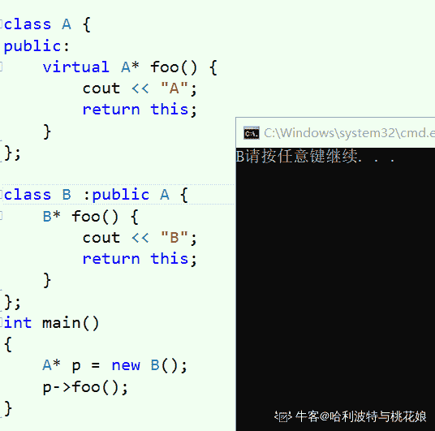

# 摩拜 2018 校招客户端开发(iOS)笔试卷

## 1

以下操作中，数组比链表速度更快的是 ____

正确答案: A C E   你的答案: 空 (错误)

```cpp
原地逆序
```

```cpp
头部插入
```

```cpp
返回中间节点
```

```cpp
返回头部节点
```

```cpp
选择随机节点
```

本题知识点

摩拜 Java 工程师 C++工程师 iOS 工程师 安卓工程师 运维工程师 前端工程师 算法工程师 PHP 工程师 2018

## 2

关于下列操作哪个复杂度为 O(1)?

正确答案: C D   你的答案: 空 (错误)

```cpp
vector 中插入元素的最差情况(动态数组)
```

```cpp
set 中查找元素
```

```cpp
hash_map 中查找元素
```

```cpp
deque 尾部删除元素
```

本题知识点

摩拜 Java 工程师 C++工程师 iOS 工程师 安卓工程师 运维工程师 前端工程师 算法工程师 PHP 工程师 2018 C++

讨论

[远神 _](https://www.nowcoder.com/profile/503313160)

deque 删除尾部元素 hash_map 底层是 hash_table 哈希结构则 O(1)set 底层是红黑树，时间复杂度就是树高 O(log2N)vector 最差是 O(N)

发表于 2021-03-22 17:38:12

* * *

[飞云残剑](https://www.nowcoder.com/profile/280878760)

set 由平衡二叉树实现，因此时间复杂度 O(logn)

发表于 2021-03-02 21:43:21

* * *

[马角的逆袭](https://www.nowcoder.com/profile/907409428)

hashmap 出现冲突也为 o(1)吗？

发表于 2018-07-28 13:52:05

* * *

## 3

以下关于内联函数，说法正确的是：

正确答案: A B C   你的答案: 空 (错误)

```cpp
一般用于加快程序执行速度
```

```cpp
可能减小可执行文件大小
```

```cpp
可能增加可执行文件大小
```

```cpp
以上说法都不正确
```

本题知识点

摩拜 Java 工程师 C++工程师 iOS 工程师 安卓工程师 运维工程师 前端工程师 算法工程师 PHP 工程师 2018 C++

讨论

[牛客 900273661 号](https://www.nowcoder.com/profile/900273661)

做内联一般来说用的比较多。肯定有多个地方用。为啥能减少大小

发表于 2020-08-16 09:36:51

* * *

[我还是太年轻了](https://www.nowcoder.com/profile/8679511)

深度探索 c++对象模型里面专门提到了 inline 函数被调用多次可能产生大量扩展码，使程序大小暴涨。这题 bc 一起选的话问了个寂寞

发表于 2021-09-03 20:23:00

* * *

[Joker2720](https://www.nowcoder.com/profile/210202720)

内联只是建议性的关键字，通过减少函数调用开销来加快程序执行速度。但是，内联一旦使用会导致减小或增大可执行文件大小，加快或减慢程序执行速度。因此，编译器会根据实际情况做出决定。

编辑于 2022-02-23 11:59:52

* * *

## 4

float x 与“零值”比较的 if 语句为？

正确答案: C   你的答案: 空 (错误)

```cpp
if (x == 0)
```

```cpp
if (x &lt; 0.00001f)
```

```cpp
if (fabs(x) &lt; 0.00001f) 或 if（Math.abs(x) &lt; 0.00001f）
```

```cpp
if (x &gt; -0.00001f)
```

本题知识点

摩拜 Java 工程师 C++工程师 iOS 工程师 安卓工程师 运维工程师 前端工程师 算法工程师 PHP 工程师 iOS 工程师 摩拜 2018

## 5

假设把整数关键字 K Hash 到有 N 个槽的散列表，以下哪些散列函数比较合适（）

正确答案: B   你的答案: 空 (错误)

```cpp
H(K)=k/N
```

```cpp
H(k)=k mod N
```

```cpp
H(k)=1
```

```cpp
H(k)=(k+Random(N))mod N，其中 Random(N)返回 0 到 N-1 的整数
```

本题知识点

摩拜 Java 工程师 C++工程师 iOS 工程师 安卓工程师 运维工程师 前端工程师 算法工程师 PHP 工程师 iOS 工程师 摩拜 2018

## 6

下面哪些属于 UITableViewDelegate 协议的方法？

正确答案: C   你的答案: 空 (错误)

```cpp
tableView:cellForRowAtIndexPath:
```

```cpp
tableView:numberOfRowsInSection:
```

```cpp
tableView:didSelectRowAtIndexPath:
```

```cpp
numberOfSectionsInTableView:
```

本题知识点

摩拜 Java 工程师 C++工程师 iOS 工程师 安卓工程师 运维工程师 前端工程师 算法工程师 PHP 工程师 iOS 工程师 摩拜 2018

## 7

关于浅复制和深复制的说法，下列说法正确的是

正确答案: A B C D   你的答案: 空 (错误)

```cpp
浅层复制：只复制指向对象的指针，而不复制引用对象本身。
```

```cpp
深层复制：复制引用对象本身。
```

```cpp
如果是浅复制，修改一个对象可能会影响另外一个对象
```

```cpp
如果是深拷贝，修改一个对象不会影响到另外一个对象
```

本题知识点

摩拜 Java 工程师 C++工程师 iOS 工程师 安卓工程师 运维工程师 前端工程师 算法工程师 PHP 工程师 2018

## 8

下列程序编译时会出现错误，请根据行号选择错误位置( )

```cpp
#include <iostream>
using namespace std;
class A{
  int a1;
protected:
  int a2;
public:
  int a3;
};
class B: public A{
  int b1;
protected:
  int b2;
public:
  int b3;
};
class C:private B{
  int c1;
protected:
  int c2;
public:
  int c3;
};
int main(){
  B obb;
  C obc;
  cout<<obb.a1;//1
  cout<<obb.a2;//2
  cout<<obb.a3;//3
  cout<<obc.b1;//4
  cout<<obc.b2;//5
  cout<<obc.b3;//6
  cout<<obc.c3;//7
  return 0;
}
```

正确答案: A D   你的答案: 空 (错误)

```cpp
1,2
```

```cpp
2,5,7
```

```cpp
3,4,7
```

```cpp
4,5,6
```

本题知识点

摩拜 Java 工程师 C++工程师 iOS 工程师 安卓工程师 运维工程师 前端工程师 算法工程师 PHP 工程师 2018 C++

讨论

[殊不知](https://www.nowcoder.com/profile/815431659)

A: public:a3 protected:a2 private:a1 B:(公共继承，权限不变) public:b3、a3 protected:b2、a2 private:b1 继承但子类无法访问的属性:a1 C:(私有继承，保护权限和公共权限都变为私有) public:c3 protected:c2 private:c1、b3、a3、b2、a2 继承但子类无法访问的属性:b1、a1 注: 1.除 pubilic 外，其余在类外均不可访问 2.子类不能访问父类的私有成员变量，要想访问，可以调用父类中的公共成员函数

发表于 2020-08-11 17:06:49

* * *

[进阶中的牛客人](https://www.nowcoder.com/profile/450066322)

考察基类在派生类中的访问属性：1.  对用公用基类来说——私有成员不可访问，公用成员还是公用的，保护成员还是受保护；2\. 对于私有基类来说——私有成员不可访问，公用成员变成私用，受保护成员变成私用。因此 1 错，obb 是类 B 的对象，B 是 A 的共有继承，但是 a1 是 A 的私有成员，因此 obb 无法访问 a1;2 错，a2 是受保护属性，类外不能访问；4 错，obc 是类 C 的对象，C 是 B 的私有继承，b1 是 B 的私有成员，obc 无法访问；5 错， b2 是 B 的受保护成员，在 C 中成了私有成员，类外无法访问；6 错， b3 是 B 的公有成员，在 C 中成了私有成员，类外无法访问；

编辑于 2021-03-15 10:27:44

* * *

[风不止](https://www.nowcoder.com/profile/980278901)

类的默认属性是 private, 结构体的默认属性是 public

发表于 2020-11-03 12:07:34

* * *

## 9

MVC 是一种常见的架构。以下描述错误的是？

正确答案: A B C   你的答案: 空 (错误)

```cpp
只有 Web 系统才能使用 MVC
```

```cpp
只有能够保存正在数据库里面的实体才能称之为模型（Model）
```

```cpp
只有以 HTML 形式显示的页面才是视图（View）
```

```cpp
模型变更之后，只有控制器（Controller）才能驱动视图变更或重新渲染视图
```

本题知识点

摩拜 Java 工程师 C++工程师 iOS 工程师 安卓工程师 运维工程师 前端工程师 算法工程师 PHP 工程师 2018 HTML

讨论

[捌块腹肌](https://www.nowcoder.com/profile/973457488)

任何系统都可以使用 mvc 架构，mvc 其实是一种思想，不止系统可以使用，比如家用电器甚至商场管理模式等等，都可以是 mvc 这种思想，我在前端这块是这样理解 mvc 的。m，model，模型，相当于业务逻辑 v， view， 视图，相当于网页 c，controller， 控制器， 相当于页面中的交互我甚至可以这样理解，控制器就相当于触发事件的 button 等，model 就相当于触发事件后执行的那些 js 代码，view 就相当于代码执行完之后渲染出的页面。基于这种理解 mvc 的方式来看这个题目：

```cpp
只有 Web 系统才能使用 MVC   // 这明显错误,任何系统都可以使用 MVC
只有能够保存正在数据库里面的实体才能称之为模型（Model） // MVC 是中思想,不止保存在数据库里的数据才能称为模型
只有以 HTML 形式显示的页面才是视图（View） // 同上,程序中的交互界面也可以是视图
模型变更之后，只有控制器（Controller）才能驱动视图变更或重新渲染视图 // 是的
```

我理解的特别浅,甚至没有理解正确,如果有错误的地方希望大佬们指正

发表于 2021-03-11 09:47:48

* * *

[点点 201903241048541](https://www.nowcoder.com/profile/828681553)

任何系统都可以使用 MVC 的设计理念； 模型层里面放的是业务逻辑 视图层有很多表现形式

发表于 2019-07-04 09:18:19

* * *

[牛客 589890733 号](https://www.nowcoder.com/profile/589890733)

文字游戏 a，桌面应用，安卓应用都可以 b，数据可以放在文件里 c，如果是桌面应用的话，视图就是 windows 窗口

发表于 2022-02-03 17:33:45

* * *

## 10

下面（）数据结构常用于函数调用。

正确答案: B   你的答案: 空 (错误)

```cpp
队列
```

```cpp
栈
```

```cpp
链表
```

```cpp
数组
```

本题知识点

摩拜 Java 工程师 C++工程师 iOS 工程师 安卓工程师 运维工程师 前端工程师 算法工程师 PHP 工程师 iOS 工程师 摩拜 2018

## 11

什么是 key window？

正确答案: C   你的答案: 空 (错误)

```cpp
App 中唯一的那个 UIWindow 对象
```

```cpp
可以指定一个 key 的 UIWindow
```

```cpp
可接收到键盘输入等事件的 UIWindow
```

```cpp
不可以隐藏的那个 UIWindow 对象
```

本题知识点

摩拜 Java 工程师 C++工程师 iOS 工程师 安卓工程师 运维工程师 前端工程师 算法工程师 PHP 工程师 2018

## 12

```cpp
  UIViewController 在显示过程中，各个方法的调用顺序是
```

正确答案: A   你的答案: 空 (错误)

```cpp
init-&gt;viewDidLoad-&gt;viewDidAppear-&gt;viewDidUnload
```

```cpp
init-&gt;viewDidAppear-&gt;viewDidLoad-&gt;viewDidUnload
```

```cpp
init-&gt;viewDidLoad-&gt;viewDidUnload -&gt;viewDidAppear
```

```cpp
init-&gt;viewDidAppear-&gt;viewDidUnload-&gt;viewDidLoad
```

本题知识点

摩拜 Java 工程师 C++工程师 iOS 工程师 安卓工程师 运维工程师 前端工程师 算法工程师 PHP 工程师 iOS 工程师 摩拜 2018

## 13

```cpp
  在 UIKit 中，frame 与 bounds 的区别是
```

正确答案: C   你的答案: 空 (错误)

```cpp
frame 是 bounds 的别名
```

```cpp
frame 是 bounds 的继承类
```

```cpp
frame 的参考系是父视图坐标，bounds 的参考系是自身的坐标
```

```cpp
frame 的参考系是自身坐标，bounds 的参考系是父视图的坐标
```

本题知识点

摩拜 Java 工程师 C++工程师 iOS 工程师 安卓工程师 运维工程师 前端工程师 算法工程师 PHP 工程师 iOS 工程师 摩拜 2018

## 14

```cpp
使用 imageNamed 方法创建 UIImage 对象时，与普通的 init 方法有什么区别？
```

正确答案: C   你的答案: 空 (错误)

```cpp
没有区别，只是为了方便
```

```cpp
imageNamed 方法只是创建了一个指针，没有分配其他内存
```

```cpp
imageNamed 方法将图片加载到内存中后不再释放
```

```cpp
imageNamed 方法将使用完图片后立即释放
```

本题知识点

摩拜 Java 工程师 C++工程师 iOS 工程师 安卓工程师 运维工程师 前端工程师 算法工程师 PHP 工程师 2018

## 15

```cpp
 使用 protocol 时，声明一组可选择实现与否的函数，需要在声明的前一行加上：
```

正确答案: B   你的答案: 空 (错误)

```cpp
@required
```

```cpp
@optional
```

```cpp
@interface
```

```cpp
@protocol
```

本题知识点

摩拜 Java 工程师 C++工程师 iOS 工程师 安卓工程师 运维工程师 前端工程师 算法工程师 PHP 工程师 iOS 工程师 摩拜 2018

## 16

```cpp
在没有 navigationController 的情况下，要从一个 ViewController 切换到另一
个 ViewController 应该
```

正确答案: D   你的答案: 空 (错误)

```cpp
[self.navigationController pushViewController:nextViewController animated:YES];
```

```cpp
[self.view addSubview:nextViewController.view];
```

```cpp
[self pushViewController:nextViewController animated:YES];
```

```cpp
[self presentModalViewController:nextViewController animated:YES];
```

本题知识点

摩拜 Java 工程师 C++工程师 iOS 工程师 安卓工程师 运维工程师 前端工程师 算法工程师 PHP 工程师 iOS 工程师 摩拜 2018

## 17

```cpp
Objective-C 有私有方法吗？有私有变量吗？
```

正确答案: A   你的答案: 空 (错误)

```cpp
有私有方法和私有变量
```

```cpp
没有私有方法也没有私有变量
```

```cpp
没有私有方法，有私有变量
```

```cpp
有私有方法，没有私有变量
```

本题知识点

摩拜 Java 工程师 C++工程师 iOS 工程师 安卓工程师 运维工程师 前端工程师 算法工程师 PHP 工程师 2018

## 18

下面对 category 描述不正确的是

正确答案: B   你的答案: 空 (错误)

```cpp
category 可以添加新的方法
```

```cpp
category 可以删除修改之前的方法
```

```cpp
将类的实现分散到多个不同文件或多个不同框架中
```

```cpp
创建对私有方法的前向引用
```

本题知识点

摩拜 Java 工程师 C++工程师 iOS 工程师 安卓工程师 运维工程师 前端工程师 算法工程师 PHP 工程师 iOS 工程师 摩拜 2018

## 19

如下代码段，哪种描述是正确的（）

 

正确答案: B   你的答案: 空 (错误)

```cpp
全部正确
```

```cpp
2 错，1,3 正确
```

```cpp
1,2 错，3 正确
```

```cpp
1 正确，2,3,错
```

本题知识点

摩拜 C++工程师 2018 C++ C 语言

讨论

[来一个熊抱吧](https://www.nowcoder.com/profile/228567234)

1 对，是一个简单的引用传参。这个题关键是要理解 2 为什么错了，用 visual studio 编译报错原因是无法从“T**”转化为"const T**"。原因如下：**C++不允许从 const T*转换为 T*,除非使用 const_cast 显示地转除 const 限定符**。考虑一个情形：const int d = 0;const int*c = &d;int e = 1;int *f = &eint **b = &f;const int **a = b;**//我们假设可以编译通过***a = c;**// 这句是对的，因为 c 是 const int*型，*a 也是 const int *型**乍一看没有问题，但是因为用 b 初始化了 a，修改*a 也就修改了*b,此时*a 和*b 都指向了 c！再看 c 是 const int*,而*b 是 int*型！间接导致了从 const int*型到 int *型的转换！是不是就破坏了上面加粗的规则！**所以 int**不能转换为 const int**!!!** 如果理解了上述过程，也就能明白为什么 3 是对的了，如果把 a 定义为 const int * const *a = b; 自然也就不能改变*a 的值，这句*a = c 就错了，所以不会出现上述破坏规则的情况。（ 当然，3 理解成传参的时候顶层 const 可以忽略，底层 const 必须保持一致或者可以转换也能说的过去，转换的意思是非 const 量可以转换成 const）

编辑于 2020-09-16 17:27:43

* * *

[Hardies](https://www.nowcoder.com/profile/325793180)

1：const A*&p 形参限定的是 A*的内容，ca 刚好限定了 A*指向的内容。2 错误点：首先，p 是一个二级指针，且指向是 A*，根据题目给的信息，A* 指向的内容是可修改的，但是 f()函数中的形参 const A** p 的意思就是 p 的指向可以改，A*的指向也可以改，但是 A*指向的内容不可更改，参数转换出错，所以编译是不通过的。3：g(const A* const* p) 其实左边的 const 是没有实际意义的，const 限定的是*A 的指向，并没有限定*A 指向的内容，和参数 p 是刚好匹配的

发表于 2020-09-11 11:14:39

* * *

[佚](https://www.nowcoder.com/profile/822631024)

题目是错的图中的代码,A**p = &a 这一句压根就无法过编.再问后面的是否正确没什么意义

发表于 2021-02-19 21:00:28

* * *

## 20

以下关于进程和线程描述中，错误的是（）

正确答案: B   你的答案: 空 (错误)

```cpp
进程之间可以并发执行
```

```cpp
创建或撤销进程或者线程时，系统都要为之分配和回收资源
```

```cpp
同一个进程的多个线程之间可以并发执行
```

```cpp
线程是进程的一个执行单元
```

本题知识点

摩拜 Java 工程师 C++工程师 iOS 工程师 安卓工程师 运维工程师 前端工程师 算法工程师 PHP 工程师 iOS 工程师 摩拜 2018

## 21

以下对于方法覆盖的说法正确的有（）

正确答案: B C D   你的答案: 空 (错误)

```cpp
方法覆盖发生在同一类中
```

```cpp
方法的覆盖发生在子类型中
```

```cpp
方法名一定要一样
```

```cpp
参数类型一定要一样
```

```cpp
返回类型一定要一样
```

```cpp
访问权限只能一样
```

本题知识点

摩拜 Java 工程师 C++工程师 iOS 工程师 安卓工程师 运维工程师 前端工程师 算法工程师 PHP 工程师 2018 C++

讨论

[我是小黄啊](https://www.nowcoder.com/profile/275977704)

1.重载    函数重载，运算符重载。
    指**相同作用域**内，函数名称相同，参数列表不同（参数个数、参数类型，参数顺序），返回值可相同可不同。重写（覆盖）2.重写    子类覆盖父类的方法，派生类重新定义基类的虚函数。**参数列表相同，返回值相同**。**    或者！！协变****，**基类中返回的是基类的指针或引用，可以修改为返回派生类的指针或引用。3.重定义（隐藏）    派生类中重新定义了基类中的某个函数，这将会隐藏掉基类中的该函数【即不能通过派生类对象调用基类的那个函数了】。    重定义分两种：①重定义的函数参数列表与基类不同，那么无论基类函数是不是 virtual 函数都会被隐藏。
                            ②重定义的函数参数列表与基类相同，那么只有基类是非 virtual 函数才会被隐藏。

发表于 2021-04-02 10:02:58

* * *

[哈利波特与桃花娘](https://www.nowcoder.com/profile/501696196)

实际上 E 是错的，返回类型并不需要一样。

编辑于 2020-10-07 19:10:09

* * *

[alert1231](https://www.nowcoder.com/profile/233916655)

方法覆盖
在类继承中，子类可以修改从父类继承来的行为，也就是说子类能创建一个与父类方法有不同功能的方法，但具有相同的：名称、 返回类型、 参数列表。个人感觉应该选择 BCDE

发表于 2020-09-10 15:57:52

* * *

## 22

HTTP 中 Get 与 Post 的区别中不包含下面哪一项？

正确答案: D   你的答案: 空 (错误)

```cpp
GET 请求的数据会附在 URL 之后，POST 把提交的数据则放置在是 HTTP 包的包体中
```

```cpp
GET 方式提交的数据最多只能是 1024 字节，理论上 POST 没有限制，可传较大量的数据
```

```cpp
在 ASP 中，服务端获取 GET 请求参数用 Request.QueryString，获取 POST 请求参数用 Request.Form
```

```cpp
GET 的安全性要比 POST 的安全性高
```

本题知识点

摩拜 Java 工程师 C++工程师 iOS 工程师 安卓工程师 运维工程师 前端工程师 算法工程师 PHP 工程师 2018

## 23

在使用 super 和 this 关键字时，以下描述正确的是

正确答案: A   你的答案: 空 (错误)

```cpp
在子类构造方法中使用 super（）显示调用父类的构造方法，super（）必须写在子类构造方法的第一行，否则编译不通过
```

```cpp
super（）和 this（）不一定要放在构造方法内第一行
```

```cpp
this（）和 super（）可以同时出现在一个构造函数中
```

```cpp
this（）和 super（）可以在 static 环境中使用，包括 static 方法和 static 语句块
```

本题知识点

摩拜 Java 工程师 C++工程师 iOS 工程师 安卓工程师 运维工程师 前端工程师 算法工程师 PHP 工程师 iOS 工程师 摩拜 2018

## 24

访问修饰符作用范围由大到小是

正确答案: C   你的答案: 空 (错误)

```cpp
private-protected-default-public
```

```cpp
private-default-protected-public
```

```cpp
public-protected-default-private
```

```cpp
public-default-protected-private
```

本题知识点

摩拜 Java 工程师 C++工程师 iOS 工程师 安卓工程师 运维工程师 前端工程师 算法工程师 PHP 工程师 iOS 工程师 摩拜 2018

## 25

TCP 的三次握手过程中，accept 发生在三次握手的哪个阶段？

正确答案: A   你的答案: 空 (错误)

```cpp
三次握手之后
```

```cpp
第一次握手
```

```cpp
第二次握手
```

```cpp
第三次握手
```

本题知识点

摩拜 Java 工程师 C++工程师 iOS 工程师 安卓工程师 运维工程师 前端工程师 算法工程师 PHP 工程师 iOS 工程师 摩拜 2018

## 26

用 C 写一个输入的整数，倒着输出整数的函数，要求用递归方法。

本题知识点

摩拜 Java 工程师 C++工程师 iOS 工程师 安卓工程师 运维工程师 前端工程师 算法工程师 PHP 工程师 模拟 递归 2018

讨论

[华科平凡](https://www.nowcoder.com/profile/4939096)

python

```cpp
a = input()
res=(a[::-1].lstrip("0") if "-" not in a else "-" + a[1::][::-1].lstrip("0"))
print(res if res else "0")
```

如果尾数有 0，要把它去掉，（例如 200 翻转以后为 002）；也要注意特殊情况(例如输入为 0 去掉后就为空了)。

发表于 2019-02-24 11:58:55

* * *

[喜欢 ctrl 的 cxk](https://www.nowcoder.com/profile/261307690)

```cpp
#include <bits/stdc++.h>
using namespace std;

int main()
{
    string n;
    cin >> n;
    if(n[0] == '-')
    {
        cout << "-";
        n = n.substr(1,n.length());
    }
    reverse(n.begin(), n.end());   //反转字符串
    cout << atoi(n.c_str());    //将 string 型强制转换成 int 型
    return 0;
}
```

C++和 Python 求解，就是不用题目规定的 C 语言递归，皮这一下很开心。 

```cpp
n = input()
if n[0] == '-':
    print('-'+str(int(n[len(n):0:-1])))  #先强制转换成 int 防止数字 0 开头
else:
    print(int(n[::-1]))

```

编辑于 2019-01-10 13:46:01

* * *

[勇敢牛牛，不怕困难！](https://www.nowcoder.com/profile/840813925)

```cpp
#include <stdio.h>
#include <stdlib.h>

int main(void) {
  int n;
  scanf("%d", &n);
  int ans = 0;
  while (n) {
    ans = ans * 10 + n % 10;
    n /= 10;
  }
  printf("%d", ans);
  return 0;
}
```

发表于 2021-07-09 11:57:13

* * *

## 27

属于网络层协议的是?

正确答案: B C   你的答案: 空 (错误)

```cpp
TCP
```

```cpp
IP
```

```cpp
ICMP
```

```cpp
X.25
```

本题知识点

摩拜 Java 工程师 C++工程师 iOS 工程师 安卓工程师 运维工程师 前端工程师 算法工程师 PHP 工程师 2018

## 28

下面哪些运算符不能被重载？

正确答案: A B D   你的答案: 空 (错误)

```cpp
做用域运算符“::”
```

```cpp
对象成员运算符“.”
```

```cpp
指针成员运算符“-&gt;”
```

```cpp
三目运算符“? :”
```

本题知识点

摩拜 Java 工程师 C++工程师 iOS 工程师 安卓工程师 运维工程师 前端工程师 算法工程师 PHP 工程师 2018 C++

讨论

[朝如晨露 _](https://www.nowcoder.com/profile/986956795)

基本都可以重载，不能重载的只有少数 5 个：成员运算符“.”、指针运算符“*”、作用域运算符“::”、“sizeof”、条件运算符“?:”

发表于 2020-12-18 09:23:16

* * *

[十一 1011](https://www.nowcoder.com/profile/195527855)

C 选项我看到的是：

```cpp
指针成员运算符“-&gt;”
里面的&gt 是<号，"->"是可以被重载的，".*"不可以
共有 5 个运算符不能被重载，分别如下： 
```

发表于 2021-04-17 15:25:12

* * *

[哈利波特与桃花娘](https://www.nowcoder.com/profile/501696196)

所以 C 为什么不选，“.*”成员指针运算符不可以重载的呀！

发表于 2020-10-01 16:54:48

* * *

## 29

stl::deque 是一种什么数据类型？

正确答案: A   你的答案: 空 (错误)

```cpp
动态数组
```

```cpp
链表
```

```cpp
堆栈
```

```cpp
树
```

本题知识点

摩拜 Java 工程师 C++工程师 iOS 工程师 安卓工程师 运维工程师 前端工程师 算法工程师 PHP 工程师 iOS 工程师 摩拜 2018

## 30

下面关于 const 正确的是？

正确答案: A C D   你的答案: 空 (错误)

```cpp
欲阻止一个变量被改变，可以使用 const 关键字。
```

```cpp
在定义该 const 变量时，不用将其初始化。
```

```cpp
在一个函数声明中，const 可以修饰形参，表明它是一个输入参数，在函数内部不能改变其值
```

```cpp
对于类的成员函数，有时候必须指定其返回值为 const 类型，以使得其返回值不为“左值”
```

本题知识点

摩拜 Java 工程师 C++工程师 iOS 工程师 安卓工程师 运维工程师 前端工程师 算法工程师 PHP 工程师 2018 C++

讨论

[Cpp 学渣本渣](https://www.nowcoder.com/profile/199461854)

这里对函数返回值使用 const 的目的在于限制不能将函数调用表达式作为左值使用。例如有如下函数： int & min ( int &i, int &j); 可以对函数调用进行赋值，因为它返回的是左值： min ( a , b )=4; 但是，如果对函数的返回值限定为 const 的，即丁奕：const int & min ( int & i, int &j ); 那么，就不能对 min ( a, b ) 调用进行赋值了。

发表于 2020-12-22 01:39:48

* * *

[C++20 单推人](https://www.nowcoder.com/profile/492657974)

这个 D 选项只对了一半，指定返回值为 const 的类型，可以避免他被修改，但是它还是丁丁真真的左值。比如 const node& f()，可以做到只返回引用不返回值提高效率，同时不能再改变返回值，但他还是有地址的左值

发表于 2022-02-17 19:52:33

* * *

[123123213121](https://www.nowcoder.com/profile/73464803)

C++必须初始化 const 修饰的变量，除非是 extern 修饰的变量 C 中如果不初始化 const 常量会警告，CPP 中会报错

发表于 2021-10-05 16:37:48

* * *

## 31

建立 TCP 需要三次握手才能建立，而断开连接则需要几次

正确答案: C   你的答案: 空 (错误)

```cpp
1
```

```cpp
3
```

```cpp
4
```

```cpp
5
```

本题知识点

摩拜 Java 工程师 C++工程师 iOS 工程师 安卓工程师 运维工程师 前端工程师 算法工程师 PHP 工程师 2018

## 32

请考虑性能

本题知识点

摩拜 Java 工程师 C++工程师 iOS 工程师 安卓工程师 运维工程师 前端工程师 算法工程师 PHP 工程师 数学 穷举 2018

讨论

[华科平凡](https://www.nowcoder.com/profile/4939096)

python 解法

使用 **普通筛选法--埃拉托斯特尼筛法**
先简单说一下原理：
基本思想：素数的倍数一定不是素数
实现方法：用一个长度为 N+1 的数组保存信息（0 表示素数，1 表示非素数），先假设所有的数都是素数（初始化为 0），从第一个素数 2 开始，把 2 的倍数都标记为非素数（置为 1），一直到大于 N；然后进行下一趟，找到 2 后面的下一个素数 3，进行同样的处理，直到最后，数组中依然为 0 的数即为素数。
如果 n*n > 范围最大值就跳出。

```cpp
import math
def countPrime(N):
    n = int(math.sqrt(N) + 1)
    arr = [True] * (N+1)
    for i in range(2, n):
        for j in range(2, N):
            if i * j <= N:
                arr[i * j] = False
            else:
                break
    return sum(arr) - 2
print(countPrime(int(input())))
```

编辑于 2019-03-19 22:48:53

* * *

[奋斗之路不堵车](https://www.nowcoder.com/profile/603497382)

解题思路：1.读入整形数据 N,初始化计算质数的数据 count=0,从 2-N 循环判断质数是否存在，若有质数存在，则 count++;2.判断质数的函数：i:2-sqrt(x)循环处理，若存在 i 的取值满足 x%i==0,则该 x 不是素数。C++代码实现：#include<iostream>#include<cmath>
using namespace std;
bool isPrimer(int x);
int main()
{
    int N;
    while(cin>>N){
        int count=0;
        for(int i=2;i<N;i++){
            if(isPrimer(i))
                count++;
        }
        cout<<count<<endl;
    }
    return 0;
}
bool isPrimer(int x)
{
    bool flag=true;
    for(int i=2;i<=sqrt(x);i++){
        if(x%i==0)
            flag=false;
    }
    return flag;
}

发表于 2019-09-13 09:51:32

* * *

[向宇回桌](https://www.nowcoder.com/profile/520872)

```cpp
import java.math.BigInteger;
import java.util.*;

public class Main {
    private static final int N_MAX = 105;
    private static StringBuilder sb = new StringBuilder();
    private static ArrayList<Integer> primers = new ArrayList<>();
    public static void main(String[] args) {
        Scanner sc = new Scanner(System.in);
        int n = sc.nextInt();
        int count = 0;
        for (int i=2; i<n; i++) {
            if (judge(i)) count++;
        }
        System.out.println(count);
    }

    private static boolean judge(int n) {
        if (n == 0) { return false;};
        for (Integer p: primers) {
           if ( n % p == 0) return false;
        }
        primers.add(n);
        return true;
    }

}

```

发表于 2019-02-08 11:10:23

* * *

## 33

已知石头重量数组。将石头分为质量最接近的两组

本题知识点

摩拜 Java 工程师 C++工程师 iOS 工程师 安卓工程师 运维工程师 前端工程师 算法工程师 PHP 工程师 动态规划 2018

讨论

[chorifa](https://www.nowcoder.com/profile/262089004)

```cpp
// 更新:下边这种放砝码的思路是不对的，其本质是贪心，这道题应该使用动态规划
// 测试样例 9,8,7,5,3 正确答案是 16,16，贪心得到的答案是 17,15
// 放砝码的思路
import java.io.*;
import java.util.Arrays;
public class Main{
    public static void main(String[] args) throws IOException{
        BufferedReader br = new BufferedReader(new InputStreamReader(System.in));
        String[] strs = br.readLine().split(",");
        int[] arr = new int[strs.length];
        for(int i = 0; i < arr.length; i++)
            arr[i] = Integer.parseInt(strs[i]);
        Arrays.sort(arr);
        int left = 0, right = 0;
        // 从大到小取数
        for(int i = arr.length-1; i >= 0; i--){
            if(left > right) right += arr[i];
            else left += arr[i];
        }
        if(left > right) System.out.println(left+","+right);
        else System.out.println(right+","+left);
    }
}
// 正确做法如下:
import java.io.*;
public class Main{
    public static void main(String[] args) throws IOException{
        BufferedReader br = new BufferedReader(new InputStreamReader(System.in));
        String[] strs = br.readLine().split(",");
        br.close();
        int[] arr = new int[strs.length];
        int sum = 0, vol = 0;
        for(int i = 0; i < arr.length; i++)
            sum += arr[i] = Integer.parseInt(strs[i]);
        vol = sum>>1;
        // 求解背包容量为 sum/2 的背包问题
        int[] memo = new int[vol+1];
        for(int i = 0; i < arr.length; i++)
            for(int j = vol; j >= arr[i]; j--)
                if(arr[i]+memo[j-arr[i]] > memo[j]) memo[j] = arr[i]+memo[j-arr[i]];
        System.out.println((sum-memo[vol])+","+memo[vol]);
    }
}
```

编辑于 2019-05-11 09:17:21

* * *

[向宇回桌](https://www.nowcoder.com/profile/520872)

可以看作一个 01 背包。

```cpp
import java.math.BigInteger;
import java.util.*;

public class Main {
    public static void main(String[] args) {
        Scanner sc = new Scanner(System.in);
        ArrayList<Integer> nums = new ArrayList<Integer>() {{add(0);}};
        int ans = 0,max = 0;
        String[] instring = sc.next().split(",");
        for (int i=0; i!=instring.length; i++) {
            int in = Integer.valueOf(instring[i]);
            ans += in;
            max = Math.max(max, in);
            nums.add(in);
        }
        int target = ans / 2, n = nums.size()-1;
        boolean[] dp = new boolean[max + 5];
        dp[0] = true;
        for (int i=1; i<=n; i++) {
            int cur = nums.get(i);
            for (int j=target; j>=cur; j--) {
                dp[j] |= dp[j-cur];
            }
        }
        for (int i=target; i>=0; i--) {
            if (dp[i] == true) {
                System.out.printf("%d,%d\n", Math.max(i, ans-i), Math.min(i, ans-i));
                return;
            }
        }
    }
}

```

发表于 2019-02-08 13:11:15

* * *

[渡口的小太阳](https://www.nowcoder.com/profile/615721438)

求最接近中间数的 01 背包问题

```cpp
import java.util.*;
public class Main{
    public static void main(String[] args){
        Scanner sc=new Scanner(System.in);
        String s=sc.next();
        String[] ss=s.split(",");
        int[] arrs=new int[ss.length];

        int sum=0;
        for(int i=0;i<ss.length;i++){
            arrs[i]=Integer.valueOf(ss[i]);
            sum+=arrs[i];
        }
        int mid=sum/2;
        boolean[] dp=new boolean[mid+1];
        dp[0]=true;
        for(int i=0;i<arrs.length;i++){
            for(int j=mid;j>=0;j--){
                dp[j]=dp[j]||(j-arrs[i]>=0?dp[j-arrs[i]]:false);
            }
        }
        int res=0;
        for(int i=mid;i>=0;i--){
            if(dp[i]){
                res=i;
                break;
            }
        }
        int y=sum-res;
        System.out.println(y+","+res);

    }
}

```

发表于 2019-06-18 21:22:49

* * *