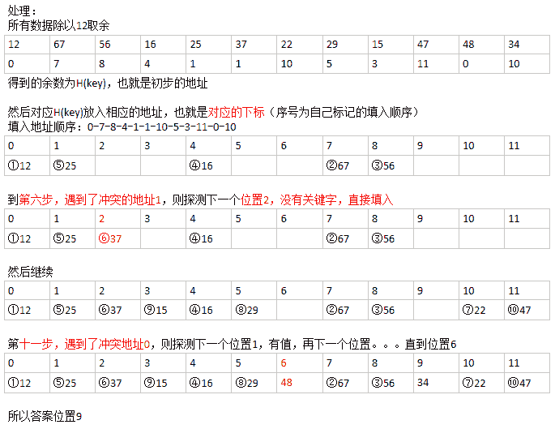

# 摩拜 2018 校招运维开发工程师笔试卷

## 1

在使用 super 和 this 关键字时，以下描述正确的是

正确答案: A   你的答案: 空 (错误)

```cpp
在子类构造方法中使用 super（）显示调用父类的构造方法，super（）必须写在子类构造方法的第一行，否则编译不通过
```

```cpp
super（）和 this（）不一定要放在构造方法内第一行
```

```cpp
this（）和 super（）可以同时出现在一个构造函数中
```

```cpp
this（）和 super（）可以在 static 环境中使用，包括 static 方法和 static 语句块
```

本题知识点

摩拜 Java 工程师 C++工程师 iOS 工程师 安卓工程师 运维工程师 前端工程师 算法工程师 PHP 工程师 2018

讨论

[Chameleons](https://www.nowcoder.com/profile/263615503)

super()和 this()调用构造器只能放在构造方法的第一行，若有则仅能存在一个，否则默认调用 super()。构造器方法只能在构造器方法内调用，不能在 static 属于类的方法中调用，而是可以直接用 new 来创建对象。

发表于 2020-12-16 16:21:21

* * *

## 2

访问修饰符作用范围由大到小是

正确答案: C   你的答案: 空 (错误)

```cpp
private-protected-default-public
```

```cpp
private-default-protected-public
```

```cpp
public-protected-default-private
```

```cpp
public-default-protected-private
```

本题知识点

摩拜 Java 工程师 C++工程师 iOS 工程师 安卓工程师 运维工程师 前端工程师 算法工程师 PHP 工程师 运维工程师 摩拜 2018

## 3

下面方法中，用于调度线程使其运行的是

正确答案: B C   你的答案: 空 (错误)

```cpp
init()
```

```cpp
start()
```

```cpp
run()
```

```cpp
resume()
```

```cpp
sleep()
```

本题知识点

摩拜 Java 工程师 C++工程师 iOS 工程师 安卓工程师 运维工程师 前端工程师 算法工程师 PHP 工程师 2018

## 4

下面关于数组说法正确的是

正确答案: A B C E   你的答案: 空 (错误)

```cpp
一维数组实质上是相同类型变量的列表
```

```cpp
创建一个数组首先定义数组变量所需的类型
```

```cpp
char c[]=new char[26];可声明一个含有 26 个元素的 char 型数组
```

```cpp
当为一个多维数组的时候分配内存时，仅需要为第一维指定内存，然后再分配其他维内存 XXXXX
```

```cpp
int twain[][] = new int[4][5];可声明一个二维数组
```

本题知识点

摩拜 Java 工程师 C++工程师 iOS 工程师 安卓工程师 运维工程师 前端工程师 算法工程师 PHP 工程师 2018

## 5

对下列数字：1, 48, 8, 13, 26, 55, 12, 6, 56, 99, 16, 100 进行希尔排序（最小增量排序），进行 2 次后的结果

正确答案: B   你的答案: 空 (错误)

```cpp
1, 8, 13, 48, 6, 12, 26, 55, 16, 56, 99, 100
```

```cpp
1, 6, 8, 12, 16, 55, 13, 26, 56, 99, 48, 100
```

```cpp
1, 8, 13, 26, 12, 6, 16, 48, 55, 56, 99, 100
```

```cpp
100, 1, 6, 8, 12, 13, 16, 26, 48, 55, 56, 99
```

本题知识点

摩拜 Java 工程师 C++工程师 iOS 工程师 安卓工程师 运维工程师 前端工程师 算法工程师 PHP 工程师 2018

讨论

[学习学习学习啦啦啦啦啦](https://www.nowcoder.com/profile/789894778)

匹配 1 12 48 6 8 56 13 99 26 16 55 100 第二次 1 6 8 12 13 16 ...直接插入

发表于 2019-03-06 19:42:02

* * *

## 6

在虚拟存储系统中，假定某进程在内存敏感词有 5 页（初始为空），采用先进先出（FIFO）页面淘汰算法，当进程访问以下序列：1，2，3，4，5，6，1，3，5，1，4，5，2，5 时产生中断的次数是（）

正确答案: D   你的答案: 空 (错误)

```cpp
5
```

```cpp
6
```

```cpp
7
```

```cpp
8
```

本题知识点

摩拜 Java 工程师 C++工程师 iOS 工程师 安卓工程师 运维工程师 前端工程师 算法工程师 PHP 工程师 2018

讨论

[JayceCao](https://www.nowcoder.com/profile/149842882)

首先访问最开始的 1 到 5 时，一共 5 次，访问 6 时，淘汰 1，将 6 放到 1 的位置，加一次（目前共 6 次），然后访问 1，淘汰 2，将 1 放到 2 的位置，加一次（目前共 7 次），接下来访问 3、5、1、4、5 时，因为都在主存中，所以不需要换入换出。访问 2 时，将 3 换出，加一次。因此产生的终端次数为 8 次。

发表于 2019-04-01 23:23:51

* * *

[学习学习学习啦啦啦啦啦](https://www.nowcoder.com/profile/789894778)

我怎么算得 9 次。。

发表于 2019-03-06 19:42:28

* * *

## 7

关键字集合｛12, 67, 56, 16, 25, 37, 22, 29, 15, 47, 48, 34｝，散列函数为 f(key) = key mod 12，将关键字依次存入下标为 0~11 的散列表中，采用线性探测解决冲突，那么关键字 34 存储的位置下标为（）

正确答案: B   你的答案: 空 (错误)

```cpp
8
```

```cpp
9
```

```cpp
10
```

```cpp
11
```

本题知识点

摩拜 Java 工程师 C++工程师 iOS 工程师 安卓工程师 运维工程师 前端工程师 算法工程师 PHP 工程师 2018

讨论

[梦想家临熙](https://www.nowcoder.com/profile/2843048)



发表于 2018-08-03 14:00:33

* * *

## 8

给定正整数 N 和集合 K，求不大于 N 的、每一位数字都在 K 中的最大值 M，比如 N=297 K={2, 5, 8}，则返回 288

你的答案

本题知识点

摩拜 Java 工程师 C++工程师 iOS 工程师 安卓工程师 运维工程师 前端工程师 算法工程师 PHP 工程师 2018

讨论

[幼稚小学生](https://www.nowcoder.com/profile/4882614)

```cpp

            发表于 2019-03-14 15:16:46

        9
          已经提供下面数据结构，表示单个链表节点 
       class Node { 
           public int value; 
           public Node next; 

           public Node(int value) { 
               this.value = value; 
               this.next = null; 
           } 
       } 

       // 实现下面方法，对单链表，进行升序排列 
       Node sortList(Node head); 

    你的答案

本题知识点

                                                            摩拜 
                                                Java 工程师 
                                                C++工程师 
                                                iOS 工程师 
                                                安卓工程师 
                                                运维工程师 
                                                前端工程师 
                                                算法工程师 
                                                PHP 工程师 
                                                2018 

## 10

        如何生成一个全局唯一的 ID。

你的答案

本题知识点

                                                            摩拜 
                                                Java 工程师 
                                                C++工程师 
                                                iOS 工程师 
                                                安卓工程师 
                                                运维工程师 
                                                前端工程师 
                                                算法工程师 
                                                PHP 工程师 
                                                2018 

## 11

        请设计一个登录认证系统，包括用户注册验证和登录。请同时描述数据库结构。

你的答案

本题知识点

                                                            摩拜 
                                                Java 工程师 
                                                C++工程师 
                                                iOS 工程师 
                                                安卓工程师 
                                                运维工程师 
                                                前端工程师 
                                                算法工程师 
                                                PHP 工程师 
                                                2018 

## 12

        在 MySQL 中，VARCHAR 与 CHAR 的区别描述，正确的是：

正确答案:
                                                 B
                                                         你的答案:

                  空
                             (错误)

```
CHAR 是一种可变长度的类型，VARCHAR 是一种固定长度
```cpp

```
VARCHAR 长度可以指定为 0 到 65535 之间的值
```cpp

```
CHAR(20)和 VARCHAR(20)存储的长度是 一样的
```cpp

```
CHAR 比 VARCHAR 更省空间
```cpp

本题知识点

                                                            摩拜 
                                                Java 工程师 
                                                C++工程师 
                                                iOS 工程师 
                                                安卓工程师 
                                                运维工程师 
                                                前端工程师 
                                                算法工程师 
                                                PHP 工程师 
                                                2018 

## 13

        TCP 的三次握手过程中，accept 发生在三次握手的哪个阶段？

正确答案:
                                A
                                                                          你的答案:

                  空
                             (错误)

```
三次握手之后
```cpp

```
第一次握手
```cpp

```
第二次握手
```cpp

```
第三次握手
```cpp

本题知识点

                                                            摩拜 
                                                Java 工程师 
                                                C++工程师 
                                                iOS 工程师 
                                                安卓工程师 
                                                运维工程师 
                                                前端工程师 
                                                算法工程师 
                                                PHP 工程师 
                                                运维工程师 
                                                摩拜 
                                                2018 

## 14

        请设计一套系统，能够实现开关锁的功能。

你的答案

本题知识点

                                                            摩拜 
                                                Java 工程师 
                                                C++工程师 
                                                iOS 工程师 
                                                安卓工程师 
                                                运维工程师 
                                                前端工程师 
                                                算法工程师 
                                                PHP 工程师 
                                                2018 

```