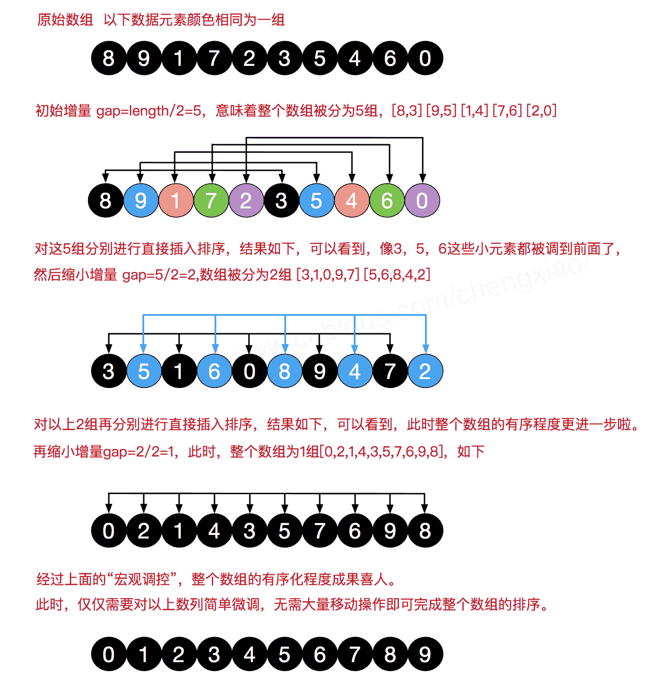

# 摩拜 2018 校招开发工程师笔试卷

## 1

在使用 super 和 this 关键字时，以下描述正确的是

正确答案: A   你的答案: 空 (错误)

```cpp
在子类构造方法中使用 super（）显示调用父类的构造方法，super（）必须写在子类构造方法的第一行，否则编译不通过
```

```cpp
super（）和 this（）不一定要放在构造方法内第一行
```

```cpp
this（）和 super（）可以同时出现在一个构造函数中
```

```cpp
this（）和 super（）可以在 static 环境中使用，包括 static 方法和 static 语句块
```

本题知识点

摩拜 Java 工程师 C++工程师 iOS 工程师 安卓工程师 运维工程师 前端工程师 算法工程师 PHP 工程师

## 2

访问修饰符作用范围由大到小是

正确答案: C   你的答案: 空 (错误)

```cpp
private-protected-default-public
```

```cpp
private-default-protected-public
```

```cpp
public-protected-default-private
```

```cpp
public-default-protected-private
```

本题知识点

摩拜 Java 工程师 C++工程师 iOS 工程师 安卓工程师 运维工程师 前端工程师 算法工程师 PHP 工程师

讨论

[阿伟 11](https://www.nowcoder.com/profile/945479324)

protected 修饰的变量为保护变量，保护变量可以被同一个包中的类或子类访问；default 只能被同一个包中的类访问。

发表于 2021-03-29 21:49:33

* * *

## 3

下面方法中，用于调度线程使其运行的是

正确答案: B C   你的答案: 空 (错误)

```cpp
init()
```

```cpp
start()
```

```cpp
run()
```

```cpp
resume()
```

```cpp
sleep()
```

本题知识点

摩拜 Java 工程师 C++工程师 iOS 工程师 安卓工程师 运维工程师 前端工程师 算法工程师 PHP 工程师

讨论

[李梦蝶](https://www.nowcoder.com/profile/6006679)

Java 的线程是通过 java.lang.Thread 类来实现的。JVM 启动时会有一个由主方法所定义的线程。可以通过创建 Thread 的实例来创建新的线程。每个线程都是通过某个特定 Thread 对象所对应的方法 run（）来完成其操作的，方法 run()称为线程体。通过调用 Thread 类的 start()方法来启动一个线程。线程有 5 状态

1.  创建状态 new Thread()。生成线程对象，并未调用该对象的 start 方法时候。

2.  就绪状态 start()。1：调用了线程对象的 start 方法之后，调度程序未把该线程设置为当前线程。2：在线程运行之后，从等待或者睡眠中回来之后。
3.  运行状态 run()。线程调度程序把就绪状态的线程设置为当前线程，进入运行状态。

4.  阻塞状态。线程正在运行的时候，被暂停，通常是为了等待某个事件的发生(比如说某项资源就绪)之后再继续运行。sleep，suspend，wait 等方法都可以导致线程阻塞。

5.  死亡状态 stop()。如果一个线程的 run 方法执行结束或者调用 stop 方法后，该线程就会死亡。已经死亡的线程，无法再用 start 方法进入就绪状态。

发表于 2019-08-29 08:59:55

* * *

[Ev](https://www.nowcoder.com/profile/7853778)

为什么 run 方法也是？

发表于 2018-07-19 23:50:59

* * *

## 4

下面关于数组说法正确的是

正确答案: A B C E   你的答案: 空 (错误)

```cpp
一维数组实质上是相同类型变量的列表
```

```cpp
创建一个数组首先定义数组变量所需的类型
```

```cpp
char c[]=new char[26];可声明一个含有 26 个元素的 char 型数组
```

```cpp
当为一个多维数组的时候分配内存时，仅需要为第一维指定内存，然后再分配其他维内存 XXXXX
```

```cpp
int twain[][] = new int[4][5];可声明一个二维数组
```

本题知识点

摩拜 Java 工程师 C++工程师 iOS 工程师 安卓工程师 运维工程师 前端工程师 算法工程师 PHP 工程师

讨论

[天才兒童 1997](https://www.nowcoder.com/profile/655962644)

指定二维数组的时候不是可以先一维再二维吗？求解答。

发表于 2019-09-02 20:54:45

* * *

[咸鱼变身](https://www.nowcoder.com/profile/48437153)

指定二维数组的时候不是可以先一维再二维吗？求解答。

发表于 2019-07-28 17:28:41

* * *

## 5

对下列数字：1, 48, 8, 13, 26, 55, 12, 6, 56, 99, 16, 100 进行希尔排序（最小增量排序），进行 2 次后的结果

正确答案: B   你的答案: 空 (错误)

```cpp
1, 8, 13, 48, 6, 12, 26, 55, 16, 56, 99, 100
```

```cpp
1, 6, 8, 12, 16, 55, 13, 26, 56, 99, 48, 100
```

```cpp
1, 8, 13, 26, 12, 6, 16, 48, 55, 56, 99, 100
```

```cpp
100, 1, 6, 8, 12, 13, 16, 26, 48, 55, 56, 99
```

本题知识点

摩拜 Java 工程师 C++工程师 iOS 工程师 安卓工程师 运维工程师 前端工程师 算法工程师 PHP 工程师

讨论

[蓝秋绽放 33](https://www.nowcoder.com/profile/508579963)

在此我们选择增量 gap=length/2，缩小增量继续以 gap = gap/2 的方式，这种增量选择我们可以用一个序列来表示，{n/2,(n/2)/2...1}，称为**增量序列**。希尔排序的增量序列的选择与证明是个数学难题，我们选择的这个增量序列是比较常用的，也是希尔建议的增量，称为希尔增量，但其实这个增量序列不是最优的。此处我们做示例使用希尔增量。



发表于 2018-07-27 11:35:23

* * *

## 6

在虚拟存储系统中，假定某进程在内存敏感词有 5 页（初始为空），采用先进先出（FIFO）页面淘汰算法，当进程访问以下序列：1，2，3，4，5，6，1，3，5，1，4，5，2，5 时产生中断的次数是（）

正确答案: D   你的答案: 空 (错误)

```cpp
5
```

```cpp
6
```

```cpp
7
```

```cpp
8
```

本题知识点

摩拜 Java 工程师 C++工程师 iOS 工程师 安卓工程师 运维工程师 前端工程师 算法工程师 PHP 工程师

讨论

[coding 峰](https://www.nowcoder.com/profile/545545807)

缺页定义为所有内存块最初都是空的，所以第一次用到的页面都产生一次缺页。 **内存敏感词为 5 页，初始为空（下面为加载过程）：****访问 1 的时候，缺页，调入 1，内存是 1；                                                                                                                   //缺页计数 1****访问 2 的时候，缺页，调入 2，内存是 1，2；                                                                                                              //2****访问 3 的时候，缺页，调入 3，内存是 1，2，3；                                                                                                         //。。。。。******访问 4 的时候，缺页，调入 4，内存是 1，2，3，4；**** ******访问 5 的时候，缺页，调入 5，内存是 1，2，3，4，5；****** **下边就产生变化了，因为内存敏感词是 5，所以****访问 6 的时候，本身满了，缺页，所以会调入 6，去掉 1，内存是 6，2，3，4，5；（First In First Out）******访问 1 的时候，缺页，调入 1，去掉 2，内存是 6，1，3，4，5；****
**访问 3 的时候，因为内存中有 3，不变；****访问 5 的时候，因为内存中有 5，不变；**
**访问 1 的时候，因为内存中有 1，不变；**
**访问 4 的时候，因为内存中有 4，不变；**
**访问 5 的时候，因为内存中有 5，不变；****访问 2 的时候，缺页，调入 2，去掉 3，内存是 6，1，2，4，5;****访问 5 的时候，因为内存中有 5，不变；**
最后很清楚的就看出来了，缺页数 8，也就是中断数 8\.

发表于 2018-08-12 18:35:53

* * *

## 7

关键字集合｛12, 67, 56, 16, 25, 37, 22, 29, 15, 47, 48, 34｝，散列函数为 f(key) = key mod 12，将关键字依次存入下标为 0~11 的散列表中，采用线性探测解决冲突，那么关键字 34 存储的位置下标为（）

正确答案: B   你的答案: 空 (错误)

```cpp
8
```

```cpp
9
```

```cpp
10
```

```cpp
11
```

本题知识点

摩拜 Java 工程师 C++工程师 iOS 工程师 安卓工程师 运维工程师 前端工程师 算法工程师 PHP 工程师

讨论

[欣慰](https://www.nowcoder.com/profile/9359599)

用数组 mod12 作为位置下标，如果冲突则往后面移动 12, 67, 56, 16, 25, 37, 22, 29, 15, 47, 48, 34 0,  7     8     4   1    2    10  5    3   11    6   9

发表于 2018-09-29 22:06:26

* * *

## 8

给定正整数 N 和集合 K，求不大于 N 的、每一位数字都在 K 中的最大值 M，比如 N=297 K={2, 5, 8}，则返回 288

你的答案

本题知识点

摩拜 Java 工程师 C++工程师 iOS 工程师 安卓工程师 运维工程师 前端工程师 算法工程师 PHP 工程师

讨论

[林大兜儿](https://www.nowcoder.com/profile/6311653)

将 N 各位写进数组 b[]，按由高位到低位依次放入，并记录位数 count，设置一个初始为 0 的 sum 值用来表示求得的值。

两个 for 循环，外层为 b[]，内层为集合数组 a[]，b 下标由小到大循环，a 下标由大到小循环，同时采用一个 boolean 值 flag 标记高位的情况，初始 flag 为 false，如题目所示 297，集合 2 5 8，进入外层循环，为 2，首先判断 flag 是否为真，若是，则按 a 最后一位取值计算 sum，为假，进入内层循环，a 中都不小于 2，此时给予标记 flag 为真，之后几位全部按 a 数组最高位取。

package com.TestLittleDemo;

import java.util.Arrays;

public class Max1 {

    private static int[] a = {2,5,8};

    private static int n = 2970;

    public static void main(String[] args) {

        System.out.println(fun(a, n));

    }

    public static int fun(int[] a,int n){

        int b[] = new int[200];//数组 b

        int n2= n;//n 的复制，因为之后计算位数 n 会改变

        int num=199;

        int count = 1;//位数，最低是 1

        int sum = 0;

        boolean f = false;

        while(n/10!=0){//计算位数，同时，按由高到低，从左到右依次放入 b 中，

            b[num]=n%10;

            n=n/10;

            count++;

            num--;

        }

        b[num]=n;

        Arrays.sort(a);

        //以 b 为基础进行 for 循环

        for (int i = num; i < 200; i++) {

            //首先判断 f 是否为真，是真的，就说明之前的一位 a 小于 b，类似 297，28X，十位 8 小于 9，那么第三位就直接按 a 的最大取

            if(f){

                sum += (int) (a[a.length-1]*Math.pow(10,count-1));

            }else{

                for (int j = a.length-1; j >= 0; j--) {

                    //这里内层 for 循环采用由高到低进行循环，寻找比 b 小的最大数

                    if(a[j]>b[i]){

                        continue;

                    }else{

                        sum += (int) (a[j]*Math.pow(10,count-1));

                        break;

                    }

                }

            }

            //每次 if else 执行完，都 count-1，使位数-1

            count--;

            //首先若 sum=0，则说明外层 for 循环第一次得到结果是 a 集合中所有的值都比 b 的最高位大，所以 sum 的位数比 b 小一位，剩下的位数直接去最大

            if(sum==0){

                f=true;

            }

            //这里判断 sum 此时的前几位是否比 b 小，比如 sum=2800，b=2977，都除以 100，28<29，令 f 为真，之后的一位按最大取

            if((sum/(int)(Math.pow(10,count)))<(n2/(int)(Math.pow(10,count)))){

                f=true;

            }

        }

        return sum;

    }

}

编辑于 2018-08-01 14:49:26

* * *

[咸鱼变身](https://www.nowcoder.com/profile/48437153)

比较蠢，总之先排序，排完按位从大到小比较，如果等于，这个位就找到了，如果小于就把低位的设置为最大值。
import java.util.*;
public class Main {
public int[] bubbleSort(int[] array) {
for (int i = 0; i < array.length; i++) {
for (int j = 0; j < array.length - i - 1; j++) {
if (array[j + 1] < array[j]) {
int temp = array[j + 1];
array[j + 1] = array[j];
array[j] = temp;
}
}
}
return array;
}
public int max(int n, int[] array) {
ArrayList<integer> res = new ArrayList<>();
int turn = 0;
array = bubbleSort(array);
while (n != 0) {
int num = n % 10;
for (int i = array.length - 1; i >= 0; i--) {
if (array[i] == num) {
res.add(turn, array[i]);
break;
} else if (array[i] < num) {
res.add(turn, array[i]);
for (int index = turn - 1; index >= 0; index--) {
res.set(index, array[array.length - 1]);
}
break;
}
}
n = n / 10;
turn++;
}
int max = 0;
for (int i=0;i<turn;i++) {
max += res.remove(0) * Math.pow(10, i);
}
return max;
}</integer>

```cpp
public static void main(String[] args) {
    System.out.println(new Main().max(297, new int[]{2, 5, 8}));
}
```

}

发表于 2019-07-28 17:38:36

* * *

[Giho](https://www.nowcoder.com/profile/966600083)

```cpp
def maxNum(N, K):
    length = len(str(N)) # 确定位数
    for i in range(length):
        first = int(str(N)[0])
        for j in range(first+1)[::-1]: # 确定首位最大数字
            if j in K:
                maxFirst = j
    behind = str(max(K))*(length-1)    # 确定其他位置最大数字
    maxNum = int(str(maxFirst)+behind) # 合并
    return maxNum
print maxNum(N, K)

```

发表于 2018-08-02 11:00:31

* * *

## 9

已经提供下面数据结构，表示单个链表节点    class Node {        public int value;        public Node next;        public Node(int value) {            this.value = value;            this.next = null;        }    }    // 实现下面方法，对单链表，进行升序排列    Node sortList(Node head);

你的答案

本题知识点

摩拜 Java 工程师 C++工程师 iOS 工程师 安卓工程师 运维工程师 前端工程师 算法工程师 PHP 工程师

讨论

[Giho](https://www.nowcoder.com/profile/966600083)

```cpp

```
  def sortList(self, head):
```cpp

	        if head is None or head.next is None:

	            return head

	        mid = (head.val + head.next.val) / 2

	        if head.val > head.next.val:

	            lhead, rhead = head.next, head

	        else:

	            lhead, rhead = head, head.next

	        lit, rit = lhead, rhead

	        it = head.next.next      

	        while it is not None:

	            if it.val > mid:

	                rit.next = it

	                rit = it               

	            else:

	                lit.next = it

	                lit = it

	            it = it.next

	        lit.next, rit.next = None, None

	        lhead = self.sortList(lhead)

	        rhead = self.sortList(rhead)

	        it = lhead

	        while it.next is not None:

	            it = it.next

	        it.next = rhead

	        return lhead

```

发表于 2018-08-02 11:05:22

* * *

[怕死不逍遥](https://www.nowcoder.com/profile/458172313)

111

发表于 2019-09-09 02:10:02

* * *

[杨杨 young](https://www.nowcoder.com/profile/7285578)

```cpp
public Node sortList(Node head) {
    int temp ;
    Node curNode  = head;
    while(curNode != null){
        Node nextNode = curNode.next;
        while(nextNode != null){
            if (nextNode.value < curNext.value){
                temp = nextNode.value;
                nextNode.value = curNode.value;
                curNode.value = temp; 
            }
            nextNode = nextNode.next;
        }
        curNode = curNext.next;
    }
    return head;
}
```

发表于 2018-07-20 10:07:01

* * *

## 10

如何生成一个全局唯一的 ID。

你的答案

本题知识点

摩拜 Java 工程师 C++工程师 iOS 工程师 安卓工程师 运维工程师 前端工程师 算法工程师 PHP 工程师

讨论

[杨杨 young](https://www.nowcoder.com/profile/7285578)

```cpp
public class IdGen {
    private long workerId;
    private long datacenterId;
    private long sequence = 0L;
    private long twepoch = 1288834974657L;                              //  Thu, 04 Nov 2010 01:42:54 GMT
    private long workerIdBits = 5L;                                     //  节点 ID 长度
    private long datacenterIdBits = 5L;                                 //  数据中心 ID 长度
    private long maxWorkerId = -1L ^ (-1L << workerIdBits);             //  最大支持机器节点数 0~31，一共 32 个
    private long maxDatacenterId = -1L ^ (-1L << datacenterIdBits);     //  最大支持数据中心节点数 0~31，一共 32 个
    private long sequenceBits = 12L;                                    //  序列号 12 位
    private long workerIdShift = sequenceBits;                          //  机器节点左移 12 位
    private long datacenterIdShift = sequenceBits + workerIdBits;       //  数据中心节点左移 17 位
    private long timestampLeftShift = sequenceBits + workerIdBits + datacenterIdBits; //  时间毫秒数左移 22 位
    private long sequenceMask = -1L ^ (-1L << sequenceBits);                          //  4095
    private long lastTimestamp = -1L;

    private static class IdGenHolder {
        private static final IdGen instance = new IdGen();
    }

    public static IdGen get(){
        return IdGenHolder.instance;
    }

    public IdGen() {
        this(0L, 0L);
    }

    public IdGen(long workerId, long datacenterId) {
        if (workerId > maxWorkerId || workerId < 0) {
            throw new IllegalArgumentException(String.format("worker Id can't be greater than %d or less than 0", maxWorkerId));
        }
        if (datacenterId > maxDatacenterId || datacenterId < 0) {
            throw new IllegalArgumentException(String.format("datacenter Id can't be greater than %d or less than 0", maxDatacenterId));
        }
        this.workerId = workerId;
        this.datacenterId = datacenterId;
    }

    public synchronized long nextId() {
        //获取当前毫秒数
        long timestamp = timeGen();
        //如果服务器时间有问题(时钟后退) 报错。
        if (timestamp < lastTimestamp) {
            throw new RuntimeException(String.format(
                    "Clock moved backwards.  Refusing to generate id for %d milliseconds", lastTimestamp - timestamp));
        }
        //如果上次生成时间和当前时间相同,在同一毫秒内
        if (lastTimestamp == timestamp) {
            //sequence 自增，因为 sequence 只有 12bit，所以和 sequenceMask 相与一下，去掉高位
            sequence = (sequence + 1) & sequenceMask;
            //判断是否溢出,也就是每毫秒内超过 4095，当为 4096 时，与 sequenceMask 相与，sequence 就等于 0
            if (sequence == 0) {                  //自旋等待到下一毫秒
                timestamp = tilNextMillis(lastTimestamp); 
            }
        } else {            //如果和上次生成时间不同,重置 sequence，就是下一毫秒开始，sequence 计数重新从 0 开始累加
            sequence = 0L; 
        }
        lastTimestamp = timestamp;
        // 最后按照规则拼出 ID。
        // 000000000000000000000000000000000000000000  00000            00000       000000000000
        // time                                       datacenterId   workerId    sequence
        return ((timestamp - twepoch) << timestampLeftShift) | (datacenterId << datacenterIdShift)
                | (workerId << workerIdShift) | sequence;
    }

    protected long tilNextMillis(long lastTimestamp) {
        long timestamp = timeGen();
        while (timestamp <= lastTimestamp) {
            timestamp = timeGen();
        }
        return timestamp;
    }

    protected long timeGen() {
        return System.currentTimeMillis();
    }
}

```

发表于 2018-07-20 09:46:20

* * *

## 11

请设计一个登录认证系统，包括用户注册验证和登录。请同时描述数据库结构。

你的答案

本题知识点

摩拜 Java 工程师 C++工程师 iOS 工程师 安卓工程师 运维工程师 前端工程师 算法工程师 PHP 工程师

讨论

[杨杨 young](https://www.nowcoder.com/profile/7285578)

可以分为两种登录方式：
第一种：使用 用户名/邮箱/手机号 + 密码 登陆。
第二种：第三方登陆 。

设计数据表 users 的列为(uid, username, email, phone, password) 其中 username、email、 phone 都应该是 unique。
登录时 select 1 from users where username = '  ' or email = '  ' or phone = '  ' and password = '  ';
这样做的缺点是，A 的用户名可以设置成是 B 的电话号码或者邮箱。
可以使用正则表达式来区分出邮箱和电话号码。如果是这两种格式则不允许注册为用户名？
也可以用正则表达式来区分出是邮箱还是电话号码，然后再查数据库。

请求第三方登陆通常会返回一个 openid。

设计数据表 third 为(uid, openid, accessToken, type) ,分别对应 users 表的 uid， 第三方登陆的 openid，第三方登陆的 accessToken， 第三方登陆的类型（如微博=1、qq=2）。

登录流程：

*   如果在数据表中没查到这个第三方登陆的 openid，那就往数据表里填入，代表新用户注册，然后可以引导用户填写 *用户名/邮箱/手机号* + *密码* 将两种登陆关联起来。当然也可以跳过引导步骤。那么可以 uid 填一个随机字符串之类的。
*   如果在数据库中查到了第三方登陆的 openid，代表用户已注册，那就直接登录成功。

发表于 2018-07-20 09:52:00

* * *

## 12

在 MySQL 中，VARCHAR 与 CHAR 的区别描述，正确的是：

正确答案: B   你的答案: 空 (错误)

```cpp
CHAR 是一种可变长度的类型，VARCHAR 是一种固定长度
```

```cpp
VARCHAR 长度可以指定为 0 到 65535 之间的值
```

```cpp
CHAR(20)和 VARCHAR(20)存储的长度是 一样的
```

```cpp
CHAR 比 VARCHAR 更省空间
```

本题知识点

摩拜 Java 工程师 C++工程师 iOS 工程师 安卓工程师 运维工程师 前端工程师 算法工程师 PHP 工程师

讨论

[想想 20190109025143](https://www.nowcoder.com/profile/172170490)

Char 固定长度，varchar 为可变长度

发表于 2019-06-25 15:47:16

* * *

## 13

TCP 的三次握手过程中，accept 发生在三次握手的哪个阶段？

正确答案: A   你的答案: 空 (错误)

```cpp
三次握手之后
```

```cpp
第一次握手
```

```cpp
第二次握手
```

```cpp
第三次握手
```

本题知识点

摩拜 Java 工程师 C++工程师 iOS 工程师 安卓工程师 运维工程师 前端工程师 算法工程师 PHP 工程师

讨论

[必胜！！](https://www.nowcoder.com/profile/9046753)

发生在三次握手之后
[`blog.csdn.net/vivid_110/article/details/51000513`](http://blog.csdn.net/vivid_110/article/details/51000513)

经过上面繁杂的介绍，那么我们来一步步分析一下“三次握手”的过程：

1、服务端处于 LISTEN 状态，客户端处于 CLOSED 状态；

2、客户端打开，并进行 SYN 的发送，处于 SYN_SENT 状态；

3、服务端收到此条消息后，转为 SYN_RCVD 状态，并对客户端进行消息回复；

4、客户端收到此条消息后，转为 ESTABLISHED 状态，并发送一个 ACK 的确认消息。

5、服务端收到此条消息后，转为 ESTABLISHED 状态。

至此，三次握手完成。

然而，聪明的你，通过上面的分析，你可能会得到这样的结论：accept()发生在第 3 步，原因是，此时 accept()函数需要给此次连接分配资源。的确，最初是想这样设计的。但是，设想一个情景，若有 10000 个客户端都和该服务端进行连接，发送 SYN，服务端收到之后，这些客户端却不再理会服务端的回复，然而此时服务端的资源却都用 accept()分配了。这就是所谓的“DDOS 攻击”。

为了解决这个问题，accept()于是被放在三次握手之后。

当然，这样也不能保证不能被攻击，当然这是后话

编辑于 2018-07-21 20:45:57

* * *

## 14

请设计一套系统，能够实现开关锁的功能。

你的答案

本题知识点

摩拜 Java 工程师 C++工程师 iOS 工程师 安卓工程师 运维工程师 前端工程师 算法工程师 PHP 工程师