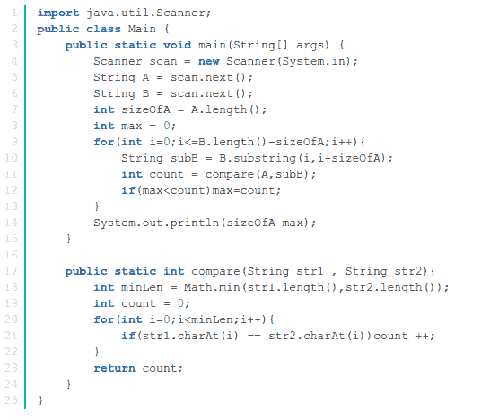

# 摩拜 2018 校招数据工程师笔试卷

## 1

下列有关图的说法错误的是()

正确答案: C   你的答案: 空 (错误)

```cpp
在有向图中,出度为 0 的结点称为叶子
```

```cpp
用邻接矩阵表示图,容易判断任意两个结点之间是否有边相连,并求得各结点的度
```

```cpp
按深度方向遍历图和前序遍历树类似,得到的结果是唯一的
```

```cpp
若有向图 G 中从结点 V<sub>i</sub>到结点 V<sub>j</sub>有一条路径,则在图 G 的结点的线性序列中结点 V<sub>i</sub>,必在结点 V<sub>j</sub>之前的话,则称为一个拓扑序列
```

本题知识点

摩拜 Java 工程师 C++工程师 iOS 工程师 安卓工程师 运维工程师 前端工程师 算法工程师 PHP 工程师

讨论

[强连通计算机考研](https://www.nowcoder.com/profile/3172375)

A. 对。有叶子的叫法。就是按 A 所说。

B. 对。

判断顶点 i，j 是否有边，只需读取 A[i][j]。

求顶点 i 的度：统计 i 行或 i 列中标识有边的值的个数。

C. 错。深度方向遍历图和先根次序遍历树类似。但得到的结果不唯一，因为对于与顶点 A 邻接的顶点来说，是没有次序之分的。

D. 对。知识点部分基本知识。【来自：冯强数据结构考研】

发表于 2020-05-11 14:32:10

* * *

[进步不生锈](https://www.nowcoder.com/profile/8398003)

深度优先遍历类似于树的先序遍历;广度优先遍历，类似于树的按层次遍历但不是唯一的。

发表于 2020-02-03 10:19:07

* * *

## 2

下列叙述正确的是：

正确答案: C   你的答案: 空 (错误)

```cpp
数据库是一个独立的系统,不需要操作系统的支持
```

```cpp
数据库设计是指设计数据库管理
```

```cpp
数据库技术的根本目标是要解决数据共享的问题
```

```cpp
数据库系统中,数据的物理结构必须与逻辑结构一致
```

本题知识点

摩拜 Java 工程师 C++工程师 iOS 工程师 安卓工程师 运维工程师 前端工程师 算法工程师 PHP 工程师

## 3

下面有关共享内存，说法不正确的是？

正确答案: D   你的答案: 空 (错误)

```cpp
共享内存和使用信号量一样，属于进程间通信的一种方式。
```

```cpp
使用 shmget 函数来创建共享内存
```

```cpp
尽管每个进程都有自己的内存地址，不同的进程可以同时将同一个内存页面映射到自己的地址空间中，从而达到共享内存的目的
```

```cpp
共享内存提供了同步机制，在第一个进程结束对共享内存的写操作之前，会有自动机制可以阻止第二个进程开始对它进行读取
```

本题知识点

摩拜 Java 工程师 C++工程师 iOS 工程师 安卓工程师 运维工程师 前端工程师 算法工程师 PHP 工程师

讨论

[紫夜馨空 2012](https://www.nowcoder.com/profile/303388676)

共享内存没有任何的同步与互斥机制，所以要使用信号量来实现对共享内存的存取的同步创建共享内存——>shmget() 函数操作共享内存———>shmctl()函数 

编辑于 2018-08-13 15:49:25

* * *

## 4

下列程序的输出结果是什么？

```cpp
public class Test1{
    public static void main(String args[]){
            String a="1234";
            String b="1234";
            String c = new String("1234");
            System.out.println(a==b);
            System.out.println(a==c);
            System.out.println(a.equals(c));
    }
}

```

正确答案: A   你的答案: 空 (错误)

```cpp
true
false
true
```

```cpp
true
true
false
```

```cpp
true
false
false
```

```cpp
true
true
true
```

本题知识点

摩拜 Java 工程师 C++工程师 iOS 工程师 安卓工程师 运维工程师 前端工程师 算法工程师 PHP 工程师

## 5

电话号码表 t_phonebook 中含有 100 万条数据，其中号码字段 PhoneNo 上创建了唯一索引，且电话号码全部由数字组成，要统计号码头为 321 的电话号码的数量，下面写法执行速度最慢的是 ___

正确答案: C   你的答案: 空 (错误)

```cpp
select count(*) from t_phonebook where phoneno &gt;= &lsquo;321&rsquo; and phoneno &lt; &lsquo;321A&rsquo;
```

```cpp
select count(*) from t_phonebook where phoneno like &lsquo;321%&rsquo;
```

```cpp
select count(*) from t_phonebook where substr(phoneno,1,3) = &lsquo;321&rsquo;
```

```cpp
都一样快
```

本题知识点

摩拜 Java 工程师 C++工程师 iOS 工程师 安卓工程师 运维工程师 前端工程师 算法工程师 PHP 工程师

讨论

[紫夜馨空 2012](https://www.nowcoder.com/profile/303388676)

A>或者<操作符会采用索引查找

B:LIKE 通配符在 XXX％情况下会应用索引，如果在％xxx％等情况下不会应用索引

答案: C:采用函数处理的字段不能利用索引，例如 substr（）  这个题好像写成 java 的函数了

发表于 2018-08-13 16:01:19

* * *

[gdut17](https://www.nowcoder.com/profile/279358190)

```cpp
select count(*) from t_phonebook where phoneno >= '321' and phoneno < '321A'

```
;走索引
```cpp

```

```cpp
select count(*) from t_phonebook where phoneno like '321%';走索引
```

```cpp
select count(*) from t_phonebook where substr(phoneno,1,3) = '321';走索引，在索引列上做计算,函数,类型转换，会导致索引失效而转向全表扫描 

```

编辑于 2020-07-30 11:43:44

* * *

## 6

下列事件最可能导致系统产生死锁的是（）

正确答案: C   你的答案: 空 (错误)

```cpp
进程释放资源
```

```cpp
一个进程进入死循环
```

```cpp
多个进程竞争独占资源
```

```cpp
多个进程竞争共享资源
```

本题知识点

摩拜 Java 工程师 C++工程师 iOS 工程师 安卓工程师 运维工程师 前端工程师 算法工程师 PHP 工程师

## 7

下列描述中，错误的是

正确答案: C   你的答案: 空 (错误)

```cpp
SQL 语言又称为结构化查询语言
```

```cpp
java 中&rdquo;static&rdquo;关键字表明一个成员变量或者是成员方法可以在没有所属的类的实例变量的情况下被访问
```

```cpp
面向对象开发中，引用传递意味着传递的并不是实际的对象，而是对象的引用，因此，外部对引用对象所做的改变不会反映到所引用的对象上
```

```cpp
java 是强类型语言，javascript 是弱类型语言
```

```cpp
面向对象的三大特性包括：封装，继承，多态
```

本题知识点

摩拜 Java 工程师 C++工程师 iOS 工程师 安卓工程师 运维工程师 前端工程师 算法工程师 PHP 工程师

## 8

以下关于多线程的叙述错误的是：

正确答案: C   你的答案: 空 (错误)

```cpp
线程同步的方法包括使用临界区，互斥量，信号量等
```

```cpp
两个线程同时对简单类型全局变量进行写操作也需要互斥
```

```cpp
实现可重入函数时，对自动变量也要用互斥量加以保护
```

```cpp
可重入函数不可以调用不可重入函数
```

本题知识点

摩拜 Java 工程师 C++工程师 iOS 工程师 安卓工程师 运维工程师 前端工程师 算法工程师 PHP 工程师

讨论

[紫夜馨空 2012](https://www.nowcoder.com/profile/303388676)

可重入函数主要用于多任务环境中，简单来说就是可以被中断的函数，即在这个函数执行的任何时刻中断它，转入 OS 调度下去执行另外一段代码，返回控制时不会出现什么错误；也意味着它除了使用自己栈上的变量以外不依赖于任何环境（包括 static），这样的函数就是 purecode（纯代码）可重入，可以允许有该函数的多个副本在运行，由于它们使用的是分离的栈，所以不会互相干扰。而不可重入的函数由于使用了一些系统资源，比如全局变量区、中断向量表等，所以它如果被中断的话，可能会出现问题，这类函数是不能运行在多任务环境下的。

     可重入函数确实需要访问全局变量（包括 static），一定要注意实施互斥手段。它在并行运行环境中非常重要，但是一般要为访问全局变量付出一些性能代价。编写可重入函数时，若使用全局变量，则应通过关中断、信号量（即 P、V 操作）等手段对其加以保护。

发表于 2018-08-13 16:12:27

* * *

## 9

下列排序法中，最坏情况下时间复杂度最小的是（ ）

正确答案: A   你的答案: 空 (错误)

```cpp
堆排序
```

```cpp
快速排序
```

```cpp
希尔排序
```

```cpp
冒泡排序
```

本题知识点

摩拜 Java 工程师 C++工程师 iOS 工程师 安卓工程师 运维工程师 前端工程师 算法工程师 PHP 工程师

讨论

[进步不生锈](https://www.nowcoder.com/profile/8398003)

 | 排序方法 | 最坏时间复杂度 | 最好时间复杂度 | 平均时间复杂度 |
| 直接插入 | O(n²) | O(n) | O(n²) |
| 简单选择 | O(n²)  | O(n²) | O(n²) |
| 冒泡排序 | O(n²)  | O(n) | O(n²)  |
| 快速排序 | O(n²)  | O(nlog[2]n) | O(nlog[2]n)  |
| 堆排序 | O(nlog[2]n)  | O(nlog[2]n)  | O(nlog[2]n)  |
| 归并排序 | O(nlog[2]n)  | O(nlog[2]n)  | O(nlog[2]n)  |
| 希尔排序 | O(n²)   | O(n^(1.3)) | O(nlog[2]n)   | 

发表于 2020-02-03 10:37:18

* * *

[cai 鸟 113](https://www.nowcoder.com/profile/221653377)

A 堆排法

发表于 2019-11-07 19:52:29

* * *

## 10

下述各类表中可以随机访问的是

正确答案: D   你的答案: 空 (错误)

```cpp
单向链表
```

```cpp
双向链表
```

```cpp
单向循环链表
```

```cpp
顺序表
```

本题知识点

摩拜 Java 工程师 C++工程师 iOS 工程师 安卓工程师 运维工程师 前端工程师 算法工程师 PHP 工程师

讨论

[牛客 5236528 号](https://www.nowcoder.com/profile/5236528)

D 顺序表可以随机访问任意一个结点，而[链表](https://www.baidu.com/s?wd=%E9%93%BE%E8%A1%A8&tn=SE_PcZhidaonwhc_ngpagmjz&rsv_dl=gh_pc_zhidao)则不能。

发表于 2018-11-01 23:22:25

* * *

## 11

小摩手里有一个字符串 A，小拜的手里有一个字符串 B，B 的长度大于等于 A，所以小摩想把 A 串变得和 B 串一样长，这样小拜就愿意和小摩一起玩了。而且 A 的长度增加到和 B 串一样长的时候，对应的每一位相等的越多，小拜就越喜欢。比如"abc"和"abd"对应相等的位数为 2，为前两位。小摩可以在 A 的开头或者结尾添加任意字符，使得长度和 B 一样。现在问小摩对 A 串添加完字符之后，不相等的位数最少有多少位？

本题知识点

摩拜 Java 工程师 C++工程师 iOS 工程师 安卓工程师 运维工程师 前端工程师 算法工程师 PHP 工程师 字符串 *穷举 模拟* *讨论

[yosql473](https://www.nowcoder.com/profile/443434278)

说白了就是在 B 串上移动 A 串找到最大公共子长度，但是比较时不能超出 B 串。

发表于 2018-10-07 14:02:25

* * *

[gdut17](https://www.nowcoder.com/profile/279358190)

```cpp
#include<iostream>
#include<string>
using namespace std;

int main(){
    string s,s1;
    cin>>s>>s1;

    int sum1=0;
    //前面加
    int i,j;
    j = s1.size()-1;
    for(i=s.size()-1;i>=0;i--,j--){
        if(s[i]!=s1[j]){
            sum1++;
        }
    }
    //后面
    int sum2=0;
    for(i=0,j=0;i<s.size();i++,j++){
        if(s[i]!=s1[j]){
            sum2++;
        }
    }
    if(sum1>sum2){
         cout<<sum2;  
    }else{
        cout<<sum1;
    }

    return 0;
}
```

发表于 2020-07-30 11:48:48

* * *

[牛客 341441072 号](https://www.nowcoder.com/profile/341441072)

```cpp
A = input()
B = input()
na,nb = len(A),len(B)
res = []
for i in range(nb-na+1):
    count = 0
    for j in range(na):
        if B[i+j]!=A[j]:
            count += 1
    res.append(count)
print(min(res))
```

发表于 2020-05-03 18:03:36

* * *

## 12

小摩召开了一场招聘会，招聘会现场一共有 N 个人，Mobike 公司给大家准备了一些小礼品。但是我们并不知道每个人具体喜欢什么，现在库房共有 M 种小礼品，每种小礼品有 Ci 件，共 N 件。而我们大致知道每个人选择某种小礼品的概率，即能知道 Pij(编号为 i 的人选择第 j 种小礼品的概率)。现在所有人按编号依次领小礼品（第 1 个人先领，第 N 个人最后领），领小礼品时，参加者会按照预先统计的概率告诉准备者自己想要哪一种小礼品，如果该种小礼品在他之前已经发放完了则他会领不到小礼品，请帮我们计算出能能领到小礼品的期望人数。

本题知识点

摩拜 Java 工程师 C++工程师 iOS 工程师 安卓工程师 运维工程师 前端工程师 算法工程师 PHP 工程师 数学 穷举

讨论

[Giho](https://www.nowcoder.com/profile/966600083)

```cpp

	def prizeGetFunc(N,M,C,P):
    """"
    Parameters
    ----------
    N :   number of interviewees
    M :   kinds of the gifts
    C :   number of each gift
    P :   preferential matrix
    """
    leftPrize = 0     # initiate the number of prizes left
    for j in range(M):
        if C[j] < 1:
            prizeLeftPro = [0]
        else:
            prizeLeftPro = [0]*C[j]+[1]  # initialize the left prob of each prize (from 0 to C[j])
            for i in range(N):
                    prizeLeftPro[0] += prizeLeftPro[1] * P[i][j] # left 0, prizes of kind i are all given
                    for k in range(C[j]):
                        prizeLeftPro[k] = prizeLeftPro[k]*(1-P[i][j]) + prizeLeftPro[k+1]*P[i][j] # update the p_k
                    prizeLeftPro[C[j]] = prizeLeftPro[C[j]]*(1-P[i][j])
        for k in range(1,C[j]+1):
            leftPrize += prizeLeftPro[k]*k # calculate the expected number of prizes left
    getPrize = round(N-leftPrize,2) 
    return getPrize

N,M = map(int,raw_input().split())
C = map(int,raw_input().split())
P = [map(float,raw_input().split()) for i in range(N)]
getPrize = prizeGetFunc(N,M,C,P)
print getPrize  

```

编辑于 2018-08-02 00:42:31

* * *

## 13

小摩有一个 N 个数的数组，他想将数组从小到大 排好序，但是萌萌的小摩只会下面这个操作：任取数组中的一个数然后将它放置在数组的最后一个位置。问最少操作多少次可以使得数组从小到大有序？

本题知识点

摩拜 Java 工程师 C++工程师 iOS 工程师 安卓工程师 运维工程师 前端工程师 算法工程师 PHP 工程师 数组 模拟 排序 *数学* *讨论

[Kaitle](https://www.nowcoder.com/profile/2213693)

//1.输入一个整数和一串数组
//2.遍历比较相邻的两个数，若大于，则利用 push_back()将元素放入数组的末尾
#include<bits/stdc++.h>
using namespace std;
int main(){
    int n,s=0;
    vector<int> a;
    cin>>n;
    int x;
    for(int i=0;i<n;i++){
        cin>>x;
        a.push_back(x);
    }
    for(int i=0;i<n-1;i++){
        for(int j=i+1;j<n;j++){
            if(a[i]>a[j])
            {
                a.push_back(a[i]);
                s++;
                break;
            }
        }
    }
    cout<<s;
} 

发表于 2020-04-25 00:26:37

* * *

[GHYYYS1314](https://www.nowcoder.com/profile/405955458)

这个只需要记录一下逆序元素的个数，然后思想上把逆序的元素从小到大移动到末尾就行（不用真的移动）
//遍历数组，判断一个数如果是逆序元素（后面有比他小的数），计数加一就可，算法统计出所有逆序元素个数，别忘了判断数组中最后一个数是不是逆序元素，只需要在最后面判断数组中最后一个数和已知最小的逆序元素的大小。

```cpp
import java.util.*;
public class Main{
    public static void main(String[] args){
        Scanner sc = new Scanner(System.in);
        int n = sc.nextInt();
        int[] arr =new int[n];
        for(int i = 0;i<n;i++){
            arr[i] = sc.nextInt();
        }
        int min = Integer.MAX_VALUE;
        int count = 0;
        for(int i = 0;i<n;i++){
            for(int j = i+1;j<n;j++){
                if(arr[j] < arr[i]){
                    count++;
                    min = arr[i] < min?arr[i]:min;
                    break;
                }
            }
        }
        if(count == 0){
            System.out.println(count);
        }
        else{
            int k = n-1;
            while(k>0){
                if(arr[k] > min && arr[k] > arr[k-1]){
                    count++;
                    k--;
                }
               else
                    break;
            }
            System.out.println(count);
        }
    }
}

```

编辑于 2019-09-27 16:52:41

* * *

[sunshuai](https://www.nowcoder.com/profile/963675981)

```cpp
n = int(input())
l = list(map(int, input().split()))

flag = [False] * len(l)

for i in range(len(l) - 1):
    for j in range(i + 1, len(l)):
        if l[j] < l[i]:
            flag[i] = True
            break

for i in range(0, len(l) - 1):
    if l[i] < l[-1] and flag[i] == True:
        flag[-1] = True

print(flag.count(True))

```

发表于 2020-05-15 13:11:23

* * ***