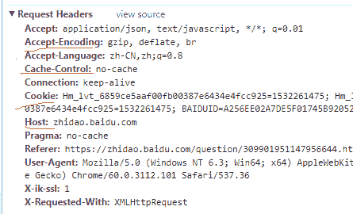
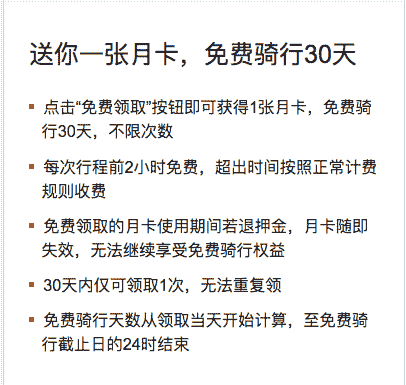

# 摩拜 2018 校招前端工程师笔试卷

## 1

请以图加文字的方式描述一下 css 盒模型

你的答案

本题知识点

摩拜 Java 工程师 C++工程师 iOS 工程师 安卓工程师 运维工程师 前端工程师 算法工程师 PHP 工程师 2018

讨论

[didididididididid](https://www.nowcoder.com/profile/2685534)

CSS 盒模型分为标准盒模型和 IE 盒模型，它们都包括四部分：margin, padding, border, content，其中 IE 的盒模型的宽度包括 padding 和 border，而标准盒模型只包括 content。 CSS3 有个 box-sizing 属性，其属性值 content-box 指定元素的宽度和高度适用于 box 的宽度和高度，border-box 对元素指定宽度和高度包括了元素宽度 content、padding 和 border 的指定。

编辑于 2018-08-07 09:28:58

* * *

[良纵](https://www.nowcoder.com/profile/7704377)

[`www.cnblogs.com/chengzp/p/cssbox.html`](https://www.cnblogs.com/chengzp/p/cssbox.html)

发表于 2018-08-06 19:53:07

* * *

[你把你 offer 给我交了](https://www.nowcoder.com/profile/7815107)

css 盒模型分为 w3c 标准模型和 IE 模型可通过 box-shadow 来设置，content-box 为标准模型，border-box 为 IE 模型最大区别是 IE 模型的宽度和高度是包括 padding 和 border 的，而标准模型只是包括 content

发表于 2018-07-24 11:10:52

* * *

## 2

请用 JavaScript 语言实现

```cpp
编写一个 times 函数，接收 2 个参数，一个字符串类型 str（如 "abc"），一个是 Number 类型 num （如 3），返回一个字符串（这里是 "abcabcabc"）
```

注意：除了**常规的循环方式**之后，有没有**更简单的方式**，**一行代码完成流程的有加分**

本题知识点

摩拜 Java 工程师 C++工程师 iOS 工程师 安卓工程师 运维工程师 前端工程师 算法工程师 PHP 工程师 字符串 *模拟 2018* *讨论

[bettermeooo](https://www.nowcoder.com/profile/6153956)

```cpp
function times(str,n){
  return new Array(n+1).join(str)
}
join()函数用来将数组转化成字符串，数组的每一项用 join（'a'）里面的 a 连接
```

发表于 2018-07-23 14:19:00

* * *

[华科平凡](https://www.nowcoder.com/profile/4939096)

python3

```cpp
a, b = input().split()
print(a * int(b))
```

发表于 2019-02-23 10:21:20

* * *

[知白守黑。](https://www.nowcoder.com/profile/5815807)

function repeatStr(str,n) {
return n>1? str+= repeatStr(str,--n): str=str;
}

发表于 2018-08-01 14:33:25

* * *

## 3

如何获取一个元素节点（id 为 test）的父元素，找到之后如何删除这个元素节点（id 为 test）

你的答案

本题知识点

摩拜 Java 工程师 C++工程师 iOS 工程师 安卓工程师 运维工程师 前端工程师 算法工程师 PHP 工程师 2018

讨论

[梦亦冷](https://www.nowcoder.com/profile/8762557)

var child = document.getElementById("test");
    child.parentNode.removeChild(child);

发表于 2018-08-03 17:56:25

* * *

[无限的爱人](https://www.nowcoder.com/profile/295142568)

```cpp
document.getElementById("test").parentNode.removeChild(document.getElementById("test"));
```

发表于 2018-11-04 23:26:04

* * *

[、夜](https://www.nowcoder.com/profile/933565395)

var eleParent = document.getElementById('test').parentNode      eleParent.removeChild(eleParent.getElementById('test'))

发表于 2018-08-10 22:47:42

* * *

## 4

编写一个 js 函数 jsonp 的处理函数

你的答案

本题知识点

摩拜 Java 工程师 C++工程师 iOS 工程师 安卓工程师 运维工程师 前端工程师 算法工程师 PHP 工程师 2018

讨论

[你把你 offer 给我交了](https://www.nowcoder.com/profile/7815107)

```cpp
 // 手写 jsonp
function myCallback(data) {
    console.log(data)
}

function jsonp(url, data, callback) {
    // data 是否是字符串，是的话证明 data 值就是函数名
    if (typeof data == 'string') {
        callback = data
        data = {}
    }
    // 拼接 data
    url += url.indexOf('?') === -1 ? '?' : '&'
    url += 'callback=' + callback
    var params = ""
    for (var i in data) {
        params += '&' + i + '=' + data[i]
    }
    url += params
    // 在页面插入 script 标签
    var script = document.createElement('script')
    script.setAttribute('src', url)
    document.querySelector('head').appendChild(script)

}

jsonp('http://baidu.com/index.html', { id: 34 }, 'myCallback')
jsonp('http://baidu.com/index.html?name="zjn"', { id: 34 }, 'myCallback') 
```

编辑于 2018-08-03 21:08:43

* * *

[QQ 群](https://www.nowcoder.com/profile/968354)

function myCallback(){    console.log("callback");
}function jsonp(url, data, callback){    if(typeof data === "string"){
        callback = data;
        data = {};    }    var hasParams = url.indexOf('?');
    url += hasParams? '&' : '?'+'callback='+callback;
    var params;
    for(var i in data){        params += '&'+i+'='+data[i];        }
    url += params;
    var script = document.createElement('script');
    script.setAttribute('src', url);
    document.querySelector('body').appendChild(script);
}jsonp('[`baidu.com`](http://baidu.com/)', { id: 34  }, 'myCallback')

发表于 2018-08-03 17:17:09

* * *

## 5

编写一个函数判断参数是否是数组类型，如果是返回 true

你的答案

本题知识点

摩拜 Java 工程师 C++工程师 iOS 工程师 安卓工程师 运维工程师 前端工程师 算法工程师 PHP 工程师 2018

讨论

[、夜](https://www.nowcoder.com/profile/933565395)

方法一：function isArray(arg){return (arg instanceof Array);}方法二：function isArray(arg){return Object.prototype.toString.call(arg) == '[object Array]' ? true : false;}方法三：function isArray(arg){return arg.__proto__.constructor.name == 'Array' ？true : false;}

编辑于 2018-08-10 23:23:11

* * *

[微曦&&Dawn](https://www.nowcoder.com/profile/1223005)

```cpp
function judgeArr(arr){
    console.log(typeof arr);  console.log(Array.isArray(arr)); console.log(Object.prototype.toString.call(arr)); console.log(); } judgeArr([]); judgeArr({}); judgeArr(''); judgeArr(1);
```

还是检验一下吧，typeof arr 会把 Array 和 Object 都返回 true，而 Array.isArray 和 Obejct.prototype.toString 则会判断正确，所以正确答案应该为

```cpp
function judgeArr(arr){ return Array.isArray(arr); //或者 Object.prototype.toString.call(arr) == '[object Array]' }
```

发表于 2018-08-01 22:04:41

* * *

[lucienss](https://www.nowcoder.com/profile/841368106)

1.typeof 只能识别原始类型、function 和 object，无法进一步识别 object 中的不同对象类型；2.验证原型对象：var bool=father.isprototypeof(child);3.检查内部属性 class：Object.prototype.toString.call(obj);4.Array.isArray(obj)

发表于 2018-09-18 08:51:58

* * *

## 6

一般和后端 API 服务通信的方式有哪些 POST 提交的时候，content-type 有哪几种

你的答案

本题知识点

摩拜 Java 工程师 C++工程师 iOS 工程师 安卓工程师 运维工程师 前端工程师 算法工程师 PHP 工程师 2018

讨论

[微曦&&Dawn](https://www.nowcoder.com/profile/1223005)

这里有两个问题，第一个问题：和后端 API 服务通信的方式有哪些

1.  ajax
2.  websocket
3.  SSE
4.  服务器端渲染

第二个问题：POST 方式下，content-type 有哪几种常见的有四种

1.  **application/x-www-form-urlencoded**
2.  ****application/json** **
3.  **multipart/form-data**
4.  **text/xml** 

发表于 2018-08-02 11:29:46

* * *

[一 _ 又](https://www.nowcoder.com/profile/4910954)

AJAX WEBSOCKET content-type:
application/x-www-form-urlencoded **multipart/form-data**application/json
text/xml 

发表于 2018-07-25 19:56:17

* * *

[你把你 offer 给我交了](https://www.nowcoder.com/profile/7815107)

常见媒体格式有 text/html,text/plain,text/xml,text/gif,text/jpeg,text/png 等以 application 开头的媒体格式有：application/xml,application/json,appliction/pdf 等

发表于 2018-07-24 19:32:38

* * *

## 7

以下那个前端框架不是 MVVM 的模式

正确答案: C   你的答案: 空 (错误)

```cpp
Angular
```

```cpp
React
```

```cpp
Ember
```

本题知识点

摩拜 Java 工程师 C++工程师 iOS 工程师 安卓工程师 运维工程师 前端工程师 算法工程师 PHP 工程师 2018 Javascript

讨论

[牛客 421540797 号](https://www.nowcoder.com/profile/421540797)

不好意思，只用 vue

发表于 2020-10-17 11:15:28

* * *

[Mr.VIP](https://www.nowcoder.com/profile/145879266)

React 属于 MVC 框架，单向绑定。

发表于 2018-09-27 16:01:48

* * *

[灯南 _](https://www.nowcoder.com/profile/9111323)

Ember 明明是 MVC 啊。。什么乱七八糟的题目

发表于 2018-07-20 10:21:00

* * *

## 8

前端框架 Vue.js 具备的特性

正确答案: A B   你的答案: 空 (错误)

```cpp
指令
```

```cpp
过滤器
```

```cpp
内置 http 请求
```

```cpp
模板采用 JSX
```

本题知识点

摩拜 Java 工程师 C++工程师 iOS 工程师 安卓工程师 运维工程师 前端工程师 算法工程师 PHP 工程师 2018

讨论

[你快乐吗](https://www.nowcoder.com/profile/5271388)

建议 vue, angular, react, bootstrap 这些内容单独分一个类，不是说不学（防杠），而是这样分类后，更有效率，目标更明确

发表于 2020-11-11 10:37:19

* * *

[微曦&&Dawn](https://www.nowcoder.com/profile/1223005)

Vue 需要通过添加 Vue-resource 来实现 http 请求 JSX 是 React 自带的模板，Vue 有它自带的模板，比如 Vue 单文件组件

发表于 2018-08-02 17:40:06

* * *

[牛客 660985251 号](https://www.nowcoder.com/profile/660985251)

指令和过滤器

编辑于 2020-03-27 14:45:14

* * *

## 9

下列哪些对象有 length 属性

正确答案: A B C D   你的答案: 空 (错误)

```cpp
window
```

```cpp
string
```

```cpp
function
```

```cpp
array
```

本题知识点

摩拜 Java 工程师 C++工程师 iOS 工程师 安卓工程师 运维工程师 前端工程师 算法工程师 PHP 工程师 2018

讨论

[33445](https://www.nowcoder.com/profile/6636329)

Window.length //返回在当前窗口中 frames 的数量（包括 IFRAMES）

String.length //返回字符串中的字符数目

Function //获取一个函数定义的参数数目

Array.length //返回数组中元素的数目

发表于 2018-07-25 10:24:26

* * *

[书生@](https://www.nowcoder.com/profile/809511627)

Function.length 才可以

发表于 2018-09-08 10:44:06

* * *

[Now.](https://www.nowcoder.com/profile/6879425)

注意 function 的返回参数不包含默认参数

编辑于 2018-08-04 16:04:35

* * *

## 10

如何获取 url 中的 query 字段对应的值比如：[`m.mobike.com?source=part1`](https://m.mobike.com?source=part1)现在要编写一个函数获取 source 对应的值 part1

你的答案

本题知识点

摩拜 Java 工程师 C++工程师 iOS 工程师 安卓工程师 运维工程师 前端工程师 算法工程师 PHP 工程师 2018

讨论

[Lucy 王小小王](https://www.nowcoder.com/profile/6787014)

query=(url)=>{var str=url.split('?')[1];if(str){var res=str.split('=')[1];}}

发表于 2018-07-23 15:32:25

* * *

[贰捌](https://www.nowcoder.com/profile/2664071)

let url = "[www.xinlang.com?id=127277](http://www.xinlang.com/?id=127277)"
function getter(url) {
    let v1 = url.split("?")
    if(v1[1].includes("id")) {
        let v2 = v1[1].split("=");
        console.log(v2);
    }

}
getter(url);

发表于 2018-08-26 15:09:13

* * *

[沈顺](https://www.nowcoder.com/profile/747394)

function parseURL(url) {
  const el = document.createElement("a")
  el.href = url
  const search = el.search.replace('?', '')
  let query = {}
  search.split('&').map(str => {
    const [key, value] = str.split('=')
    query[key] = value
  })
  return query
}parseURL('[`m.mobike.com?source=part1`](https://m.mobike.com?source=part1)')

编辑于 2019-01-15 22:29:45

* * *

## 11

对前端工程化的理解，以及任意构建工具(webpack、gulp、grunt、rollup)的某一个使用的一些描述

你的答案

本题知识点

摩拜 Java 工程师 C++工程师 iOS 工程师 安卓工程师 运维工程师 前端工程师 算法工程师 PHP 工程师 2018

讨论

[一 _ 又](https://www.nowcoder.com/profile/4910954)

前端工程化

前端工程是软件工程的一个子类，指的是将软件工程的方法和原理运用在前端开发中, 目的是实现 高效开发，有效协同，质量可控。 广义的前端工程是一个系统工程，需要从软件生命周期的各个方面入手，本质上属于管理科学的方法论。

狭义的前端工程是前端开发流程中的一部分，本质上属于软件技术的范畴和开发的最佳实践。我们平时提到的前端，如果特别说明，一般指的就是狭义上的前端工程。

webpack

webpack 是一个前端模块化方案，更侧重模块打包，我们可以把开发中的所有资源（图片、js 文件、css 文件等）都看成模块，通过 loader（加载器）和 plugins（插件）对资源进行处理，打包成符合生产环境部署的前端资源。 

发表于 2018-07-25 19:56:59

* * *

## 12

以下哪个不是 Node.js 的核心模块

正确答案: C   你的答案: 空 (错误)

```cpp
fs
```

```cpp
path
```

```cpp
request
```

```cpp
http
```

本题知识点

摩拜 Java 工程师 C++工程师 iOS 工程师 安卓工程师 运维工程师 前端工程师 算法工程师 PHP 工程师 前端工程师 摩拜 2018

讨论

[鸢尾飞飞](https://www.nowcoder.com/profile/6246235)

Node.js 的核心模块有：HTTP 模块、URL 模块、Query Strings 模块、File System 模块、Path 模块、Global 模块。

发表于 2018-08-06 17:13:33

* * *

## 13

前端框架 React 不具备的特性

正确答案: C   你的答案: 空 (错误)

```cpp
数据绑定
```

```cpp
组件化
```

```cpp
指令
```

```cpp
没有生命周期钩子函数
```

本题知识点

摩拜 Java 工程师 C++工程师 iOS 工程师 安卓工程师 运维工程师 前端工程师 算法工程师 PHP 工程师 2018

讨论

[Mr.VIP](https://www.nowcoder.com/profile/145879266)

很奇怪的是，react 里面明明是有生命周期钩子函数的，componentDidMount 之类的，但这题最后给了一个没有生命周期钩子的选项，很迷惑。

发表于 2018-09-27 16:20:26

* * *

[Number_DDD](https://www.nowcoder.com/profile/6245047)

组件 Component 的话肯定有，React 的特点就是组建式开发，数据绑定应该是 _refs 把，后两个之中正确的那个目前还没学到...

发表于 2018-08-12 08:39:54

* * *

[chimera](https://www.nowcoder.com/profile/1739884)

嗯？

发表于 2018-07-19 17:58:53

* * *

## 14

下面是 IE 支持的 event 方法

正确答案: B D   你的答案: 空 (错误)

```cpp
preventDefault
```

```cpp
returnValue
```

```cpp
target
```

```cpp
srcElement
```

本题知识点

摩拜 Java 工程师 C++工程师 iOS 工程师 安卓工程师 运维工程师 前端工程师 算法工程师 PHP 工程师 2018

讨论

[芝麻酱嘻嘻嘻](https://www.nowcoder.com/profile/3672139)

IE 的所有事件对象都支持的方法和属性：

*   cancelBubble 默认为 false，设置为 true 就可以取消事件冒泡
*   returnValue 默认为 true，设置为 false 可以取消事件的默认行为
*   srcElement 对于生成事件的 Window 对象、Document 对象或 Element 对象的引用
*   type 被触发事件的类型

DOM 事件的方法（IE 的事件模型不支持）：

*   initEvent() 初始化新创建的 Event 对象的属性
*   preventDefault() 通知浏览器不要执行与事件关联的默认动作
*   stopPropagation() 不再派发事件

发表于 2018-09-20 14:13:52

* * *

[小野市](https://www.nowcoder.com/profile/9391147)

returnValue 属性设置或获取事件的返回值

发表于 2018-08-07 00:12:46

* * *

## 15

下列哪些是预编译 CSS 工具

正确答案: A B D   你的答案: 空 (错误)

```cpp
less
```

```cpp
sass
```

```cpp
bass
```

```cpp
stylus
```

本题知识点

摩拜 C++工程师 前端工程师 2018 CSS

讨论

[honng](https://www.nowcoder.com/profile/633961032)

只选了, less, scss

编辑于 2020-12-20 18:12:59

* * *

[Offer 会有的！](https://www.nowcoder.com/profile/7150957)

CSS 预编译工具有 stylus，sass，less 为什么会出现 CSS 预编译器这个东西呢？这就要谈到 CSS 的不足了：没有变量(新的规范已经支持了)，不支持嵌套，编程可以力较弱，代码复使用性差。这些不足导致写出来的 CSS 维护性极差，同时包含大量重复性的代码；为了弥补这些不足之处，CSS 预编译器应运而生。而谈到 CSS 预编译器，就离不开这三剑客 Sass、Less、Stylus。历史上，最先登场的是 Sass，由于出现最早，所以也是最完善的，有各种丰富的功可以；Less 的出现伴随着 Bootstrap 的流行，因而也取得大量使用户；最后是 Stylus，由 TJ 大神开发(敬大神)，因为其简洁的语法，更像是一门编程语言，写起来非常 Cool。所以下面我们来做一个简单的比照。

发表于 2018-09-25 13:07:29

* * *

[waywordcode](https://www.nowcoder.com/profile/808048549)

我 giao，我就知道一个 less。

发表于 2020-09-17 23:29:13

* * *

## 16

HTTP Request Headers 里面都哪些字段

正确答案: A B   你的答案: 空 (错误)

```cpp
Accept-Encoding
```

```cpp
Content-Length
```

```cpp
Cookies
```

```cpp
Hosts
```

本题知识点

摩拜 Java 工程师 C++工程师 iOS 工程师 安卓工程师 运维工程师 前端工程师 算法工程师 PHP 工程师 2018

讨论

[一 _ 又](https://www.nowcoder.com/profile/4910954)

是 cookie 和 host  都不带 s

发表于 2018-07-25 19:58:56

* * *

[冰一角](https://www.nowcoder.com/profile/6381485)



发表于 2018-07-22 20:34:23

* * *

[sunshines](https://www.nowcoder.com/profile/789803)

坑爹的题目，考拼写错误

发表于 2018-08-09 17:32:22

* * *

## 17

编写一个 js 函数，返回一个字符串：今天是星期几

<dl style="margin&#58;0px 0px 30px&#59;padding&#58;0px&#59;background&#45;color&#58;&#35;FFFFFF&#59;"> <dt style="margin&#58;0px 0px 10px&#59;padding&#58;0px 0px 10px&#59;border&#58;none&#59;">如果是星期一，就返回：今天是星期一如果是星期二，就返回：今天是星期二如果是星期三，就返回：今天是星期三依次类推</dt> <dt style="margin&#58;0px 0px 10px&#59;padding&#58;0px 0px 10px&#59;border&#58;none&#59;"></dt> <dt style="margin&#58;0px 0px 10px&#59;padding&#58;0px 0px 10px&#59;border&#58;none&#59;">注意：除了逻辑和循环判断之外，有没有一行代码可以输出的</dt> <dt style="color&#58;&#35;333333&#59;font&#45;family&#58;arial&#44; STHeiti&#44; &#34;font&#45;size&#58;14px&#59;margin&#58;0px 0px 10px&#59;padding&#58;0px 0px 10px&#59;border&#58;none&#59;"></dt> <dt style="color&#58;&#35;333333&#59;font&#45;family&#58;arial&#44; STHeiti&#44; &#34;font&#45;size&#58;14px&#59;margin&#58;0px 0px 10px&#59;padding&#58;0px 0px 10px&#59;border&#58;none&#59;">
</dt> <dt style="color&#58;&#35;333333&#59;font&#45;family&#58;arial&#44; STHeiti&#44; &#34;font&#45;size&#58;14px&#59;margin&#58;0px 0px 10px&#59;padding&#58;0px 0px 10px&#59;border&#58;none&#59;"></dt> <dt style="color&#58;&#35;333333&#59;font&#45;family&#58;arial&#44; STHeiti&#44; &#34;font&#45;size&#58;14px&#59;margin&#58;0px 0px 10px&#59;padding&#58;0px 0px 10px&#59;border&#58;none&#59;"></dt> <dt style="color&#58;&#35;333333&#59;font&#45;family&#58;arial&#44; STHeiti&#44; &#34;font&#45;size&#58;14px&#59;margin&#58;0px 0px 10px&#59;padding&#58;0px 0px 10px&#59;border&#58;none&#59;"></dt> </dl>

你的答案

本题知识点

摩拜 Java 工程师 C++工程师 iOS 工程师 安卓工程师 运维工程师 前端工程师 算法工程师 PHP 工程师 2018

讨论

[memset(x,0,sizeof(x))](https://www.nowcoder.com/profile/6948233)

const getXQ=(arg)=>{    let x=['星期天','星期一','星期二','星期三','星期四','星期五','星期六'];   returnx[newDate().getDay()]}

发表于 2018-08-04 21:42:28

* * *

[ACE20181207124975](https://www.nowcoder.com/profile/749785302)

function day() {
 return  "今天是星期" + "日一二三四五六".charAt(new Date().getDay());}

发表于 2018-12-07 13:02:02

* * *

[HyOner](https://www.nowcoder.com/profile/3369927)

// 函数实现 myGetDay => `今天是${["星期天","星期一","星期二","星期三","星期四","星期五","星期六"][new Date().getDay()]}`// 函数调用 myGetDay();

发表于 2018-09-06 14:42:17

* * *

## 18

请以你了解的 css 预编译的语法来编写一段样式，效果是：

你的答案

本题知识点

摩拜 Java 工程师 C++工程师 iOS 工程师 安卓工程师 运维工程师 前端工程师 算法工程师 PHP 工程师 2018

讨论

[didididididididid](https://www.nowcoder.com/profile/2685534)

```cpp

```
<!DOCTYPE html> <html lang="en"> <head> <meta charset="UTF-8"> <title>Title</title> <style> *{ padding: 0; margin: 0;
        } h3{ line-height: 50px;
        } div{ width: 350px; height: 600px; background-color: #fff; box-shadow: 0 1px 2px rgba(0,0,0,0.1); margin: 20px auto; padding: 10px;
        } ul{ list-style: none; line-height: 30px;
        } li{ line-height: 20px; background: url(li.png) no-repeat left 7px; padding-left: 10px;
        } /*li{*/  /*display: inline-block;*/  /*position: relative;*/  /*line-height: 20px;*/  /*}*/  /*li:before{*/  /*display: inline-block;*/  /*content: '';*/  /*width: 6px;*/  /*height: 6px;*/  /*margin-right: 10px;*/  /*background-color: #f00;*/  /*vertical-align: middle;*/  /*}*/  </style> </head> <body> <div> <h3>送你一张月卡，免费骑行 30 天</h3> <ul> <li>点击“免费领取”即可获得一张月卡，免费骑行 30 天，不限次数</li> <li>点击“免费领取”即可获得一张月卡，免费骑行 30 天，不限次数</li> <li>点击“免费领取”即可获得一张月卡，免费骑行 30 天，不限次数</li> <li>点击“免费领取”即可获得一张月卡，免费骑行 30 天，不限次数</li> <li>点击“免费领取”即可获得一张月卡</li> <li>点击“免费领取”即可获得一张月卡，免费骑行 30 天，不限次数</li> </ul> </div> </body> </html>
```cpp

```

发表于 2018-08-06 21:46:42

* * **