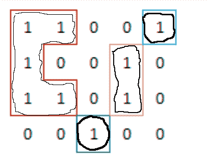

# 广联达 2018 校招测试开发（自动化测试）笔试题

## 1

【编程题】请设计一个类，该类在同一个进程中只能由一个实例，且该实例允许外部访问。

你的答案

本题知识点

广联达 Java 工程师 C++工程师 iOS 工程师 安卓工程师 运维工程师 前端工程师 算法工程师 PHP 工程师 测试工程师 2018

讨论

[Fairy_h](https://www.nowcoder.com/profile/736394289)

这里只针对 Java 语言来进行说明，题目“该类在同一个进程中只能由一个实例，且该实例允许外部访问”，那么很明显就是单例模式了，而单例模式有两种实现，懒汉模式和饿汉模式。

所谓饿汉模式我们可以理解，当前线程对这个实例对象的需求很“饿”，所以就要求我们在类加载好的时候就将初始化的对象赋值给 static 的属性（static 修饰的属性在类被 jvm 加载的时候就在内存中创建一个存储空间）

```cpp

```
public class test2_singleton_hungry {   //声明一个静态实例化对象，在编译器就在内存中划分存储空间且设置为 private，不能被外部访问  private static test2_singleton_hungry test2_singleton_hungry = new test2_singleton_hungry(); //私有构造方法  private test2_singleton_hungry(){   }   //外部只能通过这个方法来获得实例，保证线程安全  public test2_singleton_hungry getInstance(){  return test2_singleton_hungry = new test2_singleton_hungry(); } } 
```cpp

```

而懒汉模式就是我们理解的“lazy_load”，延迟加载，初始化的时候为空，只有用到这个对象的时候才会进行加载，但是如果不做处理的话在多线程情况下会有线程安全问题

```cpp
public class test2_singleton_lazy {  private static final String s = null; //私有构造函数，防止外部访问  private test2_singleton_lazy(){   }   //声明静态实例对象，初始化为空  private static test2_singleton_lazy test2_singleton_lazy = null; //静态工厂调用时才赋值（用静态方法的好处：静态方法不能被重写）  public static test2_singleton_lazy getInstance(){  if(test2_singleton_lazy==null){  test2_singleton_lazy= new test2_singleton_lazy(); }  return test2_singleton_lazy; } }
```

解决的方式有很多，可以加上 synchronized 同步锁，或者将初始化实例对象赋值语句用 static 代码块包起来，因为 static 代码块在类加载时候就执行且只会执行一次

发表于 2018-11-30 16:45:42

* * *

[邓胜涛 1](https://www.nowcoder.com/profile/4657059)

设计模式的单例 public class singleton{            //声明一个静态变量
            private static singleton instance;
            //构造器            private singleton（）{            }
            //getter 方法
            public static singleton getInstance(){
                  if(instance==null){                    instance=new singleton();                   }                return instance;
            }
}

发表于 2018-11-01 10:34:12

* * *

[Olive201801231108679](https://www.nowcoder.com/profile/3040486)

Lazy model:
public class Singleton{
private static Singleton instance;
private singleton(){}
public static Singleton getInstance (){
if(instance==null){
instance=new Singleton();
}
return instance;
}

}

发表于 2018-10-29 14:05:53

* * *

## 2

【编程题】编写一个函数，求一个数的二进制表示中的 1 位的个数，例如 9 的二进制表示为 1001，1 位的个数为 2。

你的答案

本题知识点

广联达 Java 工程师 C++工程师 iOS 工程师 安卓工程师 运维工程师 前端工程师 算法工程师 PHP 工程师 测试工程师 2018

讨论

[学习学习学习啦啦啦啦啦](https://www.nowcoder.com/profile/789894778)

 public static void main(String[] args) {
     Scanner in = new Scanner(System.in);
     while (in.hasNextInt()) {// 注意，如果输入是多个测试用例，请通过 while 循环处理多个测试用例
         int a = in.nextInt();
         String s = Integer.toBinaryString(a) ;
         String str = "1";
         int num = Integer.parseInt(s);
         //System.out.println(num);
         change(s, str); 

       //System.out.println(num);
     }

发表于 2019-04-07 12:54:18

* * *

[人工智障码农](https://www.nowcoder.com/profile/3119701)

```cpp
 #include<iostream>

	usingnamespacestd;

	intmain()

	{

	intn,count=0;

	cin>>n;

	while(n!=0)

	{

	 if(n%2)

	 {

	  count++;

	 }

	 n=n/2;

	}

	cout<<count;

	return0;

	} 
```

发表于 2018-08-29 10:26:23

* * *

[朴墨](https://www.nowcoder.com/profile/195821397)

```cpp
public static void main(String[] args){
    Scanner scanner=new Scanner(System.in);
    int num = scanner.nextInt();
    String num2=String.valueOf(Integer.toBinaryString(num));
    int j=0;
    for(int i=0;i<num2.length();i++){
        if(num2.charAt(i)=='1')
            j++;
    }
    System.out.println(j);
}
```

发表于 2021-06-20 14:20:42

* * *

## 3

【编程题】知某次聚会敏感词有 N 个人参加，这 N 个人来自 26 个地区，现在将 26 个地区使用数字 0-25 表示，使用整数数组 Locations 存储这 N 个人的地区, 请返回一个 bool 值, True 代表所有人的地区全都不同，False 代表存在相同地区。要求：不能使用额外的存储结构。

你的答案

本题知识点

广联达 Java 工程师 C++工程师 iOS 工程师 安卓工程师 运维工程师 前端工程师 算法工程师 PHP 工程师 测试工程师 2018

讨论

[邓胜涛 1](https://www.nowcoder.com/profile/4657059)

冒泡排序：比对数据：只要存在相同地区的人，就返回一个 false 就完成了

public boolean checkDif(int[] locations){

        if(locations.length()>26) return false;

                for(int i=0;i<locations.length();i++){

                        for(int j=locations.length()-1;j>i;j--){

                                if(locations[i]==locations[j]) return false;

                        }

                }

         return true;

}

发表于 2018-11-01 11:15:18

* * *

[girl_ling](https://www.nowcoder.com/profile/7156389)

0 到 25 相加等于 325，把数组相加，如果等于 325 返回 True，不相等返回 False

发表于 2021-06-01 19:01:48

* * *

[Lucky.chen](https://www.nowcoder.com/profile/1032377)

```cpp
def isSamePlace(Locations: list):
    if len(Locations) == len(list(set(Locations)):
        return True
    else:
        return False
```

发表于 2021-02-26 14:51:27

* * *

## 4

【编程题】编写一个函数，实现字符串 ASrcStr 以 Delimiter 为分隔符第 AIndex 项的子串。

你的答案

本题知识点

广联达 Java 工程师 C++工程师 iOS 工程师 安卓工程师 运维工程师 前端工程师 算法工程师 PHP 工程师 测试工程师 2018

讨论

[kaizhong.wu](https://www.nowcoder.com/profile/137017801)

```cpp
#-*- coding:utf-8 -*-

# 实现字符串 ASrcStr 以 Delimiter 为分隔符第 AIndex 项的子串。

def split_str(ASrcStr,Delimiter,AIndex):
    result = ASrcStr.split(Delimiter)
    return result[AIndex]

if __name__ == "__main__":
    print(split_str("fadjfjaldjfkl2j3k4j3k2lrj","j",2))

```

发表于 2020-06-29 15:50:50

* * *

[mumucgq](https://www.nowcoder.com/profile/8940520)

public class Test {

    public String getSubStr(String str , String delimiter ,int index){

        String[] arr = str.split(delimiter);

        return arr[index];

    }
}

发表于 2021-03-11 17:43:41

* * *

## 5

【编程题】一个只包含 0 和 1 的阵列，找到 1 的组的个数，每个组的定义是横向和纵向相邻的值都为 1，如图中一共有 4 个组，用不同颜色的框分割（可以参见不同粗细勾画起来的框）。 

你的答案

本题知识点

广联达 Java 工程师 C++工程师 iOS 工程师 安卓工程师 运维工程师 前端工程师 算法工程师 PHP 工程师 测试工程师 2018

讨论

[Daruma](https://www.nowcoder.com/profile/9994322)

```cpp
class Couples{
    int data[][] = null;
    int count = 0;
    Couples(int data [][]){
        this.data=data;
    }

    public Integer getCouples(){
        for(int i=0; i<this.data.length; i++){
            for(int j=0; j<this.data[i].length;j++){
                if(this.data[i][j] == 1) {
                    loop(i, j);
                    this.count += 1;
                }
            }
        }
        return this.count;
    }
    // 递归置零
    void loop(int i, int j){
        if(this.data[i][j] == 1){
            this.data[i][j] = 0;
            if (i != 0) {
                loop(i - 1, j);
            }
            if (i != this.data.length - 1) {
                loop(i + 1, j);
            }
            if (j != 0) {
                loop(i, j - 1);
            }
            if (j != this.data[i].length - 1) {
                loop(i, j + 1);
            }
        }
    }
}
```

发表于 2021-02-24 13:41:25

* * *