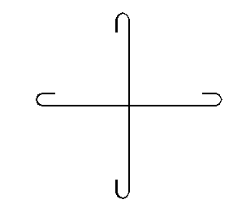
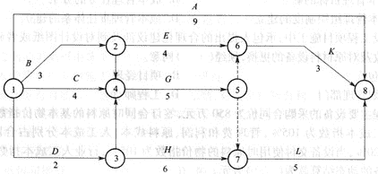

# 广联达 2018 校园招聘-测试工程师（建筑相关专业方向）笔试题

## 1

**在楼板平面图中，如下图所示的钢筋表示(    )钢筋。** 

正确答案: B   你的答案: 空 (错误)

```cpp
顶层
```

```cpp
底层
```

```cpp
顶层和底层
```

```cpp
都不是
```

本题知识点

广联达 Java 工程师 C++工程师 iOS 工程师 安卓工程师 运维工程师 前端工程师 算法工程师 PHP 工程师

## 2

**结构施工土中的圈梁表示(    )**

正确答案: B   你的答案: 空 (错误)

```cpp
GL
```

```cpp
QL
```

```cpp
JL
```

```cpp
KL
```

本题知识点

广联达 Java 工程师 C++工程师 iOS 工程师 安卓工程师 运维工程师 前端工程师 算法工程师 PHP 工程师

## 3

**φ^L 表示(    )**

正确答案: B   你的答案: 空 (错误)

```cpp
Ⅰ级光圆钢筋
```

```cpp
冷拉Ⅰ级钢筋
```

```cpp
Ⅰ级锰硅人字纹钢筋
```

```cpp
Ⅰ级螺纹钢筋
```

本题知识点

广联达 Java 工程师 C++工程师 iOS 工程师 安卓工程师 运维工程师 前端工程师 算法工程师 PHP 工程师

## 4

**(    )施工方便，但易结露、易起尘、导热系数大**

正确答案: B   你的答案: 空 (错误)

```cpp
水磨石地面
```

```cpp
水泥砂浆地面
```

```cpp
木地面
```

```cpp
水泥石屑地面
```

本题知识点

广联达 Java 工程师 C++工程师 iOS 工程师 安卓工程师 运维工程师 前端工程师 算法工程师 PHP 工程师

## 5

**民用建筑包括居住建筑和公共建筑，下面属于居住建筑的是(    )**

正确答案: C   你的答案: 空 (错误)

```cpp
幼儿园
```

```cpp
疗养院
```

```cpp
宿舍
```

```cpp
旅馆
```

本题知识点

广联达 Java 工程师 C++工程师 iOS 工程师 安卓工程师 运维工程师 前端工程师 算法工程师 PHP 工程师

## 6

**板块编号中 XB 表示？(     )**

正确答案: B   你的答案: 空 (错误)

```cpp
现浇板
```

```cpp
悬挑板
```

```cpp
延伸悬挑板
```

```cpp
屋面现浇板
```

本题知识点

广联达 Java 工程师 C++工程师 iOS 工程师 安卓工程师 运维工程师 前端工程师 算法工程师 PHP 工程师

讨论

[牛客 701617314 号](https://www.nowcoder.com/profile/701617314)

A

发表于 2021-04-27 15:36:54

* * *

## 7

**11G101-1 P74，剪力墙上的顶层连梁在洞口范围、纵筋锚固范围均须配置箍筋，请问洞口范围箍筋布置的起步筋距离（     ）、纵筋锚固范围箍筋布置的起步筋距离(    )**

正确答案: C   你的答案: 空 (错误)

```cpp
50mm、50mm
```

```cpp
100mm、100mm
```

```cpp
50mm、100mm
```

```cpp
100mm、50mm
```

本题知识点

广联达 Java 工程师 C++工程师 iOS 工程师 安卓工程师 运维工程师 前端工程师 算法工程师 PHP 工程师

## 8

**下图所示双代号网络计划的关键路线为(     )****** 

正确答案: D   你的答案: 空 (错误)

```cpp
①—⑧
```

```cpp
①—②—⑥—⑧
```

```cpp
①—③—⑦—⑧
```

```cpp
①—④—⑤—⑦—⑧
```

本题知识点

广联达 Java 工程师 C++工程师 iOS 工程师 安卓工程师 运维工程师 前端工程师 算法工程师 PHP 工程师

讨论

[一生媛来为你](https://www.nowcoder.com/profile/303140093)

持续时间最长的一条通路为关键线路

发表于 2019-08-16 13:38:55

* * *

## 9

**按照我国目前的规定，工程量清单应采用综合单价法，其中分部分项工程的综合单价由(      )组成**

正确答案: C   你的答案: 空 (错误)

```cpp
人工费、材料费、机械费
```

```cpp
人工费、材料费、机械费、管理费
```

```cpp
人工费、材料费、机械费、管理费、利润
```

```cpp
人工费、材料费、机械费、管理费、利润、规费和税金
```

本题知识点

广联达 Java 工程师 C++工程师 iOS 工程师 安卓工程师 运维工程师 前端工程师 算法工程师 PHP 工程师

讨论

[新知](https://www.nowcoder.com/profile/113913647)

[综合单价](https://www.baidu.com/s?wd=%E7%BB%BC%E5%90%88%E5%8D%95%E4%BB%B7&tn=SE_PcZhidaonwhc_ngpagmjz&rsv_dl=gh_pc_zhidao)法的分部分项单价为全费用单价，其内容包括直接工程费、间接费、利润、风险因素、规费及税金。

发表于 2020-05-11 09:28:49

* * *

## 10

**对涉及结构安全和使用功能的重要分部工程、专业工程应进行****（       ）**

正确答案: C   你的答案: 空 (错误)

```cpp
全部检验
```

```cpp
免去检验
```

```cpp
功能性抽样检测
```

```cpp
抽样检验
```

本题知识点

广联达 Java 工程师 C++工程师 iOS 工程师 安卓工程师 运维工程师 前端工程师 算法工程师 PHP 工程师

## 11

**建设工程项目管理的核心任务是(    )**

正确答案: D   你的答案: 空 (错误)

```cpp
目标规划
```

```cpp
目标比选
```

```cpp
目标论证
```

```cpp
目标控制
```

本题知识点

广联达 Java 工程师 C++工程师 iOS 工程师 安卓工程师 运维工程师 前端工程师 算法工程师 PHP 工程师

## 12

**在编制工程量清单时，分部分项工程量清单的内容包括(    )。**

正确答案: C   你的答案: 空 (错误)

```cpp
项目编码、计量单位、工程数量、综合单价
```

```cpp
项目名称、计量单位、工程数量、综合单价
```

```cpp
项目编码、项目名称、计量单位、工程数量
```

```cpp
项目编码、项目名称、工程数量、综合单价
```

本题知识点

广联达 Java 工程师 C++工程师 iOS 工程师 安卓工程师 运维工程师 前端工程师 算法工程师 PHP 工程师

## 13

**设计使用年限 50 年的普通住宅工程，在加大混凝土保护层的前提下，其结构混凝土的强度等级不应低于(         )。**

正确答案: A   你的答案: 空 (错误)

```cpp
C20
```

```cpp
C25
```

```cpp
C30
```

```cpp
C35
```

本题知识点

广联达 Java 工程师 C++工程师 iOS 工程师 安卓工程师 运维工程师 前端工程师 算法工程师 PHP 工程师

讨论

[牛妹](https://www.nowcoder.com/profile/826546)

本题考查的是建筑工程的可靠性。设计年限为 50 年的建筑物，其混凝土强度等级不应低于 C25。在加大混凝土保护层的前提下，其混凝土强度等级不应低于 C20。

发表于 2019-09-18 11:04:39

* * *

## 14

**屋建筑工程施工总承包企业资质分为(    )个等级。**

正确答案: D   你的答案: 空 (错误)

```cpp
1
```

```cpp
2
```

```cpp
3
```

```cpp
4
```

本题知识点

广联达 Java 工程师 C++工程师 iOS 工程师 安卓工程师 运维工程师 前端工程师 算法工程师 PHP 工程师

## 15

**监理招标主要是对监理单位(     )的选择。**

正确答案: B   你的答案: 空 (错误)

```cpp
报价
```

```cpp
能力
```

```cpp
监理人员数量
```

```cpp
设备
```

本题知识点

广联达 Java 工程师 C++工程师 iOS 工程师 安卓工程师 运维工程师 前端工程师 算法工程师 PHP 工程师

## 16

**业主在(     )合同中承担的风险最小**

正确答案: B   你的答案: 空 (错误)

```cpp
可调总价
```

```cpp
不可调总价
```

```cpp
单价
```

```cpp
成本加酬金
```

本题知识点

广联达 Java 工程师 C++工程师 iOS 工程师 安卓工程师 运维工程师 前端工程师 算法工程师 PHP 工程师

## 17

**投标保证金一般不得超过投标总价的(     )。**

正确答案: B   你的答案: 空 (错误)

```cpp
1%
```

```cpp
2%
```

```cpp
5%
```

```cpp
10%
```

本题知识点

广联达 Java 工程师 C++工程师 iOS 工程师 安卓工程师 运维工程师 前端工程师 算法工程师 PHP 工程师

讨论

[一生媛来为你](https://www.nowcoder.com/profile/303140093)

投标保证金不得超过投标总价的 2%且不得超过 80 万元

发表于 2019-08-16 13:40:39

* * *

## 18

**某混凝土工程直接工程费为 100 万元，以直接费为基础计算建筑安装工程费。其中措施费为直接工程费的 5%，间接费费率为 8%，利润率为 4%，综合税率为 3.41%。则该工程的建筑安装工程含税造价为(     )。**

正确答案: C   你的答案: 空 (错误)

```cpp
117.93 万元
```

```cpp
120.99 万元
```

```cpp
121.96 万元
```

```cpp
122.10 万元
```

本题知识点

广联达 Java 工程师 C++工程师 iOS 工程师 安卓工程师 运维工程师 前端工程师 算法工程师 PHP 工程师

讨论

[昔草素晴](https://www.nowcoder.com/profile/224938030)

直接工程费+措施费=直接费，只要求出措施费，就可以得出计算基数直接费，由条件可知，措施费为直接工程费的 5％，等于 100×5％=5 万元，由此得出计算基数直接费=100+5=105 万元。间接费费率为 8％，计算基数又是 105，所以间接费=105×8％=8.4 万元。利润的计算基数为直接费+间接费=105+8.4=113.4。利润为 113.4×4％=4.536 万元。至此可以得出不含税的造价为 113.4+4.536=117.936。含税造价=不含税造价+税金=117.936+117.936×3.41％=121.9576176 四舍五入得出含税造价为 121.96 万元。

发表于 2019-10-09 16:10:20

* * *

## 19

**下列工程造价管理活动中，不属于工程量清单计价活动的是(     )。**

正确答案: D   你的答案: 空 (错误)

```cpp
工程支付
```

```cpp
索赔与现场签证
```

```cpp
工程计价争议处理
```

```cpp
竣工决算
```

本题知识点

广联达 Java 工程师 C++工程师 iOS 工程师 安卓工程师 运维工程师 前端工程师 算法工程师 PHP 工程师

## 20

**下列哪个费用不属于非竞争性费用(     )。**

正确答案: D   你的答案: 空 (错误)

```cpp
安全文明施工费
```

```cpp
规费
```

```cpp
税金
```

```cpp
检验试验费
```

本题知识点

广联达 Java 工程师 C++工程师 iOS 工程师 安卓工程师 运维工程师 前端工程师 算法工程师 PHP 工程师

讨论

[新知](https://www.nowcoder.com/profile/113913647)

措施项目清单中的安全文明施工费应按照国家或省级、行业建设主管部门的规定计价，不得作为竞争性费用。规费和税金应按国家或省级、行业建设主管部门的规定计算，不得作为竞争性费用。

发表于 2020-05-11 09:52:14

* * *

## 21

**预付款的支付比例不宜高于合同价款的(     )**

正确答案: C   你的答案: 空 (错误)

```cpp
10%
```

```cpp
20%
```

```cpp
30%
```

```cpp
40%
```

本题知识点

广联达 Java 工程师 C++工程师 iOS 工程师 安卓工程师 运维工程师 前端工程师 算法工程师 PHP 工程师

## 22

**某建设工程施工合同约定，合同工期为 18 个月，合同价款为 2000 万元，建设单位在申请领取施工许可证时，应当到位的建设资金原则上不得少于(          )。**

正确答案: D   你的答案: 空 (错误)

```cpp
100
```

```cpp
200
```

```cpp
1000
```

```cpp
600
```

本题知识点

广联达 Java 工程师 C++工程师 iOS 工程师 安卓工程师 运维工程师 前端工程师 算法工程师 PHP 工程师

## 23

**与邀请招标相比，公开招标的最大优点是(     )**

正确答案: D   你的答案: 空 (错误)

```cpp
节省招标费用
```

```cpp
招标时间短
```

```cpp
投标单位的中标机率高
```

```cpp
竞争激烈
```

本题知识点

广联达 Java 工程师 C++工程师 iOS 工程师 安卓工程师 运维工程师 前端工程师 算法工程师 PHP 工程师

## 24

**施工合同中，承包人按照工程师提出的施工进度计划修改建议进行了修改，由于修改后的计划不合理而导致的窝工损失应当由(     )承担。**

正确答案: C   你的答案: 空 (错误)

```cpp
发包人
```

```cpp
承包人
```

```cpp
工程师
```

```cpp
发包人与承包人共同
```

本题知识点

广联达 Java 工程师 C++工程师 iOS 工程师 安卓工程师 运维工程师 前端工程师 算法工程师 PHP 工程师

## 25

**委托任务并负责支付报酬的一方称(     )**

正确答案: B   你的答案: 空 (错误)

```cpp
承包人
```

```cpp
发包人
```

```cpp
出资人
```

```cpp
出工人
```

本题知识点

广联达 Java 工程师 C++工程师 iOS 工程师 安卓工程师 运维工程师 前端工程师 算法工程师 PHP 工程师

## 26

**计算机网络是按照(     )相互通信的**

正确答案: C   你的答案: 空 (错误)

```cpp
信息交换方式
```

```cpp
传输装置
```

```cpp
网络协议
```

```cpp
分类标准
```

本题知识点

广联达 Java 工程师 C++工程师 iOS 工程师 安卓工程师 运维工程师 前端工程师 算法工程师 PHP 工程师 牛客

讨论

[叮丁 xy/冬咚](https://www.nowcoder.com/profile/113118560)

C  也就是以 tcp/ip 协议互相通讯。

发表于 2018-09-19 20:44:34

* * *

## 27

**计算机中,RAM 因断电而丢失的信息待再通电后(           )恢复**

正确答案: D   你的答案: 空 (错误)

```cpp
能全部
```

```cpp
不能全部
```

```cpp
能部分
```

```cpp
一点不能
```

本题知识点

广联达 Java 工程师 C++工程师 iOS 工程师 安卓工程师 运维工程师 前端工程师 算法工程师 PHP 工程师

讨论

[牛客 375273164 号](https://www.nowcoder.com/profile/375273164)

RAM：指运行内存，仅计算机运行时存储内容，相当于内存条；ROM：指固定内存，相当于硬盘

发表于 2021-09-27 13:17:23

* * *

## 28

**关系数据库中的数据逻辑结构是(     )。**

正确答案: D   你的答案: 空 (错误)

```cpp
层次结构
```

```cpp
树形结构
```

```cpp
网状结构
```

```cpp
二维表格
```

本题知识点

广联达 Java 工程师 C++工程师 iOS 工程师 安卓工程师 运维工程师 前端工程师 算法工程师 PHP 工程师

讨论

[起名困难户啊啊](https://www.nowcoder.com/profile/77640305)

我猜是选择 B 吧，不知道对不对


发表于 2020-05-20 11:09:37

* * *

[牛客 929788326 号](https://www.nowcoder.com/profile/929788326)

#include studio string，厉害了，哈哈哈 发表于 2020-05-20 10:45:15

* * *

[就是这么随意](https://www.nowcoder.com/profile/300495398)

厉害了

发表于 2020-05-20 10:27:43

* * *

## 29

**根据是否关注程序内部代码实现，可以把测试方法分为(    )。**

正确答案: C   你的答案: 空 (错误)

```cpp
α测试和β测试
```

```cpp
单元测试和功能测试环境
```

```cpp
黑盒测试，白盒测试和灰盒测试
```

```cpp
边界测试和常规测试
```

本题知识点

广联达 Java 工程师 C++工程师 iOS 工程师 安卓工程师 运维工程师 前端工程师 算法工程师 PHP 工程师

## 30

**软件测试的目的是（     ）。**

正确答案: B   你的答案: 空 (错误)

```cpp
试验性运行软件
```

```cpp
发现软件错误
```

```cpp
证明软件正确
```

```cpp
找出软件中全部错误
```

本题知识点

广联达 Java 工程师 C++工程师 iOS 工程师 安卓工程师 运维工程师 前端工程师 算法工程师 PHP 工程师

## 31

**建筑详图的特点是(     )**

正确答案: A C D   你的答案: 空 (错误)

```cpp
比例大
```

```cpp
节点多
```

```cpp
图示详尽
```

```cpp
尺寸标注齐全
```

本题知识点

广联达 Java 工程师 C++工程师 iOS 工程师 安卓工程师 运维工程师 前端工程师 算法工程师 PHP 工程师

## 32

**现浇钢筋混凝土板的施工图纸包括(     )**

正确答案: A B C   你的答案: 空 (错误)

```cpp
钢筋表
```

```cpp
平面图
```

```cpp
断面图
```

```cpp
构件统计表
```

本题知识点

广联达 Java 工程师 C++工程师 iOS 工程师 安卓工程师 运维工程师 前端工程师 算法工程师 PHP 工程师

## 33

**常用的一般抹灰做法有(      )**

正确答案: A C E   你的答案: 空 (错误)

```cpp
石灰砂浆面
```

```cpp
水刷石面
```

```cpp
纸筋石灰浆面
```

```cpp
斩假石面
```

```cpp
混合砂浆面
```

本题知识点

广联达 Java 工程师 C++工程师 iOS 工程师 安卓工程师 运维工程师 前端工程师 算法工程师 PHP 工程师

## 34

**地坪层主要由(     )构成。**

正确答案: A B C D   你的答案: 空 (错误)

```cpp
面层
```

```cpp
垫层
```

```cpp
结构层
```

```cpp
素土夯实层
```

```cpp
找坡层
```

本题知识点

广联达 Java 工程师 C++工程师 iOS 工程师 安卓工程师 运维工程师 前端工程师 算法工程师 PHP 工程师

## 35

**单位工程质量验收合格应符合(     )等规定。**

正确答案: B D E   你的答案: 空 (错误)

```cpp
所含分项工程的质量验收均应合格
```

```cpp
质量控制资料应完整
```

```cpp
所含分项工程有关安全和功能的检测资料应完整
```

```cpp
主要功能项目的抽查结果应符合相关专业质量验收规范的规定
```

```cpp
观感质量验收应符合要求
```

本题知识点

广联达 Java 工程师 C++工程师 iOS 工程师 安卓工程师 运维工程师 前端工程师 算法工程师 PHP 工程师

## 36

**业主方是建设工程项目生产过程的总集成者，即(     )的集成。**

正确答案: A B E   你的答案: 空 (错误)

```cpp
人力资源
```

```cpp
物质资源
```

```cpp
精神资源
```

```cpp
设计
```

```cpp
知识
```

本题知识点

广联达 Java 工程师 C++工程师 iOS 工程师 安卓工程师 运维工程师 前端工程师 算法工程师 PHP 工程师

## 37

**一个建设工程项目有不同类型和不同用途的信息，为了有组织地存储信息、方便信息的检索和信息的加工整理，必须对(      )信息进行编码 。**

正确答案: A B C D   你的答案: 空 (错误)

```cpp
项目的政府主管部门和各参与单位
```

```cpp
项目的实施的工作项
```

```cpp
项目的工程档案
```

```cpp
项目的进展报告和各类报表
```

```cpp
项目的投资项(施工方)/成本项(业主方)
```

本题知识点

广联达 Java 工程师 C++工程师 iOS 工程师 安卓工程师 运维工程师 前端工程师 算法工程师 PHP 工程师

## 38

**按照《建筑安装工程费用项目组成》的规定，规费包括（     ）。**

正确答案: C D E   你的答案: 空 (错误)

```cpp
安全施工费
```

```cpp
环境保护费
```

```cpp
工程排污费
```

```cpp
工程定额测定费
```

```cpp
住房公积金
```

本题知识点

广联达 Java 工程师 C++工程师 iOS 工程师 安卓工程师 运维工程师 前端工程师 算法工程师 PHP 工程师

## 39

**根据《工程建设项目招标范围和规模标准规定》，关系社会公共利益、公众安全的基础设施项目的范围包括(          )。**

正确答案: A B C E   你的答案: 空 (错误)

```cpp
防洪、灌溉、排涝、引（供）水、滩涂治理等水利项目
```

```cpp
垃圾处理、地下管道、公共停车场等城市设施项目
```

```cpp
邮政、电信枢纽、通信、信息网络等邮电通讯项目
```

```cpp
供水、供电、供气、供热等市政工程项目
```

```cpp
生态环境保护项目
```

本题知识点

广联达 Java 工程师 C++工程师 iOS 工程师 安卓工程师 运维工程师 前端工程师 算法工程师 PHP 工程师

讨论

[dataogege123](https://www.nowcoder.com/profile/457050957)

没有市政项目这一项。

发表于 2019-09-13 15:36:38

* * *

## 40

**用人单位可以解除劳动合同,但是应当提前 30 日以书面形式通知劳动者本人或者额外支付劳动者一个 月工资的有(           )。**

正确答案: B D E   你的答案: 空 (错误)

```cpp
严重违反用人单位规章制度的
```

```cpp
劳动者患病或者非因工负伤,在规定的医疗期满后不能从事原工作,也不能从事由用人单位另行安排的工作
```

```cpp
严重失职,营私舞弊,对用人单位造成重大损害的
```

```cpp
劳动者不能胜任工作,经过培训或者调整工作岗位,仍不能胜任工作
```

```cpp
劳动合同订立时所依据的客观情况发生重大变化,致使劳动合同无法履行,经当事人协商不能就变更劳动合同内容达成协议的
```

本题知识点

广联达 Java 工程师 C++工程师 iOS 工程师 安卓工程师 运维工程师 前端工程师 算法工程师 PHP 工程师

## 41

**环境保护法有如下特点(     )。**

正确答案: A B C D   你的答案: 空 (错误)

```cpp
科学性
```

```cpp
综合性
```

```cpp
区域性
```

```cpp
奖励与惩罚相结合
```

本题知识点

广联达 Java 工程师 C++工程师 iOS 工程师 安卓工程师 运维工程师 前端工程师 算法工程师 PHP 工程师

## 42

**施工合同可撤销的情形有(    )。**

正确答案: A D   你的答案: 空 (错误)

```cpp
在订立施工合同时显失公平
```

```cpp
施工单位以欺诈手段订立，且损害了国家利益
```

```cpp
违反了《建筑法》的强制性规定
```

```cpp
订立合同时，建设单位存在重大误解
```

```cpp
损害社会公共利益
```

本题知识点

广联达 Java 工程师 C++工程师 iOS 工程师 安卓工程师 运维工程师 前端工程师 算法工程师 PHP 工程师

讨论

[dataogege123](https://www.nowcoder.com/profile/457050957)

可撤销之前是合同有效的，违法的东西合同是无效的

发表于 2019-09-13 15:37:52

* * *

## 43

**设备购置费包括(     )。**

正确答案: A B E   你的答案: 空 (错误)

```cpp
设备原价
```

```cpp
设备国内运输费用
```

```cpp
设备安装调试费
```

```cpp
单台设备试运转费
```

```cpp
设备采购保管费
```

```cpp
装卸费
```

本题知识点

广联达 Java 工程师 C++工程师 iOS 工程师 安卓工程师 运维工程师 前端工程师 算法工程师 PHP 工程师

## 44

**下列选项中，属于建筑安装工程费用中的人工费的有(    )**

正确答案: A C   你的答案: 空 (错误)

```cpp
按规定发放的生产工人物价补贴
```

```cpp
生产工人劳动保护费
```

```cpp
生产工人劳动竞赛奖金
```

```cpp
生产工人劳动保险和职工福利费
```

本题知识点

广联达 Java 工程师 C++工程师 iOS 工程师 安卓工程师 运维工程师 前端工程师 算法工程师 PHP 工程师

## 45

**建筑安装工程费包括(    )。**

正确答案: A B C D   你的答案: 空 (错误)

```cpp
人工费
```

```cpp
材料费
```

```cpp
施工机具使用费
```

```cpp
规费
```

```cpp
税费
```

本题知识点

广联达 Java 工程师 C++工程师 iOS 工程师 安卓工程师 运维工程师 前端工程师 算法工程师 PHP 工程师

## 46

**企业管理费包括(     )。**

正确答案: A B C D   你的答案: 空 (错误)

```cpp
管理人员工资
```

```cpp
办公费
```

```cpp
财产保险费
```

```cpp
财务费
```

```cpp
补贴
```

本题知识点

广联达 Java 工程师 C++工程师 iOS 工程师 安卓工程师 运维工程师 前端工程师 算法工程师 PHP 工程师

## 47

**措施项目费包括(     )。**

正确答案: A B D E   你的答案: 空 (错误)

```cpp
安全文明施工费
```

```cpp
已完工程及设备保护费
```

```cpp
工程排污费
```

```cpp
工程定位复测费
```

```cpp
特殊地区施工增加费
```

本题知识点

广联达 Java 工程师 C++工程师 iOS 工程师 安卓工程师 运维工程师 前端工程师 算法工程师 PHP 工程师

讨论

[牛客 743388044 号](https://www.nowcoder.com/profile/743388044)

工程排污费属于规费

发表于 2021-09-15 20:30:23

* * *

## 48

**工程实际进度与进度计划不符时，承包人应当按照工程师的要求提出改进措施(     )。**

正确答案: A B   你的答案: 空 (错误)

```cpp
需经工程师确认后才能执行
```

```cpp
因承包人自身的原因造成工程实际进度与经确认的进度计划不符的，所有后果都由承包商自行承担
```

```cpp
因承包人自身原因造成的，工程师只对改进措施的效果负责
```

```cpp
采用改进措施后，必须顺延工期
```

```cpp
改进措施后，进度仍然不符的，工程师可以要求承包人修改进度计划，并经工程师确认，这种确认是工程师对工程延期的批准
```

本题知识点

广联达 Java 工程师 C++工程师 iOS 工程师 安卓工程师 运维工程师 前端工程师 算法工程师 PHP 工程师

## 49

**下列工程建设项目必须进行招标的有(     )。**

正确答案: A B C   你的答案: 空 (错误)

```cpp
大型基础设施项目
```

```cpp
国家融资的项目
```

```cpp
使用国际组织贷款的项目
```

```cpp
涉及国家安全的项目
```

本题知识点

广联达 Java 工程师 C++工程师 iOS 工程师 安卓工程师 运维工程师 前端工程师 算法工程师 PHP 工程师

## 50

**《建设工程价款结算暂行办法》规定合同价款的确定可采用的方式(     )**

正确答案: A C E   你的答案: 空 (错误)

```cpp
固定总价
```

```cpp
可调价格
```

```cpp
固定单价
```

```cpp
工程预算价
```

```cpp
成本加酬金
```

本题知识点

广联达 Java 工程师 C++工程师 iOS 工程师 安卓工程师 运维工程师 前端工程师 算法工程师 PHP 工程师

## 51

**总分包模式与平行承包模式共有的特点是(     )**

正确答案: C D   你的答案: 空 (错误)

```cpp
有利于工程项目的组织管理
```

```cpp
有利于控制工程造价
```

```cpp
有利于控制工程质量
```

```cpp
有利于缩短建设工期
```

```cpp
有利于建设单位择优选择承包单位
```

本题知识点

广联达 Java 工程师 C++工程师 iOS 工程师 安卓工程师 运维工程师 前端工程师 算法工程师 PHP 工程师

## 52

**在建设工程项目的招投标活动中，某投标人以低于成本的报价竞标。则(           )。**

正确答案: A D   你的答案: 空 (错误)

```cpp
该行为目的是为了排挤其他对手，应当禁止
```

```cpp
没有违背诚实信用原则，不应禁止
```

```cpp
是降低了工程造价，应当提倡
```

```cpp
该投标文件应作废标处理
```

```cpp
其做法符合低价中标原则，不应禁止
```

本题知识点

广联达 Java 工程师 C++工程师 iOS 工程师 安卓工程师 运维工程师 前端工程师 算法工程师 PHP 工程师

## 53

**一个计算机网络应包含(      )等三个主要组成部分**

正确答案: A B E   你的答案: 空 (错误)

```cpp
通信子网
```

```cpp
若干主机
```

```cpp
传输介质
```

```cpp
通信设备
```

```cpp
通信协议
```

本题知识点

广联达 Java 工程师 C++工程师 iOS 工程师 安卓工程师 运维工程师 前端工程师 算法工程师 PHP 工程师

## 54

**以下叙述中正确的是（     ）。 **

正确答案: A B C   你的答案: 空 (错误)

```cpp
一个 C 源程序可由一个或多个函数组成
```

```cpp
一个 C 源程序必须包含一个 main()函数
```

```cpp
C 源程序的基本组成单位是函数
```

```cpp
在 C 源程序中，注释说明只能位于一条语句的最后
```

本题知识点

广联达 Java 工程师 C++工程师 iOS 工程师 安卓工程师 运维工程师 前端工程师 算法工程师 PHP 工程师

## 55

**以下那一种选项属于软件缺陷（      ） **

正确答案: A B C   你的答案: 空 (错误)

```cpp
软件没有实现产品规格说明所要求的功能
```

```cpp
软件中出现了产品规格说明不应该出现的功能
```

```cpp
软件实现了产品规格没有提到的功能
```

```cpp
软件实现了产品规格说明所要求的功能但因受性能限制而未考虑可移植性问题
```

本题知识点

广联达 Java 工程师 C++工程师 iOS 工程师 安卓工程师 运维工程师 前端工程师 算法工程师 PHP 工程师

## 56

某工程采用工程量清单计价方式计价，某投标人计算部分数据如下：

（1）分部分项工程计价费用为 359.56 万元

（2）措施项目：模板工程的计价费用为 39.20 万元，脚手架的计价费用 10 万元；其余组织性措施费用项目有：文明施工费、生活性临时设施费、生产性临时设施费、夜间施工费、安全施工费、上述费用按分部分项工程计价费用 3%记取。

（3）暂定金额：30 万元

（4）专业暂估价：10 万元

问题：依据 13 计价规范编制该建筑工程的投标报价（规费核定为 6.8%，税率为 3.41%）

你的答案

本题知识点

广联达 Java 工程师 C++工程师 iOS 工程师 安卓工程师 运维工程师 前端工程师 算法工程师 PHP 工程师

讨论

[牛客 915847368 号](https://www.nowcoder.com/profile/915847368)

分部分项工程计价费用为 359.56 万元 模板工程的计价费用为 39.20 万元，脚手架的计价费用 10 万元 文明施工费、生活性临时设施费、生产性临时设施费、夜间施工费、安全施工费、上述费用按分部分项工程计价费用 3%记取 30 万元

（4）专业暂估价：10 万元

问题：依据 13 计价规范编制该建筑工程的投标报价（规费核定为 6.8%，税率为 3.41%） 

发表于 2021-05-20 03:52:40

* * *

## 57

下图为 PC 端 QQ 的登录窗口。现在需要你对该窗口进行测试，请写出大概的测试思路和验证点 

你的答案

本题知识点

广联达 Java 工程师 C++工程师 iOS 工程师 安卓工程师 运维工程师 前端工程师 算法工程师 PHP 工程师