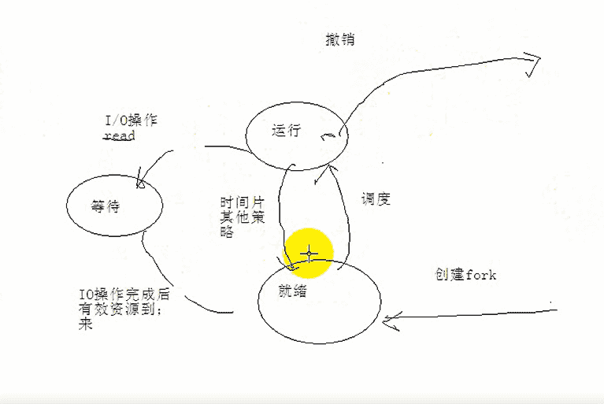
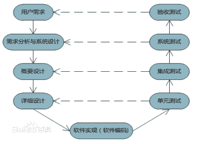
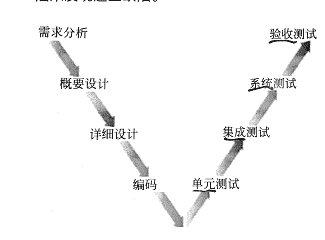

# 广联达 2018 测试工程师（计算机相关专业）笔试题

## 1

操作系统是一组（    ）

正确答案: C   你的答案: 空 (错误)

```cpp
文件管理程序
```

```cpp
中断处理程序
```

```cpp
资源管理程序
```

```cpp
设备管理程序
```

本题知识点

广联达 Java 工程师 C++工程师 iOS 工程师 安卓工程师 运维工程师 前端工程师 算法工程师 PHP 工程师

讨论

[子衿的老大](https://www.nowcoder.com/profile/6741920)

操作系统(OS)是管理 和控制 计算机硬件与软件 资源 的计算机 程序。

发表于 2018-07-21 18:33:57

* * *

## 2

操作系统的特征是（   ）、共享、虚拟以及异步

正确答案: A   你的答案: 空 (错误)

```cpp
并发
```

```cpp
多道
```

```cpp
中断
```

```cpp
实时
```

本题知识点

广联达 Java 工程师 C++工程师 iOS 工程师 安卓工程师 运维工程师 前端工程师 算法工程师 PHP 工程师

讨论

[黄田田](https://www.nowcoder.com/profile/819901833)

并发、共享、虚拟、异步-----------操作系统特征

发表于 2020-07-17 08:57:52

* * *

[守得住初心♚](https://www.nowcoder.com/profile/58414801)

还有随机性:操作系统正处于什么样的状态之中是无法确切知道的。（由共享和并发引起）

发表于 2019-08-16 13:12:55

* * *

## 3

进程所请求的一次打印输出结束后，将使进程状态从（    ）

正确答案: D   你的答案: 空 (错误)

```cpp
运行态变为就绪态
```

```cpp
运行态变为等待态
```

```cpp
就绪态变为运行态
```

```cpp
等待态变为就绪态
```

本题知识点

广联达 Java 工程师 C++工程师 iOS 工程师 安卓工程师 运维工程师 前端工程师 算法工程师 PHP 工程师

讨论

[盖世英雄 20180722](https://www.nowcoder.com/profile/377383937)

打印输出是 IO 操作

发表于 2018-08-10 15:48:57

* * *

## 4

进程和程序的本质区别是(      )

正确答案: D   你的答案: 空 (错误)

```cpp
存储在内存和外存
```

```cpp
顺序和非顺序执行机器指令
```

```cpp
分时使用和独占使用计算机资源
```

```cpp
动态和静态特征
```

本题知识点

广联达 Java 工程师 C++工程师 iOS 工程师 安卓工程师 运维工程师 前端工程师 算法工程师 PHP 工程师

讨论

[Danger 独行者](https://www.nowcoder.com/profile/187035084)

        进程即运行中的程序，从中即可知，进程是在运行的，程序是非运行的，当然本质区别就是动态和静态的区别。        程序可以存在外存中，也可以存在内存中，比如某些下载的程序未指定下载路径时，可以临时存于内存上，所以答案 A 是错误的；当然二者也不可能是有什么顺序和非顺序指令之称，B 也是错误的；进程是运行中的程序，故二者不应该是分时使用和独占使用计算机资源，故 C 也是错误的。

发表于 2018-07-30 19:33:33

* * *

[守得住初心♚](https://www.nowcoder.com/profile/58414801)

进程是程序的一次执行活动。 程序是静态的，进程是动态的

发表于 2019-08-16 13:26:57

* * *

[黄田田](https://www.nowcoder.com/profile/819901833)

进程----在运行中，动态程序----非运行，静态

发表于 2020-07-17 09:00:26

* * *

## 5

批处理操作系统提高了计算机的工作效率，但（     ）

正确答案: B   你的答案: 空 (错误)

```cpp
系统资源利用率不高
```

```cpp
在执行时缺乏交互性
```

```cpp
系统吞吐量小
```

```cpp
不具备执行性
```

本题知识点

广联达 Java 工程师 C++工程师 iOS 工程师 安卓工程师 运维工程师 前端工程师 算法工程师 PHP 工程师

讨论

[Yo＿＿](https://www.nowcoder.com/profile/3580909)

批处理操作系统就是为了解决必要的人工操作与快速的 CPU 之间的矛盾，采取基本不让用户干预的工作方式，用户只要把问题、数据和作业说明书一起交给系统管理员，操作员将作业成批地装入计算机，然后由操作系统控制执行，其突出特点就是用户不参加计算机的对话，即非交互式的。

发表于 2018-07-21 22:51:57

* * *

[守得住初心♚](https://www.nowcoder.com/profile/58414801)

批处理操作系统特征:用户脱机使用计算机；成批处理 优点:医院利用率高；系统吞吐量大 缺点:平均周转时间长；无交互能力

发表于 2019-08-16 13:31:20

* * *

## 6

电子邮件服务器之间相互传递邮件通常使用的协议是（     ）

正确答案: B   你的答案: 空 (错误)

```cpp
PPP
```

```cpp
SMTP
```

```cpp
FTP
```

```cpp
EMAIL
```

本题知识点

广联达 Java 工程师 C++工程师 iOS 工程师 安卓工程师 运维工程师 前端工程师 算法工程师 PHP 工程师

讨论

[JacksonYee](https://www.nowcoder.com/profile/9069758)

简单邮件传输协议 (Simple Mail Transfer Protocol, SMTP)是事实上的在 Internet 传输 email 的标准。

发表于 2018-07-24 00:07:10

* * *

[牛客 525819694 号](https://www.nowcoder.com/profile/525819694)

EMALL 不是协议

发表于 2020-08-24 09:57:02

* * *

[黄田田](https://www.nowcoder.com/profile/819901833)

simple mail transfer protocol----SMTP

发表于 2020-07-17 09:03:39

* * *

## 7

支持安全 WEB 服务的协议是（      ）

正确答案: A   你的答案: 空 (错误)

```cpp
HTTPS
```

```cpp
WINS
```

```cpp
SOAP
```

```cpp
HTTP
```

本题知识点

广联达 Java 工程师 C++工程师 iOS 工程师 安卓工程师 运维工程师 前端工程师 算法工程师 PHP 工程师

讨论

[盖世英雄 20180722](https://www.nowcoder.com/profile/377383937)

在 URL 前加 https://前缀表明是用 SSL 加密的。 你的电脑与服务器之间收发的信息传输将更加安全。 Web 服务器启用 SSL 需要获得一个服务器证书并将该证书与要使用 SSL 的服务器绑定。 http 和 https 使用的是完全不同的连接方式,用的端口也不一样,前者是 80,后者是 443。http 的连接很简单,是无状态的,... HTTPS 协议是由 SSL+HTTP 协议构建的可进行加密传输、身份认证的网络协议要比 http 协议安全

发表于 2018-07-24 01:37:59

* * *

[free 天蝎小白](https://www.nowcoder.com/profile/221325348)

A

发表于 2021-05-17 21:25:03

* * *

## 8

在网络协议中，定义控制信息格式的是（     ）

正确答案: D   你的答案: 空 (错误)

```cpp
层次
```

```cpp
接口
```

```cpp
时序
```

```cpp
语法
```

本题知识点

广联达 Java 工程师 C++工程师 iOS 工程师 安卓工程师 运维工程师 前端工程师 算法工程师 PHP 工程师

讨论

[东风雪](https://www.nowcoder.com/profile/9371883)

一个网络协议至少包括三要素:

语法：用来规定信息格式;数据及控制信息的格式、编码及信号电平等。

语义：用来说明通信双方应当怎么做;用于协调与差错处理的控制信息。

规则：(时序)定义了何时进行通信，先讲什么，后讲什么，讲话的速度等。比如是采用同步传输还是异步传输。

发表于 2018-07-23 11:37:40

* * *

## 9

TCP 协议在每次建立连接时，都要在收发双方之间交换 （     ） 报文

正确答案: C   你的答案: 空 (错误)

```cpp
一个
```

```cpp
两个
```

```cpp
三个
```

```cpp
四个
```

本题知识点

广联达 Java 工程师 C++工程师 iOS 工程师 安卓工程师 运维工程师 前端工程师 算法工程师 PHP 工程师

讨论

[盖世英雄 20180722](https://www.nowcoder.com/profile/377383937)

三次握手

发表于 2018-07-24 01:38:39

* * *

## 10

TCP/IP 体系结构中的 TCP 和 IP 所提供的服务分别为  （      ）

正确答案: D   你的答案: 空 (错误)

```cpp
链路层服务和网络层服务
```

```cpp
网络层服务和运输层服务
```

```cpp
运输层服务和应用层服务
```

```cpp
运输层服务和网络层服务
```

本题知识点

广联达 Java 工程师 C++工程师 iOS 工程师 安卓工程师 运维工程师 前端工程师 算法工程师 PHP 工程师

讨论

[卡其色](https://www.nowcoder.com/profile/9503171)

TCP/IP 我是没记住，简单的方法就是看首字母就好. T 就是 transport，传输。 I 就是 Internet，网络。

发表于 2018-09-22 21:55:55

* * *

[remember201807301941238](https://www.nowcoder.com/profile/301669688)

tcp 应用于传输层 ip 应用与网络层

发表于 2018-08-01 11:04:38

* * *

## 11

在 SQLsever 数据库中，将表 A 的记录复制到表 B 中，且不删除表 B 中的记录，可以使用的查询是(        ）

正确答案: C   你的答案: 空 (错误)

```cpp
删除查询
```

```cpp
生成表查询
```

```cpp
追加查询
```

```cpp
交叉表查询
```

本题知识点

广联达 Java 工程师 C++工程师 iOS 工程师 安卓工程师 运维工程师 前端工程师 算法工程师 PHP 工程师

## 12

在 SQL 语句中，检索要去掉重复组的所有元组，则在 SELECT 中使用（      ）

正确答案: D   你的答案: 空 (错误)

```cpp
All
```

```cpp
UNION
```

```cpp
LIKE
```

```cpp
DISTINCT
```

本题知识点

广联达 Java 工程师 C++工程师 iOS 工程师 安卓工程师 运维工程师 前端工程师 算法工程师 PHP 工程师

讨论

[W 笑 PASS](https://www.nowcoder.com/profile/8031849)

select distinct 和 union 都会去掉重复的记录，这点的确是有相似的地方

但是，如果一个表中本来就有重复的记录，你想去除重复的记录，就只能使用 select distinct from  tb

但是如果是想把不只一个表上下合并起来，并去除重复的记录，那么就用 union

这两个[命令](http://www.so.com/s?q=%E5%91%BD%E4%BB%A4&ie=utf-8&src=internal_wenda_recommend_textn)使用的用途完全不一样。

发表于 2018-08-04 20:30:07

* * *

## 13

下面对于关系数据库中表的主键描述正确的是（      ）

正确答案: D   你的答案: 空 (错误)

```cpp
使用主键不能唯一地标识表中的一行数据
```

```cpp
主键的值可以为空值
```

```cpp
能唯一标识一行记录的列只有主键
```

```cpp
在一个表中主键列的值是唯一的
```

本题知识点

广联达 Java 工程师 C++工程师 iOS 工程师 安卓工程师 运维工程师 前端工程师 算法工程师 PHP 工程师

## 14

数据库中，数据的物理独立性是指（      ）

正确答案: C   你的答案: 空 (错误)

```cpp
数据库与数据库管理系统的相互独立
```

```cpp
用户程序与 DBMS 的相互独立
```

```cpp
用户的应用程序与存储在磁盘上的数据库中的数据是相互独立的
```

```cpp
应用程序与数据库中数据的逻辑结构相互独立
```

本题知识点

广联达 Java 工程师 C++工程师 iOS 工程师 安卓工程师 运维工程师 前端工程师 算法工程师 PHP 工程师

讨论

[羊小狗。](https://www.nowcoder.com/profile/717610011)

物理独立性~即具体存放在哪个地方吧~d 应该属于逻辑独立性

发表于 2018-09-11 13:59:28

* * *

## 15

在 SQL 的排序子句：ORDER BY 总分 DESC, 英语 DESC 表示（    ）

正确答案: C   你的答案: 空 (错误)

```cpp
总分和英语分数都是最高的在前面
```

```cpp
总分和英语分数之和最高的在前面
```

```cpp
总分高的在前面，总分相同时英语分数高的在前面
```

```cpp
总分和英语分数之和最高的在前面，相同时英语分数高的在前面
```

本题知识点

广联达 Java 工程师 C++工程师 iOS 工程师 安卓工程师 运维工程师 前端工程师 算法工程师 PHP 工程师

讨论

[天才神经病](https://www.nowcoder.com/profile/410344561)

Order by 的查询优先级按执行顺序进行排序

发表于 2018-10-16 18:48:13

* * *

[对心对心](https://www.nowcoder.com/profile/549207195)

选项看混淆了，确实先排总分，总分相同再看英语分

发表于 2018-09-21 14:35:06

* * *

## 16

一个设计得好的操作系统具有（       ）的特征

正确答案: B   你的答案: 空 (错误)

```cpp
低内聚、低耦合
```

```cpp
高内聚、低耦合
```

```cpp
高内聚、高耦合
```

```cpp
低内聚、高耦合
```

本题知识点

广联达 Java 工程师 C++工程师 iOS 工程师 安卓工程师 运维工程师 前端工程师 算法工程师 PHP 工程师

讨论

[博弈与裨益](https://www.nowcoder.com/profile/3049758)

散文形散神聚一样，耦合度降低一直以来的要求

发表于 2020-04-22 02:19:37

* * *

## 17

继承机制的作用是 (        )

正确答案: C   你的答案: 空 (错误)

```cpp
信息隐藏
```

```cpp
数据封装
```

```cpp
派生新类
```

```cpp
数据抽象
```

本题知识点

广联达 Java 工程师 C++工程师 iOS 工程师 安卓工程师 运维工程师 前端工程师 算法工程师 PHP 工程师 C++

讨论

[王瑞环](https://www.nowcoder.com/profile/559483943)

这道题给我感觉像问吃饭的作用是为了吃饱一样...

发表于 2018-08-02 20:10:47

* * *

[nu1lptr](https://www.nowcoder.com/profile/888550561)

继承不是为了提高复用性？

发表于 2021-12-21 17:55:07

* * *

## 18

一个类中的静态方法的调用可以：(         )

正确答案: A   你的答案: 空 (错误)

```cpp
通过类名调用
```

```cpp
通过实例化的对象调用
```

```cpp
在主方法中直接调用
```

```cpp
在同一个类中的任何方法中直接调用
```

本题知识点

广联达 Java 工程师 C++工程师 iOS 工程师 安卓工程师 运维工程师 前端工程师 算法工程师 PHP 工程师

## 19

下列关于基类和派生类关系的叙述中，正确的是 （      ）

正确答案: D   你的答案: 空 (错误)

```cpp
每个类最多只能有一个直接基类
```

```cpp
派生类中的成员可以访问基类中的任何成员
```

```cpp
基类的构造函数必须在派生类的构造函数体中调用
```

```cpp
派生类除了继承基类的成员，还可以定义新的成员
```

本题知识点

广联达 Java 工程师 C++工程师 iOS 工程师 安卓工程师 运维工程师 前端工程师 算法工程师 PHP 工程师

讨论

[王瑞环](https://www.nowcoder.com/profile/559483943)

在 C++中派生类可以同时从多个基类继承，当继承多个基类时，使用逗号将基类隔开.[Java](https://baike.baidu.com/item/Java)不充许这种多重继承，

发表于 2018-08-02 20:12:54

* * *

## 20

有关类和对象的说法不正确的是（     ）

正确答案: B   你的答案: 空 (错误)

```cpp
对象是类的实例
```

```cpp
一个类只有一个对象
```

```cpp
任何一个对象只能属于一个类
```

```cpp
类与对象的关系和数据与变量的关系相似
```

本题知识点

广联达 Java 工程师 C++工程师 iOS 工程师 安卓工程师 运维工程师 前端工程师 算法工程师 PHP 工程师

讨论

[卡其色](https://www.nowcoder.com/profile/9503171)

我是这样理解人类还分为男人和女人。这就是两个对象。

发表于 2018-09-22 22:02:36

* * *

[lidabao](https://www.nowcoder.com/profile/8119653)

B 除了单例模式下一个类只有一个对象，其他情况下一个类都可以有很多对象

发表于 2018-09-23 15:06:10

* * *

## 21

某软件公司欲开发一个图像处理系统，在项目初期开发人员对需求并不明确的情况下，采用（      ）方法比较合适

正确答案: B   你的答案: 空 (错误)

```cpp
瀑布式
```

```cpp
快速原型
```

```cpp
协同开发
```

```cpp
形式化
```

本题知识点

广联达 Java 工程师 C++工程师 iOS 工程师 安卓工程师 运维工程师 前端工程师 算法工程师 PHP 工程师

讨论

[找个昵称真难](https://www.nowcoder.com/profile/1834675)

快速原型法就是在系统开发之初,尽快给用户构造一个新系统的模型(原型),反复演示原型并征求用户意见,开发人员根据用户意见不断修改完善原型,直到基本满足用户的要求再进而实现系统,这种软件开发方法就是快速原型法

发表于 2020-09-28 21:08:30

* * *

[牛客 778891876 号](https://www.nowcoder.com/profile/778891876)

B

发表于 2020-09-05 00:15:17

* * *

## 22

在软件工程中，不属于软件定义阶段的任务是（     ）

正确答案: B   你的答案: 空 (错误)

```cpp
制定验收测试计划
```

```cpp
制定集成测试计划
```

```cpp
需求分析
```

```cpp
制定软件项目计划
```

本题知识点

广联达 Java 工程师 C++工程师 iOS 工程师 安卓工程师 运维工程师 前端工程师 算法工程师 PHP 工程师

讨论

[改个好名字 offer 就到手](https://www.nowcoder.com/profile/279668482)

软件定义时期的任务是确定软件开发工程必须完成的总目标，这个时期通常进一步划分成三个阶段，即问题定义、可行性研究和需求分析。在这个阶段需要完成制定软件项目计划、进行需求分析和制定验收测试计划等任务。该阶段的任务不包括制定集成测试计划，它是软件开发阶段的任务之一。

发表于 2020-08-28 18:43:51

* * *

[博弈与裨益](https://www.nowcoder.com/profile/3049758)

w 模型能解释这个问题

发表于 2020-04-22 02:23:05

* * *

## 23

软件生命周期中持续时间最长的是（    ）阶段

正确答案: D   你的答案: 空 (错误)

```cpp
需求分析
```

```cpp
程序编码
```

```cpp
软件测试
```

```cpp
软件运行维护
```

本题知识点

广联达 Java 工程师 C++工程师 iOS 工程师 安卓工程师 运维工程师 前端工程师 算法工程师 PHP 工程师

讨论

[博弈与裨益](https://www.nowcoder.com/profile/3049758)

需求，计划，设计，编码，测试，最后都比不了最后成品以后一直运维来的时间长

发表于 2020-04-22 02:24:20

* * *

## 24

V 模型描述了软件基本的开发过程和测试行为，描述了不同测试阶段与开发过程各阶段的对应关系。其中，集成测试对应的开发阶段是（     ）

正确答案: B   你的答案: 空 (错误)

```cpp
需求分析阶段
```

```cpp
概要设计阶段
```

```cpp
详细设计阶段
```

```cpp
编码阶段
```

本题知识点

广联达 Java 工程师 C++工程师 iOS 工程师 安卓工程师 运维工程师 前端工程师 算法工程师 PHP 工程师

讨论

[鲨鱼来啦](https://www.nowcoder.com/profile/664777425)



发表于 2018-08-03 14:33:31

* * *

[东风雪](https://www.nowcoder.com/profile/9371883)

一般来讲：单元测试所对应的是详细设计[环节](https://baike.baidu.com/item/%E7%8E%AF%E8%8A%82)，也就是说，单元测试的测试用例是和详细设计一起出现的，在[研发](https://baike.baidu.com/item/%E7%A0%94%E5%8F%91)人员做详细设计的时候，相应的测试人员也就把测试用例写了出来；集成测试对应概要设计，在做模块功能分析及模块接口，数据传输方法的时候，就把集成测试用例根据概要设计中模块功能及接口等实现方法编写出来，以备以后作集成测试的时候可以直接引用；而[系统测试](https://baike.baidu.com/item/%E7%B3%BB%E7%BB%9F%E6%B5%8B%E8%AF%95)，就是根据需求分析而来，在系统分析人员作系统分析，编写需求说明书的时候测试人员就根据客户需求说明书，把最后能实现系统功能的各种测试用例写出来，为做最后系统测试作准备

发表于 2018-07-23 13:04:51

* * *

[你若盛开，清风自来 1](https://www.nowcoder.com/profile/9616077)

V 模型不是在集成阶段对应的是详细设计阶段嘛？

发表于 2018-07-22 10:29:18

* * *

## 25

螺旋模型综合了（      ）的优点，并增加了这两种模型忽略的风险分析

正确答案: A   你的答案: 空 (错误)

```cpp
瀑布模型和演化模型
```

```cpp
瀑布模型和喷泉模型
```

```cpp
演化模型和喷泉模型
```

```cpp
原型和喷泉模型
```

本题知识点

广联达 Java 工程师 C++工程师 iOS 工程师 安卓工程师 运维工程师 前端工程师 算法工程师 PHP 工程师

## 26

软件测试的关键问题是（      ）

正确答案: B   你的答案: 空 (错误)

```cpp
如何组织软件评审
```

```cpp
如何选择测试用例
```

```cpp
如何验证程序的正确性
```

```cpp
如何采用综合策略
```

本题知识点

广联达 Java 工程师 C++工程师 iOS 工程师 安卓工程师 运维工程师 前端工程师 算法工程师 PHP 工程师

讨论

[改个好名字 offer 就到手](https://www.nowcoder.com/profile/279668482)

软件测试是发现软件错误和缺陷的主要手段，其目的就是在软件系统交付运行之前，尽可能多地发现系统中的错误和缺陷。一般一个高效的测试是指用少量的测试用例，发现被测软件尽可能多的错误。因此，测试的关键就在对软件测试用例的设计与选择上。

发表于 2020-08-28 18:48:28

* * *

## 27

成功的测试是指运行测试用例后（      ）

正确答案: B   你的答案: 空 (错误)

```cpp
未发现程序错误
```

```cpp
发现了程序错误
```

```cpp
证明程序正确性
```

```cpp
改正了程序错误
```

本题知识点

广联达 Java 工程师 C++工程师 iOS 工程师 安卓工程师 运维工程师 前端工程师 算法工程师 PHP 工程师

## 28

集成测试时，能较早发现高层模块接口错误的测试方法为（      ）

正确答案: A   你的答案: 空 (错误)

```cpp
自顶向下渐增式测试
```

```cpp
自底向上渐增式测试
```

```cpp
非渐增式测试
```

```cpp
系统测试
```

本题知识点

广联达 Java 工程师 C++工程师 iOS 工程师 安卓工程师 运维工程师 前端工程师 算法工程师 PHP 工程师

## 29

实际的逻辑覆盖测试中，一般以(        )为主设计测试用例

正确答案: C   你的答案: 空 (错误)

```cpp
条件覆盖
```

```cpp
判定覆盖
```

```cpp
条件组合覆盖
```

```cpp
路径覆盖
```

本题知识点

广联达 Java 工程师 C++工程师 iOS 工程师 安卓工程师 运维工程师 前端工程师 算法工程师 PHP 工程师

## 30

按照测试实施组织，可将测试划分为开发方测试、用户测试、第三方测试。下面关于开发方测试的描述正确的是（       ）。

①开发方测试通常也叫“验证测试”或“Alpha 测试”

②开发方测试又称“Beta 测试”

③开发方测试可以从软件产品编码结束之后开始，或在模块子系统）测试完成后开始，也可以在确认测试过程中产品达到一定的稳定和可靠程度之后在开始

④开发方测试主要是把软件产品有计划地免费分发到目标市场，让用户大量使用，并评价、检查软件

正确答案: B   你的答案: 空 (错误)

```cpp
②③
```

```cpp
①③
```

```cpp
②④
```

```cpp
①②③
```

本题知识点

广联达 Java 工程师 C++工程师 iOS 工程师 安卓工程师 运维工程师 前端工程师 算法工程师 PHP 工程师

讨论

[风摇雾竹](https://www.nowcoder.com/profile/759759601)

开发方测试是指 alpha，所以含 2 的选项均不对

发表于 2020-09-21 15:03:01

* * *

## 31

计算机的控制芯片组是指（      ）

正确答案: A B   你的答案: 空 (错误)

```cpp
南桥
```

```cpp
北桥
```

```cpp
控制器
```

```cpp
CMOS
```

本题知识点

广联达 Java 工程师 C++工程师 iOS 工程师 安卓工程师 运维工程师 前端工程师 算法工程师 PHP 工程师

讨论

[Yo＿＿](https://www.nowcoder.com/profile/3580909)

【南桥】 南桥芯片主要是负责 I/O 接口等一些外设接口的控制、IDE 设备的控制及附加功能等等。 【北桥】 主要负责 CPU 与内存之间的数据交换，并控制 AGP、PCI 数据在其内部的传输，是主板性能的主要决定因素。随着芯片的集成度越来越高，它也集成了不少其它功能(如：千兆网络、串口硬盘控制等功能)。 【控制器】 控制计算机各部分协调工作。 数据缓冲，差错控制，数据交换，状态说明，接收和识别命令，地址识别。 【CMOS】 在计算机领域，CMOS 常指保存计算机基本启动信息（如日期、时间、启动设置等）的芯片。

发表于 2018-08-04 20:25:24

* * *

## 32

进程的特性包括（      ）等

正确答案: A C D   你的答案: 空 (错误)

```cpp
动态性
```

```cpp
顺序性
```

```cpp
进程和程序并非一一对应
```

```cpp
并发性
```

本题知识点

广联达 Java 工程师 C++工程师 iOS 工程师 安卓工程师 运维工程师 前端工程师 算法工程师 PHP 工程师

讨论

[Yo＿＿](https://www.nowcoder.com/profile/3580909)

特征 【动态性】 进程的实质是程序在多道程序系统中的一次执行过程，进程是动态产生，动态消亡的。 【并发性】 任何进程都可以同其他进程一起并发执行。 【独立性】 进程是一个能独立运行的基本单位，同时也是系统分配资源和调度的独立单位。 【异步性】 由于进程间的相互制约，使进程具有执行的间断性，即进程按各自独立的、不可预知的速度向前推进。 【结构特征】 进程由程序、数据和进程控制块三部分组成。 【多个不同的进程可以包含相同的程序】 一个程序在不同的数据集里就构成不同的进程，能得到不同的结果；但是执行过程中，程序不能发生改变。

发表于 2018-08-04 20:30:05

* * *

## 33

 DBMS 提供哪几个方面数据保护功能(           )

正确答案: A B C D   你的答案: 空 (错误)

```cpp
数据完整性约束
```

```cpp
数据安全性控制
```

```cpp
并发控制
```

```cpp
数据库恢复
```

本题知识点

广联达 Java 工程师 C++工程师 iOS 工程师 安卓工程师 运维工程师 前端工程师 算法工程师 PHP 工程师

## 34

在 SQL SERVER 中，下面关于子查询的说法你认为正确的是（       ）

正确答案: C D   你的答案: 空 (错误)

```cpp
应用简单子查询的 SQL 语句的执行效率比采用 SQL 变量的实现方案要低
```

```cpp
带子查询的查询执行顺序是，先执行父查询，再执行子查询
```

```cpp
表连接一般都可以用子查询替换，但有的子查询不能用表连接替换
```

```cpp
如果一个子查询语句一次返回二个字段的值，那么父查询的 where 子句中应该使用[NOT] EXISTS 关键字
```

本题知识点

广联达 Java 工程师 C++工程师 iOS 工程师 安卓工程师 运维工程师 前端工程师 算法工程师 PHP 工程师

## 35

某查询语句中有“%田 _”语句，则可能的查询结果有（       ）

正确答案: C D   你的答案: 空 (错误)

```cpp
张田
```

```cpp
陈力田
```

```cpp
田华
```

```cpp
刘田耕
```

本题知识点

广联达 Java 工程师 C++工程师 iOS 工程师 安卓工程师 运维工程师 前端工程师 算法工程师 PHP 工程师

讨论

[我想静静！](https://www.nowcoder.com/profile/9359484)

%田 _%：说明田之前可以有值也可以没有值 _ ：说明田之后有一个占位，之后一定有一个值

发表于 2018-10-17 09:47:57

* * *

[叶子的三次方](https://www.nowcoder.com/profile/3668748)

答案有问题，一个英文字符用一个 _ 替代，而一个汉字字符要用两个 _ 替代。题目后面只有一个 _，不可能是一个汉字字符

发表于 2019-11-21 10:32:00

* * *

[天才神经病](https://www.nowcoder.com/profile/410344561)

%田说明为什么什么田但是在田后面还有一个 _ 说明还有一位在田后面

发表于 2018-10-16 18:45:19

* * *

## 36

在软件的设计阶段应提供的文档是（       ） 

正确答案: B E   你的答案: 空 (错误)

```cpp
软件需求规格说明书
```

```cpp
概要设计规格说明书
```

```cpp
数据字典及数据流图
```

```cpp
源程序以及源程序的说明书
```

```cpp
详细设计规格说明书
```

本题知识点

广联达 Java 工程师 C++工程师 iOS 工程师 安卓工程师 运维工程师 前端工程师 算法工程师 PHP 工程师

## 37

模块独立性准则由以下定性指标来衡量（        ）

正确答案: B D   你的答案: 空 (错误)

```cpp
分解度
```

```cpp
耦合度
```

```cpp
屏蔽性
```

```cpp
内聚性
```

```cpp
集中性
```

本题知识点

广联达 Java 工程师 C++工程师 iOS 工程师 安卓工程师 运维工程师 前端工程师 算法工程师 PHP 工程师

讨论

[极与极、](https://www.nowcoder.com/profile/83483110)

内聚和耦合

发表于 2019-04-10 08:32:37

* * *

## 38

下列关于 alpha 测试的描述中正确的是：（        ）

正确答案: A D   你的答案: 空 (错误)

```cpp
alpha 测试需要用户代表参加
```

```cpp
alpha 测试不需要用户代表参加
```

```cpp
alpha 测试是系统测试的一种
```

```cpp
alpha 测试是验收测试的一种
```

本题知识点

广联达 Java 工程师 C++工程师 iOS 工程师 安卓工程师 运维工程师 前端工程师 算法工程师 PHP 工程师

## 39

因果图/判定表的用例设计方法适用于以下哪些情况：（       ）

正确答案: A B C   你的答案: 空 (错误)

```cpp
输入输出明确，或输入输出因果关系明确的情况下
```

```cpp
被分析的特性或功能点复杂，输入项目很多的情况下
```

```cpp
系统输入之间相互约束多，需要做大范围的组合测试情况下
```

```cpp
系统输入之间基本没有相互联系
```

本题知识点

广联达 Java 工程师 C++工程师 iOS 工程师 安卓工程师 运维工程师 前端工程师 算法工程师 PHP 工程师

讨论

[い王小喵](https://www.nowcoder.com/profile/664017785)

如果变量是独立的，可采取边界值分析法测试和等价类测试 如果变量引用的是物理量，可采用边界值分析测试和等价类测试 如果可保证是单缺陷假设，可采取边界值分析和健壮性测 如果变量不是独立的，可采取决策表测试 如果程序包含大量例外处理，可采取健壮性测试和决策表测试 如果变量引用的是逻辑量 可采用等价类测试和决策表测试 如果测试组合很多，或多因子，多水平，采用政教分析法

发表于 2019-03-16 23:09:24

* * *

## 40

软件的六大质量特性包括：（      ）

正确答案: A B C   你的答案: 空 (错误)

```cpp
功能性、可靠性
```

```cpp
可用性、效率
```

```cpp
维护性、可移植
```

```cpp
兼容性、可扩展性
```

本题知识点

广联达 Java 工程师 C++工程师 iOS 工程师 安卓工程师 运维工程师 前端工程师 算法工程师 PHP 工程师

讨论

[武蒙蒙](https://www.nowcoder.com/profile/9378308)

McMall 软件质量模型：可理解性，可维修性，灵活性，可测试性，可移植性，可重用性，互运行性，正确性，健壮性，效率，完整性，可用性，风险性。

发表于 2019-03-02 23:06:48

* * *

## 41

  在 Windows 中，ping 命令的-n 选项表示 ping 的次数。（    ）

正确答案: A   你的答案: 空 (错误)

```cpp
对
```

```cpp
错
```

本题知识点

广联达 Java 工程师 C++工程师 iOS 工程师 安卓工程师 运维工程师 前端工程师 算法工程师 PHP 工程师

## 42

通常的路由器可以支持多种网络层协议，并提供不同协议之间的分组转换。（     ）

正确答案: A   你的答案: 空 (错误)

```cpp
对
```

```cpp
错
```

本题知识点

广联达 Java 工程师 C++工程师 iOS 工程师 安卓工程师 运维工程师 前端工程师 算法工程师 PHP 工程师

## 43

 在 Wi-Fi 安全协议中，WPA 与 WEP 相比，采用了临时密钥以减少安全风险。（     ）

正确答案: A   你的答案: 空 (错误)

```cpp
对
```

```cpp
错
```

本题知识点

广联达 Java 工程师 C++工程师 iOS 工程师 安卓工程师 运维工程师 前端工程师 算法工程师 PHP 工程师

讨论

[牛客 525819694 号](https://www.nowcoder.com/profile/525819694)

WPA 采用的是动态密钥，不是临时密钥。临时密钥在某时段内是固定不变的，动态密钥一直在变化

发表于 2020-08-24 11:27:21

* * *

## 44

类成员的访问权限中，Private 只能被本类的成员函数和其友元函数访问（ ）？

正确答案: A   你的答案: 空 (错误)

```cpp
对
```

```cpp
错
```

本题知识点

C++工程师 C++

讨论

[Tom201903301445850](https://www.nowcoder.com/profile/471754973)

难道友元类的函数不能访问么？

发表于 2021-02-21 19:20:15

* * *

[天才神经病](https://www.nowcoder.com/profile/410344561)

Private 是私有属性，只可以为本类的成员函数和其友元函数访问

编辑于 2018-10-16 18:36:09

* * *

[牛客 457625951 号](https://www.nowcoder.com/profile/457625951)

friend 就是开的后门儿吗？？

发表于 2022-03-05 22:40:52

* * *

## 45

C++语言中，若只需要通过一个成员函数读取数据成员的值，而不需要修改它，则应在函数头的后面加上 static 关键字。（     ）

正确答案: B   你的答案: 空 (错误)

```cpp
对
```

```cpp
错
```

本题知识点

广联达 C++工程师 C++

讨论

[杉杉来啦](https://www.nowcoder.com/profile/243827773)

注意不需要修改值，const

发表于 2020-08-05 12:29:32

* * *

[yans](https://www.nowcoder.com/profile/6365830)

这里应该是要声明一个常量的意思，常量好像是 const

发表于 2018-09-22 10:47:21

* * *

[牛客小丑 C](https://www.nowcoder.com/profile/410104169)

static 表示静态意思 const 表示不可更改

发表于 2021-04-17 16:22:50

* * *

## 46

在软件的可行性研究中，可以从不同的角度对软件的可行性进行研究。从软件的功能可行性角度考虑的是操作可行性。（     ）

正确答案: B   你的答案: 空 (错误)

```cpp
对
```

```cpp
错
```

本题知识点

广联达 Java 工程师 C++工程师 iOS 工程师 安卓工程师 运维工程师 前端工程师 算法工程师 PHP 工程师

讨论

[Mr.翊罸](https://www.nowcoder.com/profile/416247215)

应该是技术可行性

发表于 2018-07-26 12:11:31

* * *

## 47

 发现错误越多的模块，残留在模块中的错误也越多。（     ）

正确答案: A   你的答案: 空 (错误)

```cpp
对
```

```cpp
错
```

本题知识点

广联达 Java 工程师 C++工程师 iOS 工程师 安卓工程师 运维工程师 前端工程师 算法工程师 PHP 工程师

讨论

[东风雪](https://www.nowcoder.com/profile/9371883)

开发人员能力参差不齐，当发现某模块 bug 数越多，修改的 bug 越多，则引入新的 bug 就会越多，那么这些新的 bug 发现的难度要比修改前发现 bug 要大的多，其隐藏未发现的 bug 数量就越多，那么相应的模块质量也就越差。代码复用也可能造成该模块的 bug 比较多。[`www.jianshu.com/p/195133858c3e`](https://www.jianshu.com/p/195133858c3e) 

发表于 2018-07-23 15:14:50

* * *

## 48

 在面向对象的软件开发方法中，每个类都存在其相应的对象，类是对象的实例，对象是生成类的模板。（      ）

正确答案: B   你的答案: 空 (错误)

```cpp
对
```

```cpp
错
```

本题知识点

广联达 Java 工程师 C++工程师 iOS 工程师 安卓工程师 运维工程师 前端工程师 算法工程师 PHP 工程师

讨论

[yans](https://www.nowcoder.com/profile/6365830)

在面向对象的过程中，类是对相关对象的抽象，对象是类的具体实现。也就是谁，对象是类的实例，类是对象的模版。

发表于 2018-09-21 22:27:44

* * *

[蓝秋绽放 33](https://www.nowcoder.com/profile/508579963)

应该是对象是类的实例

发表于 2018-07-26 15:46:32

* * *

## 49

 条件覆盖是几种逻辑覆盖标准中查错能力最强的。（      ）

正确答案: B   你的答案: 空 (错误)

```cpp
对
```

```cpp
错
```

本题知识点

广联达 Java 工程师 C++工程师 iOS 工程师 安卓工程师 运维工程师 前端工程师 算法工程师 PHP 工程师

讨论

[东风雪](https://www.nowcoder.com/profile/9371883)

[逻辑覆盖](http://baike.baidu.com/item/%E9%80%BB%E8%BE%91%E8%A6%86%E7%9B%96/3231015)方法有以下 6 种：

[语句覆盖](http://baike.baidu.com/item/%E8%AF%AD%E5%8F%A5%E8%A6%86%E7%9B%96/4419072)[判定覆盖](http://baike.baidu.com/item/%E5%88%A4%E5%AE%9A%E8%A6%86%E7%9B%96/4268743)（即[分支覆盖](http://baike.baidu.com/item/%E5%88%86%E6%94%AF%E8%A6%86%E7%9B%96/1954397)）[条件覆盖](http://baike.baidu.com/item/%E6%9D%A1%E4%BB%B6%E8%A6%86%E7%9B%96/9632173)判定－条件覆盖[条件组合覆盖](http://baike.baidu.com/item/%E6%9D%A1%E4%BB%B6%E7%BB%84%E5%90%88%E8%A6%86%E7%9B%96/4138361)[路径覆盖](http://baike.baidu.com/item/%E8%B7%AF%E5%BE%84%E8%A6%86%E7%9B%96/1447710)1.[语句覆盖](http://baike.baidu.com/item/%E8%AF%AD%E5%8F%A5%E8%A6%86%E7%9B%96/4419072)：设计若干[测试用例](http://baike.baidu.com/item/%E6%B5%8B%E8%AF%95%E7%94%A8%E4%BE%8B/1928697)，运行被测程序，使程序中每个可执行语句至少执行一次。只需设计一个测试用例:a=2，b=1，c=6；即达到了语句覆盖。【优点】 ：可以很直观地从[源代码](http://baike.baidu.com/item/%E6%BA%90%E4%BB%A3%E7%A0%81/3969)得到测试用例，无须细分每条判定表达式。【缺点】 ：由于这种测试方法仅仅针对[程序逻辑](http://baike.baidu.com/item/%E7%A8%8B%E5%BA%8F%E9%80%BB%E8%BE%91/12608132)中显式存在的语句，但对于隐藏的条件是无法测试的。如在多分支的[逻辑运算](http://baike.baidu.com/item/%E9%80%BB%E8%BE%91%E8%BF%90%E7%AE%97/7224729)中无法全面的考虑。语句覆盖是最弱的[逻辑覆盖](http://baike.baidu.com/item/%E9%80%BB%E8%BE%91%E8%A6%86%E7%9B%96/3231015)。2.[判定覆盖](http://baike.baidu.com/item/%E5%88%A4%E5%AE%9A%E8%A6%86%E7%9B%96/4268743): 设计若干测试用例，运行被测程序，使得程序中每个分支的取[真值](http://baike.baidu.com/item/%E7%9C%9F%E5%80%BC/7601701)和取[假值](http://baike.baidu.com/item/%E5%81%87%E5%80%BC/7216388)至少一次，即判断真假值均曾被满足。a=2，b=1 ，c=6（M,Q 分支全为真）和 a=-2，b=-1 ，c=-3（M,Q 分支全为假）这两组[测试用例](http://baike.baidu.com/item/%E6%B5%8B%E8%AF%95%E7%94%A8%E4%BE%8B/1928697)可覆盖所有判定的真假分支。【优点】：判定覆盖具有比[语句覆盖](http://baike.baidu.com/item/%E8%AF%AD%E5%8F%A5%E8%A6%86%E7%9B%96/4419072)更强的测试能力。同样判定覆盖也具有和语句覆盖一样的简单性，无须细分每个判定就可以得到测试用例。【缺点】：往往大部分的判定语句是由多个逻辑条件组合而成，若仅仅判断其整个最终结果，而忽略每个条件的取值情况，必然会遗漏部分测试路径。[判定覆盖](http://baike.baidu.com/item/%E5%88%A4%E5%AE%9A%E8%A6%86%E7%9B%96/4268743)仍是弱的[逻辑覆盖](http://baike.baidu.com/item/%E9%80%BB%E8%BE%91%E8%A6%86%E7%9B%96/3231015)。3.[条件覆盖](http://baike.baidu.com/item/%E6%9D%A1%E4%BB%B6%E8%A6%86%E7%9B%96/9632173)：设计若干测试用例，执行被测程序以后要使每个判断中每个条件的可能取值至少满足一次。判断 M[表达式](http://baike.baidu.com/item/%E8%A1%A8%E8%BE%BE%E5%BC%8F):设条件 a>0 取真 记为 T1 ；假 F1 条件 b>0 取真 记为 T2 ；假 F2 判断 Q 表达式:设条件 a>1 取真 记为 T3 ；假 F3 条件 c>1 取真 记为 T4 ；假 F4 我们用条件覆盖设计的思想就是让[测试用例](http://baike.baidu.com/item/%E6%B5%8B%E8%AF%95%E7%94%A8%E4%BE%8B/1928697)能覆盖 T1、T2、T3、T4、F1、F2、F3、F4【优点】：增加了对条件判定情况的测试，增加了测试路径。【缺点】：[条件覆盖](http://baike.baidu.com/item/%E6%9D%A1%E4%BB%B6%E8%A6%86%E7%9B%96/9632173)不一定包含[判定覆盖](http://baike.baidu.com/item/%E5%88%A4%E5%AE%9A%E8%A6%86%E7%9B%96/4268743)。例如，我们刚才设计的用例就没有覆盖判断 M 的 Y 分支和判断 Q 的 N 分支。条件覆盖只能保证每个条件至少有一次为真，而不考虑所有的判定结果。4.判定－条件覆盖：设计足够的[测试用例](http://baike.baidu.com/item/%E6%B5%8B%E8%AF%95%E7%94%A8%E4%BE%8B/1928697)，使得判断条件中的所有条件可能至少执行一次取值，同时，所有判断的可能结果至少执行一次。测试用例要满足如下条件：1.所有条件可能至少执行一次取值；2.所有判断的可能结果至少执行一次。【优点】 ：能同时满足判定、条件两种覆盖标准。【缺点】 ：判定/[条件覆盖](http://baike.baidu.com/item/%E6%9D%A1%E4%BB%B6%E8%A6%86%E7%9B%96/9632173)准则的缺点是未考虑条件的组合情况。5. [条件组合覆盖](http://baike.baidu.com/item/%E6%9D%A1%E4%BB%B6%E7%BB%84%E5%90%88%E8%A6%86%E7%9B%96/4138361)：设计足够的测试用例，使得所有可能的条件取值组合至少执行一次。【优点】 ：条件组合覆盖准则满足[判定覆盖](http://baike.baidu.com/item/%E5%88%A4%E5%AE%9A%E8%A6%86%E7%9B%96/4268743)、条件覆盖和判定/条件覆盖准则。【缺点】 ：线性地增加了[测试用例](http://baike.baidu.com/item/%E6%B5%8B%E8%AF%95%E7%94%A8%E4%BE%8B/1928697)的数量。6.[路径覆盖](http://baike.baidu.com/item/%E8%B7%AF%E5%BE%84%E8%A6%86%E7%9B%96/1447710)：设计所有的测试用例，来覆盖程序中的所有可能的执行路径 。【优点】 ：这种测试方法可以对程序进行彻底的测试，比前面五种的覆盖面都广。【缺点】 ：需要设计大量、复杂的测试用例，使得工作量呈指数级增长，不见得把所有的条件组合都覆盖。从前面的例子我们可以看到，采用任何一种覆盖方法都不能满足我们的要求，所以，在实际的[测试用例设计](http://baike.baidu.com/item/%E6%B5%8B%E8%AF%95%E7%94%A8%E4%BE%8B%E8%AE%BE%E8%AE%A1/9391582)过程中，可以根据需要将不同的覆盖方法组合起来使用，以实现最佳的测试用例设计 。

发表于 2018-07-23 15:24:52

* * *

## 50

软件项目在开始需求分析时，测试就应该介入其中。（      ）

正确答案: A   你的答案: 空 (错误)

```cpp
对
```

```cpp
错
```

本题知识点

广联达 Java 工程师 C++工程师 iOS 工程师 安卓工程师 运维工程师 前端工程师 算法工程师 PHP 工程师

讨论

[yans](https://www.nowcoder.com/profile/6365830)

我们应该清楚，任何的项目，测试都是伴随着项目一生的；错误发现的越晚，那么造成的危害、损失就越大，越早发现越好。项目的开始就是需求分析，所以开始阶段就要加入。

发表于 2018-09-22 10:41:09

* * *

[东风雪](https://www.nowcoder.com/profile/9371883)

软件测试人员应在需求阶段就加入到开发过程中。因为软件的质量问题会随着软件开发周期的不断展开而不断放大的，而更正质量问题的成本也是不断放大的，也就是说在需求阶段出现的小问题，到开发完成后缺陷可能成几何倍数放大，而修改所需要的成本也会不断的放大，如果测试工程师能够尽早的加入其中的话可以尽早的找出问题，及时发现，避免问题最后放大到不可收拾。

发表于 2018-07-23 15:25:41

* * *

## 51

【逻辑思维】有一牧场，已知养牛 27 头， 6 天把草吃尽；养牛 23 头， 9 天把草吃尽。如果养牛 21 头，那么几天能把牧场上的草吃尽呢？并且牧场上的草是不断生长的

你的答案

本题知识点

广联达 Java 工程师 C++工程师 iOS 工程师 安卓工程师 运维工程师 前端工程师 算法工程师 PHP 工程师

讨论

[快乐的一只小喵](https://www.nowcoder.com/profile/8889031)

 12 天假设每头牛每天的吃草量为 1,则 27 头 6 天的吃草量为 27×6=162；23 头牛 9 天的吃草量为 23×9=207.207 与 162 的差就是（9-6）天新长出的草,所以牧场每天新长出的草量是（207-162）÷（9-6）=15，因为 27 头牛 6 天吃草量为 162,这 6 天新长出的草之和为 15×6=90,从而可知牧场原有的划量为 162-90=72，牧场每天新长的草够 15 头牛吃一天,每天都让 21 头牛中的 15 头牛吃新长出的草,其余的 21-15=6（头）专吃原来的草.所以牧场上的草够吃 72÷6=12（天）,也就是这个牧场上的草够 21 头牛吃 12 天.
综合算式：[27×6-（23×9-27×6）÷（9-6）×6]÷[21-（23×9-27×6）÷（9-6）]=12（天）

发表于 2018-08-08 22:03:23

* * *

[EIFFELTOWER](https://www.nowcoder.com/profile/2735432)

1.明确原本牧场的草量 2.每天牧场的草的生长量 3.每天实际消耗的原有草量 27 头牛，6 天吃完，总共吃了 27*6=162(原有牧场草量加上 6 天牧场的草的生长量)23 头牛，9 天吃完，总共吃了 23*9=207(原有牧场草量加上 9 天牧场的草的生长量)可以计算出原有牧场的草量为 72，每天牧场的草的生长量为 15 所以 21 头牛吃完牧场的草需要 72/(23-15)=12 天

发表于 2018-09-01 20:36:42

* * *

[东风雪](https://www.nowcoder.com/profile/9371883)

我计算出来 17 天是正确的啊，下面讲解一下我的思路假定每头牛每天吃草 x，牧场原有草量 x，每天草的生长量为 y（做完后想了一下，每天生产的草量不应该是一样的，但是不一样这道题没法求解 ）了下面列出方程：z+6y=27x *6       ------------------------------az+9y=23x*9        -------------------------------ba 式-b 式，我们可以求得到  y=15x 待求方程：z+？*y=21x*?        --------------------------------------------------c?表示可以吃多少天 c 式-b 式求解可得 ：？=17 

发表于 2018-07-23 11:27:47

* * *

## 52

【编程】编写猜数游戏程序，语言不限。给定某个整数，从键盘上反复输入数据进行猜测。如果未猜中，程序提示输入过大或者过小；如果猜中，则输出猜的次数，最多允许猜 10 次。

你的答案

本题知识点

广联达 Java 工程师 C++工程师 iOS 工程师 安卓工程师 运维工程师 前端工程师 算法工程师 PHP 工程师

讨论

[黄田田](https://www.nowcoder.com/profile/819901833)

```cpp
def(a):
    n = 1
    while n<=10:
        b = input('input:')
        if b == a:
            return b
        elif a>b:
            print('输入值小于目标值')
        elif a<b:
            print('输入值大于目标值')
        n += 1
```

发表于 2020-07-17 09:44:59

* * *

[smile20190521134641](https://www.nowcoder.com/profile/653470127)

```cpp
n=10 i=0 while(i<10):
    a = int(input('input:'))
    i+=1  if a > n: print('输入过大') elif a < n: print('输入过小') elif a==n: print('猜了')
```

编辑于 2019-10-19 16:06:38

* * *

[杨非墨](https://www.nowcoder.com/profile/612058138)

import java.util.*;
public class Guessnum{

    public static void main(String[] args){

            Guessnum h=new Guessnum();
            h.guess();
        }

  public void guess(){
      Random demo= new Random();
        int hico1=demo.nextInt(100);
        int s=hico1;
        int k;
        for(k=0;k<10;k++){
            Scanner t=new Scanner(System.in);
            int i=t.nextInt();
            if(i<s){
            System.out.println("输入过小");
            continue;
                        }
            if (i==s){ 
                System.out.println("猜了"+k+"次");
                break;
            }
            if(i>s){
                System.out.println("输入过大");
                continue;
                }
        }
        }
  }

发表于 2019-10-03 23:58:46

* * *

## 53

【测试思路】如何测试商场，公司等公共场所的自动售货机。请写出测试思路和验证点。

你的答案

本题知识点

广联达 Java 工程师 C++工程师 iOS 工程师 安卓工程师 运维工程师 前端工程师 算法工程师 PHP 工程师

讨论

[Min✌](https://www.nowcoder.com/profile/854234399)

1、功能测试：  ①验证每个按钮是否发挥作用，如摁下选择任何一个饮料的按钮是否会提示该饮料的价格和请投币字样；  ②验证用户选择饮料功能是否正确，摁下每个饮料按钮是否起作用；  ③验证投币付款功能是否正确，包括投入纸币和硬币，纸币和硬币的种类，如纸币只接受一元、五元、十元，硬币只接受五角、一元； ④验证退币功能是否正确，包括有零钱时和没有零钱时的反应； ⑤验证第三方支付功能是否正确，如微信支付、支付宝支付等；2、性能测试：①利用微信、支付宝等第三方平台支付时的响应速度；②选好饮料弹出提示信息的时间；③退币时的响应时间和退币速度；
④付款时突然断电；3、安全性测试：在应用第三方支付扫码时扫到非正常二维码时的处理情况 4、易用性测试：①贩卖机显示界面是否合理美观，包括字体大小、图片位置等；②操作按钮是否通俗易懂，有无歧义；

发表于 2018-08-15 22:18:38

* * *

[い王小喵](https://www.nowcoder.com/profile/664017785)

功能测试：检查售货机界面按钮功能是否正常，比如按下选择饮品的按钮是否显示相应价格；检查售货机投币找币功能是否正常，比如限制纸币面值大小，找币是否正确；检查售货机支付功能是否正常；检查售货机售卖商品之后，相应的饮品数量是否减少；性能测试：选购饮品后界面显示商品的响应时间；找币时的速度；用户支付成功后系统显示支付成功的响应时间；接口测试：测试第三方支付接口是否正常；易用性测试：操作是否易懂，界面是否美观；异常测试：支付过程中网络异常、售货机断电等情况是否能快速恢复到初始状态

发表于 2019-03-18 10:31:06

* * *

[快乐的一只小喵](https://www.nowcoder.com/profile/8889031)

测试用户是否可以按照说明正常使用使用自动售货机。    功能测试:正常功能:投硬币，选择商品，看是否能正确投出商品以及找零;投纸币选择商品，看能否正确投出商品及找零;投纸币和硬币选择商品，看是否能正确投出商品找零。
    异常:投硬币选择价钱高于所投硬币的商品，是否会提示以及吐钱;零钱不够，是否会提示以及吐钱;投入的是不能使用的硬币或纸币(残币、废纸)能否提示以及吐钱。
     外观:外形是否美观，使用是否方便;提示是否醒目等;
    异常情况:突然断电、系统错误等能否快速恢复到初始状态;
    安全性:存钱和商品的地方是否安全;

发表于 2018-08-08 22:26:46

* * *