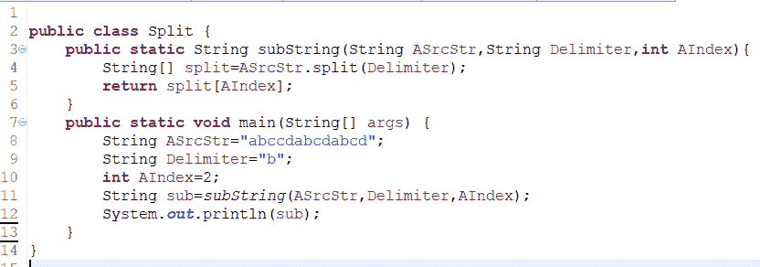

# 广联达 2018 校招开发工程师笔试题

## 1

【编程题】请设计一个类，该类在同一个进程中只能由一个实例，且该实例允许外部访问。

你的答案

本题知识点

广联达 Java 工程师 C++工程师 iOS 工程师 安卓工程师 运维工程师 前端工程师 算法工程师 PHP 工程师 2018

讨论

[gonBorn](https://www.nowcoder.com/profile/450908694)

**我搜集了一下网上的解答：****设计一个类 只能生成该类的一个实例**：只能生成一个实例的类是实现了单例模式的类型。解题思路：1.必须把构造函数设为私有函数，防止他人创建实例。

2.在类中创建静态私有的实例，在需要时创建该实例，直到程序结束才销毁。

3.提供一个静态的公有的函数用于创建/获取静态私有对象。

在系统的日志输出，GUI 应用必须是单鼠标，MODEM 的联接需要一条且只需要一条电话线，操作系统只能有一个窗口管理器，一台 PC 连一个键盘，需要用到单例模式。单例模式确保某个类只有一个实例，而且自行实例化并向整个系统提供这个实例。在计算机系统中，线程池、缓存、日志对象、对话框、打印机、显卡的驱动程序对象常被设计成单例。这些应用都或多或少具有资源管理器的功能。每台计算机可以有若干个打印机，但只能有一个 Printer Spooler，以避免两个打印作业同时输出到打印机中。

```cpp

	**public** **class** Singleton {

	    **private** **static** Singleton *uniqueInstance* = **null**;

	    **private** Singleton() {

	       // Exists only to defeat instantiation.

	    }

	    **public** **static** Singleton getInstance() {

	       **if** (*uniqueInstance* == **null**) {

	           *uniqueInstance* = **new** Singleton();

	       }

	       **return** *uniqueInstance*;

	    }

	    // Other methods...

	}

```

发表于 2019-03-13 09:08:15

* * *

[刘波宁](https://www.nowcoder.com/profile/7801537)

```cpp
class singleA{
 private static  singleA test=null;
private singleA(){}

public static singleA getInstance(){
if(test==null){
synchronized(singleA.class){
if(test==null){
test=new singleA();
}
}

```
return test;
```cpp

}

```

发表于 2018-08-08 11:52:26

* * *

[Mark_ 子奇](https://www.nowcoder.com/profile/2441872)

```cpp
class MyClass
{
public:
    static MyClass& getInstance() {
        static MyClass ins;
        return ins;
    }
private:
    MyClass() = default;
    ~MyClass() = default;
    MyClass& operator=(const MyClass&) = delete;
    MyClass(const Singleton& other) = delete;
};
```

发表于 2020-07-22 15:22:27

* * *

## 2

【编程题】编写一个函数，求一个数的二进制表示中的 1 位的个数，例如 9 的二进制表示为 1001，1 位的个数为 2。

你的答案

本题知识点

广联达 Java 工程师 C++工程师 iOS 工程师 安卓工程师 运维工程师 前端工程师 算法工程师 PHP 工程师 2018

讨论

[YuanLicc](https://www.nowcoder.com/profile/622391442)

```cpp
// 按照参考答案写的，促使了我去学习了一波位运算。感觉很高级。
public int count(int num) {
    int count = 0;

    while(num != 0) {
        // 进行按位与操作，此操作约定对应位均为 1 时，结果对应位就为 1
        //   1010
        // & 1101
        // = 1000
        if((num & 1) == 1) {
            count++;
        }
        // 右移位操作，这里是向右移动 1 位：1001 >> 1 = 100
        num = num >> 1;
    }
    return count;
}

```

编辑于 2018-07-30 21:28:14

* * *

[♂=-O 努力吧!☆○](https://www.nowcoder.com/profile/4709542)

public static int getNumber(int number){
        int count = 0;
        int remainder = 0;
        while(number != 0){
            remainder = number % 2;
            if(remainder == 1)
                count++;
            number = number / 2;
        }
        return count;
    }

发表于 2018-08-07 17:21:19

* * *

[安筱言](https://www.nowcoder.com/profile/641931888)

def f(n):    res=0    h=1    while n:        if h&n ==1:            res+=1        n>>=1    return resif __name__=='__main__':    n=input()    result=f(n)    print(result)

发表于 2020-04-29 17:19:23

* * *

## 3

【编程题】知某次聚会敏感词有 N 个人参加，这 N 个人来自 26 个地区，现在将 26 个地区使用数字 0-25 表示，使用整数数组 Locations 存储这 N 个人的地区, 请返回一个 bool 值, True 代表所有人的地区全都不同，False 代表存在相同地区。要求：不能使用额外的存储结构。

你的答案

本题知识点

广联达 Java 工程师 C++工程师 iOS 工程师 安卓工程师 运维工程师 前端工程师 算法工程师 PHP 工程师 2018

讨论

[#229](https://www.nowcoder.com/profile/8776751)

```cpp
public boolean check(int[] Locations){
    Arrays.sort(Locations);
    for(int i=0;i<Locations.length-1;i++){
        if(Locations[i]==Locations[i+1]) return false;
    }
     return true;
}
```

发表于 2018-07-24 23:41:52

* * *

[Bramasole🌻](https://www.nowcoder.com/profile/224933063)

```cpp
import java.util.HashSet; import java.util.Scanner; import java.util.Set; public class Meeting { public static void main(String[] args) { Scanner scan = new Scanner(System.in); int[] Locations = new int[26]; for(int i = 0; i < 26; i ++){ Locations[i] = scan.nextInt();
        } Set<Integer> set = new HashSet<>(); for(int n: Locations){ set.add(n);
        } if(set.size() == Locations.length){ System.out.println(true);
        }else { System.out.println(false);
        }
    }
}

```

发表于 2020-07-21 20:00:56

* * *

[胖头锅](https://www.nowcoder.com/profile/623731404)

```cpp

```
def f(arr):
    arr.sort()
    for i in range(0, len(arr) - 1):
        if arr[i] == arr[i + 1]:
            return False
    return True

if __name__ == '__main__':
    a1 = [2, 3, 6, 1, 7, 8, 4]
    print(f(a1))

```cpp

```

发表于 2021-08-18 09:51:27

* * *

## 4

【编程题】编写一个函数，实现字符串 ASrcStr 以 Delimiter 为分隔符第 AIndex 项的子串。

你的答案

本题知识点

广联达 Java 工程师 C++工程师 iOS 工程师 安卓工程师 运维工程师 前端工程师 算法工程师 PHP 工程师 2018

讨论

[gonBorn](https://www.nowcoder.com/profile/450908694)



发表于 2019-03-13 09:54:12

* * *

[鲤鱼打挺](https://www.nowcoder.com/profile/6928717)

没有看明白

发表于 2018-08-04 00:31:34

* * *

[Violence-monkey](https://www.nowcoder.com/profile/137791191)

这题看不懂啊

发表于 2020-04-19 00:36:33

* * *

## 5

【编程题】一个只包含 0 和 1 的阵列，找到 1 的组的个数，每个组的定义是横向和纵向相邻的值都为 1，如图中一共有 4 个组，用不同颜色的框分割（可以参见不同粗细勾画起来的框）。 

你的答案

本题知识点

广联达 Java 工程师 C++工程师 iOS 工程师 安卓工程师 运维工程师 前端工程师 算法工程师 PHP 工程师 2018

讨论

[权 _DV](https://www.nowcoder.com/profile/8694870)

```cpp
public int method(int[][] matrix){
    int res = 0;
    if(matrix == null){
        return res;
    }

    for(int i=0;i<matrix.length;i++){
        for(int j=0;j<matrix[0].length;j++){
            if(matrix[i][j] == 1){
                dfs(matrix,i,j);
                                res++;
            }
        }
    }
    return res;
}
public void dfs(int[][] matrix,int i,int j){
    if(i<0 || j<0 || i>=matrix.length || j>=matrix[0].length || matrix[i][j]==0){
        return;
    }
    matrix[i][j]==0;
    dfs(matrix,i+1,j);
    dfs(matrix,i-1,j);
    dfs(matrix,i,j+1);
    dfs(matrix,i,j-1);
}
```

发表于 2020-04-29 01:23:25

* * *

[jinbaowang](https://www.nowcoder.com/profile/761571072)

```cpp
#include<iostream>
#include<vector>
using namespace std;
int main(){
    int m,n;
    cin>>m>>n;
    vector<vector<int>> vec(m,vec<int>(n,0));
    for(int i=0;i<m;i++)
         for(int j=0;j<n;j++)
             cin>>vec[i][j];
   int c=m*n;
    for(int i=0;i<m;i++)
         for(int j=0;j<n;j++)
             if(vec[i][j]==0||vec[i][j]==1&&j+1<n&&vec[i][j+1]==1||vec[i][j]==1&&i+1<m&&vec[i+1][j]==1)  c--;
    cout<< c<<endl;
    return 0;
}

```

发表于 2018-07-19 15:05:36

* * *

[尼古拉斯凯](https://www.nowcoder.com/profile/2214406)

```cpp
import java.util.Scanner;
public class Demo1 { static int row,column; static int array[][]; public static void main(String args[]) {
        Scanner sc = new Scanner(System.in); row = sc.nextInt(); column = sc.nextInt(); array = new int[row][column]; for(int i=0;i<row;i++){ for(int j=0;j<column;j++){ array[i][j] = sc.nextInt();
            }
        } int blocks = findBlocks(array);
        System.out.println(blocks);
    } public static int findBlocks(int array[][]){ int count=0; for(int i=0;i<row;i++){ for(int j=0;j<column;j++){ if(i==0&&j==0&&array[i][j]==1){
                    count++;
                }else if(i>0&&j==0&&array[i-1][j]==0&&array[i][j]==1){
                    count++;
                }else if(i==0&&j>=0&&array[i][j-1]==0&&array[i][j]==1){
                    count++;
                }else if(i>0&&j>0&&array[i-1][j]==0&&array[i][j-1]==0&&array[i][j]==1) {
                    count++;
                }
            }
        } return count;
    }
}

```

发表于 2018-07-30 21:06:55

* * *