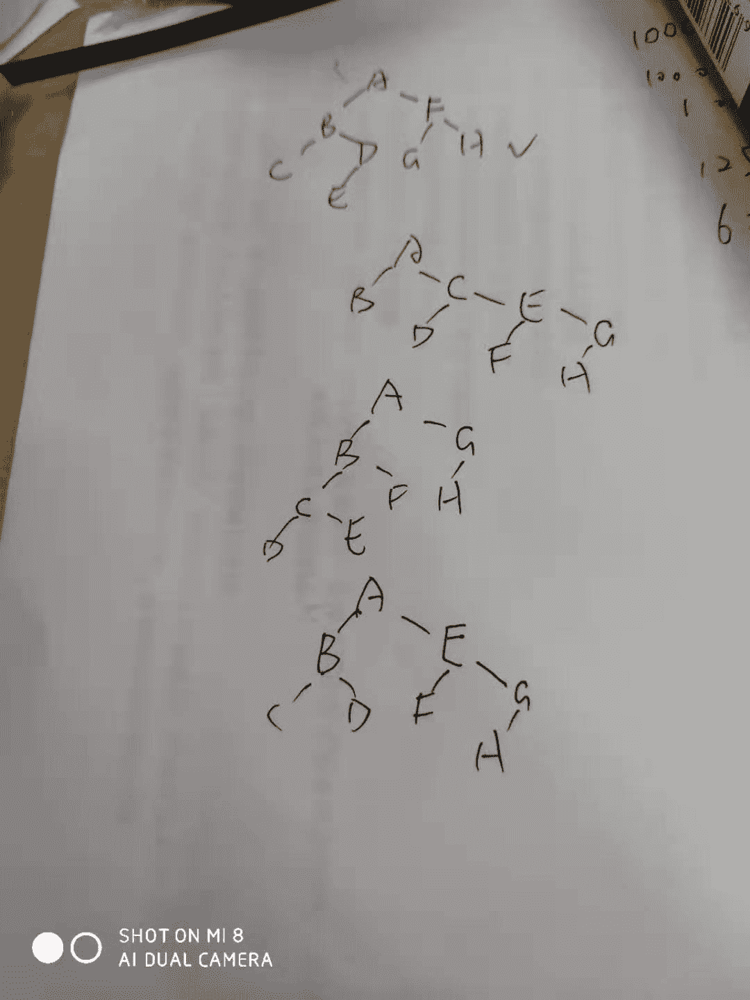
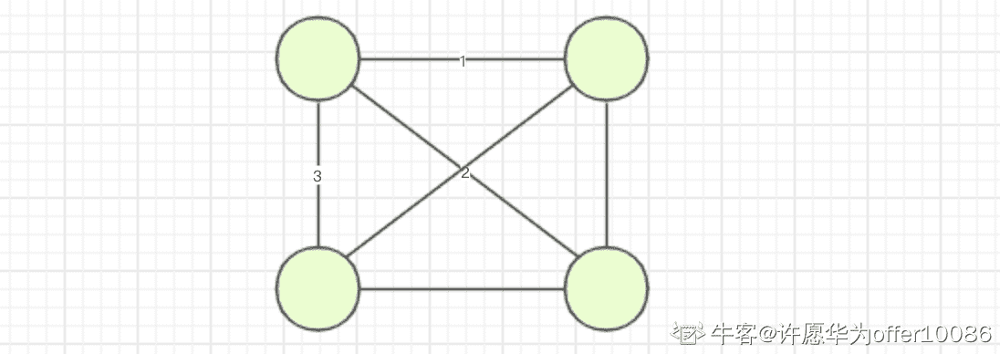
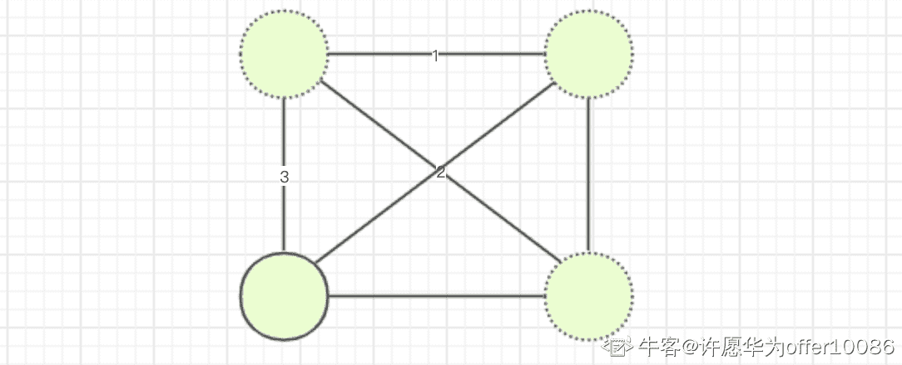
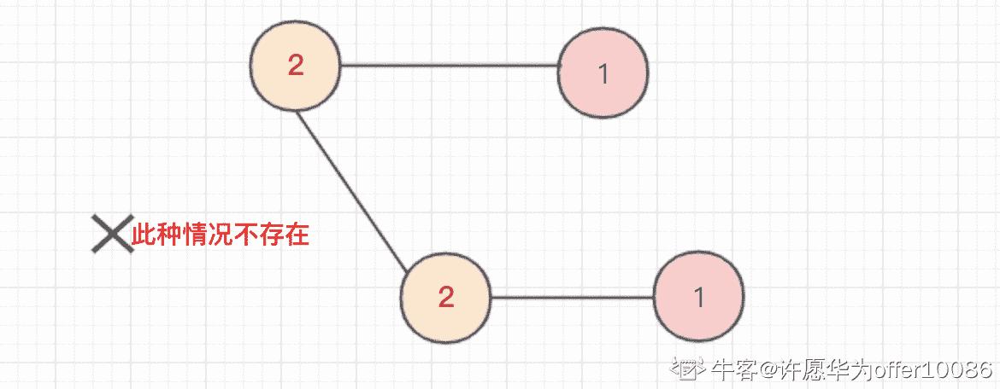

# 网易互娱（游戏）2018 年-游戏测试开发工程师

## 1

已知一棵二叉树的前序遍历是 ABCDEFGH，那么它的中序遍历一定不可能是：

正确答案: D   你的答案: 空 (错误)

```cpp
CBEDAGFH
```

```cpp
BADCFEHG
```

```cpp
DCEBFAHG
```

```cpp
其它三个选项都有可能是该二叉树的中序遍历结果
```

本题知识点

网易互娱 Java 工程师 C++工程师 测试工程师 2018 2019

讨论

[想要一个大大大 offer](https://www.nowcoder.com/profile/5014054)

第一题是不是错了啊...ABCD 都正确啊...QAQ

发表于 2018-07-31 12:00:07

* * *

[西林钟声](https://www.nowcoder.com/profile/431674634)

第一题应该是全正确吧

发表于 2019-03-08 00:07:57

* * *

[前世今生 201710261800360](https://www.nowcoder.com/profile/7349029)

第一题做了好几遍

发表于 2018-08-19 19:08:21

* * *

## 2

10000 个人背上依次贴着从 1 到 10000 的编号，他们从小到大依次报数，偶数出列，一圈后，从剩下的 5000 人再次从号码小的开始报数，偶数出列，直到没人出列为止。问最后一次出列的人，背上的编号是多少？

正确答案: D   你的答案: 空 (错误)

```cpp
1
```

```cpp
2049
```

```cpp
4097
```

```cpp
8193
```

本题知识点

网易互娱 Java 工程师 C++工程师 测试工程师 网易互娱 测试工程师 网易互娱 2018 测试工程师 网易互娱 2019

讨论

[啊哈哈君](https://www.nowcoder.com/profile/2169526)

写出每轮第一个出列的序号，第一轮是 2，第二轮 3，第三轮 5，第四轮 9，找出规律 2^(i-1) + 1，只需求最后一轮第一个出列的序号即可，即在满足 k <= 10000 的条件下，求出最大的 k=2^(i - 1) + 1

发表于 2018-08-05 21:59:09

* * *

[DarKLancer](https://www.nowcoder.com/profile/8638298)

1 号永远不出列……理解错了…

发表于 2018-08-03 00:58:06

* * *

[嘿嘿呵呵](https://www.nowcoder.com/profile/6019346)

最后一次出列的人，背上的编号是多少？

10000 个人背上依次贴着从 1 到 10000 的编号，他们从小到大依次报数，偶数出列，一圈后，从剩下的 5000 人再次从号码小的开始报数，偶数出列，直到没人出列为止。问最后一次出列的人，背上的编号是多少？答：首先答案肯定为奇数，其次 1 永远不可能出列第一次出列 为 2，4，6，8.....第二次出列为 3，4，11.....第三次出列为 5，13.....第四次出列为 9，25....第 5 次出列为 17....则有     f(1)=2;f(2) = f(1)+pow(2,0) = 3f(3) = f(2)+pow(2,1)=5f(4) = f(3)+pow(2,2)=9f(5) = f(4)+pow(2,3)=17 等
f(n-1) = f(n-2)+pow(2,n-3);f(n) = f(n-1)+pow(2,n-2);可推出：f(n) = f(1) + pow(2,0)+pow(2,1)+.....pow(2,n-2) = k<10000   相当于 k = pow(2,n-2)-1+2<10000  满足 n 最大，则求得 k 为多少？即为 8193

发表于 2018-08-10 12:01:02

* * *

## 3

阅读下面那段代码，给出 handle（1024，256）的返回值 1

1.  handle(a, b) {  
2.  if(a==0) return b;  
3.  if(b==0) return a;  
4.  i=a^b;  
5.  j=(a&b)<<1;  
6.  return  handle(i,j);  
7.  }  

你的答案 (错误)

1 参考答案 (1) 1280

本题知识点

网易互娱 Java 工程师 C++工程师 测试工程师 网易互娱 测试工程师 网易互娱 2018 测试工程师 网易互娱 2019

讨论

[凝望 de 酸奶](https://www.nowcoder.com/profile/7230674)

1024 是 10000000000256  是 00100000000^是异或的意思第四行得到 10100000000 其实就是俩数加一下，1280

发表于 2018-09-08 23:27:49

* * *

[liaoming](https://www.nowcoder.com/profile/6818312)

```cpp
 handle(a, b) {  
    if(a==0) return b;  
    if(b==0) return a;  
    i=a^b;  
    j=(a&b)<<1;  
    return  handle(i,j);  
}
// 这个函数计算的是 a + b, a ^ b 是 a + b 的余数， (a & b) << 1 是 a + b 的进位。
```

发表于 2018-08-16 10:26:49

* * *

[王珂珂的珂](https://www.nowcoder.com/profile/280314461)

a^b：按位异或，相同为 0，不同为 1a&b：按位与，同为 1 为 1，否则为 0 a<<b : a 左移 b 位,相当于 a 乘以 2 的 b 次方 

发表于 2018-08-09 14:57:24

* * *

## 4

1.  下面有段数字处理函数的伪代码，阅读后，请给出 handle（12354）的返回值 1
2.  handle( num ){  
3.  result = 0;  
4.  i = num;

5.  while (i !=0 )  
6.  {  
7.  i = i/10*10;  
8.  result = result * 10 + num - i;  
9.  i = i /10;  
10.  num = num/10;  
11.  }  
12.  return result;  
13.  }  

你的答案 (错误)

1 参考答案 (1) 45321

本题知识点

网易互娱 Java 工程师 C++工程师 测试工程师 网易互娱 测试工程师 网易互娱 2018 测试工程师 网易互娱 2019

讨论

[想要一个大大大 offer](https://www.nowcoder.com/profile/5014054)

硬把 12354 看成 12345...这题是考细心吧...

发表于 2018-07-31 12:02:34

* * *

[WAK](https://www.nowcoder.com/profile/9358901)

将输入倒序输出

发表于 2018-07-31 11:54:27

* * *

## 5

现在你需要用一台奇怪的打字机书写一封书信。信的每行只能容纳宽度为 100 的字符，也就是说如果写下某个字符会导致行宽超过 100，那么就要另起一行书写信的内容由 a-z 的 26 个小写字母构成，而每个字母的宽度均会事先约定。例如字符宽度约定为[1,2,3,4,5,5,5,5,5,5,5,5,5,5,5,5,5,5,5,5,5,5,5,5,5,5]，那么就代表'a'到'd'四个字母的宽度分别是 1,2,3,4，而'e'到'z'的宽度均为 5 那么按照上述规则将给定内容 S 书写成一封信后，这封信共有几行？最后一行宽度是多少？

本题知识点

Java 工程师 C++工程师 测试工程师 网易互娱 字符串 *模拟 2018 2019* *讨论

[Howard😈](https://www.nowcoder.com/profile/2283373)

```cpp
 #include <iostream>
 #include <string>
 using namespace std;

 int main()
 {
     string s;
     int A[26];
     for(int i=0;i<26;i++)
         cin>>A[i];
     cin>>s;

     int count=1,length=0,l;
     for(int i=0;i<s.length();i++)
     {
         l=A[s[i]-'a'];
         if(length+l>100)
         {
             length=l;
             count++;
         }
         else
         {
             length+=l;
         }    
     }
     cout<<count<<" "<<length<<endl;

     return 0;
 }

            发表于 2018-08-02 19:12:48

            [木里鸟的瓜掉啦](https://www.nowcoder.com/profile/5489944)

                                                                      py3.5: 
   a =list(map(int,input().split(' '))) 
   b =list(input()) 
   n =1 
   sum=0 
   fori inrange(len(b)): 
       sum=sum+a[ord(b[i]) -ord('a')] 
       if(sum> 100): 
           n =n+1 
           sum=a[ord(b[i]) -ord('a')] 

   print(n,sum) 

            发表于 2018-08-04 10:47:38

            [lentolove](https://www.nowcoder.com/profile/572586026)

```
import java.io.BufferedReader;
import java.io.IOException;
import java.io.InputStreamReader;

public class Main {

    public static void main(String[] args) throws IOException {
        BufferedReader bf = new BufferedReader(new InputStreamReader(System.in));
        String[] line1 = bf.readLine().split(" ");
        String s = bf.readLine();
        int[] nums = new int[26];
        for (int i = 0; i < line1.length; i++) {
            nums[i] = Integer.parseInt(line1[i]);
        }
        int row_count = 1;//行数
        int cur_width = 0;//每一行的宽度
        for (int i = 0; i < s.length(); i++) {
            int len = nums[s.charAt(i) - 'a'];
            //当前字母写不下了，需要另起一行,重新记录当前行占的宽度
            if (cur_width + len > 100) {
                row_count++;
                cur_width = len;
            } else {
                cur_width += len;
            }
        }
        System.out.println(row_count+" "+cur_width);
    }
}
```cpp

            发表于 2019-08-06 16:35:35

        6
          小明是幼儿园的一名老师。某天幼儿园园长给小朋友们每人发一颗糖果，小朋友们拿到后发现有一些同学拿到的糖果颜色和自己相同，有一些同学糖果颜色和自己不同。 
   **假定每个小朋友只知道有多少同学和自己拿到了相同颜色的糖果。**  
   上课后，有**一部分**小朋友兴奋的把这一结果告诉小明老师，并让小明老师猜一猜，最少有多少同学拿到了糖果。 
   例如有三个小朋友告诉小明老师这一结果如下： 
      其中第一个小朋友发现有**1**人和自己糖果颜色一样，第二个小朋友也发现有**1**人和自己糖果颜色一样，第三个小朋友发现有**3**人和自己糖果颜色一样。  
     第一二个小朋友可互相认为对方和自己颜色相同，比如红色；  
     第三个小朋友不可能再为红色（否则第一二个小朋友会发现有 2 人和自己糖果颜色相同），假设他拿到的为蓝色糖果，那么至少还有另外 3 位同学拿到蓝色的糖果，最终至少有 6 位小朋友拿到了糖果。  

   现在请你帮助小明老师解答下这个谜题。 

            本题知识点

                                                            Java 工程师 
                                                C++工程师 
                                                测试工程师 
                                                网易互娱 
                                                数学 
                                                贪心 
                                                模拟 
                                                哈希 *2018 
                                                2019*  *讨论

[自由的小白](https://www.nowcoder.com/profile/6903918)

                                                                      楼上的！你们讲的是啥...语法？思路？ 反正我头疼，算了，本渣渣还是自己想吧！本题主要难得还是想法！  
   为了稳扎稳打我们分三步走： 

1.  **团块？圈？到底是什么**
     这是小朋友回答为 1 的情况，此时可以容纳两个小朋友的答案
     这是小朋友回答为 2 的情况，此时可以容纳三个小朋友的答案
     
     这是小朋友回答为 3 的情况，此时可以容纳四个小朋友的答案
     
     希望看图能让你稍微明白下！这更像是什么呢？举个例子，你们宿舍四人甲乙丙丁，甲说“我有三个舍友”，乙丙丁说“我也是”。那么现在有四个人分别说有三个室友，那么你们这个宿舍（也就是说这个团块、圈）的容纳人数为 4 人。**并且很重要的一点：你们就是一个小生态，无须再无外界发生交流！也就是说外边其他人再怎么分配宿舍，也与你们无关了。**       

2.  **不够 == 补满**
     OK！行啦，我们知道啦，也就是一个回答最多有“回答 + 1 ”个小朋友吗！那假如我们现在不够怎么办呢？来还是这张丑丑的图
     
     虚线表示不存在的点，也就是现在回答为“3”的就一位同学！其实，这种情况下补满就好了，也就是说把不存在的想成存在就好；
     我们再来举个例子：就好比放国庆了哈，你们宿舍有三个人出去陪女朋友玩了，只剩下你个苦逼在宿舍敲代码！阿姨又让每个宿舍汇报人数，你说“我还有三个舍友”，但是乙丙丁却不知道发生了什么！那么现在宿舍阿姨知道你们宿舍几人了么？肯定啊，四人，即使他们都不在。      

3.  **不相等 == 不相容**
     停停停！你说啥，要填满，不行不行，我就要拿其他的人（也就是圈圈）往进加，来填补它不就行了么？呵呵~~~
     我们再来看看
     
     有人一看！我擦，这就对了么，这才符合我的要求~可是对么？（注意第三条是在怀疑第二条，因此不用遵守补满原则）仔细观察一下我们发现其实这种情况是不可能发生的！回答“2”意思是还有另外两个点和自己一样（可以想象成同一宿舍），回答“1”的意思是还有另外一个点和自己一样！我们明显发现点的个数是不匹配的！（应该是 3 个 2 点，2 个一点，总共 5 个点，这里总共才 4 个）因此是不可能发生的！通俗点就是说：不是一路人，不进一家门。     

   解**释一下：**  
   虽然这里已宿舍举例，但还是不够严谨！此题的前提是每一种情况都是相互独立的！也就是 1 和 3 不可能发生在同一情况下。 
   **算法步骤：**  
   **1，根据不同类型进行分类，采用 map**  
   **2，统计各个种类的个数**  
   ** 2.1 个数小于则补满**  
   ** 2.2 个数大于则看到底需要几个圈，团块**  
   **3，把所有团块数量求和**  
   **求和公式为 ∑(团块数量 * （团块类型 + 1 )）
 **  

```
/**
 * 记住一句话，小朋友回答不一样的一定不再同一个组
 */

import java.util.*;

public class Main {
    public static void main(String[] args) {
        Scanner scan = new Scanner(System.in);
        String line1 = scan.nextLine();
        // 本人比较喜欢整形数组，所以转为为整形来操作
        int[] childs = strToIntArray(line1);
        // core
        int ans = minChildren(childs);
        System.out.println(ans);

        // 关闭输入流
        scan.close();
    }

    private static int minChildren(int[] childs) {
        // 设置最少获得糖果的小朋友(answer)的值 0
        int ans = 0;

        Map<Integer, Integer> map = new HashMap<>();
        for (int i = 0; i < childs.length; i++) {
            // 这句话比较漂亮，省了 if……else 判断 map 是否包含此 key
            map.put(childs[i], map.getOrDefault(childs[i], 0) + 1);
        }
        // 累加求和，otherCandy + map,get(otherCandy)是补满操作
、      // 即使现在为 1，那么加上 otherCandy 以后就能被整除
        for (Integer otherCandy : map.keySet()) {
            ans += (otherCandy + map.get(otherCandy)) / (otherCandy + 1) * (otherCandy + 1);
        }
        return ans;
    }

    // 将 String 转为数组
    private static int[] strToIntArray(String line1) {
        String[] strArr = line1.split(" ");
        int[] intArr = new int[strArr.length];
        // 将 string 转换为整数
        for (int i = 0; i < strArr.length; i++) {
            intArr[i] = Integer.valueOf(strArr[i]);
        }
        // 返回结果
        return intArr;
    }
}
```cpp

编辑于 2019-10-02 10:23:04

* * *

[zzzzzzzzz~](https://www.nowcoder.com/profile/674003981)

                                                                    哪些测试没通过也不显示一下！

发表于 2018-07-31 14:56:42

* * *

[腹黑 gg](https://www.nowcoder.com/profile/7970791)

                                                                         #include<bits/stdc++.h>  
     usingnamespacestd;  
     int main()  
     {  
         vector<int> nums;  
         int t;  
         while(cin>>t)  
         nums.push_back(t);  
         map<int,int> mp;  //mp[i] 记录有多少种“i 个人跟自己相同”情况，可变  
         int res = 0;  
         for(inti = 0;i<nums.size();i++)  
         {  
             if(mp.find(nums[i]) == mp.end()) //如果还没有出现“nums[i]个人跟自己相同”这种情况，则 map[i]=1,总数+=nums[i]+1,最后的 1 是加上自己的数量  
             {  
                 mp[nums[i]] = 1;  
                 res+=nums[i]+1;  
             }  
             else if(mp[nums[i]]<=nums[i])//已经有重复的情况则检测 mp[nums[i]]是否超过了 nums[i]个，如果还没则+1，然后总数不变  
             {  
                 mp[nums[i]]++;  
             }  
             else  //已经有重复的情况并且总数也加完之前重复的情况了，所以 map[i]需要重新开始计算  
             {  
                 mp[nums[i]] = 1;  
                 res+=nums[i]+1;  
             }  
         }  
         cout<<res<<endl;  
         return0;  
     }  

编辑于 2018-08-02 20:48:13

* * ** 
```*