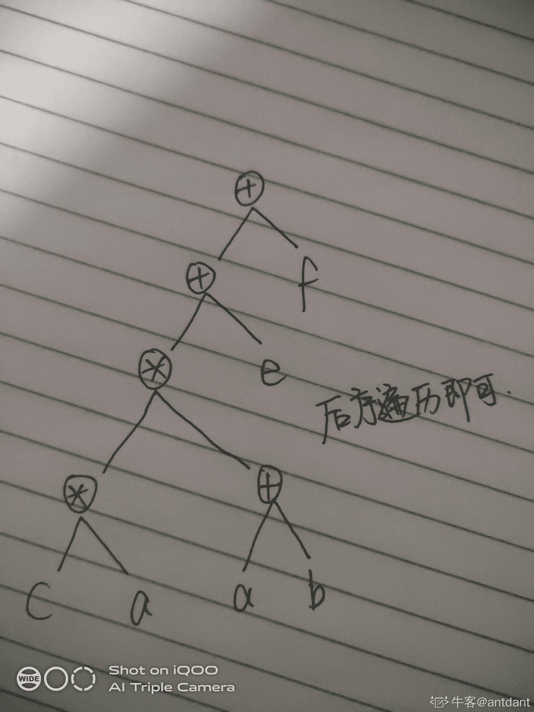

# 猿辅导 2017 校招笔试题卷二

## 1

IPv6 地址的长度为()。

正确答案: D   你的答案: 空 (错误)

```cpp
32 位
```

```cpp
48 位
```

```cpp
64 位
```

```cpp
128 位
```

本题知识点

猿辅导 C++工程师 Java 工程师 猿辅导 2017

讨论

[枕上书](https://www.nowcoder.com/profile/7692311)

IPv4 地址的二进制形式长度为 32,IPv6 地址的二进制形式长度为 128。 

发表于 2018-08-07 22:26:36

* * *

## 2

在数据库的数据模型中有()。

正确答案: A   你的答案: 空 (错误)

```cpp
网状模型、层次模型、关系模型
```

```cpp
数字型、字母型、日期型
```

```cpp
数值型、字符型、逻辑性
```

```cpp
数学模型、概念模型、逻辑模型
```

本题知识点

猿辅导 C++工程师 Java 工程师 2017 牛客

讨论

[农场主](https://www.nowcoder.com/profile/99800586)

A 不是逻辑模型的分类吗？

发表于 2020-07-31 11:20:10

* * *

## 3

在 TCP/IP 参考模型中，实现可靠到端通信的层次是()。

正确答案: D   你的答案: 空 (错误)

```cpp
数据链路层
```

```cpp
物理层
```

```cpp
网络层
```

```cpp
传输层
```

本题知识点

猿辅导 C++工程师 Java 工程师 猿辅导 2017

讨论

[枕上书](https://www.nowcoder.com/profile/7692311)

传输层用来提供端到端的服务，意思就是在这个层次，不需要关心报文的中间的转发，看上去就像两端直接在通信。
网络层则提供点到点的通信，用来处理网络中的报文路由转发。
OSI 七层模型中的物理层、数据链路层和网络层是面向网络通信的低三层，为网络环境中的主机提供点对点通信服务。这种通信是直接相连的节点对等实体的通信，它只提供一台机器到另一台机器之间的通信，不会涉及到程序或进程的概念。同时点到点通信并不能保证数据传输的可靠性，也不能说明源主机与目的主机之间是哪两个进程在通信。 端到端通信建立在点到点通信的基础上，是经点到点通信更高一级的通信方式，完成应用程序（进程）之间的通信。OSI 参考模型中的传输层的功能是最终完成端到端的可靠连接。“端”是指用户应用程序的“端口”，端口号标识了应用层中不同的进程，多个进程的数据传递通过不同的端口完成。 

编辑于 2018-08-07 22:30:53

* * *

[WhilenForJava](https://www.nowcoder.com/profile/93648753)

可靠端协议也就是传输层协议(TCP 协议)，UDP 为非可靠端。

发表于 2018-08-07 23:41:30

* * *

## 4

在邮件服务器之间实现邮件投递的协议是()。

正确答案: C   你的答案: 空 (错误)

```cpp
IMAP
```

```cpp
TFTP
```

```cpp
SMTP
```

```cpp
RARP
```

本题知识点

猿辅导 C++工程师 Java 工程师 2017

讨论

[枕上书](https://www.nowcoder.com/profile/7692311)

SMTP 称为简单 Mail 传输协议（Simple Mail Transfer Protocal）,目标是向用户提供高效、可靠的邮件传输。

发表于 2018-08-07 22:32:08

* * *

[lucky_M](https://www.nowcoder.com/profile/545213694)

SMTP（Simple Mail Transfer Protocal）：邮件传送协议（应用层）POP（Post Office Protocal）：邮件接收协议（应用层）IMAP（Internet Message Access Protocal）：邮箱访问协议 RARP：反向地址解析协议，已知物理地址（MAC）查 IP 地址的（网络层）TFTP：简单文件传输协议

发表于 2020-08-22 17:10:25

* * *

## 5

关于 Linux 操作系统的描述中，正确的是()。

正确答案: D   你的答案: 空 (错误)

```cpp
内核直接取自 UNIX
```

```cpp
为 UNIX 的变种
```

```cpp
图形界面只有 KDE
```

```cpp
符合 POSIX 标准
```

本题知识点

猿辅导 C++工程师 Java 工程师 2017

讨论

[唐朝的海洋](https://www.nowcoder.com/profile/100870574)

D

发表于 2018-08-07 15:42:33

* * *

[晋殇帝](https://www.nowcoder.com/profile/7176011)

B

发表于 2018-08-05 05:44:07

* * *

## 6

对任意 a，b，-100000≤a≤b≤100000 如何判断 a×（a+1）×（a+2）×^(...)×b 结果的符号。

你的答案

本题知识点

猿辅导 C++工程师 Java 工程师 2017

## 7

一个高度为 N 且只有 N 个不同颜色的节点的二叉树有多少种形状（颜色不同算不同）？用^表示次方！表示阶乘。

你的答案

本题知识点

猿辅导 C++工程师 Java 工程师 2017

讨论

[心涛骇浪](https://www.nowcoder.com/profile/166441158)

2^(n-1)*n!

发表于 2020-08-01 09:36:44

* * *

[牛客 7760634 号](https://www.nowcoder.com/profile/7760634)

设不算颜色不同有 x 种结构：x 的解法 N 个节点是取一个节点为根节点 另外取 0-N-1 个节点为左节点构成的 N 个节点构成的数目就是左节点的可构成个数*右节点的个数可构成的个数那么，算上不同颜色应该有 N!*x 种形状

```cpp
def numOfTreeStructure(n):
    """
    n 个节点 每个节点不同颜色 则一共有多少种结构
    :param n:
    :return:
    """
    def num_structure_without_color(n):
        """
        不考虑颜色一共有多少种结构
        """
        if n == 0:
            return 0
        result = {0:1, 1: 1}
        for i in range(2,n+1):
            tmp = 0
            for j in range(i):
                tmp += result[j]*result[i-1-j]
            result[i] = tmp
        return result[n]
    return math.factorial(n) * num_structure_without_color(n)
```

发表于 2019-08-22 11:57:15

* * *

[xxxxcc](https://www.nowcoder.com/profile/132481104)

2^N-1*N!

发表于 2018-12-06 13:46:02

* * *

## 8

简单解释什么是锁，什么是乐观锁，乐观锁和悲观锁的区别。

你的答案

本题知识点

猿辅导 C++工程师 Java 工程师 2017

讨论

[稀饭 201805031718684](https://www.nowcoder.com/profile/5061480)

乐观锁 执行操作前认为不会导致冲突，操作数据时，并不进行任何其他的特殊处理（不加锁，在进行更新后，才会去判断是否有冲突。 悲观锁 操作数据时，认为操作会出现数据冲突，所以在进行每次操作时都要通过获取锁才能进行对相同数据的操作。悲观锁会耗费较多的时间。另外和乐观锁相对的，悲观锁是由数据库自己实现了的，要用时，直接调用数据库的相关语句。

发表于 2018-08-07 21:26:00

* * *

[枕上书](https://www.nowcoder.com/profile/7692311)

悲观锁(Pessimistic Lock), 顾名思义，就是很悲观，每次去拿数据的时候都认为别人会修改，所以每次在拿数据的时候都会上锁，这样别人想拿这个数据就会 block 直到它拿到锁。传统的关系型数据库里边就用到了很多这种锁机制，比如行锁，表锁等，读锁，写锁等，都是在做操作之前先上锁。

乐观锁(Optimistic Lock), 顾名思义，就是很乐观，每次去拿数据的时候都认为别人不会修改，所以不会上锁，但是在更新的时候会判断一下在此期间别人有没有去更新这个数据，可以使用版本号等机制。乐观锁适用于多读的应用类型，这样可以提高吞吐量，像数据库如果提供类似于 write_condition 机制的其实都是提供的乐观锁。

两种锁各有优缺点，不可认为一种好于另一种，像乐观锁适用于写比较少的情况下，即冲突真的很少发生的时候，这样可以省去了锁的开销，加大了系统的整个吞吐量。但如果经常产生冲突，上层应用会不断的进行 retry，这样反倒是降低了性能，所以这种情况下用悲观锁就比较合适。

发表于 2018-08-07 22:38:00

* * *

[vector<>](https://www.nowcoder.com/profile/255171944)

 *   悲观锁
    *   总是假设最坏的情况，每次在拿数据的时候，都认为会被别人修改，所以每次拿数据都会上锁，这样别人想拿这个数据的时候就会阻塞
*   乐观锁
    *   总是假设最好的情况，每次在拿数据的时候，都认为不会被别人修改，所以拿数据的时候都不会上锁，但是在更新的时候会判断一下，在此期间有没有别人更新这个数据
    *   场景：适用于多读少写的情况，省去了锁的开销 

发表于 2020-04-13 21:32:35

* * *

## 9

已知中缀表达式 a+b+c[*]a*/e+f 求等价后缀表达式。

你的答案

本题知识点

猿辅导 C++工程师 Java 工程师 2017

讨论

[全球变冷](https://www.nowcoder.com/profile/7898867)

ab+ca*ab+*e/+f+

发表于 2018-08-07 16:40:31

* * *

[心涛骇浪](https://www.nowcoder.com/profile/166441158)

+++ab/**ca+abef

发表于 2020-08-01 09:55:01

* * *

[antdant](https://www.nowcoder.com/profile/285461476)

ab+ca*ab+*e/+f+

发表于 2020-07-31 22:27:04

* * *

## 10

给出三种常见的 HTTP Status Code 的数值和解释。

你的答案

本题知识点

猿辅导 C++工程师 Java 工程师 2017

讨论

[我亦思念](https://www.nowcoder.com/profile/311024878)

        100  Continue   继续，一般在发送 post 请求时，已发送了 http header 之后服务端将返回此信息，表示确认，之后发送具体参数信息

        200  OK         正常返回信息

        201  Created    请求成功并且服务器创建了新的资源

        202  Accepted   服务器已接受请求，但尚未处理

        301  Moved Permanently  请求的网页已永久移动到新位置。

        302 Found       临时性重定向。

        303 See Other   临时性重定向，且总是使用 GET 请求新的 URI。

        304  Not Modified 自从上次请求后，请求的网页未修改过。

        400 Bad Request  服务器无法理解请求的格式，客户端不应当尝试再次使用相同的内容发起请求。

        401 Unauthorized 请求未授权。

        403 Forbidden   禁止访问。

        404 Not Found   找不到如何与 URI 相匹配的资源。

        500 Internal Server Error  最常见的服务器端错误。

        503 Service Unavailable 服务器端暂时无法处理请求（可能是过载或维护）。

发表于 2020-08-01 18:37:23

* * *

[xxxxcc](https://www.nowcoder.com/profile/132481104)

200     OK         请求成功一般用于 GET 与 POST 请求 403    Forbidden    服务器理解请求客户端的请求，但是拒绝执行此请求 404    Not Found     服务器无法根据客户端的请求找到资源（网页）  HTTP 转态码分类 分类                分类描述 1**                信息，服务器收到请求，需要请求者继续执行操作 2**                成功，操作被成功接收并处理 3**                 重定向，需要进一步的操作以完成请求。4**                客户端错误，请求包含语法错误，或无法完成请求 5**                服务器错误，服务器在处理请求的过程中发生了错误。

发表于 2018-12-08 22:54:34

* * *

[枕上书](https://www.nowcoder.com/profile/7692311)

| 200 | OK | 请求成功。一般用于 GET 与 POST 请求 |

| 403 | Forbidden | 服务器理解请求客户端的请求，但是拒绝执行此请求 |

| 404 | Not Found | 服务器无法根据客户端的请求找到资源（网页）。 |

HTTP 状态码分类

| 分类 | 分类描述 |
| 1** | 信息，服务器收到请求，需要请求者继续执行操作 |
| 2** | 成功，操作被成功接收并处理 |
| 3** | 重定向，需要进一步的操作以完成请求 |
| 4** | 客户端错误，请求包含语法错误或无法完成请求 |
| 5** | 服务器错误，服务器在处理请求的过程中发生了错误 |

发表于 2018-08-07 22:40:29

* * *

## 11

翻转一个环形的链表，下面给出 LinkNode 数据结构和需要实现的函数。（环形链表没有头指针，即空链表用 NULL/null 表示）。

```cpp
// C/C++
struct LinkNode {
     int   value;
     LinkNode * next
};

void reverse(LinkNode * root) {
       //   TODO
}

// Java
public class LinkNode {
       private int value;
       private LinkNode next;
}

public void reverse(LinkNode root) {
       // TODO
}
```

你的答案

本题知识点

猿辅导 C++工程师 Java 工程师 2017

讨论

[xxxxcc](https://www.nowcoder.com/profile/132481104)

#include <stdio.h>
#include <stdlib.h>
#include <algorithm>
#include <string.h>
#include <string>
#include <math.h>
#include <map>
#include <vector>

using namespace std;

struct LinkNode {
 int value;
 LinkNode* next;
};

void InitList(LinkNode **L) {
 *L = (LinkNode*)malloc(sizeof(LinkNode));//malloc 的返回参数是指针类型的，应该用指针类型对其强制转化。
 (*L)->next = *L;
 return;
}

void CreatList(LinkNode* root) {
 LinkNode *p, *s;
 p = root;//尾插法，把 p 当做尾节点
 int tp = 0;
 scanf("%d", &p->value);
 while (scanf("%d",&tp) != EOF) {
  s = (LinkNode*)malloc(sizeof(LinkNode));
  s->value = tp;
  p->next = s;
  p = s;
 }
 s->next = root;
 return;
}

void ListReverse(LinkNode *root) {
 vector<int> v;
 LinkNode *p = root->next;
 v.push_back(root->value);
 while (p != root) {
  v.push_back(p->value);
  p = p->next;
 }
 for (int i = 0;i < v.size();i++) {
  p->value = v[v.size() - i -1];
  p = p->next;
 }
 return;
}

void ListReverse1(LinkNode **root) {
 LinkNode *root1 = (LinkNode*)malloc(sizeof(LinkNode));
 root1->next = *root;

 LinkNode *tp = (*root)->next;
 LinkNode *p = tp->next;//显然*和->具有同样的作用，即*p 和->next 是同一种类型的变量。
 (*root)->next = NULL;
 do {
  tp->next = root1->next;
  root1->next = tp;
  tp = p;
  p = p->next;
 } while (tp != *root);
 (*root)->next= root1->next;//显然*root 和 root1 才是同一种类型的。
 *root = root1->next;/*从主函数传参到子函数，无论将形参声明为*，还是** 都无法对指针变量进行改变。
显然，指针运算符->和*的功能很相近，这也是虽然无法对指针变量修改，但却可以对 next 域进行修改的原因。*/
 return;
}

void ListReverse2(LinkNode *root) {
 root = root->next;
 return;
}

void PrintList(LinkNode *root) {
 LinkNode *p = root;
 do {
  printf("%d ",p->value );
  p = p->next;
 } while (p != root);
 return;
}

void change(int *a) {
 int *c = (int *)malloc(sizeof(int));
 *c = 5;
 a = c;
}

int main()
{
 freopen("Text.txt", "r", stdin);
 LinkNode* root;//不要定义为 LinkNode** root，无论怎么传参，或者在主函数中初始化都会在进入 InitList 时报错
 InitList(&root);
 CreatList(root);
 PrintList(root);
 ListReverse1(&root);
 //ListReverse2(*root);
 PrintList(root);
    return 0;
}

https://blog.csdn.net/wi8ruk48/article/details/84900009

发表于 2018-12-08 22:29:39

* * *

## 12

有长度为 length（0<length≤100000)的一个括号序列 sequence，只有“（”或者“）”两种字符，每个括号的左右两边都能插一个括号，总共有 length+1 个位置可以插入括号，在第 i 个位置插入任意括号的代价是 costi 同一个位置只能插入一个括号，求使得括号序列合法的最小代价，并给出解法的时间复杂度和空间复杂度。例如输入 length=6,sequence="()))((",cost=[1,2,5,5,3,4,1],输出 8\.

```cpp
// C/C++
public int getMinimumCost(int length, char[] sequence, int cost[]) {
       // TODO
}

// Java
public int getMinimumCost(int length, List<Character> sequence, List<Integer> cost) {
       //TODO
}
```

你的答案

本题知识点

猿辅导 C++工程师 Java 工程师 2017

讨论

[jinyukk](https://www.nowcoder.com/profile/990647213)

```cpp
public static int getMininumCost(int length, List<Character> sequence, List<Integer> cost){
        int res = 0;
        boolean[] visited = new boolean[length+1];
        Stack<Integer> stack = new Stack<>();
        for (int i=0;i<sequence.size();i++){
            if (sequence.get(i) == '('){
                stack.push(i); // 插入的是左括号的索引
            }else {
                if (stack.isEmpty())
                    res += minCost(cost,visited,0,i);
                else {
                    stack.pop();
                }
            }
        }
        while (!stack.isEmpty()){
            int start = stack.pop()+1;
            res += minCost(cost,visited,start,length);
        }
        return res;
    }

public static int minCost(List<Integer> cost, boolean[] visited, int start, int end){
    int index = -1, min = Integer.MAX_VALUE;
    for (int i=start;i<=end;i++){
        if (!visited[i]){
            if (cost.get(i) < min){
                min = cost.get(i);
                index = i;
            }
        }
    }
    visited[index] = true;
    return min;
}
```

编辑于 2019-07-31 17:19:04

* * *