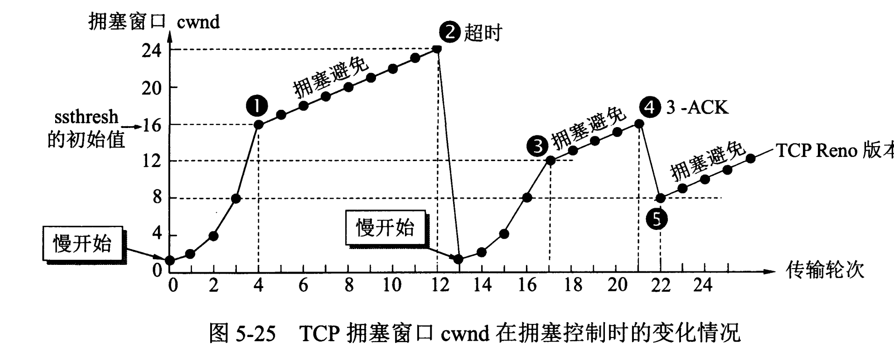

# 猿辅导 2017 校招笔试题卷一

## 1

SQL 语句中，删除一个表的命令是()。

正确答案: B   你的答案: 空 (错误)

```cpp
DELETE
```

```cpp
DROP
```

```cpp
CLEAR
```

```cpp
REMOVE
```

本题知识点

猿辅导 C++工程师 Java 工程师 2017

讨论

[****](https://www.nowcoder.com/profile/7962671)

答案是 B，DROP TABLE  表名称;

发表于 2018-08-10 10:43:52

* * *

[灵雨 Lyt](https://www.nowcoder.com/profile/9557815)

删除表属于 DDL 用的是 drop 删除表中数据 是 DML 用的是 delete

发表于 2018-08-04 10:40:53

* * *

[栀虞°C](https://www.nowcoder.com/profile/883650877)

删除表属于 DDL 用的是 drop 删除表中数据

发表于 2018-09-08 16:32:19

* * *

## 2

在关系代数运算中，五种基本运算为()。

正确答案: C   你的答案: 空 (错误)

```cpp
并、差、选择、投影、自然连接
```

```cpp
并、差、交、选择、投影
```

```cpp
并、差、选择、投影、乘积
```

```cpp
并、差、交、选择、乘积
```

本题知识点

猿辅导 C++工程师 Java 工程师 2017

讨论

[丶渣渣](https://www.nowcoder.com/profile/4935598)

乘积并不太准确，确切的说应该是笛卡尔积

发表于 2018-08-07 10:35:07

* * *

[世界很方](https://www.nowcoder.com/profile/190112425)

没有交，还有乘积

发表于 2018-08-07 06:08:36

* * *

## 3

关于 OSI 参考模型的描述中，正确的是()。

正确答案: B   你的答案: 空 (错误)

```cpp
OSI 参考模型由 IETF 制定
```

```cpp
按功能可以分为 7 个层次
```

```cpp
OSI 的含义是操作系统互连
```

```cpp
详细定义每层的实现技术
```

本题知识点

猿辅导 C++工程师 Java 工程师 2017

讨论

[Valar-Mor](https://www.nowcoder.com/profile/5663199)

OSI 是开放式系统互连，由 ISO 制定，按功能可分为物理层、数据链路层、网络层、传输层、会话层、表示层和应用层共七层

发表于 2018-08-04 16:02:59

* * *

[RavenJang](https://www.nowcoder.com/profile/9579042)

OSI 参考模型按功能分别为：物理层  数据链路层  网络层  传输层  会话层  表示层  应用层 TCP/IP 四层模型为：

链路层  网络层  传输层  应用层 

发表于 2018-08-14 15:02:41

* * *

[阿杰必胜](https://www.nowcoder.com/profile/3013090)

OSi 是开放式系统互联

发表于 2018-08-09 20:31:37

* * *

## 4

关于进程与线程的描述中，正确的是()。

正确答案: B   你的答案: 空 (错误)

```cpp
进程与线程是相同的概念
```

```cpp
进程需要存储空间
```

```cpp
一个线程可包含多个进程
```

```cpp
线程不需要分时器切换
```

本题知识点

猿辅导 C++工程师 Java 工程师 2017

讨论

[喔噢](https://www.nowcoder.com/profile/9411046)

**       进程**是表示资源分配的基本单位，又是调度运行的基本单位。      **线程**是进程中执行运算的最小单位，亦即执行处理机调度的基本单位。如果把进程理解为在逻辑上操作系统所完成的任务，那么线程表示完成该任务的许多可能的子任务之一。**进程和线程的关系**

（1）一个线程只能属于一个进程，而一个进程可以有多个线程，但至少有一个线程。线程是操作系统可识别的最小执行和调度单位。

（2）资源分配给进程，同一进程的所有线程共享该进程的所有资源。 同一进程中的多个线程共享代码段(代码和常量)，数据段(全局变量和静态变量)，扩展段(堆存储)。但是每个线程拥有自己的栈段，栈段又叫运行时段，用来存放所有局部变量和临时变量。

（3）处理机分给线程，即真正在处理机上运行的是线程。

（4）线程在执行过程中，需要协作同步。不同进程的线程间要利用消息通信的办法实现同步。 

发表于 2018-08-06 19:07:06

* * *

[****](https://www.nowcoder.com/profile/7962671)

此题答案选 B，线程是进程的子集，一个进程可以有很多线程，每条线程并行执行不同的任务。不同的进程使用不同的内存空间，而所有的线程共享一片相同的内存空间

编辑于 2018-08-10 10:49:30

* * *

[Valar-Mor](https://www.nowcoder.com/profile/5663199)

一个进程可包含多个线程

发表于 2018-08-04 16:03:29

* * *

## 5

关于 UNIX 操作系统的描述中，错误的是()。

正确答案: C   你的答案: 空 (错误)

```cpp
属于多用户操作系统
```

```cpp
由内核与外壳组成
```

```cpp
内核的操作原语对硬件不起作用
```

```cpp
主要用 C 语言写成
```

本题知识点

猿辅导 C++工程师 Java 工程师 2017

讨论

[喔噢](https://www.nowcoder.com/profile/9411046)

1.  UNIX 系统是一个**多用户**、多任务[操作系统](https://baike.baidu.com/item/%E6%93%8D%E4%BD%9C%E7%B3%BB%E7%BB%9F)，支持多种[处理器架构](https://baike.baidu.com/item/%E5%A4%84%E7%90%86%E5%99%A8%E6%9E%B6%E6%9E%84/8535061)（并行处理能力）。
2.  UNIX 的系统结构可分为三部分：Unix**内核**（Kernel）：系统核心，指挥调度机器运行，直接控制计算机资源，内核提供一种硬件抽象的方法来完成**对**[**硬件**](https://baike.baidu.com/item/%E7%A1%AC%E4%BB%B6)**操作**。  Unix**外壳**（Shell）：内核与用户的接口。工具以及应用程序：vi 编辑器、文件查找、备份
3.  UNIX 系统大部分是由**C**语言编写的，这使得系统易读，易修改，易移植。
4.  UNIX 提供了丰富的，精心挑选的系统调用，整个系统的实现十分紧凑，简洁。
5.  UNIX 提供了功能强大的可编程的 Shell 语言（外壳语言）作为用户界面具有简洁，高效的特点。
6.  UNIX 系统采用树状目录结构，具有良好的安全性，保密性和可维护性。
7.  UNIX 系统采用进程对换（Swapping）的内存管理机制和请求调页的存储方式，实现了虚拟内存管理，大大提高了内存的使用效率。
8.  UNIX 系统提供多种通信机制，如：管道通信，软中断通信，消息通信，共享存储器通信，信号灯通信

发表于 2018-08-06 19:23:32

* * *

## 6

请分别描述信号量和互斥锁的异同，并对使用场景进行举例。

你的答案

本题知识点

猿辅导 C++工程师 Java 工程师 2017

讨论

[流楓﹎鮰轌](https://www.nowcoder.com/profile/634426423)

1\. 互斥量用于线程的互斥，信号线用于线程的同步。 这是互斥量和信号量的根本区别，也就是互斥和同步之间的区别。2\. 互斥量值只能为 0/1，信号量值可以为非负整数。 
也就是说，一个互斥量只能用于一个资源的互斥访问，它不能实现多个资源的多线程互斥问题。信号量可以实现多个同类资源的多线程互斥和同步。当信号量为单值信号量是，也可以完成一个资源的互斥访问。 
3\. 互斥量的加锁和解锁必须由同一线程分别对应使用，信号量可以由一个线程释放，另一个线程得到。 

发表于 2018-09-01 21:22:14

* * *

[蘑菇 ding](https://www.nowcoder.com/profile/8093670)

互斥量的加锁和解锁必须由同一线程分别对应使用，信号量可以由一个线程释放，另一个线程得到。

基于上面的特点，互斥锁一般用于控制一段临界代码，当然信号量也可以做到。但是如果释放和获取不在一个函数中甚至不在一个线程中时就必须使用信号量了

发表于 2018-08-05 09:24:41

* * *

[单纯 bigboy](https://www.nowcoder.com/profile/387359923)

```cpp
信号量的特点：对一个进程加锁，可以不断加锁，设置一个标记 a=0,a++.解锁的时候 a--,当 a==0 时可以继续进行，PV 信号量操作。
应用场景：生产者-消费者的例子，使用场景：操作系统分配多个打印任务时
互斥锁：当一个进程把持资源时，其他进程不能访问此资源，此特性代表了此资源一次只能被一个进程利用，使用场景：文本的写入

```

发表于 2019-08-02 20:38:56

* * *

## 7

请列出至少三种 TCP 拥塞控制机制，并请就其中一种描述其工作原理。

你的答案

本题知识点

猿辅导 C++工程师 Java 工程师 2017

讨论

[太阳的朋友 cheerego](https://www.nowcoder.com/profile/2562458)

四种拥塞控制算法分别是：慢启动，拥塞控制，快重传和快恢复。

TCP 主要通过四种算法来进行拥塞控制：慢开始、拥塞避免、快重传、快恢复。

发送方需要维护一个叫做拥塞窗口（cwnd）的状态变量，注意拥塞窗口与发送方窗口的区别：拥塞窗口只是一个状态变量，实际决定发送方能发送多少数据的是发送方窗口。

为了便于讨论，做如下假设：

*   接收方有足够大的接收缓存，因此不会发生流量控制；
*   虽然 TCP 的窗口基于字节，但是这里设窗口的大小单位为报文段。



1\. 慢开始与拥塞避免

发送的最初执行慢开始，令 cwnd=1，发送方只能发送 1 个报文段；当收到确认后，将 cwnd 加倍，因此之后发送方能够发送的报文段数量为：2、4、8 ...

注意到慢开始每个轮次都将 cwnd 加倍，这样会让 cwnd 增长速度非常快，从而使得发送方发送的速度增长速度过快，网络拥塞的可能也就更高。设置一个慢开始门限 ssthresh，当 cwnd >= ssthresh 时，进入拥塞避免，每个轮次只将 cwnd 加 1。

如果出现了超时，则令 ssthresh = cwnd/2，然后重新执行慢开始。

2\. 快重传与快恢复

在接收方，要求每次接收到报文段都应该对最后一个已收到的有序报文段进行确认。例如已经接收到 M[1] 和 M[2]，此时收到 M[4]，应当发送对 M[2] 的确认。

在发送方，如果收到三个重复确认，那么可以知道下一个报文段丢失，此时执行快重传，立即重传下一个报文段。例如收到三个 M[2]，则 M[3] 丢失，立即重传 M[3]。

在这种情况下，只是丢失个别报文段，而不是网络拥塞。因此执行快恢复，令 ssthresh = cwnd/2 ，cwnd = ssthresh，注意到此时直接进入拥塞避免。

慢开始和快恢复的快慢指的是 cwnd 的设定值，而不是 cwnd 的增长速率。慢开始 cwnd 设定为 1，而快恢复 cwnd 设定为 ssthresh。

发表于 2018-08-13 14:12:08

* * *

[追风，逐日](https://www.nowcoder.com/profile/514030714)

慢启动，拥塞避免，快速重传，快速恢复

发表于 2018-08-05 22:46:03

* * *

[ryanxw](https://www.nowcoder.com/profile/1213837)

TCP 的三种拥塞控制机制：慢启动，拥塞避免，快恢复，快重传拥塞避免的工作原理：当传输的窗口到达门限值 ssthresh 时，开始拥塞避免，即线性增长，当到达窗口的最大值的时候门限值 ssthresh 减为发生 loss 事件时的 1/2,之后进入慢启动或者快恢复阶段

发表于 2018-11-02 16:00:06

* * *

## 8

5 个 PM 和 3 个 QA 围一圆桌而坐，只考虑每个人左边和右边是谁，要求 3 个 QA 互不相邻，问有多少种坐法。

你的答案

本题知识点

猿辅导 C++工程师 Java 工程师 2017

讨论

[CocoLeen](https://www.nowcoder.com/profile/783656045)

1440 先 5 个人坐，考虑方向问题，以其中一个为最左边，所有元素在其右边排列，应该有 A44=24 种排法然后 1 @ 2@3@4@5@有 5 个@位可以用来选择放 3 个 qa 选择 3 个位子，有 C53=10 种选择然后三个 qa 之间的顺序有 A33=6 中排法综合有 24*10*6=1440 请大家参考

发表于 2019-07-31 21:19:31

* * *

[taerbao](https://www.nowcoder.com/profile/8097287)

1440

发表于 2018-08-10 15:56:21

* * *

[鹿远与诗](https://www.nowcoder.com/profile/649912583)

三个 QA（工程师）坐好 就变成了 中间有三个框五个 PM（项目经理）进三个框 每个框必须有一个人变成数学题（排列组合）：五个不同的球放进三个不同的盒子里，要求每个盒子至少放一个球，一共有多少种方法肯定会有三个球放在一个盒子里，然后其他每个盒子里一个球.
先选择三个球：C(5,3)，然后把这三个球看成 1 个，共三个全排：A(3,3)
C( 5， 2） ×  A（ 3, 3 )

= 10 *  6
= 60

发表于 2018-08-10 11:12:23

* * *

## 9

4 个 RD 来到公司并将雨伞留在门外，下班时他们每人随机带走一把雨伞，问所有人都拿错的概率。

你的答案

本题知识点

猿辅导 C++工程师 Java 工程师 2017

讨论

[Victorain](https://www.nowcoder.com/profile/3167853)

直接正面推倒： 1\. 第一个人拿伞，有 3 种拿法(除自己的) 2\. 第二个人拿伞，让这个人是被上次拿错伞的人，则其有 3 种拿法(随便拿) 3\. 第三个人拿伞，让这个人是被上次拿错伞的人，则其只有一种拿法，才能使最后一拿错 因此 3 x 3 x 1 = 9

发表于 2018-08-08 09:45:45

* * *

[mrYangMLA](https://www.nowcoder.com/profile/688140661)

是不是只要写就会过啊.....全拿错的一 一列举可能比较麻烦所以，用排除法：1、四人拿伞有 all = 种可能。
2、只要一个人拿错，至少有两个人会错，所以没有一个人拿错的情况 3、四人都错 = all - 四人都对（只有 1 种情况） - 2 人拿错 - 3 人拿错() 
（3 人拿错）*2 是因为拿错的方式有两种
（两人拿错）*1 ， 是因为拿错的方式只有  ”互换“思路应该是对的。没算错的话就是这个答案

发表于 2019-08-24 15:34:06

* * *

[♂=-O 努力吧!☆○](https://www.nowcoder.com/profile/4709542)

一共 4*3*2 中拿法，24-C(1,4)-C(2,4)-C(3,4)-C(4,4)=24-4-6-4-1=9,答案 3/8

发表于 2018-08-05 21:00:17

* * *

## 10

给出平面上四个点 A，B，C，D 的坐标 A(x[1],y[1]),B(x[2],y[2]),C(x[3],y[3]),D(x[4],y[4])，请给出向量 AB 和 CD 共线的条件。

你的答案

本题知识点

猿辅导 C++工程师 Java 工程师 2017

讨论

[十字路口的真](https://www.nowcoder.com/profile/3100022)

（y1－y2）/（x1－x2）=（y3-y4）/（x3-x4）=（y3-y2）/（x3－x2）

发表于 2018-08-06 23:04:01

* * *

[dzydzy7](https://www.nowcoder.com/profile/343192959)

（x2 - x1）* (y4 - y3) == (x4 - x3) * (y2 - y1)

发表于 2020-07-23 19:59:56

* * *

[ryanxw](https://www.nowcoder.com/profile/1213837)

(y3-y1)/(x3-x1) = (y4-y2)/(x4-x2)  && (y2-y1)/(x2-x1) = (y4-y3)/(x4-x3) 

发表于 2018-11-02 16:14:48

* * *

## 11

小明认为某些数字不吉利，付账时会尽可能少的多付一些钱，使得价格中不包含这些不吉利数字，并且不出现 0.例如，不吉利数字为 1，4，7，8，商品价格为 1000，小明实际支付 2222.实现程序，输入商品原来的价格 price，不吉利数字集合 unlucky_numbers，求小明付账时的价格 lucky_price.

```cpp
// C
int get_lucky_price(int price,int unlucky_numbers[],int unlucky_numbers_count){
     //   TODO
}

// C++
int get_lucky_price(int price,const vector<int> & unlucky_numbers){
     //TODO
}

// Java
int getLuckyPrice(int price,List<Integer> unlucky_numbers){
     //   TODO
}
```

你的答案

本题知识点

猿辅导 C++工程师 Java 工程师 2017

讨论

[加点 ketchup 吧](https://www.nowcoder.com/profile/531959156)

```cpp
def getLuckyPrice(price,unlucky_numbers):
    p = list(map(int,' '.join(str(price)).split()))
    p.insert(0,0) # 在首位增加一位，以防止价格首位为 9 而 9 也是不幸运数字
    for i in range(len(p)-1,0,-1):
        helper(i,p,unlucky_numbers) # 改变价格以变成幸运数字
    if p[0] == 0: # 如果未进位，不输入 0
        print(p[1:]) 
    else:
        helper(0,p,unlucky_numbers) # 如果进位，也要判断进位后的 1 是不是属于不幸运数字
        print(p)

def helper(i,p,unlucky_numbers):
    if p[i] in unlucky_numbers or p[i] == 0:
        for j in range(len(unlucky_numbers)):
            if p[i] == unlucky_numbers[j] or p[i] == 0:
                p[i] = p[i]+1
#             else:
#                 continue
            if p[i] >= 10:
                p[i] = p[i] % 10
                p[i-1] = p[i-1]+1
            helper(i,p,unlucky_numbers) # 递归判断增加 1 后的数字还属不属于不幸运数字
#             else:
#                 continue

# 测试
getLuckyPrice(9009,[1,4,7,9])
getLuckyPrice(1000,[1,4,7,8]) 
```

 发表于 2019-07-29 23:55:18

* * *

[m450000](https://www.nowcoder.com/profile/968997371)

取出每一位的数字，从个位开始，不吉利就加 1，注意进位，直到吉利。

发表于 2018-09-09 18:32:51

* * *

[寂静于暖](https://www.nowcoder.com/profile/6461901)

```cpp
        int getLuckyPrice(int price, List<Integer> unlucky_numbers){

        //price 的每一位
        int[] array = new int[10];
        int i = 0;
        //最后结果
        int res = 0;
        while(price > 0){
            array[i] = price % 10;
            i++;
            price /= 10;
        }
        for(i -= 1; i >= 0; i--) {
            if(unlucky_numbers.contains(array[i])) {
                array[i] = plus1(array[i]);
                res += array[i] * Math.pow(10, i);
                break;
            }
            res += array[i] * Math.pow(10, i);
        }
        for(i -= 1 ; i >= 0; i--) {
            array[i] = 2;
            res += array[i] * Math.pow(10, i);
        }

        return res;
    }

    //加 1
    public int plus1(int num) {
        switch(num) {
            case 0:return 2;
            case 1:return 2;
            case 4:return 5;
            case 7:return 9;
            case 8:return 9;
            default:return num;
        }
    }
```

发表于 2018-08-10 15:26:14

* * *

## 12

一个一维维数组中只有 1 和-1，实现程序，求和为 0 的最长子串长度，并在注释中给出时间和空间复杂度。

```cpp
// C
int getLongestLength(int array[],int szie){
     //   TODO
}

// C++
int getLongestLength(const vector<int> & array){
     //   TODO
}

// Java
int getLongestLength(List<Integer> array){
     //   TODO
}
```

你的答案

本题知识点

猿辅导 C++工程师 Java 工程师 2017

讨论

[信大呆](https://www.nowcoder.com/profile/5924424)

动态规划，arr 为原始序列，动态规划序列为 dp[len+1]，dp[i+1]表示以 arr 第 i 个元素结尾的序列的最长 0 和子串长度。if arr[i] == -arr[i-1]，dp[i+1] = dp[i-1] + 2,if arr[i] == -arr[i-dp[i]], dp[i+1] = dp[i] + 2,else arr[i] = 0

```cpp
def foo(arr):
    dp = [0] * (len(arr) + 1)
    dp[0] = 0
    dp[1] = 0
    for i in range(1, len(arr)):
        if arr[i] == -arr[i-1]:
            dp[i+1] = dp[i-1] + 2
        elif arr[i] == -arr[i-dp[i]-1]:
            dp[i+1] = dp[i] + 2
        else:
            dp[i+1] = 0
    print(dp)
    return max(dp)

foo([ -1, -1,-1, -1, -1, 1, 1, 1])
>>> 6
foo([-1, 1, -1, -1, 1, -1])
>>> 4
```

发表于 2018-08-14 14:43:58

* * *

[枕上书](https://www.nowcoder.com/profile/7692311)

有一个更简单的方法。说下思路思路就是在 i 从 0 到 n，计算 sum(i)，sum(i)表示从 0 到 i 的元素之和。并保存在字典 dic 中，value 是索引 i，在往后的遍历中每得到一个 sum(i)就查看 dic 的 keys 是否已有此 sum(i)值，如果有则用当前 i 位置减去保存的 i，并与 maxLen 比较，取大的那个。遍历结束，给出结果。时间复杂度 O(n)，空间复杂度 O(1)。原链接里是 python 写的，我又用 Java 写了一下 import java.util.HashMap;

public class yuantiku {
    public static int getLongestLength(int []a) {
        int max=0;
        int sum=0;
        HashMap<Integer,Integer> hashMap=new HashMap<>();
        hashMap.put(0,-1);
        for (int i=0;i<a.length;i++){
            sum=sum+a[i];
            if (hashMap.get(sum)==null){
                hashMap.put(sum,i);
            }else{
                int tmp=i-hashMap.get(sum);
                if (max<tmp){
                    max=tmp;
                }
            }
        }
        return max;

    }

    public static void main(String[] args) {
        int []a=new int[]{ -1, -1,-1, -1, -1, 1, 1, 1};
        System.out.println(getLongestLength(a));
    }
}

作者：贰拾贰画生
链接：[`www.jianshu.com/p/3bf87384a92b`](https://www.jianshu.com/p/3bf87384a92b)
來源：简书
简书著作权归作者所有，任何形式的转载都请联系作者获得授权并注明出处。

编辑于 2018-08-07 22:01:20

* * *

[食鱼](https://www.nowcoder.com/profile/2522076)

动态规划解法核心思路 dp[i][j]表示从 array[i]一直加到 array[j]的和递推式：dp[i][j] = dp[i+1][j-1] + array[i] + array[j];判定：if(dp[i][j] == 0) max = max(max, j-1+1);

```cpp
public class Solution {
    public static int getLongestLength(List<Integer> array) {
        if(array.size() <= 1)
            return 0;
        int max = 0;
        int size = array.size();
        //tab[i][j]表示从 array[i]一直加到 array[j]的和
        int[][] tab = new int[size][size];

        //求两两相邻的和，作为下一步的边界条件
        for(int i = 1; i < size; i++) {
            tab[i-1][i] = array.get(i-1) + array.get(i);
            if(array.get(i) == -array.get(i-1)) 
                max = 2;
        }

        //由于数组中只有 1 和-1，要使结果为 0，子串长度必须为偶数，因此 len = len + 2;
        for(int len = 3; len < size; len = len + 2) {
            for(int i = 0, j; (j = i + len) < size; i++) {
                tab[i][j] = array.get(i) + array.get(j) + tab[i + 1][j - 1];
                if(tab[i][j] == 0) {
                    max = Math.max(max, j-i+1);
                }
            }
        }
        return max;
    }
} 
```

转自：[`blog.csdn.net/weixin_38278878/article/details/81414674`](https://blog.csdn.net/weixin_38278878/article/details/81414674)

编辑于 2018-08-04 20:06:52

* * *