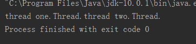
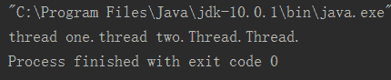
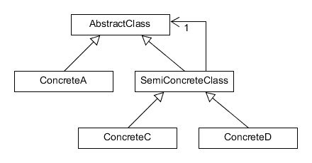

# 招商银行信用卡中心 2018 秋招开发方向笔试题

## 1

有以下程序段,下面正确的选项是

```cpp
class DemoThread extends Thread {
    public static void main(String args[]) {
        DemoThread threadOne = new DemoThread();
        DemoThread threadTwo = new DemoThread();
        threadOne.start();
        System.out.print("thread one.");
        threadTwo.start();
        System.out.print("thread two.");
    }
    public void run() {
        System.out.print("Thread.");
    }
}
```

正确答案: D   你的答案: 空 (错误)

```cpp
编译失败
```

```cpp
程序运行结果为：thread one.Thread.thread two.Thread.
```

```cpp
程序运行结果是：thread one.thread two.Thread.Thread.
```

```cpp
程序运行结果不确定
```

本题知识点

招商银行信用卡中心 Java 工程师 C++工程师 iOS 工程师 安卓工程师 运维工程师 前端工程师 算法工程师 PHP 工程师 2018

讨论

[testtesttesttest](https://www.nowcoder.com/profile/8733057)

start()方法使线程变为就绪状态，线程若获得 CPU 资源，就只可以执行 run 方法。main()方法是主线程，所以本题主线程、threadOne 、threadTwo 执行顺序不确定。

发表于 2018-08-16 21:59:03

* * *

[JonTang](https://www.nowcoder.com/profile/1173781)

在 IDEA 上运行了两次之后，结果都不同；第一次：，第二次：

发表于 2018-08-11 21:27:09

* * *

## 2

下面 C 程序的输出结果是

```cpp
unsigned fun(unsigned);
int main()
{
    unsigned num = 26;
    printf("%d", fun(num));
    return 0;
}
unsigned fun(unsigned num)
{
    unsigned k = 1;
    do
    {
        k *= num % 10;
        num /= 10;
    } while (num);
    return(k);
}
```

正确答案: A   你的答案: 空 (错误)

```cpp
12
```

```cpp
无限循环
```

```cpp
1
```

```cpp
26
```

本题知识点

招商银行信用卡中心 Java 工程师 C++工程师 iOS 工程师 安卓工程师 运维工程师 前端工程师 算法工程师 PHP 工程师 C++工程师 Java 工程师 招商银行信用卡中心 2018

讨论

[SJZ97](https://www.nowcoder.com/profile/7345030)

loop 1：num = 26 , k =1k =  k * (num % 10) = 1 * (26 % 10) = 1 * 6num = 2 num != 0 继续 whileloop 2：num = 2 , k = 6k = 6 * (2 % 10 ) = 12num = 2 / 10 = 0 ---> 跳出循环 output: k = 12

发表于 2019-03-02 19:14:40

* * *

[牛客 219130506 号](https://www.nowcoder.com/profile/219130506)

%的运算优先级高于*=

发表于 2021-03-10 18:26:36

* * *

[古城有光](https://www.nowcoder.com/profile/9832888)

其实就是问 k *= num % 10 是怎么计算的可以理解为 k = k*(num%10)带括号的

发表于 2019-03-03 21:53:05

* * *

## 3

下面 C 程序的输出结果是

```cpp
int main()
{
    int a[5] = {1, 2, 3, 4, 5};
    int *ptr=(int *)(&a + 1);
    printf("%d, %d",*(a + 1), *(ptr -1 ));
    return 0;
}
```

正确答案: A   你的答案: 空 (错误)

```cpp
2, 5
```

```cpp
1, 3
```

```cpp
1, 5
```

```cpp
2, 43586
```

本题知识点

招商银行信用卡中心 Java 工程师 C++工程师 iOS 工程师 安卓工程师 运维工程师 前端工程师 算法工程师 PHP 工程师 C++工程师 Java 工程师 招商银行信用卡中心 2018

讨论

[青一无业游民](https://www.nowcoder.com/profile/8245477)

答案如下：

*(a+1)其实很简单就是指 a[1],输出为 2\.

问题关键就在于第二个点，*(ptr-1)输出为多少？

解释如下，&a+1 不是首地址+1，系统会认为加了一个整个 a 数组，偏移了整个数组 a 的大小（也就是 5 个 int 的大小）。所以 int *ptr=(int *)(&a+1);其实 ptr 实际是&(a[5]),也就是 a+5\.

原因为何呢？

&a 是数组指针，其类型为 int(*)[5];

而指针加 1 要根据指针类型加上一定的值，不同类型的指针+1 之后增加的大小不同，a 是长度为 5 的 int 数组指针，所以要加 5*sizeof(int)，所以 ptr 实际是 a[5],但是 ptr 与（&a+1）类型是不一样的，这点非常重要，所以 ptr-1 只会减去 sizeof(int*),a，&a 的地址是一样的，但意思就不一样了，a 是数组首地址，也就是 a[0]的地址，&a 是对象（数组）首地址，a+1 是数组下一元素的地址，即 a[1],&a+1 是下一个对象的地址，即 a[5]。

发表于 2018-08-30 16:31:02

* * *

[张亚倩](https://www.nowcoder.com/profile/893815208)

对数组名取地址得到指向整个数组的指针，加 1 指向整个数组之后的内存空间，再减 1 就指向数组的最后一个元素 5

发表于 2018-08-12 01:43:13

* * *

[摆渡人。](https://www.nowcoder.com/profile/2660196)

C/C++里面的数组名字会退化为指针，所以数组名 a 实际指的是数组的第一个元素的地址。而数组名作为指针来讲有特殊性，它正在它所指向的内存区域中，&a 的值和 a 的数值是相同的（可以输出观察一下），但是类型和意义不同。而指针的加法***作和指向的数据类型密切相关。
比如：
int a[10]; a 就相当于 int *，如果是对它加 1（a + 1）是相当于 a + 1 * sizeof(int)。但是&a 的类型则相当于 int **，是所谓指向数组的指针，是数组元素类型的二级指针，对它加 1 是相当于 &a + 1 * sizeof(a)的，所以会偏移一个数组长度。

发表于 2018-09-22 11:48:42

* * *

## 4

进栈序列为 1, 2, 3, 4, 进栈过程中可以出栈, 则下列不可能的出栈序列是

正确答案: C   你的答案: 空 (错误)

```cpp
1,2,3,4
```

```cpp
2,3,1,4
```

```cpp
3,1,2,4
```

```cpp
4,3,2,1
```

本题知识点

招商银行信用卡中心 Java 工程师 C++工程师 iOS 工程师 安卓工程师 运维工程师 前端工程师 算法工程师 PHP 工程师 2018

讨论

[月下闲庭](https://www.nowcoder.com/profile/129617825)

答案应该是 c，进栈的时候可以出栈，所以 c 选项 3124，先进去 123，然后出来 3，再出来 2，但是答案出来了 1 所以错

发表于 2018-10-22 21:44:24

* * *

[晓旭 zz](https://www.nowcoder.com/profile/747273677)

堆 先进先出 栈先进后出

发表于 2018-10-21 19:27:59

* * *

## 5

最符合下图的设计模式是

正确答案: B   你的答案: 空 (错误)

```cpp
组合模式
```

```cpp
装饰器模式
```

```cpp
策略模式
```

```cpp
模板模式
```

本题知识点

招商银行信用卡中心 Java 工程师 C++工程师 iOS 工程师 安卓工程师 运维工程师 前端工程师 算法工程师 PHP 工程师 C++工程师 Java 工程师 招商银行信用卡中心 2018

讨论

[一个不善言辞的人](https://www.nowcoder.com/profile/204724973)

装饰（Decorator）模式：动态的给对象增加一些职责，即增加其额外的功能。

发表于 2020-04-07 11:36:15

* * *

[王家都督](https://www.nowcoder.com/profile/305262737)

策略模式定义了一系列的算法，并将每一个算法封装起来，而且使他们可以相互替换，让算法独立于使用客户而独立变化

发表于 2018-08-13 13:18:29

* * *

## 6

在 32 位机上，下面 C 程序的输出结果是（）

```cpp
struct MyStruct
{
    int i;
    char c;
    struct InnerStruct
    {
        int i;
        long l;
        double d;
        char c;
    } innerStruct;
};
union MyUnion
{
    int i;
    char c;
};
int main()
{
   printf("%d, %d", sizeof(MyStruct), sizeof(MyUnion));
}
```

正确答案: C   你的答案: 空 (错误)

```cpp
28, 4
```

```cpp
28, 5
```

```cpp
32, 4
```

```cpp
32, 5
```

本题知识点

招商银行信用卡中心 Java 工程师 C++工程师 iOS 工程师 安卓工程师 运维工程师 前端工程师 算法工程师 PHP 工程师 2018 C 语言

讨论

[大荣 qhr](https://www.nowcoder.com/profile/8857287)

一般 32 位机子上各个数据类型所占的存储空间如下：

char：8 位 

short：16 位

int：32 位

long：32 位

float：32 位

double：64 位

一、接下来先来看 struct，结构体

请牢记以下 3 条原则：（在没有#pragma pack 宏的情况下）

1、数据成员对齐规则：结构体（struct）的数据成员，第一个数据成员放在 offset 为 0 的地方，之后的每个数据成员存储的起始位置要从该成员大小的整数倍开始（比如 int 在 32 位机子上为 4 字节，所以要从 4 的整数倍地址开始存储）。

2、结构体作为成员：如果一个结构体里同时包含结构体成员，则结构体成员要从其内部最大元素大小的整数倍地址开始存储（如 struct a 里有 struct b,b 里有 char,int ,double 等元素，那么 b 应该从 8(即 double 类型的大小)的整数倍开始存储）。

3、结构体的总大小：即 sizeof 的结果。在按之前的对齐原则计算出来的大小的基础上，必须还得是其内部最大成员的整数倍，不足的要补齐（如 struct 里最大为 double，现在计算得到的已经是 11，则总大小为 16）。

1.  typedef struct bb
2.  {
3.  int id; //[0]....[3] 表示 4 字节
4.  double weight; //[8].....[15]　　　　　　原则 1
5.  float height; //[16]..[19],总长要为 8 的整数倍,仅对齐之后总长为[0]~[19]为 20，补齐[20]...[23]　　　　　原则 3
6.  }BB;

      size 为 56

二、union 共用体（联合）

共用体表示几个变量共用一个内存位置，在不同的时间保存不同的数据类型和不同长度的变量。在 union 中，所有的共用体成员共用一个空间，并且同一时间只能储存其中一个成员变量的值。当一个共用体被声明时, 编译程序自动地产生一个变量, 其长度为联合中元类型（如数组，取其类型的数据长度）最大的变量长度的整数倍，且要大于等于其最大成员所占的存储空间。union foo
{
char s[10];
int i;
}
在这个 union 中，foo 的内存空间的长度为 12，是 int 型的 3 倍，而并不是数组的长度 10。若把 int 改为 double，则 foo 的内存空间为 16，是 double 型的两倍。union   mm{  
  char   a;//元长度 1        1
  int   b[5];//元长度 4     20
  double   c;//元长度 8     8
  int   d[3];              12
  };  
所以 sizeof(mm)=8*3=24；

发表于 2018-08-13 15:36:27

* * *

[牛客 279810500 号](https://www.nowcoder.com/profile/279810500)

做选择题就要有做选择题的方法，除了掌握基本的知识。对于 struct 来说，大小虽然要慢慢累加，但是最后必然为 struct 里最长类型的整数倍，即 double 为 8 字节，则肯定是 8 的整数倍，排除 A,B（不用慢慢累加计算）对于 Union 来说，就简单了，大小为最长类型的整数倍，即 int 为 4 字节，则为 4，选 C

编辑于 2020-05-27 11:19:22

* * *

[请叫我可爱酱酱酱](https://www.nowcoder.com/profile/888584375)

这道题的答案是错误的，32 操纵系统的时候，结果是 28，64 的时候，结果未 32，vs2010 亲测

发表于 2020-03-12 18:22:48

* * *

## 7

下面 java 程序的运行结果是

```cpp
class A {
    static {
        System.out.print("A");
    }
    public A() {
        System.out.print("a");
    }
    void say() {
        System.out.print("1");
    }
}
class B extends A {
    static {
        System.out.print("B");
    }
    public B() {
        System.out.print("b");
    }
    void say() {
        System.out.print("2");
    }
}
public class Hello {
    public static void main(String[] args) {
        A ab = new B();
        ab.say();
        ab = new B();
        ab.say();
    }
}
```

正确答案: D   你的答案: 空 (错误)

```cpp
ABab2ABab2
```

```cpp
AaBb1AaBb2
```

```cpp
ABab1ab2
```

```cpp
ABab2ab2
```

本题知识点

招商银行信用卡中心 Java 工程师 C++工程师 iOS 工程师 安卓工程师 运维工程师 前端工程师 算法工程师 PHP 工程师 C++工程师 Java 工程师 招商银行信用卡中心 2018

讨论

[陈楚钳](https://www.nowcoder.com/profile/6274179)

执行顺序为：父类静态代码块 --> 子类静态代码块 --> 父类无参构造方法 --> 子类无参构造方法 且静态代码块在初始化时仅执行一次

发表于 2018-09-02 21:37:58

* * *

[z 止于至善](https://www.nowcoder.com/profile/4687287)

初始化时静态代码块仅执行一次

发表于 2018-08-29 11:56:16

* * *

[饭特稀 233](https://www.nowcoder.com/profile/9348417)

对于静态变量、静态初始化块、变量、初始化块、构造器，它们的初始化顺序依次是（静态变量、静态初始化块）>（变量、初始化块）>构造器。看代码：

```cpp
public class InitialOrderTest {
    // 静态变量
    public static String staticField = "静态变量";
    // 变量
    public String field = "变量";
    // 静态初始化块
    static {
        System.out.println(staticField);
        System.out.println("静态初始化块");
    }
    // 初始化块
    {
        System.out.println(field);
        System.out.println("初始化块");
    }
    // 构造器
    public InitialOrderTest() {
        System.out.println("构造器");
    }
    public static void main(String[] args) {
        new InitialOrderTest();
    }
}
```

结果：

```cpp
1\. 静态变量
2\. 静态初始化块
3\. 变量
4\. 初始化块
5\. 构造器
```

对于继承情况下的类的初始化是怎样的呢？看代码：

```cpp
class Parent {
    // 静态变量
    public static String p_StaticField = "父类--静态变量";
    // 变量
    public String p_Field = "父类--变量";
    // 静态初始化块
    static {
        System.out.println(p_StaticField);
        System.out.println("父类--静态初始化块");
    }
    // 初始化块
    {
        System.out.println(p_Field);
        System.out.println("父类--初始化块");
    }
    // 构造器
    public Parent() {
        System.out.println("父类--构造器");
    }
}
public class SubClass extends Parent {
    // 静态变量
    public static String s_StaticField = "子类--静态变量";
    // 变量
    public String s_Field = "子类--变量";
    // 静态初始化块
    static {
        System.out.println(s_StaticField);
        System.out.println("子类--静态初始化块");
    }
    // 初始化块
    {
        System.out.println(s_Field);
        System.out.println("子类--初始化块");
    }
    // 构造器
    public SubClass() {
        System.out.println("子类--构造器");
    }
    // 程序入口
    public static void main(String[] args) {
        new SubClass();
    }
}
```

结果：

```cpp
1\. 父类--静态变量
2\. 父类--静态初始化块
3\. 子类--静态变量
4\. 子类--静态初始化块
5\. 父类--变量
6\. 父类--初始化块
7\. 父类--构造器
8\. 子类--变量
9\. 子类--初始化块
10\. 子类--构造器
```

可以注意到一点，并不是父类完全初始化完毕后才进行子类的初始化，实际上子类的静态变量和静态初始化块的初始化是在父类的变量、初始化块和构造器初始化之前就完成了。

那么对于静态变量和静态初始化块之间、变量和初始化块之间的先后顺序又是怎样呢？是否静态变量总是先于静态初始化块，变量总是先于初始化块就被初始化了呢？实际上这取决于它们在类中出现的先后顺序。

编辑于 2019-08-25 23:23:09

* * *

## 8

关于 sleep()和 wait()，以下描述错误的一项是

正确答案: D   你的答案: 空 (错误)

```cpp
sleep 是线程类（Thread）的方法，wait 是 Object 类的方法；
```

```cpp
sleep 不释放对象锁，wait 放弃对象锁；
```

```cpp
sleep 暂停线程、但监控状态仍然保持，结束后会自动恢复；
```

```cpp
wait 后进入等待锁定池，只有针对此对象发出 notify 方法后获得对象锁进入运行状态。
```

本题知识点

招商银行信用卡中心 Java 工程师 C++工程师 iOS 工程师 安卓工程师 运维工程师 前端工程师 算法工程师 PHP 工程师 2018

讨论

[饭特稀 233](https://www.nowcoder.com/profile/9348417)

sleep() 和 wait() 有什么区别？

*   类的不同：sleep() 来⾃ Thread，wait() 来⾃ Object。
*   释放锁：sleep() 不释放锁；wait() 释放锁。
*   ⽤法不同：sleep() 时间到会⾃动恢复；wait() 可以使用 notify()/notifyAll()直接唤醒。

notify()和 notifyAll()有什么区别？

notifyAll()会唤醒所有的线程，notify()之后唤醒⼀个线程。notifyAll() 调⽤后，会将全部线程由等待池移到锁池，然后参与锁的竞争，竞争成功则继续执⾏，如果不成功则留在锁池等待锁被释放后再次参与竞争。⽽ notify()只会唤醒⼀个线程，具体唤醒哪⼀个线程由虚拟机控制。

编辑于 2019-08-25 23:26:16

* * *

[陈楚钳](https://www.nowcoder.com/profile/6274179)

wait 后进入等待锁定池，只有针对此对象发出 notify 或者是 notifAll 方法后获得对象锁进入就绪状态

发表于 2018-09-02 21:44:30

* * *

[发电的小胖胖](https://www.nowcoder.com/profile/6458369)

wait 是 Object 类的方法，对此对象调用 wait 方法导致本线程放弃对象锁，进入等待此对象的等待锁定池，只有针对此对象发出 notify 方法（或 notifyAll）后本线程才进入对象锁定池准备获得对象锁进入运行状态。

发表于 2018-08-14 15:58:21

* * *

## 9

在 Linux 上，对于多进程，子进程继承了父进程的下列哪些?

正确答案: B C D   你的答案: 空 (错误)

```cpp
进程地址空间
```

```cpp
共享内存
```

```cpp
信号掩码
```

```cpp
已打开的文件描述符
```

本题知识点

招商银行信用卡中心 Java 工程师 C++工程师 iOS 工程师 安卓工程师 运维工程师 前端工程师 算法工程师 PHP 工程师 2018

讨论

[发电的小胖胖](https://www.nowcoder.com/profile/6458369)

子进程继承父进程

用户号 UIDs 和用户组号 GIDs 
环境 Environment 
堆栈 
共享内存 
打开文件的描述符 
执行时关闭（Close-on-exec）标志 
信号（Signal）控制设定 
进程组号 
当前工作目录 
根目录 
文件方式创建屏蔽字 
资源限制 
控制终端

子进程独有

进程号 PID 
不同的父进程号 
自己的文件描述符和目录流的拷贝 
子进程不继承父进程的进程正文（text），数据和其他锁定内存（memory locks） 
不继承异步输入和输出

父进程和子进程拥有独立的地址空间和 PID 参数。

发表于 2018-08-14 16:00:19

* * *

## 10

关于数据库锁，以下说法不正确的是

正确答案: B C   你的答案: 空 (错误)

```cpp
数据库系统锁分为独占锁、共享锁和更新锁三种
```

```cpp
数据库死锁不会发生
```

```cpp
在表级锁锁定期间，其它进程无法对该表进行写操作，但可以执行读操作
```

```cpp
行级锁在多线程中相比页级锁更不容易产生锁定冲突
```

本题知识点

招商银行信用卡中心 Java 工程师 C++工程师 iOS 工程师 安卓工程师 运维工程师 前端工程师 算法工程师 PHP 工程师 2018

讨论

[发电的小胖胖](https://www.nowcoder.com/profile/6458369)

表级:引擎 MyISAM, 理解为锁住整个表, 锁定期间, 其它进程无法对该表进行写操作, 如果是读锁, 其他进程可以同时读, 如果是写锁, 则其它进程则读也不允许 行级:引擎 INNODB, 单独的一行记录加锁, 其它进程还是可以对同一个表中的其它记录进行操作

页级:引擎 BDB, 表级锁速度快, 但冲突多, 行级冲突少, 但速度慢, 页级折衷, 一次锁定相邻的一组记录 

发表于 2018-08-14 16:03:56

* * *

## 11

关于 TCP 协议，以下说法正确的有

正确答案: A B C   你的答案: 空 (错误)

```cpp
TCP 提供一种面向连接的、可靠的字节流服务
```

```cpp
TCP 协议声称可靠性数据传输，其底层实现机制主要包括三个方面：使用序列号对传输的数据进行编号，数据超时重传，数据确认应答
```

```cpp
两个使用 TCP 的应用（通常是一个客户和一个服务器）在彼此交换数据之前必须先建立一个 TCP 连接
```

```cpp
TCP 在实际中有很多方面的应用，如广播和多播
```

本题知识点

招商银行信用卡中心 Java 工程师 C++工程师 iOS 工程师 安卓工程师 运维工程师 前端工程师 算法工程师 PHP 工程师 2018

讨论

[发电的小胖胖](https://www.nowcoder.com/profile/6458369)

广播和多播仅应用于 UDP，因为 TCP 是面向连接的协议（IP 地址确定）

发表于 2018-08-14 16:06:13

* * *

[FearIsUnreal](https://www.nowcoder.com/profile/2825614)

TCP 的主要特点：（1）面向连接（2）**每一条 TCP 连接只能是点对点（一对一）**（3）提供可靠交付的服务（4）面向字节流（5）提供全双工通信 UDP 主要特点：（1）无连接（2）尽最大努力交付（3）面向报文（4）无拥塞控制（5）**支持一对一，一对多，多对多的交互通信**（6）首部开销小。

发表于 2019-08-19 21:46:23

* * *

## 12

某公司年会上，组织人员安排了一个小游戏来调节气氛。游戏规则如下：

N 个人参与游戏，站成一排来抢工作人抛来的 M 个小玩偶。为了增加游戏的趣味和难度，规则规定，参与游戏的人抢到的礼物不能比左右两边的人多两个或以上，否则会受到一定的惩罚。游戏结束时拥有玩偶最多的人将获得一份大奖。假设大家都想赢得这份大奖，请问站在第 K 个位置的小招在赢得游戏时，最多能拥有几个玩偶？

本题知识点

招商银行信用卡中心 Java 工程师 C++工程师 iOS 工程师 安卓工程师 运维工程师 前端工程师 算法工程师 PHP 工程师 查找 *模拟 数组 贪心 2018* *讨论

[维他柠檬茶](https://www.nowcoder.com/profile/7953682)

```cpp
import java.util.Scanner;

public class Main {
    public static void main(String[] args) {
        Scanner in = new Scanner(System.in);
        while (in.hasNext()) {
            int n = in.nextInt();
            int m = in.nextInt();
            int k = in.nextInt();
            // 特殊情况
            if(n==0 || m==0 || k<=0 || k>n) {
                System.out.println(0);
            } else {
                // 参与游戏的人抢到的礼物不能比左右两边的人多两个或以上
                // 即小招左右两边的人最少分别为小招的玩偶数减一，即 max-1
                // 为了让小招玩偶数尽量多，离校招越远的人玩偶数越少，呈依次减一的情形
                for (int max = m; max >0; max--) {
                    int sum = max;
                    for (int i = 1; i <= k-1; i++) {
                        sum += (max-i)>0?(max-i):0;
                    }
                    for (int i = 1; i <= n-k; i++) {
                        sum += (max-i)>0?(max-i):0;
                    }
                    if(sum<=m) {
                        System.out.println(max);
                        break;
                    }
                }
            }
        }
    }
} 
```

发表于 2018-08-13 19:40:20

* * *

[tides](https://www.nowcoder.com/profile/590869520)

```cpp
# 考虑每次 K 位置加 1 时，要给左右两边加多少
# 注意边界条件
N, M, K = [int(num) for num in input().split()]
if K < 1 or K > N:
    print(0)
    exit()
if N == 1:
    print(M)
    exit()
cnt = 0
i = j = K
need = j - i + 1
while M >= need:
    cnt += 1
    M -= need
    i = max(1, i-1)
    j = min(N, j+1)
    need = j - i + 1
print(cnt)

```

编辑于 2019-04-03 09:01:58

* * *

[杯小年](https://www.nowcoder.com/profile/5414042)

初步想了下，逻辑对吗？

```cpp
 public int test(intN, int M, int K){
    if(K==0) return 0;
    if(K==1||K==N){
         if(M%2==0) return M/2;
         else return M/2+1;
     }
     if(M%2==0) return M/2;
     else return M/2+1;
     }
}

```

编辑于 2018-08-12 10:07:32

* * *

## 13

按照卡中心校园招聘的要求，HR 小招和小商需要从三个科室中（分别为 A、B、C）抽派面试官去往不同城市。
两名 HR 按照以下规定轮流从任一科室选择面试官：每次至少选择一位，至多选择该科室剩余面试官数。最先选不到面试官的 HR 需要自己出差。
假设 HR 小招和小商都不想出差且每次选择都采取最优策略，如果是小招先选，写一个函数来判断她是否需要出差。如果不需要出差，请给出第一步的最优策略。

本题知识点

招商银行信用卡中心 Java 工程师 C++工程师 iOS 工程师 安卓工程师 运维工程师 前端工程师 算法工程师 PHP 工程师 贪心 模拟 数学 2018

讨论

[wylu](https://www.nowcoder.com/profile/8627786)

[`baike.baidu.com/item/Nim%E6%B8%B8%E6%88%8F`](https://baike.baidu.com/item/Nim%E6%B8%B8%E6%88%8F)关于寻找 N-position 移动到某个 P-position 的方法，参考第二个命题的证明

```cpp
import java.io.BufferedReader;
import java.io.IOException;
import java.io.InputStreamReader;

/**
 * Nim 游戏
 * @author wylu
 */
public class Main {
    static String[] room = {"A", "B", "C"};

    public static void main(String[] args) throws IOException {
        BufferedReader br = new BufferedReader(new InputStreamReader(System.in));
        String[] strs = br.readLine().split(",");
        int[] a = new int[strs.length];
        int k = 0;
        for (int i = 0; i < strs.length; i++) {
            a[i] = Integer.parseInt(strs[i]);
            k ^= a[i];
        }

        if (k == 0) {
            //P-position，先手必败
            System.out.println(1);
        } else {
            //N-position，先手必胜
            for (int i = 0; i < a.length; i++) {
                //寻找 N-position 移动到某个 P-position 的方法
                int num = k ^ a[i];
                if (a[i] - num >= 0) {
                    System.out.println(room[i] + "," + (a[i] - num));
                    break;
                }
            }
        }
    }
}

```

编辑于 2020-08-06 22:12:38

* * *

[雾非雾 selina](https://www.nowcoder.com/profile/3635243)

```cpp
a=list(map(int,input().split(',')))
k=a[0]^a[1]^a[2]
room=['A','B','C']
if k==0:
    print(1)
else:
    for i in range(len(a)):
        num=k^a[i]
        if a[i]-num<0:
            continue
        print(room[i]+','+str(a[i]-num))

```

发表于 2019-06-11 16:30:47

* * *

[garengao](https://www.nowcoder.com/profile/4504453)

标准的博弈论 NIM 游戏，具体证明我就不搬运了，最简单的就是先找规律，然后发现抑或可行，然后用反证法。最简单假设 1,0,0 a 先手，a 必赢 1,1,0 a 先手，a 必输， 若 1,1,1 a 先手，a 取最优解，a 必赢，大致所有的样例都可以归为这 3 种既然得知 亦或和 k 为 0 时 必输，  亦或不为 0 时则可赢，k 不为 0 时，肯定有一个数的第（k 的最高位）位 与 k 相同，最后这个数与 K 亦或的值 X 一定比这个数小，再做差就能得到最优步骤了。下面这个代码在判定对哪个进行选派还是有点问题的，之前过了就没管了，今天写这个解析的时候才发现有点问题，懒得改了。实在想要真正 100%的话，就枚举呗，两两亦或 比第三个小的 情况就选第三个，然后做差嗯，第一次写解析，乱七八糟的，不清楚地留言就行。代码如下 import java.io.BufferedReader;import java.io.InputStreamReader;public class Main {    public static void main(String[] args) throws Exception {        // TODO Auto-generated method stub        BufferedReader br = new BufferedReader(new InputStreamReader(System.in));        int keshi[] = new int[3];        String[] line = br. readLine().trim().split(",");        keshi[0] = Integer.parseInt(line[0]);        keshi[1] = Integer.parseInt(line[1]);        keshi[2] = Integer.parseInt(line[2]);        int res;        int k = keshi[0] ^ keshi[1] ^ keshi[2];        if(k==0) {            System.out.println(1);        }else {            int i =0;            for(;i<3;i++) {                if(highbit(k) == highbit(keshi[i])) {                    break;                }            }            res = keshi[i]-(keshi[i]^k);            System.out.println((char)('A'+i) +","+res);        }    }    public static int highbit(int n) {        int res =0;        while(n>0) {            n /=2;            res++;        }        return res;    }}

发表于 2018-08-29 00:33:51

* * *

## 14

java 中接口和抽象类的区别?

你的答案

本题知识点

招商银行信用卡中心 Java 工程师 C++工程师 iOS 工程师 安卓工程师 运维工程师 前端工程师 算法工程师 PHP 工程师 2018

讨论

[摆渡人。](https://www.nowcoder.com/profile/2660196)

1，接口中的方法必须都是抽象的，（你不写 abstract 也没关系，默认会隐性的帮你加上去），而抽象类中可以有抽象方法也可以没有抽象方法，可以有具体的实现方法，并且抽象方法必须要用 abstract 关键字标明。2，一个类只可以继承一个类，但是却可以继承多个接口。3，一个类实现该接口必须实现它所有的抽象方法，而继承一个抽象类则可以不实现它所有的抽象方法，但是这个类必须为抽象类。4，抽象类可以有构造函数，而接口没有。5，抽象类中可以有普通的成员变量，而接口中没有成员变量，只有常量。

发表于 2018-09-22 15:47:01

* * *

[度台词](https://www.nowcoder.com/profile/7893978)

接口：1、接口中的非方法是安全抽象的，并且必须是 public，如果不写默认是 public abstract2、子类用 implements 来实现接口，子类需要实现接口中的所有方法 3、接口不可以 new 操作符实例化一个接口，但可以声明一个接口变量 4、接口可以继承一个或多个接口抽象类：1、可以有抽象方法、方法的实现 2、子类可以用 extends 来继承抽象类，如果子类不是抽象类，则子类必须实现抽象类中的所有抽象方法，也可以实现抽象类中的非抽象方法 3、抽象类中可以有构造器 4、抽象类中可以有 public、protected 和 deafault 修饰符 5、抽象类可以继承一个类和实现多个接口总的区别：1、抽象类可以有构造函数，接口不可以有构造函数 2、抽象类中可以有普通成员变量，接口中没有普通成员变量，只有常量 3、抽象类中的方法可以被 static 修饰，接口中的方法不可以被 static 修饰 4、抽象类中可以有普通方法和抽象方法，接口中全部是抽象方法 5、抽象类中的方法可以被 public、protected 等修饰符修饰，接口中的方法全都是 public abstract 的方法 6、一个类只能继承一个抽象类，但可以继承多个接口

发表于 2018-08-21 15:26:17

* * *

[51Sun](https://www.nowcoder.com/profile/490410)

抽象类可以有默认的方法实现，接口不可以；使用 extends 继承抽象类时，如果子类不是抽象类，至少需要实现抽象类中声明的抽象方法。使用 implements 实现接口时，需要实现接口中声明的所有方法；
抽象类中的方法可以声明为 public、protected，private 等，接口方法默认是 public，不能为其它类型；
抽象类是一个类，可以 extends 一个其它类，implements 多个接口，接口只可以 extends 一至多个其它接口；

发表于 2018-08-11 18:57:41

* * *

## 15

数据库的并发操作可能带来什么问题？

正确答案: B C D   你的答案: 空 (错误)

```cpp
违反唯一性约束
```

```cpp
丢失更新
```

```cpp
脏读
```

```cpp
死锁
```

本题知识点

招商银行信用卡中心 Java 工程师 C++工程师 iOS 工程师 安卓工程师 运维工程师 前端工程师 算法工程师 PHP 工程师 2018

讨论

[testtesttesttest](https://www.nowcoder.com/profile/8733057)

并发：在单处理机上，利用分时方法实行多个事务同时做。数据库的并发操作是：许多事务对同一数据进行操作。带来的问题：1、丢失更新问题；2、读脏数据问题；3、不可重复读问题；解决这些问题：封锁技术。

发表于 2018-08-17 10:39:17

* * *

[麦麦 biu](https://www.nowcoder.com/profile/633012564)

这里选 D 是否有误？数据库事务并发带来的问 i 题有：更新丢失、脏读、不可重复 zhi 读、幻象读。假设张三办了一张 dao 招商银行卡，余额 100 元，分别说明上述情况。
1、更新丢失：一个事务的更新覆盖了另一个事务的更新。事务 A：向银行卡存钱 100 元。事务 B：向银行卡存钱 200 元。A 和 B 同时读到银行卡的余额，分别更新余额，后提交的事务 B 覆盖了事务 A 的更新。更新丢失本质上是写操作的冲突，解决办法是一个一个地写。
2、脏读：一个事务读取了另一个事务未提交的数据。事务 A：张三妻子给张三转账 100 元。事务 B：张三查询余额。事务 A 转账后（还未提交），事务 B 查询多了 100 元。事务 A 由于某种问题，比如超时，进行回滚。事务 B 查询到的数据是假数据。脏读本质上是读写操作的冲突，解决办法是写完之后再读。
3、不可重复读：一个事务两次读取同一个数据，两次读取的数据不一致。事务 A：张三妻子给张三转账 100 元。事务 B：张三两次查询余额。事务 B 第一次查询余额，事务 A 还没有转账，第二次查询余额，事务 A 已经转账了，导致一个事务中，两次读取同一个数据，读取的数据不一致。不可重复读本质上是读写操作的冲突，解决办法是读完再写。
4、幻象读：一个事务两次读取一个范围的记录，两次读取的记录数不一致。事务 A：张三妻子两次查询张三有几张银行卡。事务 B：张三新办一张银行卡。事务 A 第一次查询银行卡数的时候，张三还没有新办银行卡，第二次查询银行卡数的时候，张三已经新办了一张银行卡，导致两次读取的银行卡数不一样。幻象读本质上是读写操作的冲突，解决办法是读完再写。

发表于 2020-06-30 10:13:36

* * *

## 16

不调用 C++/C 的字符串库函数, 以 C/C++语言的角度，编写 strcpy 函数。请写出：(1)实现思路；(2)注意事项；(3)具体实现程序。

你的答案

本题知识点

招商银行信用卡中心 Java 工程师 C++工程师 iOS 工程师 安卓工程师 运维工程师 前端工程师 算法工程师 PHP 工程师 2018

讨论

[南小树](https://www.nowcoder.com/profile/680034713)

char *strcpy(char* dst, const char*src){       if(NULL==dst || NULL==src)                  return dst;       char *strDst=dst;        while(*src!='\0")                     *dst++=*src++;        *dst='\0';      //最后结尾要加上'\0'        return strDst;}

发表于 2018-08-16 22:02:32

* * *

[度台词](https://www.nowcoder.com/profile/7893978)

```cpp
char * strcpy(char* strDest, const char* strSrc)
{
  if(strSrc!=NUll&&strDest!=null)
 {
   if(strDest==strSrc ) {  return strDest;    }
char* address=strDest;
while((*strDest++=*strSrc++)!='\0')；
return address;
  }

   return null;
}

```

发表于 2018-08-21 15:36:42

* * **