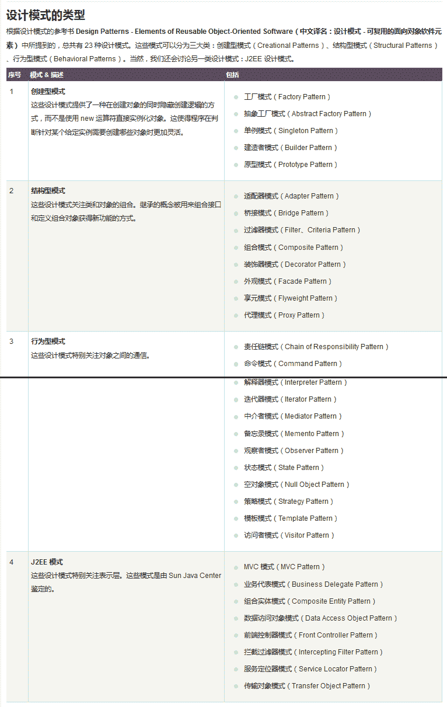
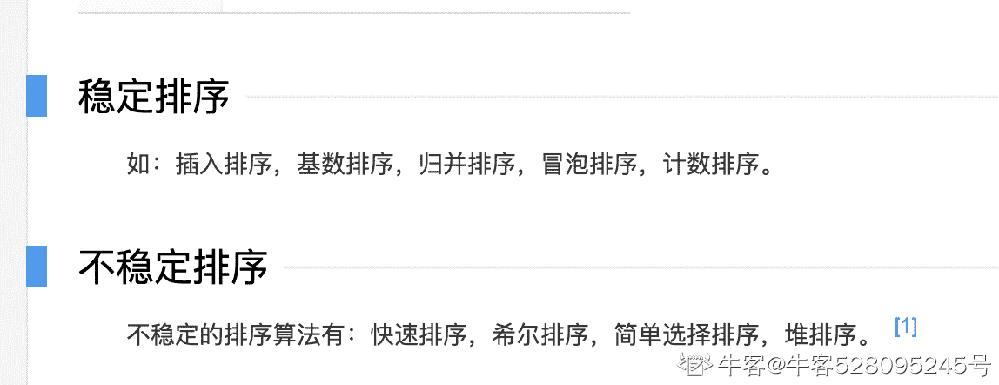

# 招商银行信用卡中心 2018 秋招测试方向笔试题

## 1

一个二叉树有 100 个子节点数为 2 的节点，100 个子节点数为 1 的节点，那么子节点数为 0 的节点（叶节点）的个数为

正确答案: C   你的答案: 空 (错误)

```cpp
99
```

```cpp
100
```

```cpp
101
```

```cpp
200
```

本题知识点

招商银行信用卡中心 Java 工程师 C++工程师 iOS 工程师 安卓工程师 运维工程师 前端工程师 算法工程师 PHP 工程师 测试工程师 招商银行信用卡中心 2018

讨论

[百里七](https://www.nowcoder.com/profile/260581136)

对于任何一种二叉树，其总支线有 n0+n1+n2-1 = 2*n2+n1,n0-1= n2,即叶子节点-1 等于子节点数为 2 的节点数

发表于 2018-08-15 11:05:20

* * *

[Loooorange](https://www.nowcoder.com/profile/30018023)

对任何一棵二叉树，度为 0 的结点总是比度为 2 的结点多一个。

发表于 2020-03-11 16:17:40

* * *

[牛客 41417255 号](https://www.nowcoder.com/profile/41417255)

对任何一棵二叉树，度为 0 的结点总是比度为 2 的结点多一个。！！！！

发表于 2020-10-24 12:49:13

* * *

## 2

下列数据结构中，按先进后出原则组织数据的是

正确答案: B   你的答案: 空 (错误)

```cpp
线性链表
```

```cpp
栈
```

```cpp
循环链表
```

```cpp
顺序表
```

本题知识点

招商银行信用卡中心 Java 工程师 C++工程师 iOS 工程师 安卓工程师 运维工程师 前端工程师 算法工程师 PHP 工程师 测试工程师 招商银行信用卡中心 2018

讨论

[米米 offer+1](https://www.nowcoder.com/profile/201776947)

常识

发表于 2021-05-27 23:13:01

* * *

[ybb19125064](https://www.nowcoder.com/profile/343573409)

栈与队列的进出顺序要牢记哦

发表于 2020-09-25 11:31:07

* * *

## 3

以下程序，输出结果为

```cpp
public class InterviewDemo { 
    public static void main(String[] args) { 
        Integer a = new Integer(8); 
        Integer b = 8;
        int c = 8; 
        System.out.println(a == b);
        System.out.println(b == c);
    }
} 
```

正确答案: C   你的答案: 空 (错误)

```cpp
true<br>false
```

```cpp
false<br>false
```

```cpp
false<br>true
```

```cpp
true<br>ture
```

本题知识点

招商银行信用卡中心 Java 工程师 C++工程师 iOS 工程师 安卓工程师 运维工程师 前端工程师 算法工程师 PHP 工程师 测试工程师 2018

讨论

[Loooorange](https://www.nowcoder.com/profile/30018023)

当我们给一个 Integer 对象赋一个 int 值的时候，会调用 Integer 类的静态方法 valueOf，如果整型字面量的值在-128 到 127 之间，那么不会 new 新的 Integer 对象，而是直接引用常量池中的 Integer 对象，所以 b==c。

发表于 2020-03-11 16:23:46

* * *

[牛客 147806755 号](https://www.nowcoder.com/profile/147806755)

Int 是 Java 八种基本数据类型之一，两个 Int 类型变量用“==”比较的是内容的大小。Integer 是对 Int 类型的封装，它是一个对象，可以通过 new 来常见 Integer 对象。但是对象通过“==”比较的是对象内存地址。 

发表于 2020-09-10 14:07:25

* * *

[许愿满意 offer](https://www.nowcoder.com/profile/1948922)

```cpp
new Integer(8)//创建一个新对象
Integer b = 8//编译器会在自动装箱过程调用 valueOf() 方法，因此多个 Integer 实例使用自动装箱来创建并且值相同，那么就会引用相同的对象。
```

==  比较的对象的引用

发表于 2019-03-11 09:34:39

* * *

## 4

关于 JAVA 堆，下面说法错误的是

正确答案: C   你的答案: 空 (错误)

```cpp
所有类的实例和数组都是在堆上分配内存的
```

```cpp
堆内存由存活和死亡的对象，空闲碎片区组成
```

```cpp
数组是分配在栈中的
```

```cpp
对象所占的堆内存是由自动内存管理系统回收
```

本题知识点

招商银行信用卡中心 Java 工程师 C++工程师 iOS 工程师 安卓工程师 运维工程师 前端工程师 算法工程师 PHP 工程师 测试工程师 招商银行信用卡中心 2018

讨论

[z 止于至善](https://www.nowcoder.com/profile/4687287)

所有局部变量都放在栈内存里保存的，不管其是基本类型的变量，还是引用类型变量，都是存储在各自的方法栈区中；但是引用类型变量所引用的对象（包括数组、普通 java 对象）则总是存储在堆内存中。

发表于 2018-08-30 17:11:31

* * *

[Fergus_m](https://www.nowcoder.com/profile/101182934)

链接：[`www.nowcoder.com/questionTerminal/a857af3cee5247bd965a56c3df49ae17`](https://www.nowcoder.com/questionTerminal/a857af3cee5247bd965a56c3df49ae17)
来源：牛客网

[Java](http://lib.csdn.net/base/17)把内存分成两种，一种叫做栈内存，一种叫做堆内存。

在函数中定义的一些基本类型的变量和对象的引用变量都是在函数的栈内存中分配。当在一段代码块中定义一个变量时，java 就在栈中为这个变量分配内存空间，当超过变量的作用域后，java 会自动释放掉为该变量分配的内存空间，该内存空间可以立刻被另作他用。

堆内存用于存放由 new 创建的对象和数组。在堆中分配的内存，由 java 虚拟机自动垃圾回收器来管理。在堆中产生了一个数组或者对象后，还可以在栈中定义一个特殊的变量，这个变量的取值等于数组或者对象在堆内存中的首地址，在栈中的这个特殊的变量就变成了数组或者对象的引用变量，以后就可以在程序中使用栈内存中的引用变量来访问堆中的数组或者对象，引用变量相当于为数组或者对象起的一个别名，或者代号。

引用变量是普通变量，定义时在栈中分配内存，引用变量在程序运行到作用域外释放。而数组＆对象本身在堆中分配，即使程序运行到使用 new 产生数组和对象的语句所在地代码块之外，数组和对象本身占用的堆内存也不会被释放，数组和对象在没有引用变量指向它的时候（比如先前的引用变量 x=null 时），才变成垃圾，不能再被使用，但是仍然占着内存，在随后的一个不确定的时间被垃圾回收器释放掉。这个也是 java 比较占内存的主要原因。

       以上段落来自于某一本 Java 程序设计的书（java 程序设计第 5 版）中，实际上，栈中的变量指向堆内存中的变量，这就是 Java 中的指针。总结起来就是对象存储在堆内存，引用变量存储在栈内存。栈内存指向堆内存。 

发表于 2019-05-15 17:20:57

* * *

## 5

凭经验或直觉推测可能的错误，列出程序中可能有的错误和容易发生错误的特殊情况，选择测试用例的测试方法叫做

正确答案: C   你的答案: 空 (错误)

```cpp
等值分析测试
```

```cpp
边界值分析测试
```

```cpp
错误推测法
```

```cpp
逻辑覆盖测试
```

本题知识点

招商银行信用卡中心 Java 工程师 C++工程师 iOS 工程师 安卓工程师 运维工程师 前端工程师 算法工程师 PHP 工程师 测试工程师 招商银行信用卡中心 2018

讨论

[fighting_ning](https://www.nowcoder.com/profile/316595065)

C

发表于 2018-09-23 21:57:54

* * *

## 6

以下哪个设计模式不属于创建型模式？

正确答案: C   你的答案: 空 (错误)

```cpp
抽象工厂（abstract factory）
```

```cpp
原型（prototype）
```

```cpp
外观（facade）
```

```cpp
单例（singleton）
```

本题知识点

招商银行信用卡中心 Java 工程师 C++工程师 iOS 工程师 安卓工程师 运维工程师 前端工程师 算法工程师 PHP 工程师 测试工程师 招商银行信用卡中心 2018

讨论

[Anyw](https://www.nowcoder.com/profile/3166112)



发表于 2019-03-03 09:47:29

* * *

## 7

设一组初始关键字记录关键字为（ 12,15,1,18,2,35,30,11 ），则以 12 为基准记录的一趟快速排序结束后的结果为

正确答案: C   你的答案: 空 (错误)

```cpp
11，1，2，12，35，18，30，15
```

```cpp
11，2，1，12，15，18，35，30
```

```cpp
11，2，1，12，18，35，30，15
```

```cpp
都不是
```

本题知识点

招商银行信用卡中心 Java 工程师 C++工程师 iOS 工程师 安卓工程师 运维工程师 前端工程师 算法工程师 PHP 工程师 测试工程师 招商银行信用卡中心 2018

讨论

[板栗@小弟](https://www.nowcoder.com/profile/5134233)

注意快速排序，先从后开始，有一次交换就从前开始，以此反复

发表于 2018-08-30 17:10:59

* * *

[鱼忘七秒我忘七年](https://www.nowcoder.com/profile/4221852)

第一趟 初始 i = 0， j = 7 ，x = 12；从后往前找，找到第一个比 12 小的数 a[7]=11,与 12 交换； 11 15 1 18 2 35 30 12 第二趟 此时 i = 0，j = 6， x = 12；从前往后找，找到第一个比 12 大的数 a[2]= 15;11 12 1 18 2 35 30 15 第三趟 此时 i = 2，j = 6，x = 12；从后往前找，找到第一个比 12 小的数 a[4] = 2;11 2 1 18 12 35 30 15 第四趟 此时 i = 2，j = 3， x = 12；从前往后找，找到第一个比 12 大的数 a[3]= 18;
11 2 1 12 18 35 30 15 此时，i = 4, j = 3, i >=j, 结束。

发表于 2018-09-07 20:26:30

* * *

[藤和艾莉欧。](https://www.nowcoder.com/profile/134888353)

**r****[8] =** **{****12,15,1,18,2,35,30,11 }**

**最开始：p=12,low=0,high=7**

**high=7，r[high]=11>p 不满***换 r[low]和 r[high]即**r[0]和 r[7]**得到**{****11,15,1,18,2,35,30,12 }**；****low=0，r[0]<p**，**low++为 1;****low=1**，**r[1]=11 <p 不满足，**交换 r[low]和 r[high]即**r[1]和 r[7]**得到**{****11,12,1,18,2,35,30,15 }；************high=7，**r[,7]=15****>p，high--为 6；**************high=6，********r[6]=30****>p，high--为 5；******************************high=5，**r[5]=35****>p，high--为 4；************************************high=4，**r[4]=2****>p**不满足，**交换 r[low]和 r[high]即**r[1]和 r[4]**得到**{****11,2,1,18,12,35,30,15 }；************************** ********low=1**，******r[1]=2 <p******，**low++为 2****************;**********************low=2**，******r[2]=2 <p******，**low++为 3************;********** **************low=3**，******r[3]=2 <p********不满足，**交换 r[low]和 r[high]即**r[3]和 r[4]**得到****************************{****11,2,1,12,18,35,30,15 }******************************；********************** **********************high=4，r[4]>p**，**high--为 3；********************************************此时不满足 low<high，以 12 为基准的排序结束，结果为************************************************{****11,2,1,12,18,35,30,15 }**************************************************；选 C************************

编辑于 2019-07-26 10:09:14

* * *

## 8

以下关于 Linux 操作系统进程的地址空间的说法正确的有

正确答案: C   你的答案: 空 (错误)

```cpp
进程的地址空间大小限制只与操作系统实现有关，与硬件无关
```

```cpp
不同进程的地址空间不可以共享物理内存
```

```cpp
不同进程的地址空间逻辑上是互相独立的
```

```cpp
物理内存越大，进程地址空间越大
```

本题知识点

招商银行信用卡中心 Java 工程师 C++工程师 iOS 工程师 安卓工程师 运维工程师 前端工程师 算法工程师 PHP 工程师 测试工程师 2018

## 9

关于测试用例，以下说法错误的是哪一项

正确答案: B   你的答案: 空 (错误)

```cpp
测试用例应具备代表性，选取一组相似测试用例中最有效的
```

```cpp
测试用例发现了太多的系统缺陷，说明测试用例设计的质量较差
```

```cpp
测试用例的数据应当选择那些最有可能发现系统缺陷的数据
```

```cpp
测试用例应该是可执行的， 不建议太简单，也不应太复杂而无法执行
```

本题知识点

招商银行信用卡中心 Java 工程师 C++工程师 iOS 工程师 安卓工程师 运维工程师 前端工程师 算法工程师 PHP 工程师 测试工程师 招商银行信用卡中心 2018

讨论

[猫咪老师一号](https://www.nowcoder.com/profile/180782257)

测试的目的就是为了发现错误，所以测试出来的测试越多代表该测试用例越好

发表于 2021-09-12 15:31:15

* * *

## 10

有一组测试用例，它使被测程序中的每一个分支至少执行一次，它满足的覆盖标准是

正确答案: B   你的答案: 空 (错误)

```cpp
语句覆盖
```

```cpp
判定覆盖
```

```cpp
条件覆盖
```

```cpp
路径覆盖
```

本题知识点

招商银行信用卡中心 Java 工程师 C++工程师 iOS 工程师 安卓工程师 运维工程师 前端工程师 算法工程师 PHP 工程师 测试工程师 招商银行信用卡中心 2018

讨论

[藤和艾莉欧。](https://www.nowcoder.com/profile/134888353)

 “**语句覆盖**”是一个比较弱的测试标准，选择足够的测试用例，使得程序中**每个语句**至少都能被执行一次。

比“语句覆盖”稍强的覆盖标准是“**判定覆盖**”(或称 branch coverage 分支覆盖)标准。含义是：执行足够的测试用例，使得程序中的**每一个分支**至少都通过一次。

一个更强的覆盖标准——“**条件覆盖**”。“条件覆盖”的含义是：执行足够的测试用例，使得判定中的每个条件获得各种可能的结果。

**路径覆盖**的含义是，选取足够多的测试数据，使程序的每条可能路径都至少执行一次（如果程序图中有环，则要求每个环至少经过一次）。路径覆盖也是一种比较强的覆盖，但未必考虑判定条件结果的组合，并不能代替条件覆盖和条件组合覆盖。 

发表于 2019-07-26 10:15:03

* * *

## 11

设事务 T1 和 T2，对数据库中的数据 A 进行操作，下列情况中不会发生冲突的是

正确答案: D   你的答案: 空 (错误)

```cpp
T1 正在写 A，T2 要读 A
```

```cpp
T1 正在写 A，T2 要写 A
```

```cpp
T1 正在读 A，T2 要写 A
```

```cpp
T1 正在读 A，T2 要读 A
```

本题知识点

招商银行信用卡中心 Java 工程师 C++工程师 iOS 工程师 安卓工程师 运维工程师 前端工程师 算法工程师 PHP 工程师 测试工程师 招商银行信用卡中心 2018

## 12

在顺序表(1, 3, 4, 6, 9, 11, 15, 16, 19, 21, 25, 28, 34, 36, 39)中，用二分法查找关键码值 11，所需的关键码比较次数为多少次

正确答案: B   你的答案: 空 (错误)

```cpp
2
```

```cpp
3
```

```cpp
4
```

```cpp
5
```

本题知识点

招商银行信用卡中心 Java 工程师 C++工程师 iOS 工程师 安卓工程师 运维工程师 前端工程师 算法工程师 PHP 工程师 测试工程师 招商银行信用卡中心 2018

讨论

[Alice77](https://www.nowcoder.com/profile/203023445)

16,6,11,共三次

发表于 2018-09-26 21:16:56

* * *

## 13

将数组{999, 88, 777, 409, 7862, 1045, 3987, 4679, 56}通过冒泡排序算法“逆序”排序（数组 Index 0 为顶部，Index 8 为底部，从底向上冒泡），第 3 次冒泡得到的数组元素顺序是什么？

正确答案: D   你的答案: 空 (错误)

```cpp
7862, 4679, 3987, 1045, 999, 777, 409, 88, 56
```

```cpp
4679, 7862, 3987, 1045, 999, 777, 409, 88, 56
```

```cpp
7862, 4679, 999, 88, 777, 409, 3987, 1045, 56
```

```cpp
7862, 4679, 3987, 999, 88, 777, 409, 1045, 56
```

本题知识点

招商银行信用卡中心 Java 工程师 C++工程师 iOS 工程师 安卓工程师 运维工程师 前端工程师 算法工程师 PHP 工程师 测试工程师 2018

讨论

[牧秦](https://www.nowcoder.com/profile/758682628)

我觉着选 D。。7862 999 88 777 409 4679 1045 3987 567862 4679 999 88 777 409 3987 1045 567862 4679 3987 999 88 777 409 1045 56

发表于 2018-08-14 15:52:51

* * *

[201903042306766](https://www.nowcoder.com/profile/322416026)

我也觉的选 D

发表于 2020-08-13 21:27:32

* * *

[阮梦](https://www.nowcoder.com/profile/99131813)

冒泡排数每冒一次使一位数有序（冒出未排序区间最大的一个）

发表于 2020-04-07 23:54:09

* * *

## 14

关于数据库锁，以下说法正确的是

正确答案: A D   你的答案: 空 (错误)

```cpp
数据库系统锁分为独占锁、共享锁和更新锁三种
```

```cpp
数据库需要通过特定机制确保死锁不会发生
```

```cpp
在表级锁锁定期间，其它进程无法对该表进行写操作，但可以执行读操作
```

```cpp
行级锁在多线程中相比页级锁更不容易产生锁定冲突
```

本题知识点

招商银行信用卡中心 Java 工程师 C++工程师 iOS 工程师 安卓工程师 运维工程师 前端工程师 算法工程师 PHP 工程师 测试工程师 2018

## 15

以下排序算法中，哪些是稳定的排序算法

正确答案: A B C   你的答案: 空 (错误)

```cpp
冒泡排序
```

```cpp
插入排序
```

```cpp
合并排序
```

```cpp
希尔排序
```

```cpp
快速排序
```

本题知识点

招商银行信用卡中心 Java 工程师 C++工程师 iOS 工程师 安卓工程师 运维工程师 前端工程师 算法工程师 PHP 工程师 测试工程师 2018

讨论

[小小 offer 收割机](https://www.nowcoder.com/profile/645047906)

所谓稳定性是指如果在一个待排序的序列中，存在 2 个相等的数，在排序后这 2 个数的相对位置保持不变，那么该排序算法是稳定的；否则是不稳定的。 *   稳定的排序算法：冒泡排序、直接插入排序、归并排序、基数排序
*   不稳定的排序算法：选择排序、快速排序、希尔排序、堆排序 

发表于 2021-04-29 17:03:54

* * *

[牛客 528095245 号](https://www.nowcoder.com/profile/528095245)



发表于 2020-03-26 23:55:49

* * *

[华科苦行僧](https://www.nowcoder.com/profile/5353698)

沙雕题目吧，感觉这上面题目好多错误的，shell sort 就是稳定排序啊  

发表于 2019-03-08 15:40:33

* * *

## 16

以下对于二叉查找树（Binary Search Tree），描述正确的是

正确答案: A B C D   你的答案: 空 (错误)

```cpp
若任意节点的左子树不空，则左子树上所有结点的值均小于它的根结点的值。
```

```cpp
若任意节点的右子树不空，则右子树上所有结点的值均大于它的根结点的值。
```

```cpp
任意节点的左、右子树也分别为二叉查找树。
```

```cpp
没有键值相等的节点。
```

```cpp
“B+树”“红黑树”“AVL 树”都是平衡二叉查找树。
```

本题知识点

招商银行信用卡中心 Java 工程师 C++工程师 iOS 工程师 安卓工程师 运维工程师 前端工程师 算法工程师 PHP 工程师 测试工程师 2018

讨论

[牛客 293853769 号](https://www.nowcoder.com/profile/293853769)

B+树不是二叉树，是多叉树

发表于 2019-12-09 20:27:16

* * *

[caijh33](https://www.nowcoder.com/profile/920428983)

二叉查找树（Binary Search Tree），（又：二叉搜索树，二叉排序树）它或者是一棵空树，或者是具有下列性质的[二叉树](https://baike.baidu.com/item/%E4%BA%8C%E5%8F%89%E6%A0%91/1602879)： 若它的左子树不空，则左子树上所有结点的值均小于它的根结点的值； 若它的右子树不空，则右子树上所有结点的值均大于它的根结点的值； 它的左、右子树也分别为[二叉排序树](https://baike.baidu.com/item/%E4%BA%8C%E5%8F%89%E6%8E%92%E5%BA%8F%E6%A0%91/10905079)。

发表于 2019-09-06 14:47:53

* * *

## 17

请设计测试用例，使一台自动饮料贩卖机通过测试，可以最终交付并放置在商场中进行售卖商品。

你的答案

本题知识点

招商银行信用卡中心 Java 工程师 C++工程师 iOS 工程师 安卓工程师 运维工程师 前端工程师 算法工程师 PHP 工程师 测试工程师 2018

讨论

[求求求 offerofferoffer](https://www.nowcoder.com/profile/3783932)

1、界面测试外观是否设计合理、符合大众审美 2、功能测试（1） ***作流程是否简单便捷、***作说明是否简单易懂无歧义（2）售货机屏幕显示（广告轮播功能、商品和金额以及二维码等信息显示 等）（2）管理员权限：放入货物、制定价格等功能 （3）用户权限：刷卡（工商卡、建行卡、农行卡等）、塞钱（根据不同商品以及金额大小进行商品兑换、找零、退钱等）、扫码支付（微信支付、支付宝支付、积分兑换支付等）、选择货物（不同零食、不同饮料等）、取出货物（不同零食、不同饮料等）等功能 3、性能测试（1）异常处理：系统出错、断电之后售货机能否自动恢复、恢复之后能否继续处理未完成的任务等（2）安全性：货物存放、现金存放以及金额设置等是否安全

发表于 2018-09-25 10:45:29

* * *

[程序员臻叔](https://www.nowcoder.com/profile/2912526)

功能测试：（1）饮料能够正常放置（2）饮料价格正常展示（3）能够正常投币，以及支付之后能正常弹出相应的饮料（4）空调系统正常运行（5）装填饮料以及饮料分类正确性能：（1）长时间运行，可以正常使用（2）购买之后，弹出饮料的响应时间（3）空调系统温度兼容性：（1）不同规格的饮料都可以放置（2）不同的支付方式（扫码、投币、现金）易用性：（1）购买面板是否操作简便（2）装填饮料是否简易

发表于 2019-08-23 12:17:43

* * *

[all0825](https://www.nowcoder.com/profile/268143372)

功能测试：1.金钱种类测试：电子支付、刷脸支付、纸币支付、硬币支付。（其中，纸币和硬币需要有判断真伪过程，若为假钱，则吐出投入的钱）2.选择饮料测试：选择多种饮料、一种饮料、取消饮料选择。3.功能测试：在选择好饮料，并成功支付后，能否吐出饮料。4.边界测试：在选择好饮料后，长时间不支付，需自动取消付款界面，并返回初始界面。异常测试：在支付时断电，是否可以成功结束上一单（吐出饮料），或显示付款失败。安全性测试：是否可以用暴力的方式，获取饮料。可以有自动报警功能。用户体验：电子支付时的贩卖机响应时间。

发表于 2021-08-20 21:20:56

* * *

## 18

阅读以下代码，根据边界值分析法，写出合理的输入值 a 值来测试 Test 方法

```cpp
public void Test(Integer a){
    if (a>=0 && a<=255){
        System.out.println("True");
    }
    else
        System.out.println("False");
    }
}
```

你的答案

本题知识点

招商银行信用卡中心 Java 工程师 C++工程师 iOS 工程师 安卓工程师 运维工程师 前端工程师 算法工程师 PHP 工程师 测试工程师 2018

讨论

[快乐的一只小喵](https://www.nowcoder.com/profile/8889031)

0、255、100、1、254、-1、256（边界值分析法：最小值、最大值、典型值、最小值+1、最大值-1、最小值-1、最大值+1）

发表于 2018-08-12 23:08:57

* * *

[all0825](https://www.nowcoder.com/profile/268143372)

| 用例编号 | 用例名称 | 执行步骤 | 输入数据 | 预期结果 | 执行结果 |
| 1 | a<0 | 输入 a<0 的数 | -1 | False |       |
| 2222  | a=0 | 输入 a=0 的数 | 0 | True |   |
| 3  | a>0 | 输入 a>0 的数 | 1 | True |   |
| 4  | a<255 | 输入 a<255 的数 | 254 | True |   |
| 5  | a=255 | 输入 a=255 的数 | 255 | True |   |
| 6 | a>255 | 输入 a>256 的数 | 256 | False |   |

发表于 2021-08-20 21:27:37

* * *

## 19

在卡中心隐藏了很多美食，作为一名资深吃货，楼主告诉你需要去品尝 n 道美味才能达成“卡中心小小美食家”的成就。这些菜品被标号为 0 到 n-1 。正所谓美食家不是一口吃成个胖子的，每道美味的品尝顺序也是有讲究的，比如西餐的上菜顺序：头盘，汤，副菜，主菜，蔬菜类菜肴，甜品，咖啡或茶。有一些美味需要“前置菜肴”，比如如果你要吃菜品 0，你需要先吃菜品 1，我们用一个范式来表示这些规则：[0 1]。接下来给你菜品的总数量 n 和 m 个“前置菜肴”的范式，请编程输出你为了品尝完所有美味所安排的进餐顺序。可能会有多个正确的顺序，你只要输出一种就可以了。如果不可能品尝完所有美味，返回 None。

本题知识点

招商银行信用卡中心 Java 工程师 C++工程师 iOS 工程师 安卓工程师 运维工程师 前端工程师 算法工程师 PHP 工程师 图 排序 *测试工程师 2018* *讨论

[向宇回桌](https://www.nowcoder.com/profile/520872)

很简单的一个 top 排序

```cpp
#include <bits/stdc++.h>
using namespace std;
int main() {
    int n, m; scanf("%d %d", &n, &m);
    vector<vector<int>> tmap(n + 5);
    int *count = new int[n + 5];
    memset(count, 0, sizeof(int)*(n+5));
    for (int i=0; i<m; i++) {
        int from, to;
        scanf("%d %d", &to, &from);
        tmap[from].push_back(to);
        count[to]++;
    }
    queue<int> zeros;
    for (int i=0; i<n; i++) {
        if (count[i] == 0) {
            zeros.push(i);
        }
    }
    vector<int> ans;
    while (!zeros.empty()) {
        int now = zeros.front();
        zeros.pop();
        vector<int> &tto = tmap[now];
        for (vector<int>::iterator it = tto.begin(); it!=tto.end(); it++) {
            count[*it]--;
            if (count[*it] == 0) zeros.push(*it);
        }
        ans.push_back(now);
    }
    string out;
    if (ans.size() != n) {
        cout << "None" << endl;
    }
    else {
        for (vector<int>::iterator it = ans.begin(); it != ans.end(); it++) {
            out += to_string((*it));
            out += ",";
        }
    }
    cout << out.substr(0, out.length()-1);
    return 0;
}
```

发表于 2019-04-09 12:21:21

* * *

[零葬](https://www.nowcoder.com/profile/75718849)

很简单，拓扑排序模板题

```cpp
import java.lang.String;
import java.io.BufferedReader;
import java.io.InputStreamReader;
import java.io.IOException;
import java.util.HashMap;
import java.util.LinkedList;
import java.util.Queue;
import java.util.Iterator;

public class Main {
    public static void main(String[] args) throws IOException {
        BufferedReader br = new BufferedReader(new InputStreamReader(System.in));
        String[] params = br.readLine().split(" ");
        int n = Integer.parseInt(params[0]);     // 顶点数
        int m = Integer.parseInt(params[1]);     // 边数
        HashMap<Integer, LinkedList<Integer>> graph = new HashMap<>();
        HashMap<Integer, Integer> inDegree = new HashMap<>();
        Queue<Integer> queue = new LinkedList<>();
        for(int i = 0; i < m; i++){
            String[] pair = br.readLine().split(" ");
            int from = Integer.parseInt(pair[1]);
            int to = Integer.parseInt(pair[0]);
            if(graph.containsKey(from)){
                graph.get(from).add(to);
            }else{
                LinkedList<Integer> neighbors = new LinkedList<>();
                neighbors.add(to);
                graph.put(from, neighbors);
            }
            inDegree.put(to, inDegree.getOrDefault(to, 0) + 1);
        }
        // 入度为 0 的作为起点
        for(int node = 0; node < n; node++){
            if(!inDegree.containsKey(node)){
                queue.offer(node);
            }
        }
        StringBuilder res = new StringBuilder();
        // 拓扑排序
        int count = 0;
        while(!queue.isEmpty()){
            int cur = queue.poll();
            res.append(cur).append(",");
            count ++;
            if(graph.containsKey(cur)){
                Iterator<Integer> iterator = graph.get(cur).iterator();
                while(iterator.hasNext()){
                    int next = iterator.next();
                    if(inDegree.get(next) == 1){
                        inDegree.remove(next);
                        queue.offer(next);
                    }else{
                        inDegree.put(next, inDegree.get(next) - 1);
                    }
                }
            }
        }
        if(count == n){
            // 可以品尝完所有菜肴
            res.deleteCharAt(res.length() - 1);
            System.out.println(res);
        }else{
            System.out.println("None");
        }
    }
}
```

发表于 2022-01-13 15:10:10

* * *

[nbgao](https://www.nowcoder.com/profile/211289)

```cpp
#include <bits/stdc++.h>
using namespace std;

int main(){
    int n, m, u, v;
    scanf("%d%d", &n, &m);
    vector<int> G[n], r;
    int in[n];
    memset(in, 0, sizeof(in));
    for(int i=0;i<m;i++){
        scanf("%d%d", &u, &v);
        G[v].push_back(u);
        in[u]++;
    }
    queue<int> q;
    for(int i=0;i<n;i++)
        if(in[i]==0)
            q.push(i);
    while(!q.empty()){
        u = q.front();
        q.pop();
        r.push_back(u);
        for(auto &v: G[u])
            if(--in[v]==0)
                q.push(v);
    }
    if(r.size() < n)
        printf("None\n");
    else
        for(int i=0;i<n;i++){
            if(i==n-1)
                printf("%d\n", r[i]);
            else
                printf("%d,", r[i]);
        }
    return 0;
}
```

发表于 2020-10-24 13:44:46

* * *

## 20

小明在卡中心工作，用到的很多系统账号都需要设置安全密码。密码如果符合以下规范可以称为安全密码：
1、密码至少包含 6 个字符，至多包含 20 个字符；
2、至少包含一个小写字母，至少包含一个大写字母，至少包含一个数字；
3、不能出现连续 3 个相同的字符。请写一个检查密码是否为安全密码的函数。输入为一个字符串作为密码，输出为将该密码改为安全密码的最小改变次数。如果它已经是安全密码，则返回 0。备注：插入、删除、或者替换一个字符，均视为改变一次。

本题知识点

招商银行信用卡中心 Java 工程师 C++工程师 字符串 *模拟 测试工程师 2018* *讨论

[nbgao](https://www.nowcoder.com/profile/211289)

```cpp
#include <bits/stdc++.h>
using namespace std;

int main(){
    string s;
    cin>>s;
    int n=s.length(), l=0, u=0, m=0, t=0, k=0, sum=0;
    for(int i=0;i<s.length();i++){
        if(t>0 && s[i]==s[i-1]){
            t++;
            if(t==3){
                sum++;
                if(n>20){
                    n--;
                    t = 2;
                }else{
                    t = 0;
                    k++;
                }
            }
        }else
            t = 1;
        if(islower(s[i]))
            l = 1;
        else if(isupper(s[i]))
            u = 1;
        else if(isdigit(s[i]))
            m = 1;        
    }
    t = 3-l-u-m;
    t = max(t-k, 0);
    if(n < 6)
        sum += max(6-n, t);
    else if(n > 20)
        sum += n - 20 + t;
    else
        sum += t;
    printf("%d\n", sum);
    return 0;
}
```

发表于 2020-10-23 01:13:42

* * *

[请赐我我 offer](https://www.nowcoder.com/profile/835028703)

感觉这道题就是把各种情况都考虑到了就可以做出来了，但是情况很多，代码也很长，这种题，真的应该用在笔试中吗

发表于 2020-07-20 11:19:54

* * *

[改个名求 offer](https://www.nowcoder.com/profile/1018704)

1.题目没说清楚，应该是不能出现 3 个连续相同的字符（不是字母！导致我第一次 WA 了）2.说下思路吧，其实挺简单的，就是自己没想清楚就开始敲了，还是要打好草稿再开始写（1）首先遍历一次算出题目条件 123 的满足情况；
（2）当字符串长度 len<6 时，条件 2 缺啥加个啥就行，条件 3 就中间插入一个字符把相同的顺序打乱；所以比较分别满足 3 个条件的改变次数，选最大的输出就好了；（3）当 6<=len<=20,条件二字符交换缺啥换啥，条件 3 换把相同字符最后一个换成其他字符，不用加减字符所以条件 1 不变，比较条件 2 条件 3 改变次数，选最大的输出；
（4）当 len>20 时，首先必须要把字符串减到 20，这个操作的次数是不能省的，但是减些就有考究 了，这里优先减 AAA 这种情况，减掉一个变成 AA 刚好也满足条件 3，然后再减 AAAA 四个连续相同的情况，这时就要减 2 个才能满足了，最后再减 AAAAA 这种，要减 3 个字符。当字符串满足条件了，这个时候转到第三步一样做就行了
3.这个题字符串不长，只要想清楚不管啥算法都能过，我自己改来改去底下代码写的太烂了大佬们就没看了#include <iostream>#include<bits/stdc++.h>
using namespace std;
int main()
{
int len,i,j,ans,res3,res2,res1,res4,res5,res6;
bool n,d,x;
char s[1000];
gets(s);
len=strlen(s);
n=d=x=0;
res3=res4=res5=res6=0;
j=-1;
for(i=0;i<len;i++)
{
if('A'<=s[i]&&s[i]<='Z'&&d==0)
{
d=1;
}
if('a'<=s[i]&&s[i]<='z'&&x==0)
{
x=1;
}
if('0'<=s[i]&&s[i]<='9'&&n==0)
{
n=1;
}
if(i>=2)
{
if(s[i]==s[i-1]&&s[i]==s[i-2]&&s[i]==s[i+1]&&s[i]==s[i+2]&&i<len-2)
{
if(i-j>=3)
{
res6++;
}
}
if(s[i]==s[i-1]&&s[i]==s[i-2]&&s[i]==s[i+1]&&i<len-1)
{
if(i-j>=3)
{
res5++;
}
}
if(s[i]==s[i-1]&&s[i]==s[i-2])
{
if(i-j>=3)
{
res3++;
j=i;
}
res4++;
}
}
}
res2=0;
res3=res3-res5;
res5=res5-res6;
if(d==0)    res2++;
if(x==0)    res2++;
if(n==0)    res2++;
if(len<6)
{
res1=6-len;
ans=max(res1,res3+res5+res6);
ans=max(ans,res2);
}
else
{
if(len>20)
{
res1=len-20;
//printf("%d %d\n",res1,res4);
if(res1>=res4)
{
ans=res1+res2;
}
else
{
if(res3>=res1)
{
if(res2<=(res3+res5+res6-res1))
{
ans=res3+res5+res6;
}
else
{
ans=res1+res2;
}
}
else
{
ans=res3;
res1=res1-res3;
for(;res1>0;)
{
if(res5>0&&res1>=2)
{
res1=res1-2;
res5--;
ans=ans+2;
}
if(res1==1)
{
ans++;
res1=0;
}
if(res1==2&&res5==0)
{
ans=ans+2;
res1=0;
}
if(res6>0&&res1>=3)
{
res1=res1-3;
res6--;
ans=ans+3;
}
}
if(res2<=res6+res5)
{
ans=ans+res6+res5;
}
else
{
ans=ans+res2;
}
}
}
}
else
{
res1=0;
ans=max(res1,res3+res5+res6);
ans=max(ans,res2);
}
}
printf("%d\n",ans);
return 0;
}

编辑于 2019-02-13 13:28:45

* * ***