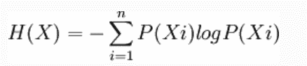
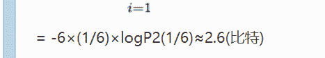

# 招商银行信用卡中心 2018 秋招数据方向笔试题

## 1

Spark 支持的分布式部署方式中哪个是错误的

正确答案: D   你的答案: 空 (错误)

```cpp
Standlone
```

```cpp
Spark on mesos
```

```cpp
Spark on YARN
```

```cpp
Spark on local
```

本题知识点

招商银行信用卡中心 Java 工程师 C++工程师 iOS 工程师 安卓工程师 运维工程师 前端工程师 算法工程师 PHP 工程师 大数据开发工程师 2018

讨论

[danni527](https://www.nowcoder.com/profile/518766084)

Spark 有 3 种运行模式（分布式部署方式）：独立集群运行模式、YARN 运行模式、Mesos 运行模式。local 错误

发表于 2018-08-13 08:40:13

* * *

[梦忆故城](https://www.nowcoder.com/profile/8803626)

Spark 有 3 种运行模式：独立集群运行模式、YARN 运行模式、Mesos 运行模式。

发表于 2018-08-12 20:16:28

* * *

## 2

熵是为消除不确定性所需要获得的信息量，投掷均匀正六面体骰子的熵是（注：lg2=0.3010，lg3=0.4771）

正确答案: B   你的答案: 空 (错误)

```cpp
1 比特
```

```cpp
2.6 比特
```

```cpp
3.2 比特
```

```cpp
3.8 比特
```

本题知识点

招商银行信用卡中心 Java 工程师 C++工程师 iOS 工程师 安卓工程师 运维工程师 前端工程师 算法工程师 PHP 工程师 大数据开发工程师 招商银行信用卡中心 2018

讨论

[Cris_Lee](https://www.nowcoder.com/profile/1874481)

H（X）= - 6 * (1/6）* log2 =   log[2 ]6 =   log[2]2+log[2]3  =  1 +  (lg3/lg2)  =  1 +   (0.4771/0.3010)   =  2.6

发表于 2018-08-14 16:22:45

* * *

[201711161448360](https://www.nowcoder.com/profile/7571004)

直接套公式

发表于 2018-08-11 19:32:05

* * *

## 3

关于 SecondaryNameNode 哪项是正确的

正确答案: C   你的答案: 空 (错误)

```cpp
它是 NameNode 的热备
```

```cpp
它对内存没有要求
```

```cpp
它的目的是帮助 NameNode 合并编辑日志，减少 NameNode 启动时间
```

```cpp
SecondaryNameNode 应与 NameNode 部署到一个节点
```

本题知识点

招商银行信用卡中心 Java 工程师 C++工程师 iOS 工程师 安卓工程师 运维工程师 前端工程师 算法工程师 PHP 工程师 大数据开发工程师 招商银行信用卡中心 2018

讨论

[AROY](https://www.nowcoder.com/profile/7875723)

secondarynamenode 一般在另外一个节点上运行，需要与 namenode 一样多大小的内存，作用就是定期合并编辑日志与命名空间镜像，以防止编辑日志过大。但是该辅助 namenode 总会滞后于 namenodeA 中的热备份专门指热备 namenode

发表于 2018-09-05 15:33:20

* * *

## 4

以下 python 语句(Python 2.7.13)的执行结果是：

```cpp
import re
key = r"mat cat hat pat"
p1 = r"[^c|p]at"
pattern1 = re.compile(p1)
print pattern1.findall(key)
```

正确答案: A   你的答案: 空 (错误)

```cpp
['mat', 'hat']
```

```cpp
['cat', 'pat']
```

```cpp
['mat', 'hat', 'pat']
```

```cpp
[]
```

本题知识点

招商银行信用卡中心 Java 工程师 C++工程师 iOS 工程师 安卓工程师 运维工程师 前端工程师 算法工程师 PHP 工程师 大数据开发工程师 招商银行信用卡中心 2018

讨论

[otfsenter](https://www.nowcoder.com/profile/1427801)

[]是基于字符的,[abc]是匹配 a, b, c 中的 一个 字符,[^abc]中的 ^ 是表否定, 表示匹配 a, b, c 之外的字符.所以和上面相同的结果的另一个正则是 p1 = r"[^cp]at".仅供参考.

发表于 2018-08-10 15:39:48

* * *

[我佛慈悲](https://www.nowcoder.com/profile/651485287)

[...]表示字符集，第一个字符若为^则表示取反，[^abc]表示不是 abc 的其他字符；|表示左右表达式任意匹配一个。

发表于 2018-08-30 15:15:23

* * *

[artisan™](https://www.nowcoder.com/profile/850124101)

相当于 r"[^(c|p)]at"其实就是匹配不以 c 或者 p 开头的字符串,中括号内使用^表示不适用...作为开头;

发表于 2018-11-05 19:38:24

* * *

## 5

下面有关文件系统元数据的描述，说法错误的是

正确答案: C   你的答案: 空 (错误)

```cpp
元数据指用来描述一个文件的特征的系统数据，诸如访问权限、文件拥有者以及文件数据块的分布信息等等
```

```cpp
我们可以使用 stat 命令来查看文件更多的元数据信息
```

```cpp
Unix/Linux 系统允许多个文件名指向同一个 inode 号码
```

```cpp
文件 A 和文件 B 的 inode 号码虽然不一样，但是文件 A 的内容是文件 B 的路径。读取文件 A 时，系统会自动将访问者导向文件 B，这时文件 A 就称为文件 B 的&quot;硬链接&quot;
```

本题知识点

招商银行信用卡中心 Java 工程师 C++工程师 iOS 工程师 安卓工程师 运维工程师 前端工程师 算法工程师 PHP 工程师 大数据开发工程师 招商银行信用卡中心 2018

讨论

[炅炅 93](https://www.nowcoder.com/profile/9912645)

这题答案是不是不对？若一个 inode 号对应多个文件名，则称这些文件为硬链接。换言之，硬链接就是同一个文件使用了多个别名。若文件用户数据块中存放的内容是另一文件的路径名的指向，则该文件就是软链接。D, 硬链接的 inode 是一样的
题目中描述的是软链接的情况

发表于 2018-08-13 21:02:35

* * *

[辰戎桀](https://www.nowcoder.com/profile/3878426)

这题答案是不是不对？硬链接不是公用一个 inode 号？

发表于 2018-08-11 19:07:56

* * *

[Allen.cq](https://www.nowcoder.com/profile/5091705)

 D 中硬链接的 inode 是一样的,为啥选 C？

发表于 2018-08-11 09:56:38

* * *

## 6

在深度学习中，涉及到大量矩阵相乘，现在需要计算三个稠密矩阵 A,B,C 的乘积 ABC，假设三个矩阵的尺寸分别为 m*n,n*p,p*q,且 m<n>正确答案: A   你的答案: 空 (错误)

```cpp
(AB)C
```

```cpp
A(BC)
```

```cpp
(AC)B
```

```cpp
所有效率相同
```

本题知识点

招商银行信用卡中心 Java 工程师 C++工程师 iOS 工程师 安卓工程师 运维工程师 前端工程师 算法工程师 PHP 工程师 大数据开发工程师 招商银行信用卡中心 2018

讨论

[201711161448360](https://www.nowcoder.com/profile/7571004)

根据矩阵知识，可以排除 c 啦然后分别计算选项 A 和 B 得时间复杂度，如果是大矩阵，加法可忽略，则 A 得复杂度为 m*n*p+m*p*q,B 为 n*p*q+m*n*q，根据 m<n<p<q 比较一下，A 得时间复杂度比较小

发表于 2018-08-11 19:58:54

* * *

[尔雅之洲](https://www.nowcoder.com/profile/41108443)

只算乘法次数的话，A(BC) 的乘法次数是 mn*p+m*pq , 而 (AB)C 乘法次数为 mn*q+n*pq , 又因为 m<n<p<q，所以 A(BC) < (AB)C 。  

发表于 2018-08-20 19:22:49

* * *

## 7

T1 中内容为

| **id**  | **content** |
| 1 | A |
| 2  | B |
| 3 | C |

T2 中内容为

| **id**  | **content** |
| 2 | C |
| 3  | E |
| 4 | F |

查询语句：select * from T1 left join T2 on T1.id=T2.id and T2.id<>2
请问输出结果是

正确答案: D   你的答案: 空 (错误)

```cpp
<pre class="prettyprint">1    A
2    B
3    C</pre>
```

```cpp
<pre class="prettyprint">1    A
3    C</pre>
```

```cpp
<pre class="prettyprint">1    A    null    null
3    C    3        E</pre>
```

```cpp
<pre class="prettyprint">1    A    null    null
2    B    null    null
3    C    3        E</pre>
```

本题知识点

招商银行信用卡中心 Java 工程师 C++工程师 iOS 工程师 安卓工程师 运维工程师 前端工程师 算法工程师 PHP 工程师 大数据开发工程师 招商银行信用卡中心 2018

讨论

[danni527](https://www.nowcoder.com/profile/518766084)

注意在 SQL 中，默认的 inner join/outer join 都会出现相同名字的列重复出现

发表于 2018-08-13 09:54:15

* * *

[刘小妮今天去哪里](https://www.nowcoder.com/profile/730209961)

left join 是外连接，主表的数据是一定会出现的，所以选 D

发表于 2019-11-08 13:55:14

* * *

[我好菜啊 201908131520531](https://www.nowcoder.com/profile/107969975)

最后匹配出三行数据 A NULL NULL B 2 C C 3 F 因为 T2ID 不为 2，所以二行也为 NULL

发表于 2019-09-22 16:58:00

* * *

## 8

以下几种模型方法属于判别式模型(Discriminative Model)的有
1)混合高斯模型
2)条件随机场模型
3)区分度训练
4)隐马尔科夫模型

正确答案: A   你的答案: 空 (错误)

```cpp
2,3
```

```cpp
3,4
```

```cpp
1,4
```

```cpp
1,2
```

本题知识点

招商银行信用卡中心 Java 工程师 C++工程师 iOS 工程师 安卓工程师 运维工程师 前端工程师 算法工程师 PHP 工程师 大数据开发工程师 2018

讨论

[danni527](https://www.nowcoder.com/profile/518766084)

生成模型使用联合概率建模，判别模型直接使用条件概率建模 常见的判别模型有：支持向量机传统的神经网络线性判别分析线性回归产生式模型常见的主要有：高斯朴素贝叶斯混合多项式混合高斯模型专家的混合物隐马尔可夫模型马尔可夫的随机场 

发表于 2018-08-13 10:02:42

* * *

## 9

下面哪一个步骤是在 MapReduce 中没有的

正确答案: D   你的答案: 空 (错误)

```cpp
partition
```

```cpp
Sort
```

```cpp
Combine
```

```cpp
Copy
```

本题知识点

招商银行信用卡中心 Java 工程师 C++工程师 iOS 工程师 安卓工程师 运维工程师 前端工程师 算法工程师 PHP 工程师 大数据开发工程师 招商银行信用卡中心 2018

讨论

[梦忆故城](https://www.nowcoder.com/profile/8803626)

mapreduce 实际的处理过程可以理解为 Input->Map->Sort->Combine->Partition->Reduce->Output。

发表于 2018-08-13 19:16:08

* * *

## 10

select * from tablename where columnA=’a’ union select * from tablename where columnB=’b’ 与此查询语句等价的选项是

正确答案: B   你的答案: 空 (错误)

```cpp

```
select * from tablename where columnA=‘a‘ and columnB=‘b‘
```cpp

```

```cpp

```
select * from tablename where columnA=‘a‘ or columnB=‘b‘
```cpp

```

```cpp

```
select * from tablename where columnA=‘a‘
```cpp

```

```cpp

```
select * from tablename where columnB=‘b‘
```cpp

```

本题知识点

招商银行信用卡中心 Java 工程师 C++工程师 iOS 工程师 安卓工程师 运维工程师 前端工程师 算法工程师 PHP 工程师 大数据开发工程师 招商银行信用卡中心 2018

讨论

[[div]](https://www.nowcoder.com/profile/565119786)

union 关键字的意思是并集去重

发表于 2018-09-24 20:50:55

* * *

## 11

以下关于人工神经网络（ANN）的描述错误的有

正确答案: D   你的答案: 空 (错误)

```cpp
神经网络对训练数据中的噪声非常鲁棒
```

```cpp
可以处理冗余特征
```

```cpp
训练 ANN 是一个很耗时的过程
```

```cpp
至少含有一个隐藏层的多层神经网络
```

本题知识点

招商银行信用卡中心 Java 工程师 C++工程师 iOS 工程师 安卓工程师 运维工程师 前端工程师 算法工程师 PHP 工程师 大数据开发工程师 招商银行信用卡中心 2018

讨论

[徐伊万](https://www.nowcoder.com/profile/2419564)

人工神经网络可以没有隐层，直接输入与输出

发表于 2018-08-14 11:26:24

* * *

[炅炅 93](https://www.nowcoder.com/profile/9912645)

答案难道不是 A?

发表于 2018-08-13 21:14:38

* * *

[牛客 136702949 号](https://www.nowcoder.com/profile/136702949)

```cpp
神经网络对训练数据中的噪声非常鲁棒是说神经网络抗噪能力强还是弱？
```

发表于 2020-06-24 02:23:40

* * *

## 12

在 hadoop2.6.0 集群中的一台服务器上运行 jps 指令，不可能出现的进程是

正确答案: D   你的答案: 空 (错误)

```cpp
NameNode
```

```cpp
DataNode
```

```cpp
ResourceManager
```

```cpp
TaskTracker
```

本题知识点

招商银行信用卡中心 Java 工程师 C++工程师 iOS 工程师 安卓工程师 运维工程师 前端工程师 算法工程师 PHP 工程师 大数据开发工程师 招商银行信用卡中心 2018

讨论

[浮生笑尽惹寂寥](https://www.nowcoder.com/profile/6359515)

```cpp
TaskTracker 是 1 的组件，2 已经没有了
```

发表于 2018-08-12 11:12:38

* * *

## 13

Yarn 作为 Hadoop2.0 中的资源管理器对各类应用程序进行资源管理和调度。请列出 Yarn 中的关键组件并简述各关键组件内部的交互原理。

你的答案

本题知识点

招商银行信用卡中心 Java 工程师 C++工程师 iOS 工程师 安卓工程师 运维工程师 前端工程师 算法工程师 PHP 工程师 大数据开发工程师 2018

讨论

[Mowar](https://www.nowcoder.com/profile/9730423)

YARN 的基本组成结构，YARN 主要由 ResourceManager、NodeManager、ApplicationMaster 和 Container 等几个组件构成

发表于 2018-10-11 19:28:34

* * *

[Cris_Lee](https://www.nowcoder.com/profile/1874481)

供参考~[`blog.csdn.net/lrs1353281004/article/details/81670670`](https://blog.csdn.net/lrs1353281004/article/details/81670670)

发表于 2018-08-14 19:17:29

* * *

## 14

现有 1TB 文本文件 words.txt，文件每行为若干个英文单词，单词间用空格分隔，文件中存在单词 word1 占据了总单词量的 30%以上，其他单词出现频率较为平均。根据以上场景，请描述 mapreduce 如何统计每个单词出现的频次。

你的答案

本题知识点

招商银行信用卡中心 Java 工程师 C++工程师 iOS 工程师 安卓工程师 运维工程师 前端工程师 算法工程师 PHP 工程师 大数据开发工程师 2018

## 15

又到一年毕业季，一大批刚刚步入职场的应届生申请办理我行信用卡，为了能最大程度的得到优质的信用卡客户，更精准地确定客户优劣和价值高低。考虑利用机器学习的思想在已有传统人工规则的基础上作辅助决策。针对这个场景，详细描述所需要的数据、数据的处理过程、选择的算法及原因、评价指标等过程。

你的答案

本题知识点

招商银行信用卡中心 Java 工程师 C++工程师 iOS 工程师 安卓工程师 运维工程师 前端工程师 算法工程师 PHP 工程师 大数据开发工程师 2018

讨论

[卯卯爱学习](https://www.nowcoder.com/profile/546908240)

利用分类模型 lr，gbdt，xgboodt，决策树等都可以。这里以 lr 为例子，需要数据为:客户基本信息，包括年龄，收入，性别等，客户征信信息，包括贷款，还款记录等，客户司法信息，包括是否有犯罪等。这些特效数值型与分类型均有。预处理需要缺失填补，异常值处理，归一化等，然后特征选择，基于熵或者 iv，woe 编译。最后拟合模型，常见模型评估用混淆矩阵，召回率，精确率，auc 值等。

发表于 2018-08-14 22:31:22

* * *

[Enigma2018](https://www.nowcoder.com/profile/2681283)

更精准地确定客户优劣和价值高低。考虑利用机器学习的思想在已有传统人工规则的基础上作辅助决策。针对这个场景，详细描述所需要的数据、数据的处理过程、选择的算法及原因、评价指标等过程。算法的选择：传统的规则识别+一些分类算法（LR/cart/rf/gbdt/xgboost/lightgbm/nn/svm 等）
特征的选择：用户个人的基本属性信息（年龄、收入、职业、性别等），用户的信用特征信息（贷款信息、征信信息等）、用户的行为信息（金融类 APP 使用情况、已办理的其他信用卡使用情况、接收相关短信或者是电话拨打情况扥）处理过程：文本型的数值的编码处理等，数值型的需要进行缺失值、同度量化等，绝对指标和相对指标的选择指标：ROC 曲线的 auc 值，ks 值，F1 值，准确率和召回率等

发表于 2019-03-27 20:00:11

* * *

## 16

现在信用卡开展营销活动，持有我行信用卡客户推荐新户办卡，开卡成功后可获得积分奖励。规定每个客户最多可推荐两个新户且一个新户只能被推荐一次。但允许链接效应，即若客户 A 推荐了新户 B，新户 B 推荐新户 C，则客户 C 同时属于 A 和 B 的推荐列表。简单起见，只考虑以一个老客户 A 作起点推荐的情况。编程计算推荐新户数不小于 n 的客户列表。

本题知识点

招商银行信用卡中心 Java 工程师 C++工程师 iOS 工程师 安卓工程师 运维工程师 前端工程师 算法工程师 PHP 工程师 图 大数据开发工程师 2018

讨论

[ChessC](https://www.nowcoder.com/profile/848210337)

```cpp

	/*
    一个 dfs 的问题，也就是说，分以下两步来解决：
    1.开始时没有问题吧，m 个人，每个人可以推荐 n 个，先把这个关系给对应上了
    2.现在要进行 dfs，从 A 开始，我们找当前节点与末尾形成的链子的长度，如果这个长度>+n 的，即为符合条件的点
    3.注意题目中说到的，只考虑从 A 出发的情况，否则我们需要多一步，在 m 个人中进行遍历
*/
#include <iostream>
#include <vector>
using namespace std;

class Solution{
public:
    int CalTheLength(vector<vector<int>>& vec,int n,int node,vector<int>& res){
        int length=0;
        for(int i=0;i<vec[node].size();++i) //因为只需考虑从 A 进行出发
            length+=CalTheLength(vec,n,vec[node][i],res);
        if(length>=n)
            res.push_back(node);
        return length+1;
    }
};
int main(){
    int m,n;
    cin>>m>>n; //m 个人，目标为 n 个客户
    vector<vector<int>> vec(26,vector<int>()); //初始的对应关系
    while(m--){
        char a,b,c;
        cin>>a>>b>>c;
        if(b!='*')
            vec[a-'A'].push_back(b-'A');
        if(c!='*')
            vec[a-'A'].push_back(c-'A');
    }
    vector<int> res;
    Solution sol;
    sol.CalTheLength(vec,n,0,res);
    if(!res.size())
        cout<<"None";
    else{
        for(auto it:res)
            cout<<char('A'+it)<<" ";
    }
    return 0;
}

```

//看了一些提交答案，我觉得这个思路是比较清晰和直观的，自己加了一些注释，更清楚一些

发表于 2019-02-17 13:18:39

* * *

[nbgao](https://www.nowcoder.com/profile/211289)

```cpp
#include <bits/stdc++.h>
using namespace std;

int DFS(map<char, vector<char>> &mp, int n, char s, vector<char> &r){
    int l = 0;
    for(auto &x: mp[s])
        l += DFS(mp, n, x, r);
    if(l>=n)
        r.push_back(s);
    return l+1;
}

int main(){
    int m, n;
    char a, b, c;
    scanf("%d%d", &m, &n);
    map<char, vector<char>> mp;
    while(m--){
        cin>>a>>b>>c;
        if(b!='*')
            mp[a].push_back(b);
        if(c!='*')
            mp[a].push_back(c);
    }
    vector<char> r;
    DFS(mp, n, 'A', r);
    sort(r.begin(), r.end());
    if(r.empty())
        puts("None");
    else{
        for(int i=0;i<r.size();i++)
            printf("%c ", r[i]);
    }
    return 0;
}
```

发表于 2020-10-26 00:29:25

* * *

[songlei1994](https://www.nowcoder.com/profile/553882915)

```cpp
m,n = map(int,input().split(" "))
mem = {"*":None}
degree = set()
class ListNode:
    def __init__(self,x):
        self.val = x
        self.left = None
        self.right = None
for _ in range(m):
    root,left,right = input().split()

    if root not in mem:
        mem[root] = ListNode(root)
    if left not in mem:
        mem[left] = ListNode(left)
    if right not in mem:
        mem[right] = ListNode(right)
    #建图，这种用 dict 复制图的方法的常见方法
    degree.add(left)
    degree.add(right)

    _root,_left,_right = mem[root],mem[left],mem[right]
    _root.left = _left
    _root.right = _right

#root 节点是入度为 0 的节点  
root = (set(mem) - degree).pop()

global ans
ans = []
#DFS，常规操作
def dfs(root):
    global ans
    if root:
        left = dfs(root.left)
        right = dfs(root.right)
        this = left + right + 1
        if this >= n + 1:
            ans.append(root.val)
        return this
    return 0
dfs(mem[root])
if ans:
    print(" ".join(ans))
else:
#None 也要 print 出来，不然会少一个回车符
    print(None)

```

发表于 2019-03-01 21:47:27

* * *

## 17

科室素拓进行游戏，游戏规则如下：随机抽取 9 个人作为游戏参与人员，分别编号 1 至 9，每轮要求 k(k<=9 且 k>=0)个人自由组合使编号之和为 n。输出满足规则的所有可能的组合。要求组合内部编号升序输出，组合之间无顺序要求。

本题知识点

招商银行信用卡中心 Java 工程师 C++工程师 iOS 工程师 安卓工程师 运维工程师 前端工程师 算法工程师 PHP 工程师 数学 穷举 大数据开发工程师 2018

讨论

[向宇回桌](https://www.nowcoder.com/profile/520872)

```cpp
import java.util.*;

public class Main {
    public static int k, n;
    public static void main(String[] args) {
        Scanner sc = new Scanner(System.in);
        k = sc.nextInt(); n = sc.nextInt();
        dfs(1, 0, k, 0);
        if (flag) {
            System.out.println("None");
        }
    }
    static boolean flag = true;
    private static void dfs(int cur, int ans, int k, int mem) {
        if (ans == n && k == 0 ) {
            StringBuilder sb = new StringBuilder();
            for (int i=1; i<=9; i++) {
                if (((mem >> i) & 1) == 1) {
                    sb.append(i);
                    sb.append(" ");
                }
            }
            System.out.println(sb.toString());
            flag = false;
            return;
        }
        if (k < 0 || cur > 9 || ans > n) { return; }
        dfs(cur+1, ans+cur, k-1, mem | (1<<cur));
        dfs(cur+1, ans, k, mem);
    }
} 
```

编辑于 2019-03-05 16:17:31

* * *

[wylu](https://www.nowcoder.com/profile/8627786)

```cpp
import java.io.BufferedReader;
import java.io.IOException;
import java.io.InputStreamReader;

/**
 * @author wylu
 */
public class Main {
    static int k;
    static int n;

    public static void main(String[] args) throws IOException {
        BufferedReader br = new BufferedReader(new InputStreamReader(System.in));
        String[] strs = br.readLine().split(" ");
        k = Integer.parseInt(strs[0]);
        n = Integer.parseInt(strs[1]);

        if (k == 0 || n > 45 || n <= 0) {
            System.out.println("None");
            return;
        }

        int[] res = new int[k];
        boolean[] flag = {true};
        generate(0, 1, res, 0, flag);
        if (flag[0]) System.out.println("None");
    }

    private static void generate(int cur, int start, int[] res, int sum, boolean[] flag) {
        if (cur == k && sum == n) {
            flag[0] = false;
            for (int i = 0; i < k - 1; i++) {
                System.out.print(res[i] + " ");
            }
            System.out.println(res[k - 1]);
            return;
        }
        if (cur == k || sum > n) return;

        for (int i = start; i <= 9; i++) {
            res[cur] = i;
            generate(cur + 1, i + 1, res, sum + i, flag);
        }
    }
}

```

编辑于 2019-01-24 21:14:16

* * *

[nbgao](https://www.nowcoder.com/profile/211289)

```cpp
#include <bits/stdc++.h>
using namespace std;

vector<vector<int>> r;
vector<int> v;

void DFS(int k, int n, int s){
    if(k==0){
        if(n==0)
            r.push_back(v);
        return;
    }
    if(10-s < k)
        return;
    for(int i=s;i<=9;i++){
        v.push_back(i);
        DFS(k-1, n-i, i+1);
        v.pop_back();
    }
}

int main(){
    int k, n;
    scanf("%d%d", &k, &n);
    DFS(k, n, 1);
    if(r.empty())
        puts("None");
    else{
        for(int i=0;i<r.size();i++)
            for(int j=0;j<k;j++){
                if(j==k-1)
                    printf("%d\n", r[i][j]);
                else
                    printf("%d ", r[i][j]);
            }
    }
    return 0;
}
```

发表于 2020-10-25 01:29:41

* * *</n>