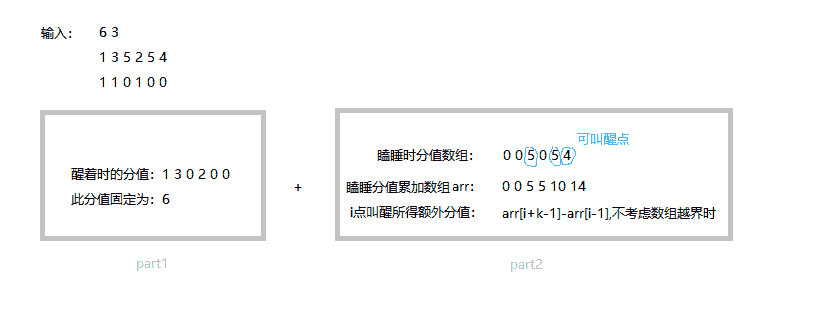

# 网易 2019 秋季校园招聘编程题真题集合

## 1

小易有一个古老的游戏机，上面有着经典的游戏俄罗斯方块。因为它比较古老，所以规则和一般的俄罗斯方块不同。
荧幕上一共有 n 列，每次都会有一个 1 x 1 的方块随机落下，在同一列中，后落下的方块会叠在先前的方块之上，当一整行方块都被占满时，这一行会被消去，并得到 1 分。
有一天，小易又开了一局游戏，当玩到第 m 个方块落下时他觉得太无聊就关掉了，小易希望你告诉他这局游戏他获得的分数。

本题知识点

网易 Java 工程师 C++工程师 iOS 工程师 安卓工程师 运维工程师 前端工程师 算法工程师 PHP 工程师 模拟 数组 贪心 2019

讨论

[Durrrrrr](https://www.nowcoder.com/profile/1544327)

```cpp
// 超简洁哦，只需把 m 的值在长度为 n 的数组上自增就好啦，然后通过 sort()取最短的数

import java.util.Arrays;
import java.util.Scanner;

public class Main {
    public static void main(String[] args) {
        Scanner scanner = new Scanner(System.in);
        int n = scanner.nextInt();
        int m = scanner.nextInt();
        int[] arr = new int[n];
        for (int i = 0; i < m; i++) {
            arr[scanner.nextInt() - 1]++;
        }
        Arrays.sort(arr);
        System.out.println(arr[0]);
    }
}

```

发表于 2018-08-27 15:51:26

* * *

[hjxu2016](https://www.nowcoder.com/profile/947957770)

```cpp
 //这道题的思路很简单，N 列，就定义一个 1*N 的数组，每一列落下方块时，对应数组位置+1，最后取数组的最小值就可以了

 #include<iostream>
 #include<vector>

 using namespace std;

 int minV(vector<int> v)
 {
     int min = v[0];
     for (int i = 1; i < v.size(); i++)
     {
         if (v[i] < min)
             min = v[i];
     }

     return min;
 }

 int main()
 {
     int n, m;
     while (cin >> n >> m)
     {
         vector<int> vec(n, 0);//定义 n*1 的数组

         for (int i = 0; i < m; i++)
         {
             int input;
             cin >> input; //落下方块的位置
             vec[input - 1]++;//对应位置+1
         }
         cout << minV(vec) << endl; //输出数组的最小值
     }
     return 0;
 }

            发表于 2018-08-14 10:42:15

            [Chrety](https://www.nowcoder.com/profile/994602167)

```
n, m = map(int, raw_input().split())

a = [0 for i in range(n)]

c = map(int, raw_input().split())
for i in c :
    a[i - 1] += 1

print min(a)
```cpp

            编辑于 2019-09-02 10:10:57

        2
        小易觉得高数课太无聊了，决定睡觉。不过他对课上的一些内容挺感兴趣，所以希望你在老师讲到有趣的部分的时候叫醒他一下。你知道了小易对一堂课每分钟知识点的感兴趣程度，并以分数量化，以及他在这堂课上每分钟是否会睡着，你可以叫醒他一次，这会使得他在接下来的 k 分钟内保持清醒。你需要选择一种方案最大化小易这堂课听到的知识点分值。

            本题知识点

                                                            网易 
                                                Java 工程师 
                                                C++工程师 
                                                iOS 工程师 
                                                安卓工程师 
                                                运维工程师 
                                                前端工程师 
                                                算法工程师 
                                                PHP 工程师 
                                                数组 
                                                贪心 
                                                数学 
                                                2019 

        讨论
            [我是渣渣虫](https://www.nowcoder.com/profile/695639172)

                                                                    主要思想是将知识点分值化为两部分来分别计算，一部分为保持清醒的时段，此时段的知识点分值固定不受叫醒时间影响；另一部分为根据叫醒时间额外增加的分值，遍历所有可能被叫醒的点，并计算出从该点开始后 k 个点内新增的知识点分，比较各个可叫醒点的该值取最大。需注意的是在求取可叫醒点 i 的新增知识点分时，若直接再使用循环遍历后面 k 个点复杂度较高，此处使用一个睡眠点分值的累加数组来进行优化。
 

```
import java.util.Scanner;
public class Main{
    public static void main(String[] args){
        Scanner scan = new Scanner(System.in);
        int n = scan.nextInt();
        int k = scan.nextInt();
        int[] val = new int[n];
        int[] state = new int[n];
        //保存瞌睡时的累计评分
        int sleep = 0;
        int[] sleepval = new int[n];
        for(int i=0;i<n;i++){
            val[i] = scan.nextInt();
        }
        for(int i=0;i<n;i++){
            state[i] = scan.nextInt();
            if(state[i]==0){
                sleep += val[i];
            }
            sleepval[i] = sleep;
        }
        Main ma = new Main();
        int res = ma.getMaxVal(val,state,n,k,sleepval);
        System.out.println(res);
    }
    public int getMaxVal(int[] val,int[] state,int n,int k,int[] sleepval){
        int res = 0;
        int addval = 0;
        for(int i=0;i<n;i++){
            if(state[i]==1) res += val[i];
            else{
                int wakeval = 0;
                if(i+k-1>=n){
                    wakeval =(i>0)?(sleepval[n-1]-sleepval[i-1]):sleepval[n-1];
                }else{
                    wakeval = (i>0)?(sleepval[i+k-1]-sleepval[i-1]):sleepval[i+k-1];
                }
                addval = addval>=wakeval?addval:wakeval;
            }
        }
        return res+addval;
    }
}
```cpp

            编辑于 2019-08-02 09:53:44

            [我是雷蒙德](https://www.nowcoder.com/profile/859118326)

```
"""
思路：从左到右遍历，比较 k 长度内睡着 0 状态对应兴趣值的和，即叫醒一下提升的兴趣值。
    总值分为两部分：醒着的固定值 + 睡着的提升值的最大值
"""
n,k =list(map(int, input().split()))
values =list(map(int, input().split()))
awakes =list(map(int, input().split()))
#n,k = [6,3]
#values = [1, 3, 5, 2, 5, 4]
#awakes = [1, 1, 0, 1, 0, 0]

base_score =0
for i in range(n):
    if awakes[i]:
        base_score += values[i]
        values[i] =0

max_boost_score =0
for i in range(n):
    if not awakes[i]:
        boost_score =sum(values[i:min(i+k,n)])
        max_boost_score =max(boost_score,max_boost_score)
        # 加了下面的 break 语句，才使这个代码时间上终于达标
        # 扫描到距结尾不足 k 距离范围内的第一个睡着状态即可，后面的肯定不如这个的提升值大，没必要再跑，可提前结束
        ifi > n-k+1:
            break

score =base_score +max_boost_score
print(score)
```cpp

            编辑于 2018-08-15 16:44:17

            [liaoming](https://www.nowcoder.com/profile/6818312)

```
#include <iostream>
#include <vector>

using namespace std;

// 连续 k 个中 0 对应的最大和， 才是叫醒额外获取的时间

int process(const vector<int> & interest, const vector<int> & aweak, int k) {
    int max_scores = 0;
    int scores = 0;
    // 叫醒 k 分钟
    k = min(k, (int)interest.size()); // 最多能清醒这么长
    // 先计算前 k 个的零和
    for (int i = 0; i < k; ++i) {
        if (0 == aweak[i]) {
            scores += interest[i];
        }
    }
    // 将 k 数组往后移动
    max_scores = scores;
    for (int i = k; i < interest.size(); ++i) {
        if (0 == aweak[i]) {
            scores += interest[i];
        }
        if (0 == aweak[i - k]) {
            scores -= interest[i - k];
        }
        max_scores = max(max_scores, scores);
    }
    return max_scores;
}

int main() {
    int n = 0; // 共几分钟
    int k = 0; // 叫醒能清醒 K 分钟
    while (cin >> n >> k) {
        vector<int> interest(n);
        vector<int> aweak(n);
        int scores = 0;
        for (int i = 0; i < n; ++i) {
            cin >> interest[i];
        }
        for (int i = 0; i < n; ++i) {
            cin >> aweak[i]; // is aweak?
        }
        // 叫醒 k 分钟
        scores = process(interest, aweak, k);
        for (int i = 0; i < n; ++i) {
            scores += interest[i] * aweak[i];
        }
        cout << scores << endl;
    }
    return 0;
}

```cpp

            编辑于 2018-08-14 12:26:57

        3
        又到了丰收的季节，恰逢小易去牛牛的果园里游玩。
 牛牛常说他对整个果园的每个地方都了如指掌，小易不太相信，所以他想考考牛牛。
 在果园里有 N 堆苹果，每堆苹果的数量为 ai，小易希望知道从左往右数第 x 个苹果是属于哪一堆的。
 牛牛觉得这个问题太简单，所以希望你来替他回答。

            本题知识点

                                                            网易 
                                                Java 工程师 
                                                C++工程师 
                                                iOS 工程师 
                                                安卓工程师 
                                                运维工程师 
                                                前端工程师 
                                                算法工程师 
                                                PHP 工程师 
                                                数组 
                                                查找 *2019*  *讨论

[laymen88](https://www.nowcoder.com/profile/124085482)

```
```cpp
import java.util.Arrays;
import java.util.Scanner;

public class apple {
    public static void main(String[] args) {
        Scanner scanner = new Scanner(System.in);
        int n = scanner.nextInt();

        int a = 0;
        int appleNums[] = new int[n];
        for (int i = 0; i < n; i++) {
            int input = scanner.nextInt();
            appleNums[i] = a + input;
            a = appleNums[i];
        }

        int m = scanner.nextInt();
        int searchNums[] = new int[m];
        for (int i = 0; i < m; i++) {
            searchNums[i] = scanner.nextInt();
        }

        //二分查找法
        for (int i = 0; i < m; i++) {
            int index = Arrays.binarySearch(appleNums, searchNums[i]);
            if (index>0) {
                System.out.println(index+1);
            }else{
                System.out.println(-index);
            }
        }
    }
} 
```

```cpp

发表于 2018-08-19 10:02:02

* * *

[——佚名](https://www.nowcoder.com/profile/6925604)

```
#include<iostream>
#include<vector>
#include<algorithm>
using namespace std;
int main() {
    int n;
    cin >> n;
    vector<pair<int, int>>appsum(n + 1, { 0,0 });
    for (int i = 1; i <= n; ++i) {
        cin>>appsum[i].first;
        appsum[i] = { appsum[i - 1].first + appsum[i].first,i };
    }
    int m,q;
    cin >> m;
    for (int i = 0; i != m; ++i) {
        cin >> q;
        cout<< lower_bound(appsum.begin(), appsum.end(), make_pair(q,0))->second<< endl;
    }
    return 0;
}

```cpp

编辑于 2019-03-13 09:51:07

* * *

[牛客 4407019 号](https://www.nowcoder.com/profile/4407019)

```
#include <iostream>
#include <vector>
using namespace std;

int main()
{
    int n;
    cin >> n;
    vector<int> a(n,0);
    for (int i = 0;i != n; ++i)
    {
        cin >> a[i];
    }
    int m;
    cin >> m;
    vector<int> q(m,0);
    for (int i = 0; i != m;++i)
    {
        cin >> q[i];
    }
    vector<int> sum(n,0);
    vector<int> res(m,0);
    sum[0] = a[0];
    for (int i = 1; i != n;++i)
    {
        sum[i] = sum[i-1] + a[i];
    }
    for (int i = 0;i != m; ++i)
    {
        int fi= 0, la = n-1;
        while (fi < la)
        {
            int mid = (fi + la)>>1;
            if (sum[mid] < q[i])
            {
                fi = mid + 1;
            }
            else
            {
                la = mid;
            }
        }
        res[i] = la + 1;
    }
    for (int i = 0; i != m; ++i)
    {
        cout << res[i] << endl;
    }
    return 0;
} 
```cpp

发表于 2018-08-21 15:28:49

* * *

## 4

          又到了周末，小易的房间乱得一团糟。 
   他希望将地上的杂物稍微整理下，使每团杂物看起来都紧凑一些，没有那么乱。 
   地上一共有 n 团杂物，每团杂物都包含 4 个物品。第 i 物品的坐标用(a[i],b[i])表示，小易每次都可以将它绕着(x[i],y[i])逆时针旋转，这将消耗他的一次移动次数。如果一团杂物的 4 个点构成了一个面积不为 0 的正方形，我们说它是紧凑的。 
   因为小易很懒，所以他希望你帮助他计算一下每团杂物最少需要多少步移动能使它变得紧凑。 

本题知识点

                                                            网易 
                                                Java 工程师 
                                                C++工程师 
                                                iOS 工程师 
                                                安卓工程师 
                                                运维工程师 
                                                前端工程师 
                                                算法工程师 
                                                PHP 工程师 
                                                模拟 
                                                穷举 
                                                数学 
                                                2019 

讨论

[lentolove](https://www.nowcoder.com/profile/572586026)

```
import java.util.Scanner;

class Point {
    int x1;
    int y1;
    int x;
    int y;

    Point(int x1, int y1, int x, int y) {
        this.x1 = x1;
        this.y1 = y1;
        this.x = x;
        this.y = y;
    }
}

public class Main {

    public static void main(String[] args) {
        Scanner sc = new Scanner(System.in);
        int n = sc.nextInt();
        Point[][] points = new Point[n][4];
        int a, b, c, d;
        int[] reult = new int[n];
        for (int i = 0; i < n; i++) {
            for (int j = 0; j < 4; j++) {
                a = sc.nextInt();
                b = sc.nextInt();
                c = sc.nextInt();
                d = sc.nextInt();
                points[i][j] = new Point(a, b, c, d);
            }
            reult[i] = moveIimes(points, i);
        }
        for (int i = 0; i < reult.length; i++) {
            System.out.println(reult[i]);
        }
    }

    //每个点有 4 中情况旋转 0，1,2,3 次，穷举
    private static int moveIimes(Point[][] pints, int i) {
        Point p1, p2, p3, p4;
        int count = 16;
        for (int j = 0; j < 4; j++) {
            //第一个点的
            p1 = rotate(pints[i][0], j);
            for (int k = 0; k < 4; k++) {
                p2 = rotate(pints[i][1], k);
                for (int l = 0; l < 4; l++) {
                    p3 = rotate(pints[i][2], l);
                    for (int m = 0; m < 4; m++) {
                        p4 = rotate(pints[i][3], m);
                        if (isSq(p1, p2, p3, p4)) {
                            count = Math.min(count, j + k + l + m);
                        }
                    }
                }
            }
        }
        return count == 16 ? -1 : count;
    }

    /**
     * @param p     原始点
     * @param times 旋转次数
     * @return 返回旋转后的点
     */
    private static Point rotate(Point p, int times) {
        int x = p.x1;
        int y = p.y1;
        int a = p.x;//中心点
        int b = p.y;
        for (int i = 1; i <= times; i++) {
            int tem = x;
            x = (b - y + a);
            y = (tem - a + b);
        }
        return new Point(x, y, a, b);
    }

    //判断四个点是否是正方形
    private static boolean isSq(Point p1, Point p2, Point p3, Point p4) {
        boolean rx = ((p1.x1) ^ (p2.x1) ^ (p3.x1) ^ (p4.x1)) == 0;//四个点的 x 坐标是否是两两相等
        boolean ry = ((p1.y1) ^ (p2.y1) ^ (p3.y1) ^ (p4.y1)) == 0;//四个点的 y 坐标是否是两两相等
        //是否是矩形
        if (!rx || !ry || rx && ry && (p1.x1 == p2.x1 && p1.x1 == p3.x1) ||
                rx && ry && (p1.y1 == p2.y1 && p1.y1 == p3.y1)) return false;
        //判断正方形
        int dx = Math.abs((p1.x1 - p2.x1) != 0 ? (p1.x1 - p2.x1) : (p1.x1 - p3.x1));
        int dy = Math.abs((p1.y1 - p2.y1) != 0 ? (p1.y1 - p2.y1) : (p1.y1 - p3.y1));
        return dx == dy;
    }

}

```cpp

编辑于 2019-07-26 19:57:33

* * *

[week_](https://www.nowcoder.com/profile/103748344)

                                                                      这种题真的很考验 coding 能力，参考热评的大佬，写的易于理解的版本，思路就是挨个点旋转，然后判定是否是正方形，写的代码和思路完全一致，很容易看懂。 

```
import java.util.*;
public class Main {
    public static void main(String[] args) {
        Scanner sc=new Scanner(System.in);
        int n=sc.nextInt();

        int[][][] abxy=new int[n][4][4];
        for(int i=0;i<n;i++){
            for(int j=0;j<4;j++){
                abxy[i][j][0]=sc.nextInt();
                abxy[i][j][1]=sc.nextInt();
                abxy[i][j][2]=sc.nextInt();
                abxy[i][j][3]=sc.nextInt();
            }
        }
        for(int index=0;index<n;index++){
            int min=Integer.MAX_VALUE;
            for(int i=0;i<4;i++){
                for(int j=0;j<4;j++){
                    for(int k=0;k<4;k++){
                        for(int m=0;m<4;m++){
                            if(isSquare(rotate(abxy[index][0],i),rotate(abxy[index][1],j),rotate(abxy[index][2],k),rotate(abxy[index][3],m))){
                                min=Math.min(min,i+j+k+m);
                            }
                        }
                    }
                }
            }
            if(min==Integer.MAX_VALUE){
                min=-1;
            }
            System.out.println(min);
        }

    }
    //绕 xy 旋转 count 次 point 长度为 4，固定这个长度是因为这样在调用的时候比较方便 public static  int[] rotate(int[] point,int count){
        int[] res=new int[] {point[2]+point[3]-point[1], point[3]-point[2]+point[0],point[2],point[3]};
        if(count==0){
            return point;
        }else{
            return rotate(res,count-1);
        }
    }
    //判定正方形，一定要判定两个对角边是否相等
    public static  boolean isSquare(int[] point1,int[] point2,int[] point3,int[] point4){
        double[] sideLen=new double[]{distance(point1,point2),distance(point2,point3),distance(point3,point4),distance(point4,point1),distance(point1,point3),distance(point2,point4)};
        Arrays.sort(sideLen);
        return sideLen[0] != 0&&sideLen[0]==sideLen[1]&&sideLen[1]==sideLen[2]&&sideLen[2]==sideLen[3]&&sideLen[3]==sideLen[0]
                &&sideLen[4]==sideLen[5];
    }

    private static double distance(int[] fromPoint, int[] toPoint) {
        return Math.pow(fromPoint[0] - toPoint[0], 2)
                + Math.pow(fromPoint[1] - toPoint[1], 2);
    }
} 
```cpp

发表于 2019-08-02 11:15:51

* * *

[笋也可以](https://www.nowcoder.com/profile/3631055)

```
#include <iostream>
#include <vector>
#include <string>
#include <algorithm>
#include <bitset>
#include <unordered_map>
#include <stack>
#include <queue>
#include <deque>
#include <limits.h>
#include <cstdio>
using namespace std;

struct Item{
    int a, b, x, y, state;
    Item(){
        state = 0;
    }

    void crot(){
        state = (state + 1) % 4;
        int dx = a-x, dy = b-y;
        a = x - dy;
        b = y + dx;
    }

    void input(){
        cin>>a>>b>>x>>y;
        state = 0;
    }

    bool operator ==(const Item &item2){
        return a==item2.a && b==item2.b;
    }

    Item operator +(const Item &it2){
        Item res;
        res.a = a + it2.a;
        res.b = b + it2.b;
        return res;
    }

    Item operator -(const Item &it2){
        Item res;
        res.a = a - it2.a;
        res.b = b - it2.b;
        return res;
    }

    static bool ortho(const Item &it1, const Item &it2){
        if(it1.a==0 && it1.b== 0) return 0;
        if(it2.a==0 && it2.b == 0) return 0;
        return it1.a * it2.a + it1.b * it2.b == 0;
    }
};

struct Pack{
    vector<Item> itemList;
    vector<Item*> itp;
    int step;

    Pack(){
        itemList = vector<Item>(4);
        itp = vector<Item*>(4, nullptr);
        for(int i=0; i<4; ++i) itp[i] = &itemList[i];
        step = INT_MAX;
    }

    void input(){
        for(int i=0; i<4;++i)
            itemList[i].input();
        step = INT_MAX;
    }

    bool isSqaure(){
        for(int i=1; i<4; ++i){
            if(i!=1) swap(itp[i], itp[1]);
            if(*itp[0]==*itp[1] || *itp[2]==*itp[3]) return 0;
            if(!(*itp[0] + *itp[1] == *itp[2] + *itp[3])) continue;
            if(!Item::ortho(*itp[0]- *itp[1], *itp[2] - *itp[3])) continue;
            if(Item::ortho(*itp[0]- *itp[2], *itp[0] - *itp[3])) return 1;
        }
        return 0;
    }

    void trySqaure(int rot_idx){
        for(int i=0; i<4; ++i){
            if(rot_idx == 0 && isSqaure()){
                int tmp_step = 0;
                for(int j=0; j<4; ++j) tmp_step += itemList[j].state;
                if(step > tmp_step) step = tmp_step;
            }
            if(rot_idx > 0) trySqaure(rot_idx - 1);
            itemList[rot_idx].crot();
        }
    }
};

int main()
{
    int n;
    cin>>n;
    Pack eRoom;
    for(int i=0; i<n; ++i){
        eRoom.input();
        eRoom.trySqaure(3);
        cout<<(eRoom.step > 16 ? -1: eRoom.step)<<endl;
    }
} 
```cpp

数据结构化的写法，清楚的话求点赞

发表于 2018-08-15 00:50:02

* * *

## 5

          今天上课，老师教了小易怎么计算加法和乘法，乘法的优先级大于加法，但是如果一个运算加了括号，那么它的优先级是最高的。例如： 

```
1+2*3=7
1*(2+3)=5
1*2*3=6
(1+2)*3=9
```cpp

   现在小易希望你帮他计算给定 3 个数 a，b，c，在它们中间添加"+"， "*"， "("， ")"符号，能够获得的最大值。 

本题知识点

                                                            网易 
                                                Java 工程师 
                                                C++工程师 
                                                iOS 工程师 
                                                安卓工程师 
                                                运维工程师 
                                                前端工程师 
                                                算法工程师 
                                                PHP 工程师 
                                                2019 
                                                动态规划 

讨论

[Yumho](https://www.nowcoder.com/profile/839832721)

  推广到 n 个数 

  dp[i[[j] 代表 index 从 i 到 j （包含 i 和 j）中的最大值 

  所以： 

  dp[i][j] = max(dp[i][k] + dp[k+1][j],dp[i][k] * dp[k+1][j]）for  i <=k < j 

```
        nums = list(map(int,input().strip().split()))

        dp = [[0]*len(nums) for i in range(len(nums))]

        for i in range(len(dp)-1,-1,-1):
            for j in range(len(dp[0])):
                if i == j:
                    dp[i][j] = nums[i]
                else:
                    for k in range(i,j):
                        dp[i][j] = max([dp[i][k] + dp[k+1][j],dp[i][k] * dp[k+1][j],dp[i][j]])

        # print(dp)
        print(dp[0][len(nums)-1])
```cpp

编辑于 2019-07-31 17:51:50

* * *

[liaoming](https://www.nowcoder.com/profile/6818312)

```
#include <iostream>
#include <vector>

using namespace std;

double max1(double a, double b) {
    return max(a + b, a * b);
}

double max2(double a, double b, double c) {
    return max(max1(max1(a, b), c), max1(a, max1(b, c)));
}

int main() {
    double a = 0;
    double b = 0;
    double c = 0;
    while (cin >> a >> b >> c) {
        cout << max2(a, b, c) << endl;
    }
    return 0;
}

```cpp

发表于 2018-08-14 11:18:33

* * *

[Howie59](https://www.nowcoder.com/profile/8933688)

```

	importjava.util.*;

	publicclassMain{

	    publicstaticvoidmain(String[] args){

	        Scanner sc = newScanner(System.in);

	        inta = sc.nextInt();

	        intb = sc.nextInt();

	        intc = sc.nextInt();

	        int[] d = newint[4];

	        d[0] = a + b + c;

	        d[1] = (a + b) * c;

	        d[2] = a + (b + c);

	        d[3] = a * b * c;

	        Arrays.sort(d);

	        System.out.println(d[3]);

	    }

	}

```cpp

发表于 2018-10-11 16:30:13

* * *

## 6

          小易有一些立方体，每个立方体的边长为 1，他用这些立方体搭了一些塔。 
   现在小易定义：这些塔的不稳定值为它们之中最高的塔与最低的塔的高度差。 
   小易想让这些塔尽量稳定，所以他进行了如下操作：每次从某座塔上取下一块立方体，并把它放到另一座塔上。 
   注意，小易不会把立方体放到它原本的那座塔上，因为他认为这样毫无意义。 
   现在小易想要知道，他进行了不超过 k 次操作之后，不稳定值最小是多少。 

本题知识点

                                                            网易 
                                                Java 工程师 
                                                C++工程师 
                                                iOS 工程师 
                                                安卓工程师 
                                                运维工程师 
                                                前端工程师 
                                                算法工程师 
                                                PHP 工程师 
                                                贪心 
                                                模拟 
                                                排序 *2019*  *讨论

[这把稳吃鸡](https://www.nowcoder.com/profile/769788596)

```
mport java.util.*;

public class Main {
   public static void main(String[] args)
   {
       Scanner sc=new Scanner(System.in);
       int n=sc.nextInt();//塔的数量
       int k=sc.nextInt();//最多操作数
       ArrayList<Integer> towers=new ArrayList<>();
       for (int i=0;i<n;i++)
           towers.add(sc.nextInt());
       int count=0;
       int max=Collections.max(towers);
       int min=Collections.min(towers);
       ArrayList<Integer> list1=new ArrayList<>();
       ArrayList<Integer> list2=new ArrayList<>();
       while (max-min>1&&count<k)
       {
           max=Collections.max(towers);min=Collections.min(towers);
           list1.add(towers.indexOf(max)+1);list2.add(towers.indexOf(min)+1);
           towers.set(towers.indexOf(min),min+1);
           towers.set(towers.indexOf(max),max-1);
           count++;
       }
       System.out.println(Collections.max(towers)-Collections.min(towers)+" "+count);
       for (int i=0;i<list1.size();i++)
       {
           System.out.println(list1.get(i)+" "+list2.get(i));
       }
   }
}

```cpp

 java 的 collection 的函数各种调用，思路和上面答案差不多，利用函数使代码更加简洁

发表于 2019-04-02 12:53:16

* * *

[Mono_Chrome](https://www.nowcoder.com/profile/3233028)

Java

思路：每次都把数组进行排序，然后最大值-1，最小值+1，用 ArrayList 记录这一操作的痕迹。

```
import java.util.*;

public class Main {

    static class Tower {
        int height;
        int index;
        public Tower(int height, int index) {
            this.height = height;
            this.index = index;
        }
    }

    public static class TowerComparator implements Comparator<Tower> {
        public int compare(Tower t1, Tower t2) {
            return t1.height - t2.height;
        }
    }

    public static void main(String[] args) {
        Scanner sc = new Scanner(System.in);
        int n = sc.nextInt();
        int k = sc.nextInt();
        Tower[] towers = new Tower[n];
        for (int i = 0; i < n; i++) {
            towers[i] = new Tower(sc.nextInt(), i + 1);
        }
        List<String> lists = new ArrayList<>();
        Arrays.sort(towers, new TowerComparator());

        int count = 0;
        while (towers[n - 1].height - towers[0].height > 0 && k > 0) {
            towers[n - 1].height--;
            towers[0].height++;
            k--;
            count++;
            lists.add(towers[n - 1].index + " " + towers[0].index);
            Arrays.sort(towers, new TowerComparator());
        }
        System.out.println((towers[n - 1].height - towers[0].height) + " " + count);

        for (int i = 0; i < lists.size(); i++) {
            System.out.println(lists.get(i));
        }
    }
}
```cpp

发表于 2019-06-30 15:51:55

* * *

[疯小子](https://www.nowcoder.com/profile/3189576)

```

	import java.util.ArrayList;

	import java.util.Scanner;

	public class Main {

	    public static void main(String[] args) {

	        Scanner scan = new Scanner(System.in);

	        int n = scan.nextInt();//塔数

	        int k = scan.nextInt();//最多可操作数

	        int[] height = new int[n];//塔的高度

	        for (int i = 0; i < n; i++) {

	            height[i] = scan.nextInt();

	        }

	        int count = 0;

	        ArrayList<Integer> list1 = new ArrayList<Integer>();

	        ArrayList<Integer> list2 = new ArrayList<Integer>();

	        for (int i = 0; i < k; i++) {

	            int h = max(height);//找到最高的

	            int l = min(height);//找到最低的

	            if(balance(height[h],height[l])) {

	                break;

	            }

	            count++;

	            height[h]--;

	            height[l]++;

	            list1.add(h+1);

	            list2.add(l+1);

	        }

	        System.out.println(height[max(height)]-height[min(height)]+" "+count);

	        for (int i = 0; i < list1.size(); i++) {

	            System.out.println(list1.get(i)+" "+list2.get(i));

	        }

	    }

	    public static int max(int[] height) {//返回最高塔的下标

	        int h = 0;

	        int max = height[0];

	        for (int i = 1; i < height.length; i++) {

	            if(max<height[i]) {

	                h = i;

	                max = height[i];

	            }

	        }

	        return h;

	    }

	    public static int min(int[] height) {//返回最低塔的下标

	        int l = 0;

	        int min = height[0];

	        for (int i = 1; i < height.length; i++) {

	            if(min>height[i]) {

	                l = i;

	                min = height[i];

	            }

	        }

	        return l;

	    }

	    public static boolean balance(int hval,int lval){//判断是否平衡

	        boolean flag = false;

	        int x = hval-lval;

	        if(x<=1)

	            flag = true;

	        return flag;    

	    }

	}

```cpp

发表于 2018-09-02 10:10:32

* * *

## 7

  小易在学校中学习了关于字符串的理论, 于是他基于此完成了一个字典的项目。 

  小易的这个字典很奇特, 字典内的每个单词都包含 n 个'a'和 m 个'z', 并且所有单词按照字典序排列。 

  小易现在希望你能帮他找出第 k 个单词是什么。 

本题知识点

                                                            网易 
                                                Java 工程师 
                                                C++工程师 
                                                iOS 工程师 
                                                安卓工程师 
                                                运维工程师 
                                                前端工程师 
                                                算法工程师 
                                                PHP 工程师 
                                                数学 
                                                2019 

讨论

[52Hz＇](https://www.nowcoder.com/profile/943908277)

排列组合，n 个'a'和 m 个'z'，只能组成$C_{n+m}^n$，记为 count(n+m,n) 个单词。

思路：

1.  假设第一个字符为 a，则剩下 n-1 个'a'和 m 个'z'组成的子序列只能构成 count(n-1+m,n-1)个单词，且是字典中前 count(n-1+m,n-1)个单词。 

2.  比较 k 和 count(n-1+m,n-1)，若 k 小，说明 k 是前 count(n-1+m,n-1)个单词，则第一个字符必为'a'。子问题化为在子序列(n-1 个'a'和 m 个'z')找到第 k 个单词 

3.  若 k 大，则说明第一个字符必为'z',单词是以'z'开头的单词中的第 k-count(n-1+m,n-1)个。子问题化为在子序列(n 个'a'和 m-1 个'z')找到第 k-count(n+m-1,m-1)个单词。 

eg:n=2,m=2,k=5

1.  假设第一个字符为 a,则剩下 1 个 a,2 个 z 只能构成 3 个单词，且是字典中前 3 个单词(aamm,amam,amma) 

2.  k>3，则第一个字符必为 z。原问题化为在 n=2,m=1,k=2，即在剩下 2 个 a，1 个 z 中找到第 2 个单词 

```
#include<iostream>
#include<vector>
using namespace std;
class Solution {
public:
    void solve(int n, int m, long long k) {
        vector<char> x;//
        while (n && m) {
            //每次迭代问题规模缩减一个单位
            ////排列组合:假设当前序列首字符为 a，剩下 n-1 个 a 放在剩下 n - 1 +m 个位置共有的可能数
            long long count = 1;
            for (int i = 0; i < n - 1; i++) {//求组合数
                count *= n - 1 + m - i;
                count /= (i + 1);
                if (count > k)break;//防止越界。count>k 就可以退出计算了
            }
            if (k <= count) {//如果 k 小于等于 count，则表明首字符的确应为 a
                x.push_back('a');
                n--;//问题缩减为 n-1 个 a 和 m 个 z 中找第 k 大
            } 
            else {
                x.push_back('z');
                m--;//问题缩减为 n-1 个 a 和 m 个 z 中找第 k-count 大
                k -= count;
            }
        }
        //循环结束后，剩余子序列只存在"aa..aaa" 或 "zz..zzz"1 种情况
        if (k != 1) {//
            cout << -1;
            return;
        }
        while (n--)x.push_back('a');
        while (m--)x.push_back('z');
        for (int i = 0; i < x.size(); i++) {
            cout << x[i];
        }
    }
};
int main() {
    Solution a;
    int n, m;
    long long k;
    while (cin >> n >> m >> k) {
        a.solve(n, m, k);
    }
    return 0;
} 
```cpp

编辑于 2018-08-15 16:31:00

* * *

[疯小子](https://www.nowcoder.com/profile/3189576)

```

	//参考 52Hz＇大佬 C++代码改写为 Java

	import java.util.ArrayList;

import java.util.Scanner;
 public class Main {
     public static void main(String[] args) {
         Scanner scan = new Scanner(System.in);
         int m = scan.nextInt();//a 的个数
         int n = scan.nextInt();//z 的个数
         long target = scan.nextInt();//目标第几个
         long k =0;
         ArrayList<String> list = new ArrayList<String>();
         while(m>0&&n>0) {//当 a 和 z 均存在时执行
             k = pz(m-1,n,target);//假设 a 确定，出去 a 之后剩余 a 和 z 的排列组合个数
             if(k>=target) {//如果确定 a 之后，剩余的排列组合数大于目标，则说明 a 已确定
                 list.add("a");
                 m--;//a 的个数减 1
             }else {//如果确定 a 之后，剩余的排列组合数小于目标，则说明不是 a。
                 list.add("z");
                 n--;//z 的个数减 1
                 target -= k;//目标减掉排列组合数。因为如果 a 开头可以有 k 中情况，
                             //减掉 k 之后即为确定 z 开头之后，接下来找第 target 个即可。
             }
         }
         if(target != 1) {//存在经过计算之后必为 1
             System.out.println("-1");
             return;
         }else {
             while(m>0) {//如果 z 的个数为 0，则将 a 追加到最后即可
                 list.add("a");
                 m--;
             }
             while(n>0) {//如果 a 的个数为 0，则将 z 追加到最后即可
                 list.add("z");
                 n--;
             }
         }
         for (int i = 0; i < list.size(); i++) {
             System.out.print(list.get(i));
         }
     }
     public static long pz(int m,int n,long target) {//计算假设 a 确定之后，a 之后的部分排列组合数
         if(m==0||n==0)
             return 1;
         long sum = m+n;
         long k = 1;
         n = Math.min(m, n);//C(m+n) n=C(m+n) m  取最小即可
         for (int i = 0; i < n ; i++) {
             k *= sum-i;
             k /= (i+1);
             if(k>target)//防止大数。如果 k>target 则只进行 list.add("a")和 m--//a 的个数减 1。
                         //没有 target -= k;因此不影响
                 break;
         }
         return k;
     }
 }

```cpp

发表于 2018-09-01 22:41:46

* * *

[鸳莺探羲](https://www.nowcoder.com/profile/7612013)

```
def Cnm(a, b):
    ans =1
    for i in range(a+1, a + b +1):
        ans *=i
    for i in range(1, b +1):
        ans //=i
    return ans

n, m, k =map(int, input().strip().split())
if Cnm(n, m) < k:
    print(-1)
else:
    ans =""
    while n > 0 and m > 0:
        temp =Cnm(n -1, m)
        if temp <k:
            k-=temp
            ans +="z"
            m -=1
        else:
            ans +="a"
            n -=1
    ans +="a"*n
    ans +="z"*m
    print(ans)

```cpp

 python3 的答案，注意除法那里要改成“//”，要不然会溢出报错，参考了上面 python2 的答案。

编辑于 2018-08-15 10:54:27

* * *** 
```