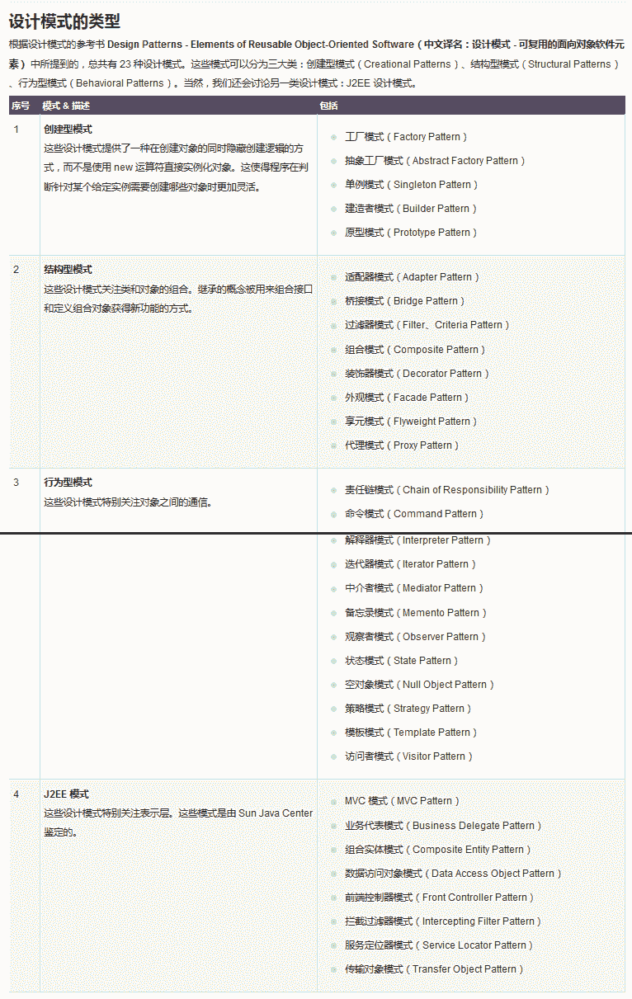
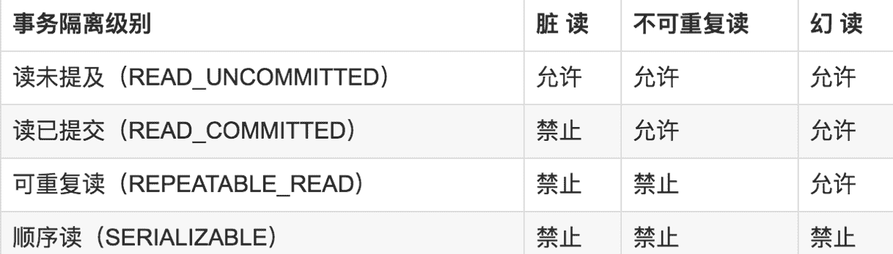
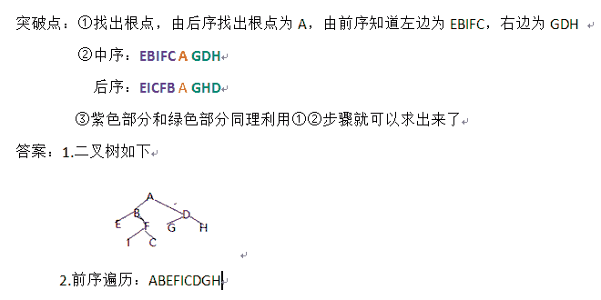
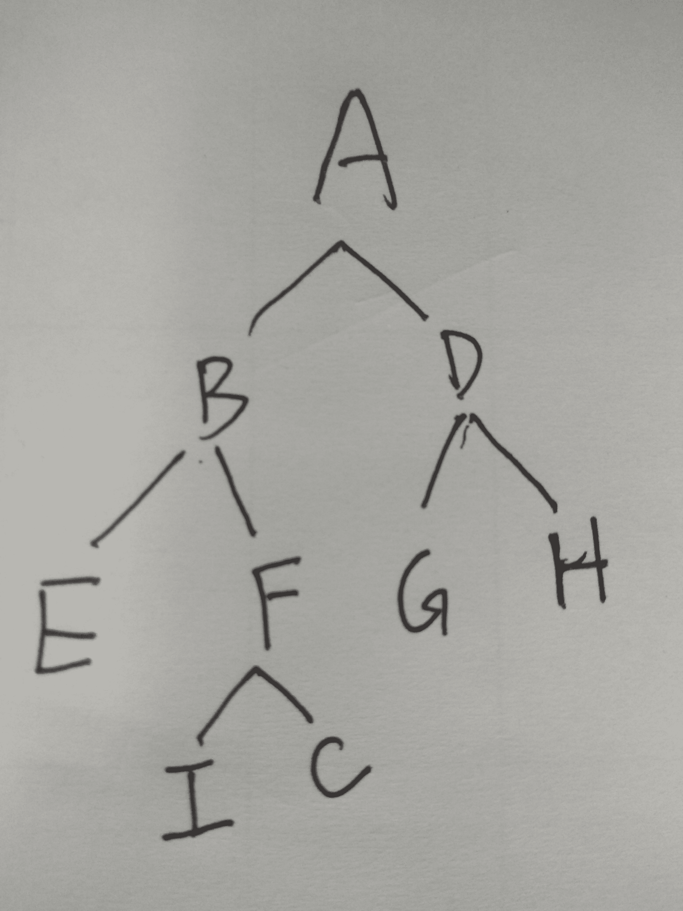

# 招商银行信用卡中心 2018 春招 IT 笔试（开发方向第一批）

## 1

```cpp
下列关于数据库说法正确的是：
```

正确答案: C   你的答案: 空 (错误)

```cpp
不小心 drop table 删库后，只需执行 ctrl+z 撤销命令，便可恢复数据
```

```cpp
第一范式(1-NF)不允许表中有子表，但 BC 范式(BC-NF)允许
```

```cpp
事务的四个特征是：原子性、一致性、持续性和隔离性
```

```cpp
数据库中的主键和外键均可以有多个
```

本题知识点

招商银行信用卡中心 Java 工程师 C++工程师 iOS 工程师 安卓工程师 运维工程师 前端工程师 算法工程师 PHP 工程师 2018

讨论

[1587699](https://www.nowcoder.com/profile/7602355)

ACID

发表于 2018-08-29 18:22:31

* * *

[从前的小余儿](https://www.nowcoder.com/profile/774780169)

A 项，当采用默认的自动事务时，删除表可以回撤。当开启手动事务，且删除表后提交事务，则不能再回撤 B 项，第一范式指的是表中每一个一段不可再分，每一个字段都是独立的 C 项，事务的四个基本特性 D 项，主键只有一个，约束和在外键可以有多个

发表于 2021-03-12 17:55:41

* * *

[迷茫的漂](https://www.nowcoder.com/profile/1417764)

我就想问问，持久性和持续性一样吗。。

发表于 2018-09-16 08:30:29

* * *

## 2

```cpp
一般来说，最快的进程间通信方式为： 
```

正确答案: C   你的答案: 空 (错误)

```cpp
管道
```

```cpp
消息队列
```

```cpp
共享内存
```

```cpp
套接字 socket
```

本题知识点

招商银行信用卡中心 Java 工程师 C++工程师 iOS 工程师 安卓工程师 运维工程师 前端工程师 算法工程师 PHP 工程师 2018

讨论

[普通程序圆](https://www.nowcoder.com/profile/4471273)

链接：[`www.nowcoder.com/questionTerminal/490a8b7adb02451dbb5b9414397d9a0b`](https://www.nowcoder.com/questionTerminal/490a8b7adb02451dbb5b9414397d9a0b)
来源：牛客网

*   管道：速度慢，容量有限
*   消息队列：容量受到系统限制，且要注意第一次读的时候，要考虑上一次没有读完数据的问题。
*   信号量：不能传递复杂消息，只能用来同步
*   共享内存区：能够很容易控制容量，速度快，但要保持同步，比如一个进程在写的时候，另一个进程要注意读写的问题，相当于线程中的线程安全，当然，共享内存区同样可以用作线程间通讯，不过没这个必要，线程间本来就已经共享了一块内存的。

发表于 2018-09-20 22:22:53

* * *

[要长点记性呀](https://www.nowcoder.com/profile/315025033)

最快的进程间通信为共享内存

发表于 2021-11-02 09:35:45

* * *

[lilinl](https://www.nowcoder.com/profile/3431580)

最快的进程间通信方式是共享内存

发表于 2018-08-29 20:54:53

* * *

## 3

```cpp
某计算机系统中有 8 台打印机，有 K 个进程竞争使用，每个进程最多需要 3 台打印机。该系统可能会发生死锁的 K 的最小值是：
```

正确答案: C   你的答案: 空 (错误)

```cpp
2
```

```cpp
3
```

```cpp
4
```

```cpp
5
```

本题知识点

招商银行信用卡中心 Java 工程师 C++工程师 iOS 工程师 安卓工程师 运维工程师 前端工程师 算法工程师 PHP 工程师 Java 工程师 C++工程师 安卓工程师 iOS 工程师 运维工程师 前端工程师 算法工程师 PHP 工程师 招商银行信用卡中心 C++工程师 Java 工程师 招商银行信用卡中心 2018

讨论

[JonTang](https://www.nowcoder.com/profile/1173781)

考虑最极端的情况，因为每个进程最多需要 3 台打印机，假设每个进程已经占有了两个打印机，那么只要还有多的打印机，总能满足达到 3 台的条件。将 8 台打印机分给 k 个进程，每个进程有 2 台打印机。

这种情况是极端情况，k 为 4，不死锁需要 2k+1<8，最多支持 3 个进程并发。注意问的如果是"不会死锁的最大值"。4 个以上就死锁，所以会死锁的最小值是 4。

此时，四个进程由于都缺少一台打印机而不能继续执行，出现了死锁的状况。

发表于 2018-08-15 19:07:29

* * *

[FearIsUnreal](https://www.nowcoder.com/profile/2825614)

```cpp
有 K 个进程竞争使用打印机，每个进程最多需要 3 台打印机，一共有 8 台打印机。
则给每个进程 2 个打印机，每个进程都没有工作，都在等待其他打印机释放资源，从而陷入了死锁。
即 K * 2 = 8， K = 4。
```

发表于 2019-08-19 08:29:45

* * *

## 4

```cpp
以下多线程对 int 型变量 x 的操作，哪几个不需要进行同步： 
```

正确答案: D   你的答案: 空 (错误)

```cpp
x=y;
```

```cpp
x++;
```

```cpp
++x;
```

```cpp
x=1;
```

本题知识点

招商银行信用卡中心 Java 工程师 C++工程师 iOS 工程师 安卓工程师 运维工程师 前端工程师 算法工程师 PHP 工程师 Java 工程师 C++工程师 安卓工程师 iOS 工程师 运维工程师 前端工程师 算法工程师 PHP 工程师 招商银行信用卡中心 C++工程师 Java 工程师 招商银行信用卡中心 2018

讨论

[我勒个旭](https://www.nowcoder.com/profile/262884115)

其他网友的解释：同步是害怕在操作过程的时候被其他线程也进行读取操作，一旦是原子性的操作就不会发生这种情况。因为一步到位的操作，其他线程不可能在中间干涉。另外三项都有读取、操作两个步骤，而 X=1 则是原子性操作。

发表于 2018-08-18 10:15:23

* * *

[ACLewis](https://www.nowcoder.com/profile/114697)

我觉得大家的理解都有偏差，这道题不是考你 x=1 这个操作相对其他的几个操作是否是原子操作。而是说提纲在提醒你们 它是将 a 赋给一个 immutable 的常量，所以无论是否有多个线程有此赋值操作，也不会出现线程不安全的 race condition 的状态出现。所以这里的赋值操作是不需要 synchronize 的。

发表于 2018-10-10 14:06:53

* * *

[普通程序圆](https://www.nowcoder.com/profile/4471273)

原子***作==单条汇编指令？

发表于 2018-09-20 22:25:49

* * *

## 5

```cpp
对 hashCode 叙述错误的是：
```

正确答案: A   你的答案: 空 (错误)

```cpp
是一个 64 位整数
```

```cpp
默认由 JVM 分配
```

```cpp
类的 hashCode 方法可以被重写
```

```cpp
如果两个类实例的 hashCode 相同，则不能同时作为 HashMap 的 Key
```

本题知识点

招商银行信用卡中心 Java 工程师 C++工程师 iOS 工程师 安卓工程师 运维工程师 前端工程师 算法工程师 PHP 工程师 2018

讨论

[joso](https://www.nowcoder.com/profile/1248031)

选项 D 应该也是错误的，有可能两个对象的 hashcode 相同，但是 equals 方法为 false，这时候这两个对象都可以作为 key

发表于 2018-09-04 23:01:52

* * *

[牛客 336945585 号](https://www.nowcoder.com/profile/336945585)

AD，hashCode 是 int 类型，两个对象 hashCode 相同但是不一定相等

发表于 2020-08-07 17:19:04

* * *

[今晚笔试不蹦迪](https://www.nowcoder.com/profile/203478620)

hashCode 就是根据存储在一个对象实例中的所有数据，提取出一个 32 位的整数，该整数的目的是用来标示该实例的唯一性，有点类似于 MD5 码，每个文件都能通过 MD5 算法生成一个唯一的 MD5 码。

发表于 2018-09-04 22:59:33

* * *

## 6

```cpp
以下哪项不能通过 super 关键字获取：
```

正确答案: D   你的答案: 空 (错误)

```cpp
父类的构造函数
```

```cpp
父类的公有成员变量
```

```cpp
父类的公有方法
```

```cpp
父类的私有成员变量
```

本题知识点

招商银行信用卡中心 Java 工程师 C++工程师 iOS 工程师 安卓工程师 运维工程师 前端工程师 算法工程师 PHP 工程师 2018

## 7

```cpp
下列说法正确的是： 
```

正确答案: D   你的答案: 空 (错误)

```cpp
Java 语言中，对于任意的整数 i，i+1&gt;i 都成立
```

```cpp
C++和 Java 都是面向对象的语言，都支持多继承
```

```cpp
在调用 System.gc()后，Java 虚拟机会立即进行垃圾回收
```

```cpp
Java 语言中，Math.abs(Integer.MIN_VALUE)的值等于 Integer.MIN_VALUE
```

本题知识点

招商银行信用卡中心 Java 工程师 C++工程师 iOS 工程师 安卓工程师 运维工程师 前端工程师 算法工程师 PHP 工程师 Java 工程师 C++工程师 安卓工程师 iOS 工程师 运维工程师 前端工程师 算法工程师 PHP 工程师 招商银行信用卡中心 C++工程师 Java 工程师 招商银行信用卡中心 2018

讨论

[karaysn](https://www.nowcoder.com/profile/7759354)

第四个选项，取绝对值之后就是正数了，2147483648，但是超出了 int 的范围，根据这个数的二进制，再转过来，刚好就是-2147483648

发表于 2018-08-18 17:29:46

* * *

[今晚笔试不蹦迪](https://www.nowcoder.com/profile/203478620)

Java 的 API 文档中说，对 abs(int a)运算，“如果参数等于 Integer.MIN_VALUE 的值(即能够表示的最小负 int 值)，那么结果与该值相同且为负。

发表于 2018-09-04 23:09:08

* * *

[Leviou](https://www.nowcoder.com/profile/6080190)

i+1>i 要考虑越界，所以不成立

发表于 2019-03-29 08:58:14

* * *

## 8

```cpp
下列关于 Java 语言，正确的是： 
```

正确答案: B   你的答案: 空 (错误)

```cpp
Java 语言编译后生成二进制机器码
```

```cpp
Java 语言编译后生成字节码
```

```cpp
Java 语言编译后生成 dll 动态链接库文件
```

```cpp
以上都不对
```

本题知识点

招商银行信用卡中心 Java 工程师 C++工程师 iOS 工程师 安卓工程师 运维工程师 前端工程师 算法工程师 PHP 工程师 2018

## 9

```cpp
下列代码的输出结果是：
public class A { 
        String name="a"; 
        String go(){ 
            return "- function in A"; 
        } 
    } 
    public class B extends A { 
        String name="b"; 
        String go(){ 
            return "- function in B"; 
        } 
    public static void main(String[] args) { 
        A a= new B(); 
        System.out.println(a.name+a.go()); 
        }   
    } 
```

正确答案: B   你的答案: 空 (错误)

```cpp
a - function in A
```

```cpp
a - function in B
```

```cpp
b - function in A
```

```cpp
b - function in B
```

本题知识点

招商银行信用卡中心 Java 工程师 C++工程师 iOS 工程师 安卓工程师 运维工程师 前端工程师 算法工程师 PHP 工程师 2018

讨论

[浩浩 123](https://www.nowcoder.com/profile/1542705)

1、属性不存在重写，只有方法(非私有方法、非静态方法、非 final 方法) 才存在重写，才能发生多态；2、向上转型

发表于 2018-08-18 09:37:41

* * *

[eicomtpmh](https://www.nowcoder.com/profile/140180)

属性是编译，方法是运行。编译看左，运行看右。

编辑于 2019-07-29 16:39:16

* * *

[lilinl](https://www.nowcoder.com/profile/3431580)

属性不存在重写，只有方法才存在重写

发表于 2018-08-29 21:05:32

* * *

## 10

```cpp
下列说法错误的是： 
```

正确答案: C   你的答案: 空 (错误)

```cpp
进程是系统进行资源调度的基本单位。
```

```cpp
线程是 CPU 分派的基本单位
```

```cpp
系统在运行的时候会为每个线程分配不同的内存区域
```

```cpp
进程具有控制表 PCB，而线程也有自己的控制表 TCB
```

本题知识点

招商银行信用卡中心 Java 工程师 C++工程师 iOS 工程师 安卓工程师 运维工程师 前端工程师 算法工程师 PHP 工程师 Java 工程师 C++工程师 安卓工程师 iOS 工程师 运维工程师 前端工程师 算法工程师 PHP 工程师 招商银行信用卡中心 C++工程师 Java 工程师 招商银行信用卡中心 2018

讨论

[z 止于至善](https://www.nowcoder.com/profile/4687287)

系统在运行的时候会为每个进程分配不同的内存区域，但是不会为线程分配内存（线程所使用的资源是它所属的进程的资源），线程组只能共享资源。那就是说，除了 CPU 之外（线程在运行的时候要占用 CPU 资源），计算机内部的软硬件资源的分配与线程无关，线程只能共享它所属进程的资源。

发表于 2018-08-28 10:43:12

* * *

[从前的小余儿](https://www.nowcoder.com/profile/774780169)

系统只会为每个进程分配不同的内存区域，而线程共享进程的数据，线程并没有直接与系统内存有直接关联

发表于 2021-03-12 18:02:37

* * *

## 11

```cpp
下列哪项不属于 HTTP 请求方法？ 
```

正确答案: C   你的答案: 空 (错误)

```cpp
POST
```

```cpp
PUT
```

```cpp
REMOVE
```

```cpp
GET
```

本题知识点

招商银行信用卡中心 Java 工程师 C++工程师 iOS 工程师 安卓工程师 运维工程师 前端工程师 算法工程师 PHP 工程师 2018

讨论

[lilinl](https://www.nowcoder.com/profile/3431580)

GET:获取资源   POST:传输实体文本  HEAD：获得报文首部  PUT:传输文件   DELETE:删除文件  OPTIONS:询问支持的方法  TRACE:追踪路径    CONNECT:要去用隧道协议连接***

发表于 2018-08-29 21:08:17

* * *

[nifengqu2210](https://www.nowcoder.com/profile/461007116)

**【GET：获取资源】；**【POST：传输实体文本】；****【HEAD：获得报文首部】；****【PUT：传输文件】；****【DELETE：删除文件】；****【OPTIONS：询问支持的方法】；****【TRACE：追踪路径】；****【CONNECT：要求用隧道协议连接***】**
  **

发表于 2018-08-29 09:46:50

* * *

## 12

```cpp
以下不属于创建型设计模式的是 
```

正确答案: D   你的答案: 空 (错误)

```cpp
单例模式
```

```cpp
工厂方法
```

```cpp
抽象工厂
```

```cpp
适配器模式
```

本题知识点

招商银行信用卡中心 Java 工程师 C++工程师 iOS 工程师 安卓工程师 运维工程师 前端工程师 算法工程师 PHP 工程师 2018

讨论

[摆渡人。](https://www.nowcoder.com/profile/2660196)



发表于 2018-09-25 11:31:48

* * *

[Vvia](https://www.nowcoder.com/profile/1909795)

适配器模式是指将一个类接口转换为另一个用户需要的接口

发表于 2018-08-18 14:10:04

* * *

[yellow0523](https://www.nowcoder.com/profile/991597070)

创建型模式有：工厂模式、抽象工厂模式、单例模式、建造者模式、原型模式。

发表于 2020-03-22 14:11:31

* * *

## 13

```cpp
下列关于 TCP 和 UDP 的说法错误的是：
```

正确答案: C   你的答案: 空 (错误)

```cpp
TCP 是有连接的，两台主机在进行数据交互之前必须先通过三次握手建立连接；而 UDP 是无连接的，没有建立连接这个过程
```

```cpp
TCP 是可靠的传输，TCP 协议通过确认和重传机制来保证数据传输的可靠性；而 UDP 是不可靠的传输
```

```cpp
TCP 提供了拥塞控制, 而 UDP 通过滑动窗口等机制来保证传输的质量
```

```cpp
TCP 是基于字节流的，将数据看做无结构的字节流进行传输，会对数据进行分段，因此 TCP 的数据是无边界的；而 UDP 是面向报文的，不会对数据报进行任何拆分等处理，因此 UDP 保留了应用层数据的边界
```

本题知识点

招商银行信用卡中心 Java 工程师 C++工程师 iOS 工程师 安卓工程师 运维工程师 前端工程师 算法工程师 PHP 工程师 2018

讨论

[helloworldmaster](https://www.nowcoder.com/profile/850233289)

UDP 不保证传输质量。UDP 不可靠性含义： 不保证数据的完整性，接收方接收到的数据可能存在部分丢失， **顺序也不一定能保证。**

发表于 2020-04-07 17:59:36

* * *

[z 止于至善](https://www.nowcoder.com/profile/4687287)

```cpp
TCP 提供流量控制。TCP 连接的每一方都有固定大小的缓冲空间。TCP 的接收端只允许另一端发送接收端缓冲区所能接纳的数据。
这将防止较快主机致使较慢主机的缓冲区溢出。(TCP 可以进行流量控制，防止较快主机致使较慢主机的缓冲区溢出)
TCP 使用的流量控制协议是可变大小的滑动窗口协议。
```

发表于 2018-08-28 10:47:37

* * *

## 14

```cpp
下列哪种排序算法是稳定的。 
```

正确答案: A   你的答案: 空 (错误)

```cpp
归并排序
```

```cpp
快速排序
```

```cpp
选择排序
```

```cpp
堆排序
```

本题知识点

招商银行信用卡中心 Java 工程师 C++工程师 iOS 工程师 安卓工程师 运维工程师 前端工程师 算法工程师 PHP 工程师 Java 工程师 C++工程师 安卓工程师 iOS 工程师 运维工程师 前端工程师 算法工程师 PHP 工程师 招商银行信用卡中心 C++工程师 Java 工程师 招商银行信用卡中心 2018

讨论

[你好！我是小明同学。](https://www.nowcoder.com/profile/1076459)

快希选堆

发表于 2019-03-04 13:25:57

* * *

[yellow0523](https://www.nowcoder.com/profile/991597070)

不稳定的排序算法有：一堆希尔快选。分别是

1.  堆排序
2.  希尔排序
3.  快速排序
4.  选择排序

发表于 2020-03-22 14:13:48

* * *

[我想静静！](https://www.nowcoder.com/profile/9359484)

mark 不稳定：快希选堆

发表于 2018-11-01 11:46:23

* * *

## 15

```cpp
下列不属于常用负载均衡算法的是：
```

正确答案: C   你的答案: 空 (错误)

```cpp
随机
```

```cpp
Round roubin
```

```cpp
Bloom Filter
```

```cpp
Consistent Hashing
```

本题知识点

招商银行信用卡中心 Java 工程师 C++工程师 iOS 工程师 安卓工程师 运维工程师 前端工程师 算法工程师 PHP 工程师 2018

讨论

[逸扬](https://www.nowcoder.com/profile/2214852)

选 C。Bloom Filter，布隆过滤器（大数据/数据挖掘的算法）

A. 随机法
B. Round roubin，轮询调度
C. Bloom Filter，布隆过滤器（大数据/数据挖掘的算法）
D. Consistent Hashing，一致性哈希算法

附：常用的 6 种负载均衡算法：

1、轮询法
  将请求按顺序轮流地分配到后端服务器上，它均衡地对待后端的每一台服务器，而不关心服务器实际的连接数和当前的系统负载。
2、随机法
  通过系统的随机算法，根据后端服务器的列表大小值来随机选取其中的一台服务器进行访问。由概率统计理论可以得知，随着客户端调用服务端的次数增多，
其实际效果越来越接近于平均分配调用量到后端的每一台服务器，也就是轮询的结果。
3、源地址哈希法
  源地址哈希的思想是根据获取客户端的 IP 地址，通过哈希函数计算得到的一个数值，用该数值对服务器列表的大小进行取模运算，得到的结果便是客服端要访问服务器的序号。采用源地址哈希法进行负载均衡，同一 IP 地址的客户端，当后端服务器列表不变时，它每次都会映射到同一台后端服务器进行访问。
4、加权轮询法
不同的后端服务器可能机器的配置和当前系统的负载并不相同，因此它们的抗压能力也不相同。给配置高、负载低的机器配置更高的权重，让其处理更多的请；而配置低、负载高的机器，给其分配较低的权重，降低其系统负载，加权轮询能很好地处理这一问题，并将请求顺序且按照权重分配到后端。
5、加权随机法
  与加权轮询法一样，加权随机法也根据后端机器的配置，系统的负载分配不同的权重。不同的是，它是按照权重随机请求后端服务器，而非顺序。
6、最小连接数法
  最小连接数算法比较灵活和智能，由于后端服务器的配置不尽相同，对于请求的处理有快有慢，它是根据后端服务器当前的连接情况，动态地选取其中当前
积压连接数最少的一台服务器来处理当前的请求，尽可能地提高后端服务的利用效率，将负责合理地分流到每一台服务器。

发表于 2018-08-26 23:13:21

* * *

[lilinl](https://www.nowcoder.com/profile/3431580)

常用的六种负载均衡算法：轮询法  随机法  源地址哈希法 加权轮询法 加权随机法 最小连接数法

发表于 2018-08-29 21:11:22

* * *

## 16

```cpp
下列属于伟大的计算机科学家迪杰斯特拉(Dijkstra)的贡献的是：
```

正确答案: A B C   你的答案: 空 (错误)

```cpp
提出了编程语言中 goto 有害论
```

```cpp
提出了图论中的迪杰斯特拉最短路径算法
```

```cpp
提出了操作系统中的信号量和 PV 原语
```

```cpp
提出了哈佛体系架构
```

本题知识点

招商银行信用卡中心 Java 工程师 C++工程师 iOS 工程师 安卓工程师 运维工程师 前端工程师 算法工程师 PHP 工程师 2018

讨论

[一直愤怒的小鸟](https://www.nowcoder.com/profile/8239043)

原来迪杰斯特拉这么牛皮！！！

编辑于 2019-09-04 16:34:03

* * *

[400 分只是起点](https://www.nowcoder.com/profile/404216201)

今年清华 914 考了这个，特来查阅

发表于 2020-02-29 00:09:37

* * *

[我想静静！](https://www.nowcoder.com/profile/9359484)

这个...这个

发表于 2018-11-01 11:47:40

* * *

## 17

```cpp
关于 Java 中泛型错误的是：
```

正确答案: C D   你的答案: 空 (错误)

```cpp
`List&lt;? extends T&gt;`为可以接受任何继承自 T 类型的 List
```

```cpp
方法可以返回泛型类型
```

```cpp
可以把 List&lt;String&gt;传递给一个接受 List&lt;Object&gt;参数的方法
```

```cpp
Array 中可以用泛型
```

本题知识点

招商银行信用卡中心 Java 工程师 C++工程师 iOS 工程师 安卓工程师 运维工程师 前端工程师 算法工程师 PHP 工程师 2018

讨论

[joso](https://www.nowcoder.com/profile/1248031)

C 选项，Object 类虽然是 String 的父类，但是 List<Object>不是 List<String>的父类，因此错误

发表于 2018-09-05 21:16:18

* * *

[从前的小余儿](https://www.nowcoder.com/profile/774780169)

选择错误的选项 C 选项，Object 虽然是 String 的父类，但是用于集合中，List 并不是 List<string>的父类，他们是两个不同的集合，只是存储的元素类型不一致 D 选项，Array 不支持泛型，ArrayList 才支持泛型</string>

发表于 2021-03-12 18:07:16

* * *

## 18

```cpp
下面有关事务隔离级别说法正确的是?
```

正确答案: A B C D   你的答案: 空 (错误)

```cpp
串行读(Serializable):完全串行化的读,每次读都需要获得表级共享锁,读写相互都会阻塞
```

```cpp
未提交读(Read Uncommitted):允许脏读,也就是可能读取到其他会话中未提交事务修改 的数据
```

```cpp
提交读(Read Committed):只能读取到已经提交的数据
```

```cpp
可重复读(Repeated Read):在同一个事务内的查询都是事务开始时刻一致的
```

本题知识点

招商银行信用卡中心 Java 工程师 C++工程师 iOS 工程师 安卓工程师 运维工程师 前端工程师 算法工程师 PHP 工程师 2018

讨论

[迷茫的漂](https://www.nowcoder.com/profile/1417764)

1.读未提及，该隔离级别允许脏读取，其隔离级别是最低的。换句话说，如果一个事务正在处理某一数据，并对其进行了更新，但同时尚未完成事务，因此还没有提交事务；而以此同时，允许另一个事务也能够访问该数据。脏读是指在一个事务处理过程里读取了另一个未提交的事务中的数据。2.读已提交是不同的时候执行的时候只能获取到已经提交的数据。这样就不会出现上面的脏读的情况了。可是解决了脏读问题，但是还是解决不了可重复读问题。3.可重复读就是保证在事务处理过程中，多次读取同一个数据时，该数据的值和事务开始时刻是一致的。因此该事务级别进制了不可重复读取和脏读，但是有可能出现幻读的数据。所以只能用顺序读了。4.顺序读是最严格的事务隔离级别。它要求所有的事务排队顺序执行，即事务只能一个接一个地处理，不能并发  幻读就是指同样的事务操作，在前后两个时间段内执行对同一个数据项的读取，可能出现不一致的结果。    

发表于 2018-09-16 09:37:14

* * *

## 19

```cpp
下列关于多线程说法正确的是:
```

正确答案: B C   你的答案: 空 (错误)

```cpp
wait()方法和 sleep()方法都会使当前线程堵塞并释放所持有的锁
```

```cpp
哲学家就餐场景可能会发生死锁
```

```cpp
继承 Thread 类与实现 Runnable 接口都可以实现多线程
```

```cpp
StringBuilder 是线程安全的，可在多线程环境下使用
```

本题知识点

招商银行信用卡中心 Java 工程师 C++工程师 iOS 工程师 安卓工程师 运维工程师 前端工程师 算法工程师 PHP 工程师 2018

讨论

[lilinl](https://www.nowcoder.com/profile/3431580)

wait:释放 cpu 执行权，释放锁 sleep:释放 cpu 执行权，不释放锁 Stringbuffer 是线程安全的，Stringbuilder 是线程不安全的 Hashtable 是线程安全的，hashmap 不是线程安全的

发表于 2018-08-29 21:16:28

* * *

[是你的小番茄吗？](https://www.nowcoder.com/profile/7931244)

wait：释放 cpu 执行权，释放锁 
sleep：释放 cpu 执行权，不释放锁

发表于 2018-08-15 22:54:16

* * *

[hume](https://www.nowcoder.com/profile/1888958)

Stringbuffer 是线程安全的   stringbuilder 是线程不安全的
HashMap 不是线程安全的    HashTable 是线程安全的

发表于 2018-08-29 19:02:57

* * *

## 20

```cpp
下列关于虚拟内存的描述正确的是：
```

正确答案: A B D   你的答案: 空 (错误)

```cpp
解放物理空间的存储管理, 使得数据被分配的地址与逻辑上程序执行的上下文解耦。
```

```cpp
提供进程之间的地址空间隔离，防止进程访问地址越界或非法。
```

```cpp
在多进程中，应避免进程的虚拟空间地址映射到相同的物理空间地址。
```

```cpp
简化在链接阶段分配地址空间。
```

本题知识点

招商银行信用卡中心 Java 工程师 C++工程师 iOS 工程师 安卓工程师 运维工程师 前端工程师 算法工程师 PHP 工程师 测试工程师 2018

讨论

[早睡早起是一个天大的骗局](https://www.nowcoder.com/profile/729728238)

C 在多进程中，应避免进程的虚拟空间地址映射到相同的物理空间地址.使用虚拟空间地址 有一个好处，比如说进程 A 和进程 B 都有一个 print 功能，那么虚拟空间地址就会把地址映射到同一个 print 模块上，从而避免了相同的模块重复拷贝

发表于 2018-09-16 10:14:36

* * *

## 21

什么是死锁？产生的条件是什么？

你的答案

本题知识点

招商银行信用卡中心 Java 工程师 C++工程师 iOS 工程师 安卓工程师 运维工程师 前端工程师 算法工程师 PHP 工程师 2018

讨论

[起个啥名好呢呢呢](https://www.nowcoder.com/profile/632617283)

一. 什么是死锁？      如果一个进程集合里面的每个进程都在等待这个集合中的其他一个进程（包括自身）才能继续往下执行，若无外力他们将无法推进，这种情况就是死锁，处于死锁状态的进程称为死锁进程 三. 产生死锁的四个必要条件？ （1）互斥条件：进程对所分配到的资源不允许其他进程进行访问，若其他进程访问该资源，只能等待，直至占有该资源的进程使用完成后释放该资源 （2）请求和保持条件：进程获得一定的资源之后，又对其他资源发出请求，但是该资源可能被其他进程占有，此事请求阻塞，但又对自己获得的资源保持不放 （3）不可剥夺条件：是指进程已获得的资源，在未完成使用之前，不可被剥夺，只能在使用完后自己释放 （4）环路等待条件：是指进程发生死锁后，必然存在一个进程--资源之间的环形链 

发表于 2018-09-25 11:15:35

* * *

[三七互娱员工 _ 已认证](https://www.nowcoder.com/profile/5983407)

死锁：在两个或多个并发进程中，如果某个进程持有某种资源而又都等待别的进程释放他或者现在保持着的资源，在为改变这种状态前都不能向前推进，称这一组进程产生了死锁，通俗讲就是两个或者多个进程被无限阻塞相互等待的一种状态产生死锁的条件：1.互斥：一个资源每次只能被一个进程使用 2.不可抢占：进程已经获得资源，在未使用完之前，不能强行剥夺 3.占有并等待：一个进程因请求资源被阻塞时，对已获得的资源保存不释放 4.环形等待：若干进程之间形成一种首尾相接的循环等待资源关系。这四个条件是死锁的必要条件，只要系统发生死锁，这些条件必然成立，而只要上述条件之一不满足，就不会发生死锁

发表于 2018-09-23 20:57:27

* * *

[生命在于折腾 wang](https://www.nowcoder.com/profile/90805544)

死锁：在两个或多个并发进程中，如果某个进程持有某种资源而又都等待别的进程释放他或者现在保持着的资源，在为改变这种状态前都不能向前推进，称这一组进程产生了死锁，通俗讲就是两个或者多个进程被无限阻塞相互等待的一种状态产生死锁的条件：1.互斥：一个资源每次只能被一个进程使用 2.不可抢占：进程已经获得资源，在未使用完之前，不能强行剥夺 3.占有并等待：一个进程因请求资源被阻塞时，对已获得的资源保存不释放 4.环形等待：若干进程之间形成一种首尾相接的循环等待资源关系。这四个条件是死锁的必要条件，只要系统发生死锁，这些条件必然成立，而只要上述条件之一不满足，就不会发生死锁。 

发表于 2018-08-15 16:26:43

* * *

## 22

请设计一个存储键值对的数据结构, 使得 'get(index), 'set(index, value)', 'setAll(value)'的时间复杂度都为 O(1), 给出思路

你的答案

本题知识点

招商银行信用卡中心 Java 工程师 C++工程师 iOS 工程师 安卓工程师 运维工程师 前端工程师 算法工程师 PHP 工程师 2018

讨论

[生命在于折腾 wang](https://www.nowcoder.com/profile/90805544)

exclude list (hash set) 

setAll 的时候 对 global 赋值，同时清空 exclude list

之后如果有 set(index) 加到 exclude list

get(index)的时候

如果全局值为 null，没啥好说的，取 index 上的值

否则，看 index 是否在 exclude list 里 如果在，取 index 上的，否则取 global 值

发表于 2018-08-15 16:29:47

* * *

## 23

已知一棵二叉树的中序序列和后序序列分别为 EBIFCAGDH 和 EICFBGHDA。
1、画出这棵二叉树；
2、写出该二叉树前序序列。

你的答案

本题知识点

招商银行信用卡中心 Java 工程师 C++工程师 iOS 工程师 安卓工程师 运维工程师 前端工程师 算法工程师 PHP 工程师 2018

讨论

[求求给一个 offer 吧](https://www.nowcoder.com/profile/8987127)



发表于 2018-08-17 09:16:56

* * *

[稻草人的信仰](https://www.nowcoder.com/profile/6782901)

前序序列：ABEFICDGH

发表于 2018-08-20 21:32:31

* * *

[NULLLLLL](https://www.nowcoder.com/profile/3553477)

后序序列>根节点 A 中序：--> EBIFC A GDH , 后序：--> EICFB GHD A A 为树根，左节点有 EBIFC 右结点有 GDA 中序：--> E B IFC 后序：--> E ICF B B 为左子树根节点，左结点为 E 右节点为 IFC 中序：--> I F C 后序：--> I C F F 为右子树根节点，左节点为 I 右节点为 C

发表于 2018-08-16 08:49:24

* * *

## 24

给出一个非空的字符串，判断这个字符串是否是由它的一个子串进行多次首尾拼接构成的。例如，"abcabcabc"满足条件，因为它是由"abc"首尾拼接而成的，而"abcab"则不满足条件。

本题知识点

Java 工程师 招商银行信用卡中心 iOS 工程师 C++工程师 运维工程师 安卓工程师 算法工程师 前端工程师 PHP 工程师 字符串 *模拟 2018* *讨论

[SomebodyHuang](https://www.nowcoder.com/profile/2237122)

```cpp

	importjava.util.Scanner;

	public class Main {

	    public static void main(String[] args){

	        Scanner sc = new Scanner(System.in);

	        String str = sc.nextLine();

	        int i = str.length() / 2; //最长也不过是原字符串长度的一半

	        for(; i >= 0; i--){

	            String sub = str.substring(0,i);//每次截取前 i 个字符串

	            if(str.replaceAll(sub,"").length()==0){//利用正则表达式，替换原字符串的内容，如果最后为空，说明可以被完全替换，所以是最长字串

	                System.out.println(sub);

	                return;

	            }

	        }

	        System.out.println(false);

	    }

	}

```

发表于 2018-08-31 11:21:47

* * *

[不土不豆](https://www.nowcoder.com/profile/4193467)

```cpp
#include <iostream>
using namespace std;
int main()
{
    string str;
    cin>>str;
    int fPos = 0,rPos =1,sLen = 1;
    int len = str.size();
    for(;rPos < len ; rPos++ ){
        if(str[fPos] == str[rPos]){//如果匹配，则 fPos++
            fPos++;
        }else{
            sLen =  rPos+1;//如果不匹配，则认为 0~rPos 之间为子串，其长度为 rPos+1
            fPos = 0;
        }
        if(fPos == sLen && rPos != len -1){
            fPos = 0;//如果匹配到当前子串的结尾，则从子串开头匹配。
        }
    }
    if(fPos != sLen ){
        cout<<"false"<<endl;
    }else{
        cout<<str.substr(0,sLen)<<endl;
    }
    return 0;
}

```

核心思想是一旦匹配失败，就认为当前 0 和 rPos 之间的字符串为组成整串的子串。空间复杂度 O(1),时间复杂度 O(n);

编辑于 2018-10-05 16:45:58

* * *

[向宇回桌](https://www.nowcoder.com/profile/520872)

```cpp
#include <bits/stdc++.h>
using namespace std;
int main() {
    string s; cin >> s;
    int n = s.length();
    int ans = 0;
    for (int i=1; i<=n/2; i++) {
        if (n % i != 0) { continue; }
        bool flag = true;
        for (int j=0; j<n; j++) {
            if (s[j] != s[j%i]) {
                flag = false;
                break;
            }
        }
        if (flag) ans = i;
    }
    if (ans == 0) cout << "false" << endl;
    else {
        cout << s.substr(0, ans) << endl;
    }
    return 0;
}
```

发表于 2019-04-09 16:26:39

* * *

## 25

给出一个正整数 n，请给出所有的包含 n 个'('和 n 个')'的字符串，使得'('和')'可以完全匹配。例如：'(())()'，'()()()' 都是合法的；'())()('是不合法的。请按照 __ 字典序 __ 给出所有合法的字符串。

本题知识点

Java 工程师 招商银行信用卡中心 iOS 工程师 C++工程师 运维工程师 安卓工程师 算法工程师 前端工程师 PHP 工程师 字符串 *模拟 穷举 2018* *讨论

[hujianbest](https://www.nowcoder.com/profile/8207002)

全排列问题要想到 DFS，注意递归过程中判断合法性

```cpp

	importjava.util.ArrayList;

	importjava.util.List;

	importjava.util.Scanner;

	public class Main{

	    public static void main(String[] args) {

	        Scanner in = newScanner(System.in);

	        intn = in.nextInt();

	        List<String> list = newArrayList<>();

	        DFS(0, 0, n, "", list);

	        for(inti=0;i<list.size()-1;i++){

	            System.out.print(list.get(i)+",");

	        }

	        System.out.println(list.get(list.size()-1));

	    }

	    public static void DFS(intnum1, intnum2, intn, String str, List<String> list) {

	        if(num1==n && num1+num2==2*n) list.add(str);

	        if(num1<n && num1>=num2 && num1+num2<2*n) DFS(num1+1, num2, n, str+'(', list);

	        if(num2<n && num1+num2<2*n) DFS(num1, num2+1, n, str+')', list);

	        return;

	    }

	}

```

发表于 2018-08-30 15:15:23

* * *

[Huluuu](https://www.nowcoder.com/profile/6198101)

LeetCode22 原题。思路可以参照：[`blog.csdn.net/zjc_game_coder/article/details/78520742`](https://blog.csdn.net/zjc_game_coder/article/details/78520742)
代码可以参照：[`www.cnblogs.com/grandyang/p/4444160.html`](http://www.cnblogs.com/grandyang/p/4444160.html)

发表于 2018-10-05 17:44:51

* * *

[TianyueZheng](https://www.nowcoder.com/profile/9202587)

```cpp
import java.util.*;
```

public class Main{
static List<String> list = new ArrayList();
public static void main(String[] args){
Scanner sc = new Scanner(System.in);
int n = sc.nextInt();
int l = n, r = n;
helper(l, r, new StringBuilder());
StringBuilder res = new StringBuilder();
for(String s: list) {
res.append(s).append(',');
}
res.deleteCharAt(res.length()-1);
System.out.println(res.toString());
}

public static void helper(int l, int r, StringBuilder sb){
if(r<l) return;
if(l==0 && r==0) list.add(sb.toString());
if(l>0){helper(l-1, r, sb.append('('));
sb.deleteCharAt(sb.length()-1);}
if(r>0){helper(l, r-1, sb.append(')'));
sb.deleteCharAt(sb.length()-1);}
}
}

编辑于 2018-08-20 00:06:18

* * *

## 26

给出一个整数 n，将 n 分解为至少两个整数之和，使得这些整数的乘积最大化，输出能够获得的最大的乘积。例如：2=1+1，输出 1；10=3+3+4，输出 36。

本题知识点

Java 工程师 招商银行信用卡中心 iOS 工程师 C++工程师 运维工程师 安卓工程师 算法工程师 前端工程师 PHP 工程师 数学 贪心 动态规划 2018

讨论

[向宇回桌](https://www.nowcoder.com/profile/520872)

```cpp
import java.util.*;
public class Main {
    public static void main(String[] args) {
        Scanner sc = new Scanner(System.in);
        int n = sc.nextInt();
        int three = n / 3;
        if (((n - three * 3) & 1) == 1) { three--; }
        int two = (n - three * 3) / 2;
        int result = (int)(Math.pow(3, three) * Math.pow(2, two));
        System.out.println(result);
    }
}

```

发表于 2019-02-28 18:39:26

* * *

[TimeMac](https://www.nowcoder.com/profile/9191012)

```cpp
解释：最大收益是 3，余数为 1 则分给其中一个 3,得到 4，余数为 2 则乘上去
所以只需要列举出递推的前三项，第 4、5、6 项，然后递推 a[i]=a[i-3]*3
为什么不是最大收益不是 4 以上呢？例如 5，5 可分解为 2*3 收益能通过继续分解得到增加。
前几个并不能通过递推公式得到，所以列举出来。

1\. num = int(input())
2\. resultList = [0,0,1,2,4,6,9]
3\. if num<7:
4\.     print(resultList[num]) 
5\. else:
6\.     for i in range(7,num+1):
7\.         resultList.append(resultList[i-3]*3) 
8\. print(resultList[num])
```

编辑于 2018-09-15 23:45:24

* * *

[马什么梅呀](https://www.nowcoder.com/profile/8787913)

```cpp
很简单：动态规划
```

用数组 res 保存结果，对于一个数 n，其最大化结果为**res[n]****n=a+b，res[n] = max(res[a],a****)*max(res[b],b)****举例说明：我这里计算到 6**

1.  **res[1]=1**
2.  **res[2]=1*1**
3.  **res[3] = max(2,res[2])*max(res[1],1)**
4.  **res[4] = max{ **max(1,res[1])*max(res[3],3)，**max(2,res[2])*max(res[2],2)**** }**
5.  ****res[5] = max{ **max(1,res[1])*max(res[4],4)，**max(2,res[2])*max(res[3],3)**** }**** 
6.  ******res[6] = max{ **max(1,res[1])*max(res[5],5)，**max(2,res[2])*max(res[4],4)**** ，**max(3,res[3])*max(res[3],3)**}****** 

```cpp
//整数成绩最大化
#include<bits/stdc++.h>
using namespace std;

int main(){     int n,aim,j,i;     int tem,a,b;     int res[10000]={0};//用来存到该位置的最大值      while(scanf("%d",&n)!=EOF){         res[1]=1;         if(n==1){             ;         }else{             for(aim=2;aim<=n;aim++){//计算到 i                  tem = 1;                 for(i=1;i<=aim/2;i++){                     j = aim-i;                     a = i;                     b=j;                     if(a<res[i]){                         a = res[i];                     }                     if(b<res[j]){                         b = res[j];                     }                         if(a*b>tem){                         tem = a*b;                     }                 }                 res[aim]=tem;             }         }         printf("%d\n",res[n]);     }     return 0;
}

```

发表于 2018-10-19 17:24:55

* * ***