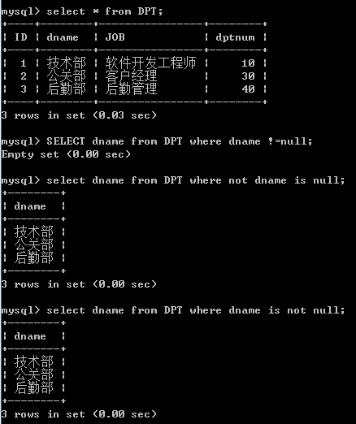
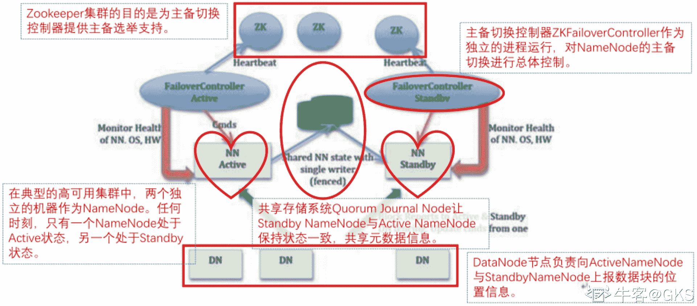
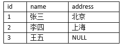
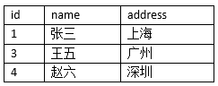
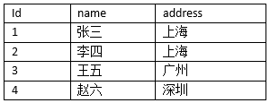
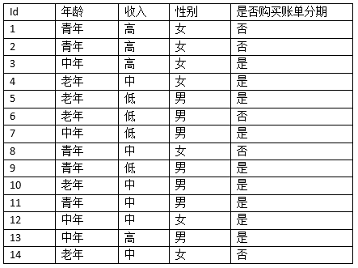
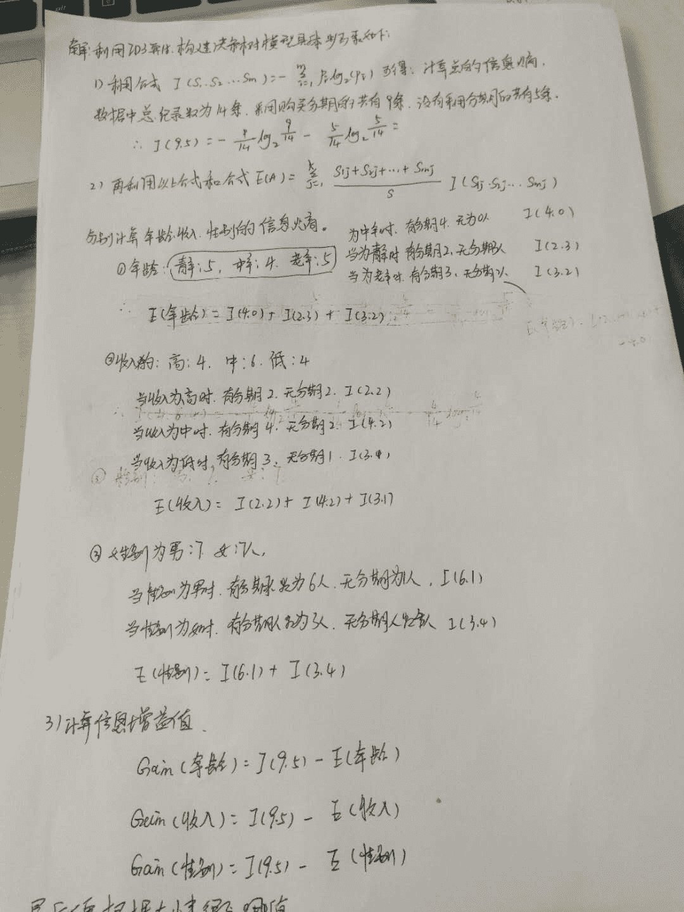
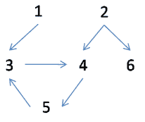

# 招商银行信用卡中心 2018 春招 IT 笔试（数据方向第一批）

## 1

```cpp
以下哪个程序员的说法是合理的
```

正确答案: D   你的答案: 空 (错误)

```cpp
程序员甲：这一段 sql 写的太不合理，表上有锁行上有锁就算了，列上还要加锁！
```

```cpp
程序员乙：为了实现给 30 岁以下同事加发 500 块钱这样的需求， 我的 sql 实现分为两个步骤：第一，在人员表中选出 30 岁以下的同事名单； 第二，调用了一个触发器，给工资表的金额字段给对应同事加 500。
```

```cpp
程序员丙：我根据两张表的主键进行 full join，结果发现很多重复项，查了一下原来是因为关联项中有 null 值。
```

```cpp
程序员丁：老板居然叫我在客户订单表中加两列关于订单产品的信息！为什么不分成两张表？他懂不懂 2NF？
```

本题知识点

招商银行信用卡中心 Java 工程师 C++工程师 iOS 工程师 安卓工程师 运维工程师 前端工程师 算法工程师 PHP 工程师 大数据开发工程师 2018

讨论

[~~Smile](https://www.nowcoder.com/profile/3486232)

程序员甲：所表述的内容其实就是“锁”的知识点，这里是共享锁还是排它锁都没有表述清楚
程序员乙：调用一个触发器怎么能够实现员工的工资更新呢？
程序员丙：对两表的“主键”进行全连接“？因为全连接是左右链接的并集，当然会有重复项
程序员丁：是对的

发表于 2018-08-20 09:27:40

* * *

[liangjie](https://www.nowcoder.com/profile/6052207)

满足 1NF,表中的字段必须完全依赖于全部主键而非部分主键 

发表于 2018-08-16 11:01:43

* * *

## 2

```cpp
以下哪个关键字是用来删除表
```

正确答案: B   你的答案: 空 (错误)

```cpp
delete
```

```cpp
drop
```

```cpp
truncate
```

```cpp
以上都不是
```

本题知识点

招商银行信用卡中心 Java 工程师 C++工程师 iOS 工程师 安卓工程师 运维工程师 前端工程师 算法工程师 PHP 工程师 大数据开发工程师 2018

讨论

[紫夜馨空 2012](https://www.nowcoder.com/profile/303388676)

**当你不再需要该表时， 用 drop；当你仍要保留该表，但要删除所有记录时， 用 truncate；当你要删除部分记录时（always with a WHERE clause), 用 delete.**

发表于 2018-08-17 09:39:16

* * *

## 3

```cpp
查询 client 表中的所有非空 phone 信息, 以下语句正确的是
```

正确答案: D   你的答案: 空 (错误)

```cpp
select phone from client where phone != null
```

```cpp
select phone from client where phone not is null
```

```cpp
select phone from client where phone &lt;&gt; null
```

```cpp
select phone from client where not phone is null
```

本题知识点

招商银行信用卡中心 Java 工程师 C++工程师 iOS 工程师 安卓工程师 运维工程师 前端工程师 算法工程师 PHP 工程师 大数据开发工程师 2018

讨论

[勇敢向前不怕困难](https://www.nowcoder.com/profile/5859461)



发表于 2018-09-02 16:45:08

* * *

[紫夜馨空 2012](https://www.nowcoder.com/profile/303388676)

```cpp
select phone from client where phone is not null
```

发表于 2018-08-17 09:45:41

* * *

[找呀找呀找什么](https://www.nowcoder.com/profile/957357)

is not null 原来是 可以 写成 not is

发表于 2020-02-12 00:01:56

* * *

## 4

```cpp
在做数据库的 TRUNCATE 操作时，下列叙述错误的是
```

正确答案: B   你的答案: 空 (错误)

```cpp
会将列上的自增长值恢复至种子值
```

```cpp
会将所删除的数据保存到回滚段（rollback segment）中
```

```cpp
表的索引和约束保持不变
```

```cpp
不会触发触发器（trigger）
```

本题知识点

招商银行信用卡中心 Java 工程师 C++工程师 iOS 工程师 安卓工程师 运维工程师 前端工程师 算法工程师 PHP 工程师 大数据开发工程师 2018

讨论

[liangjie](https://www.nowcoder.com/profile/6052207)

truncate 和 drop 操作都是数据定义语言（ddl），会立即执行操作，不会将原数据放到 rollback segment 中，也不会触发 trigger

发表于 2018-08-16 11:04:54

* * *

## 5

```cpp
有保存学生的课程分数的表 STU_SCORE，STU_ID 为学号，SCORE 为分数，
以下哪个不能计算出学生的课程平均分
```

正确答案: D   你的答案: 空 (错误)

```cpp
SELECT STU_ID, AVG(SCORE) FROM STU_SCORE GROUP BY STU_ID
```

```cpp
SELECT STU_ID, AVG(SCORE) FROM STU_SCORE GROUP BY STU_ID ORDER BY STU_ID
```

```cpp
SELECT STU_ID, SUM(SCORE)/COUNT(STU_ID) FROM STU_SCORE GROUP BY STU_ID
```

```cpp
SELECT STU_ID, AVG(SCORE)/COUNT(STU_ID) FROM STU_SCORE GROUP BY STU_ID
```

本题知识点

招商银行信用卡中心 Java 工程师 C++工程师 iOS 工程师 安卓工程师 运维工程师 前端工程师 算法工程师 PHP 工程师 大数据开发工程师 2018

讨论

[Buffoon 丶果](https://www.nowcoder.com/profile/4583267)

D 呀，你 avg 就求的平均数，再 avg/count(总数)得到啥

发表于 2018-10-19 17:41:21

* * *

[娃哈哈啊](https://www.nowcoder.com/profile/6996946)

D

发表于 2018-10-19 11:04:39

* * *

## 6

```cpp
关于 Hadoop 配置机架感知，下面哪项不正确
```

正确答案: A   你的答案: 空 (错误)

```cpp
如果一个机架上的三台机器同时故障，可能会造成数据丢失
```

```cpp
HDFS 写入数据的时候会写到不同机架的 DataNode 中
```

```cpp
MapReduce 会根据机架获取离自己比较近的网络数据
```

```cpp
Hadoop 配置机架需与物理机架保持一致，才可达到最好的容灾效果
```

本题知识点

招商银行信用卡中心 Java 工程师 C++工程师 iOS 工程师 安卓工程师 运维工程师 前端工程师 算法工程师 PHP 工程师 大数据开发工程师 2018

讨论

[ywy-轩 yu](https://www.nowcoder.com/profile/460194218)

Hadoop 在设计时考虑到数据的安全与高效，数据文件默认在 HDFS 上存放三份，存储策略为本地一份，同机架内其它某一节点上一份，不同机架的某一节点上一份。这样如果本地数据损坏，节点可以从同一机架内的相邻节点拿到数据，速度肯定比从跨机架节点上拿数据要快；同时，如果整个机架的网络出现异常，也能保证在其它机架的节点上找到数据。为了降低整体的带宽消耗和读取延时，HDFS 会尽量让读取程序读取离它最近的副本。来自[转载请注明出处：http://blog.csdn.net/l1028386804/article/details/51935169](http://blog.csdn.net/l1028386804/article/details/51935169)

发表于 2018-08-30 14:07:41

* * *

## 7

```cpp
以下关于 Hive 基本操作描述正确的是
```

正确答案: B   你的答案: 空 (错误)

```cpp
创建外部表使用 external 关键字，创建普通表需要指定 internal 关键字
```

```cpp
创建外部表必须要指定 location 信息
```

```cpp
加载数据到 Hive 时源数据必须是 HDFS 的一个路径
```

```cpp
分区可以在创建表时指定也可在创建表后通过 Alter 命令添加分区
```

本题知识点

招商银行信用卡中心 Java 工程师 C++工程师 iOS 工程师 安卓工程师 运维工程师 前端工程师 算法工程师 PHP 工程师 大数据开发工程师 2018

讨论

[ywy-轩 yu](https://www.nowcoder.com/profile/460194218)

EXTERNAL 关键字可以让用户创建一个外部表，在建表的同时指定一个指向实际数据的路径（LOCATION），Hive 创建内部表时，会将数据移动到数据仓库指向的路径；若创建外部表，仅记录数据所在的路径，不对数据的位置做任何改变。**外部表删除时，只删除元数据信息，存储在 HDFS 中的数据没有被删除。** 转自[`www.cnblogs.com/wangrd/p/6275162.html`](https://www.cnblogs.com/wangrd/p/6275162.html)

发表于 2018-08-30 14:23:32

* * *

[江斌](https://www.nowcoder.com/profile/397477713)

ALTER TABLE XXX ADD Partition 不行嘛?创建外部表不指定 Location 会使用默认的地址啊

编辑于 2020-02-01 22:46:24

* * *

[冷狼 201903100855478](https://www.nowcoder.com/profile/619391519)

加载数据到 Hive 时源数据必须是 HDFS 的一个路径也可以是其他文件系统的一个路径呀！！！创建外部表的时候，可以先不指定路径，然后再 load 一个路径给这个表，所以这道题目有问题我觉得。hive> create external table if not exists default.dept(
    > deptno int,
    > dname string,
    > loc int
    > )
    > row format delimited fields terminated by '\t';
OK
Time taken: 5.624 seconds

编辑于 2020-04-08 14:10:59

* * *

## 8

```cpp
Spark on Yarn 模式提交任务后，会进行以下几个过程
 ①向 Yarn 申请 executor 资源。
 ②任务构建成 DAG 图。
 ③Task 发送给 executor 执行。
 ④进行 Stage 划分与 TaskSet 生成。
 ⑤启动 SparkContext。
 ⑥executor 向 SparkContext 进行注册。
 以上过程发生的先后顺序为
```

正确答案: B   你的答案: 空 (错误)

```cpp
165432
```

```cpp
516243
```

```cpp
165342
```

```cpp
526143
```

本题知识点

招商银行信用卡中心 Java 工程师 C++工程师 iOS 工程师 安卓工程师 运维工程师 前端工程师 算法工程师 PHP 工程师 大数据开发工程师 2018

讨论

[找呀找呀找什么](https://www.nowcoder.com/profile/957357)

前面还有 选择一个 container 来做 app master 吧

发表于 2020-02-12 12:17:39

* * *

## 9

```cpp
Spark 中各 Stage 的 Task 数量由什么决定
```

正确答案: A   你的答案: 空 (错误)

```cpp
Partition
```

```cpp
Job
```

```cpp
Stage
```

```cpp
TaskScheduler
```

本题知识点

招商银行信用卡中心 Java 工程师 C++工程师 iOS 工程师 安卓工程师 运维工程师 前端工程师 算法工程师 PHP 工程师 Java 工程师 C++工程师 安卓工程师 iOS 工程师 运维工程师 前端工程师 算法工程师 PHP 工程师 招商银行信用卡中心 大数据开发工程师 招商银行信用卡中心 2018

## 10

```cpp
Spark 默认的存储级别是
```

正确答案: A   你的答案: 空 (错误)

```cpp
MEMORY_ONLY
```

```cpp
MEMORY_ONLY_SER
```

```cpp
MEMORY_AND_DISK
```

```cpp
MEMORY_AND_DISK_SER
```

本题知识点

招商银行信用卡中心 Java 工程师 C++工程师 iOS 工程师 安卓工程师 运维工程师 前端工程师 算法工程师 PHP 工程师 大数据开发工程师 2018

讨论

[(⊙o⊙)！](https://www.nowcoder.com/profile/465810736)

Spark 默认缓存级别 RDD 是 MEMORY_ONLY    DataFrame 和 DataSet 是 MEMORY_AND_DISK

发表于 2019-12-18 16:17:21

* * *

[淡淡的深蓝色](https://www.nowcoder.com/profile/257452242)

A 默认的情况下，Spark 会使用的是内存存储，为了增加程序运算效率

发表于 2019-03-15 17:05:23

* * *

## 11

```cpp
Hive 的元数据存储在 derby 和 MySQL 中有什么区别
```

正确答案: B   你的答案: 空 (错误)

```cpp
没区别
```

```cpp
多会话
```

```cpp
支持网络环境
```

```cpp
数据库的区别
```

本题知识点

招商银行信用卡中心 Java 工程师 C++工程师 iOS 工程师 安卓工程师 运维工程师 前端工程师 算法工程师 PHP 工程师 大数据开发工程师 2018

讨论

[Jred](https://www.nowcoder.com/profile/5672569)

 ```cpp
derby 只能允许一个会话连接测试还行,生产环境都是 mysql
``` 

发表于 2018-12-11 18:06:03

* * *

[牛客 136352259 号](https://www.nowcoder.com/profile/136352259)

c

发表于 2019-06-29 12:08:59

* * *

## 12

```cpp
spark1.6.0 之后 的 master 和 worker 通过什么方式进行通信的
```

正确答案: C   你的答案: 空 (错误)

```cpp
http
```

```cpp
nio
```

```cpp
netty
```

```cpp
Akka
```

本题知识点

招商银行信用卡中心 Java 工程师 C++工程师 iOS 工程师 安卓工程师 运维工程师 前端工程师 算法工程师 PHP 工程师 大数据开发工程师 2018

讨论

[mutti](https://www.nowcoder.com/profile/668907510)

Spark 1.6.0 之前使用的是 Akka 通信框架 Spark 1.6.0 之后使用的是 netty 通信框架

发表于 2019-01-02 09:59:18

* * *

[Edwinxzw](https://www.nowcoder.com/profile/212535374)

出这题的人是个 shazi，版本都不说

发表于 2019-10-16 21:58:34

* * *

## 13

```cpp
下列哪项不是数据仓库的特点
```

正确答案: C   你的答案: 空 (错误)

```cpp
面向主题的
```

```cpp
集成的
```

```cpp
面向事务的
```

```cpp
反应历史变化的
```

本题知识点

招商银行信用卡中心 Java 工程师 C++工程师 iOS 工程师 安卓工程师 运维工程师 前端工程师 算法工程师 PHP 工程师 大数据开发工程师 2018

讨论

[Daniel201803162026649](https://www.nowcoder.com/profile/6920538)

数据仓库是一种面对主题的，相对稳定的，集成的，反应历史变化的数据集合

发表于 2018-08-18 10:27:42

* * *

## 14

```cpp
下列哪项不属于数据仓库常用模型
```

正确答案: D   你的答案: 空 (错误)

```cpp
星形模型
```

```cpp
事实星座模
```

```cpp
雪花模型
```

```cpp
树枝模型
```

本题知识点

招商银行信用卡中心 Java 工程师 C++工程师 iOS 工程师 安卓工程师 运维工程师 前端工程师 算法工程师 PHP 工程师 大数据开发工程师 2018

讨论

[PrettySunshine2018](https://www.nowcoder.com/profile/130627682)

数据仓库常用模型：**范式建模，雪花模型，星形模型，事实星座模型**

发表于 2018-08-30 14:48:59

* * *

## 15

```cpp
以下哪项关于决策树的说法是错误的
```

正确答案: A   你的答案: 空 (错误)

```cpp
冗余属性会对决策树的准确率造成不利的影响
```

```cpp
子树可能在决策树中重复多次
```

```cpp
决策树算法对于噪声的干扰不是很敏感
```

```cpp
寻找最佳决策树是 NP 完全问题
```

本题知识点

招商银行信用卡中心 Java 工程师 C++工程师 iOS 工程师 安卓工程师 运维工程师 前端工程师 算法工程师 PHP 工程师 Java 工程师 C++工程师 安卓工程师 iOS 工程师 运维工程师 前端工程师 算法工程师 PHP 工程师 招商银行信用卡中心 大数据开发工程师 招商银行信用卡中心 2018

讨论

[卯卯爱学习](https://www.nowcoder.com/profile/546908240)

下面是对决策树归纳算法重要特点的总结。 
1\. **决策树归纳是一种****构建分类模型的非参数方法****。换句话说，****它不要求任何先验假设，不假定类和其他属性服从一定的概率分布****。** 
2. **找到最佳的决策树是 NP 完全问题**。许多决策树算法都采取启发式的方法指导对假设空间的搜索。我们常用一种贪心的、自顶向下的递归划分策略建立决策树。 
3\. 已开发的构建决策树技术不需要昂贵的计算代价，即使训练集非常大，也可以快速建立模型。此外，决策树一旦建立，未知样本分类非常快，最坏情况下的时间复杂度是 O(w)，其中 w 是树的最大深度。 
4.**决策树相对容易解释，特别是小型的决策树****。**在很多简单的数据集上，决策树的准确率也可以与其他分类算法相媲美。 
5. 决策树是学习离散值函数的典型代表。然而，它不能很好地推广到某些特定的布尔函数。 
一个著名的例子是奇偶函数，当奇数（偶数）个布尔属性为真时其值为 0（1）。对于这样的函数准确建模需要一棵具有 2d+1−12d+1−1 个结点的满决策树，其中 d 是布尔属性的个数。（每次利用属性划分后，子集合中值为 0/1 的比例仍然一样） 
6\. **决策树算法****对于噪声的干扰具有相当好的鲁棒性****，采用避免过拟合的方法之后尤其如此**。 
7. **冗余属性不会对决策树的准确率造成不利的影响，有效处理共线性****。**一个数据如果在数据中它与另一个属性是强相关的，那么它是冗余的。在两个冗余的属性中，如果已经选择其中一个座位划分属性，则另一个将会被忽略。然而，如果数据集中含有很多无用的属性（即对分类任务没有用的属性），则某些无用属性可能在树的构造过程中偶然被选中，导致决策树过于庞大。通过在预处理阶段删除不相关属性，特征选择技术能够帮助提高决策树的准确率。
8\. 由于大多数的决策树算法都采用自顶向下的递归划分方法，因此沿着树向下，记录会越小。在叶结点，记录可能太少，对于叶结点代表的类，不能作出具有统计意义的判断，这就是所谓的数据碎片（data fragmentation）问题。解决该问题的一种可行的方法是，当样本数小于某个特定阈值时停止分裂。 
9\. 子树可能在决策树中重复多次，这使得决策树构建过程时间复杂度大，并且可能更难解释。由于大多数的决策树算法都采用分治划分策略，因此在属性空间的不同部分可以使用相同的测试条件，从而导致子树重复问题。 

发表于 2018-09-02 19:30:32

* * *

## 16

```cpp
以下哪种算法在预测时才开始训练
```

正确答案: B   你的答案: 空 (错误)

```cpp
逻辑回归
```

```cpp
KNN
```

```cpp
决策树
```

```cpp
贝叶斯
```

本题知识点

招商银行信用卡中心 Java 工程师 C++工程师 iOS 工程师 安卓工程师 运维工程师 前端工程师 算法工程师 PHP 工程师 大数据开发工程师 2018

讨论

[卯卯爱学习](https://www.nowcoder.com/profile/546908240)

KNN 为啥是预测时才进行训练？下面为你解释：

KNN 算法的思想如下：就是在训练集中数据和标签已知的情况下，输入测试数据，将测试数据的特征与训练集中对应的特征进行相互比较，找到训练集中与之最为相似的前 K 个数据，则该测试数据对应的类别就是 K 个数据中出现次数最多的那个分类，其算法的描述为：

1）计算测试数据与各个训练数据之间的距离；

2）按照距离的递增关系进行排序；

3）选取距离最小的 K 个点；

4）确定前 K 个点所在类别的出现频率；

5）返回前 K 个点中出现频率最高的类别作为测试数据的预测分类。可以看出，测试与训练是同时的，严格意义上说，不同于其他的算法过程，knn 没有训练过程，直接就是利用测试集进行投票预测。

发表于 2018-09-02 19:24:52

* * *

## 17

```cpp
下面的决策树中，能解决回归问题的是
```

正确答案: D   你的答案: 空 (错误)

```cpp
ID3
```

```cpp
C4.5
```

```cpp
C5.0
```

```cpp
CART
```

本题知识点

招商银行信用卡中心 Java 工程师 C++工程师 iOS 工程师 安卓工程师 运维工程师 前端工程师 算法工程师 PHP 工程师 大数据开发工程师 2018

## 18

```cpp
以下不属于 Bagging 的特点是
```

正确答案: C   你的答案: 空 (错误)

```cpp
有放回抽样多个子集
```

```cpp
训练多个分类器
```

```cpp
最终结果为每个学习器加权后的线性组合
```

```cpp
可以减少过拟合
```

本题知识点

招商银行信用卡中心 Java 工程师 C++工程师 iOS 工程师 安卓工程师 运维工程师 前端工程师 算法工程师 PHP 工程师 大数据开发工程师 2018

讨论

[Enigma2018](https://www.nowcoder.com/profile/2681283)

Boosting 最终的结果是多个分类器加权的结果，bagging 是根据多个的分类器投票或者是连续的

发表于 2019-03-27 20:46:26

* * *

[J..Y..](https://www.nowcoder.com/profile/4060822)

对分类问题：将上步得到的 k 个模型采用投票的方式得到分类结果；对回归问题：计算上述模型的均值作为最后的结果。（所有模型的重要性相同）

发表于 2019-09-24 10:57:44

* * *

## 19

```cpp
A 表：上学年学生期末考试成绩（只包含参与考试的学生成绩）
B 表：上学年学生期末考试补考成绩（包括挂科重考、缺考的学生成绩）
A、B 表表结构：STU_NO int （PK）,RESULT int
要得到补考结束后最新的学生成绩，则正确的是
```

正确答案: A B   你的答案: 空 (错误)

```cpp
insert into B select * from A left join B  on A.STU_NO = B.STU_NO  where B.STU_NO is null;
```

```cpp
merge into A using B on A.STU_NO = B.STU_NO  when not matched then insert (STU_NO,RESULT) values (B.STU_NO,B.RESULT)  when matched then update set A.RESULT = B.RESULT;
```

```cpp
insert into A  select * from B left join A  on A.STU_NO = B.STU_NO  where B.STU_NO is not null;
```

```cpp
insert into A  select * from B right join A  on A.STU_NO = B.STU_NO  where B.STU_NO is null;
```

本题知识点

招商银行信用卡中心 Java 工程师 C++工程师 iOS 工程师 安卓工程师 运维工程师 前端工程师 算法工程师 PHP 工程师 大数据开发工程师 2018

讨论

[飘零剑士](https://www.nowcoder.com/profile/4045806)

A 选项，A  left join B 之后得到的结果不应该是 4 个列吗？这样对应到前面的 insert into B 不会报错么（尽管后两列的值均为 NULL）

发表于 2018-11-02 14:15:28

* * *

[牛客 72773](https://www.nowcoder.com/profile/116953323)

 select * from A left join B  on A.id=B.a_id;A 就是主表， select * from A left join B  on on A.id=B.a_id where B.id<cont(常数)。B 表作为连接的主表

发表于 2018-08-19 16:13:20

* * *

## 20

```cpp
以下哪些选项 HIVE 可以避免进行 MapReduce
```

正确答案: A C   你的答案: 空 (错误)

```cpp
select * from employees;
```

```cpp
select * from emplyees where age&gt;25;
```

```cpp
select * from employees where country='CHINA';
```

```cpp
以上都需要
```

本题知识点

招商银行信用卡中心 Java 工程师 C++工程师 iOS 工程师 安卓工程师 运维工程师 前端工程师 算法工程师 PHP 工程师 大数据开发工程师 2018

讨论

[J..Y..](https://www.nowcoder.com/profile/4060822)

[`www.cnblogs.com/hjwq/p/8134431.html`](https://www.cnblogs.com/hjwq/p/8134431.html)

发表于 2019-09-24 11:14:27

* * *

[找呀找呀找什么](https://www.nowcoder.com/profile/957357)

都没说 country 是分区字段 这就对了

发表于 2020-02-12 13:08:41

* * *

## 21

在 python 的类的方法定义中，请描述'self'参数的作用？

你的答案

本题知识点

招商银行信用卡中心 Java 工程师 C++工程师 iOS 工程师 安卓工程师 运维工程师 前端工程师 算法工程师 PHP 工程师 大数据开发工程师 2018

讨论

[✨枫↘end﹌](https://www.nowcoder.com/profile/76960340)

在 python 中, __new__ 方法用来创建对象, 将创建好的这个对象以第一个参数的形式传入 __init__ 函数中,在定义对象方法的时候第一个参数被命名为 self, 定义类方法的时候第一个参数被定义为 cls, sel 参数在对象调用该方法时, 以第一个参数的形式传递到该方法函数中

发表于 2018-10-13 10:33:49

* * *

[零葬](https://www.nowcoder.com/profile/75718849)

在 python 的类中 self 代表实例本身，具体来说，是该实例的内存地址。在调用实例的方法时，Python 解释器会自己把实例变量传给类函数中的 self。

发表于 2021-01-11 19:58:14

* * *

[sughur](https://www.nowcoder.com/profile/791206879)

1.  self 在类中定义时定义，在调用时会自动传入。
2.  self 是指调用时的类的实例。

发表于 2018-10-19 11:17:00

* * *

## 22

简述 HDFS 的 Namenode 的 HA 架构特点

你的答案

本题知识点

招商银行信用卡中心 Java 工程师 C++工程师 iOS 工程师 安卓工程师 运维工程师 前端工程师 算法工程师 PHP 工程师 大数据开发工程师 2018

讨论

[sughur](https://www.nowcoder.com/profile/791206879)

社区的 NN HA 包括两个 NN，主（active）与备（standby），ZKFC，ZK，share editlog。流程：集群启动后一个 NN 处于 active 状态，并提供服务，处理客户端和 datanode 的请求，并把 editlog 写到本地和 share editlog（可以是 NFS，QJM 等）中。另外一个 NN 处于 Standby 状态，它启动的时候加载 fsimage，然后周期性的从 share editlog 中获取 editlog，保持与 active 的状态同步。为了实现 standby 在 sctive 挂掉后迅速提供服务，需要 DN 同时向两个 NN 汇报，使得 Stadnby 保存 block to datanode 信息，因为 NN 启动中最费时的工作是处理所有 datanode 的 blockreport。为了实现热备，增加 FailoverController 和 ZK，FailoverController 与 ZK 通信，通过 ZK 选主，FailoverController 通过 RPC 让 NN 转换为 active 或 standby。

发表于 2018-10-19 11:22:24

* * *

[GKS](https://www.nowcoder.com/profile/769463753)



编辑于 2020-07-10 23:39:10

* * *

## 23

已知 Hive 中有人员信息表 a：
以及人员信息表 b：

请用 Hive SQL 得出表 c：



即实现以下逻辑：

取表 a 和表 b 所有人员的信息得出表 c，若某一人员同时存在于表 a 和表 b，则表 b 人员信息优先。

你的答案

本题知识点

招商银行信用卡中心 Java 工程师 C++工程师 iOS 工程师 安卓工程师 运维工程师 前端工程师 算法工程师 PHP 工程师 大数据开发工程师 2018

讨论

[永泽 AAAAAAAAAAAA](https://www.nowcoder.com/profile/580353203)

create table c as select * from b unionselect a.id as id,a.name as name,a.address as address from a left join select b.id from b where b.id is nullorder by id

发表于 2018-08-26 22:21:25

* * *

[零葬](https://www.nowcoder.com/profile/75718849)

```cpp
select * from
(select b.id, b.name, b.address from b join a on b.id=a.id
 union
 select * from a where a.id not in (select id from b)) temp
order by id;
```

发表于 2021-01-11 20:16:39

* * *

[牛客 218152611 号](https://www.nowcoder.com/profile/218152611)

select nvl(b.id,a.id),nvl(b.name,a.name),case when b.address is null then a.address else b.adress end as adressfrom Bfull join Aon B.id=A.idorder by id;--nvl(A,B)如果 A 是 null 就使用 B 来替换

发表于 2022-03-21 12:20:18

* * *

## 24

以下表格是一部分信用卡用户的特征，以及其是否购买账单分期的打标。现根据这些样本构造 ID3 决策树，请问第一次分支选用哪一个特征（附上计算过程）。

你的答案

本题知识点

招商银行信用卡中心 Java 工程师 C++工程师 iOS 工程师 安卓工程师 运维工程师 前端工程师 算法工程师 PHP 工程师 大数据开发工程师 2018

讨论

[offer 来！！！](https://www.nowcoder.com/profile/829361103)

初始熵值：-9/14*log2(9/14)-5/14*log2(5/14)=0.940 选定年龄为初始特征的熵值计算过程当年龄为青年：购买账单分期的概率为 2/5,不购买的概率为 3/5，熵值为  -2/5*log2(2/5)-3/5*log2(3/5) = 0.971 当年龄为中年：购买账单分期的概率为 1，熵值为 0 当年龄为老年：购买账单分期的概率为 3/5,不购买的概率为 2/5，熵值为  0.971 年龄分别取青年、中年、老年的概率为 5/14,4/14,5/14 则选择女年龄为初始特征的熵值为 5/14*0.971+4/14*0+4/14*0.971 = 0.693 熵值下降了 0.237，即信息增益为 0.237

发表于 2019-03-28 17:39:01

* * *

[~~Smile](https://www.nowcoder.com/profile/3486232)



发表于 2018-08-20 11:14:36

* * *

## 25

以边关系表示客户间的转账行为，若客户 1 向 2 转账，就认为存在 1 指向 2 的边。假设从某个客户 1 出发，沿着其任意转账关系边查找，若最终均可以到达终止客户(不存在帐务转出的客户)，则认为客户 1 是安全客户；否则认为客户 1 是潜在风险客户。即，所有处于转账关系环中的客户以及指向环中客户的客户节点均是潜在风险客户。如下图，只有客户 6 是安全客户。

本题知识点

Java 工程师 招商银行信用卡中心 iOS 工程师 C++工程师 运维工程师 安卓工程师 算法工程师 前端工程师 PHP 工程师 图 大数据开发工程师 2018

讨论

[卯卯爱学习](https://www.nowcoder.com/profile/546908240)

####我怎么感觉这样就行。。。。。。。。。。。##存放终端 b=c(3,4,6,4,5,3)
##存放起点
a=c(1,2,2,3,4,5)
result=setdiff(b,a)
if(length(result)>0){
  print(result)
}
else{
  print("none")
}

发表于 2018-09-02 19:45:27

* * *

[nbgao](https://www.nowcoder.com/profile/211289)

```cpp
#include <bits/stdc++.h>
using namespace std;

int main(){
    int n, m, u, v;
    scanf("%d%d", &n, &m);
    vector<int> d(n+1, 0), r;
    vector<int> G[n+1];
    while(m--){
        scanf("%d,%d", &u, &v);
        G[v].push_back(u);
        d[u]++;
    }
    int i=0;
    while(true){
        for(i=1;i<=n;i++)
            if(d[i]==0)
                break;
        if(i==n+1)
            break;
        d[i] = -1;
        r.push_back(i);
        for(auto &e: G[i])
            d[e]--;
    }
    if(r.size()==0)
        puts("None\n");
    else{
        sort(r.begin(), r.end());
        for(i=0;i<r.size();i++)
            if(i==0)
                printf("%d", r[i]);
            else
                printf(" %d", r[i]);
    }
    return 0;
}
```

发表于 2020-10-29 17:09:13

* * *

[十步九畹](https://www.nowcoder.com/profile/568036370)

```cpp
n,m = map(int, input().split())
h = [[] for i in range(n+1)]
d = [0 for i in range(n+1)]
for i in range(m):
    e0,e1 = map(int,input().split(","))
    h[e1].append(e0)
    d[e0] += 1
res = [i for i in range(1,n+1) if d[i] == 0]
for i in res:
    for j in h[i]:
        d[j] -= 1
        if d[j] == 0:
            res.append(j)
if res or print('None'):
    print(' '.join([str(i) for i in range(1,n+1) if d[i] == 0])) 
```

编辑于 2019-10-19 23:42:38

* * *