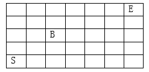
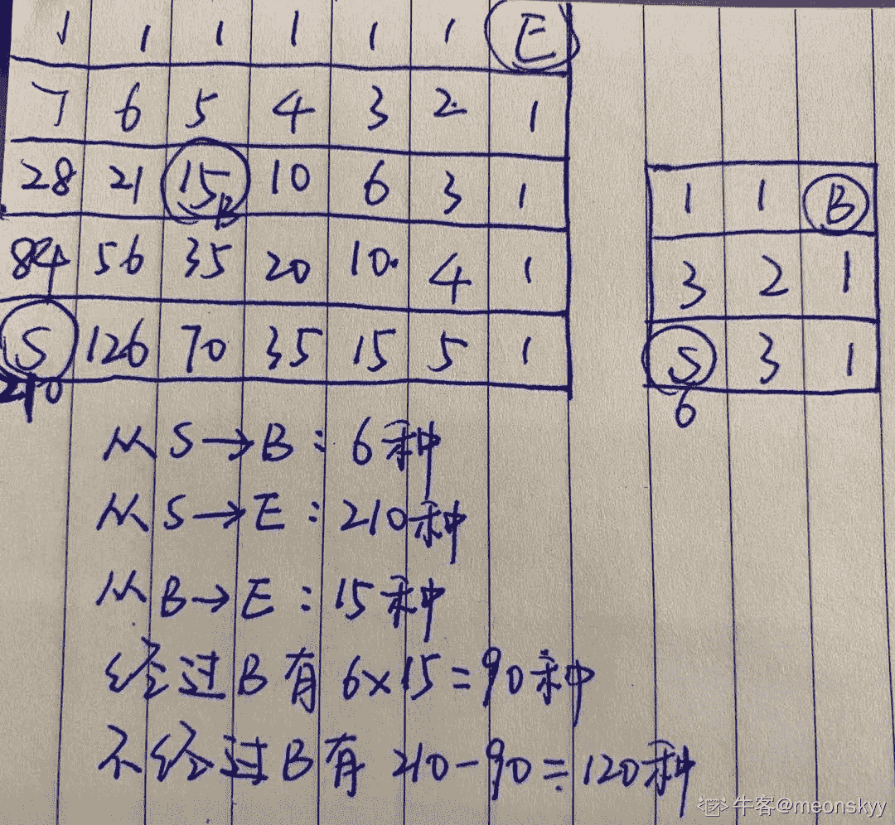
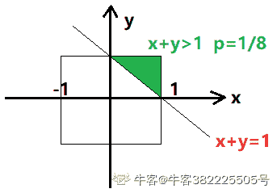
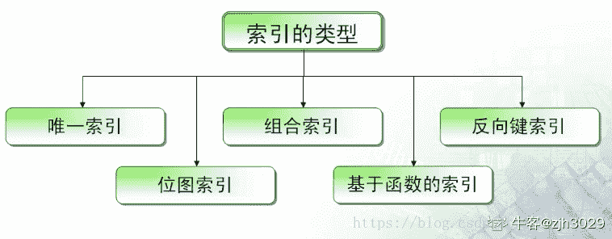
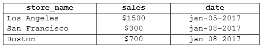
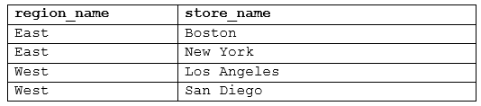

# 招商银行信用卡中心 2018 春招 IT 笔试（测试方向第一批）

## 1

```cpp
浏览器与 web 服务器之间使用的协议是
```

正确答案: C   你的答案: 空 (错误)

```cpp
DNS
```

```cpp
SNMP
```

```cpp
HTTP
```

```cpp
SMTP
```

本题知识点

招商银行信用卡中心 Java 工程师 C++工程师 iOS 工程师 安卓工程师 运维工程师 前端工程师 算法工程师 PHP 工程师 测试工程师 2018

讨论

[陈苏航](https://www.nowcoder.com/profile/636134617)

发违法发

发表于 2018-10-12 08:20:57

* * *

[拾閲酒吧](https://www.nowcoder.com/profile/5673189)

C

编辑于 2018-11-27 17:42:33

* * *

## 2

```cpp
将 51, 52, 53, ......, 199, 200 任意排列成一个圈，相邻两数的差的绝对值求和最大为
```

正确答案: D   你的答案: 空 (错误)

```cpp
250
```

```cpp
11050
```

```cpp
11200
```

```cpp
11250
```

本题知识点

招商银行信用卡中心 Java 工程师 C++工程师 iOS 工程师 安卓工程师 运维工程师 前端工程师 算法工程师 PHP 工程师 测试工程师 2018

讨论

[wtrience](https://www.nowcoder.com/profile/989270)

两串数 200,199,198，。。。51,52,53，。。。间隔排序 200，51，199，52，198，53，。。。，126，125 相邻两数的差的绝对值 149,148,147，。。。，1（149+1）*149/2=11175 再加上 200 和 125 的差，11175+75=11250

发表于 2018-08-15 22:10:47

* * *

[Tzu7](https://www.nowcoder.com/profile/7907873)

```cpp

	一共 150 个数，分为两串

	51、52、53 …… 125

	200、199、198 …… 126

	圈上的排列为：200、51、199、52 …… 126、125 （200）

	差的和为：149+148+……+2+1+75=150*149/2+75=75*150=112500 

```

发表于 2019-04-12 14:21:05

* * *

## 3

```cpp
在以下 7*5 的矩阵中，规定每次只能向上或向右移动一格，并且不能经过 B，则 S 移动到 E 一共有多少种走法？

```



正确答案: B   你的答案: 空 (错误)

```cpp
96
```

```cpp
120
```

```cpp
144
```

```cpp
195
```

本题知识点

招商银行信用卡中心 Java 工程师 C++工程师 iOS 工程师 安卓工程师 运维工程师 前端工程师 算法工程师 PHP 工程师 测试工程师 2018

讨论

[Rocky_du](https://www.nowcoder.com/profile/1580225)

棋盘问题：7*5 可以简化为点移动问题：S 向上最大可移动 4 格，向右最大可移动 6 格，首先从 S 到 e 总共有 c(4+6,4)种走法，从 s 到 b 有 c(2+2,2)种走法，从 B 到 E 有 c(4+2,2)种走法。

所以不经过点 P 得走法共有 c(4+6,4)-(c(2+2,2)*c(4+2,2))种，即 120 种，选 B。

发表于 2018-08-15 15:00:34

* * *

[meonskyy](https://www.nowcoder.com/profile/897201682)

数字为当前格子到右上角的路径数量，算法为相邻上格＋相邻右格

发表于 2021-06-22 20:33:42

* * *

## 4

```cpp
在文件局部有序或文件长度较小的情况下，最佳内部排序的方法是
```

正确答案: A   你的答案: 空 (错误)

```cpp
直接插入排序
```

```cpp
冒泡排序
```

```cpp
简单选择排序
```

```cpp
希尔排序
```

本题知识点

招商银行信用卡中心 Java 工程师 C++工程师 iOS 工程师 安卓工程师 运维工程师 前端工程师 算法工程师 PHP 工程师 测试工程师 2018

讨论

[寻，度](https://www.nowcoder.com/profile/3788779)

B 冒泡最合适

发表于 2018-08-22 09:20:21

* * *

[∫∫∫熊舍尼奥 dV](https://www.nowcoder.com/profile/486328590)

A 直接插入排序在序列基本有序时，比较次数大大降低，从 O（n²）降至 O（n）；简单选择排序不受初始序列影响冒泡若本来是反序的还是要比较 n-1 次

发表于 2019-11-19 15:30:22

* * *

## 5

```cpp
系统测试使用哪种技术？
```

正确答案: C   你的答案: 空 (错误)

```cpp
单元测试
```

```cpp
集成测试
```

```cpp
黑盒测试
```

```cpp
白盒测试
```

本题知识点

招商银行信用卡中心 软件测试 测试工程师 2018

讨论

[主公 201806072255693](https://www.nowcoder.com/profile/374239559)

系统测试是指将通过集成测试的软件系统，作为计算机系统的一个重要组成
部分，与计算机硬件、外设、某些支撑软件的系统等其他系统元素组合在一起所进行的测试，目的在于通过与系统的需求定义作比较，发现软件与系统定义不符合或矛盾的地方。
常用的系统测试方法
性能测试是指对软件的运行性能指标进行测试，判断系统集成之后在实际的使用环境下能否稳定、可靠的运行。
强度测试也称压力测试、负载测试。强度测试是要破坏程序，检测非正常情况下系统的负载能力，也就是检查系统能力的最高实际限度。
安全性测试的目的在于检查系统对非法侵入的防范能力，验证安装在系统内的保护机构是否确实能够对系统进行保护，使之不受各种干扰。
软件兼容性测试检测软件之间能否正确的交互和共享信息，其目标是保证软件按照用户期望的方式进行交互，是用其他软件检查软件操作的过程。
恢复测试的主要目的是检查系统的容错能力。通过采用多种人工干预方式使系统失效，检验系统的恢复能力。

发表于 2018-09-06 11:43:01

* * *

[May2333](https://www.nowcoder.com/profile/4941113)

系统测试是对整个软件系统进行一系列的整体，有效性测试，测试依据软件需求说明书等，采用黑盒测试方法。

发表于 2018-09-02 20:15:01

* * *

[牛客 321310304 号](https://www.nowcoder.com/profile/321310304)

系统测试是在集成测试之后的一个测试，属于黑盒测试

发表于 2020-07-06 12:25:27

* * *

## 6

```cpp
如何为文件 A1 设置自己可以执行的权限？
```

正确答案: A   你的答案: 空 (错误)

```cpp
chmod u+x A1
```

```cpp
chmod a+x A1
```

```cpp
chmod g+x A1
```

```cpp
chmod o+x A1
```

本题知识点

招商银行信用卡中心 Java 工程师 C++工程师 iOS 工程师 安卓工程师 运维工程师 前端工程师 算法工程师 PHP 工程师 测试工程师 2018

讨论

[不吃白切鸡](https://www.nowcoder.com/profile/5648508)

Linux/Unix 的档案调用权限分为三级 : 档案拥有者、群组、其他。u 表示该档案的拥有者，g 表示与该档案的拥有者属于同一个群体(group)者，o 表示其他以外的人，a 表示这三者皆是。 

发表于 2019-03-16 20:58:24

* * *

[寻，度](https://www.nowcoder.com/profile/3788779)

D

发表于 2018-08-22 09:20:59

* * *

## 7

```cpp
在使用 mkdir 命令创建新的目录时，在其父目录不存在时先创建父目录的选项是
```

正确答案: D   你的答案: 空 (错误)

```cpp
-m
```

```cpp
-d
```

```cpp
-f
```

```cpp
-p
```

本题知识点

招商银行信用卡中心 Java 工程师 C++工程师 iOS 工程师 安卓工程师 运维工程师 前端工程师 算法工程师 PHP 工程师 Java 工程师 C++工程师 安卓工程师 iOS 工程师 运维工程师 前端工程师 算法工程师 PHP 工程师 招商银行信用卡中心 测试工程师 招商银行信用卡中心 2018

讨论

[na618](https://www.nowcoder.com/profile/9417036)

-parent

发表于 2018-09-01 15:04:43

* * *

[不吃白切鸡](https://www.nowcoder.com/profile/5648508)

你想创建目录 dir1/dir2/dir3，但是，该目录的父目录都不存在: 1.  mkdir -p dir1/dir2/dir3 

编辑于 2019-03-16 21:02:55

* * *

## 8

```cpp
算法的时间复杂度是指
```

正确答案: C   你的答案: 空 (错误)

```cpp
算法程序的长度
```

```cpp
执行算法程序所需要的时间
```

```cpp
算法执行过程中所需要的基本运算次数
```

```cpp
算法程序中的指令条数
```

本题知识点

招商银行信用卡中心 Java 工程师 C++工程师 iOS 工程师 安卓工程师 运维工程师 前端工程师 算法工程师 PHP 工程师 Java 工程师 C++工程师 安卓工程师 iOS 工程师 运维工程师 前端工程师 算法工程师 PHP 工程师 招商银行信用卡中心 测试工程师 招商银行信用卡中心 2018

讨论

[牛客 600702429 号](https://www.nowcoder.com/profile/600702429)

三短一长选最长

发表于 2020-06-03 09:45:47

* * *

[champion32](https://www.nowcoder.com/profile/3399976)

C

发表于 2018-09-06 22:15:29

* * *

## 9

```cpp
在数据库中，产生数据不一致的根本原因是
```

正确答案: A   你的答案: 空 (错误)

```cpp
数据冗余
```

```cpp
未对数据进行完整性控制
```

```cpp
数据存储量太大
```

```cpp
没有严格保护数据
```

本题知识点

招商银行信用卡中心 运维工程师 测试工程师 招商银行信用卡中心 2018

讨论

[李青 0521](https://www.nowcoder.com/profile/770770723)

数据库中很有可能存在不一致的数据。

一般导致数据库中数据不一致的根本原因有三种情况。第一种是数据冗余造成的，第二种是并发控制不当造成的，第三种是由于某种原因（比如软硬件故障或者操作错误）导致数据丢失或数据损坏。

让我们具体讲讲这三种情况：
第一种情况：数据冗余
假如数据库中两个表都放了用户的地址，在用户的地址发生改变时，如果只更新了一个表的数据，那么两个表就有了不一致的数据。

第二种情况：并发控制不当

假如在飞机票订票系统中，如果两个购票点同时查询某张机票的订购情况，而且分别为订购了这张机票，如果并发控制不当，就会造成同一张机票卖给两个用户的情况。由于系统没有进行并发控制或者并发控制不当，造成数据不一致。

第三中情况：故障和错误

如果软硬件出现故障或者操作错误导致数据丢失或数据损坏，引起数据不一致。因此我们需要提供数据库维护和数据库数据恢复的一些措施。
要根据各种数据库维护手段（如转存、日志等）和数据恢复措施将数据库恢复到某个正确的、完整的、一致性的状态下。

发表于 2019-03-17 18:33:56

* * *

[z 止于至善](https://www.nowcoder.com/profile/4687287)

应该选 A。由于数据冗余，有时修改数据时，一部分数据修改，而另一部分没有修改，造成同一种数据有多个值，产生数据不一致。

发表于 2018-08-30 08:01:30

* * *

[牛悠悠](https://www.nowcoder.com/profile/3684950)

选 A 吧，由于数据冗余，有时修改数据时，一部分数据修改，而另一部分没有修改，造成同一种数据有多个值，产生数据不一致。

发表于 2018-08-16 10:59:36

* * *

## 10

```cpp
假设在区间[-1,1]取数的概率均等，那么我们在[-1,1]中随机取两个数，他们的和大于 1 的概率是
```

正确答案: A   你的答案: 空 (错误)

```cpp
1/8
```

```cpp
1/4
```

```cpp
1/16
```

```cpp
1/2
```

本题知识点

招商银行信用卡中心 Java 工程师 C++工程师 iOS 工程师 安卓工程师 运维工程师 前端工程师 算法工程师 PHP 工程师 Java 工程师 C++工程师 安卓工程师 iOS 工程师 运维工程师 前端工程师 算法工程师 PHP 工程师 招商银行信用卡中心 测试工程师 招商银行信用卡中心 2018

讨论

[wtrience](https://www.nowcoder.com/profile/989270)

画图可得，x,y 在-1,1 的图像是正方形 x+y>1 是 x+y=1 的左上方概率为 8 分之 1

发表于 2018-08-17 13:12:56

* * *

[牛客 382225505 号](https://www.nowcoder.com/profile/382225505)



发表于 2020-07-04 19:19:40

* * *

[slowwalker](https://www.nowcoder.com/profile/743127275)

分成四个区间,[0，0.5][0.5,1]各占四分之一，分两种情况，第一种：两个数都来自[0.5,1],四分之一乘四分之一等于十六分之一，第二种：一个数来自[0,0,5],另一个数来自[0.5,1]，概率也是十六分之一，加起来等于八分之一

发表于 2018-09-11 15:58:18

* * *

## 11

```cpp
下面哪些方法可以减少数据库死锁
```

正确答案: A C   你的答案: 空 (错误)

```cpp
尽量不要在一个事务中实现过于复杂的查询或更新操作。
```

```cpp
表字段尽量多加索引。
```

```cpp
限制应用系统的并发访问量。
```

```cpp
尽量在一个事务中实现过于复杂的查询或更新操作。
```

本题知识点

招商银行信用卡中心 Java 工程师 C++工程师 iOS 工程师 安卓工程师 运维工程师 前端工程师 算法工程师 PHP 工程师 测试工程师 2018

讨论

[z 止于至善](https://www.nowcoder.com/profile/4687287)

减少数据库死锁的方法：[`www.lmwlove.com/ac/ID766`](http://www.lmwlove.com/ac/ID766)

发表于 2018-08-30 15:42:00

* * *

## 12

```cpp
以下哪些属于进程间通信的方式？
```

正确答案: A B D   你的答案: 空 (错误)

```cpp
消息队列
```

```cpp
共享内存
```

```cpp
互斥锁
```

```cpp
管道
```

本题知识点

招商银行信用卡中心 Java 工程师 C++工程师 iOS 工程师 安卓工程师 运维工程师 前端工程师 算法工程师 PHP 工程师 测试工程师 2018

讨论

[z 止于至善](https://www.nowcoder.com/profile/4687287)

进程间通信（IPC，InterProcess Communication）是指在不同进程之间传播或交换信息。

IPC 的方式通常有管道（包括无名管道和命名管道）、消息队列、信号量、共享存储、Socket、Streams 等。

发表于 2018-08-30 15:43:53

* * *

## 13

```cpp
在 oracle 数据库中，关于索引描述正确的是
```

正确答案: B C D   你的答案: 空 (错误)

```cpp
需要对大数据类型创建索引
```

```cpp
对于大表，索引能明显提高查询效率
```

```cpp
在数据表上创建唯一约束，会自动生成唯一索引
```

```cpp
我们最常用到的是 B-Tree 索引
```

本题知识点

招商银行信用卡中心 Java 工程师 C++工程师 iOS 工程师 安卓工程师 运维工程师 前端工程师 算法工程师 PHP 工程师 测试工程师 2018

讨论

[zjh3029](https://www.nowcoder.com/profile/876315903)

BCD 从总的概念上来说，索引分为 B 树索引（也叫平衡树索引，即就是什么都不写，最常用）和位图索引（多用于数据仓库）。这两种索引在逻辑结构（存储）上完全不同。 唯一索引： 唯一索引确保在定义索引的列中没有重复值
              Oracle 自动在表的主键列上创建唯一索引
              使用 CREATE UNIQUE INDEX 语句创建唯一索引  ```cpp
4.对于小型的表，建立索引可能会影响性能 

5.应该避免对具有较少值的字段进行索引。 

6.避免选择大型数据类型的列作为索引。 
``` [`blog.csdn.net/bibibrave/article/details/80876967`](https://blog.csdn.net/bibibrave/article/details/80876967) [`blog.csdn.net/weixin_40050532/article/details/81662430`](https://blog.csdn.net/weixin_40050532/article/details/81662430) 

发表于 2019-09-10 10:37:33

* * *

[拾閲酒吧](https://www.nowcoder.com/profile/5673189)

BCD

编辑于 2018-11-27 17:43:58

* * *

## 14

```cpp
下面关于软件测试，描述正确的是？
```

正确答案: A B C D   你的答案: 空 (错误)

```cpp
软件测试是使用人工操作或者软件自动运行的方式来检验它是否满足规定的需求或弄清预期结果与实际结果之间的差别的过程。
```

```cpp
软件测试的测试目标是发现一些可以通过测试避免的开发风险。
```

```cpp
软件测试的原则之一是测试应该尽早进行，最好在需求阶段就开始介入。
```

```cpp
软件测试主要工作内容是验证（verification）和确认（validation）
```

本题知识点

招商银行信用卡中心 Java 工程师 C++工程师 iOS 工程师 安卓工程师 运维工程师 前端工程师 算法工程师 PHP 工程师 测试工程师 2018

讨论

[安雨柔](https://www.nowcoder.com/profile/619364958)

ABCD

发表于 2020-03-25 21:42:45

* * *

## 15

```cpp
下列关于虚拟内存的描述正确的是：
```

正确答案: A B D   你的答案: 空 (错误)

```cpp
解放物理空间的存储管理, 使得数据被分配的地址与逻辑上程序执行的上下文解耦。
```

```cpp
提供进程之间的地址空间隔离，防止进程访问地址越界或非法。
```

```cpp
在多进程中，应避免进程的虚拟空间地址映射到相同的物理空间地址。
```

```cpp
简化在链接阶段分配地址空间。
```

本题知识点

招商银行信用卡中心 Java 工程师 C++工程师 iOS 工程师 安卓工程师 运维工程师 前端工程师 算法工程师 PHP 工程师 测试工程师 2018

讨论

[早睡早起是一个天大的骗局](https://www.nowcoder.com/profile/729728238)

C 在多进程中，应避免进程的虚拟空间地址映射到相同的物理空间地址.使用虚拟空间地址 有一个好处，比如说进程 A 和进程 B 都有一个 print 功能，那么虚拟空间地址就会把地址映射到同一个 print 模块上，从而避免了相同的模块重复拷贝

发表于 2018-09-16 10:14:36

* * *

## 16

请详述操作系统中的线程的基本概念、以及线程的基本状态

你的答案

本题知识点

招商银行信用卡中心 Java 工程师 C++工程师 iOS 工程师 安卓工程师 运维工程师 前端工程师 算法工程师 PHP 工程师 测试工程师 2018

讨论

[杨杨 young](https://www.nowcoder.com/profile/7285578)

线程：是进程中的一个执行控制单元，执行路径

      一个进程中至少有一个线程在负责控制程序的执行

      一个进程中如果只有一个执行路径，这个程序称为单线程

      一个进程中有多个执行路径时，这个程序成为多线程

一个线程是进程的一个顺序执行流。同类的多个线程共享一块内存空间和一组系统资源，线程本身有一个供程序执行时的堆栈。线程在切换时负荷小，因此，线程也被称为轻负荷进程。一个进程中可以包含多个线程。线程的基本状态： 1.新建

new 语句创建的线程对象处于新建状态，此时它和其他 java 对象一样，仅被分配了内存。 

2.等待

当线程在 new 之后，并且在调用 start 方法前，线程处于等待状态。 

3.就绪

当一个线程对象创建后，其他线程调用它的 start()方法，该线程就进入就绪状态。处于这个状态的线程位于 Java 虚拟机的可运行池中，等待 cpu 的使用权。 

4.运行状态

处于这个状态的线程占用 CPU，执行程序代码。在并发运行环境中，如果计算机只有一个 CPU，那么任何时刻只会有一个线程处于这个状态。

只有处于就绪状态的线程才有机会转到运行状态。 

5.阻塞状态

阻塞状态是指线程因为某些原因放弃 CPU，暂时停止运行。当线程处于阻塞状态时，Java 虚拟机不会给线程分配 CPU，直到线程重新进入就绪状态，它才会有机会获得运行状态。

阻塞状态分为三种:

1、等待阻塞:运行的线程执行 wait（）方法，JVM 会把该线程放入等待池中。

2、同步阻塞:运行的线程在获取对象同步锁时，若该同步锁被别的线程占用，则 JVM 会把线程放入锁池中。

3、其他阻塞:运行的线程执行 Sleep（）方法，或者发出 I/O 请求时，JVM 会把线程设为阻塞状态。当 Sleep（）状态超时、或者 I/O 处理完毕时，线程重新转入就绪状态。

6.死亡状态

当线程执行完 run()方法中的代码，或者遇到了未捕获的异常，就会退出 run()方法，此时就进入死亡状态，该线程结束生命周期。 

发表于 2018-08-30 17:09:22

* * *

[jyz608](https://www.nowcoder.com/profile/668309543)

线程是计算机处理程序的过程，进程分为就绪、阻塞、运行三个过程

发表于 2018-08-25 11:18:18

* * *

[不拿 offer 誓不罢休](https://www.nowcoder.com/profile/243419777)

9

发表于 2018-08-30 16:02:13

* * *

## 17

请写出主程序（Java 语言）的运行结果：父类：

```cpp
package test;
public class FatherClass {
    public FatherClass() {
        System.out.println("FatherClass Create");
    }
}

```

子类：

```cpp
package test;
import test.FatherClass;
public class ChildClass extends FatherClass {
    public ChildClass() {
        System.out.println("ChildClass Create");
    }
    public static void main(String[] args) {
        FatherClass fc = new FatherClass();
        ChildClass cc = new ChildClass();
    }
}

```

你的答案

本题知识点

招商银行信用卡中心 Java 工程师 C++工程师 iOS 工程师 安卓工程师 运维工程师 前端工程师 算法工程师 PHP 工程师 测试工程师 2018

讨论

[牛客 326693965 号](https://www.nowcoder.com/profile/326693965)

为啥两 father

发表于 2022-03-05 23:52:12

* * *

[牛客 00l 号](https://www.nowcoder.com/profile/8322162)

FatherClass CreateFatherClass Create
ChildClass Create

发表于 2018-09-25 09:25:24

* * *

[老城萧笙](https://www.nowcoder.com/profile/474541150)

两个包名可以重复么？

发表于 2018-09-21 11:51:44

* * *

## 18

参考下面的两种表，第一张表为门店销售记录表，第二张表为门店地区表。请用一条 sql 语句，找出所有在西部的店的营业额总和。1、Store_Information 表，三列为门店名称(唯一)，营业额，统计日期 2、Geography 表，两列分别为门店所属地区，门店名称(唯一)

你的答案

本题知识点

招商银行信用卡中心 Java 工程师 C++工程师 iOS 工程师 安卓工程师 运维工程师 前端工程师 算法工程师 PHP 工程师 测试工程师 2018

讨论

[Change24](https://www.nowcoder.com/profile/1231102)

select sum(sales) from Store_Information s join Geography g on s.store_name=g.store.namewhere region_name='West'

编辑于 2018-09-08 13:31:22

* * *

[紫藤花 108](https://www.nowcoder.com/profile/2287382)

```cpp
SELECT SUM(sales) FROM Store_Information Where Store_name in(SELECT store_name from Geography where region name='west');
```

发表于 2018-08-30 09:28:37

* * *

[牛客 385340704 号](https://www.nowcoder.com/profile/385340704)

1

发表于 2021-12-25 22:07:55

* * *

## 19

“招商银行信用卡”微信公众号，新推出一个“好友点击助力瓜分积分”活动，参与活动的用户可以分享活动链接给好友，好友点击完成助力即可获得一次瓜分积分机会。注意：

（1）每个关注公众号的用户，仅可以帮好友助力一次(A 帮 B 助力过后，则不能再帮 C 助力，A 只可帮 B 助力一次)

（2）未关注公众号的用户，点击他人分享的助力链接后，会先弹出二维码引导用户关注公众号，关注完后自动为该用户助力(若该用户未给他人助力过则助力成功，若助力过则提示助力失败)

我们假定你已经熟悉微信公众号常见的一些基本功能，请从不同角度设计有效合理的测试场景。

你的答案

本题知识点

招商银行信用卡中心 Java 工程师 C++工程师 iOS 工程师 安卓工程师 运维工程师 前端工程师 算法工程师 PHP 工程师 测试工程师 2018

讨论

[我不想起名字 xll](https://www.nowcoder.com/profile/6302526)

（1）功能性测试：每个关注用户为一个好友助力；一个关注用户为多个好友助力；                              为关注的用户点为好友助力；他人分享后关注用户并助力，多个人给同一个人分享，多次点击链接实现的助力                             好友不可以实现自己为自己的账户助力（2）性能测试：为好友助力的界面正确显示；                            点击助力按钮的正确响应，好友的可助力减 1；被助力的好友的数目加 1；                             正确识别未关注的好友，链接能够正确跳转弹出二维码引导用户关注，                            关注后正确为该用户助力                            助力成功或失败的正确的消息反馈以及显示（3）兼容性测试：不同的平台以及操作系统上都能实现。网页版以及移动端，不同的 ios 系统，Android 系统等均能成功关注公众号完成助力（4）易用性：公众号中助力的引导明确，助力的步骤和过程简单明了

发表于 2018-08-15 23:00:04

* * *

[芝士樱花味](https://www.nowcoder.com/profile/344756108)

根据之前大佬的回答，我稍微捋了捋：

功能测试：

（1）未关注公众号的用户 点击 好友分享链接，关注公众号，点击成功完成助力；再次点击其他好友分的链接，提示“仅能给好友助力一次”，本次助力失败

（2）已关注公众号的用户 点击 好友分享链接，成功完成助力；再次点击其他好友分的链接，提示“仅能给好友助力一次”，本次助力失败

性能测试：

（1）1w 好友并发给 1 个人助力

（2）1w 好友并发给 5000 好友助力

兼容性测试：

（1）不同的平台以及操作系统上都能实现。网页版以及移动端，不同的 ios 系统，Android 系统等均能成功关注公众号完成助力

易用性：

（1）公众号中助力的引导明确，助力的步骤和过程简单明了

【这样应该比较完整了吧】

发表于 2021-03-23 10:31:14

* * *

[李青 0521](https://www.nowcoder.com/profile/770770723)

功能测试：

（1）未关注公众号的用户 点击 好友分享链接，关注公众号，点击成功完成助力；再次点击其他好友分的链接，提示“仅能给好友助力一次”，本次助力失败

（2）已关注公众号的用户 点击 好友分享链接，成功完成助力；再次点击其他好友分的链接，提示“仅能给好友助力一次”，本次助力失败

性能测试：

（1）1w 好友并发给 1 个人助力

（2）1w 好友并发给 5000 好友助力

发表于 2019-03-17 18:47:42

* * *

## 20

下面哪种排序算法最适合对杂乱无章的数据进行排序？

正确答案: C   你的答案: 空 (错误)

```cpp
选择排序
```

```cpp
冒泡排序
```

```cpp
快速排序
```

```cpp
插入排序
```

本题知识点

招商银行信用卡中心 Java 工程师 C++工程师 iOS 工程师 安卓工程师 运维工程师 前端工程师 算法工程师 PHP 工程师 测试工程师 2018

讨论

[BLUE_EYE](https://www.nowcoder.com/profile/2683669)

C  ABD 的时间复杂度均为 N²  C 是 NlogN

发表于 2018-10-07 12:13:00

* * *

[拾閲酒吧](https://www.nowcoder.com/profile/5673189)

C

发表于 2018-10-07 11:05:20

* * *

## 21

下列说法正确的是

正确答案: A   你的答案: 空 (错误)

```cpp
Java 语言中，对于任意的整数 i，i+1,i-1 都成立
```

```cpp
Java 语言中，Math.abs(Integer.MIN_VALUE)的值等于 Integer.MIN_VALUE
```

```cpp
C++和 Java 都是面向对象的语言，都支持多继承
```

```cpp
在调用 System.gc()后，Java 虚拟机会立即进行垃圾回收
```

本题知识点

招商银行信用卡中心 Java 工程师 运维工程师 测试工程师 招商银行信用卡中心 2018

讨论

[😏4310](https://www.nowcoder.com/profile/9293419)

虽然说取绝对值，但是 api 中指定说明，对于封装类取最小值的 abs 都是跟本身一样。

发表于 2018-11-09 07:37:08

* * *

[沈丹](https://www.nowcoder.com/profile/636014866)

这道题答案是错的吧，感觉应该先 B

发表于 2018-11-04 13:21:59

* * *

[疯狂小萌新](https://www.nowcoder.com/profile/4982760)

选 B，因为越界，所以 Math.abs(Integer.MIN_VALUE)的值等于 Integer.MIN_VALUE 是正确的

发表于 2018-10-23 16:30:25

* * *

## 22

在实际过程中，为了解决重复对象占用资源的问题，往往采用

正确答案: C   你的答案: 空 (错误)

```cpp
工厂模式
```

```cpp
观察者模式
```

```cpp
单例模式
```

```cpp
适配器模式
```

本题知识点

招商银行信用卡中心 Java 工程师 C++工程师 iOS 工程师 安卓工程师 运维工程师 前端工程师 算法工程师 PHP 工程师 测试工程师 2018

讨论

[牛客 528095245 号](https://www.nowcoder.com/profile/528095245)

单例模式：单例模式主要解决一个全局使用的类频繁的创建和销毁的问题。单例模式下可以确保某一个类只有一个实例，而且自行实例化并向整个系统提供这个实例。单例模式有三个要素：一是某个类只能有一个实例；二是它必须自行创建这个实例；三是它必须自行向整个系统提供这个实例。

工厂模式：工厂模式主要解决接口选择的问题。该模式下定义一个创建对象的接口，让其子类自己决定实例化哪一个工厂类，使其创建过程延迟到子类进行。

观察者模式：定义对象间的一种一对多的依赖关系，当一个对象的状态发生改变时，所有依赖于它的对象都得到通知并被自动更新。

发表于 2020-03-26 16:37:06

* * *

[拾閲酒吧](https://www.nowcoder.com/profile/5673189)

C

发表于 2018-10-07 11:11:34

* * *

## 23

关于并行与并发描述，从实际使用的角度来看，以下说法最不靠谱的是

正确答案: C   你的答案: 空 (错误)

```cpp
并发存在于两个或者两个以上线程同时执行指令的时候
```

```cpp
在单处理系统中，通过交换线程之间的操作来支持并发
```

```cpp
为了提高程序的性能，尽量使用多线程
```

```cpp
并发环境中，同步的原则是，防止在同时执行的指令序列中出现不希望发生的或者没有预计到的干扰
```

本题知识点

招商银行信用卡中心 Java 工程师 C++工程师 iOS 工程师 安卓工程师 运维工程师 前端工程师 算法工程师 PHP 工程师 测试工程师 2018

讨论

[梦的理想](https://www.nowcoder.com/profile/461013)

使用多线程提高的是计算机中资源的使用率，而不是程序的运行效率

发表于 2018-09-06 16:15:40

* * *

## 24

关于测试用例，以下说法正确的是

正确答案: A   你的答案: 空 (错误)

```cpp
测试数据属于测试用例的组成部分
```

```cpp
测试用例越多越好，意味着测试的越完善
```

```cpp
单个测试用例应该尽可能复杂，覆盖的测试点越多越好
```

```cpp
测试用例发现了太多的系统缺陷，说明测试用例设计的质量较差
```

本题知识点

招商银行信用卡中心 Java 工程师 C++工程师 iOS 工程师 安卓工程师 运维工程师 前端工程师 算法工程师 PHP 工程师 测试工程师 2018

讨论

[梦的理想](https://www.nowcoder.com/profile/461013)

C 选项：测试用例应该覆盖尽量少的知识点，这样就可以比较容易定位错误在哪里

发表于 2018-09-06 16:16:32

* * *

## 25

下列哪种集合类中元素是有序的

正确答案: C D   你的答案: 空 (错误)

```cpp
ConcurrentHashMap
```

```cpp
LinkedList
```

```cpp
TreeMap
```

```cpp
ConcurrentSkipList
```

本题知识点

招商银行信用卡中心 Java 工程师 C++工程师 iOS 工程师 安卓工程师 运维工程师 前端工程师 算法工程师 PHP 工程师 测试工程师 2018

讨论

[牛客 00l 号](https://www.nowcoder.com/profile/8322162)

答案应该是 B C D 吧

编辑于 2018-09-08 22:18:48

* * *

[IrisZhang](https://www.nowcoder.com/profile/1644178)

B 项为什么不是有序的？

发表于 2018-08-27 17:15:39

* * *

## 26

以下关于 IPv6 的叙述正确的有

正确答案: A C D   你的答案: 空 (错误)

```cpp
IPv6 有更大的地址空间
```

```cpp
因为地址空间不同，IPv6 需要更大的路由表
```

```cpp
IPv6 的安全性比 IPv4 要高
```

```cpp
IPv6 和 IPv4 可以通过适当的网络技术共存
```

本题知识点

招商银行信用卡中心 Java 工程师 C++工程师 iOS 工程师 安卓工程师 运维工程师 前端工程师 算法工程师 PHP 工程师 测试工程师 2018

讨论

[辉锂](https://www.nowcoder.com/profile/5950945)

地址空间不同，IPv4 中规定 IP 地址长度为 32，而 IPv6 中 IP 地址的长度为 128。路由表大小不同，IPv6 的路由表相比 IPv4 的更小，因为传输速度更快。Pv6 的组播支持以及对流的支持要强于 IPv4。安全性不同，IPv6 的安全性更高，在使用 IPv6 的网络时，用户可对网络层的数据进行加密。协议扩充不同，IPv6 允许协议进行扩充而 IPv4 不允许。

发表于 2020-03-14 23:24:41

* * *

[😏4310](https://www.nowcoder.com/profile/9293419)

acd，b 选项因为 ipv6 传输速率比 v4 快，所以对于自身传输的信息就应该越简化

发表于 2018-11-09 07:50:37

* * *

## 27

下列属于伟大的计算机科学家迪杰斯特拉(Dijkstra)的贡献的是

正确答案: A B C   你的答案: 空 (错误)

```cpp
提出了编程语言中 goto 有害论
```

```cpp
提出了图论中的迪杰斯特拉最短路径算法
```

```cpp
提出了操作系统中的信号量和 PV 原语
```

```cpp
提出了哈佛体系架构
```

本题知识点

招商银行信用卡中心 Java 工程师 C++工程师 iOS 工程师 安卓工程师 运维工程师 前端工程师 算法工程师 PHP 工程师 测试工程师 2018

讨论

[拾閲酒吧](https://www.nowcoder.com/profile/5673189)

ABC

编辑于 2018-11-27 17:39:44

* * *

## 28

参考 java 相关知识，下列关于多线程说法正确的是

正确答案: B C   你的答案: 空 (错误)

```cpp
wait()方法和 sleep()方法都会使当前线程堵塞并释放所持有的锁
```

```cpp
哲学家就餐场景可能会发生死锁
```

```cpp
继承 Thread 类与实现 Runnable 接口都可以实现多线程
```

```cpp
StringBuilder 是线程安全的，可在多线程环境下使用
```

本题知识点

招商银行信用卡中心 Java 工程师 C++工程师 iOS 工程师 安卓工程师 运维工程师 前端工程师 算法工程师 PHP 工程师 测试工程师 2018

讨论

[梦琪 1598](https://www.nowcoder.com/profile/5103510)

sleep（）方法是线程类 Thread 的静态方法，调用该方法使线程暂停执行指定的时间，将 CPU 让给其他线程，并不释放所持有的对象锁，休眠时间结束后线程回到就绪状态。

wait（）是 Object 类的方法，调用 wait（）方法，线程释放所持有的对象锁，进入等待池中，只有调用 notify（）方法（或者 notifyAll（）方法），才能唤醒等待池中的线程进入等锁池，若线程获得对象的锁，则线程重新进入就绪状态。

发表于 2019-02-23 16:09:12

* * *

[拾閲酒吧](https://www.nowcoder.com/profile/5673189)

BC

编辑于 2018-11-27 17:43:07

* * *

## 29

根据你所掌握的数据库知识，以下关于存储过程和函数的说法正确的有

正确答案: A D   你的答案: 空 (错误)

```cpp
存储过程一般是作为一个独立的部分来执行，而函数可以作为查询语句的一个部分来调用。
```

```cpp
函数和存储过程都可以嵌入到 SQL 语句中使用。
```

```cpp
函数和存储过程都可以直接操作数据库中的实体表。
```

```cpp
一般而言，存储过程通常会在创建时即在服务器上进行了编译，效率更高。
```

本题知识点

招商银行信用卡中心 Java 工程师 C++工程师 iOS 工程师 安卓工程师 运维工程师 前端工程师 算法工程师 PHP 工程师 测试工程师 2018

讨论

[晴天 h](https://www.nowcoder.com/profile/626310796)

本质上没区别。只是函数有如：只能返回一个变量的限制。而存储过程可以返回多个。而函数是可以嵌入在 sql 中使用的,可以在 select 中调用，而存储过程不行。执行的本质都一样。     

函数限制比较多，比如不能用临时表，只能用表变量．还有一些函数都不可用等等．而存储过程的限制相对就比较少

发表于 2018-09-23 22:32:54

* * *

[😏4310](https://www.nowcoder.com/profile/9293419)

用户定义的函数不能修改系统的一些全局状态表

编辑于 2018-11-09 12:38:19

* * *