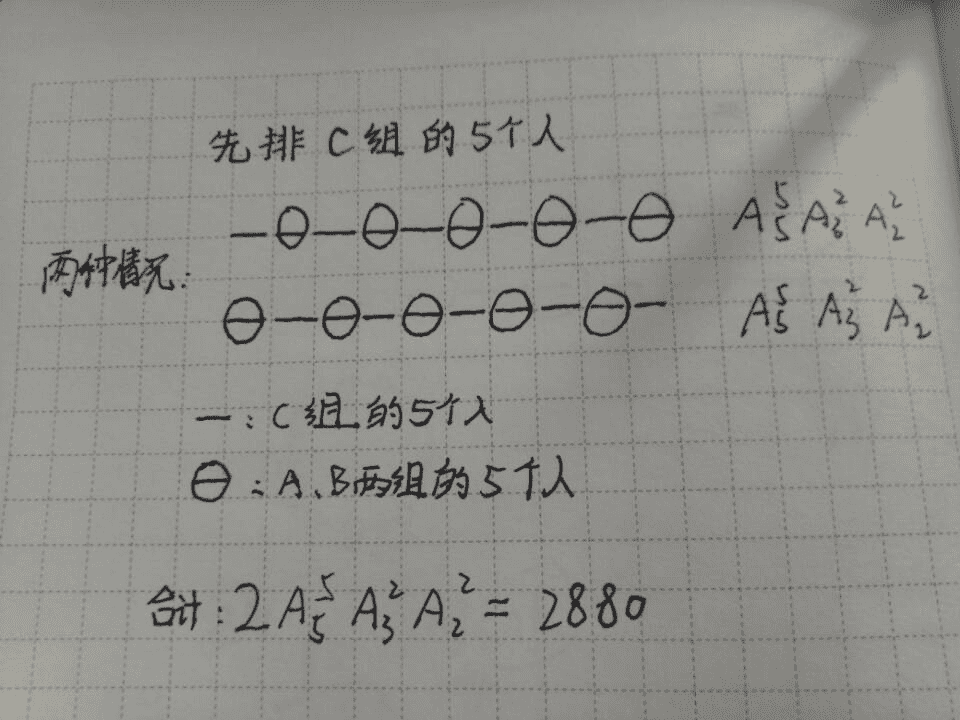
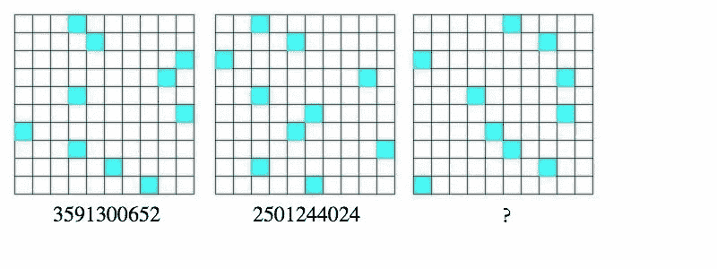
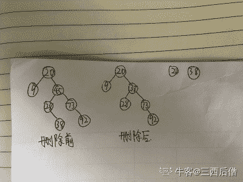
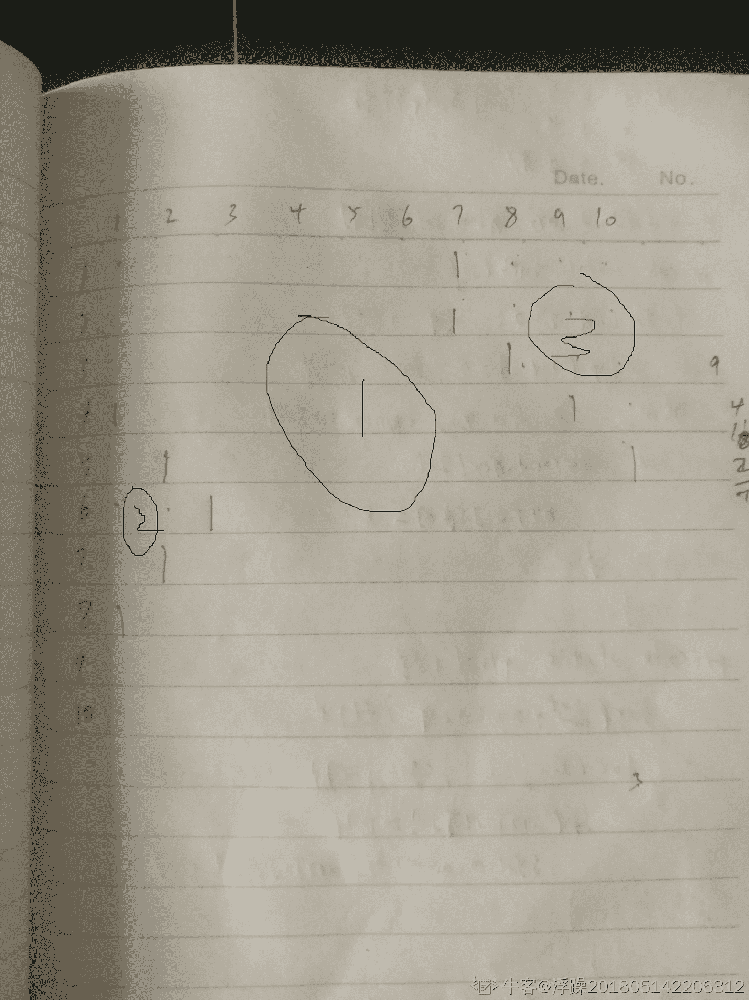

# 商汤科技 2018 校招 iOS 开发工程师笔试第一场

## 1

在 TCP/IP 协议集中，应用层的各种服务是在传输层所提供服务的基础上实现的，哪些应用层协议需要使用传输层的 TCP 协议建立连接？

正确答案: D   你的答案: 空 (错误)

```cpp
DNS、DHCP、FTP
```

```cpp
SMTP、FTP、RIP
```

```cpp
DHCP、FTP、TELNET
```

```cpp
TELNET、SMTP、HTTP
```

本题知识点

产品运营 商汤科技 前端工程师 iOS 工程师 Java 工程师 C++工程师 运维工程师 算法工程师 测试工程师 安卓工程师 基础数据网 IP 2018 数据挖掘工程师 大数据开发工程师 技术支持 产品 运营

讨论

[夜破晓](https://www.nowcoder.com/profile/569158339)

基于 TCP 的应用层协议有：POP3、SMTP（简单邮件传输协议）、TELNET（远程登陆协议）、HTTP（超文本传输协议）、HTTPS（超文本传输安全协议）、FTP（文件传输协议）
基于 UDP 的应用层协议：TFTP（简单文件传输协议）、RIP（路由信息协议）、DHCP（动态主机设置协议）、BOOTP（引导程序协议，DHCP 的前身）、IGMP（Internet 组管理协议）
基于 TCP 和 UDP 协议：DNS（域名系统）、ECHO（回绕协议）

发表于 2019-03-29 16:49:29

* * *

[Glenmy](https://www.nowcoder.com/profile/1933727)

基于 TCP 的应用层协议有：SMTP、TELNET、HTTP、FTP 基于 UDP 的应用层协议：DNS、TFTP（简单文件传输协议）、RIP（路由选择协议）、DHCP、BOOTP（是 DHCP 的前身）、IGMP（Internet 组管理协议）

发表于 2018-08-17 10:23:27

* * *

## 2

一个数据表 student(No, Name, Sex, Age, Dept)，以下不能完成对应操作的 sql 语句是？

正确答案: B   你的答案: 空 (错误)

```cpp
查询所有 14 岁到 18 岁之间的男学生，并输出他们的姓名和年龄：<br>Select Name, Age From<br>student Where sex = ‘male’ and age between 14 and 18
```

```cpp
查询所有姓名包含“妍”的学生：<br>Select * From student<br>Where name like “_ 妍%”
```

```cpp
统计表中学生涉及的院系个数：<br>Select<br>count（*）From (Select distinct Dept From student)
```

```cpp
统计表中不同系别的男生的平均年龄，并按从大到小排列：<br>Select Dept, avg(Age)<br>From student Where sex = ‘male’ Group by Dept Order by avg(Age)
```

本题知识点

产品运营 商汤科技 前端工程师 iOS 工程师 Java 工程师 C++工程师 运维工程师 算法工程师 测试工程师 安卓工程师 2018 数据挖掘工程师 大数据开发工程师 技术支持 产品 运营

讨论

[weiyinfu](https://www.nowcoder.com/profile/8575360)

这道题难道不应该选 D 吗？SQL 排序默认不是升序吗？可是这里却没有 DESC

发表于 2018-08-16 17:53:44

* * *

[小小白小可爱](https://www.nowcoder.com/profile/571599528)

_ 表示一个

发表于 2018-08-19 21:05:31

* * *

[爱在冬天晒太阳的懒虫](https://www.nowcoder.com/profile/3705909)

B 的下划线是对的吧？下划线表示一个字，%可以多个字。D 不对，order by 默认是升序，题干要求由大到小，应该要加上 desc

发表于 2019-03-19 18:51:19

* * *

## 3

⼀个完全⼆叉树中有 743 个节点, 则该⼆叉树中的叶子节点个数为？

正确答案: C   你的答案: 空 (错误)

```cpp
370
```

```cpp
371
```

```cpp
372
```

```cpp
以上都不对
```

本题知识点

产品运营 商汤科技 前端工程师 iOS 工程师 Java 工程师 C++工程师 运维工程师 算法工程师 测试工程师 安卓工程师 C++ C 2018 数据挖掘工程师 大数据开发工程师 技术支持 产品 运营

讨论

[helloworldli](https://www.nowcoder.com/profile/7418222)

n 层树的满二叉树结点为：2^n-1 第 n 层满二叉树的结点为：2^(n-1)512= 2⁹<743<2¹⁰ 所以满的有 9 层，第九层有：(2⁹-1)=256，第十层还有:743-(2⁹-1)=232232 个叶子结点有 116 个根节点所以树的叶子结点有：256-116+232=372

发表于 2019-02-21 22:36:24

* * *

[敬爱](https://www.nowcoder.com/profile/202158766)

笨一点的方法：1+2+4+8+16+32+64+128+256=511;743-511=232;232/2=116;256-116+232=372.

发表于 2018-08-30 11:12:46

* * *

[JFF201806281030161](https://www.nowcoder.com/profile/894599911)

假设节点从 1 开始编号，最后一个非叶子节点编号为 743/2=371,叶子节点数为 372 个

编辑于 2018-09-07 22:25:00

* * *

## 4

硬盘上有 2GB 数据(每项为一个无符号 64 位整型)，若想找出其中最大的前 500MB 数据，在只能使用 512MB 内存的前提下，下列算法最适合的是？

正确答案: D   你的答案: 空 (错误)

```cpp
红黑树
```

```cpp
快速排序
```

```cpp
插入排序
```

```cpp
堆排序
```

本题知识点

产品运营 商汤科技 前端工程师 iOS 工程师 Java 工程师 C++工程师 运维工程师 算法工程师 测试工程师 安卓工程师 2018 数据挖掘工程师 大数据开发工程师 技术支持 产品 运营

讨论

[谢三](https://www.nowcoder.com/profile/941875181)

怎么会堆排序 堆排序感觉内存不够啊

发表于 2018-08-20 12:28:44

* * *

[靠谱字节内推君](https://www.nowcoder.com/profile/32005208)

请问堆排序和快排，在这个题里面的区别在哪里呀？

发表于 2020-08-19 20:13:45

* * *

## 5

在一所中学，32％的学生踢足球，18％的学生踢足球且打篮球。如果该学校的一名学生踢足球，那么他也打篮球的可能性是？

正确答案: A   你的答案: 空 (错误)

```cpp
56%
```

```cpp
78%
```

```cpp
50%
```

```cpp
以上皆不是
```

本题知识点

产品运营 商汤科技 前端工程师 iOS 工程师 Java 工程师 C++工程师 运维工程师 算法工程师 测试工程师 安卓工程师 2018 数据挖掘工程师 大数据开发工程师 技术支持 产品 运营

讨论

[Zicon~](https://www.nowcoder.com/profile/5575625)

18/32 简化题目：学校有 100 个学生，其中 32 人踢足球，踢足球的 32 人中有 18 人同时打篮球，问一个踢足球的同学同时喜欢打篮球的概率——18/32

发表于 2018-08-20 09:56:05

* * *

[蒋晨曦](https://www.nowcoder.com/profile/341916762)

条件概率的公式：P(A|B)=P(AB)/P(B)，所以 18%/32%=56%

发表于 2018-08-27 13:27:57

* * *

[KendrickYu](https://www.nowcoder.com/profile/7443673)

按条件概率来说，难道不是 D?

发表于 2018-08-20 17:23:47

* * *

## 6

ABC 三个组分别有 2 个、3 个和 5 个人，三组一起出去团建，坐在一个圆桌吃饭，为了彼此熟悉，要求同组人不能邻座，共有 1 种排坐位的方法。

你的答案 (错误)

1 参考答案 (1) 2880

本题知识点

产品运营 商汤科技 前端工程师 iOS 工程师 Java 工程师 C++工程师 运维工程师 算法工程师 测试工程师 安卓工程师 2018 数据挖掘工程师 大数据开发工程师 技术支持 产品 运营

讨论

[WAK](https://www.nowcoder.com/profile/9358901)

C 组必须分开，所以是 5！，但是因为是圆桌，所以会重复，要除 5AB 组与 C 组穿插坐，且 C 组考虑重复，AB 组就不会重复，5！结果是 5！*5！/5 = 2880

发表于 2018-08-16 18:51:50

* * *

[竹叶花开，月影窗来](https://www.nowcoder.com/profile/7319880)



发表于 2019-02-27 10:16:26

* * *

[阿尔法二哈](https://www.nowcoder.com/profile/797545638)

我是这样想的。先排 C 组 C 组位置有 1，3，5，7，92，4，6，8，10 两种排法。C 组内部排序 5! B 组排序 3！A 组排序 2!加起来就是 2*5！*3!*2!=2880

发表于 2019-02-14 13:11:11

* * *

## 7

已知某实验室的 100 瓶试剂中有一瓶毒药，其余试剂无毒，混入任何剂量该毒药的溶液均可致死。现有无限量的白鼠供应，所有白鼠从摄入毒药至毒发身亡需要的时间相同。若需要在最短时间内找出毒药，则至少需要 1 只白鼠。

你的答案 (错误)

1 参考答案 (1) 7

本题知识点

产品运营 商汤科技 前端工程师 iOS 工程师 Java 工程师 C++工程师 运维工程师 算法工程师 测试工程师 安卓工程师 2018 数据挖掘工程师 大数据开发工程师 技术支持 产品 运营

讨论

[xxxxxxxxxxxxxxxa](https://www.nowcoder.com/profile/4397117)

[`blog.csdn.net/shaolianbo/article/details/8650061`](https://blog.csdn.net/shaolianbo/article/details/8650061)串行二分法，并行二分法，碰到这种题直接 logN 取上届

发表于 2018-08-21 09:40:19

* * *

[finedust](https://www.nowcoder.com/profile/311516697)

举个简单的例子：5 瓶饮料中一瓶有毒，需要几只小白鼠？转换为二进制饮料          小白鼠 1      001       12      010       23      011       1 24      100       35      101       1 3 把 1,3,5 混在一起给小白鼠 1 喝，2,3 混在一起给小白鼠 2 喝，4,5 混在一起给小白鼠 3 喝小白鼠 1 死，2,3 没死，那 1 号饮料有毒小白鼠 2 死，1,3 没死，那 2 号饮料有毒小白鼠 3 死，1,2 没死，那 4 号饮料有毒小白鼠 1,2 死，3 没死，那 3 号饮料有毒小白鼠 1,3 死，2 没死，那 5 号饮料有毒 100 的二进制是 1100100，所以要 7 只小白鼠

发表于 2019-05-07 22:38:04

* * *

[HyOner](https://www.nowcoder.com/profile/3369927)

这题目有问题吧, 保证最短时间, 小白鼠无限供应, 那不是一只喝一瓶吗? 100 只去喝只需要 1n 时长;如果删掉保证最短时间,求最少的小白鼠, 那就是 log2N 向上取整, 需要 7n 时长

发表于 2018-09-07 15:31:39

* * *

## 8

第三幅图为：1

你的答案 (错误)

1 参考答案 (1) 5201314479

本题知识点

产品运营 商汤科技 前端工程师 iOS 工程师 Java 工程师 C++工程师 运维工程师 算法工程师 测试工程师 安卓工程师 2018 数据挖掘工程师 大数据开发工程师 技术支持 产品 运营

讨论

[wangjian540955](https://www.nowcoder.com/profile/407687933)

从上到下，从左到右依次数绿格子前面或后面的格子数。当绿格子处于奇数行，数其前面的空格数；当绿格子处于偶数行，数其后面的空格数。

发表于 2018-09-09 09:13:58

* * *

[谢三](https://www.nowcoder.com/profile/941875181)

单数前列和双数后列

发表于 2018-08-20 12:30:33

* * *

[Sencer](https://www.nowcoder.com/profile/2329236)

10 行从下往下依次对应 10 个数字，10 列对应数字（0~9）从左边开始数或者从右边开始数，蓝色格子对应相应（0~9）中的数字。

发表于 2018-10-10 16:42:36

* * *

## 9

给定数组 [ 20,9,45,28,73,92,38 ] ，构造一棵 左子节点 < 父节点 < 右子节点 的二叉搜索树（Binary Search Tree）。把数字 45 删除，使用前序节点调整后，查询数字 38 需要 1 次。

你的答案 (错误)

1 参考答案 (1) 2

本题知识点

产品运营 商汤科技 前端工程师 iOS 工程师 Java 工程师 C++工程师 运维工程师 算法工程师 测试工程师 安卓工程师 2018 数据挖掘工程师 大数据开发工程师 技术支持 产品 运营

讨论

[夜破晓](https://www.nowcoder.com/profile/569158339)

二叉搜索树（二叉排序树/二叉查找树）：若它的左子树不空，则左子树上所有结点的值均小于它的根结点的值； 若它的右子树不空，则右子树上所有结点的值均大于它的根结点的值； 它的左、右子树也分别为二叉搜索树。按照数组顺序逐个插入，数的形态是固定的。被删除的结点左右子树都不为空时，用**前驱结点（前序节点调整）**或者**后继结点（后序节点调整）**代替被删除的结点位置，然后根据性质进行调整。前驱结点：左子树最大值（小于被删除结点的所有结点中的最大值）
后继结点：右子树最小值（大于被删除结点的所有结点中的最小值）

编辑于 2019-04-01 17:15:14

* * *

[三西后僧](https://www.nowcoder.com/profile/466672093)


为啥不是 2 次呢？20 和 38

发表于 2019-10-03 11:25:41

* * *

[weiyinfu](https://www.nowcoder.com/profile/8575360)

最后一次不比较了吗？

发表于 2018-08-16 17:56:45

* * *

## 10

请阅读以下代码和输入，写出程序的输出结果。代码：

```cpp
#include<iostream>
#include<string>
using namespace std;

const int MAX_SIZE = 1000;
int n, m, k;
int a[MAX_SIZE][MAX_SIZE];
int sum;

void dfs(int  x,  int  y) {
	++sum;
	a[x][y] = 1;
	if ((x > 1) && (a[x-1][y] == 0)) dfs(x - 1, y);
	if ((y > 1) && (a[x][y-1] == 0)) dfs(x, y - 1);
	if ((x < n) && (a[x+1][y] == 0)) dfs(x + 1, y);
	if ((y < m) && (a[x][y+1] == 0)) dfs(x, y + 1);
}

int main( ) {
	memset(a, 0, sizeof(a));
	cin >> n >> m >> k;
	for(int i = 1; i <= k; ++i) {
		int x, y;
		cin >> x >> y;
		a[x][y] = 1;
	}
	int ans = 0, ansp = 0;
	for (int i = 1; i <= n; ++i)
		for (int j = 1; j <= m; ++j)
			if (a[i][j] == 0) {
				++ansp;
				sum = 0;
				dfs(i, j);
				if (ans < sum) ans = sum;
			}
	cout << ans << " " << ansp << endl;
	return  0;
}
```

输入：

10 10 10

4 1

5 2

6 3

7 2

8 1

1 7

2 7

3 8

4 9

5 10 输出：1

你的答案 (错误)

1 参考答案 (1) 77 3

本题知识点

商汤科技 前端工程师 运维工程师 算法工程师 安卓工程师 2018 C++工程师 数据挖掘工程师 测试工程师 大数据开发工程师 Java 工程师 技术支持 产品 运营 iOS 工程师

讨论

[weiyinfu](https://www.nowcoder.com/profile/8575360)

这段程序要解决的是一个图像问题。有一张黑白图片（每个像素要么是黑色 0，要么是白色 1），问这张照片上有多少个黑***域？最大的黑***域包含多少个点？

发表于 2018-08-16 17:58:29

* * *

[浮躁 201805142206312](https://www.nowcoder.com/profile/7070776)

意为，寻找不为 1 的节点数，上下左右可以深搜，标记为 1 一共标记三次，ansp = 3 ans = 100 - 10 - 13 = 77

发表于 2020-02-28 15:13:41

* * *

[Fat-Tiger](https://www.nowcoder.com/profile/8187487)

应该是类似于岛屿问题，1 为陆地，包围住 0 就算一个岛，一共两个岛，分别求岛的面积

发表于 2019-09-01 00:22:42

* * *

## 11

2014 到 2016 年间，Apple 会在以下哪个大会上初次介绍最新版的 iOS？

正确答案: C   你的答案: 空 (错误)

```cpp
Macworld
```

```cpp
Apple Special Event in September
```

```cpp
WWDC
```

```cpp
CES
```

本题知识点

iOS 工程师 商汤科技 2018

## 12

以下哪个工具没有被包含在 Xcode 8 的 Instruments 中？

正确答案: B   你的答案: 空 (错误)

```cpp
Zombie Detection
```

```cpp
Code Coverage
```

```cpp
Time Profiler
```

```cpp
Energy Log
```

本题知识点

iOS 工程师 商汤科技 2018

## 13

iOS 中内置了什么数据库的支持？

正确答案: A   你的答案: 空 (错误)

```cpp
SQLite
```

```cpp
MySQL
```

```cpp
DB2
```

```cpp
Oracle
```

本题知识点

iOS 工程师 商汤科技 iOS 工程师 商汤科技 iOS 工程师 商汤科技 iOS 工程师 商汤科技 2018

## 14

以下哪个继承关系是正确的？

正确答案: C   你的答案: 空 (错误)

```cpp
UIButton-&gt;UIView-&gt;UIResponder-&gt;UIControl-&gt;NSObject
```

```cpp
UIButton-&gt;UIControl-&gt;UIResponder-&gt;UIView-&gt;NSObject
```

```cpp
UIButton-&gt;UIControl-&gt;UIView-&gt;UIResponder-&gt;NSObject
```

```cpp
以上答案都不正确
```

本题知识点

iOS 工程师 商汤科技 2018

## 15

以下那种传感器是 iPhone 7 不具备的？

正确答案: D   你的答案: 空 (错误)

```cpp
气压计
```

```cpp
磁力计
```

```cpp
加速计
```

```cpp
温度计
```

本题知识点

iOS 工程师 商汤科技 2018

## 16

在 iOS10 中关于 UIViewController 以下哪些说法是正确的？

正确答案: B C D   你的答案: 空 (错误)

```cpp
loadView 方法在 UIViewController 的整个生命周期中最多被调用一次
```

```cpp
从 App 界面通过 Home 按钮返回主界面时，viewDidDisappear 方法不会被调用
```

```cpp
从多任务界面上划退出某个 App 时，dealloc 方法不会被调用
```

```cpp
present<br>ViewController 时，completion handler 将在被 present 的 ViewController 的 viewDidAppear 方法调用后才被调用
```

本题知识点

iOS 工程师 商汤科技 2018

## 17

有关 Objective C 和 Swift 的 Automatic Reference Counting(ARC)机制，以下哪些说法是错误的？

正确答案: A C   你的答案: 空 (错误)

```cpp
使用 ARC 之后，不会再出现内存泄漏
```

```cpp
能否被回收不仅取决于实例本身是否仍有强引用，还和实例内成员变量是否存在强引用相关
```

```cpp
进行垃圾回收时，ARC 会从根节点开始遍历引用计数
```

```cpp
直接在 Objective C 的 block 和 Swift 的 closure 中使用 self 会产生对当前实例的强引用
```

本题知识点

iOS 工程师 商汤科技 2018 C 语言

讨论

[Despacito007](https://www.nowcoder.com/profile/893487814)

不会 Object C 的题应该和 C、C++的题分开...差得还是挺多的

发表于 2020-09-09 20:20:00

* * *

[LauZyHou](https://www.nowcoder.com/profile/8203811)

可以康康这个[`www.jianshu.com/p/b24b03647e20`](https://www.jianshu.com/p/b24b03647e20)

发表于 2020-08-04 08:07:52

* * *

## 18

以下哪些是 Objective C 和 Swift 中自带的数据类型？

正确答案: A B C D   你的答案: 空 (错误)

```cpp
NSArray
```

```cpp
NSDictionary
```

```cpp
NSSet
```

```cpp
NSUInteger
```

本题知识点

iOS 工程师 商汤科技 2018 C 语言

讨论

[牛客 506299977 号](https://www.nowcoder.com/profile/506299977)

这题是什么鬼

发表于 2020-09-30 10:38:14

* * *

[牛客 773320423 号](https://www.nowcoder.com/profile/773320423)

C 语言？

发表于 2021-02-24 11:34:31

* * *

## 19

关于 UITableViewCell 的说法，哪些是正确的？

正确答案: A C D   你的答案: 空 (错误)

```cpp
通过 reuseIdentifier 可实现 Cell 的重用
```

```cpp
TableView 滑动过程中，Cell 中的 Image 不会被加载
```

```cpp
通过重用 Cell，可以改善 TableView 滑动时的性能
```

```cpp
可以向 contentView 中添加 subviews 来自定义 Cell 的样式
```

本题知识点

iOS 工程师 商汤科技 2018

## 20

关于提交 App Store 审核，哪些说法是错误的？

正确答案: B C   你的答案: 空 (错误)

```cpp
会崩溃或有 Bug 的 App 会被 Reject
```

```cpp
Apple 的审核团队会在 7 天内完成审核
```

```cpp
不兼容 IPv6 的应用仅能在中国区上架
```

```cpp
使用非 Public API 的 App 有可能无法通过审核
```

本题知识点

iOS 工程师 商汤科技 2018

## 21

请补全以下代码完成冒泡排序。

```cpp
Objective C:
@implementation NSMutableArray (BubbleSort)
#pragma mark - Bubble sort
- (NSMutableArray *)bubbleSortUsingSelector:(SEL)comparator
{
    NSUInteger count = [self count];

    // Write your code here

    return self;
}
@end
```

你的答案

本题知识点

iOS 工程师 商汤科技 2018

## 22

请补全以下代码生成指定长度，内容随机的字符串。

```cpp
@implementation NSString (RandomString)
#pragma mark - Random String
+ (NSString *)randomStringWithLength:(NSUInteger)length
{
    static char const possibleChars[] = "ABCDEFGHIJKLMNOPQRSTUVWXYZabcdefghijklmnopqrstuvwxyz0123456789 !@#$%^&*()_-/?;:+=[]|~<>";

    // Write your code here

}
@end
```

你的答案

本题知识点

iOS 工程师 商汤科技 2018

## 23

给定 k 个有序数组, 每个数组有个 N 个元素，找出一个最小的闭区间，使其包含每个数组中的至少一个元素。 给定两个区间[a,b], [c,d]： 如果 b-a < d-c，则认为[a, b]是更小的区间；如果 b-a == d-c，且 a < c，则认为[a, b]是更小的区间。

本题知识点

Java 工程师 iOS 工程师 C++工程师 运维工程师 安卓工程师 算法工程师 前端工程师 产品运营 PHP 工程师 商汤科技 测试工程师 数组 贪心 堆 2018 数据挖掘工程师 大数据开发工程师 技术支持 产品 运营

讨论

[LFA_BOX](https://www.nowcoder.com/profile/828483359)

```cpp
import java.util.Scanner;

/**
 * Created by SeanSeanSean on 2018/8/17.
 * 商汤科技
 * 最小区间 
  * 直接最笨的方法，每次把最小的那个数往前推一个，计算相差值，若比之前小进行记录。
 */
public class Main {
    public static void main(String[] args){
        Scanner sc = new Scanner(System.in);
        while (sc.hasNext()){
            int k = sc.nextInt();
            int n = sc.nextInt();
            int[][] array = new int[k][n];
            for (int i = 0; i < k; i++){
                for (int j = 0; j < n; j++){
                    array[i][j] = sc.nextInt();
                }
            }
            int[] loc = new int[k];
            int[] val = new int[k];
            for (int i = 0; i < k; i++){
                loc[i] = 0;
                val[i] = array[i][loc[i]];
            }
            int temp = Integer.MAX_VALUE;
            int down = 0;
            int up = 0;

            while (true){
                int max_val = Integer.MIN_VALUE;
                int min_val = Integer.MAX_VALUE;
                int max_loc = -1;
                int min_loc = -1;
                for (int i = 0; i < k; i++){
                    if(val[i] > max_val) {
                        max_val = val[i];
                        max_loc = i;
                    }
                    if(val[i] < min_val){
                        min_val = val[i];
                        min_loc = i;
                    }
                }
                if(max_val - min_val < temp){
                    down = min_val;
                    up = max_val;
                    temp = max_val-min_val;
                }
                loc[min_loc]++;
                if (loc[min_loc] == n){
                    break;
                }
                else
                    val[min_loc] = array[min_loc][loc[min_loc]];
            }
            System.out.println(down + " " + up);
        }
    }
}

```

发表于 2018-08-17 15:16:51

* * *

[weiyinfu](https://www.nowcoder.com/profile/8575360)

首先，这道题看上去就会让人想到多路归并，多路归并中用到的主要组件就是优先队列。在这个问题中依旧可以用优先队列。从优先队列中依次弹出元素，把弹出的元素放到另一个“组件”里面，这个组件有如下特性：

1.  是一个队列，容纳从优先队列里面弹出来的元素
2.  因为优先队列是有序的，所以这个容器也是有序的
3.  对于这个队列，如果队首的元素不能充分代表它所在的数组（K 个数组中的一个），那么这个队首元素就应该出队了

这个容器是什么呢？单调队列。单调队列还需要一个辅助数组 inqCount，inqCoount[i]表示第 i 个数组在队列中的元素的个数，这个数组用来出队。每次入队之后，执行：弹出队首元素、计算区间（区间就是单调队列的队首和队尾组成的区间）。

```cpp

```
import java.util.*;  public class Main { class Point { int x, k, index;   Point(int x, int k, int index) {  this.x = x;  this.k = k;  this.index = index; }
} Main() {
    Scanner cin = new Scanner(System.in); int K = cin.nextInt(); int N = cin.nextInt();  PriorityQueue<Point> q = new PriorityQueue<>(Comparator.comparing(x -> x.x)); for (int i = 0; i < K; i++) { for (int j = 0; j < N; j++) { int x = cin.nextInt();  q.add(new Point(x, i, j));  }
    }  int[] inqCount = new int[K];  Queue<Point> qq = new LinkedList<>();//单调队列  int nonzeroCount = 0; int ans = Integer.MAX_VALUE; int beg = 0, end = 0; boolean startCheck = false;//是否开始覆盖  while (!q.isEmpty()) {
        Point now = q.poll();  qq.add(now);  inqCount[now.k]++; if (inqCount[now.k] == 1) {
            nonzeroCount++; if (nonzeroCount == K) {
                startCheck = true;  }
        } //弹出无用元素  while (!qq.isEmpty() && inqCount[qq.peek().k] > 1) {
            inqCount[qq.peek().k]--;  qq.poll();  } if (startCheck) { int minValue = qq.peek().x; int nowAns = now.x - minValue; if (nowAns < ans) {
                ans = nowAns;  beg = minValue;  end = now.x;  }
        }
    }
    System.out.println(beg + " " + end); } public static void main(String[] args) { new Main(); }
}
```cpp

```

编辑于 2020-06-21 14:03:43

* * *

[WAK](https://www.nowcoder.com/profile/9358901)

通过 90%，提示超时思路 1：首先把 K 个数组中的元素多路归并按升序排成一个数组，保留值和原数组信息。然后通过两个指针 begin 和 end 从位置 0 开始动态得向后移动，判断 begin 和 end 之间是否满足包含每个数组至少一个元素，若满足，则 begin 后移，若不满足，则 end 后移，直到 begin 和 end 到数组尾部。在条件满足的情况下，维护一个 start、final、length，作为最后的结果输出。AC，将多路归并中的比较用优先队列实现，将 O(k)改为 O(logk)，解决超时问题

```cpp

	//思路 1

	#include<bits/stdc++.h>
using namespace std;
struct pt{
    int x;
    int pos;
    pt(int a,int b):x(a),pos(b){}
};
int main(){
    int k,n;
    while(cin>>k>>n){
        vector<vector<int>>all;  //原始数据
        vector<int> vec;         //多路归并时，每个数组中的位置
        for(int i = 0;i<k;i++){
            vector<int>temp;
            for(int j = 0;j<n;j++){
                int x;
                cin>>x;
                temp.push_back(x);
            }
            all.push_back(temp);
            vec.push_back(0);
        }
        vector<pt> sort;   //多路归并后的有序数组，保存值和原数组信息
        int sum = 0;
        while(sum!=k*n){   //多路归并
            int min = INT_MAX;
            int pos = 0;
            for(int i = 0;i<vec.size();i++){
                if(vec[i]<n&&all[i][vec[i]]<min){
                    min = all[i][vec[i]];
                    pos = i;
                }
            }
            vec[pos]++;
            pt temp(min,pos);
            sort.push_back(temp);
            sum++;
        }
        for(int i = 0;i<vec.size();i++)
            vec[i] = 0;    //保存动态范围内含有各数组值的个数
        int begin = 0;     //动态范围左
        int end = 0;       //动态范围右
        int start = 0;     //符合条件的范围左
        int final = 0;     //符合条件的范围右
        int length = INT_MAX;  //符合条件的最短长度
        bool flg = false;
        vec[sort[0].pos]++;
        while(begin<sort.size()-1||end<sort.size()-1){
            bool flgg = true;
            for(int i = 0;i<k;i++)
                flgg = flgg&&(vec[i]>=1);     //判断是否满足包含每个数组至少一个元素
            if(!flgg&&end<sort.size()){       //不满足，end++
                if(end<sort.size()-1)
                    end++;
                vec[sort[end].pos]++;

            }
            if(!flgg&&end==sort.size()-1)      //不满足且 end 到尾部，跳出循环
                break;
            if(flgg&&begin<sort.size()){       //满足，begin++
                int x = sort[end].x-sort[begin].x;
                if(x<length){          //更新 start，final，length
                    start = sort[begin].x;
                    final = sort[end].x;
                    length = x;
                }
                vec[sort[begin].pos]--;
                if(begin<sort.size()-1)
                    begin++;
            }
            int a = 1;
        }
        cout<<start<<" "<<final<<endl;   //输出结果
    }
    system("pause");
    return 0;
}

	//思路 2，用优先队列去实现多路归并

	#include<bits/stdc++.h>
using namespace std;
struct pt{
    int x;
    int pos;
    pt(int a,int b):x(a),pos(b){}
};
struct cmp{        //重写比较函数
    bool operator()(const pt a,const pt b){
        return a.x>b.x;
    }
};
int main(){
    int k,n;
    while(cin>>k>>n){
        vector<vector<pt>>all;
        vector<int> vec;
        for(int i = 0;i<k;i++){
            vector<pt>temp;
            for(int j = 0;j<n;j++){
                int x;
                cin>>x;
                pt p(x,i);
                temp.push_back(p);
            }
            all.push_back(temp);
            vec.push_back(0);
        }
        vector<pt> sort;
        priority_queue<pt,vector<pt>,cmp> qu; //优先队列
        for(int i = 0;i<k;i++)
            qu.push(all[i][0]);
        while(!qu.empty()){
            pt temp = qu.top();
            qu.pop();
            sort.push_back(temp);
            vec[temp.pos]++;
            if(vec[temp.pos]<=n-1){
                qu.push(all[temp.pos][vec[temp.pos]]);
            }
        }
        for(int i = 0;i<vec.size();i++)
            vec[i] = 0;
        int begin = 0;
        int end = 0;
        int start = 0;
        int final = 0;
        int length = INT_MAX;
        bool flg = false;
        vec[sort[0].pos]++;
        while(begin<sort.size()-1||end<sort.size()-1){
            bool flgg = true;
            for(int i = 0;i<k;i++)
                flgg = flgg&&(vec[i]>=1);
            if(!flgg&&end<sort.size()){
                if(end<sort.size()-1)
                    end++;
                vec[sort[end].pos]++;
            }
            if(!flgg&&end==sort.size()-1)
                break;
            if(flgg&&begin<sort.size()){
                int x = sort[end].x-sort[begin].x;
                if(x<length){
                    start = sort[begin].x;
                    final = sort[end].x;
                    length = x;
                }
                vec[sort[begin].pos]--;
                if(begin<sort.size()-1)
                    begin++;
            }
            int a = 1;
        }
        cout<<start<<" "<<final<<endl;
    }
    system("pause");
    return 0;
}

```

编辑于 2018-08-16 20:02:31

* * *