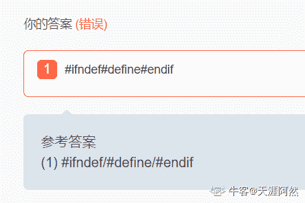

# 商汤科技 2018 校招 GPU 优化工程师笔试第一场

## 1

下列哪两条指令构成 RAW 型依赖关系？

正确答案: B   你的答案: 空 (错误)

```cpp
a = b + c;<br>a = c + d;
```

```cpp
a = b + c;<br>d = a + c;
```

```cpp
a = b + c;<br>d = b + c;
```

```cpp
a = b + c;<br>b = c + d;
```

本题知识点

Java 工程师 C++工程师 商汤科技 安卓工程师 运维工程师 算法工程师 2018 嵌入式工程师

讨论

[GeeFlipped](https://www.nowcoder.com/profile/202772207)

RAW(read after write): 写后读关系先写 a,之后再在 d=a+c 时读 a

编辑于 2019-10-05 11:23:20

* * *

## 2

对于乱序执行的处理器，下列哪个流水线阶段是乱序执行的？

正确答案: C   你的答案: 空 (错误)

```cpp
取址/译码
```

```cpp
寄存器重命名
```

```cpp
指令执行
```

```cpp
指令退休
```

本题知识点

Java 工程师 C++工程师 商汤科技 安卓工程师 运维工程师 算法工程师 2018 嵌入式工程师

讨论

[不知道该写啥](https://www.nowcoder.com/profile/434580324)

乱序执行（out-of-order execution）是指 CPU 采用了允许将多条指令不按程序规定的顺序分开发送给各相应电路单元处理的技术。比方 Core 乱序执行引擎说程序某一段有 7 条指令，此时 CPU 将根据各单元电路的空闲状态和各指令能否提前执行的具体情况分析后，将能提前执行的指令立即发送给相应电路执行。   来自百度百科。

发表于 2019-08-03 20:46:05

* * *

[Bzaa](https://www.nowcoder.com/profile/873062710)

C

发表于 2020-06-09 15:46:58

* * *

## 3

关于 NUMA 架构，下列描述正确的是

正确答案: A   你的答案: 空 (错误)

```cpp
相对 SMP 对称多处理架构，NUMA 架构的提出，是为了改善内存带宽的可扩展性。
```

```cpp
CPU 访问 NUMA 多个远端节点内存的延迟都相同，且都大于访问本地节点的内存延迟。
```

```cpp
一颗 CPU 修改了共享的内存位置，需要广播给所有其他 CPU。
```

```cpp
计算密集型应用相对内存密集型应用可以从 NUMA 架构获得更多的性能提升。
```

本题知识点

Java 工程师 C++工程师 商汤科技 安卓工程师 运维工程师 算法工程师 2018 嵌入式工程师

讨论

[不知道该写啥](https://www.nowcoder.com/profile/434580324)

**非统一内存访问架构**（英语：**Non-uniform memory access**，简称 NUMA）是一种为[多处理器](https://zh.wikipedia.org/wiki/%E5%A4%9A%E8%99%95%E7%90%86%E5%99%A8)的计算机设计的内存架构，内存访问时间取决于内存相对于处理器的位置。在 NUMA 下，处理器访问它自己的本地内存的速度比非本地内存（内存位于另一个处理器，或者是处理器之间共享的内存）快一些。

非统一内存访问架构的特点是：被共享的内存物理上是分布式的，所有这些内存的集合就是全局[地址空间](https://zh.wikipedia.org/wiki/%E5%9C%B0%E5%9D%80%E7%A9%BA%E9%97%B4)。所以处理器访问这些内存的时间是不一样的，显然访问本地内存的速度要比访问全局共享内存或远程访问外地内存要快些。另外，NUMA 中内存可能是分层的：本地内存，群内共享内存，全局共享内存。

发表于 2019-08-03 20:47:30

* * *

## 4

下面伪代码程序：

Class Base

构造函数：Base(int i) { std::cout << i; }

Class Base1: virtual public Base

构造函数：Base1(int i, int j=0) : Base(j) { std::cout << i; }

Class Base2: virtual public Base

构造函数：Base2(int i, int j=0) : Base(j) { std::cout << i; }

Class MM : public Base2, public Base1

构造函数：MM(int a, int b, int c, int d) : mem1(a), mem2(b), Base1(c),Base2(d),Base(a)

                                { std::cout << b; }

 成员变量：

                     Base2 mem2;

                     Base1 mem1;

那么析构对象 MM objD (1, 2, 3, 4)的输出为

正确答案: C   你的答案: 空 (错误)

```cpp
134122
```

```cpp
123412
```

```cpp
14302012
```

```cpp
143212
```

本题知识点

Java 工程师 C++工程师 商汤科技 安卓工程师 运维工程师 算法工程师 2018 嵌入式工程师

讨论

[森屿暖树 201802011539172](https://www.nowcoder.com/profile/3629075)

建立 Derived 类对象 objD(1, 2, 3, 4)，首先调用[构造函数](https://www.baidu.com/s?wd=%E6%9E%84%E9%80%A0%E5%87%BD%E6%95%B0&tn=SE_PcZhidaonwhc_ngpagmjz&rsv_dl=gh_pc_zhidao)Derived(int a, int b, int c, int d) : mem1(a), mem2(b), Base1(c), Base2(d), Base(a) { cout << b; }
在[构造函数](https://www.baidu.com/s?wd=%E6%9E%84%E9%80%A0%E5%87%BD%E6%95%B0&tn=SE_PcZhidaonwhc_ngpagmjz&rsv_dl=gh_pc_zhidao)Derived 中先调用虚基类 Base 的[构造函数](https://www.baidu.com/s?wd=%E6%9E%84%E9%80%A0%E5%87%BD%E6%95%B0&tn=SE_PcZhidaonwhc_ngpagmjz&rsv_dl=gh_pc_zhidao)，即 Base(a)，将 a 的值 1 传给 i，（Base(int i) { cout << i;）输出 i 值为 1
然后根据声明顺序（class Derived : public Base2, public Base1 ）Base2 在前，接着调用 Base2(d)，将 d 的值传给 i，（Base2(int i, int j=0) : Base(j) { cout << i; }）输出 i 值为 4，由于 Base 为虚基类，只有最远端派生类构造函数 Derived 才能调用虚基类的构造函数，该派生类的其他基类对虚基类构造函数的调用被忽略，所以系统不会做 : Base(j)
再调用 Base1(c), 将 c 的值传给 i，（Base1(int i, int j=0) : Base(j) { cout << i; }），输出 i 值为 3，同理系统不做: Base(j)
然后根据对象成员声明顺序（Base2 mem2; Base1 mem1;）先做 mem2(b), 即调用构造函数 Base2(int i, int j=0) : Base(j) { cout << i; }，在 Base2 构造函数中需要先调用 Base 构造函数，把 j=0 传值给 i，（Base(int i) { cout << i;）输出 i 值为 0，再将 b=2 的值传给构造函数 Base2 中的 i，输出 i 值为 2
接着做 mem1(a)，同 mem2(b)，调用 Base1 构造函数时先调用 Base 构造函数，输出 i 值为 0，再将,a=1 的值传给构造函数 Base1 中的 i，输出 i 值为 1
最后做构造函数 Derived 中的{ cout << b; }，输出 b 值为 2
结果：14302012

发表于 2019-08-24 15:44:02

* * *

[牛客 867806844 号](https://www.nowcoder.com/profile/867806844)

他这问得让人疑惑，析构？让人以为析构 objD 对象的时候应该输出什么。

发表于 2021-07-13 17:47:28

* * *

## 5

关于 this 指针使用说法错误的是

正确答案: D   你的答案: 空 (错误)

```cpp
当创建一个对象后，this 指针就指向该对象
```

```cpp
成员函数拥有 this 指针
```

```cpp
静态成员函数不拥有 this 指针
```

```cpp
保证基类公有成员在子类中可以被访问
```

本题知识点

Java 工程师 C++工程师 商汤科技 安卓工程师 运维工程师 C++ 算法工程师 2018 嵌入式工程师 牛客

讨论

[万事顺遂~](https://www.nowcoder.com/profile/962411535)

this 指针是一个隐含指针，它隐含于每个类的非静态成员函数中。this 指针是成员函数所属的对象指针，它指向当前类的对象地址。通过 this 指针访问当前对象成员有两种方式：(*this).成员，this-＞成员。

发表于 2019-06-04 13:54:35

* * *

[牛壮壮](https://www.nowcoder.com/profile/764544521)

this 指针是一个隐含指针，它隐含于每个类的非静态成员函数中。this 指针是成员函数所属的对象指针，它指向当前类的对象地址。通过 this 指针访问当前对象成员有两种方式：(*this).成员，this-＞成员。

发表于 2022-02-10 10:39:53

* * *

## 6

程序的局部变量存在于 1 中，全局变量存在于 2 中，动态申请数据存在于 3 中，变量放在堆区与栈区的区别是 4。

你的答案 (错误)

1234 参考答案 (1) 栈
(2) 静态区
(3) 堆
(4) 从申请方式，申请大小，申请效率简单比较：Stack 的空间由操作系统自动分配/释放，Heap 上的空间手动分配/释放。Stack 空间有限，Heap 是很大的自由存储区。Stack 申请效率高，Heap 申请效率低。

本题知识点

Java 工程师 C++工程师 商汤科技 安卓工程师 运维工程师 算法工程师 2018 嵌入式工程师

讨论

[дракон](https://www.nowcoder.com/profile/9399923)

(1) 栈
(2) 静态区
(3) 堆
(4) 从申请方式，申请大小，申请效率简单比较：Stack 的空间由操作系统自动分配/释放，Heap 上的空间手动分配/释放。Stack 空间有限，Heap 是很大的自由存储区。Stack 申请效率高，Heap 申请效率低。第四个能对上才怪了，（1），（3）后面别跟区字，淦

发表于 2020-10-04 11:03:56

* * *

[牛壮壮](https://www.nowcoder.com/profile/764544521)

(1) 栈
(2) 静态区
(3) 堆
(4) 从申请方式，申请大小，申请效率简单比较：Stack 的空间由操作系统自动分配/释放，Heap 上的空间手动分配/释放。Stack 空间有限，Heap 是很大的自由存储区。Stack 申请效率高，Heap 申请效率低。

发表于 2022-02-10 10:40:30

* * *

[牛客 422597906 号](https://www.nowcoder.com/profile/422597906)

第一个写堆栈也算错吗？C 语言里堆栈=栈啊

发表于 2022-01-09 00:29:43

* * *

## 7

请写一个严谨的宏”MAX”，返回两个参数中较大的一个：1

你的答案 (错误)

1 参考答案 (1) #define MAX(AB) (A>B?A:B)

本题知识点

Java 工程师 C++工程师 商汤科技 安卓工程师 运维工程师 算法工程师 2018 嵌入式工程师

讨论

[Pierrick](https://www.nowcoder.com/profile/426390273)

#define Max(a,b) (((a)>(b))?:(a):(b))

编辑于 2019-11-08 15:52:47

* * *

[ChoiGamFai](https://www.nowcoder.com/profile/436343690)

#define MAX(A,B) ((A)>(B)?(A):(B))

发表于 2021-12-23 12:15:56

* * *

[GGGG222](https://www.nowcoder.com/profile/948333164)

#define MAX(a,b) (a>b)?a:b

发表于 2019-09-25 16:19:50

* * *

## 8

如何防止头文件被重复引用：1

你的答案 (错误)

1 参考答案 (1) #ifndef/#define/#endif

本题知识点

Java 工程师 C++工程师 商汤科技 安卓工程师 运维工程师 算法工程师 2018 嵌入式工程师

讨论

[牛客 320316989 号](https://www.nowcoder.com/profile/320316989)

#pragma once 也可以啊

发表于 2020-04-29 03:00:38

* * *

[天涯阿然](https://www.nowcoder.com/profile/249036225)

为什么要加斜杠？

发表于 2022-03-03 11:13:49

* * *

[C_CHERISH_Y｛｝](https://www.nowcoder.com/profile/877796991)

#ifndef #define #endif

发表于 2022-02-17 17:32:01

* * *

## 9

以下代码打印出的是：1

```cpp
char *p = new char[10]; 
printf("%d\n", sizeof(p)); 
```

你的答案 (错误)

1 参考答案 (1) 4

本题知识点

Java 工程师 C++工程师 商汤科技 安卓工程师 运维工程师 算法工程师 2018 嵌入式工程师

讨论

[秋天里的屁颠虫](https://www.nowcoder.com/profile/221440822)

char  *p = new  char[10]是一个指向 10 个 char 的指针，p+1 与 p 的差了 10 个 char 的地址空间，sizeof（p）=4 或 8（取决于机器的位数）char p[10]是 p 数组，p+1 与 p 差了一个 char，sizeof（p）=10（对数组名使用 sizeof 函数是求数组长度乘以数据类型字节数），sizeof（*p）=1（p 指向地址数据类型的字节数）

编辑于 2018-11-30 15:17:47

* * *

[秃头师](https://www.nowcoder.com/profile/792930305)

不应该要考虑全面  32 64 位系统

发表于 2020-08-01 10:14:36

* * *

[GGGG222](https://www.nowcoder.com/profile/948333164)

32 位系统下，指针都是占用 4 个字节

发表于 2019-09-25 16:23:56

* * *

## 10

若一组记录的排序码为（32, 1, 52, 25, 88, 56），则利用快排的方法从小到大排序，以第一个记录为基准得到的一次划分结果为：1

你的答案 (错误)

1 参考答案 (1) 25,1,32,52,88,56

本题知识点

Java 工程师 C++工程师 商汤科技 安卓工程师 运维工程师 算法工程师 2018 嵌入式工程师

讨论

[嵌入式小小小小菜鸟](https://www.nowcoder.com/profile/675897137)

（32, 1, 52, 25, 88, 56）以 32 为基准，第一次 1 比 32 小——>（1, 32, 52, 25, 88, 56）第二次 52 大于 32 的不动——>（1, 32, 52, 25, 88, 56）第三次 25 小于 32——>（25，1, 32, 52, 88, 56）后面都比 32 大，所以第一轮排序完就是 25，1, 32, 52, 88, 56

发表于 2020-08-06 16:05:18

* * *

[Pierrick](https://www.nowcoder.com/profile/426390273)

（32, 1, 52, 25, 88, 56）以第一个数为基准，小的挨个往左，大的挨个往右，从左往右挨个操作。1,32,52,25,88,561,32,52,25,88,56 ...25,1,32,52,88,56

发表于 2019-11-08 16:30:40

* * *

[求上岸丫丫丫丫](https://www.nowcoder.com/profile/195850452)

（25，1，32，52，88，56）  我是这样写的 就错了 莫名奇妙的

发表于 2019-08-18 00:21:55

* * *

## 11

请完成矩阵转置的 cuda 实现，并进行优化。答题说明：该题为手动判卷，答案只要写对即可，不用严格满足字符比对。

你的答案

本题知识点

运维工程师 算法工程师 商汤科技 2018

讨论

[liubaoyong](https://www.nowcoder.com/profile/76243743)

__global__  matrixtrans(int* A, int* C, int row, int col){    __shared__ int tile[BLOCKDIM][BLOCKDIM + 1];    int tx = threadIdx.x;     int ty= threadIdx.y;    int xindex = threadIdx.x + BLOCKDIM* blockIdx.x;    int yindex = threadIdx.y + BLOCKDIM* blockIdx.y;
    if(xindex < col&&yindex < row)    {          indata = xindex + BLOCKDIM*yindex;    tile[ty][tx]= A[indata];    }    __syncthreads();
    xindex = threadIdx.y + BLOCKDIM* blockIdx.x;yindex = threadIdx.x + BLOCKDIM* blockIdx.y;     if(xindex < row&&yindex < col)    {           outdata = xindex + BLOCKDIM*yindex;    C[outdata] = tile[tx][ty];    }}

发表于 2019-05-05 16:30:57

* * *

## 12

请完成矩阵乘法的 cuda 实现，并进行优化。答题说明：该题为手动判卷，答案只要写对即可，不用严格满足字符比对。

你的答案

本题知识点

运维工程师 算法工程师 商汤科技 2018

讨论

[打个酱油](https://www.nowcoder.com/profile/4307763)

//GEMM [`devblogs.nvidia.com/cutlass-linear-algebra-cuda/`](https://devblogs.nvidia.com/cutlass-linear-algebra-cuda/) __global__ void shMatMul_Kernel(int matrixSize, float* matrixA, float* matrixB, float* matrixC,int TILE_WIDTH){
    extern __shared__ float sh_Mem[];
    float* sh_MatrixA = &(sh_Mem[0]);
    float* sh_MatrixB = &(sh_Mem[TILE_WIDTH*TILE_WIDTH]);

    int tx = threadIdx.x;
    int ty = threadIdx.y;
    int Col = blockIdx.x * TILE_WIDTH + tx;
    int Row = blockIdx.y * TILE_WIDTH + ty;
    int elementId = Row * matrixSize + Col;
    float Pvalue = 0;

    for (int m = 0; m < (matrixSize-1) / TILE_WIDTH + 1; m++)
    {
        sh_MatrixA[ty*TILE_WIDTH + tx] =  Row < matrixSize && m*TILE_WIDTH + tx < matrixSize ? matrixA[Row*matrixSize + (m*TILE_WIDTH + tx)] : 0;
        sh_MatrixB[ty*TILE_WIDTH + tx] = Col < matrixSize && m*TILE_WIDTH + ty < matrixSize  ? matrixB[(m*TILE_WIDTH + ty)*matrixSize + Col] : 0;
        __syncthreads();
        for (int k = 0; k < TILE_WIDTH; k++)
        {
            Pvalue += sh_MatrixA[ty*TILE_WIDTH + k] * sh_MatrixB[k*TILE_WIDTH + tx];
        }
        __syncthreads();
    }
    if (Row < matrixSize && Col < matrixSize)
    {
        matrixC[elementId] = Pvalue;
    }
    return;
}

发表于 2019-12-27 02:51:02

* * *

## 13

请完成矩阵向量乘的 cuda 实现，并进行优化。答题说明：该题为手动判卷，答案只要写对即可，不用严格满足字符比对。

你的答案

本题知识点

运维工程师 算法工程师 商汤科技 2018