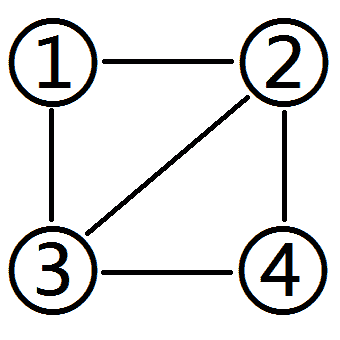
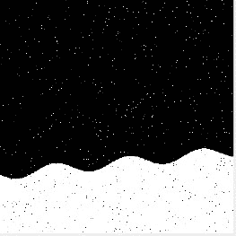

# 商汤科技 2018 校招研究员笔试第一场

## 1

S 市 A,B 共有两个区，人口比例为 3:5，据历史统计 A 的犯罪率为 0.01%，B 区为 0.015%，现有一起新案件发生在 S 市，那么案件发生在 A 区的可能性为：

正确答案: C   你的答案: 空 (错误)

```cpp
37.5%
```

```cpp
32.5%
```

```cpp
28.6%
```

```cpp
26.1%
```

本题知识点

Java 工程师 C++工程师 安卓工程师 Java 工程师 C++工程师 安卓工程师 Java 工程师 C++工程师 安卓工程师 Java 工程师 C++工程师 安卓工程师 Java 工程师 C++工程师 安卓工程师 Java 工程师 C++工程师 安卓工程师 Java 工程师 C++工程师 安卓工程师 算法工程师 商汤科技 2018

讨论

[lmcljj](https://www.nowcoder.com/profile/115323547)

(0.01×3)/(0.01×3+0.015×5)

发表于 2018-08-18 18:16:11

* * *

[风一样的孩子](https://www.nowcoder.com/profile/993341291)

贝叶斯公式

发表于 2018-09-07 10:26:34

* * *

## 2

用 OpenCV 可以方便的将彩色图片转为灰度图，如 cvtColor(imgColor, imgGray, CV_BGR2GRAY)。请问这里彩色到灰度的转换公式是以下哪种：

正确答案: B   你的答案: 空 (错误)

```cpp
gray=(R+G+B)/3
```

```cpp
gray=0.299R+0.587G+0.114*B
```

```cpp
gray=max(R,G,B)
```

```cpp
gray=(max(R,B,B)+min(R,G,B))/2
```

本题知识点

Java 工程师 C++工程师 安卓工程师 算法工程师 商汤科技 2018

讨论

[蜗牛 201808310809922](https://www.nowcoder.com/profile/442146821)

就是这样

发表于 2020-12-13 11:48:09

* * *

[HappyCoding](https://www.nowcoder.com/profile/2606039)

*   函数功能及参数

void cvtColor(InputArray src, OutputArray dst, int code, int dstCn=0 );
参数解释：
. InputArray src: 输入图像即要进行颜色空间变换的原图像，可以是 Mat 类
. OutputArray dst: 输出图像即进行颜色空间变换后存储图像，也可以 Mat 类
. int code: 转换的代码或标识，即在此确定将什么制式的图片转换成什么制式的图片
. int dstCn = 0: 目标图像通道数，如果取值为 0，则由 src 和 code 决定
功能：将一个图像从一个颜色空间转换到另一个颜色空间，但是从 RGB 向其他类型转换时，必须明确指出图像的颜色通道

*   彩色图 RGB(R，G，B)转灰度图的方法：

1.浮点算法：Gray=R*0.3+G*0.59+B*0.112.整数方法：Gray=(R*30+G*59+B*11)/100
3.移位方法：Gray =(R*28+G*151+B*77)>>8;
4.平均值法：Gray=（R+G+B）/3;
5.仅取绿色：Gray=G；

编辑于 2019-02-20 19:00:08

* * *

[ShawDa](https://www.nowcoder.com/profile/6312101)

对于彩色转灰度，有一个很著名的心理学公式：

                          Gray = R*0.299 + G*0.587 + B*0.114

发表于 2018-09-07 16:34:09

* * *

## 3

一个无序 double 型数组(可以修改内容)，长度 n，找出前 k 个最小值的算法复杂度最低的是：

正确答案: C   你的答案: 空 (错误)

```cpp
O(n<br>log n)
```

```cpp
O(n<br>log k)
```

```cpp
O(n)
```

```cpp
O(log n)
```

本题知识点

Java 工程师 C++工程师 安卓工程师 算法工程师 商汤科技 2018

讨论

[bleedingfight](https://www.nowcoder.com/profile/6314758)

[`www.cnblogs.com/xiaomoxian/archive/2016/02/11/5186762.html`](http://www.cnblogs.com/xiaomoxian/archive/2016/02/11/5186762.html)

发表于 2018-09-21 12:49:43

* * *

[DearFox](https://www.nowcoder.com/profile/272532528)

一般有两个方法解，一种是堆排序，一种是利用快排的 partition 思想分治，在随机取元素的 parition 情况下复杂度是 log（n）

发表于 2020-08-19 16:43:00

* * *

[lmcljj](https://www.nowcoder.com/profile/115323547)

二分法的时间复杂度为 logn

发表于 2018-08-18 18:16:59

* * *

## 4

以下 C++中 vector 的初始化写法哪个是错误的： 

正确答案: C   你的答案: 空 (错误)

```cpp
std::vector(4,2)
```

```cpp
std::vector{4,2}
```

```cpp
std::vector A = (4,2)
```

```cpp
std::vector<br>A = {4,2}
```

本题知识点

Java 工程师 C++工程师 安卓工程师 算法工程师 商汤科技 2018 C++

讨论

[J-Young](https://www.nowcoder.com/profile/955576717)

对于本题目，我认为考察得是对于()和{}的区分，vector 本质上还是数组，{}所框起来的是数据内容，是可以赋值给 vector 的，想想数组的初始化是不是经常采用这种方式呢？()则是对于数据的结构进行限定，这是 vector 特有的。所以()是不能对 vector 来进行赋值的。

发表于 2021-06-23 17:11:25

* * *

[牛客 753012269 号](https://www.nowcoder.com/profile/753012269)

回复楼下：C++17 可以类模板参数推导

发表于 2022-03-16 20:18:39

* * *

[C++20 单推人](https://www.nowcoder.com/profile/492657974)

错题，vector 不是类型是模板，必须指定类型，ABC 都错误

发表于 2022-02-10 16:58:04

* * *

## 5

假定 x=500，求下面函数的返回值为：

```cpp
int fun(int x) {
    int countx = 0;
    while (x) {
        countx++; 
        x = x & (x – 1);
    }
    return countx;
}
```

正确答案: D   你的答案: 空 (错误)

```cpp
2
```

```cpp
3
```

```cpp
5
```

```cpp
6
```

本题知识点

Java 工程师 C++工程师 安卓工程师 Java 工程师 C++工程师 安卓工程师 Java 工程师 C++工程师 安卓工程师 Java 工程师 C++工程师 安卓工程师 Java 工程师 C++工程师 安卓工程师 Java 工程师 C++工程师 安卓工程师 Java 工程师 C++工程师 安卓工程师 算法工程师 商汤科技 2018

讨论

[牛客第二菜](https://www.nowcoder.com/profile/9665230)

求 500（111110100）的二进制表示中 1 的个数

发表于 2018-08-20 11:56:59

* * *

[风一样的孩子](https://www.nowcoder.com/profile/993341291)

x = x & x-1 # 将 x 的二进制表示最后一位 1 变成 0 那么整段代码的目的就是求 x 二进制表示 1 的个数 500 -> 111110100 有 6 个 1

发表于 2018-09-07 10:29:50

* * *

## 6

如下图所示为 4 个车站之间的公路连接情况。设汽车每天从一个车站驶向直接相邻的另 一个车站，并于该车站留宿一晚，次日重复如此。设车站开往相邻车站是等可能的,假设一共有 3200 辆车，求足够长时间后各车站留宿汽车数量。1、2、3 号车站的留宿数量分别为 1，2，3 (精确到个位)

你的答案 (错误)

123 参考答案 (1) 640
(2) 960
(3) 960

本题知识点

Java 工程师 C++工程师 安卓工程师 算法工程师 商汤科技 2018

讨论

[自然数](https://www.nowcoder.com/profile/577718798)

```cpp
题目解析：求马尔科夫状态的平稳分布
由题意知状态转移矩阵
P=[0 1/2 1/2 0
   1/3 0 1/3 1/3
    1/3 1/3 0 1/3 
    0 1/2 1/2 0]
设平稳时各个状态的概率为 X=[x1, x2, x3, x4], 且 x1 + x2 + x3 + x4 = 1
则由平稳分布的定义有 PX=X
求解即可得到 x1=1/5, x2 = 3/10, x3= 3/10, x4 = 1/5 
所以 3200*1/5=640, 3200*3/10=960, 960
```

发表于 2018-08-23 18:49:40

* * *

[roach959](https://www.nowcoder.com/profile/723000203)

这题要意识到每条线路的车辆数在很长一段时间后是一样的，可以在没有马尔科夫链知识的情况下解出题目。考虑任意一条线路，如果一个方向的车比另一个方向的车多，那么发车多的车站车会变少，发车亦会变少。若一个方向发车少，车站车会变多，发车也会变多。即渐渐趋向一个平衡，不再变多变少。又因为每个车站向各个线路发车的概率相同，每个线路彼此对称，所以每个线路的车辆数趋向相同。很久以后，每个线路的车辆数就相同了。

发表于 2018-10-15 06:34:41

* * *

[___Onlyyou](https://www.nowcoder.com/profile/8985307)

来个通俗的解释：对于 1 号车站，有两条路径可以到达。对于 2 号车站，有三条路径可以到达。对于 3 号车站，有三条路径可以到达。对于 4 号车站，有两条路径可以到达。一共有 2+3+3+2 中方式，所以留 1 号车站的概率为 2/10,2 号 3/10.同理可求其他的。

发表于 2018-09-06 17:45:08

* * *

## 7

一枚质地均匀的正方体骰子,六个面上的数字分别是 1-6，投掷两次骰子。对于两次数字之和除以 4 的余数 M，M 的取值有 0，1，2，3 一共 4 种可能，其中最有可能出现的是 1，最小概率出现的是 2。

你的答案 (错误)

12 参考答案 (1) 3
(2) 1

本题知识点

Java 工程师 C++工程师 安卓工程师 算法工程师 商汤科技 2018

讨论

[理想汽车部门直推官](https://www.nowcoder.com/profile/953506955)

两个骰子扔出来的点数之和最小为 2，最大为 12，其概率分别为[1,2,3,4,5,6,5,4,3,2,1]*(1/36)，%4 后，其结果分别为[0,1,2,3]，概率分别为[9,8,9,10]*(1/36)

发表于 2020-08-19 11:12:28

* * *

[roach959](https://www.nowcoder.com/profile/723000203)

投掷两次骰子，可能性如下：{1,1},{1,2},...{2,1}...{3,1}......{6,1}... {6.6}共 6*6 = 36 种可能情况点数之和分布在 2-12 之间，但并不均匀，如下表

| 点数之和 | 2 | 3 | 4 | 5 | 6 | 7 | 8 | 9 | 10 | 11 | 12 |
| 可能情况 | 1 | 2 | 3 | 4 | 5 | 6 | 5 | 4 | 3 | 2 | 1 |
| 0 |   |   | 3 |   |   |   | 5 |   |   |   | 1 |
| 1 |   |   |   | 4 |   |   |   | 4 |   |   |   |
| 2 | 1 |   |   |   | 5 |   |   |   | 3 |   |   |
| 3 |   | 2 |   |   |   | 6 |   |   |   | 2 |   |

余数为 0 的概率 = (3+5+1)    /36 = 9/36... 1 = (4+4)    /36 = 8/36... 2 = (1+5+3) / 36 = 9/36... 3 = (2+6+2) / 36 = 10/36 余数为 3 的可能性最大余数为 1 的可能性最小

发表于 2018-10-15 06:24:46

* * *

[徐健杰](https://www.nowcoder.com/profile/910367445)

0:9/361:8/362:9/363:10/36

发表于 2018-09-23 20:55:50

* * *

## 8

考虑二维平面上的图像变换，绕定点旋转有 1 个自由度，平移有 2 个自由度，仿射变换有 3 个自由度，投影变换需要前后 4 对点才能唯一确定?

你的答案 (错误)

1234 参考答案 (1) 1
(2) 2
(3) 6
(4) 4

本题知识点

Java 工程师 C++工程师 安卓工程师 算法工程师 商汤科技 2018

讨论

[哦哦哦 5](https://www.nowcoder.com/profile/2021890)

旋转 1 个自由度平移可以上下、左右 2 个自由度仿射变换是 3 个点对应 3 个点变换，6 个自由度透视变换是 4 个点对应 4 个点变换，8 个自由度

发表于 2018-08-18 18:01:43

* * *

[roach959](https://www.nowcoder.com/profile/723000203)

我和@哦哦哦 5 关于仿射变换和透视变换的理解不同

===

仿射变换是线性变换+平移

在二维空间，表示一个点需要两个值(x1,x2)
线性变换是这样的:
new point (x_new1, x_new2) = {(a,b), (c,d)} * (x1,x2)
即一个 2*2 的矩阵点乘 2*1 的向量
矩阵共有 4 个自由度，向量是已知的，所以线性变换有 4 个自由度

加上平移的 2 个自由度，仿射变换共有 6 个自由度。

===
透视变换是放大（缩小）+平移二维空间放大（缩小）的自由度为 2，即对每个维度放大缩小。加上平移的 2 个自由度，透视变换共 4 个自由度。

发表于 2018-10-15 06:13:53

* * *

## 9

一个二叉查找树的先序遍历和中序遍历分别是 GDAFEMHZ，ADEFGHMZ。这个查找树的后序遍历为：1

你的答案 (错误)

1 参考答案 (1) AEFDHZMG

本题知识点

Java 工程师 C++工程师 安卓工程师 算法工程师 商汤科技 2018

讨论

[马小阳](https://www.nowcoder.com/profile/1320697)

由先序和中序遍历可以构建一颗二叉树，画图可得后序遍历结果为 AEFDHZMG，和是不是二叉查找树无关

发表于 2018-09-07 22:03:02

* * *

## 10

掷硬币，出现正面反面概率相同，每次掷硬币相互独立。从第一次开始掷硬币，遇到 1 次反面则停止。求停止时掷硬币次数的期望是 1？

你的答案 (错误)

1 参考答案 (1) 2

本题知识点

Java 工程师 C++工程师 安卓工程师 算法工程师 商汤科技 2018

讨论

[roach959](https://www.nowcoder.com/profile/723000203)

实名反对@风一样的乖孩子，@哦哦哦 5github.com/kaiyz 几何分布的公式 p/(1-p)    (0<p<1)，但这不是几何分布！这不是几何分布，不信你试试 1/2 + 1/4+ 1/8，明明极限是 1，怎么正确答案是 2 呢。对于离散的函数，期望值是这样的：对于这题，是
即 0.5 + 0.5 + 0.375 + 0.25 + ...
[`www.wolframalpha.com/input/?i=sum`](https://www.wolframalpha.com/input/?i=sum)+n+*+(1%2F2)+%5E+n,+0+to+infinity

发表于 2018-10-15 07:09:29

* * *

[风一样的孩子](https://www.nowcoder.com/profile/993341291)

几何分布

发表于 2018-09-07 10:31:45

* * *

[哦哦哦 5](https://www.nowcoder.com/profile/2021890)

1/2 + 1/2 的平方 + 1/2 的立方 + 。。。。取极限 计算得到 2

发表于 2018-08-18 18:02:28

* * *

## 11

铁柱在研究一个区域的小黄车使用分布。他得到了服务器上最近 10000 个用户的二维位置，现在他想把这些用户聚成 K(K<10) 组，每组有一个中心 C_i。他想评价聚类算法的好坏，把每个数据点到中心的 l1 距离作为总距离。即
D = sum_j || X_j - C( X_j ) ||_1
其中 C(X_j)代表 X_j 所属的中心。现在他想找一个尽可能好的聚类算法，使得这个总距离尽可能小。要求你输出 K 个中心的位置（顺序不限）
比如如果有 5 个数据点
1 1
1 2
1 4
3 4
3 5
给定 2 个中心 1 2， 3 4 的话
总距离就是 1+0+2+0+1 = 4

本题知识点

Java 工程师 安卓工程师 C++工程师 穷举 模拟 高级算法 算法工程师 商汤科技 2018

讨论

[Mr.xz](https://www.nowcoder.com/profile/838055436)

```cpp
没做出来，马克一下，不让调用包真是吃力啊。
好像还没有通过的人可以借鉴，我来发一个 27%正确的结果吧，用 K-means 做的，有兴趣的来挑挑错。
聚类中心点初始化方法弱爆了，简单调参没出好结果。
k =int(raw_input())
p =[]
minxx =[]
minyy =[]
for i in range(10000): ## Dada loading
    x,y =raw_input().split()
    x =float(x)
    y =float(y)
    minxx.append(x)
    minyy.append(y)
    p.append([x,y])
if k ==1: ##不知道会不会出现只聚类 1 组的情况，反正先写着。。。
    print sum(minxx)/10000
    print sum(minyy)/10000
else:
    kpx =[0 for i in range(k)] ## 初始化聚类中心点
    kpy =[0 for i in range(k)]
    for i in range(k):
        kpx[i] =(max(minxx) -min(minxx))/(k)*(i+1)+min(minxx)
        kpy[i] =(max(minyy)-min(minyy))/(k)*(i+1)+min(minyy)
    prebelong =[999 for _ in range(100000)] ## 迭代记录初始化
    for_ in range(100): ## 迭代次数上限为 100
        belong =[]
        for i in range(10000): ## 每个数据点
            thisbe =[]
            for n in range(k): ## 每个聚类点
                thisbe.append(abs(p[i][0]-kpx[n])+abs(p[i][1]-kpy[n]))## 每个数据点对每个聚类点计算 L1 距离
            belong.append(thisbe.index(min(thisbe)))## 按照最接近的原则，生成聚类结果
        for n in range(k):
            xx =[]
            yy =[]
            for i in range(10000):
                if belong[i] ==n:
                    xx.append(p[i][0])
                    yy.append(p[i][1])

            kpx[n] =sum(xx)/len(xx) # 计算每个聚好的类的 x 和 y 的均值，作为新的聚类点
            kpy[n] =sum(yy)/len(yy)
        sumeq =0
        for i in range(10000): # 如果此次聚类和上次结果一致，则算成功，退出主循环，输出结果
            if prebelong[i] ==belong[i]:
                sumeq +=1
        if sumeq ==10000:
            break
        else:
            prebelong =belong

    for i inrange(k):
        printkpx[i] , kpy[i]
```

发表于 2018-09-23 20:03:30

* * *

[未来的牛客其中之一](https://www.nowcoder.com/profile/628783736)

明明输入的第一行数字是 6，表明应该是有 6 个类中心，为什么预期输出会是一行 41909.991042？不应该是 6 对数吗？这样，错了，通不过，都不知道问题在哪！

发表于 2021-08-10 20:02:44

* * *

[JHM 要努力鸭](https://www.nowcoder.com/profile/683685660)

```cpp
采用 K-Means+L1 距离，一直循环到质心不发生改变为止，本地 IDE 可以通过。
但是提交一直是请检查是否存在语法错误或者数组越界非法访问等情况。
求教各位大神有没有解法
import random
K = int(input())
data = []
for i in range(10000):
    data += [list(map(int, input().strip().split()))]
print(data)
def L1_dis(poi1_x, poi1_y, poi2_x, poi2_y):
    return abs(poi1_x-poi2_x)+abs(poi1_y-poi2_y)
centroids = []
if K <= 0:
    print(-1)
elif K == 1:
    sum_x = 0
    sum_y = 0
    for i in range(10000):
        sum_x += data[i][0]
        sum_y += data[i][1]
    centroids = [sum_x/10000, sum_y/10000]
    print(format(centroids[0], '.5f'), format(centroids[1], '.5f'))
else:
    for j in range(K):
        random_centroids = random.randint(0, 9999)
        while data[random_centroids] in centroids:
            random_centroids = random.randint(0, 9999)
        centroids.append(data[random_centroids])
    flag = 1
    centroids_ori = [0 for j in range(K)]
    while(flag):
        result = [[]for j in range(K)]
        for j in range(K):
            centroids_ori[j] = centroids[j]
        for temp in data:
            min_class = 0
            min_dis = L1_dis(temp[0], temp[1],
                             centroids[0][0], centroids[0][1])
            for j in range(1, K):
                L1 = L1_dis(temp[0], temp[1], centroids[j][0], centroids[j][1])
                if L1 <= min_dis:
                    min_dis = L1
                    min_class = j
            result[min_class].append(temp)
        for j in range(K):
            sum_x = 0
            sum_y = 0
            for re in result[j]:
                sum_x += re[0]
                sum_y += re[1]
            centroids[j] = [sum_x/len(result[j]), sum_y/len(result[j])]
        if centroids == centroids_ori:
            flag = 0
        else:
            flag = 1
    for j in range(K):
        print(format(centroids[j][0], '.5f'), format(centroids[j][1], '.5f'))
```

发表于 2020-05-29 11:40:49

* * *

## 12

研究地球空间科学的永强想研究海岸线的长度和海岸线面积之间的关系，为此他找来了很多航拍图像。在航拍图像上利用图像分割的方法，把图像的每个像素标记成陆地（1）和水面（0）。

示例图片：
现在永强想知道每张图中陆地部分的面积。

已知每张图最底部的一条边都是陆地，并且在一张图上陆地都是四邻域联通的。

但是永强发现分割的结果有很多的噪声，于是他定义了如下规则试图去除噪声：a)    如果一个水面区域被陆地包围，则将这个区域记为陆地；
b)    在 a 的基础上如果一个陆地区域不和底边的陆地相连，那么这是一个岛屿，不计入陆地的面积。

本题知识点

Java 工程师 C++工程师 运维工程师 安卓工程师 商汤科技 测试工程师 数组 查找 *算法工程师 2018 数据挖掘工程师 大数据开发工程师* *讨论

[老谋](https://www.nowcoder.com/profile/4774668)

```cpp
#include<iostream>
using namespace std;

int m,n;
int *p;
int sum;

/**让一个值为 key 的节点和他周围值为 key 的节点连通
 *key!=set
 */
void link(int key,int sx,int sy,int set)
{
    sum++;
    p[sy*n+sx]=set;
    if(sx-1>=0&&p[sy*n+sx-1]==key) link(key,sx-1,sy,set);
    if(sx+1<n&&p[sy*n+sx+1]==key) link(key,sx+1,sy,set);
    if(sy-1>=0&&p[(sy-1)*n+sx]==key) link(key,sx,sy-1,set);
    if(sy+1<m&&p[(sy+1)*n+sx]==key) link(key,sx,sy+1,set);
}

int main()
{
    int i,j;
    cin>>m>>n; 
    p=new int[m*n];
    for(i=0;i<m*n;i++)
    {
        cin>>p[i];
    }
/*连通所有海洋且标记为-1*/
    for(i=0;i<n;i++)
    {
        if(p[i]==0) link(0,i,0,-1);
    }
    for(i=0;i<m;i++)
    {
        if(p[i*n]==0) link(0,0,i,-1);
        if(p[i*n+n-1]==0) link(0,n-1,i,-1);
    }
/*其余的都为陆地，将地中海变为陆地*/
    for(i=1;i<m-1;i++)
    {
        for(j=1;j<n-1;j++)
        {
            if(p[i*n+j]==0) p[i*n+j]=1;
        }
    }
    sum=0;
/*计算陆地面积*/
    link(1,0,m-1,2);
    cout<<sum<<endl;
}

```

发表于 2018-08-18 23:25:58

* * *

[啊哈哈 92](https://www.nowcoder.com/profile/1697220)

```cpp
//用递归会导致 java 栈不够用而报错，改为非递归方式 import java.util.*;

class Node{
        int x;
        int y;
        public Node(int x,int y){
            this.x=x;
            this.y=y;
        }
    }
public class Main{

public static void main(String[] args){
    Scanner in = new Scanner(System.in);
    int m = in.nextInt();
    int n = in.nextInt();
    int[][] map = new int[m][n];
    for(int i = 0; i < m; i++){
        for(int j = 0; j < n; j++){
            map[i][j] = in.nextInt();
        }
    }
    int count=0;
    for(int j = 0; j < n; j++){
        count+=dfs(map,0,j,0,-1);
    }
    for(int i = 0; i < m; i++){
        count+=dfs(map,i,0,0,-1);
        count+=dfs(map,i,n-1,0,-1);
    }
    int res=0;
    for(int j = n-2; j>=1; j--){
        for(int i = m-2; i >= 1; i--){
            if(map[i][j]==0){
                map[i][j]=1;
            }
        }
    }
    res=dfs(map,m-1,0,1,2);
    System.out.println(res);
}
public static int dfs(int[][] map,int i,int j,int s,int t){
    LinkedList<Node> list=new LinkedList<Node>();
    if(map[i][j]==s){
        list.addLast(new Node(i,j));
    }
    int count=0;
    while(!list.isEmpty()){
        Node tmp=list.pollLast();
        i=tmp.x;
        j=tmp.y;
        if(map[i][j]==s){
            count++;
            map[i][j]=t;
        }
        if(j>0 && map[i][j-1]==s) {
            list.addLast(new Node(i,j-1));
        }
        if(j<map[0].length-1 && map[i][j+1]==s)
            list.addLast(new Node(i,j+1));
        if(i>0 && map[i-1][j]==s) 
            list.addLast(new Node(i-1,j));
        if(i<map.length-1 && map[i+1][j]==s)
            list.addLast(new Node(i+1,j));
    }
    return count;
}
}
```

发表于 2018-09-07 02:17:32

* * *

[勇敢牛牛，不怕困难！](https://www.nowcoder.com/profile/840813925)

```cpp
#include <stdio.h>
#include <stdlib.h>

#define MAX_N 850

int grid[MAX_N][MAX_N];

const int dirs[] = {0, -1, 0, 1, 0};

void surround(int m, int n, int x, int y) {
  *(*(grid + y) + x) = 2;
  int i, nx, ny;
  for (i = 0; i < 4; ++i) {
    nx = x + dirs[i], ny = y + dirs[i + 1];
    if (nx < 0 || nx == n || ny < 0 || ny == m || *(*(grid + ny) + nx))
      continue; // 在递归之前拦截 -- 减少递归深度带来的空间负载 overhead
    surround(m, n, nx, ny);
  }
}

int DFS2(int m, int n, int x, int y) {  
  *(*(grid + y) + x) = 0; // mark as seen
  int i, nx, ny, areas = 1;
  for (i = 0; i < 4; ++i) {
    nx = x + dirs[i], ny = y + dirs[i + 1];
    if (nx < 0 || nx == n || ny < 0 || ny == m || *(*(grid + ny) + nx) != 1)
      continue; // 在递归之前拦截 -- 减少递归深度带来的空间负载 overhead
    areas += DFS2(m, n, nx, ny);
  }
  return areas;
}

void print_grid(int m, int n) {
  int x, y;
  for (y = 0; y < m; ++y) {
    for (x = 0; x < n; ++x)
      fprintf(stdout, "%d ", *(*(grid + y) + x));
    fputc(10, stdout);
  }
}

int main(const int argc, const char* const argv[]) {
  int m, n;
  fscanf(stdin, "%d %d", &m, &n);

  int x, y;
  for (y = 0; y < m; ++y)
    for (x = 0; x < n; ++x)
      scanf("%d", &grid[y][x]);

  for (x = 0; x < n; ++x) {
    if (grid[0][x] == 0)     surround(m, n, x, 0);
    if (grid[m - 1][x] == 0) surround(m, n, x, m - 1);
  }
  for (y = 0; y < m; ++y) {
    if (grid[y][0] == 0)     surround(m, n, 0, y);
    if (grid[y][n - 1] == 0) surround(m, n, n - 1, y);
  }

  int ans = 0;
  for (y = 0; y < m; ++y)
    for (x = 0; x < n; ++x)
      if (!*(*(grid + y) + x)) *(*(grid + y) + x) = 1;

  return printf("%d\n", DFS2(m, n, 0, m - 1)), 0; 
}
```

发表于 2021-08-11 20:16:46

* * **