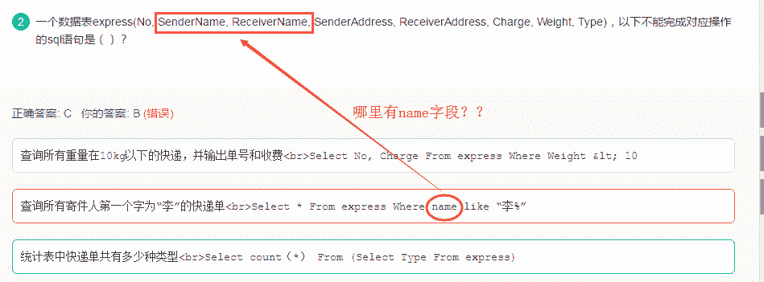
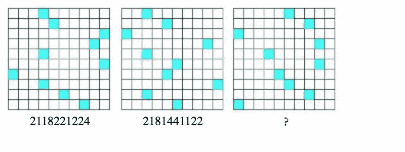
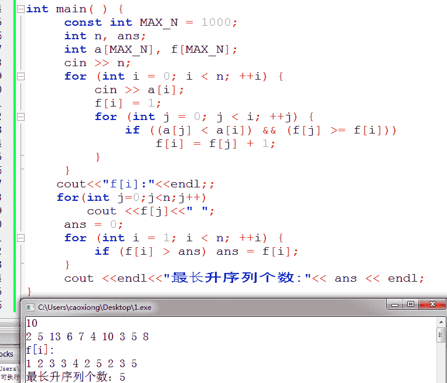
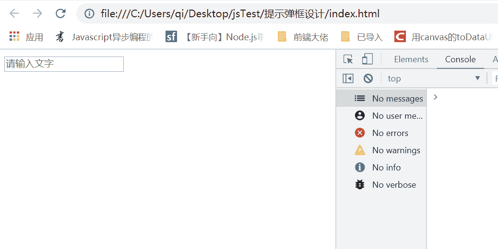

# 商汤科技 2018 校招 Web 前端开发工程师笔试第二场

## 1

交换机主要工作在（）？

正确答案: B   你的答案: 空 (错误)

```cpp
网络层
```

```cpp
数据链路层
```

```cpp
物理层
```

```cpp
传输层
```

本题知识点

产品运营 商汤科技 前端工程师 iOS 工程师 Java 工程师 C++工程师 运维工程师 测试工程师 安卓工程师 技术支持 产品 运营 2018 算法工程师 数据挖掘工程师 大数据开发工程师

讨论

[Mr-WangXZ](https://www.nowcoder.com/profile/2683653)

网络层是路由器，数据链路层是交换机，物理层是光纤，传输层是 TCP/UDP 协议！

发表于 2018-08-17 12:05:22

* * *

[Shirley_BHU](https://www.nowcoder.com/profile/6055089)


发表于 2018-09-20 22:59:17

* * *

[牛客-凌凌漆](https://www.nowcoder.com/profile/914738902)

网络层是路由器，数据链路层是交换机，物理层光纤，传输层 TCP/UDP 协议

发表于 2018-10-15 09:58:43

* * *

## 2

一个数据表 express(No, SenderName, ReceiverName, SenderAddress, ReceiverAddress, Charge, Weight, Type)，以下不能完成对应操作的 sql 语句是（）？

正确答案: C   你的答案: 空 (错误)

```cpp
查询所有重量在 10kg 以下的快递，并输出单号和收费<br>Select No, Charge From express Where Weight &lt; 10
```

```cpp
查询所有寄件人第一个字为“李”的快递单<br>Select * From express Where name like “李%”
```

```cpp
统计表中快递单共有多少种类型<br>Select count（*） From (Select Type From express)
```

```cpp
统计表中不同类型的快递单的平均重量，并按从大到小排列<br>Select Type, avg(Weight) From express Group by Type Order by avg(Weight)
```

本题知识点

产品运营 商汤科技 前端工程师 iOS 工程师 Java 工程师 C++工程师 运维工程师 测试工程师 安卓工程师 技术支持 产品 运营 2018 算法工程师 数据挖掘工程师 大数据开发工程师

讨论

[放学后我不走~](https://www.nowcoder.com/profile/4467653)



发表于 2018-08-19 14:37:50

* * *

[小霞霞 568](https://www.nowcoder.com/profile/2835751)

oder by 默认按照升序排，D 也是错的啊

发表于 2018-09-13 22:08:17

* * *

[ゞ尊■](https://www.nowcoder.com/profile/9072864)

count(*)输出的是行数，空格也算的那种。 这儿需要先 group by Type 先按类型进行分组 然后 count（*）去统计类型数

发表于 2018-08-18 15:10:36

* * *

## 3

 ⼀个完全⼆叉树中有 330 个叶子节点, 则在该⼆叉树中的节点个数为（）？

正确答案: C   你的答案: 空 (错误)

```cpp
659
```

```cpp
660
```

```cpp
可能为 659 或者 660
```

```cpp
不可能为 659 和 660
```

本题知识点

产品运营 商汤科技 前端工程师 iOS 工程师 Java 工程师 C++工程师 运维工程师 测试工程师 安卓工程师 技术支持 产品 运营 2018 算法工程师 数据挖掘工程师 大数据开发工程师

讨论

[不为取名烦恼](https://www.nowcoder.com/profile/4100505)

完全二叉树除最后一层外都是满的，所以也可以这么算：第一层 1 个节点，令层数为 n，除最后一层外，每层的节点个数为 2^(n-1)，有 330 个叶子节点，所以倒数第二层为第 9 层，有 256 个节点，256+x=330 得 x=74,所以共有 1+2+4+8+16+32+64+128+256+74*2=659 个节点，又因为第 659 个节点是右子节点，所以节点个数也可以是 660

发表于 2018-08-19 09:53:02

* * *

[sincebreeze](https://www.nowcoder.com/profile/893201270)

因为二叉树度为 2 的结点 n2 和叶子结点存在 n0：n0=n2+1 的关系，所以度为 2 的结点个数为 329，又因为完全二叉树可能存在度为 1 的结点，所以结点个数为：330+329=659 或 330+329+1=660.

发表于 2018-08-19 14:40:54

* * *

[顺风先森](https://www.nowcoder.com/profile/6548850)

二叉树的性质有一条:n0=n2+1。叶子节点度为 0，所以 n0=330,n2=329。又因为度为 1 的节点最多只能有一个，所以 n1 只能为 0 或者 1。二叉树节点总数 n=n0+n1+n2，所以 n=660 或者 n=659

发表于 2018-09-17 09:35:16

* * *

## 4

假设有一种无色的特殊颜料，与红色颜料混合后会变紫色，与黄色颜料混合会变为绿色，与红色、黄色颜料一起混合会变为黑色，发生颜色变化需要 1 小时。现有 700 瓶特殊颜料，其中一瓶已经变质，不管与什么颜料混合都会变为白色。只有一小时时间, 最少需要多少个调色盘才能找出变质的特殊颜料？

正确答案: A   你的答案: 空 (错误)

```cpp
10
```

```cpp
5
```

```cpp
6
```

```cpp
16
```

本题知识点

产品运营 商汤科技 前端工程师 iOS 工程师 Java 工程师 C++工程师 运维工程师 测试工程师 安卓工程师 技术支持 产品 运营 2018 算法工程师 数据挖掘工程师 大数据开发工程师

讨论

[ShadowPriest](https://www.nowcoder.com/profile/2282233)

10 个调色盘  ，分别当作 10 个二进制位。700 瓶颜料从 1 到 700 编号，写成二进制形式，对于每一瓶颜料，在其二进制为 1 的位所对应的调色盘上加入。一小时后，按照变成白色该调色盘对应位为 1 的原则，写出一个二进制数就是变质颜料的编号。

发表于 2018-08-16 20:45:03

* * *

[小野市](https://www.nowcoder.com/profile/9391147)

2 的 10 次方 = 1024 > 7002 的 9 次方 = 521 < 700 因此需要 10 盘。

发表于 2018-08-20 23:02:12

* * *

[UXH666](https://www.nowcoder.com/profile/534468579)

参考逼乎：[`www.zhihu.com/question/19676641`](https://www.zhihu.com/question/19676641)

发表于 2018-09-07 17:13:44

* * *

## 5

一个口袋装着若干蓝球和若干红球，随机抽出两个球。第一个球是蓝球的概率为 0.5； 第一球是蓝球且第二个球是红球的概率为 0.2。现如果已知第一个球是蓝球，则第二个球是红球的概率是多少？

正确答案: A   你的答案: 空 (错误)

```cpp
0.4
```

```cpp
0.2
```

```cpp
0.1
```

```cpp
0.5
```

本题知识点

产品运营 商汤科技 前端工程师 iOS 工程师 Java 工程师 C++工程师 运维工程师 测试工程师 安卓工程师 技术支持 产品 运营 2018 算法工程师 数据挖掘工程师 大数据开发工程师

讨论

[scut_szu_yab](https://www.nowcoder.com/profile/316002743)

这题有问题。第一个球是蓝球的概率为 0.5 说明篮球和红球数量相等，记为 n。第一球是蓝球且第二球是红球的概率为 C(1,n)C(1,n)/A(2,2n)=0.2，即 n/(2(2n-1))=0.2，解出 n=-2<0

发表于 2018-10-27 20:40:26

* * *

[何元园](https://www.nowcoder.com/profile/1480268)

摸球总概率=第一次摸蓝色球概率*第二次摸红色球概率所以：第二个球是红球的概率=摸球总概率/第一次摸蓝色球概率即 0.2/0.5=0.4

发表于 2018-08-16 19:24:14

* * *

[魏洪旭](https://www.nowcoder.com/profile/6286859)

条件概率 

P(A and B) = P(A|B)P(B) = P(B|A)P(A

发表于 2018-08-17 15:49:58

* * *

## 6

一个狗妈妈有 70 块肉，狗宝宝距离狗妈妈 60 步。每次狗妈妈最多拿 40 块肉，每走 2 步需要吃掉一块肉，则它最多能把 1 块肉拿给狗宝宝。

你的答案 (错误)

1 参考答案 (1) 20

本题知识点

产品运营 商汤科技 前端工程师 iOS 工程师 Java 工程师 C++工程师 运维工程师 测试工程师 安卓工程师 技术支持 产品 运营 2018 算法工程师 数据挖掘工程师 大数据开发工程师

讨论

[腹肌五块半(▼へ▼メ)](https://www.nowcoder.com/profile/5629633)

根据题意，如果满载直接到终点会浪费掉 30 肉，而最优解一定要将这 30 肉消耗掉，以换取满载的情况下距离宝宝最近，因此一定要在起点与终点之间有一个折返点；设：起点为 O、折返点为 A、终点为 B。OA 距离为 X，最后剩余 Y 肉给宝宝；则：第一次从 O 满载出发再返回有：40-(X/2)*2 肉留在 A 点第二次 O 载 30 肉出发到 A 点捡起第一次留下的肉应该满载：30-X/2+(40-(X/2)*2)=40 得到 X=20 则 Y=70-(3x+(60-x))/2,代入 x=20 得 Y=20

发表于 2018-08-17 23:00:20

* * *

[马丘](https://www.nowcoder.com/profile/4843107)

先说答案：狗妈妈先带 40 块走 20 步来回要消耗 20 块肉，还剩 20 块，回去后在带 30 块肉，途中走 20 步消耗 10 块还剩 20 块，这时在 20 步处有 40 肉，接下来要走 40 步，消耗 20 块肉，所以带个狗宝宝的还有 20 块。再说解析：狗妈妈有 70 块肉，一次狗妈妈只能拿 40 块肉，所以我们得想方法，把多余的 30 块肉给用掉。不用也浪费了，用掉的方法就是，用来赶路，把肉放到一个中间点。所以。到中间点这段路程走了三次 三十块肉是 60 步 所以这段路程应该是 60/3=20 步。😀

发表于 2019-04-15 20:34:01

* * *

[ゞ尊■](https://www.nowcoder.com/profile/9072864)

起码多出来的三十块肉要赶路消耗，不管它最优分配是怎么样的 必定是回来拿了一次肉 这段路程走了三次 三十块肉是 60 步 所以这段路程应该是 60/3=20 步

发表于 2018-08-18 16:54:45

* * *

## 7

101 枚硬币中有一枚假币，有一个无砝码的天平，在最坏情况下最少称 1 次，可以判断假币比真币重还是轻。

你的答案 (错误)

1 参考答案 (1) 2

本题知识点

产品运营 商汤科技 前端工程师 iOS 工程师 Java 工程师 C++工程师 运维工程师 测试工程师 安卓工程师 技术支持 产品 运营 2018 算法工程师 数据挖掘工程师 大数据开发工程师

讨论

[亻固ヽㄐ生](https://www.nowcoder.com/profile/8027225)

方案 1：

    将硬币按 A 组(50)、B 组(50)、C 组(1)分组,先比较 A、B 两组:

    1>.若 A=B，则 C 为假币，再用 A 或 B 中任一个与 C 比，C 重则假币重，C 轻则真币重

    2>.若 A!=B，则 A 或 B 中含假币，将 A 组一分为二：A1(25)、A2(25),比较 A1、A2:

       <1>.若 A1=A2，则 A 为真币，故：A>B => 真币重；A<B => 假币重

       <2>.若 A1!=A2，则 A 含假币，故：A<B => 真币重；A>B => 假币重 方案 2：

    1>.将硬币按 A 组(33)、B 组(33)、C 组(35)分组,先比较 A、B 两组:

    1>.若 A=B，则 C 含假币，再用 A+B 中任 35 个与 C 比，C 重则假币重，C 轻则真币重

    2>.若 A!=B，则 C 为真币，再用 C 中 33 个与 A 比较:

       <1>.若 C=A，则 A 为真币，故：A>B => 真币重；A<B => 假币重

       <2>.若 C!=A，则 A 含假币，故：A<B => 真币重；A>B => 假币重

注意不是找出假币，而是只要判断出假币比真币轻还是重 

发表于 2018-08-16 21:37:04

* * *

[自由王国](https://www.nowcoder.com/profile/152563964)

问题点在于确认劣质硬币是偏重或偏轻，把所有硬币当作砝码，

1.  首先说最好的情况，第一次天枰两边先各放 50 枚，如果说左右两边平衡，那么剩下第 101 枚正好就是劣质硬币，第二次把劣质硬币放任意一边即可确认这枚劣质硬币是重或轻。（总共称两次）
2.  最坏的情况，在第一次称，左右两边各 50 枚硬币，左右不平衡，说明劣质硬币在这一百枚里面其中一个，那么仍然只需再称一次即可确认是劣质硬币是重或轻，任意取一边的 50 枚分别放在天枰两边，打个比方，如果你取便轻的那一端的 50 枚，分两半放天枰上，如果左右平衡则说明劣质硬币再另一端偏重的 50 中，即确认劣质硬币偏重。故最坏的情况也只需称 2 次。

发表于 2018-08-20 02:09:16

* * *

[坏坏 62](https://www.nowcoder.com/profile/6236357)

我居然认为最坏的情况是一个一个的称，称到最后才发现假币跟真币那个轻那个重。我真的是***了，，，，

发表于 2018-09-03 19:57:20

* * *

## 8

问号处应为：1

你的答案 (错误)

1 参考答案 (1) 4112241441

本题知识点

产品运营 商汤科技 前端工程师 iOS 工程师 Java 工程师 C++工程师 运维工程师 测试工程师 安卓工程师 技术支持 产品 运营 2018 算法工程师 数据挖掘工程师 大数据开发工程师

讨论

[taft 范](https://www.nowcoder.com/profile/276325718)

10 个列是 10 位数？一个颜色方块代表 2 的 n 次方吗？一列没有颜色就是 2 的 0 次方既是 1。

发表于 2018-08-16 16:32:07

* * *

[好牌乱打](https://www.nowcoder.com/profile/861955870)

这道题很简单，主要看每列的有颜色的方块数目。每列对应一个数字，**一列中，0 个有颜色方块代表数字 1，1 个有颜色方块的代表数字 2，2 个有颜色方块代表数字 4，3 个有颜色方块代表数字 8。以此类推，其实很简单，就是 2 的 n 次，这是考察我们的分析归纳能力。**

编辑于 2018-09-04 16:27:59

* * *

[慧 201805291727831](https://www.nowcoder.com/profile/5856697)

先确定每列方块个数 n，数字序列：2 的 n 次方

发表于 2018-08-19 15:37:15

* * *

## 9

给定数组 [ 48,8,20,72,65,17,28,23 ]，构造一棵左子节点 < 父节点 < 右子节点 的二叉搜索树（Binary Search Tree）。把数字 48 删除，使用前序节点调整后，则数字 28 的左子节点是数字 1。

你的答案 (错误)

1 参考答案 (1) 8

本题知识点

产品运营 商汤科技 前端工程师 iOS 工程师 Java 工程师 C++工程师 运维工程师 测试工程师 安卓工程师 技术支持 产品 运营 2018 算法工程师 数据挖掘工程师 大数据开发工程师

讨论

[pengsong0605](https://www.nowcoder.com/profile/1781903)


发表于 2018-08-19 16:14:45

* * *

[ゞ尊■](https://www.nowcoder.com/profile/9072864)

前序节点调整：把左子树前序遍历的最后一个节点 也就是左子树里面最大的替换到删除的位置。如果拿来替换的这个节点有子树，递归此过程。

发表于 2018-08-18 17:01:06

* * *

[牛客 107836663 号](https://www.nowcoder.com/profile/107836663)

中序遍历然后对前序节点进行删除

发表于 2020-10-27 23:45:19

* * *

## 10

请阅读以下代码和输入，写出程序的输出结果。

```cpp
#include<iostream>
using namespace std;

int main( ) {
     const int MAX_N = 1000;
     int n, ans;
     int a[MAX_N], f[MAX_N];
     cin >> n;
     for (int i = 0; i < n; ++i) {
         cin >> a[i];
         f[i] = 1;
         for (int j = 0; j < i; ++j) {
             if ((a[j] < a[i]) && (f[j] >= f[i]))
                 f[i] = f[j] + 1;
         }
     }

     ans = 0;
     for (int i = 1; i < n; ++i) {
         if (f[i] > ans) ans = f[i];
     }
     cout << ans << endl;
}

```

输入

10

2 5 13 6 7 4 10 3 5 8 输出：1

你的答案 (错误)

1 参考答案 (1) 5

本题知识点

产品运营 商汤科技 前端工程师 iOS 工程师 Java 工程师 C++工程师 运维工程师 测试工程师 安卓工程师 技术支持 产品 运营 2018 算法工程师 数据挖掘工程师 大数据开发工程师

讨论

[放学后我不走~](https://www.nowcoder.com/profile/4467653)

最长升序列个数，了解一下。每个 f [ i ] 代表从 a[0] 开始到 a[i] 之间，有多少个数小于等于 a[i] 并且是 升序的，例子中的：

10

2 5 13 6 7 4 10 3 5 8，2,5,6,7,10 这五个是最长升序列，所以输出 5


发表于 2018-08-19 15:03:28

* * *

[爱打篮球的普通人](https://www.nowcoder.com/profile/6596118)

注意每次 f[i]的初始化都为 1，按照 i=0.i=1,i=2.....依次去推倒就行了

发表于 2018-08-16 20:42:37

* * *

[~喵喵喵~](https://www.nowcoder.com/profile/6055862)

f[i]表示 a[0]到 a[i]位置内，最长的升序序列的长度，每次都初始化为 1 是因为肯定包含它本身。

发表于 2018-08-28 17:34:35

* * *

## 11

有一种将字母编码成数字的方式：'a'->1, 'b->2', ... , 'z->26'。

现在给一串数字，给出有多少种可能的译码结果。

本题知识点

产品运营 iOS 工程师 C++工程师 运维工程师 安卓工程师 前端工程师 Java 工程师 商汤科技 测试工程师 字符串 *模拟 数学 技术支持 产品 运营 2018 算法工程师 数据挖掘工程师 大数据开发工程师* *讨论

[楽園](https://www.nowcoder.com/profile/3041748)

```cpp

```
# -*- coding:utf-8 -*-
#python 解法
```cpp

'''
dp(n):n 个字符可能的结果
1.s[i-2]和 s[i-1] 两个字符是 10----26 之间但不包括 10 和 20 这两个数时：
eg:判断“567123”的编码方式可以转为判断“56712”+‘3“或者”5671“+”23“的问题。即 dp(n)=dp(n-1)+dp(n-2)。
2.s[i-2]和 s[i-1] 两个字符 10 或 20 这两个数时，只有一种编码方式，比如 10------>[“J”], 所以 dp[i] = dp[i-2]
3.s[i-2]和 s[i-1] 两个字符不在上述两种范围时，比如 27，所以 dp[i] = dp[i-1]
4.数字”0“对应的编码只能是和其前一个数字组合对应的编码，如果和其前一个字符组合后不存在对应编码，则编码方式为 0.
'''
dp = [1,1]
s = raw_input().strip()
if s=='' or s[0]=='0': dp = [0,0]     #此时下面的 for 不会运行，也不报错
for i in range(2, len(s) + 1):
    if 10 <= int(s[i - 2:i]) <= 26 and s[i - 1] != '0':  # 1
        dp.append(dp[i - 1] + dp[i - 2])
    elif int(s[i - 2:i]) == 10 or int(s[i - 2:i]) == 20:  # 2
        dp.append(dp[i - 2])
    elif s[i - 1] != '0':  # 3
        dp.append(dp[i - 1])
    else:
        dp.append(0)  # 4
print dp[len(s)]

```

编辑于 2019-03-04 01:57:29

* * *

[水里捞鱼翅](https://www.nowcoder.com/profile/6584732)

```cpp
#include<bits/stdc++.h>
using namespace std;

int numDecodings(string s) {
        if(!s.size() || s.front() == '0') return 0;
        int r1 = 1, r2 = 1;
        for (int i = 1; i < s.size(); i++){
            if (s[i] == '0') r1 = 0;
            if (s[i-1] == '1' || s[i-1] == '2' && s[i] <= '6'){
                r1 = r2+r1;
                r2 = r1-r2;
            }
            else
                r2 = r1;
        }
        return r1;
    }
int main(){
    string s;
    while(cin >> s){
        cout << numDecodings(s) << endl;
    }
    return 0;
}

```

LeetCode #91。

发表于 2018-08-22 21:11:37

* * *

[这个 ID 没人用](https://www.nowcoder.com/profile/785032005)

//商汤笔试题是真的难，限时做的话，只有大佬才做得完吧。//解题思路：动态规划  定义 dp[i]表示以第 i 个字母结束可能的编码数(i 取值 0 到 len-1) , dp[i]全部初始化为 0//动态方程如下：
//    dp[i]+=dp[i-1] ，如果第 i 位！='0'//    dp[i]+=dp[i-2],    如果第 i-1 位和第 i 位可以组成一个合法表示也就是 10 到 26 之间
//接下来就是考虑初值 dp[0]和 dp[1]//    dp[0]=1，如果第 0 位！='0'
//    dp[0]=0，其他情况//    dp[1]=2，如果第 0 位和第 1 位组成的数在 11 到 19 或 21 到 26
//    dp[1]=0,   如果第 0 位和第 1 位组成的数是 00，01...09 或者 30，40...90//    dp[1]=1,  其他
//计算 dp[1]时，情况比较多，最后可以计算并集，三种情况并集是 00 到 99，看是否漏掉。//另外，如果 dp[0]或者 dp[1]==0,直接输出 0 结束程序
#include<iostream>#include<vector>
using namespace std;
int main() {
    string s;
    cin>>s;
    int len=s.size();
    vector<int> dp(len,0);
    if(len==0) {
        cout<<0;
        return 0;
    }
    for(int i=0;i<len;i++) {
        if(i==0) {        //dp[0]赋初值
            if(s[0]!='0')
                dp[0]=1;      
            else{
                dp[0]=0;
                cout<<0;
                return 0;
            }
        }
        else if(i==1) {   //dp[1]赋初值
            if( (s[0]=='1'&&s[1]>='1'&&s[1]<='9') || (s[0]=='2'&&s[1]>='1'&&s[1]<='6'))
                dp[1]=2;
            else if(s[0]=='0' || (s[0]>='3'&&s[1]=='0')) {
                dp[1]=0;
                cout<<0;
                return 0;
            }
            else
                dp[1]=1;
        }else {            //计算其他 dp[i]
            if(s[i]!='0')
                dp[i]+=dp[i-1];
            if(s[i-1]=='1' || (s[i-1]=='2'&&s[i]<='6'))
                dp[i]+=dp[i-2];
            /*
            if(dp[i]==0) {
                cout<<0;
                return 0;
            }
            */
        }
    }
    cout<<dp[len-1];
    return 0;
}

编辑于 2020-08-19 10:52:13

* * *

## 12

解释 JavaScript 的闭包机制，并举例说明在使用闭包时，如何避免 this 丢失问题。

你的答案

本题知识点

前端工程师 商汤科技 2018

讨论

[前端小明](https://www.nowcoder.com/profile/4846506)

闭包是指有权访问另一个函数作用域中的变量的函数，当函数可以记住并访问所在的词法作用域，即使函数是在当前词法作用域之外执行，这时就产生了闭包，创建闭包的常见方式，就是在一个函数内部创建另一个函数。可以将 this 在函数定义的外层作用域保存下来传递到闭包函数中, 也可以使用 ES6 的箭头函数 

发表于 2019-02-14 21:14:46

* * *

[西门吹雪 ing](https://www.nowcoder.com/profile/4611681)

闭包在理论上指可以访问其他作用域变量的函数, 因此理论上说在 JavaScript 中, 一切函数都是闭包;但实践中一般指, 创建这个函数的上下文已经返回 ,但函数可以仍然访问函数上下文之外的变量;可以将 this 在函数定义的外层作用域保存下来传递到闭包函数中, 也可以使用 ES6 的箭头函数

发表于 2018-08-17 20:43:54

* * *

## 13

什么是 callback hell，有什么方法可以改进，举例说明。

你的答案

本题知识点

前端工程师 商汤科技 2018

讨论

[清清 baby](https://www.nowcoder.com/profile/67892388)

无论时浏览器中最为常见的 ajax、事件监听，还是 node 中文件读取、网络编程、数据库等操作，都离不开异步编程。在异步编程中，许多操作都会放在回调函数（callback）中，过多的回调嵌套使得代码变得难以理解和维护，就是回调地狱。我们通过 Promise 可以解决回调地狱问题，通过 Promise 原型的 then()方法可以分别指定某个异步操作的回调

发表于 2018-08-18 16:39:19

* * *

[脸盘姑娘](https://www.nowcoder.com/profile/3973836)

callback hell：回调函数地狱，一般是由于代码的执行按照显而易见的一步一步执行的顺序，造成的 。解决回调的方法，1，编写模块化的程序 2，不要多层嵌套函数。将函数命名，并且放置在程序的顶层

发表于 2018-08-16 22:05:51

* * *

## 14

请写代码说明如何扩展 Object 基于观察者模式实现 react programming。

你的答案

本题知识点

前端工程师 商汤科技 2018

## 15

请列举对布局有影响的 CSS 属性

你的答案

本题知识点

前端工程师 商汤科技 2018

讨论

[是函数不是方法](https://www.nowcoder.com/profile/7255829)

width、heightdisplaypositionfloatoverflowfont-sizemarginpaddingword-breakword-wrapvisibility

发表于 2018-08-26 12:09:54

* * *

[小野市](https://www.nowcoder.com/profile/9391147)

display float clear visibility overflow overflow-x overflow-y clip 

发表于 2018-08-21 15:41:15

* * *

## 16

编写 CSS 代码，装饰 input，当鼠标指向它时，能够出现如下 tooltip。

注意：tooltip 上部的小三角是用 css 生成的，并且需要有和 tooltip 一样的边框。当改变 tooltip 本身的边框颜色时，它也会随同变化。

```cpp
<div>
    <input placeholder='请输入文字' />
    <div class=' tooltip '>只能够输入英文字母、数字和下划线与中划线。</div>
</div>

```


你的答案

本题知识点

前端工程师 商汤科技 2018

讨论

[飞翔 201804021937302](https://www.nowcoder.com/profile/3259546)

```cpp
.tooltip {
  width: 300px;
  margin-top: 5px;
  border: 2px solid gray;
  border-radius: 5px;
  box-shadow: 0 1px 1px 1px gray;
  visibility: hidden;
}

.tooltip::before {
  content: "";
  position: absolute;
  margin-top: -5px;
  left: 13px;
  padding: 3px;
  background-color: white;
  border: inherit;
  border-right: 0;
  border-bottom: 0;
  transform: rotate(45deg);
}

input {
  width: 300px;
}

input:hover + .tooltip {
  visibility: visible;
} 
```

使用 CSS 伪类加相邻选择器

发表于 2018-10-12 09:21:23

* * *

[垚的彼岸](https://www.nowcoder.com/profile/1623480)

```cpp

		<!DOCTYPE html>

		<html lang="en">

		<head>

		<meta charset="UTF-8">

		<meta name="viewport" content="width=device-width, initial-scale=1.0">

		<meta http-equiv="X-UA-Compatible" content="ie=edge">

		<title>提示弹框设计</title>

		<style>

		.tooltip {

		display: none;

		padding: 5px;

		border: 2px solid red;

		border-radius: 5px;

		position: absolute;

		top: 40px;

		box-shadow: 0px 2px 2px #ccc;

		}

		.after {

		width: 0;

		height: 0;

		margin: 0;

		border: 10px solid transparent;

		border-bottom-color: #fff;

		position: absolute;

		top: -20px;

		left: 10px;

		}

		.before {

		width: 0;

		height: 0;

		margin: 0;

		border: 12px solid transparent;

		border-bottom-color: #ccc;

		position: absolute;

		top: -24px;

		left: 8px;

		}

		</style>

		</head>

		<body>

		<div>

		<input placeholder='请输入文字' />

		<div class=' tooltip '>只能够输入英文字母、数字和下划线与中划线。</div>

		</div>

		</body>

		<script>

		var input = document.getElementsByTagName('input')[0];

		var tooltip = document.getElementsByClassName('tooltip')[0];

		var style = window.getComputedStyle ?

		window.getComputedStyle(tooltip, null) : null || box.currentStyle;

		var shadowColor = style.borderColor;

		tooltip.style.boxShadow = `0px 2px 2px ${shadowColor}`;

		var block1 = document.createElement('p');

		var block2 = document.createElement('p');

		block1.className = 'before';

		block2.className = 'after';

		block1.style.borderBottomColor = shadowColor;

		block2.style.borderBottomColor = '#fff';

		tooltip.appendChild(block1);

		tooltip.appendChild(block2);

		input.addEventListener('mouseover', function () {

		tooltip.style.display = 'block';

		});

		input.addEventListener("mouseout", function () {

		tooltip.style.display = 'none';

		})

		</script>

		</html>

```



发表于 2018-10-05 10:57:29

* * *

[是函数不是方法](https://www.nowcoder.com/profile/7255829)

```cpp
<!DOCTYPE html>
<html lang="en">
<head>
    <meta charset="UTF-8">
    <meta name="viewport" content="width=device-width, initial-scale=1.0">
    <meta http-equiv="X-UA-Compatible" content="ie=edge">
    <title>Document</title>
    <style>
        .tooltip {
            margin-top: 5px;
            border: 2px solid gray;
            visibility: hidden; 
        }
        .tooltip::before {
            content: "";
            position: absolute;
            margin-top: -5px;
            left: 13px;
            padding: 3px;
            background-color: white;
            border: inherit;
            border-right: 0;
            border-bottom: 0;
            transform: rotate(45deg);
        }
        input {
            border-color: red;
        }
    </style>
</head>
<body>
    <div>
        <input placeholder='请输入文字' />
        <div class='tooltip'>只能够输入英文字母、数字和下划线与中划线。</div>
    </div>
    <script>
        var input = document.getElementsByTagName("input")[0];
        var width = input.offsetWidth;
        var borderColor = getComputedStyle(input, null).borderColor;
        var tooltip = document.getElementsByClassName("tooltip")[0];
        tooltip.style.width = width+"px";
        tooltip.style.borderColor = borderColor;
        input.addEventListener("mouseover",function(){
            tooltip.style.visibility = "visible";
        });
        input.addEventListener("mouseout",function(){
            tooltip.style.visibility = "hidden";
        })
    </script>
</body>
</html>
```

发表于 2018-08-26 12:05:13

* * **