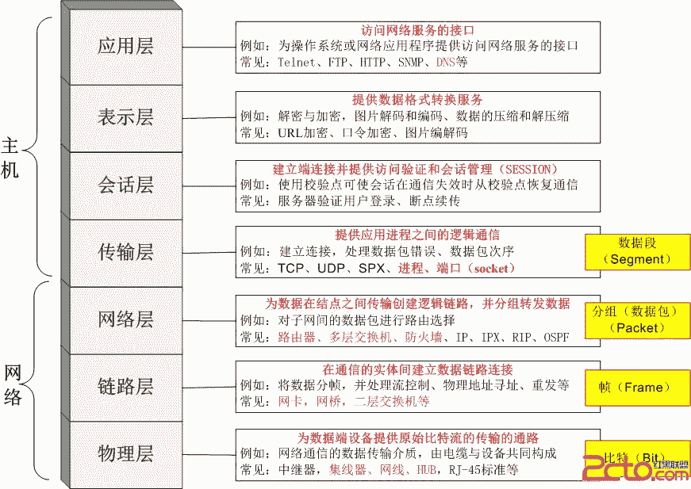
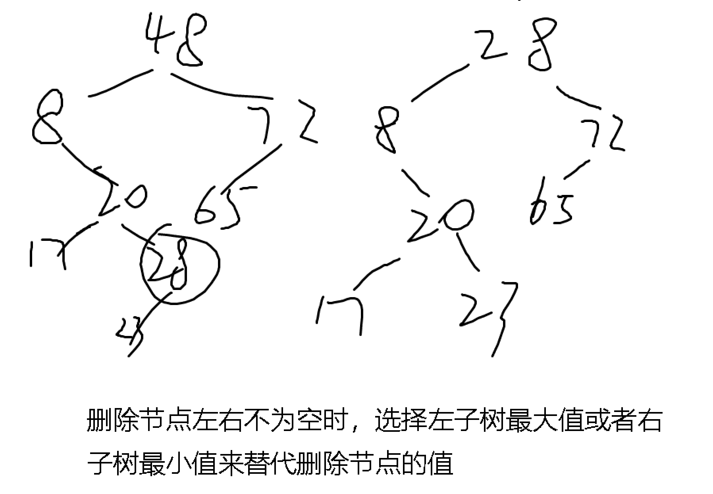
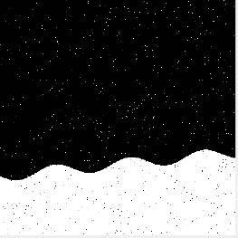

# 商汤科技 2018 校招 C /算法开发/大数据/后端/运维/测试/数据挖掘开发工程师笔试第二场

## 1

交换机主要工作在（）？

正确答案: B   你的答案: 空 (错误)

```cpp
网络层
```

```cpp
数据链路层
```

```cpp
物理层
```

```cpp
传输层
```

本题知识点

产品运营 商汤科技 前端工程师 iOS 工程师 Java 工程师 C++工程师 运维工程师 测试工程师 安卓工程师 技术支持 产品 运营 2018 算法工程师 数据挖掘工程师 大数据开发工程师

讨论

[Mr-WangXZ](https://www.nowcoder.com/profile/2683653)

网络层是路由器，数据链路层是交换机，物理层是光纤，传输层是 TCP/UDP 协议！

发表于 2018-08-17 12:05:22

* * *

[Shirley_BHU](https://www.nowcoder.com/profile/6055089)



发表于 2018-09-20 22:59:17

* * *

[牛客-凌凌漆](https://www.nowcoder.com/profile/914738902)

网络层是路由器，数据链路层是交换机，物理层光纤，传输层 TCP/UDP 协议

发表于 2018-10-15 09:58:43

* * *

## 2

一个数据表 express(No, SenderName, ReceiverName, SenderAddress, ReceiverAddress, Charge, Weight, Type)，以下不能完成对应操作的 sql 语句是（）？

正确答案: C   你的答案: 空 (错误)

```cpp
查询所有重量在 10kg 以下的快递，并输出单号和收费<br>Select No, Charge From express Where Weight &lt; 10
```

```cpp
查询所有寄件人第一个字为“李”的快递单<br>Select * From express Where name like “李%”
```

```cpp
统计表中快递单共有多少种类型<br>Select count（*） From (Select Type From express)
```

```cpp
统计表中不同类型的快递单的平均重量，并按从大到小排列<br>Select Type, avg(Weight) From express Group by Type Order by avg(Weight)
```

本题知识点

产品运营 商汤科技 前端工程师 iOS 工程师 Java 工程师 C++工程师 运维工程师 测试工程师 安卓工程师 技术支持 产品 运营 2018 算法工程师 数据挖掘工程师 大数据开发工程师

讨论

[放学后我不走~](https://www.nowcoder.com/profile/4467653)


发表于 2018-08-19 14:37:50

* * *

[小霞霞 568](https://www.nowcoder.com/profile/2835751)

oder by 默认按照升序排，D 也是错的啊

发表于 2018-09-13 22:08:17

* * *

[ゞ尊■](https://www.nowcoder.com/profile/9072864)

count(*)输出的是行数，空格也算的那种。 这儿需要先 group by Type 先按类型进行分组 然后 count（*）去统计类型数

发表于 2018-08-18 15:10:36

* * *

## 3

 ⼀个完全⼆叉树中有 330 个叶子节点, 则在该⼆叉树中的节点个数为（）？

正确答案: C   你的答案: 空 (错误)

```cpp
659
```

```cpp
660
```

```cpp
可能为 659 或者 660
```

```cpp
不可能为 659 和 660
```

本题知识点

产品运营 商汤科技 前端工程师 iOS 工程师 Java 工程师 C++工程师 运维工程师 测试工程师 安卓工程师 技术支持 产品 运营 2018 算法工程师 数据挖掘工程师 大数据开发工程师

讨论

[不为取名烦恼](https://www.nowcoder.com/profile/4100505)

完全二叉树除最后一层外都是满的，所以也可以这么算：第一层 1 个节点，令层数为 n，除最后一层外，每层的节点个数为 2^(n-1)，有 330 个叶子节点，所以倒数第二层为第 9 层，有 256 个节点，256+x=330 得 x=74,所以共有 1+2+4+8+16+32+64+128+256+74*2=659 个节点，又因为第 659 个节点是右子节点，所以节点个数也可以是 660

发表于 2018-08-19 09:53:02

* * *

[sincebreeze](https://www.nowcoder.com/profile/893201270)

因为二叉树度为 2 的结点 n2 和叶子结点存在 n0：n0=n2+1 的关系，所以度为 2 的结点个数为 329，又因为完全二叉树可能存在度为 1 的结点，所以结点个数为：330+329=659 或 330+329+1=660.

发表于 2018-08-19 14:40:54

* * *

[顺风先森](https://www.nowcoder.com/profile/6548850)

二叉树的性质有一条:n0=n2+1。叶子节点度为 0，所以 n0=330,n2=329。又因为度为 1 的节点最多只能有一个，所以 n1 只能为 0 或者 1。二叉树节点总数 n=n0+n1+n2，所以 n=660 或者 n=659

发表于 2018-09-17 09:35:16

* * *

## 4

假设有一种无色的特殊颜料，与红色颜料混合后会变紫色，与黄色颜料混合会变为绿色，与红色、黄色颜料一起混合会变为黑色，发生颜色变化需要 1 小时。现有 700 瓶特殊颜料，其中一瓶已经变质，不管与什么颜料混合都会变为白色。只有一小时时间, 最少需要多少个调色盘才能找出变质的特殊颜料？

正确答案: A   你的答案: 空 (错误)

```cpp
10
```

```cpp
5
```

```cpp
6
```

```cpp
16
```

本题知识点

产品运营 商汤科技 前端工程师 iOS 工程师 Java 工程师 C++工程师 运维工程师 测试工程师 安卓工程师 技术支持 产品 运营 2018 算法工程师 数据挖掘工程师 大数据开发工程师

讨论

[ShadowPriest](https://www.nowcoder.com/profile/2282233)

10 个调色盘  ，分别当作 10 个二进制位。700 瓶颜料从 1 到 700 编号，写成二进制形式，对于每一瓶颜料，在其二进制为 1 的位所对应的调色盘上加入。一小时后，按照变成白色该调色盘对应位为 1 的原则，写出一个二进制数就是变质颜料的编号。

发表于 2018-08-16 20:45:03

* * *

[小野市](https://www.nowcoder.com/profile/9391147)

2 的 10 次方 = 1024 > 7002 的 9 次方 = 521 < 700 因此需要 10 盘。

发表于 2018-08-20 23:02:12

* * *

[UXH666](https://www.nowcoder.com/profile/534468579)

参考逼乎：[`www.zhihu.com/question/19676641`](https://www.zhihu.com/question/19676641)

发表于 2018-09-07 17:13:44

* * *

## 5

一个口袋装着若干蓝球和若干红球，随机抽出两个球。第一个球是蓝球的概率为 0.5； 第一球是蓝球且第二个球是红球的概率为 0.2。现如果已知第一个球是蓝球，则第二个球是红球的概率是多少？

正确答案: A   你的答案: 空 (错误)

```cpp
0.4
```

```cpp
0.2
```

```cpp
0.1
```

```cpp
0.5
```

本题知识点

产品运营 商汤科技 前端工程师 iOS 工程师 Java 工程师 C++工程师 运维工程师 测试工程师 安卓工程师 技术支持 产品 运营 2018 算法工程师 数据挖掘工程师 大数据开发工程师

讨论

[scut_szu_yab](https://www.nowcoder.com/profile/316002743)

这题有问题。第一个球是蓝球的概率为 0.5 说明篮球和红球数量相等，记为 n。第一球是蓝球且第二球是红球的概率为 C(1,n)C(1,n)/A(2,2n)=0.2，即 n/(2(2n-1))=0.2，解出 n=-2<0

发表于 2018-10-27 20:40:26

* * *

[何元园](https://www.nowcoder.com/profile/1480268)

摸球总概率=第一次摸蓝色球概率*第二次摸红色球概率所以：第二个球是红球的概率=摸球总概率/第一次摸蓝色球概率即 0.2/0.5=0.4

发表于 2018-08-16 19:24:14

* * *

[魏洪旭](https://www.nowcoder.com/profile/6286859)

条件概率 

P(A and B) = P(A|B)P(B) = P(B|A)P(A

发表于 2018-08-17 15:49:58

* * *

## 6

一个狗妈妈有 70 块肉，狗宝宝距离狗妈妈 60 步。每次狗妈妈最多拿 40 块肉，每走 2 步需要吃掉一块肉，则它最多能把 1 块肉拿给狗宝宝。

你的答案 (错误)

1 参考答案 (1) 20

本题知识点

产品运营 商汤科技 前端工程师 iOS 工程师 Java 工程师 C++工程师 运维工程师 测试工程师 安卓工程师 技术支持 产品 运营 2018 算法工程师 数据挖掘工程师 大数据开发工程师

讨论

[腹肌五块半(▼へ▼メ)](https://www.nowcoder.com/profile/5629633)

根据题意，如果满载直接到终点会浪费掉 30 肉，而最优解一定要将这 30 肉消耗掉，以换取满载的情况下距离宝宝最近，因此一定要在起点与终点之间有一个折返点；设：起点为 O、折返点为 A、终点为 B。OA 距离为 X，最后剩余 Y 肉给宝宝；则：第一次从 O 满载出发再返回有：40-(X/2)*2 肉留在 A 点第二次 O 载 30 肉出发到 A 点捡起第一次留下的肉应该满载：30-X/2+(40-(X/2)*2)=40 得到 X=20 则 Y=70-(3x+(60-x))/2,代入 x=20 得 Y=20

发表于 2018-08-17 23:00:20

* * *

[马丘](https://www.nowcoder.com/profile/4843107)

先说答案：狗妈妈先带 40 块走 20 步来回要消耗 20 块肉，还剩 20 块，回去后在带 30 块肉，途中走 20 步消耗 10 块还剩 20 块，这时在 20 步处有 40 肉，接下来要走 40 步，消耗 20 块肉，所以带个狗宝宝的还有 20 块。再说解析：狗妈妈有 70 块肉，一次狗妈妈只能拿 40 块肉，所以我们得想方法，把多余的 30 块肉给用掉。不用也浪费了，用掉的方法就是，用来赶路，把肉放到一个中间点。所以。到中间点这段路程走了三次 三十块肉是 60 步 所以这段路程应该是 60/3=20 步。😀

发表于 2019-04-15 20:34:01

* * *

[ゞ尊■](https://www.nowcoder.com/profile/9072864)

起码多出来的三十块肉要赶路消耗，不管它最优分配是怎么样的 必定是回来拿了一次肉 这段路程走了三次 三十块肉是 60 步 所以这段路程应该是 60/3=20 步

发表于 2018-08-18 16:54:45

* * *

## 7

101 枚硬币中有一枚假币，有一个无砝码的天平，在最坏情况下最少称 1 次，可以判断假币比真币重还是轻。

你的答案 (错误)

1 参考答案 (1) 2

本题知识点

产品运营 商汤科技 前端工程师 iOS 工程师 Java 工程师 C++工程师 运维工程师 测试工程师 安卓工程师 技术支持 产品 运营 2018 算法工程师 数据挖掘工程师 大数据开发工程师

讨论

[亻固ヽㄐ生](https://www.nowcoder.com/profile/8027225)

方案 1：

    将硬币按 A 组(50)、B 组(50)、C 组(1)分组,先比较 A、B 两组:

    1>.若 A=B，则 C 为假币，再用 A 或 B 中任一个与 C 比，C 重则假币重，C 轻则真币重

    2>.若 A!=B，则 A 或 B 中含假币，将 A 组一分为二：A1(25)、A2(25),比较 A1、A2:

       <1>.若 A1=A2，则 A 为真币，故：A>B => 真币重；A<B => 假币重

       <2>.若 A1!=A2，则 A 含假币，故：A<B => 真币重；A>B => 假币重 方案 2：

    1>.将硬币按 A 组(33)、B 组(33)、C 组(35)分组,先比较 A、B 两组:

    1>.若 A=B，则 C 含假币，再用 A+B 中任 35 个与 C 比，C 重则假币重，C 轻则真币重

    2>.若 A!=B，则 C 为真币，再用 C 中 33 个与 A 比较:

       <1>.若 C=A，则 A 为真币，故：A>B => 真币重；A<B => 假币重

       <2>.若 C!=A，则 A 含假币，故：A<B => 真币重；A>B => 假币重

注意不是找出假币，而是只要判断出假币比真币轻还是重 

发表于 2018-08-16 21:37:04

* * *

[自由王国](https://www.nowcoder.com/profile/152563964)

问题点在于确认劣质硬币是偏重或偏轻，把所有硬币当作砝码，

1.  首先说最好的情况，第一次天枰两边先各放 50 枚，如果说左右两边平衡，那么剩下第 101 枚正好就是劣质硬币，第二次把劣质硬币放任意一边即可确认这枚劣质硬币是重或轻。（总共称两次）
2.  最坏的情况，在第一次称，左右两边各 50 枚硬币，左右不平衡，说明劣质硬币在这一百枚里面其中一个，那么仍然只需再称一次即可确认是劣质硬币是重或轻，任意取一边的 50 枚分别放在天枰两边，打个比方，如果你取便轻的那一端的 50 枚，分两半放天枰上，如果左右平衡则说明劣质硬币再另一端偏重的 50 中，即确认劣质硬币偏重。故最坏的情况也只需称 2 次。

发表于 2018-08-20 02:09:16

* * *

[坏坏 62](https://www.nowcoder.com/profile/6236357)

我居然认为最坏的情况是一个一个的称，称到最后才发现假币跟真币那个轻那个重。我真的是***了，，，，

发表于 2018-09-03 19:57:20

* * *

## 8

问号处应为：1

你的答案 (错误)

1 参考答案 (1) 4112241441

本题知识点

产品运营 商汤科技 前端工程师 iOS 工程师 Java 工程师 C++工程师 运维工程师 测试工程师 安卓工程师 技术支持 产品 运营 2018 算法工程师 数据挖掘工程师 大数据开发工程师

讨论

[taft 范](https://www.nowcoder.com/profile/276325718)

10 个列是 10 位数？一个颜色方块代表 2 的 n 次方吗？一列没有颜色就是 2 的 0 次方既是 1。

发表于 2018-08-16 16:32:07

* * *

[好牌乱打](https://www.nowcoder.com/profile/861955870)

这道题很简单，主要看每列的有颜色的方块数目。每列对应一个数字，**一列中，0 个有颜色方块代表数字 1，1 个有颜色方块的代表数字 2，2 个有颜色方块代表数字 4，3 个有颜色方块代表数字 8。以此类推，其实很简单，就是 2 的 n 次，这是考察我们的分析归纳能力。**

编辑于 2018-09-04 16:27:59

* * *

[慧 201805291727831](https://www.nowcoder.com/profile/5856697)

先确定每列方块个数 n，数字序列：2 的 n 次方

发表于 2018-08-19 15:37:15

* * *

## 9

给定数组 [ 48,8,20,72,65,17,28,23 ]，构造一棵左子节点 < 父节点 < 右子节点 的二叉搜索树（Binary Search Tree）。把数字 48 删除，使用前序节点调整后，则数字 28 的左子节点是数字 1。

你的答案 (错误)

1 参考答案 (1) 8

本题知识点

产品运营 商汤科技 前端工程师 iOS 工程师 Java 工程师 C++工程师 运维工程师 测试工程师 安卓工程师 技术支持 产品 运营 2018 算法工程师 数据挖掘工程师 大数据开发工程师

讨论

[pengsong0605](https://www.nowcoder.com/profile/1781903)



发表于 2018-08-19 16:14:45

* * *

[ゞ尊■](https://www.nowcoder.com/profile/9072864)

前序节点调整：把左子树前序遍历的最后一个节点 也就是左子树里面最大的替换到删除的位置。如果拿来替换的这个节点有子树，递归此过程。

发表于 2018-08-18 17:01:06

* * *

[牛客 107836663 号](https://www.nowcoder.com/profile/107836663)

中序遍历然后对前序节点进行删除

发表于 2020-10-27 23:45:19

* * *

## 10

请阅读以下代码和输入，写出程序的输出结果。

```cpp
#include<iostream>
using namespace std;

int main( ) {
     const int MAX_N = 1000;
     int n, ans;
     int a[MAX_N], f[MAX_N];
     cin >> n;
     for (int i = 0; i < n; ++i) {
         cin >> a[i];
         f[i] = 1;
         for (int j = 0; j < i; ++j) {
             if ((a[j] < a[i]) && (f[j] >= f[i]))
                 f[i] = f[j] + 1;
         }
     }

     ans = 0;
     for (int i = 1; i < n; ++i) {
         if (f[i] > ans) ans = f[i];
     }
     cout << ans << endl;
}

```

输入

10

2 5 13 6 7 4 10 3 5 8 输出：1

你的答案 (错误)

1 参考答案 (1) 5

本题知识点

产品运营 商汤科技 前端工程师 iOS 工程师 Java 工程师 C++工程师 运维工程师 测试工程师 安卓工程师 技术支持 产品 运营 2018 算法工程师 数据挖掘工程师 大数据开发工程师

讨论

[放学后我不走~](https://www.nowcoder.com/profile/4467653)

最长升序列个数，了解一下。每个 f [ i ] 代表从 a[0] 开始到 a[i] 之间，有多少个数小于等于 a[i] 并且是 升序的，例子中的：

10

2 5 13 6 7 4 10 3 5 8，2,5,6,7,10 这五个是最长升序列，所以输出 5


发表于 2018-08-19 15:03:28

* * *

[爱打篮球的普通人](https://www.nowcoder.com/profile/6596118)

注意每次 f[i]的初始化都为 1，按照 i=0.i=1,i=2.....依次去推倒就行了

发表于 2018-08-16 20:42:37

* * *

[~喵喵喵~](https://www.nowcoder.com/profile/6055862)

f[i]表示 a[0]到 a[i]位置内，最长的升序序列的长度，每次都初始化为 1 是因为肯定包含它本身。

发表于 2018-08-28 17:34:35

* * *

## 11

有一种将字母编码成数字的方式：'a'->1, 'b->2', ... , 'z->26'。

现在给一串数字，给出有多少种可能的译码结果。

本题知识点

产品运营 iOS 工程师 C++工程师 运维工程师 安卓工程师 前端工程师 Java 工程师 商汤科技 测试工程师 字符串 *模拟 数学 技术支持 产品 运营 2018 算法工程师 数据挖掘工程师 大数据开发工程师* *讨论

[楽園](https://www.nowcoder.com/profile/3041748)

```cpp

```
# -*- coding:utf-8 -*-
#python 解法
```cpp

'''
dp(n):n 个字符可能的结果
1.s[i-2]和 s[i-1] 两个字符是 10----26 之间但不包括 10 和 20 这两个数时：
eg:判断“567123”的编码方式可以转为判断“56712”+‘3“或者”5671“+”23“的问题。即 dp(n)=dp(n-1)+dp(n-2)。
2.s[i-2]和 s[i-1] 两个字符 10 或 20 这两个数时，只有一种编码方式，比如 10------>[“J”], 所以 dp[i] = dp[i-2]
3.s[i-2]和 s[i-1] 两个字符不在上述两种范围时，比如 27，所以 dp[i] = dp[i-1]
4.数字”0“对应的编码只能是和其前一个数字组合对应的编码，如果和其前一个字符组合后不存在对应编码，则编码方式为 0.
'''
dp = [1,1]
s = raw_input().strip()
if s=='' or s[0]=='0': dp = [0,0]     #此时下面的 for 不会运行，也不报错
for i in range(2, len(s) + 1):
    if 10 <= int(s[i - 2:i]) <= 26 and s[i - 1] != '0':  # 1
        dp.append(dp[i - 1] + dp[i - 2])
    elif int(s[i - 2:i]) == 10 or int(s[i - 2:i]) == 20:  # 2
        dp.append(dp[i - 2])
    elif s[i - 1] != '0':  # 3
        dp.append(dp[i - 1])
    else:
        dp.append(0)  # 4
print dp[len(s)]

```

编辑于 2019-03-04 01:57:29

* * *

[水里捞鱼翅](https://www.nowcoder.com/profile/6584732)

```cpp
#include<bits/stdc++.h>
using namespace std;

int numDecodings(string s) {
        if(!s.size() || s.front() == '0') return 0;
        int r1 = 1, r2 = 1;
        for (int i = 1; i < s.size(); i++){
            if (s[i] == '0') r1 = 0;
            if (s[i-1] == '1' || s[i-1] == '2' && s[i] <= '6'){
                r1 = r2+r1;
                r2 = r1-r2;
            }
            else
                r2 = r1;
        }
        return r1;
    }
int main(){
    string s;
    while(cin >> s){
        cout << numDecodings(s) << endl;
    }
    return 0;
}

```

LeetCode #91。

发表于 2018-08-22 21:11:37

* * *

[这个 ID 没人用](https://www.nowcoder.com/profile/785032005)

//商汤笔试题是真的难，限时做的话，只有大佬才做得完吧。//解题思路：动态规划  定义 dp[i]表示以第 i 个字母结束可能的编码数(i 取值 0 到 len-1) , dp[i]全部初始化为 0//动态方程如下：
//    dp[i]+=dp[i-1] ，如果第 i 位！='0'//    dp[i]+=dp[i-2],    如果第 i-1 位和第 i 位可以组成一个合法表示也就是 10 到 26 之间
//接下来就是考虑初值 dp[0]和 dp[1]//    dp[0]=1，如果第 0 位！='0'
//    dp[0]=0，其他情况//    dp[1]=2，如果第 0 位和第 1 位组成的数在 11 到 19 或 21 到 26
//    dp[1]=0,   如果第 0 位和第 1 位组成的数是 00，01...09 或者 30，40...90//    dp[1]=1,  其他
//计算 dp[1]时，情况比较多，最后可以计算并集，三种情况并集是 00 到 99，看是否漏掉。//另外，如果 dp[0]或者 dp[1]==0,直接输出 0 结束程序
#include<iostream>#include<vector>
using namespace std;
int main() {
    string s;
    cin>>s;
    int len=s.size();
    vector<int> dp(len,0);
    if(len==0) {
        cout<<0;
        return 0;
    }
    for(int i=0;i<len;i++) {
        if(i==0) {        //dp[0]赋初值
            if(s[0]!='0')
                dp[0]=1;      
            else{
                dp[0]=0;
                cout<<0;
                return 0;
            }
        }
        else if(i==1) {   //dp[1]赋初值
            if( (s[0]=='1'&&s[1]>='1'&&s[1]<='9') || (s[0]=='2'&&s[1]>='1'&&s[1]<='6'))
                dp[1]=2;
            else if(s[0]=='0' || (s[0]>='3'&&s[1]=='0')) {
                dp[1]=0;
                cout<<0;
                return 0;
            }
            else
                dp[1]=1;
        }else {            //计算其他 dp[i]
            if(s[i]!='0')
                dp[i]+=dp[i-1];
            if(s[i-1]=='1' || (s[i-1]=='2'&&s[i]<='6'))
                dp[i]+=dp[i-2];
            /*
            if(dp[i]==0) {
                cout<<0;
                return 0;
            }
            */
        }
    }
    cout<<dp[len-1];
    return 0;
}

编辑于 2020-08-19 10:52:13

* * *

## 12

给定四个空杯子，容量分别为 S1 S2 S3 S4，允许进行以下操作：

1.  将某个杯子接满水

2. 将某个杯子里的水全部倒掉

3. 将杯子 A 中的水倒进杯子 B，直到 A 倒空或者 B 被倒满

问最少要多少步操作才能使得这四个杯子装的水分别为 T1 T2 T3 T4

本题知识点

Java 工程师 C++工程师 运维工程师 测试工程师 商汤科技 数学 贪心 算法工程师 数据挖掘工程师 大数据开发工程师 2018

讨论

[pengsong0605](https://www.nowcoder.com/profile/1781903)

```cpp
#include<iostream>
#include<cstdio>
#include<cstring>
#include<algorithm>
#include<bitset>
using namespace std;
/*将 4 杯子倒水问题改为一个足够大的杯子倒向 4 个杯子*/
bitset<17043521> Hash;/*（大小为 64*64⁴+64*64³+64*64²+64*64¹+64*64⁰）记录每次操作后的 ABCD 杯子的当前容量是否已经存在过*/
const int MAX_STEP = 100000;
int WQ[MAX_STEP][6];/*记录每步操作后 0 和 ABCD 的当前容量，最后一个记录操作次数*/
int Goal[5];/*0 和 ABCD 杯子最终状态*/
int Cap[5]; /*0 和 ABCD 杯子的最大容量*/
int goalval;
int head = 0;
int tail = 0;
void movw(int numfrom, int numto, int other1,int other2,int other3)/*numfrom 倒入 numto*/
{
    int total = WQ[head][numfrom] + WQ[head][numto];/*numfrom 和 numto 的总量*/
    WQ[tail][other1] = WQ[head][other1];
    WQ[tail][other2] = WQ[head][other2];
    WQ[tail][other3] = WQ[head][other3];
    WQ[tail][5] = WQ[head][5] + 1;

    if (total>Cap[numto])/*总量和被倒入杯子的容量大小；大于 numfrom 就有剩余的，否则全部倒入 numto*/
    {
        WQ[tail][numfrom] = total - Cap[numto];
        WQ[tail][numto] = Cap[numto];
    }
    else
    {
        WQ[tail][numfrom] = 0;
        WQ[tail][numto] = total;
    }

    int hashval = WQ[tail][1] * 262144 + WQ[tail][2] * 4096 + WQ[tail][3] * 64 + WQ[tail][4];/*把 ABCD 杯子需要的状态抽象为一个值*/
    if (hashval == goalval) throw WQ[head][5] + 1;/*判断是否为最终状态*/

    if (!Hash[hashval])/*该次操作之后的状态之前未存在过并记录*/
    {
        Hash[hashval] = true;
        if (++tail == MAX_STEP) tail = 0;/*超出最大操作数*/
    }
}
int main()
{
    Hash.reset();
    scanf("%d %d %d %d", &Cap[1], &Cap[2], &Cap[3],&Cap[4]);
    scanf("%d %d %d %d", &Goal[1], &Goal[2], &Goal[3], &Goal[4]);
    head = 0;
    tail = 0;
    goalval = Goal[1] * 262144 + Goal[2] * 4096 + Goal[3]*64+Goal[4];/*把 ABCD 杯子需要的状态抽象为一个值*/
    /*处理全部杯子中最后容量都为 0 的情况*/
    if (Goal[1] == 0 && Goal[2] == 0 && Goal[3] == 0 && Goal[4] == 0 ) {
        printf("0");
        return 0;
    }
    Cap[0] = 6400;/*0 杯子为足够大的杯子，0 杯子的容量*/
    WQ[tail][0] = 6400;/*0 杯子的当前容量*/
    /*初始化 ABCD 杯子当前值为 0*/
    WQ[tail][1] = 0;
    WQ[tail][2] = 0;
    WQ[tail][3] = 0;
    WQ[tail][4] = 0;
    WQ[tail][5] = 0;
    ++tail;
    try {
        /*尝试每一种操作*/
        while (head != tail)
        {
            /*A 导入 B，外层 if 判断 A 中当前容量不为零，内层判断 B 的最大容量不为 0*/
            if (WQ[head][0]) {
                if(Cap[1])
                    movw(0, 1, 2, 3, 4);
                if (Cap[2])
                    movw(0, 2, 1, 3, 4);
                if (Cap[3])
                    movw(0, 3, 1, 2, 4);
                if (Cap[4])
                    movw(0, 4, 1, 2, 3);
            }

            if (WQ[head][1]) {
                if (Cap[0])
                movw(1, 0, 2, 3, 4);
                if (Cap[2])
                movw(1, 2, 0, 3, 4);
                if (Cap[3])
                movw(1, 3, 0, 2, 4);
                if (Cap[4])
                movw(1, 4, 0, 2, 3);
            }

            if (WQ[head][2]) {
                if (Cap[0])
                movw(2, 0, 1, 3, 4);
                if (Cap[1])
                movw(2, 1, 0, 3, 4);
                if (Cap[3])
                movw(2, 3, 0, 1, 4);
                if (Cap[4])
                movw(2, 4, 0, 1, 3);
            }

            if (WQ[head][3]) {
                if (Cap[0])
                movw(3, 0, 1, 2, 4);
                if (Cap[1])
                movw(3, 1, 0, 2, 4);
                if (Cap[2])
                movw(3, 2, 0, 1, 4);
                if (Cap[4])
                movw(3, 4, 0, 1, 2);
            }

            if (WQ[head][4]) {
                if (Cap[0])
                movw(4, 0, 1, 2, 3);
                if (Cap[1])
                movw(4, 1, 0, 2, 3);
                if (Cap[2])
                movw(4, 2, 0, 1, 3);
                if (Cap[3])
                movw(4, 3, 0, 1, 2);
            }

            if (++head == MAX_STEP) {
                head = 0;
            }
        }
        printf("-1");
    }
    catch (int step)
    {
        printf("%d\n", step);
    }
}
```

倒水问题通用模板，适用于 1 个杯子（含有足够量的水）倒水给其余杯子

编辑于 2018-08-25 00:46:00

* * *

[viia](https://www.nowcoder.com/profile/4921208)

典型 bfs..在模拟笔试里没有写数据范围，哈希了剪枝了并不能过。知道是 4 个 64 的范围直接开数组就好一个优化是开始先求容量的最大公因数，如果要求量有任意一个不能整除最大公因数，就输出-1,如果可以，就把容量和要求量都除以最大公因数。另一个优化是把 64⁴ 压缩到一个 int 里。2 个优化都没用的代码：

```cpp
#include <bits/stdc++.h>
using namespace std;
struct node {  int s[4];};
int mp[64][64][64][64];
queue<node>que;

int main()
{
    int i, j;
    int s[4], ss[4];
    while (~scanf("%d%d%d%d%d%d%d%d", s, s + 1, s + 2, s + 3, ss, ss + 1, ss + 2, ss + 3))
    {
        memset(mp, -1, sizeof(mp));
        node t1;
        t1.s[0] = t1.s[1] = t1.s[2] = t1.s[3] = 0;
        que.push(t1);
        mp[0][0][0][0] = 0;
        while (!que.empty())
        {
            if (mp[ss[0]][ss[1]][ss[2]][ss[3]] != -1)
                break;
            node temp = que.front();
            node next = temp;
            que.pop();
            for (i = 0; i < 4; i++)
            {
                if (temp.s[i] != s[i])
                {
                    next.s[i] = s[i];
                    if (mp[next.s[0]][next.s[1]][next.s[2]][next.s[3]] == -1)
                        mp[next.s[0]][next.s[1]][next.s[2]][next.s[3]] = mp[temp.s[0]][temp.s[1]][temp.s[2]][temp.s[3]] + 1, que.push(next);
                    next = temp;
                }
            }
            for (i = 0; i < 4; i++)
            {
                if (temp.s[i] != 0)
                {
                    next.s[i] = 0;
                    if (mp[next.s[0]][next.s[1]][next.s[2]][next.s[3]] == -1)
                        mp[next.s[0]][next.s[1]][next.s[2]][next.s[3]] = mp[temp.s[0]][temp.s[1]][temp.s[2]][temp.s[3]] + 1, que.push(next);
                    next = temp;
                }
            }
            for (i = 0; i < 4; i++)
                for (j = 0; j < 4; j++)
                {
                    if (i == j)
                        continue;
                    int co = min(temp.s[i], s[j] - temp.s[j]);
                    if (co == 0)
                        continue;
                    next.s[i] -= co, next.s[j] += co;
                    if (mp[next.s[0]][next.s[1]][next.s[2]][next.s[3]] == -1)
                        mp[next.s[0]][next.s[1]][next.s[2]][next.s[3]] = mp[temp.s[0]][temp.s[1]][temp.s[2]][temp.s[3]] + 1, que.push(next);
                    next = temp;
                }
        }
        printf("%d\n", mp[ss[0]][ss[1]][ss[2]][ss[3]]);
    }
    return 0;
}
```

发表于 2019-08-19 12:23:09

* * *

[求 offer~~](https://www.nowcoder.com/profile/8090649)

import java.io.BufferedInputStream;import java.util.ArrayDeque;import java.util.Deque;import java.util.Scanner;public class Main{    private static class BottleSpace{        int [] spaces;        int step;        static boolean [] isVisiteds=new boolean[64*64*64*64];        BottleSpace(int [] spaces, int step){            this.spaces = new int[spaces.length];            System.arraycopy(spaces,0,this.spaces,0, spaces.length);            this.step=step;        }        //移动 from 的瓶子的水到 to,直到 to 瓶子满        public static void mov(int[] srcSpaces, int from, int to, BottleSpace maxBottle){            if(srcSpaces[from]==0) return ;            int diff;            if((diff=srcSpaces[from]+srcSpaces[to]-maxBottle.spaces[to])>=0){                srcSpaces[from]=diff;                srcSpaces[to]=maxBottle.spaces[to];            }else{                srcSpaces[to]=srcSpaces[from]+srcSpaces[to];                srcSpaces[from]=0;            }        }        //判断该瓶子系列是否已被访问,是返回 true，否返回 false，并标志为 true        public static boolean isVisited(int []bottles){            int index= getIndexBottles(bottles);            if(isVisiteds[index]) return true;            else {                isVisiteds[index]=true;                return false;            }        }        //获取当前瓶子系列状态        //瓶子容量为>=0&&<64,用 6 位表示,0-5 为 1 瓶容量,6-11 为 2 瓶容量,类推        public static int getIndexBottles(int []bottles){            int index=0;            for(int i = 0; i<bottles.length; i++){                index+=(bottles[i]<<(6*i));            }            return index;        }    }    public static void main(String[] args) {        final int bottleSize=4;        Scanner in=new Scanner(new BufferedInputStream(System.in));        int []s=new int[bottleSize];        int []t=new int[bottleSize];        for(int i=0;i<bottleSize;i++){            s[i]=in.nextInt();        }        for(int i=0;i<bottleSize;i++){            t[i]=in.nextInt();        }        in.close();        int goalIndex=BottleSpace.getIndexBottles(t);//目标瓶子系列下标        BottleSpace sBottle=new BottleSpace(s,0);        Deque<BottleSpace> bottleQueue=new ArrayDeque<>();        bottleQueue.add(new BottleSpace(new int[bottleSize],0));        BottleSpace.isVisiteds[0]=true;        //BFS        while(!bottleQueue.isEmpty()){            BottleSpace curBottle=bottleQueue.pollFirst();            int []cur=curBottle.spaces;            int step=curBottle.step;            if(BottleSpace.getIndexBottles(cur)==goalIndex){                System.out.println(step);                return ;            }            for(int i=0;i<bottleSize;i++){                int original=cur[i];                //将瓶子 i 清空                cur[i]=0;                if(!BottleSpace.isVisited(cur))//该瓶子系列未被访问                    bottleQueue.addLast(new BottleSpace(cur,step+1));                //将瓶子 i 填满                cur[i]=sBottle.spaces[i];                if(!BottleSpace.isVisited(cur))                    bottleQueue.addLast(new BottleSpace(cur,step+1));                cur[i]=original;            }            //将瓶子 i 的水倒到瓶子 j,直到瓶子 j 满            for(int i=0;i<bottleSize;i++){                for(int j=0;j<bottleSize;j++){                    if(i!=j){                        int []curCopy=new int[cur.length];                        System.arraycopy(cur,0,curCopy,0,cur.length);                        BottleSpace.mov(curCopy,i,j,sBottle);                        if(!BottleSpace.isVisited(curCopy))                            bottleQueue.add(new BottleSpace(curCopy,step+1));                    }                }            }        }        System.out.println(-1);    }}

发表于 2018-09-06 21:37:06

* * *

## 13

研究地球空间科学的永强想研究海岸线的长度和海岸线面积之间的关系，为此他找来了很多航拍图像。在航拍图像上利用图像分割的方法，把图像的每个像素标记成陆地（1）和水面（0）。

示例图片：
现在永强想知道每张图中陆地部分的面积。

已知每张图最底部的一条边都是陆地，并且在一张图上陆地都是四邻域联通的。

但是永强发现分割的结果有很多的噪声，于是他定义了如下规则试图去除噪声：a)    如果一个水面区域被陆地包围，则将这个区域记为陆地；
b)    在 a 的基础上如果一个陆地区域不和底边的陆地相连，那么这是一个岛屿，不计入陆地的面积。

本题知识点

Java 工程师 C++工程师 运维工程师 安卓工程师 商汤科技 测试工程师 数组 查找 *算法工程师 2018 数据挖掘工程师 大数据开发工程师* *讨论

[老谋](https://www.nowcoder.com/profile/4774668)

```cpp
#include<iostream>
using namespace std;

int m,n;
int *p;
int sum;

/**让一个值为 key 的节点和他周围值为 key 的节点连通
 *key!=set
 */
void link(int key,int sx,int sy,int set)
{
    sum++;
    p[sy*n+sx]=set;
    if(sx-1>=0&&p[sy*n+sx-1]==key) link(key,sx-1,sy,set);
    if(sx+1<n&&p[sy*n+sx+1]==key) link(key,sx+1,sy,set);
    if(sy-1>=0&&p[(sy-1)*n+sx]==key) link(key,sx,sy-1,set);
    if(sy+1<m&&p[(sy+1)*n+sx]==key) link(key,sx,sy+1,set);
}

int main()
{
    int i,j;
    cin>>m>>n; 
    p=new int[m*n];
    for(i=0;i<m*n;i++)
    {
        cin>>p[i];
    }
/*连通所有海洋且标记为-1*/
    for(i=0;i<n;i++)
    {
        if(p[i]==0) link(0,i,0,-1);
    }
    for(i=0;i<m;i++)
    {
        if(p[i*n]==0) link(0,0,i,-1);
        if(p[i*n+n-1]==0) link(0,n-1,i,-1);
    }
/*其余的都为陆地，将地中海变为陆地*/
    for(i=1;i<m-1;i++)
    {
        for(j=1;j<n-1;j++)
        {
            if(p[i*n+j]==0) p[i*n+j]=1;
        }
    }
    sum=0;
/*计算陆地面积*/
    link(1,0,m-1,2);
    cout<<sum<<endl;
}

```

发表于 2018-08-18 23:25:58

* * *

[啊哈哈 92](https://www.nowcoder.com/profile/1697220)

```cpp
//用递归会导致 java 栈不够用而报错，改为非递归方式 import java.util.*;

class Node{
        int x;
        int y;
        public Node(int x,int y){
            this.x=x;
            this.y=y;
        }
    }
public class Main{

public static void main(String[] args){
    Scanner in = new Scanner(System.in);
    int m = in.nextInt();
    int n = in.nextInt();
    int[][] map = new int[m][n];
    for(int i = 0; i < m; i++){
        for(int j = 0; j < n; j++){
            map[i][j] = in.nextInt();
        }
    }
    int count=0;
    for(int j = 0; j < n; j++){
        count+=dfs(map,0,j,0,-1);
    }
    for(int i = 0; i < m; i++){
        count+=dfs(map,i,0,0,-1);
        count+=dfs(map,i,n-1,0,-1);
    }
    int res=0;
    for(int j = n-2; j>=1; j--){
        for(int i = m-2; i >= 1; i--){
            if(map[i][j]==0){
                map[i][j]=1;
            }
        }
    }
    res=dfs(map,m-1,0,1,2);
    System.out.println(res);
}
public static int dfs(int[][] map,int i,int j,int s,int t){
    LinkedList<Node> list=new LinkedList<Node>();
    if(map[i][j]==s){
        list.addLast(new Node(i,j));
    }
    int count=0;
    while(!list.isEmpty()){
        Node tmp=list.pollLast();
        i=tmp.x;
        j=tmp.y;
        if(map[i][j]==s){
            count++;
            map[i][j]=t;
        }
        if(j>0 && map[i][j-1]==s) {
            list.addLast(new Node(i,j-1));
        }
        if(j<map[0].length-1 && map[i][j+1]==s)
            list.addLast(new Node(i,j+1));
        if(i>0 && map[i-1][j]==s) 
            list.addLast(new Node(i-1,j));
        if(i<map.length-1 && map[i+1][j]==s)
            list.addLast(new Node(i+1,j));
    }
    return count;
}
}
```

发表于 2018-09-07 02:17:32

* * *

[勇敢牛牛，不怕困难！](https://www.nowcoder.com/profile/840813925)

```cpp
#include <stdio.h>
#include <stdlib.h>

#define MAX_N 850

int grid[MAX_N][MAX_N];

const int dirs[] = {0, -1, 0, 1, 0};

void surround(int m, int n, int x, int y) {
  *(*(grid + y) + x) = 2;
  int i, nx, ny;
  for (i = 0; i < 4; ++i) {
    nx = x + dirs[i], ny = y + dirs[i + 1];
    if (nx < 0 || nx == n || ny < 0 || ny == m || *(*(grid + ny) + nx))
      continue; // 在递归之前拦截 -- 减少递归深度带来的空间负载 overhead
    surround(m, n, nx, ny);
  }
}

int DFS2(int m, int n, int x, int y) {  
  *(*(grid + y) + x) = 0; // mark as seen
  int i, nx, ny, areas = 1;
  for (i = 0; i < 4; ++i) {
    nx = x + dirs[i], ny = y + dirs[i + 1];
    if (nx < 0 || nx == n || ny < 0 || ny == m || *(*(grid + ny) + nx) != 1)
      continue; // 在递归之前拦截 -- 减少递归深度带来的空间负载 overhead
    areas += DFS2(m, n, nx, ny);
  }
  return areas;
}

void print_grid(int m, int n) {
  int x, y;
  for (y = 0; y < m; ++y) {
    for (x = 0; x < n; ++x)
      fprintf(stdout, "%d ", *(*(grid + y) + x));
    fputc(10, stdout);
  }
}

int main(const int argc, const char* const argv[]) {
  int m, n;
  fscanf(stdin, "%d %d", &m, &n);

  int x, y;
  for (y = 0; y < m; ++y)
    for (x = 0; x < n; ++x)
      scanf("%d", &grid[y][x]);

  for (x = 0; x < n; ++x) {
    if (grid[0][x] == 0)     surround(m, n, x, 0);
    if (grid[m - 1][x] == 0) surround(m, n, x, m - 1);
  }
  for (y = 0; y < m; ++y) {
    if (grid[y][0] == 0)     surround(m, n, 0, y);
    if (grid[y][n - 1] == 0) surround(m, n, n - 1, y);
  }

  int ans = 0;
  for (y = 0; y < m; ++y)
    for (x = 0; x < n; ++x)
      if (!*(*(grid + y) + x)) *(*(grid + y) + x) = 1;

  return printf("%d\n", DFS2(m, n, 0, m - 1)), 0; 
}
```

发表于 2021-08-11 20:16:46

* * ***