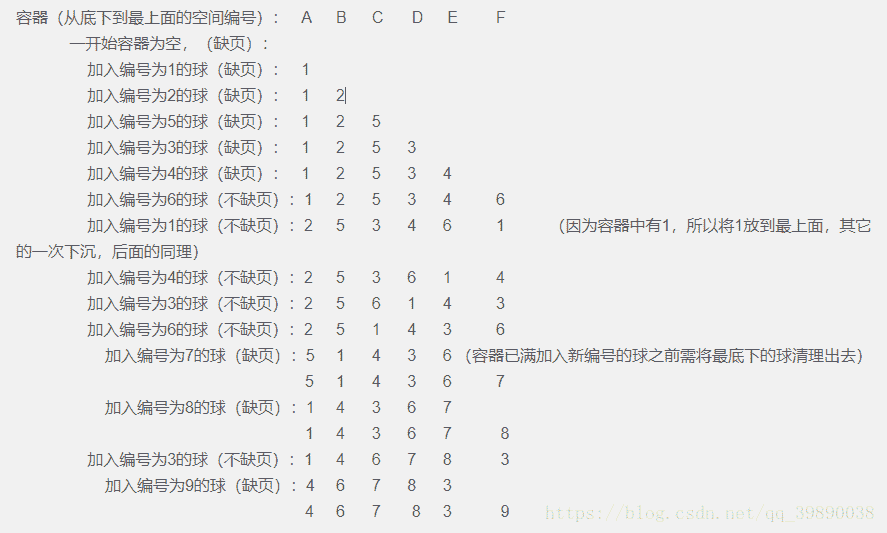

# 滴滴出行 2018 校园招聘内推笔试-测试开发工程师

## 1

【单选】下面哪一项不是黑盒测试设计方法。

正确答案: D   你的答案: 空 (错误)

```cpp
等价类划分
```

```cpp
边界值分析
```

```cpp
正交实验法
```

```cpp
条件组合覆盖
```

本题知识点

测试工程师 滴滴 测试开发工程师 2018

讨论

[好听的 zz](https://www.nowcoder.com/profile/825142401)

常用百盒测试方法有：语句覆盖、路径覆盖、条件覆盖、判定/条件覆盖、条件组合覆盖；常用黑盒测试：等价类划分、边界值分析、判定表法、错误分析法、异常分析法、正交实验法；

发表于 2020-02-28 13:28:27

* * *

[小念宗](https://www.nowcoder.com/profile/967526766)

d

发表于 2019-04-12 15:48:57

* * *

## 2

【单选】设栈 S 和队列 Q 的初始状态均为空，元素 abcdefg 依次进入栈 S。若每个元素出栈后立即进入队列 Q，且 7 个元素出队的顺序是 bdcfeag，则栈 S 的容量至少是（）

正确答案: C   你的答案: 空 (错误)

```cpp
1
```

```cpp
2
```

```cpp
3
```

```cpp
4
```

本题知识点

测试工程师 滴滴 Java 工程师 C++工程师 安卓工程师 iOS 工程师 运维工程师 前端工程师 算法工程师 PHP 工程师 2018 自动驾驶/地图融合 测试开发工程师

讨论

[牛客刷题 001](https://www.nowcoder.com/profile/1489385)

栈**先出的特点。队列先入先出，即队列也是 bdcfeag 开始 a 先入栈，然后 b 入栈，然后 b 出栈，队列 b 然后 c,d 依次入栈，然后 d,c 依次出栈，队列 bcd 然后 e,f 依次入栈，然后 f e 出栈队列 bdcfea 出栈，g 进栈 g 出栈；栈最多时为 3 即 acd 、aef 时栈深度为 3

发表于 2018-09-15 18:04:21

* * *

[零葬](https://www.nowcoder.com/profile/75718849)

b 比 a 早出栈说明栈至少能容纳两个元素，因此根据出栈序列可以分析，a、b 进栈后 b 马上就出栈了。而 d 比 c 先出栈说明接下来 b 和 c 一定依次进栈了，此时栈中为 acd 三个元素，栈的容量至少为 3 才能做到这点。dc 出栈后又进入了 ef，此时栈中元素为 aef，然后才有后面的 fea 出栈序列，此时栈为空，g 入栈后马上出栈即可。因此栈只需要保证容量为 3 就能完成题中的入栈和出栈序列。

发表于 2021-11-28 16:30:08

* * *

## 3

【多选】学校局域网部署了一个图书馆管理系统，该系统架构为，前端页面、静态资源部署在 web 服务器；逻辑处理部署在应用服务器；数据部署在数据库服务器。某一天该系统图书列表页面打开非常缓慢，耗时超过 1 分钟，但首页打开正常，试分析该系统可能存在什么问题

正确答案: B C D E   你的答案: 空 (错误)

```cpp
web 服务器压力太大，导致响应太慢
```

```cpp
应用服务器 cpu 使用率太高，导致响应太慢
```

```cpp
应用服务器 load 飙升，导致响应太慢
```

```cpp
应用服务器 GC 频繁，导致响应太慢
```

```cpp
数据库查询缺少索引，导致响应太慢
```

本题知识点

测试工程师 滴滴 测试开发工程师 2018

讨论

[不喝奶茶！](https://www.nowcoder.com/profile/32534477)

首页打开正常就说明 web 端没有问题，剩下的都有可能有问题

发表于 2019-08-27 18:47:02

* * *

## 4

【多选】以下哪项用例为功能测试

正确答案: A C D   你的答案: 空 (错误)

```cpp
一个测试工程师走进一家酒吧，要了一杯烫烫烫的锟斤拷
```

```cpp
一万个测试工程师冲进酒吧各要了一杯啤酒
```

```cpp
一个测试工程师走进一家酒吧，要了一杯啤酒然后出去了，然后又走进一家酒吧，又要了一杯啤酒
```

```cpp
两个测试工程师并排走进了一家酒吧，各要了一杯啤酒
```

```cpp
一个测试工程师化装成老板走进一家酒吧，要了 500 杯啤酒并且不付钱
```

本题知识点

测试工程师 滴滴 测试开发工程师 2018

讨论

[豆豆妈咪](https://www.nowcoder.com/profile/766061925)

答案准确吗

发表于 2020-01-14 11:41:11

* * *

[不喝奶茶！](https://www.nowcoder.com/profile/32534477)

个人觉得是 ACE，多个人就有点性能测试的意思了咱也不知道为啥 D 对

发表于 2019-08-27 18:48:40

* * *

[猪吗](https://www.nowcoder.com/profile/1666167)

B 是性能测试排除，E 应该也是功能测试吧？

发表于 2019-06-25 13:20:08

* * *

## 5

【单选】网络连接超时设置，可以保护服务端和客户端在弱网环境下的稳定性，下列哪种方法可以验证 http 协议建立连接过程超时阈值设置的有效性

正确答案: B   你的答案: 空 (错误)

```cpp
修改 server 代码，接收 client 请求，sleep 10s，看 client 是否报错
```

```cpp
iptables 设置 TCP ACK 报文丢失，client 连接 server，是否显示连接超时失败
```

```cpp
client 连接 server，发起 POST 请求，关闭 server，client 是否报错
```

```cpp
修改 client 代码，在 GET 方法中，sleep 10s，看 client 是否报错
```

本题知识点

测试工程师 滴滴 测试开发工程师 2018

讨论

[不喝奶茶！](https://www.nowcoder.com/profile/32534477)

题目：网络连接超时设置，可以保护服务端和客户端在弱网环境下的稳定性所以说是测试网络方面的问题，弱网情况会引发丢包问题。

发表于 2019-08-27 18:51:09

* * *

## 6

【单选】在深度学习中，softmax 是一个常用的函数，计算公式如下：
softmax[x(i)] = exp[x(i)] / sum[exp[x(j)]，{i，j = 1...N}，
当这个函数的输入序列 {x0,x1,x2,x3...} 为非常小的负数时，如下描述正确的是：

正确答案: B   你的答案: 空 (错误)

```cpp
分子下溢，结果正常
```

```cpp
分母下溢，结果异常
```

```cpp
分子上溢，结果异常
```

```cpp
分母上溢，结果正常
```

本题知识点

测试工程师 滴滴 Java 工程师 C++工程师 安卓工程师 iOS 工程师 运维工程师 前端工程师 算法工程师 PHP 工程师 2018 测试开发工程师

## 7

【多选】服务上线部署，需要有详细的操作步骤和对应回滚方案，回归方案能够在上线发生异常情况下使服务回到上线前状态，减少上线损失。以下哪些测试点可以有效验证回滚方案？

正确答案: A B C D   你的答案: 空 (错误)

```cpp
配置文件内容能否恢复到上线前
```

```cpp
回滚操作是否产生脏数据
```

```cpp
二进制编译文件能否恢复到上线前
```

```cpp
下游服务启停操作是否对上游无影响
```

本题知识点

测试工程师 滴滴 测试开发工程师 2018

讨论

[不喝奶茶！](https://www.nowcoder.com/profile/32534477)

测试回滚功能，就得各方面都测。

发表于 2019-08-27 18:52:02

* * *

## 8

【单选】若数据元素序列 11，12，13，7，8，9，23，4，5 是采用下列排序方法之一得到的第二趟排序后的结果，则该排序算法只能是（）

正确答案: B   你的答案: 空 (错误)

```cpp
冒泡排序
```

```cpp
插入排序
```

```cpp
选择排序
```

```cpp
归并排序
```

本题知识点

测试工程师 滴滴 Java 工程师 C++工程师 安卓工程师 iOS 工程师 运维工程师 前端工程师 算法工程师 PHP 工程师 2018 自动驾驶/地图融合 测试开发工程师

讨论

[夏花爱秋叶](https://www.nowcoder.com/profile/4085682)

冒泡排序和选择排序在每一轮都会选出当前最大/最小的元素，然而很明显顶部和尾部都不是符合最大最小的要求的。然后不懂归并排序，而直接插入排序是符合 11 12 13 这种情况的，所以我选插入排序

发表于 2020-03-15 23:18:11

* * *

[牛客 136702949 号](https://www.nowcoder.com/profile/136702949)

为啥不是归并排序呢

发表于 2020-08-20 22:04:52

* * *

## 9

【单选】操作系统中可以使用 LRU(least recently used)内存淘汰旧数据的策略，如果内存需要加载新数据但空间又不足，则会按照最近访问时间进行排序，并将最老的数据淘汰，假设现在内存空间大小为 6，原本内存中没有数据，对内存中数据的访问顺序如下： 1,2,5,3,4,6,1,4,3,6,7,8,3,9，则缺页次数为（）

正确答案: A   你的答案: 空 (错误)

```cpp
9
```

```cpp
4
```

```cpp
10
```

```cpp
5
```

本题知识点

测试工程师 滴滴 Java 工程师 C++工程师 安卓工程师 iOS 工程师 运维工程师 前端工程师 算法工程师 PHP 工程师 自动驾驶/地图融合 2018 测试开发工程师

讨论

[Ankang0320](https://www.nowcoder.com/profile/866249541)

**LRU 栈**：当前引用不在栈中，且栈未满，放到栈顶；栈满，删除栈底，放到栈顶。当前引用在栈中，删除栈中原先位置，放到栈顶。**缺页**：当前引用不在页的某个帧中，即缺页。而 LRU 只是确定被置换的那个引用，即 LRU 栈底引用。前 6 次均缺页，因为每次的引用都不在已有的页中，**缺页次数 6**，LRU 栈：6->4->3->5->2->1 第 7 次为 1，在页中，不缺页，LRU 栈：1->6->4->3->5->2 第 8 次为 4，在页中，不缺页，LRU 栈：4->1->6->3->5->2 第 9 次为 3，在页中，不缺页，LRU 栈：3->4->1->6->5->2 第 10 次为 6，在页中，不缺页，LRU 栈：6->3->4->1->5->2 第 11 次为 7，不在页中，**缺页**。删除栈底 2，将 7 放到栈顶。LRU 栈：7->6->3->4->1->5 第 12 次为 8，不在页中，**缺页**。删除栈底 5，将 8 放到栈顶。LRU 栈：8->7->6->3->4->1 第 13 次为 3，在页中，不缺页。LRU 栈：3->8->7->6->4->1 第 14 次为 9，不在页中，**缺页**。删除栈底 1，将 9 放到栈顶。LRU 栈：9->3->8->7->6->4 **综上，缺页 9 次。**

编辑于 2019-08-20 12:11:28

* * *

[守望麦田](https://www.nowcoder.com/profile/2115381)

下面是我的理解，容器大小即内存空间大小，清理即淘汰掉。最后可以数出缺页次数为 9 次。

发表于 2018-08-25 21:31:53

* * *

## 10

【单选】对于满足 SQL92 标准的 SQL 语句：SELECT foo,count(foo) FROM pokes WHERE foo>10 GROUP BY foo HAVING ORDER BY foo，其执行的顺序应该为（）

正确答案: A   你的答案: 空 (错误)

```cpp
FROM-&gt;WHERE-&gt;GROUP BY-&gt;HAVING-&gt;SELECT-&gt;ORDER BY
```

```cpp
FROM-&gt;GROUP BY-&gt;WHERE-&gt;HAVING-&gt;SELECT-&gt;ORDER BY
```

```cpp
FROM-&gt;WHERE-&gt;GROUP BY-&gt;HAVING-&gt;ORDER BY-&gt;SELECT
```

```cpp
FROM-&gt;WHERE-&gt;ORDER BY-&gt;GROUP BY-&gt;HAVING-&gt;SELECT
```

本题知识点

测试工程师 滴滴 测试开发工程师 2018

讨论

[编号 11](https://www.nowcoder.com/profile/558955876)

sql 执行顺序 
(1)from 
(3) join 
(2) on 
(4) where 
(5)group by(开始使用 select 中的别名，后面的语句中都可以使用)
(6) avg,sum.... 
(7)having 
(8) select 
(9) distinct 
(10) order by 

发表于 2019-08-24 09:24:31

* * *

[莉 201907121139628](https://www.nowcoder.com/profile/801174445)

    A，SQL 的执行顺序是 from ，where，group by ，having，select ，order by ，limit

发表于 2019-07-12 13:15:30

* * *

[Yelldon](https://www.nowcoder.com/profile/509370645)

A

发表于 2018-09-26 15:07:19

* * *

## 11

给定无序整数序列，求其中第 K 大的数，例如{45，67，33，21}，第 2 大数为 45

本题知识点

滴滴 Java 工程师 iOS 工程师 C++工程师 运维工程师 安卓工程师 算法工程师 前端工程师 PHP 工程师 测试工程师 排序 *查找 *堆 系统工程师 2018 自动驾驶/地图融合 测试开发工程师** **讨论

[华科平凡](https://www.nowcoder.com/profile/4939096)

python3 解法

```cpp
print(sorted(map(int, input().split()))[-int(input())]) 
```

发表于 2019-02-23 10:26:06

* * *

[sunn4room](https://www.nowcoder.com/profile/597526628)

```cpp
import java.util.Scanner;
import java.util.PriorityQueue;

public class Main {
    public static void main( String[] args ) {
        Scanner sc = new Scanner( System.in );
        while( sc.hasNext() ) {
            Scanner num = new Scanner( sc.nextLine() );
            int k = sc.nextInt();
            PriorityQueue<Integer> queue =
                    new PriorityQueue<>( (Integer i1, Integer i2)->i1-i2 );
            for( int i = 0; i < k; i ++ )
                queue.offer( num.nextInt() );
            while( num.hasNextInt() ) {
                int tmp = num.nextInt();
                if( tmp > queue.peek() ) {
                    queue.poll();
                    queue.offer( tmp );
                }
            }
            System.out.println( queue.peek() );
        }
        sc.close();
    }
}

```

发表于 2019-01-23 19:53:35

* * *

[零葬](https://www.nowcoder.com/profile/75718849)

可以用快速选择算法，均摊时间复杂度为 O(N)

```cpp
import java.io.BufferedReader;
import java.io.InputStreamReader;
import java.io.IOException;

public class Main {
    public static void main(String[] args) throws IOException {
        BufferedReader br = new BufferedReader(new InputStreamReader(System.in));
        String[] strArr = br.readLine().split(" ");
        int[] arr = new int[strArr.length];
        for (int i = 0; i < arr.length; i++) arr[i] = Integer.parseInt(strArr[i]);
        int k = Integer.parseInt(br.readLine());
        System.out.println(quickSelect(arr, 0, arr.length - 1, k - 1));
    }
    private static int quickSelect(int[] arr, int left, int right, int k) {
        int p = partition(arr, left, right);     // 划分元素已经到了倒数第 k，直接返回
        if(p == k)
            return arr[p];
        else if (p < k)
            return quickSelect(arr, p + 1, right, k);
        else
            return quickSelect(arr, left, p - 1, k);
    }

    private static int partition(int[] arr, int left, int right) {
        int pivot = arr[left];
        int p = left;
        for(int i = left + 1; i <= right; i++){
            if(pivot < arr[i]){
                p ++;
                swap(arr, p, i);
            }
        }
        swap(arr, left, p);
        return p;
    }

    private static void swap(int[] arr, int i, int j) {
        int cache = arr[i];
        arr[i] = arr[j];
        arr[j] = cache;
    }
}
```

也可以直接用小根堆解决，小根堆中只进入大的元素。

```cpp
import java.lang.System;
import java.io.BufferedReader;
import java.io.InputStreamReader;
import java.io.IOException;
import java.util.PriorityQueue;

public class Main {
    public static void main(String[] args) throws IOException {
        BufferedReader br = new BufferedReader(new InputStreamReader(System.in));
        String[] strArr = br.readLine().split(" ");
        int k = Integer.parseInt(br.readLine());
        int[] arr = new int[strArr.length];
        for(int i = 0; i < arr.length; i++) arr[i] = Integer.parseInt(strArr[i]);
        PriorityQueue<Integer> minHeap = new PriorityQueue<>();
        for(int i = 0; i < arr.length; i++){
            if(minHeap.size() < k){
                minHeap.offer(arr[i]);     // 容量还未到 k，直接入堆
            }else{
                if(arr[i] > minHeap.peek()){
                    // 容量到达 k，如果当前元素能干掉堆顶，就弹出堆顶，新元素入堆
                    minHeap.poll();
                    minHeap.offer(arr[i]);
                }
            }
        }
        System.out.println(minHeap.peek());    // 最终堆顶就是 k 个大元素中最小的，即第 k 大的元素
    }
}
```

编辑于 2021-11-28 13:24:48

* * *

## 12

给定无序整数序列，求连续非空子串最大和，例如{-23 17 -7 11 -2 1 -34}，子串为{17,-7,11}，最大和为 21

本题知识点

滴滴 贪心 动态规划 系统工程师 2018 算法工程师 运维工程师 自动驾驶/地图融合 测试开发工程师

讨论

[kent_iso](https://www.nowcoder.com/profile/842320939)

```cpp
nums =list(map(int,input().split()))

fori inrange(1,len(nums)):
    ifnums[i-1]>0:
        nums[i]+=nums[i-1]
print(max(nums))
```

发表于 2019-08-27 16:47:40

* * *

[wylu](https://www.nowcoder.com/profile/8627786)

```cpp
import java.util.Scanner;

/**
 * Dynamic Programming
 *
 * State:
 *   dp[i]: 以 a[i]为结尾的连续子串的最大和
 *
 * Initial State:
 *   dp[0] = a[0]
 *
 * State Transition:
 *   if (dp[i - 1] >= 0) dp[i] = dp[i - 1] + a[i];
 *   else dp[i] = a[i];
 *
 * @author wylu
 */
public class Main {
    public static void main(String[] args) {
        Scanner scanner = new Scanner(System.in);
        while (scanner.hasNext()) {
            String[] strs = scanner.nextLine().split(" ");
            int[] a = new int[strs.length];
            for (int i = 0; i < strs.length; i++) {
                a[i] = Integer.valueOf(strs[i]);
            }

            int[] dp = new int[a.length];
            dp[0] = a[0];
            int res = dp[0];
            for (int i = 1; i < a.length; i++) {
                dp[i] = (dp[i - 1] >= 0) ? dp[i - 1] + a[i] : a[i];
                res = Math.max(res, dp[i]);
            }
            System.out.println(res);
        }
    }
}

```

发表于 2019-01-11 11:06:29

* * *

[零葬](https://www.nowcoder.com/profile/75718849)

动态规划，当遍历到**arr[i]**时，记**dp**为以**arr[i-1]**结尾时的最大和。如果它是非负数，就直接累加上**arr[i]**的值；如果是负数，那前面的累加做出的就是负贡献，需要重新开始**dp=arr[i]**累加。

```cpp
import java.io.BufferedReader;
import java.io.InputStreamReader;
import java.io.IOException;

public class Main {
    public static void main(String[] args) throws IOException {
        BufferedReader br = new BufferedReader(new InputStreamReader(System.in));
        String[] strArr = br.readLine().split(" ");
        if(strArr.length == 0){
            System.out.println(0);
        }else if(strArr.length == 1){
            System.out.println(Integer.parseInt(strArr[0]));
        }else{
            int[] arr = new int[strArr.length];
            for(int i = 0; i < arr.length; i++) arr[i] = Integer.parseInt(strArr[i]);
            int maxSum = arr[0];
            int dp = arr[0];
            for(int i = 1; i < arr.length; i++){
                dp = dp < 0? arr[i]: dp + arr[i];
                maxSum = Math.max(maxSum, dp);
            }
            System.out.println(maxSum);
        }
    }
}
```

发表于 2021-11-28 16:22:02

* * *

## 13

【单选】有二十五匹速度各不相同的马来赛跑，一次只能跑五匹，每匹马每次跑的状态稳定，没有计时设备，那么请问：最少需要多少次才能找出跑得最快的三匹马

正确答案: B   你的答案: 空 (错误)

```cpp
6
```

```cpp
7
```

```cpp
8
```

```cpp
11
```

本题知识点

Java 工程师 C++工程师 安卓工程师 iOS 工程师 运维工程师 前端工程师 算法工程师 PHP 工程师 测试工程师 滴滴 系统工程师 2018 自动驾驶/地图融合 测试开发工程师

讨论

[笑一笑乐一乐](https://www.nowcoder.com/profile/4687509)

假设分为 A B C D E 五组，五组各进行一次比赛，得出对应的第一名 A1 B1 C1 D1 E1，然后让这 5 个比赛，对 A1 B1 C1 D1 E1 名次先后进行排序，假设排序结果为 A1 B1 C1 D1 E1，则可判断，D E 两组完全被淘汰，此时已经比赛了 6 次，可得出以下结论：因为 A1>A2>A3>A4>A5,所以 A4 和 A5 被淘汰，A1>B1>B2>B3>B4>B5, 所以 B3、B4、B5 被淘汰，同理 C2 到 C5 被淘汰，那么还剩下，A1、A2、A3、B1、B2、C1,共 6 匹马，但是 A1 是第一，是确定的，所以，剩下的 A2、A3、B1、B2、C1 进行一次比赛来确定，第 2，3 名就行了，所以共 7 次比赛

编辑于 2018-08-31 17:39:12

* * *

[Demo20180727144828](https://www.nowcoder.com/profile/775854607)

首先第一批 5 个 5 个跑，跑 5 次分别找出最快的，然后将这 5 个跑得最快的再去比找出前三个，然后把这三批马的二三名去跟第一名所在原先的那一批 5 个马的二三四名去比赛 可以得到答案

发表于 2018-08-17 14:11:12

* * *

[xxxxxxxxxxxxxxxa](https://www.nowcoder.com/profile/4397117)

如下面所说的，但是在进行第 7 次比赛的时候，是根据情况分类的,假设第 6 次比赛的情况为 A1 B1 C1 D1 E1
1\. 三马同曹，则结果为 A2 A32\. 两马同曹，则结果为 A2 或 B1 B23\. 无马同曹，则结果为 B1 C1 最后加起来 检查 A2 A3 B1 B2 C1 ，其中最快的两匹就是 top 2 top3
此题和以前有个题很像，换汤不换药。

发表于 2018-08-22 23:38:58

* * *

## 14

【单选】每个飞机只有一个油箱,飞机之间可以相互加油（注意是相互,没有加油机）,一箱油可供一架飞机绕地球飞半圈. 问：为使至少一架飞机绕地球一圈回到起飞时的飞机场,至少需要出动几架飞机? （所有飞机从同一机场起飞,而且必须安全返回机场,不允许中途降落,中间没有飞机场）

正确答案: C   你的答案: 空 (错误)

```cpp
3
```

```cpp
4
```

```cpp
5
```

```cpp
6
```

本题知识点

Java 工程师 C++工程师 安卓工程师 iOS 工程师 运维工程师 前端工程师 算法工程师 PHP 工程师 测试工程师 滴滴 系统工程师 2018 自动驾驶/地图融合 测试开发工程师

讨论

[小冲冲](https://www.nowcoder.com/profile/4754385)

在网上看了别人的答案才知道怎么做￣へ￣。每台飞机满油状态可以飞 1/2 圈，那么每个飞机最多可以携带 1/2 圈的油量；1、A B C 三个飞机同时起飞，飞到 1/8 处，三个飞机都消耗了 1/8 的油量，然后 A 用自己的油把 B 和 C 同时加到满油状态，自己剩余 1/8 的油量返回 2、B C 飞行岛 1/4 圈的时候，现在都剩余 3/8 的油量，B 用自己的油给 C 加满，B 剩余 1/4 的油量返回 3、C 这个时候的状态可以飞行到 3/4 圈的位置，这个时候让 D 提前反方向飞行，保证 D C 在 3/4 的位置，这个时候 D 剩余 1/4 的油量，C 空油，然后 D 分享 1/8 的油量给 C，这个时候 C 和 D 分别有 1/8 圈的油量，继续飞行 4、C D 的状态可以飞行到 7/8 圈的位置，让 E 提前反方向飞行，保证 C D E 在 7/8 圈的位置，这个时候 E 剩余 3/8 圈的油量，C D 空油，然后 E 分别给 C 和 D 1/8 圈的油量，然后三个飞机就可以愉快的飞回了。

发表于 2018-08-17 17:18:09

* * *

[noisy](https://www.nowcoder.com/profile/231924)

排除法：飞机数量必然为奇数+A 选项不可能。奇数条件意会一下。

发表于 2018-08-18 21:03:46

* * *

## 15

【单选】房间里有 8 人，分别佩戴着从 1 号到 8 号的纪念章，任选 3 人记录其纪念章号码，最大的号码为 6 的概率()

正确答案: D   你的答案: 空 (错误)

```cpp
1/4
```

```cpp
9/28
```

```cpp
3/14
```

```cpp
5/28
```

本题知识点

Java 工程师 C++工程师 安卓工程师 iOS 工程师 运维工程师 前端工程师 算法工程师 PHP 工程师 测试工程师 滴滴 系统工程师 2018 自动驾驶/地图融合 测试开发工程师

讨论

[Demo20180727144828](https://www.nowcoder.com/profile/775854607)

C52/C83

发表于 2018-08-17 14:12:45

* * *

[零葬](https://www.nowcoder.com/profile/75718849)

总共有种选法，如果选的最大值为 6，那剩下两个就是 1~5 中选出来的两个，一共有种，概率为

发表于 2021-11-28 16:16:24

* * *

[牛客 422911243 号](https://www.nowcoder.com/profile/422911243)

从 8 个里任选 3 人 C83，要求最大为 6，则必有一人章为 6，其余两人从 1~5 号章任选 C52,则最后答案为 C52 除以 C83,答案为 5/28

发表于 2020-09-05 11:02:05

* * *

## 16

【单选】小桔 A 和小桔 B 轮流在方桌上放硬币，规则是硬币不能互相覆盖，谁最后没有地方放为输，请问下面哪个答案正确

正确答案: B   你的答案: 空 (错误)

```cpp
后放者有必胜策略
```

```cpp
先放者有必胜策略
```

```cpp
无论谁都没有必胜策略
```

本题知识点

Java 工程师 C++工程师 安卓工程师 iOS 工程师 运维工程师 前端工程师 算法工程师 PHP 工程师 测试工程师 滴滴 系统工程师 2018 自动驾驶/地图融合 测试开发工程师

讨论

[——佚名](https://www.nowcoder.com/profile/6925604)

先放者先把最中间的位置放了，然后不管后放者放哪，先放者就放其以中间点为中点的中心对称的位置，只要后放者能放下，先放者就一定能放下。

发表于 2018-08-20 18:11:15

* * *

[Demo20180727144828](https://www.nowcoder.com/profile/775854607)

这种问题先假设一种极端现象，就是只有放两个钢镚的位置，如果甲先放，甲先放到桌子的正***，这样乙就无法放置 失败 

发表于 2018-08-17 14:15:08

* * *

[Veming](https://www.nowcoder.com/profile/4586913)

甲在桌子上放满，乙就没法放了

发表于 2018-08-20 11:48:02

* * *

## 17

【单选】滴滴出行年会大 Party 已经开始筹划，小明作为总策划人，计划来一个“专车送喜”的节目引爆全场。节目主要是把神秘礼物放在一个大铁球中，铁球固定在牢固的地桩上，然后用汽车拉开铁球释放神秘礼物。任一铁球拉开所需的汽车数量一模一样，且拉开后不可恢复，铁球可能只要 1 辆车就能拉开，也可能要 100 辆车才能拉开。年会前 2 个测试用的铁球已经送到，现在小明请你用这 2 个铁球、100 辆车（每辆车提供的马力一样）来测试每个铁球至少需要配多少辆车才能拉开。聪明的你最少要经过多少次测试能得出结论呢？

正确答案: B   你的答案: 空 (错误)

```cpp
12
```

```cpp
14
```

```cpp
25
```

```cpp
33
```

本题知识点

Java 工程师 C++工程师 安卓工程师 iOS 工程师 运维工程师 前端工程师 算法工程师 PHP 工程师 测试工程师 滴滴 系统工程师 2018 自动驾驶/地图融合 测试开发工程师

讨论

[——佚名](https://www.nowcoder.com/profile/6925604)

经典丢鸡蛋问题。。

发表于 2018-08-20 20:45:46

* * *

[风萧兮。](https://www.nowcoder.com/profile/1931021)

感觉。二分法可以求解啊、50 辆拉不开，那就 75 辆，反之，25 辆，。。7 次就够了啊。。难道是我想错了么？

发表于 2018-08-20 21:20:19

* * *

[tjc96](https://www.nowcoder.com/profile/47085898)

第一个球：用 14，27，39，50，60，69，77，84，90，95，99 辆车来试；第二个球：在对应区域从小到大来试就行了；

发表于 2019-11-13 10:59:31

* * *

## 18

【单选】计算 P=1111+1111*2+1111*3+…+1111*1111,P 除以 5 的余数是多少？

正确答案: B   你的答案: 空 (错误)

```cpp
0
```

```cpp
1
```

本题知识点

Java 工程师 C++工程师 安卓工程师 iOS 工程师 运维工程师 前端工程师 算法工程师 PHP 工程师 测试工程师 滴滴 系统工程师 2018 自动驾驶/地图融合 测试开发工程师

讨论

[自从厌倦于追寻](https://www.nowcoder.com/profile/4042909)

个人觉得算尾数就行了……也就是 1111*(1+2+3+……+1111)，看尾数，忽略 1111，也就是后面的 1111 个数的和=(1+1111)*1111/2=556*1111，继续看尾数，忽略 1111，556 的尾数是 6，6%5==1。

发表于 2018-08-19 17:28:49

* * *

[xxxxxxxxxxxxxxxa](https://www.nowcoder.com/profile/4397117)

(1111*556*1111)%5=((1111*555*1111)%5+(1111*1110)%5+1110%5+1%5)%5=1

发表于 2018-08-23 15:56:08

* * *

## 19

【单选】某粮仓有 60 万担粮食，现需要给前线运送粮食，粮仓距离前线行程有 15 天，但是运粮队每次只能携带 30 万担粮食，且每天行军需要消耗 1 万担粮食，问其最多能将多少万担粮食运到前线？

正确答案: C   你的答案: 空 (错误)

```cpp
15
```

```cpp
20
```

```cpp
25
```

```cpp
30
```

本题知识点

Java 工程师 C++工程师 安卓工程师 iOS 工程师 运维工程师 前端工程师 算法工程师 PHP 工程师 测试工程师 滴滴 系统工程师 2018 自动驾驶/地图融合 测试开发工程师

讨论

[xxxxxxxxxxxxxxxa](https://www.nowcoder.com/profile/4397117)

有一种思路是倒推，最后一次一定是满载，假设这返的点为 X 则 X 的路程走了 3 次，
60=3x+30x=10，这里隐藏结论就是 60 一定被拿完，最后一段路一定是满载 30 前面的老铁抱拳了

发表于 2018-08-25 20:53:11

* * *

[我亦思念](https://www.nowcoder.com/profile/311024878)

假设 折返的点距离起点的距离为 x。那么起点到折返的点至少要反复走 3 次。最后一段一定是满载的为 30，则 3x + 30 = 60； 解得 x = 10；即要先运 30w 担到 10 天处，留下 10w 担在原地然后返回(返回也要消耗 10w 担)；再将剩余的 30w 担运到 10 天处，此时一共有 10w+20w = 30w 担，带着这 30w 担走完最后 5 天的路程，还剩 25w 担

发表于 2020-08-20 21:38:07

* * *

[Vesan](https://www.nowcoder.com/profile/544191846)

正确解释来啦先运 30 万担粮食到 10 天处，留下 10w 担粮食然后返回，再将剩余粮食运到 10 天处，带上之前 10 万粮食走完剩余的 5 天路程。

发表于 2019-09-01 22:26:06

* * *

## 20

【单选】两个口袋，每个口袋里都装着 60 个红球与 40 个白球，有两人各自从一个口袋抽了一个球。 则抽出不同色球的概率为 :

正确答案: D   你的答案: 空 (错误)

```cpp
0.5
```

```cpp
0.24
```

```cpp
0.3
```

```cpp
0.48
```

本题知识点

Java 工程师 C++工程师 安卓工程师 iOS 工程师 运维工程师 前端工程师 算法工程师 PHP 工程师 测试工程师 滴滴 系统工程师 2018 自动驾驶/地图融合 测试开发工程师

讨论

[🍰201903181202191](https://www.nowcoder.com/profile/309690956)

抽出两个红球的概率：0.6*0.6 = 0.36 抽出两个白球的概率：0.4*0.4 = 0.16
**一红一白：1 - 0.36 - 0.16 = 0.48**

发表于 2019-08-27 15:22:16

* * *

[零葬](https://www.nowcoder.com/profile/75718849)

每个袋子抽到红球的概率为 0.6，抽到白球的概率为 0.4，两个袋子要抽到颜色不一样的球，只需要第一个袋子抽到红色，第二个袋子抽到白色；或者第一个袋子抽到白色，第二个袋子抽到红色。概率为 p=0.4*0.6*2=0.48。

发表于 2021-11-28 16:10:41

* * *

[Demo20180727144828](https://www.nowcoder.com/profile/775854607)

2 乘以 0.4 乘以 0.6

发表于 2018-08-17 14:19:57

* * *

## 21

【多选】甲和乙一起玩游戏——抢数字，设置要抢的数字是 S，每次只能数 N 个（5<=N<=10），两人轮流数。最后谁数到 S 谁获胜，若甲先开始，那么当 S 为多少时候甲必胜？（）

正确答案: A B   你的答案: 空 (错误)

```cpp
2017
```

```cpp
2019
```

```cpp
2021
```

```cpp
2023
```

本题知识点

Java 工程师 C++工程师 安卓工程师 iOS 工程师 运维工程师 前端工程师 算法工程师 PHP 工程师 测试工程师 滴滴 系统工程师 2018 自动驾驶/地图融合 测试开发工程师

讨论

[小冲冲](https://www.nowcoder.com/profile/4754385)

甲只要可以再取完一次之后剩下的数字是 15 的倍数即可，这样甲就可以一直保持这个状态一直到结束，例如甲取完还剩 15，那么无论乙怎么取，甲都可以把最后的取完。四个选项的模 15 的余数分别是 7 9 11 13，所有 A B 选项分别取 7 个和 9 个就可以一直保持剩余的数是 15 的倍数，所以 AB 的时候甲是一定会赢的。

发表于 2018-08-17 16:57:50

* * *

[xxqin](https://www.nowcoder.com/profile/341182)

思路类似于圆桌放硬币。先放在中心点，然后对方不管怎么放，只需要放在相对于中心点对称的地方。这里也可以找到对称的思想，即乙放 N，甲就放对称的数目 15-N，比如乙 7 甲 8；乙 6 甲 9 等。

发表于 2018-08-19 14:04:28

* * *

[Demo20180727144828](https://www.nowcoder.com/profile/775854607)

极端分析 假设 N 就是 10

发表于 2018-08-17 14:21:59

* * *

## 22

【单选】数列中哪个数不属于这个队列：
2 - 3 - 6 - 7 - 8 - 14 - 15 - 30

正确答案: C   你的答案: 空 (错误)

```cpp
3
```

```cpp
7
```

```cpp
8
```

```cpp
15
```

本题知识点

Java 工程师 C++工程师 安卓工程师 iOS 工程师 运维工程师 前端工程师 算法工程师 PHP 工程师 测试工程师 滴滴 系统工程师 2018 自动驾驶/地图融合 测试开发工程师

讨论

[零葬](https://www.nowcoder.com/profile/75718849)

把 8 去掉得：2, 3, 6, 7, 14, 15, 30；偶数项满足当前项为前一项乘 2 再加 1，奇数项满足当前项为前一项乘 2 再加 2。

发表于 2021-11-28 16:08:24

* * *

[Demo20180727144828](https://www.nowcoder.com/profile/775854607)

规律是这样 X x+1 2x

发表于 2018-08-17 14:21:26

* * ***