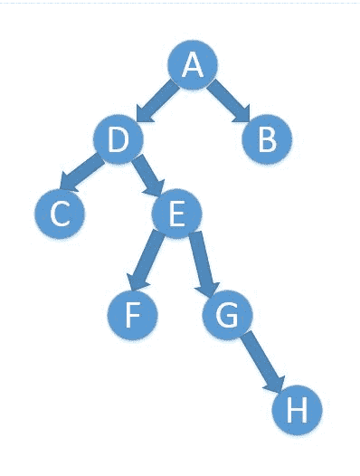

# 滴滴出行 2018 校园招聘网申笔试-测试开发工程师（第一批）

## 1

把只包含因子 2、3 和 5 的数称作丑数（Ugly Number）。例如 6、8 都是丑数，但 14 不是，因为它包含因子 7。 习惯上我们把 1 当做是第一个丑数。求按从小到大的顺序的第 N 个丑数。

本题知识点

滴滴 Java 工程师 iOS 工程师 C++工程师 运维工程师 安卓工程师 算法工程师 前端工程师 PHP 工程师 测试工程师 穷举 数学 查找 *测试开发工程师 2018 系统工程师 数据挖掘工程师 自动驾驶/地图融合* *讨论

[华科平凡](https://www.nowcoder.com/profile/4939096)

python 一行解法

```cpp
print(sorted([2**i*3**j*5**k  for i in range(30)  for j in range(20)   for k in range(15)])[int(input())-1] )
```

编辑于 2019-02-24 13:57:06

* * *

[2222w](https://www.nowcoder.com/profile/5582669)

```cpp
def ugly(n):
    res = [1]
    if n <=1 :
        return max(n,0)
    else:
        index2, index3, index5 = 0,0,0
        i = 0
        while i < n:
            i += 1
            res.append(min(res[index2]*2,res[index3]*3,res[index5]*5))
            if res[i] == res[index2]*2:
                index2 += 1
            if res[i] == res[index3]*3:
                index3 += 1
            if res[i] == res[index5]*5:
                index5 += 1
        return res[n-1] 
```

用 python 写的

发表于 2018-08-24 15:56:12

* * *

[八歌](https://www.nowcoder.com/profile/7818035)

剑指 offer 上有这道题，感兴趣可以去看我之前写的[`blog.csdn.net/qq_34528297/article/details/72861876`](https://blog.csdn.net/qq_34528297/article/details/72861876)

```cpp
public class Main {
    public static void main(String args[]){

        Scanner scanner = new Scanner(System.in);
        while (scanner.hasNext()){
            int n = scanner.nextInt();
            System.out.println(getTarget(n));
        }
    }

    public static int getTarget(int n){
        int[] arr = new int[n];
        arr[0] = 1;
        int t1 = 0;
        int t2 = 0;
        int t3 = 0;

        int nextNum = 1;
        while (nextNum < n){
            arr[nextNum] = Math.min((Math.min(arr[t1]*2,arr[t2]*3)),arr[t3]*5);
            if(arr[t1]*2 <= arr[nextNum])
                t1++;
            if(arr[t2]*3 <= arr[nextNum])
                t2++;
            if(arr[t3]*5 <= arr[nextNum])
                t3++;
            nextNum++;
        }

        return arr[n - 1];
    }
}

```

编辑于 2018-08-30 00:24:34

* * *

## 2

给出 n 个数字 a_1,...,a_n，问最多有多少不重叠的非空区间，使得每个区间内数字的 xor 都等于 0。

本题知识点

滴滴 Java 工程师 iOS 工程师 C++工程师 运维工程师 安卓工程师 算法工程师 前端工程师 PHP 工程师 测试工程师 贪心 哈希 *测试开发工程师 2018 系统工程师 数据挖掘工程师 自动驾驶/地图融合* *讨论

[牛客 692333551 号](https://www.nowcoder.com/profile/692333551)

题都没读懂 43,0,2,2 怎么得到 2 的？

编辑于 2021-07-16 15:49:32

* * *

[卖报人](https://www.nowcoder.com/profile/3484782)

```cpp
//感觉可以优化，但是通过了= =
//直观的思路
#include<iostream>
using namespace std;

int main() {
    int n;
    cin>>n;
    int a[n];
    for(int i = 0; i < n; i++) {
        cin>>a[i];
    }
    int dp[n][n][2];
    for(int i = 0; i < n; i++) {
        dp[i][i][0] = a[i];
        dp[i][i][1] = (a[i] == 0) ? 1:0;
    }

    for(int j = 1; j < n; j++) {
        for(int i = 0; i+j < n; i++) {
            dp[i][i+j][0] = dp[i][i+j-1][0]^a[i+j];
            dp[i][i+j][1] = (dp[i][i+j][0] == 0) ? 1:0;
            for(int k = 0; k < j; k++) {
                dp[i][i+j][1] = max(dp[i][i+j][1], dp[i][i+k][1]+dp[i+k+1][i+j][1]);
            }
        }
    }
    cout<<dp[0][n-1][1]<<endl;

    return 0;
}
```

发表于 2020-07-04 14:29:17

* * *

[nbgao](https://www.nowcoder.com/profile/211289)

```cpp
#include <bits/stdc++.h>
using namespace std;

int main(){
    int n, x, s=0, cnt=0;
    scanf("%d", &n);
    unordered_map<int, bool> mp;
    mp[0] = true;
    while(n--){
        scanf("%d", &x);
        s ^= x;
        if(mp[s]){
            cnt++;
            mp.clear();
        }
        mp[s] = true;
    }
    printf("%d\n", cnt);
    return 0;
}
```

发表于 2020-11-05 01:04:40

* * *

## 3

【单选】已知一棵二叉树，如果先序遍历的节点顺序是：ADCEFGHB，中序遍历是：CDFEGHAB，则后序遍历结果为（）

正确答案: D   你的答案: 空 (错误)

```cpp
CFHGEBDA
```

```cpp
CDFEGHBA
```

```cpp
FGHCDEBA
```

```cpp
CFHGEDBA
```

本题知识点

Java 工程师 C++工程师 安卓工程师 iOS 工程师 运维工程师 前端工程师 算法工程师 PHP 工程师 测试工程师 滴滴 测试开发工程师 2018 数据挖掘工程师 自动驾驶/地图融合

讨论

[秀儿 _](https://www.nowcoder.com/profile/351926494)

先序遍历  根左右    得出 A 是节点    D 是左子树中序遍历   左根右    得出 A 的右子树只有 B   （CD）C 是 D 的左节点从先序遍历中的 DCE 得到 E 为 D 的右节点。中序遍历的 FEG 得到  F 和 G 为 E 的左右节点  GH 得到 H 为 G 的右节点

发表于 2018-09-13 20:57:26

* * *

[hi~hwq](https://www.nowcoder.com/profile/994450752)

利用二叉树的特性来看：特性(1)，对于前序遍历，第一个肯定是根节点；//由此 A 为根节点，左右分支确定
特性(2)，对于后序遍历，最后一个肯定是根节点；
特性(3)，利用前序或后序遍历，确定根节点，在中序遍历中，根节点的两边就可以分出左子树和右子树；
特性(4)，对左子树和右子树分别做前面 3 点的分析和拆分，相当于做递归，我们就可以重建出完整的二叉树；



发表于 2019-03-14 11:15:21

* * *

[Robin201908131105584](https://www.nowcoder.com/profile/421987241)

二叉树的遍历，就是按照某条搜索路径访问树中的每一个结点，使得每个结点均被访问一次，而且仅被访问一次。常见的遍历次序有：

先序遍历：先访问根结点，再访问左子树，最后访问右子树
中序遍历：先访问左子树，再访问根结点，最后访问右子树
后序遍历：先访问左子树，再访问右子树，最后访问根结点

发表于 2019-08-28 15:57:35

* * *

## 4

【单选】某应用通过双 buffer 动态加载数据配置文件，流程如下

```cpp
function reload(){
    if(检查文件存在){
        if(距离上次配置更新时间 < 阈值){
            log(); 忽略更新
            return;
        }
        if(文件不为空 && 文件内容发生改变){
            ret = new_buffer.loadconfig(); // 分配新 buffer 内存并加载配置
            if(ret != SUCCESS){
                log();//打印报错日志
            }
        }
        switch(old_buffer, new_buffer) // 切换双 buffer
        clear(old_buffer) // 释放旧 buffer 内存
    }
}
```

以下可能出现的情况是：

正确答案: C   你的答案: 空 (错误)

```cpp
配置文件频繁发生更新，导致 cpu 负载过高
```

```cpp
反复 reaload 后应用发生内存泄漏
```

```cpp
配置文件格式错误，new_buffer 加载出错，服务配置失效
```

```cpp
由于误操作，配置文件被删除，服务配置失效
```

本题知识点

C++工程师 滴滴 测试开发工程师 2018 C++

讨论

[努力奋斗冲冲冲](https://www.nowcoder.com/profile/7221306)

if(ret != SUCCESS){
log();//打印报错日志
} 在分配新 buffer 内存并加载配置后，失败情况下未退出，程序继续执行，导致配置文件有误

发表于 2020-09-29 00:27:08

* * *

[牛客 870095567 号](https://www.nowcoder.com/profile/870095567)

明明是单选。还得写多选.....

发表于 2021-08-31 14:49:45

* * *

[黄俊尹](https://www.nowcoder.com/profile/262605718)

这里 ret = new_buffer.loadconfig(); // 分配新 buffer 内存并加载配置根据注释 ret 应该是分配新 buffer 内存并加载配置是否成功的标志再根据 if(ret != SUCCESS)就知道 ret 确实是个标志位，且这句话是用来处理不成功的情况，而它只有 log()输出日志，并没有对错误进行处理。所以 C 选项完美符合

发表于 2021-11-01 05:52:27

* * *

## 5

【单选】下面哪个 SQL 语句可以查询出“id 存在于 A 表中，但不存在于 B 表”的数据？

正确答案: B   你的答案: 空 (错误)

```cpp
select A.* from A join B on A.id=B.id where B.id is null;
```

```cpp
select A.* from A left outer join B on A.id=B.id where B.id is null;
```

```cpp
select A.* from A right outer join B on A.id=B.id where B.id is null;
```

```cpp
select A.* from A inner join B on A.id=B.id where B.id is null;
```

本题知识点

Java 工程师 C++工程师 安卓工程师 iOS 工程师 运维工程师 前端工程师 算法工程师 PHP 工程师 测试工程师 滴滴 测试开发工程师 2018 数据挖掘工程师 自动驾驶/地图融合

讨论

[啸传](https://www.nowcoder.com/profile/727508783)

outer 是产生并集 inner 是交际。right 是以右边为标准左边带空。left 是以左边为标准右边带空

发表于 2018-09-24 23:40:59

* * *

[影月风格厂](https://www.nowcoder.com/profile/803319054)

没有指明 inner 还是 outer 时候默认是 inner

发表于 2019-08-26 15:49:26

* * *

## 6

【单选】当流量暴涨，超出服务容量，需要对流量进行降级限流措施，保障服务的部分访问能够正确处理，在测试“限流是否有效”的场景里，下列哪个场景可以有效评估限流措施有效性？

正确答案: C   你的答案: 空 (错误)

```cpp
高于容量设定压力访问服务，观察服务消耗 cpu、内存是否达到系统上限
```

```cpp
等于容量设定压力访问服务，观察接口返回正确率
```

```cpp
高于容量设定压力访问服务，统计接口返回成功率
```

```cpp
低于容量设定压力访问服务，统计接口访问超时率
```

本题知识点

Java 工程师 C++工程师 安卓工程师 iOS 工程师 运维工程师 前端工程师 算法工程师 PHP 工程师 测试工程师 滴滴 测试开发工程师 2018

讨论

[啸传](https://www.nowcoder.com/profile/727508783)

题目为保证服务还能处理

a 达到高负荷 但是程序依然可以正确返回就可以

发表于 2018-09-23 20:05:42

* * *

## 7

【单选】下面函数的输出结果是什么：
void func() {
int k = 1^(1 << 31 >> 31);
printf("%d\n", k);
}

正确答案: C   你的答案: 空 (错误)

```cpp
0
```

```cpp
-1
```

```cpp
-2
```

```cpp
1
```

本题知识点

Java 工程师 C++工程师 安卓工程师 iOS 工程师 运维工程师 前端工程师 算法工程师 PHP 工程师 测试工程师 滴滴 测试开发工程师 2018 数据挖掘工程师 C 语言

讨论

[护发使者](https://www.nowcoder.com/profile/56333572)

1 为整数，补码=原码=0000 0000 0000 0000 0000 0000 0000 00011 算术左移 31 位（算术左移右边补 0） = 1000 0000 0000 0000 0000 0000 0000 0000 然后算术右移 31 位（算术右移左边补位与最高位相同）= 1111 1111 1111 1111 1111 1111 1111 1111 则 1<<31>>31 = 1111 1111 1111 1111 1111 1111 1111 1111 最高位为 1 是负数，故原码 = 1000 0000 0000 0000 0000 0000 0000 0001 = -1 最后表达式即为 1^-1 = 0000 0000 0000 0000 0000 0000 0000 0001                                   ^ 1111 1111 1111 1111 1111 1111 1111 1111                                 =1111 1111 1111 1111 1111 1111 1111 1110 最终结果为 1111 1111 1111 1111 1111 1111 1111 1110 为负数其原码为 1000 0000 0000 0000 0000 0000 0000 0010 = -2

发表于 2020-11-27 12:41:48

* * *

[轻澄](https://www.nowcoder.com/profile/279740504)

先科普一下：左移时总是移位和补零,无论是有符号类型数据还是无符号类型数据都统称为逻辑左移。
右移时无符号数是移位和补零，此时称为逻辑右移;
右移时而有符号数大多数情况下是移位和补最左边的位（也就是补最高有效位），移几位就补几位,此时称为算术右移。在本题中，先记住，因为计算机存储变量都是按照补码的形式进行存储的，所以每次移位后都要进行补码操作，即原码取反再加 1，然后首先是 1<<31，可得 100...000，求补码为不变，再执行>>31,可得 100...001，注意这里符号位要补上，因为是有符号数移动，所以为算术右移哦，移动后再进行求补码操作为 1111...1111，注意符号位不用变啦，接着是 ^ 异或操作，不是幂运算哦，即 1111...1111⁰⁰⁰...0001，相异为 1 相同为 0，可得 111....1110，最后就是求源码啦，也就是 100....0001(按位取反)+1=1000....00010，即-2 有不对的地方欢迎各位指正 0.0！

编辑于 2021-01-13 10:27:20

* * *

[狗链子](https://www.nowcoder.com/profile/189102844)

1 算术左移 31 位变为-128：1000 0000 0000 0000 0000 0000 0000 0000-128 算术右移 31 位变为-1：1111 1111 1111 1111 1111 1111 1111 1111
-1 与 1 抑或得-2

发表于 2018-08-24 19:18:39

* * *

## 8

【单选】下列测试方法中,既适用于黑盒测试，也可以用于白盒测试的是?

正确答案: A   你的答案: 空 (错误)

```cpp
边界值法
```

```cpp
逻辑覆盖法
```

```cpp
正交试验设计法
```

```cpp
基本路径法
```

本题知识点

Java 工程师 C++工程师 安卓工程师 iOS 工程师 运维工程师 前端工程师 算法工程师 PHP 工程师 测试工程师 滴滴 测试开发工程师 2018

## 9

【单选】在使用 mkdir 命令创建新的目录时，在其父目录不存在时先创建父目录的选项是（）

正确答案: D   你的答案: 空 (错误)

```cpp
-m
```

```cpp
-d
```

```cpp
-f
```

```cpp
-p
```

本题知识点

Java 工程师 C++工程师 安卓工程师 iOS 工程师 运维工程师 前端工程师 算法工程师 PHP 工程师 测试工程师 滴滴 测试开发工程师 2018

讨论

[啸传](https://www.nowcoder.com/profile/727508783)

-m 为 model 读写执行模式

-p 自动建立不存在的目录

-v 每次建立新目录都显示信息

发表于 2018-09-23 20:39:23

* * *

## 10

【单选】linux 下服务利用 socket 通信，socket 建立连接完成一次调用，要对操作的文件句柄进行 close 操作，在测试过程中，下列哪种方法可以判断 socket 未正确关闭文件句柄？

正确答案: C   你的答案: 空 (错误)

```cpp
长时间运行，统计服务接口调用的成功率是否有下降
```

```cpp
调用一次服务，查看日志是否报错
```

```cpp
并发压力一段时间，观察服务使用文件句柄数量是否存在持续增长
```

```cpp
长时间运行，观察日志是否有 socket 错误连接超时
```

本题知识点

Java 工程师 C++工程师 安卓工程师 iOS 工程师 运维工程师 前端工程师 算法工程师 PHP 工程师 测试工程师 滴滴 测试开发工程师 2018

## 11

【单选】以下排序方式占用 O(n)辅助存储空间的是

正确答案: C   你的答案: 空 (错误)

```cpp
冒泡排序
```

```cpp
快速排序
```

```cpp
归并排序
```

```cpp
堆排序
```

本题知识点

Java 工程师 C++工程师 安卓工程师 iOS 工程师 运维工程师 前端工程师 算法工程师 PHP 工程师 测试工程师 滴滴 测试开发工程师 2018

## 12

比较 x 和 y 的大小:
【单选】 #include <iostream>
using namespace std;
int main()
{
int x = -1;
unsigned int y = 2;

if(x > y) {
cout << "x is greater";
} else {
cout << "y is greater";
}
}

正确答案: A   你的答案: 空 (错误)

```cpp
x is greater
```

```cpp
y is greater
```

```cpp
依赖实现
```

```cpp
随机
```

本题知识点

Java 工程师 C++工程师 安卓工程师 iOS 工程师 运维工程师 前端工程师 算法工程师 PHP 工程师 测试工程师 滴滴 测试开发工程师 2018 C++

讨论

[大懿](https://www.nowcoder.com/profile/944290172)

在[计算机](http://www.so.com/s?q=%E8%AE%A1%E7%AE%97%E6%9C%BA&ie=utf-8&src=internal_wenda_recommend_textn)中负数是用补码表示的,即[反码](http://www.so.com/s?q=%E5%8F%8D%E7%A0%81&ie=utf-8&src=internal_wenda_recommend_textn)加 1 正数直接用[原码](http://www.so.com/s?q=%E5%8E%9F%E7%A0%81&ie=utf-8&src=internal_wenda_recommend_textn)表示
因为-1 是负数就用补码表示为
00000000 00000001 的反码 11111111 11111110+1 即 11111111 11111111 转换为十进制数为 65535

发表于 2020-08-24 22:13:33

* * *

[caryone](https://www.nowcoder.com/profile/873996513)

在我看来这提考的是整形提升，也就是所谓的隐式转换。当我们的表达式中有多种类型的时候就得注意 这里 x 和 y 比较 x 被提升为 unsigned int，所以最高位 1 不在是符号位 是一个很大的数。所以选 A

编辑于 2021-01-15 11:09:28

* * *

[DanlingPtr](https://www.nowcoder.com/profile/332649574)

计算机中，负数以补码存在。原码取补码①正数：补码等于原码②负数：原码符号位不变，其余位取反，再加一

发表于 2021-03-08 15:01:47

* * *

## 13

用 0，1，2，3，4，5 组成没有重复数字的四位数，其中千位数字大于百位数字，且百位数字大于十位数字的四位数的个数是？

正确答案: B   你的答案: 空 (错误)

```cpp
36
```

```cpp
60
```

```cpp
72
```

```cpp
300
```

本题知识点

Java 工程师 C++工程师 安卓工程师 iOS 工程师 运维工程师 前端工程师 算法工程师 PHP 工程师 测试工程师 滴滴 常识判断 测试开发工程师 2018 系统工程师 数据挖掘工程师 自动驾驶/地图融合 数学运算

讨论

[778 笑哈哈](https://www.nowcoder.com/profile/3718620)

个位数没有限制，先在 6 个数字中选 1 个作为个位数，有种；再从剩余 5 个数中选出 3 个作为千、百、十位上的数字，因为千位数字大于百位数字且百位数字大于十位数字，所以选出来的三个数字只有唯一的排列方式，即种，故共有=60 种．

发表于 2018-08-22 19:56:06

* * *

[ttxdg](https://www.nowcoder.com/profile/300405615)

前面三位数选出顺序是固定的, 共有 C(3,6),最后一位任意选 即 C(3,6)*C(1,3)=60

编辑于 2018-09-15 16:39:01

* * *

[牛客 551293313 号](https://www.nowcoder.com/profile/551293313)

个位数没有限制，所以是 C[6]¹ =6 种，然后再从剩余的 5 个数里面选择 3 个即 C[5]³ =10 种，选好把这三个数，按照大小排序作为千位，百位，十位就可以了。所以是 6*10=60 种

发表于 2020-03-28 10:00:03

* * *

## 14

有 10 层台阶，小明每次可以爬一台阶或者两台阶，请问，爬到 10 层台阶，小明一共有（）种爬法？

正确答案: A   你的答案: 空 (错误)

```cpp
89
```

```cpp
90
```

```cpp
91
```

```cpp
92
```

本题知识点

Java 工程师 C++工程师 安卓工程师 iOS 工程师 运维工程师 前端工程师 算法工程师 PHP 工程师 测试工程师 滴滴 常识判断 测试开发工程师 2018 系统工程师 数据挖掘工程师 自动驾驶/地图融合 数学运算

讨论

[rock4you](https://www.nowcoder.com/profile/7560680)

0 次 2 阶 10 次 1 阶，C(10,10), 1 种；1 次 2 阶 8 次 1 阶，C(1,9)，9 种；2 次 2 阶 6 次 1 阶，C(2,8)，28 种；3 次 2 阶 4 次 1 阶，C(3,7)，35 种；4 次 2 阶 2 次 1 阶，C(4,6)，15 种；5 次 2 阶 0 次 1 阶，C(5,5), 1 种；合计  89 种

发表于 2018-11-04 21:09:02

* * *

[xxxxxxxxxxxxxxxa](https://www.nowcoder.com/profile/4397117)

dp 代表到达第 i 层的方法数、dp[i]=dp[i-1]+dp[i-2]dp[1]=1dp[0]=1
return dp[n]所以 1 1 2 3 5 8 13 21 34 55 89 这其实是一道 dp 题，比较简单的那种，但是出成选择题。

发表于 2018-08-27 12:49:28

* * *

[华为 2012 内推招聘](https://www.nowcoder.com/profile/573744205)

这个问题本质上是斐波那契数列，假设只有一个台阶，那么只有一种跳法，那就是一次跳一级，f(1)=1；如果有两个台阶，那么有两种跳法，第一种跳法是一次跳一级，第二种跳法是一次跳两级,f(2)=2。如果有大于 2 级的 n 级台阶，那么假如第一次跳一级台阶，剩下还有 n-1 级台阶，有 f(n-1)种跳法，假如第一次条 2 级台阶，剩下 n-2 级台阶，有 f(n-2)种跳法。这就表示 f(n)=f(n-1)+f(n-2)。
————————————————
版权声明：本文为 CSDN 博主「Mlib」的原创文章，遵循 CC 4.0 BY-SA 版权协议，转载请附上原文出处链接及本声明。
原文链接：[`blog.csdn.net/u010983881/article/details/50462951`](https://blog.csdn.net/u010983881/article/details/50462951)

发表于 2020-02-05 22:10:07

* * *

## 15

两人约会，约好 6 点到 7 点之间在指定地点见面，两人都会在 6 点到 7 点之间随机选择一个时间点到达约定地点，如果到了之后等 15 分钟还没见到对方，就会立即走掉，那么哪个描述是对的？

正确答案: B   你的答案: 空 (错误)

```cpp
这俩人能见到面的概率更大
```

```cpp
这俩人不能见到面的概率更大
```

```cpp
能见面和不能见面出现概率相同
```

```cpp
无法计算出准确概率
```

本题知识点

Java 工程师 C++工程师 安卓工程师 iOS 工程师 运维工程师 前端工程师 算法工程师 PHP 工程师 测试工程师 滴滴 常识判断 测试开发工程师 2018 系统工程师 数据挖掘工程师 自动驾驶/地图融合 数学运算

讨论

[冲上顶峰](https://www.nowcoder.com/profile/189892324)


发表于 2019-08-26 10:13:53

* * *

[Alexdng](https://www.nowcoder.com/profile/6743066)

画图，求面积，9/16 和 7/16X 轴表示甲到的时间点，Y 轴表示乙到的时间点，x-y<15,y-x<15 就是见面的区间

发表于 2018-08-24 20:27:11

* * *

[千雨丶千寻](https://www.nowcoder.com/profile/590200934)

```cpp
<!DOCTYPE html>
<html>
	<head>
		<meta charset="utf-8">
		<title></title>
	</head>
	<body>
		<p id="demo1"></p>
		<p id="demo2"></p>
		<script type="text/javascript">
			var m = 0,
			     n = 0;
			for(let a=0; a<100; a++){
				var i, j;

				i = Math.random()*(60-1)+1;
				j = Math.random()*(60-1)+1;
				var x = Math.abs(i-j);
				if(x > 15){
					console.log(x);
					console.log("NO");
					m += 1;
				} else if(x <= 15){
					console.log(x);
					console.log("YES");
					n += 1;
				}
			}
			document.getElementById("demo1").innerHTML = "遇见次数" + n;
			document.getElementById("demo2").innerHTML = "错过次数" + m;
		</script>
	</body>
</html>

```

请大佬们帮忙看看

发表于 2021-04-13 10:52:20

* * *

## 16

某海岛城市的主要产业为旅游业，之前已经运营了 M 个景点，现在扩大运营新增了 N(>1)个景点，为了方便游客通行任意两个景点都开通了直通巴士（在两个景点间往返），此次新增景点共新开通了 58 趟直通巴士，请问这个海岛城市总共运营了多少个景点？

正确答案: D   你的答案: 空 (错误)

```cpp
14
```

```cpp
15
```

```cpp
16
```

```cpp
17
```

本题知识点

Java 工程师 C++工程师 安卓工程师 iOS 工程师 运维工程师 前端工程师 算法工程师 PHP 工程师 测试工程师 滴滴 常识判断 测试开发工程师 2018 系统工程师 数据挖掘工程师 自动驾驶/地图融合 数学运算

讨论

[agnes_luo](https://www.nowcoder.com/profile/7829174)

感觉答案错误，应该选 D

发表于 2018-08-21 21:51:48

* * *

[Hypnoes](https://www.nowcoder.com/profile/815868780)

解得 M=13, N=4 答案应该是 17 吧。。。

发表于 2018-09-03 13:34:46

* * *

[avbg](https://www.nowcoder.com/profile/516805427)

原来直通巴士数量：现在直通巴士数量：所以可以得出方程式：即： 
即：
即：
即：
由于 M 和 N 都是整数，所以  也是整数和整数的乘积，因此直接拆分右边，然后代入看看是否成立。即：1） N=2，此时（N+2M-1）=58 -> M 不为整数，所以不成立 2）N=4，此时（N+2M-1）=29 -> M 为整数（M=13），成立所以现在的总景点数量为：

发表于 2021-06-29 00:12:16

* * *

## 17

假如有 1500 盏灯，它们的开关按 1-1500 进行编号，一开始都是亮着的，我们按照如下步骤操作：
1\. 切换编号为 2 的倍数的开关
2\. 切换编号为 5 的倍数的开关
3\. 切换编号为 7 的倍数的开关
最终还有多少盏灯亮着？

正确答案: C   你的答案: 空 (错误)

```cpp
236
```

```cpp
514
```

```cpp
750
```

```cpp
535
```

本题知识点

Java 工程师 C++工程师 安卓工程师 iOS 工程师 运维工程师 前端工程师 算法工程师 PHP 工程师 测试工程师 滴滴 常识判断 测试开发工程师 2018 系统工程师 数据挖掘工程师 自动驾驶/地图融合 数学运算

讨论

[佛性求求 offer](https://www.nowcoder.com/profile/1818608)

1\. 切换编号为 2 的倍数的开关   1500/2=750 个灯是亮的，750 个灯是灭的 2\. 切换编号为 5 的倍数的开关    在 5 的倍数中，并且是 2 的倍数的的灯又灭变成了亮，数量为 1500/10=150 个灯重新亮起来    在 5 的倍数中，不是 2 的倍数的的灯灭了，数量也为 150 个 3\. 切换编号为 7 的倍数的开关  是 7 倍数是 5 的倍数，不是 2 倍数的灯变亮了，数量为 1500/35-1500/70=21  是 7 倍数是 5 的倍数是 2 的倍数的灯变灭了，数量为 1500/70=21 所以亮的灯为 750 个

发表于 2018-08-27 11:58:50

* * *

[cqu 后起之秀](https://www.nowcoder.com/profile/841636846)

选了 B 的点个赞

发表于 2018-08-25 22:09:11

* * *

[浩劫风浪](https://www.nowcoder.com/profile/6360212)

step1：切换编号为 2 的倍数的开关，导致 750 个灯灭，750 个灯亮；step2：切换编号为 5 的倍数的开关，750 个灭灯点亮的个数=750 个亮灯弄灭的个数；step3：切换编号为 7 的倍数的开关，750 个灭灯点亮的个数再次被点灭的个数=750 个亮灯弄灭的个数再次被点亮的个数；最终，还是有 750 个灯亮。

发表于 2018-08-23 12:47:15

* * *

## 18

北之于东南，正如西南之于：

正确答案: D   你的答案: 空 (错误)

```cpp
东
```

```cpp
南
```

```cpp
西
```

```cpp
北
```

本题知识点

判断推理

讨论

[牛客最菜的菜鸟](https://www.nowcoder.com/profile/715248346)

北之于东南，参考点为东南，北是东南逆时针旋转 135 度，那么西南之于（），西南应该为参考点逆时针旋转 135 度，北逆时针旋转 135 为西南

发表于 2018-10-04 15:35:07

* * *

[fancyUU](https://www.nowcoder.com/profile/261244374)

我认为答案应该选 A  题目说北之于东南，那可以认为是北和东南的关系固定的情况下，西南对应哪个方向。东南转变到西南顺时针旋转了 90°，那么北同样应该顺时针旋转 90°，方向是东

发表于 2018-08-30 17:49:21

* * *

[圆圆是媛媛](https://www.nowcoder.com/profile/768340550)

北之于东南，即东南是参考点，东南逆时针 135 度到北；西南之于（），即（）里的是参考点，即（）逆时针 135 度到西南，所以（）是北

发表于 2020-07-07 17:17:48

* * *

## 19

找规律填数：10, 17, 26, 37, ?

正确答案: C   你的答案: 空 (错误)

```cpp
46
```

```cpp
52
```

```cpp
50
```

```cpp
56
```

本题知识点

Java 工程师 C++工程师 安卓工程师 iOS 工程师 运维工程师 前端工程师 算法工程师 PHP 工程师 测试工程师 滴滴 常识判断 测试开发工程师 2018 系统工程师 数据挖掘工程师 自动驾驶/地图融合 数学运算

讨论

[牛客 129899474 号](https://www.nowcoder.com/profile/129899474)

3²+1，4²+1，5²+1，6²+1

发表于 2021-10-01 10:55:34

* * *

[DuanchenD](https://www.nowcoder.com/profile/924641209)

两数相差 7，9，11，13，13+37=50

发表于 2018-08-21 14:46:50

* * *

[零葬](https://www.nowcoder.com/profile/75718849)

求个前向差分得：7,9,11，是公差为 2 的等差数列，因此下一项为 37+13=50

发表于 2021-11-29 14:54:00

* * *

## 20

有 15 瓶一样的可乐，其中有一瓶变质了， 喝了一口之后 2 小时会闹肚子。最少需要多少只小白鼠做实验，才能在 2 小时时间内找到有变质的一瓶？

正确答案: D   你的答案: 空 (错误)

```cpp
7
```

```cpp
6
```

```cpp
5
```

```cpp
4
```

本题知识点

Java 工程师 C++工程师 安卓工程师 iOS 工程师 运维工程师 前端工程师 算法工程师 PHP 工程师 测试工程师 滴滴 常识判断 测试开发工程师 2018 系统工程师 数据挖掘工程师 自动驾驶/地图融合 数学运算

讨论

[电眼小猫](https://www.nowcoder.com/profile/7327172)

15 瓶可以转换为 2⁴种组合，即用 4 只小白鼠的闹肚子状态表示可乐序号 闹肚子状态 闹肚子小白鼠编号 1             0 0 0 1         12             0 0 1 0         23             0 0 1 1         1 24             0 1 0 0         35             0 1 0 1         1 36             0 1 1 0         2 37             0 1 1 1         1 2 38             1 0 0 0         49             1 0 0 1         1 410           1 0 1 0         2 411           1 0 1 1         1 2 412           1 1 0 0         3 413           1 1 0 1         1 3 414           1 1 1 0         2 3 415           1 1 1 1         1 2 3 4 即给 1 号小白鼠喝 1 3 5 7 9 11 13 15 号可乐的混合给 2 号小白鼠喝 2 3 6 7 10 11 14 15 号可乐的混合给 3 号小白鼠喝 4 5 6 7 12 13 14 15 号可乐的混合给 4 号小白鼠喝 8 9 10 11 12 13 14 15 号可乐的混合如果 1 号小白鼠闹肚子 则只可能是 1 号可乐变质如果 1 2 3 号小白鼠都闹肚子而 4 号没有 则只可能是 7 号可乐变质以此类推

发表于 2018-08-22 09:50:24

* * *

[牛客最菜的菜鸟](https://www.nowcoder.com/profile/715248346)

只有我觉得不应该用可怜的小白鼠做实验吗

发表于 2018-10-04 15:36:04

* * *

[最靓的 zai](https://www.nowcoder.com/profile/915428131)

想要用最少的个体来实验，那么就意味着个体可以重复利用。由于毒可乐只有一瓶，那么其他可乐怎么喂食都不会影响结果。如果从十进制数来看，一一对应，那就不能达到重复利用的效果。那么要就是说，我们要找一种状态，使我们的一定长度的编码多义。 考虑到，白鼠的状态可以分为中毒和不中毒两种情况，这与二进制的 0 1 相对应，那么可以令中毒状态为 1，不中毒为 0，15 只白鼠用二进制表示只需要 4 位二进制码，

发表于 2019-12-18 09:40:40

* * *

## 21

在某一个国家，由于战争导致民不聊生，贫民纷纷逃难。在逃亡的路上，难民 A 由于食物全部吃完，濒临饿死，就在这时正好有两个好心难民 B 和 C 路过，他们决定帮助这位可怜人；当时 B 带有 4 个烧饼，C 带有 5 个烧饼，最后他们三人分吃了所有食物。由于他们的救济，最后 A 获救了。一年后，A 飞黄腾达了，为了感激当年的两位救助他的人，他一共拿出 9 个金元宝赏报答给 B 和 C。对于 9 个金元宝的分配给 B 和 C，你觉的合理的分配应该是：

正确答案: C   你的答案: 空 (错误)

```cpp
B 拿 1 个金元宝，C 拿 8 个金元宝
```

```cpp
B 拿 2 个金元宝，C 拿 7 个金元宝
```

```cpp
B 拿 3 个金元宝，C 拿 6 个金元宝
```

```cpp
B 拿 4 个金元宝，C 拿 5 个金元宝
```

本题知识点

Java 工程师 C++工程师 安卓工程师 iOS 工程师 运维工程师 前端工程师 算法工程师 PHP 工程师 测试工程师 滴滴 常识判断 测试开发工程师 2018 系统工程师 数据挖掘工程师 自动驾驶/地图融合 数学运算

讨论

[11724006](https://www.nowcoder.com/profile/541741115)

从 A 的角度出发，A 得到了 3 个饼，其中 1/3（1 个饼）是来自 B 的，2/3（2 个饼）是来自 C 的。所以现在 A 出 9 个元宝，应该分 3 个给 B，分 6 个给 C。

发表于 2018-09-29 20:36:16

* * *

[地球守护者](https://www.nowcoder.com/profile/58236712)

太扯了，3 个人就一定是均分呢？

发表于 2020-03-12 22:43:04

* * *

[不喝奶茶！](https://www.nowcoder.com/profile/32534477)

一开始：  B—4 C—5 一共 9 张救济： 一人吃 9/3=3 张            也就是说 A 吃的这 3 张里面，1 张来自 B，2 张来自 C

发表于 2019-08-27 17:24:13

* * *

## 22

0，5，27，119，495，2015，（  ）

正确答案: A   你的答案: 空 (错误)

```cpp
8127
```

```cpp
100005
```

```cpp
10075
```

```cpp
11075
```

本题知识点

Java 工程师 C++工程师 安卓工程师 iOS 工程师 运维工程师 前端工程师 算法工程师 PHP 工程师 测试工程师 滴滴 常识判断 测试开发工程师 2018 系统工程师 数据挖掘工程师 自动驾驶/地图融合 数学运算

讨论

[AllenHua](https://www.nowcoder.com/profile/8332662)

【提供另一个思路】二进制与十进制之间转换
0 是 0
5 是 101
27 是 11011
119 是 1110111
495 是 111101111
2015 是 11111011111
规律显而易见，1111110111111 是 8127
故选 A

编辑于 2018-08-21 18:39:56

* * *

[准备上岸](https://www.nowcoder.com/profile/3690165)

像我这种渣渣，也只能找规律了。5 = 2*3-127 = 4*7 - 1119 = 8*15 - 1495 = 16 * 31 - 12015 = 32 * 63 -1？ = 64*127 - 1

发表于 2018-09-05 17:42:20

* * *

[x 个 offer 就好呜呜呜](https://www.nowcoder.com/profile/4411325)

观察可知，所有的数为单数，可加上 1 变为双数

即 1, 6, 28, 120, 496, 2016

6 =      1*4 + 2

28 =    6*4 + 4

120 =  28*4 + 8

496 =  120*4 + 16

2016 = 496*4 + 32

? = 2016*4 + 64 - 1

发表于 2018-09-15 14:47:57

* * ***