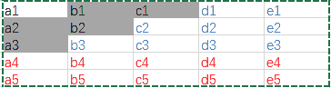

# 滴滴出行 2018 校园招聘网申笔试-测试开发工程师(第三批）

## 1

给定一个非空字符串, 按照如下方式编码, 使得编码后长度最小, 返回编码后的长度: 编码规则为: k[encoding_string], 表示重复 k 次 encoding_strng, 例如'abcdefabcdefabc'可表示为'2[abcdef]abc', 但是'aaa'仅能编码成'aaa', 因为 len('3[a]')>len('aaa').补充:1\. k 为正整数, []内的 encoding_string 不得含有空格不得为空;2\. []内的 encoding_string 本身可以为编码过的字符串, 例如'abcdabcdeabcdabcde' 可以编码为 '2[abcdabcde]'(编码后长度从 18 减少到 12), []内的'abcdabcde'又可以编码为 '2[abcd]e', 最终编码为 '2[2[abcd]e]', 编码后长度为 11, 应返回 11; 这个编码路径也能是: 'abcdabcdeabcdabcde' -> '2[abcd]e2[abcd]e' -> '2[2[abcd]e]';2\. 输入字符串为全小写英文字母, 长度<=160;3\. 如果编码后长度没有更小, 则保留原有字符串;

本题知识点

Java 工程师 C++工程师 安卓工程师 iOS 工程师 运维工程师 前端工程师 算法工程师 PHP 工程师 测试工程师 滴滴 字符串 *模拟 测试开发工程师 2018 系统工程师 自动驾驶/地图融合* *讨论

[ABCNB](https://www.nowcoder.com/profile/591248924)

# 给出本题的 python 版本，供大家参考
def str_pro(s):
    len1 = len(s)   # 字符串长度
    len2 = len1 // 2   # 初始连续字符长度，最大为字符串长度的一半，由大到小递减
    if len1 <= 4:  # 如果字符串长度小于 4，长度不会缩减，直接返回
        return s
    global best_count # 最优循环次数
    best_count=1
    global bset_len # 最优缩减后字符长度
    best_len=len1
    while (len2 >= 1): # 循环字符最小长度为 1
        for i in range(0, len1 - len2 * 2 + 1): # 循环字符的起始位
            count = 1 # 记录循环次数
            s1 = s[i:i + len2] # 循环字符串
            s2 = s[i + len2:i + len2 * 2] # 他后面相同长度字符串
            while (s1 == s2):
                count += 1
                if i + len2 * (count + 1) <= len1: # 不能超界
                    s2 = s[i + len2 * count:i + len2 * (count + 1)]
                else:
                    break
            newline=len1-len2*count+len(str(count))+2+len2 # 新的字符串长度
            if count > 1 and newline < best_len: # 和当前最优比较
                best_len=newline # 更新
                best_count=count
                pre = s[:i] # 将新的字符串分为 前串  循环字符串  后串
                cur = s[i:i + len2]
                lat = s[i + len2 * count:]
        len2 -= 1 # 循环字符串长度减 1
    if best_count==1: # 未缩减
        return s
    # 前串  循环字符串  后串 分别递归
    return str_pro(pre) + str(count) + '[' + str_pro(cur) + ']' + str_pro(lat)

if __name__ == '__main__':
    s = input()
    result = str_pro(s)
    print(len(result))

发表于 2018-09-29 17:46:27

* * *

[nbgao](https://www.nowcoder.com/profile/211289)

```cpp
#include <bits/stdc++.h>
using namespace std;

string F(string s){
    if(s.length() <= 4)
        return s;
    int n=s.length(), m=n/2, cnt=0, Min=INT_MAX;
    string pre, cur, lat;
    while(m>=1){
        for(int i=0;i<=n-m;i++){
            int t = 1;
            string a = s.substr(i, m), b;
            for(int j=1;j*m+m<=n;j++){
                b = s.substr(i+j*m, m);
                if(a == b)
                    t++;
                else
                    break;
            }
            int l = (n-t*m) + 3 + m;
            if(l<n && l<Min && t>1){
                Min = l;
                cnt = t;
                pre = s.substr(0, i);
                cur = s.substr(i, m);
                lat = s.substr(i + t*m);
            }
        }
        m--;
    }
    if(cnt==0)
        return s;
    return F(pre) + to_string(cnt) + "[" + F(cur) + "]" + F(lat);
}

int main(){
    string s, r;
    cin>>s;
    r = F(s);
    printf("%ld\n", r.length());
    return 0;
}
```

发表于 2020-11-07 01:38:28

* * *

[哦哦哦 5](https://www.nowcoder.com/profile/2021890)

每次递归找到压缩程度最好的结果。找到的重复的子串可能会将原子串分为 3 段

```cpp
#include <bits/stdc++.h>
using namespace std;

string encoding_string(string s)
{
    if (s == "")return "";
    if (s.size() <= 4)return s;

    int len = s.size();
    int len2 = len / 2;    //重复子串的最大长度 可以分成的份数至少要 2 份

    int best_count = 0;//一次遍历得到的最优重复数
    int best_len = INT_MAX;//一次遍历得到的最优压缩到的长度
    string pre, cur, lat;//一次遍历得到的最优子串

    while (len2 >= 1)//重复子串长度最小为 1
    {
        for (int k = 0; k <= len - len2; k++)//从第 k 个下标开始找重复子串
        {
            int count = 1;
            string s2 = s.substr(k, len2);
            string s3, s4;
            for (int j = 1; len2 * j + len2 <= len; j++)
            {
                s3 = s.substr(k + len2 * j, len2);
                if (s2.compare(s3) == 0 && s2.size() == s3.size())
                    count++;
                else
                    break;
            }

            int newlen = (len - count * len2) + 3 + len2;//压缩后的字符串长度
            if (newlen < len && newlen < best_len && count > 1)//如果压缩有效
            {
                best_len = newlen;
                best_count = count;
                pre = s.substr(0, k);
                cur = s.substr(k, len2);
                lat = s.substr(k + count * len2);
            }

        }
        len2--;//重复字符串长度缩短 1
    }

    if (best_count == 0)
        return s;

    return encoding_string(pre) + to_string(best_count) + "[" + encoding_string(cur) + "]" + encoding_string(lat);
}
int main()
{
    string s;
    cin >> s;

    string result = "";
    result = encoding_string(s);

    cout << result.size() << endl;

    return 0;
} 
```

编辑于 2018-08-21 11:18:04

* * *

## 2

有 4 种颜色的球，白的有 13 个，绿的有 11 个，黑的有 18 个，红的有 25 个，至少取出多少个球，才能保证有 15 个颜色一样

正确答案: B   你的答案: 空 (错误)

```cpp
52
```

```cpp
53
```

```cpp
54
```

```cpp
55
```

本题知识点

算法工程师 测试开发工程师 滴滴 2018 系统工程师 滴滴 2018 系统工程师 滴滴 2018 算法工程师 滴滴 2018 系统工程师 滴滴 2018 系统工程师 滴滴 2018 运维工程师 滴滴 2018 算法工程师 滴滴 2018 自动驾驶/地图融合 滴滴 2018 算法工程师 滴滴 2018

讨论

[王孟俊 i](https://www.nowcoder.com/profile/1909201)

考虑最坏的情况，取到白球 13 个，取到绿球 11 个，取到黑球和红球各 14 个，则下一次无论取什么球，都可以保证有 15 个颜色一样。则需要取 13+11+14+14+1=53，不懂为什么选 A 52

发表于 2018-08-21 08:08:16

* * *

[qsdadsa](https://www.nowcoder.com/profile/633371602)

最后能剩下 3 个黑球或者 10 个红球就代表有 15 个颜色了，只要一个颜色够了 15 就行了也就是数总数减去 13-1=53

发表于 2019-08-29 14:39:39

* * *

## 3

一个盒子装有 6 只乒乓球，其中 4 只是新球(即：未使用过的球)。第一次比赛时随机地从盒子中抽出 2 只乒乓球，使用后放回盒子。第二次比赛时又随机从盒子中抽出 2 只乒乓球，求第二次取出球是全新球的概率

正确答案: D   你的答案: 空 (错误)

```cpp
0.05
```

```cpp
0.11
```

```cpp
0.13
```

```cpp
0.16
```

本题知识点

Java 工程师 C++工程师 安卓工程师 iOS 工程师 运维工程师 前端工程师 算法工程师 PHP 工程师 测试工程师 滴滴 测试开发工程师 滴滴 2018 系统工程师 滴滴 2018 系统工程师 滴滴 2018 算法工程师 滴滴 2018 系统工程师 滴滴 2018 系统工程师 滴滴 2018 运维工程师 滴滴 2018 算法工程师 滴滴 2018 自动驾驶/地图融合 滴滴 2018 算法工程师 滴滴 2018

讨论

[李小七 77](https://www.nowcoder.com/profile/6338927)

第一次取球的结果会影响第二次，球用过了就是旧的。故可分为三种情况：第一次取的两个球均为新球，则第二次取的都是新球的概率是：第一次取的球一新一旧，则第二次取的都是新球的概率是：第一次取的球是两个旧球，则第二次都为新球的概率是：故总共的概率为三者之和，即 12/75=0.16

编辑于 2018-09-06 09:45:45

* * *

[敏加加](https://www.nowcoder.com/profile/916905160)

该题中定义从未使用过的球为新球，如果第一次比赛将新球取出使用过，在第 2 次使用时，这个球就不算新球了。

为连续两个步骤事件，要将结果对应的每步概率相乘后求和。参考概率树形图。

第一次取出 2 只乒乓球有以下三种情况：

| 第一次 | 状态 | 2 只新 | 1 只新 1 只旧 | 2 只旧 |
|  | 概率 1 | C(2,4) / C(2,6) | C(1,4)*C(1,2) / C(2,6) | C(2,2) / C(2,6) |
| 第二次 | 第一次后球况 | 6 球 2 新 4 旧 | 6 球 3 新 3 旧 | 6 球 4 新 2 旧 |
|  | 概率 2 | C(2,2) / C(2,6) | C(2,3) / C(2,6) | C(2,4) / C(2,6) |

将第一次、第二次两个连续步骤的对应概率相乘后相加，即上述每列概率 1*概率 2 相乘后相加，得到第二次取出的球全是新球的概率，结果为**0.16.**

发表于 2019-03-22 15:54:38

* * *

[温的水](https://www.nowcoder.com/profile/779977560)

题目不能写清楚点吗？第二次取出是全新球，是说都是全新球还是第二次取两个的第二个是全新球？？

发表于 2021-05-18 11:54:11

* * *

## 4

某系统中有 13 台磁带机，K 个进程共享这些设备，每个进程最多请求使用 3 台，则系统不会死锁的 K 值是

正确答案: B   你的答案: 空 (错误)

```cpp
不小于 3
```

```cpp
不大于 6
```

```cpp
不大于 13
```

```cpp
在 6 与 10 之间
```

本题知识点

Java 工程师 C++工程师 安卓工程师 iOS 工程师 运维工程师 前端工程师 算法工程师 PHP 工程师 测试工程师 滴滴 测试开发工程师 滴滴 2018 系统工程师 滴滴 2018 系统工程师 滴滴 2018 算法工程师 滴滴 2018 系统工程师 滴滴 2018 系统工程师 滴滴 2018 运维工程师 滴滴 2018 算法工程师 滴滴 2018 自动驾驶/地图融合 滴滴 2018 算法工程师 滴滴 2018

讨论

[Return（truth）](https://www.nowcoder.com/profile/6646500)

每人占用两台，互相申请别人占用的，每个人都不释放则死锁，所以 k 最小为 7 时会发生死锁

发表于 2018-08-27 15:28:24

* * *

[Y.Zz](https://www.nowcoder.com/profile/5862976)

13>=3*(k-1)-1  k<=6, 看到别人的公式是这么算的，有没有知道这道题的解释一下的

发表于 2019-08-26 20:52:45

* * *

## 5

有口井 7 米深，有个蜗牛从井底往上爬，白天爬 3 米，晚上往下坠 2 米，问蜗牛几天能从井里爬出来？

正确答案: C   你的答案: 空 (错误)

```cpp
7
```

```cpp
6
```

```cpp
5
```

```cpp
3
```

本题知识点

Java 工程师 C++工程师 安卓工程师 iOS 工程师 运维工程师 前端工程师 算法工程师 PHP 工程师 测试工程师 滴滴 测试开发工程师 滴滴 2018 系统工程师 滴滴 2018 系统工程师 滴滴 2018 算法工程师 滴滴 2018 系统工程师 滴滴 2018 系统工程师 滴滴 2018 运维工程师 滴滴 2018 算法工程师 滴滴 2018 自动驾驶/地图融合 滴滴 2018 算法工程师 滴滴 2018

讨论

[宸신](https://www.nowcoder.com/profile/3310733)

第 5 天，爬上去了就不会再后退了

发表于 2018-08-26 17:01:01

* * *

[REFFO 倒了](https://www.nowcoder.com/profile/156961577)

这个郭德纲相声都有

发表于 2021-03-20 13:19:49

* * *

[liaoming](https://www.nowcoder.com/profile/6818312)

```cpp
白天爬 3 米， 白天开始爬的时候<= 3 米， 则可以一天爬出去。需要（7 - 4） / 1 + 1 天。
```

发表于 2018-08-22 21:58:22

* * *

## 6

某公司举行抽奖活动，如果每人抽奖 20 次，则中奖（至少一次）概率是 64%，如果每人抽奖 10 次，则中奖概率是多少？

正确答案: C   你的答案: 空 (错误)

```cpp
0.32
```

```cpp
0.36
```

```cpp
0.4
```

```cpp
0.48
```

本题知识点

Java 工程师 C++工程师 安卓工程师 iOS 工程师 运维工程师 前端工程师 算法工程师 PHP 工程师 测试工程师 滴滴 测试开发工程师 滴滴 2018 系统工程师 滴滴 2018 系统工程师 滴滴 2018 算法工程师 滴滴 2018 系统工程师 滴滴 2018 系统工程师 滴滴 2018 运维工程师 滴滴 2018 算法工程师 滴滴 2018 自动驾驶/地图融合 滴滴 2018 算法工程师 滴滴 2018

讨论

[liaoming](https://www.nowcoder.com/profile/6818312)

```cpp
假设抽一次不中奖的概率为 p， 则抽 20 次全不中奖的概率为 p²⁰ = （1 - 0.64） = 0.36。 
所以抽 10 次全不中奖的概率为 p¹⁰ = 0.6\. 即至少中奖 1 次的概率为 0.4.
```

发表于 2018-08-22 22:01:00

* * *

[零葬](https://www.nowcoder.com/profile/75718849)

记一次抽奖的中奖概率为 p，则 20 次抽奖，一次都没中奖的概率为 0.36=(1-p)²⁰，开方得(1-p)¹⁰=0.6，这恰好是抽 10 次一次都没中的概率，于是抽 10 次能中奖的概率为 0.4

发表于 2021-12-06 11:54:01

* * *

## 7

找规律填数字：2，2，2，4，12，（），480，5760

正确答案: B   你的答案: 空 (错误)

```cpp
48
```

```cpp
60
```

```cpp
64
```

```cpp
120
```

本题知识点

Java 工程师 C++工程师 安卓工程师 iOS 工程师 运维工程师 前端工程师 算法工程师 PHP 工程师 测试工程师 滴滴 测试开发工程师 滴滴 2018 系统工程师 滴滴 2018 系统工程师 滴滴 2018 算法工程师 滴滴 2018 系统工程师 滴滴 2018 系统工程师 滴滴 2018 运维工程师 滴滴 2018 算法工程师 滴滴 2018 自动驾驶/地图融合 滴滴 2018 算法工程师 滴滴 2018

讨论

[lmcljj](https://www.nowcoder.com/profile/115323547)

倍数是斐波那契

发表于 2018-08-21 10:37:50

* * *

[xuhaihua](https://www.nowcoder.com/profile/1642439)

5760/480=12。。。

发表于 2018-10-26 17:14:11

* * *

[adamct](https://www.nowcoder.com/profile/557284897)

```cpp
2 2 2 4 12 （） 480 5760 
2*  1 = 2
2 * 1 = 2
2 * （2） = 4   （2） = 1 + 1
4 * （3） = 12   （3） = 2 + 1
12 * （5） = 60   （5） = 2 + 3
60 * （8） = 480   (8) = 5+ 3
480 * (13) = 5760   (13) = 5+ 8 

```

发表于 2018-08-21 21:06:14

* * *

## 8

225 75 30 15 10 （）

正确答案: C   你的答案: 空 (错误)

```cpp
15
```

```cpp
5
```

```cpp
10
```

```cpp
25
```

本题知识点

Java 工程师 C++工程师 安卓工程师 iOS 工程师 运维工程师 前端工程师 算法工程师 PHP 工程师 测试工程师 滴滴 测试开发工程师 滴滴 2018 系统工程师 滴滴 2018 系统工程师 滴滴 2018 算法工程师 滴滴 2018 系统工程师 滴滴 2018 系统工程师 滴滴 2018 运维工程师 滴滴 2018 算法工程师 滴滴 2018 自动驾驶/地图融合 滴滴 2018 算法工程师 滴滴 2018

讨论

[adamct](https://www.nowcoder.com/profile/557284897)

```cpp
225  75 30  15 10 (10)
```

225 / 3 = 7575 / 2.5 = 3030 / 2 = 1515 / 1.5 = 10 10 / 1 = 10 所以填写 10

发表于 2018-08-21 20:59:56

* * *

[杨某不才](https://www.nowcoder.com/profile/210651114)

75*3=22515*2=3010*1=10

发表于 2019-08-28 11:25:05

* * *

## 9

地球上有多少个点，从该点出发向南走 10 公里，向东走 10 公里，再向北走 10 公里之后恰好回到了起点？

正确答案: D   你的答案: 空 (错误)

```cpp
0 个
```

```cpp
1 个
```

```cpp
2 个
```

```cpp
无数个
```

本题知识点

Java 工程师 C++工程师 安卓工程师 iOS 工程师 运维工程师 前端工程师 算法工程师 PHP 工程师 测试工程师 滴滴 测试开发工程师 滴滴 2018 系统工程师 滴滴 2018 系统工程师 滴滴 2018 算法工程师 滴滴 2018 系统工程师 滴滴 2018 系统工程师 滴滴 2018 运维工程师 滴滴 2018 算法工程师 滴滴 2018 自动驾驶/地图融合 滴滴 2018 算法工程师 滴滴 2018

讨论

[秋雨叶落时](https://www.nowcoder.com/profile/9897000)

难道不是只有一个北极点吗？？？

发表于 2018-08-20 22:05:49

* * *

[&I](https://www.nowcoder.com/profile/3346305)

向南向北走可以相互抵消,向东走的话,绕一圈就能回原点了,所以一圈内任意点都可以,无数个

发表于 2018-09-01 23:50:50

* * *

[ACE 俊飛ʘᴗʘ](https://www.nowcoder.com/profile/441995748)

我的理解是 1.北极点 2.向南走到刚好离南极点往北周长 10km 的圈,可以走一圈回去,在北极圈的不行,无数个

发表于 2018-10-17 02:05:20

* * *

## 10

滴滴举行汽车大赛，邀请了 25 位司机师傅参赛，要赛出前 3 名给予奖励，假设每位司机师傅在比赛中的发挥是稳定的，其赛完一程所用的时间固定。现总共有 5 条赛道，问至少赛几场可以赛出前 3 名？

正确答案: B   你的答案: 空 (错误)

```cpp
6
```

```cpp
7
```

```cpp
8
```

```cpp
10
```

本题知识点

Java 工程师 C++工程师 安卓工程师 iOS 工程师 运维工程师 前端工程师 算法工程师 PHP 工程师 测试工程师 滴滴 测试开发工程师 滴滴 2018 系统工程师 滴滴 2018 系统工程师 滴滴 2018 算法工程师 滴滴 2018 系统工程师 滴滴 2018 系统工程师 滴滴 2018 运维工程师 滴滴 2018 算法工程师 滴滴 2018 自动驾驶/地图融合 滴滴 2018 算法工程师 滴滴 2018

讨论

[liaoming](https://www.nowcoder.com/profile/6818312)



```cpp
// 第一波： 25 位秋明山车神分成 5 组， 每组取前三。淘汰红色字体的车手。 需要 5 次。
// 第二波： 取第一波中的每组的第一上赛道飙车。淘汰掉蓝色字体车手。需要 1 次。
// 第三波： 取灰色阴影部分的 5 名车手飙车。需要 1 次。
```

发表于 2018-08-22 22:20:09

* * *

[EvvyChen](https://www.nowcoder.com/profile/359919462)

所用时间固定？那他们不是在比谁快比速度 他们在比什么？谁开的漂亮？

发表于 2020-04-01 00:20:54

* * *

[Q.IAN](https://www.nowcoder.com/profile/9709741)

第一波： 25 位秋明山车神分成 5 组， 每组取第一名。 需要 5 次。第二波： 取第一波中的每组的第一上赛道飙车，五个人放在一个赛道里面，就取出前三，1 次，不总共 6 次吗

发表于 2018-09-14 17:15:19

* * *

## 11

3968,63,8,3 的下一位应该是

正确答案: A   你的答案: 空 (错误)

```cpp
2
```

```cpp
1
```

```cpp
-1
```

```cpp
0
```

本题知识点

Java 工程师 C++工程师 安卓工程师 iOS 工程师 运维工程师 前端工程师 算法工程师 PHP 工程师 测试工程师 滴滴 测试开发工程师 滴滴 2018 系统工程师 滴滴 2018 系统工程师 滴滴 2018 算法工程师 滴滴 2018 系统工程师 滴滴 2018 系统工程师 滴滴 2018 运维工程师 滴滴 2018 算法工程师 滴滴 2018 自动驾驶/地图融合 滴滴 2018 算法工程师 滴滴 2018

讨论

[cent](https://www.nowcoder.com/profile/596400168)

3968 加 1 再开平方等于 63
63 加 1 再开平方等于 8
8 加 1 开平方等于 3
类推，3 加 1 再开平方等于 2

发表于 2018-08-23 15:37:12

* * *

[零葬](https://www.nowcoder.com/profile/75718849)

观察得到通项公式：

发表于 2021-12-06 12:01:08

* * *

[lmcljj](https://www.nowcoder.com/profile/115323547)

n²-1

发表于 2018-08-21 10:32:43

* * *

## 12

【单选】A 系统依赖数据库服务，当数据库吞吐能力变弱，大量操作延时，A 系统会自动降级，把数据在本地备份，下列哪种方法可以触发 A 系统针对数据库的自动降级

正确答案: D   你的答案: 空 (错误)

```cpp
修改 A 操作的数据库表结构
```

```cpp
对数据库网络限速
```

```cpp
关闭数据库
```

```cpp
对 A 系统构造大量并发访问，限制对数据库的网络发包数
```

本题知识点

Java 工程师 C++工程师 安卓工程师 iOS 工程师 运维工程师 前端工程师 算法工程师 PHP 工程师 测试工程师 滴滴 测试开发工程师 2018

## 13

【多选】在一个涉及到 Mysql 查询的项目中，需要判断哪些 SQL 语句执行的比较慢，下面哪些方法可以快速得出执行慢的 SQL 语句（多选）

正确答案: B C   你的答案: 空 (错误)

```cpp
开启 Binlog，根据 Binlog 来过滤
```

```cpp
给每条 SQL 查询添加时间判断，超过阈值的打印日志
```

```cpp
开启 Mysql 慢查询
```

```cpp
使用 explain 查看每条执行的 SQL 语句
```

本题知识点

Java 工程师 C++工程师 安卓工程师 iOS 工程师 运维工程师 前端工程师 算法工程师 PHP 工程师 测试工程师 滴滴 测试开发工程师 2018

讨论

[守望麦田](https://www.nowcoder.com/profile/2115381)

A.binlog 日志有两个最重要的使用场景: 
1）MySQL 主从复制：MySQL Replication 在 Master 端开启 binlog，Master 把它的二进制日志传递给 slaves 来达到
master-slave 数据一致的目的。 
2）数据恢复，通过使用 mysqlbinlog 工具来使恢复数据。C.开启慢查询日志，可以让 MySQL 记录下查询超过指定时间的语句 D.Explain 可以用来查看 SQL 语句的执行效 果，可以帮助选择更好的索引和优化查询语句，写出更好的优化语句。

发表于 2018-08-25 10:39:23

* * *

## 14

【单选】能够在字符串“aabaaabaaaab”中匹配“aab”，而不能匹配“aaab”和“aaaab”
的正则表达式包括

正确答案: C   你的答案: 空 (错误)

```cpp
“a*?b”
```

```cpp
“a{,2}b”
```

```cpp
“aa??b”
```

```cpp
“aaa??b”
```

本题知识点

Java 工程师 C++工程师 安卓工程师 iOS 工程师 运维工程师 前端工程师 算法工程师 PHP 工程师 测试工程师 滴滴 测试开发工程师 2018

讨论

[已注销](https://www.nowcoder.com/profile/6584997)

？匹配前面子表达式零次或一次 或指明一个非贪婪限定符

发表于 2020-08-29 18:45:04

* * *

[求一个大大的 offer](https://www.nowcoder.com/profile/646147)

必须指定下限 CB 需要指定下限 A,D 会匹配到后面的俩

编辑于 2018-09-04 15:26:32

* * *

## 15

【单选】A 系统每分钟通过 socket 上报运营状态信息给 B 系统，线上生产环境观察发现 A 系统存在缓慢的句柄泄露，怀疑是与 B 系统通信导致的问题，下列哪种方法可以快速排插怀疑点呢？

正确答案: C   你的答案: 空 (错误)

```cpp
测试环境部署 A、B 两套系统，运行一段时间，观察 A 日志关于上报运行状态信息是否有 error,warning
```

```cpp
线上生产环境观察 A 日志关于上报运行状态信息是否有 error,warning
```

```cpp
测试环境部署 A、B 两套系统，缩小 A 上报状态间隔到毫秒级，运行一段时间，观察 A 系统句柄消耗情况
```

```cpp
线上生产环境，修改 A 代码，缩小 A 上报状态间隔到毫秒级，运行一段时间，观察 A 系统句柄消耗情况
```

本题知识点

Java 工程师 C++工程师 安卓工程师 iOS 工程师 运维工程师 前端工程师 算法工程师 PHP 工程师 测试工程师 滴滴 测试开发工程师 2018

## 16

【单选】下面哪种树结构不是二叉树

正确答案: C   你的答案: 空 (错误)

```cpp
红黑树
```

```cpp
AVL 树
```

```cpp
B-Tree
```

```cpp
哈夫曼树
```

本题知识点

Java 工程师 C++工程师 安卓工程师 iOS 工程师 运维工程师 前端工程师 算法工程师 PHP 工程师 测试工程师 滴滴 测试开发工程师 2018

## 17

【单选】下面哪种说法不正确的是：

正确答案: D   你的答案: 空 (错误)

```cpp
WIFI 是一种物理层与数据链路层协议
```

```cpp
HTTP 是建立在 TCP 协议上的一种协议
```

```cpp
UDP 协议是一种建立在 IP 协议之上的协议
```

```cpp
IPv4 支持 2³² 个地址，IPV6 支持 2⁶⁴ 个地址
```

本题知识点

Java 工程师 C++工程师 安卓工程师 iOS 工程师 运维工程师 前端工程师 算法工程师 PHP 工程师 测试工程师 滴滴 测试开发工程师 2018

讨论

[Neil201807052241663](https://www.nowcoder.com/profile/840346635)

ipv6 支持 2¹²⁸ 个地址

发表于 2018-09-08 20:09:53

* * *

## 18

【单选】下面那种连接会产生笛卡尔乘积？

正确答案: D   你的答案: 空 (错误)

```cpp
等值内连接
```

```cpp
左外连接
```

```cpp
右外连接
```

```cpp
全外连接
```

本题知识点

Java 工程师 C++工程师 安卓工程师 iOS 工程师 运维工程师 前端工程师 算法工程师 PHP 工程师 测试工程师 滴滴 测试开发工程师 2018

讨论

[August2010](https://www.nowcoder.com/profile/966940600)

答案是错误的吧。这个和连接方式没关系，主要看数据关系

发表于 2019-02-17 10:18:41

* * *

[可爱的汁汁](https://www.nowcoder.com/profile/2921255)

c

发表于 2018-12-07 01:20:39

* * *

## 19

【单选】某应用通过双 buffer 动态加载数据配置文件，流程如下
function reload(){
if(检查文件存在){
if(距离上次配置更新时间 < 阈值){
log(); 忽略更新
return;
}
if(文件不为空 && 文件内容发生改变){
ret = new_buffer.loadconfig(); // 分配新 buffer 内存并加载配置
if(ret != SUCCESS){
log();//打印报错日志
}
}
switch(old_buffer, new_buffer) // 切换双 buffer
clear(old_buffer) // 释放旧 buffer 内存
}
}
以下可能出现的情况是：

正确答案: C   你的答案: 空 (错误)

```cpp
配置文件频繁发生更新，导致 cpu 负载过高
```

```cpp
反复 reaload 后应用发生内存泄漏
```

```cpp
配置文件格式错误，new_buffer 加载出错，服务配置失效
```

```cpp
由于误操作，配置文件被删除，服务配置失效
```

本题知识点

Java 工程师 C++工程师 安卓工程师 iOS 工程师 运维工程师 前端工程师 算法工程师 PHP 工程师 测试工程师 滴滴 测试开发工程师 2018

## 20

【单选】下列哪项措施会降低服务高可用性

正确答案: B   你的答案: 空 (错误)

```cpp
监控报警
```

```cpp
高峰期上线
```

```cpp
接入层负载均衡
```

```cpp
下游依赖降级
```

本题知识点

Java 工程师 C++工程师 安卓工程师 iOS 工程师 运维工程师 前端工程师 算法工程师 PHP 工程师 测试工程师 滴滴 测试开发工程师 2018

## 21

【单选】用 Struct 代替 class 的时候以下哪些描述是对的?

正确答案: A   你的答案: 空 (错误)

```cpp
成员默认是 public 的
```

```cpp
成员默认是 private 的
```

```cpp
成员默认是 protected 的
```

```cpp
没有区别
```

本题知识点

Java 工程师 C++工程师 安卓工程师 iOS 工程师 运维工程师 前端工程师 算法工程师 PHP 工程师 测试工程师 滴滴 测试开发工程师 2018 C++

讨论

[Andrew_ZJ](https://www.nowcoder.com/profile/816958783)

这题单选老是弄成不定项选择题就离谱

发表于 2020-08-12 09:22:11

* * *

## 22

无类别域间路由（CIDR）是一个用于对 IPV4 地址进行分类表述的方法。CIDR 路由描述的 IP 地址组的子网 mask 长度是可变长度, 例如 10.0.0.0/22 表示前 22 位和 10.0.0.0 相同的网络地址都被覆盖, 22 包含了 10.0 这前两个字段(0-7 位,8-15 位)和第三个字段的前 6 位(16-21,即 0b000000**), 涵盖了 10.0.0.*, 10.0.1.*, 10.0.2.*, 10.0.3.* 四组 ip 地址. 在此前提下请实现 IP 网络中的一个常用的去重操作: 给定一系列 CIDR 路由地址, 其中没有完全等价的路由, 去掉被重复表示的 CIDR 路由, 即去掉已经被其他 CIDR 路由表示覆盖的路由地址. 例如 10.0.1.1/32 已经被 10.0.0.0/22 覆盖了, 如果路由列表中已经有了后者, 就可以去掉前者.

本题知识点

Java 工程师 C++工程师 安卓工程师 iOS 工程师 运维工程师 前端工程师 算法工程师 PHP 工程师 测试工程师 滴滴 模拟 字符串 *测试开发工程师 2018 系统工程师 自动驾驶/地图融合* *讨论

[chorifa](https://www.nowcoder.com/profile/262089004)

```cpp
// 务必注意分隔符.需要转义
// 一个 IP 地址正好可以用一个 int 表示，符号位不重要，只需要无符号右移
import java.io.*;
import java.util.*;
public class Main{
    static class Addr{
        String addrStr;
        int mask;
        int addr;
        public Addr(String addrStr, int mask, int addr){this.addrStr = addrStr; this.mask = mask; this.addr = addr;}
    }
    public static void main(String[] args) throws IOException{
        BufferedReader br = new BufferedReader(new InputStreamReader(System.in));
        int n = Integer.parseInt(br.readLine());
        LinkedList<Addr> list = new LinkedList<>();
        while(n-->0){
            String addrStr = br.readLine();
            String[] strs = addrStr.split("/");
            int mask = Integer.parseInt(strs[1]);
            strs = strs[0].split("\\.");
            int addr = (Integer.parseInt(strs[0])<<24) | (Integer.parseInt(strs[1])<<16) | (Integer.parseInt(strs[2])<<8) | Integer.parseInt(strs[3]);
            boolean flag = true;
            for(Iterator<Addr> it = list.iterator(); it.hasNext(); ){
                Addr tmp = it.next();
                if(mask < tmp.mask && ( (addr ^ tmp.addr) >>> (32-mask) == 0) ) it.remove();
                if(mask >= tmp.mask && ( (addr ^ tmp.addr) >>> (32-tmp.mask) == 0) ){flag = false; break;}
            }
            if(flag) list.add(new Addr(addrStr,mask,addr));
        }
        System.out.println(list.size());
        for(Iterator<Addr> it = list.iterator(); it.hasNext(); ){
                Addr tmp = it.next();
                System.out.println(tmp.addrStr);
        }
    }
}
```

发表于 2019-04-28 21:02:38

* * *

[ABCNB](https://www.nowcoder.com/profile/591248924)

```cpp
# 用 python 实现了一下，本题不难，就是 list 判断与替换。
num = int(input())
```

```cpp
ip_list = []
```

```cpp
out_list=[]
```

```cpp
temp2=[]
```

```cpp
for i in range(0, num):
```

```cpp
    temp = input()
```

```cpp
    num1 = temp.split('/')[1]
```

```cpp
    num1 = int(num1)
```

```cpp
    temp1 = temp.split('/')[0]
```

```cpp
    ip = ""
```

```cpp
    for j in range(0, 4):
```

```cpp
        item = temp1.split('.')[j]
```

```cpp
        item1 = int(item)
```

```cpp
        item1 = bin(item1)
```

```cpp
        item1 = str(item1)
```

```cpp
        num2 = 10 - len(item1)
```

```cpp
        for k in range(0, num2):
```

```cpp
            ip = ip + '0'
```

```cpp
        ip = ip + item1[2:]
```

```cpp
    ip = ip[0:num1]
```

```cpp
    tag = True
```

```cpp
    if len(ip_list) == 0:
```

```cpp
        ip_list.append(ip)
```

```cpp
        out_list.append(temp)
```

```cpp
    else:
```

```cpp
        temp2=ip_list.copy()
```

```cpp
        temp3=out_list.copy()
```

```cpp
        for index in temp2:
```

```cpp
            if len(ip) >= len(index) and ip[0:len(index)] == index:
```

```cpp
                tag = False
```

```cpp
                break
```

```cpp
            if len(ip) < len(index) and ip == index[0:len(ip)]:
```

```cpp
                num3=temp2.index(index)
```

```cpp
                ip_list.remove(index)
```

```cpp
                index1=temp3[num3]
```

```cpp
                out_list.remove(index1)
```

```cpp
        if tag:
```

```cpp
            ip_list.append(ip)
```

```cpp
            out_list.append(temp)
```

```cpp
print(len(out_list))
```

```cpp
for n in range(0, len(out_list)):
```

```cpp
    print(out_list[n])
```

编辑于 2018-09-18 10:01:38

* * *

[liaoming](https://www.nowcoder.com/profile/6818312)

```cpp
#include <iostream>
#include <vector>
#include <string>
#include <sstream>
#include <hash_map>

using namespace std;

struct ip { // 用一各 4 个 int 的 vector 来保存 ip
    vector<int> data;
    ip() {
        data = vector<int>(4);
    }
};

struct cidr { // 用起始和结束 ip 来表示 cidr
    ip start; // 起始 ip 地址
    ip end; //   结束 ip 地址
};

cidr str2cidr(const string & str) { // 将字符串转换成 cidr
    int s = 0;
    int e = str.find('.', s);
    cidr res;
    int i = 0;
    while (e != string::npos) {
        res.start.data[i++] = stoi(str.substr(s, e - s));
        s = e + 1;
        e = str.find('.', s);
    }
    e = str.find('/');
    res.start.data.back() = stoi(str.substr(s, e - s));
    int len = stoi(str.substr(e + 1, str.size() - e));

    res.end = res.start;
    int p1 = len / 8;
    int rest = len % 8; // 还有几位相同
    for (int i = p1; i < 4; ++i) {
        res.start.data[i] &= (255 << (8 - rest));
        res.end.data[i] |= ~(-1 << (8 - rest));
        rest = 0;
    }
    return res;
}

bool LT(ip a, ip b) { // 判断 ip 的大小
    for (int i = 0; i < 4; ++i) {
        if (a.data[i] <= b.data[i]) {
            continue;
        } else {
            return false;
        }
    }
    return true;
}

bool GT(ip a, ip b) {
    for (int i = 0; i < 4; ++i) {
        if (a.data[i] >= b.data[i]) {
            continue;
        } else {
            return false;
        }
    }
    return true;
}

bool cidr_contain(cidr a, cidr b) { // 判断 cidr a 是否包含 cidr b
    return a.start.data[0] == b.start.data[0] & LT(a.start, b.start) && GT(a.end, b.end);
}

void process(const string & str, vector<string> & cidrs_str, vector<cidr> & cidrs, int & erased) {
    cidr t = str2cidr(str);
    for (int i = 0; i < cidrs.size(); ++i) {
        if (cidrs_str[i].size() > 0) {
            if (cidr_contain(cidrs[i], t)) {
                return;
            }
            if (cidr_contain(t, cidrs[i])) {
                cidrs_str[i] = "";
                erased++;
            }
        }

    }
    cidrs_str.emplace_back(str);
    cidrs.emplace_back(t);
}

int main() {
    string str = "172.24.68.0/24";
    int n = 0;
    while (cin >> n) {
        vector<string> cidrs_str; // 为空则无效
        vector<cidr> cidrs;
        int erased = 0;
        while (n--) {
            cin >> str;
            process(str, cidrs_str, cidrs, erased);
        }
        cout << cidrs.size() - erased << endl;
        for (auto item : cidrs_str) {
            if (item.size() > 0) {
                cout << item << endl;
            }
        }
    }
}

```

发表于 2018-08-22 22:27:21

* * ***