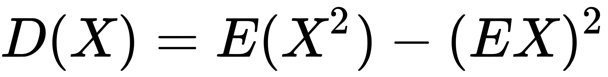

# 滴滴出行 2018 校园招聘网申笔试-智能交互技术研发工程师（第二批）

## 1

给定两个数 R 和 n，输出 R 的 n 次方，其中 0.0<R<99.999, 0<n<=25

本题知识点

Java 工程师 C++工程师 安卓工程师 iOS 工程师 运维工程师 前端工程师 算法工程师 PHP 工程师 测试工程师 滴滴 模拟 数学 系统工程师 2018 测试开发工程师 自动驾驶/地图融合

讨论

[neekity](https://www.nowcoder.com/profile/7732482)

Python3-------24ms----------3400K

```cpp
###python3#####
###把浮点型转化为整数（比如 95.123 转化为 95123 ），再做 n 次方运算 95123**12
###计算最后小数点的位置.123 小数有 3 位 12 次方后 那就是 3*12=16 位
###由于最后得到的整数长度可能会小于小数点需要移动的长度所以要加个补零操作
###最后由于一开始没对 a 的末尾进行去 0，所以最后进行去 0 操作
if __name__=='__main__':
    while 1:
        try:
            a,b=input().split()
            index=a.find('.')
            #把浮点转整数
            aint=int(a[:index]+a[index+1:])
            b=int(b)
            ###计算最后小数点的位置
            zeros=(len(a)-index-1)*b
            orint=str(aint**b)
            j=len(orint)
            #补零
            if j<=zeros: orint='0'*(zeros+1-j)+orint
            c=len(orint)-zeros
            #去 0 操作
            print(orint[:c]+'.'+str(int(orint[c:][::-1]))[::-1])
        except:
            break

```

发表于 2019-03-23 15:58:25

* * *

[牛客 407288 号](https://www.nowcoder.com/profile/407288)

import java.math.BigDecimal;
import java.util.Scanner;

public class Main {
    public static void main(String[] args) {
        String r;
        int n;
        String s;
        Scanner sc = new Scanner(System.in);
        while(sc.hasNext()){
            r = sc.next(); //用 string 来存储，因为 double 和 float 都是不能准确的表示小数的，只是以概数来表示
            n = sc.nextInt();
            BigDecimal d = new BigDecimal(r);
            BigDecimal ans = new BigDecimal(r);
            for(int i=1;i<n;i++){
                ans = ans.multiply(d);
            }
            s= ans.stripTrailingZeros().toPlainString(); // 去除不必要的零，转换为字符串，防止科学记数法
            System.out.println(s);
        }

    }
}

发表于 2018-08-20 22:24:43

* * *

[零葬](https://www.nowcoder.com/profile/75718849)

进行 n 次 R 的大数乘法即可，笔试的时候为了赶时间 AC，干脆就用 BigDecimal 吧，面试的时候还是得手写一个浮点数的大数乘法。

```cpp
import java.io.BufferedReader;
import java.io.InputStreamReader;
import java.io.IOException;
import java.math.BigDecimal;

public class Main {
    public static void main(String[] args) throws IOException {
        BufferedReader br = new BufferedReader(new InputStreamReader(System.in));
        String str;
        while((str = br.readLine()) != null){
            if(str.equals("")) continue;
            String[] params = str.split(" ");
            StringBuilder res = new StringBuilder();
            for(int i = 0; i < params.length; i += 2){
                String R = params[i];
                if(params[i + 1].equals("")) i++;
                int n = Integer.parseInt(params[i + 1]);
                res.append(power(R, n)).append(" ");
            }
            System.out.println(res.toString().trim());
        }
    }

    // 计算乘方
    private static String power(String R, int n) {
        String res = "1";
        for(int i = 0; i < n; i++)
            res = multiply(R, res);
        return res;
    }

    // 计算乘法
    private static String multiply(String num1, String num2) {
        BigDecimal float1 = new BigDecimal(num1);
        BigDecimal float2 = new BigDecimal(num2);
        // 去掉后面的 0，并取消科学计数法
        return float1.multiply(float2).stripTrailingZeros().toPlainString();
    }
}
```

发表于 2021-02-24 11:55:24

* * *

## 2

给定一个 m 行 n 列的二维地图, 初始化每个单元都是水.操作 addLand 把单元格(row,col)变成陆地.岛屿定义为一系列相连的被水单元包围的陆地单元, 横向或纵向相邻的陆地称为相连(斜对角不算).在一系列 addLand 的操作过程中, 给出每次 addLand 操作后岛屿的个数.二维地图的每条边界外侧假定都是水.

本题知识点

Java 工程师 C++工程师 安卓工程师 iOS 工程师 运维工程师 前端工程师 算法工程师 PHP 工程师 测试工程师 滴滴 模拟 图 数组 系统工程师 2018 测试开发工程师 自动驾驶/地图融合

讨论

[华科平凡](https://www.nowcoder.com/profile/4939096)

python 解法

经典的岛屿问题，又掏出了我的祖传代码。
不过题目有坑：

*   要判断行数与列数有没有越界。
*   还有越界后的处理，发现测试用例中对于越界还是取上一次的结果，这个使用数组记录上一次操作后岛屿的数量即可。
*   一开始要在 res 数组里做一个初始化值 0，防止一上来就越界，此时岛屿数量为 0。

代码如下：

```cpp
import copy

class Solution:
    def numIslands(self, grid):
        """
        :type grid: List[List[str]]
        :rtype: int
        """
        if not grid: return 0
        row, col = len(grid), len(grid[0])
        res = 0
        for i in range(row):
            for j in range(col):
                if grid[i][j] == "1":
                    res += 1
                    self.merge(grid, i, j)

        return res

    def merge(self, grid, i, j):
        row = len(grid)
        col = len(grid[0])

        if i < 0 or i >= row or j < 0 or j >= col or grid[i][j] != "1":  # 退出 dfs 的条件：1.越界；2.遇到值为 0 或者已访问的节点(X)
            return

        grid[i][j] = "X"  # 置为"X", 表示该元素已被访问。
        """向四个方向查找"""
        self.merge(grid, i - 1, j)
        self.merge(grid, i + 1, j)
        self.merge(grid, i, j - 1)
        self.merge(grid, i, j + 1)

m, n, k = [int(input()) for _ in range(3)]
land, grid = [["0" for i in range(n)] for j in range(m)], []
solution = Solution()
res = [0]
for i in range(k):
    row, col = map(int, input().split())
    if row < m and col < n:
        land[row][col] = "1"
        grid = copy.deepcopy(land)
        res.append(str(solution.numIslands(grid)))
    else:
        res.append(res[-1])
print(" ".join(res[1:])) 
```

发表于 2019-03-20 22:11:22

* * *

[牛客 487145629 号](https://www.nowcoder.com/profile/487145629)

测试用例不全，有些提交通过的代码有问题。思路：1.增加岛屿序列号，每新增一个岛屿，序列号加一；2.新增岛屿数初始化为 1，检查四个方向，如果不是水，新增岛屿数减一（即为 0）。继续检查剩下的方向，如果不是水，并且序列号不等于第一个岛屿，则通过 dfs 将该岛屿每个单元的序列号改成和第一个岛屿的序列号相同（即合并两个岛屿），新增岛屿数减一。如果序列号与第一个岛屿相同，即为同一个岛屿，不用处理。3.如果新增岛屿数为 1，则新增岛屿为当前最大序列号，最大序列号加一。否则新增岛屿序列号与四个方向岛屿的序列号相同。4.岛屿数 = 新增前的岛屿数 + 第 2 步的新增数（取值 1,0，-1，-2，-3）。 ```cpp
#include<iostream>
using namespace std;
int arr[101][101] = {0};
int m, n, k;
int dx[4] = {-1, 1, 0, 0};
int dy[4] = {0, 0, -1, 1};
int K = 1;
void dfs(int x, int y, int flag) //将岛屿序列号改成 flag
{
    arr[x][y] = flag;
    for (int i=0; i<4; i++)
    {
        int xx = x + dx[i];
        int yy = y + dy[i];
        if (xx>=0 && xx<m && yy>=0 && yy<n && arr[xx][yy]!=0 && arr[xx][yy]!=flag)
            dfs(xx, yy, flag);
    }
}

int check(int x, int y)
{
    int ret = 1;
    int flag = 0;
    for (int i=0; i<4; i++) //检查四个方向
    {
        int xx = x + dx[i];
        int yy = y + dy[i];
        if (xx>=0 && xx<m && yy>=0 && yy<n && arr[xx][yy]!=0)
        {
            if (flag == 0)
            {
                flag = arr[xx][yy]; //第一个岛屿
                ret--;
            } else {
                if (arr[xx][yy] != flag) //与第一个岛屿不连通
                {
                    dfs(xx, yy, flag); //合并到第一个岛屿
                    ret--;
                }
            }
        }
    }
    arr[x][y] = flag!=0 ? flag : K++; //flag==0 即四个方向是水    
    return ret; //返回新增岛屿数 1,0,-1,-2,-3
}

int main()
{
    cin >> m >> n >> k;

    int cnt = 0;
    for (int i=0; i<k; i++)
    {
        int x, y;
        cin >> x >> y;

        if (x>=0 && x <m && y>=0 && y<n && arr[x][y]==0)
        {

            cnt += check(x, y);
        }
        cout << cnt << " ";
    }
    return 0;
}
``` 

编辑于 2020-04-11 00:37:33

* * *

[勇敢牛牛，不怕困难！](https://www.nowcoder.com/profile/840813925)

```cpp
#include <stdio.h>
#include <stdlib.h>
#include <string.h>

// function declaration
int Find(int* p, const int x) {
  return p[x] = p[x] ^ x ? Find(p, p[x]) : x;
}

void Union(int* p, const int u, const int v, int* count) {
  const int pu = Find(p, u);
  const int pv = Find(p, v);
  if (pu == pv) return;
  p[pu] = pv;
  --(*count);
}

void printAnswer(int* ans, int ansSize) {
  int i;
  for (i = 0; i < ansSize; ++i) {
    printf("%d", *(ans + i));
    if (i < ansSize - 1) putchar(32);
  }
  putchar('\n');
}

int main(const int argc, const char** argv) {
  int i, m, n, k, x, y, nx, ny;
  scanf("%d%d%d", &m, &n, &k);

  int board[m][n], p[m * n], count = 0;
  memset(board, 0x0000, sizeof board);
  for (i = 0; i < m * n; ++i) *(p + i) = i;

  static const int dirs[] = { 0, -1, 0, 1, 0 };

  int ans[10000], ansSize = 0;
  while (k--) {
    scanf("%d%d", &y, &x);
    if (x < 0 || x >= n || y < 0 || y >= m || board[y][x]) { // 坐标超出地图边界或已经是一块陆地
      *(ans + ansSize++) = count;
      continue;
    }
    board[y][x] = 1; ++count;
    for (i = 0; i < 4; ++i) {
      nx = x + *(dirs + i), ny = y + *(dirs + i + 1);
      if (nx < 0 || ny < 0 || nx == n || ny == n || !board[ny][nx])
        continue;
      Union(p, y * n + x, ny * n + nx, &count);
    }    
    *(ans + ansSize++) = count;
  }

  return printAnswer(ans, ansSize), 0;
}
```

发表于 2021-07-08 15:55:02

* * *

## 3

一个圆周上均匀分布着 99 个点。随机选择两个点连一条线段，再随机选择另外两个点连一条线段。那么哪个描述是对的？

正确答案: B   你的答案: 空 (错误)

```cpp
两条线段相交概率大
```

```cpp
两条线段不相交概率大
```

```cpp
相交和不相交两种情况的出现概率相同
```

```cpp
无法通过概率的方式进行推断
```

本题知识点

Java 工程师 C++工程师 安卓工程师 iOS 工程师 运维工程师 前端工程师 算法工程师 PHP 工程师 测试工程师 滴滴 系统工程师 滴滴 2018 测试开发工程师 滴滴 2018 算法工程师 滴滴 2018 系统工程师 滴滴 2018 运维工程师 滴滴 2018 自动驾驶/地图融合 滴滴 2018 算法工程师 滴滴 2018

讨论

[tigerose](https://www.nowcoder.com/profile/610502811)

对于任意的相交线段的四点 ABCD，不妨设 AB 和 CD 相交，都有对应的 AC 和 BD，AD 和 BC 不相交。（abcd 共线应该不算相交），所以相交概率应该小 1/3\.

发表于 2018-08-29 21:16:54

* * *

[Sesenn](https://www.nowcoder.com/profile/85234885)

在圆上取四点的概率是随机的，依次记为 A,B,C,B 四点。那么连接顺序有三种，A-B,C-D(不相交)，A-C,B-D（相交），B-C,D-A(不相交)，故相交的概率为 1/3

发表于 2018-08-24 21:35:39

* * *

[XXXtentacionnnn](https://www.nowcoder.com/profile/486628202)

线段啊 不是直线

发表于 2019-08-27 13:21:23

* * *

## 4

从 1 到 2048 的所有整数中 1 的出现的个数是

正确答案: B   你的答案: 空 (错误)

```cpp
1600
```

```cpp
1615
```

```cpp
1011
```

```cpp
1020
```

本题知识点

Java 工程师 C++工程师 安卓工程师 iOS 工程师 运维工程师 前端工程师 算法工程师 PHP 工程师 测试工程师 滴滴 系统工程师 滴滴 2018 测试开发工程师 滴滴 2018 算法工程师 滴滴 2018 系统工程师 滴滴 2018 运维工程师 滴滴 2018 自动驾驶/地图融合 滴滴 2018 算法工程师 滴滴 2018

讨论

[不知何去何从](https://www.nowcoder.com/profile/7422408)

千位的 1:1000-1999：1000 个百位的 1:100-199,1100-1199:200 个十位的 1: 个位十位：10~19，千位百位：00~20，共 210 个个位的 1：个位：1，千位百位十位：000~204，共 205 个

发表于 2018-08-31 19:16:08

* * *

[Hacker234](https://www.nowcoder.com/profile/6555216)

```cpp
sum1=0
for i in range(1,2048):
    k=str(i)
    sum1=sum1+k.count('1')
print(sum1)

```

发表于 2018-08-23 16:10:26

* * *

[Howie59](https://www.nowcoder.com/profile/8933688)

原来是我理解错题意了

发表于 2018-09-08 20:57:10

* * *

## 5

在 0 到 1 之间随机选择两个数，这两个数对应的点把 0 到 1 之间的线段分成了三条线段，这三条线段能构成三角形的概率为

正确答案: B   你的答案: 空 (错误)

```cpp
0.166666666666667
```

```cpp
0.25
```

```cpp
0.333333333333333
```

```cpp
0.5
```

本题知识点

Java 工程师 C++工程师 安卓工程师 iOS 工程师 运维工程师 前端工程师 算法工程师 PHP 工程师 测试工程师 滴滴 系统工程师 滴滴 2018 测试开发工程师 滴滴 2018 算法工程师 滴滴 2018 系统工程师 滴滴 2018 运维工程师 滴滴 2018 自动驾驶/地图融合 滴滴 2018 算法工程师 滴滴 2018

讨论

[778 笑哈哈](https://www.nowcoder.com/profile/3718620)


发表于 2018-08-24 09:00:27

* * *

[十五倍的随性](https://www.nowcoder.com/profile/8996608)

两边之和大于第三边也就说这两个边的都要大于 0.5  每一个数的概率是 0.5 那么两个都成的概率就是 0.5*0.5=0.25

发表于 2018-10-09 10:13:45

* * *

## 6

1 元钱一瓶汽水，喝完后两个空瓶换一瓶汽水，现有 20 元钱，最多可以喝到（）瓶汽水

正确答案: C   你的答案: 空 (错误)

```cpp
37
```

```cpp
38
```

```cpp
39
```

```cpp
40
```

本题知识点

Java 工程师 C++工程师 安卓工程师 iOS 工程师 运维工程师 前端工程师 算法工程师 PHP 工程师 测试工程师 滴滴 系统工程师 滴滴 2018 测试开发工程师 滴滴 2018 算法工程师 滴滴 2018 系统工程师 滴滴 2018 运维工程师 滴滴 2018 自动驾驶/地图融合 滴滴 2018 算法工程师 滴滴 2018

讨论

[青竹心 zxx](https://www.nowcoder.com/profile/5705671)

先买 20 瓶汽水喝，得到 20 个瓶子，现在共有 20 个瓶子 再换 10 瓶汽水喝，得到 10 个瓶子，现在共有 10 个瓶子  再换 5 瓶汽水喝，得到 5 个瓶子，现在共有 5 个瓶子  再换 2 瓶汽水喝，得到 2 个瓶子，现在共有 3 个瓶子  再换 1 瓶汽水喝，得到 1 个瓶子，现在共有 2 个瓶子  再换 1 瓶汽水喝，得到 1 个瓶子，现在共有 1 个瓶子

发表于 2018-08-22 10:55:54

* * *

[_ 林泉](https://www.nowcoder.com/profile/2759772)

换个思路，20 块钱全部买汽水，喝了 20 瓶，剩 20 个空瓶。然后，一次对每个空瓶进行如下操作：向老板借一个空瓶，一共两个空瓶，换一瓶，喝了，把空瓶还给老板。一共 20 次。综上，20+20=40。

发表于 2018-08-30 20:36:29

* * *

[oven5199](https://www.nowcoder.com/profile/63230366)

喝了 39 瓶后剩下 1 个空瓶，向老板借 1 个空瓶再换一瓶汽水，喝完把空瓶还给老板。共喝 40 瓶。

发表于 2018-10-05 16:27:50

* * *

## 7

找规律填数字：2,9,28,(),126

正确答案: C   你的答案: 空 (错误)

```cpp
50
```

```cpp
57
```

```cpp
65
```

```cpp
82
```

本题知识点

算法工程师 系统工程师 滴滴 2018 测试开发工程师 滴滴 2018 算法工程师 滴滴 2018 系统工程师 滴滴 2018 运维工程师 滴滴 2018 自动驾驶/地图融合 滴滴 2018 算法工程师 滴滴 2018

讨论

[你好吴晨奇](https://www.nowcoder.com/profile/9914602)

1³+1,2³+1,3³+1,4³+1=65,4³+1

发表于 2018-08-20 19:28:41

* * *

[crazystones](https://www.nowcoder.com/profile/7461453)

2 = 1 * 29 = 3 * 328 = 7 * 4（） = 13 * 5126 = 21 * 6 第一个数字以增加 2,4，6,8 的形式增长，第二个数据以 1 的形式增长，答案为 C

发表于 2018-08-26 17:40:00

* * *

[～.，.～](https://www.nowcoder.com/profile/1962483)

2-1=1    =1*1*19-1=8    =2*2*228-1=27    =3*3*3...        =4*4*4=64126-1=125 =5*5*5 故 64+1=65 为 C

发表于 2018-09-06 16:28:42

* * *

## 8

有两个同学一起参加面试，面试官给出了十个日期：5 月 6、5 月 7、5 月 9、6 月 5、6 月 8、7 月 4、7 月 6、8 月 4、8 月 5、8 月 7，然后告诉了 A 月份，告诉了 B 几号，A 和 B 谁先猜出来具体的日期就录取谁。A 大笑说：“我猜不出来，因为我很确定你也猜不出来”。突然 B 站起来告诉了面试官正确日期，A 才恍然大悟“我也知道了”，但是已经晚了。请问日期是多少?

正确答案: A   你的答案: 空 (错误)

```cpp
7 月 6 日
```

```cpp
8 月 5 日
```

```cpp
8 月 7 日
```

```cpp
6 月 8 日
```

本题知识点

Java 工程师 C++工程师 安卓工程师 iOS 工程师 运维工程师 前端工程师 算法工程师 PHP 工程师 测试工程师 滴滴 系统工程师 滴滴 2018 测试开发工程师 滴滴 2018 算法工程师 滴滴 2018 系统工程师 滴滴 2018 运维工程师 滴滴 2018 自动驾驶/地图融合 滴滴 2018 算法工程师 滴滴 2018

讨论

[腹黑 gg](https://www.nowcoder.com/profile/7970791)

B 知道了日，那么可以排除 5.9 和 6.8，因为只有 9 和 8 这两个日是只出现一次，如果真的是这两个日期之中的一个那么 B 根本不用猜了（6 日出现 2 次，7 出现 2 次，5 出现 2 次，4 出现 2 次）那么进而可以排除 5 月和 6 月。
现在只剩下 7 月和 8 月，题目说 B 已经知道正确日期，那么肯定不是 4 号，因为 7 和 8 月都有四号。
最后剩下 7.6，8.5，8.7 而 A 又恍然大悟，那么只能是 7.6 号

发表于 2018-08-22 23:36:04

* * *

[&I](https://www.nowcoder.com/profile/3346305)

如果 A 拿的是 56 月,那么拿 89 号的 B 就可以直接确定日期,所以 A 说 B 猜不出来是因为 A 拿的不是 56 月.B 这时候能说对答案,是因为除去 56 月后,B 拿到的号码是唯一的,也就是 B 拿的 567,所以 7.4 8.4 也除去.这时候 A 如果拿的是 8 月份,8.5 8.7 A 还是无法确定,所以 A 拿的是 7 月才能恍然大悟.所以 7.6

编辑于 2018-09-01 23:32:55

* * *

[南小岛](https://www.nowcoder.com/profile/139239496)

题目出的太水了，

发表于 2018-09-28 15:14:02

* * *

## 9

找规律-g-t-y- -y-g-t- -t-y-g- -h-u-z- -z-h-u- -u-z-h- 的下一组字母是什么？

正确答案: D   你的答案: 空 (错误)

```cpp
i-w-z
```

```cpp
j-v-a
```

```cpp
i-v-z
```

```cpp
i-v-a
```

本题知识点

Java 工程师 C++工程师 安卓工程师 iOS 工程师 运维工程师 前端工程师 算法工程师 PHP 工程师 测试工程师 滴滴 系统工程师 2018 测试开发工程师 自动驾驶/地图融合

讨论

[ryanxw](https://www.nowcoder.com/profile/1213837)

答案有问题，应该循环回到字母表的第一个字母 aa b c d e f  **g h i   **j k l m n o p q r s   **t  u v**w x **y z**则是 i-v-a

发表于 2018-09-20 23:34:21

* * *

[牛客网弟中弟](https://www.nowcoder.com/profile/5002895)

我也觉得答案有问题，不应该是选 D 的吗？

发表于 2018-10-12 19:35:08

* * *

[星空迷途](https://www.nowcoder.com/profile/979019974)

(-g-t-y-) -y-g-t- -t-y-g-    (-h-u-z- )-z-h-u- -u-z-h-a b c d e f  g h i   j k l m n o p q r s   t  u v   w x y z g->h-> it->u-> vy->z-> a 

发表于 2018-10-28 21:14:04

* * *

## 10

一层楼梯从 2 楼下到 1 楼有 8 个台阶，某个人下楼梯，每次可以选择下 n 个台阶(1<=n<=8),如果他要从 2 楼下到 1 楼，有多少种走法？

正确答案: A   你的答案: 空 (错误)

```cpp
128
```

```cpp
96
```

```cpp
64
```

```cpp
48
```

本题知识点

Java 工程师 C++工程师 安卓工程师 iOS 工程师 运维工程师 前端工程师 算法工程师 PHP 工程师 测试工程师 滴滴 系统工程师 滴滴 2018 测试开发工程师 滴滴 2018 算法工程师 滴滴 2018 系统工程师 滴滴 2018 运维工程师 滴滴 2018 自动驾驶/地图融合 滴滴 2018 算法工程师 滴滴 2018

讨论

[枸杞热茶](https://www.nowcoder.com/profile/9918032)

想象成一个八位二进制数，走到相应的台阶则该位置 1，没走到或跳过则为 0。由于是下楼梯，所以最后一位必须是 1，不能是 0，所以是(2⁸)/2

发表于 2018-08-23 22:17:26

* * *

[butdraw](https://www.nowcoder.com/profile/990533193)

插板法八个台阶相当于八个点，每两个点之间一个空位，共有七个空位，在空点上插入不同数量（1-7）的隔板不插（小时候那种八阶随便跳）+插一个（二段跳）+插二个（三段跳）+...+插七个（老年人下台阶）--------    +    --|-------   +   --|----|--   +   ...   +    -|-|-|-|-|-|-|-C70+C71+...+C77 = 2⁷ = 128

编辑于 2018-10-16 09:34:07

* * *

[意海阑珊](https://www.nowcoder.com/profile/580856667)

想象成一个八位二进制数，走到相应的台阶则该位置 1，没走到或跳过则为 0。由于不能往回走，则所有组合的可能性就是 2⁸/2=128

发表于 2018-08-21 13:50:10

* * *

## 11

一口井深 30 米.一只青蛙从井底向上爬.白天爬 5 米晚上后退 3 米，这只青蛙在第几天能爬出井

正确答案: C   你的答案: 空 (错误)

```cpp
12
```

```cpp
13
```

```cpp
14
```

```cpp
15
```

本题知识点

Java 工程师 C++工程师 安卓工程师 iOS 工程师 运维工程师 前端工程师 算法工程师 PHP 工程师 测试工程师 滴滴 系统工程师 滴滴 2018 测试开发工程师 滴滴 2018 算法工程师 滴滴 2018 系统工程师 滴滴 2018 运维工程师 滴滴 2018 自动驾驶/地图融合 滴滴 2018 算法工程师 滴滴 2018

讨论

[Xeon92](https://www.nowcoder.com/profile/663976)

x 天爬出来：2(x-1)+5>=30x-1 天没爬出来：2(x-2)+5<30 解得：13.5<=x<14.5

发表于 2018-09-05 19:26:49

* * *

[青竹心 zxx](https://www.nowcoder.com/profile/5705671)

相当于每天爬 2 米，但最后一天爬上去就不会在倒退了，因此 14 天。

发表于 2018-08-22 11:07:35

* * *

[希望天上掉下个 offer](https://www.nowcoder.com/profile/251627108)

相当于每天爬 2 米，爬 13 天到 26 米以后，最后一天爬了 4 米，因此 14 天。

发表于 2020-08-21 14:18:48

* * *

## 12

一块金子作为给雇员的工资，工作七天，每天都需要付工资，不能拖欠，也不能提前，至少要把金子分为多少块

正确答案: A   你的答案: 空 (错误)

```cpp
3
```

```cpp
4
```

```cpp
5
```

```cpp
7
```

本题知识点

Java 工程师 C++工程师 安卓工程师 iOS 工程师 运维工程师 前端工程师 算法工程师 PHP 工程师 测试工程师 滴滴 系统工程师 滴滴 2018 测试开发工程师 滴滴 2018 算法工程师 滴滴 2018 系统工程师 滴滴 2018 运维工程师 滴滴 2018 自动驾驶/地图融合 滴滴 2018 算法工程师 滴滴 2018

讨论

[花生～](https://www.nowcoder.com/profile/9802523)

第一刀切上整条黄金的七分之一，第二刀切上整条黄金的七分之二，剩下的七分之四为一份…发的时候，第一天给他你七切好的那七分之一，第二天给他你切好的七分之二，让他返还你第一天付给他的那七分之一，第三天，给他他返还来的那七分之一，第四天，给他剩余地的七分之四，要回之前给他的那两块金条，第五天，将你要回的那七分之一的金条给他，第六天，要回七分之一，给他七分之二的那块，第七天，给他最后一块就完了…源自：[`blog.csdn.net/zengyonglan/article/details/52799591`](https://blog.csdn.net/zengyonglan/article/details/52799591)

发表于 2018-08-23 17:15:47

* * *

[产品🐶](https://www.nowcoder.com/profile/2396012)

也不明说金子是可以还回来的……万一职工拿到金子，当天就用掉了呢

发表于 2018-08-22 08:09:41

* * *

[金坛子](https://www.nowcoder.com/profile/4543213)

假设 a 是老板，b 是工人。a 把金子分成 1 2 4。 day1 :  a 2 4     b 1day2 :  a 1 4     b 2day3:   a 4        b 1 2day4:   a 1 2      b  4day 5:  a 2         b  1  4day 6:  a 1          b  2 4day 7:  a             b 1 2 4

发表于 2018-09-03 11:25:25

* * *

## 13

【单选】假定在滴滴出行业务场景中，由于快车呼叫量较大，很小一部分滴滴快车用户可能会叫到滴滴专车出行，付出的钱是快车的价格，享受到的是滴滴专车服务，这叫做滴滴快车升舱，升舱的随机性会给滴滴快车用户带来惊喜。假如在一次分单中，经计算当前用户与快车司机 X 和专车司机 Y 的分单匹配度分别为 0.8 和 0.2（假定匹配度取值范围 0~1 之间），系统会随机为快车司机 X 生成一个均匀分布于 0~0.8 的匹配得分，为专车司机 Y 生成一个均匀分布于 0~0.2 的匹配得分，那么最终用户能享受专车出行的概率是多少？

正确答案: A   你的答案: 空 (错误)

```cpp
&quot;1/8&quot;
```

```cpp
&quot;1/4&quot;
```

```cpp
&quot;1/16&quot;
```

```cpp
&quot;3/16&quot;
```

本题知识点

Java 工程师 C++工程师 安卓工程师 iOS 工程师 运维工程师 前端工程师 算法工程师 PHP 工程师 测试工程师 滴滴 行业常识 行业常识 2018

讨论

[Why201808312259832](https://www.nowcoder.com/profile/939712254)

只有快车司机的匹配度在 0-0.2，专车司机才有希望，概率 1/4。在 0-0.2 中，两个司机 PK，不是你赢就是我赢，胜率 1/2。因此，专车司机胜率      1/4 * 1/2 = 1/8

发表于 2018-09-06 02:53:34

* * *

[金坛子](https://www.nowcoder.com/profile/4543213)

画个 x y 二维坐标，求满足条件的面积就出来了

发表于 2018-09-03 15:01:36

* * *

[&I](https://www.nowcoder.com/profile/3346305)

这道题有什么意义吗?

发表于 2018-09-01 23:39:01

* * *

## 14

【单选】假定有一台 16 核 CPU 物理机器，利用 python 语言写了一个多线程函数.import threading, multiprocessing

def loop():
x = 0
while True:
x = x ^ 1

for i in range(multiprocessing.cpu_count()):

t = threading.Thread(target=loop)
t.start()
请问，在 CPython 解释器下仅执行该段 Python 代码此台机器 CPU 使用率上限最接近哪个选项？

正确答案: B   你的答案: 空 (错误)

```cpp
8
```

```cpp
2
```

```cpp
1
```

```cpp
0.5
```

本题知识点

Java 工程师 C++工程师 安卓工程师 iOS 工程师 运维工程师 前端工程师 算法工程师 PHP 工程师 测试工程师 滴滴 行业常识 行业常识 2018

## 15

【单选】假设交换元素操作代价很大，如下哪种排序算法在一般情况下进行的交换元素操作最少

正确答案: B   你的答案: 空 (错误)

```cpp
堆排序
```

```cpp
选择排序
```

```cpp
插入排序
```

```cpp
归并排序
```

本题知识点

Java 工程师 C++工程师 安卓工程师 iOS 工程师 运维工程师 前端工程师 算法工程师 PHP 工程师 测试工程师 滴滴 行业常识 行业常识 2018

讨论

[思考 _ 行动](https://www.nowcoder.com/profile/683581)

归并的时候，并没有交换这一***作。。。

发表于 2018-09-30 11:23:37

* * *

[牛客 56379375 号](https://www.nowcoder.com/profile/56379375)

操作

发表于 2020-01-10 18:13:28

* * *

[warrior_shadow](https://www.nowcoder.com/profile/172321)

***作

发表于 2018-10-02 13:46:40

* * *

## 16

【单选】考虑如下 C 语言函数：int fun (int n) {int x = 1, k;
if (n == 1) return x;
for(k = 1;  k < n;  ++k)x = x + fun(k) * fun(n – k);return x;
}
fun(5)的结果为多少?

正确答案: C   你的答案: 空 (错误)

```cpp
0
```

```cpp
26
```

```cpp
51
```

```cpp
71
```

本题知识点

Java 工程师 C++工程师 安卓工程师 iOS 工程师 运维工程师 前端工程师 算法工程师 PHP 工程师 测试工程师 滴滴 行业常识 行业常识 2018

讨论

[已注销](https://www.nowcoder.com/profile/488995521)

**fun(1) = 1****fun(2) = 1 + fun(1) * 1 = 2**x(3) = 1 + fun(1) * fun(2) = 3**fun(3) = 3 + 2 * 1 = 5**x^'(4) = 1 + fun(1) * fun(3) = 6x^('')(4) = 6 + fun(2) * fun(2) = 10**fun(4) = 10 + fun(3) * fun(1) = 15**x^'(5) = 1 + fun(1) * fun(4) = 16x^('')(5) = 16 + fun(2) * fun(3) =26x^(''')(5) = 26 +fun(3) * fun(2) =36
**fun(5) = 36 + fun(4) * fun(1) =51**

编辑于 2021-09-21 19:04:33

* * *

[Hacker234](https://www.nowcoder.com/profile/6555216)

```cpp
def fun(n):
    x=1
    if n==1:
        return x
    for k in range(1,n):
        x=x+fun(k)*fun(n-k)
    return x

print(fun(5))

```

发表于 2018-08-23 16:22:05

* * *

[金坛子](https://www.nowcoder.com/profile/4543213)

f(n)=1+2f(k)*f(n-k)    其中 k={1,2,3...n/2}

发表于 2018-09-03 15:22:53

* * *

## 17

【单选】假设字母 a,b,c,d,e,f 分别对应出现概率 1/2,1/4,1/8,1/16,1/32,1/32, 如下哪个是字母 a,b,c,d,e,f 的霍夫曼编码

正确答案: A   你的答案: 空 (错误)

```cpp
0, 10, 110, 1110, 11110, 11111
```

```cpp
11, 10, 011, 010, 001, 000
```

```cpp
11, 10, 01, 001, 0001, 0000
```

```cpp
110, 100, 010, 000, 001, 111
```

本题知识点

Java 工程师 C++工程师 安卓工程师 iOS 工程师 运维工程师 前端工程师 算法工程师 PHP 工程师 测试工程师 滴滴 行业常识 行业常识 2018

讨论

[今天阳](https://www.nowcoder.com/profile/2528509)

编码树如图：                      n5(1)          n4(1/2)           a(1/2)                          n3(1/4)        b(1/4)                                       n2(1/8)         c(1/8)                                               n1(1/16)       d(1/16)                                                             e(1/32)     f(1/32)步骤：（1）排序，合并最低概率的两个节点，重新排序，继续合并，直到为 1，构建完成二叉树第一次排序：1/32,1/32,1/16,1/8,1/4,1/2 第二次排序（合并最低的两个）：1/16,1/16,1/8,1/4,1/2....第六次排序：1（2）根节点到左节点的路径标记为 1，根节点到右节点的路径标记为 0 从上至下，走到该节点，走过的路径，即为该节点字母的编码。比如：e   n5->n4->n3->n2->n1->e   1 1 1 1 1 0

发表于 2018-09-01 18:47:31

* * *

[&I](https://www.nowcoder.com/profile/3346305)

概率越大越靠近树根

发表于 2018-09-01 23:41:32

* * *

## 18

【单选】欲找到 100 个数字中的最大值和最小值所需要的最少比较次数为

正确答案: A   你的答案: 空 (错误)

```cpp
148
```

```cpp
147
```

```cpp
146
```

```cpp
140
```

本题知识点

Java 工程师 C++工程师 安卓工程师 iOS 工程师 运维工程师 前端工程师 算法工程师 PHP 工程师 测试工程师 滴滴 行业常识 行业常识 2018

讨论

[Love 鱼小鱼](https://www.nowcoder.com/profile/921875609)

将 100 个数字随意分成 50 组进行比较，比较 50 次后得到两个大组，优胜组和失败组，每组 50 个数字，在优胜组中比较 49 次得到最大值，在失败组中比较 49 次得到最小值，一共需要比较：50 + 49 + 49 = 148（次）。

编辑于 2020-04-30 11:32:56

* * *

[恋晨曦](https://www.nowcoder.com/profile/244470079)

我们知道，在一个容量为 n 的数据集合中寻找一个最大数，不管用什么样的比较算法，至少要比较 n-1 次，就算是用竞标赛排序也得比较 n-1 次，否则你找到的就不能保证是最大的数。那么，在一个容量为 n 的数据集合中同时寻找最大数和最小数的最小比较次数是多少呢？      从一个容量为 n 的数据集合中同时找到最大数和最小数的最优方法是：首先让所有的元素参与两两比较，这样总共比较了 n/2 次，最大数肯定在胜者组中，最小数肯定在败者组中；然后从容量为 n/2 的胜者组中找到最大的数，最少要比较 n/2 - 1 次；同理，从容量为 n/2 的败者组中找到最小的数，最少要比较 n/2 - 1 次。所以总共需要比较(3n/2) - 2 次。以上假设 n 为偶数。奇数同理。

发表于 2018-09-05 21:36:14

* * *

[你大锦哥](https://www.nowcoder.com/profile/321389428)

取刚好大小排序为 50 的一个数，让其他 99 个数与其比较 有 49 个数小于这个数 50 个数大于这个数 顺便比得最大值 需要 99 次 再比较 49 次 得最小值 共 148 次

发表于 2018-09-05 18:23:58

* * *

## 19

【单选】常用树模型进行属性选择时的指标有哪些

正确答案: B   你的答案: 空 (错误)

```cpp
信息增益
```

```cpp
互信息
```

```cpp
基尼指数
```

```cpp
信息增益率
```

本题知识点

Java 工程师 C++工程师 安卓工程师 iOS 工程师 运维工程师 前端工程师 算法工程师 PHP 工程师 测试工程师 滴滴 行业常识 行业常识 2018

讨论

[凹凸慢](https://www.nowcoder.com/profile/590928175)

应该是错误的吧？

发表于 2019-08-09 16:49:12

* * *

## 20

【单选】关于 logit 回归和 SVM 不正确的是

正确答案: A   你的答案: 空 (错误)

```cpp
Logit 回归目标函数是最小化后验概率
```

```cpp
Logit 回归可以用于预测事件发生概率的大小
```

```cpp
SVM 目标是结构风险最小化
```

```cpp
SVM 可以有效避免模型过拟合
```

本题知识点

Java 工程师 C++工程师 安卓工程师 iOS 工程师 运维工程师 前端工程师 算法工程师 PHP 工程师 测试工程师 滴滴 行业常识 行业常识 2018

讨论

[努力努力再努力 Sunny](https://www.nowcoder.com/profile/8665014)

1、logistic 回归：是一种广义的线性回归分析模型，常用于数据挖掘，疾病自动诊断，经济预测等领域。例如，探讨引发疾病的危险因素，并根据危险因素预测疾病发生的概率等。其主要用途：①寻找危险因素：正如上面所说的寻找某一疾病的危险因素等；②预测：如果已经建立了 logistic 回归模型，则可以根据模型，预测在不同的自变量情况下，发生某病或某种情况的概率有多大；③判别：实际上跟预测有些类似，也是根据 logistic 模型，判断某人属于某病或属于某种情况的概率有多大，也就是看一下这个人有多大的可能性是属于某病。2、支持向量机（Support Vector Machine, SVM）是一类按监督学习（supervised learning）方式对数据进行二元分类的广义线性分类器（generalized linear classifier），其决策边界是对学习样本求解的最大边距超平面（maximum-margin hyperplane）。其主要性质：①稳健性与稀疏性：SVM 的优化问题同时考虑了经验风险和结构风险最小化，因此具有稳定性；②与其它线性分类器的关系：SVM 是一个广义线性分类器，通过在 SVM 的算法框架下修改损失函数和优化问题可以得到其它类型的线性分类器；③作为核方法的性质：SVM 不是唯一可以使用核技巧的机器学习算法，[logistic 回归](https://baike.baidu.com/item/logistic%E5%9B%9E%E5%BD%92/2981575)、岭回归和线性判别分析（Linear DiscriminantAnalysis, LDA）也可通过核方法得到核 logistic 回归（kernel logistic regression）、核岭回归（kernel ridge regression）和核线性判别分析（Kernelized LDA, KLDA）方法。因此 SVM 是广义上核学习的实现之一。

发表于 2020-02-15 17:00:16

* * *

## 21

【单选】以下哪些模型不是分类模型

正确答案: C   你的答案: 空 (错误)

```cpp
svm
```

```cpp
knn
```

```cpp
k-means
```

```cpp
naive bayes
```

本题知识点

Java 工程师 C++工程师 安卓工程师 iOS 工程师 运维工程师 前端工程师 算法工程师 PHP 工程师 测试工程师 滴滴 行业常识 行业常识 2018

讨论

[offer_plus](https://www.nowcoder.com/profile/2398242)

k-means 是一种聚类方法

发表于 2020-02-18 18:17:07

* * *

## 22

【单选】下列哪个不属于常用的文本分类的特征选择算法

正确答案: D   你的答案: 空 (错误)

```cpp
卡方检验值
```

```cpp
互信息
```

```cpp
信息增益
```

```cpp
主成分分析
```

本题知识点

Java 工程师 C++工程师 安卓工程师 iOS 工程师 运维工程师 前端工程师 算法工程师 PHP 工程师 测试工程师 滴滴 行业常识 行业常识 2018

讨论

[努力努力再努力 Sunny](https://www.nowcoder.com/profile/8665014)

常见的文本特征选择方法：

1、DF(Document Frequency) 文档频率，DF:统计特征词出现的文档数量，用来衡量某个特征词的重要性，文本特征提取中会用到这个参量。

2、MI(Mutual Information) 互信息法，互信息本来是[信息论](https://baike.baidu.com/item/%E4%BF%A1%E6%81%AF%E8%AE%BA)中的一个概念,用于表示信息之间的关系, 是两个随机变量统计相关性的测度，使用互信息理论进行特征抽取是基于如下假设：在某个特定类别出现频率高,但在其他类别出现频率比较低的词条与该类的互信息比较大。通常用互信息作为特征词和类别之间的测度，如果特征词属于该类的话，它们的互信息量最大。由于该方法不需要对特征词和类别之间关系的性质作任何假设，因此非常适合于[文本分类](https://baike.baidu.com/item/%E6%96%87%E6%9C%AC%E5%88%86%E7%B1%BB)的特征和类别的[配准](https://baike.baidu.com/item/%E9%85%8D%E5%87%86)工作。

3、IG(Information Gain) 信息增益法，在信息增益中，衡量标准是看特征能够为分类系统带来多少信息，带来的信息越多，该特征越重要。对一个特征而言，系统有它和没它时信息量将发生变化，而前后信息量的差值就是这个特征给系统带来的信息量。所谓信息量，就是熵。

4、CHI(Chi-square) 卡方检验法，卡方检验是用途非常广的一种[假设检验](https://baike.baidu.com/item/%E5%81%87%E8%AE%BE%E6%A3%80%E9%AA%8C/638320)方法，它在分类资料统计推断中的应用，包括：两个率或两个构成比比较的卡方检验；多个率或多个构成比比较的卡方检验以及分类资料的[相关分析](https://baike.baidu.com/item/%E7%9B%B8%E5%85%B3%E5%88%86%E6%9E%90/5905339)等，其针对分类变量。主成分分析（Principal Component Analysis，PCA），是一种降维的统计方法，它借助于一个正交变换，将其分量相关的原随机向量转化成其分量不相关的新随机向量，这在代数上表现为将原随机向量的协方差阵变换成对角形阵，在几何上表现为将原坐标系变换成新的正交坐标系，使之指向[样本](https://baike.baidu.com/item/%E6%A0%B7%E6%9C%AC)点散布最开的 p 个正交方向，然后对***变量系统进行降维处理，使之能以一个较高的精度转换成低维变量系统，再通过构造适当的价值函数，进一步把低维系统转化成一维系统。

编辑于 2020-01-03 11:06:04

* * *

## 23

给定一个非空字符串, 按照如下方式编码, 使得编码后长度最小, 返回编码后的长度: 编码规则为: k[encoding_string], 表示重复 k 次 encoding_strng, 例如'abcdefabcdefabc'可表示为'2[abcdef]abc', 但是'aaa'仅能编码成'aaa', 因为 len('3[a]')>len('aaa').补充:1\. k 为正整数, []内的 encoding_string 不得含有空格不得为空;2\. []内的 encoding_string 本身可以为编码过的字符串, 例如'abcdabcdeabcdabcde' 可以编码为 '2[abcdabcde]'(编码后长度从 18 减少到 12), []内的'abcdabcde'又可以编码为 '2[abcd]e', 最终编码为 '2[2[abcd]e]', 编码后长度为 11, 应返回 11; 这个编码路径也能是: 'abcdabcdeabcdabcde' -> '2[abcd]e2[abcd]e' -> '2[2[abcd]e]';2\. 输入字符串为全小写英文字母, 长度<=160;3\. 如果编码后长度没有更小, 则保留原有字符串;

本题知识点

Java 工程师 C++工程师 安卓工程师 iOS 工程师 运维工程师 前端工程师 算法工程师 PHP 工程师 测试工程师 滴滴 字符串 *模拟 测试开发工程师 2018 系统工程师 自动驾驶/地图融合* *讨论

[ABCNB](https://www.nowcoder.com/profile/591248924)

# 给出本题的 python 版本，供大家参考
def str_pro(s):
    len1 = len(s)   # 字符串长度
    len2 = len1 // 2   # 初始连续字符长度，最大为字符串长度的一半，由大到小递减
    if len1 <= 4:  # 如果字符串长度小于 4，长度不会缩减，直接返回
        return s
    global best_count # 最优循环次数
    best_count=1
    global bset_len # 最优缩减后字符长度
    best_len=len1
    while (len2 >= 1): # 循环字符最小长度为 1
        for i in range(0, len1 - len2 * 2 + 1): # 循环字符的起始位
            count = 1 # 记录循环次数
            s1 = s[i:i + len2] # 循环字符串
            s2 = s[i + len2:i + len2 * 2] # 他后面相同长度字符串
            while (s1 == s2):
                count += 1
                if i + len2 * (count + 1) <= len1: # 不能超界
                    s2 = s[i + len2 * count:i + len2 * (count + 1)]
                else:
                    break
            newline=len1-len2*count+len(str(count))+2+len2 # 新的字符串长度
            if count > 1 and newline < best_len: # 和当前最优比较
                best_len=newline # 更新
                best_count=count
                pre = s[:i] # 将新的字符串分为 前串  循环字符串  后串
                cur = s[i:i + len2]
                lat = s[i + len2 * count:]
        len2 -= 1 # 循环字符串长度减 1
    if best_count==1: # 未缩减
        return s
    # 前串  循环字符串  后串 分别递归
    return str_pro(pre) + str(count) + '[' + str_pro(cur) + ']' + str_pro(lat)

if __name__ == '__main__':
    s = input()
    result = str_pro(s)
    print(len(result))

发表于 2018-09-29 17:46:27

* * *

[nbgao](https://www.nowcoder.com/profile/211289)

```cpp
#include <bits/stdc++.h>
using namespace std;

string F(string s){
    if(s.length() <= 4)
        return s;
    int n=s.length(), m=n/2, cnt=0, Min=INT_MAX;
    string pre, cur, lat;
    while(m>=1){
        for(int i=0;i<=n-m;i++){
            int t = 1;
            string a = s.substr(i, m), b;
            for(int j=1;j*m+m<=n;j++){
                b = s.substr(i+j*m, m);
                if(a == b)
                    t++;
                else
                    break;
            }
            int l = (n-t*m) + 3 + m;
            if(l<n && l<Min && t>1){
                Min = l;
                cnt = t;
                pre = s.substr(0, i);
                cur = s.substr(i, m);
                lat = s.substr(i + t*m);
            }
        }
        m--;
    }
    if(cnt==0)
        return s;
    return F(pre) + to_string(cnt) + "[" + F(cur) + "]" + F(lat);
}

int main(){
    string s, r;
    cin>>s;
    r = F(s);
    printf("%ld\n", r.length());
    return 0;
}
```

发表于 2020-11-07 01:38:28

* * *

[哦哦哦 5](https://www.nowcoder.com/profile/2021890)

每次递归找到压缩程度最好的结果。找到的重复的子串可能会将原子串分为 3 段

```cpp
#include <bits/stdc++.h>
using namespace std;

string encoding_string(string s)
{
    if (s == "")return "";
    if (s.size() <= 4)return s;

    int len = s.size();
    int len2 = len / 2;    //重复子串的最大长度 可以分成的份数至少要 2 份

    int best_count = 0;//一次遍历得到的最优重复数
    int best_len = INT_MAX;//一次遍历得到的最优压缩到的长度
    string pre, cur, lat;//一次遍历得到的最优子串

    while (len2 >= 1)//重复子串长度最小为 1
    {
        for (int k = 0; k <= len - len2; k++)//从第 k 个下标开始找重复子串
        {
            int count = 1;
            string s2 = s.substr(k, len2);
            string s3, s4;
            for (int j = 1; len2 * j + len2 <= len; j++)
            {
                s3 = s.substr(k + len2 * j, len2);
                if (s2.compare(s3) == 0 && s2.size() == s3.size())
                    count++;
                else
                    break;
            }

            int newlen = (len - count * len2) + 3 + len2;//压缩后的字符串长度
            if (newlen < len && newlen < best_len && count > 1)//如果压缩有效
            {
                best_len = newlen;
                best_count = count;
                pre = s.substr(0, k);
                cur = s.substr(k, len2);
                lat = s.substr(k + count * len2);
            }

        }
        len2--;//重复字符串长度缩短 1
    }

    if (best_count == 0)
        return s;

    return encoding_string(pre) + to_string(best_count) + "[" + encoding_string(cur) + "]" + encoding_string(lat);
}
int main()
{
    string s;
    cin >> s;

    string result = "";
    result = encoding_string(s);

    cout << result.size() << endl;

    return 0;
} 
```

编辑于 2018-08-21 11:18:04

* * *

## 24

有 4 种颜色的球，白的有 13 个，绿的有 11 个，黑的有 18 个，红的有 25 个，至少取出多少个球，才能保证有 15 个颜色一样

正确答案: B   你的答案: 空 (错误)

```cpp
52
```

```cpp
53
```

```cpp
54
```

```cpp
55
```

本题知识点

算法工程师 测试开发工程师 滴滴 2018 系统工程师 滴滴 2018 系统工程师 滴滴 2018 算法工程师 滴滴 2018 系统工程师 滴滴 2018 系统工程师 滴滴 2018 运维工程师 滴滴 2018 算法工程师 滴滴 2018 自动驾驶/地图融合 滴滴 2018 算法工程师 滴滴 2018

讨论

[王孟俊 i](https://www.nowcoder.com/profile/1909201)

考虑最坏的情况，取到白球 13 个，取到绿球 11 个，取到黑球和红球各 14 个，则下一次无论取什么球，都可以保证有 15 个颜色一样。则需要取 13+11+14+14+1=53，不懂为什么选 A 52

发表于 2018-08-21 08:08:16

* * *

[qsdadsa](https://www.nowcoder.com/profile/633371602)

最后能剩下 3 个黑球或者 10 个红球就代表有 15 个颜色了，只要一个颜色够了 15 就行了也就是数总数减去 13-1=53

发表于 2019-08-29 14:39:39

* * *

## 25

一个盒子装有 6 只乒乓球，其中 4 只是新球(即：未使用过的球)。第一次比赛时随机地从盒子中抽出 2 只乒乓球，使用后放回盒子。第二次比赛时又随机从盒子中抽出 2 只乒乓球，求第二次取出球是全新球的概率

正确答案: D   你的答案: 空 (错误)

```cpp
0.05
```

```cpp
0.11
```

```cpp
0.13
```

```cpp
0.16
```

本题知识点

Java 工程师 C++工程师 安卓工程师 iOS 工程师 运维工程师 前端工程师 算法工程师 PHP 工程师 测试工程师 滴滴 测试开发工程师 滴滴 2018 系统工程师 滴滴 2018 系统工程师 滴滴 2018 算法工程师 滴滴 2018 系统工程师 滴滴 2018 系统工程师 滴滴 2018 运维工程师 滴滴 2018 算法工程师 滴滴 2018 自动驾驶/地图融合 滴滴 2018 算法工程师 滴滴 2018

讨论

[李小七 77](https://www.nowcoder.com/profile/6338927)

第一次取球的结果会影响第二次，球用过了就是旧的。故可分为三种情况：第一次取的两个球均为新球，则第二次取的都是新球的概率是：第一次取的球一新一旧，则第二次取的都是新球的概率是：第一次取的球是两个旧球，则第二次都为新球的概率是：故总共的概率为三者之和，即 12/75=0.16

编辑于 2018-09-06 09:45:45

* * *

[敏加加](https://www.nowcoder.com/profile/916905160)

该题中定义从未使用过的球为新球，如果第一次比赛将新球取出使用过，在第 2 次使用时，这个球就不算新球了。

为连续两个步骤事件，要将结果对应的每步概率相乘后求和。参考概率树形图。

第一次取出 2 只乒乓球有以下三种情况：

| 第一次 | 状态 | 2 只新 | 1 只新 1 只旧 | 2 只旧 |
|  | 概率 1 | C(2,4) / C(2,6) | C(1,4)*C(1,2) / C(2,6) | C(2,2) / C(2,6) |
| 第二次 | 第一次后球况 | 6 球 2 新 4 旧 | 6 球 3 新 3 旧 | 6 球 4 新 2 旧 |
|  | 概率 2 | C(2,2) / C(2,6) | C(2,3) / C(2,6) | C(2,4) / C(2,6) |

将第一次、第二次两个连续步骤的对应概率相乘后相加，即上述每列概率 1*概率 2 相乘后相加，得到第二次取出的球全是新球的概率，结果为**0.16.**

发表于 2019-03-22 15:54:38

* * *

[温的水](https://www.nowcoder.com/profile/779977560)

题目不能写清楚点吗？第二次取出是全新球，是说都是全新球还是第二次取两个的第二个是全新球？？

发表于 2021-05-18 11:54:11

* * *

## 26

某系统中有 13 台磁带机，K 个进程共享这些设备，每个进程最多请求使用 3 台，则系统不会死锁的 K 值是

正确答案: B   你的答案: 空 (错误)

```cpp
不小于 3
```

```cpp
不大于 6
```

```cpp
不大于 13
```

```cpp
在 6 与 10 之间
```

本题知识点

Java 工程师 C++工程师 安卓工程师 iOS 工程师 运维工程师 前端工程师 算法工程师 PHP 工程师 测试工程师 滴滴 测试开发工程师 滴滴 2018 系统工程师 滴滴 2018 系统工程师 滴滴 2018 算法工程师 滴滴 2018 系统工程师 滴滴 2018 系统工程师 滴滴 2018 运维工程师 滴滴 2018 算法工程师 滴滴 2018 自动驾驶/地图融合 滴滴 2018 算法工程师 滴滴 2018

讨论

[Return（truth）](https://www.nowcoder.com/profile/6646500)

每人占用两台，互相申请别人占用的，每个人都不释放则死锁，所以 k 最小为 7 时会发生死锁

发表于 2018-08-27 15:28:24

* * *

[Y.Zz](https://www.nowcoder.com/profile/5862976)

13>=3*(k-1)-1  k<=6, 看到别人的公式是这么算的，有没有知道这道题的解释一下的

发表于 2019-08-26 20:52:45

* * *

## 27

有口井 7 米深，有个蜗牛从井底往上爬，白天爬 3 米，晚上往下坠 2 米，问蜗牛几天能从井里爬出来？

正确答案: C   你的答案: 空 (错误)

```cpp
7
```

```cpp
6
```

```cpp
5
```

```cpp
3
```

本题知识点

Java 工程师 C++工程师 安卓工程师 iOS 工程师 运维工程师 前端工程师 算法工程师 PHP 工程师 测试工程师 滴滴 测试开发工程师 滴滴 2018 系统工程师 滴滴 2018 系统工程师 滴滴 2018 算法工程师 滴滴 2018 系统工程师 滴滴 2018 系统工程师 滴滴 2018 运维工程师 滴滴 2018 算法工程师 滴滴 2018 自动驾驶/地图融合 滴滴 2018 算法工程师 滴滴 2018

讨论

[宸신](https://www.nowcoder.com/profile/3310733)

第 5 天，爬上去了就不会再后退了

发表于 2018-08-26 17:01:01

* * *

[REFFO 倒了](https://www.nowcoder.com/profile/156961577)

这个郭德纲相声都有

发表于 2021-03-20 13:19:49

* * *

[liaoming](https://www.nowcoder.com/profile/6818312)

```cpp
白天爬 3 米， 白天开始爬的时候<= 3 米， 则可以一天爬出去。需要（7 - 4） / 1 + 1 天。
```

发表于 2018-08-22 21:58:22

* * *

## 28

某公司举行抽奖活动，如果每人抽奖 20 次，则中奖（至少一次）概率是 64%，如果每人抽奖 10 次，则中奖概率是多少？

正确答案: C   你的答案: 空 (错误)

```cpp
0.32
```

```cpp
0.36
```

```cpp
0.4
```

```cpp
0.48
```

本题知识点

Java 工程师 C++工程师 安卓工程师 iOS 工程师 运维工程师 前端工程师 算法工程师 PHP 工程师 测试工程师 滴滴 测试开发工程师 滴滴 2018 系统工程师 滴滴 2018 系统工程师 滴滴 2018 算法工程师 滴滴 2018 系统工程师 滴滴 2018 系统工程师 滴滴 2018 运维工程师 滴滴 2018 算法工程师 滴滴 2018 自动驾驶/地图融合 滴滴 2018 算法工程师 滴滴 2018

讨论

[liaoming](https://www.nowcoder.com/profile/6818312)

```cpp
假设抽一次不中奖的概率为 p， 则抽 20 次全不中奖的概率为 p²⁰ = （1 - 0.64） = 0.36。 
所以抽 10 次全不中奖的概率为 p¹⁰ = 0.6\. 即至少中奖 1 次的概率为 0.4.
```

发表于 2018-08-22 22:01:00

* * *

[零葬](https://www.nowcoder.com/profile/75718849)

记一次抽奖的中奖概率为 p，则 20 次抽奖，一次都没中奖的概率为 0.36=(1-p)²⁰，开方得(1-p)¹⁰=0.6，这恰好是抽 10 次一次都没中的概率，于是抽 10 次能中奖的概率为 0.4

发表于 2021-12-06 11:54:01

* * *

## 29

找规律填数字：2，2，2，4，12，（），480，5760

正确答案: B   你的答案: 空 (错误)

```cpp
48
```

```cpp
60
```

```cpp
64
```

```cpp
120
```

本题知识点

Java 工程师 C++工程师 安卓工程师 iOS 工程师 运维工程师 前端工程师 算法工程师 PHP 工程师 测试工程师 滴滴 测试开发工程师 滴滴 2018 系统工程师 滴滴 2018 系统工程师 滴滴 2018 算法工程师 滴滴 2018 系统工程师 滴滴 2018 系统工程师 滴滴 2018 运维工程师 滴滴 2018 算法工程师 滴滴 2018 自动驾驶/地图融合 滴滴 2018 算法工程师 滴滴 2018

讨论

[lmcljj](https://www.nowcoder.com/profile/115323547)

倍数是斐波那契

发表于 2018-08-21 10:37:50

* * *

[xuhaihua](https://www.nowcoder.com/profile/1642439)

5760/480=12。。。

发表于 2018-10-26 17:14:11

* * *

[adamct](https://www.nowcoder.com/profile/557284897)

```cpp
2 2 2 4 12 （） 480 5760 
2*  1 = 2
2 * 1 = 2
2 * （2） = 4   （2） = 1 + 1
4 * （3） = 12   （3） = 2 + 1
12 * （5） = 60   （5） = 2 + 3
60 * （8） = 480   (8) = 5+ 3
480 * (13) = 5760   (13) = 5+ 8 

```

发表于 2018-08-21 21:06:14

* * *

## 30

225 75 30 15 10 （）

正确答案: C   你的答案: 空 (错误)

```cpp
15
```

```cpp
5
```

```cpp
10
```

```cpp
25
```

本题知识点

Java 工程师 C++工程师 安卓工程师 iOS 工程师 运维工程师 前端工程师 算法工程师 PHP 工程师 测试工程师 滴滴 测试开发工程师 滴滴 2018 系统工程师 滴滴 2018 系统工程师 滴滴 2018 算法工程师 滴滴 2018 系统工程师 滴滴 2018 系统工程师 滴滴 2018 运维工程师 滴滴 2018 算法工程师 滴滴 2018 自动驾驶/地图融合 滴滴 2018 算法工程师 滴滴 2018

讨论

[adamct](https://www.nowcoder.com/profile/557284897)

```cpp
225  75 30  15 10 (10)
```

225 / 3 = 7575 / 2.5 = 3030 / 2 = 1515 / 1.5 = 10 10 / 1 = 10 所以填写 10

发表于 2018-08-21 20:59:56

* * *

[杨某不才](https://www.nowcoder.com/profile/210651114)

75*3=22515*2=3010*1=10

发表于 2019-08-28 11:25:05

* * *

## 31

地球上有多少个点，从该点出发向南走 10 公里，向东走 10 公里，再向北走 10 公里之后恰好回到了起点？

正确答案: D   你的答案: 空 (错误)

```cpp
0 个
```

```cpp
1 个
```

```cpp
2 个
```

```cpp
无数个
```

本题知识点

Java 工程师 C++工程师 安卓工程师 iOS 工程师 运维工程师 前端工程师 算法工程师 PHP 工程师 测试工程师 滴滴 测试开发工程师 滴滴 2018 系统工程师 滴滴 2018 系统工程师 滴滴 2018 算法工程师 滴滴 2018 系统工程师 滴滴 2018 系统工程师 滴滴 2018 运维工程师 滴滴 2018 算法工程师 滴滴 2018 自动驾驶/地图融合 滴滴 2018 算法工程师 滴滴 2018

讨论

[秋雨叶落时](https://www.nowcoder.com/profile/9897000)

难道不是只有一个北极点吗？？？

发表于 2018-08-20 22:05:49

* * *

[&I](https://www.nowcoder.com/profile/3346305)

向南向北走可以相互抵消,向东走的话,绕一圈就能回原点了,所以一圈内任意点都可以,无数个

发表于 2018-09-01 23:50:50

* * *

[ACE 俊飛ʘᴗʘ](https://www.nowcoder.com/profile/441995748)

我的理解是 1.北极点 2.向南走到刚好离南极点往北周长 10km 的圈,可以走一圈回去,在北极圈的不行,无数个

发表于 2018-10-17 02:05:20

* * *

## 32

滴滴举行汽车大赛，邀请了 25 位司机师傅参赛，要赛出前 3 名给予奖励，假设每位司机师傅在比赛中的发挥是稳定的，其赛完一程所用的时间固定。现总共有 5 条赛道，问至少赛几场可以赛出前 3 名？

正确答案: B   你的答案: 空 (错误)

```cpp
6
```

```cpp
7
```

```cpp
8
```

```cpp
10
```

本题知识点

Java 工程师 C++工程师 安卓工程师 iOS 工程师 运维工程师 前端工程师 算法工程师 PHP 工程师 测试工程师 滴滴 测试开发工程师 滴滴 2018 系统工程师 滴滴 2018 系统工程师 滴滴 2018 算法工程师 滴滴 2018 系统工程师 滴滴 2018 系统工程师 滴滴 2018 运维工程师 滴滴 2018 算法工程师 滴滴 2018 自动驾驶/地图融合 滴滴 2018 算法工程师 滴滴 2018

讨论

[liaoming](https://www.nowcoder.com/profile/6818312)


```cpp
// 第一波： 25 位秋明山车神分成 5 组， 每组取前三。淘汰红色字体的车手。 需要 5 次。
// 第二波： 取第一波中的每组的第一上赛道飙车。淘汰掉蓝色字体车手。需要 1 次。
// 第三波： 取灰色阴影部分的 5 名车手飙车。需要 1 次。
```

发表于 2018-08-22 22:20:09

* * *

[EvvyChen](https://www.nowcoder.com/profile/359919462)

所用时间固定？那他们不是在比谁快比速度 他们在比什么？谁开的漂亮？

发表于 2020-04-01 00:20:54

* * *

[Q.IAN](https://www.nowcoder.com/profile/9709741)

第一波： 25 位秋明山车神分成 5 组， 每组取第一名。 需要 5 次。第二波： 取第一波中的每组的第一上赛道飙车，五个人放在一个赛道里面，就取出前三，1 次，不总共 6 次吗

发表于 2018-09-14 17:15:19

* * *

## 33

3968,63,8,3 的下一位应该是

正确答案: A   你的答案: 空 (错误)

```cpp
2
```

```cpp
1
```

```cpp
-1
```

```cpp
0
```

本题知识点

Java 工程师 C++工程师 安卓工程师 iOS 工程师 运维工程师 前端工程师 算法工程师 PHP 工程师 测试工程师 滴滴 测试开发工程师 滴滴 2018 系统工程师 滴滴 2018 系统工程师 滴滴 2018 算法工程师 滴滴 2018 系统工程师 滴滴 2018 系统工程师 滴滴 2018 运维工程师 滴滴 2018 算法工程师 滴滴 2018 自动驾驶/地图融合 滴滴 2018 算法工程师 滴滴 2018

讨论

[cent](https://www.nowcoder.com/profile/596400168)

3968 加 1 再开平方等于 63
63 加 1 再开平方等于 8
8 加 1 开平方等于 3
类推，3 加 1 再开平方等于 2

发表于 2018-08-23 15:37:12

* * *

[零葬](https://www.nowcoder.com/profile/75718849)

观察得到通项公式：

发表于 2021-12-06 12:01:08

* * *

[lmcljj](https://www.nowcoder.com/profile/115323547)

n²-1

发表于 2018-08-21 10:32:43

* * *

## 34

【单选】设 X，Y 是两个随机变量，且相互独立，则下列表达式不正确的是()

正确答案: D   你的答案: 空 (错误)

```cpp
E(XY) = E(X)E(Y)
```

```cpp
E(X+Y) = E(X) + E(Y)
```

```cpp
D(X+Y) = D(X) + D(Y)
```

```cpp
D(XY) = D(X)D(Y)
```

本题知识点

Java 工程师 C++工程师 安卓工程师 iOS 工程师 运维工程师 前端工程师 算法工程师 PHP 工程师 测试工程师 滴滴 2018

讨论

[zxcv0112358](https://www.nowcoder.com/profile/473856205)

考察概率论知识要知道几个概念不相关独立正交
独立比不相关更强。如果两个随机变量独立，那么他们不相关。

```cpp
E(XY) = E(X)E(Y)
```

要求不相关

```cpp
E(X+Y) = E(X) + E(Y)
```

一般来说，总是成立

```cpp
D(X+Y) = D(X) + D(Y)
```

要求不相关

```cpp
D(XY) = D(X)D(Y)
```

不知道，
可以用试试

编辑于 2021-03-27 11:23:15

* * *

[计算机人](https://www.nowcoder.com/profile/487946827)

D(X+Y)=D(X)+D(Y)+2Conv(X,Y) 由于相互独立，所以所以 Conv(X,Y)=0

发表于 2020-03-16 17:31:19

* * *

[十锁](https://www.nowcoder.com/profile/489098159)

是我大学没好好学吗？ E（） D（） 完全没印象了

发表于 2018-08-22 17:46:49

* * *

## 35

【单选】将一枚均匀的硬币抛掷三次，“至少有一次出现币值朝上”的概率为

正确答案: C   你的答案: 空 (错误)

```cpp
“1/2”
```

```cpp
&quot;3/4&quot;
```

```cpp
&quot;7/8&quot;
```

```cpp
&quot;15/16&quot;
```

本题知识点

Java 工程师 C++工程师 安卓工程师 iOS 工程师 运维工程师 前端工程师 算法工程师 PHP 工程师 测试工程师 滴滴 2018

讨论

[零葬](https://www.nowcoder.com/profile/75718849)

对立事件是三次中没有一次朝上，概率为 0.5³=1/8，因此至少一次朝上的概率为 7/8

发表于 2021-12-06 12:02:55

* * *

[希望天上掉下个 offer](https://www.nowcoder.com/profile/251627108)

p(至少出现一次)=1-p(一次都没出现) =1-(1/2)³=7/8

发表于 2020-08-21 15:17:57

* * *

[finedust](https://www.nowcoder.com/profile/311516697)

p(至少出现一次)=1-p(一次都没出现)p(一次都没出现)=1/2*1/2*1/2=1/8

发表于 2019-05-08 16:24:14

* * *

## 36

【单选】请问下面哪个问题不适合使用机器学习方法解决

正确答案: B   你的答案: 空 (错误)

```cpp
判断电子邮件是否是垃圾邮件
```

```cpp
判断给定的图中是否有环
```

```cpp
判定是否给指定用户办理信用卡
```

```cpp
对滴滴拼车乘客分簇
```

本题知识点

Java 工程师 C++工程师 安卓工程师 iOS 工程师 运维工程师 前端工程师 算法工程师 PHP 工程师 测试工程师 滴滴 2018

讨论

[wings_zhang](https://www.nowcoder.com/profile/112268711)

B 也不是不能用机器学习，但需要大量的图数据。其实判断给定的图中是否有环直接用并查集就可以了，一个图也能做，机器学习反而绕了弯路。

发表于 2020-09-15 11:16:51

* * *

## 37

【单选】关于随机森林描述不正确的是

正确答案: D   你的答案: 空 (错误)

```cpp
随机森林是一种集成学习算法
```

```cpp
随机森林的随机性主要体现在训练单决策树时，对样本和特征同时进行采样
```

```cpp
随机森林算法可以高度并行化
```

```cpp
随机森林预测时，根据单决策树分类误差进行加权投票
```

本题知识点

Java 工程师 C++工程师 安卓工程师 iOS 工程师 运维工程师 前端工程师 算法工程师 PHP 工程师 测试工程师 滴滴 2018

讨论

[潇影孤寂](https://www.nowcoder.com/profile/4123882)

随机森林采用的多数投票，GBTD 用的是加权投票！

发表于 2018-08-27 16:02:05

* * *

## 38

【单选】Sigmoid 函数的梯度取值范围()

正确答案: A   你的答案: 空 (错误)

```cpp
(0, 0.25]
```

```cpp
(0,0,25)
```

```cpp
(0, 0.5]
```

```cpp
(0, 0.5)
```

本题知识点

Java 工程师 C++工程师 安卓工程师 iOS 工程师 运维工程师 前端工程师 算法工程师 PHP 工程师 测试工程师 滴滴 2018

讨论

[思考 _ 行动](https://www.nowcoder.com/profile/683581)

sigmoid 导数：f(x)' = f(x)*(1-f(x))  看做是二次函数
f(x)的范围为(0,1)所以：f(x)'为(0,1/4]

发表于 2018-10-01 20:47:53

* * *

## 39

【单选】在卷积神经网络计算中，已知输入特征层大小为 32x32x64, 使用标准卷积计算，带偏置项，卷积核大小为 3*3，输出特征层数目为 64，请问卷积层的参数个数为？

正确答案: B   你的答案: 空 (错误)

```cpp
576
```

```cpp
36928
```

```cpp
640
```

```cpp
36864
```

本题知识点

Java 工程师 C++工程师 安卓工程师 iOS 工程师 运维工程师 前端工程师 算法工程师 PHP 工程师 测试工程师 滴滴 2018

讨论

[牛客 578058522 号](https://www.nowcoder.com/profile/578058522)

32X32X3X3X64+64

发表于 2020-10-29 16:23:27

* * *

[素痴冯宇](https://www.nowcoder.com/profile/84011323)

64×3×3×64+64

发表于 2019-03-19 21:12:52

* * *

[秋雨叶落时](https://www.nowcoder.com/profile/9897000)

卷积参数：3*3*64*64 = 36864 偏置项：64（算出来的每个通道带一个偏置项参数就行）总共：36928

发表于 2018-08-20 22:14:26

* * *

## 40

【单选】在机器学习中，L1 正则化和 L2 正则化的引入为了解决什么问题

正确答案: C   你的答案: 空 (错误)

```cpp
数据量不充分
```

```cpp
训练数据不匹配
```

```cpp
训练过拟合
```

```cpp
训练速度太慢
```

本题知识点

Java 工程师 C++工程师 安卓工程师 iOS 工程师 运维工程师 前端工程师 算法工程师 PHP 工程师 测试工程师 滴滴 2018

讨论

[caobinbc](https://www.nowcoder.com/profile/3306252)

C

发表于 2018-08-20 18:24:25

* * *

[MT_X](https://www.nowcoder.com/profile/68331468)

c

发表于 2018-08-19 11:07:46

* * *

## 41

【单选】给定一个长度为 n 的不完整单词序列，我们希望预测下一个字母是什么。比如输入是“predictio”(9 个字母组成)，希望预测第十个字母是什么。下面哪种神经网络结构适用于解决这个工作？

正确答案: C   你的答案: 空 (错误)

```cpp
受限波尔兹曼机
```

```cpp
全连接神经网络
```

```cpp
循环神经网络
```

```cpp
卷积神经网络
```

本题知识点

Java 工程师 C++工程师 安卓工程师 iOS 工程师 运维工程师 前端工程师 算法工程师 PHP 工程师 测试工程师 滴滴 2018

## 42

【单选】对于非连续目标在深度神经网络的优化过程中，下面哪种梯度下降方法是最好的？

正确答案: D   你的答案: 空 (错误)

```cpp
AdaGrad
```

```cpp
SGD
```

```cpp
L-BFGS
```

```cpp
Subgradient method
```

本题知识点

Java 工程师 C++工程师 安卓工程师 iOS 工程师 运维工程师 前端工程师 算法工程师 PHP 工程师 测试工程师 滴滴 2018

讨论

[零葬](https://www.nowcoder.com/profile/75718849)

非连续的目标函数无法求导，需要用次梯度的方法来进行优化

发表于 2021-12-06 12:04:12

* * *

## 43

【单选】强化学习中，TD(lambda）算法中 lambda 取值为 1 时等价于以下哪种模型

正确答案: B   你的答案: 空 (错误)

```cpp
动态规划
```

```cpp
蒙特卡洛
```

```cpp
Q- learning
```

```cpp
Sarsa
```

本题知识点

Java 工程师 C++工程师 安卓工程师 iOS 工程师 运维工程师 前端工程师 算法工程师 PHP 工程师 测试工程师 滴滴 2018

讨论

[Xacorn](https://www.nowcoder.com/profile/525860178)

TD（inf）才应该是 MC
见连接：[`blog.csdn.net/liweibin1994/article/details/79111536/`](https://blog.csdn.net/liweibin1994/article/details/79111536/)

发表于 2021-02-17 12:15:33

* * *

[#。。。。。](https://www.nowcoder.com/profile/7352117)

这个答案不对

发表于 2019-03-08 11:25:50

* * *

## 44

无类别域间路由（CIDR）是一个用于对 IPV4 地址进行分类表述的方法。CIDR 路由描述的 IP 地址组的子网 mask 长度是可变长度, 例如 10.0.0.0/22 表示前 22 位和 10.0.0.0 相同的网络地址都被覆盖, 22 包含了 10.0 这前两个字段(0-7 位,8-15 位)和第三个字段的前 6 位(16-21,即 0b000000**), 涵盖了 10.0.0.*, 10.0.1.*, 10.0.2.*, 10.0.3.* 四组 ip 地址. 在此前提下请实现 IP 网络中的一个常用的去重操作: 给定一系列 CIDR 路由地址, 其中没有完全等价的路由, 去掉被重复表示的 CIDR 路由, 即去掉已经被其他 CIDR 路由表示覆盖的路由地址. 例如 10.0.1.1/32 已经被 10.0.0.0/22 覆盖了, 如果路由列表中已经有了后者, 就可以去掉前者.

本题知识点

Java 工程师 C++工程师 安卓工程师 iOS 工程师 运维工程师 前端工程师 算法工程师 PHP 工程师 测试工程师 滴滴 模拟 字符串 *测试开发工程师 2018 系统工程师 自动驾驶/地图融合* *讨论

[chorifa](https://www.nowcoder.com/profile/262089004)

```cpp
// 务必注意分隔符.需要转义
// 一个 IP 地址正好可以用一个 int 表示，符号位不重要，只需要无符号右移
import java.io.*;
import java.util.*;
public class Main{
    static class Addr{
        String addrStr;
        int mask;
        int addr;
        public Addr(String addrStr, int mask, int addr){this.addrStr = addrStr; this.mask = mask; this.addr = addr;}
    }
    public static void main(String[] args) throws IOException{
        BufferedReader br = new BufferedReader(new InputStreamReader(System.in));
        int n = Integer.parseInt(br.readLine());
        LinkedList<Addr> list = new LinkedList<>();
        while(n-->0){
            String addrStr = br.readLine();
            String[] strs = addrStr.split("/");
            int mask = Integer.parseInt(strs[1]);
            strs = strs[0].split("\\.");
            int addr = (Integer.parseInt(strs[0])<<24) | (Integer.parseInt(strs[1])<<16) | (Integer.parseInt(strs[2])<<8) | Integer.parseInt(strs[3]);
            boolean flag = true;
            for(Iterator<Addr> it = list.iterator(); it.hasNext(); ){
                Addr tmp = it.next();
                if(mask < tmp.mask && ( (addr ^ tmp.addr) >>> (32-mask) == 0) ) it.remove();
                if(mask >= tmp.mask && ( (addr ^ tmp.addr) >>> (32-tmp.mask) == 0) ){flag = false; break;}
            }
            if(flag) list.add(new Addr(addrStr,mask,addr));
        }
        System.out.println(list.size());
        for(Iterator<Addr> it = list.iterator(); it.hasNext(); ){
                Addr tmp = it.next();
                System.out.println(tmp.addrStr);
        }
    }
}
```

发表于 2019-04-28 21:02:38

* * *

[ABCNB](https://www.nowcoder.com/profile/591248924)

```cpp
# 用 python 实现了一下，本题不难，就是 list 判断与替换。
num = int(input())
```

```cpp
ip_list = []
```

```cpp
out_list=[]
```

```cpp
temp2=[]
```

```cpp
for i in range(0, num):
```

```cpp
    temp = input()
```

```cpp
    num1 = temp.split('/')[1]
```

```cpp
    num1 = int(num1)
```

```cpp
    temp1 = temp.split('/')[0]
```

```cpp
    ip = ""
```

```cpp
    for j in range(0, 4):
```

```cpp
        item = temp1.split('.')[j]
```

```cpp
        item1 = int(item)
```

```cpp
        item1 = bin(item1)
```

```cpp
        item1 = str(item1)
```

```cpp
        num2 = 10 - len(item1)
```

```cpp
        for k in range(0, num2):
```

```cpp
            ip = ip + '0'
```

```cpp
        ip = ip + item1[2:]
```

```cpp
    ip = ip[0:num1]
```

```cpp
    tag = True
```

```cpp
    if len(ip_list) == 0:
```

```cpp
        ip_list.append(ip)
```

```cpp
        out_list.append(temp)
```

```cpp
    else:
```

```cpp
        temp2=ip_list.copy()
```

```cpp
        temp3=out_list.copy()
```

```cpp
        for index in temp2:
```

```cpp
            if len(ip) >= len(index) and ip[0:len(index)] == index:
```

```cpp
                tag = False
```

```cpp
                break
```

```cpp
            if len(ip) < len(index) and ip == index[0:len(ip)]:
```

```cpp
                num3=temp2.index(index)
```

```cpp
                ip_list.remove(index)
```

```cpp
                index1=temp3[num3]
```

```cpp
                out_list.remove(index1)
```

```cpp
        if tag:
```

```cpp
            ip_list.append(ip)
```

```cpp
            out_list.append(temp)
```

```cpp
print(len(out_list))
```

```cpp
for n in range(0, len(out_list)):
```

```cpp
    print(out_list[n])
```

编辑于 2018-09-18 10:01:38

* * *

[liaoming](https://www.nowcoder.com/profile/6818312)

```cpp
#include <iostream>
#include <vector>
#include <string>
#include <sstream>
#include <hash_map>

using namespace std;

struct ip { // 用一各 4 个 int 的 vector 来保存 ip
    vector<int> data;
    ip() {
        data = vector<int>(4);
    }
};

struct cidr { // 用起始和结束 ip 来表示 cidr
    ip start; // 起始 ip 地址
    ip end; //   结束 ip 地址
};

cidr str2cidr(const string & str) { // 将字符串转换成 cidr
    int s = 0;
    int e = str.find('.', s);
    cidr res;
    int i = 0;
    while (e != string::npos) {
        res.start.data[i++] = stoi(str.substr(s, e - s));
        s = e + 1;
        e = str.find('.', s);
    }
    e = str.find('/');
    res.start.data.back() = stoi(str.substr(s, e - s));
    int len = stoi(str.substr(e + 1, str.size() - e));

    res.end = res.start;
    int p1 = len / 8;
    int rest = len % 8; // 还有几位相同
    for (int i = p1; i < 4; ++i) {
        res.start.data[i] &= (255 << (8 - rest));
        res.end.data[i] |= ~(-1 << (8 - rest));
        rest = 0;
    }
    return res;
}

bool LT(ip a, ip b) { // 判断 ip 的大小
    for (int i = 0; i < 4; ++i) {
        if (a.data[i] <= b.data[i]) {
            continue;
        } else {
            return false;
        }
    }
    return true;
}

bool GT(ip a, ip b) {
    for (int i = 0; i < 4; ++i) {
        if (a.data[i] >= b.data[i]) {
            continue;
        } else {
            return false;
        }
    }
    return true;
}

bool cidr_contain(cidr a, cidr b) { // 判断 cidr a 是否包含 cidr b
    return a.start.data[0] == b.start.data[0] & LT(a.start, b.start) && GT(a.end, b.end);
}

void process(const string & str, vector<string> & cidrs_str, vector<cidr> & cidrs, int & erased) {
    cidr t = str2cidr(str);
    for (int i = 0; i < cidrs.size(); ++i) {
        if (cidrs_str[i].size() > 0) {
            if (cidr_contain(cidrs[i], t)) {
                return;
            }
            if (cidr_contain(t, cidrs[i])) {
                cidrs_str[i] = "";
                erased++;
            }
        }

    }
    cidrs_str.emplace_back(str);
    cidrs.emplace_back(t);
}

int main() {
    string str = "172.24.68.0/24";
    int n = 0;
    while (cin >> n) {
        vector<string> cidrs_str; // 为空则无效
        vector<cidr> cidrs;
        int erased = 0;
        while (n--) {
            cin >> str;
            process(str, cidrs_str, cidrs, erased);
        }
        cout << cidrs.size() - erased << endl;
        for (auto item : cidrs_str) {
            if (item.size() > 0) {
                cout << item << endl;
            }
        }
    }
}

```

发表于 2018-08-22 22:27:21

* * ***