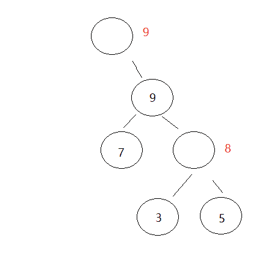

# 二千零一十八、迅雷校园招聘 iOS 在线笔试 A 卷

## 1

对于一个整数 N（512 <= N <= 1024），计算 2 的 N 次方并在屏幕显示十进制结果。

本题知识点

Java 工程师 iOS 工程师 C++工程师 安卓工程师 算法工程师 迅雷 数组 进制转化 模拟 数学 2018

讨论

[tp_16b](https://www.nowcoder.com/profile/2209451)

简单的字符串模拟乘 2 运算即可

```cpp
#include <string>
#include <iostream>
using namespace std;

string NPowerOf2(int n){
    string res("1");

    for( int i =0;i < n; ++i){
        int carry = 0, multi= 0;
        for(int j = res.size( )-1; j >= 0; --j){
            int tmpNum = res[j] - '0';
            multi= (tmpNum<<1) + carry;
            carry = multi/10;  
            res[ j] = (multi%10) + '0';
        }
        if( carry> 0)
            res.insert(res.begin( ), carry+'0');
    }
    return res;
}
int main( )
{
    int n; 
    while( cin>>n)
        cout<<NPowerOf2(n)<<endl;
    return 0;
}
```

编辑于 2018-09-09 08:32:29

* * *

[应雄](https://www.nowcoder.com/profile/5757324)

模拟两数相乘，考虑进位，就 ok 了 import java.util.Scanner;public class Main {
    //对于一个整数 N（512 <= N <= 1024），计算 2 的 N 次方并在屏幕显示十进制结果。
    public static void main(String[] args){
        Scanner input = new Scanner(System.in);
        //输入一个整数 N（512 <= N <= 1024）
        int n = input.nextInt();
        String number = "1";
        for(int i = 0; i < n; i ++){
            number = multiply(number);
        }
         //2 的 N 次方的十进制结果
        System.out.println(number);
    }

    //调用方法求乘积
    public static String multiply(String str1){
        char[] char1 = str1.toCharArray();
        int[] int1 = new int[char1.length+1];
        for(int i = 0; i < char1.length; i ++){
            int1[i+1] = char1[i] - 48;
        }
        //首位为 0
        int1[0] = 0;
        int jinwei = 0;
        int dangqian = 0;
        int mul = 1;
        //设置一个保留位，保留上位是否需要进位
        for(int i = int1.length-1; i >= 0; i --){
            //计算当前位的值
            //1、取出当前位
            dangqian = int1[i];
            //2、计算当前位与个数的乘积并加上低位的进位
            mul = dangqian * 2 + jinwei;
            //3、将乘积的个位数赋值作为当前位
            dangqian = mul%10;
            //4、将当前位的值赋给数组
            int1[i] = dangqian;

            //计算当前位的进位
            //1、将进位赋值为 0
            jinwei = 0;
            //2、如果当前位的乘积有进位（大于 10），则将其 10 位部分的值赋给进位
            if(mul/10 > 0){
                jinwei += mul/10;
            }
        }
        String back = "";
        int startIndex = -1;
        //循环结束后首位任然为 0，则直接返回后位，否则连首位一起返回
        startIndex = (int1[0] == 0) ? 1 : 0;
        for(int i = startIndex; i < int1.length; i ++){
            back += int1[i];
        }
        return back;
    }
}

发表于 2018-09-11 17:15:55

* * *

[华科平凡](https://www.nowcoder.com/profile/4939096)

Python3 一行

```cpp
print(2 ** int(input()))
```

Golang 解法：

使用 math/big 库

```cpp
package main
import (
    "fmt"
    "math/big"
)
func main() {
    var (
        input int64
        i     *big.Int
        n     *big.Int
    )
    i = big.NewInt(2)
    fmt.Scan(&input)
    n = big.NewInt(input)  // 将输入的 int64 格式整数转为 bigint 类型
    i.Exp(i, n, nil) // 计算 i 的 n 次幂
    fmt.Println(i)
}
```

编辑于 2019-02-23 09:14:33

* * *

## 2

TCP 主动关闭一方进入最后的一个状态是

正确答案: C   你的答案: 空 (错误)

```cpp
CLOSE_WAIT
```

```cpp
SYN_SENT
```

```cpp
TIME_WAIT
```

```cpp
LAST_ACK
```

本题知识点

算法工程师 迅雷 C++工程师 iOS 工程师 Java 工程师 安卓工程师 2018

讨论

[武培轩](https://www.nowcoder.com/profile/5033606)

**正确答案**C**答案解析**

（1）应用层调用 close 函数发起关闭连接请求

（2）发送 FIN 到对端，关闭写通道，自己进入**FIN_WAIT1**状态

（3）等待对端的确认 ACK 到来，接受到 ACK 后进入**FIN_WAIT2**状态；如果在超时时间内没有收到确认 ACK 直接进入 CLOSED 状态

（4）如果在 FIN_WAIT1 状态时收到了对端的 FIN 则进入**CLOSING**状态

（5）在 FIN_WAIT2 接受到了对端 FIN 后进入**TIME_WAIT**状态；如果在超时时间内没有收这个 FIN 则直接进入 CLOSED 状态

（6）在 TIME_WAIT 状态等待 2 个 MSL 后进入**CLOSED**状态

发表于 2018-09-11 21:59:28

* * *

[坏坏 62](https://www.nowcoder.com/profile/6236357)

TCP 断开连接时，客户端所经历的三个状态依次为：FIN-WAIT-1、FIN-WAIT-2、TIME_WAIT

发表于 2018-09-07 10:38:19

* * *

## 3

关于 UDP 的说法正确的是

正确答案: B   你的答案: 空 (错误)

```cpp
UDP 的包大小没有限制
```

```cpp
UDP 不会进行错误重传
```

```cpp
UDP 跟 TCP 一样提供可靠的数据报协议
```

```cpp
UDP 有简单的流控制
```

本题知识点

算法工程师 迅雷 C++工程师 iOS 工程师 Java 工程师 安卓工程师 2018

讨论

[武培轩](https://www.nowcoder.com/profile/5033606)

**正确答案**B**答案解析**

TCP：面向连接，提供可靠的服务，有流量控制，拥塞控制，无重复、无丢失、无差错，面向字节流(把应用层传下来的报文看成字节流，把字节流组织成大小不等的数据块)，只能是点对点，首部 20 字节，全双工。

UDP：无连接，尽最大努力交付，没有拥塞控制，面向报文(对于应用程序传下来的报文不合并也不拆分，只是添加 UDP 首部)，支持一对一、一对多、多对多，首部 8 字节。

发表于 2018-09-11 22:01:01

* * *

[昵称是什么？](https://www.nowcoder.com/profile/8671406)

        UDP 优点：UDP 没有 TCP 的握手、确认、窗口、重传、拥塞控制等机制，UDP 是一个无状态的传输协议，所以它在传递数据时非常快。没有 TCP 的这些机制，UDP 较 TCP 被攻击者利用的漏洞就要少一些。但 UDP 也是无法避免攻击的，比如：UDP Flood 攻击。
 UDP 优点：不可靠，不稳定。因为 UDP 没有 TCP 那些可靠的机制，在数据传递时，如果网络质量不好，就会很容易丢包。

发表于 2018-09-10 20:15:40

* * *

## 4

参考以下代码，在大端字节机器中 x.c 的值为

```cpp
union A {
    short c;
    char buf[4];
} x = {0x01, 0x02, 0x03, 0x04}
```

正确答案: A   你的答案: 空 (错误)

```cpp
0x102
```

```cpp
0x201
```

```cpp
0x304
```

```cpp
0x403
```

本题知识点

迅雷 C++工程师 2018 C 语言

讨论

[沧海一声笑 _](https://www.nowcoder.com/profile/3794999)

测试了一下，这个程序的初始化有点问题，其实 x 中实际存储的值是 01，后面的三个值都被丢弃掉了。如果按照题目的本意 x 中的存储内容从低地址到高地址为 01020304，如果将这个联合体解释为 short 类型，由于 short 类型占两个字节的存储空间，那么联合体的最低两个字节有效，也就是 0102。又因为是大端存储，低地址占据最高有效位，所以实际的十六进制值为：0102。我们在书写的时候，对于地址，一般是低地址在左，高地址在右；而对于各种进制的数值，确是最高有效位在左，最低有效位在右，这是在理解大小端问题时我们需要注意的地方。

发表于 2019-01-10 08:36:09

* * *

[应雄](https://www.nowcoder.com/profile/5757324)

所谓大端就是指高位值在内存中放低位地址，所谓小端是指低位值在内存中放低位地址。比如 0x11223344 在大端机上是 11223344，在小端机上是 44332211。

发表于 2018-09-12 10:34:21

* * *

[风华浊世](https://www.nowcoder.com/profile/60735552)

char buf[4];是一个字节数组，也就是每个元素只占一个字节，字节元素不存在大小端问题，所以答案 A 才符合。

发表于 2018-09-18 00:47:10

* * *

## 5

以下变量分配在 BSS 段的是（）

```cpp
char s1[100];
int s2 = 0;
static int s3 = 0;

int main() {
    char s4[100];
}
```

正确答案: A   你的答案: 空 (错误)

```cpp
s1
```

```cpp
s2
```

```cpp
s3
```

```cpp
s4
```

本题知识点

迅雷 C++工程师 2018 C++ C 语言

讨论

[宇智波赤兔](https://www.nowcoder.com/profile/6847433)

BSS 段：通常是指用来存放程序中**未初始化****的****全局变量**的一块内存区域；数据段：通常是指用来存放程序中 **已初始化****的****全局变量** 的一块内存区域，static 意味着在数据段中存放变量；代码段：通常是指用来存放 程序执行代码 的一块内存区域；堆：存放进程运行中被动态分配的内存段，它的大小并不固定，可动态扩张或缩减，这一块在程序运行前就已经确定了；栈：栈又称堆栈， 存放程序的 局部变量 （不包括 static 声明的变量）。除此以外，在函数被调用时，栈用来传递参数和返回值。

发表于 2018-09-07 09:49:28

* * *

[牛客 781402220 号](https://www.nowcoder.com/profile/781402220)

正确答案应该是 abc

发表于 2020-10-04 13:23:19

* * *

[wavespider](https://www.nowcoder.com/profile/237620240)

bss： 未初始化全局变量 data:  已初始化全局变量 text： 代码段 heap： 堆 stack： 栈

发表于 2022-01-15 15:51:09

* * *

## 6

下列关于 linux 文件系统的说法不正确的有？

正确答案: B   你的答案: 空 (错误)

```cpp
全部磁盘块由四个部分组成，分别为引导块 、专用块 、 节点表块 和数据存储块。
```

```cpp
索引节点包含文件的所有信息，包括磁盘上数据的地址和文件类型。每一个文件都包含一个索引节点。
```

```cpp
超级块中包含了关于该硬盘或分区上的文件系统的整体信息，如文件系统的大小等
```

```cpp
数据块是真正存储文件内容的位置
```

本题知识点

算法工程师 迅雷 C++工程师 iOS 工程师 Java 工程师 安卓工程师 2018

讨论

[笛安](https://www.nowcoder.com/profile/134084179)

索引结点中不包括文件的名字，文件名是放在目录块里的。目录块里包含有文件的名字以及此文件的索引结点编号，B 中说索引节点包括文件的所有信息，所以错误。

编辑于 2018-10-16 15:40:27

* * *

[天落枫](https://www.nowcoder.com/profile/7635707)

索引节点包含在索引表中，不是在文件中。

发表于 2018-09-19 21:40:57

* * *

[cheshin](https://www.nowcoder.com/profile/226081220)

Linux 文件系统将文件索引结点号和文件名同时保存在目录中,所以目录只是将文件的名称和它的索引结点号结合在一起的一张表。目录中每一对文件名称和索引结点号称为一个连接。

发表于 2018-09-17 08:43:35

* * *

## 7

对于 C++， struct T {}，sizeof(struct T)的值为（）

正确答案: B   你的答案: 空 (错误)

```cpp
4
```

```cpp
1
```

```cpp
0
```

```cpp
编译或运行期错误
```

本题知识点

迅雷 C++工程师 2018 C++

讨论

[牛客 157460761 号](https://www.nowcoder.com/profile/157460761)

c 是 0,c++是 1

发表于 2020-08-31 12:40:47

* * *

[城北不得君](https://www.nowcoder.com/profile/518034106)

若结构体为空，其大小为 1；若不为空，结构体的存储比较复杂，需要考虑内存存储的字节对齐。

发表于 2018-09-08 18:10:29

* * *

[闲坐清溪听水声](https://www.nowcoder.com/profile/8573357)

编译器运行结果是 0

发表于 2018-09-12 16:41:35

* * *

## 8

以下序列构造的 Haffman 树带权路径长度为
9,7,3,5

正确答案: C   你的答案: 空 (错误)

```cpp
45
```

```cpp
46
```

```cpp
47
```

```cpp
48
```

本题知识点

算法工程师 迅雷 C++工程师 iOS 工程师 Java 工程师 安卓工程师 2018

讨论

[啦啦 201807041946513](https://www.nowcoder.com/profile/782889333)

首先排序:3579； 然后将最小的两个数组成一个子树(3，5) 子树的和为子树的根(3，5)8 将根放到数组里面:879 重复二步骤，最小的两个组成树(7，8) 子树的和为根(7，8)15 最后数组为:9 15 组成树(9，15)24 最后整个树为(9，(7，(3，5)8)15)24 最将叶子进行权值相加: 3*3+5*3+7*2+9*1=47 喜欢给个赞呗^_^

编辑于 2018-09-09 09:17:34

* * *

[武培轩](https://www.nowcoder.com/profile/5033606)

**正确答案**

C

**答案解析**


1、首先我们对这一组数字进行排序。规则是从小到大排列。

2、在这些数中 选择两个最小的数字（哈夫曼树是从下往上排列的）写在纸上。

3、用一个线连接上两个最小的数。在顶点处计算出这两个数字的和 并写在上面。然后再比较剩下的数字和这个和的大小，再取出两个最小的数字进行排列 4、最后将合并成一个二叉树 5、再将叶子求权值和高度乘积之和: 3*3+5*3+7*2+9*1=47

编辑于 2018-09-11 22:11:40

* * *

[墓谒之火](https://www.nowcoder.com/profile/2456042)

**3*3+5*3+7*2+9=47**

发表于 2018-09-10 11:26:06

* * *

## 9

以下那个排序算法的时间复杂度优于 O(n²)

正确答案: D   你的答案: 空 (错误)

```cpp
插入排序
```

```cpp
冒泡排序
```

```cpp
简单选择排序
```

```cpp
归并排序
```

本题知识点

算法工程师 迅雷 C++工程师 iOS 工程师 Java 工程师 安卓工程师 2018

讨论

[Kumori](https://www.nowcoder.com/profile/6270434)

一般交换相邻元素的就是 O(n²）啦，其他交换方式就是 O(nlogn)

发表于 2018-10-05 14:07:58

* * *

[现在式](https://www.nowcoder.com/profile/2481145)

其他三个都是 O（n²） 希尔排序，快速排序，堆排序和归并排序是 O(nlogn)

发表于 2018-09-12 20:48:51

* * *

## 10

一个栈的压栈序列是 A,B,C,D,E ，则不可能的出栈序列是

正确答案: C   你的答案: 空 (错误)

```cpp
EDCBA
```

```cpp
DECBA
```

```cpp
DCEAB
```

```cpp
ABCDE
```

本题知识点

算法工程师 迅雷 C++工程师 iOS 工程师 Java 工程师 安卓工程师 2018

讨论

[SWUST-njc](https://www.nowcoder.com/profile/107085778)

先进后出，1、可以全进再依次出，2、也可以进一个出一个，3、也可以进一部分，出一个，再进一部分

发表于 2018-09-08 16:29:26

* * *

## 11

32 位机器上，以下代码的输出是（）

```cpp
char c = -1;
int i0 = c;
int i1 = (unsigned char)c;
printf("%d, %d\n", i0, i1);
```

正确答案: C   你的答案: 空 (错误)

```cpp
255,255
```

```cpp
-1,-1
```

```cpp
-1,255
```

```cpp
255,-1
```

本题知识点

迅雷 C++工程师 2018 C++

讨论

[zx_26](https://www.nowcoder.com/profile/952455905)

char 类型有符号，所以-1 可以表示，uchar 类型无符号（范围是 0-255），-1 是 1000 0001，转换成补码是 1111 1111，uchar 无符号位，所以最高位的 1 也计算到值里，为 1+2+4+...+128=255

发表于 2018-09-08 18:55:24

* * *

[NoobMaster996](https://www.nowcoder.com/profile/614503331)

[unsigned]char 到 [unsigned]int 需要类型提升类型提升时，**有符号型高位补符号位**，**无符号型高位补 0**（是对这个数的补码补码补码进行补位！）char c = -1，所以它的原码是 1000 0001，**补码**是 1111 1111 先看 i0，是 char->int 的转换，**有符号型提升**，于是**高位补符号位**，所以 i0 的补码就是 1111 1111 1111 1111 所以换回原码 i0 = -1 再看 i1，是先（1）char->unsigned，再（2）unsigned char->int 的转换：（1）这一步不涉及补位，也就是说数字的补码不变，还是 1111 1111，但是这时候已经没有符号位了，**变成了无符号型**（2）**无符号型提升**，**高位补 0**，所以 i1 的补码就是 0000 0000 1111 1111 所以换回原码 i1 = 255

编辑于 2021-06-25 15:19:54

* * *

[牛客 992088129 号](https://www.nowcoder.com/profile/992088129)

我觉得这道题有问题。 char 为-1,其编码就为 1111 1111，int 为 4 字节，其低 8 位为 1111 1111，char 转换成 int，高位补 0，地位就是 1111 1111，转化后的 int 编码为 0000 0000 00000000 00000000 11111111,显然，int 数据为 255

发表于 2020-11-20 14:34:20

* * *

## 12

以下属于传输层协议的是

正确答案: A B   你的答案: 空 (错误)

```cpp
TCP
```

```cpp
UDP
```

```cpp
HTTP
```

```cpp
ARP
```

```cpp
ICMP
```

本题知识点

算法工程师 迅雷 C++工程师 iOS 工程师 Java 工程师 安卓工程师 2018

讨论

[武培轩](https://www.nowcoder.com/profile/5033606)

**正确答案**AB**答案解析**传输层协议:TCP UDP 应用层协议:HTTP 网络层:ARP ICMP

发表于 2018-09-11 22:16:42

* * *

[墓谒之火](https://www.nowcoder.com/profile/2456042)

传输层协议:TCP UDP 应用层协议:HTTP 网络层:ARP ICMP

发表于 2018-09-10 11:43:25

* * *

## 13

以下哪些是属于 TCP 协议的特性

正确答案: A C D   你的答案: 空 (错误)

```cpp
滑动窗口
```

```cpp
多播和广播
```

```cpp
超时重传
```

```cpp
分片传输
```

本题知识点

算法工程师 迅雷 C++工程师 iOS 工程师 Java 工程师 安卓工程师 2018

讨论

[城北不得君](https://www.nowcoder.com/profile/518034106)

超时重传，原理是在发送某一个数据以后就开启一个**计时器**，在一定时间内如果没有得到发送的数据报的 ACK 报文，那么就重新发送数据，直到发送成功为止。滑动窗口作用：1、提供 TCP 的可靠性；2、提供 TCP 的流控特性。TCP 的滑动窗口的可靠性也是建立在“确认重传”基础上的。TCP 报文段如果很长的话，会在发送时发生分段，在接受时进行重组，同样 IP 数据报在长度超过一定值时也会发生分片，在接收端再将分片重组。

发表于 2018-09-08 20:22:37

* * *

[昵称是什么？](https://www.nowcoder.com/profile/8671406)

TCP 的主要特性：面向连接型的传输协议，仅支持单播传输，传输单位为数据段，仅一种 TPDU 格式，支持全双工传输，TCP 连接是基于字节流的，而非报文，每次发送的 TCP 数据段大小和数据段数都是可变的

发表于 2018-09-10 20:19:27

* * *

[2022 年冲冲冲](https://www.nowcoder.com/profile/245172134)

分段和分片什么区别？

发表于 2018-09-10 15:07:51

* * *

## 14

Unix 系统关于进程和线程的说法，正确的是

正确答案: A B C E   你的答案: 空 (错误)

```cpp
都是调用了 clone 方法产生新的进程或线程
```

```cpp
创建线程比创建进程要更轻量级
```

```cpp
线程之间共享同一个内存空间
```

```cpp
进程之间共享同一个内存空间
```

```cpp
线程和进程都由内核进行调度
```

本题知识点

算法工程师 迅雷 C++工程师 iOS 工程师 Java 工程师 安卓工程师 2018

讨论

[徐凯 201804072224409](https://www.nowcoder.com/profile/3798514)

a 选项为什么没有 fork

发表于 2018-09-10 16:04:35

* * *

[坏坏 62](https://www.nowcoder.com/profile/6236357)

关于选项 E，为什么有的书上说“Linux 的调度是基于线程的”，那么按照这个说法，E 选项对吗？求大神解析，

发表于 2018-09-07 14:17:00

* * *

## 15

关于 C++的说法错误的是

正确答案:   你的答案: 空 (错误)

```cpp
一个类可以有多个析构函数
```

```cpp
析构函数可以为 virtual
```

```cpp
编译器不会为空类产生默认构造函数
```

```cpp
可以用 free 释放一个类对象
```

本题知识点

算法工程师 迅雷 C++工程师 iOS 工程师 Java 工程师 安卓工程师 2018 C++

讨论

[牛客职导官方账号](https://www.nowcoder.com/profile/897353)

【正确答案】A C D
【解析  查看全部)

编辑于 2021-11-19 10:22:45

* * *

[天落枫](https://www.nowcoder.com/profile/7635707)

一个类只有一个析构函数且可以是虚函数，编译器会在某些时候为空类产生构造函数，free 用来释放内存空间，若要释放一个对象还需调用其析构函数。

发表于 2018-09-19 22:11:56

* * *

[我是一颗](https://www.nowcoder.com/profile/3484528)

有多少人选的唯一错误的答案。。。

发表于 2018-09-09 15:32:48

* * *

## 16

以下哪些不是解释型语言

正确答案: A B C   你的答案: 空 (错误)

```cpp
C/C++
```

```cpp
Java
```

```cpp
Go
```

```cpp
Javascript
```

本题知识点

算法工程师 迅雷 C++工程师 iOS 工程师 Java 工程师 安卓工程师 2018 C++

讨论

[Q.IAN](https://www.nowcoder.com/profile/9709741)

编译型语言：在程序运行之前，有一个单独的编译过程，将程序翻译成机器语言，以后执行这个程序时，就不用再进行翻译了。（C,C++等，需要经过编译（compile）、链接（linker）这两个步骤）

解释型语言：是在运行的时候将程序翻译成机器语言，所以运行速度相对于编译型语言要慢。有良好的平台兼容性，在任何环境中都可以运行，前提是安装了解释器（JavaScript、Python、Erlang、PHP、Perl、Ruby）

编辑于 2018-09-14 15:15:32

* * *

[vickyZhang.](https://www.nowcoder.com/profile/4874810)

go 语言是编译型语言吧！它是面向过程的语言，有点类似于 C

发表于 2018-10-02 10:29:47

* * *

[小人物 _ 大希望](https://www.nowcoder.com/profile/5258615)

题目有问题啊，Java 也是解释字节码执行的啊，应该算是编译型和解释型的混合吧。

发表于 2018-09-09 16:54:48

* * *

## 17

给定一个正整数 n，求出 0 到 n 中有几个数满足其二进制表示不包含连续的 1。1<=n<=10⁹。
样例：
输入：5， 输出：5。
由于 0 到 5 的二进制表示分别为： 0； 1； 10； 11； 100； 101。 这六个数中，只有 3 的二进制表示包含有连续的 1，故答案为 5。
问题：
若输入为 6144，则输出为

正确答案: D   你的答案: 空 (错误)

```cpp
980
```

```cpp
364
```

```cpp
377
```

```cpp
610
```

本题知识点

算法工程师 迅雷 C++工程师 iOS 工程师 Java 工程师 安卓工程师 2018

讨论

[我只是想要个 offer](https://www.nowcoder.com/profile/8376728)

6144 ==> 1100000000000 11 后面 11 个 0 分成两个排列问题 10 后面排列 11 个 0/1 其中需要保证 01 交叉, 所以可以看成在 x 个 0 中间插入 11 - x 个 1, 对每种情况有 x+1 个空位另一种情况为 12 个 0/11 排列，排列条件与上类似。综合两种情况得出答案 610

发表于 2018-09-10 00:59:01

* * *

[offersHarvester](https://www.nowcoder.com/profile/6463114)

由于 6144=1100000000000，由 2 个 1 和 11 个 0 组成。小于 6144 的可以分为三种情况：10/01/00（+11 位）。（1）对于 00 和 10，由于第二位是 1，所以前两位不会影响“连续的 1”。使用插队法：例如，后面 11 个 0 里面有 3 个 1 时，其他的是 8 个 0，8 个 0 将产生 9 个空隙可以插入，于是位 C[9]^(3 。) 依次类推，可以得到 233 种。（2）对于前两位位 01，和 01 的来说，第三位只能是 0.因此。后面的 10 位可以再次使用插队法。有 144 种。最后，144+2*233=610\.

发表于 2018-09-16 15:29:46

* * *

[TaoHuang](https://www.nowcoder.com/profile/2962151)

6144=>1100000000000,后面 11 个 0。需要判断小于 6144 而不重复的 1 的元素的个数，故把最高位分为三种情况：00，01，10。由此可知 00 的个数与 10 的个数一样————转为后面 11 位不连续出现 1 的情况，考虑 1 出现的个数得到结果为：C_11⁰+C_11¹+C_10²+C_9³+C_8⁴+C_7⁵+C_6⁶=233；而 01 情况————转为后面 10 位不连续出现 1 的情况,考虑 1 出现的个数得到结果为：C_10⁰+C_10¹+C_9²+C_8³+C_7⁴+C_6⁵=144。
最终结果为：233+233+144=610

编辑于 2018-09-11 13:59:17

* * *

## 18

以下说法不正确的是？

正确答案: A D E   你的答案: 空 (错误)

```cpp
类成员的定义必须放在类定义体内部
```

```cpp
类的一个成员只能具有一种访问控制属性
```

```cpp
在类中,不作特别说明的数据成员均为私有类型
```

```cpp
构造函数和析构函数是特殊的成员函数,因此不允许重载
```

```cpp
类成员的定义必须是成员变量在前、成员函数在后
```

本题知识点

算法工程师 迅雷 C++工程师 iOS 工程师 Java 工程师 安卓工程师 2018 C++

讨论

[我是一颗](https://www.nowcoder.com/profile/3484528)

struct 定义的咋说

发表于 2018-09-09 15:43:58

* * *

[牛客 235861704 号](https://www.nowcoder.com/profile/235861704)


发表于 2021-06-16 22:42:39

* * *

[牛客 827197003 号](https://www.nowcoder.com/profile/827197003)

定义原来是实现的意思啊，还以为定义是声明，实现是实现。

发表于 2020-11-20 19:17:26

* * *

## 19

c++11 中提供了 lambda 特征，语法为

```cpp
[=] (int x) mutable throw() -> int {
    // 函數內容
    int n = x + y;
    return n;
}
```

请问以下正确的是（）

正确答案: A B C D   你的答案: 空 (错误)

```cpp
lambda 常用于封装传给算法的数行简短代码，或是用于解决重复代码的问题
```

```cpp
[]表示不捕获任何外部变量，[=]表示通过拷贝捕获所有外部变量
```

```cpp
(int x)表示此 lambda 需要传入一个 int 参数
```

```cpp
lambda 在 c++14 后开始可以支持泛型
```

本题知识点

迅雷 C++工程师 2018 C++

讨论

[orangege](https://www.nowcoder.com/profile/8960760)

lambda 的定义和使用是在同一个地方的，对于接受函数指针或函数符的函数，可使用匿名函数定义（lambda）作为其参数，即可封装传递给算法的数行简短代码；

lambad 可访问作用域内的任何动态变量；要捕获要使用的变量，可将其名称放到中括号内，只指定变量名，如[z]，将按值访问变量，前加&，按引用访问，[&]访问所有引用变量，[=]能按值访问所有动态变量，也可混合使用。[ ]仅表示 lambda 引导符；

bool f3(int x)｛return x%3==0；｝对应的 lambda 为   [ ] (int x) {return x%3==0;}  使用[ ]代替了函数名，没有声明返回类型，返回类型相当于使用 decltyp 根据返回值自动推断，如果 lambda 不包含返回语句，推断出的返回语句为 void 并且仅当表达式完全由一条返回值语句构成时，自动推断才有效，否则要新增返回类型后置语法：[ ] (double x) ->double {int y=x; return x-y;}

发表于 2018-11-02 21:52:05

* * *

[佚](https://www.nowcoder.com/profile/822631024)

B 选项明显不对啊, [=] 是以拷贝的形式,捕获外部闭合作用域的变量.参考: [`en.cppreference.com/w/cpp/language/lambda`](https://en.cppreference.com/w/cpp/language/lambda)
中的

ClosureType::Captures 一节

发表于 2021-02-23 18:38:34

* * *

[RichardoQ](https://www.nowcoder.com/profile/64762243)

为什么可以用于解决重复代码的问题？又没有复用

编辑于 2021-04-28 13:55:44

* * *

## 20

在 32 位大端模式处理器上变量 b 等于？
unsigned int a= 0x1234;
unsigned char b=*(unsigned char *)&a;

正确答案: A   你的答案: 空 (错误)

```cpp
0x00
```

```cpp
0x12
```

```cpp
0x34
```

```cpp
0x1234
```

本题知识点

算法工程师 迅雷 C++工程师 算法工程师 迅雷 iOS 工程师 迅雷 Java 工程师 C++工程师 算法工程师 迅雷 安卓工程师 iOS 工程师 迅雷 iOS 工程师 迅雷 2018 C++工程师 迅雷 2018 算法工程师 迅雷 2018

讨论

[SWUST-njc](https://www.nowcoder.com/profile/107085778)

unsigned int 是四个字节 0x1234 才两个字节因为 0x1234=0x00001234 且为大端模式(高字节放在低地址)所以获得的为 0x00 

发表于 2018-09-08 16:42:57

* * *

## 21

在 tcp/ip 网络分层⾥里⾯面，icmp 和 igmp 是属于哪一层？

正确答案: B   你的答案: 空 (错误)

```cpp
链路层
```

```cpp
网络层
```

```cpp
传输层
```

```cpp
应用层
```

本题知识点

算法工程师 迅雷 C++工程师 iOS 工程师 Java 工程师 安卓工程师 2018

讨论

[武培轩](https://www.nowcoder.com/profile/5033606)

**正确答案**B**答案解析**网络层：IP (IPv4 · IPv6) · ICMP · ICMPv6 · IGMP ·IS-IS · IPsec · BGP · RIP · OSPF ·ARP · RARP

发表于 2018-09-11 22:21:09

* * *

[9028_qqq](https://www.nowcoder.com/profile/125866061)

网络层一般与 ip 协议配合使用 

发表于 2020-11-30 20:59:20

* * *

## 22

如果 ip 分片报文丢失，下面说法正确的是

正确答案: B   你的答案: 空 (错误)

```cpp
ip 层负责重发
```

```cpp
上层协议（例如 tcp）负责重发
```

```cpp
链路层负责重发
```

```cpp
只有传输层（例如 tcp）会进行分片，ip 层不负责分片
```

本题知识点

算法工程师 迅雷 C++工程师 iOS 工程师 Java 工程师 安卓工程师 2018

讨论

[tp_16b](https://www.nowcoder.com/profile/2209451)

**有人可以解释一下 D 选项吗？**

发表于 2018-09-09 17:54:13

* * *

## 23

在 32 位系统中以下函数的返回值是（）

```cpp
int fun(void) {
    int *p, j, i=10;
    p = &j;
    *p = i++;
    i += sizeof(i) + sizeof(*p) + sizeof(p);
    return i;
}
```

正确答案: B   你的答案: 空 (错误)

```cpp
22
```

```cpp
23
```

```cpp
25
```

```cpp
其他结果都不对
```

本题知识点

迅雷 C++工程师 2018 C++

讨论

[耍蛇者说](https://www.nowcoder.com/profile/76274618)

*p = i++；所以*p = 10， i = 11；int 型 4 个字节 所以 sizeof(i)和 sizeof(*p) 都为 4 系统是 32 位  所以 sizeof(p)为 32 位 4 个字节；所以 i = i + 4 + 4 + 4 = 23

发表于 2018-09-10 12:25:00

* * *

## 24

下面的陈述中哪个是正确的？

正确答案: A   你的答案: 空 (错误)

```cpp
类必须提供至少一个构造函数
```

```cpp
默认构造函数的形参列表中没有形参。
```

```cpp
如果一个类没有有意义的默认值，则该类不应该提供默认构造函数。
```

```cpp
如果一个类没有定义默认构造函数，则编译器会自动生成一个，同时将每个数据成员初始化为相关类型的默认值。
```

本题知识点

算法工程师 迅雷 C++工程师 iOS 工程师 Java 工程师 安卓工程师 2018 C++

讨论

[cyfinder](https://www.nowcoder.com/profile/1777871)

出的题太抠文字了。对于 A：可能理解为必须程序员自定义构造函数。导致判断出错。对于 B：默认构造函数分为三类，默认普通构造函数（无形参）；默认拷贝构造函数，形参为左值引用；默认移动构造函数（当类没有自定义任何的拷贝控制成员，且每个非静态变量都可移动时，会默认生成移动构造函数），形参为右值引用。

发表于 2018-09-13 17:06:57

* * *

[tp_16b](https://www.nowcoder.com/profile/2209451)

**A 选项：**一个类必须拥有构造函数，否则没发创建一个对象，达不了类的目的。
一开始本人对构造函数为私有的情况有所顾忌，但构造函数私有只是不想在外部直接定义对象出来，并不是说不可以定义对象。**考虑实现一个单例类的例子：**

```cpp
class A{ 
public:
    void show( ){ 
        cout<<val<<endl;
    }
    static A* GetInstance( )
    { 
        static A instance;
        return &instance;
    }
private:
    A() { }
    static int val; 
};
int A::val = 0; 
```

**B 选项：**默认的构造函数除了构造还有 **拷贝构造** **右值构造（c++11）**，它们两个是带有参数的
**D 选项：**编译器生成的默认构造函数只负责初始化有默认构造函数的成员对象，其他的一律不负责（int 等内置类型数据成员的初始化，这个该由程序员去做。

发表于 2018-09-10 00:52:16

* * *

[黄俊尹](https://www.nowcoder.com/profile/262605718)

这种题属于出题人水平真拉胯

发表于 2021-11-07 18:26:36

* * *

## 25

哪个类定义可能需要一个复制构造函数？

正确答案: B C   你的答案: 空 (错误)

```cpp
包含四个 float 成员的 Point3w 类
```

```cpp
Matrix 类，其中，实际矩阵在构造函数中动态分配，在析构函数中删除
```

```cpp
Payroll 类，在这个类中为每个对象提供唯一 ID
```

```cpp
Word 类，包含一个 string 和一个以行列位置对为元素的 vector
```

本题知识点

算法工程师 迅雷 C++工程师 iOS 工程师 Java 工程师 安卓工程师 2018 C++

讨论

[我的天鸭](https://www.nowcoder.com/profile/243498)

类需要定义一个新的复制构造函数，说明默认的复制构造函数不能满足需求：A 选项可以用默认的复制构造函数 B 选项需要动态分配内存，需要 C 选项根据存在的 Payroll 复制一份相同的副本，不能使得对象 ID 唯一 D 选项可以调用 string/vector 类的复制构造函数

发表于 2018-10-17 18:54:26

* * *

[牛客 60830357 号](https://www.nowcoder.com/profile/60830357)

A Point3w 类不需要复制构造函数，其类中的数据成员都是内置类型的，没有指针成员，使用编译器提供的构造函数即可 B Matrix 类需要分配复制构造函数。因为需要涉及指针及内存的动态分配 C Payroll 类需要。在根据 Payroll 创建其副本时，需要提供唯一的 IDD 调用 string/vector 的复制构造函数

编辑于 2021-07-17 10:22:05

* * *

[tp_16b](https://www.nowcoder.com/profile/2209451)

有人解释一下 b 选项？

发表于 2018-09-09 17:58:31

* * *

## 26

下列关于 C++类的说法中错误的有哪些？

正确答案: B C D   你的答案: 空 (错误)

```cpp
一个空类默认会生成构造函数,拷贝构造函数,赋值操作符,析构函数
```

```cpp
一个类可以有多个析构函数
```

```cpp
类中析构函数可以为 virtual,可以被重载
```

```cpp
类的构造函数如果都不是 public 访问属性,则类的实例无法创建
```

本题知识点

算法工程师 迅雷 C++工程师 iOS 工程师 Java 工程师 安卓工程师 2018 C++

讨论

[树枝上的红薯](https://www.nowcoder.com/profile/1378074)

类的构造函数一般是共有的（public），但有时也把构造函数声明为私有的（private），其作用是限制其创建该类对象的范围，这时，只能在本类和友元中创建该类对象。

发表于 2018-10-05 00:50:01

* * *

[Frogman](https://www.nowcoder.com/profile/348026379)

C 选项有毒，玩文字游戏，前半句是对的，后半句跟前半句没任何关系，virtual 对应的是重写，这里说重载

发表于 2018-10-12 15:29:07

* * *

[徐凯 201804072224409](https://www.nowcoder.com/profile/3798514)

a 选项不严谨 在深入探索 c++对象模型说了只有四种情况下 才会生成默认构造函数 。

发表于 2018-09-10 16:03:27

* * *

## 27

用 x,y 表示一个整数范围区间，现在输入一组这样的范围区间(用空格隔开)，请输出这些区间的合并。

本题知识点

Java 工程师 iOS 工程师 C++工程师 安卓工程师 算法工程师 迅雷 数组 排序 *动态规划 2018* *讨论

[秋山澪](https://www.nowcoder.com/profile/5568633)

```cpp
#include <iostream>
using namespace std;

int main(){
    static int arr[1000];
    char ch;
    int a,b;
    while(cin>>a>>ch>>b){
        // 将输入的区间映射到数组上，右端作为开区间（关键）
        for(int i=a;i<b;i++){
             arr[i]=1;
         }
     }
    int flag=0;
    for(int i=0;i<sizeof(arr)/sizeof(int);i++){
        if(flag==0&&arr[i]==1){
            cout<<i<<",";
            flag=1;
        }
        else if(flag==1&&arr[i]==0){
            cout<<i<<" ";
            flag=0;
        }
    }
     return 0;
 }

```

编辑于 2018-09-14 12:29:33

* * *

[华科平凡](https://www.nowcoder.com/profile/4939096)

python3 解法

leetcode 上一道原题的变形, 解法如下：

```cpp
def merge(intervals):
    """
    合并区间算法。
    :param intervals: 传入的区间数组。例如[[1, 3], [2, 5]]
    :return: 合并后的区间。例如[[1, 5]]
    """
    out = []
    for i in sorted(intervals, key=lambda i: i[0]):  # 对区间进行排序
        if out and i[0] <= out[-1][1]:  # 当前区间起始位置小于 out 最后一个元素的结束位置，这时就要进行合并
            out[-1][1] = max(out[-1][1], i[1])  # 合并区间。区间的结束位置 = max(当前遍历区间的结束位置，out 最后一个区间的结束位置)
        else:
            out.append(i)  # 不需要合并时的处理。
    return out

# 将输入的字符串转换成区间形式放到 intervals 数组中。
intervals = []
for i in input().split():  # 切成"1,3"、"2,5"这种形式
    start, end = i.split(",")
    intervals.append([int(start), int(end)])

# 调用合并区间算法
out = merge(intervals)

# 输出处理。
res = ""
for i in out:
    res = res + str(i[0]) + "," + str(i[1]) + " "
print(res.rstrip(";"))
```

发表于 2019-02-24 11:31:08

* * *

[tp_16b](https://www.nowcoder.com/profile/2209451)

```cpp
#include <iostream>
#include <vector>
#include <algorithm>

using namespace std;

int main( )
{
    int a, b;
    char sep;
    vector<pair<int, int> > intervalArr;
    while( cin>>a>>sep>>b)
        intervalArr.push_back({a,b} );
    sort(intervalArr.begin( ), intervalArr.end( ));

    int i = 0;
    //每次将合并了的区间 erase.
    /* 可以合并区间：1\. [1,3]和[2,5]
     * 2\. [1,5]和 [2,4] 两种情况*/
    while( i+1 < intervalArr.size( )){
        if( intervalArr[i].second >=intervalArr[i+1].first
                || intervalArr[i].first == intervalArr[i+1].first)
        {      
            intervalArr[i].second = max(intervalArr[i].second, intervalArr[i+1].second);
            intervalArr.erase(intervalArr.begin()+i+1);
        }else
            ++i;
    }
    int len = intervalArr.size( );
    for(int i =0; i< len-1; ++i)
        cout<<intervalArr[i].first<<sep<<intervalArr[i].second<<" ";
    cout<<intervalArr[len-1].first<<sep<<intervalArr[len-1].second<<endl;
    return 0;
} 
```

发表于 2018-09-09 08:28:13

* * **