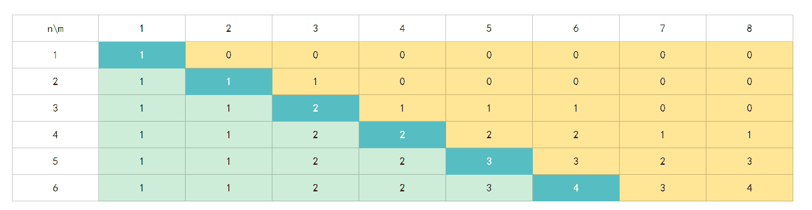
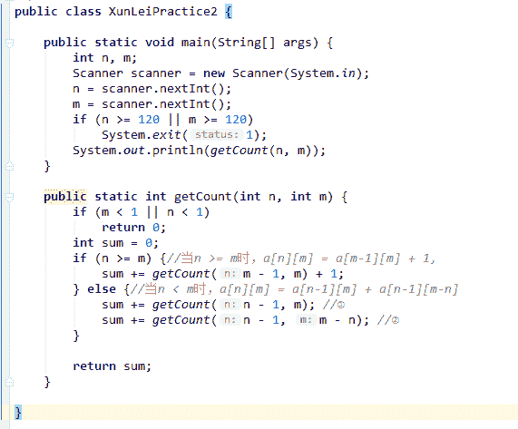
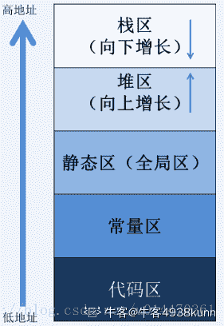

# 二千零一十八、迅雷校园招聘 iOS 在线笔试 B 卷

## 1

输入一个有符号整数，输出该整数的反转值。

本题知识点

Java 工程师 iOS 工程师 C++工程师 安卓工程师 算法工程师 迅雷 栈 *模拟 数组 2018* *讨论

[琢磨 0.0](https://www.nowcoder.com/profile/1366953)

#include <iostream>using namespace std;
int main()
{
    int input;
    cin >> input;
    int output = 0;
    while(input!=0)
    {
        output=output*10+input%10;
        input/=10;
    }
    cout<<output;
}

发表于 2018-09-13 11:59:13

* * *

[华科平凡](https://www.nowcoder.com/profile/4939096)

Python3 解法

```cpp
a = input()
res = a[::-1].lstrip("0") if "-" not in a else "-" + a[1::][::-1].lstrip("0")
print(res if res else "0")
```

*   注意有尾数为 0 的情况。如果尾数有 0，要把它去掉，（例如 200 翻转以后为 002）；也要注意特殊情况(例如输入为 0 去掉后就为空了)。

发表于 2019-02-24 11:16:19

* * *

[DannyFeng](https://www.nowcoder.com/profile/412092350)

```cpp
import java.util.Scanner;

public class Main {
    public static int reverse(int x) {
        int rev = 0;
        while (x != 0) {
            rev = rev * 10 + +x % 10;
            x /= 10;
        }
        return rev;
    }

    public static void main(String[] args) {
        Scanner in = new Scanner(System.in);
        int input = in.nextInt();
        System.out.println(reverse(input));
    }
}

```

发表于 2018-09-15 07:41:28

* * *

## 2

给定整数 n，取若干个 1 到 n 的整数可求和等于整数 m，编程求出所有组合的个数。比如当 n=6，m=8 时，有四种组合：[2,6], [3,5], [1,2,5], [1,3,4]。限定 n 和 m 小于 120

本题知识点

Java 工程师 iOS 工程师 C++工程师 安卓工程师 算法工程师 迅雷 动态规划 数学 2018

讨论

[猫毛·波拿巴](https://www.nowcoder.com/profile/499076637)

由于组合个数与 n、m 的取值存在规律，故可以根据规律，即根据各种 n、m 取值之间的关系，可以推导当前 n、m 取值对应的组合个数。*此回答，参考了几个前面的答案。*** *表内单元格 a[n][m]表示：从 1~n 中挑选几个数的和等于 m，存在的组合个数****当 n >= m 时，图中蓝色部分（深蓝+淡蓝）**1~m-1，可以成为组合的加数，即用 1 到 m-1 表示 m，=> a[m-1][m]m, 可以成为组合的加数，即刚好单个加数{m}表示 m, => 1m+1~n, 由于这些数都大于 m,不可能成为加数 => 0**a[n][m] = a[m-1][m] + 1****当 n < m 时，图中橙色部分**加数中无 n，从 1~n-1 中挑选几个数的和等于 m => a[n-1][m]加数中有 n，从 1~n-1 中挑选几个数的和加上 n 等于 m，相当于，从 1~n-1 中挑选几个数的和等于 m-n => a[n-1][m-n]把这两块加起来就是结果集了**a[n][m] = a[n-1][m] + a[n-1][m-n]*** 

发表于 2018-09-13 21:58:55

* * *

[cherrow](https://www.nowcoder.com/profile/2711164)

public class Main{
    public static void main(String[] args){
        Scanner scan=new Scanner(System.in);
        int n=scan.nextInt();
        int m=scan.nextInt();
        System.out.println(getCount(n,m));
    }
    //0-1 背包问题  f(n,m) 转化为两个子问题 f(n-1,m) 和 f(n-1,m-n)
    public static int getCount(int n, int m){
        if(m<1 || n<1) return 0;
        if(m<n) n=m;
        int sum=0;
        if(m==n) sum++;
        //不选中 n
        sum+=getCount(n-1,m);
        //选中 n
        sum+=getCount(n-1,m-n);
        return sum;
    }
}

编辑于 2018-09-07 16:06:14

* * *

[komu](https://www.nowcoder.com/profile/895165)

```cpp
#include<bits/stdc++.h>
using namespace std;
int main()
{
    int n,m;
    cin>>n>>m;
    vector<int> dp(m+1,0);
    dp[0]=1;
    for(int i=1;i<=n;i++) //注意是 1 到 n
    {
        for(int j=m;j>=i;j--)
        {
            dp[j]=dp[j]+dp[j-i];
        }
    }
    cout<<dp[m]<<endl;
}

	//0-1 背包问题

```

发表于 2018-09-10 15:47:29

* * *

## 3

32 位机器上，以下结构的 sizeof(P)为（）

```cpp
struct A {
    int a;
    char b;
    int c;
    char d;
};
struct P {
    struct A w[2];
    short b;
    struct A* p;
}
```

正确答案: C   你的答案: 空 (错误)

```cpp
26
```

```cpp
38
```

```cpp
40
```

```cpp
30
```

本题知识点

迅雷 C++工程师 2018 C 语言

讨论

[蔡逸超](https://www.nowcoder.com/profile/2693241)

/*考察结构体对齐和填充：结构体每个成员相对于结构体首地址的偏移量都是成员大小的整数倍，如果不是，编译器会自动在成员间填充。*/struct A {int a;                            //4 byteschar b;                        //1 bytes//char pad[3]               //3 bytesint c;                           //4 bytes
char d;                       //1 bytes//char pad[3]              //3 bytes}                            // total = 16 bytes/* P 中有结构体 A 的成员，但是计算时按照 A 中数据类型确定的*/struct P {
struct A w[2];    // 2 * 16 bytes
short b;            //2 bytes//char pad[2]    //2 bytesstruct A* p;      //4 bytes
}  // total = 40 bytes

发表于 2018-09-07 07:39:24

* * *

[牛客 138449636 号](https://www.nowcoder.com/profile/138449636)

整形 4 字节 字符 1 字节 short2 字节 指针地址 4 字节 但是结构体中按照最大的成员变量划分空间，比如结构体 A 中最大成员为 int，char 类型系统会补足 3 字节空间

发表于 2021-09-16 20:45:44

* * *

[牛客 572894403 号](https://www.nowcoder.com/profile/572894403)

结构体指针只占 4 个字节吗

发表于 2020-12-06 22:51:16

* * *

## 4

以下哪个容器的删除操作会进行内存的移动

正确答案: D   你的答案: 空 (错误)

```cpp
map
```

```cpp
list
```

```cpp
set
```

```cpp
vector
```

本题知识点

算法工程师 迅雷 C++工程师 iOS 工程师 Java 工程师 安卓工程师 2018

讨论

[茶色满原](https://www.nowcoder.com/profile/3042017)

vector 是利用数组存放元素，当前面有元素被删除的时候后面的元素都向前移动一格，所以会进行内存的移动。链表删除元素的时候，无论是双向还是单向只需改变指针的指向即可（L->next，不需要对 L->data 进行移动）。map、set 底层实现都是 rb_tree，但是本质上是树，故其具体实现仍然是链表，删除元素的时候，只需改变其指针即可。

编辑于 2018-09-14 13:56:57

* * *

[一片红叶向南飞](https://www.nowcoder.com/profile/224057184)

list 有基于数组实现的，有基于链表实现的。。用链表实现的 list 在删除时不会进行内存的移动

发表于 2018-11-03 15:36:44

* * *

[monster_cuit](https://www.nowcoder.com/profile/701557449)

vector 是连续存储在内存上的数组，删除某个数组元素的确有影响

发表于 2018-09-13 23:30:47

* * *

## 5

下列关于 const 和#define 定义常量的区别，说法不正确的有（）

正确答案: D   你的答案: 空 (错误)

```cpp
define 宏是在预处理阶段展开。const 常量是编译运行阶段使用
```

```cpp
宏没有类型，不做任何类型检查，仅仅是展开。const 常量有具体的类型，在编译阶段会执行类型检查
```

```cpp
define 宏仅仅是展开，有多少地方使用，就展开多少次，不会分配内存。const 常量会在内存中分配(可以是堆中也可以是栈中)
```

```cpp
const 定义和#define 定义的常量在程序运行过程中只有一份拷贝
```

本题知识点

迅雷 C++工程师 2018 C++ C 语言

讨论

[铁汁](https://www.nowcoder.com/profile/6478245)

[解析]A，正确，#define 定义的宏是在预处理阶段进行替换的，const 常量是在编译、运行阶段进行使用的。注意是仅仅的字符串替换，并不会检查其合法性。预处理阶段做了的任务：
1:将头文件中的内容(源文件之外的文件)插入到源文件中
2:进行了宏替换的过程（简单的字符串替换），定义和替换了由#define 指令定义的符号
3:删除掉注释的过程，注释是不会带入到编译阶段
4:条件编译
B，正确，所有的宏替换只是简单的字符串替换，注意是字符串替换，所以并不会检查其合法性，而 const 定义的常量依然是内置类型等，所以会对其进行类型安全检查。C，正确，宏定义在程序中使用了几次在预处理阶段就会被展开几次，并不会增加内存占用，但是宏定义每展开一次，代码的长度就要发生变化（所以有利必有弊啊！），而 const 常量也会为其分配内存（如果是动态申请空间肯定就是堆中了）。D，错误，const 定义的常量只有一次拷贝没毛病，而 define 定义的变量在内存中并没有拷贝，因为所有的预处理指令都在预处理时进行了替换。

编辑于 2018-09-09 14:09:28

* * *

[牛客 115731590 号](https://www.nowcoder.com/profile/115731590)

const 只是只读的变量，加上它之后，编译器看到它，会认为认定该变量是只读的，该变量就成了只读变量了。但是也可以通过指针去改变。所以该变量也可以在堆上或者栈上。define 定义的变量在内存中并没有拷贝，因为所有的预处理指令都在预处理时进行了替换

编辑于 2021-02-02 17:37:13

* * *

## 6

以下值最大的是（）

```cpp
void test() {
    int s1;
    int s2;
    int *s3 = (int *)malloc(4);
    int *s4 = (int *)malloc(4);
}
```

正确答案: A   你的答案: 空 (错误)

```cpp
&s1
```

```cpp
&s2
```

```cpp
s3
```

```cpp
s4
```

本题知识点

迅雷 C++工程师 2018 C++

讨论

[望木森](https://www.nowcoder.com/profile/137832184)

栈空间内存是向地址值分配的，&amp 属于 HTML 代码。表示符号  &

&lt 显示<，&gt 显示>，&amp 显示&，&quo 显示"，&nbsp 显示空格字符

发表于 2018-09-07 15:47:15

* * *

[费马大大](https://www.nowcoder.com/profile/7632788)

栈空间内存是从高地址向低地址值分配的

发表于 2018-09-10 11:14:41

* * *

[牛客 4938kunn](https://www.nowcoder.com/profile/820995325)

栈区：向下生长，高地址——低地址
堆区：向上生长，低地址——高地址


发表于 2021-07-27 09:34:23

* * *

## 7

以下哪个数据结构不是二叉树

正确答案: C   你的答案: 空 (错误)

```cpp
AVL
```

```cpp
Huffman
```

```cpp
B+
```

```cpp
红黑
```

本题知识点

算法工程师 迅雷 C++工程师 iOS 工程师 Java 工程师 安卓工程师 2018

讨论

[杨富贵](https://www.nowcoder.com/profile/486329561)

B-树

       是一种多路搜索树（并不是二叉的）：

       1.定义任意非叶子结点最多只有 M 个儿子；且 M>2；

       2.根结点的儿子数为[2, M]；

       3.除根结点以外的非叶子结点的儿子数为[M/2, M]；

       4.每个结点存放至少 M/2-1（取上整）和至多 M-1 个关键字；（至少 2 个关键字）

       5.非叶子结点的关键字个数=指向儿子的指针个数-1；

       6.非叶子结点的关键字：K[1], K[2], …, K[M-1]；且 K[i] < K[i+1]；

       7.非叶子结点的指针：P[1], P[2], …, P[M]；其中 P[1]指向关键字小于 K[1]的

子树，P[M]指向关键字大于 K[M-1]的子树，其它 P[i]指向关键字属于(K[i-1], K[i])的子树；

       8.所有叶子结点位于同一层；

 二叉树      

       1.所有非叶子结点至多拥有两个儿子（Left 和 Right）；

       2.所有结点存储一个关键字；

       3.非叶子结点的左指针指向小于其关键字的子树，右指针指向大于其关键字的子树；

       如：

 

发表于 2018-09-08 09:22:53

* * *

[vickyZhang.](https://www.nowcoder.com/profile/4874810)

AVL 树是一种特殊的二叉搜索树，它要求左右子树深度相差不超过 1

发表于 2018-10-09 11:24:35

* * *

## 8

12345⁰x12345⁰x12345 的值为

正确答案: A   你的答案: 空 (错误)

```cpp
12345
```

```cpp
0x12345
```

```cpp
0
```

```cpp
6743235123
```

本题知识点

算法工程师 迅雷 C++工程师 iOS 工程师 Java 工程师 安卓工程师 2018

讨论

[L 岚](https://www.nowcoder.com/profile/5880550)

后面两个值相等，相异或等于 0，0 和任何值异或都等于值本身

编辑于 2018-09-14 00:27:24

* * *

[努力努力！](https://www.nowcoder.com/profile/298275)

一眼看过去 12345⁰=112345⁰=11*1*12345=12345 完美

发表于 2018-09-27 14:44:18

* * *

[屠城校尉杜](https://www.nowcoder.com/profile/702980797)

*的优先级大于^

发表于 2018-09-14 13:12:14

* * *

## 9

699 个节点的完全二叉树，有叶子节点多少个

正确答案: A   你的答案: 空 (错误)

```cpp
350
```

```cpp
699
```

```cpp
1398
```

```cpp
其他都不是
```

本题知识点

算法工程师 迅雷 C++工程师 iOS 工程师 迅雷 Java 工程师 C++工程师 算法工程师 迅雷 安卓工程师 iOS 工程师 迅雷 C++工程师 迅雷 2018 算法工程师 迅雷 2018 算法工程师 迅雷 2018 安卓工程师 iOS 工程师 迅雷 2018

讨论

[叮叮咚咚的小辣椒](https://www.nowcoder.com/profile/296970446)

完全二叉树如果有 N 个节点，那么叶子节点 M=(N+1)/2。

发表于 2018-09-09 20:50:56

* * *

[望木森](https://www.nowcoder.com/profile/137832184)

题目应该求得是最大叶子节点数先求得深度 k = 9 再求最后一层叶子节点数和最少的根数 699-（512-1）=  188  ； 188/ 2 = 94 再求倒数第二层的叶子节点数  256  - 94 = 162 最后得结果  188 + 162 = 350；

发表于 2018-09-07 12:23:05

* * *

## 10

以下哪个是带行缓冲的 IO

正确答案: C   你的答案: 空 (错误)

```cpp
write(STDOUT_FILENO, &quot;helloworld&quot;, 10);
```

```cpp
fprintf(stderr, &quot;helloworld&quot;);
```

```cpp
fwrite(&quot;helloworld&quot;, 10, 1, stdout);
```

```cpp
fo = fopen(&quot;a.txt&quot;, &quot;w&quot;); fwrite(&quot;helloworld&quot;, 10, 1, fo);
```

本题知识点

算法工程师 迅雷 C++工程师 iOS 工程师 Java 工程师 安卓工程师 2018 C++

讨论

[想好好学习的杨某人](https://www.nowcoder.com/profile/715936338)

缓冲区 分为三种类型：全缓冲、行缓冲和不带缓冲。 全缓冲 在这种情况下，当填满标准 I/O 缓存后才进行实际 I/O 操作。全缓冲的典型代表是对磁盘文件的读写。 行缓冲 在这种情况下，当在输入和输出中遇到换行符时，执行真正的 I/O 操作。这时，我们输入的字符先存放在缓冲区，等按下回车键换行时才进行实际的 I/O 操作。典型代表是标准输入(stdin)和标准输出(stdout)。 不带缓冲 也就是不进行缓冲，标准出错情况 stderr 是典型代表，这使得出错信息可以直接尽快地显示出来。

发表于 2020-09-09 09:20:30

* * *

[牛客 627448898 号](https://www.nowcoder.com/profile/627448898)

A.write 是无缓冲的 B.stderr 标准错误输出无缓冲 C.fwrite 写入 stdout，行缓冲 D.fwrite 写入文件/磁盘，是全缓冲

发表于 2020-12-10 09:49:36

* * *

[Mr_ 雨影](https://www.nowcoder.com/profile/4203157)

fwrite 和 fread 是带缓冲的 IO，read 和 write 是不带缓冲的，

发表于 2018-09-15 21:34:10

* * *

## 11

父进程 open 了一个文件，并且通过 fork 产生一个子进程，以下说法正确的是

正确答案: B   你的答案: 空 (错误)

```cpp
父子进程不共享文件的偏移量
```

```cpp
子进程复制了父进程的文件描述符表
```

```cpp
子进程复制了父进程的文件表
```

```cpp
子进程复制了父进程的 v 节点表
```

本题知识点

算法工程师 迅雷 C++工程师 iOS 工程师 Java 工程师 安卓工程师 2018

讨论

[Schrocat](https://www.nowcoder.com/profile/5998243)

fork 产生的子进程是正在运行父进程的拷贝，也就说运行状态是一样的。对于文件操作是通过文件描述符来操作的（fd=open(filename,mode,flag),fd 就是文件描述符），所以子进程复制的是文件描述符表

编辑于 2018-09-19 20:08:29

* * *

[switch201803191022791](https://www.nowcoder.com/profile/6350307)

像无名管道呢样

发表于 2018-09-17 14:30:41

* * *

## 12

以下哪种 POSIX 锁效率最高

正确答案: A   你的答案: 空 (错误)

```cpp
spin lock
```

```cpp
mutex lock
```

```cpp
r/w lock
```

```cpp
condition variable
```

本题知识点

算法工程师 迅雷 C++工程师 iOS 工程师 Java 工程师 安卓工程师 2018

讨论

[今晚笔试不蹦迪](https://www.nowcoder.com/profile/203478620)

自旋锁（spin lock）：类似于互斥锁，但调用者的线程不会被挂起，而是一直处于忙等待的状态，因此效率远高于互斥锁。

发表于 2018-09-12 16:27:27

* * *

## 13

在一个 cpp 文里面，定义了一个 static 类型的静态全局变量，下面说法正确的是

正确答案: A   你的答案: 空 (错误)

```cpp
只能在该 cpp 文件中使用该变量
```

```cpp
该变量的值不可修改
```

```cpp
该变量不能在类成员函数中出现
```

```cpp
这种变量只能是基本类型（如 int,char）不能是类或者 struct
```

本题知识点

迅雷 C++工程师 C++工程师 迅雷 2018 算法工程师 迅雷 2018 算法工程师 迅雷 2018 安卓工程师 iOS 工程师 迅雷 2018

讨论

[我是一颗](https://www.nowcoder.com/profile/3484528)

```cpp
static int a=10;
void f(){
    a++;
}
int main() {
    cout<<a<<endl;
    f();
    cout<<a<<endl;
    a++;
    cout<<a<<endl;
}
输出 10，11,12
```

发表于 2018-09-10 11:44:07

* * *

[humrun](https://www.nowcoder.com/profile/208558602)

同意 b 是错的举手

发表于 2018-09-17 20:41:08

* * *

[熊孩子一号](https://www.nowcoder.com/profile/726873)

感觉 B 选项应该不对吧

发表于 2018-09-08 11:54:12

* * *

## 14

以下说法正确的是（）

正确答案: A B D   你的答案: 空 (错误)

```cpp
gcc 编译.c 文件，__cplusplus 没有定义，编译器按照 c 编译代码
```

```cpp
gcc 编译.cpp 文件，__cplusplus 有定义，编译器按照 c++编译代码
```

```cpp
g++编译.c 文件, __cplusplus 没有定义，编译器按照 c 编译代码
```

```cpp
g++编译.cpp 文件，__cplusplus 有定义，编译器按照 c++编译代码
```

本题知识点

迅雷 C++工程师 2018 C++ C 语言

讨论

[不土不豆](https://www.nowcoder.com/profile/4193467)

面试的时候，问到了 gcc 和 g++的区别，没答上来：首先说明：gcc 和 GCC 是两个不同的东西 GCC:GNU Compiler Collection(GUN 编译器集合)，它可以编译 C、C++、JAV、Fortran、Pascal、Object-C、Ada 等语言。gcc 是 GCC 中的 GUN C Compiler（C 编译器）g++是 GCC 中的 GUN C++ Compiler（C++编译器）一个有趣的事实就是，就本质而言，gcc 和 g++并不是编译器，也不是编译器的集合，它们只是一种驱动器，根据参数中要编译的文件的类型，调用对应的 GUN 编译器而已，比如，用 gcc 编译一个 c 文件的话，会有以下几个步骤：Step1：Call a preprocessor, like cpp.Step2：Call an actual compiler, like cc or cc1.Step3：Call an assembler, like as.Step4：Call a linker, like ld 由于编译器是可以更换的，所以 gcc 不仅仅可以编译 C 文件所以，更准确的说法是：gcc 调用了 C compiler，而 g++调用了 C++ compilergcc 和 g++的主要区别 1\. 对于 *.c 和*.cpp 文件，gcc 分别当做 c 和 cpp 文件编译（c 和 cpp 的语法强度是不一样的）2\. 对于 *.c 和*.cpp 文件，g++则统一当做 cpp 文件编译 3\. 使用 g++编译文件时，g++会自动链接标准库 STL，而 gcc 不会自动链接 STL4\. gcc 在编译 C 文件时，可使用的预定义宏是比较少的 5\. gcc 在编译 cpp 文件时/g++在编译 c 文件和 cpp 文件时（这时候 gcc 和 g++调用的都是 cpp 文件的编译器），会加入一些额外的宏，这些宏如下：

编辑于 2018-09-22 22:05:38

* * *

[杉杉来啦](https://www.nowcoder.com/profile/243827773)

什么是 gcc / g++

首先说明：gcc 和 GCC 是两个不同的东西

GCC:GNU Compiler Collection(GUN 编译器集合)，它可以编译 C、C++、JAV、Fortran、Pascal、Object-C、Ada 等语言。

gcc 是 GCC 中的 GUN C Compiler（C 编译器）

g++是 GCC 中的 GUN C++ Compiler（C++编译器）

一个有趣的事实就是，就本质而言，gcc 和 g++并不是编译器，也不是编译器的集合，它们只是一种驱动器，根据参数中要编译的文件的类型，调用对应的 GUN 编译器而已，比如，用 gcc 编译一个 c 文件的话，会有以下几个步骤：

Step1：Call a preprocessor, like cpp.

Step2：Call an actual compiler, like cc or cc1\.

Step3：Call an assembler, like as.

Step4：Call a linker, like ld

由于编译器是可以更换的，所以 gcc 不仅仅可以编译 C 文件

所以，更准确的说法是：gcc 调用了 C compiler，而 g++调用了 C++ compiler

gcc 和 g++的主要区别

1\. 对于 *.c 和*.cpp 文件，gcc 分别当做 c 和 cpp 文件编译（c 和 cpp 的语法强度是不一样的）

2\. 对于 *.c 和*.cpp 文件，g++则统一当做 cpp 文件编译

3\. 使用 g++编译文件时，**g++会自动链接标准库 STL，而 gcc 不会自动链接 STL**

4\. gcc 在编译 C 文件时，可使用的预定义宏是比较少的

5\. gcc 在编译 cpp 文件时/g++在编译 c 文件和 cpp 文件时（这时候 gcc 和 g++调用的都是 cpp 文件的编译器），会加入一些额外的宏，这些宏如下：

#define __GXX_WEAK__ 1
#define __cplusplus 1
#define __DEPRECATED 1
#define __GNUG__ 4
#define __EXCEPTIONS 1
#define __private_extern__ extern

6.        在用 gcc 编译 c++文件时，为了能够使用 STL，需要加参数 –lstdc++ ，但这并不代表 gcc –lstdc++ 和 g++等价，它们的区别不仅仅是这个

主要参数

-g - turn on debugging (so GDB gives morefriendly output)

-Wall - turns on most warnings

-O or -O2 - turn on optimizations

-o - name of the output file

-c - output an object file (.o)

-I - specify an includedirectory

-L - specify a libdirectory

-l - link with librarylib.a

使用示例：g++ -ohelloworld -I/homes/me/randomplace/include helloworld.C

分类: [Ubuntu](https://www.cnblogs.com/liuzhenbo/category/1455688.html)

发表于 2020-08-15 17:15:01

* * *

[牛客小丑 C](https://www.nowcoder.com/profile/410104169)

gcc 和 g++都是 GNU 组织的编译器。 在编译.cpp,两者都是将其视为 C++来搞; 但是，两者区别地方在于，编译.c 文件时，gcc 将其视为 C 程序，而 g++将其视为 C++程序~

发表于 2021-04-04 16:18:31

* * *

## 15

以下可以用来处理哈希表冲突的方法是

正确答案: A C D   你的答案: 空 (错误)

```cpp
开放定址法
```

```cpp
移位法
```

```cpp
再哈希法
```

```cpp
链地址法
```

本题知识点

算法工程师 迅雷 C++工程师 iOS 工程师 Java 工程师 安卓工程师 2018

讨论

[云深不知出](https://www.nowcoder.com/profile/422810202)

1.开放定址法(再散列法)2.再哈希法 3.链地址法 4.建立公共溢出区

发表于 2018-09-12 13:15:58

* * *

[李 201809202118545](https://www.nowcoder.com/profile/674626398)

A、开放定址法 B、移位法 C、再哈希法

发表于 2018-09-21 15:39:15

* * *

## 16

以下哪一些是 C++的属性(非 C 的属性)

正确答案: B C D   你的答案: 空 (错误)

```cpp
union
```

```cpp
class
```

```cpp
template
```

```cpp
virtual function
```

```cpp
pragma
```

本题知识点

算法工程师 迅雷 C++工程师 iOS 工程师 Java 工程师 安卓工程师 2018 C++

讨论

[C++呢？](https://www.nowcoder.com/profile/420120500)

**#pragma****指示使每个编译程序在保留****C****和****C++****语言的整体兼容性时提供不同机器和操作系统特定的功能。****union  是一种特殊的类， C 与 C++中都可以使用**

发表于 2018-09-17 21:27:30

* * *

[牛客 828618966 号](https://www.nowcoder.com/profile/828618966)

class 不算是么

发表于 2021-08-31 21:54:17

* * *

[牛客小丑 C](https://www.nowcoder.com/profile/410104169)

bcd 依次读作类，模板，虚函数，这些家伙没在 c 出现过~

发表于 2021-05-07 15:53:38

* * *

## 17

以下哪些是不带缓冲的 IO

正确答案: A B   你的答案: 空 (错误)

```cpp
read
```

```cpp
write
```

```cpp
fread
```

```cpp
fprintf
```

本题知识点

算法工程师 迅雷 C++工程师 iOS 工程师 Java 工程师 安卓工程师 2018

讨论

[丫头片子连](https://www.nowcoder.com/profile/5786616)

系统调用是不带缓冲的

发表于 2018-09-12 16:18:02

* * *

## 18

给定 fun 函数如下，那么 fun(10)的输出结果是（）

```cpp
int fun(int x) {
    return (x==1) ? 1 : (x + fun(x-1));
}
```

正确答案: C   你的答案: 空 (错误)

```cpp
0
```

```cpp
10
```

```cpp
55
```

```cpp
3628800
```

本题知识点

迅雷 C++工程师 2018 C 语言

讨论

[浅时光～](https://www.nowcoder.com/profile/3154065)

10+fun(9) = 10+9+fun(8) = 10+9+8+fun(7) = ... = 10+9+8+7+6+5+4+3+2+1 = 55

发表于 2018-09-17 17:22:50

* * *

[高艳峰](https://www.nowcoder.com/profile/187493054)

等差数列公式（10+1）*10/2=55

发表于 2020-10-24 10:19:28

* * *

[YZ_19](https://www.nowcoder.com/profile/205149)

fun(10) = 10 + fun(9)            = 10 + 9 +fun(8)
            = 10 + 9 + 8 + fun(7)            = 10  + 9 + 8 +7 +... + 2 + fun(1)
            = 10  + 9 + 8 +7 +... + 2 + 1
= 55 

发表于 2018-09-17 16:11:07

* * *

## 19

判断一包含 n 个整数 a[]中是否存在 i、j、k 满足 a[i] + a[j] = a[k]的时间复杂度为（）

正确答案: B   你的答案: 空 (错误)

```cpp
O(n)
```

```cpp
O(n²)
```

```cpp
O(nlog(n))
```

```cpp
O(n²log(n))
```

本题知识点

算法工程师 迅雷 C++工程师 iOS 工程师 Java 工程师 安卓工程师 2018

讨论

[ASLLDHDMAXFUN](https://www.nowcoder.com/profile/3318455)

```cpp
for(int j=0; j<n; j++) {
    vis[a[j]]=1;
}
for(int i=0; i<n; i++) {
    for(int j=0; j<n; j++) {
        if(vis[a[j]+a[i]]==1)return true;
    }
}
return false; 
```

编辑于 2018-09-17 12:04:03

* * *

[classObject](https://www.nowcoder.com/profile/445461876)

```cpp
sort(arr);//O(n)O(nlogn)O(n²)
int i,j,k;
for(k=0;k<arr.length;k++)
    for(i=0,j=arr.length-1;i<=j;){
       if(arr[k]>arr[i]+arr[j]) i++;
        else if(arr[k]<arr[i]+arr[j]) j--;
        else break;
    }//O(n²)
```

编辑于 2018-09-10 21:24:05

* * *

[为什么不问问神奇海螺呢](https://www.nowcoder.com/profile/6527132)

其实这题这样问是有问题的，没说明 a[i]的范围，没说明时限。

发表于 2018-11-20 18:37:42

* * *

## 20

关于多线程,下面说法正确的是：

正确答案: A   你的答案: 空 (错误)

```cpp
当多个线程对某个原子数据进行读写操作时，读操作不用加锁，只用对写操作加锁即可
```

```cpp
同一线程中，可以连续多次对同一个 mutex 进行 lock 操作，等数据修改完成后，再进行一次 unlock 操作即可
```

```cpp
同一进程中的不同线程，他们没有独立的堆栈空间；使用共享的堆栈空间，以便为各个线程间频繁的数据更新提供更好的性能
```

```cpp
其他都正确或都不正确
```

本题知识点

算法工程师 迅雷 C++工程师 iOS 工程师 Java 工程师 安卓工程师 2018

讨论

[望木森](https://www.nowcoder.com/profile/137832184)

mutex_lock 要配套使用同一进程不同线程共用全局变量，局部静态变量，分配与堆的变量都是共享的，而栈空间不一定

发表于 2018-09-07 16:39:33

* * *

[Stack_Ren](https://www.nowcoder.com/profile/151067136)

atomic 不是已经保证原子性了吗，一定需要加锁吗？

发表于 2018-09-12 15:10:49

* * *

## 21

某公司现有职员信息表（employee）如下：
工号 id int 例如： 32454
姓名 name char(40) 例如： 姚明
性别 sex int 例如： 0， （0 表示男， 1 表示女）
入职时间 entrytime int 例如： 20110101
工作岗位 keypost int 例如： 研发
工作绩效 performance text 例如： S|A|B|C|B, (其中 S>A>B>C)
关于下面查询语句，不正确的是：

正确答案: C   你的答案: 空 (错误)

```cpp
找出最近连续两次绩效为 C 的员工： select * from employee where performance like &quot;%C|C&quot;;
```

```cpp
找出公司最新入职的 10 位员工 select id from employee order by entrytime desc limit 10;
```

```cpp
统计出各个不同岗位中，女性员工的数量： select count(id) from employee where sex = 1 group by keypost;
```

```cpp
按照各部门的人数由多到少进行排序： select count(id) as usercount,keypost from employee group by keypost order by usercount desc;
```

本题知识点

算法工程师 迅雷 C++工程师 iOS 工程师 Java 工程师 安卓工程师 2018

讨论

[Sin201803141808599](https://www.nowcoder.com/profile/8947189)

C 项一定要说错的话 应该是 select keypost,count(id) from employee where sex = 1 group by keypost;  其实 A 项才真正的错误答案，应改为：    （少了一个%）

```cpp
select * from employee where performance like &quot;%C|C%&quot;;

```

发表于 2018-09-13 10:33:12

* * *

[humrun](https://www.nowcoder.com/profile/208558602)

被坑了，忘记了一个知识点：group by 的字段一定要被 select 才行，否则会报错。也就是说，没有选中该字段则不能使用该字段作为分组依据。

发表于 2018-09-17 20:58:27

* * *

[nkyw](https://www.nowcoder.com/profile/579325978)

分组后筛选用 having

发表于 2018-09-28 11:38:34

* * *

## 22

在基类中，关于访问标号以下描述错误的是

正确答案: B D   你的答案: 空 (错误)

```cpp
protected 成员不可以被类的调用方访问
```

```cpp
private 成员不可以被类的调用方和友元访问
```

```cpp
public 成员可以被派生类访问
```

```cpp
protected 成员可以被类的调用方和友元访问
```

本题知识点

算法工程师 C++工程师 iOS 工程师 Java 工程师 安卓工程师 迅雷 2018

讨论

[FQQ](https://www.nowcoder.com/profile/7212602)

B 选项错误了，友元访问权限跟本类一致，什么属性都可以访问。但是这里 A,D 选项矛盾了，protected 可以被 1 本类中的函数、2.子类的函数、3.其友元函数访问。
但不能被该类的对象访问

发表于 2018-09-12 10:45:37

* * *

[李燎原](https://www.nowcoder.com/profile/921335680)

publiic 成员可以被派生类访问为啥不正确呢

发表于 2018-10-13 14:00:59

* * *

[应雄](https://www.nowcoder.com/profile/5757324)

友元是一种定义在类外部的普通函数或类，但它需要在类体内进行说明，为了与该类的成员函数加以区别，在说明时前面加以关键字 friend。友元不是成员函数，但是它可以访问类中的私有成员。

发表于 2018-09-11 11:48:39

* * *

## 23

这段代码执行后的输出结果是（）

```cpp
char *str = "Thunder Network";
str[0] = '\0';
printf("%s\n", str);
```

正确答案: D   你的答案: 空 (错误)

```cpp
空
```

```cpp
“Thunder Network”
```

```cpp
代码编译错误
```

```cpp
段错误
```

本题知识点

迅雷 C++工程师 2018 C 语言

讨论

[牛客 7033047 号](https://www.nowcoder.com/profile/7033047)

不能修改常量

发表于 2018-09-10 07:24:05

* * *

[李燎原](https://www.nowcoder.com/profile/921335680)

哎看在钱的份上我就忍了你们这些出邪门题的了

发表于 2018-10-13 14:10:53

* * *

[坏坏 62](https://www.nowcoder.com/profile/6236357)

这个代码能编译通过吗？

发表于 2018-09-13 16:07:39

* * *

## 24

下列迭代器的用法哪些是错误的？
const vector<int> ivec(10);
vector<string> svec(10);
list<int> ilist(10);</int></string></int>

正确答案: A B C D   你的答案: 空 (错误)

```cpp
vector&lt;int&gt;::iterator it = ivec.begin();
```

```cpp
list&lt;int&gt;::iterator it = ilist.begin() + 2;
```

```cpp
vector&lt;string&gt;::iterator it = &amp;svec[0];
```

```cpp
for ( vector&lt;string&gt;::iterator it = svec.begin(); it != 0; ++it ) //…
```

本题知识点

算法工程师 迅雷 C++工程师 iOS 工程师 Java 工程师 安卓工程师 2018 C++

讨论

[鱼头哦](https://www.nowcoder.com/profile/1558820)

网上找的解释：(a) 错误，ivec.begin() 返回的是 const vector<int>的迭代器，不能用来初始化 vector<int>的迭代器。 
(b) 错误，list 的迭代器不支持算术运算。 (c) 错误，迭代器不支持用&操作符来初始化。(d) 错误，it 与 0 进行比较会产生运行时错误。

发表于 2018-09-13 22:42:53

* * *

[孙新](https://www.nowcoder.com/profile/2711709)

这题手机上根本没法看，全是乱码。什么玩意

发表于 2021-01-20 19:09:48

* * *

[牛客 240801010 号](https://www.nowcoder.com/profile/240801010)

这题从哪里扒下来的啊？也不审查一下，我这边看全是<>我一看怎么申明引用？

发表于 2021-10-01 17:13:37

* * *

## 25

下列选项中是操作系统死锁的必要条件的有哪些？

正确答案: A D   你的答案: 空 (错误)

```cpp
互斥条件
```

```cpp
系统资源有限
```

```cpp
进程调度上不合理
```

```cpp
环路等待条件
```

本题知识点

算法工程师 迅雷 C++工程师 iOS 工程师 Java 工程师 安卓工程师 2018

讨论

[心陈物语](https://www.nowcoder.com/profile/9387907)

死锁产生的四个必要条件

*   互斥条件：资源是独占的且排他使用，进程互斥使用资源，即任意时刻一个资源只能给一个进程使用，其他进程若申请一个资源，而该资源被另一进程占有时，则申请者等待直到资源被占有者释放。
*   不可剥夺条件：进程所获得的资源在未使用完毕之前，不被其他进程强行剥夺，而只能由获得该资源的进程资源释放。
*   请求和保持条件：进程每次申请它所需要的一部分资源，在申请新的资源的同时，继续占用已分配到的资源。
*   循环等待条件：在发生死锁时必然存在一个进程等待队列{P1,P2,…,Pn},其中 P1 等待 P2 占有的资源，P2 等待 P3 占有的资源，…，Pn 等待 P1 占有的资源，形成一个进程等待环路，环路中每一个进程所占有的资源同时被另一个申请，也就是前一个进程占有后一个进程所深情地资源。
    以上给出了导致死锁的四个必要条件，只要系统发生死锁则以上四个条件至少有一个成立。事实上**循环等待**的成立蕴含了前三个条件的成立，似乎没有必要列出然而考虑这些条件对死锁的预防是有利的，因为可以通过破坏四个条件中的任何一个来预防死锁的发生。

发表于 2018-09-12 11:34:10

* * *

## 26

编译过程中，语法分析器的任务是？

正确答案: B C D   你的答案: 空 (错误)

```cpp
分析单词是怎样构成的
```

```cpp
分析单词串是如何构成语言和说明的
```

```cpp
分析语句和说明是如何构成程序的
```

```cpp
分析程序的结构
```

本题知识点

算法工程师 迅雷 C++工程师 iOS 工程师 Java 工程师 安卓工程师 2018

讨论

[hestyle](https://www.nowcoder.com/profile/126329220)

排名：前 6% 得分：61.0

试卷： 2018 迅雷校园招聘 C++在线笔试 B 卷

正确题数： 12/27

得分： 61.0

用时： 00:26:06
在校大二学生，是不是要凉了？！

发表于 2018-10-28 10:56:22

* * *

## 27

以下不是平衡二叉查找树的是

正确答案: C D   你的答案: 空 (错误)

```cpp
AVL 树
```

```cpp
红黑树
```

```cpp
B+/B-树
```

```cpp
哈夫曼树
```

本题知识点

算法工程师 迅雷 C++工程师 iOS 工程师 Java 工程师 安卓工程师 2018

讨论

[小猜](https://www.nowcoder.com/profile/6722475)

B+/－树不是二叉树 哈夫曼结合编码方式推出不是平衡树。

发表于 2018-09-26 10:08:20

* * *</iostream>*