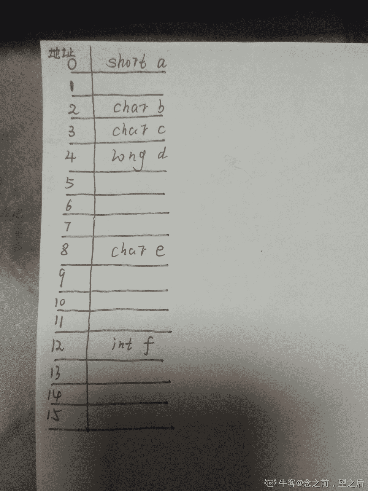

# 快手 2019 年秋季校园招聘笔试试卷—工程 B 试卷

## 1

若线性表最常用的操作是存取第 i 个元素及其前驱和后继元素的值，为节省时间应采用 ____ 的存储方式

正确答案: D   你的答案: 空 (错误)

```cpp
单链表
```

```cpp
双向链表
```

```cpp
单循环链表
```

```cpp
顺序表
```

本题知识点

Java 工程师 C++工程师 安卓工程师 iOS 工程师 运维工程师 前端工程师 算法工程师 PHP 工程师 测试工程师 快手 C++工程师 Java 工程师 快手 2019

讨论

[是瑶瑶公主呀](https://www.nowcoder.com/profile/592649258)

顺序表查找更快啊 像数组可以直接找到 arr[i-1] arr[i]

发表于 2020-04-10 21:21:56

* * *

[江上晚来枫](https://www.nowcoder.com/profile/457290906)

线性表中最常用的操作是取第 i 个元素，所以，应选择随机存取结构即顺序表，同时在顺序表中查找第 i 个元素的后继也很方便。单链表和单循环链表既不能实现随机存取，查找第 i 个元素的后继也不方便，双链表虽然能快速查找第 i 个元素的后继，但不能实现随机存取。

发表于 2019-03-29 11:17:47

* * *

[向阳 ustb](https://www.nowcoder.com/profile/5616877)

第 i 个就需要线性，而不是链表？

发表于 2019-03-17 07:58:31

* * *

## 2

若要尽可能地完成对实数数组的排序，且要求排序是稳定的，则应选

正确答案: C   你的答案: 空 (错误)

```cpp
快速排序
```

```cpp
堆排序
```

```cpp
归并排序
```

```cpp
基数排序
```

本题知识点

Java 工程师 C++工程师 安卓工程师 iOS 工程师 运维工程师 前端工程师 算法工程师 PHP 工程师 测试工程师 快手 2019

讨论

[娜娜哥哥啊](https://www.nowcoder.com/profile/2142588)

AD 为不稳定排序，不可选
D 的基数排序多用于整数排序，不适合实数选择 C

发表于 2018-11-18 21:26:55

* * *

[大厂 offer 砸过来](https://www.nowcoder.com/profile/462805067)

AB 为不稳定排序，不可选 D 的基数排序多用于整数排序，不适合实数选择 C 

发表于 2019-03-30 14:21:28

* * *

## 3

以下关于非对称加密的说法错误的是

正确答案: C   你的答案: 空 (错误)

```cpp
加密速度慢
```

```cpp
安全性高
```

```cpp
双方需要同步密钥
```

```cpp
可以进行数字签名
```

本题知识点

Java 工程师 C++工程师 安卓工程师 iOS 工程师 运维工程师 前端工程师 算法工程师 PHP 工程师 测试工程师 快手 2019

讨论

[Kumori](https://www.nowcoder.com/profile/6270434)

非对称加密即加密解密不是同一把密钥，目的就是提高安全性，自然速度可能会降低。数字签名是非对称加密的典型应用。

发表于 2018-12-12 10:34:57

* * *

## 4

```cpp
进程和线程的区别
```

正确答案: A B C   你的答案: 空 (错误)

```cpp
进程是资源的分配和调度的一个独立单元，而线程是 CPU 调度的基本单元
```

```cpp
同一个进程中可以包括多个线程，并且线程共享整个进程的资源（寄存器、堆栈、上下文），一个进程至少包括一个线程。
```

```cpp
线程是轻量级的进程，它的创建和销毁所需要的时间比进程小很多，所有操作系统中的执行功能都是创建线程去完成的
```

```cpp
线程可以独立存在，进程不可以独立存在
```

本题知识点

Java 工程师 C++工程师 安卓工程师 iOS 工程师 运维工程师 前端工程师 算法工程师 PHP 工程师 测试工程师 快手 2019

讨论

[牛客 466234203 号](https://www.nowcoder.com/profile/466234203)

线程栈能共享吗？

发表于 2019-12-04 14:06:12

* * *

[陌陌内推官](https://www.nowcoder.com/profile/946487877)

Linux 有线程这个概念吗？

发表于 2019-09-25 15:40:49

* * *

[无心 ahah](https://www.nowcoder.com/profile/2666293)

线程上下文信息不是独有的吗

发表于 2019-04-12 17:29:48

* * *

## 5

```cpp
平衡二叉树的特点
```

正确答案: A B C   你的答案: 空 (错误)

```cpp
它是一棵空树或它的左右两个子树的高度差的绝对值不超过 1
```

```cpp
左右两个子树都是一棵平衡二叉树
```

```cpp
平衡二叉树必定是二叉搜索树
```

```cpp
平衡二叉树的高度和节点数无关
```

本题知识点

Java 工程师 C++工程师 安卓工程师 iOS 工程师 运维工程师 前端工程师 算法工程师 PHP 工程师 测试工程师 快手 2019

讨论

[ModestYjx](https://www.nowcoder.com/profile/4902505)

平衡二叉树：它是一颗空树或左右子树的高度差的绝对值不超过 1，且其子树也为平衡二叉树。

发表于 2020-09-03 10:05:17

* * *

[神韵 499](https://www.nowcoder.com/profile/663125690)

参考链接：[`blog.csdn.net/wyqwilliam/article/details/82935922`](https://blog.csdn.net/wyqwilliam/article/details/82935922)C 是对的

发表于 2020-02-16 21:59:41

* * *

[牛客 466234203 号](https://www.nowcoder.com/profile/466234203)

平衡二叉树就是搜索树了？……

发表于 2019-12-04 14:07:49

* * *

## 6

对一组数 [75, 52, 34, 23, 28] 进行排序。排序过程中，部分排列变化过程如下：
75, 52, 34, 23, 28
23, 52, 34, 75, 28
23, 28, 34, 75, 52
23, 28, 34, 52, 75
则采用的排序方法是

正确答案: A   你的答案: 空 (错误)

```cpp
选择排序
```

```cpp
冒泡排序
```

```cpp
快速排序
```

```cpp
插入排序
```

本题知识点

Java 工程师 C++工程师 安卓工程师 iOS 工程师 运维工程师 前端工程师 算法工程师 PHP 工程师 测试工程师 快手 2019

讨论

[向阳 ustb](https://www.nowcoder.com/profile/5616877)

i 从 0 到 length，j 从 i+1 到 length
与后面的数进行比较，前大于后则进行交换
[52, 75, 34, 23, 28]
[34, 75, 52, 23, 28]
[23, 75, 52, 34, 28]
[23, 75, 52, 34, 28]
[23, 52, 75, 34, 28]
（没有完全对上）
[23, 34, 75, 52, 28]
[23, 28, 75, 52, 34]
[23, 28, 52, 75, 34]
[23, 28, 34, 75, 52]
[23, 28, 34, 52, 75]

发表于 2019-03-17 08:29:53

* * *

[gdut17](https://www.nowcoder.com/profile/279358190)

选择排序每次把后面的最小的和当前的交换

发表于 2020-07-30 21:54:24

* * *

## 7

以下属于预防死锁的方法是:()

正确答案: A B D   你的答案: 空 (错误)

```cpp
采用资源有序分配法
```

```cpp
采用资源静态分配策略（进程资源静态分配方式是指一个进程在建立时就分配了它需要的全部资源）
```

```cpp
执行绪获得到的互斥资源不可被强行剥夺
```

```cpp
允许进程剥夺使用其他进程占有的资源
```

本题知识点

Java 工程师 C++工程师 安卓工程师 iOS 工程师 运维工程师 前端工程师 算法工程师 PHP 工程师 测试工程师 快手 行业常识 行业常识 游戏常识 2019

讨论

[一期一会 740](https://www.nowcoder.com/profile/823910029)

游戏常识里能刷到这种题就离谱😓

发表于 2021-08-05 16:24:20

* * *

[向阳 ustb](https://www.nowcoder.com/profile/5616877)

死锁防止：
破除互斥等待：一般无法破除
破除 hold and wait：一次性获取所有资源
破除循环等待：按顺序获取资源
破除无法剥夺的等待：加入超时
（死锁：同时满足这 4 个条件）

发表于 2019-03-17 08:35:54

* * *

[牛客 587598971 号](https://www.nowcoder.com/profile/587598971)

期末考试题😅

发表于 2021-08-05 19:48:36

* * *

## 8

下列哪种存储设备不需要编址？

正确答案: D   你的答案: 空 (错误)

```cpp
通用寄存器
```

```cpp
主存储器
```

```cpp
输入输出设备
```

```cpp
堆栈
```

本题知识点

Java 工程师 C++工程师 安卓工程师 iOS 工程师 运维工程师 前端工程师 算法工程师 PHP 工程师 测试工程师 快手 2019

讨论

[向阳 ustb](https://www.nowcoder.com/profile/5616877)

堆栈是一种存储部件，即数据的写入跟读出不需要提供地址，而是根据写入的顺序决定读出的顺序。

发表于 2019-03-17 08:46:22

* * *

## 9

在计算机系统中，表示系统运行状态的部件是？

正确答案: D   你的答案: 空 (错误)

```cpp
程序计数器
```

```cpp
累加计数器
```

```cpp
中断计数器
```

```cpp
程序状态字
```

本题知识点

Java 工程师 C++工程师 安卓工程师 iOS 工程师 运维工程师 前端工程师 算法工程师 PHP 工程师 测试工程师 快手 2019

讨论

[王冰山](https://www.nowcoder.com/profile/120063493)

程序状态字 PSW(Program Status Word)，是指在电脑中，一段包含被[操作系统](https://baike.so.com/doc/5354536-5590000.html)和潜在[硬件](https://baike.so.com/doc/2368908-2504815.html)使用的程序状态信息的[内存](https://baike.so.com/doc/176561-186541.html)或[硬件](https://baike.so.com/doc/2368908-2504815.html)区域。一般用一个专门的寄存器来指示处理器状态。在计算机系统中，表明系统运行状态的部件是程序状态字程序状态字 PSW(Program Status Word)包括的状态位有进位标志位(CF)、结果为零标志位(ZF)、符号标志位(SF)、溢出标志位(OF)、陷阱标志位(TF)、中断使能(中断屏蔽)标志位(IF)、虚拟中断标志位(VIF)、虚拟中断待决标志位(VIP)、I0 特权级别(IOPL)。

发表于 2019-03-30 16:48:29

* * *

## 10

下列那两个数据结构，有比较高的查找和删除性能（    ）？

正确答案: B D   你的答案: 空 (错误)

```cpp
有序数组
```

```cpp
AVL 树
```

```cpp
有序链表
```

```cpp
Hash 表
```

本题知识点

Java 工程师 C++工程师 安卓工程师 iOS 工程师 运维工程师 前端工程师 算法工程师 PHP 工程师 测试工程师 快手 2019

讨论

[王冰山](https://www.nowcoder.com/profile/120063493)

A 错的原因是有序数组的删除性能不好；C 错的原因是有序链表的查找性能不能。

发表于 2019-03-30 16:45:55

* * *

[向阳 ustb](https://www.nowcoder.com/profile/5616877)

有序链表：终归是链表，不能实现快速查询 hash 表：插入删除接近常量，大 o 表示法最快的方式哈希表查询也快,但是底层存储结构是数组，一旦创建无法改变大小哈希表无法用来有序遍历

发表于 2019-03-17 08:58:16

* * *

## 11

链表不具有的特点是：

正确答案: B   你的答案: 空 (错误)

```cpp
不必事先估计存储空间
```

```cpp
可随机访问任一元素
```

```cpp
插入删除不需要移动元素
```

```cpp
所需空间与线性表长度成正比
```

本题知识点

Java 工程师 C++工程师 安卓工程师 iOS 工程师 运维工程师 前端工程师 算法工程师 PHP 工程师 测试工程师 快手 C++工程师 Java 工程师 快手 2019

讨论

[王冰山](https://www.nowcoder.com/profile/120063493)

B 选项是数组所具有的特点，而不是链表所具有的特点

发表于 2019-03-30 16:49:42

* * *

[向阳 ustb](https://www.nowcoder.com/profile/5616877)

需要指针遍历

发表于 2019-03-17 08:59:18

* * *

## 12

```cpp
struct temp{
    short a;
    char b;
    char c;
    long d;
    char e;
    int f;
};
```

在 32 位机器上 sizeof 的大小是（）

正确答案: A   你的答案: 空 (错误)

```cpp
16
```

```cpp
24
```

```cpp
13
```

```cpp
15
```

本题知识点

C++工程师 快手 2019 C 语言

讨论

[闪闪发光 Ya](https://www.nowcoder.com/profile/928499444)

**解析：**|1Byte|1Byte|1Byte|1Byte||     short      | char | char ||                long                || char | 填充|  填充|  填充||                 int                 |共计 4 * 4 = 16 Byte，选 A**原因：****1. **在 32 位机中，char     1 字节 short    2 字节 int        4 字节 long     4 字节**2\.** 数据在计算机中按“边界对齐”方式存储，支持按字寻址、按半字寻址、按字寻址，半字地址必为 2 的整数倍，字地址必为 4 的整数倍，所以半字长和一个字长的数据在存储时，就算前面有“空位”，为了保持地址的“一致性”，机器会对空位进行填充。**3\.** 比如：|1Byte|1Byte|1Byte|1Byte|| char | char | char | 填充 ||      short     |     short      ||      short     |     填充       ||                  int                 ||                 long               |

编辑于 2021-02-09 22:03:10

* * *

[念之前，望之后](https://www.nowcoder.com/profile/837872598)

**写在最前面的话：**欢迎各位牛友一起交流，有误之处可指出。**本题考点：内存对齐，struct 结构体对齐。****疑问：**如何计算 struct 占用的内存大小？**规则：**

1.  **32 位机的编译器在默认情况下按照 4 字节对齐,即相当于#pragma pack(4)的效果；**
2.  **对齐参数由成员类型的字节大小和 pack 参数(本题中 pack 参数为 4)中较小者所决定；**
3.  **结构体中第一个成员起始于 0 偏移处，另外每个成员的偏移地址必须能被对齐参数整除；**
4.  **结构体成员的大小取其内部长度最大的数据成员作为其大小（适用于结构体嵌套的情形）；**
5.  **结构体总长度必须为所有对齐参数的整数倍。**

**分析：**

*   **测试结果(带注释)**
*   **** 
*   **内存模型**
*   **** 

发表于 2021-02-09 22:45:58

* * *

[向阳 ustb](https://www.nowcoder.com/profile/5616877)

C 语言的数据类型在 32 位的系统上 short 占据的内存大小是 2 个 byte；int 占据的内存大小是 4 个 byte；long 占据的内存大小是 4 个 byte；float 占据的内存大小是 4 个 byte；double 占据的内存大小是 8 个 byte；char 占据的内存大小是 1 个 byte。

发表于 2019-03-17 09:07:51

* * *

## 13

 具有 2018 个节点的二叉树的最小深度为（）(第一层深度为 1） 

正确答案: C   你的答案: 空 (错误)

```cpp
9
```

```cpp
10
```

```cpp
11
```

```cpp
12
```

本题知识点

Java 工程师 C++工程师 安卓工程师 iOS 工程师 运维工程师 前端工程师 算法工程师 PHP 工程师 测试工程师 快手 2019

讨论

[王冰山](https://www.nowcoder.com/profile/120063493)

与构建其他二叉树相比，构建满二叉树所需的节点数最多，因此，题目转变成求具有 2018 个节点的满二叉树的深度。由于满二叉树第 n 层节点数大于 2^(n-1)，小于等于 2^n-1，且 2¹⁰<2018<2¹¹-1，故答案为 11 层

发表于 2019-03-30 17:00:37

* * *

[向阳 ustb](https://www.nowcoder.com/profile/5616877)

最小深度，满二叉树每一层节点数：1, 2, 4, 8…1 + 2 + 4 + 8 + … = 2⁰ + 2¹ + 2² + … + 2^n-1 = 2^n - 12018 个节点，对应的 n=11（n=10 装不下），共 12 层（深度从 1 开始的）？

发表于 2019-03-17 09:28:20

* * *

## 14

平面上有五个点 A(5, 3), B(3, 5), C(2, 1), D(3, 3), E(5, 1)。以这五点作为完全图 G 的顶点， 每两点之间的直线距离是图 G 中对应边的权值。以下哪些边是图 G 的最小生成树中的边：

正确答案: A B C   你的答案: 空 (错误)

```cpp
AD
```

```cpp
BD
```

```cpp
CD
```

```cpp
DE
```

本题知识点

Java 工程师 C++工程师 安卓工程师 iOS 工程师 运维工程师 前端工程师 算法工程师 PHP 工程师 测试工程师 快手 2019

讨论

[大厂 offer 砸过来](https://www.nowcoder.com/profile/462805067)

Kruskal 算法：归并边，适于稀疏网 Prim 算法: 归并顶点，与边数无关，适于稠密网

发表于 2019-03-30 17:13:12

* * *

[向阳 ustb](https://www.nowcoder.com/profile/5616877)

Prim 算法构建最小生成树的过程是：先构建一棵只包含根结点 V1 的树 A，然后每次在连接树 A 结点和图 G 中树 A 以外的结点的所有边中，选取一条权重最小的边加入树 A，直至树 A 覆盖图 G 中的所有结点。
（还有边 AE，画图即可）

发表于 2019-03-17 09:35:06

* * *

[Kumori](https://www.nowcoder.com/profile/6270434)

还有 ae

发表于 2018-12-12 11:08:39

* * *

## 15

使用二分查找时，对线性结构的要求是？

正确答案: C   你的答案: 空 (错误)

```cpp
连续存储
```

```cpp
链式存储
```

```cpp
连续存储且有序
```

```cpp
链式存储且有序
```

本题知识点

Java 工程师 C++工程师 安卓工程师 iOS 工程师 运维工程师 前端工程师 算法工程师 PHP 工程师 测试工程师 快手 2019

讨论

[青简](https://www.nowcoder.com/profile/708069809)

二分查找要连续的内存空间 有序

发表于 2019-09-15 16:14:24

* * *

[向阳 ustb](https://www.nowcoder.com/profile/5616877)

方便遍历：连续存储；二分：有序

发表于 2019-03-17 09:37:15

* * *

## 16

在一个包含 n 个元素的哈希表中进行查找，查找的平均复杂度为？

正确答案: D   你的答案: 空 (错误)

```cpp
O(n2)

```

```cpp
O(log<sub>2</sub>n)
```

```cpp
O(n)
```

```cpp
与 n 无关
```

本题知识点

Java 工程师 C++工程师 安卓工程师 iOS 工程师 运维工程师 前端工程师 算法工程师 PHP 工程师 测试工程师 快手 2019

讨论

[王冰山](https://www.nowcoder.com/profile/120063493)

哈希表是通过计算元素的哈希值来定位元素位置的，只需计算一次即可，其时间复杂度为 O(1)，因此，与元素数量 n 无关。

发表于 2019-03-30 17:07:44

* * *

[向阳 ustb](https://www.nowcoder.com/profile/5616877)

哈希表查询也快,但是底层存储结构是数组：O(1)

发表于 2019-03-17 09:39:21

* * *

## 17

程序设计中接口的作用是什么？

正确答案: B   你的答案: 空 (错误)

```cpp
类型继承
```

```cpp
定义行为规范
```

```cpp
创建对象
```

```cpp
拆分代码
```

本题知识点

Java 工程师 C++工程师 安卓工程师 iOS 工程师 运维工程师 前端工程师 算法工程师 PHP 工程师 测试工程师 快手 2019

讨论

[向阳 ustb](https://www.nowcoder.com/profile/5616877)

只有方法声明，没有实现，模板

发表于 2019-03-17 09:40:41

* * *

## 18

666!末尾有()个 0?

正确答案: B   你的答案: 空 (错误)

```cpp
1024
```

```cpp
165
```

```cpp
98
```

```cpp
345
```

本题知识点

Java 工程师 C++工程师 安卓工程师 iOS 工程师 运维工程师 前端工程师 算法工程师 PHP 工程师 测试工程师 快手 2019

讨论

[于指缝间慢慢流逝](https://www.nowcoder.com/profile/9091941)

对 N 进行质因数分解 N=2^x * 3^y * 5^z...，由于 10 = 2*5，所以末尾 0 的个数只和 x 与 z 有关，每一对 2 和 5 相乘可以得到一个 10，于是末尾 0 的个数=min(x,z)。在实际中 x 是远远大于 z 的，所以我们只要求出 z 的值即可。
  根据公式
  z = N/5 + N/5² + N/5³+...+N/5^k
  这表明，5 的倍数贡献了一个 5,5² 的倍数又贡献了一个 5...。 

  比如：25 其实是贡献了 2 个 5，但是在 N/5 中已经贡献了一个，所以在 N/5² 中再贡献一个；同样，125 在 N/5 中贡献一个，在 N/5² 中贡献一个，在 N/5³ 中再贡献一个，一共是 3 个。回到题目 666！① 5 的倍数：666/5 = 133 个② 5²=25 的倍数：666/25 = 26 个③ 5³=125 的倍数： 666/125 = 5 个④ 5⁴=625 的倍数： 666/625 = 1 个所以 133+26+5+1 = 165 个

发表于 2019-04-13 11:44:16

* * *

[雁来月暮秋 xx](https://www.nowcoder.com/profile/370183838)

25 阶乘中贡献了 6（25/5+5/5）个 5，因为有 5 的倍数的倍数（25=5*5，贡献 2 个 5），在先求一批 5 的个数后，再求第二批 5 的个数。同理 125 中 5 的个数等于 125/5 + 25/5 +5/5=31；同理 666 中 5 的个数等于 666/12+133/5+26/5+5/5=165；来自:[`blog.csdn.net/qiting00/article/details/81210826  可以解释为什么 666！末尾有 165 个 0`](https://blog.csdn.net/qiting00/article/details/81210826)

编辑于 2019-04-05 12:02:38

* * *

[向阳 ustb](https://www.nowcoder.com/profile/5616877)

0~9：1 个 500~99：20 个 5000~599：120 个 5 大概估计：B 选项（165 个）

发表于 2019-03-28 16:57:20

* * *

## 19

现在快手有个老铁 A 有 200 万粉丝，假设粉丝数每月上涨 10%，另一个刚注册的老铁 B 每月涨粉 40 万。假设老铁 B 想超过老铁 A 的粉丝数，大概需要多少个月？()

正确答案: D   你的答案: 空 (错误)

```cpp
12
```

```cpp
13
```

```cpp
22
```

```cpp
永远超不过
```

本题知识点

Java 工程师 C++工程师 安卓工程师 iOS 工程师 运维工程师 前端工程师 算法工程师 PHP 工程师 测试工程师 快手 2019

讨论

[Kumori](https://www.nowcoder.com/profile/6270434)

计算一下选项 A 即可

发表于 2018-12-12 11:17:18

* * *

[于指缝间慢慢流逝](https://www.nowcoder.com/profile/9091941)

依照题意,设 x 个月， 200(1+10%)^x = 40x     **=>   ** 1.1^(x )= 0.2x    好的不会解了 。。。换一个思路，只要 A 每个月的粉丝上涨超过 40 万，B 就永远超不过 A 了。即第 x 个月减去前一个月的粉丝大于等于 40 万，列式  200(1+10%)^(x  )-  200(1+10%)^(x-1  )= 40    **=>  **  1.1^(x )  -  1.1^(x )^(-1  )= 0.2 借用计算器 1.1^(7  )= 1.9487171，1.1^(8   )= 2.14358881，1.1⁹ = 2.357947691,   1.1⁸ -  1.1⁷ = 0.19  , 1.1⁹-  1.1⁷ = 0.21 即第 8 月的时候 A 的涨粉接近 40 万，第 9 月的时候 A 的涨粉超过 40 万，而第 9 月的时候 B 的涨粉为 40*9 = 360 万

发表于 2019-04-13 12:18:48

* * *

## 20

节点按中序遍历为 xyz 的二叉树可能有 _____ 种。

正确答案: D   你的答案: 空 (错误)

```cpp
2
```

```cpp
3
```

```cpp
4
```

```cpp
5
```

本题知识点

Java 工程师 C++工程师 安卓工程师 iOS 工程师 运维工程师 前端工程师 算法工程师 PHP 工程师 测试工程师 快手 C++工程师 Java 工程师 快手 2019

讨论

[王冰山](https://www.nowcoder.com/profile/120063493)


发表于 2019-03-30 17:25:28

* * *

[一只小星星](https://www.nowcoder.com/profile/4705227)

这 5 种

发表于 2019-08-25 13:17:24

* * *

[高义升](https://www.nowcoder.com/profile/4559702)

三个节点总共可以组成五种二叉树，我们只要调整 xyz 的位置即可满足中序遍历结果为 xyz.

发表于 2019-03-29 21:46:16

* * *

## 21

小明在越南旅游，参加了当地的娱乐活动。小明运气很好，拿到了大奖， 到了最后的拿奖金环节。小明发现桌子上放着一列红包，每个红包上写着奖金数额。现在主持人给要求小明在这一列红包之间“切”2 刀，将这一列红包“切”成 3 组，并且第一组的奖金之和等于最后一组奖金和（允许任意一组的红包集合是空）。最终第一组红包的奖金之和就是小明能拿到的总奖金。小明想知道最多能拿到的奖金是多少，你能帮他算算吗。举例解释：桌子上放了红包  1, 2, 3, 4, 7, 10。小明在“4,7”之间、“7,10” 之间各切一刀，将红包分成 3 组 [1, 2, 3, 4]   [7]   [10]，其中第一组奖金之和=第三组奖金之和=10，所以小明可以拿到 10 越南盾。数据范围：红包数量满足  ，红包金额满足 

本题知识点

Java 工程师 C++工程师 安卓工程师 iOS 工程师 运维工程师 前端工程师 算法工程师 PHP 工程师 测试工程师 快手 数组 贪心 2019

讨论

[lentolove](https://www.nowcoder.com/profile/572586026)


```cpp
import java.io.BufferedReader;
import java.io.IOException;
import java.io.InputStreamReader;

public class Main {

    /**
     * 双指针思想:
     * 左右指针遍历数组找左边数组的和和右边数组的和比较来移动指针
     * 1.相等则保存当前值，左指针右移，右指针左移动
     * 2.左边和 > 右边和  右指针左移
     * 3.左边和 < 右边和  左指针右移
     */
    public static void main(String[] args) throws IOException {
        BufferedReader bf = new BufferedReader(new InputStreamReader(System.in));
        int n = Integer.parseInt(bf.readLine());
        String[] line2 = bf.readLine().split(" ");
        int[] nums = new int[n];
        for (int i = 0; i < n; i++) {
            nums[i] = Integer.parseInt(line2[i]);
        }
        int left = 0, right = n - 1;
        long left_sum = nums[left], right_sum = nums[right], max_sum = 0;
        while (left < right) {
            if (left_sum == right_sum){
                max_sum = left_sum;
                left_sum += nums[++left];
                right_sum += nums[--right];
            }else if (left_sum > right_sum){
                right_sum += nums[--right];
            }else {
                left_sum += nums[++left];
            }
        }
        System.out.println(max_sum);
    }
}

```

发表于 2019-08-03 13:34:16

* * *

[我要扛 offer 回家](https://www.nowcoder.com/profile/450814319)

```cpp
import sys
n=int(sys.stdin.readline().strip())
arr=list(map(int,sys.stdin.readline().split()))
left,right=0,n-1
lsum,rsum=arr[0],arr[-1]
res=0
while left<right:
    if lsum<rsum:
        left+=1
        lsum+=arr[left]
    if lsum>rsum:
        right-=1
        rsum+=arr[right]
    if lsum==rsum:
        res=lsum
        left+=1
        right-=1
        lsum+=arr[left]
        rsum+=arr[right]
print(res)
```

发表于 2019-08-19 16:00:57

* * *

[土豪 gold](https://www.nowcoder.com/profile/785257874)

```cpp
#include <iostream>
#include <vector>
using namespace std;
int main()
{
    int number;
    cin>>number;
    vector<int> vect;
    while(number--)
    {
        int temp=0;
        cin>>temp;
        vect.push_back(temp);
    }
        long long sum_right=0;
        long long sum_left=0;
        int left=0;
        int right=vect.size()-1;
        long long result;
        while(left<=right)
        {
            if(sum_right==sum_left&&left!=right)
            {
                sum_left+=vect[left];
                sum_right+=vect[right];
                left++;
                right--;
            }
            else if(sum_left>sum_right)
            {
                sum_right+=vect[right];
                right--;
            }
            else
            {
                sum_left+=vect[left];
                left++;
            }
            if(sum_right==sum_left)
            {
                result=sum_right;
            }
        }
    cout<<result<<endl;
    return 0;
}

```

发表于 2019-07-03 08:33:27

* * *

## 22

为了便于实现多级中断，保存现场信息最有效的方法是采用

正确答案: B   你的答案: 空 (错误)

```cpp
通用寄存器
```

```cpp
堆栈
```

```cpp
存储器
```

```cpp
外存
```

本题知识点

Java 工程师 C++工程师 安卓工程师 iOS 工程师 运维工程师 前端工程师 算法工程师 PHP 工程师 测试工程师 快手 C++工程师 Java 工程师 快手 2019

讨论

[Kumori](https://www.nowcoder.com/profile/6270434)

在多级中断时，每一层的中断都需要保护中断时的现场信息，例如一个三级中断，依次需要保护第一、第二、第三级的现场信息，当产生第三级的中断处理程序结束后，首先恢复第三级的现场进行处理，结束后返回第二级。

发表于 2018-12-12 11:20:28

* * *

## 23

以下属于降低 cache 失效率的方法是

正确答案: B   你的答案: 空 (错误)

```cpp
子块放置技术
```

```cpp
编译器优化
```

```cpp
采用 2 级 cache
```

```cpp
虚拟 cache
```

本题知识点

Java 工程师 C++工程师 安卓工程师 iOS 工程师 运维工程师 前端工程师 算法工程师 PHP 工程师 测试工程师 快手 2019

讨论

[是瑶瑶公主呀](https://www.nowcoder.com/profile/592649258)

增加 Cache 块大小
提高相联度
Victim Cache
伪相联 Cache
硬件预取技术
由编译器控制的预取和编译器优化。

发表于 2020-04-10 21:30:36

* * *

## 24

利用时间重叠概念实现并行处理的是

正确答案: A   你的答案: 空 (错误)

```cpp
流水处理机
```

```cpp
多处理及
```

```cpp
并行（阵列）处理机
```

```cpp
相联处理机
```

本题知识点

Java 工程师 C++工程师 安卓工程师 iOS 工程师 运维工程师 前端工程师 算法工程师 PHP 工程师 测试工程师 快手 C++工程师 Java 工程师 快手 2019

讨论

[大厂 offer 砸过来](https://www.nowcoder.com/profile/462805067)

**时间重叠**：让多个处理过程在时间上错开，轮流重叠的使用同一套硬件设备的各个部分，加快硬件使用的周转来赢得速度。——**流水线处理机****资源重叠**：通过重复设置硬件资源来提高性能或可靠性。——**并行处理机、相联处理机****资源共享**：用软件的方法让多个用户公用同一套资源，通过提高系统资源的利用率来提高系统的效率和性能。——**多处理机**

发表于 2019-03-30 17:29:29

* * *

## 25

对两个长度分别为 m，n 的有序数组进行合并，使新数组仍然有序。选择最合适的排序算法，最差情况需要比较多少次？

正确答案: D   你的答案: 空 (错误)

```cpp
max(m,n)
```

```cpp
m * n
```

```cpp
m + n
```

```cpp
m + n - 1
```

本题知识点

Java 工程师 C++工程师 安卓工程师 iOS 工程师 运维工程师 前端工程师 算法工程师 PHP 工程师 测试工程师 快手 2019

讨论

[Bennan☀✨](https://www.nowcoder.com/profile/6190648)

应该是数据呈现交叉的[1,3,5,7],[2,4,6,8]

发表于 2019-04-12 16:40:14

* * *

[1313299](https://www.nowcoder.com/profile/666401265)

[1,1,1,1,1,3]，[0,0,0,0,0,2]

发表于 2019-04-13 10:55:24

* * *

[huichen90](https://www.nowcoder.com/profile/69230229)

取极限,从小到大排列
[9,10],[1,2,3,4,5]

发表于 2019-03-30 16:01:44

* * *

## 26

已知二叉树前序遍历是 GDAFEMHZ，中序遍历是 ADEFGHMZ，请问后序遍历是？

正确答案: A   你的答案: 空 (错误)

```cpp
AEFDHZMG
```

```cpp
GEFDHZMA
```

```cpp
AEFDMZHG
```

```cpp
GEFDZHMA
```

本题知识点

Java 工程师 C++工程师 安卓工程师 iOS 工程师 运维工程师 前端工程师 算法工程师 PHP 工程师 测试工程师 快手 2019

讨论

[F1A](https://www.nowcoder.com/profile/198082922)

总体的原则是先定根，再依左右子树向下展开。前序用[前]表示，后序用[中]表示 1）由[前]，根为 G，再看[中]，G 分隔左右子树，左子树为 ADEF，右子树为 HMZ。2）再看[前]，G 后 DAFE 部分为左子树，因此 D 为左子树的根。因此再看[中]，D 将左子树分割，A 为 D 的左节点，FE 为右侧节点。3）由[前]的根左右规则，可知 FE 中的 F 为根；再看[中]，由左根右规则，F 为根，E 在左，因此 E 为 F 节点的左子叶节点。4）同理，右侧子树也是按照 2 到 3 的规则来进行。最后画出二叉数，求出后序即可。

发表于 2019-03-05 11:15:53

* * *

## 27

视频推荐场景中过于聚焦的视频推荐往往会损害用户体验，所以，系统会通过一定程度的随机性给用户带来发现的惊喜感。假设在某推荐场景中，经计算 A 和 B 两个视频与当前访问用户的匹配度分别为 0.8 分和 0.2 分，系统将随机为 A 生成一个均匀分布于 0 到 0.8 的最终得分，为 B 生成一个均匀分布于 0 到 0.2 的最终得分，那么最终 B 的分数大于 A 的分数的概率为（ ）

正确答案: B   你的答案: 空 (错误)

```cpp
1/2
```

```cpp
1/8
```

```cpp
1/16
```

```cpp
1/4
```

本题知识点

Java 工程师 C++工程师 安卓工程师 iOS 工程师 运维工程师 前端工程师 算法工程师 PHP 工程师 测试工程师 快手 2019

讨论

[王冰山](https://www.nowcoder.com/profile/120063493)

A 均匀分布于 0 到 0.2 的概率为（0.2-0.0）/（0.8-0.0）=1/4，之后 A 大于 B 的概率为 1/2，B 大于 A 的概率也为 1/2，因此，最后答案为（1/4）*（1/2）=1/8，选 B

发表于 2019-03-30 17:30:00

* * *

## 28

给出满二叉树的前序遍历结果和中序遍历结果，编写算法将其转化为求和树

什么是求和树：二叉树的求和树， 是一颗同样结构的二叉树，其树中的每个节点将包含原始树中的左子树和右子树的和。

二叉树：

求和树：


二叉树给出前序和中序输入，求和树要求中序输出；所有处理数据不会大于 int；数据范围：二叉树的节点数满足  ,节点上的值满足 

本题知识点

C++工程师 Java 工程师 快手 2019 模拟 递归

讨论

[小蝌蚪 666](https://www.nowcoder.com/profile/5416579)

```cpp
#include <iostream>
#include <sstream>
#include <vector>
#include <string>
#include <iterator>
#include <algorithm>
#include <numeric>
using namespace std;

void sumtree(vector<int> &inorder, int left, int right){
    int mid = (left + right)/2;
    if(mid == left){
        inorder[mid] = 0;
        return;
    }
    inorder[mid] = accumulate(inorder.begin()+left, inorder.begin()+right, -inorder[mid]);
    sumtree(inorder, left, mid);
    sumtree(inorder, mid+1, right);
}

int main(void){
    string line;
    getline(cin, line);
    istringstream pre_stream(line);
    vector<int> preorder((istream_iterator<int>(pre_stream)), istream_iterator<int>());
    getline(cin, line);
    istringstream in_stream(line);
    vector<int> inorder((istream_iterator<int>(in_stream)), istream_iterator<int>());
    sumtree(inorder, 0, inorder.size());
    copy(inorder.begin(), inorder.end(),ostream_iterator<int>(cout, " "));
    cout<<endl;
    return 0;
}
```

因为是满二叉树，其实结果跟前序遍历数组无关，只和中序遍历数组有关，并且中序数组一定是奇数个，结果索引为偶数的一定为 0，索引为奇数的值是中序遍历数组其他值之和(不包括自己)，使用二分法找到根节点，然后计算子树之和，**不用还原二叉树**。

编辑于 2019-08-16 21:20:41

* * *

[ElonB](https://www.nowcoder.com/profile/623894)

```cpp
"""
本题有如下规律：
求和树的根节点 = 除本身外原二叉树所有子节点之和，
本题中根节点为中序遍历数组中正中间项（满二叉树）
递归求得左右子树，直到子树节点个数为 1 返回[0]。
需要考虑根节点在两侧的情况，树节点个数为 0 时，返回空[]
"""
def func(d):
    if len(d) == 1: return [0]
    elif len(d) == 0: return []
    mid = len(d) // 2  # 满二叉树根节点即正中间数值，前序遍历数组本题中用不到，可删除
    return func(d[:mid]) + [sum(d[:]) - d[mid]] + func(d[mid + 1:])

if __name__ == "__main__":
    a = list(map(int, input().strip().split()))
    d = list(map(int, input().strip().split()))
    ans = func(d)
    print(' '.join(map(str, ans)))

```

未考虑满二叉树这一性质，求解如下：

```cpp
"""
本题有如下规律：
求和树的根节点 = 除本身外所有子节点之和，
递归求得左右子树，直到子树节点个数为 1 返回[0]。
需要考虑根节点在两侧的情况，树节点个数为 0 时，返回空[]

"""
import sys

def func(a, d):
    if len(a) == 1:
        return [0]
    elif len(a) == 0:
        return []
    mid = d.index(a[0])
    d[mid] = sum(d[:]) - d[mid]
    return func(a[1:(mid + 1)], d[:mid]) + \
           [sum(d[:]) - d[mid]] + \
           func(a[(mid + 1):], d[mid + 1:])

if __name__ == "__main__":
    # sys.stdin = open('input.txt', 'r')
    a = list(map(int, input().strip().split()))
    d = list(map(int, input().strip().split()))
    ans = func(a, d)
    print(' '.join(map(str, ans)))

```

编辑于 2019-07-04 12:34:29

* * *

[tuweilong](https://www.nowcoder.com/profile/334452011)

```cpp
/*
关键思路：二叉树加一个 sum 属性。
根据先序中序的序列，构建二叉树。
利用后序遍历来更新节点 sum 值。
最后通过中序遍历得到答案序列。
估计有更好的方法。
希望同学们有更巧妙的办法后叫我一下。
*/
import java.util.*;

class STNode {
    int val;
    int sum;
    STNode left = null;
    STNode right = null;

    public STNode(int val) {
        this.val = val;
    }
}

public class Main {
    static int[] preOrder;
    static int[] inOrder;
    static List<Integer> ans;    //存和的中序遍历。

    public static void main(String[] args) {
        Scanner in = new Scanner(System.in);
        String s1 = in.nextLine();
        String s2 = in.nextLine();
        String[] str1 = s1.split(" ");
        String[] str2 = s2.split(" ");
        int len = str1.length;
        preOrder = new int[len];
        inOrder = new int[len];
        for (int i = 0; i < len; i++) {
            preOrder[i] = Integer.parseInt(str1[i]);
        }
        for (int i = 0; i < len; i++) {
            inOrder[i] = Integer.parseInt(str2[i]);
        }
        STNode sroot = creatTree(0, 0, len - 1);
        sumNode(sroot);
        ans = new ArrayList<>();
        inOrderGo(sroot);
        for (int i : ans) {
            System.out.print(i + " ");
        }
        System.out.println();
    }

    //根据先序和中序遍历构建二叉树。
    static STNode creatTree(int root, int beg, int end) {
        if (beg > end) return null;
        STNode node = new STNode(preOrder[root]);
        int loc = 0;
        int cnt = 0;
        for (loc = beg; loc <= end; loc++) {
            cnt++;
            if (preOrder[root] == inOrder[loc])
                break;
        }
        node.left = creatTree(root + 1, beg, loc - 1);
        node.right = creatTree(root + cnt, loc + 1, end);
        return node;
    }

    //更新 sum 值。
    static void sumNode(STNode node) {
        if (node.left == null && node.right == null) {
            node.sum = 0;
        } else if (node.left == null) {
            sumNode(node.right);
            node.sum = node.right.sum + node.right.val;
        } else if (node.right == null) {
            sumNode(node.left);
            node.sum = node.left.sum + node.left.val;
        } else {
            sumNode(node.left);
            sumNode(node.right);
            node.sum = node.left.sum + node.left.val + node.right.sum + node.right.val;
        }
    }

     //中序遍历。
    static void inOrderGo(STNode node) {
        if (node == null) return;
        inOrderGo(node.left);
        ans.add(node.sum);
        inOrderGo(node.right);
    }

}

```

编辑于 2019-06-27 21:12:05

* * *

## 29

IP 数据包的包头长度最小为？

正确答案: B   你的答案: 空 (错误)

```cpp
16Bytes
```

```cpp
20Bytes
```

```cpp
32Bytes
```

```cpp
40Bytes
```

本题知识点

Java 工程师 C++工程师 安卓工程师 iOS 工程师 运维工程师 前端工程师 算法工程师 PHP 工程师 测试工程师 快手 2019

讨论

[Kumori](https://www.nowcoder.com/profile/6270434)

最小 20 字节，最大 60 字节

编辑于 2018-12-12 17:18:32

* * *

[xiaole](https://www.nowcoder.com/profile/46990949)

应该是 21 吧，20 字节固定部分加 1~40 字节的可变部分

发表于 2019-09-17 20:06:22

* * *

## 30

小明有一袋子长方形的积木，如果一个积木 A 的长和宽都不大于另外一个积木 B 的长和宽，则积木 A 可以搭在积木 B 的上面。好奇的小明特别想知道这一袋子积木最多可以搭多少层，你能帮他想想办法吗？定义每一个长方形的长 L 和宽 W ，袋子里面长方形的个数为 n 。假如袋子里共有 5 个积木分别为 (2, 2), (2, 4), (3, 3), (2, 5), (4, 5), 则不难判断这些积木最多可以搭成 4 层, 因为(2, 2) < (2, 4) < (2, 5) < (4, 5)。数据范围：长方形个数满足  ，

本题知识点

Java 工程师 C++工程师 iOS 工程师 安卓工程师 运维工程师 前端工程师 算法工程师 PHP 工程师 测试工程师 快手 排序 *动态规划 2019 游戏研发工程师* *讨论

[ElonB](https://www.nowcoder.com/profile/623894)

```cpp
/*
对长方形的宽 w 排序，本题化简为对长 l 求最长上升子序列。
本题只需求最长上升子序列的 长度，可优化到 O(nlogn)
*/
#include<bits/stdc++.h>
using namespace std;
#define N 1000000

struct rectangle {
    int w = 0, l = 0;
} a[N];
int dp[N];

bool cmp(rectangle x, rectangle y){
    return x.w == y.w ? x.l < y.l : x.w < y.w;
}

int main()
{
//    freopen("input.txt", "r", stdin);
    int n;
    cin >> n;
    for(int i = 0; i < n; i++) {
        cin >> a[i].w >> a[i].l;
    }
    sort(a, a + n, cmp);
    dp[0] = a[0].l;
    int len = 1;
    for(int i = 1; i < n; i++) {
        if(a[i].l >= dp[len-1]) {
            dp[len++] = a[i].l;
        } else {
            *(upper_bound(dp, dp + len, a[i].l)) = a[i].l;
        }
    }
    cout << len << endl;
    return 0;
}

```

编辑于 2019-07-05 12:12:17

* * *

[lentolove](https://www.nowcoder.com/profile/572586026)

```cpp
import java.io.BufferedReader;
import java.io.IOException;
import java.io.InputStreamReader;
import java.util.Arrays;
import java.util.TreeSet;

public class Solution3_ 搭积木 {

    public static void main(String[] args) throws IOException {
        BufferedReader bf = new BufferedReader(new InputStreamReader(System.in));
        int n = Integer.parseInt(bf.readLine());
        //保存积木的宽高的二维数组
        int[][] bricks = new int[n][2];
        String[] strs;
        for (int i = 0; i < n; i++) {
            strs = bf.readLine().split(" ");
            bricks[i][0] = Integer.parseInt(strs[0]);
            bricks[i][1] = Integer.parseInt(strs[1]);
        }
        if (n==1){
            System.out.println(1);
            return;
        }
        //按照宽进行排序,然后求长度的最长上升子序列
        Arrays.sort(bricks, (a, b) -> a[0] - b[0]);
        /**
         * 我们按照宽度从小到大对 bricks 进行了排序
         * dp 数组中存储的数积木的长度，它是一个上升的数组，这样才能保证积木的层叠
         */
        int[] dp = new int[n];
        int count = 0;//层数
        for (int i = 0; i < n; i++) {
            if (count == 0 || bricks[i][1] >= dp[count - 1]) {
                //当当前积木的长度 >= dp 数组中保存的最大积木长度，那我们就将它加入到 dp 数组中,并且层数加一
                dp[count] = bricks[i][1];
                count++;
            }else {
                /**
                 * 这里解释一下：当我们加入的积木 bricks[i][1],它的长度小于 dp 中的最大长度
                 * 我们需要在数组 dp 中找到 <= bricks[i][1] 最接近的值的索引 index，将它替换成现在的长度 bricks[i][1]
                 * 为什么要替换: dp 数组中积木的宽度都是小于 bricks[i]的，积木 bricks[i]的宽度比 dp[index]宽度大，
                 * 而且 bricks[i]的长度 >= dp[index],在堆积木情况下，当然是优先选择宽度和长度更大的积木。
                 */
                int index = lowerBound(dp, 0, count, bricks[i][1]);
                dp[index] = bricks[i][1];
            }
        }
        System.out.println(count);
    }
    /**
     * C++中存在的两个方法，用 java 实现一下
     * ower_bound 算法要求在已经按照非递减顺序排序的数组中找到第一个大于等于给定值 key 的那个数的索引，
     * 其基本实现原理是二分查找
     */
    public static int lowerBound(int[] nums,int l,int r,int target){
        while(l<r){
            int m = (l+r)/2;
            if(nums[m]>=target) r= m;
            else    l = m +1;
        }
        return l;
    }

    /**
     * upper_bound 函数要求在按照非递减顺序排好序的数组中找到第一个大于给定值 key 的那个数索引，
     * 其基本实现原理是二分查找
     */
    public static int upperBound(int []nums ,int l,int r, int target){
        while(l<r){
            int m = (l+r)/2;
            if(nums[m]<=target) l = m+1;
            else    r = m;
        }
        return l;
    }
}

```

发表于 2019-08-03 15:44:14

* * *

[-私想家](https://www.nowcoder.com/profile/7825191)

/*
哪位大佬帮看一下啊？小数据测试都没问题，当积木数量到了 10000 之后，就报错了。找了很久不知道哪里出问题了 Q^Q

*   public class DaJiMu {

    public static void main(String[] args) throws IOException {

    ```cpp
      BufferedReader bufferedReader = new BufferedReader(new InputStreamReader(System.in));
      int num = Integer.parseInt(bufferedReader.readLine());
      int[][] jimu = new int[num][2];
      for (int i = 0; i < num; i++){
          String[] temp = bufferedReader.readLine().split(" ");
          jimu[i][0] = Integer.parseInt(temp[0]);
          jimu[i][1] = Integer.parseInt(temp[1]);
      }
      Arrays.sort(jimu, new Comparator<int[]>() { @Override public int compare(int[] o1, int[] o2) {
              return o1[0] != o2[0]? o1[0] - o2[0] : o1[1] - o2[1];
          }
      });
      if( num == 1){
          System.out.print(1);
          return;
      }
      int max = 0;
      int[] len = new int[num];
      len[0] = 1;
      //求最长递归子序列
      for (int i = 1; i < num; i++){
          int lastADDIndex = binarySearch(jimu, jimu[i][1], 0, i - 1);
          //若非递减，则选择 max(len[i-1]+1, len[差值最小]+1)较大的长度。
          if (jimu[i][1] >= jimu[i-1][1])
              if(lastADDIndex != -1)
                  len[i] = Math.max(len[i-1] + 1, len[lastADDIndex] + 1);
              else
                  len[i] = len[i-1] + 1;
          else{
              if(lastADDIndex != -1){
                  len[i] = len[lastADDIndex] + 1;
              }else
                  len[i] = 1;
          }
          if( max < len[i])
              max = len[i];
      }
      System.out.print(max);
    ```

    }

    public static int binarySearch(int[][] arr, int key, int start, int end){

    ```cpp
      int max = -1;
      int min = 1000000000;
      while(start <= end){
          int mid = start + (end - start) / 2;
          if(arr[mid][1] <= key) {
              if(min > key - arr[mid][1]) {
                  min = key - arr[mid][1];
                  max = mid;
              }
              start = mid + 1;
          }
          else
              end = mid - 1;
      }
      return max;
    ```

    }
    }

编辑于 2019-07-18 14:43:28

* * *

## 31

抛掷两个骰子， 点数之和为偶数(2,4 和 4,2 为一种) 共有多少种组合

正确答案: B   你的答案: 空 (错误)

```cpp
6
```

```cpp
12
```

```cpp
18
```

```cpp
24
```

本题知识点

Java 工程师 C++工程师 安卓工程师 iOS 工程师 运维工程师 前端工程师 算法工程师 PHP 工程师 测试工程师 快手 2019

讨论

[zhongliwen](https://www.nowcoder.com/profile/2605138)

总共有 6*6=36 种投法，但因为 2,4 与 4,2 是同一种，2,2 与 2,2 也是同一种，因此总共只有 36/2=18 种投法；投出的可能组合为 奇偶，偶奇，奇奇，偶偶，其中奇偶和偶奇可归为同一种；和为偶数的投法为奇奇和偶偶；故为偶数的投法有：18 * 2/3 = 12 种

发表于 2019-02-26 13:18:13

* * *

## 32

对序列{ 30,  15,  20, 60, 70, 80, 5, 100, 10, 40}进行一次快速排序, 第一次快排后，排序结果为（左边小右边大）

正确答案: C   你的答案: 空 (错误)

```cpp
{10,20, 15, 5,} 30,{ 80,  70, 100, 60, 40}
```

```cpp
{20,10, 15, 5,} 30,{ 40,  70, 100, 60, 80}
```

```cpp
{10, 15, 20, 5,} 30,{ 80,  70, 100, 60, 40}
```

```cpp
{20,15, 10, 5,} 30,{ 80,  70, 100, 60, 40}
```

本题知识点

Java 工程师 C++工程师 安卓工程师 iOS 工程师 运维工程师 前端工程师 算法工程师 PHP 工程师 测试工程师 快手 2019

讨论

[是瑶瑶公主呀](https://www.nowcoder.com/profile/592649258)

？

```cpp
[5, 15, 20, 10, 30, 80, 70, 100, 60, 40]
[5, 15, 20, 10, 30, 80, 70, 100, 60, 40]
[5, 15, 20, 10, 30, 80, 70, 100, 60, 40]
[5, 10, 15, 20, 30, 80, 70, 100, 60, 40]
[5, 10, 15, 20, 30, 80, 70, 100, 60, 40]
[5, 10, 15, 20, 30, 80, 70, 100, 60, 40]
[5, 10, 15, 20, 30, 60, 70, 40, 80, 100]
[5, 10, 15, 20, 30, 40, 60, 70, 80, 100]
[5, 10, 15, 20, 30, 40, 60, 70, 80, 100]
[5, 10, 15, 20, 30, 40, 60, 70, 80, 100]
```

发表于 2020-04-10 21:42:58

* * *

## 33

并发编程中通常会遇到三个问题：原子性问题，可见性问题，有序性问题， java/C/C++中 volatile 关键字可以保证并发编程中的（）

正确答案: B   你的答案: 空 (错误)

```cpp
原子性， 可见性
```

```cpp
可见性，有序性
```

```cpp
原子性，有序性
```

```cpp
原子性， 可见性，有序性
```

本题知识点

C++工程师 快手 2019 C++ C 语言

讨论

[牛客 777054923 号](https://www.nowcoder.com/profile/777054923)

*   保证了不同线程对这个变量进行操作时的可见性，即一个线程修改了某个变量的值，这新值对其他线程来说是立即可见的。（实现可见性）*   禁止进行指令重排序。（实现有序性）*   volatile 只能保证对单次读/写的原子性。i++ 这种操作不能保证原子性。
作者：羽杰
链接：[`www.jianshu.com/p/ccfe24b63d87`](https://www.jianshu.com/p/ccfe24b63d87)
来源：简书

发表于 2020-03-31 18:24:23

* * *

[牛客 643117445 号](https://www.nowcoder.com/profile/643117445)

[`www.jianshu.com/p/cf57726e77f2`](https://www.jianshu.com/p/cf57726e77f2)

发表于 2021-11-08 18:15:34

* * *

## 34

关于 websocket 协议的描述正确的是

正确答案: A   你的答案: 空 (错误)

```cpp
websocket 是一个独立的基于 TCP 的协议
```

```cpp
websocket 是一个独立的基于 Http 的协议
```

```cpp
websocket 协议中握手部分由服务端发起
```

```cpp
websocker 协议中的握手部分的 Http 请求中的头字段有顺序要求
```

本题知识点

Java 工程师 C++工程师 安卓工程师 iOS 工程师 运维工程师 前端工程师 算法工程师 PHP 工程师 测试工程师 快手 2019

讨论

[雁来月暮秋 xx](https://www.nowcoder.com/profile/370183838)

[`www.cnblogs.com/oshyn/p/3574497.html`](https://www.cnblogs.com/oshyn/p/3574497.html) 这篇博客中有写到  “这个升级的 HTTP 请求头中的字段顺序是可以随便的。”即 webseocket 协议中的握手部分的 Http 请求中的头字段没有顺序要求。[`blog.csdn.net/matchvs/article/details/80534857`](https://blog.csdn.net/matchvs/article/details/80534857)这篇博客中提到 websocket 协议中握手部分由客户端发起的言论，也提到了 websocket 是一个独立的基于 TCP 的协议。  

编辑于 2019-04-04 11:23:28

* * *

[gdut17](https://www.nowcoder.com/profile/279358190)

websocket 是基于 TCP 的应用层协议。websocket 是浏览器通过 HTTP 请求，在报文上有个字段要求升级协议，同时有一个随机的字符串作为握手信息，例如：注意字段：

```cpp
Connection: Upgrade  
```

```cpp
Upgrade: websocket  
```

```cpp
Sec-WebSocket-Key: kSBh2WG5GiBKHt7MDxEQmQ==  
```

```cpp
GET / HTTP/1.1  
Host: xxxx
Connection: Upgrade  
Pragma: no-cache  
Cache-Control: no-cache  
Upgrade: websocket  
Origin: xxxx
Sec-WebSocket-Version: 13
User-Agent: Mozilla/5.0 (Windows NT 10.0; WOW64) AppleWebKit/537.36 (KHTML, like Gecko) Chrome/65.0.3314.0 Safari/537.36 SE 2.X MetaSr 1.0  
Accept-Encoding: gzip, deflate  
Accept-Language: zh-CN,zh;q=0.9  
Cookie: Hm_lvt_eaa57ca47dacb4ad4f5a257001a3457c=1593046318,1593046946,1594380558,1594523424;    Hm_lpvt_eaa57ca47dacb4ad4f5a257001a3457c=1594525854  
Sec-WebSocket-Key: kSBh2WG5GiBKHt7MDxEQmQ==  
Sec-WebSocket-Extensions: permessage-deflate; client_max_window_bits  
```

服务端收到 HTTP 请求后，知道要升级为 WEBSOCKET 了，取得握手的 key 值，再拼接上一个字符串，进行 SH1,BASE64 编码，得到一个字符串作为响应，

```cpp
HTTP/1.1 101 Switching Protocols  
Upgrade:websocket  
Connection: Upgrade  
Sec-WebSocket-Accept: tcZ1hwzkvkEE9kGoEtfqHOtpSFg=  
```

至此 websocket 建立连接成功。此后双方可以直接通过 websocket 协议进行通信。

编辑于 2020-07-30 21:32:25

* * *

## 35

如果某一进程在运行时，因为某种原因暂停， 此时将脱离运行状态进入

正确答案: C   你的答案: 空 (错误)

```cpp
自由状态
```

```cpp
停止状态
```

```cpp
阻塞状态
```

```cpp
静止状态
```

本题知识点

Java 工程师 C++工程师 安卓工程师 iOS 工程师 运维工程师 前端工程师 算法工程师 PHP 工程师 测试工程师 快手 2019

讨论

[北冥有鱼 201811061916377](https://www.nowcoder.com/profile/646206142)

新建->就绪->运行->死亡              \        /               阻塞

发表于 2019-04-02 08:05:40

* * *

## 36

 void recursive(int n,int m,int o)

{

  if(n<=0)

  {

    printf(“%d,%d\n”,m,o);

  }

  else

  {

    recursive(n-1,m+1,o);

    recursive(n-1,m,o+1);

  }

}

以上函数的时间复杂度为

正确答案: D   你的答案: 空 (错误)

```cpp
O(n*m*o)
```

```cpp
O(n²*m²)
```

```cpp
O(2^n)
```

```cpp
O(n!)
```

本题知识点

Java 工程师 C++工程师 安卓工程师 iOS 工程师 运维工程师 前端工程师 算法工程师 PHP 工程师 测试工程师 快手 C++工程师 Java 工程师 快手 2019

讨论

[Inception1927](https://www.nowcoder.com/profile/1848336)

不是 O(2^n)么，调用过程是一个高度为 n 的二叉树

发表于 2019-04-11 20:58:53

* * *

[我就信 ycy 拿到 offer 就喝一鸣](https://www.nowcoder.com/profile/377231)

注意有两个子递归，可以将第一个单独看，是 o（n）的时间复杂度，那么还有一个递归就是 n*f（n-1），所以就是 n！

发表于 2019-03-20 23:47:12

* * *

[哟，我喜欢](https://www.nowcoder.com/profile/8095403)

可以想下树的先序遍历的递归算法怎么写，树高 h=logn。反之，n=2^h;

编辑于 2019-08-24 23:44:15

* * *

## 37

tcp 最大端口号

正确答案: C   你的答案: 空 (错误)

```cpp
1024
```

```cpp
4096
```

```cpp
65535
```

```cpp
65536
```

本题知识点

Java 工程师 C++工程师 安卓工程师 iOS 工程师 运维工程师 前端工程师 算法工程师 PHP 工程师 测试工程师 快手 2019

讨论

[Kumori](https://www.nowcoder.com/profile/6270434)

65535 是 16 位二进制最大数

发表于 2018-12-12 16:54:40

* * *

## 38

下面哪一个选项是应用层的协议

正确答案: B   你的答案: 空 (错误)

```cpp
TCP
```

```cpp
FTP
```

```cpp
UDP
```

```cpp
ARP
```

本题知识点

Java 工程师 C++工程师 安卓工程师 iOS 工程师 运维工程师 前端工程师 算法工程师 PHP 工程师 测试工程师 快手 2019

讨论

[Kumori](https://www.nowcoder.com/profile/6270434)

TCP/IP: 

网络接口层（链路层）：

网络层： IP,ICMP,IGMP，【ARP,RARP】

传输层：TCP ,UDP,UGP

应用层：Telnet,FTP,SMTP,SNMP.

OSI:物理层：EIA/TIA-232, EIA/TIA-499, V.35, V.24, RJ45, Ethernet, 802.3, 802.5, FDDI, NRZI, NRZ, B8ZS

数据链路层：Frame Relay, HDLC, PPP, IEEE 802.3/802.2, FDDI, ATM,  IEEE 802.5/802.2

网络层：IP，IPX，AppleTalk DDP，【ARP,RARP】

传输层：TCP，UDP，SPX

会话层：RPC,SQL,NFS,NetBIOS,names,AppleTalk,ASP,DECnet,SCP

表示层:TIFF,GIF,JPEG,PICT,ASCII,EBCDIC,encryption,MPEG,MIDI,HTML

应用层：FTP,WWW,Telnet,NFS,SMTP,Gateway,SNMP

发表于 2018-12-12 16:58:05

* * *

## 39

在 HTTP1.0 中，状态码 302 的含义是

正确答案: D   你的答案: 空 (错误)

```cpp
成功
```

```cpp
内部错误
```

```cpp
网页未找到
```

```cpp
文件被转移
```

本题知识点

Java 工程师 C++工程师 安卓工程师 iOS 工程师 运维工程师 前端工程师 算法工程师 PHP 工程师 测试工程师 快手 2019

讨论

[Kumori](https://www.nowcoder.com/profile/6270434)

100~101 信息提示 200~206 成功 300~305 重定向 400~415 客户端错误 500~505 服务器错误成功 200 内部（服务器）错误为 500 网页未找到显然是 404

编辑于 2018-12-12 17:01:47

* * *

## 40

袋中有红球、黄球、白球各 1 个，每次任取一个又放回，如此连续抽取 3 次，则下列事件中概率是 8/9 的是

正确答案: C   你的答案: 空 (错误)

```cpp
颜色全相同
```

```cpp
颜色全不同
```

```cpp
颜色不全相同
```

```cpp
颜色无红色
```

本题知识点

Java 工程师 C++工程师 安卓工程师 iOS 工程师 运维工程师 前端工程师 算法工程师 PHP 工程师 测试工程师 快手 2019

讨论

[Kumori](https://www.nowcoder.com/profile/6270434)

颜色全相同为 1/9 取假为颜色不全相同

发表于 2018-12-12 17:02:48

* * *

[小 201801311112685](https://www.nowcoder.com/profile/4452365)

那颜色无红色是多少啊

发表于 2019-08-25 16:06:40

* * *

## 41

堆排序所需额外空间的复杂度是（），堆排序中自底向上构建堆的时间复杂度是（）

正确答案: C   你的答案: 空 (错误)

```cpp
Ｏ(logn)，O(n)
```

```cpp
O(logn), O(nlogn)
```

```cpp
O(1), O(n)
```

```cpp
O(1), O(nlogn)
```

本题知识点

Java 工程师 C++工程师 安卓工程师 iOS 工程师 运维工程师 前端工程师 算法工程师 PHP 工程师 测试工程师 快手 C++工程师 Java 工程师 快手 2019

讨论

[Kumori](https://www.nowcoder.com/profile/6270434)

堆排序是原地算法自底向上构建堆 O（n）自顶向下构建堆 O（nlogn）

发表于 2018-12-12 17:05:18

* * *

## 42

32 位系统，函数 void Func(char str[100]){}中 sizeof(str)的大小为（）

正确答案: A   你的答案: 空 (错误)

```cpp
4
```

```cpp
5
```

```cpp
6
```

```cpp
7
```

本题知识点

C++工程师 快手 2019 C 语言

讨论

[炫歌](https://www.nowcoder.com/profile/622959792)

数组传参时  会退化成指针。话说 有个 100 的选项还有点迷惑作用，这连有都没有

发表于 2020-09-21 21:12:46

* * *

[Kumori](https://www.nowcoder.com/profile/6270434)

指针储存地址大小与 int 相同为四个字节

发表于 2018-12-12 17:06:01

* * *

[牛客 259348882 号](https://www.nowcoder.com/profile/259348882)

对于函数参数列表中的以数组类型书写的形式参数，编译器把其解释为普通的指针类型，即 char *str

发表于 2020-08-05 22:53:07

* * *

## 43

关系数据库中，对于主键看法不正确的是

正确答案: D   你的答案: 空 (错误)

```cpp
为标识表中唯一的实体
```

```cpp
允许使用多个字段来建立
```

```cpp
创建主键同时会自动创建索引
```

```cpp
主键不可以是外键
```

本题知识点

Java 工程师 C++工程师 安卓工程师 iOS 工程师 运维工程师 前端工程师 算法工程师 PHP 工程师 测试工程师 快手 2019

讨论

[Kumori](https://www.nowcoder.com/profile/6270434)

这个外键能够不是主表的主键，但必须是子表的主键。

发表于 2018-12-12 17:10:56

* * **