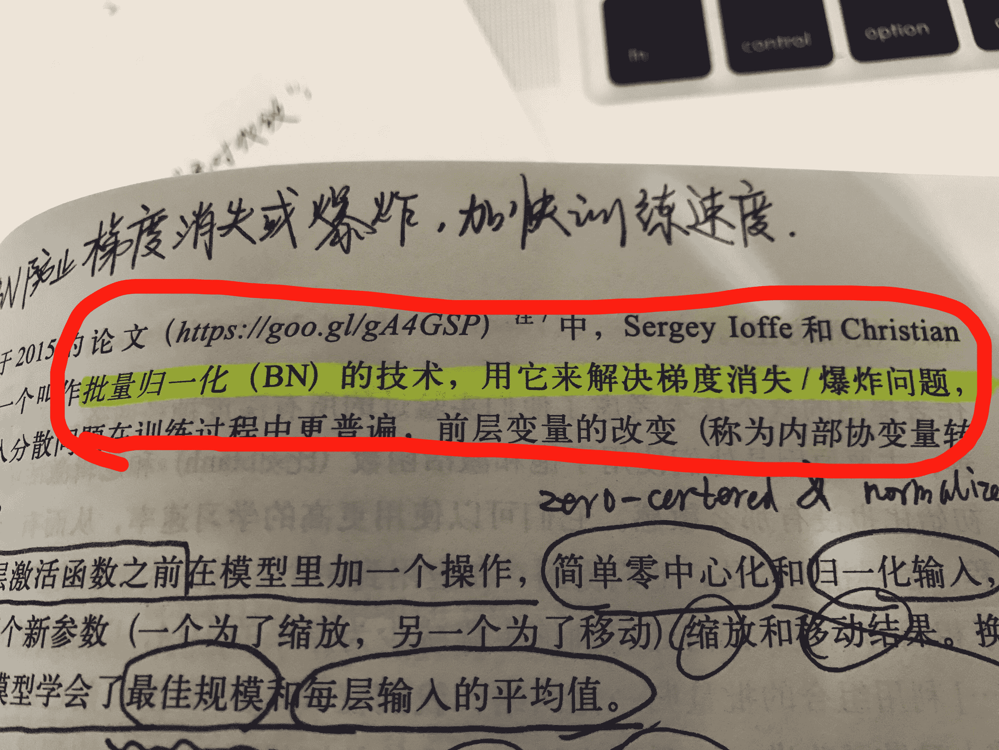

# 快手 2019 年秋季校园招聘笔试试卷—算法 A 试卷

## 1

关于 dropout 说法错误的是

正确答案: B   你的答案: 空 (错误)

```cpp
阻止了某些特征仅仅在其它特定特征下才有效果的情况
```

```cpp
预测的时候，和训练时一样，按照一定的概率将经网络单元从网络中丢弃
```

```cpp
dropout 的训练时间比没有 dropout 的要长
```

```cpp
对参数 w 的训练进行球形限制(max-normalization)，对 dropout 的训练非常有用
```

本题知识点

算法工程师 快手 2019

讨论

[卷子清](https://www.nowcoder.com/profile/2031869)

加了 dropout 训练时间会大大加长，加 bn 训练时间会缩短

发表于 2019-03-30 17:08:28

* * *

[大写的菜](https://www.nowcoder.com/profile/9833465)

预测的时候是不丢弃的。

发表于 2019-03-29 15:24:03

* * *

[陈蕊 201903141927797](https://www.nowcoder.com/profile/235226841)

C 么

发表于 2019-03-28 01:25:36

* * *

## 2

曲线 y = x Inx 的平行于直线 x - y + 1 = 0 的切线的方程是

正确答案: A   你的答案: 空 (错误)

```cpp
y = x - 1
```

```cpp
y = -(x + 1)
```

```cpp
y = (Inx - 1)(x - 1)
```

```cpp
y = x
```

本题知识点

算法工程师 快手 2019

讨论

[向宇同桌的老乡](https://www.nowcoder.com/profile/2273363)

y=xlnx 的导数为 y' = lnx +1，切线平行于直线 x-y+1=0，那么切点 x 处的导数 lnx+1=1，求得 x=1，即切点为(1,0)

发表于 2019-12-25 23:15:53

* * *

[大写的菜](https://www.nowcoder.com/profile/9833465)

斜率为 1， 过（1，0）

发表于 2019-03-29 15:27:13

* * *

[万古成空](https://www.nowcoder.com/profile/434566274)

A

发表于 2019-03-02 20:39:19

* * *

## 3

若 A、B 均为方阵，则以下说法正确的是

正确答案: C   你的答案: 空 (错误)

```cpp
AB = BA
```

```cpp
|AB| = |BA|
```

本题知识点

算法工程师 快手 2019

讨论

[向宇同桌的老乡](https://www.nowcoder.com/profile/2273363)

方阵和满***换律是两码事

发表于 2019-12-25 23:19:21

* * *

[Fat-Tiger](https://www.nowcoder.com/profile/8187487)

线性代数基础

发表于 2019-08-31 16:56:11

* * *

[大写的菜](https://www.nowcoder.com/profile/9833465)

AB 不等于 BA，可以排除其他所有的。

发表于 2019-03-29 15:29:31

* * *

## 4

有一个游戏，玩法如下：一个方块一开始放置在原点，每次投掷一个均匀的六面骰子，掷出几点，将方块往前移动几点；问：当游戏一直进行下去，方块曾经落在 2019 的概率为

正确答案: D   你的答案: 空 (错误)

```cpp
1
```

```cpp
1/6
```

```cpp
1/3
```

```cpp
2/7
```

本题知识点

算法工程师 快手 2019

讨论

[空空就是悟空](https://www.nowcoder.com/profile/940001276)

动态规划题，从前往后递推：

```cpp
res = [0]*2019

res[0] = 1/6
res[1] = 1/6 + (1/6)**2
res[2] = res[1]/6 + res[0]/6 + 1/6
res[3] = res[2]/6 + res[1]/6 + res[0]/6 +1/6
res[4] = res[3]/6 + res[2]/6 + res[1]/6 + res[0]/6 +1/6
res[5] = res[4]/6 + res[3]/6 + res[2]/6 + res[1]/6 + res[0]/6 +1/6

for i in range(6,2019):
    res[i] = sum(res[i-6:i])/6

print(res[-1])
```

结果（浮点数形式）：0.28571428571428575

发表于 2019-09-15 22:01:24

* * *

[万古成空](https://www.nowcoder.com/profile/434566274)

b

发表于 2019-03-02 20:41:43

* * *

[SteveShao](https://www.nowcoder.com/profile/317476765)

Mathematical:By the recurrence relationship we have
Now we have transition matrix .  The limiting (stationary) distribution corresponds to the normalized eigenvector with eigenvalue = 1\.Solve for P(n) = 2/7\.However, it seems to me a bit unclear what the states are.Therefore, it might be better to think of it as

发表于 2020-04-13 10:29:44

* * *

## 5

月神特别喜欢吃月饼，中秋节时快手发了 10 个月饼，已知月神一天至少吃一个月饼；请问，月神在 3 天内将 10 个月饼全部吃完的概率为：

正确答案: B   你的答案: 空 (错误)

```cpp
1/4
```

```cpp
23/256
```

```cpp
13/128
```

```cpp
3/32
```

本题知识点

算法工程师 快手 Java 工程师 C++工程师 安卓工程师 iOS 工程师 运维工程师 前端工程师 PHP 工程师 测试工程师 2019 游戏研发工程师

讨论

[岁荣](https://www.nowcoder.com/profile/3071559)

采用插板法，10 个月饼排成一行，如果在 2 天内吃完，就在里面插入一个板子，所以是 C91,所以就应该是(C90+C91+C92)/(C90+C91+C92+C93+C94+C95+.....+C99)

发表于 2019-04-12 11:03:12

* * *

[Herostarer](https://www.nowcoder.com/profile/595457495)

首先，一般概率有两种思路，第一种是算概率乘积，这个题的第一种思路我没有想出来，感觉很难入手。那么第二种思路就是算多少种可能性（即 3 天吃完的所有可能次数除以不限制时间吃完的总次数）。先算出 3 天吃完的所有可能次数。第一天是很好算是*C⁰[9，]*第二天吃完的次数是*C¹[9]*，第三天吃完的次数是*C²[9]*。现在再来算总次数，第一天是很好算是*C⁰[9，]*第二天吃完的次数是*C¹[9]*，第三天吃完的次数是*C²[9]*，第四天是*C³[9]*，依次类推，直到第十天是*C⁹[9]*因此 3 天内吃完月饼的概率就是（*C⁰[9 ]+*C¹[9]**+*C²[9]***）/（*C⁰[9 ]+*C¹[9]**+*C²[9]****+*C³[9]**+*C⁴[9]****+*C⁵[9]**+*C⁶[9]****+*C⁷[9]**+*C⁸[9]*****+*C⁹[9]***）=46/2^(9 ) =46/512

发表于 2018-11-08 11:34:20

* * *

[offer 快到碗里来啊！](https://www.nowcoder.com/profile/4725702)

1 天吃完: 将 10 个月饼分成 1 堆 10 天吃完:将 10 个月饼分成 10 堆注意三天内吃完就可能是一天(一堆)/两天(两堆)/三天(三堆)吃完!

发表于 2019-05-29 21:27:08

* * *

## 6

关于神经网络中经典使用的优化器，以下说法正确的是

正确答案: D   你的答案: 空 (错误)

```cpp
Adam 的收敛速度比 RMSprop 慢
```

```cpp
相比于 SGD 或 RMSprop 等优化器，Adam 的收敛效果是最好的
```

```cpp
对于轻量级神经网络，使用 Adam 比使用 RMSprop 更合适
```

```cpp
相比于 Adam 或 RMSprop 等优化器，SGD 的收敛效果是最好的
```

本题知识点

算法工程师 快手 2019

讨论

[卷子清](https://www.nowcoder.com/profile/2031869)

随着梯度变的稀疏，Adam 比 RMSprop 效果会好。

整体来讲，Adam 是最好的选择。

很多论文里都会用 SGD，没有 momentum 等。SGD 虽然能达到极小值，但是比其它算法用的时间长，而且可能会被困在鞍点。

如果需要更快的收敛，或者是训练更深更复杂的神经网络，需要用一种自适应的算法。

发表于 2019-03-08 15:09:00

* * *

[芦溪彭于晏](https://www.nowcoder.com/profile/678987627)

SGD 通常训练时间更长，容易陷入鞍点，但是在好的初始化和学习率调度方案的情况下，结果更可靠。
如果在意更快的收敛，并且需要训练较深较复杂的网络时，推荐使用学习率自适应的优化方法。

发表于 2019-04-21 15:46:34

* * *

## 7

以下说法错误的是

正确答案: C   你的答案: 空 (错误)

```cpp
使用 ReLU 做为激活函数，可有效地防止梯度爆炸
```

```cpp
使用 Sigmoid 做为激活函数，较容易出现梯度消失
```

```cpp
使用 Batch Normalization 层，可有效的防止梯度爆炸
```

```cpp
使用参数 weight decay，在一程度上可防止模型过拟合
```

本题知识点

算法工程师 快手 算法工程师 快手 2019

讨论

[牛客 612701075 号](https://www.nowcoder.com/profile/612701075)

感觉这道题不是很严谨

发表于 2020-03-21 10:47:03

* * *

[willzx](https://www.nowcoder.com/profile/145948515)

利用 BN 也可以解决梯度爆炸问题，

发表于 2019-04-12 00:00:10

* * *

[523619440](https://www.nowcoder.com/profile/843393957)

```cpp
使用 Batch Normalization 层，可防止的是梯度消失
```

发表于 2019-03-29 11:35:45

* * *

## 8

前几个月放映的头号玩家简直火得不能再火了，作为一个探索终极 AI 的研究人员，月神自然去看了此神剧。由于太过兴奋，晚上月神做了一个奇怪的梦，月神梦见自己掉入了一个被施放了魔法的深渊，月神想要爬上此深渊。已知深渊有 N 层台阶构成 ，并且每次月神仅可往上爬 2 的整数次幂个台阶(1、2、4、....)，请你编程告诉月神，月神有多少种方法爬出深渊数据范围： ，输入的数据组数满足 

本题知识点

算法工程师 快手 动态规划 2019

讨论

[ElonB](https://www.nowcoder.com/profile/623894)

```cpp
"""
台阶问题考虑动态规划
每次仅可往上爬 2 的整数次幂个台阶(1、2、4、....)
当前台阶方法数 = 所有一次可到达当前台阶方法数的和
dp[n] = dp[n-1]+dp[n-2]+dp[n-4]+... ( n-t>=0,dp[0]=1 )
"""
import sys

if __name__ == "__main__":
    # sys.stdin = open("input.txt", "r")
    m = int(input().strip())
    mod = 1000000003
    dp = [0] * 1001
    dp[0] = 1
    for i in range(1, 1001):
        t = 1
        while t <= i:
            dp[i] += dp[i - t]
            dp[i] %= mod
            t = t * 2
    for _ in range(m):
        n = int(input().strip())
        print(dp[n])

```

发表于 2019-07-05 13:24:48

* * *

[tuweilong](https://www.nowcoder.com/profile/334452011)

```cpp
/*
动态规划。类似于跳台阶。
用递归会超时。
取模防止溢出。
*/
import java.util.*;
public class Main {

    public static void main(String[] args) {
        Scanner in = new Scanner(System.in);
        int T = in.nextInt();
        int[] dp = new int[1001];
        dp[0] = 1;
        dp[1] = 1;
        for (int i = 2; i <= 1000; i++) {
            int tmp = 1;
            while (tmp <= i) {
                dp[i] += dp[i - tmp];
                tmp *= 2;
                dp[i] %= 1000000000 + 3;
            }
        }
        while (T-- > 0) {
            int n = in.nextInt();
            System.out.println(dp[n]);
        }
    }
}

```

发表于 2019-06-28 11:07:14

* * *

[♥乔木♥](https://www.nowcoder.com/profile/8448640)

动态规划！f(0) = 1;  f(1) = 1;  f(2) = 2;  f(3) = 3; f(4) = 6……这里与跳台阶每次只能选择跳一格或者两格的题目很类似。从后往前考虑，台阶为 n 时，第一次可以跳 2 的指数个台阶，总共有 1，2，4，8……k(k 小于 n)种跳法，剩下的 n - k 个台阶为台阶为 n-k 的跳法，可以得到下式：f(n) = f(n-1) + f(n - 2) + f(n - 4) +... + f(n - k)递归时将过程值保存，因为当计算 f(5) = f(4) + f(3) + f(1)时，f(3)又要计算一遍，时间复杂度会爆表。

```cpp
#include <iostream>
#include <algorithm>
using namespace std;

long Result[10001] = {0}; //存放各个 n 对应的结果

long NumOption(int n)
{
	long res = 0;
	if (n == 0) Result[0] = 1;
	if (n == 1) Result[1] = 1;
	if (n == 2) Result[2] = 2;
	int step = 0;
	if (Result[n] != 0) return Result[n]; // 若结果里已经有值，直接取出不用递归
	while (true)
	{
		if (n - pow(2, step) < 0) break; // 循环结束
		res += NumOption(n - pow(2, step));
		step++;
	}
	Result[n] = res % (1000000003);
	return Result[n];
}

int main() {
	int n;
	cin >> n;
	for (int i = 0; i < n; i++)
	{
		int in;
		cin>>in;
		long res = NumOption(in);
		cout << res << endl;
	}
	return 0;
}
```

编辑于 2020-04-01 10:09:49

* * *

## 9

分类任务中经常使用的损失函数是哪一个？

正确答案: A   你的答案: 空 (错误)

```cpp
Cross-Entropy Loss
```

```cpp
L1 Loss
```

```cpp
L2 Loss
```

```cpp
Triplet Loss
```

本题知识点

算法工程师 快手 2019

讨论

[LuPang](https://www.nowcoder.com/profile/374752026)

a

发表于 2019-03-29 20:31:32

* * *

## 10

深度学习中，不经常使用的初始化参数 W（权重矩阵）的方法是哪种？

正确答案: B   你的答案: 空 (错误)

```cpp
高斯分布初始化
```

```cpp
常量初始化
```

```cpp
Xavier 初始化
```

```cpp
MSRA 初始化
```

本题知识点

算法工程师 快手 2019

讨论

[LuPang](https://www.nowcoder.com/profile/374752026)

b

发表于 2019-03-29 20:36:34

* * *

## 11

深度学习中，以下哪种方法不能解决过拟合的问题？

正确答案: D   你的答案: 空 (错误)

```cpp
提前停止训练
```

```cpp
数据增强
```

```cpp
参数正则化
```

```cpp
减小学习率
```

本题知识点

算法工程师 快手 2019

讨论

[dream_gyx](https://www.nowcoder.com/profile/884940048)

减小学习率的目的是为了找到最优解

发表于 2020-03-14 19:23:39

* * *

[LuPang](https://www.nowcoder.com/profile/374752026)

d

发表于 2019-03-29 20:38:10

* * *

## 12

关于 CNN，以下说法错误的是

正确答案: B   你的答案: 空 (错误)

```cpp
CNN 可用于解决图像的分类及回归问题
```

```cpp
CNN 最初是由 Hinton 教授提出的
```

```cpp
CNN 是一种判别模型
```

```cpp
第一个经典 CNN 模型是 LeNet
```

本题知识点

算法工程师 快手 2019

讨论

[极客 PlusA](https://www.nowcoder.com/profile/5430516)

答案 B。CNN，搜索引擎里一搜，大多得到的是 Lecun 于 1989 年发表了《Backpropagation Applied to Handwritten Zip Code》是 CNN 的第一个实现网络

发表于 2020-04-24 09:11:03

* * *

[岁荣](https://www.nowcoder.com/profile/3071559)

深度学习属于判别模型

发表于 2019-04-12 10:37:38

* * *

[LuPang](https://www.nowcoder.com/profile/374752026)

b lecun 提出

发表于 2019-03-29 20:38:59

* * *

## 13

以下关于牛顿法描述错误的是

正确答案: A   你的答案: 空 (错误)

```cpp
牛顿法是一种常见的解决带约束最优化问题的方法
```

```cpp
牛顿法使用函数 f(x)的泰勒级数的前面几项来寻找方程 f(x) = 0 的根
```

```cpp
牛顿法使用一个二次曲面去拟合当前所处位置的局部曲面
```

```cpp
牛顿法是一种迭代算法，求解过程中需要计算目标函数的 Hessian 矩阵的逆矩阵
```

本题知识点

算法工程师 快手 2019

讨论

[poly530](https://www.nowcoder.com/profile/369772682)

解决的是无约束优化问题

发表于 2019-03-30 09:48:43

* * *

## 14

又到了吃午饭的时间，你和你的同伴刚刚研发出了最新的 GSS-483 型自动打饭机器人，现在你们正在对机器人进行功能测试。为了简化问题，我们假设午饭一共有 N 个菜，对于第 i 个菜，你和你的同伴对其定义了一个好吃程度（或难吃程度，如果是负数的话……）A[i]，由于一些技（经）术（费）限制，机器人一次只能接受一个指令：两个数 L, R——表示机器人将会去打第 L~R 一共 R-L+1 个菜。本着不浪费的原则，你们决定机器人打上来的菜，含着泪也要都吃完，于是你们希望机器人打的菜的好吃程度之和最大然而，你善变的同伴希望对机器人进行多次测试（实际上可能是为了多吃到好吃的菜），他想知道机器人打 M 次菜能达到的最大的好吃程度之和当然，打过一次的菜是不能再打的，而且你也可以对机器人输入-1, -1，表示一个菜也不打

本题知识点

Java 工程师 C++工程师 iOS 工程师 安卓工程师 运维工程师 前端工程师 算法工程师 PHP 工程师 测试工程师 快手 动态规划 2019

讨论

[土豪 gold](https://www.nowcoder.com/profile/785257874)

```cpp
//优化了一下通过答案中“流淌 201711202027933”的解法，主要是给二维 dp 直接赋初值，这样可以减少一个循环
//同时增加了一些注释，提高可读性
#include<iostream>
#include<vector>
#include<algorithm>
using namespace std;
vector<int>ss;
int dp[2][100005]={0};
int main()
{
    int N, M,sum,h,  k, count, now; //N 表示菜的个数，M 表示机器人最多打菜的次数，cout 表示菜的总的好吃度，now 表示当前这道菜的好吃度
    cin >> N >> M;

    count = 0; 
    while (N--) {
        cin >> now;  //输入菜的好吃程度
        if (count>0) {  //总的好吃度为正时
            if (now >= 0)  //好吃度为正，累加好吃度
                count += now;
            else {
                ss.push_back(count);   //好吃度为负，把之前总的好吃度存下来，并更新总的好吃度
                count = now;
            }
        }

        else if (count<0) {  //总的好吃度为负数时
            if (now >= 0) {
                    ss.push_back(count);  //当前好吃度为正，把之前总的好吃度存下来，并更新总的好吃度
                count = now;
            }
            else
                count += now;   //好吃度为负，累加好吃度
        }

        else
            count += now;   //总的好吃度为 0 时，累加好吃度
    }

    if (count>0)   //完成数据输入后，总的好吃度如果为正，那么存下来
    {
        ss.push_back(count);
    }
    /*
    上面代码干的活其实简单理解就是把菜的好吃度进行简单的处理：遇到连着正的或者连着负的就累加
    举几组例子方便理解：
    输入：7 7 【1 2 3 -2 3 -10 3】
    输出 ss:[6 -2 3 -10 3]
    输入：10 1 【-1 2 4 -3 5 -7 11 24 -6 -9】
    输出 ss:[-1 6 -3 5 -7 35]
    输入：6 1 【1 -2 -3 -4 -5 -6】
    输出 ss：[1]
    输入：7 1 【1 -1 -2 -3 -4 2 3】
    输出 ss：[1 -10 5]
    这样做的目的可以有效减少接下来二维 dp 的运算量
    否则本题直接用 dp 会因为运算量过大只通过 80%的测试案例
    */

    sum = 0;

        N = ss.size()+1;
        count = 0;
    //可操作次数大于存储下来的总好吃值个数，直接把正的都取出来累加就是最终的总的好吃度
    if(N<=M){
        for (int j = 0; j < N; j++){
            if(ss[j]>0)
                count+=ss[j];
        }
        return 0;
    }

    //可操作次数小于存储下来的总的好吃值的个数，转换为二维 dp
    else{
        for (int i = 1; i <= M; i++) {
            sum = 0;
            k=i&1;
            h=(i-1)&1;
            dp[k][0] = 0;
            for (int j = 1; j < N; j++) {
                sum = max(sum, dp[h][j - 1]);
                dp[k][j] = max(sum , dp[k][j - 1]) + ss[j-1];
            }
        }
        for(int i=M;i<N;i++)
        if (count < dp[k][i])
                    count = dp[k][i];
    }
        cout << count << endl;

    return 0;

}

```

发表于 2019-07-04 08:56:02

* * *

[叶挽秋](https://www.nowcoder.com/profile/754934722)

同样的思路，java 过不了，cpp 能过，java 不配刷题？

```cpp
import java.util.*;
/*
和 leetcode188，买卖股票的最佳时机Ⅳ类似
将菜价数组改为每一个位置都是前面所有数字的和就和股价一样
一共能进行 M 次买卖

1\. 使用动态规划
状态量有三种，菜的位置 i，能打多少次菜 M，是否打这个菜 s（0 或 1）
2\. 状态转移方程：
dp[i][M][0]=max(dp[i-1][M][0], dp[i-1][M][1])
解释：
    第 i 个菜不打能获得的最大值为
    上一个菜不打能获得的最大值
    上一个菜打能获得的最大值
    其中较大的一个
dp[i][M][1]=max(dp[i][M][1]+A[i], dp[i][M-1][0]+A[i])
解释：
    第 i 个菜打能获得的最大值为
    上一个菜也打获得的最大值加上这个菜的值
    上一个菜不打获得的最大值加上这个菜的值，但是上一个菜的 M 值要-1，因为这个菜要消耗一次打饭机会

3\. 初始值
dp[0][M][0]=0
dp[0][M][1]={    0    ,    M=0
                 A[0] ,    M>0}
4\. 简化
简化状态转移方程：
dp_i_0[M]=max(dp_i_0[M], dp_i_1[M])
dp_i_1[M]=max(dp_i_1[M]+A[i], dp_i_0[M-1]+A[i])

简化 M 的值：
对于任意 N 个菜，只要 M > N/2，就能确保打到所有正数的菜
比如 N=2,M 只要 1
N=3，M 只要 2
N=4，M 只要 2

简化 A 数组
连续的几个正值或者负值可以将其合并为 1 个值，
比如 1，1，-1，-1，2，3
可以简化为 2，-2，5
*/
public class Main {
    public static void main(String[] args) {
        // 获取输入
        Scanner scanner = new Scanner(System.in);
        int N = scanner.nextInt();
        int M = scanner.nextInt();

        int[] A = new int[N];
        int count = 0;
        int sum = 0;
        // 获取数组 A 并简化
        for (int i = 0; i < N; ++i) {
            int temp = scanner.nextInt();
            // 若 sum 和 A 同号，累加
            if ((sum >= 0 && temp >= 0) || (sum <= 0 && temp <= 0)) {
                sum += temp;
            } else {
                // 否则，加入 A，重新累计
                A[count] = sum;// 直接在 A 数组修改就可以
                ++count;
                sum = temp;
            }
        }
        // 最后一个累计加入数组
        A[count] = sum;
        N = count + 1;

        // 若 M > (N + 1) / 2，直接将所有正数累加输出
        if (M > (N + 1) / 2) {
            long result = 0;
            for (int a : A) {
                result += (a > 0 ? a : 0);
            }
            System.out.println(result);
            return;
        }

        // 否则进行 dp
        long[] dp_i_0 = new long[M + 1];
        long[] dp_i_1 = new long[M + 1];
        for (int m = 1; m <= M; ++m) {
            dp_i_1[m] = A[0];
        }

        for (int i = 1; i < N; ++i) {
            for (int m = 1; m <= M; ++m) {
                dp_i_0[m] = Math.max(dp_i_0[m], dp_i_1[m]);
                dp_i_1[m] = Math.max(dp_i_1[m] + A[i], dp_i_0[m - 1] + A[i]);
            }
        }

        System.out.println(Math.max(dp_i_0[M], dp_i_1[M]));
    }
}

/*改写成 cpp 就能过
#include<iostream>
#include<vector>
#include<algorithm>
using namespace std;

int main() {
    int N, M;
    cin>>N;
    cin>>M;
    vector<int> A;
    int sum = 0;
    while (N) {
        --N;
        int temp;
        cin >> temp;
        if ((sum >= 0 && temp >= 0) || (sum <= 0 && temp <= 0)) {
            sum += temp;
        } else {
        // 否则，加入 A，重新累计
            A.push_back(sum);// 直接在 A 数组修改就可以
            sum = temp;
        }
    }
    N = A.size();

    // 若 M > (N + 1) / 2，直接将所有正数累加输出
    if (M > (N + 1) / 2) {
        int result = 0;
        for (int a : A) {
            result += (a > 0 ? a : 0);
        }
        cout << result;
        return 0;
    }

        vector<int> dp_i_0(M + 1, 0);
        vector<int> dp_i_1(M + 1, 0);
        for (int m = 1; m <= M; ++m) {
            dp_i_1[m] = A[0];
        }

        for (int i = 1; i < N; ++i) {
            for (int m = 1; m <= M; ++m) {
                dp_i_0[m] = max(dp_i_0[m], dp_i_1[m]);
                dp_i_1[m] = max(dp_i_1[m] + A[i], dp_i_0[m - 1] + A[i]);
            }
        }

        cout << max(dp_i_0[M], dp_i_1[M]);

    return 0;
}
*/
```

发表于 2020-01-16 17:04:06

* * *

[Shopee 内推小虾米](https://www.nowcoder.com/profile/6579633)

```cpp
#include<iostream>
#include<stdio.h>
#include<vector>
#include<set>
using namespace std;

/*
    参考(抄袭、借鉴、学了)胡船长的代码  做了注释

    最大 m 段和
    1.通过合并连续正数、负数，得到正负交错的序列
    2.如果 M 大于正数数目，答案就是其和
    3.否则可将正数们视为一个段，得到超过 M 的段数
    4.开始对正数进行合并、舍弃，直到剩余 M 个正数段结束
        合并、舍弃过程：
            将所有值按绝对值大小全
            每次取最小值出来，如果是正数，则舍弃它，将它与两边负数合并，段数减 1
                           如果是负数，则将它视为链接左右两边比它大的正数段的枢纽，合并两边正数

*/
const int max_N = 100005;
struct Node{
    int val;//子段值
    int flag;//是否已被删除
    int l,r;//左边、右边节点的位置
	Node(){}
    Node(int l_,int r_,int val_):l(l_),r(r_),val(val_),flag(0){}
	friend ostream& operator<<(ostream& out,const Node &n){
		out<<"["<<n.l<<" "<<n.val<<" "<<n.r<<" "<<":"<<n.flag<<"]"<<",";
		return out;
	}
};

vector<Node> A(max_N);
void del(int p){
	if(p==0) return ;
    A[p].flag = 1;
    //将其左右连接，有点像链表的删除
    A[A[p].l].r = A[p].r;
    A[A[p].r].l = A[p].l;
    A[p].l=0;
    A[p].r=0;
}
int main(){
	//freopen("temp.in","r",stdin);
    int N,M;
	cin>>N>>M;
	A[0]=Node(0,1,0);
	int a;
    for(int i=1;i<=N;i++){
		cin>>a;
		A[i]=Node(i-1,i+1,a);
    }
	A[N+1]=Node(N,0,0);
	set<pair<int,int> >S; //不用 map 是因为 map 按 key 排序唯一，用 pair 能保证存在多个 val 值的 node

    //合并连续正数、负数
    int p = 1;
    int cnt=0,sum=0;//合并后正数的个数、总和
    while(p!=0){
        while(A[p].r and A[p].val*A[A[p].r].val>=0){
            A[p].val+=A[A[p].r].val;
            del(A[p].r);//数组内不好删除，仅仅作标记，并将其左右相邻点互相链接
        }
        if(A[p].val>0) cnt++,sum+=A[p].val;
        S.insert(make_pair(abs(A[p].val),p));//将所有数按绝对值入堆
        p = A[p].r;
    }

    //可看做现在有 cnt 段正数，超过 M，所以要进行合并或舍弃()，以达到 M 段
    while(cnt>M){
        auto a = S.begin();//取出正数、负数绝对值中最小的一个(map 内部是排序的)
        S.erase(a);
        p = a->second;
		if(A[p].flag) continue;
		//最小数是正数时考虑舍弃掉，跟左右两边的负数合并成一个更大的负数，
		//最小数如果是负数则用来串联左右两边比它大的正数，作为周围两个正数的枢纽  

		if((A[p].l==0&nbs***bsp;A[p].r==0) and A[p].val<0) del(p);//最小值是边缘且是负数，直接删除
		else{
			cnt--;

			sum-=abs(A[p].val);//加上负数相当于减绝对值，正数也可以直接减
			//串联上左右两边
			A[p].val+=A[A[p].r].val;
			A[p].val+=A[A[p].l].val;
            //删除左右两边
			del(A[p].r);
			del(A[p].l);
            //重新入堆，因为有可能作为枢纽
			S.insert(make_pair(abs(A[p].val),p));
		}
    }
    printf("%d\n",sum);
    return 0;
}
```

发表于 2020-02-14 18:32:03

* * *

## 15

一个箱子中有 15%的红球和 85%的绿球，小明随机取出 1 个球，他不能看到球，但他根据手感判断该球为红色。已知小明根据手感判断颜色的正确概率为 80%，那么他取到的球实际为红色的概率为：

正确答案: C   你的答案: 空 (错误)

```cpp
15%
```

```cpp
29%
```

```cpp
41%
```

```cpp
80%
```

本题知识点

算法工程师 快手 2019

讨论

[tired0228](https://www.nowcoder.com/profile/435885353)

小明取到红球，判断为红球的概率：0.15*0.8=0.12 小明取到绿球，判断为红球的概率：0.85*0.2=0.17 以上两种情况为题设所给出的前提条件，则在此基础上，小明取到的球实际为红球的概率为：0.12/（0.12+0.17）≈ 0.41

发表于 2018-11-19 14:51:22

* * *

## 16

现有一个包含两个类别的数据集合，其中类别 C1 的样本数量为 60， 类别 C2 的样本数量为 40。某分类器对这一集合进行分类，结果如下：（1）C1 样本中有 20 个分类结果为 C1，40 个分类结果为 C2；（2）C2 样本中有 15 个分类结果为 C1，25 个分类结果为 C2。该分类器的分类准确率为：

正确答案: B   你的答案: 空 (错误)

```cpp
35%
```

```cpp
45%
```

```cpp
55%
```

```cpp
65%
```

本题知识点

算法工程师 快手 2019

讨论

[什么时候才能有 offer 啊](https://www.nowcoder.com/profile/323307851)

（60/100 * 20/60）+（40/100 * 25/40）=9/20=0.45

发表于 2019-03-26 21:34:42

* * *

[Mr.LiRong](https://www.nowcoder.com/profile/65944734)

所有参与分类的总数是 100     分队的数量是 20+25     分类准确率=45/100

发表于 2019-09-16 10:56:03

* * *

## 17

Beta 星球非常重男轻女，一个家庭如果一胎生女儿的话，会继续生下一个孩子，直到生男孩为止。已知生男孩和女孩的概率都是 50%，每个家庭至少会生一个孩子，那么 Beta 星球平均每个家庭的孩子数量为：

正确答案: C   你的答案: 空 (错误)

```cpp
1
```

```cpp
1.5
```

```cpp
2
```

```cpp
2.718281828
```

本题知识点

算法工程师 快手 2019

讨论

[岁荣](https://www.nowcoder.com/profile/3071559)

这是一个几何分布，几何分布的期望等于 E(X)=1/p

发表于 2019-04-12 14:45:20

* * *

[本命年求好运](https://www.nowcoder.com/profile/83654035)

设家庭有 k 个孩子的概率为 p，则 

发表于 2019-03-30 16:52:28

* * *

[yyyzzz](https://www.nowcoder.com/profile/1496581)

这就是一个负二项分布。

发表于 2018-11-07 16:56:25

* * *

## 18

7 个同学围坐一圈，要选 2 个不相邻的作为代表，有 _________ 种不同的选法。

正确答案: C   你的答案: 空 (错误)

```cpp
35
```

```cpp
28
```

```cpp
14
```

```cpp
21
```

本题知识点

算法工程师 快手 2019

讨论

[向宇同桌的老乡](https://www.nowcoder.com/profile/2273363)

C72=21 种，相邻有 7 种，21-7=14

发表于 2019-12-28 11:15:46

* * *

[万古成空](https://www.nowcoder.com/profile/434566274)

7*(7-3)/2＝14

编辑于 2019-03-02 21:03:06

* * *

## 19

在其他条件不变的前提下，以下哪种做法容易引起机器学习中的过拟合问题（）

正确答案: B   你的答案: 空 (错误)

```cpp
增加训练集量
```

```cpp
增加神经网络隐藏层节点数
```

```cpp
增加更多特征
```

```cpp
在模型中引入正则项
```

本题知识点

算法工程师 快手 算法工程师 快手 2019

讨论

[放放风 v](https://www.nowcoder.com/profile/948457582)

b

发表于 2018-12-15 16:57:21

* * *

## 20

快手需要对用户年龄进行识别，识别系统中用户被划分为老人，中年，青年，小孩四类，下面哪种方法最适合此种应用需求：（）

正确答案: C   你的答案: 空 (错误)

```cpp
kmeans 聚类
```

```cpp
层次聚类
```

```cpp
多分类算法
```

```cpp
关联挖掘
```

本题知识点

算法工程师 快手 2019

讨论

[神级被菜虐](https://www.nowcoder.com/profile/113107937)

和楼下一样的观点，这个就是冷启动还没有用户标签的时候做聚类吧，都已经有打标签的数据了这问题还有意义？

发表于 2020-03-20 16:11:54

* * *

[叶.此去经年](https://www.nowcoder.com/profile/2278112)

个人认为没有用户年龄数据的情况下应当是聚类问题。题目的意思是一般用户都有年龄标签，但是要识别出没填年龄的用户？

发表于 2019-05-03 08:34:50

* * *

## 21

通过键盘输入一串小写字母 (a~z) 组成的字符串。请编写一个字符串归一化程序，统计字符串中相同字符出现的次数，并按字典序输出字符及其出现次数。例如字符串"babcc"归一化后为"a1b2c2"数据范围：输入的字符串长度满足 ，保证输入中仅包含小写的英文字母

本题知识点

算法工程师 快手 字符串 *模拟 2019* *讨论

[指间梦](https://www.nowcoder.com/profile/183172554)

```cpp
import java.util.Scanner;
public class Main{
    public static void main(String[] args){
        Scanner sc=new Scanner(System.in);
        char[] chars=sc.nextLine().toCharArray();
        //经验，一般是用 hashmap 来统计出现次数的，
        //但本题是对字符统计次数，可以专门用一个 counts 数组来统计次数
        int[] counts=new int[26];
        for(int i=0;i<chars.length;i++){
            counts[chars[i]-'a']++;
        }
        for(int i=0;i<26;i++){
            char c=(char)('a'+i);
            int count=counts[i];
            if(count==0){
                continue;
            }else{
                System.out.print(c+""+count);
            }
        }
    }
}

```

发表于 2019-08-05 21:59:53

* * *

[尘世 0 残破](https://www.nowcoder.com/profile/812443852)

```cpp
string = input()
for i in sorted(list(set(string))):
    item = string.count(i)
    print(i + str(item), end = '')
```

发表于 2019-10-10 22:00:53

* * *

[imaginee](https://www.nowcoder.com/profile/965709029)

```cpp
#include<iostream>
#include<string>
using namespace std;
int main(){
    int count[26] = {0};   //记录每个字母的个数
    string s;
    cin >> s;
    for(int i = 0; i < s.length(); i++){
        count[s[i]-'a']++;
    }
    char c = 'a';
    for(int i = 0; i < 26; i++){
        if(count[i]){
            cout << c << count[i];
        }
        c++;
    }
    cout << endl;
    return 0;
}
```

发表于 2019-09-03 23:03:31

* * *

## 22

二叉树 T，已知其先根遍历是 1 2 4 3 5 7 6（数字为结点的编号，以下同），中根遍历是 2 4 1 5 7 3 6，则该二叉树的后根遍历是：

正确答案: B   你的答案: 空 (错误)

```cpp
4 2 5 7 6 3 1
```

```cpp
4 2 7 5 6 3 1
```

```cpp
7 4 2 5 6 3 1
```

```cpp
4 2 7 6 5 3 1
```

本题知识点

算法工程师 快手 算法工程师 快手 2019

讨论

[歪讷姆恩托克信](https://www.nowcoder.com/profile/750755814)

先根据条件中的先根遍历和中根遍历画出树，然后写出后根遍历。这里给出其层次遍历作为参考：[1, 2, 3, None, 4, 5, 6, None, None, None, 7]

发表于 2019-03-29 18:40:06

* * *

[万古成空](https://www.nowcoder.com/profile/434566274)

B

发表于 2019-03-02 21:10:04

* * *

## 23

将（2, 6, 10, 17）分别存储到某个地址区间为 0~10 的哈希表中，用以下哪个哈希函数 h(x)将不会产生冲突：

正确答案: D   你的答案: 空 (错误)

```cpp
x mod 11
```

```cpp
x2 mod 11
```

```cpp
2x mod 11
```

```cpp
 floor() mod 11, floor 是向下取整函数
```

本题知识点

算法工程师 快手 2019

讨论

[LuPang](https://www.nowcoder.com/profile/374752026)

d

发表于 2019-03-30 15:35:20

* * **