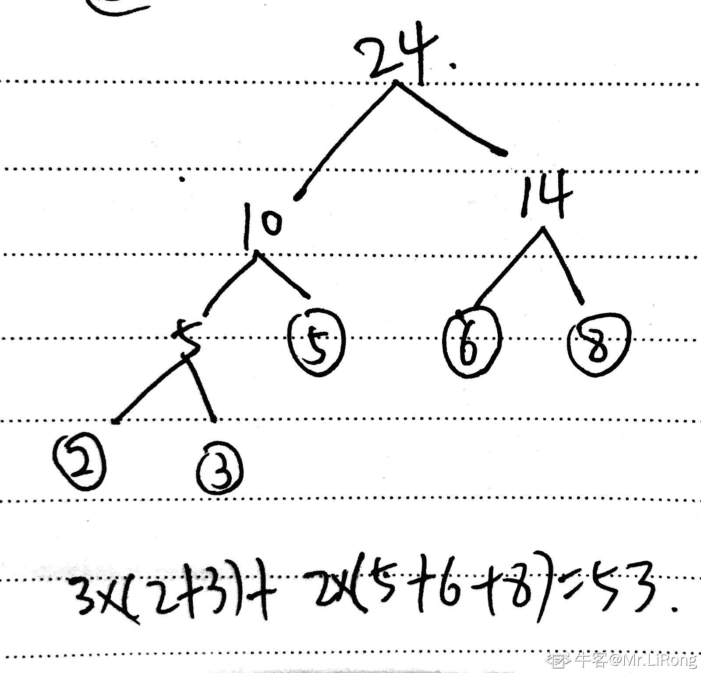
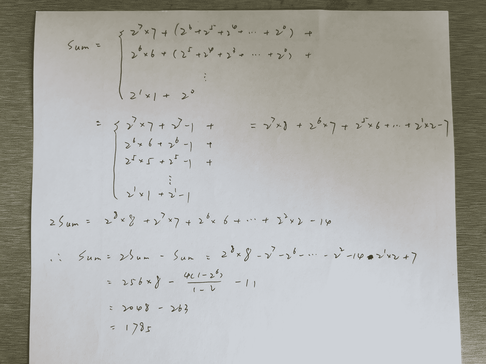
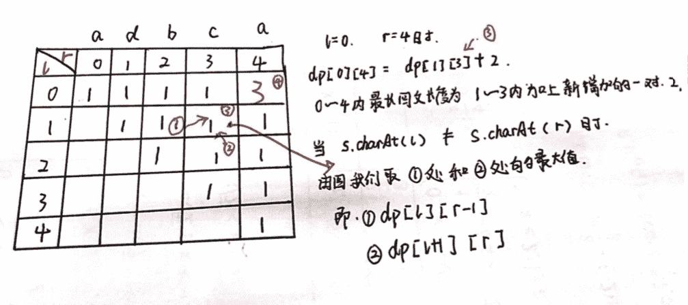
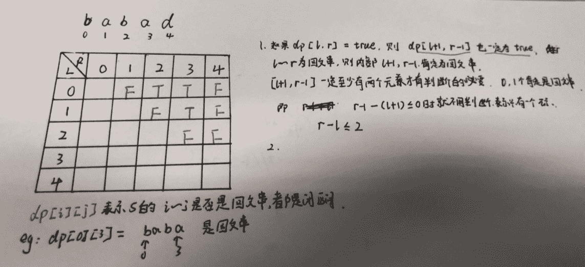
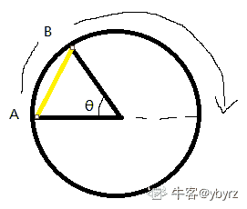
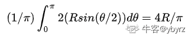

# 快手 2019 年秋季校园招聘笔试试卷—算法 B 试卷

## 1

由权值分别为 3，8，6，2，5 的叶子结点生成一棵哈夫曼树，它的带权路径长度为

正确答案: D   你的答案: 空 (错误)

```cpp
24
```

```cpp
48
```

```cpp
52
```

```cpp
53
```

本题知识点

算法工程师 快手 算法工程师 快手 2019

讨论

[Mr.LiRong](https://www.nowcoder.com/profile/65944734)



发表于 2019-09-16 11:48:03

* * *

[Sesenn](https://www.nowcoder.com/profile/85234885)

哈夫曼树构建原则：带权路径最短。以本题为例，将叶节点 3，8，6，2，5 进行排序，升序为 2，3，5，6，8。取 2、3，二者和为 5；取 5，与前者和 5 相加，得和 10；和 10 大于接下来得 6 和 8，则取 6、8，得和 14；然后将和 14、和 10 相加，得根节点 24\.2、3：带权路径为（2+3）*3 =155： 带权路径为 5*2 =106，8 带权路径为（6+8）*2=2815+10+28=53

发表于 2018-11-06 10:10:48

* * *

## 2

以下表述正确的是：

正确答案: B   你的答案: 空 (错误)

```cpp
训练 DNN 的时候，Adam 方法在收敛所用时间上快与 sgd
```

```cpp
通过正则化方法，可以让某一个神经元的所有连接权重都变成 0
```

```cpp
参数的初始化对 DNN 的训练不重要
```

```cpp
使用 Relu 函数，就不会造成训练过程出现 Nan 错误
```

本题知识点

算法工程师 快手 2019

讨论

[没有眼泪的禽兽](https://www.nowcoder.com/profile/3718224)

感觉这道题 A 和 B 都是对的哎，Adam 算法收敛的比 SGD 快，这个观点没问题啊

发表于 2018-11-15 16:38:30

* * *

## 3

以下哪种方法一般不用于在大数据集上训练 DNN：

正确答案: D   你的答案: 空 (错误)

```cpp
SGD
```

```cpp
FTRL
```

```cpp
RMSProp
```

```cpp
L-BFGS
```

本题知识点

算法工程师 快手 2019

讨论

[零葬](https://www.nowcoder.com/profile/75718849)

SGD 和 RMSProp 都是 mini-batch 的方法，适用于大数据集，而 FTRL 是一种在线学习方法，经常被用来快速更新 CTR 模型，适用于超大型数据；L-BFGS 需要用所有的数据进行训练。

编辑于 2021-01-06 17:30:25

* * *

[Sesenn](https://www.nowcoder.com/profile/85234885)

```cpp
L-BFGS 方法：所有的数据都会参与训练，算法融入方差归一化和均值归一化。大数据集训练 DNN，容易参数量过大
```

发表于 2018-11-06 10:39:50

* * *

## 4

下面关于 Relu 和 Sigmoid 激活函数说法错误的是

正确答案: B   你的答案: 空 (错误)

```cpp
Relu 激活函数相比于 Sigmoid 激活函数计算更简单
```

```cpp
Relu 激活函数是一种线性的激活函数
```

```cpp
Sigmoid 激活很容易出现梯度消失的情况
```

```cpp
Relu 减少了参数间的相互依存关系，缓解了过拟合问题的发生
```

本题知识点

算法工程师 快手 2019

讨论

[牛客网弟中弟](https://www.nowcoder.com/profile/5002895)

RELU 是非线性激活函数

发表于 2019-02-05 14:56:53

* * *

## 5

函数 y=|x|，关于函数在 x=0 处，以下说法正确的是

正确答案: C   你的答案: 空 (错误)

```cpp
连续且可导
```

```cpp
连续且可微
```

```cpp
连续不可导
```

```cpp
不连续不可微
```

本题知识点

算法工程师 快手 2019

讨论

[牛客 486539185 号](https://www.nowcoder.com/profile/486539185)

c

发表于 2019-03-29 12:14:10

* * *

## 6

关于收敛和极限的说法，以下错误的是

正确答案: D   你的答案: 空 (错误)

```cpp
级数绝对收敛，则级数条件收敛
```

```cpp
单调有界数列必有极限
```

```cpp
级数收敛
```

```cpp
级数条件收敛，则级数绝对收敛
```

本题知识点

算法工程师 快手 2019

讨论

[牛客网弟中弟](https://www.nowcoder.com/profile/5002895)

一个级数若绝对收敛，则其必然条件收敛；反之不对

发表于 2019-02-05 14:57:43

* * *

## 7

若方阵阵 A、B 相似，则以下说法正确的是

正确答案: A   你的答案: 空 (错误)

```cpp
A，B 的若当矩阵等价
```

```cpp
R(A)可能大于 R(B)
```

```cpp
可通过基本的行变换将 A 变到 B
```

```cpp
可通过基本的列变换将 A 变到 B
```

本题知识点

算法工程师 快手 2019

讨论

[零葬](https://www.nowcoder.com/profile/75718849)

相似矩阵的秩是相等的，说明可以通过基本行变换和列变换得到彼此，C 和 D 都是不全面的

发表于 2020-10-28 16:45:34

* * *

## 8

以下关于矩阵说法，正确的是

正确答案: C   你的答案: 空 (错误)

```cpp
任意方阵均可相似于对角矩阵
```

```cpp
任意方阵均酉相似于上半角矩阵
```

```cpp
任意方阵均相似于上半角矩阵
```

```cpp
两方阵等价，则对应的若当阵也等价
```

本题知识点

算法工程师 快手 算法工程师 快手 2019

## 9

以下哪种 CNN 模型不是在 image net 比赛中兴起的

正确答案: C   你的答案: 空 (错误)

```cpp
AlexNet
```

```cpp
ResNet
```

```cpp
Mask-RCNN
```

```cpp
VGG19
```

本题知识点

算法工程师 快手 2019

讨论

[不知道叫啥名字](https://www.nowcoder.com/profile/622038691)

Mask-RCNN 是图像分割

发表于 2019-08-25 13:54:45

* * *

## 10

以下不属于激活函数的是

正确答案: A   你的答案: 空 (错误)

```cpp
soft max
```

```cpp
ReLU
```

```cpp
SeLU
```

```cpp
PReLU
```

本题知识点

算法工程师 快手 2019

讨论

[新八](https://www.nowcoder.com/profile/6380436)

softmax 不是多分类任务的激活函数吗？

发表于 2021-08-03 15:35:59

* * *

[Sesenn](https://www.nowcoder.com/profile/85234885)

SoftMax 为分类损失函数

发表于 2018-11-06 10:41:06

* * *

## 11

以下不属于 normalization 方法的是

正确答案: B   你的答案: 空 (错误)

```cpp
batch normalization
```

```cpp
weight normalization
```

```cpp
instance normalization
```

```cpp
layer normalization
```

本题知识点

算法工程师 快手 2019

## 12

月神拿到一个新的数据集，其中每个样本都是一个字符串，样本的的后六位是纯数字，月神需要将所有样本的后六位数字提出来，转换成数字，并排序输出。注意：这里的排序并不是针对每个字符串的后六位，而是需要按数字大小顺序输出所有样本的后六位数字。月神要实现这样一个很简单的功能确没有时间，作为好朋友的你，一定能解决月神的烦恼，对吧。
数据范围：字符串长度满足  ，每组测试中包含  个字符串

本题知识点

算法工程师 快手 字符串 *排序 *2019** **讨论

[Chrety](https://www.nowcoder.com/profile/994602167)

```cpp
n = input()
a = []
for i in range(n) :
    s = raw_input()
    a.append(int(s[-6:]))
    pass
a.sort()
for i in a :
    print i
```

发表于 2019-07-20 07:54:13

* * *

[无心 2019](https://www.nowcoder.com/profile/991674511)

```cpp
#include <bits/stdc++.h>
using namespace std;
int main()
{
    int m;
    string s[101];
    while(cin>>m)
    {
        int num[m];
        for(int i=0;i<m;i++)
        {
            cin>>s[i];
            string str = s[i].substr(s[i].size() - 6, s[i].size() - 1);
            num[i]=stoi(str);
        }
        sort(num,num+m);
        for(int i=0;i<m;i++)
            cout<<num[i]<<endl;
    }
    return 0;
}

```

发表于 2019-06-30 19:40:16

* * *

[ElonB](https://www.nowcoder.com/profile/623894)

```cpp
"""
人生苦短，我用 python
"""
import sys

if __name__ == "__main__":
    # sys.stdin = open("input.txt", "r")
    m = int(input().strip())
    a = []
    for _ in range(m):
        a.append(int(input().strip()[-6:]))
    a.sort()
    for x in a:
        print(x)

```

发表于 2019-07-06 21:33:00

* * *

## 13

下列关于深度学习说法错误的是

正确答案: C   你的答案: 空 (错误)

```cpp
LSTM 在一定程度上解决了传统 RNN 梯度消失或梯度爆炸的问题
```

```cpp
CNN 相比于全连接的优势之一是模型复杂度低，缓解过拟合
```

```cpp
只要参数设置合理，深度学习的效果至少应优于随机算法
```

```cpp
随机梯度下降法可以缓解网络训练过程中陷入鞍点的问题
```

本题知识点

算法工程师 快手 2019

讨论

[零葬](https://www.nowcoder.com/profile/75718849)

这题不好，屏蔽之

发表于 2020-12-21 11:04:17

* * *

[楚王虽雄](https://www.nowcoder.com/profile/106259138)

B 难道不是错的吗

发表于 2019-09-15 11:02:14

* * *

[芦溪彭于晏](https://www.nowcoder.com/profile/678987627)

有没有人能说说 C 这个选项

发表于 2019-04-22 15:12:57

* * *

## 14

如果一棵二叉树的中序遍历是 BAC，那么它的先序遍历不可能是

正确答案: C   你的答案: 空 (错误)

```cpp
ABC
```

```cpp
CBA
```

```cpp
ACB
```

```cpp
BAC
```

本题知识点

算法工程师 快手 2019

讨论

[Rhett.Wang](https://www.nowcoder.com/profile/279463198)

楼上应该打错了，中序遍历 BAC，则 B 为左子树，先序遍历中肯定不会是在最后面。

发表于 2019-04-13 03:20:28

* * *

[北冥鲲 201902281118322](https://www.nowcoder.com/profile/138445019)

中序遍历 BAC，则 B 为根节点，先序遍历中肯定不会是在最后面。

发表于 2019-04-12 16:30:37

* * *

## 15

两个 1 和 6 个 0 可以组成( )个不同的二进制数？这些二进制数化为十进制后总和是( )？

正确答案: B   你的答案: 空 (错误)

```cpp
21, 1785
```

```cpp
28, 1785
```

```cpp
21, 2041
```

```cpp
28, 2041
```

本题知识点

算法工程师 快手 2019

讨论

[Sesenn](https://www.nowcoder.com/profile/85234885)

不同的个数：八位随机无序取两位置 1，则 C82=8*7/2/1=28 和：255*7 = 1785

发表于 2018-11-06 10:51:10

* * *

[李可乐 93](https://www.nowcoder.com/profile/208919124)



发表于 2019-04-07 11:48:46

* * *

## 16

最大回文子串是被研究得比较多的一个经典问题。最近月神想到了一个变种，对于一个字符串，如果不要求子串连续，那么一个字符串的最大回文子串的最大长度是多少呢。数据范围：字符串长度满足  ，字符串中仅包含 0~9 和大小写字母

本题知识点

算法工程师 快手 字符串 *动态规划 2019* *讨论

[qianjiahong](https://www.nowcoder.com/profile/2931217)

```cpp
#include <iostream>
#include<bits/stdc++.h>
#define N 1000
using namespace std;
//可以使用递归的算法，但是这种算法对于字符串较大的情况会通不过，但是思路很简单
int dp(char*s,int start, int end){
    if (start>end){
        return 0;
    }else if(start==end){
        return 1;
    }else{
        if(s[start]==s[end]){
            return dp(s,start+1,end-1)+2;
        }else{
            return max(dp(s,start+1,end),dp(s,start,end-1));
        }
    }
}

//使用动态规划的思想，d[i][j]表示字符串 s 中位置 j 到位置 i（i>j）的字符串中的最长的回文长度，
//当 s[i]==s[j]时,d[i][j]的最长回文字符串长度为其子串 d[i-1][j+1]的长度+2
//当 s[i]!=s[j]时,d[i][j]的最长回文字符串长度为 d[i-1][j]和 d[i][j+1]两个中的最大值
//最后，d[n-1][0]就是最后的长度
int dp(char*s){
    int n =strlen(s);
    int i,j;
    int d[N][N];
    for(i=0;i<n;i++){
        d[i][i]=1;
        for(j=i-1;j>-1;j--){
            if(s[i]==s[j]){
                d[i][j]=d[i-1][j+1]+2;
            }else{
                d[i][j]=max(d[i-1][j],d[i][j+1]);
            }
        }
    }
    return d[n-1][0];
}
int main(){
    char s[1000];
    cin>>s;
    cout<<dp(s)<<endl;
}

```

发表于 2019-07-22 18:12:04

* * *

[lentolove](https://www.nowcoder.com/profile/572586026)



```cpp
import java.io.BufferedReader;
import java.io.IOException;
import java.io.InputStreamReader;

/**
 * 求最长回文子串的问题，一般有两种方法
 * 1.动态规划
 * 2.中心扩散方法
 */
public class Solution8_ 回文字符串 {

    /**
     * 最长文回串 ，非连续
     * 动态规划
     */
    public static void main(String[] args) throws IOException {
        BufferedReader bf = new BufferedReader(new InputStreamReader(System.in));
        String s = bf.readLine();
        int n = s.length();
        int[][] dp = new int[n][n];//dp[l][r]表示 l-r 中的最长回文串
        for (int r = 0; r < n; r++) {
            dp[r][r] = 1;
            for (int l = r - 1; l >= 0; l--) {
                if (s.charAt(l) == s.charAt(r)) {
                    dp[l][r] = dp[l + 1][r - 1] + 2;
                }else {
                    dp[l][r] = Math.max(dp[l+1][r],dp[l][r-1]);
                }
            }
        }
        System.out.println(dp[0][n-1]);
    }
}
```

既然刷到了这个题，还是要介绍一下最原始的求解最长回文子串的问题，即回文串是连续的。


```cpp
public class Solution144_5_ 最长回文子串 {

    /**
     * 方法一：中心扩展法
     * 1.既然是回文字符串，本来联想的是滑动窗口，双指针这样的思想，发现并不行，
     * 无法确保 abcd...这一段是否是回文串，万一继续后面是 dcba，总不能全部遍历吧，那就等于暴力算法了。
     * 2.回文串的特点，由中间到两边扩散，aba 或者 bb 这样的形式，这就需要我们分情况讨论了。
     * for 循环以每一个点为中心，求最长文回串，从中心点向两边延伸，记录最长子串
     */

    private int start, maxLen;

    public String longestPalindrome(String s) {
        if (s == null || s.length() < 2) return s;
        for (int i = 0; i < s.length(); i++) {
            //考虑两种情况 1:aba  和 2: bb
            findMaxPalindrome(s, i, i);
            findMaxPalindrome(s, i, i + 1);
        }
        return s.substring(start, start + maxLen);
    }

    private void findMaxPalindrome(String s, int i, int j) {
        while (i >= 0 && j < s.length() && s.charAt(i) == s.charAt(j)) {
            i--;//向左延伸
            j++;//向右延伸
        }
        //记录每个起始点扩展的回文串的最大长度
        if (maxLen < j - i - 1) {
            start = i + 1;
            maxLen = j - i - 1;
        }
    }

    /**
     * 方法二：动态规划
     * 求解 "最优子结构" 问题，可以考虑用 "动态规划"
     */
    public String longestPalindrome1(String s) {
        int n = s.length();
        if (n < 2) return s;
        int maxLen = 1;
        String res = s.substring(0, 1);
        boolean[][] dp = new boolean[n][n];
        //左边界一定小于右边界，因此从右边界开始
        for (int r = 1; r < n; r++) { //表示右边界
            for (int l = 0; l < r; l++) { //表示左边界
                // 区间应该慢慢放大
                // 状态转移方程：如果头尾字符相等并且中间也是回文
                // 在头尾字符相等的前提下，如果收缩以后不构成区间（最多只有 1 个元素），直接返回 True 即可
                // 否则要继续看收缩以后的区间的回文性
                if (s.charAt(l) == s.charAt(r) && ((r - l) <= 2 || dp[l + 1][r - 1])) {
                    dp[l][r] = true;
                    if (r - l + 1 > maxLen) {
                        maxLen = r - l + 1;
                        res = s.substring(l, r + 1);
                    }
                }
            }
        }
        return res;
    }
}
```

编辑于 2019-08-03 21:19:21

* * *

[ElonB](https://www.nowcoder.com/profile/623894)

```cpp
/*
考虑动态规划
dp[i][j]表示第 i 个字符到第 j 个字符中包含的最大回文子串的最大长度
i:j->0 若 a[i]与 a[j]有相同的字符，则最大长度为 dp[i+1][j-1]+2;
否则为以下最大值 max(dp[i+1][j],dp[i][j-1])
*/
#include<bits/stdc++.h>
using namespace std;
#define N 1000

char a[N];
int dp[N][N];

int main()
{
//    freopen("input.txt", "r", stdin);
    int n, i, j, k;
    cin >> a;
    n = strlen(a);
    for(j = 0; j < n; j++) {
        dp[j][j] = 1;
        for(i = j - 1; i >= 0; i--) {
            if(a[i] == a[j]) {
                dp[i][j] = dp[i + 1][j - 1] + 2;
            } else {
                dp[i][j] = max(dp[i + 1][j], dp[i][j - 1]);
            }
        }
    }
    cout << dp[0][n - 1] << endl;
    return 0;
}

```

编辑于 2019-07-08 20:16:20

* * *

## 17

latex 自然是广大研究人员最喜欢使用的科研论文排版工具之一。月神想在 iPhone 上查阅写好的 paper ，但是无奈 iPhone 上没有月神喜欢使用的阅读软件，于是月神也希望像 tex 老爷爷 Donald Knuth 那样自己动手 do it yourself 一个。在 DIY 这个阅读软件的过程中，月神碰到一个问题，已知 iPhone 屏幕的高为 H ，宽为 W， 若字体大小为 S (假设为方形），则一行可放 W / S (取整数部分）个文字，一屏最多可放 H / S （取整数部分）行文字。已知一篇 paper 有 N 个段落，每个段落的文字数目由 a1, a2, a3,...., an 表示，月神希望排版的页数不多于 P 页（一屏显示一页），那么月神最多可使用多大的字体呢？数据范围：  , 

本题知识点

算法工程师 快手 2019 思维

讨论

[土豪 gold](https://www.nowcoder.com/profile/785257874)

这道题给的测试案例有问题，其中有两个是不对的错误测试案例 1:10 1 800 40010 20 30 100 200 300 400 500 60 70 正确的输出应该为 13，题中所给的输出为 12 错误测试案例 2 ：40 12 800 800
10 20 30 40 50 60 70 80 90 100 110 120 130 140 150 160 170 180 190 200 210 220 230 240 250 260 270 280 290 300 400 100 200 300 400 500 600 700 800 900 1000
正确输出应该为 27，题中所给的输出为 26
下面给出 AC 代码（排除掉错误用例的干扰）：

```cpp
#include <iostream>
#include <algorithm>
#include <math.h>
using namespace std;
int main()
{
    int N,P,H,W=0;
    cin>>N;
    int N_const=N;
    cin>>P>>H>>W;
    int sum=0;
    while(N--)
    {
        int temp;
        cin>>temp;
        sum+=temp;
    }
    if(N_const==10&&P==1&&H==800&&W==400)  //此测试案例有问题
    {
        cout<<"12"<<endl;
    }
    else if(N_const==40&&P==12&&H==800&&W==800)  //此测试案例有问题
    {
        cout<<"26"<<endl;
    }

    else{
    if(sum%P==0)
    {
       int max_paper=sum/P;
       int i=1;
        while(i++)
        {
            if((int)(H/i)*(int)(W/i)<max_paper)
                break;
        }
        cout<<i-1<<endl;
    }
    else
    {
        int max_paper=sum/P+1;
        int i=1;
        while(i++)
        {
           if((int)(H/i)*(int)(W/i)<max_paper)
                break;
        }
        cout<<i-1<<endl;
    }
  }
    return 0;
}

```

实际正确的答案应该为：

```cpp
#include <iostream>
#include <algorithm>
#include <math.h>
using namespace std;
int main()
{
    int N,P,H,W=0;
    cin>>N;
    int N_const=N;
    cin>>P>>H>>W;
    int sum=0;
    while(N--)
    {
        int temp;
        cin>>temp;
        sum+=temp;
    }

    if(sum%P==0)
    {
       int max_paper=sum/P;
       int i=1;
        while(i++)
        {
            if((int)(H/i)*(int)(W/i)<max_paper)
                break;
        }
        cout<<i-1<<endl;
    }
    else
    {
        int max_paper=sum/P+1;
        int i=1;
        while(i++)
        {
           if((int)(H/i)*(int)(W/i)<max_paper)
                break;
        }
        cout<<i-1<<endl;
    }
    return 0;
}

```

发表于 2019-07-04 15:15:57

* * *

[nbgao](https://www.nowcoder.com/profile/211289)

```cpp
#include <bits/stdc++.h>
using namespace std;

int main(){
    int n, p, h, w;
    cin>>n>>p>>h>>w;
    int a[n];
    for(int i=0;i<n;i++)
        cin>>a[i];
    int l=0, r=min(w, h), m;
    while(l<r){
        m = (l+r)/2+1;
        int col=0, f=w/m;
        for(int i=0;i<n;i++){
            col += a[i]/f;
            if(a[i]%f)
                col++;
        }
        int page = col/(h/m);
        if(col%(h/m))
            page++;
        if(page>p)
            r = m-1;
        else
            l = m;
    }
    cout<<l<<endl;
    return 0;
}
```

发表于 2020-01-17 02:37:38

* * *

[零葬](https://www.nowcoder.com/profile/75718849)

字体大小逐渐增加，然后检验在该字体下能否将内容控制在 P 页以内

```cpp
from math import ceil

N, P, H, W = list(map(int, input().strip().split()))
arr = list(map(int, input().strip().split()))
S = 1
while 1:
    # 在字体 S 下的列数和行数
    h, w = H // S, W // S
    if h == 0&nbs***bsp;w == 0:
        # 自体太大，停止循环
        break
    h_sum = 0
    # N 个段落
    for i in range(N):
        h_sum += ceil(arr[i] / w)    # 每个段落的行数
    # 超过 P 页，停止循环
    if h_sum > h * P:
        break
    # 增大字体
    S += 1
# 注意跳出循环的字体大小还大了一号
print(S - 1)
```

发表于 2020-10-28 16:40:16

* * *

## 18

对于一个大多都是顺序正确的数组进行排序，最适合的排序算法是？

正确答案: B   你的答案: 空 (错误)

```cpp
快速排序
```

```cpp
插入排序
```

```cpp
堆排序
```

```cpp
归并排序
```

本题知识点

算法工程师 快手 2019

讨论

[呆瓜呆瓜也要努力啊](https://www.nowcoder.com/profile/240610696)

答案为 B.各种排序比较如下 1）插入排序（直接插入排序、希尔排序）。2）交换排序（冒泡排序、快速排序）。
3）选择排序（直接选择排序、堆排序）。
4）归并排序。
5）分配排序（箱排序、基数排序）。
所需辅助空间最多：归并排序
所需辅助空间最少：堆排序
平均速度最快：快速排序
不稳定：快速排序，希尔排序，堆排序。
选择排序算法的时候：
1.数据的规模；
2.数据的类型；
3.数据已有的顺序。
一般来说，当数据规模较小时，应选择直接插入排
序或冒泡排序。任何排序算法在数据量小时基本体
现不出来差距。考虑数据的类型，比如如果全部
是正整数，那么考虑使用桶排序为最优。考虑数
据已有顺序，快排是一种不稳定的排序（当然可以
改进），对于大部分排好的数据，快排会浪费大量
不必要的步骤。数据量极小，而起已经基本排好
序，冒泡是最佳选择。我们说快排好，是指大量随
机数据下，快排效果最理想。而不是所有情况。

发表于 2018-11-17 10:17:25

* * *

## 19

已知二叉树前序遍历是 GDAFEMHZ，中序遍历是 ADEFGHMZ，请问后序遍历是？

正确答案: A   你的答案: 空 (错误)

```cpp
AEFDHZMG
```

```cpp
GEFDHZMA
```

```cpp
AEFDMZHG
```

```cpp
GEFDZHMA
```

本题知识点

Java 工程师 C++工程师 安卓工程师 iOS 工程师 运维工程师 前端工程师 算法工程师 PHP 工程师 测试工程师 快手 2019

讨论

[F1A](https://www.nowcoder.com/profile/198082922)

总体的原则是先定根，再依左右子树向下展开。前序用[前]表示，后序用[中]表示 1）由[前]，根为 G，再看[中]，G 分隔左右子树，左子树为 ADEF，右子树为 HMZ。2）再看[前]，G 后 DAFE 部分为左子树，因此 D 为左子树的根。因此再看[中]，D 将左子树分割，A 为 D 的左节点，FE 为右侧节点。3）由[前]的根左右规则，可知 FE 中的 F 为根；再看[中]，由左根右规则，F 为根，E 在左，因此 E 为 F 节点的左子叶节点。4）同理，右侧子树也是按照 2 到 3 的规则来进行。最后画出二叉数，求出后序即可。

发表于 2019-03-05 11:15:53

* * *

## 20

某列高铁有 666 个座位，按顺序从 1 到 666 编号。有 666 位乘客，他们分别拿到了从 1 号到 666 号的座位，他们按号码顺序上车并应当对号入座，如果 他们发现对应号座位被别人坐了，他会在剩下空的座位随便挑一个坐。现在假如 1 号乘客疯了 -_-! (其他人没疯)，他会在 666 个座位中随机坐一个座位。那么第 666 人正确坐自己座位的概率是多少？ 注意上车是从 1 到 666 按顺序的。

正确答案: C   你的答案: 空 (错误)

```cpp
111/666
```

```cpp
222/666
```

```cpp
333/666
```

```cpp
444/666
```

本题知识点

算法工程师 快手 Java 工程师 C++工程师 2019 游戏研发工程师

讨论

[零葬](https://www.nowcoder.com/profile/75718849)

设 f(k)为第 k 个位置被占的概率即 f(2)=1/n 为第一个人坐在第 2 个位子上的概率，则 f(k+1)为第 k+1 个位置被占的概率有两种情况：(1) 第 k 个座位被占，编号为 k 的乘客从剩下的 n-k+1 个位置中选中 k+1 号座位的概率为 f(k)*1/(n-k+1)；(2) 编号为 k 的乘客坐了 k 号座位，第 k+1 个乘客选座位时，k+1 个乘客中只有第 k 个乘客的位置是确定的，其他 k 个是不确定的。因此第 k+1 个乘客选座位就相当于 第 k 个乘客选座位时，第 k 个座位被占的概率，即 f(k)。f(k+1) = f(k) + f(k) * 1/(n - k + 1) = f(k)*(n - k + 2)/(n - k + 1)f(n) = f(n - 1)*[n - (n - 1) + 2]/[n - (n - 1) + 1] = f(n - 2)*[n - (n - 1) + 2]/[n - (n - 1) + 1] *[n - (n - 2) + 2]/[n - (n - 2) + 1]       = ... = 1/n*n/(n- 1)*(n-1)/(n-2)*...*4/3*3/2      = 1/2

编辑于 2020-12-29 17:08:23

* * *

## 21

若 svm 出现欠拟合，以下合适的做法是

正确答案: A   你的答案: 空 (错误)

```cpp
使用更 powful 的 kernel
```

```cpp
增加训练样本
```

```cpp
使用 L2 正规化
```

```cpp
做数据增强
```

本题知识点

算法工程师 快手 2019

## 22

连续投掷一枚均匀的硬币，直到出现两次正面为止，期望投掷次数为

正确答案: D   你的答案: 空 (错误)

```cpp
3
```

```cpp
4
```

```cpp
5
```

```cpp
6
```

本题知识点

算法工程师 快手 算法工程师 快手 2019

讨论

[卷子清](https://www.nowcoder.com/profile/2031869)

答案不对，应该为 4 次其中 e 为投出一次正面的期望，为 2.可解得 E=4.答案所选 D，为连续投出两次正面需要次数的期望。

发表于 2019-03-08 14:14:33

* * *

[铁 _](https://www.nowcoder.com/profile/100715776)

Tn = Tn-1 + 1 + 0.5 * Tn

也即是有 Tn = 2 * Tn-1 + 2。由于 T1 = 2，因此可以得到 Tn = 2^(n+1) – 2。上面的递推关系是怎么来的呢，一个直观的理解是这样的：首先先抛掷 Tn-1 次，得到连续的 n-1 个字，然后再抛一次，若是字，则游戏结束；否则需要重头开始，也就是说又需要 Tn 次。

发表于 2019-04-09 18:14:01

* * *

[zhx111111](https://www.nowcoder.com/profile/759928523)

设 E 为期望，E=1/2(1+E)+1/2(1+1/2*1+1/2*(E+1))   E=6

发表于 2019-08-24 13:29:23

* * *

## 23

在一个半径为 r 的圆上随机取两个点，这两个点之间的距离的期望为

正确答案: C   你的答案: 空 (错误)

```cpp
r
```

本题知识点

算法工程师 快手 Java 工程师 C++工程师 2019 游戏研发工程师

讨论

[ybyrz](https://www.nowcoder.com/profile/700656766)

设点 B 绕着点 A 走一个半圆， θ为它们与原点形成的夹角。

发表于 2020-03-25 23:36:10

* * *

[我要 offer 求你了](https://www.nowcoder.com/profile/496712975)

任意两点，假设一点在原点上，另外一点在圆上，圆的方程：p=2rsin(theta); 不在原点的那个点到原点的距离为就是它极坐标的，它的极坐标(2rsin(theta), theta), 范围是第一象限到第三象限，0-pi; res = (1/pi)*pd(theta) 在 0-pi 的积分, p=2rsin(theta). 

发表于 2020-02-15 15:43:21

* * *

[箫声](https://www.nowcoder.com/profile/825568)

用极坐标积分求解，2r*sin(theta)/pai，从 0 到 pai 的积分。

发表于 2019-09-01 00:56:20

* * ****