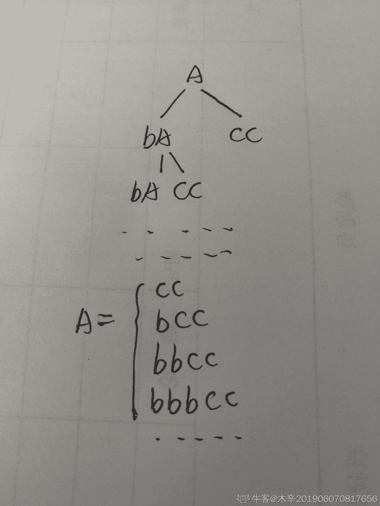
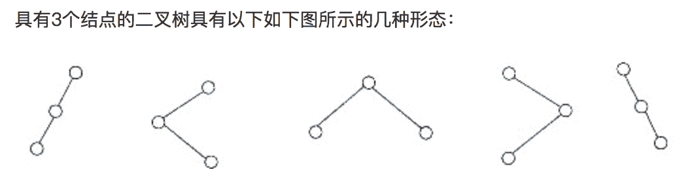

# 快手 2019 年秋季校园招聘笔试试卷—游戏研发 A 试卷

## 1

 当内网内没有条件建立 dns 服务器，又不想用 IP 访问网站，应配置什么文件 

正确答案: A   你的答案: 空 (错误)

```cpp
hosts
```

```cpp
sysconfig
```

```cpp
network
```

```cpp
hostname
```

本题知识点

Java 工程师 C++工程师 快手 游戏研发工程师 快手 2019

讨论

[木千罗](https://www.nowcoder.com/profile/9090671)

hosts 文件有 ip 到 hostname 的映射

发表于 2020-03-13 17:22:01

* * *

## 2

```cpp
一个顺序表的第一个元素的存储地址是 90，每个元素的长度为 2，则第 6 个元素的存储地址是
```

正确答案: B   你的答案: 空 (错误)

```cpp
98
```

```cpp
100
```

```cpp
102
```

```cpp
106
```

本题知识点

Java 工程师 C++工程师 快手 游戏研发工程师 2019

## 3

```cpp
书架上有 19 本书，编号分别 1-19，选取 5 本，其中任意两本不相邻的的取法有多少?
```

正确答案: B   你的答案: 空 (错误)

```cpp
2002
```

```cpp
3003
```

```cpp
11628
```

```cpp
360360
```

本题知识点

Java 工程师 C++工程师 快手 Java 工程师 C++工程师 安卓工程师 iOS 工程师 运维工程师 前端工程师 算法工程师 PHP 工程师 测试工程师 快手 C++工程师 Java 工程师 快手 2019 游戏研发工程师 快手 2019

讨论

[菜鸡想混进大厂](https://www.nowcoder.com/profile/982613837)

插空法 放 14 个数 剩 5 本 有十五个空 C（15,5）=3003

发表于 2018-11-12 21:46:51

* * *

[cb_guo](https://www.nowcoder.com/profile/217980857)

插空法。可以理解为把 5 本书插到 14 本书的中间，即加头尾的 15 个空格里，有多少种组合。因为不能相邻，所以是有 C(15, 5) = 3003 种方法。

发表于 2019-03-30 14:37:19

* * *

[offer 快到碗里来啊！](https://www.nowcoder.com/profile/4725702)

***1***2***3***4***5***6***7***8***9***10***11***12***13***14***

发表于 2019-05-29 21:17:32

* * *

## 4

小明有 26 种游戏海报，用小写字母 "a" 到 "z" 表示。小明会把游戏海报装订成册（可能有重复的海报），册子可以用一个字符串来表示，每个字符就表示对应的海报，例如 abcdea 。小明现在想做一些“特别版”，然后卖掉。特别版就是会从所有海报（26 种）中随机选一张，加入到册子的任意一个位置。那现在小明手里已经有一种海报册子，再插入一张新的海报后，他一共可以组成多少不同的海报册子呢？数据范围：输入的字符串长度满足 

本题知识点

Java 工程师 C++工程师 快手 字符串 *模拟 数学 游戏研发工程师 2019* *讨论

[ElonB](https://www.nowcoder.com/profile/623894)

```cpp
"""
可在 (len(s) + 1)个位置插入 26 字符中的一个，
当插入相同字符时，放在前后只算一个，括号里表示插入的字符
例如 (a)aaa,a(a)aa,aa(a)a,aaa(a)， 原来基础上减 len('aaa')
"""
import sys

if __name__ == "__main__":
    # sys.stdin = open("input.txt", "r")
    s = input().strip()
    ans = (len(s) + 1) * 26 - len(s)
    print(ans)

```

发表于 2019-07-09 13:16:11

* * *

[牛客 89838306 号](https://www.nowcoder.com/profile/89838306)

高中数学的一个应用，插空法，n 个数，形成 n+1 个格子，所有总的有 26 *（n+1）中方法，问题的关键在于怎么找重复的。以 a 为例，在 a 的旁边，每个 a，有 2 种方法（左边插、右边插），但实际只算 1 种，所以对于 a，要减去 a 出现的次数（无论所有的 a 是否相邻！）；以此类推，减去所有字符的出现次数，那就是减去字符串长度了。26*(strlen(s) + 1) - strlen(s)

编辑于 2020-03-09 16:14:48

* * *

[acqierement...](https://www.nowcoder.com/profile/815188947)

对于 a a b 这样的组合，个数我们记为 n，有 n + 1，四个空位可以插入，所有的排列组合就有 26 * (n + 1)种组合。我们再去掉重复的，组合只有一个 b，当插入 b 的时候可以发现两种情况是一样的，所以两次只能算一次，要减掉一次，而组合中有两个 a，插入 a 的时候，四种情况有两次是无效的，要减去两次。所以，不管排列是怎么的，有多少个字符重复，最后都要减去 n。那么最终的结果就是 26 * (n + 1) - n

编辑于 2019-11-26 08:56:49

* * *

## 5

以下代码的输出为（）

```cpp
#include <iostream>
using namespace std;

struct A {
    A() { std::cout << "A"; }
};
struct B {
    B() { std::cout << "B"; }
};

class C {
public:
    C() : a(), b() { std::cout << "C"; }

private:
    B b;
    A a;
};

int main() {
    C();
}

```

正确答案: C   你的答案: 空 (错误)

```cpp
ABC
```

```cpp
CBA
```

```cpp
BAC
```

```cpp
ACB
```

本题知识点

Java 工程师 C++工程师 快手 游戏研发工程师 2019 C++

讨论

[晓之铭](https://www.nowcoder.com/profile/537625741)

结构体的调用顺序是根据类中声明的顺序来的，本题中先 B b， A a，所以先输出 B，然后输出 A,，最后再输出 C

发表于 2021-04-07 08:44:59

* * *

[liuzhen007](https://www.nowcoder.com/profile/873052646)

注意是在该类中的声明顺序，而不是初始化列表的声明顺序。

发表于 2021-03-14 11:46:55

* * *

[ToveRain](https://www.nowcoder.com/profile/868251416)

取决于类中的声明顺序

发表于 2019-10-10 17:08:19

* * *

## 6

请实现一个函数，功能为合并两个升序数组为一个升序数组输入的格式是用逗号隔开的数字。数据范围：输入的字符串长度满足 

本题知识点

Java 工程师 C++工程师 快手 数组 模拟 游戏研发工程师 2019

讨论

[真的很想要一个 offer](https://www.nowcoder.com/profile/415226990)

```cpp
#include <iostream>
#include <vector>
using namespace std;
void transform(string str, vector<int>& vec);
int main(){

    string str1, str2;
    cin >> str1 >> str2;
    if(str1.size() == 0){
        cout << str2 << endl;
        return 0;
    }
    if(str2.size() == 0){
        cout << str1 << endl;
        return 0;
    }
    vector<int> arr1, arr2;
    transform(str1, arr1);
    transform(str2, arr2);
    int i = 0, j = 0;
    vector<int> res;
    while(i < arr1.size() && j < arr2.size()){
        if(arr1[i] < arr2[j]){
            res.push_back(arr1[i]);
            ++i;
        }else{
            res.push_back(arr2[j]);
            ++j;
        }
    }
    while(i < arr1.size()){
        res.push_back(arr1[i]);
        ++i;
    }
    while(j < arr2.size()){
        res.push_back(arr2[j]);
        ++j;
    }
    for(int i = 0; i < res.size() - 1; ++i){
        cout << res[i] << ",";
    }
    cout << res.back() << endl;
    return 0;
}
void transform(string str, vector<int>& vec){
    int temp = 0;
    for(int i = 0; i < str.size(); ++i){
        if(str[i] >= '0' && str[i] <= '9'){
            temp = temp * 10 + str[i] - '0';
        }else{
            vec.push_back(temp);
            temp = 0;
        }
    }
    vec.push_back(temp);
}
```

发表于 2019-07-09 19:11:12

* * *

[tuweilong](https://www.nowcoder.com/profile/334452011)

```cpp
/*
动态规划。
每次比较当前两个数组中最小的元素，更小的放入答案数组中。
细节处理：
要处理只有一行输入的情况。否则会卡 80%，非法访问。
*/
import java.util.*;
public class Main {
    public static void main(String[] args) {
        Scanner in = new Scanner(System.in);
        String s1 = in.nextLine();
        if (!in.hasNext()) {
            System.out.println(s1);
            return;
        }
        String s2 = in.nextLine();
        String[] str1 = s1.split(",");
        String[] str2 = s2.split(",");
        int len1 = str1.length;
        int len2 = str2.length;
        int[] arr1 = new int[len1];
        int[] arr2 = new int[len2];
        for (int i = 0; i < len1; i++) {
            arr1[i] = Integer.parseInt(str1[i]);
        }
        for (int i = 0; i < len2; i++) {
            arr2[i] = Integer.parseInt(str2[i]);
        }
        int[] ans = new int[len1 + len2];
        int loc1 = 0;
        int loc2 = 0;
        int loc = 0;
        for (loc = 0; loc < len1 + len2; loc++) {
            if (loc1 ==len1) {
                ans[loc] = arr2[loc2];
                loc2++;
            } else if (loc2 == len2) {
                ans[loc] = arr1[loc1];
                loc1++;
            } else if (arr1[loc1] < arr2[loc2]) {
                ans[loc] = arr1[loc1];
                loc1++;
            } else {
                ans[loc] = arr2[loc2];
                loc2++;
            }
        }
        for (int i = 0; i < len1 + len2 - 1; i++) {
            System.out.print(ans[i] + ",");
        }
        System.out.println(ans[len1 + len2 - 1]);
    }
}

```

发表于 2019-06-28 15:08:24

* * *

[earthSaver](https://www.nowcoder.com/profile/975145700)

```cpp
#include<iostream>
#include<vector>
#include<string>
#include<sstream>
using namespace std;
void func(vector<int>& nums1,vector<int>& nums2){
    int i=0;
    int j=0;
    int n1 = nums1.size();
    int n2 = nums2.size();
    while(i<n1&&j<n2){
        if(nums1[i]<=nums2[j]){
            cout<<nums1[i++]<<",";
        }else{
            cout<<nums2[j++]<<",";
        }
    }
    while(i<n1){
        cout<<nums1[i];
        if(i!=n1-1){
            cout<<",";
        }
        i++;
    }
    while(j<n2){
        cout<<nums2[j];
        if(j!=n2-1){
            cout<<",";
        }
        j++;
    }
}
int main(){
    string str1,str2;
    //这个 getline 是<string>中的函数，将一行的内容读取到字符串中
    getline(cin,str1);
    getline(cin,str2);
    if(str2.empty()){//如果只有一行，直接输出即可，不用考虑合并
        cout<<str1<<endl;
        return 0;
    }
    vector<int> nums1;
    vector<int> nums2;
    //将里面的逗号全部替换成为空格
    for(int i=0;i<str1.size();i++){
        if(str1[i]==','){
            str1[i]=' ';
        }
    }
    for(int i=0;i<str2.size();i++){
        if(str2[i]==','){
            str2[i]=' ';
        }
    }
    stringstream ss1(str1);
    int temp;
    while(ss1>>temp){
        nums1.push_back(temp);
    }
    stringstream ss2(str2);
    while(ss2>>temp){
        nums2.push_back(temp);
    }
    func(nums1,nums2);
    return 0;
}
```

发表于 2019-10-09 17:24:24

* * *

## 7

在 32 位机器上，下面结构体

```cpp
struct {
    char a; 
    float b; 
    short c; 
    char d
};
```

sizeof 的结果为（）

正确答案: C   你的答案: 空 (错误)

```cpp
16
```

```cpp
8
```

```cpp
12
```

```cpp
10
```

本题知识点

C++工程师 快手 游戏研发工程师 2019 C 语言

讨论

[柯浩](https://www.nowcoder.com/profile/727804497)

32 位机器默认 4 位对齐，起始地址必须位 4 的整数倍，首先是 char 类型的，占一个字节，需放在 1 字节的整数倍位置，任何整数都是 1 的倍数，所以直接存放，然后是 float 类型，占 4 个字节，需放在 4 的整数倍位置，前面 char 只占一个字节，所以需要补三个字节的空位保证 float 放在 4 的整数倍位置，接下来是 short 占两字节，放在 2 的整数倍位置，之前是 float 占了 4 个字节，所以 short 存放的位置是 4 的整数倍也就是 2 的整数倍位置，直接存放，最后是 char，放在 1 的整数倍位置，直接放入，但是 32 位机器 4 位对齐，最终的内存大小必须是 4 的整数倍，所以最后 char 补一字节即（1+3，4，2，1）+1=12

发表于 2021-06-16 15:42:53

* * *

[牛客 431722582 号](https://www.nowcoder.com/profile/431722582)

1+++ 1111 11 1+

编辑于 2020-08-19 08:45:29

* * *

[江边鸟](https://www.nowcoder.com/profile/451872365)

主要涉及内存对齐 char--1，float--4,short--21+4=5，5%1=0，所以不用对齐 5+2=7，7%2=1，所以以 2 为最小公倍数对齐 88+1=9，9%1=0，所以不用对齐。全部算完再以 4 为最小公倍数对齐，所以为 12。好像是这么算的吧

发表于 2019-08-17 18:17:56

* * *

## 8

```cpp
Linux 下 I/O 多路复用机制不包含哪个
```

正确答案: D   你的答案: 空 (错误)

```cpp
select
```

```cpp
poll
```

```cpp
epoll
```

```cpp
pipe
```

本题知识点

Java 工程师 C++工程师 快手 游戏研发工程师 2019

## 9

SQL 语言中删除一个表的指令是

正确答案: A   你的答案: 空 (错误)

```cpp
DROP TABLE
```

```cpp
DELETE TABLE
```

```cpp
DESTROY TABLE
```

```cpp
REMOVE TABLE
```

本题知识点

Java 工程师 C++工程师 快手 游戏研发工程师 快手 2019

## 10

怎样更改一个文件的权限设置？

正确答案: B   你的答案: 空 (错误)

```cpp
attrib
```

```cpp
chmod
```

```cpp
change
```

```cpp
file
```

本题知识点

Java 工程师 C++工程师 快手 游戏研发工程师 快手 2019

讨论

[代码会说话](https://www.nowcoder.com/profile/8532689)

B chmod a+x 表示给所有用户执行权限。 g+w 表示给组用户加写权限。 a：all 表示所有用户 o: other 表示其他用户 g: group 表示组用户 u: user 表示所属用户 +：表示增加权限 -：表示减少权限 =：表示指定具体权限 数字权限具体分解意思。 4:r 2:w 1:x

发表于 2019-04-11 09:48:54

* * *

## 11

安装源代码发布软件包时，在使用./configure 命令配置时，如果需要将软件安装到指定的目录可以使用参数（）

正确答案: A   你的答案: 空 (错误)

```cpp
--prefix
```

```cpp
--directory
```

```cpp
--temporary
```

```cpp
--install
```

本题知识点

Java 工程师 C++工程师 快手 游戏研发工程师 2019

## 12

 (c 语言)初始化数组 char[] strArray="kuai-shou"，strArray 的长度为（） 

正确答案: B   你的答案: 空 (错误)

```cpp
2
```

```cpp
9
```

```cpp
10
```

```cpp
11
```

本题知识点

C++工程师 快手 游戏研发工程师 2019 C 语言

讨论

[奋斗小强吧](https://www.nowcoder.com/profile/324744938)

长度应该是 9，用 strlen 大小才是 10，用 sizeof

发表于 2020-09-11 14:55:27

* * *

[牛客 397079044 号](https://www.nowcoder.com/profile/397079044)

我怎么觉得是 9， sizeof 才应该是 10 吧

编辑于 2020-09-04 20:12:46

* * *

[牛客 102776012 号](https://www.nowcoder.com/profile/102776012)

这个题出的不知道什么意义？

发表于 2022-03-06 10:57:12

* * *

## 13

下面属于非对称加密算法的是

正确答案: C   你的答案: 空 (错误)

```cpp
AES
```

```cpp
DES
```

```cpp
RSA
```

```cpp
MD5
```

本题知识点

Java 工程师 C++工程师 快手 游戏研发工程师 快手 2019

## 14

检测 json 字符串中大括号和中括号是否正确配对，采用哪种数据结构最佳

正确答案: D   你的答案: 空 (错误)

```cpp
线性表的顺序存储结构
```

```cpp
线性表的链式存储结构
```

```cpp
队列
```

```cpp
栈
```

本题知识点

Java 工程师 C++工程师 快手 游戏研发工程师 2019

## 15

以下不能实现交换数字类型变量 a,b 的代码是(不考虑溢出): ()

正确答案: B   你的答案: 空 (错误)

```cpp
a^=b; b^=a;a^=b;
```

```cpp
a=c;c=b;b=a;
```

```cpp
a+=b;b=a-b;a=a-b;
```

```cpp
a=a*b;b=a/b;a=a/b;
```

本题知识点

Java 工程师 C++工程师 快手 安卓工程师 iOS 工程师 运维工程师 前端工程师 算法工程师 PHP 工程师 测试工程师 常识判断 2019 游戏研发工程师

讨论

[ID84848484](https://www.nowcoder.com/profile/8484574)

D:如果 a 是 0 呢？

发表于 2019-03-23 18:17:15

* * *

[菜鸡想混进大厂](https://www.nowcoder.com/profile/982613837)

b 选项 直接覆盖了 a 的值，所有数字都没用了 a 的特征

发表于 2018-11-12 21:47:58

* * *

[斗魂 12138](https://www.nowcoder.com/profile/5704039)

我在想 D，万一除数为 0 呢？

发表于 2019-05-20 19:16:53

* * *

## 16

以下不属于应用层协议的是:

正确答案: D   你的答案: 空 (错误)

```cpp
FTP
```

```cpp
DNS
```

```cpp
SSH
```

```cpp
ICMP
```

本题知识点

Java 工程师 C++工程师 快手 Java 工程师 C++工程师 安卓工程师 iOS 工程师 运维工程师 前端工程师 算法工程师 PHP 工程师 测试工程师 快手 C++工程师 Java 工程师 快手 2019 游戏研发工程师 快手 2019

讨论

[mengban](https://www.nowcoder.com/profile/532649401)

**互联网控制消息协议**（英语：**I**nternet **C**ontrol **M**essage **P**rotocol，缩写：**ICMP**）是互联网协议族的核心协议之一。它用于[TCP/IP](https://zh.wikipedia.org/wiki/TCP/IP)网络中发送控制消息，提供可能发生在通信环境中的各种问题反馈，通过这些信息，使管理者可以对所发生的问题作出诊断，然后采取适当的措施解决。

发表于 2018-11-12 22:02:03

* * *

[王治全](https://www.nowcoder.com/profile/345829746)

常见的应用层协议：

1.DNS 域名系统：网络设备名字转为 IP 地址。

2.FTP 文本传输协议：提供交互式访问，允许客户指明文件类型与格式，允许文件具有存取权限。

3.telnet 远程终端协议。

4.HTTP 超文本传输协议：面向事务的协议，使用面向连接 TCP 作为传输层协议。保证数据可靠传输。

5.SMTP：电子邮件协议，规定了两个相互通信的 SMTP 进程之间如何交换信息

6.POP3:邮件读取协议，接收电子邮件

7.SSH：安全协议

发表于 2019-09-03 13:36:47

* * *

[justorez](https://www.nowcoder.com/profile/8156663)

ICMP 协议是 IP 层的附属协议，属于网络层

发表于 2019-03-30 16:31:56

* * *

## 17

若所有作业同时到达，则平均等待时间最长的调度算法是:

正确答案: A   你的答案: 空 (错误)

```cpp
长作业优先
```

```cpp
先来先服务
```

```cpp
短作业优先
```

```cpp
优先级
```

本题知识点

Java 工程师 C++工程师 快手 安卓工程师 iOS 工程师 运维工程师 前端工程师 算法工程师 PHP 工程师 测试工程师 常识判断 2019 游戏研发工程师

讨论

[梦中的弗莱迪](https://www.nowcoder.com/profile/80297399)

长作业需要的时间久，后面需要等待的时间就越久，平均时间就越久

发表于 2018-11-25 22:12:42

* * *

[月城大人-offer 加一](https://www.nowcoder.com/profile/149660513)

长作业等待时间更长，所以应该先做，这个期间可以做别的

发表于 2020-03-02 20:29:41

* * *

## 18

我们定义字符串包含关系：字符串 A=abc ，字符串 B=ab ，字符串 C=ac ，则说 A 包含 B ， A 和 C 没有包含关系。数据范围：输入的字符串长度满足 

本题知识点

Java 工程师 C++工程师 快手 字符串 *模拟 游戏研发工程师 2019* *讨论

[谁的电脑](https://www.nowcoder.com/profile/743368)

```cpp
import java.util.*;

public class Main {
    public static void main(String[] args) {
        Scanner scanner = new Scanner(System.in);
        while (scanner.hasNext()) {
            String str1 = scanner.next();
            String str2 = scanner.next();
            System.out.println((str1.contains(str2) || str2.contains(str1)) ? 1 : 0);
        }
    }
}
```

编辑于 2019-07-02 11:00:13

* * *

[真的很想要一个 offer](https://www.nowcoder.com/profile/415226990)

```cpp
#include <iostream>
#include <vector>
using namespace std;
void getNext(string str, vector<int>& next);
int kmp(string str1, string str2);
int main(){

    string str1, str2;
    while(cin >> str1 >> str2){
        if(kmp(str2, str1) != -1 || kmp(str1, str2) != -1 ){
            cout << "1" << endl;
        }else{
            cout << "0" << endl;
        }
    }

    return 0;
}
void getNext(string str, vector<int>& next){
    int n = str.size();
    next[0] = -1;
    next[1] = 0;
    int cn = 0;
    int i = 2;
    while(i < next.size()){
        if(str[i - 1] == str[cn]){
            next[i++] = ++cn;
        }else if(cn > 0){
            cn = next[cn];
        }else{
            next[i++] = 0;
        }
    }
}
int kmp(string str1, string str2){

    int n = str1.size();
    vector<int> next(n, -1);
    getNext(str1, next);
    int i1 = 0, i2 = 0;
    while(i1 < str1.size() && i2 <= str2.size()){
        if(str1[i1] == str2[i2]){
            ++i1, ++i2;
        }else if(i1 == 0){
            ++i2;
        }else{
            i1 = next[i1];
        }
    }
    return i1 == str1.size() ? i2 - i1 : -1;
}
```

发表于 2019-07-09 19:16:41

* * *

[lentolove](https://www.nowcoder.com/profile/572586026)

```cpp
import java.io.BufferedReader;
import java.io.IOException;
import java.io.InputStreamReader;

public class Main {

    public static void main(String[] args) throws IOException {
        BufferedReader bf = new BufferedReader(new InputStreamReader(System.in));
        String str;
        //只要较长的字符串能包含较短的字符串就行
        while ((str = bf.readLine()) != null) {
            String[] s = str.split(" ");
            System.out.println((s[0].length() > s[1].length() ? s[0].contains(s[1]) : s[1].contains(s[0])) ? 1 : 0);
        }
    }
}

```

发表于 2019-08-05 09:35:20

* * *

## 19

设指针 q 指向单链表中结点 A，指针 p 指向单链表中结点 A 的后继结点 B，指针 s 指向被插入的结点 X，则在结点 A 和结点 B 插入结点 X 的操作序列为（  ）

正确答案: C   你的答案: 空 (错误)

```cpp
s-&gt;next=p-&gt;next；p-&gt;next=s;
```

```cpp
p-&gt;next=s-&gt;next；s-&gt;next=p；
```

```cpp
q-&gt;next=s； s-&gt;next=p;
```

```cpp
p-&gt;next=s；s-&gt;next=q;
```

本题知识点

Java 工程师 C++工程师 快手 Java 工程师 C++工程师 安卓工程师 iOS 工程师 运维工程师 前端工程师 算法工程师 PHP 工程师 测试工程师 快手 C++工程师 Java 工程师 快手 2019 游戏研发工程师 快手 2019

讨论

[速来 offer](https://www.nowcoder.com/profile/3987069)

应该选 a 吧

发表于 2019-09-16 15:38:26

* * *

[Kumori](https://www.nowcoder.com/profile/6270434)

```cpp
q.next=s； s.next=p;
```

发表于 2018-12-11 17:25:17

* * *

[justorez](https://www.nowcoder.com/profile/8156663)

这道题描述是不是有问题，应该是“在结点 A 和结点 B 之间插入结点 X”吧，看半天没看懂是谁往哪插。。。

发表于 2019-03-30 16:34:33

* * *

## 20

 给定文法 A→bA|cc，则符号串①cc ②bcbc ③bcbcc ④bccbcc ⑤bbbcc 中，是该文法句子的是()

正确答案: B   你的答案: 空 (错误)

```cpp
①③⑤
```

```cpp
①⑤
```

```cpp
②④
```

```cpp
③⑤
```

本题知识点

Java 工程师 C++工程师 快手 安卓工程师 iOS 工程师 运维工程师 前端工程师 算法工程师 PHP 工程师 测试工程师 常识判断 2019 游戏研发工程师

讨论

[zwillwang](https://www.nowcoder.com/profile/937969538)



发表于 2020-03-13 10:22:14

* * *

[Jun_Wang](https://www.nowcoder.com/profile/872513103)

这答案有事吗？没学过计算机的谁知道 A→bA|cc 意思是 A 可以变成 bA 或者 cc 啊，你用中文讲会死啊！

发表于 2020-11-24 23:19:13

* * *

[牛客 926432834 号](https://www.nowcoder.com/profile/926432834)

这是常识？？？？？

发表于 2020-08-28 17:58:07

* * *

## 21

有关下述 Java 代码描述正确的选项是（ ）

```cpp
public class TestClass {
private static void testMethod() {
    System.out.println("testMethod");
}
public static void main(String[] args) {
    ((TestClass)null).testMethod();
}}
```

正确答案: B   你的答案: 空 (错误)

```cpp
编译不通过
```

```cpp
运行正常，输出 testMethod
```

```cpp
编译通过，运行异常，报 NullPointerException
```

```cpp
编译通过，运行异常，报 NoSuchMethodException
```

本题知识点

Java 工程师 C++工程师 快手 常识判断 游戏研发工程师 2019

讨论

[牛客 870420206 号](https://www.nowcoder.com/profile/870420206)

**null 可以被强制类型转换成任意类型的对象，通过这样的方式可以执行对象的静态方法，但如果方法不是静态方法的话，由于 null 对象并没有被实例化（分配空间），因而运行时会报空指针错误。**

发表于 2020-09-08 16:32:06

* * *

[矜贵](https://www.nowcoder.com/profile/960360912)

这个是怎么做啊

发表于 2019-11-15 00:45:50

* * *

[无名的牛客](https://www.nowcoder.com/profile/300533293)

非技术岗给我来代码？

发表于 2022-01-21 09:32:43

* * *

## 22

以下代码输出的是()?int foo(int x,int y) {if(x<=0||y<=0) return  1;return  3*foo(x-1,y/2);}cout<<foo(666,5)<<endl;

正确答案: A   你的答案: 空 (错误)

```cpp
27
```

```cpp
666
```

```cpp
81
```

```cpp
9
```

本题知识点

Java 工程师 C++工程师 快手 安卓工程师 iOS 工程师 运维工程师 前端工程师 算法工程师 PHP 工程师 测试工程师 常识判断 2019 游戏研发工程师

讨论

[千幻 201809150945567](https://www.nowcoder.com/profile/280877806)

递归，if 中逻辑运算来判断结束，每一次进入，如果 y 小于等于 0 就跳出递归函数，轮了三次，3*3*3*1=27

发表于 2018-11-06 17:00:49

* * *

[无名的牛客](https://www.nowcoder.com/profile/300533293)

我职能岗给我代码题？？？😭

发表于 2022-01-11 07:51:16

* * *

[姜幼颜](https://www.nowcoder.com/profile/125284324)

```cpp
int foo(int x,int y) { 
  if(x<=0||y<=0) return 1; 
  return 3*foo(x-1,y/2);
} 
cout<<foo(666,5)<<endl;
```

第一次：x= 666 ,y = 5 ,不满足 if 条件，第三行调用：3 * foo（666-1 , 5/2）第二次：x= 665 ,y = 2.5，不满足 if 条件，第三行再次调用： 3 * foo（665-1 , 2.5/2）第三次：x= 664 ,y = 1.25，不满足 if 条件，第三行再次调用： 3 * foo（664-1 , 1.25/2）此时已经 有 3 次 * 3，第四次：x= 663 ,y = 0.625，满足 if 条件，return 1，则结果为 3 * 3 * 3 * 1 = 27。

发表于 2022-01-10 11:28:23

* * *

## 23

一个 IP 报文，在网络上传输，原地址和目的地址会变吗？

正确答案: C   你的答案: 空 (错误)

```cpp
会变
```

```cpp
不会变
```

```cpp
可能会变也可能不会变
```

```cpp
不知道
```

本题知识点

Java 工程师 C++工程师 快手 安卓工程师 iOS 工程师 运维工程师 前端工程师 算法工程师 PHP 工程师 测试工程师 2019 游戏研发工程师

讨论

[Kumori](https://www.nowcoder.com/profile/6270434)

如果目的地址经路由表对比，发现不是在本网中，nat 将改变源地址的 IP 改为路由器的 IP 地址

发表于 2018-12-11 17:38:06

* * *

## 24

同一个 Linux 机器的两个进程访问同一块共享内存，他们访问共享内存中的同一个对象的时候，指针相同吗？

正确答案: C   你的答案: 空 (错误)

```cpp
相同
```

```cpp
不通
```

```cpp
可能相同也可能不通
```

```cpp
不知道
```

本题知识点

Java 工程师 C++工程师 快手 安卓工程师 iOS 工程师 运维工程师 前端工程师 算法工程师 PHP 工程师 测试工程师 2019 游戏研发工程师

讨论

[stitchohana](https://www.nowcoder.com/profile/633997609)

物理地址相同 但逻辑地址可能相同也可能不同

发表于 2019-09-16 17:55:28

* * *

[就是牛！](https://www.nowcoder.com/profile/381017)

应该没有人会选 D 吧？

发表于 2019-11-21 10:10:25

* * *

[牛客 UESTC](https://www.nowcoder.com/profile/920657460)

指针说的是虚拟内存，可以指向不同的虚拟内存地址，但是映射的同一块物理内存。因此物理地址相同 但逻辑地址可能相同也可能不同。

发表于 2022-03-17 15:46:22

* * *

## 25

10 个小朋友做游戏，分成四组，每组人数分别为 2，2，3，3，请问有几种分组方法

正确答案: C   你的答案: 空 (错误)

```cpp
6100
```

```cpp
6200
```

```cpp
6300
```

```cpp
6400
```

本题知识点

Java 工程师 C++工程师 快手 安卓工程师 iOS 工程师 运维工程师 前端工程师 算法工程师 PHP 工程师 测试工程师 2019 游戏研发工程师

讨论

[bioamin](https://www.nowcoder.com/profile/7586996)

C(10,2)*C(8,2)*C(6,3)*C(3,3)*/A(2,2)*A(2,2)

编辑于 2018-11-12 08:55:34

* * *

[呐呐呐呐呐呐 201812111136406](https://www.nowcoder.com/profile/998502532)

有两个 2 人和 4 人的组，每个 0.5 的概率。

发表于 2019-03-30 14:28:09

* * *

[NNN_ 梦月](https://www.nowcoder.com/profile/271917396)

为什么要除以 4

发表于 2019-03-30 12:48:04

* * *

## 26

不通过 CPU 进行主存与 I/O 设备间大量的信息交换方式，可以是什么方式。

正确答案: B   你的答案: 空 (错误)

```cpp
中断
```

```cpp
DMA
```

```cpp
查询等待
```

```cpp
程序控制
```

本题知识点

Java 工程师 C++工程师 快手 安卓工程师 iOS 工程师 运维工程师 前端工程师 算法工程师 PHP 工程师 测试工程师 2019 游戏研发工程师

讨论

[kasar](https://www.nowcoder.com/profile/69479540)

DMA(Direct Memory Access，直接内存存取) 是所有现代电脑的重要特色，它允许不同速度的硬件装置来沟通，而不需要依赖于 CPU 的大量中断负载。

发表于 2018-11-07 17:12:28

* * *

[adfsgkkjkj](https://www.nowcoder.com/profile/45414351)

DMA(Direct Memory Access，直接内存存取) 是所有现代电脑的重要特色，它允许不同速度的硬件装置来沟通，而不需要依赖于 CPU 的大量中断负载。否则，CPU 需要从来源把每一片段的资料复制到[暂存器](https://baike.baidu.com/item/%E6%9A%82%E5%AD%98%E5%99%A8/4308343)，然后把它们再次写回到新的地方。在这个时间中，CPU 对于其他的工作来说就无法使用。

发表于 2019-03-29 20:40:04

* * *

## 27

在源代码程序编译过程中第一个阶段是什么

正确答案: C   你的答案: 空 (错误)

```cpp
语法分析
```

```cpp
语义分析
```

```cpp
词法分析
```

```cpp
代码优化
```

本题知识点

Java 工程师 C++工程师 快手 安卓工程师 iOS 工程师 运维工程师 前端工程师 算法工程师 PHP 工程师 测试工程师 2019 游戏研发工程师

讨论

[Kumori](https://www.nowcoder.com/profile/6270434)

顺序是 词法分析 语法分析 语义分析 中间代码生成 中间代码优化 目标代码生成

发表于 2018-12-11 17:46:00

* * *

[牛客 586594274](https://www.nowcoder.com/profile/586594274)

先看你文件后缀是否跟你要编译语言是否一致

发表于 2018-12-03 23:26:44

* * *

## 28

一根木棍截成三段，组成三角形的概率是多少？

正确答案: B   你的答案: 空 (错误)

```cpp
1 / 2
```

```cpp
1 / 4
```

```cpp
1 / 8
```

```cpp
1 / 16
```

本题知识点

快手 C++工程师 Java 工程师 2019 游戏研发工程师

讨论

[菜鸡想混进大厂](https://www.nowcoder.com/profile/982613837)


发表于 2018-11-12 21:33:57

* * *

[sw114514](https://www.nowcoder.com/profile/146782780)

简单的想法：第一锯两种情况，锯中间和不锯中间，各 1/2，不能锯中间否则第二刀无论怎么锯都构不成三角形；第二锯可以锯长的亦可以锯短，各 1/2，但只能锯长的那一根，否则也构不成三角形，所以是 1/4。

发表于 2019-03-30 00:14:22

* * *

[changwan](https://www.nowcoder.com/profile/836513398)

1.三角形两边之和大于第三边。 2.一根棍子锯两次就够了。

发表于 2018-11-08 00:27:15

* * *

## 29

两个人轮流掷（6 面）骰子，先掷出 6 的人获胜，先手者获胜的概率是多少？

正确答案: D   你的答案: 空 (错误)

```cpp
3 / 7
```

```cpp
6 / 13
```

```cpp
1 / 2
```

```cpp
6 / 11
```

本题知识点

Java 工程师 C++工程师 快手 安卓工程师 iOS 工程师 运维工程师 前端工程师 算法工程师 PHP 工程师 测试工程师 2019 游戏研发工程师

讨论

[aufwieder](https://www.nowcoder.com/profile/5999540)

本题是个条件概率的问题，在决出胜负的情况下，先手胜的概率是多大？
针对这道题的选项，如果在面试中遇到，直接选概率大于 1/2 的就行了

发表于 2018-11-08 15:44:19

* * *

[Herostarer](https://www.nowcoder.com/profile/595457495)

这题挺有意思，咋一看很精练很简单，其实有无穷多种情况。因为他每一次都有可能获胜。第一次获胜的概率是 1/6，第二次获胜的概率就是(1-1/6)*（1-1/6）*1/6（这里是因为第一次自己没有获胜，且别人也没有获胜的情况下，在第二种获胜的概率）,第三次获胜的概率就是(1-1/6)*（1-1/6）*(1-1/6)*（1-1/6）*1/6，依次类推，第*n*次获胜的概率是(1-1/6)*（1-1/6）^(*n-*1) *1/6，如前所述，获胜的概率就是 1/6+(1-1/6)*（1-1/6）*1/6+(1-1/6)*（1-1/6）*(1-1/6)*（1-1/6）*1/6+...+[(1-1/6)*（1-1/6）]^(*n-*1) *1/6=1/6（1+25/36+（25/36）²+...+(25/36)^(*n*-1)）=1/6(1-(25/36)^(*n*-1)) / (1-25/36)=1/6*36/11

编辑于 2018-11-08 12:02:14

* * *

## 30

现在有 7 位编码为 1010101,在其最高位之前增加一位偶校检位,则编码为

正确答案: B   你的答案: 空 (错误)

```cpp
1 1010101
```

```cpp
0 1010101
```

```cpp
1 0101010
```

```cpp
0 1010111
```

本题知识点

Java 工程师 C++工程师 运维工程师 快手 2019 游戏研发工程师

讨论

[CoralRed](https://www.nowcoder.com/profile/1482531)

奇偶校验位有两种类型：**偶校验位**与**奇校验位**。

以**偶校验位**来说，如果一组给定数据位中 1 的个数是奇数，补一个 bit 为 1，使得总的 1 的个数是偶数。例：0000001, 补一个 bit 为 1, 0000001**1。**

以**奇校验位**来说，如果给定一组数据位中 1 的个数是奇数，补一个 bit 为 0，使得总的 1 的个数是奇数。例：0000001, 补一个 bit 为 0, 0000001**0。****此题为最高位偶校检位，所以在最高为补 0，答案是 B**

发表于 2019-03-30 16:52:57

* * *

[菜鸡想混进大厂](https://www.nowcoder.com/profile/982613837)

偶校验是让编码中有偶数个 1，如果本有偶数个 1 则加 0，本有奇数个 1 则加 1？？？？？？   不知道对不对

发表于 2018-11-12 21:59:31

* * *

[c++爱上 java](https://www.nowcoder.com/profile/9128621)

偶校验的编码方法是在信息数据中添加 1 个二进制位，使得整个信息数据的二进制位中，1 的个数为偶数。所以选 B

发表于 2018-11-14 09:17:22

* * *

## 31

路由器会根据下面那一种协议的包头信息来转发数据包

正确答案: C   你的答案: 空 (错误)

```cpp
TCP
```

```cpp
UDP
```

```cpp
IP
```

```cpp
HTTP
```

本题知识点

Java 工程师 C++工程师 快手 安卓工程师 iOS 工程师 运维工程师 前端工程师 算法工程师 PHP 工程师 测试工程师 2019 游戏研发工程师

讨论

[zhongliwen](https://www.nowcoder.com/profile/2605138)

路由器属于网络层器件，跟 IP 协议有关 TCP，UDP 为传输层协议 HTTP 为应用层协议

发表于 2019-02-25 18:19:53

* * *

## 32

操作系统中，当 ___，进程从执行状态转为就绪态。

正确答案: B   你的答案: 空 (错误)

```cpp
进程被进程调度程序选中
```

```cpp
时间片用完
```

```cpp
等待某一事件发生
```

```cpp
等待的事件发生
```

本题知识点

Java 工程师 C++工程师 快手 安卓工程师 iOS 工程师 运维工程师 前端工程师 算法工程师 PHP 工程师 测试工程师 2019 游戏研发工程师

讨论

[Alex1996](https://www.nowcoder.com/profile/9137638)

进程三种状态间的转换

①就绪→执行处于就绪状态的进程，当进程调度程序为之分配了处理机后，该进程便由就绪状态转变成执行状态。 
②执行→就绪处于执行状态的进程在其执行过程中，因分配给它的一个时间片已用完而不得不让出处理机，于是进程从执行状态转变成就绪状态。 
③执行→阻塞正在执行的进程因等待某种事件发生而无法继续执行时，便从执行状态变成阻塞状态。 

④阻塞→就绪处于阻塞状态的进程，若其等待的事件已经发生，于是进程由阻塞状态转变为就绪状态来源 ：[`blog.csdn.net/github_40094105/article/details/78057622`](https://blog.csdn.net/github_40094105/article/details/78057622)

发表于 2018-11-09 10:33:35

* * *

[抿一口可乐](https://www.nowcoder.com/profile/36664449)

B

发表于 2019-11-26 14:30:14

* * *

[爱上兔子的熊](https://www.nowcoder.com/profile/994896800)

发表于 2019-03-29 21:22:08

* * *

## 33

虚拟存储器的最大容量是由什么决定的？

正确答案: B   你的答案: 空 (错误)

```cpp
内、外存容量之和
```

```cpp
操作系统的地址结构
```

```cpp
作业的相对地址空间
```

```cpp
作业的绝对地址空间
```

本题知识点

Java 工程师 C++工程师 快手 安卓工程师 iOS 工程师 运维工程师 前端工程师 算法工程师 PHP 工程师 测试工程师 2019 游戏研发工程师

讨论

[Alex1996](https://www.nowcoder.com/profile/9137638)

这题答案并不严谨，虚拟存储器的最大容量 = min(内存+外存，2^n)。n 为计算机的地址总线位数 虚拟存储器， 是指具有请求调入功能和置换功能， 能从逻辑上对内存容量加以扩充的一种存储器系统。 ***其逻辑容量由内存容量和外存容量之和所决定*** ，其运行速度接近于内存速度，而每位的成本却又接近于外存。可见，虚拟存储技术是一种性能非常优越的存储器管理技术，故被广泛地应用于大、 中、 小型机器和微型机中。 

发表于 2018-11-09 10:31:17

* * *

[adfsgkkjkj](https://www.nowcoder.com/profile/45414351)

虚拟存储器：通俗的说就是为在内存空间中运行超过内存容量的作业，操作系统把当前使用的部分留在内存，而把其他部分保存在磁盘，在需要时在内存和磁盘之间进行动态交换。虚拟存储器的大小由计算机地址结构决定：地址寄存器能决定主存的访问范围，所以即使磁盘再大，但是地址寄存器访问主存的范围很小的话，虚拟存储的容量依然很小。

发表于 2019-03-29 21:21:43

* * *

[Kumori](https://www.nowcoder.com/profile/6270434)

容量为计算机地址寄存器的位数的 n 次方，通常远小于外存。区别与虚拟地址空间为处理器位数的 n 次方。

编辑于 2018-12-11 19:19:10

* * *

## 34

设 n 元齐次线性方程组 Ax = 0 的系数矩阵 A 的秩为 r，则 Ax = 0 有非零解的充分必要条件是

正确答案: D   你的答案: 空 (错误)

```cpp
r = n
```

```cpp
r &gt; n
```

```cpp
r &lt;= n
```

```cpp
r &lt; n
```

本题知识点

Java 工程师 C++工程师 快手 游戏研发工程师 2019

## 35

反复投掷一个均匀的硬币直到正面向上为止，则期望投掷次数为

正确答案: B   你的答案: 空 (错误)

```cpp
1
```

```cpp
2
```

```cpp
3
```

```cpp
2.5
```

本题知识点

Java 工程师 C++工程师 快手 安卓工程师 iOS 工程师 运维工程师 前端工程师 算法工程师 PHP 工程师 测试工程师 2019 游戏研发工程师

讨论

[Kumori](https://www.nowcoder.com/profile/6270434)

1/2+2*1/4+3*1/8+···+n*1/(2^n)=(1/2+1/4+1/8+···+1/(2^n))+(1/2)(1/2+1/4+1/8+···+1/(2^n))+(1/4)(1/2+1/4+1/8+···+1/(2^n))+(1/n²)(1/2+1/4+1/8+···+1/(2^n))=1+1/2+1/4+···+1/(2^n)=2 实在不行算几项也知道结果趋近于 2 了。

发表于 2018-12-11 18:12:33

* * *

[江边鸟](https://www.nowcoder.com/profile/451872365)

投掷硬币正面朝上的期望概率是 1/2，所以期望次数为 1/（1/2）=2（想当然😏）

发表于 2019-08-17 18:41:15

* * *

## 36

月神特别喜欢吃月饼，中秋节时快手发了 10 个月饼，已知月神一天至少吃一个月饼；请问，月神在 3 天内将 10 个月饼全部吃完的概率为：

正确答案: B   你的答案: 空 (错误)

```cpp
1/4
```

```cpp
23/256
```

```cpp
13/128
```

```cpp
3/32
```

本题知识点

算法工程师 快手 Java 工程师 C++工程师 安卓工程师 iOS 工程师 运维工程师 前端工程师 PHP 工程师 测试工程师 2019 游戏研发工程师

讨论

[岁荣](https://www.nowcoder.com/profile/3071559)

采用插板法，10 个月饼排成一行，如果在 2 天内吃完，就在里面插入一个板子，所以是 C91,所以就应该是(C90+C91+C92)/(C90+C91+C92+C93+C94+C95+.....+C99)

发表于 2019-04-12 11:03:12

* * *

[Herostarer](https://www.nowcoder.com/profile/595457495)

首先，一般概率有两种思路，第一种是算概率乘积，这个题的第一种思路我没有想出来，感觉很难入手。那么第二种思路就是算多少种可能性（即 3 天吃完的所有可能次数除以不限制时间吃完的总次数）。先算出 3 天吃完的所有可能次数。第一天是很好算是*C⁰[9，]*第二天吃完的次数是*C¹[9]*，第三天吃完的次数是*C²[9]*。现在再来算总次数，第一天是很好算是*C⁰[9，]*第二天吃完的次数是*C¹[9]*，第三天吃完的次数是*C²[9]*，第四天是*C³[9]*，依次类推，直到第十天是*C⁹[9]*因此 3 天内吃完月饼的概率就是（*C⁰[9 ]+*C¹[9]**+*C²[9]***）/（*C⁰[9 ]+*C¹[9]**+*C²[9]****+*C³[9]**+*C⁴[9]****+*C⁵[9]**+*C⁶[9]****+*C⁷[9]**+*C⁸[9]*****+*C⁹[9]***）=46/2^(9 ) =46/512

发表于 2018-11-08 11:34:20

* * *

[offer 快到碗里来啊！](https://www.nowcoder.com/profile/4725702)

1 天吃完: 将 10 个月饼分成 1 堆 10 天吃完:将 10 个月饼分成 10 堆注意三天内吃完就可能是一天(一堆)/两天(两堆)/三天(三堆)吃完!

发表于 2019-05-29 21:27:08

* * *

## 37

计算机中存储一个数是以二进制形式存储的，那么-7 的补码是

正确答案: B   你的答案: 空 (错误)

```cpp
11111001
```

```cpp
11111010
```

```cpp
10000111
```

```cpp
10001001
```

本题知识点

Java 工程师 C++工程师 快手 测试工程师 2019 游戏研发工程师

讨论

[不会 CRUD 的 boy(已毕业)](https://www.nowcoder.com/profile/3018058)

原码 10000111 反码  11111000 补码 （加一）11111001 选 A

发表于 2018-11-29 19:28:23

* * *

[申金鑫](https://www.nowcoder.com/profile/7543696)

负数的补码应该是原码除第一位外取反再加一，所以应该选 A

发表于 2019-06-30 00:49:31

* * *

[冯浩雄和他的 QQ](https://www.nowcoder.com/profile/319548931)

不应该是 1001 吗

发表于 2018-11-06 17:47:32

* * *

## 38

C 语言中，若有定义: int a=8,b=5,c;  ,执行语句 c=a/b+0.4;后，c 的值是（）

正确答案: B   你的答案: 空 (错误)

```cpp
1.4
```

```cpp
1
```

```cpp
2.0
```

```cpp
2
```

本题知识点

C++工程师 快手 测试工程师 2019 游戏研发工程师 C 语言

讨论

[恩！就这！](https://www.nowcoder.com/profile/407649038)

在 c 程序中没有四佘五入一说，就算 0.9 如果是 int 型也不会进 1

发表于 2020-12-11 15:33:02

* * *

[是风儿呀](https://www.nowcoder.com/profile/120968686)

b

发表于 2020-06-10 23:38:51

* * *

[hao_wang](https://www.nowcoder.com/profile/804156673)

a/b=1  +0.4 后还是 int 类型 1

发表于 2019-11-05 13:12:03

* * *

## 39

静态变量通常存储在进程哪个区？

正确答案: D   你的答案: 空 (错误)

```cpp
栈区
```

```cpp
堆区
```

```cpp
代码区
```

```cpp
全局区
```

本题知识点

Java 工程师 C++工程师 快手 测试工程师 快手 测试工程师 快手 2019 游戏研发工程师 快手 2019

讨论

[雪豹 2017](https://www.nowcoder.com/profile/285044524)

c++程序内存布局： 1)全局区（静态区）（static）存放全局变量、静态数据，const 常量。程序结束后有系统释放 2)栈区（stack） 函数运行时分配，函数结束时释放。由编译器自动分配释放 ，存放为运行函数而分配的局部变量、函数参数、返回数据、返回地址等。其操作方式类似于数据结构中的栈。 3)堆区（heap） 一般由程序员分配释放， 若程序员不释放，程序结束时可能由 OS（操作系统）回收。分配方式类似于链表。 4)文字常量区 常量字符串就是放在这里的。 程序结束后由系统释放。 5)程序代码区存放函数体（类成员函数和全局函数）的二进制代码。

发表于 2019-03-30 00:16:10

* * *

## 40

Python 不支持的数据类型有

正确答案: A   你的答案: 空 (错误)

```cpp
char
```

```cpp
int
```

```cpp
float
```

```cpp
list
```

本题知识点

Java 工程师 C++工程师 快手 测试工程师 快手 测试工程师 快手 2019 游戏研发工程师 快手 2019

讨论

[ZHAOSHUYA](https://www.nowcoder.com/profile/704089044)

正确答案：APython 没有 char 或 byte 类型来保存单一字符或 8 比特整数。你可以使用长度为 1 的字符串表示字符或 8 比特整数。 

发表于 2019-04-25 17:24:33

* * *

[踩在浪花上 114](https://www.nowcoder.com/profile/729436662)

```cpp
char 不是 python 的数据类型，mysql 用到过这个
```

发表于 2019-04-24 17:54:04

* * *

## 41

有正则表达式\w+([-.]\w+)*@\w+([-.]\w+)+，以下不能成功匹配的是：

正确答案: C   你的答案: 空 (错误)

```cpp
zhangsan_01@kuaishou.com
```

```cpp
zhangsan@live-kuaishou.com
```

```cpp
zhangsan01.bj@kuaishou
```

```cpp
zhangsan@kuaishou.com
```

本题知识点

Java 工程师 C++工程师 快手 测试工程师 2019 游戏研发工程师

讨论

[WEBJ2EE](https://www.nowcoder.com/profile/3930151)

\w+([-.]\w+)*@***\w+([-.]\w+)+***    先看后面，N 个字符后，必须跟着一个或多个子域         @xxxxxx-xxxxx         @yyyyyy.yyyyy 所以 C，没有子域的，不满足题意。

发表于 2019-12-14 11:18:46

* * *

## 42

在实现基于 TCP 的网络应用程序时，服务器端正确的处理流程是（）

正确答案: C   你的答案: 空 (错误)

```cpp
socket() -&gt; bind() -&gt; listen() -&gt; connect() -&gt; read()/write() -&gt; close()
```

```cpp
socket() -&gt; bind() -&gt; listen() -&gt; read()/write() -&gt; close()
```

```cpp
socket() -&gt; bind() -&gt; listen() -&gt; accept() -&gt; read()/write() -&gt; close()
```

```cpp
socket() -&gt; connect() -&gt; read()/write() -&gt; close()
```

本题知识点

Java 工程师 C++工程师 快手 测试工程师 2019 游戏研发工程师

讨论

[201904231924340](https://www.nowcoder.com/profile/321569537)

基于 TCP(面向连接的)socket 编程的服务器端程序流程如下：
1.创建套接字（socket）.
2.将套接字绑定到一个本地地址和端口上（bind）。
3.将套接字设为监听模式，准备接收客户请求（listen）.
4.等待客户请求到来；当请求到来后，接受连接请求，反回一个新的对应于些次连接的套接字（accept）
5.用返回的套接字和客户端进行通信（send/recv or read/write）.
6.返回，等待另一客户请请求。
7.关闭套接字。

基于 TCP(面向连接)socket 编程的客户端程序流程如下：
1.创建套接字（socket）。
2.向服务器发出连接请请求（connect）。
3.和服务器进行通信（send/recv）。
4.关闭套接字。

发表于 2019-08-28 21:16:06

* * *

[singerJ](https://www.nowcoder.com/profile/987708079)

基于 TCP(面向连接的)socket 编程的服务器端程序流程如下：
1.创建套接字（socket）.
2.将套接字绑定到一个本地地址和端口上（bind）。
3.将套接字设为监听模式，准备接收客户请求（listen）.
4.等待客户请求到来；当请求到来后，接受连接请求，反回一个新的对应于些次连接的套接字（accept）
5.用返回的套接字和客户端进行通信（send/recv or read/write）.
6.返回，等待另一客户请请求。
7.关闭套接字。

发表于 2020-04-25 18:15:11

* * *

## 43

假设我们每天 80%的访问集中在 20%的时间里（峰值），如果每天有 300 万的 pv，而 我们的单台机器的 QPS 为 58，那么大概需要几台这样的机器

正确答案: B   你的答案: 空 (错误)

```cpp
2
```

```cpp
3
```

```cpp
4
```

```cpp
5
```

本题知识点

Java 工程师 C++工程师 快手 测试工程师 2019 游戏研发工程师

讨论

[申金鑫](https://www.nowcoder.com/profile/7543696)

假设我们每天 80%的访问集中在 20%的时间里（峰值），如果每天有 300 万的 pv，而 我们的单台机器的 QPS 为 58，那么大概需要几台这样的机器 300W 的 pv，80%就是 240W，集中在 20% 的时间就是 24*3600/5 s 内，即 240W/(24*3600/5)*58 = 2.39,所以需要 3 台

发表于 2019-06-30 00:59:48

* * *

## 44

有两个从小到大排好序的数组，长度分别为 N 和 M，将这两个数组合并成一个有序数组的最小比较次数是？

正确答案: A   你的答案: 空 (错误)

```cpp
Min(N, M)
```

```cpp
M + N -1
```

```cpp
Max(N, M)
```

```cpp
N + M
```

本题知识点

Java 工程师 C++工程师 快手 测试工程师 安卓工程师 iOS 工程师 运维工程师 前端工程师 算法工程师 PHP 工程师 2019 游戏研发工程师

讨论

[原知](https://www.nowcoder.com/profile/393643081)

那{1,2,3,9}和{5,6,7}呢

发表于 2019-09-26 11:56:30

* * *

[zhongliwen](https://www.nowcoder.com/profile/2605138)

取巧法：定义第一个数组为 [1,2]，第二个数组为[3,4,5,6,7,8,9...100]

发表于 2019-02-25 18:27:44

* * *

## 45

 int fun(int a)

{

 a = (1 << 5) - 1;

 return a;

}

fun(21)结果是（） 

正确答案: B   你的答案: 空 (错误)

```cpp
10
```

```cpp
31
```

```cpp
20
```

```cpp
5
```

本题知识点

Java 工程师 C++工程师 快手 测试工程师 快手 Java 工程师 C++工程师 安卓工程师 iOS 工程师 运维工程师 前端工程师 算法工程师 PHP 工程师 测试工程师 快手 测试工程师 快手 2019 C++工程师 Java 工程师 快手 2019 游戏研发工程师 快手 2019

讨论

[千幻 201809150945567](https://www.nowcoder.com/profile/280877806)

跟传入的数值没有关系，a=(1<<5)-1; 就是将 1 左移 5 位变为二进制 100000 转换为十进制为 32，然后减 1，a 的值就出来了 31

发表于 2018-11-06 17:07:00

* * *

## 46

下面关于 B 树和 B+树的叙述中，不正确的结论是 () 。

正确答案: A   你的答案: 空 (错误)

```cpp
B 树和 B+树都能有效地支持顺序检索
```

```cpp
B 树和 B+树都能有效地支持随机检索
```

```cpp
B 树和 B+树都可用于文件的索引结构
```

```cpp
B 树和 B+树都是平衡的多分树
```

本题知识点

Java 工程师 C++工程师 快手 Java 工程师 C++工程师 安卓工程师 iOS 工程师 运维工程师 前端工程师 算法工程师 PHP 工程师 测试工程师 快手 C++工程师 Java 工程师 快手 2019 游戏研发工程师 快手 2019

讨论

[绝味小开发](https://www.nowcoder.com/profile/4550590)

B 树只能支持随机检索，而 B+树是有序的树，既能支持随机检索，又能支持顺序检索。

发表于 2019-03-30 16:45:17

* * *

[Kumori](https://www.nowcoder.com/profile/6270434)

b 树只支持随机检索

发表于 2018-12-16 09:11:42

* * *

## 47

指令优化编码方法，就编码的效率来讲，哪种方法最好？

正确答案: C   你的答案: 空 (错误)

```cpp
固定长度编码
```

```cpp
扩展编码
```

```cpp
哈夫曼编码
```

```cpp
其他编码都不是
```

本题知识点

Java 工程师 C++工程师 快手 安卓工程师 iOS 工程师 运维工程师 前端工程师 算法工程师 PHP 工程师 测试工程师 2019 游戏研发工程师

讨论

[大厂 offer 砸过来](https://www.nowcoder.com/profile/462805067)

见离散数学 数据结构二叉树也有讲

发表于 2019-03-29 19:36:06

* * *

## 48

假设一条指令执行的过程可以分为 3 个阶段：“取指令”、“分析”和“执行”。每一个阶段只有一个部件可供使用，并且执行的时间分别为 t，2t，3t。连续执行 n 条指令所花费的最短时间是（假设 n 足够大）？

正确答案: C   你的答案: 空 (错误)

```cpp
6 * n * t
```

```cpp
2 * n * t
```

```cpp
3 * n * t
```

```cpp
n * t
```

本题知识点

Java 工程师 C++工程师 快手 安卓工程师 iOS 工程师 运维工程师 前端工程师 算法工程师 PHP 工程师 测试工程师 2019 游戏研发工程师

讨论

[ZZZ13](https://www.nowcoder.com/profile/279001689)

我们先让第一条指令完成取指令和分析，用时 3t，（在这一条指令执行的同时，依次完成下一条指令的取指令和分析），共用时 3t，循环往复，最后总时间为 3nt+3t

发表于 2020-03-12 17:33:10

* * *

[努力搬砖的 XL](https://www.nowcoder.com/profile/655316210)

C 先用两个做一次并行的程序执行再用三个程序做一次并行执行最后总结出执行的时间趋近于 3*n

发表于 2019-02-27 17:52:44

* * *

## 49

如果某系统中 15 * 4 = 112 成立，则系统采用的是（     ）进制？

正确答案: A   你的答案: 空 (错误)

```cpp
6
```

```cpp
7
```

```cpp
9
```

```cpp
8
```

本题知识点

Java 工程师 C++工程师 快手 安卓工程师 iOS 工程师 运维工程师 前端工程师 算法工程师 PHP 工程师 测试工程师 2019 游戏研发工程师

讨论

[乱打人的孙悟空](https://www.nowcoder.com/profile/7292809)

设为 x 进制（x+5）* 4 = x²+x+2 解得 x 为 6

编辑于 2019-03-29 21:12:10

* * *

[大厂 offer 砸过来](https://www.nowcoder.com/profile/462805067)

乘法转换为加法, 四个 15 相加 先看个位是四个五相加 如果是 6 进制 即为 5+5+5+5 -> 14+5+5 > 23+5 ->32  个位为 2 选 A

发表于 2019-03-29 19:39:55

* * *

[向阳 ustb](https://www.nowcoder.com/profile/5616877)

6 进制转换成 10 进制验证：
1*6 + 5 * 1 = 11
4
1 * 6² + 1 * 6 + 2 = 44 = 11 * 4

编辑于 2019-03-16 17:31:45

* * *

## 50

对于派生类的构造函数，创建对象时构造函数执行的顺序为？1\. 成员对象构造函数 2\. 基类的构造函数 3\. 派生类本身的构造函数

正确答案: D   你的答案: 空 (错误)

```cpp
123
```

```cpp
231
```

```cpp
321
```

```cpp
213
```

本题知识点

Java 工程师 C++工程师 快手 游戏研发工程师 2019 C++

讨论

[-怦然星动`](https://www.nowcoder.com/profile/674583763)

简单理解：先父亲（父类构造），再客人（成员构造），最后自己（自身构造）

发表于 2020-11-02 17:42:41

* * *

[牛客 730156508 号](https://www.nowcoder.com/profile/730156508)

对象创建时代码的加载顺序为：静态代码 --> 非静态代码 --> 构造方法。

若继承了父类，则加载顺序为：父类的静态的代码 --> 子类的静态的代码 --> 父类内部非静态代码 --> 父类的构造方法 --> 子类的非静态代码 --> 子类的构造方法。

其中，静态代码包括（静态方法，静态变量，静态代码块等），非静态代码即（成员方法，成员变量，成员代码块等），同一种代码，写在上面的先加载。

发表于 2021-11-06 10:59:23

* * *

[良人轻薄年未归](https://www.nowcoder.com/profile/127862757)

基类的构造函数，成员对象构造函数，派生类本身的构造函数

发表于 2022-03-11 20:01:18

* * *

## 51

假设一颗完全二叉树共有 699 个节点，则该二叉树中的叶子节点数为（    ）？

正确答案: B   你的答案: 空 (错误)

```cpp
349
```

```cpp
350
```

```cpp
255
```

```cpp
351
```

本题知识点

Java 工程师 C++工程师 快手 安卓工程师 iOS 工程师 运维工程师 前端工程师 算法工程师 PHP 工程师 测试工程师 2019 游戏研发工程师

讨论

[顶级自闭症患者](https://www.nowcoder.com/profile/4463985)

设总结点为 n  度为 0 度结点个数为 n0，度为 1 度结点个数为 n1，度为 2 度结点个数为 n2n = n0 + n1 + n2 二叉数度性质有 n0 = n2 + 1 将下面的式子带入 n = n0 + n1 + n0 -1n = 2*n0+n1 -1 因为是完全二叉数, n1 = 0 或者 1 此题 n=699700 = 2*n0 +n1 为保证 n0 为整数 n1 = 0no = 700/2 = 350

发表于 2019-03-08 15:12:05

* * *

[大厂 offer 砸过来](https://www.nowcoder.com/profile/462805067)

n0 = n2 + 1

发表于 2019-03-29 19:40:09

* * *

[努力搬砖的 XL](https://www.nowcoder.com/profile/655316210)

B 常识题

发表于 2019-02-27 17:53:19

* * *

## 52

高度为 5 的平衡二叉树最少需要多少个节点

正确答案: D   你的答案: 空 (错误)

```cpp
10
```

```cpp
9
```

```cpp
11
```

```cpp
12
```

```cpp
其他都不对
```

本题知识点

Java 工程师 C++工程师 快手 Java 工程师 C++工程师 安卓工程师 iOS 工程师 运维工程师 前端工程师 算法工程师 PHP 工程师 测试工程师 快手 C++工程师 Java 工程师 快手 2019 游戏研发工程师 快手 2019

讨论

[adfsgkkjkj](https://www.nowcoder.com/profile/45414351)

**平衡二叉树**（Balanced Binary Tree）又被称为 AVL 树（有别于 AVL 算法），且具有以下性质：它是一 棵空树或它的左右两个子树的高度差的绝对值不超过 1，并且左右两个子树都是一棵平衡二叉树。最小二叉平衡树的节点的公式如下 F(n)=F(n-1)+F(n-2)+1 这个类似于一个递归的数列，可以参考 Fibonacci 数列，1 是根节点，F(n-1)是左子树的节点数量，F(n-2)是右子树的节点数量。其中 F(2) = 2, F(1) = 1;故而：F(5)= 3F(2) + 2F(1) + 4 = 12.

发表于 2019-03-30 00:43:47

* * *

[马丘](https://www.nowcoder.com/profile/4843107)

设 f（n）为高度为 n 的平衡二叉树最少含有的节点数，则：f(1) = 1;f(2) = 2; f(3) = 4;f(4) = 7;……

这些可以通过画图就能得到，但是当 n 很大时呢？其实有如下结论：f(n) = f(n-1) + f(n-2) +1,(n>=3)。这个递推结论如何得到的呢？
————————————————
版权声明：本文为 CSDN 博主「w57w57w57」的原创文章，遵循 CC 4.0 BY-SA 版权协议，转载请附上原文出处链接及本声明。
原文链接：[`blog.csdn.net/w57w57w57/article/details/5921598`](https://blog.csdn.net/w57w57w57/article/details/5921598)

发表于 2020-04-12 15:45:37

* * *

[Offer 正在向你奔来](https://www.nowcoder.com/profile/958634941)

F（h+2）-11,1,2,3,5，8,13

发表于 2019-03-29 21:38:55

* * *

## 53

以下哪个 IP 是属于 10.0.0.64/26 的主机 IP？

正确答案: B   你的答案: 空 (错误)

```cpp
10.0.0.127
```

```cpp
10.0.0.100
```

```cpp
10.0.1.100
```

```cpp
10.0.0.1
```

```cpp
10.0.0.2
```

本题知识点

Java 工程师 C++工程师 快手 安卓工程师 iOS 工程师 运维工程师 前端工程师 算法工程师 PHP 工程师 测试工程师 2019 游戏研发工程师

讨论

[Kumori](https://www.nowcoder.com/profile/6270434)

子网掩码为 11111111.11111111.11111111.11000000（/26 即是 26 个 1）将选项中的 ip 地址（转成二进制）与子网掩码取&操作得到子网号，子网号与题目中 ip 地址的子网号相同的即在同一子网

编辑于 2018-12-11 19:02:36

* * *

[努力搬砖的 XL](https://www.nowcoder.com/profile/655316210)

B 前三位不变即 10.0.0 最后一个位的范围是（64-127）除去 64（全为 0）和 127（全为 1）即为正确答案。

发表于 2019-02-27 17:55:22

* * *

## 54

处在就绪状态的进程在等待什么资源？

正确答案: A   你的答案: 空 (错误)

```cpp
CPU
```

```cpp
磁盘
```

```cpp
网络
```

```cpp
内存空间
```

```cpp
其他都不对
```

本题知识点

Java 工程师 C++工程师 快手 安卓工程师 iOS 工程师 运维工程师 前端工程师 算法工程师 PHP 工程师 测试工程师 2019 游戏研发工程师

讨论

[向阳 ustb](https://www.nowcoder.com/profile/5616877)

就绪→执行处于就绪状态的进程，当进程调度程序为之分配了处理机后，该进程便由就绪状态转变成执行状态。

发表于 2019-03-16 18:12:29

* * *

## 55

32 位处理器的虚拟地址空间有多少字节？

正确答案: A   你的答案: 空 (错误)

```cpp
4GB
```

```cpp
2GB
```

```cpp
64KB
```

```cpp
256MB
```

```cpp
64GB
```

本题知识点

Java 工程师 C++工程师 快手 安卓工程师 iOS 工程师 运维工程师 前端工程师 算法工程师 PHP 工程师 测试工程师 2019 游戏研发工程师

讨论

[zhongliwen](https://www.nowcoder.com/profile/2605138)

2 的 32 次方 = 4G

发表于 2019-02-25 18:33:41

* * *

## 56

以下关于快速排序，描述错误的是

正确答案: C   你的答案: 空 (错误)

```cpp
最优时间复杂度是 O(nlg(n))
```

```cpp
平均时间复杂度是 O(nlg(n))
```

```cpp
该排序算法是稳定的
```

```cpp
最差时间复杂度是 O(n²)
```

```cpp
该算法的最差时间复杂度比归并排序平均时间复杂度高
```

本题知识点

Java 工程师 C++工程师 快手 安卓工程师 iOS 工程师 运维工程师 前端工程师 算法工程师 PHP 工程师 测试工程师 2019 游戏研发工程师

讨论

[zhongliwen](https://www.nowcoder.com/profile/2605138)


发表于 2019-02-25 18:38:45

* * *

[Kumori](https://www.nowcoder.com/profile/6270434)

希尔、快速、堆排都是不稳定的。

发表于 2018-12-11 19:20:58

* * *

## 57

在 0 到 99999 这 100000 个数中，数字 8 出现了多少次？

正确答案: C   你的答案: 空 (错误)

```cpp
4000
```

```cpp
4999
```

```cpp
50000
```

```cpp
27545
```

```cpp
其他都不对
```

本题知识点

Java 工程师 C++工程师 快手 安卓工程师 iOS 工程师 运维工程师 前端工程师 算法工程师 PHP 工程师 测试工程师 2019 游戏研发工程师

讨论

[绝味小开发](https://www.nowcoder.com/profile/4550590)

从 0-9，每个数字出现的次数一样，1*10/10 = 1；从 00-99，每个数字出现的次数一样，2*100/10=20；从 000-999，每个数字出现的次数一样，3*1000/10=300；从 0000-9999，每个数字出现的次数一样，4*10000/10=4000；从 00000-99999，每个数字出现的次数一样，5*100000/10=50000；

发表于 2018-12-07 19:12:43

* * *

[大厂 offer 砸过来](https://www.nowcoder.com/profile/462805067)

**public** **static** **void** main(String[] args) {

        **int** sum = 0;

        **for** (**int** i = 1; i <= 99999; i++) {

            **int** tmp2 = i;

            **while** (tmp2 != 0) {

                **int** tmp = 0;

                tmp = tmp2 % 10;

                // System.out.println(tmp);

                **if** (tmp == 8) {

                    sum++;

                }

                tmp2 /= 10;

            }

        }

        System.***out***.println(sum);

    }

发表于 2019-03-29 19:47:47

* * *

[跳跳跳跳跳跳 v](https://www.nowcoder.com/profile/541544475)

```cpp
public class 有几个八 {
    public static void main(String[] args) {
        int n = 10;
        int[] dp = new int[n];
        dp[0] = 1;
        for (int i = 1; i < n; i++) {
            int j = i;
            int jj = 1;
            while(j>0){
                jj*=10;
                j--;
            }
            dp[i] = dp[i-1]*10+jj;
        }
        System.out.println(dp[4]);
    }
}
```

编辑于 2020-03-22 14:08:32

* * *

## 58

计算机采用分级存储体系的主要目的是为了

正确答案: A   你的答案: 空 (错误)

```cpp
解决存储的容量、价格和速度之间的矛盾
```

```cpp
解决主存容量不足的问题
```

```cpp
提高外设访问效率
```

```cpp
提高存储器读写可靠性
```

```cpp
延长存储设备使用寿命
```

本题知识点

Java 工程师 C++工程师 快手 安卓工程师 iOS 工程师 运维工程师 前端工程师 算法工程师 PHP 工程师 测试工程师 2019 游戏研发工程师

讨论

[zhongliwen](https://www.nowcoder.com/profile/2605138)

分级：寄存器，缓存，内存，外存。速度有快到慢，容量由小到大

发表于 2019-02-25 18:45:50

* * *

## 59

具有 3 个结点的二叉树有( )种形态

正确答案: A   你的答案: 空 (错误)

```cpp
5
```

```cpp
6
```

```cpp
4
```

```cpp
3
```

```cpp
7
```

本题知识点

Java 工程师 C++工程师 快手 Java 工程师 C++工程师 安卓工程师 iOS 工程师 运维工程师 前端工程师 算法工程师 PHP 工程师 测试工程师 快手 C++工程师 Java 工程师 快手 2019 游戏研发工程师 快手 2019

讨论

[pwalan](https://www.nowcoder.com/profile/2252566)



发表于 2019-03-28 09:22:17

* * *

[stitchohana](https://www.nowcoder.com/profile/633997609)

Catalan 数

发表于 2019-09-16 18:35:20

* * *

[努力搬砖的 XL](https://www.nowcoder.com/profile/655316210)

A 基础题 画图数出来

发表于 2019-02-27 17:57:24

* * *

## 60

下列数据结构中，按先进后出原则组织数据的是

正确答案: B   你的答案: 空 (错误)

```cpp
队列
```

```cpp
栈
```

```cpp
单链表
```

```cpp
循环链表
```

```cpp
双向链表
```

本题知识点

Java 工程师 C++工程师 快手 Java 工程师 C++工程师 安卓工程师 iOS 工程师 运维工程师 前端工程师 算法工程师 PHP 工程师 测试工程师 快手 C++工程师 Java 工程师 快手 2019 游戏研发工程师 快手 2019

讨论

[万古成空](https://www.nowcoder.com/profile/434566274)

b

发表于 2019-03-02 20:35:42

* * *

[牛客 586594274](https://www.nowcoder.com/profile/586594274)

队列先进先出

栈先进后出

发表于 2018-12-10 23:21:19

* * *

## 61

以下哪项不属于以太网技术

正确答案: D   你的答案: 空 (错误)

```cpp
载波侦听
```

```cpp
冲突监测
```

```cpp
截断二进制指数重发
```

```cpp
频分复用
```

本题知识点

Java 工程师 C++工程师 快手 安卓工程师 iOS 工程师 运维工程师 前端工程师 算法工程师 PHP 工程师 测试工程师 2019 游戏研发工程师

讨论

[zhongliwen](https://www.nowcoder.com/profile/2605138)

以太网技术属于链路层频分，时分，码分等属于物理层技术

发表于 2019-02-25 18:48:59

* * *

## 62

hash 算法的基本理念是

正确答案: C   你的答案: 空 (错误)

```cpp
尽可能优化时间性能,缩短时间
```

```cpp
尽可能优化空间性能,减小空间使用
```

```cpp
平衡空间和时间
```

本题知识点

Java 工程师 C++工程师 快手 安卓工程师 iOS 工程师 运维工程师 前端工程师 算法工程师 PHP 工程师 测试工程师 2019 游戏研发工程师

讨论

[pwalan](https://www.nowcoder.com/profile/2252566)

哈希表是一个在时间和空间上做出权衡的经典例子。如果没有内存限制，那么可以直接将键作为数组的索引。那么所有的查找时间复杂度为 O(1)；如果没有时间限制，那么我们可以使用无序数组并进行顺序查找，这样只需要很少的内存。哈希表使用了适度的时间和空间来在这两个极端之间找到了平衡。只需要调整哈希函数算法即可在时间和空间上做出取舍。

发表于 2019-03-28 09:27:11

* * *

[Kumori](https://www.nowcoder.com/profile/6270434)

为什么呢？hash 不是用空间来换时间的吗？

发表于 2018-12-11 19:28:55

* * *

## 63

以下特点不属于堆排序的是:

正确答案: D   你的答案: 空 (错误)

```cpp
排序不稳定
```

```cpp
是原地操作算法
```

```cpp
自底向上堆构造的时间复杂度是 O(N)
```

```cpp
某些情况下性能会极度恶化
```

本题知识点

Java 工程师 C++工程师 快手 安卓工程师 iOS 工程师 运维工程师 前端工程师 算法工程师 PHP 工程师 测试工程师 2019 游戏研发工程师

讨论

[Kumori](https://www.nowcoder.com/profile/6270434)

希尔，快速，堆拍不稳定。堆排序辅助存储为 O(1)自顶向下建堆 O(n*logn),自底向上 O(N)

发表于 2018-12-11 19:33:48

* * ***