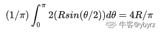

# 快手 2019 年秋季校园招聘笔试试卷—游戏研发 B 试卷

## 1

已知一算术表达式的中缀形式为 A+B*C-D/E，后缀形式为 ABC*+DE/-，其前缀形式为

正确答案: D   你的答案: 空 (错误)

```cpp
-+*ABC/DE
```

```cpp
-A+B*CD/E
```

```cpp
-A+B*C/DE
```

```cpp
-+A*BC/DE
```

本题知识点

Java 工程师 C++工程师 快手 游戏研发工程师 快手 2019

## 2

编译器的主要功能是

正确答案: B   你的答案: 空 (错误)

```cpp
将一种高级语言翻译成另一种高级语言
```

```cpp
将源程序翻译成指令
```

```cpp
将低级语言翻译成高级语言
```

```cpp
将源程序重新组合
```

本题知识点

Java 工程师 C++工程师 快手 游戏研发工程师 快手 2019

## 3

N 个节点组成的完全图的生成树最少有多少条边

正确答案: C   你的答案: 空 (错误)

```cpp
1
```

```cpp
N
```

```cpp
N-1
```

```cpp
N+2
```

本题知识点

Java 工程师 C++工程师 快手 游戏研发工程师 2019

讨论

[带土 201904160118408](https://www.nowcoder.com/profile/274446083)

[`blog.csdn.net/chengonghao/article/details/51883620?ops_request_misc=%257B%2522request%255Fid%2522%253A%2522162674233516780265444296%2522%252C%2522scm%2522%253A%252220140713.130102334.pc%255Fall.%2522%257D&request_id=162674233516780265444296&biz_id=0&utm_medium=distribute.pc_search_result.none-task-blog-2`](https://blog.csdn.net/chengonghao/article/details/51883620?ops_request_misc=%257B%2522request%255Fid%2522%253A%2522162674233516780265444296%2522%252C%2522scm%2522%253A%252220140713.130102334.pc%255Fall.%2522%257D&request_id=162674233516780265444296&biz_id=0&utm_medium=distribute.pc_search_result.none-task-blog-2)~all~first_rank_v2~rank_v29-1-51883620.first_rank_v2_pc_rank_v29&utm_term=N%E4%B8%AA%E8%8A%82%E7%82%B9%E7%BB%84%E6%88%90%E7%9A%84%E5%AE%8C%E5%85%A8%E5%9B%BE%E7%9A%84%E7%94%9F%E6%88%90%E6%A0%91%E6%9C%80%E5%B0%91%E6%9C%89%E5%A4%9A%E5%B0%91%E6%9D%A1%E8%BE%B9&spm=1018.2226.3001.4187

发表于 2021-07-20 08:55:02

* * *

## 4

```cpp
堆排序的平均时间复杂度是多少？
```

正确答案: C   你的答案: 空 (错误)

```cpp
O(log(n))
```

```cpp
O(n)
```

```cpp
O(n*log(n))
```

```cpp
O(n*n)
```

本题知识点

Java 工程师 C++工程师 快手 游戏研发工程师 2019

讨论

[∫∫∫熊舍尼奥 dV](https://www.nowcoder.com/profile/486328590)

堆排序时间复杂度 O(nlogn)，并且最坏最好时间复杂度不变，都是 O（nlogn）

发表于 2019-11-19 19:25:52

* * *

## 5

```cpp
一列数：8，3，1，4…，从第三个开始，每个数都是它前两个数的和的个位数，那么第 2011 个数是？
```

正确答案: C   你的答案: 空 (错误)

```cpp
0
```

```cpp
1
```

```cpp
2
```

```cpp
3
```

本题知识点

Java 工程师 C++工程师 快手 游戏研发工程师 2019

讨论

[李 danran](https://www.nowcoder.com/profile/5363114)

写下这列数的前若干个数：
8，3，1，4，5，9，4，3，7，0，7，7，4，1，5，6，1，7，8，5，3，8，1，9，0，9，9，8，7，5，2，7，9，6，
5，1，6，7，3，0，3，3，6，9，5，4，9，3，2，5，7，2，9，1，0，1，1，2，3，5，8，3，…．
第一个数=第 61 个数，第二个数=第 62 个数，…60 为数的出现的周期．
2011=33×60+31，
第 31 个数是 2．所以第 2011 个数是 2**这种题到 60 个才出现规律真的没啥意思！！**

发表于 2020-03-04 22:41:25

* * *

## 6

```cpp
扔两个均匀的骰子，面朝上的点数之和为 7 的概率是多少？
```

正确答案: B   你的答案: 空 (错误)

```cpp
四分之一
```

```cpp
六分之一
```

```cpp
十二分之一
```

```cpp
十八分之一
```

本题知识点

Java 工程师 C++工程师 快手 游戏研发工程师 2019

## 7

```cpp
下列哪种问题可以使用动态规划解决
```

正确答案: D   你的答案: 空 (错误)

```cpp
斐波拉契序列
```

```cpp
汉诺塔
```

```cpp
Dijkstra 最短路径
```

```cpp
全部都是
```

本题知识点

Java 工程师 C++工程师 快手 游戏研发工程师 2019

讨论

[陈无恙且向西行](https://www.nowcoder.com/profile/124980458)

D

发表于 2020-04-07 15:16:05

* * *

## 8

```cpp
10 进制数字 1024 还可以表示为
```

正确答案: A   你的答案: 空 (错误)

```cpp
27 进制 1AP
```

```cpp
26 进制 1AD
```

```cpp
16 进制 256
```

```cpp
8 进制 2018
```

本题知识点

Java 工程师 C++工程师 快手 游戏研发工程师 2019

## 9

 关于正则表达式下列说法错误的是？ 

正确答案: D   你的答案: 空 (错误)

```cpp
正则表达式:  f.h  ，可以匹配 foh，f#h 字符串
```

```cpp
正则表达式: ^hao，可以匹配任意以 hao 开头的字符串
```

```cpp
正则表达式: [0,9]{11} , 可以匹配 11 位数字
```

```cpp
正则表达式: &lt;/？[^&gt;]？&gt; ，可以匹配 HTML 标签的字符串
```

本题知识点

Java 工程师 C++工程师 快手 游戏研发工程师 2019

讨论

[牛客 206597936 号](https://www.nowcoder.com/profile/206597936)

A 正确 .可以匹配除\n 外的任意字符 B 正确  ^ 可以匹配开头 C 正确，可以匹配 11 位数字，但并不是只能匹配 11 位数字 D 错误  [^&gt;]应该增加个[^&lt;&gt;] 不能同时包含左尖括号和右尖括号， 正则为 /<\/?.+?>/ig

编辑于 2021-01-20 20:52:01

* * *

## 10

关于 SQL 中 drop、delete 和 truncate 的描述不正确的是（ ）

正确答案: D   你的答案: 空 (错误)

```cpp
删除所有数据并保留表时使用 truncate
```

```cpp
删除部分数据并保留表时使用 delete
```

```cpp
删除所有数据且不再保留表时使用 drop
```

```cpp
删除数据库使用 truncate、delete 和 drop 都可以
```

本题知识点

Java 工程师 C++工程师 快手 游戏研发工程师 2019

讨论

[adfsgkkjkj](https://www.nowcoder.com/profile/45414351)

drop(删除表)：删除定义和内容，释放空间。即即将整个表去掉；truncate(清除表中的数据)：删除内容、释放空间但不删除定义（保留表的数据结构）；delete(删除表中的数据)：用于删除表中的行。执行删除的过程是每次从表中删除一行，并同时将该行的删除操作作为事务记录在日志中保存，以便进行回滚操作。以上都是基于删除表中的数据的用法。

发表于 2019-03-30 16:00:04

* * *

## 11

(c 语言)在二维数组 int a[2][4]={{2,4,5,7},{3,6,1,8}}中，*(&a[0][0]+4)的值是（ ）

正确答案: C   你的答案: 空 (错误)

```cpp
&a[0][4]
```

```cpp
6
```

```cpp
3
```

```cpp
a[0][4]
```

本题知识点

C++工程师 快手 游戏研发工程师 2019 C 语言

讨论

[莹石眼之歌](https://www.nowcoder.com/profile/815039221)

第一个地址往下+

发表于 2021-03-17 16:49:09

* * *

[炫歌](https://www.nowcoder.com/profile/622959792)

*(&a[0][0]+4)=a[1][0]=3

发表于 2020-08-09 21:03:02

* * *

[牛客 604792200 号](https://www.nowcoder.com/profile/604792200)

为什么不能是 a［0］［4］

发表于 2021-12-16 10:04:00

* * *

## 12

设定子网掩码 255.255.255.192，则与 10.58.183.53 属于同一网段的主机 IP 地址是

正确答案: A   你的答案: 空 (错误)

```cpp
10.58.183.62
```

```cpp
10.58.183.63
```

```cpp
10.58.183.64
```

```cpp
10.58.183.65
```

本题知识点

Java 工程师 C++工程师 快手 游戏研发工程师 2019

讨论

[牛客 474968194 号](https://www.nowcoder.com/profile/474968194)

192 转二进制  1100000053  转二进制是 0011010162  转二进制是 00111110
63  转二进制是 00111111 与完之后都是 00000000  为什么只选择了 A ? 

发表于 2020-03-24 16:06:43

* * *

[青岛吴彦祖本祖](https://www.nowcoder.com/profile/221979466)

CD，2⁶ 得初始地址为.64，+64-1 得范围为 64-127

发表于 2020-03-24 09:18:02

* * *

## 13

已知 A、B、C、D 四个元素依次入栈，在入栈的过程中，栈中的元素随时可以出栈，以下出栈顺序不可能的是：

正确答案: D   你的答案: 空 (错误)

```cpp
ABCD
```

```cpp
ABDC
```

```cpp
BCAD
```

```cpp
DBCA
```

本题知识点

Java 工程师 C++工程师 快手 游戏研发工程师 快手 2019

## 14

下面哪种树的搜索时间复杂度不是 O(logn)

正确答案: C   你的答案: 空 (错误)

```cpp
红黑树
```

```cpp
AVL 树
```

```cpp
搜索二叉树
```

```cpp
其它选项都不是
```

本题知识点

Java 工程师 C++工程师 快手 游戏研发工程师 2019

## 15

可执行程序中的地址为

正确答案: C   你的答案: 空 (错误)

```cpp
符号地址
```

```cpp
绝对地址
```

```cpp
相对地址
```

```cpp
虚拟地址
```

本题知识点

Java 工程师 C++工程师 快手 游戏研发工程师 2019

## 16

设 f(x)有连续有界函数，则积分等于

正确答案: C   你的答案: 空 (错误)

```cpp
f(2) - f(0)
```

```cpp
0.5 * ( f(1) - f(0) )
```

```cpp
0.5 * ( f(2) - f(0) )
```

```cpp
f(1) - f(0)
```

本题知识点

Java 工程师 C++工程师 快手 游戏研发工程师 2019

## 17

进程间的通信方式不包括

正确答案: E   你的答案: 空 (错误)

```cpp
信号
```

```cpp
共享内存
```

```cpp
管道
```

```cpp
信号量
```

```cpp
数据段
```

本题知识点

Java 工程师 C++工程师 快手 游戏研发工程师 2019

讨论

[TiercelChow](https://www.nowcoder.com/profile/239698444)

> 进程间的通信方式主要有以下几种：

1\. 管道：管道是一种半双工的通信方式，数据只能单向流动，而且只能在具有亲缘关系的进程之间使用。进程的亲缘关系通常是指父子进程关系。管道是先进先出的通信方式。

2\. 共享内存：共享内存就是映射一段能被其他进程所访问的内存，这段共享内存由一个进程创建，但多 个进程都可以访问。共享内存是最快的 IPC 方式，它是针对其他进程间通信方式运行效率低而专门设 计的。它往往与信号量，配合使用来实现进程间的同步和通信。

3\. 信号：用于通知接收进程某个事件已经发生。

4.  信号量：信号量是一个计数器，可以用来控制多个进程对共享资源的访问。它常作为一种锁机制，实 现进程、线程的对临界区的同步及互斥访问。

> 另外还有一种题中未提到的消息队列方式：

消息队列：消息队列是有消息的链表，存放在内核中并由消息队列标识符标识。消息队列克服了信号 传递信息少、管道只能承载无格式字节流以及缓冲区大小受限等缺点。

发表于 2021-09-11 11:05:52

* * *

[牛客--001 号](https://www.nowcoder.com/profile/152778831)

 进程间的通信方式：管道、FIFO、消息队列、共享内存、信号量、套接字、信号

发表于 2021-09-10 21:35:03

* * *

## 18

下列存储器中存取速度最慢的是

正确答案: E   你的答案: 空 (错误)

```cpp
Cache
```

```cpp
DRAM
```

```cpp
SRAM
```

```cpp
Flash
```

```cpp
磁盘
```

本题知识点

Java 工程师 C++工程师 快手 游戏研发工程师 2019

讨论

[adfsgkkjkj](https://www.nowcoder.com/profile/45414351)

存取速度：寄存器 > Cache > 内存 > 硬盘 > 光盘 > 软盘 SRAM（静态存储单元）：速度快，使用简单，静态功耗低，常用作 Cache；元件数多，集成度低，运行功耗大；在计算机中，常用作主存储器。DRAM（动态存储单元）：集成度远高于 SRAM，功耗低，价格低；但因为刷新使外围电路复杂，存取速度也比较慢。硬盘：容量大，信息多，一般存放在机箱里面，负责存储数据，存取速度快。软盘：容量小，放在机箱外，负责搬运数据，存取速度慢。

发表于 2019-03-30 18:03:33

* * *

## 19

有重量分别为 3，5，7 公斤的三种货物，和一个载重量为 X 公斤的箱子（不考虑体积等其它因素，只计算重量）需要向箱子内装满 X 公斤的货物，要求使用的货物个数尽可能少（三种货物数量无限）
数据范围： 

本题知识点

Java 工程师 C++工程师 快手 动态规划 贪心 游戏研发工程师 2019

讨论

[许愿论文答辩顺利通过顺利毕业🙏](https://www.nowcoder.com/profile/127728147)

/*对 7 取余，对余数进行讨论即可
余数为 1,3,5，则可以装满，1 可以视为 1+7=3+5，依旧是之前的 count+1
余数为 2,4,6，也可以装满，2 可以视为 2+7=3+3+3，4 可以视为 4+7=5+3+3，6=3+3 是之前的 count+2
*/#include<iostream>
#include<fstream>
#include<algorithm>
using namespace std;

int main()
{
 //ifstream cin("test.txt");
 int n,i,j;
 while(cin>>n)
 {
   if(n==1||n==2||n==4)  //1 2 4 装不满
       cout<<"-1"<<endl;
   else
   {
      int count=0;
      count+=n/7; //对 7 取余，对余数进行讨论即可
      n=n%7;
      if(n==3||n==5||n==1)  
         count+=1;
      if(n==2||n==4||n==6)  
         count+=2;
      cout<<count<<endl;
   }
 }
 return 0;
}

发表于 2019-07-10 21:30:22

* * *

[精通 Java 外卖员](https://www.nowcoder.com/profile/258994384)

好像没什么人跟我同个思路。。分享一下吧。3,5,7 的最小公倍数为 105，也就是说只要数字大于 105，那么只需要判断它模 105 剩余的数的问题了。代码非常精简，对比了一下前面用 dp 的老哥们速度差不多。考虑边界的问题也不多，可以作为参考。

```cpp
import java.util.Scanner;

public class Main {
	static int temp = 0;
	public static void dfs(int count, int rest) {
		if (rest < 0) {//如果-3，-5 或者-7 小于 0 了，说明凑不齐，赶紧溜了
			return;
		}
		if (rest == 0) {
			System.out.println(temp*15+count);
			System.exit(0);
		}
		dfs(count + 1, rest - 7);
		dfs(count + 1, rest - 5);
		dfs(count + 1, rest - 3);
	}

	public static void main(String[] args) {
		Scanner sc = new Scanner(System.in);
		int n = sc.nextInt();
		temp = n / 105;
		dfs(0, n % 105);
		System.out.println(-1);
	}
}
```

发表于 2019-08-08 19:55:10

* * *

[nbgao](https://www.nowcoder.com/profile/211289)

```cpp
#include <bits/stdc++.h>
using namespace std;

int main(){
    int x;
    cin>>x;
    vector<int> dp(x+1, INT_MAX);
    dp[3] = dp[5] = dp[7] = 1;
    dp[6] = 2;
    for(int i=8;i<=x;i++){
        if(dp[i-3]==INT_MAX && dp[i-5]==INT_MAX && dp[i-7]==INT_MAX)
            dp[i] = INT_MAX;
        else
            dp[i] = min(min(dp[i-3],dp[i-5]), dp[i-7]) + 1;
    }
    cout<<((dp[x]!=INT_MAX)?dp[x]:-1)<<endl;
    return 0;
}
```

发表于 2019-11-28 07:31:20

* * *

## 20

将给定的 n 个元素插入一个单链表中并保持有序，时间复杂度是？

正确答案: D   你的答案: 空 (错误)

```cpp
O(1)
```

```cpp
O(n)
```

```cpp
O(log<sub>2</sub>n)
```

```cpp
O(n2)
```

本题知识点

Java 工程师 C++工程师 快手 游戏研发工程师 2019

讨论

[李 danran](https://www.nowcoder.com/profile/5363114)

对单链表而言，一些快速的排序算法不能用，只能用直接插入等 o(n²) 级的排序算法来实现排序。

发表于 2020-03-04 21:40:59

* * *

## 21

在一个无向图中有 n 个顶点，那么最多可能会有几条边？

正确答案: D   你的答案: 空 (错误)

```cpp
n
```

```cpp
n/2
```

```cpp
n*(n-1)
```

```cpp
n*(n-1)/2
```

本题知识点

Java 工程师 C++工程师 快手 游戏研发工程师 2019

讨论

[牛客 486539185 号](https://www.nowcoder.com/profile/486539185)

D

发表于 2019-03-29 13:00:18

* * *

## 22

套接字 Socket 编程中一个连接建立的过程中不包换哪一项？

正确答案: C   你的答案: 空 (错误)

```cpp
listen
```

```cpp
accept
```

```cpp
wait
```

```cpp
bind
```

本题知识点

Java 工程师 C++工程师 快手 游戏研发工程师 2019

讨论

[绿色循环能力](https://www.nowcoder.com/profile/558011297)

C

发表于 2019-08-12 18:35:48

* * *

## 23

HTTP 协议是基于以下哪项实现的？

正确答案: C   你的答案: 空 (错误)

```cpp
FTP
```

```cpp
SMTP
```

```cpp
TCP
```

```cpp
UDP
```

本题知识点

Java 工程师 C++工程师 快手 游戏研发工程师 2019

## 24

以下哪项不是 TCP 和 UDP 之间的区别？

正确答案: B   你的答案: 空 (错误)

```cpp
是否有连接
```

```cpp
是否属于传输层协议
```

```cpp
是否有序
```

```cpp
是否可靠
```

本题知识点

Java 工程师 C++工程师 快手 游戏研发工程师 2019

## 25

程序设计中应当努力遵循以下哪项原则？

正确答案: B   你的答案: 空 (错误)

```cpp
对修改开放，对扩展关闭
```

```cpp
对修改关闭，对扩展开放
```

```cpp
对继承开放，对扩展关闭
```

```cpp
对继承关闭，对扩展开放
```

本题知识点

Java 工程师 C++工程师 快手 游戏研发工程师 2019

## 26

对于 32 位的单精度浮点数，数符分配是 1 位，阶码分配了 8 位，尾数分配了是 23 位(符合 IEEE 754 标准)。那么 178.125 的二进制表示为：

正确答案: A   你的答案: 空 (错误)

```cpp
01000011001100100010000000000000
```

```cpp
00000011101100100010000000000000
```

```cpp
01000011000000000000000110010001
```

```cpp
00000011100000000000000110010001
```

本题知识点

Java 工程师 C++工程师 快手 游戏研发工程师 快手 2019

## 27

下面代码段的输出是（）

```cpp
#include <stdio.h>
union {
    int i;
    char x[2];
} a;

int main() {
    a.x[0] = 3;
    a.x[1] = 2;
    printf("%d", a.i);
}
```

正确答案: B   你的答案: 空 (错误)

```cpp
0
```

```cpp
515
```

```cpp
770
```

```cpp
635
```

本题知识点

C++工程师 快手 游戏研发工程师 2019 C 语言

讨论

[null‖null](https://www.nowcoder.com/profile/709705959)

union 为共享体，共享存储空间，在给 i 分配存储空间后，并不会为 char 再开辟新的存储空间。此时 union 里的存储情况为 0000 0000 0000 0000 0000 0000 0000 0000，然后再从低 8 位开始分别存储 3 和 2，低 16 位变为 0000 0010 0000 0011(高 16 位全为 0)，再把它当做 i 来输出，自然就是 515

发表于 2020-08-09 18:00:56

* * *

[烬天玉藻前](https://www.nowcoder.com/profile/195480900)

弱弱地吐槽几句：这是大端系统还是小端系统勒，是 16bit 系统还是 32bit 呢？还是一般不讲都是默认 32bit，默认小端呢？

发表于 2020-08-20 22:40:38

* * *

[牛客 670531181 号](https://www.nowcoder.com/profile/670531181)

这不加说明，应该是默认是小端吧🙄

发表于 2021-08-22 21:51:43

* * *

## 28

以下关于观察者模式的表述中错误的是

正确答案: C   你的答案: 空 (错误)

```cpp
观察者角色的更新是被动的
```

```cpp
被观察者可以通知观察者进行更新
```

```cpp
观察者可以改变被观察者的状态
```

```cpp
观察者和被观察对象之间的互动关系不能体现成类之间的直接调用
```

本题知识点

Java 工程师 C++工程师 快手 游戏研发工程师 2019

## 29

对于 int *target[5]的描述，以下选项是正确的是（）

正确答案: A   你的答案: 空 (错误)

```cpp
target 是一个具有 5 个元素的指针数组，每个元素是一个 int 类型的指针
```

```cpp
target[5]表示某个数组的第 5 个元素的值
```

```cpp
target 是一个指向数组的指针，所指向的数组是 5 个 int 类型的元素
```

```cpp
target 是一个指向某个数组中第 5 个元素的指针，该元素是 int 类型的变量。
```

本题知识点

C++工程师 快手 游戏研发工程师 2019 C++ C 语言

讨论

[奋斗小强吧](https://www.nowcoder.com/profile/324744938)

int *target[5]：指针数组，每个元素都是一个指向 int*的指针；int (*target)[5]：数组指针，相当于二维数组

发表于 2020-08-28 16:19:16

* * *

[牛客小丑 C](https://www.nowcoder.com/profile/410104169)

一个类比记忆方法，int a[],该数组放的是 int 类型数据 int* a[],数组类比放的是 int*类型数据~

发表于 2021-03-31 17:38:29

* * *

[w420839810](https://www.nowcoder.com/profile/843614850)

第二个为什么不对

发表于 2022-03-18 10:56:26

* * *

## 30

已知关键字序列｛66,82,25,51,98,108｝,利用快速排序方法，以第一个元素为基准得到的一趟排序结果为

正确答案: A   你的答案: 空 (错误)

```cpp
｛25,51,66,82,98,108｝
```

```cpp
｛25,51,66,98,82,108｝
```

```cpp
｛51,25,66,108,98,82｝
```

```cpp
｛51,25,66,82,108｝
```

本题知识点

Java 工程师 C++工程师 快手 游戏研发工程师 2019

讨论

[道可道非常道嘤](https://www.nowcoder.com/profile/646612786)

假的吧，明明是 51，25，66，82，98，108 也没有这个答案。是我错了嘛？？？

发表于 2019-09-05 22:47:55

* * *

[gdut17](https://www.nowcoder.com/profile/279358190)

D。

{51,25, 66, 82, 98，108} 

发表于 2020-08-01 11:15:59

* * *

## 31

以下选项不是动态链接库的优点的是：

正确答案: D   你的答案: 空 (错误)

```cpp
适用于大规模的软件开发，使开发过程独立、耦合度小，便于不同开发者和开发组织之间进行开发和测试
```

```cpp
不同编程语言编写的程序只要按照函数调用约定就可以调用同一个 DLL 函数
```

```cpp
更加节省内存并减少页面交换
```

```cpp
代码装载速度比静态链接库更快
```

本题知识点

Java 工程师 C++工程师 快手 游戏研发工程师 快手 2019

## 32

下面的哪种情况下,ClassB 不能隐式转换为 ClassA？

正确答案: B   你的答案: 空 (错误)

```cpp
class B:public A{}
```

```cpp
class A:public B{}
```

```cpp
class B:{operator A();}
```

```cpp
class A{A(const B&amp;);}
```

本题知识点

Java 工程师 C++工程师 快手 游戏研发工程师 快手 2019

讨论

[牧狼 D 人](https://www.nowcoder.com/profile/1704523)

```cpp
class B {
};

class A :public B {
public:
	int i = 1;
};

int main()
{
	B b;
	b.i;
}

```

编写测试代码，无法通过编译，所以选 B。（原理：父类不具有子类所拥有的成员，所以在编译过程中无法隐式转换，但如果使用强转命令的话，还是可以转换的，而本题问的是是否可以隐式转换）

发表于 2020-01-14 22:33:32

* * *

## 33

下列关于线程说法错误的是

正确答案: B   你的答案: 空 (错误)

```cpp
使用线程可以把占据时间长的程序中的任务放到后台去处理
```

```cpp
更多的线程需不会消耗更多的内存空间
```

```cpp
通常块模型数据是在多个线程间共享的,需要防止线程死锁情况的发生
```

```cpp
在一些等待的任务实现上如用户输入,文件读取和网络收发数据等,线程就比较有用了
```

本题知识点

Java 工程师 C++工程师 快手 游戏研发工程师 2019

## 34

在现代的游戏动画系统中经常会用到反向动力学动画即 IK 动画,IK 动画的算法会用到梯度下降算法。梯度下降算法中会用到斜率，斜率可以通过求出函数的导数的方式获取。下列列举[基本初等函数](https://baike.baidu.com/item/%E5%9F%BA%E6%9C%AC%E5%88%9D%E7%AD%89%E5%87%BD%E6%95%B0)的导数不正确的是：

正确答案: B   你的答案: 空 (错误)

```cpp
原函数   导函数
```

```cpp
原函数   导函数 
```

```cpp
原函数  导函数 
```

```cpp
原函数  导函数 
```

本题知识点

Java 工程师 C++工程师 快手 游戏研发工程师 2019

## 35

一个 C++项目中有 3 个.h 文件，5 个.cpp 文件，编译之后生成的.obj 文件的数量是：

正确答案: B   你的答案: 空 (错误)

```cpp
3
```

```cpp
5
```

```cpp
8
```

```cpp
视编译器而定
```

本题知识点

Java 工程师 C++工程师 快手 游戏研发工程师 2019 C++

讨论

[美团内推（专业正版）](https://www.nowcoder.com/profile/191223862)

一个.cpp 文件会生成一个.obj 文件，.h 文件不会生成.obj 文件

发表于 2020-09-02 21:51:57

* * *

## 36

函数 a 定义如下: 

```cpp
int a(int tab){
    int n = tab-1;
    n |= n >> 1;
    n |= n >> 2;
    n |= n >> 4;
    n |= n >> 8;
    n |= n >> 16;
    return n;
}
```

调用函数 a(666)返回的结果是（）

正确答案: A   你的答案: 空 (错误)

```cpp
1023
```

```cpp
1024
```

```cpp
666
```

```cpp
528
```

本题知识点

C++工程师 快手 游戏研发工程师 2019 C++ C 语言

讨论

[黄俊尹](https://www.nowcoder.com/profile/262605718)

        想想按位或的特点是什么，原来是 1 的地方运算之后还是 1，所以 1 只会多不会少，但是因为是使用了右移的结果进行运算，所以 1 最多也就填满传入的那个参数的所有 bit，如果是左移不就最多可以把整个类型所占的 bit 全部置为 1 吗？所以只需要把 665 所占的 bit 数找出来，我们知道 2¹⁰=1024 占 11 个 bit 即 1 00000 00000，因为 665 小于 1024 大于 512 所以占 10 个 bit，10 个 bit 全 1，当然是 1023 了。能用巧劲别下苦力啊亲们！重复事情应该交给机器来干，能靠巧妙的思维或辅以少量运算来做，实在想不到好办法才去硬算的题才是好题。如果是非要大量硬算的题，只能说明出题人水平才是真的不行，没搞清楚招聘的是程序员而不是计算机。

编辑于 2021-11-11 15:36:47

* * *

[BistuKeYang](https://www.nowcoder.com/profile/112225848)

665 的二进制表示为 1010011001

右移一位为 1101001100

按位或之后为 1111011101 赋值给 n

把赋值后的 n 右移两位为 1111110111

按位或之后为 1111111111

之后就一直是 1111111111 也就是 1023

发表于 2020-08-06 13:53:41

* * *

[牛客 612262212 号](https://www.nowcoder.com/profile/612262212)

不要被数字吓到了 比较位数就好🙃

发表于 2020-04-10 23:00:56

* * *

## 37

依据设计模式思想，程序开发中应优先使用的是（ ）关系实现复用。

正确答案: A   你的答案: 空 (错误)

```cpp
组合
```

```cpp
继承
```

```cpp
创建
```

```cpp
实现
```

本题知识点

Java 工程师 C++工程师 快手 游戏研发工程师 2019

## 38

在 64 位平台中，请计算以下变量的 sizeof 值，int p = 10；int* q = &p；sizeof(p) = ?  sizeof(q) = ?

正确答案: C   你的答案: 空 (错误)

```cpp
10,20
```

```cpp
4,4
```

```cpp
4,8
```

```cpp
8,4
```

本题知识点

C++工程师 快手 游戏研发工程师 2019 C++

讨论

[晓之铭](https://www.nowcoder.com/profile/537625741)

64 位下，指针变量的长度是八位

发表于 2021-04-07 08:16:41

* * *

[C++小白 ___orgader](https://www.nowcoder.com/profile/69867713)

和操作系统没有关系，64 位控制台程序下指针变量是 8 位的

发表于 2020-11-20 18:32:13

* * *

[孙朋 _13230409636](https://www.nowcoder.com/profile/571201544)

指针的大小和操作系统位数、ＣＰＵ位数、编译器的位数都是有关系的

发表于 2021-12-31 14:14:20

* * *

## 39

下面一段 java 代码，不会产生异常的位置是 List<Integer> list = new ArrayList<>();for(int i=0; i<5; i++){    list.add(i);
}List<Integer> sublist = list.subList(1, 3);list.add(6);sublist.forEach(System.out::println);// 位置 Asublist.add(7);// 位置 Bsublist.remove(0);// 位置 C

正确答案: A   你的答案: 空 (错误)

```cpp
位置 A
```

```cpp
位置 B
```

```cpp
位置 C
```

```cpp
ABC 都不会产生异常
```

本题知识点

Java 工程师 C++工程师 快手 游戏研发工程师 2019

## 40

下面哪个是 FTP 文件传输协议的端口？

正确答案: C   你的答案: 空 (错误)

```cpp
88
```

```cpp
22
```

```cpp
21
```

```cpp
80
```

本题知识点

Java 工程师 C++工程师 快手 游戏研发工程师 2019

## 41

矩阵 A（2x3）矩阵和矩阵 B（3x4）矩阵相乘后，得到的是几 x 几矩阵？

正确答案: B   你的答案: 空 (错误)

```cpp
(2x3)矩阵
```

```cpp
(2x4)矩阵
```

```cpp
(3x4)矩阵
```

```cpp
(4x2)矩阵
```

本题知识点

Java 工程师 C++工程师 快手 游戏研发工程师 2019

讨论

[牛客 486539185 号](https://www.nowcoder.com/profile/486539185)

B

发表于 2019-03-29 12:49:11

* * *

## 42

给定一个字符串，你的任务是计算这个字符串中有多少个回文子串。("回文串”是一个正读和反读都一样的字符串，比如“level”或者“noon”等等就是回文串。)具有不同开始位置或结束位置的子串，即使是由相同的字符组成，也会被计为是不同的子串。数据范围：字符串长度满足  

本题知识点

Java 工程师 C++工程师 快手 字符串 *模拟 动态规划 游戏研发工程师 2019* *讨论

[lentolove](https://www.nowcoder.com/profile/572586026)

字符串的回文串总结

一看到回文字符串，脑海里立马要想到前面两个最常用的结题思路:

*   1.动态规划
*   2.中心扩散法
*   3.还有著名的马拉车算法

leetcode 出现的回文字符串的三个题：

*   1.回文子串的个数
*   2.最长回文子串
*   3.最长不连续的回文子串

1.回文子串的个数——本题

```cpp
public class Solution14_ 回文子串 {
    /**
     * 方法一：中心扩散法
     */
    static int ans = 0;

    public static void main(String[] args) throws IOException {
        BufferedReader bf = new BufferedReader(new InputStreamReader(System.in));
        String s = bf.readLine();
        for (int i = 0; i < s.length(); i++) {
            //考虑两种情况：aba 和 abba
            centerSpread(s, i, i);
            centerSpread(s, i, i + 1);
        }
        System.out.println(ans);
    }

    //判断回文串的中心扩散法
    private static void centerSpread(String s, int left, int right) {
        while (left >= 0 && right < s.length() && s.charAt(left) == s.charAt(right)) {
            left--;
            right++;
            ans++;
        }
    }

    //方法二：动态规划
    private static int dp(String s) {
        int n = s.length(), ans = 0;
        boolean[][] dp = new boolean[n][n];
        for (int i = n - 1; i >= 0; i--) {
            for (int j = i; j < n; j++) {
                dp[i][j] = (s.charAt(i) == s.charAt(j)) && (j - i <= 2 || dp[i + 1][j - 1]);
                if (dp[i][j]) ans++;
            }
        }
        return ans;
    }
}
```

2.最长回文子串

Given a string s, find the longest palindromic substring in s. You may assume that the maximum length of s is 1000.
Example 1:
Input: "babad"
Output: "bab"
Note: "aba" is also a valid answer.
Example 2:
Input: "cbbd"
Output: "bb"

```cpp
class Qusetion2 {

    //1.动态规划
    public static String longestPalindrome(String s) {
        int n = s.length();
        if (n < 2) return s;
        int maxLen = 1;
        String res = s.substring(0, 1);
        boolean[][] dp = new boolean[n][n];
        //左边界一定小于右边界，因此从右边界开始
        for (int r = 1; r < n; r++) { //表示右边界
            for (int l = 0; l < r; l++) { //表示左边界
                // 区间应该慢慢放大
                // 状态转移方程：如果头尾字符相等并且中间也是回文
                // 在头尾字符相等的前提下，如果收缩以后不构成区间（最多只有 1 个元素），直接返回 True 即可
                // 否则要继续看收缩以后的区间的回文性
                if (s.charAt(l) == s.charAt(r) && ((r - l) <= 2 || dp[l + 1][r - 1])) {
                    dp[l][r] = true;
                    if (r - l + 1 > maxLen) {
                        maxLen = r - l + 1;
                        res = s.substring(l, r + 1);
                    }
                }
            }
        }
        return res;
    }

    //2.中心扩展法
    private int start, maxLen;

    public String longestPalindrome1(String s) {
        if (s == null || s.length() < 2) return s;
        for (int i = 0; i < s.length(); i++) {
            //考虑中心扩散的两种情况 1:aba  和 2: bb
            findMaxPalindrome(s, i, i);
            findMaxPalindrome(s, i, i + 1);
        }
        return s.substring(start, start + maxLen);
    }

    private void findMaxPalindrome(String s, int i, int j) {
        while (i >= 0 && j < s.length() && s.charAt(i) == s.charAt(j)) {
            i--;//向左延伸
            j++;//向右延伸
        }
        //记录每个起始点扩展的回文串的最大长度
        if (maxLen < j - i - 1) {
            start = i + 1;
            maxLen = j - i - 1;
        }
    }
}
```

3.最长不连续回文子串

Given a string s, find the longest palindromic subsequence's length in s. You may assume that the maximum length of s is 1000.
Example 1:
Input:
"bbbab"
Output:
4
One possible longest palindromic subsequence is "bbbb".

```cpp
    public int longestPalindrome(String s) {
        int n = s.length();
        int[][] dp = new int[n][n];//dp[l][r]表示 l-r 中的最长回文串
        for (int r = 0; r < n; r++) {
            dp[r][r] = 1;
            for (int l = r - 1; l >= 0; l--) {
                if (s.charAt(l) == s.charAt(r)) {
                    dp[l][r] = dp[l + 1][r - 1] + 2;
                } else {
                    dp[l][r] = Math.max(dp[l + 1][r], dp[l][r - 1]);
                }
            }
        }
        return dp[0][n - 1];
    }
```

发表于 2019-08-05 13:22:12

* * *

[Ankang0320](https://www.nowcoder.com/profile/866249541)

dp 解法。记 dp[i][j]为 s 索引从 i 到 j 的的子串是否为回文字符串。若 j-i>=2，那么 dp[i][j]=dp[i+1][j-1]&&s[i]==s[j]；因此推断 i 的遍历为降序，而 j 的遍历为升序，又有 i 到 j 的子串，所以 i<=j；    若 j-i==1，dp[i][j]=s[i]==s[j]；    若 j==i，dp[i][j]=true。在求每个 dp[i][j]时判断其是否为 true，并记录 true 的个数即可。

```cpp
#include<iostream>
#include<string>
#include<vector>
using namespace std;
int main()
{
    string s;
    cin>>s;
    int n=s.size();//字符串长度
    vector<vector<bool>> dp(n,vector<bool>(n,0));//dp[i][j] 从 i 到 j 的子串是否为回文串
    int res=0;//记录回文子串的个数
    for(int i=n-1;i>=0;i--)//i 降序
        for(int j=i;j<n;j++)//j 升序 且 j>=i
        {
            if(i==j)
                dp[i][j]=true;//一个字母是回文字符串
            else if(j-i==1)//首尾相邻
            {
                if(s[i]==s[j])
                    dp[i][j]=true;//相同为回文
                else
                    dp[i][j]=false;//不同不为回文
            }
            else//首尾不相邻
            {
                if(dp[i+1][j-1]==true&&s[i]==s[j])//中间为回文且首尾相同为回文
                    dp[i][j]=true;
                else
                    dp[i][j]=false;//否则不为回文
            }
            if(dp[i][j]==true)
                res++;//记录回文子串的个数
        }
    cout<<res<<endl;
    return 0;
}
```

发表于 2019-07-16 23:27:20

* * *

[土豪 gold](https://www.nowcoder.com/profile/785257874)

```cpp
//不喜欢 dp 的看这里
#include <iostream>
#include <string>
using namespace std;
int main()
{
    string str;
    while (cin >> str)
    {
        int len = str.size();
        int count = 0;
        for (int i = 1; i<len; i++)
        {
            if (str[i - 1] == str[i + 1])
            {
                count++;
                for (int j = 1; j <= (len - i) && j<i; j++)
                {
                    if (str[i +1+ j] == str[i - 1 - j])
                    {
                        count++;
                    }
                    else
                    {
                        break;
                    }
                }
            }
            if (str[i] == str[i - 1])
            {
                count++;
                for (int j = 1; j <= (len - i) && j<i; j++)
                {
                    if (str[i + j] == str[i - 1 - j])
                    {
                        count++;
                    }
                    else
                    {
                        break;
                    }
                }
            }
        }
        cout << count + len << endl;
    }
    return 0;
}

```

发表于 2019-07-04 21:24:06

* * *

## 43

下列关于图的描述，错误的一项是

正确答案: C   你的答案: 空 (错误)

```cpp
除第一个顶点和最后一个顶点外，其余顶点不重复出现的回路，我们称之为简单回路。
```

```cpp
无向图所有顶点的度的和必须为偶数。
```

```cpp
深度优先搜索利用队列可以求出一条从顶点 a 到顶点 b 的简单路径
```

```cpp
有 n 个节点的有向完全图的边数一定是 n(n-1)条。
```

本题知识点

Java 工程师 C++工程师 快手 测试工程师 2019 游戏研发工程师

## 44

如果从自然数 100、101、102...依次写到 199，总共写了()个阿拉伯数字 1

正确答案: D   你的答案: 空 (错误)

```cpp
100
```

```cpp
101
```

```cpp
110
```

```cpp
120
```

本题知识点

Java 工程师 C++工程师 快手 测试工程师 2019 游戏研发工程师

## 45

用户要在程序一级获得系统帮助，必须通过()

正确答案: D   你的答案: 空 (错误)

```cpp
进程调度
```

```cpp
作业调度
```

```cpp
键盘命令
```

```cpp
系统调用
```

本题知识点

Java 工程师 C++工程师 快手 测试工程师 快手 测试工程师 快手 2019 游戏研发工程师 快手 2019

## 46

以下关于虚拟内存的描述错误的是：

正确答案: A   你的答案: 空 (错误)

```cpp
计算机可以直接执行指令，不需要做虚拟地址到物理地址的转换
```

```cpp
每个进程运行在各自的虚拟内存空间，互不干扰
```

```cpp
虚拟内存允许操作系统运行比实际系统拥有的内存大得多的程序
```

```cpp
使用了虚拟内存，页面的换入换出需要磁盘 I/O，比较耗时
```

本题知识点

Java 工程师 C++工程师 快手 测试工程师 2019 游戏研发工程师

## 47

用 ls -al 命令显示出某文件的信息如下所示，该文件的类型为：

drwxr-xr-x 3 root root 96 10 7 2018 f

正确答案: C   你的答案: 空 (错误)

```cpp
普通文件
```

```cpp
硬链接
```

```cpp
目录
```

```cpp
符号链接
```

本题知识点

Java 工程师 C++工程师 快手 测试工程师 2019 游戏研发工程师

## 48

SQL 的聚集函数 COUNT、SUM、AVG、MAX、MIN 不允许出现在查询语句的（）子句之中。

正确答案: D   你的答案: 空 (错误)

```cpp
SELECT
```

```cpp
HAVING
```

```cpp
GROUP BY .. HAVING
```

```cpp
WHERE
```

本题知识点

Java 工程师 C++工程师 快手 测试工程师 2019 游戏研发工程师

讨论

[nkustella](https://www.nowcoder.com/profile/662198241)

where 是过滤记录，即找到符合条件的行聚合函数是把多行变成一行两者冲突故选 D

发表于 2019-01-17 14:53:11

* * *

## 49

下列哪个攻击不在网络层（）

正确答案: D   你的答案: 空 (错误)

```cpp
IP 欺诈
```

```cpp
Teardrop
```

```cpp
Smurf
```

```cpp
SQL 注入
```

本题知识点

Java 工程师 C++工程师 快手 测试工程师 2019 游戏研发工程师

## 50

小杨、小郭、小王三个人住在同一个宿舍。说来也巧,他们三个每人都只有一个妹妹,并且都比自己的妹妹大 11 岁。三个妹妹名叫小燕、小丽和小慧,已知小杨比小燕大 9 岁,小杨与小丽年龄之和是 52,小郭与小丽年龄之和是 54。以下关系正确的是（）

正确答案: D   你的答案: 空 (错误)

```cpp
小杨和小丽是兄妹
```

```cpp
小郭和小丽是兄妹
```

```cpp
小王和小慧是兄妹
```

```cpp
小郭和小燕是兄妹
```

本题知识点

Java 工程师 C++工程师 快手 测试工程师 2019 游戏研发工程师

讨论

[牛客 486539185 号](https://www.nowcoder.com/profile/486539185)

D

发表于 2019-03-29 12:33:44

* * *

## 51

以下关于视图的描述错误的是：

正确答案: B   你的答案: 空 (错误)

```cpp
使用视图对基表数据能起到一定的保护作用
```

```cpp
视图的数据不会随着基表的更新而更新
```

```cpp
视图可以简化数据操作
```

```cpp
在视图上可以定义新的视图
```

本题知识点

Java 工程师 C++工程师 快手 测试工程师 2019 游戏研发工程师

## 52

假如有两个表的连接：table_1 INNER JOIN table_2 其中 table_1 和 table_2 是两个具有公共属性的表，这种连接会生成哪种结果集（）

正确答案: D   你的答案: 空 (错误)

```cpp
包括 table_1 中的所有行，不包括 table_2 的不匹配行
```

```cpp
包括 table_2 中的所有行，不包括 table_1 的不匹配行
```

```cpp
包括两个表的所有行
```

```cpp
只包括 table_1 和 table_2 满足条件的行
```

本题知识点

Java 工程师 C++工程师 快手 测试工程师 2019 游戏研发工程师

## 53

C 语言中，设 a=3,b=4,执行语句“printf("%d,%d",(a,b),(b,a))；”的输出结果是（）

正确答案: C   你的答案: 空 (错误)

```cpp
3,4
```

```cpp
(3,4),(4,3）
```

```cpp
4,3
```

```cpp
不确定
```

本题知识点

C++工程师 快手 测试工程师 2019 游戏研发工程师 C 语言

讨论

[你好，请问我今天学习了吗](https://www.nowcoder.com/profile/333521568)

4,3 这个是[逗号表达式](https://www.baidu.com/s?wd=%E9%80%97%E5%8F%B7%E8%A1%A8%E8%BE%BE%E5%BC%8F&tn=SE_PcZhidaonwhc_ngpagmjz&rsv_dl=gh_pc_zhidao)的问题，
[逗号表达式](https://www.baidu.com/s?wd=%E9%80%97%E5%8F%B7%E8%A1%A8%E8%BE%BE%E5%BC%8F&tn=SE_PcZhidaonwhc_ngpagmjz&rsv_dl=gh_pc_zhidao)从左往右执行，最后显示最右边的那个。
即（a,b）相当于 b，如果是
printf("%d,%d",(++a,++b）,(++b,++a）)；
输出为 6，5

发表于 2019-08-24 21:52:35

* * *

[Mint__Hacker](https://www.nowcoder.com/profile/792292935)

注意 (a ,b)并不是一个数对，而是一种运算--逗号表达式。运算方法：从左往右逐个计算表达式，整个表达式的值为最后一个表达式的值（右括号左侧）。故：( a,b ) = b, ( b, a ) = a.

发表于 2021-03-05 20:26:55

* * *

[AC 永动机](https://www.nowcoder.com/profile/497682289)

从左往右执行，取最右边的值

发表于 2021-03-17 19:16:19

* * *

## 54

计算机中存储一个数是以二进制形式存储的，那么-7 的补码是

正确答案: D   你的答案: 空 (错误)

```cpp
11111001
```

```cpp
10000111
```

```cpp
10001001
```

```cpp
11111010
```

本题知识点

Java 工程师 C++工程师 快手 测试工程师 快手 测试工程师 快手 2019 游戏研发工程师 快手 2019

讨论

[jay 晴天](https://www.nowcoder.com/profile/2934247)

答案错了，选 A

发表于 2019-04-13 12:50:29

* * *

[绅蓝](https://www.nowcoder.com/profile/1596072)

答案错了

发表于 2019-03-24 21:07:21

* * *

[rencontre](https://www.nowcoder.com/profile/543966)

答案是不是错了啊

发表于 2018-11-07 08:57:13

* * *

## 55

有关下述 Java 代码描述正确的选项是（ ）

public class TestClass {

private static void testMethod() {

 System.out.println("testMethod");

}

public static void main(String[] args) {

 ((TestClass)null).testMethod();

}}

正确答案: C   你的答案: 空 (错误)

```cpp
编译不通过
```

```cpp
编译通过，运行异常，报 NullPointerException
```

```cpp
运行正常，输出 testMethod
```

```cpp
编译通过，运行异常，报 NoSuchMethodException
```

本题知识点

Java 工程师 C++工程师 快手 测试工程师 快手 测试工程师 快手 2019 游戏研发工程师 快手 2019

## 56

下面哪个是线程同步的机制

正确答案: D   你的答案: 空 (错误)

```cpp
互斥锁，共享内存，管道
```

```cpp
管道，信号量，读写锁
```

```cpp
互斥锁，管道，信号量
```

```cpp
锁，信号量，条件变量
```

本题知识点

Java 工程师 C++工程师 快手 测试工程师 2019 游戏研发工程师

## 57

关于四元数，下列说法错误的是

正确答案: C   你的答案: 空 (错误)

```cpp
可以避免万向锁的情况。
```

```cpp
可以平滑插值。
```

```cpp
满足乘法交换律。
```

```cpp
满足乘法结合律。
```

本题知识点

Java 工程师 C++工程师 快手 游戏研发工程师 2019

## 58

敏感词库有一万条敏感词，要对每条聊天信息进行敏感词替换，以下适合的方法是？

正确答案: A   你的答案: 空 (错误)

```cpp
trie 树
```

```cpp
正则表达式
```

```cpp
string.replace
```

```cpp
kmp
```

本题知识点

Java 工程师 C++工程师 快手 游戏研发工程师 2019

## 59

以下关于 NUMA，描述错误的是

正确答案: D   你的答案: 空 (错误)

```cpp
Non-Uniform Memory Access
```

```cpp
NUMA 和 SMP 是两种不同的 CPU 硬件体系架构
```

```cpp
NUMA 改善了内存带宽的可扩展性
```

```cpp
一颗 CPU 修改了共享的内存位置，需要广播给所有其他 CPU
```

本题知识点

Java 工程师 C++工程师 快手 游戏研发工程师 2019

## 60

关于 ARP 协议，描述错误的是

正确答案: C   你的答案: 空 (错误)

```cpp
该协议是根据 IP 地址获取物理地址
```

```cpp
ARP 协议只适用于局域网
```

```cpp
采用计时器保证 ARP 表的安全性
```

```cpp
请求报文是广播形式
```

本题知识点

Java 工程师 C++工程师 快手 游戏研发工程师 2019

## 61

某列高铁有 666 个座位，按顺序从 1 到 666 编号。有 666 位乘客，他们分别拿到了从 1 号到 666 号的座位，他们按号码顺序上车并应当对号入座，如果 他们发现对应号座位被别人坐了，他会在剩下空的座位随便挑一个坐。现在假如 1 号乘客疯了 -_-! (其他人没疯)，他会在 666 个座位中随机坐一个座位。那么第 666 人正确坐自己座位的概率是多少？ 注意上车是从 1 到 666 按顺序的。

正确答案: C   你的答案: 空 (错误)

```cpp
111/666
```

```cpp
222/666
```

```cpp
333/666
```

```cpp
444/666
```

本题知识点

算法工程师 快手 Java 工程师 C++工程师 2019 游戏研发工程师

讨论

[零葬](https://www.nowcoder.com/profile/75718849)

设 f(k)为第 k 个位置被占的概率即 f(2)=1/n 为第一个人坐在第 2 个位子上的概率，则 f(k+1)为第 k+1 个位置被占的概率有两种情况：(1) 第 k 个座位被占，编号为 k 的乘客从剩下的 n-k+1 个位置中选中 k+1 号座位的概率为 f(k)*1/(n-k+1)；(2) 编号为 k 的乘客坐了 k 号座位，第 k+1 个乘客选座位时，k+1 个乘客中只有第 k 个乘客的位置是确定的，其他 k 个是不确定的。因此第 k+1 个乘客选座位就相当于 第 k 个乘客选座位时，第 k 个座位被占的概率，即 f(k)。f(k+1) = f(k) + f(k) * 1/(n - k + 1) = f(k)*(n - k + 2)/(n - k + 1)f(n) = f(n - 1)*[n - (n - 1) + 2]/[n - (n - 1) + 1] = f(n - 2)*[n - (n - 1) + 2]/[n - (n - 1) + 1] *[n - (n - 2) + 2]/[n - (n - 2) + 1]       = ... = 1/n*n/(n- 1)*(n-1)/(n-2)*...*4/3*3/2      = 1/2

编辑于 2020-12-29 17:08:23

* * *

## 62

小明有一袋子长方形的积木，如果一个积木 A 的长和宽都不大于另外一个积木 B 的长和宽，则积木 A 可以搭在积木 B 的上面。好奇的小明特别想知道这一袋子积木最多可以搭多少层，你能帮他想想办法吗？定义每一个长方形的长 L 和宽 W ，袋子里面长方形的个数为 n 。假如袋子里共有 5 个积木分别为 (2, 2), (2, 4), (3, 3), (2, 5), (4, 5), 则不难判断这些积木最多可以搭成 4 层, 因为(2, 2) < (2, 4) < (2, 5) < (4, 5)。数据范围：长方形个数满足  ，

本题知识点

Java 工程师 C++工程师 iOS 工程师 安卓工程师 运维工程师 前端工程师 算法工程师 PHP 工程师 测试工程师 快手 排序 *动态规划 2019 游戏研发工程师* *讨论

[ElonB](https://www.nowcoder.com/profile/623894)

```cpp
/*
对长方形的宽 w 排序，本题化简为对长 l 求最长上升子序列。
本题只需求最长上升子序列的 长度，可优化到 O(nlogn)
*/
#include<bits/stdc++.h>
using namespace std;
#define N 1000000

struct rectangle {
    int w = 0, l = 0;
} a[N];
int dp[N];

bool cmp(rectangle x, rectangle y){
    return x.w == y.w ? x.l < y.l : x.w < y.w;
}

int main()
{
//    freopen("input.txt", "r", stdin);
    int n;
    cin >> n;
    for(int i = 0; i < n; i++) {
        cin >> a[i].w >> a[i].l;
    }
    sort(a, a + n, cmp);
    dp[0] = a[0].l;
    int len = 1;
    for(int i = 1; i < n; i++) {
        if(a[i].l >= dp[len-1]) {
            dp[len++] = a[i].l;
        } else {
            *(upper_bound(dp, dp + len, a[i].l)) = a[i].l;
        }
    }
    cout << len << endl;
    return 0;
}

```

编辑于 2019-07-05 12:12:17

* * *

[lentolove](https://www.nowcoder.com/profile/572586026)

```cpp
import java.io.BufferedReader;
import java.io.IOException;
import java.io.InputStreamReader;
import java.util.Arrays;
import java.util.TreeSet;

public class Solution3_ 搭积木 {

    public static void main(String[] args) throws IOException {
        BufferedReader bf = new BufferedReader(new InputStreamReader(System.in));
        int n = Integer.parseInt(bf.readLine());
        //保存积木的宽高的二维数组
        int[][] bricks = new int[n][2];
        String[] strs;
        for (int i = 0; i < n; i++) {
            strs = bf.readLine().split(" ");
            bricks[i][0] = Integer.parseInt(strs[0]);
            bricks[i][1] = Integer.parseInt(strs[1]);
        }
        if (n==1){
            System.out.println(1);
            return;
        }
        //按照宽进行排序,然后求长度的最长上升子序列
        Arrays.sort(bricks, (a, b) -> a[0] - b[0]);
        /**
         * 我们按照宽度从小到大对 bricks 进行了排序
         * dp 数组中存储的数积木的长度，它是一个上升的数组，这样才能保证积木的层叠
         */
        int[] dp = new int[n];
        int count = 0;//层数
        for (int i = 0; i < n; i++) {
            if (count == 0 || bricks[i][1] >= dp[count - 1]) {
                //当当前积木的长度 >= dp 数组中保存的最大积木长度，那我们就将它加入到 dp 数组中,并且层数加一
                dp[count] = bricks[i][1];
                count++;
            }else {
                /**
                 * 这里解释一下：当我们加入的积木 bricks[i][1],它的长度小于 dp 中的最大长度
                 * 我们需要在数组 dp 中找到 <= bricks[i][1] 最接近的值的索引 index，将它替换成现在的长度 bricks[i][1]
                 * 为什么要替换: dp 数组中积木的宽度都是小于 bricks[i]的，积木 bricks[i]的宽度比 dp[index]宽度大，
                 * 而且 bricks[i]的长度 >= dp[index],在堆积木情况下，当然是优先选择宽度和长度更大的积木。
                 */
                int index = lowerBound(dp, 0, count, bricks[i][1]);
                dp[index] = bricks[i][1];
            }
        }
        System.out.println(count);
    }
    /**
     * C++中存在的两个方法，用 java 实现一下
     * ower_bound 算法要求在已经按照非递减顺序排序的数组中找到第一个大于等于给定值 key 的那个数的索引，
     * 其基本实现原理是二分查找
     */
    public static int lowerBound(int[] nums,int l,int r,int target){
        while(l<r){
            int m = (l+r)/2;
            if(nums[m]>=target) r= m;
            else    l = m +1;
        }
        return l;
    }

    /**
     * upper_bound 函数要求在按照非递减顺序排好序的数组中找到第一个大于给定值 key 的那个数索引，
     * 其基本实现原理是二分查找
     */
    public static int upperBound(int []nums ,int l,int r, int target){
        while(l<r){
            int m = (l+r)/2;
            if(nums[m]<=target) l = m+1;
            else    r = m;
        }
        return l;
    }
}

```

发表于 2019-08-03 15:44:14

* * *

[-私想家](https://www.nowcoder.com/profile/7825191)

/*
哪位大佬帮看一下啊？小数据测试都没问题，当积木数量到了 10000 之后，就报错了。找了很久不知道哪里出问题了 Q^Q

*   public class DaJiMu {

    public static void main(String[] args) throws IOException {

    ```cpp
      BufferedReader bufferedReader = new BufferedReader(new InputStreamReader(System.in));
      int num = Integer.parseInt(bufferedReader.readLine());
      int[][] jimu = new int[num][2];
      for (int i = 0; i < num; i++){
          String[] temp = bufferedReader.readLine().split(" ");
          jimu[i][0] = Integer.parseInt(temp[0]);
          jimu[i][1] = Integer.parseInt(temp[1]);
      }
      Arrays.sort(jimu, new Comparator<int[]>() { @Override public int compare(int[] o1, int[] o2) {
              return o1[0] != o2[0]? o1[0] - o2[0] : o1[1] - o2[1];
          }
      });
      if( num == 1){
          System.out.print(1);
          return;
      }
      int max = 0;
      int[] len = new int[num];
      len[0] = 1;
      //求最长递归子序列
      for (int i = 1; i < num; i++){
          int lastADDIndex = binarySearch(jimu, jimu[i][1], 0, i - 1);
          //若非递减，则选择 max(len[i-1]+1, len[差值最小]+1)较大的长度。
          if (jimu[i][1] >= jimu[i-1][1])
              if(lastADDIndex != -1)
                  len[i] = Math.max(len[i-1] + 1, len[lastADDIndex] + 1);
              else
                  len[i] = len[i-1] + 1;
          else{
              if(lastADDIndex != -1){
                  len[i] = len[lastADDIndex] + 1;
              }else
                  len[i] = 1;
          }
          if( max < len[i])
              max = len[i];
      }
      System.out.print(max);
    ```

    }

    public static int binarySearch(int[][] arr, int key, int start, int end){

    ```cpp
      int max = -1;
      int min = 1000000000;
      while(start <= end){
          int mid = start + (end - start) / 2;
          if(arr[mid][1] <= key) {
              if(min > key - arr[mid][1]) {
                  min = key - arr[mid][1];
                  max = mid;
              }
              start = mid + 1;
          }
          else
              end = mid - 1;
      }
      return max;
    ```

    }
    }

编辑于 2019-07-18 14:43:28

* * *

## 63

在一个半径为 r 的圆上随机取两个点，这两个点之间的距离的期望为

正确答案: C   你的答案: 空 (错误)

```cpp
r
```

本题知识点

算法工程师 快手 Java 工程师 C++工程师 2019 游戏研发工程师

讨论

[ybyrz](https://www.nowcoder.com/profile/700656766)

设点 B 绕着点 A 走一个半圆， θ为它们与原点形成的夹角。

发表于 2020-03-25 23:36:10

* * *

[我要 offer 求你了](https://www.nowcoder.com/profile/496712975)

任意两点，假设一点在原点上，另外一点在圆上，圆的方程：p=2rsin(theta); 不在原点的那个点到原点的距离为就是它极坐标的，它的极坐标(2rsin(theta), theta), 范围是第一象限到第三象限，0-pi; res = (1/pi)*pd(theta) 在 0-pi 的积分, p=2rsin(theta). 

发表于 2020-02-15 15:43:21

* * *

[箫声](https://www.nowcoder.com/profile/825568)

用极坐标积分求解，2r*sin(theta)/pai，从 0 到 pai 的积分。

发表于 2019-09-01 00:56:20

* * ***