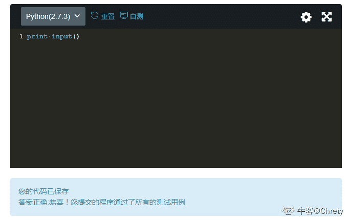
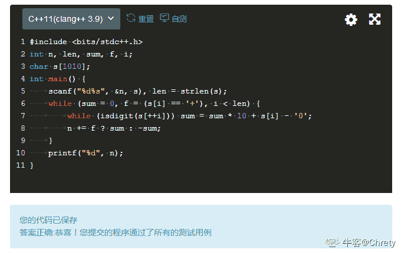

# 快手 2019 年秋季校园招聘笔试试卷—测试 A 试卷

## 1

对字符串进行 RLE 压缩，将相邻的相同字符，用计数值和字符值来代替。例如：aaabccccccddeee，则可用 3a1b6c2d3e 来代替。数据范围：字符串长度满足 

本题知识点

测试工程师 快手 字符串 *模拟 2019* *讨论

[ElonB](https://www.nowcoder.com/profile/623894)

```cpp
"""
字符串压缩
"""
import sys

if __name__ == "__main__":
    # sys.stdin = open("input.txt", "r")
    s = input().strip()
    count = 1
    ans = ""
    for i in range(1, len(s)):
        if s[i] == s[i - 1]:
            count += 1
        else:
            ans += str(count) + s[i - 1]
            count = 1
    ans += str(count) + s[-1]
    print(ans)

```

发表于 2019-07-10 11:16:03

* * *

[广州市民林先生](https://www.nowcoder.com/profile/241061362)

比较朴素的解法

```cpp
#include <iostream>
#include <string>
using namespace std;

//相邻的相同字符-用计数值和字符值代替
//几个 a 几个 b 几个 c

int main(){
    string str, res;
    int ct = 0;
    cin >> str;

    while(str.find_first_not_of(str[0]) != string::npos) {
        char element = str[0];
        int end = str.find_first_not_of(element);
        ct = end;
        res = res + to_string(ct) + element;
        str = str.substr(end);
    }
    int len = str.length();
    res = res + to_string(len) + str[0];
    cout << res << endl;
    return 0;
}
```

编辑于 2020-05-18 21:34:08

* * *

[亚洲舞王智海](https://www.nowcoder.com/profile/707254802)

```cpp

```
string=input()
list1=list(string)#保留顺序
list2=list(set(string))#去掉重复
list2.sort(key=list1.index)#按原顺序排序
for i in list2:
    count=string.count(i)
    print(str(count)+i,end='')
```cpp

```

发表于 2019-12-26 14:04:50

* * *

## 2

解析加减法运算
如：
输入字符串："1+2+3" 输出："6"
输入字符串："1+2-3" 输出："0"
输入字符串："-1+2+3" 输出："4"
输入字符串："1" 输出："1"
输入字符串："-1" 输出："-1"

已知条件：输入的运算都是整数运算，且只有加减运算
要求：输出为 String 类型，不能使用内建的 eval()函数数据范围：计算过程中所有值满足 ，输入的字符串长度满足 

本题知识点

测试工程师 快手 数组 模拟 字符串 *数学 2019* *讨论

[Chrety](https://www.nowcoder.com/profile/994602167)

py2 作弊解法

```cpp
print input()

```

怕某些人再和上面的解法过不去这里给出 C++正经解法输出 string 类型的话随便转一下就 OK 了，int 的话也没啥问题

```cpp
#include <bits/stdc++.h>
int n, len, sum, f, i;
char s[110];
int main() {
	scanf("%d%s", &n, s), len = strlen(s);
	while (n += f ? sum : -sum, sum = 0, f = (s[i] == '+'), i < len)
		while (isdigit(s[++i])) sum = sum * 10 + s[i] - '0';
	printf("%d", n);
}
```

两种解法都可以过

编辑于 2019-09-22 10:50:54

* * *

[LeRayonVert](https://www.nowcoder.com/profile/683290133)

取巧做法，把计算式分开读入刚好就是对应的整型数值。例如 1+1-1，如果用>>来读入 int 类型的话会分别读入+1，+1，-1，加起来就是结果

```cpp
#include<iostream>
#include<sstream>
using namespace std;

int main(){
    string s;
    cin>>s;
    stringstream ss(s);
    int mid,count=0;
    while(ss>>mid){
        count+=mid;
    }
    cout<<count;
    return 0;
}
```

发表于 2020-02-09 14:32:05

* * *

[一叶之秋~](https://www.nowcoder.com/profile/1319299)

简单点！用 java 的方式简单点！

```cpp
import java.util.*;
public class Main{
    public static void main(String[] args){
        Scanner in = new Scanner(System.in);
        String str = in.nextLine();
        int res = 0, start = 0, pos=1;
        for(; pos<str.length(); pos++){
            if(str.charAt(pos)=='+' || str.charAt(pos)=='-'){
                res += Integer.parseInt(str.substring(start, pos));
                start = pos;
            }
        }
        res += Integer.parseInt(str.substring(start, pos));
        System.out.println(res);
        in.close();
    }
}

```

发表于 2019-03-21 17:15:43

* * *

## 3

选出不属于黑盒测试方法的选项

正确答案: D   你的答案: 空 (错误)

```cpp
测试用例覆盖
```

```cpp
输入覆盖
```

```cpp
输出覆盖
```

```cpp
分支覆盖
```

本题知识点

测试工程师 快手 测试工程师 快手 2019

讨论

[申金鑫](https://www.nowcoder.com/profile/7543696)

分支覆盖属于白盒测试，黑盒测试把测试内容当成黑盒子，看不到分支

发表于 2019-06-30 00:45:14

* * *

## 4

计算机中存储一个数是以二进制形式存储的，那么-7 的补码是

正确答案: B   你的答案: 空 (错误)

```cpp
11111001
```

```cpp
11111010
```

```cpp
10000111
```

```cpp
10001001
```

本题知识点

Java 工程师 C++工程师 快手 测试工程师 2019 游戏研发工程师

讨论

[不会 CRUD 的 boy(已毕业)](https://www.nowcoder.com/profile/3018058)

原码 10000111 反码  11111000 补码 （加一）11111001 选 A

发表于 2018-11-29 19:28:23

* * *

[申金鑫](https://www.nowcoder.com/profile/7543696)

负数的补码应该是原码除第一位外取反再加一，所以应该选 A

发表于 2019-06-30 00:49:31

* * *

[冯浩雄和他的 QQ](https://www.nowcoder.com/profile/319548931)

不应该是 1001 吗

发表于 2018-11-06 17:47:32

* * *

## 5

如果要删除表 A（id, name, score）中的 score，正确的 SQL 语句是

正确答案: C   你的答案: 空 (错误)

```cpp
DELETE score from A
```

```cpp
DROP score from A
```

```cpp
ALERT TABLE A DROP score
```

```cpp
UPDATE TABLE A DROP score
```

本题知识点

测试工程师 快手 2019

讨论

[申金鑫](https://www.nowcoder.com/profile/7543696)

应该是 alter

发表于 2019-06-30 00:50:28

* * *

## 6

当 http 请求出现以下哪一类状态码时，需要到服务器端排查错误

正确答案: D   你的答案: 空 (错误)

```cpp
2xx
```

```cpp
3xx
```

```cpp
4xx
```

```cpp
5xx
```

本题知识点

测试工程师 快手 2019

讨论

[申金鑫](https://www.nowcoder.com/profile/7543696)

2xx 正确 3xx 重定向 4xx 客户端错误 5xx 服务端错误

发表于 2019-06-30 00:51:09

* * *

## 7

执行命令 chmod 644 filename 后，文件属主拥有什么样的权限？

正确答案: B   你的答案: 空 (错误)

```cpp
读权限
```

```cpp
读、写权限
```

```cpp
执行权限
```

```cpp
读、写、执行权限
```

本题知识点

测试工程师 快手 2019

讨论

[牛客 319006779 号](https://www.nowcoder.com/profile/319006779)

最高位是设置文件所有者访问权限，第二位是设置群组访问权限，最低位是设置其他人访问权限其中每一位的权限用数字来表示：

· r(Read，读取，权限值为 4)

· w(Write,写入，权限值为 2)

· x(eXecute，执行，权限值为 1)所以 644 对于文件属主看最高位 6（4+2），或看做二进制 110，表示有读写权限

发表于 2020-10-21 15:34:15

* * *

[申金鑫](https://www.nowcoder.com/profile/7543696)

三个权限的顺序分别是读写和执行 6 是 110，只有读写

发表于 2019-06-30 00:52:20

* * *

## 8

关于 HTTP 局限，描述不正确的是：

正确答案: C   你的答案: 空 (错误)

```cpp
一条连接上只可发送一个请求
```

```cpp
请求只能从客户端开始
```

```cpp
请求/响应首部经过压缩后发送
```

```cpp
可以任意选择数据压缩格式。
```

本题知识点

测试工程师 快手 2019

## 9

关于 OSI 七层协议模型，以下说法错误的一项是

正确答案: A   你的答案: 空 (错误)

```cpp
网络层需要处理端到端的流量控制问题
```

```cpp
数据链路层可以在不可靠的物理介质上提供可靠的传输
```

```cpp
应用层可以为操作系统提供访问网络服务的接口
```

```cpp
表示层需要对数据进行加密、压缩、格式转换等
```

本题知识点

测试工程师 快手 2019

讨论

[不会 CRUD 的 boy(已毕业)](https://www.nowcoder.com/profile/3018058)

```cpp
处理端到端的流量控制和差错控制的是传输层  
所以 A 错
```

发表于 2018-11-29 19:36:21

* * *

## 10

设局域网中含有多台计算机与一台网络打印机，通常打印机中会设置一个打印数据缓冲区以满足多个打印任务的需求，该缓冲区的逻辑结构应该是

正确答案: B   你的答案: 空 (错误)

```cpp
栈
```

```cpp
队列
```

```cpp
树
```

```cpp
图
```

本题知识点

测试工程师 快手 2019

## 11

使用 sql 语句查询 class 列不是 NULL 的记录，WHERE 语句正确的是

正确答案: B   你的答案: 空 (错误)

```cpp
WHERE class != NULL;
```

```cpp
WHERE class IS NOT NULL;
```

```cpp
WHERE class NOT NULL;
```

```cpp
WHERE class !NULL;
```

本题知识点

测试工程师 快手 2019

讨论

[沉默不要代价](https://www.nowcoder.com/profile/931681910)

B

发表于 2018-12-27 08:07:08

* * *

[牛客 158536749 号](https://www.nowcoder.com/profile/158536749)

B 因为进行 null 的判断是使用 IS NULL ,不是 NULL 的判断使用 IS NOT NULL

发表于 2021-02-28 10:03:29

* * *

[天才神经病](https://www.nowcoder.com/profile/410344561)

B

发表于 2019-03-05 16:13:50

* * *

## 12

下面哪些是 Thread 类的方法

正确答案: A B C D   你的答案: 空 (错误)

```cpp
start()
```

```cpp
run()
```

```cpp
sleep()
```

```cpp
getPriority()
```

本题知识点

测试工程师 快手 2019

讨论

[咲咲](https://www.nowcoder.com/profile/2220510)

D

发表于 2020-04-16 13:55:50

* * *

[jay 晴天](https://www.nowcoder.com/profile/2934247)

在测试 B 里 Thread 类没有 D 方法

发表于 2019-04-13 13:49:28

* * *

[Yoke201904061531392](https://www.nowcoder.com/profile/619251162)

D

发表于 2019-04-06 22:03:02

* * *

## 13

下列哪个运输层协议传输延迟最短，提供低开销传输因而可用于不需要可靠数据传输，实时性要求高的应用场合

正确答案: B   你的答案: 空 (错误)

```cpp
TCP
```

```cpp
UDP
```

```cpp
HTTP
```

```cpp
DNS
```

本题知识点

测试工程师 快手 2019

讨论

[女朋友等我拿 offer](https://www.nowcoder.com/profile/263275409)

DNS 应用层

发表于 2018-11-13 16:22:30

* * *

## 14

经过表达式 a = 5 ? 0 : 1 的运算，变量 a 的最终值是

正确答案: C   你的答案: 空 (错误)

```cpp
5
```

```cpp
1
```

```cpp
0
```

```cpp
true
```

本题知识点

测试工程师 快手 测试工程师 快手 2019

讨论

[烛光月影](https://www.nowcoder.com/profile/6922987)

```cpp
C
```

其实题目中编译并不能通过，不过可以通过 a****修改 class 执行，在语言层面不符合编译规范，在虚拟机方面没有限制。boolean 虚拟机取值时候是掩码去掉前七位之后取末尾判断，0 是 false，1 是 true，而 5 对应的是 00001001，所以这块表示的是 1，也就是 true，所以对应的是三目运算里面的结果 0，故而 c 是正确的。

```cpp
也就是这种情况，奇数表示 true，偶数表示 false。
```

发表于 2019-06-12 14:40:37

* * *

[E-2FN0.~Sl9](https://www.nowcoder.com/profile/186541963)

```cpp
if(5 == 5) a = 0;
else a = 1;
```

发表于 2018-12-15 11:23:37

* * *

[骑着一颗大芋圆](https://www.nowcoder.com/profile/790254047)

C5 相当于 true，经过三目判断符，最后结果为 0

发表于 2018-12-14 20:29:12

* * *

## 15

Linux 文件系统的文件都按其作用分门别类地放在相关的目录中，对于外部设备文件，一般应将其放在（）目录中。

正确答案: C   你的答案: 空 (错误)

```cpp
/bin
```

```cpp
/etc
```

```cpp
/dev
```

```cpp
/lib
```

本题知识点

测试工程师 快手 测试工程师 快手 2019

讨论

[Happytoo](https://www.nowcoder.com/profile/541104505)

c

发表于 2019-01-30 12:39:58

* * *

## 16

主存贮器和 CPU 之间增加 cache 的目的是

正确答案: A   你的答案: 空 (错误)

```cpp
解决 CPU 和主存之间的速度匹配问题
```

```cpp
扩大主存贮器的容量
```

```cpp
扩大 CPU 中通用寄存器的数量
```

```cpp
扩大外存的容量
```

本题知识点

测试工程师 快手 2019

讨论

[天才神经病](https://www.nowcoder.com/profile/410344561)

A

发表于 2019-03-05 16:15:20

* * *

[skr~!](https://www.nowcoder.com/profile/167322285)

主存贮器和 CPU 之间增加***的目的是

*   ```cpp
    解决 CPU 和主存之间的速度匹配问题
    ```

发表于 2019-01-03 19:55:25

* * *

[大厂小牛](https://www.nowcoder.com/profile/460698940)

选 B

发表于 2019-01-03 17:04:36

* * *

## 17

根据给出的数字推算括号中应该填写的数字 8，16，12，14，（）

正确答案: B   你的答案: 空 (错误)

```cpp
12
```

```cpp
13
```

```cpp
15
```

```cpp
16
```

本题知识点

测试工程师 快手 2019

讨论

[牛客 826445453 号](https://www.nowcoder.com/profile/826445453)

8，16，12，14，（）8 + （+）（2）**3 = 16；16+（-） （2）**2 = 12；12+（+）（2）**1 = 14；14+（-） （2）**0 = 13；

发表于 2020-04-12 13:16:53

* * *

[天才神经病](https://www.nowcoder.com/profile/410344561)

B

发表于 2019-03-05 16:15:53

* * *

[lDO](https://www.nowcoder.com/profile/667366958)

B

发表于 2018-12-12 23:54:15

* * *

## 18

C 语言中，若有定义: int a=8,b=5,c;  ,执行语句 c=a/b+0.4;后，c 的值是（）

正确答案: B   你的答案: 空 (错误)

```cpp
1.4
```

```cpp
1
```

```cpp
2.0
```

```cpp
2
```

本题知识点

C++工程师 快手 测试工程师 2019 游戏研发工程师 C 语言

讨论

[恩！就这！](https://www.nowcoder.com/profile/407649038)

在 c 程序中没有四佘五入一说，就算 0.9 如果是 int 型也不会进 1

发表于 2020-12-11 15:33:02

* * *

[是风儿呀](https://www.nowcoder.com/profile/120968686)

b

发表于 2020-06-10 23:38:51

* * *

[hao_wang](https://www.nowcoder.com/profile/804156673)

a/b=1  +0.4 后还是 int 类型 1

发表于 2019-11-05 13:12:03

* * *

## 19

下面哪一项不是 web server

正确答案: A   你的答案: 空 (错误)

```cpp
Zaob
```

```cpp
IIS
```

```cpp
Jigsaw
```

```cpp
Apache
```

本题知识点

测试工程师 快手 2019

讨论

[南墙小姐](https://www.nowcoder.com/profile/315153081)

A

发表于 2019-03-29 17:33:04

* * *

## 20

下列哪一个位置从最小到最大顺序排列公共数据元素？

正确答案: C   你的答案: 空 (错误)

```cpp
Character, file,record,field,database
```

```cpp
Character,record,field,file,database
```

```cpp
Character, field,record,file,database
```

```cpp
Bit,byte,character,record,field,file,database
```

本题知识点

测试工程师 快手 2019

讨论

[万古成空](https://www.nowcoder.com/profile/434566274)

c

发表于 2019-03-02 20:14:31

* * *

## 21

10 个相同的糖果，分给三个人，每个人至少要得一个。有（）种不同分法

正确答案: D   你的答案: 空 (错误)

```cpp
33
```

```cpp
34
```

```cpp
35
```

```cpp
36
```

本题知识点

测试工程师 快手 2019

讨论

[aliexu](https://www.nowcoder.com/profile/599387454)

相当于 10 颗糖摆在桌上，在其中划两条线分成三份，划线的位置有 9 个，所以是从九个位置中选两个：9×8/2=36

发表于 2019-01-09 10:06:20

* * *

[勇敢牛牛向前冲](https://www.nowcoder.com/profile/899325922)

题干要求，把 10 颗糖给 A,B,C 三个人至少一人一个为满足上要求，本人用排列组合来做，首先从 10 颗糖中，拿出三颗，为大前提，即 C[10]³然后满足要求，从糖堆中随机一颗一颗取 3 颗糖分给 A,B,C 三个人，即 C[10]¹C[9]¹C[8]¹,最后 3 个人，一个一个领糖，C[3]¹C[2]¹,^(最后)C[10]¹C[9]¹C[8]¹*C[3]¹C[2]¹/C[10]³=36

发表于 2021-05-04 13:42:59

* * *

## 22

静态变量通常存储在进程哪个区？

正确答案: D   你的答案: 空 (错误)

```cpp
栈区
```

```cpp
堆区
```

```cpp
代码区
```

```cpp
全局区
```

本题知识点

Java 工程师 C++工程师 快手 测试工程师 快手 测试工程师 快手 2019 游戏研发工程师 快手 2019

讨论

[雪豹 2017](https://www.nowcoder.com/profile/285044524)

c++程序内存布局： 1)全局区（静态区）（static）存放全局变量、静态数据，const 常量。程序结束后有系统释放 2)栈区（stack） 函数运行时分配，函数结束时释放。由编译器自动分配释放 ，存放为运行函数而分配的局部变量、函数参数、返回数据、返回地址等。其操作方式类似于数据结构中的栈。 3)堆区（heap） 一般由程序员分配释放， 若程序员不释放，程序结束时可能由 OS（操作系统）回收。分配方式类似于链表。 4)文字常量区 常量字符串就是放在这里的。 程序结束后由系统释放。 5)程序代码区存放函数体（类成员函数和全局函数）的二进制代码。

发表于 2019-03-30 00:16:10

* * *

## 23

Python 不支持的数据类型有

正确答案: A   你的答案: 空 (错误)

```cpp
char
```

```cpp
int
```

```cpp
float
```

```cpp
list
```

本题知识点

Java 工程师 C++工程师 快手 测试工程师 快手 测试工程师 快手 2019 游戏研发工程师 快手 2019

讨论

[ZHAOSHUYA](https://www.nowcoder.com/profile/704089044)

正确答案：APython 没有 char 或 byte 类型来保存单一字符或 8 比特整数。你可以使用长度为 1 的字符串表示字符或 8 比特整数。 

发表于 2019-04-25 17:24:33

* * *

[踩在浪花上 114](https://www.nowcoder.com/profile/729436662)

```cpp
char 不是 python 的数据类型，mysql 用到过这个
```

发表于 2019-04-24 17:54:04

* * *

## 24

设栈 S 初始状态为空。元素 a,b,c,d,e,f 依次通过栈 S，若出栈的顺序为 c,f,e,d,b,a，则栈 S 的容量至少应该为（）

正确答案: C   你的答案: 空 (错误)

```cpp
3
```

```cpp
4
```

```cpp
5
```

```cpp
6
```

本题知识点

测试工程师 快手 2019

讨论

[aliexu](https://www.nowcoder.com/profile/599387454)

5 个，c 出栈到 f 出栈，需 5 个容量

发表于 2019-01-09 10:07:49

* * *

## 25

下面编译器可以指出的错误是 （）

正确答案: A   你的答案: 空 (错误)

```cpp
Syntax error
```

```cpp
Symantic error
```

```cpp
Logical error
```

```cpp
Internal error
```

本题知识点

测试工程师 快手 2019

讨论

[aliexu](https://www.nowcoder.com/profile/599387454)

A

发表于 2019-01-09 10:08:13

* * *

## 26

设一棵哈夫曼树共有 n 个非叶结点，则该树一共有（  ）个结点

正确答案: B   你的答案: 空 (错误)

```cpp
2*n-1
```

```cpp
2*n +1
```

```cpp
2*n
```

```cpp
2*(n-1)
```

本题知识点

测试工程师 快手 2019

讨论

[倔强顽童小焱](https://www.nowcoder.com/profile/472588783)

B  哈夫曼数叶子节点比非叶子节点数多一，所以为 2*n+1;

发表于 2019-03-30 10:48:52

* * *

[南墙小姐](https://www.nowcoder.com/profile/315153081)

B 二叉树

发表于 2019-03-30 09:43:15

* * *

## 27

下面有关系统并发访问数估算数据哪个最有效？

正确答案: B   你的答案: 空 (错误)

```cpp
高峰时段日处理业务量 100000
```

```cpp
高峰时段平均每秒请求数 80
```

```cpp
同时在线用户 100
```

```cpp
平均每秒用户请求 50
```

本题知识点

测试工程师 快手 2019

讨论

[LeoJ201907012331838](https://www.nowcoder.com/profile/493278605)

并行：是指两个或多个事件同一时刻发生（同时发生）；并发：是指两个或多个事件在同一时间段内发生；

发表于 2019-09-05 23:58:47

* * *

[Nicolezy](https://www.nowcoder.com/profile/309143281)

B

发表于 2019-02-26 20:11:20

* * *

## 28

以下关于 Ajax 的表述错误的是：

正确答案: A   你的答案: 空 (错误)

```cpp
Ajax 支持浏览器 back 按钮
```

```cpp
Ajax 可以实现页面局部刷新
```

```cpp
Ajax 通过 xml 或 json 格式与服务端交换数据
```

```cpp
Ajax 可以减轻服务器负载
```

本题知识点

测试工程师 快手 2019

讨论

[街头一人](https://www.nowcoder.com/profile/571570408)

A.

*   Ajax 优势

* 优秀的用户体验
这是 Ajax 最大的优点，能在不刷新整个页面前提下更新数据

* 提高 web 程序的性能
与传统模式相比，Ajax 模式在性能上最大的区别在于传输数据的方式，在传统模式中，数据的提交   时通过表单来实现的。Ajax 模式只是通过 XMLHttpRequest 对象向服务器提交希望提交的数据，即按需求发  送。

* 减轻服务器和带宽的负担
Ajax 的工作原理相当于在用户和服务器之间加了一个中间层，使用户操作与服务器响应异步化。它在客户端创建 Ajax 引擎，把传统方式下的一些服务器负担的工作转移到客户端，便于客户端资源来处理，减轻服务器和带宽的负担

* Ajax 的不足

* 浏览器对 XMLHttpRequest 对象的支持度不足

* 破坏浏览器前进、后退按钮的正常功能

* 对搜索引擎的支持的不足

* 开发和调试工具的缺乏 编辑于 2020-07-27 15:47:02

* * *

[Nicolezy](https://www.nowcoder.com/profile/309143281)

C

发表于 2019-02-26 20:12:27

* * *

## 29

假如被测试的程序片段：if ((x > 1) || (y <= 4)) { a = 3}, 如果需要对(x,y)用判定覆盖设计测试用例，以下选项中最正确的一组是（）

正确答案: D   你的答案: 空 (错误)

```cpp
(1,2)、(3,4)、(4,3)、(2,1)
```

```cpp
(2,5)、(0,5)、(3,2)、(0,1)
```

```cpp
(2,2)、(0,0)
```

```cpp
(3,5)、(1,2)
```

本题知识点

测试工程师 快手 2019

讨论

[9028_qqq](https://www.nowcoder.com/profile/125866061)

Cx=2 y=2 则判定为真 x=0 y=0 则判定为假两种情况都覆盖了 D 选项 两个测试用例 判定都为真

发表于 2020-10-07 14:24:27

* * *

[南墙小姐](https://www.nowcoder.com/profile/315153081)

D 判定覆盖：每个分支取真和假值至少一次

发表于 2019-03-30 10:02:49

* * *

[Nicolezy](https://www.nowcoder.com/profile/309143281)

Ｃ

发表于 2019-02-26 20:15:08

* * *

## 30

下列有关 RAM 和 ROM 的叙述中，正确的是（）

1\. RAM 是随机存取存储器; ROM 是只读存储器

2\. RAM 和 ROM 都是采用随机存取的方式进行信息访问

3 . RAM 和 ROM 都可用作 Cache

4 . RAM 和 ROM 都需要进行刷新

正确答案: A   你的答案: 空 (错误)

```cpp
1 和 2 正确
```

```cpp
2 和 3 正确
```

```cpp
1，2，3 正确
```

```cpp
2，3，4 正确
```

本题知识点

测试工程师 快手 2019

讨论

[陈蕊 201903141927797](https://www.nowcoder.com/profile/235226841)

A 么

发表于 2019-03-28 01:13:26

* * *

## 31

栈和队列的共同特点是（）

正确答案: C   你的答案: 空 (错误)

```cpp
都是先进后出
```

```cpp
都是先进先出
```

```cpp
只允许在端点处插入和删除元素
```

```cpp
没有共同点
```

本题知识点

测试工程师 快手 2019

讨论

[陈蕊 201903141927797](https://www.nowcoder.com/profile/235226841)

C

发表于 2019-03-28 01:13:59

* * *

## 32

列哪一个属性是 CSS3 新增的属性？

正确答案: B   你的答案: 空 (错误)

```cpp
border
```

```cpp
box-shadow
```

```cpp
background
```

```cpp
display
```

本题知识点

测试工程师 快手 测试工程师 快手 2019

讨论

[陈蕊 201903141927797](https://www.nowcoder.com/profile/235226841)

B 么

发表于 2019-03-28 01:14:26

* * *

[万古成空](https://www.nowcoder.com/profile/434566274)

b

发表于 2019-03-02 20:24:08

* * *

## 33

有正则表达式\w+([-.]\w+)*@\w+([-.]\w+)+，以下不能成功匹配的是：

正确答案: C   你的答案: 空 (错误)

```cpp
zhangsan_01@kuaishou.com
```

```cpp
zhangsan@live-kuaishou.com
```

```cpp
zhangsan01.bj@kuaishou
```

```cpp
zhangsan@kuaishou.com
```

本题知识点

Java 工程师 C++工程师 快手 测试工程师 2019 游戏研发工程师

讨论

[WEBJ2EE](https://www.nowcoder.com/profile/3930151)

\w+([-.]\w+)*@***\w+([-.]\w+)+***    先看后面，N 个字符后，必须跟着一个或多个子域         @xxxxxx-xxxxx         @yyyyyy.yyyyy 所以 C，没有子域的，不满足题意。

发表于 2019-12-14 11:18:46

* * *

## 34

在实现基于 TCP 的网络应用程序时，服务器端正确的处理流程是（）

正确答案: C   你的答案: 空 (错误)

```cpp
socket() -&gt; bind() -&gt; listen() -&gt; connect() -&gt; read()/write() -&gt; close()
```

```cpp
socket() -&gt; bind() -&gt; listen() -&gt; read()/write() -&gt; close()
```

```cpp
socket() -&gt; bind() -&gt; listen() -&gt; accept() -&gt; read()/write() -&gt; close()
```

```cpp
socket() -&gt; connect() -&gt; read()/write() -&gt; close()
```

本题知识点

Java 工程师 C++工程师 快手 测试工程师 2019 游戏研发工程师

讨论

[201904231924340](https://www.nowcoder.com/profile/321569537)

基于 TCP(面向连接的)socket 编程的服务器端程序流程如下：
1.创建套接字（socket）.
2.将套接字绑定到一个本地地址和端口上（bind）。
3.将套接字设为监听模式，准备接收客户请求（listen）.
4.等待客户请求到来；当请求到来后，接受连接请求，反回一个新的对应于些次连接的套接字（accept）
5.用返回的套接字和客户端进行通信（send/recv or read/write）.
6.返回，等待另一客户请请求。
7.关闭套接字。

基于 TCP(面向连接)socket 编程的客户端程序流程如下：
1.创建套接字（socket）。
2.向服务器发出连接请请求（connect）。
3.和服务器进行通信（send/recv）。
4.关闭套接字。

发表于 2019-08-28 21:16:06

* * *

[singerJ](https://www.nowcoder.com/profile/987708079)

基于 TCP(面向连接的)socket 编程的服务器端程序流程如下：
1.创建套接字（socket）.
2.将套接字绑定到一个本地地址和端口上（bind）。
3.将套接字设为监听模式，准备接收客户请求（listen）.
4.等待客户请求到来；当请求到来后，接受连接请求，反回一个新的对应于些次连接的套接字（accept）
5.用返回的套接字和客户端进行通信（send/recv or read/write）.
6.返回，等待另一客户请请求。
7.关闭套接字。

发表于 2020-04-25 18:15:11

* * *

## 35

以下（）语句从表 TABLE_NAME 中提取前 10 条记录

正确答案: B   你的答案: 空 (错误)

```cpp
select * from TABLE_NAME where rowcount=10
```

```cpp
select * from TABLE_NAME limit 10
```

```cpp
select TOP of 10 * from TABLE_NAME
```

```cpp
select * from TABLE_NAME where rowcount&lt;=10
```

本题知识点

测试工程师 快手 测试工程师 快手 2019

讨论

[陈蕊 201903141927797](https://www.nowcoder.com/profile/235226841)

A 么

发表于 2019-03-28 01:15:38

* * *

## 36

一个有 20 个节点的有向无环图，最多有（）条有向边

正确答案: B   你的答案: 空 (错误)

```cpp
180
```

```cpp
190
```

```cpp
200
```

```cpp
210
```

本题知识点

测试工程师 快手 2019

讨论

[201904231924340](https://www.nowcoder.com/profile/321569537)

 具有 n 个节点的有向无环图具有(N-1)N/2 条有向边

发表于 2019-08-28 21:20:14

* * *

[万古成空](https://www.nowcoder.com/profile/434566274)

b

编辑于 2019-03-02 20:28:44

* * *

## 37

多个线程可同时操作一个数据，为了保证该数据的准确性，可将操作该数据的部分改为 ()

正确答案: D   你的答案: 空 (错误)

```cpp
异步
```

```cpp
只读
```

```cpp
只写
```

```cpp
同步
```

本题知识点

测试工程师 快手 测试工程师 快手 2019

讨论

[万古成空](https://www.nowcoder.com/profile/434566274)

d

发表于 2019-03-02 20:30:21

* * *

## 38

(7<<1)&15 运算后的结果是()

正确答案: C   你的答案: 空 (错误)

```cpp
7
```

```cpp
15
```

```cpp
14
```

```cpp
8
```

本题知识点

测试工程师 快手 测试工程师 快手 2019

讨论

[201904231924340](https://www.nowcoder.com/profile/321569537)

<发表于 2019-08-28 21:23:22

* * *

[万古成空](https://www.nowcoder.com/profile/434566274)

C

发表于 2019-03-02 20:32:03

* * *

## 39

软件测试的目标是（）。

正确答案: B   你的答案: 空 (错误)

```cpp
排除软件中所有的错误
```

```cpp
发现问题、降低风险
```

```cpp
证明软件是正确的
```

```cpp
与软件调试相同
```

本题知识点

测试工程师 快手 2019

讨论

[万古成空](https://www.nowcoder.com/profile/434566274)

b

发表于 2019-03-02 20:32:18

* * *

## 40

假设我们每天 80%的访问集中在 20%的时间里（峰值），如果每天有 300 万的 pv，而 我们的单台机器的 QPS 为 58，那么大概需要几台这样的机器

正确答案: B   你的答案: 空 (错误)

```cpp
2
```

```cpp
3
```

```cpp
4
```

```cpp
5
```

本题知识点

Java 工程师 C++工程师 快手 测试工程师 2019 游戏研发工程师

讨论

[申金鑫](https://www.nowcoder.com/profile/7543696)

假设我们每天 80%的访问集中在 20%的时间里（峰值），如果每天有 300 万的 pv，而 我们的单台机器的 QPS 为 58，那么大概需要几台这样的机器 300W 的 pv，80%就是 240W，集中在 20% 的时间就是 24*3600/5 s 内，即 240W/(24*3600/5)*58 = 2.39,所以需要 3 台

发表于 2019-06-30 00:59:48

* * *

## 41

有两个从小到大排好序的数组，长度分别为 N 和 M，将这两个数组合并成一个有序数组的最小比较次数是？

正确答案: A   你的答案: 空 (错误)

```cpp
Min(N, M)
```

```cpp
M + N -1
```

```cpp
Max(N, M)
```

```cpp
N + M
```

本题知识点

Java 工程师 C++工程师 快手 测试工程师 安卓工程师 iOS 工程师 运维工程师 前端工程师 算法工程师 PHP 工程师 2019 游戏研发工程师

讨论

[原知](https://www.nowcoder.com/profile/393643081)

那{1,2,3,9}和{5,6,7}呢

发表于 2019-09-26 11:56:30

* * *

[zhongliwen](https://www.nowcoder.com/profile/2605138)

取巧法：定义第一个数组为 [1,2]，第二个数组为[3,4,5,6,7,8,9...100]

发表于 2019-02-25 18:27:44

* * *

## 42

 int fun(int a)

{

 a = (1 << 5) - 1;

 return a;

}

fun(21)结果是（） 

正确答案: B   你的答案: 空 (错误)

```cpp
10
```

```cpp
31
```

```cpp
20
```

```cpp
5
```

本题知识点

Java 工程师 C++工程师 快手 测试工程师 快手 Java 工程师 C++工程师 安卓工程师 iOS 工程师 运维工程师 前端工程师 算法工程师 PHP 工程师 测试工程师 快手 测试工程师 快手 2019 C++工程师 Java 工程师 快手 2019 游戏研发工程师 快手 2019

讨论

[千幻 201809150945567](https://www.nowcoder.com/profile/280877806)

跟传入的数值没有关系，a=(1<<5)-1; 就是将 1 左移 5 位变为二进制 100000 转换为十进制为 32，然后减 1，a 的值就出来了 31

发表于 2018-11-06 17:07:00

* * *

## 43

一个非空整数数组，选择其中的两个位置，使得两个位置之间的数和最大。如果最大的和为正数，则输出这个数；如果最大的和为负数或 0 ，则输出 0 数据范围：  ，数组中的值满足 

本题知识点

测试工程师 快手 数组 贪心 动态规划 2019

讨论

[叶挽秋](https://www.nowcoder.com/profile/754934722)

这题最操蛋的是，输入竟然是一个字符串，但是又没有说明。

```cpp
import java.util.*;
/*
数组的子数组最大和问题
从前向后累加，每累加一个判断是否是新的最大值
若累加值<=0，说明左边的数组对右边的数组继续累加没有意义，则重新开始累加
比如 1，2，-4，5，6 这样一个数组
累加到 1 时，最大和为 1
累加到 2 时，最大和为 3
累加到-4 时，结果为-1，最大和仍为 3，但由于左边三个数之和为-1，右边的子序列包括这一段不能使和更大，
因此从 5 开始重新累加
最终最大子序列和为 11
*/
public class Main {
    public static void main(String[] args) {
        Scanner scanner = new Scanner(System.in);
        String inputStr = scanner.next();
        String[] inputStrs = inputStr.split(",");
        long sum = 0;
        long max = 0;
        for (String str : inputStrs) {
            long num = Integer.parseInt(str);
            sum += num;
            max = max > sum ? max : sum;
            sum = sum < 0 ? 0 : sum;
        }
        System.out.println(max);
    }
}
```

编辑于 2020-02-17 12:59:50

* * *

[广州市民林先生](https://www.nowcoder.com/profile/241061362)

比较朴素的做法

```cpp
#include <iostream>
#include <algorithm>
using namespace std;

int main(){
    string str;
    cin >> str;
    int k;
    vector<int> arr;
    while((k = str.find(',')) != str.npos){
        string temp = str.substr(0, k);
        arr.push_back(stoi(temp));
        str = str.substr(k + 1);
    }
    arr.push_back(stoi(str));
    int tempmax = 0;
    int realmax = arr[0];
    for(int i = 0; i < arr.size(); ++i){
        if(arr[i] <0){
            tempmax = arr[i];
        }
        else{
            tempmax += arr[i];
            if(tempmax <= 0){
                tempmax = arr[i];
            }
        }
        if(tempmax > realmax){
            realmax = tempmax;
        }
    }
    if(realmax <= 0){
        cout << 0 << endl;
    }
    else{
        cout << realmax << endl;
    }
    return 0;
}
```

编辑于 2020-05-17 12:00:37

* * *

[亚洲舞王智海](https://www.nowcoder.com/profile/707254802)

```cpp
a=input().split(',')
maxm=num=0
for j in a:
    num=num+int(j) if num+int(j)>0 else 0#如果当前和非负则保留，为负则舍弃
    maxm=max(maxm,num)
print(maxm)

```

编辑于 2019-12-26 14:02:52

* * ***