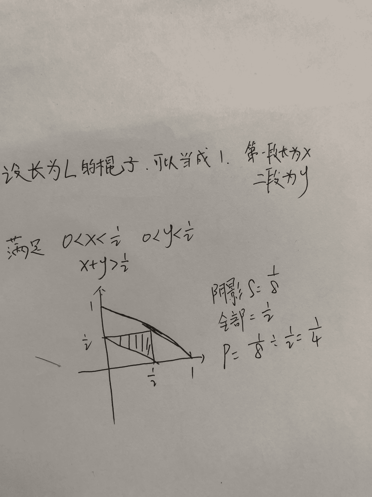
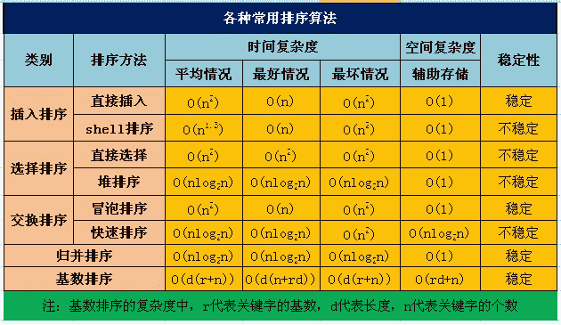

# 快手 2019 年秋季校园招聘笔试试卷—工程 A 试卷

## 1

```cpp
书架上有 19 本书，编号分别 1-19，选取 5 本，其中任意两本不相邻的的取法有多少?
```

正确答案: B   你的答案: 空 (错误)

```cpp
2002
```

```cpp
3003
```

```cpp
11628
```

```cpp
360360
```

本题知识点

Java 工程师 C++工程师 快手 Java 工程师 C++工程师 安卓工程师 iOS 工程师 运维工程师 前端工程师 算法工程师 PHP 工程师 测试工程师 快手 C++工程师 Java 工程师 快手 2019 游戏研发工程师 快手 2019

讨论

[菜鸡想混进大厂](https://www.nowcoder.com/profile/982613837)

插空法 放 14 个数 剩 5 本 有十五个空 C（15,5）=3003

发表于 2018-11-12 21:46:51

* * *

[cb_guo](https://www.nowcoder.com/profile/217980857)

插空法。可以理解为把 5 本书插到 14 本书的中间，即加头尾的 15 个空格里，有多少种组合。因为不能相邻，所以是有 C(15, 5) = 3003 种方法。

发表于 2019-03-30 14:37:19

* * *

[offer 快到碗里来啊！](https://www.nowcoder.com/profile/4725702)

***1***2***3***4***5***6***7***8***9***10***11***12***13***14***

发表于 2019-05-29 21:17:32

* * *

## 2

以下不能实现交换数字类型变量 a,b 的代码是(不考虑溢出): ()

正确答案: B   你的答案: 空 (错误)

```cpp
a^=b; b^=a;a^=b;
```

```cpp
a=c;c=b;b=a;
```

```cpp
a+=b;b=a-b;a=a-b;
```

```cpp
a=a*b;b=a/b;a=a/b;
```

本题知识点

Java 工程师 C++工程师 快手 安卓工程师 iOS 工程师 运维工程师 前端工程师 算法工程师 PHP 工程师 测试工程师 常识判断 2019 游戏研发工程师

讨论

[ID84848484](https://www.nowcoder.com/profile/8484574)

D:如果 a 是 0 呢？

发表于 2019-03-23 18:17:15

* * *

[菜鸡想混进大厂](https://www.nowcoder.com/profile/982613837)

b 选项 直接覆盖了 a 的值，所有数字都没用了 a 的特征

发表于 2018-11-12 21:47:58

* * *

[斗魂 12138](https://www.nowcoder.com/profile/5704039)

我在想 D，万一除数为 0 呢？

发表于 2019-05-20 19:16:53

* * *

## 3

以下不属于应用层协议的是:

正确答案: D   你的答案: 空 (错误)

```cpp
FTP
```

```cpp
DNS
```

```cpp
SSH
```

```cpp
ICMP
```

本题知识点

Java 工程师 C++工程师 快手 Java 工程师 C++工程师 安卓工程师 iOS 工程师 运维工程师 前端工程师 算法工程师 PHP 工程师 测试工程师 快手 C++工程师 Java 工程师 快手 2019 游戏研发工程师 快手 2019

讨论

[mengban](https://www.nowcoder.com/profile/532649401)

**互联网控制消息协议**（英语：**I**nternet **C**ontrol **M**essage **P**rotocol，缩写：**ICMP**）是互联网协议族的核心协议之一。它用于[TCP/IP](https://zh.wikipedia.org/wiki/TCP/IP)网络中发送控制消息，提供可能发生在通信环境中的各种问题反馈，通过这些信息，使管理者可以对所发生的问题作出诊断，然后采取适当的措施解决。

发表于 2018-11-12 22:02:03

* * *

[王治全](https://www.nowcoder.com/profile/345829746)

常见的应用层协议：

1.DNS 域名系统：网络设备名字转为 IP 地址。

2.FTP 文本传输协议：提供交互式访问，允许客户指明文件类型与格式，允许文件具有存取权限。

3.telnet 远程终端协议。

4.HTTP 超文本传输协议：面向事务的协议，使用面向连接 TCP 作为传输层协议。保证数据可靠传输。

5.SMTP：电子邮件协议，规定了两个相互通信的 SMTP 进程之间如何交换信息

6.POP3:邮件读取协议，接收电子邮件

7.SSH：安全协议

发表于 2019-09-03 13:36:47

* * *

[justorez](https://www.nowcoder.com/profile/8156663)

ICMP 协议是 IP 层的附属协议，属于网络层

发表于 2019-03-30 16:31:56

* * *

## 4

若所有作业同时到达，则平均等待时间最长的调度算法是:

正确答案: A   你的答案: 空 (错误)

```cpp
长作业优先
```

```cpp
先来先服务
```

```cpp
短作业优先
```

```cpp
优先级
```

本题知识点

Java 工程师 C++工程师 快手 安卓工程师 iOS 工程师 运维工程师 前端工程师 算法工程师 PHP 工程师 测试工程师 常识判断 2019 游戏研发工程师

讨论

[梦中的弗莱迪](https://www.nowcoder.com/profile/80297399)

长作业需要的时间久，后面需要等待的时间就越久，平均时间就越久

发表于 2018-11-25 22:12:42

* * *

[月城大人-offer 加一](https://www.nowcoder.com/profile/149660513)

长作业等待时间更长，所以应该先做，这个期间可以做别的

发表于 2020-03-02 20:29:41

* * *

## 5

设指针 q 指向单链表中结点 A，指针 p 指向单链表中结点 A 的后继结点 B，指针 s 指向被插入的结点 X，则在结点 A 和结点 B 插入结点 X 的操作序列为（  ）

正确答案: C   你的答案: 空 (错误)

```cpp
s-&gt;next=p-&gt;next；p-&gt;next=s;
```

```cpp
p-&gt;next=s-&gt;next；s-&gt;next=p；
```

```cpp
q-&gt;next=s； s-&gt;next=p;
```

```cpp
p-&gt;next=s；s-&gt;next=q;
```

本题知识点

Java 工程师 C++工程师 快手 Java 工程师 C++工程师 安卓工程师 iOS 工程师 运维工程师 前端工程师 算法工程师 PHP 工程师 测试工程师 快手 C++工程师 Java 工程师 快手 2019 游戏研发工程师 快手 2019

讨论

[速来 offer](https://www.nowcoder.com/profile/3987069)

应该选 a 吧

发表于 2019-09-16 15:38:26

* * *

[Kumori](https://www.nowcoder.com/profile/6270434)

```cpp
q.next=s； s.next=p;
```

发表于 2018-12-11 17:25:17

* * *

[justorez](https://www.nowcoder.com/profile/8156663)

这道题描述是不是有问题，应该是“在结点 A 和结点 B 之间插入结点 X”吧，看半天没看懂是谁往哪插。。。

发表于 2019-03-30 16:34:33

* * *

## 6

 给定文法 A→bA|cc，则符号串①cc ②bcbc ③bcbcc ④bccbcc ⑤bbbcc 中，是该文法句子的是()

正确答案: B   你的答案: 空 (错误)

```cpp
①③⑤
```

```cpp
①⑤
```

```cpp
②④
```

```cpp
③⑤
```

本题知识点

Java 工程师 C++工程师 快手 安卓工程师 iOS 工程师 运维工程师 前端工程师 算法工程师 PHP 工程师 测试工程师 常识判断 2019 游戏研发工程师

讨论

[zwillwang](https://www.nowcoder.com/profile/937969538)


发表于 2020-03-13 10:22:14

* * *

[Jun_Wang](https://www.nowcoder.com/profile/872513103)

这答案有事吗？没学过计算机的谁知道 A→bA|cc 意思是 A 可以变成 bA 或者 cc 啊，你用中文讲会死啊！

发表于 2020-11-24 23:19:13

* * *

[牛客 926432834 号](https://www.nowcoder.com/profile/926432834)

这是常识？？？？？

发表于 2020-08-28 17:58:07

* * *

## 7

以下代码输出的是()?int foo(int x,int y) {if(x<=0||y<=0) return  1;return  3*foo(x-1,y/2);}cout<<foo(666,5)<<endl;

正确答案: A   你的答案: 空 (错误)

```cpp
27
```

```cpp
666
```

```cpp
81
```

```cpp
9
```

本题知识点

Java 工程师 C++工程师 快手 安卓工程师 iOS 工程师 运维工程师 前端工程师 算法工程师 PHP 工程师 测试工程师 常识判断 2019 游戏研发工程师

讨论

[千幻 201809150945567](https://www.nowcoder.com/profile/280877806)

递归，if 中逻辑运算来判断结束，每一次进入，如果 y 小于等于 0 就跳出递归函数，轮了三次，3*3*3*1=27

发表于 2018-11-06 17:00:49

* * *

[无名的牛客](https://www.nowcoder.com/profile/300533293)

我职能岗给我代码题？？？😭

发表于 2022-01-11 07:51:16

* * *

[姜幼颜](https://www.nowcoder.com/profile/125284324)

```cpp
int foo(int x,int y) { 
  if(x<=0||y<=0) return 1; 
  return 3*foo(x-1,y/2);
} 
cout<<foo(666,5)<<endl;
```

第一次：x= 666 ,y = 5 ,不满足 if 条件，第三行调用：3 * foo（666-1 , 5/2）第二次：x= 665 ,y = 2.5，不满足 if 条件，第三行再次调用： 3 * foo（665-1 , 2.5/2）第三次：x= 664 ,y = 1.25，不满足 if 条件，第三行再次调用： 3 * foo（664-1 , 1.25/2）此时已经 有 3 次 * 3，第四次：x= 663 ,y = 0.625，满足 if 条件，return 1，则结果为 3 * 3 * 3 * 1 = 27。

发表于 2022-01-10 11:28:23

* * *

## 8

一个 IP 报文，在网络上传输，原地址和目的地址会变吗？

正确答案: C   你的答案: 空 (错误)

```cpp
会变
```

```cpp
不会变
```

```cpp
可能会变也可能不会变
```

```cpp
不知道
```

本题知识点

Java 工程师 C++工程师 快手 安卓工程师 iOS 工程师 运维工程师 前端工程师 算法工程师 PHP 工程师 测试工程师 2019 游戏研发工程师

讨论

[Kumori](https://www.nowcoder.com/profile/6270434)

如果目的地址经路由表对比，发现不是在本网中，nat 将改变源地址的 IP 改为路由器的 IP 地址

发表于 2018-12-11 17:38:06

* * *

## 9

同一个 Linux 机器的两个进程访问同一块共享内存，他们访问共享内存中的同一个对象的时候，指针相同吗？

正确答案: C   你的答案: 空 (错误)

```cpp
相同
```

```cpp
不通
```

```cpp
可能相同也可能不通
```

```cpp
不知道
```

本题知识点

Java 工程师 C++工程师 快手 安卓工程师 iOS 工程师 运维工程师 前端工程师 算法工程师 PHP 工程师 测试工程师 2019 游戏研发工程师

讨论

[stitchohana](https://www.nowcoder.com/profile/633997609)

物理地址相同 但逻辑地址可能相同也可能不同

发表于 2019-09-16 17:55:28

* * *

[就是牛！](https://www.nowcoder.com/profile/381017)

应该没有人会选 D 吧？

发表于 2019-11-21 10:10:25

* * *

[牛客 UESTC](https://www.nowcoder.com/profile/920657460)

指针说的是虚拟内存，可以指向不同的虚拟内存地址，但是映射的同一块物理内存。因此物理地址相同 但逻辑地址可能相同也可能不同。

发表于 2022-03-17 15:46:22

* * *

## 10

10 个小朋友做游戏，分成四组，每组人数分别为 2，2，3，3，请问有几种分组方法

正确答案: C   你的答案: 空 (错误)

```cpp
6100
```

```cpp
6200
```

```cpp
6300
```

```cpp
6400
```

本题知识点

Java 工程师 C++工程师 快手 安卓工程师 iOS 工程师 运维工程师 前端工程师 算法工程师 PHP 工程师 测试工程师 2019 游戏研发工程师

讨论

[bioamin](https://www.nowcoder.com/profile/7586996)

C(10,2)*C(8,2)*C(6,3)*C(3,3)*/A(2,2)*A(2,2)

编辑于 2018-11-12 08:55:34

* * *

[呐呐呐呐呐呐 201812111136406](https://www.nowcoder.com/profile/998502532)

有两个 2 人和 4 人的组，每个 0.5 的概率。

发表于 2019-03-30 14:28:09

* * *

[NNN_ 梦月](https://www.nowcoder.com/profile/271917396)

为什么要除以 4

发表于 2019-03-30 12:48:04

* * *

## 11

不通过 CPU 进行主存与 I/O 设备间大量的信息交换方式，可以是什么方式。

正确答案: B   你的答案: 空 (错误)

```cpp
中断
```

```cpp
DMA
```

```cpp
查询等待
```

```cpp
程序控制
```

本题知识点

Java 工程师 C++工程师 快手 安卓工程师 iOS 工程师 运维工程师 前端工程师 算法工程师 PHP 工程师 测试工程师 2019 游戏研发工程师

讨论

[kasar](https://www.nowcoder.com/profile/69479540)

DMA(Direct Memory Access，直接内存存取) 是所有现代电脑的重要特色，它允许不同速度的硬件装置来沟通，而不需要依赖于 CPU 的大量中断负载。

发表于 2018-11-07 17:12:28

* * *

[adfsgkkjkj](https://www.nowcoder.com/profile/45414351)

DMA(Direct Memory Access，直接内存存取) 是所有现代电脑的重要特色，它允许不同速度的硬件装置来沟通，而不需要依赖于 CPU 的大量中断负载。否则，CPU 需要从来源把每一片段的资料复制到[暂存器](https://baike.baidu.com/item/%E6%9A%82%E5%AD%98%E5%99%A8/4308343)，然后把它们再次写回到新的地方。在这个时间中，CPU 对于其他的工作来说就无法使用。

发表于 2019-03-29 20:40:04

* * *

## 12

在源代码程序编译过程中第一个阶段是什么

正确答案: C   你的答案: 空 (错误)

```cpp
语法分析
```

```cpp
语义分析
```

```cpp
词法分析
```

```cpp
代码优化
```

本题知识点

Java 工程师 C++工程师 快手 安卓工程师 iOS 工程师 运维工程师 前端工程师 算法工程师 PHP 工程师 测试工程师 2019 游戏研发工程师

讨论

[Kumori](https://www.nowcoder.com/profile/6270434)

顺序是 词法分析 语法分析 语义分析 中间代码生成 中间代码优化 目标代码生成

发表于 2018-12-11 17:46:00

* * *

[牛客 586594274](https://www.nowcoder.com/profile/586594274)

先看你文件后缀是否跟你要编译语言是否一致

发表于 2018-12-03 23:26:44

* * *

## 13

一根木棍截成三段，组成三角形的概率是多少？

正确答案: B   你的答案: 空 (错误)

```cpp
1 / 2
```

```cpp
1 / 4
```

```cpp
1 / 8
```

```cpp
1 / 16
```

本题知识点

快手 C++工程师 Java 工程师 2019 游戏研发工程师

讨论

[菜鸡想混进大厂](https://www.nowcoder.com/profile/982613837)



发表于 2018-11-12 21:33:57

* * *

[sw114514](https://www.nowcoder.com/profile/146782780)

简单的想法：第一锯两种情况，锯中间和不锯中间，各 1/2，不能锯中间否则第二刀无论怎么锯都构不成三角形；第二锯可以锯长的亦可以锯短，各 1/2，但只能锯长的那一根，否则也构不成三角形，所以是 1/4。

发表于 2019-03-30 00:14:22

* * *

[changwan](https://www.nowcoder.com/profile/836513398)

1.三角形两边之和大于第三边。 2.一根棍子锯两次就够了。

发表于 2018-11-08 00:27:15

* * *

## 14

两个人轮流掷（6 面）骰子，先掷出 6 的人获胜，先手者获胜的概率是多少？

正确答案: D   你的答案: 空 (错误)

```cpp
3 / 7
```

```cpp
6 / 13
```

```cpp
1 / 2
```

```cpp
6 / 11
```

本题知识点

Java 工程师 C++工程师 快手 安卓工程师 iOS 工程师 运维工程师 前端工程师 算法工程师 PHP 工程师 测试工程师 2019 游戏研发工程师

讨论

[aufwieder](https://www.nowcoder.com/profile/5999540)

本题是个条件概率的问题，在决出胜负的情况下，先手胜的概率是多大？
针对这道题的选项，如果在面试中遇到，直接选概率大于 1/2 的就行了

发表于 2018-11-08 15:44:19

* * *

[Herostarer](https://www.nowcoder.com/profile/595457495)

这题挺有意思，咋一看很精练很简单，其实有无穷多种情况。因为他每一次都有可能获胜。第一次获胜的概率是 1/6，第二次获胜的概率就是(1-1/6)*（1-1/6）*1/6（这里是因为第一次自己没有获胜，且别人也没有获胜的情况下，在第二种获胜的概率）,第三次获胜的概率就是(1-1/6)*（1-1/6）*(1-1/6)*（1-1/6）*1/6，依次类推，第*n*次获胜的概率是(1-1/6)*（1-1/6）^(*n-*1) *1/6，如前所述，获胜的概率就是 1/6+(1-1/6)*（1-1/6）*1/6+(1-1/6)*（1-1/6）*(1-1/6)*（1-1/6）*1/6+...+[(1-1/6)*（1-1/6）]^(*n-*1) *1/6=1/6（1+25/36+（25/36）²+...+(25/36)^(*n*-1)）=1/6(1-(25/36)^(*n*-1)) / (1-25/36)=1/6*36/11

编辑于 2018-11-08 12:02:14

* * *

## 15

现在有 7 位编码为 1010101,在其最高位之前增加一位偶校检位,则编码为

正确答案: B   你的答案: 空 (错误)

```cpp
1 1010101
```

```cpp
0 1010101
```

```cpp
1 0101010
```

```cpp
0 1010111
```

本题知识点

Java 工程师 C++工程师 运维工程师 快手 2019 游戏研发工程师

讨论

[CoralRed](https://www.nowcoder.com/profile/1482531)

奇偶校验位有两种类型：**偶校验位**与**奇校验位**。

以**偶校验位**来说，如果一组给定数据位中 1 的个数是奇数，补一个 bit 为 1，使得总的 1 的个数是偶数。例：0000001, 补一个 bit 为 1, 0000001**1。**

以**奇校验位**来说，如果给定一组数据位中 1 的个数是奇数，补一个 bit 为 0，使得总的 1 的个数是奇数。例：0000001, 补一个 bit 为 0, 0000001**0。****此题为最高位偶校检位，所以在最高为补 0，答案是 B**

发表于 2019-03-30 16:52:57

* * *

[菜鸡想混进大厂](https://www.nowcoder.com/profile/982613837)

偶校验是让编码中有偶数个 1，如果本有偶数个 1 则加 0，本有奇数个 1 则加 1？？？？？？   不知道对不对

发表于 2018-11-12 21:59:31

* * *

[c++爱上 java](https://www.nowcoder.com/profile/9128621)

偶校验的编码方法是在信息数据中添加 1 个二进制位，使得整个信息数据的二进制位中，1 的个数为偶数。所以选 B

发表于 2018-11-14 09:17:22

* * *

## 16

路由器会根据下面那一种协议的包头信息来转发数据包

正确答案: C   你的答案: 空 (错误)

```cpp
TCP
```

```cpp
UDP
```

```cpp
IP
```

```cpp
HTTP
```

本题知识点

Java 工程师 C++工程师 快手 安卓工程师 iOS 工程师 运维工程师 前端工程师 算法工程师 PHP 工程师 测试工程师 2019 游戏研发工程师

讨论

[zhongliwen](https://www.nowcoder.com/profile/2605138)

路由器属于网络层器件，跟 IP 协议有关 TCP，UDP 为传输层协议 HTTP 为应用层协议

发表于 2019-02-25 18:19:53

* * *

## 17

操作系统中，当 ___，进程从执行状态转为就绪态。

正确答案: B   你的答案: 空 (错误)

```cpp
进程被进程调度程序选中
```

```cpp
时间片用完
```

```cpp
等待某一事件发生
```

```cpp
等待的事件发生
```

本题知识点

Java 工程师 C++工程师 快手 安卓工程师 iOS 工程师 运维工程师 前端工程师 算法工程师 PHP 工程师 测试工程师 2019 游戏研发工程师

讨论

[Alex1996](https://www.nowcoder.com/profile/9137638)

进程三种状态间的转换

①就绪→执行处于就绪状态的进程，当进程调度程序为之分配了处理机后，该进程便由就绪状态转变成执行状态。 
②执行→就绪处于执行状态的进程在其执行过程中，因分配给它的一个时间片已用完而不得不让出处理机，于是进程从执行状态转变成就绪状态。 
③执行→阻塞正在执行的进程因等待某种事件发生而无法继续执行时，便从执行状态变成阻塞状态。 

④阻塞→就绪处于阻塞状态的进程，若其等待的事件已经发生，于是进程由阻塞状态转变为就绪状态来源 ：[`blog.csdn.net/github_40094105/article/details/78057622`](https://blog.csdn.net/github_40094105/article/details/78057622)

发表于 2018-11-09 10:33:35

* * *

[抿一口可乐](https://www.nowcoder.com/profile/36664449)

B

发表于 2019-11-26 14:30:14

* * *

[爱上兔子的熊](https://www.nowcoder.com/profile/994896800)

发表于 2019-03-29 21:22:08

* * *

## 18

虚拟存储器的最大容量是由什么决定的？

正确答案: B   你的答案: 空 (错误)

```cpp
内、外存容量之和
```

```cpp
操作系统的地址结构
```

```cpp
作业的相对地址空间
```

```cpp
作业的绝对地址空间
```

本题知识点

Java 工程师 C++工程师 快手 安卓工程师 iOS 工程师 运维工程师 前端工程师 算法工程师 PHP 工程师 测试工程师 2019 游戏研发工程师

讨论

[Alex1996](https://www.nowcoder.com/profile/9137638)

这题答案并不严谨，虚拟存储器的最大容量 = min(内存+外存，2^n)。n 为计算机的地址总线位数 虚拟存储器， 是指具有请求调入功能和置换功能， 能从逻辑上对内存容量加以扩充的一种存储器系统。 ***其逻辑容量由内存容量和外存容量之和所决定*** ，其运行速度接近于内存速度，而每位的成本却又接近于外存。可见，虚拟存储技术是一种性能非常优越的存储器管理技术，故被广泛地应用于大、 中、 小型机器和微型机中。 

发表于 2018-11-09 10:31:17

* * *

[adfsgkkjkj](https://www.nowcoder.com/profile/45414351)

虚拟存储器：通俗的说就是为在内存空间中运行超过内存容量的作业，操作系统把当前使用的部分留在内存，而把其他部分保存在磁盘，在需要时在内存和磁盘之间进行动态交换。虚拟存储器的大小由计算机地址结构决定：地址寄存器能决定主存的访问范围，所以即使磁盘再大，但是地址寄存器访问主存的范围很小的话，虚拟存储的容量依然很小。

发表于 2019-03-29 21:21:43

* * *

[Kumori](https://www.nowcoder.com/profile/6270434)

容量为计算机地址寄存器的位数的 n 次方，通常远小于外存。区别与虚拟地址空间为处理器位数的 n 次方。

编辑于 2018-12-11 19:19:10

* * *

## 19

反复投掷一个均匀的硬币直到正面向上为止，则期望投掷次数为

正确答案: B   你的答案: 空 (错误)

```cpp
1
```

```cpp
2
```

```cpp
3
```

```cpp
2.5
```

本题知识点

Java 工程师 C++工程师 快手 安卓工程师 iOS 工程师 运维工程师 前端工程师 算法工程师 PHP 工程师 测试工程师 2019 游戏研发工程师

讨论

[Kumori](https://www.nowcoder.com/profile/6270434)

1/2+2*1/4+3*1/8+···+n*1/(2^n)=(1/2+1/4+1/8+···+1/(2^n))+(1/2)(1/2+1/4+1/8+···+1/(2^n))+(1/4)(1/2+1/4+1/8+···+1/(2^n))+(1/n²)(1/2+1/4+1/8+···+1/(2^n))=1+1/2+1/4+···+1/(2^n)=2 实在不行算几项也知道结果趋近于 2 了。

发表于 2018-12-11 18:12:33

* * *

[江边鸟](https://www.nowcoder.com/profile/451872365)

投掷硬币正面朝上的期望概率是 1/2，所以期望次数为 1/（1/2）=2（想当然😏）

发表于 2019-08-17 18:41:15

* * *

## 20

月神特别喜欢吃月饼，中秋节时快手发了 10 个月饼，已知月神一天至少吃一个月饼；请问，月神在 3 天内将 10 个月饼全部吃完的概率为：

正确答案: B   你的答案: 空 (错误)

```cpp
1/4
```

```cpp
23/256
```

```cpp
13/128
```

```cpp
3/32
```

本题知识点

算法工程师 快手 Java 工程师 C++工程师 安卓工程师 iOS 工程师 运维工程师 前端工程师 PHP 工程师 测试工程师 2019 游戏研发工程师

讨论

[岁荣](https://www.nowcoder.com/profile/3071559)

采用插板法，10 个月饼排成一行，如果在 2 天内吃完，就在里面插入一个板子，所以是 C91,所以就应该是(C90+C91+C92)/(C90+C91+C92+C93+C94+C95+.....+C99)

发表于 2019-04-12 11:03:12

* * *

[Herostarer](https://www.nowcoder.com/profile/595457495)

首先，一般概率有两种思路，第一种是算概率乘积，这个题的第一种思路我没有想出来，感觉很难入手。那么第二种思路就是算多少种可能性（即 3 天吃完的所有可能次数除以不限制时间吃完的总次数）。先算出 3 天吃完的所有可能次数。第一天是很好算是*C⁰[9，]*第二天吃完的次数是*C¹[9]*，第三天吃完的次数是*C²[9]*。现在再来算总次数，第一天是很好算是*C⁰[9，]*第二天吃完的次数是*C¹[9]*，第三天吃完的次数是*C²[9]*，第四天是*C³[9]*，依次类推，直到第十天是*C⁹[9]*因此 3 天内吃完月饼的概率就是（*C⁰[9 ]+*C¹[9]**+*C²[9]***）/（*C⁰[9 ]+*C¹[9]**+*C²[9]****+*C³[9]**+*C⁴[9]****+*C⁵[9]**+*C⁶[9]****+*C⁷[9]**+*C⁸[9]*****+*C⁹[9]***）=46/2^(9 ) =46/512

发表于 2018-11-08 11:34:20

* * *

[offer 快到碗里来啊！](https://www.nowcoder.com/profile/4725702)

1 天吃完: 将 10 个月饼分成 1 堆 10 天吃完:将 10 个月饼分成 10 堆注意三天内吃完就可能是一天(一堆)/两天(两堆)/三天(三堆)吃完!

发表于 2019-05-29 21:27:08

* * *

## 21

有两个从小到大排好序的数组，长度分别为 N 和 M，将这两个数组合并成一个有序数组的最小比较次数是？

正确答案: A   你的答案: 空 (错误)

```cpp
Min(N, M)
```

```cpp
M + N -1
```

```cpp
Max(N, M)
```

```cpp
N + M
```

本题知识点

Java 工程师 C++工程师 快手 测试工程师 安卓工程师 iOS 工程师 运维工程师 前端工程师 算法工程师 PHP 工程师 2019 游戏研发工程师

讨论

[原知](https://www.nowcoder.com/profile/393643081)

那{1,2,3,9}和{5,6,7}呢

发表于 2019-09-26 11:56:30

* * *

[zhongliwen](https://www.nowcoder.com/profile/2605138)

取巧法：定义第一个数组为 [1,2]，第二个数组为[3,4,5,6,7,8,9...100]

发表于 2019-02-25 18:27:44

* * *

## 22

 int fun(int a)

{

 a = (1 << 5) - 1;

 return a;

}

fun(21)结果是（） 

正确答案: B   你的答案: 空 (错误)

```cpp
10
```

```cpp
31
```

```cpp
20
```

```cpp
5
```

本题知识点

Java 工程师 C++工程师 快手 测试工程师 快手 Java 工程师 C++工程师 安卓工程师 iOS 工程师 运维工程师 前端工程师 算法工程师 PHP 工程师 测试工程师 快手 测试工程师 快手 2019 C++工程师 Java 工程师 快手 2019 游戏研发工程师 快手 2019

讨论

[千幻 201809150945567](https://www.nowcoder.com/profile/280877806)

跟传入的数值没有关系，a=(1<<5)-1; 就是将 1 左移 5 位变为二进制 100000 转换为十进制为 32，然后减 1，a 的值就出来了 31

发表于 2018-11-06 17:07:00

* * *

## 23

下面关于 B 树和 B+树的叙述中，不正确的结论是 () 。

正确答案: A   你的答案: 空 (错误)

```cpp
B 树和 B+树都能有效地支持顺序检索
```

```cpp
B 树和 B+树都能有效地支持随机检索
```

```cpp
B 树和 B+树都可用于文件的索引结构
```

```cpp
B 树和 B+树都是平衡的多分树
```

本题知识点

Java 工程师 C++工程师 快手 Java 工程师 C++工程师 安卓工程师 iOS 工程师 运维工程师 前端工程师 算法工程师 PHP 工程师 测试工程师 快手 C++工程师 Java 工程师 快手 2019 游戏研发工程师 快手 2019

讨论

[绝味小开发](https://www.nowcoder.com/profile/4550590)

B 树只能支持随机检索，而 B+树是有序的树，既能支持随机检索，又能支持顺序检索。

发表于 2019-03-30 16:45:17

* * *

[Kumori](https://www.nowcoder.com/profile/6270434)

b 树只支持随机检索

发表于 2018-12-16 09:11:42

* * *

## 24

求 a/b 的小数表现形式。如果 a 可以整除 b 则不需要小数点。如果是有限小数，则可以直接输出。如果是无限循环小数，则需要把小数循环的部分用"()"括起来。数据范围：  ， 

本题知识点

Java 工程师 C++工程师 安卓工程师 iOS 工程师 运维工程师 前端工程师 算法工程师 PHP 工程师 测试工程师 快手 模拟 数学 2019

讨论

[ElonB](https://www.nowcoder.com/profile/623894)

```cpp
/*
小数点后部分，记录余数和商值，
余数再次出现，则对应的商值为循环开始，直到最终结束
若没有相同余数，则为有限小数。不考虑无限不循环小数 
*/
#include<bits/stdc++.h>
using namespace std;
#define N 1000

int main()
{
//    freopen("input.txt", "r", stdin);
    int a, b, t;
    cin >> a >> b;
    cout << a / b;
    a = a % b;
    if(a == 0) return 0;
    cout << ".";
    map<int, int> m;
    vector<int> vec;
    t = 0;
    while(a != 0) {
        if(m.count(a) != 0) break;
        vec.push_back(a * 10 / b);
        m[a] = t++;
        a = a * 10 % b;
    }
    if(a == 0) {
        for(int i = 0; i < t; i++) cout << vec[i];
    } else {
        int k = m[a];
        for(int i = 0; i < k; i++) cout << vec[i];
        cout << "(";
        for(int i = k; i < t; i++) cout << vec[i];
        cout << ")";
    }
    cout << endl;
    return 0;
}

```

发表于 2019-07-10 14:30:36

* * *

[叶挽秋](https://www.nowcoder.com/profile/754934722)

```cpp
import java.util.*;

/*
关键是如果是无限循环小数怎么确定循环节：如果曾经出现过的被除数再次出现，
那么上一次出现的位置就是循环节的开头，此处就是循环节的结尾(不包括），举个栗子
11/7=1……4，整数部分是 1，然后计算小数部分
被除数 商 余数
40    5 5
50    7 1
10    1 3
30    4 2
20    2 6
60    8 4
40    5 5 此处被除数 40 再次出现，那么循环节就是（571428）
*/
public class Main {
    public static void main(String[] args) {
        Scanner scanner = new Scanner(System.in);
        int a = scanner.nextInt();
        int b = scanner.nextInt();

        StringBuilder result = new StringBuilder();
        // 先求出整数部分
        result.append(a / b);
        // 如果有小数部分再求小数部分
        if (a % b != 0) {
            a = a % b;
            result.append('.');
            // 使用 hashmap 记录每一个被除数和它上一次出现的位置
            HashMap<Integer, Integer> map = new HashMap<>();
            while (a != 0) {
                a *= 10; // 新的被除数
                if (map.get(a) != null) { // 如果这个被除数曾经出现过，那么找到了循环节，游戏结束
                    // 在上一次此被除数出现的位置之前插入'('
                    result.insert(map.get(a), "(");
                    // 在最后插入')'
                    result.append(')');
                    break;
                }

                // 没有出现过就将此被除数插入 map
                map.put(a, result.length());

                // 求出商和余数
                result.append(a / b);
                a = a % b;
            }
        }

        // 输出结果
        System.out.println(result);
    }
}
```

发表于 2020-02-19 12:19:48

* * *

[卷积神经网络哦](https://www.nowcoder.com/profile/8684256)

这题目要耐心    余数如果重复出现说明此位置是循环节 用一个 map 保存每个余数出现的位置 在此位置加"("即可

```cpp
#include<bits/stdc++.h>
using namespace std;
typedef long long ll;

map<int, int> ma;

string solve(int x, int y) {
	int zhengshu = x / y;
    string string_zs = to_string((ll) zhengshu); 
    string xiaoshu = "";
    while(x % y != 0) {
        x = (x % y) * 10;
		int shang = x / y;
		if(ma.count(x) != 0) {//若此时的 x 出现过   说明已经循环了
			xiaoshu.insert(ma[x], "(");//在循环的位置插入括号
            xiaoshu.push_back(')');
			break;
        } else {
            xiaoshu.push_back(shang + '0');
			ma[x] = xiaoshu.size() - 1;//保存循环点的位置
        }
    }
    if(!xiaoshu.empty()) return string_zs + "." + xiaoshu;
    else return string_zs;
}

int main() {
    int x, y;
	while(cin>>x>>y){
		ma.clear();
		cout<<solve(x, y)<<endl;
	} 
}
/*
1 2
1 3
1 6
1 7

*/

```

编辑于 2019-09-01 16:47:58

* * *

## 25

指令优化编码方法，就编码的效率来讲，哪种方法最好？

正确答案: C   你的答案: 空 (错误)

```cpp
固定长度编码
```

```cpp
扩展编码
```

```cpp
哈夫曼编码
```

```cpp
其他编码都不是
```

本题知识点

Java 工程师 C++工程师 快手 安卓工程师 iOS 工程师 运维工程师 前端工程师 算法工程师 PHP 工程师 测试工程师 2019 游戏研发工程师

讨论

[大厂 offer 砸过来](https://www.nowcoder.com/profile/462805067)

见离散数学 数据结构二叉树也有讲

发表于 2019-03-29 19:36:06

* * *

## 26

假设一条指令执行的过程可以分为 3 个阶段：“取指令”、“分析”和“执行”。每一个阶段只有一个部件可供使用，并且执行的时间分别为 t，2t，3t。连续执行 n 条指令所花费的最短时间是（假设 n 足够大）？

正确答案: C   你的答案: 空 (错误)

```cpp
6 * n * t
```

```cpp
2 * n * t
```

```cpp
3 * n * t
```

```cpp
n * t
```

本题知识点

Java 工程师 C++工程师 快手 安卓工程师 iOS 工程师 运维工程师 前端工程师 算法工程师 PHP 工程师 测试工程师 2019 游戏研发工程师

讨论

[ZZZ13](https://www.nowcoder.com/profile/279001689)

我们先让第一条指令完成取指令和分析，用时 3t，（在这一条指令执行的同时，依次完成下一条指令的取指令和分析），共用时 3t，循环往复，最后总时间为 3nt+3t

发表于 2020-03-12 17:33:10

* * *

[努力搬砖的 XL](https://www.nowcoder.com/profile/655316210)

C 先用两个做一次并行的程序执行再用三个程序做一次并行执行最后总结出执行的时间趋近于 3*n

发表于 2019-02-27 17:52:44

* * *

## 27

如果某系统中 15 * 4 = 112 成立，则系统采用的是（     ）进制？

正确答案: A   你的答案: 空 (错误)

```cpp
6
```

```cpp
7
```

```cpp
9
```

```cpp
8
```

本题知识点

Java 工程师 C++工程师 快手 安卓工程师 iOS 工程师 运维工程师 前端工程师 算法工程师 PHP 工程师 测试工程师 2019 游戏研发工程师

讨论

[乱打人的孙悟空](https://www.nowcoder.com/profile/7292809)

设为 x 进制（x+5）* 4 = x²+x+2 解得 x 为 6

编辑于 2019-03-29 21:12:10

* * *

[大厂 offer 砸过来](https://www.nowcoder.com/profile/462805067)

乘法转换为加法, 四个 15 相加 先看个位是四个五相加 如果是 6 进制 即为 5+5+5+5 -> 14+5+5 > 23+5 ->32  个位为 2 选 A

发表于 2019-03-29 19:39:55

* * *

[向阳 ustb](https://www.nowcoder.com/profile/5616877)

6 进制转换成 10 进制验证：
1*6 + 5 * 1 = 11
4
1 * 6² + 1 * 6 + 2 = 44 = 11 * 4

编辑于 2019-03-16 17:31:45

* * *

## 28

假设一颗完全二叉树共有 699 个节点，则该二叉树中的叶子节点数为（    ）？

正确答案: B   你的答案: 空 (错误)

```cpp
349
```

```cpp
350
```

```cpp
255
```

```cpp
351
```

本题知识点

Java 工程师 C++工程师 快手 安卓工程师 iOS 工程师 运维工程师 前端工程师 算法工程师 PHP 工程师 测试工程师 2019 游戏研发工程师

讨论

[顶级自闭症患者](https://www.nowcoder.com/profile/4463985)

设总结点为 n  度为 0 度结点个数为 n0，度为 1 度结点个数为 n1，度为 2 度结点个数为 n2n = n0 + n1 + n2 二叉数度性质有 n0 = n2 + 1 将下面的式子带入 n = n0 + n1 + n0 -1n = 2*n0+n1 -1 因为是完全二叉数, n1 = 0 或者 1 此题 n=699700 = 2*n0 +n1 为保证 n0 为整数 n1 = 0no = 700/2 = 350

发表于 2019-03-08 15:12:05

* * *

[大厂 offer 砸过来](https://www.nowcoder.com/profile/462805067)

n0 = n2 + 1

发表于 2019-03-29 19:40:09

* * *

[努力搬砖的 XL](https://www.nowcoder.com/profile/655316210)

B 常识题

发表于 2019-02-27 17:53:19

* * *

## 29

又到了吃午饭的时间，你和你的同伴刚刚研发出了最新的 GSS-483 型自动打饭机器人，现在你们正在对机器人进行功能测试。为了简化问题，我们假设午饭一共有 N 个菜，对于第 i 个菜，你和你的同伴对其定义了一个好吃程度（或难吃程度，如果是负数的话……）A[i]，由于一些技（经）术（费）限制，机器人一次只能接受一个指令：两个数 L, R——表示机器人将会去打第 L~R 一共 R-L+1 个菜。本着不浪费的原则，你们决定机器人打上来的菜，含着泪也要都吃完，于是你们希望机器人打的菜的好吃程度之和最大然而，你善变的同伴希望对机器人进行多次测试（实际上可能是为了多吃到好吃的菜），他想知道机器人打 M 次菜能达到的最大的好吃程度之和当然，打过一次的菜是不能再打的，而且你也可以对机器人输入-1, -1，表示一个菜也不打

本题知识点

Java 工程师 C++工程师 iOS 工程师 安卓工程师 运维工程师 前端工程师 算法工程师 PHP 工程师 测试工程师 快手 动态规划 2019

讨论

[土豪 gold](https://www.nowcoder.com/profile/785257874)

```cpp
//优化了一下通过答案中“流淌 201711202027933”的解法，主要是给二维 dp 直接赋初值，这样可以减少一个循环
//同时增加了一些注释，提高可读性
#include<iostream>
#include<vector>
#include<algorithm>
using namespace std;
vector<int>ss;
int dp[2][100005]={0};
int main()
{
    int N, M,sum,h,  k, count, now; //N 表示菜的个数，M 表示机器人最多打菜的次数，cout 表示菜的总的好吃度，now 表示当前这道菜的好吃度
    cin >> N >> M;

    count = 0; 
    while (N--) {
        cin >> now;  //输入菜的好吃程度
        if (count>0) {  //总的好吃度为正时
            if (now >= 0)  //好吃度为正，累加好吃度
                count += now;
            else {
                ss.push_back(count);   //好吃度为负，把之前总的好吃度存下来，并更新总的好吃度
                count = now;
            }
        }

        else if (count<0) {  //总的好吃度为负数时
            if (now >= 0) {
                    ss.push_back(count);  //当前好吃度为正，把之前总的好吃度存下来，并更新总的好吃度
                count = now;
            }
            else
                count += now;   //好吃度为负，累加好吃度
        }

        else
            count += now;   //总的好吃度为 0 时，累加好吃度
    }

    if (count>0)   //完成数据输入后，总的好吃度如果为正，那么存下来
    {
        ss.push_back(count);
    }
    /*
    上面代码干的活其实简单理解就是把菜的好吃度进行简单的处理：遇到连着正的或者连着负的就累加
    举几组例子方便理解：
    输入：7 7 【1 2 3 -2 3 -10 3】
    输出 ss:[6 -2 3 -10 3]
    输入：10 1 【-1 2 4 -3 5 -7 11 24 -6 -9】
    输出 ss:[-1 6 -3 5 -7 35]
    输入：6 1 【1 -2 -3 -4 -5 -6】
    输出 ss：[1]
    输入：7 1 【1 -1 -2 -3 -4 2 3】
    输出 ss：[1 -10 5]
    这样做的目的可以有效减少接下来二维 dp 的运算量
    否则本题直接用 dp 会因为运算量过大只通过 80%的测试案例
    */

    sum = 0;

        N = ss.size()+1;
        count = 0;
    //可操作次数大于存储下来的总好吃值个数，直接把正的都取出来累加就是最终的总的好吃度
    if(N<=M){
        for (int j = 0; j < N; j++){
            if(ss[j]>0)
                count+=ss[j];
        }
        return 0;
    }

    //可操作次数小于存储下来的总的好吃值的个数，转换为二维 dp
    else{
        for (int i = 1; i <= M; i++) {
            sum = 0;
            k=i&1;
            h=(i-1)&1;
            dp[k][0] = 0;
            for (int j = 1; j < N; j++) {
                sum = max(sum, dp[h][j - 1]);
                dp[k][j] = max(sum , dp[k][j - 1]) + ss[j-1];
            }
        }
        for(int i=M;i<N;i++)
        if (count < dp[k][i])
                    count = dp[k][i];
    }
        cout << count << endl;

    return 0;

}

```

发表于 2019-07-04 08:56:02

* * *

[叶挽秋](https://www.nowcoder.com/profile/754934722)

同样的思路，java 过不了，cpp 能过，java 不配刷题？

```cpp
import java.util.*;
/*
和 leetcode188，买卖股票的最佳时机Ⅳ类似
将菜价数组改为每一个位置都是前面所有数字的和就和股价一样
一共能进行 M 次买卖

1\. 使用动态规划
状态量有三种，菜的位置 i，能打多少次菜 M，是否打这个菜 s（0 或 1）
2\. 状态转移方程：
dp[i][M][0]=max(dp[i-1][M][0], dp[i-1][M][1])
解释：
    第 i 个菜不打能获得的最大值为
    上一个菜不打能获得的最大值
    上一个菜打能获得的最大值
    其中较大的一个
dp[i][M][1]=max(dp[i][M][1]+A[i], dp[i][M-1][0]+A[i])
解释：
    第 i 个菜打能获得的最大值为
    上一个菜也打获得的最大值加上这个菜的值
    上一个菜不打获得的最大值加上这个菜的值，但是上一个菜的 M 值要-1，因为这个菜要消耗一次打饭机会

3\. 初始值
dp[0][M][0]=0
dp[0][M][1]={    0    ,    M=0
                 A[0] ,    M>0}
4\. 简化
简化状态转移方程：
dp_i_0[M]=max(dp_i_0[M], dp_i_1[M])
dp_i_1[M]=max(dp_i_1[M]+A[i], dp_i_0[M-1]+A[i])

简化 M 的值：
对于任意 N 个菜，只要 M > N/2，就能确保打到所有正数的菜
比如 N=2,M 只要 1
N=3，M 只要 2
N=4，M 只要 2

简化 A 数组
连续的几个正值或者负值可以将其合并为 1 个值，
比如 1，1，-1，-1，2，3
可以简化为 2，-2，5
*/
public class Main {
    public static void main(String[] args) {
        // 获取输入
        Scanner scanner = new Scanner(System.in);
        int N = scanner.nextInt();
        int M = scanner.nextInt();

        int[] A = new int[N];
        int count = 0;
        int sum = 0;
        // 获取数组 A 并简化
        for (int i = 0; i < N; ++i) {
            int temp = scanner.nextInt();
            // 若 sum 和 A 同号，累加
            if ((sum >= 0 && temp >= 0) || (sum <= 0 && temp <= 0)) {
                sum += temp;
            } else {
                // 否则，加入 A，重新累计
                A[count] = sum;// 直接在 A 数组修改就可以
                ++count;
                sum = temp;
            }
        }
        // 最后一个累计加入数组
        A[count] = sum;
        N = count + 1;

        // 若 M > (N + 1) / 2，直接将所有正数累加输出
        if (M > (N + 1) / 2) {
            long result = 0;
            for (int a : A) {
                result += (a > 0 ? a : 0);
            }
            System.out.println(result);
            return;
        }

        // 否则进行 dp
        long[] dp_i_0 = new long[M + 1];
        long[] dp_i_1 = new long[M + 1];
        for (int m = 1; m <= M; ++m) {
            dp_i_1[m] = A[0];
        }

        for (int i = 1; i < N; ++i) {
            for (int m = 1; m <= M; ++m) {
                dp_i_0[m] = Math.max(dp_i_0[m], dp_i_1[m]);
                dp_i_1[m] = Math.max(dp_i_1[m] + A[i], dp_i_0[m - 1] + A[i]);
            }
        }

        System.out.println(Math.max(dp_i_0[M], dp_i_1[M]));
    }
}

/*改写成 cpp 就能过
#include<iostream>
#include<vector>
#include<algorithm>
using namespace std;

int main() {
    int N, M;
    cin>>N;
    cin>>M;
    vector<int> A;
    int sum = 0;
    while (N) {
        --N;
        int temp;
        cin >> temp;
        if ((sum >= 0 && temp >= 0) || (sum <= 0 && temp <= 0)) {
            sum += temp;
        } else {
        // 否则，加入 A，重新累计
            A.push_back(sum);// 直接在 A 数组修改就可以
            sum = temp;
        }
    }
    N = A.size();

    // 若 M > (N + 1) / 2，直接将所有正数累加输出
    if (M > (N + 1) / 2) {
        int result = 0;
        for (int a : A) {
            result += (a > 0 ? a : 0);
        }
        cout << result;
        return 0;
    }

        vector<int> dp_i_0(M + 1, 0);
        vector<int> dp_i_1(M + 1, 0);
        for (int m = 1; m <= M; ++m) {
            dp_i_1[m] = A[0];
        }

        for (int i = 1; i < N; ++i) {
            for (int m = 1; m <= M; ++m) {
                dp_i_0[m] = max(dp_i_0[m], dp_i_1[m]);
                dp_i_1[m] = max(dp_i_1[m] + A[i], dp_i_0[m - 1] + A[i]);
            }
        }

        cout << max(dp_i_0[M], dp_i_1[M]);

    return 0;
}
*/
```

发表于 2020-01-16 17:04:06

* * *

[Shopee 内推小虾米](https://www.nowcoder.com/profile/6579633)

```cpp
#include<iostream>
#include<stdio.h>
#include<vector>
#include<set>
using namespace std;

/*
    参考(抄袭、借鉴、学了)胡船长的代码  做了注释

    最大 m 段和
    1.通过合并连续正数、负数，得到正负交错的序列
    2.如果 M 大于正数数目，答案就是其和
    3.否则可将正数们视为一个段，得到超过 M 的段数
    4.开始对正数进行合并、舍弃，直到剩余 M 个正数段结束
        合并、舍弃过程：
            将所有值按绝对值大小全
            每次取最小值出来，如果是正数，则舍弃它，将它与两边负数合并，段数减 1
                           如果是负数，则将它视为链接左右两边比它大的正数段的枢纽，合并两边正数

*/
const int max_N = 100005;
struct Node{
    int val;//子段值
    int flag;//是否已被删除
    int l,r;//左边、右边节点的位置
	Node(){}
    Node(int l_,int r_,int val_):l(l_),r(r_),val(val_),flag(0){}
	friend ostream& operator<<(ostream& out,const Node &n){
		out<<"["<<n.l<<" "<<n.val<<" "<<n.r<<" "<<":"<<n.flag<<"]"<<",";
		return out;
	}
};

vector<Node> A(max_N);
void del(int p){
	if(p==0) return ;
    A[p].flag = 1;
    //将其左右连接，有点像链表的删除
    A[A[p].l].r = A[p].r;
    A[A[p].r].l = A[p].l;
    A[p].l=0;
    A[p].r=0;
}
int main(){
	//freopen("temp.in","r",stdin);
    int N,M;
	cin>>N>>M;
	A[0]=Node(0,1,0);
	int a;
    for(int i=1;i<=N;i++){
		cin>>a;
		A[i]=Node(i-1,i+1,a);
    }
	A[N+1]=Node(N,0,0);
	set<pair<int,int> >S; //不用 map 是因为 map 按 key 排序唯一，用 pair 能保证存在多个 val 值的 node

    //合并连续正数、负数
    int p = 1;
    int cnt=0,sum=0;//合并后正数的个数、总和
    while(p!=0){
        while(A[p].r and A[p].val*A[A[p].r].val>=0){
            A[p].val+=A[A[p].r].val;
            del(A[p].r);//数组内不好删除，仅仅作标记，并将其左右相邻点互相链接
        }
        if(A[p].val>0) cnt++,sum+=A[p].val;
        S.insert(make_pair(abs(A[p].val),p));//将所有数按绝对值入堆
        p = A[p].r;
    }

    //可看做现在有 cnt 段正数，超过 M，所以要进行合并或舍弃()，以达到 M 段
    while(cnt>M){
        auto a = S.begin();//取出正数、负数绝对值中最小的一个(map 内部是排序的)
        S.erase(a);
        p = a->second;
		if(A[p].flag) continue;
		//最小数是正数时考虑舍弃掉，跟左右两边的负数合并成一个更大的负数，
		//最小数如果是负数则用来串联左右两边比它大的正数，作为周围两个正数的枢纽  

		if((A[p].l==0&nbs***bsp;A[p].r==0) and A[p].val<0) del(p);//最小值是边缘且是负数，直接删除
		else{
			cnt--;

			sum-=abs(A[p].val);//加上负数相当于减绝对值，正数也可以直接减
			//串联上左右两边
			A[p].val+=A[A[p].r].val;
			A[p].val+=A[A[p].l].val;
            //删除左右两边
			del(A[p].r);
			del(A[p].l);
            //重新入堆，因为有可能作为枢纽
			S.insert(make_pair(abs(A[p].val),p));
		}
    }
    printf("%d\n",sum);
    return 0;
}
```

发表于 2020-02-14 18:32:03

* * *

## 30

高度为 5 的平衡二叉树最少需要多少个节点

正确答案: D   你的答案: 空 (错误)

```cpp
10
```

```cpp
9
```

```cpp
11
```

```cpp
12
```

```cpp
其他都不对
```

本题知识点

Java 工程师 C++工程师 快手 Java 工程师 C++工程师 安卓工程师 iOS 工程师 运维工程师 前端工程师 算法工程师 PHP 工程师 测试工程师 快手 C++工程师 Java 工程师 快手 2019 游戏研发工程师 快手 2019

讨论

[adfsgkkjkj](https://www.nowcoder.com/profile/45414351)

**平衡二叉树**（Balanced Binary Tree）又被称为 AVL 树（有别于 AVL 算法），且具有以下性质：它是一 棵空树或它的左右两个子树的高度差的绝对值不超过 1，并且左右两个子树都是一棵平衡二叉树。最小二叉平衡树的节点的公式如下 F(n)=F(n-1)+F(n-2)+1 这个类似于一个递归的数列，可以参考 Fibonacci 数列，1 是根节点，F(n-1)是左子树的节点数量，F(n-2)是右子树的节点数量。其中 F(2) = 2, F(1) = 1;故而：F(5)= 3F(2) + 2F(1) + 4 = 12.

发表于 2019-03-30 00:43:47

* * *

[马丘](https://www.nowcoder.com/profile/4843107)

设 f（n）为高度为 n 的平衡二叉树最少含有的节点数，则：f(1) = 1;f(2) = 2; f(3) = 4;f(4) = 7;……

这些可以通过画图就能得到，但是当 n 很大时呢？其实有如下结论：f(n) = f(n-1) + f(n-2) +1,(n>=3)。这个递推结论如何得到的呢？
————————————————
版权声明：本文为 CSDN 博主「w57w57w57」的原创文章，遵循 CC 4.0 BY-SA 版权协议，转载请附上原文出处链接及本声明。
原文链接：[`blog.csdn.net/w57w57w57/article/details/5921598`](https://blog.csdn.net/w57w57w57/article/details/5921598)

发表于 2020-04-12 15:45:37

* * *

[Offer 正在向你奔来](https://www.nowcoder.com/profile/958634941)

F（h+2）-11,1,2,3,5，8,13

发表于 2019-03-29 21:38:55

* * *

## 31

以下哪个 IP 是属于 10.0.0.64/26 的主机 IP？

正确答案: B   你的答案: 空 (错误)

```cpp
10.0.0.127
```

```cpp
10.0.0.100
```

```cpp
10.0.1.100
```

```cpp
10.0.0.1
```

```cpp
10.0.0.2
```

本题知识点

Java 工程师 C++工程师 快手 安卓工程师 iOS 工程师 运维工程师 前端工程师 算法工程师 PHP 工程师 测试工程师 2019 游戏研发工程师

讨论

[Kumori](https://www.nowcoder.com/profile/6270434)

子网掩码为 11111111.11111111.11111111.11000000（/26 即是 26 个 1）将选项中的 ip 地址（转成二进制）与子网掩码取&操作得到子网号，子网号与题目中 ip 地址的子网号相同的即在同一子网

编辑于 2018-12-11 19:02:36

* * *

[努力搬砖的 XL](https://www.nowcoder.com/profile/655316210)

B 前三位不变即 10.0.0 最后一个位的范围是（64-127）除去 64（全为 0）和 127（全为 1）即为正确答案。

发表于 2019-02-27 17:55:22

* * *

## 32

二层交换机是根据以下哪个表进行帧转发？

正确答案: B   你的答案: 空 (错误)

```cpp
ARP 表
```

```cpp
MAC 地址表
```

```cpp
RIB 表
```

```cpp
FIB 表
```

```cpp
路由表
```

本题知识点

Java 工程师 C++工程师 安卓工程师 iOS 工程师 运维工程师 前端工程师 算法工程师 PHP 工程师 测试工程师 快手 C++工程师 Java 工程师 快手 2019

讨论

[Kumori](https://www.nowcoder.com/profile/6270434)

MAC 协议在数据链路层（2 层）MAC 地址表，MAC 地址与交换机接口的对应关系。ARP 协议是工作在网络层的协议，ARP 表：IP 和 MAC 的对应关系；RIB 就是路由表存储所有的路由信息。它与具体的路由协议无关。所有的路由协议都在这里保存它们的路由。只要路由器上运行的路由协议学到了新路由，就都会放到路由表中。FIB 转发表 用于判断基于 IP 包的网络前缀，如何进行转发。 

发表于 2018-12-11 19:13:29

* * *

[CoralRed](https://www.nowcoder.com/profile/1482531)

B MAC 协议在数据链路层（2 层）MAC 地址表

发表于 2019-03-30 18:13:41

* * *

[绝味小开发](https://www.nowcoder.com/profile/4550590)

根据受到的数据帧的目的 MAC 地址来查找自己的 MAC 地址表，如果在 MAC 地址表中有的，就从对应的接口转发过去，如果目的 MAC 地址不在 MAC 地址表中，就向交换机所有的接口广播。

发表于 2018-12-07 18:59:33

* * *

## 33

处在就绪状态的进程在等待什么资源？

正确答案: A   你的答案: 空 (错误)

```cpp
CPU
```

```cpp
磁盘
```

```cpp
网络
```

```cpp
内存空间
```

```cpp
其他都不对
```

本题知识点

Java 工程师 C++工程师 快手 安卓工程师 iOS 工程师 运维工程师 前端工程师 算法工程师 PHP 工程师 测试工程师 2019 游戏研发工程师

讨论

[向阳 ustb](https://www.nowcoder.com/profile/5616877)

就绪→执行处于就绪状态的进程，当进程调度程序为之分配了处理机后，该进程便由就绪状态转变成执行状态。

发表于 2019-03-16 18:12:29

* * *

## 34

32 位处理器的虚拟地址空间有多少字节？

正确答案: A   你的答案: 空 (错误)

```cpp
4GB
```

```cpp
2GB
```

```cpp
64KB
```

```cpp
256MB
```

```cpp
64GB
```

本题知识点

Java 工程师 C++工程师 快手 安卓工程师 iOS 工程师 运维工程师 前端工程师 算法工程师 PHP 工程师 测试工程师 2019 游戏研发工程师

讨论

[zhongliwen](https://www.nowcoder.com/profile/2605138)

2 的 32 次方 = 4G

发表于 2019-02-25 18:33:41

* * *

## 35

以下关于快速排序，描述错误的是

正确答案: C   你的答案: 空 (错误)

```cpp
最优时间复杂度是 O(nlg(n))
```

```cpp
平均时间复杂度是 O(nlg(n))
```

```cpp
该排序算法是稳定的
```

```cpp
最差时间复杂度是 O(n²)
```

```cpp
该算法的最差时间复杂度比归并排序平均时间复杂度高
```

本题知识点

Java 工程师 C++工程师 快手 安卓工程师 iOS 工程师 运维工程师 前端工程师 算法工程师 PHP 工程师 测试工程师 2019 游戏研发工程师

讨论

[zhongliwen](https://www.nowcoder.com/profile/2605138)



发表于 2019-02-25 18:38:45

* * *

[Kumori](https://www.nowcoder.com/profile/6270434)

希尔、快速、堆排都是不稳定的。

发表于 2018-12-11 19:20:58

* * *

## 36

在 0 到 99999 这 100000 个数中，数字 8 出现了多少次？

正确答案: C   你的答案: 空 (错误)

```cpp
4000
```

```cpp
4999
```

```cpp
50000
```

```cpp
27545
```

```cpp
其他都不对
```

本题知识点

Java 工程师 C++工程师 快手 安卓工程师 iOS 工程师 运维工程师 前端工程师 算法工程师 PHP 工程师 测试工程师 2019 游戏研发工程师

讨论

[绝味小开发](https://www.nowcoder.com/profile/4550590)

从 0-9，每个数字出现的次数一样，1*10/10 = 1；从 00-99，每个数字出现的次数一样，2*100/10=20；从 000-999，每个数字出现的次数一样，3*1000/10=300；从 0000-9999，每个数字出现的次数一样，4*10000/10=4000；从 00000-99999，每个数字出现的次数一样，5*100000/10=50000；

发表于 2018-12-07 19:12:43

* * *

[大厂 offer 砸过来](https://www.nowcoder.com/profile/462805067)

**public** **static** **void** main(String[] args) {

        **int** sum = 0;

        **for** (**int** i = 1; i <= 99999; i++) {

            **int** tmp2 = i;

            **while** (tmp2 != 0) {

                **int** tmp = 0;

                tmp = tmp2 % 10;

                // System.out.println(tmp);

                **if** (tmp == 8) {

                    sum++;

                }

                tmp2 /= 10;

            }

        }

        System.***out***.println(sum);

    }

发表于 2019-03-29 19:47:47

* * *

[跳跳跳跳跳跳 v](https://www.nowcoder.com/profile/541544475)

```cpp
public class 有几个八 {
    public static void main(String[] args) {
        int n = 10;
        int[] dp = new int[n];
        dp[0] = 1;
        for (int i = 1; i < n; i++) {
            int j = i;
            int jj = 1;
            while(j>0){
                jj*=10;
                j--;
            }
            dp[i] = dp[i-1]*10+jj;
        }
        System.out.println(dp[4]);
    }
}
```

编辑于 2020-03-22 14:08:32

* * *

## 37

计算机采用分级存储体系的主要目的是为了

正确答案: A   你的答案: 空 (错误)

```cpp
解决存储的容量、价格和速度之间的矛盾
```

```cpp
解决主存容量不足的问题
```

```cpp
提高外设访问效率
```

```cpp
提高存储器读写可靠性
```

```cpp
延长存储设备使用寿命
```

本题知识点

Java 工程师 C++工程师 快手 安卓工程师 iOS 工程师 运维工程师 前端工程师 算法工程师 PHP 工程师 测试工程师 2019 游戏研发工程师

讨论

[zhongliwen](https://www.nowcoder.com/profile/2605138)

分级：寄存器，缓存，内存，外存。速度有快到慢，容量由小到大

发表于 2019-02-25 18:45:50

* * *

## 38

具有 3 个结点的二叉树有( )种形态

正确答案: A   你的答案: 空 (错误)

```cpp
5
```

```cpp
6
```

```cpp
4
```

```cpp
3
```

```cpp
7
```

本题知识点

Java 工程师 C++工程师 快手 Java 工程师 C++工程师 安卓工程师 iOS 工程师 运维工程师 前端工程师 算法工程师 PHP 工程师 测试工程师 快手 C++工程师 Java 工程师 快手 2019 游戏研发工程师 快手 2019

讨论

[pwalan](https://www.nowcoder.com/profile/2252566)


发表于 2019-03-28 09:22:17

* * *

[stitchohana](https://www.nowcoder.com/profile/633997609)

Catalan 数

发表于 2019-09-16 18:35:20

* * *

[努力搬砖的 XL](https://www.nowcoder.com/profile/655316210)

A 基础题 画图数出来

发表于 2019-02-27 17:57:24

* * *

## 39

下列数据结构中，按先进后出原则组织数据的是

正确答案: B   你的答案: 空 (错误)

```cpp
队列
```

```cpp
栈
```

```cpp
单链表
```

```cpp
循环链表
```

```cpp
双向链表
```

本题知识点

Java 工程师 C++工程师 快手 Java 工程师 C++工程师 安卓工程师 iOS 工程师 运维工程师 前端工程师 算法工程师 PHP 工程师 测试工程师 快手 C++工程师 Java 工程师 快手 2019 游戏研发工程师 快手 2019

讨论

[万古成空](https://www.nowcoder.com/profile/434566274)

b

发表于 2019-03-02 20:35:42

* * *

[牛客 586594274](https://www.nowcoder.com/profile/586594274)

队列先进先出

栈先进后出

发表于 2018-12-10 23:21:19

* * *

## 40

你需要爬上一个 n 层的楼梯，在爬楼梯过程中， 每阶楼梯需花费非负代价，第 i 阶楼梯花费代价表示为 cost[i] ， 一旦你付出了代价，你可以在该阶基础上往上爬一阶或两阶。你可以从第 0 阶或者 第 1 阶开始，请找到到达顶层的最小的代价是多少。n 和 cost[i] 皆为整数数据范围：  , 

本题知识点

Java 工程师 C++工程师 安卓工程师 iOS 工程师 运维工程师 前端工程师 算法工程师 PHP 工程师 测试工程师 快手 动态规划 2019

讨论

[卷积神经网络哦](https://www.nowcoder.com/profile/8684256)

一是读逗号隔开的数据   二是动态规划

```cpp
#include<bits/stdc++.h>
using namespace std;
const int maxn = 1e3 + 5;
string s;
int arr[maxn], N, d[maxn];

void read(const string &s){
    string tmp = "";
    N = 0;
    for(int i = 0; i <= s.length(); i++) {
        if(i == s.length() || s[i] == ',') {
            arr[N++] = atoi(tmp.c_str());
            tmp.clear();
		} else {
			tmp.push_back(s[i]);
		}
    }
}

int main(){
    cin>>s; read(s);
	memset(d, 0, sizeof(d));
	d[0] = arr[0]; d[1] = arr[1];
	for(int i = 2; i <= N; i++) 
		d[i] = min(arr[i] + d[i - 1], arr[i] + d[i - 2]);
	cout<<d[N]<<endl;
}
/*
1,100,1,1,1,100,1,1,100,1
*/
```

发表于 2019-09-01 12:56:25

* * *

[ElonB](https://www.nowcoder.com/profile/623894)

```cpp
"""
台阶问题，考虑动态规划
设 dp[i]为到达第 i 层的最小花费，
dp[i] = min(dp[i - 1], dp[i - 2]) + a[i]
"""

if __name__ == "__main__":
    a = list(map(int, input().strip().split(',')))
    a.append(0)
    dp = [a[0], a[1]]
    for i in range(2, len(a)):
        dp.append(min(dp[i - 1], dp[i - 2]) + a[i])
    print(dp[-1])

```

发表于 2019-07-10 14:47:23

* * *

[叶挽秋](https://www.nowcoder.com/profile/754934722)

这个 NC 题目说的不清楚，题目说到达顶层，正常理解就是到达最后一层台阶，但实际上他是要求跳出最后一层台阶，也就是说对于给的例子 1,100,1,1,1,100,1,1,100,1 来说，依次站立的位置是，0,2,4,6,7,9，最后还要从 9 这个位置跳出去，所以花费是 6。因此使用动态规划求出到达最后一级台阶和倒数第二级台阶所需最小花费时，还要从这两者中取较小者作为跳出所有台阶的结果。真是 NC 啊。

```cpp
import java.util.*;
/*
动态规划：
dp[i]表示到达第 i 层台阶赋初的最小代价
那么 dp[i] = cos[i] + min(dp[i-1], dp[i-2]);
*/
public class Main {
    public static void main(String[] args) {
        // 获取输入
        Scanner scanner = new Scanner(System.in);
        String input = scanner.next();
        String[] cosStr = input.split(",");
        int N = cosStr.length;
        int[] cos = new int[N];
        for (int i = 0; i < N; ++i) {
            cos[i] = Integer.parseInt(cosStr[i]);
        }

        int[] dp = new int[N];
        dp[0] = cos[0];
        dp[1] = cos[1];
        for (int i = 2; i < N; ++i) {
            dp[i] = cos[i] + (dp[i-1] < dp[i-2] ? dp[i-1] : dp[i-2]);
        }

        System.out.println(dp[N-1] < dp[N-2] ? dp[N-1] : dp[N-2]);
    }
}
```

发表于 2020-02-19 12:48:10

* * *

## 41

以下哪项不属于以太网技术

正确答案: D   你的答案: 空 (错误)

```cpp
载波侦听
```

```cpp
冲突监测
```

```cpp
截断二进制指数重发
```

```cpp
频分复用
```

本题知识点

Java 工程师 C++工程师 快手 安卓工程师 iOS 工程师 运维工程师 前端工程师 算法工程师 PHP 工程师 测试工程师 2019 游戏研发工程师

讨论

[zhongliwen](https://www.nowcoder.com/profile/2605138)

以太网技术属于链路层频分，时分，码分等属于物理层技术

发表于 2019-02-25 18:48:59

* * *

## 42

hash 算法的基本理念是

正确答案: C   你的答案: 空 (错误)

```cpp
尽可能优化时间性能,缩短时间
```

```cpp
尽可能优化空间性能,减小空间使用
```

```cpp
平衡空间和时间
```

本题知识点

Java 工程师 C++工程师 快手 安卓工程师 iOS 工程师 运维工程师 前端工程师 算法工程师 PHP 工程师 测试工程师 2019 游戏研发工程师

讨论

[pwalan](https://www.nowcoder.com/profile/2252566)

哈希表是一个在时间和空间上做出权衡的经典例子。如果没有内存限制，那么可以直接将键作为数组的索引。那么所有的查找时间复杂度为 O(1)；如果没有时间限制，那么我们可以使用无序数组并进行顺序查找，这样只需要很少的内存。哈希表使用了适度的时间和空间来在这两个极端之间找到了平衡。只需要调整哈希函数算法即可在时间和空间上做出取舍。

发表于 2019-03-28 09:27:11

* * *

[Kumori](https://www.nowcoder.com/profile/6270434)

为什么呢？hash 不是用空间来换时间的吗？

发表于 2018-12-11 19:28:55

* * *

## 43

以下特点不属于堆排序的是:

正确答案: D   你的答案: 空 (错误)

```cpp
排序不稳定
```

```cpp
是原地操作算法
```

```cpp
自底向上堆构造的时间复杂度是 O(N)
```

```cpp
某些情况下性能会极度恶化
```

本题知识点

Java 工程师 C++工程师 快手 安卓工程师 iOS 工程师 运维工程师 前端工程师 算法工程师 PHP 工程师 测试工程师 2019 游戏研发工程师

讨论

[Kumori](https://www.nowcoder.com/profile/6270434)

希尔，快速，堆拍不稳定。堆排序辅助存储为 O(1)自顶向下建堆 O(n*logn),自底向上 O(N)

发表于 2018-12-11 19:33:48

* * *