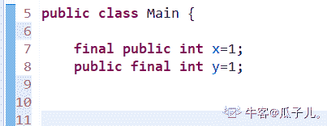

# 招商银行信用卡中心 2019 秋招 IT 笔试（开发方向第一批）

## 1

对于方法 sleep()和 wait()，描述错误的是

正确答案: C   你的答案: 空 (错误)

```cpp
sleep()暂停线程，但监控状态仍然保持，结束后会自动恢复
```

```cpp
sleep()是线程类 Thread 的方法，wait 是 Object 类的方法
```

```cpp
wait()后进入等待锁定池，只有针对此对象发出 notify 方法后获得对象锁进入运行状态
```

```cpp
sleep()不释放对象锁，wait()放弃对象锁
```

本题知识点

Java 工程师 C++工程师 招商银行信用卡中心 2019

讨论

[chenwf](https://www.nowcoder.com/profile/416580548)

C 唤醒后进入的是就绪状态，就绪状态获得 cpu 执行时间才进入运行状态。另外，调用 notifyAll()方法也可以唤醒进程

发表于 2019-03-04 14:19:58

* * *

[ogl🐰🐰🐰](https://www.nowcoder.com/profile/618529537)

链接：[`www.nowcoder.com/questionTerminal/e76ff372836b47e5a3e57912ce1e0df2`](https://www.nowcoder.com/questionTerminal/e76ff372836b47e5a3e57912ce1e0df2)
来源：牛客网
首先，sleep()是 Thread 类中的方法，而 wait()则是 Object 类中的方法。

sleep()方法导致了程序暂停，但是他的监控状态依然保持着，当指定的时间到了又会自动恢复运行状态。在调用 sleep()方法的过程中，线程不会释放对象锁。
**wait()方***导致线程放弃对象锁，进入等待此对象的等待锁定池，只有针对此对象调用 notify()方法后本线程才进入对象锁定池准备获取对象锁进入运行状态。****注意是准备获取对象锁进入运行状态，而不是立即获得**

发表于 2018-11-16 21:32:33

* * *

[从前的小余儿](https://www.nowcoder.com/profile/774780169)

对象调用了 wait()方法后，会令当然对象所在的线程进入等待，并释放占有的锁。 且由 wait()进入等待的线程只能 由 notify()唤醒，唤醒后进入就绪态，而不是直接投入运行。只有就绪态的线程重新获得时间片后才可以运行

发表于 2021-03-12 18:52:43

* * *

## 2

下列说法正确的有

正确答案: A B C   你的答案: 空 (错误)

```cpp
数据的存储结构与数据处理的效率密切相关
```

```cpp
数据的存储结构在计算机中所占的空间不一定是连续的
```

```cpp
一种数据的逻辑结构可以有多种存储结构
```

```cpp
数据的存储结构与数据处理的效率无关
```

本题知识点

Java 工程师 C++工程师 招商银行信用卡中心 2019

讨论

[从前的小余儿](https://www.nowcoder.com/profile/774780169)

有点疑惑，应该数据的处理效率和数据的存储结构有关吧，A 项和 D 项的主语调换了

发表于 2021-03-12 18:53:56

* * *

[咸鱼小哲](https://www.nowcoder.com/profile/8534200)

1.数据的存储结构与数据处理的效率密切相关 2.数据的存储结构在计算机中所占的空间不一定是连续的，链表 3.一种数据的逻辑结构指的是这个数据的组织方式，存储结构指的是它的存储方式。
比如队列（逻辑结构），可以用数组（连续）存储，也可以用链表（不连续）存储。 

发表于 2019-08-20 17:13:37

* * *

## 3

关于异常的描述，以下哪些是正确的

正确答案: A C D   你的答案: 空 (错误)

```cpp
异常的基类为 Exception，所有异常都必须直接或者间接继承它
```

```cpp
异常可以随便处理，而不是抛给外层的程序进行处理
```

```cpp
如果某异常继承 RuntimeException，则该异常可以不被声明
```

```cpp
异常可以用 try{ }catch(Exception e){ }来捕获并进行处理
```

本题知识点

Java 工程师 C++工程师 招商银行信用卡中心 2019

讨论

[peicc1920](https://www.nowcoder.com/profile/364980044)

编译器不会检查 RuntimeException 异常。例如，除数为零时，抛出 ArithmeticException 异常。RuntimeException 是 ArithmeticException 的超类。当代码发生除数为零的情况时，倘若既"没有通过 throws 声明抛出 ArithmeticException 异常"，也"没有通过 try...catch...处理该异常"，也能通过编译。这就是我们所说的"编译器不会检查 RuntimeException 异常"！

发表于 2019-05-13 12:52:36

* * *

[知名大佬](https://www.nowcoder.com/profile/7424359)

throwable 是异常和错误的父类。异常，即指 Exception

发表于 2018-11-26 19:03:00

* * *

## 4

以下哪个选项是可以正确定义：MAX_LENGTH 是 int 型 public 成员变量，变量值保持为常量 1

正确答案: A   你的答案: 空 (错误)

```cpp
public final int MAX_LENGTH=1
```

```cpp
public int MAX_LENGTH=1
```

```cpp
final public int MAX_LENGTH=1
```

```cpp
final int MAX_LENGTH=1
```

本题知识点

Java 工程师

讨论

[瓜子儿。](https://www.nowcoder.com/profile/79500376)

两种都不会错“Java 中的修饰符出现在字段声明中时的顺序与 oracle 规定的 FieldModifier 顺序一致”
[`docs.oracle.com/javase/specs/jls/se11/html/index.html`](https://docs.oracle.com/javase/specs/jls/se11/html/index.html)

发表于 2019-09-14 16:11:28

* * *

[Ak 的快乐](https://www.nowcoder.com/profile/604689479)

我说怎么感觉有点 java，原来真是 java，为什么 c++题目出这种题

发表于 2021-05-13 23:49:57

* * *

[星辰 end](https://www.nowcoder.com/profile/654552242)

不知道 C 错在了哪里

发表于 2020-08-06 10:08:36

* * *

## 5

java 中关于线程的描述，下列正确的是

正确答案: A   你的答案: 空 (错误)

```cpp
Java 提供对多线程同步提供语言级的支持
```

```cpp
线程对象必须实现 Runnable 接口
```

```cpp
启动一个线程直接调用线程对象的 run()方法
```

```cpp
一个线程可以包含多个进程
```

本题知识点

Java 工程师 C++工程师 招商银行信用卡中心 2019

讨论

[ZZZZZZZZZyq](https://www.nowcoder.com/profile/292605346)

A:显然，如 B 解析，提供了父类与接口
B:创建线程的两种方式：继承 Thread 类和实现 Runnable 接口 C:启动一个线程应该调用 start()方法

> start() 和 run() 区别 run()方法:在本线程内调用该 Runnable 对象的 run()方法，可以重复多次调用；start()方法:启动一个线程，调用该 Runnable 对象的 run()方法，不能多次启动一个线程；

D:应该是一个进程包含若干个线程，一个线程只能属于某一个进程。

发表于 2019-03-02 13:04:13

* * *

[从前的小余儿](https://www.nowcoder.com/profile/774780169)

B 选项，窗帘线程有三种方式 继承 Thread 类，实现 Runnable 接口，实现 Callerable 接口 C 选项，启动一个线程调用 start()方法，运行一个线程才是调用 run()方法 D 选项，一个进程包含多个线程，选项说反了

发表于 2021-03-12 18:57:07

* * *

## 6

以下关于 ArrayList 类的初始化方法，正确的是

正确答案: D   你的答案: 空 (错误)

```cpp
List myList = new List()
```

```cpp
ArrayList myList = new List()
```

```cpp
ArrayList myList = new Object()
```

```cpp
List myList = new ArrayList()
```

本题知识点

Java 工程师 C++工程师 招商银行信用卡中心 2019

讨论

[ycy 加油啊](https://www.nowcoder.com/profile/86425035)

父类引用指向子类对象

发表于 2019-05-23 15:57:52

* * *

[追 201903031316439](https://www.nowcoder.com/profile/840578411)

多态调用

发表于 2019-03-12 00:25:48

* * *

## 7

java 中对于以下表达式 String a=new String(“haha”);
String b =new String(“haha”);
char c [ ] ={‘h’，’a’，’h’，’a’};以下关于 equals()和==的判断条件，哪些返回 true

正确答案: A D   你的答案: 空 (错误)

```cpp
a.equals(b)
```

```cpp
b.equals(c)
```

```cpp
a==b
```

```cpp
b.equals (new String(“haha”))
```

```cpp
b==c
```

本题知识点

Java 工程师 C++工程师 招商银行信用卡中心 2019

讨论

[初一十五三十](https://www.nowcoder.com/profile/807445360)

对于第二个选项 b.equals(c)  做解析说明：调用 equals 方法时，首先会比较两个对象的引用是否指向同一对象，源码:

```cpp
if (this == anObject) {  return true; }
```

其次，会判断对象 c 是否是类 b 的实例，源码:

```cpp
if (anObject instanceof String) {
``` 而本选项中，c 不是 b(String 类)的实例，因此返回 false。tips:c 的值不是一个地址，而是 haha。

编辑于 2019-09-16 10:54:47

* * *

[Jack_Gao](https://www.nowcoder.com/profile/510882680)

**==** : 它的作用是判断两个对象的地址是不是相等。即，判断两个对象是不是同一个对象。(**基本数据类型==比较的是值**，**引用数据类型==比较的是内存地址**)

**equals()** : 它的作用也是判断两个对象是否相等。但它一般有两种使用情况：

*   情况 1：类没有覆盖 equals()方法。则通过 equals()比较该类的两个对象时，等价于通过“==”比较这两个对象。

*   情况 2：类覆盖了 equals()方法。一般，我们都覆盖 equals()方法来两个对象的内容相等；若它们的内容相等，则返回 true(即，认为这两个对象相等)。

发表于 2018-12-04 13:11:12

* * *

[_ 向 offer 冲锋-](https://www.nowcoder.com/profile/227731021)

==判断的是地址是否相同

发表于 2020-03-20 08:59:46

* * *

## 8

以下哪些选项是 Java 中的基本数据类型

正确答案: A B C   你的答案: 空 (错误)

```cpp
byte
```

```cpp
char
```

```cpp
long
```

```cpp
Integer
```

```cpp
String
```

本题知识点

Java 工程师 C++工程师 招商银行信用卡中心 2019

讨论

[Time 是个小太阳](https://www.nowcoder.com/profile/113224645)

我他妈选了 de，，，，看反了

发表于 2019-09-23 11:22:00

* * *

## 9

```cpp
class HelloWorld{
private int name;
 public static void say() {
    //do something
}
}
```

如何使 name 变量被 say()方法直接访问

正确答案: A   你的答案: 空 (错误)

```cpp
将 private int name 改为 static int name
```

```cpp
将 private int name 改为 protected int name
```

```cpp
将 private int name 改为 public int name
```

```cpp
将 private int name 改为 int name
```

本题知识点

Java 工程师 C++工程师 招商银行信用卡中心 C++工程师 Java 工程师 招商银行信用卡中心 2019

讨论

[geunhee](https://www.nowcoder.com/profile/390110237)

静态方法只能访问所属类的静态字段和静态方法，因此需要给 name 加上静态关键字 static

发表于 2020-03-09 09:59:46

* * *

[stay_foolish](https://www.nowcoder.com/profile/777736105)

即使没有创建对象，也能使用属性和调用方法，static 实现的就是这个功能。

发表于 2019-09-26 23:43:27

* * *

## 10

以下数据类型中，需要内存空间最小的是（）

正确答案: A   你的答案: 空 (错误)

```cpp
byte
```

```cpp
short
```

```cpp
int
```

```cpp
long
```

本题知识点

Java 工程师

讨论

[ht30 一定要进国企](https://www.nowcoder.com/profile/1253765)

byte：8 位

short：16 位

int：32 位

long：64 位

发表于 2019-05-26 01:14:20

* * *

[牛客 581909011 号](https://www.nowcoder.com/profile/581909011)

byte 是数据类型?char 吧

发表于 2021-03-23 13:35:00

* * *

[牛客 118181550 号](https://www.nowcoder.com/profile/118181550)

一个字节八个 byte 位 byte：8 位

short：2 个字节   16 位

int：4 个字节   32 位

long：8 个字节  64 位（64 位系统）    4 个字节 32 位   （32 位系统）

 发表于 2020-09-23 15:03:37

* * *

## 11

Java 中关于父类和子类的关系表述正确的是

正确答案: B   你的答案: 空 (错误)

```cpp
一个子类可以有多个父类，一个父类可以有多个子类
```

```cpp
一个子类可以有一个父类，但一个父类可以有多个子类
```

```cpp
一个子类可以有多个父类，但一个父类只可以有一个子类
```

```cpp
其他三个选项都不正确
```

本题知识点

Java 工程师 C++工程师 招商银行信用卡中心 2019

讨论

[行间距](https://www.nowcoder.com/profile/6300700)

可以有一个==只能有一个？？这题有毒。

发表于 2019-04-04 15:28:17

* * *

[张大仙儿](https://www.nowcoder.com/profile/476666724)

由于 java 类的单继承性，所以一个子类只能有一个父类，但一个父类可以被多个子类继承。

发表于 2019-03-10 15:21:36

* * *

## 12

以下哪个类的声明是正确的

正确答案: D   你的答案: 空 (错误)

```cpp
abstract final class HelloWorld{}
```

```cpp
protected private helloWorld
```

```cpp
abstract private say(){}
```

```cpp
public abstract class HelloWorld{}
```

本题知识点

Java 工程师 C++工程师 招商银行信用卡中心 2019

讨论

[ht30 一定要进国企](https://www.nowcoder.com/profile/1253765)

A 只能有 final 和 abstract 的一个，因为 final 是最终类，不能继承，必须可以创建实例；而 abstract 是抽象类，只能继承，没有实例。冲突了，所以不对。

B 中访问修饰符只能有一个，而且对象没有类型。

C 是抽象方法，不能有方法体。所以末尾不是{}而是";"才对。

D 正确，这是抽象类。

发表于 2019-05-26 01:13:12

* * *

## 13

String s1="a"+"b";String s2=new String(s1);关于 s1.equals(s2)和 s1==s2 的说法正确的是

正确答案: C   你的答案: 空 (错误)

```cpp
两个都返回 true
```

```cpp
两个都返回 false
```

```cpp
s1.equals(s2)返回 true; s1==s2 返回 false;
```

```cpp
s1.equals(s2)返回 false; s1==s2 返回 true;
```

本题知识点

Java 工程师 C++工程师 招商银行信用卡中心 2019

讨论

[、微笑改变嘴角的苦涩](https://www.nowcoder.com/profile/160407988)

equals 用于判断两个对象的值是否相等“==”判断基本类型变量时可以判断两个变量值是否相等，判断对象变量时判断两个变量指向的是否是一个地址

发表于 2018-11-28 19:18:34

* * *

[我要好好打码](https://www.nowcoder.com/profile/2697164)

```cpp
这题。。。是我的 idea 错了吗

```

发表于 2018-11-14 23:14:50

* * *

## 14

以下哪个选项会导致死循环

正确答案: D   你的答案: 空 (错误)

```cpp
for(int i=0; i&lt;0; i++)
```

```cpp
for(int i=10; i&gt;0; i--)
```

```cpp
for(int i=0; i&gt;0; i++)
```

```cpp
for(int i=0; i&lt;10; i--)
```

本题知识点

Java 工程师 C++工程师 招商银行信用卡中心 2019 C++ C 语言

讨论

[peicc1920](https://www.nowcoder.com/profile/364980044)

```cpp
&lt;小于（less than）
&gt;大于（greater than）
```

发表于 2019-05-13 15:26:10

* * *

[知名大佬](https://www.nowcoder.com/profile/7424359)

```cpp
&lt 表示小于 
&gt 表示大于 
```

发表于 2018-11-26 19:05:50

* * *

[ZX2021](https://www.nowcoder.com/profile/946470647)

应将 i 类型改为 unsigned int, 否则整型溢出就不可能循环

发表于 2020-12-15 12:50:30

* * *

## 15

Java 中通过什么关键字修饰的方法可以用过类名直接调用

正确答案: B   你的答案: 空 (错误)

```cpp
final
```

```cpp
static
```

```cpp
private
```

```cpp
void
```

本题知识点

Java 工程师 C++工程师 招商银行信用卡中心 2019

讨论

[、微笑改变嘴角的苦涩](https://www.nowcoder.com/profile/160407988)

static 即属于类的

发表于 2018-11-28 19:15:47

* * *

## 16

以下哪个选项不是 java.util.Collection 中定义的方法

正确答案: A   你的答案: 空 (错误)

```cpp
compareTo(Object obj)
```

```cpp
int size()
```

```cpp
boolean containsAll(Collection c)
```

```cpp
boolean remove(Object obj)
```

本题知识点

Java 工程师 C++工程师 招商银行信用卡中心 2019

讨论

[牛客 7246510 号](https://www.nowcoder.com/profile/7246510)

compare to 属于 string 类的方法

发表于 2019-02-20 23:38:19

* * *

[SS-N-30](https://www.nowcoder.com/profile/732911096)

compareTo 是 Comparable 接口中的方法，需要重写

发表于 2020-04-08 18:32:34

* * *

[aud](https://www.nowcoder.com/profile/9105552)

A

发表于 2019-03-12 02:45:23

* * *

## 17

以下哪一项是合法的数组声明和构造

正确答案: C   你的答案: 空 (错误)

```cpp
int[] array=[100]
```

```cpp
int array=new int[100]
```

```cpp
int[] array=new int[100]
```

```cpp
int() array=new int(100)
```

本题知识点

Java 工程师 招商银行信用卡中心 2019

讨论

[杉杉来啦](https://www.nowcoder.com/profile/243827773)

new int 创建 bai 一 du 个 int 大小的内存,     如 int* p = new int; new int (100) 创建 zhi 一个 int 型的内存，并 dao 赋值为 100;  int *p = new int(100);  new int[100] 创建 100 个 int 型的内存; int* p[] = new int[100];

new int(100)只分配一个存放 int 整型的内存空间，返回一个指向该整型空间的指针，并且指定内存中的初始值为 100，

相当于 int a=100 或 int *b=new int(100);

----------------------------------------------------------------------------------------------------------------------------------------------------------------

new int[100]分配 100 个 int 整型大小的内存空间，返回指向该空间的首地址的指针。

如 int *arr=new int[100];

释放空间数组空间用 delete[ ] arr;千万不能这样用 delete arr,这样只释放第一个数组的空间而已

编辑于 2020-08-16 09:17:59

* * *

[丶听涛](https://www.nowcoder.com/profile/342812566)

为啥我四个答案都编译不了？

发表于 2021-01-28 09:41:07

* * *

[牛客 263760302 号](https://www.nowcoder.com/profile/263760302)

原来 B 缺少个*号

发表于 2020-09-04 10:19:21

* * *

## 18

在类的定义中可以有两个同名函数，这种现象称为函数

正确答案: C   你的答案: 空 (错误)

```cpp
封装
```

```cpp
继承
```

```cpp
重载
```

```cpp
覆盖
```

本题知识点

Java 工程师 C++工程师 招商银行信用卡中心 2019 牛客 C++

讨论

[追 201903031316439](https://www.nowcoder.com/profile/840578411)

方法的重载是同一个类中方法之间的关系，是水平关系。

发表于 2019-03-12 09:09:43

* * *

## 19

java 中哪个关键字可以对对象加互斥锁

正确答案: A   你的答案: 空 (错误)

```cpp
synchronized
```

```cpp
transient
```

```cpp
serialize
```

```cpp
static
```

本题知识点

Java 工程师 C++工程师 招商银行信用卡中心 C++工程师 Java 工程师 招商银行信用卡中心 2019

讨论

[Skyline0032](https://www.nowcoder.com/profile/682896419)

可以用 OS 里面的知识来解释下，即互斥是在同步的基础上实现的。

发表于 2019-09-03 16:02:55

* * *

## 20

以下关于接口的描述错误的有

正确答案: B C D   你的答案: 空 (错误)

```cpp
实现一个接口必须实现接口的所有方法
```

```cpp
一个类只能实现一个接口
```

```cpp
接口间不能有继承关系
```

```cpp
接口就是抽象类
```

本题知识点

Java 工程师 C++工程师 招商银行信用卡中心 2019

讨论

[你要静候再静候](https://www.nowcoder.com/profile/5300258)

不够严谨，如果是抽象类实现接口，可以实现部分方法甚至一个都不实现，具体类才必须实现接口的所有方法。

发表于 2018-12-12 19:39:08

* * *

[一起玩耍啊](https://www.nowcoder.com/profile/2505600)

都没说排不排除抽象方法和默认方法

发表于 2018-11-27 13:16:33

* * *

[雪落人未央](https://www.nowcoder.com/profile/943972467)

接口继承接口，本质上是抽象类继承抽象类

发表于 2019-07-23 19:19:57

* * *

## 21

请简述 final、finalize 和 finally 的区别

你的答案

本题知识点

Java 工程师 C++工程师 招商银行信用卡中心 2019

讨论

[Jackrabb1t](https://www.nowcoder.com/profile/5354558)

final 修饰符添加到类上，则此类为不可变类，添加到成员变量上，则此变量不可修改；finalize 是 Object 类中的方法，当对象被标记且回收时执行，有可能使对象不再是垃圾，如果再次被标记准备回收时发现 finalize 已经被执行过，则直接回收；finally 是用作配合 try catch 块使用，无论是否捕获异常，finally 块中代码一定在最后执行

发表于 2019-03-02 16:37:20

* * *

[Nickey 凡](https://www.nowcoder.com/profile/4220881)

final 是修饰用的关键词，修饰变量表示该变量不能被修改，修饰类时表示该类不能被继承，修饰方法时表示该方法不能在子类被重写；finalize()定义的是方法，用在一些垃圾回收无法照顾到的特殊场合，如本地方法使用 C 语言的 malloc()申请了内存，此时 JVM 的垃圾回收无法回收这部分内存，则可以使用 finalize()，在方法体中用 C 语言的 free()来释放这部分内存，当垃圾回收发生时，将首先调用 finalize()中的代码；finally 子句一般用在 try 的异常处理语句块后，不管 try 语句块执行时是否抛出了一个异常，finally 子句的代码都会被执行，同时 finally 子句也可以用在 break、continue 之后，或者用在 return 语句之后，其功能都是：保证 finally 子句中的代码一定会被执行。

发表于 2018-11-17 00:09:43

* * *

[牛客 561324 号](https://www.nowcoder.com/profile/561324)

final 可以用来修改变量，方法和类，修饰变量代表着该变量不可变，所指向的内存地址不变；修饰方法，表示该方法无法被继承；修饰类代表着该类无法被继承。finalize 方法是回收方法，在对象被 GC 回收前会被执行。finally 是用在 try..catch..finally...语句中，在方法返回前一定会执行的语句，一般都会用来关闭各种资源。

发表于 2019-02-19 14:10:36

* * *

## 22

简述 java 语言的线程池以及为什么要使用线程池？请任意列举两个常用的线程池

你的答案

本题知识点

Java 工程师 C++工程师 招商银行信用卡中心 2019

讨论

[Nickey 凡](https://www.nowcoder.com/profile/4220881)

线程池：将创建的线程对象放在一个容器中，用完的线程也放到这个容器中，用户使用的时候不是开辟一个新的线程，而是直接到这个容器中去获取已经创建好的线程，这样的存放线程的容器就是线程池。为什么使用线程池：新线程的创建，会带来时间的开销，通过线程池可以节约开辟新线程的时间，提高响应速度，同时也便于对线程进行管理。常用线程池：newCachedThreadPool  newFixedThreadPool  newSingleThreadPool  newScheduledThreadPool

发表于 2018-11-17 00:53:35

* * *

[牛客 561324 号](https://www.nowcoder.com/profile/561324)

Java 的线程池可用 ThreadPoolExecutor 或 Executor 来创建。通过使用线程池，可以避免频繁创建和销毁链接对象导致的性能问题，常用在并发线程数量多，执行时间短的情况，例如数据连接池。四种常见的线程池：newCacheThreadPool, newFixedThreadPool, newScheduledThreadPool, newSingleThreadPool

发表于 2019-02-19 14:17:56

* * *

[从前的小余儿](https://www.nowcoder.com/profile/774780169)

首先从线程的生命周期来了解，线程生命周期大致分为线程创建，线程执行，销毁线程。 当线程创建和线程销毁的时间远大于线程执行时间时，此时程序的执行效率也会下降。因此有没有一种方法可以让程序执行之前就已经存在线程，当该程序被分配运行时直接由线程来执行，减少线程创建和销毁的时间，提高执行效率。 同时为了方便管理这些“提前存在的线程”，就将该些线程对象放到一个池子里面管理，最后管理这些“已存在线程对象”的池就称为线程池。 线程池的分类：可参考单例模式，工厂方法模式

发表于 2021-03-12 19:06:27

* * *

## 23

请简述抽象类和接口的区别？以及何时用抽象类，何时用接口

你的答案

本题知识点

Java 工程师 C++工程师 招商银行信用卡中心 2019

讨论

[等我想到昵称了再修改](https://www.nowcoder.com/profile/708774825)

抽象类：

> 1.  可以定义构造器
> 2.  有抽象方法和具体方法
> 3.  抽象类的成员可以用 private、默认、protected 和 public 修饰
> 4.  可以定义成员变量
> 5.  有抽象方法必须被声明为抽象类，但抽象类未必要有抽象方法
> 6.  抽象类可以包括静态方法
> 7.  一个类只能继承一个抽象类

接口：

1.  接口中不能定义构造器
2.  方法全是抽象方法
3.  接口中的成员只能用 public 修饰
4.  接口中定义的成员变量全是常量
5.  接口中不能有静态方法
6.  一个类可以实现多个接口

用抽象类：需要在几个有联系的类之间共享代码用借口：实现“多继承”

发表于 2019-03-03 14:51:03

* * *

[苹果 201805311425956](https://www.nowcoder.com/profile/6683037)

参考答案

区别：抽象类可以有构造函数，接口不可以有构造函数抽象类中可以有普通成员变量，接口中没有普通成员变量，只能有常量
抽象类中的方法可以被 static 修饰，接口中的方法不可以被 static 修饰 **---> jdk 1.8 可以接口可以有 static 修饰的方法**
抽象类中可以有普通方法和抽象方法，接口中的方法全是抽象方法** ---> jdk 1.8 接口中的方法还有 default 和 static 修饰的方法**
一个类只能继承一个抽象类，接口可以被多实现，即一个类只能继承一个类，可以实现多个接口何时使用接口主要用于模块与模块之间的调用。主要用接口来实现多继承，因为 java 不支持类的多继承，只能用接口抽象类主要用于当做基础类使用，即基类。如果想拥有一些方法，并且这些方法有默认实现，那么使用抽象类所以参考答案不可全信

编辑于 2018-11-27 17:30:29

* * *

[默 2019](https://www.nowcoder.com/profile/514973574)

抽象类在继承过程中子类重写抽象方法，一个子类只可以继承一个抽象类，而一个子类可以继承多个接口。

发表于 2019-08-12 19:53:23

* * *

## 24

农场有 n 只鸡鸭排为一个队伍，鸡用“C”表示，鸭用“D”表示。当鸡鸭挨着时会产生矛盾。需要对所排的队伍进行调整，使鸡鸭各在一边。每次调整只能让相邻的鸡和鸭交换位置，现在需要尽快完成队伍调整，你需要计算出最少需要调整多少次可以让上述情况最少。例如：CCDCC->CCCDC->CCCCD 这样就能使之前的两处鸡鸭相邻变为一处鸡鸭相邻，需要调整队形两次。

本题知识点

Java 工程师 C++工程师 招商银行信用卡中心 模拟 数学 字符串 *2019* *讨论

[lentolove](https://www.nowcoder.com/profile/572586026)

```cpp
import java.io.BufferedReader;
import java.io.IOException;
import java.io.InputStreamReader;

public class Solution1_ 鸡鸭分类问题 {
    public static void main(String[] args) throws IOException {
        BufferedReader bf = new BufferedReader(new InputStreamReader(System.in));
        char[] chars = bf.readLine().toCharArray();
        //分别统计 C 在前面和 D 在前面的移动次数
        int retC = 0, retD = 0, count_C = 0, count_D = 0;
        for (int i = 0; i < chars.length; i++) {
            if (chars[i] == 'C') {
                retC += i - count_C;
                count_C++;//记录出现前面出现多少个 'C',从第 i 个位置把 C 移动到底 count_c 个位置需要移动 i - count_c 次
            } else {
                retD += i - count_D;
                count_D++;//记录出现前面出现多少个 'D'
            }
        }
        System.out.println(Math.min(retC,retD));
    }
}
```

发表于 2019-08-09 20:07:28

* * *

[卷积神经网络哦](https://www.nowcoder.com/profile/8684256)

要么鸡全在左边，要么鸭全在左边，记录当前顺序变到这两种情况的移动次数，取较小值即可注：若某鸡的下标为 i  其左边还有 cnt 只鸡  则最少需要 i - cnt 次才能将其移到左鸡堆的最右边

```cpp
#include<bits/stdc++.h>
using namespace std;

int solve(string s, char pattern) {
	int res = 0, cnt = 0;;
    for(int i = 0; i < s.length(); i++) {
        if(s[i] == pattern) {
            res += (i - cnt); 
            cnt++;
        }
    }
	return res;
}

int main(){
	string s; 
	while(cin>>s) {
		cout<<min(solve(s, 'C'), solve(s, 'D'))<<endl;
	}   
}
/*
CCDCC
DCCCC
CDCDDD
*/
```

编辑于 2019-09-01 15:23:34

* * *

[ElonB](https://www.nowcoder.com/profile/623894)

```cpp
"""
分两种情况，C 排前 D 排后，C 排后 D 排前，取最小值
对于 C 排前 D 排后，只看 C，最小交换次数为，s 中为 C 的下标之和，减去排好序后 C 的下标之和
例如：CCDDCC，排序后 CCCCDD，最小交换次数为 C：4->2，5->3，(0+1+4+5)-(0+1+2+3) = 4
"""
import sys

if __name__ == "__main__":
    # sys.stdin = open("input.txt", "r")
    s = input().strip()
    a = [i for i in range(len(s)) if s[i] == 'C']
    ans = min(sum(a) - ((len(a) - 1 + 0) * len(a)) // 2, ((len(s) - len(a) + len(s) - 1) * len(a)) // 2 - sum(a))
    print(ans)

```

编辑于 2019-07-10 16:15:53

* * *

## 25

给定一个正整数数组，它的第 *i* 个元素是比特币第 *i* 天的价格。

如果你最多只允许完成一笔交易（即买入和卖出一次），设计一个算法来计算你所能获取的最大利润。

注意你不能在买入比特币前卖出。

本题知识点

Java 工程师 C++工程师 招商银行信用卡中心 测试工程师 贪心 数组 2019 测试开发工程师

讨论

[凝视深空](https://www.nowcoder.com/profile/4232948)

```cpp

	#include<bits/stdc++.h>

	using namespace std;

	intmain() {

	    intn, mi = INT_MAX, maxProfit = 0;

	    while(cin >> n) {

	        maxProfit = max(n - mi, maxProfit);

	        mi = min(n, mi);

	    }

	    cout << maxProfit;

	    return0;

	}

```

发表于 2018-11-20 22:20:20

* * *

[谁的电脑](https://www.nowcoder.com/profile/743368)

```cpp
import java.util.*;

public class Main {
    public static void main(String[] args) {
        Scanner scanner = new Scanner(System.in);
        int buy = scanner.nextInt(), profit = 0;
        while (scanner.hasNext()) {
            // 输入新的价格
            int price = scanner.nextInt();
            // 每次输入新的价格时，更新最大利润
            profit = Math.max(profit, price - buy);
            // 每次输入新的价格时，更新最低买入价
            buy = Math.min(buy, price);
        }
        System.out.println(profit);
    }
}
```

发表于 2019-07-02 15:40:46

* * *

[ElonB](https://www.nowcoder.com/profile/623894)

```cpp
"""
设 dp[i]为以 i 为卖出点的最大收益
"""
import sys

if __name__ == "__main__":
    # sys.stdin = open("input.txt", "r")
    a = list(map(int, input().strip().split()))
    t_min = a[0]
    dp = []
    for i in range(len(a)):
        t_min = min(t_min, a[i])
        dp.append(a[i] - t_min)
    print(max(dp))

```

发表于 2019-07-10 16:28:31

* * *

## 26

小招喵喜欢吃喵粮。这里有 N 堆喵粮，第 i 堆中有 p[i] 粒喵粮。喵主人离开了，将在 H 小时后回来。

小招喵可以决定她吃喵粮的速度 K （单位：粒/小时）。每个小时，她将会选择一堆喵粮，从中吃掉 K 粒。如果这堆喵粮少于 K 粒，她将吃掉这堆的所有喵粮，然后这一小时内不会再吃更多的喵粮。  

小招喵喜欢慢慢吃，但仍然想在喵主人回来前吃掉所有的喵粮。

返回她可以在 H 小时内吃掉所有喵粮的最小速度 K（K 为整数）。

本题知识点

Java 工程师 C++工程师 招商银行信用卡中心 查找 *动态规划 2019* *讨论

[keashem](https://www.nowcoder.com/profile/597698287)

二分查找加快速度

```cpp
import java.util.Scanner;
import static java.lang.System.in;

public class Main{
    public static void main(String[] args) {
        Scanner sc = new Scanner(in);
        String[] str = sc.nextLine().split(" ");
        int h = Integer.parseInt(sc.nextLine());
        int[] data = new int[str.length];
        int maxSpeed = Integer.MIN_VALUE;
        for (int i = 0; i < str.length; i++) {
            data[i] = Integer.parseInt(str[i]);
            maxSpeed = Math.max(maxSpeed, data[i]);
        }
        int mid = 0;
        int minSpeed = 1;
        while (minSpeed <= maxSpeed) {
            mid = minSpeed + ((maxSpeed - minSpeed) >> 1);
            if (getHour(data, mid) <= h) {
                maxSpeed = mid - 1;
            } else {
                minSpeed = mid + 1;
            }
        }
       System.out.println(minSpeed);
    }

    public static int getHour(int[] data, int k) {
        int sum = 0;
        for (int i = 0; i < data.length; i++) {
            sum += data[i] % k == 0 ? data[i] / k : data[i] / k + 1;
        }
        return sum;
    }
}
```

编辑于 2019-08-28 17:19:22

* * *

[卷积神经网络哦](https://www.nowcoder.com/profile/8684256)

贪心  + 二分查找理论最小进食速度： 所有喵粮求和 / 给定的小时数理论最大进食速度：最大堆的喵粮数在这两个之间二分查找最小实际可行进食速度即可注：这是一个 lower_bound 的二分问题，即求最左边满足条件的值  需要相应修改二分查找代码

```cpp
#include <bits/stdc++.h>
using namespace std;

vector<int> arr;
int H, tmp, sum = 0, mmax = 0, res, mmin; 

bool solve(int x, int H) {
	int res = 0;
	for(int i = 0; i < arr.size(); i++) {
		res += (arr[i] % x == 0) ? arr[i] / x: arr[i] / x + 1;
	}
	return res <= H;
}

int main() {
    string line; getline(cin, line);
    istringstream iss(line);
    while(iss >> tmp) {
        arr.push_back(tmp);
		mmax = max(mmax, tmp);
		sum += tmp;
    }
    scanf("\n%d", &H);
	mmin = (sum % H == 0) ? sum / H: sum / H + 1;
	while(mmin < mmax) {
		res = (mmin + mmax) / 2;
		if(solve(res, H)) mmax = res;//满足条件时 将右边届设为中间值
		else mmin = res + 1;
		if(solve(mmin, H)) break;//左边界满足时 终止
	}
	cout<<mmin<<endl;//结果为左边界
}
/*
3 6 7 11
8
*/
```

编辑于 2019-10-05 17:38:55

* * *

[lentolove](https://www.nowcoder.com/profile/572586026)

```cpp
import java.io.BufferedReader;
import java.io.IOException;
import java.io.InputStreamReader;

public class Solution3_ 爱吃猫粮的小招喵 {
    public static void main(String[] args) throws IOException {
        BufferedReader bf = new BufferedReader(new InputStreamReader(System.in));
        String[] line1 = bf.readLine().split(" ");
        int n = line1.length;
        int h = Integer.parseInt(bf.readLine());
        int[] nums = new int[n];
        int total = 0;
        for (int i = 0; i < n; i++) {
            nums[i] = Integer.parseInt(line1[i]);
            total += nums[i];
        }
        int k  = total / h;//总的猫粮总量除以时间，至少每小时吃的猫粮数量
        while (costTime(nums, k) > h) {
            k++;
        }
        System.out.println(k);
    }

    private static int costTime(int[] nums, int k) {
        int total_h = 0;//吃完猫粮花费的时间
        for (int i = 0; i < nums.length; i++) {
            total_h += (nums[i] + k - 1) / k; //向上取整，eg: k = 4,nums[i]=5,则需要两个小时
        }
        return total_h;
    }
}

```

发表于 2019-08-09 20:35:08

* * ***