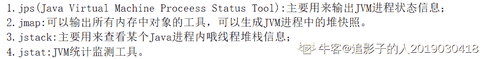
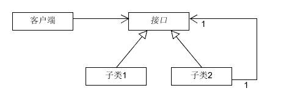
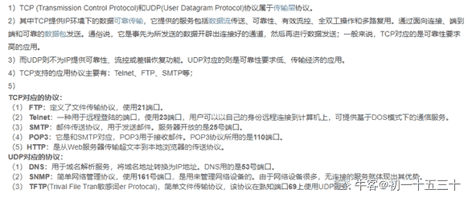
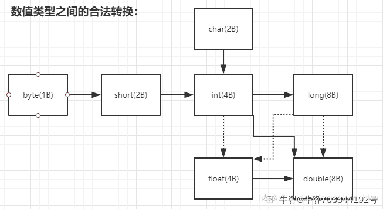
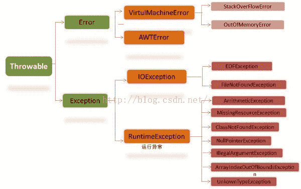
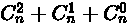

# 招商银行信用卡中心 2019 秋招 IT 笔试（开发方向第三批）

## 1

可以用于生成 JVM 进程堆快照的命令是？

正确答案: A   你的答案: 空 (错误)

```cpp
jmap
```

```cpp
jstack
```

```cpp
jstat
```

```cpp
jhat
```

本题知识点

Java 工程师 C++工程师 招商银行信用卡中心 2019

讨论

[A 名前のない怪物](https://www.nowcoder.com/profile/8320926)

jmap 生成打印指定 Java 进程(或核心文件、远程调试服务器)的共享对象内存映射或堆内存细节 jstack 生成线程快照 jstat 命令可以查看堆内存各部分的使用量，以及加载类的数量 jhat 分析 java 堆的命令，可以将堆中的对象以 html 的形式显示出来

发表于 2018-11-15 15:02:13

* * *

[牛客 388380380 号](https://www.nowcoder.com/profile/388380380)

jstack 显示虚拟机的线程栈信息
jmap 用于生成虚拟机的内存快照信息

发表于 2020-06-13 13:55:48

* * *

[while(offer>0){改名;}](https://www.nowcoder.com/profile/115053301)



发表于 2020-06-19 15:06:04

* * *

## 2

在 Spring 中装配 bean 的主要方式有?

正确答案: B C D   你的答案: 空 (错误)

```cpp
在 properties 文件中进行显式配置
```

```cpp
在 XML 中进行显式配置
```

```cpp
在 Java 中进行显式配置
```

```cpp
隐式的发现机制和自动装配
```

本题知识点

Java 工程师 C++工程师 招商银行信用卡中心 2019

讨论

[Vanellope](https://www.nowcoder.com/profile/93389833)

在 Spring 中装配 bean 的主要方式有：**1、隐式的 bean 发现机制和自动化装配**组件扫描： Spring 容器在启动时，会自动扫描使用注解的类 。如**@Controller**注解，**@Service**注解，**@Component**注解等。
自动装配 ： Spring 自动满足 bean 之间的依赖。 在满足依赖的过程中，会在 Spring 应用上下文中寻找匹配的 bean,如**@Autowired**注解，
**2、基于 Java 的显式配置**在进行显式配置时， JavaConfig 是更好的方案，因为它更为强大、 类型安全并且对重构友好。 因为它就是 Java 代码，就像应用程序中的其他 Java 代码一样。同时， JavaConfig 与其他的 Java 代码又有所区别， 在概念上， 它与应用程序中的业务逻辑和领域代码是不同的。尽管它与其他的组件一样都使用相同的语言进行表述， 但 JavaConfig 是配置代码。尽管不是必须的， 但通常会将 JavaConfig 放到单独的包中， 使它与其他的应用程序逻辑分离开来。

```cpp
package xyz.mrwood.study.spring.example;

import org.springframework.context.annotation.Bean;
import org.springframework.context.annotation.Configuration;

/**
 * 项目：study-spring-example
 * 包名：xyz.mrwood.study.spring.example
 * 功能：
 * 时间：2016-12-14 23:22
 * 作者：Mr.Kiwi
 */
@Configuration
public class BeanConfig {

    /**
     * 申明 bean
     * @return
     */
    @Bean
    public Waiter waiter() {

        return new Waiter();
    }

    @Bean
    public Store store() {

        Store store = new Store();
        store.setWaiter(waiter()); //通过调用 bean 的方法来注入
        return store;
    }
}

```

**3、基于 XML 的显式配置**1、创建 XML 配置规范在使用 XML 为 Spring 装配 bean 之前， 你需要创建一个新的配置规范。在使用 JavaConfig 的时候， 这意味着要创建一个带有@Configuration 注解的类， 而在 XML 配置中， 这意味着要创建一个 XML 文件， 并且要以元素为根。在 XML 中进行显式配置：

```cpp
<?xml version="1.0" encoding="UTF-8"?>
<beans 

       xsi:schemaLocation="http://www.springframework.org/schema/beans http://www.springframework.org/schema/beans/spring-beans.xsd">
    <!--使用 bean 标签去申明 bean-->
    <bean id="waiter" class="xyz.mrwood.study.spring.example.Waiter" />
    <!--可以保用 p 标签来注入依赖的 bean-->
    <bean id="store" class="xyz.mrwood.study.spring.example.Store" p:waiter-ref="waiter" />
</beans>
```

参考：[`blog.csdn.net/u011719271/article/details/53649816`](https://blog.csdn.net/u011719271/article/details/53649816)
[`blog.csdn.net/tracycater/article/details/56487513`](https://blog.csdn.net/tracycater/article/details/56487513)

编辑于 2019-01-07 20:33:55

* * *

[JC-Ge](https://www.nowcoder.com/profile/281299440)

居然蒙对了，谁能详细说一下。。

发表于 2018-12-01 09:50:52

* * *

## 3

下列哪些设计模式在结构上符合下图的描述？

正确答案: B C   你的答案: 空 (错误)

```cpp
策略模式
```

```cpp
代理模式
```

```cpp
装饰器模式
```

```cpp
观察者模式
```

本题知识点

Java 工程师 C++工程师 招商银行信用卡中心 2019

讨论

[A 名前のない怪物](https://www.nowcoder.com/profile/8320926)

策略模式：在策略模式中，我们创建表示各种策略的对象和一个行为随着策略对象改变而改变的 context 对象。策略对象改变 context 对象的执行算法。主要解决：在有多种算法相似的情况下，使用 if...else 所带来的复杂和难以维护。***模式在***模式中，我们创建具有现有对象的对象，以便向外界提供功能接口。主要解决：在直接访问对象时带来的问题，比如说：要访问的对象在远程的机器上。在面向对象系统中，有些对象由于某些原因（比如对象创建开销很大，或者某些操作需要安全控制，或者需要进程外的访问），直接访问会给使用者或者系统结构带来很多麻烦，我们可以在访问此对象时加上一个对此对象的访问层。注意事项： 1、和适配器模式的区别：适配器模式主要改变所考虑对象的接口，而***模式不能改变所***类的接口。 2、和装饰器模式的区别：装饰器模式为了增强功能，而***模式是为了加以控制。装饰器模式装饰类，用来包装原有的类，并在保持类方法签名完整性的前提下，提供了额外的功能。主要解决：一般的，我们为了扩展一个类经常使用继承方式实现，由于继承为类引入静态特征，并且随着扩展功能的增多，子类会很膨胀。观察者模式当对象间存在一对多关系时，则使用观察者模式（Observer Pattern）。比如，当一个对象被修改时，则会自动通知它的依赖对象。观察者模式属于行为型模式主要解决：一个对象状态改变给其他对象通知的问题，而且要考虑到易用和低耦合，保证高度的协作。

发表于 2018-11-15 15:20:00

* * *

[牛客 71887500 号](https://www.nowcoder.com/profile/71887500)

装饰模式：以对客户端透明的方式扩展对象的功能，是继承关系的一个替代方案；
代理模式：给一个对象提供一个代理对象，并有代理对象来控制对原有对象的引用；

装饰模式应该为所装饰的对象增强功能；代理模式对代理的对象施加控制，并不提供对象本身的增强功能

二者的实现机制确实是一样的，可以看到他们的实例代码重复是很多的。但就语义上说，这两者的功能是相反的，模式的一个重要作用是简化其他程序员对你程序的理解，

你在一个地方写装饰，大家就知道这是在增加功能，你写代理，大家就知道是在限制，

虽然代码很可能相同，但如果你都叫他们装饰，别人会很迷惑的。

发表于 2021-09-13 15:55:38

* * *

## 4

在 JAVA 中，下面哪个数据结构是支持排序的？

正确答案: D   你的答案: 空 (错误)

```cpp
LinkedHashSet
```

```cpp
HashSet
```

```cpp
AbstractSet
```

```cpp
TreeSet
```

本题知识点

Java 工程师 C++工程师 招商银行信用卡中心 2019

讨论

[Hbson](https://www.nowcoder.com/profile/3258014)

LinkedHashSet 根据插入顺序排序

HashSet 是无序的

TreeSet 可以自然排序（集合中的元素实现 Comparable 接口）或者定制排序（构造器传入 Comparator 接口）

发表于 2018-12-05 19:33:28

* * *

[JC-Ge](https://www.nowcoder.com/profile/281299440)

求解答

发表于 2018-12-01 10:02:59

* * *

## 5

以下哪些应用层协议是基于 TCP 协议？

正确答案: A B C D   你的答案: 空 (错误)

```cpp
FTP
```

```cpp
HTTP
```

```cpp
SMTP
```

```cpp
POP3
```

本题知识点

Java 工程师 C++工程师 招商银行信用卡中心 2019

讨论

[初一十五三十](https://www.nowcoder.com/profile/807445360)



发表于 2019-09-17 15:29:12

* * *

[A 名前のない怪物](https://www.nowcoder.com/profile/8320926)

TCP/IP 协议：

TCP/IP 模型也被称作 DoD 模型(Department of Defense Model)。TCP/IP 字面上代表了两个协议：TCP（传输控制协议）和 IP（网际协议）。1983 年 1 月 1 日，在因特网的前身（ARPA 网）中，TCP/IP 协议取代了旧的网络控制协议（NCP，Network Control Protocol），从而成为今天的互联网的基石。

1.  SMTP：简单邮件传输协议

2.  Telnet：远程登录协议

3.  SNMP：简单网络管理协议

4.  FTP：文件传输协议

5.  LPD：[行式打印机](https://www.baidu.com/s?wd=%E8%A1%8C%E5%BC%8F%E6%89%93%E5%8D%B0%E6%9C%BA&tn=SE_PcZhidaonwhc_ngpagmjz&rsv_dl=gh_pc_zhidao)守护进程

6.  TFTP：简单文件传输协议

7.  NFS：网络文件系统协议

发表于 2018-11-15 15:22:34

* * *

[eicomtpmh](https://www.nowcoder.com/profile/140180)

```cpp
TCP 支持的应用协议主要有：Telnet、FTP、SMTP 等；
UDP 支持的应用层协议主要有：NFS（网络文件系统）、SNMP（简单网络管理协议）、DNS（主域名称系统）、TFTP（通用文件传输协议）等。 
```

发表于 2019-07-30 17:40:28

* * *

## 6

简述标准 SQL 规范中定义的 4 个事务隔离级别及其具体含义。

你的答案

本题知识点

Java 工程师 C++工程师 招商银行信用卡中心 2019

讨论

[A 名前のない怪物](https://www.nowcoder.com/profile/8320926)

1.未提交读：即使一个更新语句未提交，但是其他别的事务可以读到这个改变 2.提交读：（MS SQL server ， ）执行了 commit 操作后别的事物能读到这个改变，并且只能读取到已经提交的数据 3.可重复读（MySQL）在同一个事物里面先后执行一个查询语句的时候，得到的结果是一样的 4.串行读事物执行的时候不允许别的事物并发执行，完全串行化的读，每次都都需要获得表级共享锁，读写相互都会堵塞。

发表于 2018-11-15 15:32:05

* * *

## 7

以下哪些方法可以唯一确定一棵二叉树？

正确答案: A C   你的答案: 空 (错误)

```cpp
给定一棵二叉树的后序和中序遍历序列
```

```cpp
给定一棵二叉树的先序和后序遍历序列
```

```cpp
给定一棵二叉树的先序和中序遍历序列
```

```cpp
给定先序、中序和后序遍历序列中的任意一个即可
```

本题知识点

Java 工程师 C++工程师 招商银行信用卡中心 2019

讨论

[Tzu7](https://www.nowcoder.com/profile/7907873)

```cpp
给定 先序+中序 or 后序+中序 可以唯一确定一颗二叉树
而 先序+后序 不能
      A
     /
    B
前序遍历： AB, 后序遍历： BA
    A
     \
      B
前序遍历： AB, 后序遍历： BA 
```

编辑于 2019-04-12 13:26:33

* * *

[Leovisa](https://www.nowcoder.com/profile/763687876)

给定了二叉树的任何一种遍历序列，都无法唯一确定相应的二叉树。但是如果知道了二叉树的中序遍历序列和任意的另一种遍历序列，就可以唯一地确定二叉树。

发表于 2021-03-10 00:08:11

* * *

[A 名前のない怪物](https://www.nowcoder.com/profile/8320926)

        -先序中序        -后序

发表于 2018-11-15 15:33:33

* * *

## 8

简述 JAVA 中 ArrayList 和 LinkedList 的区别

你的答案

本题知识点

Java 工程师 C++工程师 招商银行信用卡中心 2019

讨论

[迷茫的漂](https://www.nowcoder.com/profile/1417764)

LinkedList 插入，删除都是移动指针效率很高；查找需要进行遍历查询，效率较低。
LinkedList 比 ArrayList 更占内存，因为 LinkedList 为每一个节点存储了两个引用，一个指向前一个元素，一个指向下一个元素。

ArrayList 是可改变大小的数组，而 LinkedList 是双向链接串列

在 ArrayList 的中间插入或删除一个元素意味着这个列表中剩余的元素都会被移动；而在 LinkedList 的中间插入或删除一个元素的开销是固定的

ArrayList 的空 间浪费主要体现在在 list 列表的结尾会预留一定的容量空间，而 LinkedList 的空间花费则体现在它的每一个元素都需要消耗比 ArrayList 更多的空间（因为要存放直接后继和直接前驱以及数据）。
--------------------- 
作者：striveb 
来源：CSDN 
原文：[`blog.csdn.net/striveb/article/details/82593768`](https://blog.csdn.net/striveb/article/details/82593768) 
版权声明：本文为博主原创文章，转载请附上博文链接！

发表于 2019-03-03 23:28:25

* * *

[wzhhhhhhh](https://www.nowcoder.com/profile/627333911)

linklist 可以看成链表双向 Arraylist 就是动态数组对比，查询，插入。等

发表于 2020-09-24 14:18:29

* * *

[牛客 425100529 号](https://www.nowcoder.com/profile/425100529)

LinkedList 是一个双向数据链结构

发表于 2020-04-08 10:00:19

* * *

## 9

JAVA 中下列数据类型的转换哪个可能发生信息丢失？

正确答案: A C   你的答案: 空 (错误)

```cpp
int --&gt;char
```

```cpp
int--&gt;long
```

```cpp
long--&gt;float
```

```cpp
int--&gt;double
```

本题知识点

Java 工程师 C++工程师 招商银行信用卡中心 2019

讨论

[认真内推，开心搬砖](https://www.nowcoder.com/profile/7675930)

应该是看位数。位数高的转位数低的就会丢失信息 long/double-->int/float-->short/char-->byte，对应着 64 位-->32 位-->16 位-->8 位

发表于 2019-09-28 17:35:04

* * *

[牛客 703344192 号](https://www.nowcoder.com/profile/703344192)

**（注：虚线表示可能会丢失精度）**
————————————————
版权声明：本文为 CSDN 博主「王锦春」的原创文章，遵循 CC 4.0 BY-SA 版权协议，转载请附上原文出处链接及本声明。
原文链接：[`blog.csdn.net/wjc_hbu/article/details/90758285`](https://blog.csdn.net/wjc_hbu/article/details/90758285)  

编辑于 2020-06-19 10:24:56

* * *

[Hbson](https://www.nowcoder.com/profile/3258014)

低 ------------------------------------> 高 byte,short,char—> int —> long—> float —> double 高级到低级可能会丢失精度 long -> float9223372036854775807 long
9.223372E18 \ 9223372036854776000.0000001 float 后几位的数据丢失

编辑于 2018-12-05 19:59:02

* * *

## 10

以下哪个排序算法的时间复杂度在最差情况下是 O(n²)

正确答案: A   你的答案: 空 (错误)

```cpp
快速排序
```

```cpp
归并排序
```

```cpp
堆排序
```

```cpp
其他选项都是
```

本题知识点

Java 工程师 C++工程师 招商银行信用卡中心 C++工程师 Java 工程师 招商银行信用卡中心 2019

讨论

[摆码王子](https://www.nowcoder.com/profile/6154441)

排序方法     平均时间     最好时间     最坏时间
桶排序(不稳定)     O(n)     O(n)     O(n)
基数排序(稳定)     O(n)     O(n)     O(n)
归并排序(稳定)     O(nlogn)     O(nlogn)     O(nlogn)
快速排序(不稳定)     O(nlogn)     O(nlogn)     O(n²)
堆排序(不稳定)     O(nlogn)     O(nlogn)     O(nlogn)
希尔排序(不稳定)     O(n¹.25)           
冒泡排序(稳定)     O(n²)     O(n)     O(n²)
选择排序(不稳定)     O(n²)     O(n²)     O(n²)
直接插入排序(稳定)     O(n²)     O(n)     O(n²)

发表于 2018-12-04 21:08:52

* * *

[A 名前のない怪物](https://www.nowcoder.com/profile/8320926)

快速排序不是一种稳定的排序算法，也就是说，多个相同的值的相对位置也许会在算法结束时产生变动。科学家数学证明，长期期望的时间复杂度为 O(logN*N)。，最差情况下是 O(n²) 

发表于 2018-11-15 15:36:41

* * *

## 11

在招商银行的 APP 上可以进行不同用户之间的转账操作，假设现在有 10 万条用户转账数据，请简述如何检查是否存在转账行为回路，如 A 向 B 转账，并且 B 向 A 转账

你的答案

本题知识点

Java 工程师 C++工程师 招商银行信用卡中心 2019

讨论

[JC-Ge](https://www.nowcoder.com/profile/281299440)

用拓扑排序

发表于 2018-12-24 13:40:22

* * *

[牛客 388380380 号](https://www.nowcoder.com/profile/388380380)

对于是否存在回路的判断，可以将转账行为建模为转账图，例如 A 向 B 转账，则可以建模为点 A 与 B 之间有一个有向边连接，形成一个有向图。
有向图可以使用拓扑排序判断是否存在环，具体如下：
1) 计算图中所有点的入度，把入度为 0 的点加入栈
2) 如果栈非空：
   取出栈顶顶点 a，从图中删除该顶点
   从图中删除所有以 a 为起始点的边，如果删除的边的另一个顶点入度为 0，则把它入栈

3) 如果图中还存在顶点，则表示图中存在环

发表于 2020-06-13 13:59:59

* * *

[一如既往 201804131446533](https://www.nowcoder.com/profile/8317010)

查询 A 的流水，将 A 向外转账的收账人标识加入一个 set，A 收帐的转账人标识加入一个 set。两个 set 找去相同部分。

发表于 2019-09-22 14:32:05

* * *

## 12

在一个单链表中，若要在指针 q 所指结点的后面插入一个由指针 p 所指向的结点，则执行

正确答案: D   你的答案: 空 (错误)

```cpp
q-&gt;next=p-&gt;next; p-&gt;next=q;
```

```cpp
p-&gt;next=q-&gt;next; p-&gt;next=q;
```

```cpp
p-&gt;next=q-&gt;next; q=p;
```

```cpp
p-&gt;next=q-&gt;next; q-&gt;next=p;
```

本题知识点

Java 工程师 C++工程师 招商银行信用卡中心 2019

讨论

[🇨🇳201807211000300](https://www.nowcoder.com/profile/185930029)

D

发表于 2019-03-01 07:20:57

* * *

[向天借胆](https://www.nowcoder.com/profile/426502980)

```cpp
-&gt;看不懂什么意思，原来是->，那这道题就没什么了
```

发表于 2021-10-21 22:43:19

* * *

[牛客 687181014 号](https://www.nowcoder.com/profile/687181014)

在一个单链表中插入一个元素，首先要生成一个指针 p 指向的结点，选项 D 中 p-＞next=q-＞next;q-＞next=p 的第一条语句让插入位置之后的元素称为其后继结点，后一条语句使 p 称为 q 的后继结点，同时断开之前 p 的后继结点与 p 的联系。

发表于 2020-06-20 10:20:01

* * *

## 13

以下属于非对称加密算法的是？

正确答案: A   你的答案: 空 (错误)

```cpp
RSA
```

```cpp
3DES
```

```cpp
AES
```

```cpp
MD5
```

本题知识点

Java 工程师 C++工程师 招商银行信用卡中心 2019

讨论

[=.=201808202048970](https://www.nowcoder.com/profile/580169462)

对称加密算法(加解密密钥相同)

| 名称 | 密钥长度 | 运算速度 | 安全性 | 资源消耗 |
| DES | 56 位 | 较快 | 低 | 中 |
| 3DES | 112 位或 168 位 | 慢 | 中 | 高 |
| AES | 128、192、256 位 | 快 | 高 | 低 |

  非对称算法(加密密钥和解密密钥不同)

| 名称 | 成熟度 | 安全性(取决于密钥长度) | 运算速度 | 资源消耗 |
| RSA | 高 | 高 | 慢 | 高 |
| DSA | 高 | 高 | 慢 | 只能用于数字签名 |
| ECC | 低 | 高 | 快 | 低(计算量小,存储空间占用小,带宽要求低) |

  散列算法比较

| 名称 | 安全性 | 速度 |
| SHA-1 | 高 | 慢 |
| MD5 | 中 | 快 |

发表于 2018-11-21 16:00:51

* * *

## 14

下面程序的运行结果是？

```cpp

	public static void main(String args[]) {
            Thread t = new Thread() {
                public void run() {
                    pong();
                }
            };

            t.run();
            System.out.print("招商银行");
        }

        static void pong() {
            System.out.print("信用卡");
        }

```

正确答案: B   你的答案: 空 (错误)

```cpp
招商银行信用卡
```

```cpp
信用卡招商银行
```

```cpp
信用卡招商银行，招商银行信用卡都有可能
```

```cpp
运行报错
```

本题知识点

Java 工程师 C++工程师 招商银行信用卡中心 2019

讨论

[A 名前のない怪物](https://www.nowcoder.com/profile/8320926)

如果执行 start()方法，则会在主线程中重新创建一个新的线程，等得到 cpu 的时间段后则会执行所对应的 run()方法体的代码。
如果创建了线程对象后，执行 run()方法，则还是在主线程中执行，会和调用普通方法一样。按照顺序执行。

发表于 2018-11-15 15:45:49

* * *

[扶东庄](https://www.nowcoder.com/profile/3519031)

启动线程应该使用 t.start()，此时输出结果不定；此题中 t.run()只是一个普通的方法调用，并没有启动线程 t。

发表于 2020-03-16 20:26:55

* * *

[牛客 388380380 号](https://www.nowcoder.com/profile/388380380)

```cpp
信用卡招商银行
```

发表于 2020-06-13 14:02:45

* * *

## 15

JAVA 中，下列哪种异常类型是检查型异常，需要在编写函数时声明？

正确答案: A   你的答案: 空 (错误)

```cpp
FileNotFoundException
```

```cpp
ClassCastException
```

```cpp
NullPointerException
```

```cpp
IndexOutOfBoundsException
```

本题知识点

Java 工程师 C++工程师 招商银行信用卡中心 C++工程师 Java 工程师 招商银行信用卡中心 2019

讨论

[A 名前のない怪物](https://www.nowcoder.com/profile/8320926)



发表于 2018-11-15 15:47:18

* * *

[陈博宇](https://www.nowcoder.com/profile/8380145)

运行时异常（不可检查型异常）

发表于 2020-03-08 16:30:10

* * *

## 16

下面哪些内容不是存储在栈上的？

正确答案: A   你的答案: 空 (错误)

```cpp
全局 new 出来内存
```

```cpp
局部变量
```

```cpp
上下文信息
```

```cpp
返回地址
```

本题知识点

Java 工程师 C++工程师 招商银行信用卡中心 2019

讨论

[eicomtpmh](https://www.nowcoder.com/profile/140180)

在堆

发表于 2019-07-30 21:23:57

* * *

[🇨🇳201807211000300](https://www.nowcoder.com/profile/185930029)

A

发表于 2019-03-01 07:23:22

* * *

## 17

下列关于 JAVA 中的继承，描述错误的是？

正确答案: D   你的答案: 空 (错误)

```cpp
继承是通过 extends 关键字来描述的，而且只允许继承自一个直接父类
```

```cpp
允许定义一个父类的引用，指向子类对象
```

```cpp
抽象类之间也允许出现继承关系
```

```cpp
一个子类可以继承多个抽象类
```

本题知识点

Java 工程师 C++工程师 招商银行信用卡中心 2019

讨论

[Leovisa](https://www.nowcoder.com/profile/763687876)

一个子类只能继承一个抽象类

发表于 2021-03-10 00:34:52

* * *

[反对幂三指](https://www.nowcoder.com/profile/1816602)

????

发表于 2019-04-01 22:43:36

* * *

## 18

同一个进程的多个线程堆栈共享状况应该是?

正确答案: A   你的答案: 空 (错误)

```cpp
堆共享，栈私有
```

```cpp
堆私有，栈共享
```

```cpp
堆共享，栈共享
```

```cpp
堆私有，栈私有
```

本题知识点

Java 工程师 C++工程师 招商银行信用卡中心 2019

讨论

[Vanellope](https://www.nowcoder.com/profile/93389833)

**堆：** 是大家共有的空间，分全局堆和局部堆。全局堆就是所有没有分配的空间，局部堆就是用户分配的空间。**堆在操作系统对进程初始化的时候分配**，运行过程中也可以向系统要额外的堆，但是记得用完了要还给操作系统，要不然就是内存泄漏。

**栈：**是个**线程**独有的，保存其运行状态和局部自动变量的。**栈在线程开始的时候初始化，每个线程的栈互相独立。**

发表于 2019-01-07 21:34:22

* * *

## 19

存在一个有 11 个节点的二叉树，叶子结点只有 2 个。则该二叉树的深度最短可以是（假设根节点的深度为 1）？

正确答案: B   你的答案: 空 (错误)

```cpp
4
```

```cpp
6
```

```cpp
8
```

```cpp
10
```

本题知识点

Java 工程师 C++工程师 招商银行信用卡中心 2019

讨论

[Hbson](https://www.nowcoder.com/profile/3258014)

1                        o
2                    o        o
3                o                o
4            o                        o
5        o                                o
6    o                                        o

发表于 2018-12-05 20:11:15

* * *

[Healer12](https://www.nowcoder.com/profile/661884710)

1                        o
2                   o          o
3              o      o    o     o
4           o    o              o     o

发表于 2021-03-31 10:53:59

* * *

## 20

在顺序表（3，6，8，10，12，15，16，18，21，25，30）中，用二分法查找值 11，所需的比较次数为？

正确答案: A   你的答案: 空 (错误)

```cpp
4
```

```cpp
5
```

```cpp
2
```

```cpp
3
```

本题知识点

Java 工程师 C++工程师 招商银行信用卡中心 2019

讨论

[躺平的捡漏王](https://www.nowcoder.com/profile/1855824)

最坏比较 4 次,答案(log2n+ 1)下取整 或者(log2 (n + 1) )上取整,就是这个表长的最坏情况下的比较次数。如果二叉树的层次从 1 开始,则长度为 n 的有序顺序表进行二分查找,其最坏情况下需要的比较次数等于同样结点个数的完全二叉树的高度

发表于 2020-08-19 12:44:03

* * *

[小黄小黄万丈光芒](https://www.nowcoder.com/profile/331706664)

1.3 6 8 10 12 15 2\. 10 12 15 3.10 12 4.11

发表于 2020-03-16 20:32:43

* * *

## 21

以下哪个是 Java 线程 Thread 启动的方法?

正确答案: C   你的答案: 空 (错误)

```cpp
run
```

```cpp
execute
```

```cpp
start
```

```cpp
go
```

本题知识点

Java 工程师 C++工程师 招商银行信用卡中心 2019

## 22

可以让多个线程顺序执行的方法是?

正确答案: D   你的答案: 空 (错误)

```cpp
sleep()
```

```cpp
wait()
```

```cpp
interrupt()
```

```cpp
join()
```

本题知识点

Java 工程师 C++工程师 招商银行信用卡中心 2019

讨论

[摆码王子](https://www.nowcoder.com/profile/6154441)

join () 方***使当前线程等待创建的线程退出后才继续执行 join() 后面的语句

发表于 2018-12-04 21:36:58

* * *

## 23

下面那些类不是线程安全的?

正确答案: D   你的答案: 空 (错误)

```cpp
HashTable
```

```cpp
ConcurrentHashMap
```

```cpp
StringBuffer
```

```cpp
HashMap
```

本题知识点

Java 工程师 C++工程师 招商银行信用卡中心 2019

讨论

[沉迷单车](https://www.nowcoder.com/profile/113271023)

HashTable 是线程安全的,HashMap 是线程非安全的.在多线程的情况下, HashMap 会出现死循环的情况

发表于 2020-03-27 17:19:20

* * *

## 24

给定一个字符串来代表一个员工的考勤纪录，这个纪录仅包含以下两个字符：
'A' : Absent，缺勤
'P' : Present，到场
如果一个员工的考勤纪录中不超过两个'A'(缺勤),那么这个员工会被奖赏。

如果你作为一个员工，想在连续 N 天的考勤周期中获得奖赏，请问有多少种考勤的组合能够满足要求

本题知识点

Java 工程师 C++工程师 招商银行信用卡中心 数学 2019

讨论

[咽喉上的刀](https://www.nowcoder.com/profile/5781277)

JAVA 解答，其实就是组合问题，。

```cpp
import java.util.Scanner;

public class Main{
    public static void main(String[] args){
        Scanner input = new Scanner(System.in);
        int len = input.nextInt();
        if (len == 1)
            System.out.println(1);
        else if (len == 2)
            System.out.println(4);
        else{
            System.out.println(len*(len-1)/2+len+1);
        }
    }
}

```

编辑于 2019-08-02 19:33:35

* * *

[谁的电脑](https://www.nowcoder.com/profile/743368)

```cpp
import java.util.*;

public class Main {
    public static void main(String[] args) {
        Scanner scanner = new Scanner(System.in);
        int n = scanner.nextInt();
        System.out.println(1 + n + n * (n - 1) / 2);
    }
}
```

发表于 2019-07-02 16:42:10

* * *

[卷积神经网络哦](https://www.nowcoder.com/profile/8684256)

高中数学

```cpp
#include<bits/stdc++.h>
using namespace std;
int n;
int main() {
    scanf("%d", &n);
    printf("%d\n", n + (n * (n - 1) >> 1) + 1);
}
```

发表于 2019-10-06 11:32:36

* * *

## 25

一条包含字母 A-Z 的消息通过以下方式进行了编码：

```cpp
'A' -> 1
'B' -> 2
...
'Z' -> 26

```

给定一个只包含数字的非空字符串，请计算解码方法的总数。

本题知识点

Java 工程师 C++工程师 招商银行信用卡中心 字符串 *动态规划 2019* *讨论

[lentolove](https://www.nowcoder.com/profile/572586026)

```cpp
public class Main {
    public static void main(String[] args) throws IOException {
        BufferedReader bf = new BufferedReader(new InputStreamReader(System.in));
        String s = bf.readLine();
        System.out.println(numDecodings(s));
    }

    public static int numDecodings(String s) {
        if (s.charAt(0) == '0') return 0;
        int[] dp = new int[s.length() + 1];
        dp[0] = dp[1] = 1;
        for (int i = 2; i <= s.length(); i++) {
            //如果该位不为'0'，说明该位单独成字母合法
            if (s.charAt(i - 1) != '0') {
                dp[i] += dp[i - 1];
            }
            //如果后两位能组成"1x"（x 为任意数字）或者"2x"（x 小于 7），说明最后两位组成字母合法
            if ((s.charAt(i - 2) == '1') || (s.charAt(i - 2) == '2' && s.charAt(i - 1) <= '6')) {
                dp[i] += dp[i - 2];
            }
        }
        return dp[s.length()];
    }
}
```

发表于 2019-08-15 18:57:21

* * *

[那不就是番茄炒蛋](https://www.nowcoder.com/profile/604730890)

动态规划的思想：当前位置的编码方式需要根据前面的步骤来计算；举例：1226 当前位置：1   -->编码方式: 1  当前位置：2   -->编码方式：1  2 ； 12 当前位置：2   -->编码方式：1 2 2 ；12 2 ；1 22 当前位置：6   -->编码方式：1 2 2 6 ; 12 2 6 ; 1 22 6 ; 1 2 26 ; 12 26 规律总结:如果当前数字不是 0，则判断 它和前一位数字组合是否大于 26，如果不大于 26，则可以通过组合形式形成新的编码方法，如果和前一位组合后大于 26，则只能单独出道；可以看出，如果可以组合，则是在 dp[i-2] 的基础上进行组合，如果不能组合即单独出道，即在 dp[i-1] 的基础上单独出道，如果又能单独出道又能组合，则 dp[i] = dp[i-1] + dp[i-2]

发表于 2020-03-22 23:22:31

* * *

[ElonB](https://www.nowcoder.com/profile/623894)

```cpp
"""
递归求解解码种数
满足条件 10--26 时 decoder(s[:]) = decoder(s[1:]) + decoder(s[2:])
否则 decoder(s[:]) = decoder(s[1:])
"""
import sys

def decoder(s):
    if not s:
        return 1
    ret = decoder(s[1:])
    if len(s) >= 2:
        if ord(s[0]) == ord('1') or (ord(s[0]) == ord('2') and ord('0') <= ord(s[1]) <= ord('6')):
            ret += decoder(s[2:])
    return ret

if __name__ == "__main__":
    # sys.stdin = open("input.txt", "r")
    s = input().strip()
    ans = decoder(s)
    print(ans)

```

发表于 2019-07-11 10:00:23

* * *

## 26

公司组织团建活动，到某漂流圣地漂流，现有如下情况：员工各自体重不一，第 i 个人的体重为 people[i]，每艘漂流船可以承载的最大重量为 limit。每艘船最多可同时载两人，但条件是这些人的重量之和最多为 limit。为节省开支，麻烦帮忙计算出载到每一个人所需的最小船只数(保证每个人都能被船载)。

本题知识点

Java 工程师 C++工程师 测试工程师 招商银行信用卡中心 贪心 2019 测试开发工程师

讨论

[邢涌芝](https://www.nowcoder.com/profile/7518389)

注意利用**每艘船只能载两人**，以及**保证每个人都能被船载**两个条件。

```cpp
class Solution {
    public  int countLeastBoat(Integer []nums,int maxLoad){
        Arrays.sort(nums);
        int count = 0;
        int i = 0;
        int j = nums.length-1;;
        while(i<j) {
            if(nums[i]+nums[j] <= maxLoad) {
                i++;
                j--;
            } else {
                j--;
            }
            count++;
        }
        return count + (j==i?1:0);
    }

}
```

> 参考解答来源：
> 作者：qq_27181495
> 来源：CSDN
> 原文：[`blog.csdn.net/qq_27181495/article/details/84633499`](https://blog.csdn.net/qq_27181495/article/details/84633499)
> 版权声明：本文为博主原创文章，转载请附上博文链接！

编辑于 2019-03-19 13:22:03

* * *

[初心者托奇](https://www.nowcoder.com/profile/926219153)

```cpp
a = sorted(map(int,input().split()))
b,m,n,p = int(input()),0,len(a) - 1,0
while m <= n:
    if a[m] + a[n] <= b:
        m += 1
    n,p = n - 1,p + 1
print(p)

```

编辑于 2020-03-15 18:21:11

* * *

[lentolove](https://www.nowcoder.com/profile/572586026)

```cpp
import java.io.BufferedReader;
import java.io.IOException;
import java.io.InputStreamReader;
import java.util.Arrays;

public class Solution9_ 漂流船问题 {

    public static void main(String[] args) throws IOException {
        BufferedReader bf = new BufferedReader(new InputStreamReader(System.in));
        String[] line1 = bf.readLine().split(" ");
        int n = line1.length;
        int limit = Integer.parseInt(bf.readLine());
        int[] nums = new int[n];
        for (int i = 0; i < n; i++) {
            nums[i] = Integer.parseInt(line1[i]);
        }
        Arrays.sort(nums);
        int count = 0;
        int left = 0, right = n - 1;
        while (left <= right) {
            if (nums[left] + nums[right] > limit) { //两个人装不下，只能装后面那个胖子，右边指针左移
                count++;
                right--;
            } else {//能装下，左右指针都移动
                count++;
                left++;
                right--;
            }
        }
        System.out.println(count);
    }
}
```

发表于 2019-08-10 09:53:34

* * **