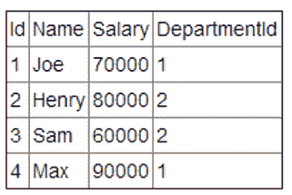
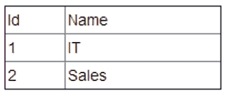

# 招商银行信用卡中心 2019 秋招 IT 笔试（大数据方向第一批）

## 1

模糊查询，可以检索出以“M”开头，且第二个字符不是“c”的所有字符串的是

正确答案: D   你的答案: 空 (错误)

```cpp
LIKE‘Mc_’
```

```cpp
LIKE‘Mc%’
```

```cpp
LIKE‘M[^c]_’
```

```cpp
LIKE‘M[^c]%’
```

本题知识点

算法工程师 招商银行信用卡中心 大数据开发工程师 2019

讨论

[小辣条儿](https://www.nowcoder.com/profile/193283546)

本题中模糊查询使用关键字“like”，‘M’表示以字母 M 开头，[^c]表示第二个字母不是 c，“^”表示非，“%”是匹配一个或者多个字符

发表于 2018-12-01 18:37:49

* * *

[改过行善](https://www.nowcoder.com/profile/4691042)

_ 表示只是一个字符吗？

发表于 2019-10-18 14:49:18

* * *

## 2

关于添加带自增列的数据，下列说法正确的是

正确答案: B   你的答案: 空 (错误)

```cpp
自增的列需要显式地添加
```

```cpp
自增的列无须显式地添加。如需添加全部字段数据时，仅需表名，可省略全部字段
```

```cpp
自增的列无须显式地添加。如需添加全部字段数据时，虚列出除自增列之外的全部列名
```

```cpp
自增的列可以显式地添加，也可以非显示地添加
```

本题知识点

算法工程师 招商银行信用卡中心 大数据开发工程师 2019

## 3

select * from tab where colA=’1’ union select * from tab where colB=’2’ 与此查询语句等价的选项是

正确答案: B   你的答案: 空 (错误)

```cpp
select * from tab where colA=’1’ and colB= ’2’
```

```cpp
select * from tab where colA=’1’ or colB= ’2’
```

```cpp
select * from tab where colA=’1’
```

```cpp
select * from tab where colB=’2’
```

本题知识点

算法工程师 招商银行信用卡中心 大数据开发工程师 2019

讨论

[属实小垃圾](https://www.nowcoder.com/profile/389496)

B UNION 求并并去重

发表于 2019-09-10 15:51:46

* * *

## 4

在有关数据仓库测试,下列说法不正确的是

正确答案: D   你的答案: 空 (错误)

```cpp
在完成数据仓库的实施过程中,需要对数据仓库进行各种测试.测试工作中要包括单元测试和系统测试
```

```cpp
当数据仓库的每个单独组件完成后,就需要对他们进行单元测试
```

```cpp
系统的集成测试需要对数据仓库的所有组件进行大量的功能测试和回归测试
```

```cpp
在测试之前没必要制定详细的测试计划
```

本题知识点

算法工程师 招商银行信用卡中心 大数据开发工程师 2019

## 5

下面代码段的结果为（）

```cpp
int a = 1;
int b = 1;
a += b++;
b += ++a;
```

正确答案: B   你的答案: 空 (错误)

```cpp
a=3,b=4
```

```cpp
a=3,b=5
```

```cpp
a=4,b=4
```

```cpp
a=4,b=5
```

本题知识点

招商银行信用卡中心 2019 C++ C 语言

讨论

[hadoopFans](https://www.nowcoder.com/profile/128606561)

第一步，初始化 a=1,b=1 第二步，a+=b++，b++是后缀加法，先运算再加，即先执行 a = (a+b) =(1+1) =  2,再 b = b+1=2,此时 a=2，b=2 第三步，b+=++a，++a 是前缀加法，先加再运算，即先执行 a=a+1=3，再 b=b+a=2+3=5,最终 a=3，b=5

发表于 2020-04-08 11:57:52

* * *

[咸鱼 24](https://www.nowcoder.com/profile/9113800)

++i 先加 1 再赋值 i++先赋值再加一

发表于 2022-03-06 09:38:07

* * *

## 6

在关系模型中，实现“关系中不允许出现相同的元组”的约束是通过

正确答案: C   你的答案: 空 (错误)

```cpp
外键
```

```cpp
超键
```

```cpp
主键
```

```cpp
候选键
```

本题知识点

算法工程师 招商银行信用卡中心 大数据开发工程师 2019

讨论

[一二三的七](https://www.nowcoder.com/profile/375506607)

[知识点] 数据库和表的有效性检验
[评析] 关系中的主键不允许取空值，因为关系中的每行都代表一个实体，而任何实体是可区分的，就是靠主键的取值来惟一标识，如果主键值为空，意味着存在不可识别的实体，或者说主键失去了惟一标识元组的作用。

发表于 2019-03-06 17:42:56

* * *

## 7

以下 python 脚本的运行结果正确的是

    def addElement(_list):
        print(6, id(_list))
        _list.append(0)
        print(7, id(_list))
        return _list

    if __name__ == "__main__":
        list1 = [1, 2, 3]
        print(1, id(list1))
        list2 = addElement(list1)
        print(2, list1)
        print(3, id(list1))
        print(4, list2)
        print(5, id(list2))

正确答案: A   你的答案: 空 (错误)

```cpp
1 52875528<br><br>6 52875528<br><br>7 52875528<br><br>2 [1, 2, 3, 0]<br><br>3 52875528<br><br>4 [1, 2, 3, 0]<br><br>5 52875528
```

```cpp
1 52875528<br><br>6 52879800<br><br>7 52879800<br><br>2 [1, 2, 3]<br><br>3 52875528<br><br>4 [1, 2, 3, 0]<br><br>5 52879800
```

```cpp
1 52875528<br><br>6 52879800<br><br>7 52879800<br><br>2 [1, 2, 3]<br><br>3 52875528<br><br>4 [1, 2, 3, 0]<br><br>5 52889000
```

```cpp
1 52875528<br><br>6 52875528<br><br>7 52889000<br><br>2 [1, 2, 3]<br><br>3 52875528<br><br>4 [1, 2, 3, 0]<br><br>5 52889000
```

本题知识点

算法工程师 招商银行信用卡中心 大数据开发工程师 2019

讨论

[阿靳](https://www.nowcoder.com/profile/331344780)

列表是可变对象，在 list2 = addElement(list1)赋值情况下，只是对原对象的引用，未复制，其地址不变

发表于 2019-07-12 15:56:29

* * *

## 8

Hive 中 concat 函数的作用是是将传入的参数连接成为一个字符串，则 concat（’a’,null,’b’）的结果是

正确答案: D   你的答案: 空 (错误)

```cpp
ab
```

```cpp
a
```

```cpp
b
```

```cpp
NULL
```

本题知识点

算法工程师 招商银行信用卡中心 大数据开发工程师 2019

讨论

[Jred](https://www.nowcoder.com/profile/5672569)

concat 函数在连接字符串的时候，只要其中一个是 NULL,那么将返回 NULL

发表于 2018-12-11 15:42:26

* * *

## 9

以下关于 HDFS 中 Block 的说法正确的是

正确答案: C   你的答案: 空 (错误)

```cpp
一个磁盘有自己的块大小，一般为 512 个字节，HDFS 中的块大小与本地磁盘保持一致
```

```cpp
为了容错，一般 Block 的默认备份 1 份，并且会尽量考虑到网络拓扑进行分布式存储
```

```cpp
由于分布式文件系统中使用 Block 来抽象数据存储，由于文件的分块不需要存储在同一个机器上，所以 HDFS 的文件可以大于每个单独的磁盘大小
```

```cpp
数据文件的各个 Block 主要存储在 namenode 上
```

本题知识点

算法工程师 招商银行信用卡中心 大数据开发工程师 招商银行信用卡中心 2019

讨论

[鬼迷日眼](https://www.nowcoder.com/profile/491617595)

A.默认 1.0 是 64mb，2.0 是 128mb B.默认 3 副本 D.namenode(nn)相当于管理者，数据实际存在 datanode(dn)

发表于 2019-01-14 17:29:59

* * *

## 10

如何删除 sales 表中产品类型为 toys 的 profits 列的列值？

正确答案: A   你的答案: 空 (错误)

```cpp
UPDATE sales SET profits = NULL WHERE product_type = 'TOYS'
```

```cpp
DELETE profits FROM sales WHERE product_type = 'TOYS'
```

```cpp
DELETE FROM sales WHERE product_type = 'TOYS'
```

```cpp
DELETE FROM sales
```

本题知识点

算法工程师 招商银行信用卡中心 大数据开发工程师 2019

讨论

[Enigma2018](https://www.nowcoder.com/profile/2681283)

delete 删除的是整条的记录

发表于 2019-03-27 19:27:38

* * *

## 11

Impala 与下列哪个组件共享元数据信息

正确答案: D   你的答案: 空 (错误)

```cpp
HDFS
```

```cpp
Hive
```

```cpp
Pig
```

```cpp
Oozie
```

本题知识点

算法工程师 招商银行信用卡中心 大数据开发工程师 2019

讨论

[牛客 7912388 号](https://www.nowcoder.com/profile/7912388)

答案错误，共享元数据的是 hive。乌贼只是调度平台

发表于 2019-03-18 23:23:19

* * *

[零葬](https://www.nowcoder.com/profile/75718849)

为什么和一个调度组件共享元数据

发表于 2020-11-24 10:22:02

* * *

[马小蒙](https://www.nowcoder.com/profile/224967)

答案错了吧，是 Hive 可与 Impala 与共享元数据信息

发表于 2019-08-27 10:10:55

* * *

## 12

Spark 中以下哪个操作会进行真实计算

正确答案: D   你的答案: 空 (错误)

```cpp
Map
```

```cpp
Join
```

```cpp
ReduceByKey
```

```cpp
collect
```

本题知识点

算法工程师 招商银行信用卡中心 大数据开发工程师 2019

讨论

[rookiejkl](https://www.nowcoder.com/profile/816892084)

D 只有 D 是行动算子

发表于 2019-01-14 21:29:46

* * *

[鬼迷日眼](https://www.nowcoder.com/profile/491617595)

map join reduceByKey 都是懒操作

发表于 2019-01-14 17:32:29

* * *

## 13

下面 spark 代码执行时，会读取几次 file 文件
   val raw = sc.textFile(file)
   val pvLog = raw.filter(isPV(_))
   val clLog = raw.filter(isCL(_))
   val baseRDD = pvLog.union(clLog)
   val baseRDD.count()

正确答案: B   你的答案: 空 (错误)

```cpp
0 次
```

```cpp
1 次
```

```cpp
2 次
```

```cpp
3 次
```

本题知识点

算法工程师 招商银行信用卡中心 大数据开发工程师 2019

讨论

[Iamfine！](https://www.nowcoder.com/profile/587482910)

只读一次 迭代生成的文件存在内存中

发表于 2019-04-09 16:12:08

* * *

[零葬](https://www.nowcoder.com/profile/75718849)

前面都是在定义转换算子，只有最后 count 是行动算子，开始读取数据并进行后续操作

发表于 2020-11-24 10:21:14

* * *

## 14

如果我们现有一个安装 2.6.5 版本的 hadoop 集群，在不修改默认配置的情况下存储 200 个 200M 的文本文件和 200 个 30M 的文本，请问最终会在集群中产生多少个数据块（包括副本）

正确答案: B   你的答案: 空 (错误)

```cpp
400
```

```cpp
1800
```

```cpp
600
```

```cpp
1200
```

本题知识点

算法工程师 招商银行信用卡中心 大数据开发工程师 2019

讨论

[:D 小豆豆](https://www.nowcoder.com/profile/6712122)

hadoop2.x 数据块大小是 128mb，dfs.replication 默认是 3。 其中 200 个 200m 会按照 128m 的数据块大小进行分割分散存储，就是（200 * 2），而 200 个 30m 会每一个用一个数据块，所以就有（200 *2 + 200）再乘以 3 份，就是 600 * 3 = 1800.

发表于 2018-12-11 11:06:30

* * *

[菜的不能再菜的一个人](https://www.nowcoder.com/profile/413661588)

| dfs.blocksize | 134217728 |

发表于 2018-11-17 12:36:00

* * *

## 15

关于 Kafka，以下说法不正确的是

正确答案: C   你的答案: 空 (错误)

```cpp
Producer 根据指定的 partition 方法，将消息发布到指定 topic 的 partition
```

```cpp
kafka 集群接收到 Producer 发过来的消息后，将其持久化到硬盘，并保留消息指定时长，而不关注消息是否被消费
```

```cpp
Kafka 某个 Topic 的消息一旦被消费掉后，不会再被其他消费者重复消费
```

```cpp
Kafka 消费者可以指定从最早的 offset 开始消费，也可指定从最新的 offset 开始消费
```

本题知识点

算法工程师 招商银行信用卡中心 大数据开发工程师 2019

## 16

python3 中获取用户输入并默认以字符串存储的函数是

正确答案: D   你的答案: 空 (错误)

```cpp
raw_input
```

```cpp
print
```

```cpp
raw
```

```cpp
input
```

本题知识点

算法工程师 招商银行信用卡中心 大数据开发工程师 2019

讨论

[小牛 321](https://www.nowcoder.com/profile/972373592)

题目是指明在 python3 的版本，python3 版本中 raw_input 和 input 合并，读取输入的字符，默认以字符串处理，并返回字符串

发表于 2022-03-01 18:57:22

* * *

## 17

下列对 SQL Server 的描述正确的有

正确答案: A B D   你的答案: 空 (错误)

```cpp
关系型数据库
```

```cpp
企业级数据库
```

```cpp
层次化数据库
```

```cpp
客户机/服务器数据库
```

本题知识点

算法工程师 招商银行信用卡中心 大数据开发工程师 2019

## 18

在 SQL 中以下哪些方式可以用来对数据排序

正确答案: A B D   你的答案: 空 (错误)

```cpp
ORDER BY
```

```cpp
ROW_NUMBER() OVER()
```

```cpp
PARTITION BY
```

```cpp
RANK() OVER()
```

本题知识点

算法工程师 招商银行信用卡中心 大数据开发工程师 2019

讨论

[✿✿](https://www.nowcoder.com/profile/9343862)

```cpp
C. PARTITION BY 用来分区的

A. ORDER BY (select score from student_score order by score desc)  按照学生成绩降序
B. ROW_NUMBER() OVER()  (row_number() over(partition by class order by score desc)) 根据班级分区再按照成绩降序
D. RANK() OVER() (rank() over(partition by class order by score desc)) 
   跟 B 不同的是 row_number()是没有重复值的排序。
   A 的成绩是 100  B 的成绩是 100，C 的成绩是 99，
   若使用 row_number()， 排名下来 A 是 1，B 是 2,C 是 3。
   若使用 RANK() OVER()，A 是 1，B 是 1，C 是 3。
   若使用 dense_rank()，A 是 1，B 是 1，C 是 2 
```

编辑于 2019-08-06 20:20:35

* * *

## 19

下列哪个是 Hadoop 运行的模式

正确答案: A C D   你的答案: 空 (错误)

```cpp
单机版
```

```cpp
联机版
```

```cpp
伪分布式
```

```cpp
分布式
```

本题知识点

算法工程师 招商银行信用卡中心 大数据开发工程师 2019

## 20

下面哪些是 YARN 支持的调度语义

正确答案: A D   你的答案: 空 (错误)

```cpp
请求节点 nodeX 上 5 个 Container：虚拟 CPU 个数为 2，内存量为 2GB
```

```cpp
请求任意节点上 5 个 Container：虚拟 CPU 个数为 3，内存量为 1GB
```

```cpp
请求任一同一个机架 rack 上 3 个 Container：虚拟 CPU 个数为 1，内存量为 6GB
```

```cpp
请求机架 rackX 上 3 个 Container：虚拟 CPU 个数为 4，内存量为 3GB
```

本题知识点

算法工程师 招商银行信用卡中心 大数据开发工程师 2019

## 21

哪些命令可以查看 file1 文件的第 300-500 行的内容

正确答案: A B D   你的答案: 空 (错误)

```cpp
cat file1 | tail -n +300 | head -n 200
```

```cpp
cat file1| head -n 500 | tail -n + 300
```

```cpp
sed -n ‘500,200p’ file1
```

```cpp
sed -n ‘300,500p’ file1
```

本题知识点

算法工程师 招商银行信用卡中心 大数据开发工程师 2019

讨论

[2020 好运连连](https://www.nowcoder.com/profile/705927175)

linux 如何显示一个文件的某几行(中间几行) 
【一】从第 3000 行开始，显示 1000 行。即显示 3000~3999 行 
cat filename | tail -n +3000 | head -n 1000
【二】显示 1000 行到 3000 行 
cat filename| head -n 3000 | tail -n +1000 
tail -n 1000：显示最后 1000 行 
tail -n +1000：从 1000 行开始显示，显示 1000 行以后的 
head -n 1000：显示前面 1000 行
【三】用 sed 命令
sed -n ‘5,10p’ filename 这样你就可以只查看文件的第 5 行到第 10 行。

发表于 2019-07-25 21:26:29

* * *

## 22

查询每个部门中工资最高的员工

有两张表，一张表为员工表，包含员工 ID，员工姓名，员工工资和员工所在的部门 ID，


另一张表为部门表，包含部门 ID 和部门名称。

写出查询每个部门中工资最高的员工信息的 SQL。对于上述两张表，输出应如下：


你的答案

本题知识点

算法工程师 招商银行信用卡中心 大数据开发工程师 2019

讨论

[牛客 893872645 号](https://www.nowcoder.com/profile/893872645)

SELECT Department.name as  "Department", Employee.name as  "Employee", SalaryFROM EmployeeJOIN DepartmentON Employee.departmentId = Department.Id WHERE  (Employee.departmentId, Salary) IN  (  SELECT departmentId,  MAX(Salary) FROM Employee GROUP  BY departmentId )  ;

发表于 2020-11-04 21:58:18

* * *

[金州小铁匠](https://www.nowcoder.com/profile/849924074)

# window functionselect d.Name as Department, e.Name as Employee, Highest as Salary from (select Name,Salary,DepartmentId, MAX() over(partition by DepartmentId order by Salary desc) as Highestfrom Employee ) ejoin Department d on d.Id = e.DepartmentId# no window functionselect e.Name as Employee,d.Name as Department, highest as Salary from Employee ejoin(select max(salary) as highest,DepartmentId from Employeegroup by 2) highon high.highest = e.Salary and high.DepartmentId = e.DepartmentIDjoin Department don d.Id = e.DepartmentId

发表于 2020-06-05 04:48:27

* * *

[星晴(≧ω≦)/](https://www.nowcoder.com/profile/435226150)

select [d.Name](http://d.name/) as Department, [e.Name](http://e.name/) as Employee, e.Salary from Department d inner join Employee e on [d.Id](http://d.id/) = e.DepartmentId and e.Salary >= (select max(Salary) from Employee where DepartmentId = [d.Id](http://d.id/))

发表于 2019-04-20 11:29:04

* * *

## 23

客户隐私管理是银行业的重中之重，现需要对数据仓库中多张表中存储的不同格式的客户手机号虚拟出一个"手机号 ID",该 ID 会被用于公网中的系统间调用，你会如何生成该 ID，并请设计手机号和 ID 的映射关系表结构？请注意：手机号和 ID 的关系一旦生成，不应再发生改变；无法通过 ID 倒推出手机号

你的答案

本题知识点

算法工程师 招商银行信用卡中心 大数据开发工程师 2019

讨论

[牛客 419018875 号](https://www.nowcoder.com/profile/419018875)

通过非对称加密，比如 md 加密+盐值

发表于 2020-02-08 21:20:12

* * *

[再见。](https://www.nowcoder.com/profile/5205302)

加盐后 Md5

发表于 2019-11-03 02:46:28

* * *

## 24

数仓 ETL 过程中，数据探索阶段主要包括哪些内容？

你的答案

本题知识点

算法工程师 招商银行信用卡中心 大数据开发工程师 2019

讨论

[Jancydc](https://www.nowcoder.com/profile/134754422)

&

1.收集所有的源系统文档，数据字典等内容

2.收集源系统的使用情况

3.判断数据的起始来源

4.通过数据概况对源系统的数据关系进行分析

发表于 2020-04-07 13:48:58

* * *

## 25

数据仓库中为什么要做拉链表?什么样的场景比较适合用拉链表？举例说明拉链表的实现过程？

你的答案

本题知识点

算法工程师 招商银行信用卡中心 大数据开发工程师 2019

讨论

[好好学习知不知道](https://www.nowcoder.com/profile/197386)

在数仓数据架构中，fdm 为主题模型加工层，由于源系统每日会有数据新增或修改，如果对每一条记录数仓都进行存储，会出现大量重复冗余数据，如果采用拉链表形式存储，将历史状态数据存入闭链状态，将新数据和最新修改记录存入开链区（也就是数据有效区），采用关键词开链日期 start_dt 和闭链日期 end_dt 加主键确定一条记录，这样既节约存储空间，又可以随时根据 start_dt 和 end_dt 的范围查询任何时间段的数据记录，如果数据量太大，还可采用二级分区减少当前有效数据量，加快当前有效数据的查询，进而加快与新增数据的差异对比，从而加快了表更新的速度。

发表于 2019-10-29 10:15:53

* * *

[哈啰内推 2021](https://www.nowcoder.com/profile/975097568)

拉链表是为了保留看历史数据，并且使存储最为节约。比如我有 100w 用户，用户表记录了他们的状态，如果部分用户状态每天都有更新，我采用每天存全量用户数据的方式来记录历史和更新的状态，这样极大浪费存储空间，我用拉链表的话，每天把跟新用户的数据插入到用户表，这样既保留了历史数据，并且使存储最为节约

发表于 2019-04-05 20:47:03

* * *

## 26

小赵在测试 pyspark 的时候，写了一段代码如下

lines = sc.textFile("data.txt")

lineLengths = lines.map(lambda s: len(s))

lineLengths.persist()

lineCount = lineLengths.count()

totalLength = lineLengths.reduce(lambda a, b: a + b)

1） 该代码运行过程中，请分析 1,2,4 行 spark RDD 的执行过程是怎么样的?

2） 请结合代码分析 lineLengths.persist()这一步的作用

你的答案

本题知识点

算法工程师 招商银行信用卡中心 大数据开发工程师 2019

## 27

用 Python 编写一个函数，获得当前目录下的所有文件名（包含子目录中的子文件，假设当前用户有所有文件的访问权限）

你的答案

本题知识点

算法工程师 招商银行信用卡中心 大数据开发工程师 2019

讨论

[零葬](https://www.nowcoder.com/profile/75718849)

```cpp
import os
import sys

def search_file(path, Aggregate_list):
    for file in os.listdir(path):
        this_path = os.path.join(path, file)
        if os.path.isfile(this_path):
            Aggregate_list.append(this_path)      # 文件夹直接加入列表
        else:
            # Aggregate_list.append(this_path)      # 子目录继续递归
            search_file(this_path, Aggregate_list) 
    return Aggregate_list

if __name__ == "__main__":
    path = sys.argv[1]    # 读取路径参数
    Aggregate_list = search_file(path, [])
    print(Aggregate_list)
```

发表于 2020-11-24 10:26:52

* * *

[任何事情都有突破口，加油💪](https://www.nowcoder.com/profile/261783159)

import os
import sys

allfile = []
def get_all_file(rawdir):
      allfilelist=os.listdir(rawdir)
      for f in allfilelist:
            filepath=os.path.join(rawdir,f)
            if os.path.isdir(filepath):
                  get_all_file(filepath)
            allfile.append(filepath)
      return allfile

if __name__=='__main__':
      if(len(sys.argv) < 2):
            print("Usage: getallfiles.py rawdir")
            exit()
      rawdir = sys.argv[1]
      #current = os.getcwd()
      allfiles = get_all_file(rawdir)

发表于 2019-07-24 19:27:36

* * *