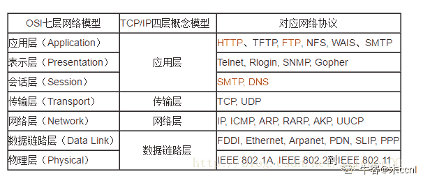
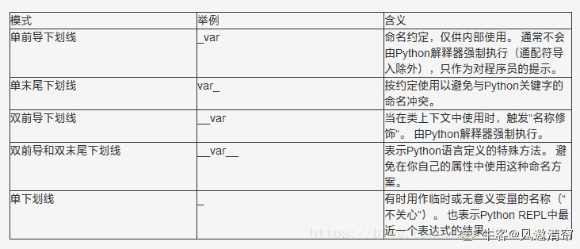
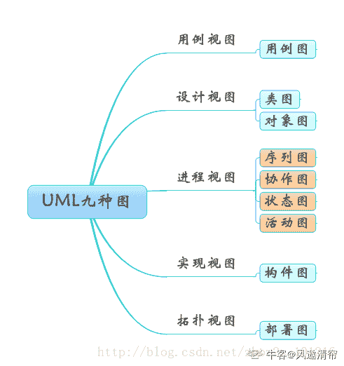

# 招商银行信用卡中心 2019 秋招 IT 笔试（测试开发方向第一批）

## 1

给定一个正整数数组，它的第 *i* 个元素是比特币第 *i* 天的价格。

如果你最多只允许完成一笔交易（即买入和卖出一次），设计一个算法来计算你所能获取的最大利润。

注意你不能在买入比特币前卖出。

本题知识点

Java 工程师 C++工程师 招商银行信用卡中心 测试工程师 贪心 数组 2019 测试开发工程师

讨论

[凝视深空](https://www.nowcoder.com/profile/4232948)

```cpp

	#include<bits/stdc++.h>

	using namespace std;

	intmain() {

	    intn, mi = INT_MAX, maxProfit = 0;

	    while(cin >> n) {

	        maxProfit = max(n - mi, maxProfit);

	        mi = min(n, mi);

	    }

	    cout << maxProfit;

	    return0;

	}

```

发表于 2018-11-20 22:20:20

* * *

[谁的电脑](https://www.nowcoder.com/profile/743368)

```cpp
import java.util.*;

public class Main {
    public static void main(String[] args) {
        Scanner scanner = new Scanner(System.in);
        int buy = scanner.nextInt(), profit = 0;
        while (scanner.hasNext()) {
            // 输入新的价格
            int price = scanner.nextInt();
            // 每次输入新的价格时，更新最大利润
            profit = Math.max(profit, price - buy);
            // 每次输入新的价格时，更新最低买入价
            buy = Math.min(buy, price);
        }
        System.out.println(profit);
    }
}
```

发表于 2019-07-02 15:40:46

* * *

[ElonB](https://www.nowcoder.com/profile/623894)

```cpp
"""
设 dp[i]为以 i 为卖出点的最大收益
"""
import sys

if __name__ == "__main__":
    # sys.stdin = open("input.txt", "r")
    a = list(map(int, input().strip().split()))
    t_min = a[0]
    dp = []
    for i in range(len(a)):
        t_min = min(t_min, a[i])
        dp.append(a[i] - t_min)
    print(max(dp))

```

发表于 2019-07-10 16:28:31

* * *

## 2

下列测试方法中,既适用于黑盒测试，也可以用于白盒测试的是

正确答案: A   你的答案: 空 (错误)

```cpp
边界值法
```

```cpp
逻辑覆盖法
```

```cpp
正交试验设计法
```

```cpp
基本路径法
```

本题知识点

Java 工程师 C++工程师 测试工程师 招商银行信用卡中心 测试开发工程师 招商银行信用卡中心 2019

讨论

[不吃白切鸡](https://www.nowcoder.com/profile/5648508)

黑盒测试方法：等价类划分、边界值分析、判定表法、因果图法、正交表法白盒测试方法：代码检查法、静态结构分析法、静态质量度量法、逻辑覆盖法、基本路径测试法、域测试、符号测试、路径覆盖和程序变异。

发表于 2019-03-17 09:06:42

* * *

## 3

执行以下 SQL，下面哪个名字会被查询出来
SELECT FirstName FROM StaffList WHERE FirstName LIKE’_A%’ 

正确答案: D   你的答案: 空 (错误)

```cpp
Allen
```

```cpp
CLARK
```

```cpp
David
```

```cpp
JACK
```

本题知识点

Java 工程师 C++工程师 测试工程师 招商银行信用卡中心 测试开发工程师 招商银行信用卡中心 2019

讨论

[只想划水](https://www.nowcoder.com/profile/743029166)

%    替代一个或多个字符
_    仅替代一个字符[`www.w3school.com.cn/sql/sql_wildcards.asp`](https://www.w3school.com.cn/sql/sql_wildcards.asp)

发表于 2019-08-27 17:21:37

* * *

## 4

在 SQL 中，与“NOT IN”等价的操作符是

正确答案: A   你的答案: 空 (错误)

```cpp
&lt;&gt;ALL
```

```cpp
&lt;&gt;SOME
```

```cpp
=SOME
```

```cpp
=ALL
```

本题知识点

Java 工程师 C++工程师 测试工程师 招商银行信用卡中心 测试开发工程师 招商银行信用卡中心 2019

讨论

[风邀清帘](https://www.nowcoder.com/profile/140138187)

eq 等于 neq 不等于 gt 大于 egt 大于等于 lt 小于 elt 小于等于 like LIKE between BETWEEN

发表于 2020-03-17 23:31:21

* * *

[木 ccnl](https://www.nowcoder.com/profile/349776495)

<>ANY:
OR 作用 父查询中的结果集不等于子查询中的 a 或者 b 或者 c,则为真
SELECT * FROM T2 WHERE N <>ANY(SELECT * FROM T1)

NOT IN:相当于<>all

not in 的子查询中存在 null 值则整个子句返回 null
AND 作用 父查询中的结果集不等于子查询中任意一个结果集中的值,则为真
SELECT * FROM T2 WHERE N NOT IN(SELECT * FROM T1)

发表于 2019-09-15 14:19:28

* * *

## 5

某学生成绩管理系统软件的功能是：输入学生成绩（0 ~ 100 分），然后输出成绩的等次。小张分别测试了-1、0、1、99、100、101 情况，该软件测试方法属于

正确答案: C   你的答案: 空 (错误)

```cpp
静态测试
```

```cpp
白盒测试
```

```cpp
边界值分析法
```

```cpp
错误推测法
```

本题知识点

Java 工程师 C++工程师 测试工程师 招商银行信用卡中心 测试开发工程师 2019

## 6

在一个软件测试用例中，有一个字符串数据，若首字符必须是 0-9 的数字，其余字符必须是 a-z 的小写字母，在此情况下是正确的，若首字符不正确，则输出 message1，若其余字符不正确，则输出 message2。这种情况下最好采用

正确答案: C   你的答案: 空 (错误)

```cpp
边界值分析
```

```cpp
等价类划分
```

```cpp
因果图
```

```cpp
错误推测法
```

本题知识点

Java 工程师 C++工程师 测试工程师 招商银行信用卡中心 测试开发工程师 2019

讨论

[康康萌萌](https://www.nowcoder.com/profile/384554346)

因果图测试用例设计步骤：1、确定软件规格（需求中）的原因和结果 2、确定原因和结果之间的逻辑关系 3、确定因果图中的各个约束 4、根据因果图并转换为决策表 5、根据决策表设计测试用例

发表于 2019-09-09 21:22:27

* * *

[牛客 439834845 号](https://www.nowcoder.com/profile/439834845)

因果图设计测试用例的步骤：1.分析需求，获取条件和动作 2.分析条件和条件，条件和动作之间的关系 3.根据关系画出因果图 4.将因果图转化为判定表 5.生成测试用例

发表于 2020-07-06 20:37:27

* * *

[木 ccnl](https://www.nowcoder.com/profile/349776495)

错误推测法：基于经验和直觉推测程序中所有可能存在的各种错误，从而有针对性的设计测试用例的方法。

发表于 2019-09-15 14:23:05

* * *

## 7

一棵二叉树，已知有两个孩子的节点个数为 100 个，有一个孩子的节点个数为 100 个，那么这棵树总共有多少个节点

正确答案: C   你的答案: 空 (错误)

```cpp
299
```

```cpp
300
```

```cpp
301
```

```cpp
其他选项都不是
```

本题知识点

Java 工程师 C++工程师 测试工程师 招商银行信用卡中心 测试开发工程师 2019

讨论

[你谁呀](https://www.nowcoder.com/profile/196874365)

树的入度=树的出度=总节点数-1。设出度为 0 的节点有 n0,为 1 的节点为 n1=100,为 2 的节点有 n2=100,0*n0+1*n1+2*n2=n0+n1+n2-1，所以 n0+n1+n2 =301

发表于 2019-07-19 15:44:32

* * *

[牛客 191649028 号](https://www.nowcoder.com/profile/191649028)

300 ＝ 301-1

发表于 2021-12-11 14:54:53

* * *

## 8

AES 加密属于哪种类型

正确答案: A   你的答案: 空 (错误)

```cpp
对称加密
```

```cpp
非对称加密
```

本题知识点

Java 工程师 C++工程师 测试工程师 招商银行信用卡中心 测试开发工程师 2019

讨论

[木 ccnl](https://www.nowcoder.com/profile/349776495)

对称加密(也叫[私钥](https://baike.baidu.com/item/%E7%A7%81%E9%92%A5)加密)指加密和解密使用相同[密钥](https://baike.baidu.com/item/%E5%AF%86%E9%92%A5)的加密算法。非对称加密(公[钥](https://baike.baidu.com/item/%E7%A7%81%E9%92%A5)加密)指加密和解密使用不同[密钥](https://baike.baidu.com/item/%E5%AF%86%E9%92%A5)的加密算法。 常用的对称加密算法 1、DES
已破解，不再安全，基本没有企业在用了
是对称加密算法的基石，具有学习价值
密钥长度 56（JDK）、56/64（BC）
2、DESede（三重 DES）
早于 AES 出现来替代 DES
计算密钥时间太长、加密效率不高，所以也基本上不用
密钥长度 112/168（JDK）、128/192（BC）
3、AES
最常用的对称加密算法
密钥建立时间短、灵敏性好、内存需求低（不管怎样，反正就是好）
实际使用中，使用工作模式为 CTR（最好用 BC 去实现），此工作模式需要引入 IV 参数（16 位的字节数组）
密钥长度 128/192/256，其中 192 与 256 需要配置无政策限制权限文件（JDK6）
填充模式最常用的两种 PKCS5Padding 和 PKCS7Padding，其中后者只有 BC 独有。
4、IDEA
常用的电子邮件加密算法
工作模式只有 ECB
密钥长度 128 位
5、PBE
综合了消息摘要算法和对称加密算法，最常见的是 PBEWithMD5AndDES
工作模式只有 CBC（已丧失安全性，不推荐使用），所以 PBE 也不推荐使用了 

编辑于 2019-09-15 14:39:52

* * *

## 9

以下哪个不是 HTTP 的方法

正确答案: C   你的答案: 空 (错误)

```cpp
GET
```

```cpp
POST
```

```cpp
REMOVE
```

```cpp
HEAD
```

本题知识点

Java 工程师 C++工程师 测试工程师 招商银行信用卡中心 测试开发工程师 2019

讨论

[不吃白切鸡](https://www.nowcoder.com/profile/5648508)

HTTP1.0 定义了三种请求方法： GET, POST 和 HEAD 方法。

HTTP1.1 新增了五种请求方法：OPTIONS, PUT, DELETE, TRACE 和 CONNECT 方法。

发表于 2019-03-17 09:30:04

* * *

[木 ccnl](https://www.nowcoder.com/profile/349776495)

方法             说明 支持的 HTTP 协议版本
GET             获取资源 1.0、1.1
POST           传输实体主体 1.0、1.1
PUT              传输文件 1.0、1.1
HEAD            获得报文首部 1.0、1.1
DELETE        删除文件 1.0、1.1
OPTIONS     询问支持的方法 1.1
TRACE         追踪路径 1.1
CONNECT   要求用隧道协议连接*** 1.1
LINK             建立和资源之间的联系 1.0
UNLINK       断开连接关系 1.0

发表于 2019-09-15 14:42:36

* * *

[牛客 301822160 号](https://www.nowcoder.com/profile/301822160)

百度百科

发表于 2021-03-20 12:18:37

* * *

## 10

不属于非关系型数据库的是

正确答案: B   你的答案: 空 (错误)

```cpp
Redis
```

```cpp
Oracle
```

```cpp
MongoDB
```

```cpp
Membase
```

本题知识点

Java 工程师 C++工程师 测试工程师 招商银行信用卡中心 测试开发工程师 2019

讨论

[只想划水](https://www.nowcoder.com/profile/743029166)

当今十大主流的关系型数据库:Oracle，Microsoft SQL Server，MySQL，PostgreSQL，DB2，Microsoft Access， SQLite，Teradata，MariaDB(MySQL 的一个分支)，SAP

发表于 2019-08-27 17:49:17

* * *

## 11

以下不属于网络层包含的协议的是

正确答案: D   你的答案: 空 (错误)

```cpp
ARP
```

```cpp
IP
```

```cpp
ICMP
```

```cpp
UDP
```

本题知识点

Java 工程师 C++工程师 测试工程师 招商银行信用卡中心 测试开发工程师 2019

讨论

[木 ccnl](https://www.nowcoder.com/profile/349776495)



发表于 2019-09-15 14:49:48

* * *

[不吃白切鸡](https://www.nowcoder.com/profile/5648508)

UDP 传输层协议

发表于 2019-03-17 09:43:51

* * *

## 12

x=20,y=5,则表达式 x/=y+5 的值是

正确答案: B   你的答案: 空 (错误)

```cpp
9
```

```cpp
2
```

```cpp
1
```

```cpp
10
```

本题知识点

Java 工程师 C++工程师 测试工程师 招商银行信用卡中心 测试开发工程师 2019

讨论

[哞哞牛哞哞](https://www.nowcoder.com/profile/4435183)

x/=y+5 计算方式为：x=x/(y+5)=20/(5+5)=2

发表于 2019-08-07 09:42:16

* * *

[牛客 191649028 号](https://www.nowcoder.com/profile/191649028)

/= += 本质都是 = ，所以它的优先级低于 + - 是不是就很好记住了？

发表于 2021-12-11 14:59:34

* * *

## 13

关于数据库索引，以下说法正确的是

正确答案: B   你的答案: 空 (错误)

```cpp
对某些字段建立索引，能够有效的提升相关字段的读与写的效率
```

```cpp
数据库索引的存在，可能导致相关字段删除的效率降低
```

```cpp
对某些字段建立索引，能够有效的减少相关数据库表的磁盘空间占用
```

```cpp
常见数据库管理系统，通常使用 hash 表来存储索引
```

本题知识点

Java 工程师 C++工程师 测试工程师 招商银行信用卡中心 测试开发工程师 2019

讨论

[木 ccnl](https://www.nowcoder.com/profile/349776495)

```cpp
优点：
    1.大大加快数据的检索速度;   
    2.创建唯一性索引，保证数据库表中每一行数据的唯一性;   
    3.加速表和表之间的连接;   
    4.在使用分组和排序子句进行数据检索时，可以显著减少查询中分组和排序的时间。
```

```cpp
缺点：

　　1.索引需要占用数据表以外的物理存储空间

　　2.创建索引和维护索引要花费一定的时间

　　3.当对表进行更新操作时，索引需要被重建，这样降低了数据的维护速度。
```

发表于 2019-09-15 15:01:13

* * *

[风邀清帘](https://www.nowcoder.com/profile/140138187)

B+树来存储索引

发表于 2020-03-17 23:40:54

* * *

## 14

Select 语句中，哪一个字句可以对结果元组进行排序

正确答案: A   你的答案: 空 (错误)

```cpp
ORDER BY
```

```cpp
HAVING
```

```cpp
Where
```

```cpp
GROUP<br>BY
```

本题知识点

Java 工程师 C++工程师 测试工程师 招商银行信用卡中心 测试开发工程师 招商银行信用卡中心 2019

讨论

[哞哞牛哞哞](https://www.nowcoder.com/profile/4435183)

B：对分组统计结果进一步设置条件 C：对查询结果按条件进行筛选 D：对数据按某属性进行分组

发表于 2019-08-07 09:50:25

* * *

[Aeris](https://www.nowcoder.com/profile/172327)

A

发表于 2019-03-11 23:48:27

* * *

## 15

在关系模型中实体与实体之间通过什么联系

正确答案: D   你的答案: 空 (错误)

```cpp
关系
```

```cpp
图
```

```cpp
结构
```

```cpp
表
```

本题知识点

Java 工程师 C++工程师 测试工程师 招商银行信用卡中心 测试开发工程师 2019

讨论

[只想划水](https://www.nowcoder.com/profile/743029166)

关系模型指的就是二维表格模型，而一个关系型数据库就是由二维表及其之间的联系所组成的一个数据组织

发表于 2019-08-27 17:52:36

* * *

[哞哞牛哞哞](https://www.nowcoder.com/profile/4435183)

二维表

发表于 2019-08-07 09:54:53

* * *

## 16

以下对自动化测试局限性的描述正确的有

正确答案: B   你的答案: 空 (错误)

```cpp
自动化测试可以提高测试覆盖率
```

```cpp
自动化测试对测试设计依赖性极大
```

```cpp
自动化测试可以取代手工测试
```

```cpp
自动化测试可以发现比手工测试更多的缺陷
```

本题知识点

Java 工程师 C++工程师 测试工程师 招商银行信用卡中心 测试开发工程师 2019

讨论

[只想划水](https://www.nowcoder.com/profile/743029166)

**局限性！！！**

发表于 2019-08-27 17:53:29

* * *

[小念宗](https://www.nowcoder.com/profile/967526766)

b

发表于 2019-04-12 15:48:07

* * *

## 17

在软件过程中，通常问题发现在哪一阶段是最理想的

正确答案: A   你的答案: 空 (错误)

```cpp
需求分析
```

```cpp
单元测试
```

```cpp
集成测试
```

```cpp
回归测试
```

本题知识点

Java 工程师 C++工程师 测试工程师 招商银行信用卡中心 测试开发工程师 2019

讨论

[tongjixl](https://www.nowcoder.com/profile/341847268)

早发现早治疗

发表于 2020-08-24 21:38:09

* * *

## 18

考虑到时间复杂度和空间复杂度，下列哪种排序算法相对更适合数据量巨大且有序程度低的场景

正确答案: B   你的答案: 空 (错误)

```cpp
快速排序
```

```cpp
堆排序
```

```cpp
插入排序
```

```cpp
冒泡排序
```

本题知识点

Java 工程师 C++工程师 测试工程师 招商银行信用卡中心 测试开发工程师 2019

讨论

[木 ccnl](https://www.nowcoder.com/profile/349776495)

[十大经典排序算法（动图演示）](https://www.cnblogs.com/onepixel/p/7674659.html)

[`www.cnblogs.com/onepixel/articles/7674659.html`](https://www.cnblogs.com/onepixel/articles/7674659.html)

发表于 2019-09-15 15:55:47

* * *

[friso](https://www.nowcoder.com/profile/93351682)

堆排序：时间：nlogn，空间：1 快速排序：时间：nlogn，空间：nlogn

发表于 2021-03-26 20:13:34

* * *

## 19

以下 Java 程序编译运行后的输出结果是 

```cpp
public class Test { 
    public static void main(String[] args) { 
        int i = 0, sum = 0; 
        while (i <= 10) { 
            sum += i; 
            i++; 
            if (i % 2 == 0){ 
                sum += 1; 
            } 
        } 
        System.out.println(sum); 
    } 
} 

```

正确答案: D   你的答案: 空 (错误)

```cpp
0
```

```cpp
55
```

```cpp
61
```

```cpp
60
```

本题知识点

Java 工程师 C++工程师 测试工程师 招商银行信用卡中心 测试开发工程师 2019

讨论

[牛客 191649028 号](https://www.nowcoder.com/profile/191649028)

0-10 想加得 55，如果 i % 2 则总数加 1。 本来这段代码表达点是这个，但是它把 i++ 写在%2 前面，导致 0 的时候没有加 1。这种代码属于挖坑型代码，需要调试，不能快速理解，上班的时候我要骂人的

发表于 2021-12-11 15:45:59

* * *

[heiyanheiha](https://www.nowcoder.com/profile/233053685)

1+2+3+...+10，奇数多加 1

发表于 2019-09-06 14:29:47

* * *

## 20

数据库的基本特点是

正确答案: C   你的答案: 空 (错误)

```cpp
(1)数据可以共享(或数据结构化)<br>(2)数据独立性<br>(3)数据冗余大，易移植<br>(4)统一管理和控制
```

```cpp
(1)数据可以共享(或数据结构化)<br>(2)数据互换性<br>(3)数据冗余小，易扩充<br>(4)统一管理和控制
```

```cpp
(1)数据可以共享(或数据结构化)<br>(2)数据独立性<br>(3)数据冗余小，易扩充<br>(4)统一管理和控制
```

```cpp
(1)数据非结构化<br>(2)数据独立性<br>(3)数据冗余小，易扩充<br>(4)统一管理和控制
```

本题知识点

Java 工程师 C++工程师 测试工程师 招商银行信用卡中心 测试开发工程师 2019

## 21

给定一个 16 个数的数组，为了找出这些数当中最大的 5 个数，最少需要进行多少次比较运算

正确答案: C   你的答案: 空 (错误)

```cpp
13
```

```cpp
14
```

```cpp
15
```

```cpp
16
```

本题知识点

Java 工程师 C++工程师 测试工程师 招商银行信用卡中心 测试开发工程师 2019

讨论

[hello 没钱](https://www.nowcoder.com/profile/513474569)

最好情况：前五个就是最大的，先将前五个比较取最小，需要 4 次。由于前五个已是最大，因此即使前五个最小仍然比后 11 都大，因此比较 11 次得到，前五最小也比后 11 大。4+11=15。

最坏情况：11*4

发表于 2020-08-22 10:06:41

* * *

[北宋卖书郎](https://www.nowcoder.com/profile/377652810)

当我们任取 5 个数时，找出这 5 个数最小的数要比较 4 次。我们假设取这 16 个数的前 5 个数为当前最大的 5 个数，并且记录当前最小的数。后面 11 个数依次和当前最小的数比，如果比当前最小的数大，那么将这个数加入到当前最大的五个数，重新找出这 5 个数的最小数为当前的最小数。如果后面的数比当前最小的数小，那么继续比下一个数。所以最坏的情况是比较 11*4=44 次。最好的情况是你一开始取的 5 个数就是这 16 个数最大的 5 个，那么比较的次数是 4+11=15 次

发表于 2020-03-09 12:38:16

* * *

[luckye24](https://www.nowcoder.com/profile/283047375)

冒泡排序检查是否有位置更改？是这样吗？求解答

发表于 2020-03-09 09:44:55

* * *

## 22

下列哪些属于软件测试的目的

正确答案: A B C D   你的答案: 空 (错误)

```cpp
降低软件风险
```

```cpp
完成软件交付
```

```cpp
掌握开发进度
```

```cpp
发现软件缺陷
```

本题知识点

Java 工程师 C++工程师 测试工程师 招商银行信用卡中心 测试开发工程师 2019

讨论

[敏捷小菜](https://www.nowcoder.com/profile/644294039)

为什么要有 c,掌握开发进度不应该是项目产品经理

发表于 2020-04-27 16:12:06

* * *

[小念宗](https://www.nowcoder.com/profile/967526766)

abcd

发表于 2019-04-12 15:47:17

* * *

## 23

以下关于 this 和 super 关键字的说法错误的是

正确答案: A C   你的答案: 空 (错误)

```cpp
this 和 super 关键字都可以访问成员属性，成员方法和构造方法
```

```cpp
在 main 方法中可以存在 this 或 super 关键字，但不能同时存在
```

```cpp
在一个类的构造方法中可以同时使用 this 和 super 来调用其他构造方法
```

```cpp
this 关键字指向当前对象自身，super 关键字指向当前对象的直接父类
```

本题知识点

Java 工程师 C++工程师 测试工程师 招商银行信用卡中心 测试开发工程师 2019

讨论

[牛客 70366231 号](https://www.nowcoder.com/profile/70366231)

正确答案：A C

发表于 2021-06-09 13:40:17

* * *

[hgnulb](https://www.nowcoder.com/profile/8667211)

bc

发表于 2020-11-11 22:39:01

* * *

[木 ccnl](https://www.nowcoder.com/profile/349776495)

super 和 this 的异同：

*   super（参数）：调用基类中的某一个构造函数（应该为构造函数中的第一条语句） 
*   this（参数）：调用本类中另一种形成的构造函数（应该为构造函数中的第一条语句）
*   super:　它引用当前对象的直接父类中的成员（用来访问直接父类中被隐藏的父类中成员数据或函数，基类与派生类中有相同成员定义时如：super.变量名    super.成员函数据名（实参）
*   this：它代表当前对象名（在程序中易产生二义性之处，应使用 this 来指明当前对象；如果函数的形参与类中的成员数据同名，这时需用 this 来指明成员变量名）
*   调用 super()必须写在子类构造方法的第一行，否则编译不通过。每个子类构造方法的第一条语句，都是隐含地调用 super()，如果父类没有这种形式的构造函数，那么在编译的时候就会报错。
*   super()和 this()类似,区别是，super()从子类中调用父类的构造方法，this()在同一类内调用其它方法。
*   super()和 this()均需放在构造方法内第一行。
*   尽管可以用 this 调用一个构造器，但却不能调用两个。
*   this 和 super 不能同时出现在一个构造函数里面，因为 this 必然会调用其它的构造函数，其它的构造函数必然也会有 super 语句的存在，所以在同一个构造函数里面有相同的语句，就失去了语句的意义，编译器也不会通过。
*   this()和 super()都指的是对象，所以，均不可以在 static 环境中使用。包括：static 变量,static 方法，static 语句块。
*   从本质上讲，this 是一个指向本对象的指针, 然而 super 是一个 Java 关键字。

发表于 2019-09-15 16:09:35

* * *

## 24

Session 和 Cookie 是互联网领域中两种常用的技术，数以亿计的用户访问招商银行时，就会用到这两种技术。有关 Cookie 和 Session 的描述，下面正确的有

正确答案: A B C   你的答案: 空 (错误)

```cpp
Cookie 数据存放在客户的浏览器上，Session 数据放在服务器上
```

```cpp
服务端为每个用户都会生成一个 Session 对象，通过 SessionID 来区分来自于哪个用户
```

```cpp
保存这个 SessionID 的方式可以采用 Cookie
```

```cpp
只要关闭浏览器，Session 就消失了
```

本题知识点

Java 工程师 C++工程师 测试工程师 招商银行信用卡中心 测试开发工程师 2019

讨论

[IUN_2930](https://www.nowcoder.com/profile/681480486)

Session 的销毁只有两种情况：1、session 调用了 session.invalidate()方法 2、前后两次请求超出了 session 指定的生命周期时间如果没有满足上述条件之一，则 session 没有消失

发表于 2021-11-25 21:37:30

* * *

[牛客~caicai](https://www.nowcoder.com/profile/141369773)

D 选项:服务端的 session 还一直存在

编辑于 2021-03-14 14:55:42

* * *

## 25

目前招商银行信用卡中心采用敏捷开发模式来对项目迭代管理，而测试驱动开发是敏捷模式的最具吸引力的特点之一，有关“测试驱动开发（TDD）”，下列说法正确的有

正确答案: A B C D   你的答案: 空 (错误)

```cpp
TDD 的原理是在开发功能代码之前，先编写单元测试用例代码，测试代码确定需要编写什么产品代码
```

```cpp
TDD 的基本思路就是通过测试来推动整个开发得进行，但测试驱动开发并不只是单纯的测试工作，而是把需求分析，设计，质量控制量化的过程
```

```cpp
TDD 的重要目的不仅仅是测试软件，测试工作保证代码质量仅仅是其中一部分，而且是在开发过程中帮助客户和程序员去除模棱两可的需求
```

```cpp
TDD 首先考虑使用需求（对象、功能、过程、接口等），主要是编写测试用例框架对功能的过程和接口进行设计，而测试框架可以持续进行验证
```

本题知识点

Java 工程师 C++工程师 测试工程师 招商银行信用卡中心 测试开发工程师 2019

讨论

[只想划水](https://www.nowcoder.com/profile/743029166)

测试驱动开发是敏捷开发中的一项核心实践和技术，也是一种设计方法论。T**DD 的原理是在开发功能代码之前，先编写单元测试用例代码，测试代码确定需要编写什么产品代码。**TDD 虽是敏捷方法的核心实践，但不只适用于 XP（Extreme Programming），同样可以适用于其他开发方法和过程。
**TDD 的基本思路就是通过测试来推动整个开发的进行，但测试驱动开发并不只是单纯的测试工作，而是把需求分析，设计，质量控制量化的过程。**
**TDD 的重要目的不仅仅是测试软件，测试工作保证代码质量仅仅是其中一部分，而且是在开发过程中帮助客户和程序员去除模棱两可的需求。TDD 首先考虑使用需求（对象、功能、过程、接口等），主要是编写测试用例框架对功能的过程和接口进行设计，而测试框架可以持续进行验证。**

发表于 2019-08-27 18:06:26

* * *

## 26

缓存技术是服务器后台系统中常用的一种技术，它具有读写高效、断电后数据丢失等特点，下面的数据中，哪个不适合放在缓存系统里

正确答案: B C   你的答案: 空 (错误)

```cpp
用户登陆后认证获得的 token
```

```cpp
用户通过掌上生活所下的订单
```

```cpp
用户手机号码
```

```cpp
用户申请免密支付时收到的短信验证码
```

本题知识点

Java 工程师 C++工程师 测试工程师 招商银行信用卡中心 测试开发工程师 2019

讨论

[牛客~caicai](https://www.nowcoder.com/profile/141369773)

订单信息也属于热数据，个人觉得可以放入缓存！

发表于 2021-03-14 14:57:21

* * *

## 27

Python 中单下划线 _xxx 与双下划线 __xxx 与 __xxx__ 的成员，下列说法正确的是

正确答案: A B C   你的答案: 空 (错误)

```cpp
_xxx 不能直接用于’from module import *’
```

```cpp
__xxx 解析器用 _classname__xxx 来代替这个名字，以区别和其他类相同的命名
```

```cpp
__xxx__ 代表 python 里特殊方法专用的标识
```

```cpp
__xxx 可以直接用于’from module import *’
```

本题知识点

Java 工程师 C++工程师 测试工程师 招商银行信用卡中心 测试开发工程师 2019

讨论

[风邀清帘](https://www.nowcoder.com/profile/140138187)



_xxx 不能用’from module import *’导入

__xxx__ 系统定义名字

__xxx 类中的私有变量名[`blog.csdn.net/tcx1992/article/details/80105645`](https://blog.csdn.net/tcx1992/article/details/80105645)

发表于 2020-03-18 10:32:46

* * *

## 28

下列描述中，哪些符合 Java 语言的特征

正确答案: A B E   你的答案: 空 (错误)

```cpp
支持跨平台(Windows，Linux，Unix 等)
```

```cpp
GC(自动垃圾回收)，提高了代码安全性
```

```cpp
支持指针运算操作
```

```cpp
不支持与其它语言的程序进行通讯
```

```cpp
具有封装，继承,多态等 OOP 特征
```

本题知识点

Java 工程师 C++工程师 测试工程师 招商银行信用卡中心 测试开发工程师 2019

## 29

C++中 switch 语句支持的基本类型是（）

正确答案:   你的答案: 空 (错误)

```cpp
整型
```

```cpp
字符串 String
```

```cpp
枚举类型
```

```cpp
浮点型
```

本题知识点

C++工程师 招商银行信用卡中心 2019 C++ C 语言

讨论

[牛客职导官方账号](https://www.nowcoder.com/profile/897353)

【正确答案】A C
【解析】  查看全部)

编辑于 2021-11-18 08:41:17

* * *

[锌镉熔融](https://www.nowcoder.com/profile/992762161)

我试了一下，环境是 vs2019int main()
{
    int a;
    string b;
    switch (b)      //这里直接报错，说：表达式必须包含整数或枚举类型
    {
    default:
        break;
    }
    system("pause");
    return 0;
}
我选的 AC

编辑于 2020-08-08 21:09:43

* * *

[爱吃鱼🐟](https://www.nowcoder.com/profile/874309428)

c++ 的 switch 支持字符串？？？

发表于 2020-08-07 16:02:12

* * *

## 30

关于 Override(覆盖)以下说法正确的有

正确答案: A B C   你的答案: 空 (错误)

```cpp
Override 的方法的返回值必须和被覆盖的方法的返回一致
```

```cpp
Override 的方法所抛出的异常必须和被覆盖方法的所抛出的异常一致，或者是其子类
```

```cpp
被覆盖的方法不能为 private，否则在其子类中只是新定义了一个方法，并没有对其进       行覆盖
```

```cpp
Override 表示同一个类中可以有多个名称相同的方法，但这些方法的参数列表各不相同
```

本题知识点

Java 工程师 C++工程师 测试工程师 招商银行信用卡中心 测试开发工程师 2019

讨论

[藤和艾莉欧。](https://www.nowcoder.com/profile/134888353)

**重载 Overloaded ** 表示同一个类中可以有多个名称相同的方法，但这些方法的参数列表各不相同(即参数个数或类型不同)

发表于 2019-07-31 21:16:48

* * *

## 31

下面哪些 UML 图是动态图

正确答案: A C D   你的答案: 空 (错误)

```cpp
状态图
```

```cpp
用例图
```

```cpp
序列图
```

```cpp
活动图
```

本题知识点

Java 工程师 C++工程师 测试工程师 招商银行信用卡中心 测试开发工程师 2019

讨论

[风邀清帘](https://www.nowcoder.com/profile/140138187)

       统一建模语言（Unified Modeling Language，UML）又称标准建模语言，是始于 1997 年的一个 OMG 标准，它是一个支持模型化和软件系统开发的图形化语言，为软件开发的所有阶段提供模型化和可视化支持，包括由需求分析到规格，到构造和配置。       UML 图分为用例视图、设计视图、进程视图、实现视图和拓扑视图，又可以静动分为静态视图和动态视图。静态图分为：用例图，类图，对象图，包图，构件图，部署图。动态图分为：状态图，活动图，协作图，序列图。

发表于 2020-03-18 10:42:53

* * *

## 32

你认为一条 bug 的记录应包含那些内容

你的答案

本题知识点

Java 工程师 C++工程师 测试工程师 招商银行信用卡中心 测试开发工程师 2019

讨论

[荼羊羊](https://www.nowcoder.com/profile/761992)

Bug 标题（简述什么模块的什么问题）、Bug 阶段（集成测试阶段、系统测试阶段、交叉测试阶段、单元测试 ...）、Bug 类型（代码问题、设计问题、需求问题 等）、Bug 描述（详述 bug 的结果）、Bug 出现步骤（什么样的场景下 或什么操作下导致的）、附件或截图、Bug 严重程度和优先级（严重等级的高中低，优先级 高 中 低）、指派人员（责任人是谁、修改人是谁）等

发表于 2020-06-21 00:18:19

* * *

[名字必须响亮！](https://www.nowcoder.com/profile/48719589)

测试场景：包括设备型号、软件版本号测试预置条件测试步骤测试结果测试建议

发表于 2019-03-07 12:50:41

* * *

[李三岁不认怂](https://www.nowcoder.com/profile/800732760)

bug 的标题；bug 描述；bug 出现步骤；bug 严重程度；bug 优先级

发表于 2019-10-08 15:07:36

* * *

## 33

请阐述 Python 与 Java 编程语言之间的区别

你的答案

本题知识点

Java 工程师 C++工程师 测试工程师 招商银行信用卡中心 测试开发工程师 2019

讨论

[风吹云动天不动水推船移岸不移](https://www.nowcoder.com/profile/133422725)

1.Python 比 Java 简单，学习成本低，开发效率高

2.Java 运行效率高于 Python，尤其是纯 Python 开发的程序，效率极低

3.Java 相关资料多，尤其是中文资料

4.Java 版本比较稳定，Python2 和 3 不兼容导致大量类库失效

5.Java 开发偏向于软件工程，团队协同，Python 更适合小型开发

6.Java 偏向于商业开发，Python 适合于数据分析

7.Java 是一种静态类型语言，Python 是一种动态类型语言

8.Java 中的所有变量需要先声明（类型）才能使用，Python 中的变量不需要声明类型

9.Java 编译以后才能运行，Python 直接就可以运行；

10.JAVA 里的块用大括号对包括，Python 以冒号 + 四个空格缩进表示。

11.JAVA 的类型要声明，Python 的类型不需要。

12.JAVA 每行语句以分号结束，Python 可以不写分号。

13.实现同一功能时，JAVA 要敲的键盘次数一般要比 Python 多。

发表于 2019-04-28 11:00:01

* * *

[白开水很甜](https://www.nowcoder.com/profile/841706549)

python 代码简单，学习成本低，变量可以直接赋值无需定义变量类型 Java 运行效率高

发表于 2020-06-12 10:51:40

* * *

[李三岁不认怂](https://www.nowcoder.com/profile/800732760)

1.Python 比 Java 简单，学习成本低，开发效率高
2.Java 运行效率高于 Python，尤其是纯 Python 开发的程序，效率极低
3.Java 相关资料多，尤其是中文资料
4.Java 版本比较稳定，Python2 和 3 不兼容导致大量类库失效
5.Java 开发偏向于软件工程，团队协同，Python 更适合小型开发
6.Java 偏向于商业开发，Python 适合于数据分析
7.Java 是一种静态类型语言，Python 是一种动态类型语言
8.Java 中的所有变量需要先声明（类型）才能使用，Python 中的变量不需要声明类型
9.Java 编译以后才能运行，Python 直接就可以运行；
10.JAVA 里的块用大括号对包括，Python 以冒号 + 四个空格缩进表示。
11.JAVA 的类型要声明，Python 的类型不需要。
12.JAVA 每行语句以分号结束，Python 可以不写分号。
13.实现同一功能时，JAVA 要敲的键盘次数一般要比 Python 多
14.java 基本类型有八种，python 只有四种；

发表于 2019-10-08 15:12:15

* * *

## 34

若在测试中发现，某 APP 打开后，启动时间为 5 秒，如何判断是否有问题？若有问题，如何定位？请写出分析思路

你的答案

本题知识点

Java 工程师 C++工程师 测试工程师 招商银行信用卡中心 测试开发工程师 2019

讨论

[李三岁不认怂](https://www.nowcoder.com/profile/800732760)

1.考虑网络通畅问题，查看是否断网
2.考虑客户端系统配置（包括运存、CPU、内存、电池使用情况等因素），判断是否符合客户端启动的基本要求，是否因为性能问题导致
3.比对其他软件的平均启动时间，观察是否客户的启动时间明显高于其他软件
判断是否因为应用初始内容过多问题导致启动时间超时，是否需要优化初始化内容

发表于 2019-10-08 15:13:53

* * *

## 35

请写出自动化测试的优势是什么

你的答案

本题知识点

Java 工程师 C++工程师 测试工程师 招商银行信用卡中心 测试开发工程师 2019

讨论

[李三岁不认怂](https://www.nowcoder.com/profile/800732760)

1.  提高测试执行效率，节约时间成本；
2.  解放人力去做更重要的工作；
3.  可重复利用，建设对人的依赖；
4.  提升客户满意度；
5.  提升测试团队的整体水平；
6.  可大幅度减少兼容性测试的工作量；
7.  有些测试工作必须依靠自动化实现来完成；

发表于 2019-10-08 15:15:06

* * *

[祐里酱](https://www.nowcoder.com/profile/282451769)

自动化测试优势&劣势
优势：
提高测试执行效率，节约时间成本；
解放人力去做更重要的工作；
可重复利用，建设对人的依赖；
提升客户满意度；
提升测试团队的整体水平；
可大幅度减少兼容性测试的工作量；
有些测试工作必须依靠自动化实现来完成；
劣势：
开发测试脚本需要花费较大的时间成本，拉长周期;
产品的快速迭代，自动化脚本也将不断迭代，时间成本很高;
不同的项目之间自动化脚本的复用度很低;
对短期型项目产品实现自动化价值不高;
自动化无法完全代替手工测试找到 bug，实现 100%覆盖;
自动化更多的适用于回归测试;
自动化开发过程对软件测试团队的技术有更高的要求;
————————————————
版权声明：本文为 CSDN 博主「Roda 的博客」的原创文章。
原文链接：[`blog.csdn.net/weixin_42343424/article/details/81291722`](https://blog.csdn.net/weixin_42343424/article/details/81291722)

发表于 2019-09-05 22:26:59

* * *