# 招商银行信用卡中心 2019 秋招 IT 笔试（测试开发方向第二批）

## 1

假设你正在玩跳格子（所有格子排成一个纵列）游戏。需要 跳完 n 个格子你才能抵达终点。
每次你可以跳 1 或 2 个格子。你有多少种不同的方法可以到达终点呢？
注意：给定 n 是一个正整数。

本题知识点

Java 工程师 C++工程师 测试工程师 招商银行信用卡中心 动态规划 2019 测试开发工程师

讨论

[小吖 201908021331253](https://www.nowcoder.com/profile/778568104)

```cpp
n = int(input())
dp = [0 for i in range(n)]
dp[0]=1
dp[1]=2
for i in range(2,len(dp)):
    dp[i] = dp[i-1]+dp[i-2]
count = dp[n-1]
print(count)
```

解析：每次只用考虑之后一种情况，第 i 个台阶有两种方法：从前一个台阶跳过来或是从前两个台阶跳过来，将每个台阶的方法的存入 dp 中，那么第 i 个台阶的方法则是 dp[i-1]+dp[i-2]。最后的递归出口：1 个台阶是一种方法，两个台阶是两种方法。

发表于 2019-09-22 14:30:01

* * *

[keashem](https://www.nowcoder.com/profile/597698287)

斐波那契，dp 来做，可以状态压缩

```cpp
1\. import java.util.Scanner;
2\. import static java.lang.System.in;
3\. public class Main {
4\.     public static void main(String[] args) {
5\.         Scanner sc = new Scanner(in);
6\.         int n = sc.nextInt();
7\.         int f1 = 1, f2 = 1;
8\.         int temp = 0;
9\.         for (int i = 2; i <=n; i++) {
10\.             temp = f1 + f2;
11\.             f1 = f2;
12\.             f2 = temp;
13\.         }
14\.         System.out.println(f2);
15\.     }
16\. }
```

发表于 2019-08-02 18:37:33

* * *

[无心 2019](https://www.nowcoder.com/profile/991674511)

```cpp
#include <bits/stdc++.h>
using namespace std;
int f(int n)
{
    if(n<3)
        return n;
    return f(n-1)+f(n-2);
}
int main()
{
    int n;
    cin>>n;
    cout<<f(n);
    return 0;
}

```

发表于 2019-07-02 19:26:50

* * *

## 2

下面哪一个不属于设计测试用例方法

正确答案: C   你的答案: 空 (错误)

```cpp
边界值分析法
```

```cpp
等价类划分法
```

```cpp
有效/无效值
```

```cpp
错误推测法
```

```cpp
判定表分析法
```

本题知识点

Java 工程师 C++工程师 测试工程师 招商银行信用卡中心 测试开发工程师 2019

讨论

[微橙慕雨](https://www.nowcoder.com/profile/61899266)

A.边界值分析法

对输入或输出的边界值进行测试的一种黑盒测试方法。通常边界值分析法是作为对等价类划分法的补充，这种情况下，其测试用例来自等价类的边界。

应当选取正好等于，刚刚大于或刚刚小于边界的值作为测试数据，而不是选取等价类中的典型值或任意值作为测试数据。

边界值分析与等价类划分的区别

1) 边界值分析不是从某等价类中随便挑一个作为代表，而是使这个等价类的每个边界都要作为测试条件。

2) 边界值分析不仅考虑输入条件，还要考虑输出空间产生的测试情况。B. 等价类划分把全部输入数据合理地划分为若干等价类，在每一个等价类中取一个数据作为测试的输入条件，就可以用少量代表性的测试数据取得较好的测试结果。
有效等价类：指对于程序的规格说明来说是合理的、有意义的输入数据构成的集合。
无效等价类：与有效等价类的定义恰巧相反。
设计测试用例时，要同时考虑这两种等价类。因为软件不仅要能接收合理的数据，也要能经受意外的考验。这样的测试才能确保软件具有更高的可靠性。
D.错误推测法列举出程序中所有可能有的错误和容易发生错误的特殊情况,根据他们选择测试用例. 例如, 在单元测试时曾列出的许多在模块中常见的错误. 以前产品测试中曾经发现的错误等, 这些就是经验的总结. 还有, 输入数据和输出数据为 0 的情况. 输入表格为空格或输入表格只有一行. 这些都是容易发生错误的情况. 可选择这些情况下的例子作为测试用例。
E.判定表分析

判定表：是分析和表达多逻辑条件下执行不同操作的工具。

判定表是由条件桩、动作桩、条件项、动作项四部分组成的表格

 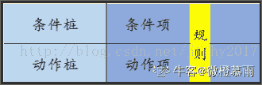

判定表的建立步骤：

1）列出所有的条件和动作

2）确定规则的个数（假如有 n 个条件，每个条件有 2 个取值（0、1），就可以产生 2 的 n 次方种规则）

3）填写判定表

4）化简判定表

例子：
问题要求：对于功率大于 50 马力的机器、维修记录不全或已运行 10 年以上的机器，应优先维修处理。
1）列出所有的条件和和动作
·条件：功率大于 50 马力？/维修记录不全？/已运行 10 年以上？
·动作：优先维修处理/其他处理方式
2）确定规则个数
·这里有 3 个条件，每个条件有 2 个取值，故应有 8 中规则。
3）填写判定表（看列）
 例子：
问题要求：对于功率大于 50 马力的机器、维修记录不全或已运行 10 年以上的机器，应优先维修处理。
1）列出所有的条件和和动作
·条件：功率大于 50 马力？/维修记录不全？/已运行 10 年以上？
·动作：优先维修处理/其他处理方式
2）确定规则个数
·这里有 3 个条件，每个条件有 2 个取值，故应有 8 中规则。
3）填写判定表（看列）
 
4）化简判定表
首先，找出判定表中相似的规则


然后，化简判定表，表示为“—”的表示取值不影响触发的动作，即：不影响规则
 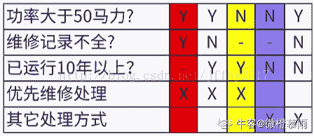

发表于 2020-03-22 14:59:37

* * *

## 3

制定测试计划的步骤

正确答案: D   你的答案: 空 (错误)

```cpp
确定项目管理机制 预计测试工作量 测试计划评审
```

```cpp
确定测试范围 确定测试策略 确定测试标准、预计测试工作量
```

```cpp
确定测试构架 确定项目管理机制 预计测试工作量 测试计划评审
```

```cpp
确定测试范围 确定测试策略 确定测试标准 确定测试构架 确定项目管理机制 预计测试工作量 测试计划评审
```

本题知识点

Java 工程师 C++工程师 测试工程师 招商银行信用卡中心 测试开发工程师 2019

讨论

[小念宗](https://www.nowcoder.com/profile/967526766)

d

发表于 2019-04-12 15:46:15

* * *

## 4

对于 C 语言，下面说法正确的是（）

正确答案: D   你的答案: 空 (错误)

```cpp
while 循环语句的执行效率比 do-while 循环语句的执行效率高
```

```cpp
while 循环语句的循环体执行次数比循环条件的判断次数多 1，而 do-while 语句的循环体执行次数比循环条件的判断次数少 1
```

```cpp
while 语句的循环体执行次数比循环条件的判断次数少 1，而 do-while 语句的循环体执行次数比循环条件的判断次数多 1
```

```cpp
while 语句的循环体执行次数比循环条件的判断次数少 1，而 do-while 语句的循环体执行次数等于循环条件的判断次数
```

本题知识点

C++工程师 招商银行信用卡中心 2019 C 语言

讨论

[groove-hong](https://www.nowcoder.com/profile/408798555)

```cpp
//while 语句示例
int a = 0;
while(a<2)
{
    a++;
    printf("a=%d\n",a);    //此处打印次数为循环体执行次数
}
//循环体执行 2 次，循环条件 a<2 判断 3 次

//do-while 语句示例
int b = 0;
do
{
    b++;
    printf("b=%d\n",b);    //do 循环先执行，后 while 判断
}while(b<2);
//循环体执行 2 次，循环条件 a<2 判断 2 次
```

如有错误，请各位大佬手下留情

发表于 2021-04-08 09:56:21

* * *

[牛客 859918262 号](https://www.nowcoder.com/profile/859918262)

是的

发表于 2020-09-10 20:23:34

* * *

## 5

用边界值分析法，假定 5≤Y≤105，那么 Y 在测试中，应该取的边界值是

正确答案: B   你的答案: 空 (错误)

```cpp
Y=6，Y=106
```

```cpp
Y=5，Y=6，Y=104，Y=105
```

```cpp
Y=5，Y=6，Y=105，Y=106
```

```cpp
Y=5，Y=6，Y=104，Y=105，Y=106
```

本题知识点

Java 工程师 C++工程师 测试工程师 招商银行信用卡中心 测试开发工程师 2019

讨论

[工地搬运工黄](https://www.nowcoder.com/profile/171269863)

出题不太严谨正确的边界值应该是 5、105、4、106 但往往为了增加健壮性，我们会添加 6、104、50 这种数据来进行测试

发表于 2020-04-04 18:05:30

* * *

[汤圆木子](https://www.nowcoder.com/profile/634081974)

赶脚把答案改为：4,5,105,106 比较合适

发表于 2020-08-12 12:50:35

* * *

## 6

两个小组独立地测试一个程序，第一组发现 40 个错误，第二组发现 70 个错误，其中有 28 个错误是共同的，那么可以估计程序中的错误总数是

正确答案: C   你的答案: 空 (错误)

```cpp
70
```

```cpp
98
```

```cpp
100
```

```cpp
110
```

本题知识点

Java 工程师 C++工程师 测试工程师 招商银行信用卡中心 测试开发工程师 2019

讨论

[RebeccaWong](https://www.nowcoder.com/profile/505473283)

共 x 个错误，第一组发现错误概率（40/x），第二组发现错误概率（70/x），一个错误被两组同时发现的概率（40/x）*（70/x）=28/x

发表于 2020-03-08 16:03:53

* * *

[顾长官的棉衣](https://www.nowcoder.com/profile/112565144)

一共发现了 40+70-28 = 82 个错误根据软件测试的二八原则还有 20%未被发现的错误所以一共是约 100 个错误

发表于 2019-10-19 16:15:36

* * *

[叶小鸡](https://www.nowcoder.com/profile/575621640)

(40+70-28)/0.8

发表于 2018-11-18 10:48:23

* * *

## 7

为了提高测试的效率，应该

正确答案: D   你的答案: 空 (错误)

```cpp
随机地选取测试数据
```

```cpp
取一切可能的输入数据作为测试数据
```

```cpp
在完成编码以后制定软件的测试计划
```

```cpp
选择发现错误的可能性大的数据作为测试数据
```

本题知识点

Java 工程师 C++工程师 测试工程师 招商银行信用卡中心 测试开发工程师 招商银行信用卡中心 2019

## 8

Linux 有三个查看文件的命令，若希望在查看文件内容过程中可以用光标上下移动来查看文件内容，应使用 ______ 命令

正确答案: A   你的答案: 空 (错误)

```cpp
cat
```

```cpp
more
```

```cpp
less
```

```cpp
menu
```

本题知识点

Java 工程师 C++工程师 测试工程师 招商银行信用卡中心 测试开发工程师 招商银行信用卡中心 2019

讨论

[不吃白切鸡](https://www.nowcoder.com/profile/5648508)

选 less

发表于 2019-03-17 16:50:39

* * *

[judge](https://www.nowcoder.com/profile/8725325)

Cat 是查看全文件，more 只能向下，less 可以上下左右移动

发表于 2021-06-23 23:10:04

* * *

[荼羊羊](https://www.nowcoder.com/profile/761992)

百度结果：less 也适用于查看内容较多的文件。less 比 more 更为灵活，因为 less 可以往上、往下翻页。按下键盘上 PgUp 键可以往上翻页，按下 PgDn 可以往下翻页。但是 less 命令不会实时显示当前阅读的百分比。答案不对。

发表于 2020-06-21 10:51:37

* * *

## 9

关于 alpha 测试，描述正确的是

正确答案: C   你的答案: 空 (错误)

```cpp
alpha 测试不需要用户代表参见
```

```cpp
alpha 测试是验收测试的一种
```

```cpp
alpha 测试需要用户代表参加
```

```cpp
alpha 测试是系统测试的一种
```

本题知识点

Java 工程师 C++工程师 测试工程师 招商银行信用卡中心 测试开发工程师 2019

讨论

[不吃白切鸡](https://www.nowcoder.com/profile/5648508)

1、Alpha 测试

    Alpha 测试是由用户在开发环境下进行的测试，也可以是开发机构内部的用户在模拟实际操作环境下进行的测试。开发者坐在用户旁边，这是在开发者受控的环境下进行的测试。由开发者随时记录下错误情况和使用中的问题。

2、Beta 测试
    Beta 测试是由软件的多个用户在一个或多个用户的实际使用环境下进行的测试。开发者通常不在测试现场，这是在开发者无法控制的环境下进行的测试。由用户记录下遇到的所有问题，定期向开发者报告。beta 测试是一模拟真实的使用环境从而发现缺陷的一种测试。

3、验收测试
      验收测试是以用户为主的测试，软件开发和 QA 人员也应该参加，测试一般在用户所在地进行，由用户验证软件产品是否满足了所有的需求的一系列的验收测试工作。仅限于做项目的公司，部门内部测试稳定后，根据合同中需求由发包商进行验收测试。验收测试的目的是为了以发现”未实现的需求”为目的，以评估”适合使用”为目标，该类测试的不是以发现缺陷为主要目的。

    4、 区别

     两者的主要区别是测试的场所不同。Alpha 测试是指把用户请到开发方的场所来测试,beta 测试是指在一个或多个用户的场所进行的测试。Alpha 测试的环境是受开发方控制的,用户的数量相对比较少,时间比较集中。而 beta 测试的环境是不受开发方控制的,谁也不知道用户如何折磨软件,用户数量相对比较多,时间不集中。一般地,alpha 测试先于 beta 测试执行。通用的软件产品需要较大规模的 beta 测试,测试周期比较长。如果产品通过了 beta 测试,那么就可以正式发行了。

发表于 2019-03-17 16:56:14

* * *

[佐之剑](https://www.nowcoder.com/profile/987276503)

&

bc

发表于 2020-04-08 12:54:26

* * *

[呓语患者](https://www.nowcoder.com/profile/547129927)

    B 也对呀

发表于 2020-09-06 13:36:37

* * *

## 10

单元测试一般在什么时候进行

正确答案: A   你的答案: 空 (错误)

```cpp
编码完成后
```

```cpp
系统测试前
```

```cpp
测试用例编写完成后
```

```cpp
集成测试后
```

本题知识点

Java 工程师 C++工程师 测试工程师 招商银行信用卡中心 测试开发工程师 2019

## 11

下列哪一项说法是正确的

正确答案: A   你的答案: 空 (错误)

```cpp
静态白盒测试可以找出遗漏之处和问题
```

```cpp
不存在质量很高但可靠性很差的产品
```

```cpp
好的测试人员不懈追求完美
```

```cpp
可以发布具有配置缺陷的软件产品
```

本题知识点

Java 工程师 C++工程师 测试工程师 招商银行信用卡中心 测试开发工程师 招商银行信用卡中心 2019

## 12

以下说法中正确的是

正确答案: D   你的答案: 空 (错误)

```cpp
系统性能的优劣与该系统的实现算法无关
```

```cpp
软件可承受的的吞吐量越大，说明其平均响应时间越长
```

```cpp
给软件系统的可用资源越少，其平均响应时间越短
```

```cpp
对于同一个网站，其支持的同时发送请求的用户数越大，说明该网站的性能越好
```

本题知识点

Java 工程师 C++工程师 测试工程师 招商银行信用卡中心 测试开发工程师 2019

讨论

[陈耿聪是个狠人](https://www.nowcoder.com/profile/800352933)

平均响应时间也与资源调配是否合理有关，与资源数量没有直接关系

发表于 2020-11-06 21:18:17

* * *

## 13

设有课程和学生两个实体，每个学生可以选修多个课程，一个课程可以有多名学生选修，则课程与学生实体之间的联系类型

正确答案: A   你的答案: 空 (错误)

```cpp
m：n
```

```cpp
1：m
```

```cpp
m：1
```

```cpp
1：1
```

本题知识点

Java 工程师 C++工程师 测试工程师 招商银行信用卡中心 测试开发工程师 2019

## 14

SQL 实现分组查询的短语是

正确答案: B   你的答案: 空 (错误)

```cpp
ORDER BY
```

```cpp
GROUP BY
```

```cpp
HAVING
```

```cpp
ASC
```

本题知识点

Java 工程师 C++工程师 测试工程师 招商银行信用卡中心 测试开发工程师 招商银行信用卡中心 2019

讨论

[莉 201907121139628](https://www.nowcoder.com/profile/801174445)

B. group by 分组 order by 排序 having 分组条件，和 group by 结合在一起使用，可以接聚合函数。where 也是条件语句，但是后面不能接聚合函数。ASC 是升序排列，和 order by 一起使用。

发表于 2019-07-12 13:11:23

* * *

[我是邓邓](https://www.nowcoder.com/profile/344394009)

b

发表于 2018-11-28 21:46:29

* * *

## 15

DNS 域名系统主要负责主机名和（）之间的解析

正确答案: A   你的答案: 空 (错误)

```cpp
IP 地址
```

```cpp
MAC 地址
```

```cpp
网络地址
```

```cpp
主机别名
```

本题知识点

Java 工程师 C++工程师 测试工程师 招商银行信用卡中心 测试开发工程师 2019 PHP 工程师 golang 工程师 浩鲸云 2020

讨论

[0210.](https://www.nowcoder.com/profile/315104734)

域名系统(Domain Name System 缩写 DNS，Domain Name 被译为域名)，它作为可以将 域名 和 IP 地址相互映射的一个 分布式数据库 ，能够使人更方便的访问互联网，而不用去记住能够被机器直接读取的 IP 数串。

发表于 2019-07-01 14:31:12

* * *

## 16

假设某数据表当前时刻 t 若有人使用，则下一时刻 t+1 有人使用的概率为 0.8；若无人使用，则下一时刻无人使用的概率为 0.23；若数据表当前时刻 t 是否有人使用只与上一个时刻 t-1 是否有人使用相关，那么当数据表 t=0 时有人使用时，它在 t=50000 时无人使用的概率是

正确答案: C   你的答案: 空 (错误)

```cpp
0.626
```

```cpp
0.729
```

```cpp
0.793
```

```cpp
0.844
```

本题知识点

Java 工程师 C++工程师 测试工程师 招商银行信用卡中心 测试开发工程师 2019

讨论

[微橙慕雨](https://www.nowcoder.com/profile/61899266)

我的理解，但是答案和选项不符，如果有朋友看出来问题在哪里望告知🤐翻译题干：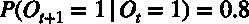

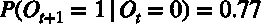
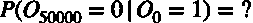
已知 t=0 时刻有人使用，设 t 时刻无人使用的概率为, 则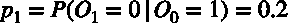
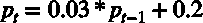
设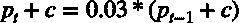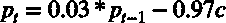
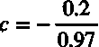
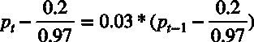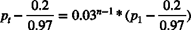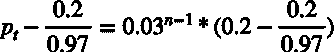当 n 趋于+∞时，
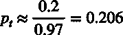

发表于 2020-03-22 19:04:21

* * *

[XM-Liao](https://www.nowcoder.com/profile/859089433)

[`blog.csdn.net/ls317842927/article/details/61915708`](https://blog.csdn.net/ls317842927/article/details/61915708)

发表于 2019-03-13 21:58:32

* * *

[藤和艾莉欧。](https://www.nowcoder.com/profile/134888353)

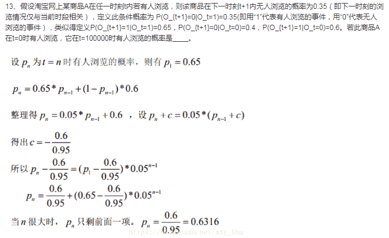

发表于 2019-08-01 10:48:39

* * *

## 17

以下代码

```cpp
public class Test {
    public static void main(String[] args) {
        String str1 = "abc";
        String str2 = "abc";
        String str3 = new String("abc");
        System.out.println(str1 == str2); // 1
        System.out.println(str1 == str3); // 2
        System.out.println(str1 == str3.intern()); // 3
    }
}

```

请问这 3 处打印语句，输出分别是什么？

正确答案: B   你的答案: 空 (错误)

```cpp
true true true
```

```cpp
true false true
```

```cpp
false false false
```

```cpp
false true true
```

本题知识点

Java 工程师 C++工程师 测试工程师 招商银行信用卡中心 测试开发工程师 2019

讨论

[微橙慕雨](https://www.nowcoder.com/profile/61899266)

Java 语言规范中，值为常量的字符串，都会通过 String.intern()函数被限定为共享同一个对象

发表于 2020-03-22 19:09:08

* * *

## 18

如果有 int a=5，b=3，在执行 !a&&b++; 后 a 和 b 的值分别是（）

正确答案: A   你的答案: 空 (错误)

```cpp
5,3
```

```cpp
0,1
```

```cpp
0,3
```

```cpp
5,4
```

本题知识点

C++工程师 招商银行信用卡中心 2019 C 语言

讨论

[xxshaonian](https://www.nowcoder.com/profile/4188827)

&&左边是 0 则不运行右边的

发表于 2018-12-01 22:58:00

* * *

[烬天玉藻前](https://www.nowcoder.com/profile/195480900)

```cpp
!a&&b++;
//为了方便看运算符间的优先级，加上括号来看
(!a) && (b++);
```

a = 5,在逻辑上非 0 即 1，逻辑非之后就是 0.
&&运算符具有短路现象，只要出现一个 0，那么就全 0 了，所以后面的 b++是没有计算的。
a 还是 5，b 还是 3

发表于 2020-09-22 20:25:40

* * *

[念之前，望之后](https://www.nowcoder.com/profile/837872598)

短路规则大家肯定是知道的，但别像我一样粗心(!a 只是用来做表达式的结果判断，实际上可没有改变变量 a 的值)😅

发表于 2021-03-14 13:40:55

* * *

## 19

以下选项中不是软件测试的模型

正确答案: D   你的答案: 空 (错误)

```cpp
V 模型
```

```cpp
W 模型
```

```cpp
螺旋模型
```

```cpp
J 模型
```

本题知识点

Java 工程师 C++工程师 测试工程师 招商银行信用卡中心 测试开发工程师 2019

讨论

[敏捷小菜](https://www.nowcoder.com/profile/644294039)

啥事螺旋模型，是 H 吗

发表于 2020-04-27 16:11:10

* * *

[牛客 990014037 号](https://www.nowcoder.com/profile/990014037)

啥是 j 模型?

发表于 2020-03-23 23:39:43

* * *

[higirl2020](https://www.nowcoder.com/profile/376457331)

D

发表于 2020-03-17 22:44:48

* * *

## 20

当你感觉到你的 Win7 运行速度明显减慢，当你打开任务管理器后发现 CPU 的使用率达到了 100% ，你最有可能受到了以下哪一种攻击

正确答案: B   你的答案: 空 (错误)

```cpp
特洛伊木马
```

```cpp
拒接服务
```

```cpp
更改报文流
```

```cpp
流量分析
```

本题知识点

Java 工程师 C++工程师 测试工程师 招商银行信用卡中心 测试开发工程师 招商银行信用卡中心 2019

讨论

[烧腊小王子](https://www.nowcoder.com/profile/268223651)

确定不是拒绝服务攻击？

发表于 2020-03-26 23:58:38

* * *

## 21

以下哪种测试方法属于白盒测试

正确答案: C   你的答案: 空 (错误)

```cpp
错误推测法
```

```cpp
边界值法
```

```cpp
判定条件覆盖法
```

```cpp
等价类划分法
```

本题知识点

Java 工程师 C++工程师 测试工程师 招商银行信用卡中心 测试开发工程师 2019

## 22

一个编写良好的用户故事是敏捷开发的基础。它们应该

正确答案: A B C D   你的答案: 空 (错误)

```cpp
一个用户故事对于另一个用户故事应该是独立的（尽可能的）
```

```cpp
详情应该便于开发者和用户进行沟通
```

```cpp
应该对用户有价值，应该对于开发者来说尽可能的清晰以便进行估计，应该短小
```

```cpp
通过预定义测试用例的使用确保它是可以测试的
```

本题知识点

Java 工程师 C++工程师 测试工程师 招商银行信用卡中心 测试开发工程师 2019

## 23

下面哪个描述属于非功能需求

正确答案: A B C   你的答案: 空 (错误)

```cpp
系统要求能够连续运行 1000 小时
```

```cpp
系统应按 J2EE 架构进行设计
```

```cpp
90%的响应时间小于 2 秒钟
```

```cpp
随机选择 5%的用户发送广告消息
```

本题知识点

Java 工程师 C++工程师 测试工程师 招商银行信用卡中心 测试开发工程师 2019

## 24

性能测试包含了以下哪些测试

正确答案: A C D   你的答案: 空 (错误)

```cpp
并发测试
```

```cpp
UAT 测试
```

```cpp
压力测试
```

```cpp
负载测试
```

```cpp
安全测试
```

本题知识点

Java 工程师 C++工程师 测试工程师 招商银行信用卡中心 测试开发工程师 2019

讨论

[微橙慕雨](https://www.nowcoder.com/profile/61899266)

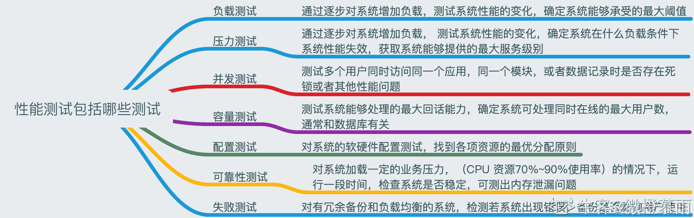

发表于 2020-03-22 19:21:02

* * *

[牛客 692346598 号](https://www.nowcoder.com/profile/692346598)

并发，负载，压力测试

编辑于 2021-03-15 23:53:20

* * *

## 25

白盒测试的缺点有

正确答案: A B C   你的答案: 空 (错误)

```cpp
程序运行会有很多不同的路径，不可能测试所有的运行路径
```

```cpp
测试基于代码，只能测试开发人员做的对不对，而不能知道设计的正确与否，可能会漏掉一些功能需求
```

```cpp
系统庞大时，测试开销会非常大
```

```cpp
不可能覆盖所有的代码，覆盖率较低，大概只能达到总代码量的 30%
```

本题知识点

Java 工程师 C++工程师 测试工程师 招商银行信用卡中心 测试开发工程师 2019

讨论

[藤和艾莉欧。](https://www.nowcoder.com/profile/134888353)

黑盒测试的优点有：
1）比较简单，不需要了解程序内部的代码及实现；
2）与软件的内部实现无关；
3）从用户角度出发，能很容易的知道用户会用到哪些功能，会遇到哪些问题；
4）基于软件开发文档，所以也能知道软件实现了文档中的哪些功能；
5）在做软件自动化测试时较为方便。

黑盒测试的缺点有：
1）**不可能覆盖所有的代码，覆盖率较低，大概只能达到总代码量的 30%；**
2）自动化测试的复用性较低。

白盒测试的优点有：
帮助软件测试人员增大代码的覆盖率，提高代码的质量，发现代码中隐藏的问题。

白盒测试的缺点有：
1）程序运行会有很多不同的路径，不可能测试所有的运行路径；
2）测试基于代码，只能测试开发人员做的对不对，而不能知道设计的正确与否，可能会漏掉一些功能需求；
3）系统庞大时，测试开销会非常大。

发表于 2019-08-01 10:53:59

* * *

[一切顺利呀～](https://www.nowcoder.com/profile/195487876)

D 选项是黑盒测试的缺点

发表于 2019-05-08 09:14:27

* * *

## 26

下列哪些方法属于黑盒测试法

正确答案: A B C   你的答案: 空 (错误)

```cpp
等价类划分
```

```cpp
边界值分析
```

```cpp
因果图
```

```cpp
代码静态审查
```

```cpp
基本路径覆盖测试
```

本题知识点

Java 工程师 C++工程师 测试工程师 招商银行信用卡中心 测试开发工程师 2019

## 27

软件验收测试包括哪些

正确答案: A C D   你的答案: 空 (错误)

```cpp
正式验收测试
```

```cpp
白盒测试
```

```cpp
alpha 测试
```

```cpp
beta 测试
```

本题知识点

Java 工程师 C++工程师 测试工程师 招商银行信用卡中心 测试开发工程师 2019

讨论

[牛客用户 568435](https://www.nowcoder.com/profile/972304826)

和第九题不冲突吗？

发表于 2019-04-09 18:24:43

* * *

## 28

在 java 编程中，以下哪些为将字段定义为私有的好处

正确答案: A B D   你的答案: 空 (错误)

```cpp
保证成员数据一致性
```

```cpp
将对象之间联系最小化
```

```cpp
提升访问效率
```

```cpp
增强程序的可维护性
```

本题知识点

Java 工程师 C++工程师 测试工程师 招商银行信用卡中心 测试开发工程师 2019

## 29

下列关于 Linux 命令使用错误的是

正确答案: A C   你的答案: 空 (错误)

```cpp
cp 用于删除文件
```

```cpp
mkdir 用于创建目录
```

```cpp
mv 用于查看文件内容
```

```cpp
cd 用于切换目录
```

本题知识点

Java 工程师 C++工程师 测试工程师 招商银行信用卡中心 测试开发工程师 2019

讨论

[SuperMk](https://www.nowcoder.com/profile/858836077)

cp        文件或目录拷贝 mkdir   目录创建 mv       文件或目录移动或名字修改 cd        目录切换

发表于 2018-11-24 12:46:01

* * *

[牛客 473720056 号](https://www.nowcoder.com/profile/473720056)

cp 复制文件 mv 移动/剪切文件、重命名

编辑于 2022-01-14 15:34:26

* * *

[冰冰脆旺旺](https://www.nowcoder.com/profile/98304998)

A c

发表于 2020-08-26 21:46:38

* * *

## 30

下列说法正确的有

正确答案: A B D   你的答案: 空 (错误)

```cpp
应当把“尽早地不断地进行软件测试“作为软件开发者的座右铭
```

```cpp
妥善保存测试计划、测试用例、出错统计和最终分析报告，为维护提供方便
```

```cpp
测试完成没有故障时软件是没有缺陷的
```

```cpp
测试用例应由测试数据和与之对应的预期输出结果这两部分组成
```

本题知识点

Java 工程师 C++工程师 测试工程师 招商银行信用卡中心 测试开发工程师 2019

## 31

常见的对称加密算法有哪些

正确答案: B C   你的答案: 空 (错误)

```cpp
RSA
```

```cpp
DES
```

```cpp
AES
```

```cpp
ECC
```

本题知识点

Java 工程师 C++工程师 测试工程师 招商银行信用卡中心 测试开发工程师 2019

讨论

[木小睿](https://www.nowcoder.com/profile/328991)

RSA 非对称加密算法 DES Data Encryption Standard 数据加密标准 对称
AES  Advanced Encryption Standard 高级加密标准  对称 常用 ECC 椭圆加密算法  非对称

发表于 2019-08-22 21:32:19

* * *

## 32

由于互联网技术的飞速发展，现在一些手机 APP 已经可以用户自己通过刷脸完成身份校验和购物。

场景：假设你是招商银行信用卡的实名持卡用户，当你想去星巴克买一杯咖啡，在商店大厅使用柜台旁的咖啡购物机选择好咖啡，支付方式选择 刷脸支付，这时机器的摄像头通过扫描你的人脸进行身份校验，立即完成交易并打印出交易小票，这时你发现你收到了扣款短信提示，在机器下方拿交易小票去星巴克柜台换取咖啡。
请基于商户线下刷脸支付购物这一场景，对咖啡购物机的功能进行分析，并设计测试用例。

你的答案

本题知识点

Java 工程师 C++工程师 测试工程师 招商银行信用卡中心 测试开发工程师 2019

讨论

[芝士樱花味](https://www.nowcoder.com/profile/344756108)

【请大佬改正】测试用例：

为了特定的目的（证明软件存在某问题）而设计的一组由测试输入、执行条件、预期结果构成的文档

| **测试****用例编号** | **测试用例名称** | **输入** | **预期结果** | **实际结果** |
| **1** | 人脸没有对准镜头 | 无输入 | 提示用户对准镜头 | 提示用户对准镜头 |
| **2** | 他人头像对准镜头 | 无输入 | 刷脸失败！ | 刷脸失败！ |
| **3** | 交易超时 | 无输入 | 提示用户重新进行交易 | 提示用户重新进行交易 |

发表于 2021-03-23 11:03:54

* * *

[鲸鱼🐳201904091410194](https://www.nowcoder.com/profile/646855435)

功能性测试：

1\.    没有捕获到人脸是否有提示
2\.     捕获到人脸之后是否进入活体检测
3\.     活体检测是否有提示（眨眼张嘴）
4\.     检测失败是否有提示
5\.     与本人身份不同的人进行扫描是否会提示不是本人。
6\.     光线暗是否会有提示
7\.     照不全人脸是否会有提示
8\.  选择的支付方式剩下的钱不足时是否会有提示
9\.  是否可以换其他支付方式
10\.  取消支付否是否钱不变
11\.  支付成功后是否有提示

界面测试：
1\.     识别界面是否显示人脸所在的位置，是否清晰地表示了人脸应该在的位置
2\.     位置是否合理，识别框架大小是否合理
3\.     识别界面设计是否合理
4\.     识别界面上的提示框字体大小是否合理
5\.     是否存在错别字

性能测试：
1\.     进入识别界面的时间
2\.     识别人脸的响应时间
3\.     支付成功响应时间
4\.     不同网速下的响应时间

安全性测试：
1\.     支付时，超过一定的时长是否需要重新认证
2\.    是否使用本人照片在镜头前能够支付
3\.     识别多次不是本人是否会有次数限制

发表于 2021-11-28 00:19:19

* * *

## 33

以 5 只猫 5 分钟捉 5 只老鼠的速度计算，要在 100 分钟内捉 100 只老鼠，需要多少只猫

你的答案

本题知识点

Java 工程师 C++工程师 测试工程师 招商银行信用卡中心 测试开发工程师 2019

讨论

[牛客 419018875 号](https://www.nowcoder.com/profile/419018875)

5 只猫。 解：由“5 只猫可以在 5 分钟中抓 5 只老鼠”可知 1 只猫可以在 5 分钟内抓 1 只老鼠，得 1 只猫可以在 100 分钟内抓 100/5=20 老鼠，那么 100 只老鼠要在 100 分钟抓住，需要 100/20=5 只猫。

发表于 2020-02-08 21:59:17

* * *

[蓉蓉兔 1996](https://www.nowcoder.com/profile/152965465)

5 只老鼠/5min/5 只猫=0.25 只老鼠/（min*只猫）=100 只老鼠/(500min*只猫)=100 只老鼠/(100min*5 只猫)所以需要 5 只猫 

发表于 2021-03-26 14:54:09

* * *

[风中的想念](https://www.nowcoder.com/profile/50409529)

5 只 1 只猫捉一只老鼠需要 5 分钟，1 只猫 100 分钟能捉 20 只老鼠，故捉 100 只老鼠需要 20 只猫

发表于 2019-09-03 20:33:28

* * *

## 34

请设计微信 APP 中，"发红包"功能的测试时，需要考虑到哪儿些测试因素，请尽可能的写出来。

提示：用户可以向 1 个人发红包，也可以在群里发红包并被多个人抢

你的答案

本题知识点

Java 工程师 C++工程师 测试工程师 招商银行信用卡中心 测试开发工程师 2019

讨论

[木小睿](https://www.nowcoder.com/profile/328991)

  网络   余额  数量  时间  ui

发表于 2019-08-22 20:53:04

* * *