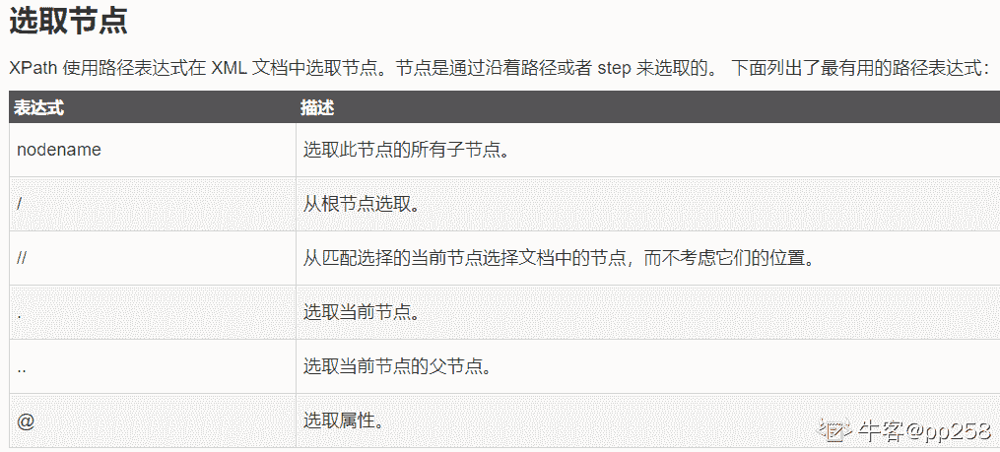

# 招商银行信用卡中心 2019 秋招 IT 笔试（测试开发方向第三批）

## 1

公司组织团建活动，到某漂流圣地漂流，现有如下情况：员工各自体重不一，第 i 个人的体重为 people[i]，每艘漂流船可以承载的最大重量为 limit。每艘船最多可同时载两人，但条件是这些人的重量之和最多为 limit。为节省开支，麻烦帮忙计算出载到每一个人所需的最小船只数(保证每个人都能被船载)。

本题知识点

Java 工程师 C++工程师 测试工程师 招商银行信用卡中心 贪心 2019 测试开发工程师

讨论

[邢涌芝](https://www.nowcoder.com/profile/7518389)

注意利用**每艘船只能载两人**，以及**保证每个人都能被船载**两个条件。

```cpp
class Solution {
    public  int countLeastBoat(Integer []nums,int maxLoad){
        Arrays.sort(nums);
        int count = 0;
        int i = 0;
        int j = nums.length-1;;
        while(i<j) {
            if(nums[i]+nums[j] <= maxLoad) {
                i++;
                j--;
            } else {
                j--;
            }
            count++;
        }
        return count + (j==i?1:0);
    }

}
```

> 参考解答来源：
> 作者：qq_27181495
> 来源：CSDN
> 原文：[`blog.csdn.net/qq_27181495/article/details/84633499`](https://blog.csdn.net/qq_27181495/article/details/84633499)
> 版权声明：本文为博主原创文章，转载请附上博文链接！

编辑于 2019-03-19 13:22:03

* * *

[初心者托奇](https://www.nowcoder.com/profile/926219153)

```cpp
a = sorted(map(int,input().split()))
b,m,n,p = int(input()),0,len(a) - 1,0
while m <= n:
    if a[m] + a[n] <= b:
        m += 1
    n,p = n - 1,p + 1
print(p)

```

编辑于 2020-03-15 18:21:11

* * *

[lentolove](https://www.nowcoder.com/profile/572586026)

```cpp
import java.io.BufferedReader;
import java.io.IOException;
import java.io.InputStreamReader;
import java.util.Arrays;

public class Solution9_ 漂流船问题 {

    public static void main(String[] args) throws IOException {
        BufferedReader bf = new BufferedReader(new InputStreamReader(System.in));
        String[] line1 = bf.readLine().split(" ");
        int n = line1.length;
        int limit = Integer.parseInt(bf.readLine());
        int[] nums = new int[n];
        for (int i = 0; i < n; i++) {
            nums[i] = Integer.parseInt(line1[i]);
        }
        Arrays.sort(nums);
        int count = 0;
        int left = 0, right = n - 1;
        while (left <= right) {
            if (nums[left] + nums[right] > limit) { //两个人装不下，只能装后面那个胖子，右边指针左移
                count++;
                right--;
            } else {//能装下，左右指针都移动
                count++;
                left++;
                right--;
            }
        }
        System.out.println(count);
    }
}
```

发表于 2019-08-10 09:53:34

* * *

## 2

（ ）的目的是对最终软件系统进行全面的测试，确保最终软件系统满足产品需求并且遵循系统设计

正确答案: A   你的答案: 空 (错误)

```cpp
系统测试
```

```cpp
集成测试
```

```cpp
单元测试
```

```cpp
功能测试
```

本题知识点

Java 工程师 C++工程师 测试工程师 招商银行信用卡中心 测试开发工程师 2019

讨论

[牛客 203118066 号](https://www.nowcoder.com/profile/203118066)

系统测试是在条件都准备好进行的测试

发表于 2021-03-23 20:52:39

* * *

[offer 多点](https://www.nowcoder.com/profile/224379131)

D

发表于 2019-11-01 08:54:36

* * *

## 3

关于 xpath 描述错误的是

正确答案: B   你的答案: 空 (错误)

```cpp
.. 选取当前节点的父节点
```

```cpp
//从根节点选取
```

```cpp
.选取当前节点
```

```cpp
@选取属性
```

本题知识点

Java 工程师 C++工程师 测试工程师 招商银行信用卡中心 测试开发工程师 2019

讨论

[牛客 385479748 号](https://www.nowcoder.com/profile/385479748)

//表示从匹配选择的当前节点选择文档中的节点，而不考虑它们的位置。/表示从根节点选取 nodename 选取此节点的所有子节点.选取当前节点..选取当前节点的父节点@选取属性

发表于 2021-11-19 09:58:01

* * *

[pp258](https://www.nowcoder.com/profile/131122062)



发表于 2019-09-23 11:10:09

* * *

[yes~yes~](https://www.nowcoder.com/profile/458799717)

发表于 2019-09-05 11:05:52

* * *

## 4

关于 cookie 和 session 描述错误的是

正确答案: C   你的答案: 空 (错误)

```cpp
cookie 保存在客户端浏览器中，而 session 保存在服务器上
```

```cpp
cookie 和 session 都是用来保存状态信息，都是保存客户端状态的机制，它们都是为了解决 HTTP 无状态的问题而所做的努力
```

```cpp
session 是有有效期的，而 cookie 则没有有效期
```

```cpp
如果浏览器禁用了 cookie，session 机制不会失效
```

本题知识点

Java 工程师 C++工程师 测试工程师 招商银行信用卡中心 测试开发工程师 2019

讨论

[Nnn 君](https://www.nowcoder.com/profile/473877329)

http 协议是一种无状态的协议，浏览器对服务器的每一次请求都是独立的。为了使得 web 能够产生一些动态信息，就需要保存”状态”，而 cookie 和 session 机制就是为了解决 http 协议无状态而产生。
1、Cookie 和 Session 都是会话技术，Cookie 是运行在客户端，Session 是运行在服务器端。2、Cookie 有大小限制以及浏览器在存 cookie 的个数也有限制，Session 是没有大小限制和服务器的内存大小有关。3、Cookie 有安全隐患，通过拦截或本地文件找得到你的 cookie 后可以进行攻击。4、Session 是保存在服务器端上会存在一段时间才会消失，如果 session 过多会增加服务器的压力。转自：[`blog.csdn.net/qq_35257397/article/details/52967241`](https://blog.csdn.net/qq_35257397/article/details/52967241)

发表于 2019-09-02 15:17:24

* * *

[牛客 385479748 号](https://www.nowcoder.com/profile/385479748)

cookie 的有效期由 maxAge 属性来确定，有效期以秒为单位；session 也有有效期，超时就会失效，C 错

发表于 2021-11-19 10:01:25

* * *

[桃ちゃん](https://www.nowcoder.com/profile/428928130)

session 和 cookie 都是常用的回话跟踪技术。http 是无状态的，因此无法从连接上跟踪会话，session 和 cookie 就被用来存储这些会话信息，B 对。cookie 的功能需要浏览器的支持，如果浏览器把 cookie 禁用了，cookie 就会失效；session 将信息存放在服务器上面，禁用 cookie，session 机制不受影响，AD 对。cookie 的有效期由 maxAge 属性来确定，有效期以秒为单位；session 也有有效期，超时就会失效，C 错

发表于 2021-10-01 01:04:27

* * *

## 5

关于 http 和 https 描述错误的是

正确答案: C   你的答案: 空 (错误)

```cpp
HTTPS 是加密传输协议，HTTP 是明文件传输协议
```

```cpp
HTTPS 需要用到 SSL 证书，而 HTTP 不需要
```

```cpp
HTTPS 标准端口是 80，HTTP 标准端口是 443
```

```cpp
HTTPS 的安全基础是 TLS/SSL
```

本题知识点

Java 工程师 C++工程师 测试工程师 招商银行信用卡中心 测试开发工程师 2019

讨论

[球球佛祖让我上岸](https://www.nowcoder.com/profile/3963348)

http 是 80 端口，https 是 443 端口。

发表于 2018-12-29 21:24:54

* * *

[牛客 627989351 号](https://www.nowcoder.com/profile/627989351)

c

发表于 2021-01-27 10:44:22

* * *

## 6

在进行单元测试时，常用的方法是

正确答案: A   你的答案: 空 (错误)

```cpp
采用白盒测试，辅之以黑盒测试
```

```cpp
采用黑盒测试，辅之以白盒测试
```

```cpp
只使用黑盒测试
```

```cpp
只使用白盒测试
```

本题知识点

Java 工程师 C++工程师 测试工程师 招商银行信用卡中心 测试开发工程师 2019

讨论

[桃ちゃん](https://www.nowcoder.com/profile/428928130)

单元测试是指对系统的最小可测试单元进行检查和验证。单元测试由程序员自己编写一小段代码完成。单元测试的测试数据，大部分是围绕程序的功能设计的，也就是黑盒测试，理想状况下全部黑盒就可以搞定，现实情况还需要针对程序的逻辑结构设置测试用例，也就是白盒测试。

发表于 2021-10-01 01:10:21

* * *

[牛客 385479748 号](https://www.nowcoder.com/profile/385479748)

题中明确写出要进行单元测试，而单元测试要首先测试程序的逻辑结构测试，然后是对功能测试，所有是白盒测试辅之黑盒测试

发表于 2021-11-19 10:05:25

* * *

[牛客 182953165 号](https://www.nowcoder.com/profile/182953165)

a

发表于 2019-03-15 09:46:58

* * *

## 7

为了提高测试的效率，应该（）

正确答案: B   你的答案: 空 (错误)

```cpp
随机地选取测试数据
```

```cpp
选择发现错误可能性大的数据作为测试数据
```

```cpp
取一切可能的输入数据作为测试数据
```

```cpp
在完成编码以后制定软件的测试计划
```

本题知识点

Java 工程师 C++工程师 测试工程师 招商银行信用卡中心 测试开发工程师 招商银行信用卡中心 2019

讨论

[牛客 385479748 号](https://www.nowcoder.com/profile/385479748)

选择发现错误可能性大的数据，这样可以防止程序遇到某特殊情况时崩溃，更加完善程序

发表于 2021-11-19 10:07:00

* * *

[谁都不许动我的砖](https://www.nowcoder.com/profile/4677166)

等开发编码完就迟了，如果测试不介意天天 996 的话

发表于 2020-09-29 09:12:30

* * *

## 8

对测试数据的测试方法，常用的有：

正确答案: D   你的答案: 空 (错误)

```cpp
控制变量法
```

```cpp
错误分析法
```

```cpp
状态转换法
```

```cpp
等价类划分法
```

本题知识点

Java 工程师 C++工程师 测试工程师 招商银行信用卡中心 测试开发工程师 2019

讨论

[yanadudud](https://www.nowcoder.com/profile/826728895)

常用的有等价类划分法，边界值分析法，因果图法等等

发表于 2021-04-16 21:17:11

* * *

## 9

以下自动化测试工具中，对语言种类支持最多的为：

正确答案: B   你的答案: 空 (错误)

```cpp
UFT
```

```cpp
Selenium
```

```cpp
Robot Framwork
```

```cpp
Jmeter
```

本题知识点

Java 工程师 C++工程师 测试工程师 招商银行信用卡中心 测试开发工程师 2019

讨论

[yanadudud](https://www.nowcoder.com/profile/826728895)

SELENIUM 支持多系统环境以及多种浏览器，它的脚本可以由各种各样的编程语言编写。

发表于 2021-04-16 21:20:03

* * *

## 10

以下关于敏捷方法中，不正确的是（）

正确答案: C   你的答案: 空 (错误)

```cpp
相对于过程和工具，更强调个人和交互
```

```cpp
相对于完整的文档，更重视可工作的软件
```

```cpp
相对于与客户的合作，更注重合同谈判
```

```cpp
相对于遵循计划，更专注于对变化的响应
```

本题知识点

Java 工程师 C++工程师 测试工程师 招商银行信用卡中心 测试开发工程师 2019

## 11

测试 ATM 取款功能，已知取款数只能输入正整数，每次取款数要求是 100 的倍数且不能大于 500，下面哪个是正确的无效等价类

正确答案: C   你的答案: 空 (错误)

```cpp
（0，100）、（100，200）、（200，300）、（300，400）、（400，500）、（500，+∞）
```

```cpp
（500，+∞）
```

```cpp
（500，+∞）、任意大于 0 小于 500 的非 100 倍数的整数
```

```cpp
（-∞，100）、（100，200）、（200，300）、（300，400）、（400，500）、（500，+∞）
```

本题知识点

Java 工程师 C++工程师 测试工程师 招商银行信用卡中心 测试开发工程师 2019

讨论

[桃ちゃん](https://www.nowcoder.com/profile/428928130)

无效等价类：没有意义的，不合理的输入数据

发表于 2021-10-01 01:12:10

* * *

[牛客 759334274 号](https://www.nowcoder.com/profile/759334274)

银行

发表于 2021-06-15 13:03:27

* * *

## 12

在软件测试中，假定 X 为整数，10≤X≤100，用边界值分析法，那么 X 在测试中应该取（）边界值

正确答案: A   你的答案: 空 (错误)

```cpp
X=9，X=10，X=100，X=101
```

```cpp
X=10，X=100
```

```cpp
X=9，X=11，X=99，X=101
```

```cpp
X=9，X=10，X=50，X=100
```

本题知识点

Java 工程师 C++工程师 测试工程师 招商银行信用卡中心 测试开发工程师 2019

## 13

下列哪行 python 代码有语法错误

正确答案: A   你的答案: 空 (错误)

```cpp
for (subitem : allItems):
```

```cpp
for (key, value) in ip_map:
```

```cpp
with open(src_file, 'r') as read_stream:
```

```cpp
read_stream = open(src_file, 'r')
```

本题知识点

Java 工程师 C++工程师 测试工程师 招商银行信用卡中心 测试开发工程师 2019

讨论

[itman2018](https://www.nowcoder.com/profile/67988724)

A:答案错误，for 没有此种用法 B:正确 ，其中 key 和 value 分别指的是键和值 C：正确，with 的用法 D:将文件利用只读的方式打开，用一个变量储存读取的内容

发表于 2018-11-25 19:55:46

* * *

[牛客 927838481 号](https://www.nowcoder.com/profile/927838481)

 感觉 ab 都不对啊   ip_map 只有一个值给他遍历,key,value 要遍历两个值

发表于 2021-05-20 08:51:02

* * *

[牛客 898832251 号](https://www.nowcoder.com/profile/898832251)

A

发表于 2020-11-18 15:53:39

* * *

## 14

我们最近更新了系统的服务器，升级了性能，想要知道最新的系统在不崩溃的前提下，可以处理多少负载。在此场景下，需要进行的性能测试为：

正确答案: D   你的答案: 空 (错误)

```cpp
平均负载测试
```

```cpp
峰值负载测试
```

```cpp
压力测试
```

```cpp
容量测试
```

本题知识点

Java 工程师 C++工程师 测试工程师 招商银行信用卡中心 测试开发工程师 2019

讨论

[牛客 642807120 号](https://www.nowcoder.com/profile/642807120)

**性能测试（Performance Test）：**以系统设计初期规划的性能指标为预期目标，对系统不断施加压力，验证系统在资源可接受范围内，是否能达到性能预期。 **关注点：**how much 和 how fast

**负载测试**：对系统不断地增加并发请求以增加系统压力，直到系统的某项或多项性能指标达到安全临界值，如某种资源已经呈饱和状态，这时继续对系统施加压力，系统的处理能力不但不能提高，反而会下降。
**关注点：**how much

**压力测试：**超过安全负载的情况下，对系统继续施加压力，知道系统崩溃或不能再处理任何请求，以此获得系统最大压力承受能力。

**强度测试**：强度测试是一种性能测试，他在系统资源特别低的情况下软件系统运行情况，目的是找到系统在哪里失效以及如何失效的地方。**容量测试**：确定系统可处理同时在线的最大用户数。,使系统承受超额的数据容量来发现它是否能够正确处理。
**关注点：**how much（而不是 how fast）

发表于 2020-08-17 21:03:15

* * *

## 15

在以下敏捷项目的软件生命周期中， 测试人员介入的最好时期是：

正确答案: B   你的答案: 空 (错误)

```cpp
需求分析阶段
```

```cpp
User Story 讨论阶段
```

```cpp
项目开发阶段
```

```cpp
项目交付阶段
```

本题知识点

Java 工程师 C++工程师 测试工程师 招商银行信用卡中心 测试开发工程师 2019

讨论

[pcc426](https://www.nowcoder.com/profile/114989384)

为什么不是需求分析阶段？

发表于 2020-01-07 14:02:44

* * *

[牛客 642807120 号](https://www.nowcoder.com/profile/642807120)

 敏捷方法是一种以人为核心、迭代、循序渐进的开发方法，适用于一开始并没有或不能完整地确定出需求和范围的项目，或者需要应对快速变化的环境，或者需求和范围难以事先确定，或者能够以有利于干系人的方式定义较小的增量改进。    敏捷方法，也叫适应型生命周期、或者变更驱动方法。敏捷方法是一系列方法的总称，虽然这些方法的名称、理念、过程、术语都不尽相同，但相对于“非敏捷”而言，它们更强调开发团队与用户之间的紧密协作、面对面的沟通、频繁交付新的软件版本、紧凑而自我组织型的团队等，也更注重人的作用。    敏捷方法强调：    让客户满意和软件尽早增量发布；    小而高度自主的项目团队；    非正式的方法；    最小化软件工程工作产品以及整体精简开发。    产生这种情况的原因是，在绝大多数软件开发过程中，***哪些需求是稳定的和哪些需求会变化非常困难；对于软件项目构建来说，设计和实现是交错的；从指定计划的角度来看，分析、设计、实现和测试并不容易预测；可执行原型和部分实现的可运行系统是了解用户需求和反馈的有效媒介。     目前，主要的敏捷方法有极限编程（eXtreme Programming，XP）、自适应软件开发（Adaptive Software Development，ASD）、水晶方法（Crystal）、特性驱动开发（Feature Driven Development，FDD）、动态系统开发方法（Dynamic Systems DevelopmentMethod，DSDM）测试驱动开发（Test-DrivenDevelopment，TDD）、敏捷数据库技术（AgileDatabase Techniques，AD）和精益软件开发（LeanSoftware Development）和 Scrum 等。虽然这些过程模型在实践上有差异，但都是遵循了敏捷***或者是敏捷联盟所定义的基本原则（可参考《敏捷开发初识》）。      在敏捷方法中，从开发者的角度来看，主要的关注点有短平快的会议、小版本发布、较少的文档、合作为重、客户直接参与、自动化测试、适应性计划调整和结对编程；从管理者的角度来看，主要的关注点有测试驱动开发、持续集成和重构。

发表于 2020-08-17 21:24:17

* * *

## 16

以下说法错误的是

正确答案: C   你的答案: 空 (错误)

```cpp
程序、需求规格说明书、设计规格说明书都是软件测试的对象
```

```cpp
软件测试原则中指出的“完全测试是不可能的”，主要原因是“输入量太大，输出结果太多以及路径组合太多”
```

```cpp
测试人员在测试过程中发现一处问题，如果问题影响不大，而自己又可以修改，应立即将此问题正确修改，以加快、提高开发的进程
```

```cpp
Beta 测试是验收测试的一种
```

本题知识点

Java 工程师 C++工程师 测试工程师 招商银行信用卡中心 测试开发工程师 招商银行信用卡中心 2019

讨论

[MuShao](https://www.nowcoder.com/profile/245668838)

正确流程应提交错误缺陷，此时开发组人员会有记录，并修改此问题。如果测试人员自己修改，会导致开发人员无记录，容易出现冗余系统版本，并不清楚哪个为最终版本。

发表于 2019-11-04 14:36:55

* * *

[牛客 385479748 号](https://www.nowcoder.com/profile/385479748)

```cpp
程序、需求规格说明书、设计规格说明书都是软件测试的对象
```

发表于 2021-11-19 10:17:52

* * *

## 17

一个项目中，有哪些方面是易于自动化的

正确答案: A B C D   你的答案: 空 (错误)

```cpp
测试存储过程
```

```cpp
测试 Web service
```

```cpp
前后台分离，测试 API
```

```cpp
系统稳定后的回归测试
```

本题知识点

Java 工程师 C++工程师 测试工程师 招商银行信用卡中心 测试开发工程师 2019

讨论

[小小雪 201903221734221](https://www.nowcoder.com/profile/460791673)

D

发表于 2019-03-22 17:36:13

* * *

[牛客 385479748 号](https://www.nowcoder.com/profile/385479748)

以下方面易于自动化：测试存储过程；测试 web service；前后台分离，测试 API；系统稳定后的回归测试。

发表于 2021-11-19 10:19:51

* * *

## 18

静态测试是以人工的、非形式化的方法对程序进行分析和测试。常用的静态测试方法是

正确答案: A C D   你的答案: 空 (错误)

```cpp
桌前检查与代码会审
```

```cpp
运行程序并分析运行结果
```

```cpp
子模块、接口调用图
```

```cpp
数据流分析图
```

本题知识点

Java 工程师 C++工程师 测试工程师 招商银行信用卡中心 测试开发工程师 2019

讨论

[给我一个 offer 叭！！！](https://www.nowcoder.com/profile/1409891)

静态方法是指不运行被测程序本身，仅通过分析或检查[源程序](https://baike.baidu.com/item/%E6%BA%90%E7%A8%8B%E5%BA%8F/9752646)的语法、结构、过程、接口等来检查程序的正确性。对需求规格说明书、[软件设计](https://baike.baidu.com/item/%E8%BD%AF%E4%BB%B6%E8%AE%BE%E8%AE%A1/10170122)说明书、[源程序](https://baike.baidu.com/item/%E6%BA%90%E7%A8%8B%E5%BA%8F/9752646)做[结构分析](https://baike.baidu.com/item/%E7%BB%93%E6%9E%84%E5%88%86%E6%9E%90/9827662)、[流程图](https://baike.baidu.com/item/%E6%B5%81%E7%A8%8B%E5%9B%BE/206961)分析、符号执行来找错。静态方法通过程序静态特性的分析，找出欠缺和可疑之处，例如不匹配的参数、不适当的[循环嵌套](https://baike.baidu.com/item/%E5%BE%AA%E7%8E%AF%E5%B5%8C%E5%A5%97/4592859)和分支嵌套、不允许的递归、未使用过的[变量](https://baike.baidu.com/item/%E5%8F%98%E9%87%8F/3956968)、空指针的引用和可疑的计算等。静态测试结果可用于进一步的查错，并为[测试用例](https://baike.baidu.com/item/%E6%B5%8B%E8%AF%95%E7%94%A8%E4%BE%8B/1928697)选取提供指导。

发表于 2020-03-27 14:16:30

* * *

[小小雪 201903221734221](https://www.nowcoder.com/profile/460791673)

a

发表于 2019-03-22 17:37:01

* * *

## 19

可以做接口测试的工具包括

正确答案: A B C D   你的答案: 空 (错误)

```cpp
jmeter
```

```cpp
postman
```

```cpp
Fiddler
```

```cpp
SoupUI
```

本题知识点

Java 工程师 C++工程师 测试工程师 招商银行信用卡中心 测试开发工程师 2019

讨论

[小小雪 201903221734221](https://www.nowcoder.com/profile/460791673)

ab

发表于 2019-03-22 17:37:25

* * *

## 20

关于接口测试以下说法正确的是

正确答案: A B C   你的答案: 空 (错误)

```cpp
接口测试时测试系统组件间接口的一种测试
```

```cpp
接口测试主要用于检测外部系统与系统之间以及内部各子系统之间的交互点
```

```cpp
测试的重点是要检查数据的交换，传递和控制管理过程，以及系统间的相互逻辑依赖关系等
```

```cpp
接口测试和白盒测试是等价的
```

本题知识点

Java 工程师 C++工程师 测试工程师 招商银行信用卡中心 测试开发工程师 2019

讨论

[小小雪 201903221734221](https://www.nowcoder.com/profile/460791673)

b

发表于 2019-03-22 17:37:59

* * *

## 21

关于 web 缓存描述正确的是

正确答案: A B C D   你的答案: 空 (错误)

```cpp
HTTP/1.1 中缓存的目的是为了在很多情况下减少发送请求
```

```cpp
在许多情况下由于设置了缓存，服务器可以不发送完成响应
```

```cpp
缓存可以减少响应延迟、减少网络带宽消耗
```

```cpp
缓存相关的 HTTP 头域包括：Expires、Cache-Control、Last-Modified、ETag、If-Modified-Since、Last-Modified
```

本题知识点

Java 工程师 C++工程师 测试工程师 招商银行信用卡中心 测试开发工程师 2019

讨论

[🇨🇳201807211000300](https://www.nowcoder.com/profile/185930029)

A

发表于 2019-03-01 07:02:13

* * *

## 22

用 git 管理项目，已在本地分支'develop'开发完成，要合入代码到 remotes 分支'origin/develop'，下列哪些命令是错误的(当前场景下)

正确答案: A D   你的答案: 空 (错误)

```cpp
git checkout -b develop
```

```cpp
git checkout develop
```

```cpp
git push origin develop:develop
```

```cpp
git push origin :develop
```

本题知识点

Java 工程师 C++工程师 测试工程师 招商银行信用卡中心 测试开发工程师 2019

讨论

[🇨🇳201807211000300](https://www.nowcoder.com/profile/185930029)

Bd

发表于 2019-03-01 07:01:50

* * *

[Lyuthia](https://www.nowcoder.com/profile/602599729)

https://blog.csdn.net/loongkingwhat/article/details/84378386

发表于 2020-09-05 16:19:15

* * *

## 23

下列说法正确的是

正确答案: B D   你的答案: 空 (错误)

```cpp
好的测试追求完美
```

```cpp
软件测试是有效排除软件缺陷的手段
```

```cpp
程序员与测试工作无关
```

```cpp
采用自动化有可能会延误项目进度
```

本题知识点

Java 工程师 C++工程师 测试工程师 招商银行信用卡中心 测试开发工程师 2019

讨论

[短叹 201904031213952](https://www.nowcoder.com/profile/381426048)

A 好的测试应该是满足软件质量要求的 完美是不可能的，，根据标准来，满足标准才是王道

发表于 2019-08-30 22:53:41

* * *

[编程是什么](https://www.nowcoder.com/profile/392167684)

好的测试不追求完美吗？？？

发表于 2019-03-01 16:06:04

* * *

[🇨🇳201807211000300](https://www.nowcoder.com/profile/185930029)

看答案

发表于 2019-03-01 07:01:18

* * *

## 24

下列说法错误的是

正确答案: A B C   你的答案: 空 (错误)

```cpp
边界测试中所选择的输入测试数据一定是有效数据
```

```cpp
抽象类可以测试
```

```cpp
良好的单元测试可以代替集成测试
```

```cpp
验收测试是由最终用户来实施的
```

本题知识点

Java 工程师 C++工程师 测试工程师 招商银行信用卡中心 测试开发工程师 2019

讨论

[呓语患者](https://www.nowcoder.com/profile/547129927)

验收测试有 alpha 和 beta 两种，且都由用户来实施，区别在于是否为最终用户 alpha 测试是由一个用户在开发环境下进行的测试，也可以是公司内部用户在模拟实际操作环境进行的受控测试 beta 测试是由软件的多个用户在一个或多个实际使用环境下进行的测试 D 错

发表于 2020-09-06 13:26:13

* * *

[牛客 697650648 号](https://www.nowcoder.com/profile/697650648)

是不是答案错了，抽象类可以测试啊，用 junit 啊

发表于 2020-03-30 16:41:27

* * *

[🇨🇳201807211000300](https://www.nowcoder.com/profile/185930029)

我们

发表于 2019-03-01 07:00:41

* * *

## 25

在性能测试中，衡量一个系统或应用的性能如何，从以下哪些要素衡量

正确答案: A B C D   你的答案: 空 (错误)

```cpp
同时负载的用户数量
```

```cpp
吞吐量
```

```cpp
响应时间
```

```cpp
系统资源使用量
```

本题知识点

Java 工程师 C++工程师 测试工程师 招商银行信用卡中心 测试开发工程师 2019

讨论

[小小雪 201903221734221](https://www.nowcoder.com/profile/460791673)

B

发表于 2019-03-22 17:34:48

* * *

## 26

以下属于 sql 聚合函数的是

正确答案: A B C D   你的答案: 空 (错误)

```cpp
sum
```

```cpp
avg
```

```cpp
count
```

```cpp
min
```

本题知识点

Java 工程师 C++工程师 测试工程师 招商银行信用卡中心 测试开发工程师 2019

讨论

[Honey_l🅥](https://www.nowcoder.com/profile/839747993)

ABCD

发表于 2018-11-20 18:58:31

* * *

[桃ちゃん](https://www.nowcoder.com/profile/428928130)

聚合函数对一组值进行计算并返回单一的值。avg 是求平均数的聚合函数

发表于 2021-10-01 01:16:01

* * *

[骑猪撇标枪](https://www.nowcoder.com/profile/514526220)

<p>ABCD</p>

编辑于 2020-08-07 23:52:41

* * *

## 27

A 表中有字段 name（姓名），score（分数），class（科目），请用 sql 查出总分大于 300 分的人员名单

你的答案

本题知识点

Java 工程师 C++工程师 测试工程师 招商银行信用卡中心 测试开发工程师 2019

讨论

[丫头 201903182058161](https://www.nowcoder.com/profile/506082802)

select name from A group by name having sum(score)>300

发表于 2020-03-09 13:25:39

* * *

[木小睿](https://www.nowcoder.com/profile/328991)

select name from A group by name having sum(score)> 300;

发表于 2019-08-24 09:58:59

* * *

[淼淼~](https://www.nowcoder.com/profile/477857289)

select name from A group by name having sum(score>300)

发表于 2019-08-05 22:02:28

* * *

## 28

基于 http 协议的接口测试，请列举常见的被测接口类型，并描述接口的应用场景

你的答案

本题知识点

Java 工程师 C++工程师 测试工程师 招商银行信用卡中心 测试开发工程师 2019

讨论

[qzuser1454](https://www.nowcoder.com/profile/6231798)

1）get 型接口 场景：get 型接口用于获取信息，多用于查询数据，如列表查询功能，点击查询按钮就调用一个 get 接口，然后把信息返回出来

特点：1）请求数据量小，2）参数暴露于 url 地址中，故存在安全隐患

2）post 型接口

说明：向指定资源位置提交数据（如提交表单、上传文件）来进行请求，post 请求可能会导致新资源的建立

场景：如注册、上传、发帖等功能

特点：请求数据量大，安全性高

3）put 型接口

说明：put 请求用于向指定资源位置上传最新内容

场景：如用户在豆瓣网站修改对某本书的收藏、修改某篇笔记或修改评论

4）delete 型接口

说明：请求服务器删除请求里 url 所标识的资源

场景：如用户在豆瓣网站取消对某本书的收藏、删除某篇笔记或删除评论 

发表于 2019-09-17 11:51:19

* * *

[小小雪 201903221734221](https://www.nowcoder.com/profile/460791673)

get post

发表于 2019-03-22 18:58:44

* * *

## 29

输入 3 个正数，判断能否构成一个三角形

你的答案

本题知识点

Java 工程师 C++工程师 测试工程师 招商银行信用卡中心 测试开发工程师 2019

讨论

[牛客 419018875 号](https://www.nowcoder.com/profile/419018875)

三角形的定义：两边之和大于第三边并且两边之差小于第三边。

发表于 2020-02-08 22:54:07

* * *

[木小睿](https://www.nowcoder.com/profile/328991)

```cpp
public class Main{
    public static void main(String[] args){
        Scanner sc = new Scanner(System.in);
        String str = sc.nextLine();
        String[] arr1 = str.split(" ");
        int[] arr = new int[arr1.length];
        for(int i = 0;i<arr1.length;i++){
            arr[i]=Intege.parseInt(arr1[i]);
        }
        Arrays.sort(arr);
        if(arr[1] + arr[2]>arr[3]){
            System.out.print(true);
        }else{System.out.print(false);}
    }
}
```

发表于 2019-08-24 10:06:58

* * *

[牛客 642807120 号](https://www.nowcoder.com/profile/642807120)

```cpp
#include<stdio.h>
int main()
{
    int a,b,c;
    printf("请输入三个正整数：\n");
    scanf("%d\n",&a);
    scanf("%d\n",&b);
    scanf("%d\n",&c);
    printf("%d",a);
    printf("%d",b);
    printf("%d",c);
    if(a<=0||b<=0||c<=0)
    {
        printf("请输入正整数！\n");
    }
    if((a+b)>c&&(a+c)>b&&(b+c)>a)
    {
        printf("可以构成三角形。\n");
    }
    else
    {
        printf("不能构成三角形。\n");
    }
    return 0;
}
```

发表于 2020-08-17 22:10:26

* * *

## 30

设计测试用例： 测试淘宝购物车（仅限功能测试）

你的答案

本题知识点

Java 工程师 C++工程师 测试工程师 招商银行信用卡中心 测试开发工程师 2019

讨论

[shangYY](https://www.nowcoder.com/profile/641369917)

1\. 页面的所有链接都功能正常，指向正确的页面
2\. 页面关联的阿里旺旺的 icon，点击后能打开本地软件，或使用网页窗口版阿里旺旺
3\. 卖家在线时，旺旺 icon 高亮；反之，灰***r /> 4\. 添加商品后，购物车页面刷新后，能正确显示新的商品，且商品变灰色不能勾选
5\. 已添加到购物车的商品，若已下架/库存不足，会提示宝贝已失效
6\. 已添加到购物车的商品，若降价，会提示宝贝已降价
7\. 同一件商品能否再次添加购物车（选择的商品属性相同和不同时）
8\. 不需要的商品，可以删除，界面显示正常
9\. 若登录，点击购物车，跳转至登陆界面；若已登录，点击购物车，跳转至购物车结算页面
10\. 未勾选任何商品，结算按钮是灰色不可用状态
11\. 商品可以全选、取消全选、任意勾选等
12\. 勾选商品后，已选商品总价会显示，结算按钮高亮可用，点击结算后，进入确定订单信息页面
13\. 可以修改已添加商品的属性信息，并保存成功
14\. 可以修改商品数量，对于有限购的情况，选择的商品数量>上限时，会自动更改为上限值
15\. 购物车有商品降价或库存紧张的，点击对应的 tab，降价或库存紧张商品会归类显示；若没有，tab 不可点击。
16\. 购物车添加的商品种类有数量上限
17\. 退出登录，再次登录，查看购物车，显示正常

发表于 2019-11-24 15:35:58

* * *

[小小雪 201903221734221](https://www.nowcoder.com/profile/460791673)

测试

发表于 2019-03-22 19:01:06

* * *

[桃ちゃん](https://www.nowcoder.com/profile/428928130)

1.宝贝下架，购物车出现失效宝贝提示，并且不可购买和增加数量 2.增加，减少宝贝数量总价应随之发生变化 3.加购数量不可以超出商品库存 4.商品数量必须大于等于 0

发表于 2021-10-01 01:21:01

* * *