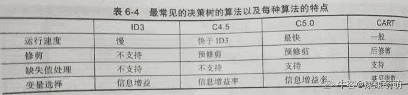
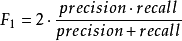
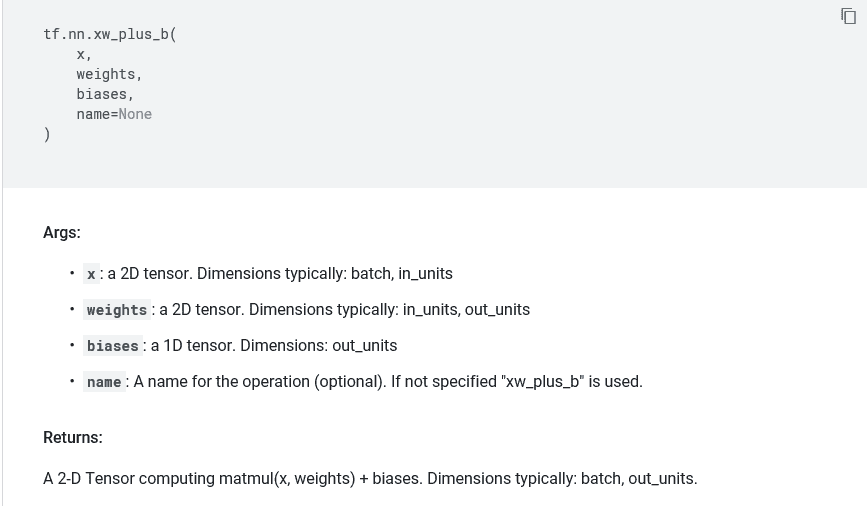

# 招商银行信用卡中心 2019 秋招 IT 笔试（AI 方向第二批）

## 1

以下哪个树结构以基尼系数选择切分特征

正确答案: C   你的答案: 空 (错误)

```cpp
ID3
```

```cpp
C4.5
```

```cpp
CART
```

```cpp
随机森林
```

本题知识点

Java 工程师 C++工程师 算法工程师 测试工程师 招商银行信用卡中心 2019

讨论

[成の心ぃ](https://www.nowcoder.com/profile/115509344)

ID3 使用信息增益为准则划分属性 C4.5 使用增益率为准则划分属性 CART 使用基尼系数划分属性

编辑于 2019-02-19 22:31:55

* * *

[下午约球不](https://www.nowcoder.com/profile/545691869)

特征选择的标准，有信息增益和基尼系数两种，使用信息增益的是 ID3 和 C4.5 算法（使用信息增益比），使用基尼系数的 CART 算法，默认是 gini 系数。

发表于 2018-12-27 08:52:23

* * *

[康康萌萌](https://www.nowcoder.com/profile/384554346)



发表于 2019-09-24 23:05:29

* * *

## 2

在使用朴素贝叶斯进行文本分类时，待分类语料中，有部分语句中的某些词汇在训练语料中的 A 类中从未出现过，下面哪些解决方式是正确的

正确答案: C   你的答案: 空 (错误)

```cpp
按照贝叶斯公式计算，这些词汇并未在 A 类出现过，那么语句属于 A 类的概率为零
```

```cpp
这种稀疏特征属于噪音，它们的加入会严重影响到分类效果，把这类特征从所有类别中删掉
```

```cpp
这种特征可能会起到作用，不易简单删掉，使用一些参数平滑方式，使它起到作用
```

```cpp
这种稀疏特征出现在的类别，该句更有可能属于该类，应该把特征从它未出现的类别中删掉
```

本题知识点

Java 工程师 C++工程师 算法工程师 测试工程师 招商银行信用卡中心 2019

讨论

[打不过就溜](https://www.nowcoder.com/profile/110019946)

这道题错了吧，朴素贝叶斯不考虑平滑的。贝叶斯估计才会使用参数平滑，最大后验。答案是 A

发表于 2020-03-27 17:19:16

* * *

[小小雪 201903221734221](https://www.nowcoder.com/profile/460791673)

a

发表于 2019-03-22 22:48:49

* * *

## 3

下列关于特征选择方法中，描述正确的是

正确答案: D   你的答案: 空 (错误)

```cpp
传统交叉熵只考虑了特征与类别之间的相关性，而忽略了特征项在类内和类间分布的均匀程度。
```

```cpp
互信息筛选特征的方法受稀有特征的影响比较大
```

```cpp
信息增益筛选特征倾向于特征值比较多的特征
```

```cpp
皮尔逊相关系数计算时，方差均为 0 时，相关性最大
```

本题知识点

Java 工程师 C++工程师 算法工程师 测试工程师 招商银行信用卡中心 2019

讨论

[不跳槽就会死君](https://www.nowcoder.com/profile/787699543)

感觉此题 C 也是正确选项，

发表于 2019-03-24 10:56:54

* * *

[没有眼泪的禽兽](https://www.nowcoder.com/profile/3718224)

当方差为 0 的时候，相关系数为 0.

发表于 2018-11-16 13:12:36

* * *

[Cherish719](https://www.nowcoder.com/profile/205185409)

[`wenku.baidu.com/view/1004b9d55901020206409cba.html`](https://wenku.baidu.com/view/1004b9d55901020206409cba.html)

```cpp
信息增益筛选特征倾向于特征值比较多的特征
```

发表于 2020-03-14 21:43:04

* * *

## 4

关于 hmm(隐马尔科夫模型)和 crf(条件随机场)下列说法中正确的是

正确答案: A B C D E   你的答案: 空 (错误)

```cpp
HMM 是一种有向图，CRF 是一种无向图
```

```cpp
HMM 只依赖于每一个状态和它对应的观察对象, 没有考虑上下文信息。
```

```cpp
CRF 是在给定需要标记的观察序列的条件下，计算整个标记序列的联合概率分布
```

```cpp
HMM 模型中存在两个假设：一是输出观察值之间严格独立，二是状态的转移过程中当前状态只与前一状态有关
```

```cpp
CRF 模型解决了标注偏置问题
```

本题知识点

Java 工程师 C++工程师 算法工程师 测试工程师 招商银行信用卡中心 2019

讨论

[晴空幽兰雨](https://www.nowcoder.com/profile/573675506)

CRF 是判别式模型，计算的应该是条件概率，C 选项是错的吧？

发表于 2020-09-16 19:08:37

* * *

## 5

机器学习中，正则化引入是为了解决什么问题：

正确答案: B   你的答案: 空 (错误)

```cpp
训练太慢
```

```cpp
训练过拟合
```

```cpp
训练样本太少
```

```cpp
数据标签缺失
```

本题知识点

Java 工程师 C++工程师 算法工程师 测试工程师 招商银行信用卡中心 2019

讨论

[甲壳剑齿鸟](https://www.nowcoder.com/profile/448507457)

正则化用来避免过拟合

发表于 2019-10-13 16:13:02

* * *

[小小雪 201903221734221](https://www.nowcoder.com/profile/460791673)

a

发表于 2019-03-22 22:51:47

* * *

## 6

下面哪个模型常用来预测单词序列的下一个单词：

正确答案: C   你的答案: 空 (错误)

```cpp
全连接神经网络
```

```cpp
卷积神经网络
```

```cpp
循环神经网络
```

```cpp
波尔兹曼机
```

本题知识点

Java 工程师 C++工程师 算法工程师 测试工程师 招商银行信用卡中心 2019

讨论

[牛客网弟中弟](https://www.nowcoder.com/profile/5002895)

循环神经网络通常用来解决序列标注问题

发表于 2018-12-04 16:58:28

* * *

## 7

下面对 k-means 聚类算法解释正确的是：

正确答案: B   你的答案: 空 (错误)

```cpp
不需要指定簇的个数
```

```cpp
不能自动识别簇的个数
```

```cpp
对异常点不敏感
```

```cpp
聚类结果与中心点的初始化无关
```

本题知识点

Java 工程师 C++工程师 算法工程师 测试工程师 招商银行信用卡中心 算法工程师 招商银行信用卡中心 2019

讨论

[牛客网弟中弟](https://www.nowcoder.com/profile/5002895)

题目看错了，，，尴尬

发表于 2018-12-04 16:58:59

* * *

## 8

ID3 算法在模型构建过程中，使用下面的哪个量来选择分裂节点的：

正确答案: B   你的答案: 空 (错误)

```cpp
Gini 指标
```

```cpp
信息增益
```

```cpp
信息增益率
```

```cpp
准确率
```

本题知识点

Java 工程师 C++工程师 算法工程师 测试工程师 招商银行信用卡中心 2019

讨论

[清风不清](https://www.nowcoder.com/profile/810984421)

ID3:信息增益 C4.5 信息增益率 CART:基尼系数

发表于 2019-08-26 00:02:42

* * *

## 9

2 个随机变量 X、Y 相互独立，下列表达式不正确的是

正确答案: A   你的答案: 空 (错误)

```cpp
D(XY)=D(X)E(Y)
```

```cpp
D(X+Y)=D(X)+D(Y)
```

```cpp
E(XY)=E(X)E(Y)
```

```cpp
E(X+Y)=E(X)+E(Y)
```

本题知识点

Java 工程师 C++工程师 算法工程师 测试工程师 招商银行信用卡中心 2019

讨论

[牛客 198](https://www.nowcoder.com/profile/893056771)

d 是方差，e 是期望对吗

发表于 2020-08-01 14:18:27

* * *

## 10

有 30 瓶一样的药水，其中有一瓶变质了，喝了之后 1 小时会死掉。最少需要多少只小白鼠做实验，才能保证在 1 小时时间内找到有变质的一瓶？

正确答案: C   你的答案: 空 (错误)

```cpp
7
```

```cpp
6
```

```cpp
5
```

```cpp
4
```

本题知识点

Java 工程师 C++工程师 算法工程师 测试工程师 招商银行信用卡中心 2019

讨论

[喵喵援助团](https://www.nowcoder.com/profile/109488189)

我不是这个行业的，偶然看到这个题，来找答案的。首先解读一下题目，这个药喝了一个小时后才会生效，但是现在要求在 1 个小时就要得出结果。所以其意思是不能通过试药来进行分批判断药品，也就是常规的采用二分甚至三分等需要循环反馈的方法是不行的。那么分组混合验证存在可能性么？将 30 组药品进行分组混合，得到若干组然后给老鼠试吃，通过若干组的结果，综合判断出过期药。
答案分为了 5 个组，因为要明确到药品，所以老鼠数量就是组的数量，不然过期药在空组将无法准确定位过期药。因为每只老鼠最多只能判断一半的药，所以我们现在按照老鼠数量逐级将药品分组。第一只   1-15
第二只   1-7    16-23 第三只   ···
以此类推，到这里应该立马就有思路了吧？这 TM 不就是二进制么？这个问题不就是问我 2^a>=30<求 a 的值，显然 a=5 啊。所以答案就是选 5\.

编辑于 2019-08-13 14:51:42

* * *

[那我呢没起够](https://www.nowcoder.com/profile/9324390)

从 1 到 32 转换为 2 进制 1 为 00000001 2 为 00000010 3 为 00000011 4 为 00000100 5 为 00000101 以此类推 1 号喝第一位为 1 的水，2 喝第二位为 2 的水，每个小鼠喝 8 次。 根据死亡情况可以判断哪个瓶子变质

发表于 2018-11-22 23:00:13

* * *

[用花开的季节温暖眼瞳](https://www.nowcoder.com/profile/3604422)

一小时可以做一次实验，一只老鼠一次实验可以提供的信息量是 log (2)，30 瓶药里面有一瓶毒药，每 1 瓶药有毒的概率均为 1/30，这时候确定毒药所需要的信息量是 30 *  - 1 / 30 * log (1 / 30) = log(30)，可以得到不等式 : n * log (2) >= log(30), n >= 5。 编辑于 2020-02-27 22:01:55

* * *

## 11

将一枚硬币抛 5 次，至少有一次正面向上的概率是？

正确答案: A   你的答案: 空 (错误)

```cpp
31/32
```

```cpp
29/32
```

```cpp
15/16
```

```cpp
13/16
```

本题知识点

Java 工程师 C++工程师 算法工程师 测试工程师 招商银行信用卡中心 2019

讨论

[牛客网弟中弟](https://www.nowcoder.com/profile/5002895)

通过对立事件来解决问题，假设 5 次得到的都是反面，其概率为 C(5,5)*（1/2）⁵ = 1/32,故至少有一次正面的概率为 1-1/32 = 31/32

发表于 2018-12-04 17:00:41

* * *

## 12

12 个糖果分给 3 个人，每人至少的一个，有几种不同分法：

正确答案: C   你的答案: 空 (错误)

```cpp
48
```

```cpp
49
```

```cpp
50
```

```cpp
51
```

本题知识点

Java 工程师 C++工程师 算法工程师 测试工程师 招商银行信用卡中心 2019

讨论

[是不是要开始刷题了啊](https://www.nowcoder.com/profile/601921402)

答案应该是 C11 2 = 55 吧

发表于 2018-11-20 00:06:46

* * *

[牛客网弟中弟](https://www.nowcoder.com/profile/5002895)

使用挡板法来解决此类问题。把 12 个糖果排成一排，可以得知中间有 11 个空位，在其中任一空位插入两个挡板即可。故此题的答案为 C(11,2) = 55

发表于 2018-12-04 17:05:23

* * *

[零葬](https://www.nowcoder.com/profile/75718849)

难道不是 55 吗！

发表于 2020-10-30 10:00:51

* * *

## 13

关于准确率、召回率和 f1-score，以下错误的是：

正确答案: D   你的答案: 空 (错误)

```cpp
准确率为 TP/(TP+FP)
```

```cpp
召回率为 TP/(TP+FN)
```

```cpp
f1-score 为 2TP/(2TP+FP+FN)
```

```cpp
f1-score 为准确率*召回率/(准确率+召回率)
```

本题知识点

Java 工程师 C++工程师 算法工程师 测试工程师 招商银行信用卡中心 2019

讨论

[下午约球不](https://www.nowcoder.com/profile/545691869)



发表于 2018-12-27 10:04:25

* * *

[牛客 630891743 号](https://www.nowcoder.com/profile/630891743)

不是叫准确率吧 应该叫精确率....precision not accracy

发表于 2020-03-26 22:53:50

* * *

## 14

二叉树有 1000 个节点，则该二叉树的最小高度为（）：

正确答案: B   你的答案: 空 (错误)

```cpp
9
```

```cpp
10
```

```cpp
11
```

```cpp
12
```

本题知识点

Java 工程师 C++工程师 算法工程师 测试工程师 招商银行信用卡中心 算法工程师 招商银行信用卡中心 2019

讨论

[J..Y..](https://www.nowcoder.com/profile/4060822)

2^n - 1 >= 1000,  n = 10

发表于 2019-10-06 15:48:49

* * *

## 15

下面哪个可以使得 SVM 实现非线性分类：

正确答案: B   你的答案: 空 (错误)

```cpp
SMO 算法
```

```cpp
核函数
```

```cpp
松弛变量
```

```cpp
对偶空间求解
```

本题知识点

Java 工程师 C++工程师 算法工程师 测试工程师 招商银行信用卡中心 2019

讨论

[甲壳剑齿鸟](https://www.nowcoder.com/profile/448507457)

核函数的作用就是把数据从低维不可分升维到高维可分可参考[`blog.csdn.net/kateyabc/article/details/79980880`](https://blog.csdn.net/kateyabc/article/details/79980880)

发表于 2019-10-15 17:26:11

* * *

## 16

库中包含两个随机函数，r()是对 0.0~1.0 均匀分布的采样，g()是对 N(0,1)正态分布的采样，下列说法正确的是?

正确答案: A C   你的答案: 空 (错误)

```cpp
Double x=r()*5.0+3.0 是对(3.0~8.0)的均匀采样
```

```cpp
Double x=g()*2.0+3.0 是对 N(3.0,2.0)正态分布的采样
```

```cpp
Double x=g()*2.0+3.0 是对 N(3.0,4.0)正态分布的采样
```

```cpp
Double x=g()*g();x 是对卡方分布的采样
```

本题知识点

Java 工程师 C++工程师 算法工程师 测试工程师 招商银行信用卡中心 2019

讨论

[石锅拉面](https://www.nowcoder.com/profile/929404193)

D 为什么不行哇

发表于 2021-06-24 09:56:48

* * *

## 17

以下为减轻过拟合的方法是：

正确答案: A B C   你的答案: 空 (错误)

```cpp
增加样本
```

```cpp
提前终止
```

```cpp
dropout
```

```cpp
建立更复杂模型
```

本题知识点

Java 工程师 C++工程师 算法工程师 测试工程师 招商银行信用卡中心 2019

讨论

[牛客网弟中弟](https://www.nowcoder.com/profile/5002895)

D 选项建立复杂模型很明显是容易发生过拟合

发表于 2018-12-04 17:06:58

* * *

## 18

CNN 网络是大家常用的神经网络，对于每一层之后，我们都需要计算一些，那么请问下，如果输入图片尺寸为 255*255，有 rgb 通道，在经过步长为 4，边界填充为 0，11*11 的卷积层之后，图像尺寸是多少？该卷积核的参数量是多少？

你的答案

本题知识点

Java 工程师 C++工程师 算法工程师 测试工程师 招商银行信用卡中心 2019

讨论

[尼古拉斯小林](https://www.nowcoder.com/profile/234926)

卷积后得到的图像大小：（255-11）/4+1 卷积核参数量：11*11*3（RGB）+1（偏置)

发表于 2019-03-17 10:13:04

* * *

## 19

xw_plus_b()是 TensorFlow 进行神经网络实现中的一个重要函数，其第二个入参 weights 要求输入的是几维张量？

正确答案: B   你的答案: 空 (错误)

```cpp
1
```

```cpp
2
```

```cpp
3
```

```cpp
无要求
```

本题知识点

Java 工程师 C++工程师 算法工程师 测试工程师 招商银行信用卡中心 2019

讨论

[&abcdefg;yolo](https://www.nowcoder.com/profile/832050734)



发表于 2019-07-29 19:55:00

* * *

## 20

Hadoop 有哪些运行模式？

正确答案: A B C   你的答案: 空 (错误)

```cpp
独立/单机运行
```

```cpp
伪分布式运行
```

```cpp
集群分布式运行
```

```cpp
中心化运行
```

本题知识点

Java 工程师 C++工程师 算法工程师 测试工程师 招商银行信用卡中心 2019

讨论

[dream§冰吻](https://www.nowcoder.com/profile/455136996)

ABC

发表于 2019-05-14 16:18:12

* * *

[牛客 869498429 号](https://www.nowcoder.com/profile/869498429)

ABC 分布式提倡去中心化

发表于 2022-03-01 21:56:58

* * *

## 21

以下哪些算法可以通过无监督学习方式进行训练？

正确答案: B D E   你的答案: 空 (错误)

```cpp
SVM
```

```cpp
K-Medoids
```

```cpp
决策树
```

```cpp
RBM
```

```cpp
GAN
```

本题知识点

Java 工程师 C++工程师 算法工程师 测试工程师 招商银行信用卡中心 2019

讨论

[CVPR 快到碗里来](https://www.nowcoder.com/profile/3933577)

为什么 GAN 也可以啊？不是生成对抗网络吗？，没有标签的话判别器怎么判别呢？

发表于 2020-06-17 00:18:30

* * *

[零葬](https://www.nowcoder.com/profile/75718849)

讲道理，GAN 是有监督还是无监督得看怎么用

发表于 2021-01-02 20:59:56

* * *

## 22

```cpp
我们部门要排队唱歌，大家乱哄哄的挤在一起，现在需要按从低到高的顺序拍成一列，但每次只能交换相邻的两位，请问最少要交换多少次
```

本题知识点

Java 工程师 C++工程师 算法工程师 测试工程师 招商银行信用卡中心 排序 *数学 2019* *讨论

[ElonB](https://www.nowcoder.com/profile/623894)

```cpp

	/*
求逆序对数
*/
#include<bits/stdc++.h>
using namespace std;

int main()
{
    int n, i, j, ans = 0, temp;
    cin >> n;
    vector<int> a(n);
    for(i = 0; i < n; i++)
        cin >> a[i];
    for(i = 0; i < n; i++)
        for(j = 0; j < i; j++)
            if(a[j] > a[i])
                ans++;
    cout << ans << endl;
    return 0;
}

```

编辑于 2019-07-11 19:51:25

* * *

[nbgao](https://www.nowcoder.com/profile/211289)

```cpp
#include <bits/stdc++.h>
using namespace std;

int main(){
    int n, cnt=0;
    cin>>n;
    int a[n];
    for(int i=0;i<n;i++)
        cin>>a[i];
    for(int i=0;i<n;i++)
        for(int j=0;j<i;j++)
            if(a[j]>a[i])
                cnt++;
    cout<<cnt<<endl;
    return 0;
}
```

发表于 2019-12-14 23:54:06

* * *

[keashem](https://www.nowcoder.com/profile/597698287)

用归并排序的思想可以降到 n*logn

```cpp
import java.util.Scanner;
import static java.lang.System.in;
public class Main {
    public static void main(String[] args) {
        Scanner sc = new Scanner(in);
        int n = sc.nextInt();
        int[] data = new int[n];
        for (int i = 0; i < n; i++) {
            data[i] = sc.nextInt();
        }
        temp = new int[n];
        mergeWay(data, 0, n - 1);
        System.out.println(count);
    }
    public static void mergeWay(int[] data, int begin, int end) {
        if (begin >= end) {
            return;
        }
        int mid = begin + ((end - begin) >> 1);
        mergeWay(data,begin,mid);
        mergeWay(data,mid+1,end);
        merge(data, begin, end, mid);
    }
    public static int[] temp;
    public static int count = 0;
    private static void merge(int[] data, int begin, int end, int mid) {
        int i = begin, j = mid + 1;
        int k = i;
        while (i <= mid && j <= end) {
            count += data[i] <= data[j] ? 0 : mid - i + 1;//这里加的逆序对是这么多，而不是加 1
            temp[k++] = data[i] <= data[j] ? data[i++] : data[j++]; //先写上面，这里 i，j 已变化
        }
        while (i <= mid) {
            temp[k++] = data[i++];
        }
        while (j <= end) {
            temp[k++] = data[j++];
        }
        for (int h = begin; h < k; h++) {
            data[h] = temp[h];
        }
    }
}
```

发表于 2019-08-03 17:30:47

* * *

## 23

小招喵某日闲来无事，想验一下自己的人品，于是给自己定了一个游戏规则：这个游戏有三个因素：N，K，W 游戏开始的时候小招喵有 0 点，之后如果发现自己手上的点不足 K 点，就随机从 1 到 W 的整数中抽取一个（包含 1 和 W），抽到哪个数字的概率都是相同的。重复上述过程，直到小招喵获得了 K 或者大于 K 点，就停止获取新的点，这时候小招喵手上的点小于等于 N 的概率是多少？输入：N = 5， K = 1， W = 5 输出：1.00000 说明：开始有 0 点，不足 1 点，从[1,5]中随机取一个整数（一共 5 个数字，所以每个数字取到的概率都是 1/5），获得后得分无论如何都大于了 1 点，停止，概率为 1 输入：N = 6， K = 1， W = 10 输出：0.60000 说明：开始有 0 点，不足 1 点，从[1,10]中随机取一个整数（一共 10 个数字，所以每个数字取到的概率都是 1/10），获得后有 6/10 的概率小于 6 点，且满足大于 1 点的条件，概率为 0.6

本题知识点

算法工程师 招商银行信用卡中心 2019

讨论

[白色纯度](https://www.nowcoder.com/profile/485984577)

详解在这篇博客：[`blog.csdn.net/weixin_42564710/article/details/98942203`](https://blog.csdn.net/weixin_42564710/article/details/98942203)
看完步骤，很容易写出代码。

```cpp
if __name__=='__main__':
    n, k, w = list(map(int, input().split()))
    dp = [0]*(k+w) 
    for i in range(k, n+1):
        dp[i] = 1 
    s = min(w, n-k+1)
    for i in range(k-1, -1, -1):
        dp[i] = s / w
        s += dp[i] - dp[i+w]
    print(round(dp[0],5))
```

发表于 2019-08-09 10:47:26

* * *

[ElonB](https://www.nowcoder.com/profile/623894)

```cpp
/*
@奋起的小孩 的思路
dp[i]表示起始 i 点满足要求(小于 n)的概率
dp[i] = (1/w)*sum(dp[i+1],dp[i+2],...,dp[i+10])
by the way:输出格式有坑，与示例不符 
*/
#include<bits/stdc++.h>
using namespace std;
#define N 10000

int main()
{
//    freopen("input.txt", "r", stdin);
    int n, k, w, i;
    cin >> n >> k >> w;
    vector<float> dp(k + w);
    for(i = k; i <= n; i++)
        dp[i] = 1;  //都满足要求，概率为 1
    for(i = n + 1; i < k + w; i++)
        dp[i] = 0;  //不满足要求，概率为 0
    float temp = min(n - k + 1, w); //求[k,k+w]的和
    for(i = k - 1; i >= 0; i--) {
        dp[i] = temp / w;
        temp += dp[i] - dp[i + w]; //每次只能抽到[1,w]，一次不能到达的减掉
    }
//  printf("%.5f",dp[0]);
    float ans = int(dp[0] * 100000 + 0.5) / 100000.0;
    cout<<ans<<endl;
    return 0;
}

```

编辑于 2019-07-11 20:55:00

* * *

[奋起的小孩](https://www.nowcoder.com/profile/4937371)

LeetCode 837 [`leetcode.com/articles/new-21-game/`](https://leetcode.com/articles/new-21-game/)

```cpp
n, k, w = list(map(int, input().split()))
dp = [0]*(k+w) #k-1 能达到的最大值为 k+w-1
for i in range(k, n+1):
    dp[i] = 1
s = min(w, n-k+1)
for i in range(k-1, -1, -1):
    dp[i] = s / w 
    s += dp[i] - dp[i+w]
print(round(dp[0], 5))

```

编辑于 2019-02-27 13:07:46

* * *

## 24

我们已知天气因素对于约会地点起到决定性作用，现已知不同的天气情况有三种{晴天、雨天、阴天}，不同的约会地点有三种{游乐场、咖啡馆、电影院}；根据经验，出现三种天气情况的概率分别是

| 晴天 | 雨天 | 阴天 |
| 0.5 | 0.2 | 0.3 |

天气的状态转移概率矩阵见下：

|   | 晴天 | 雨天 | 阴天 |
| 晴天  | 0.5 | 0.2 | 0.3 |
| 雨天  | 0.3 | 0.5 | 0.2 |
| 阴天  | 0.2 | 0.3 | 0.5 |

从天气状态推断约会地点的概率矩阵见下：

|   | 游乐场 | 咖啡馆 | 电影院 |
| 晴天 | 0.6 | 0.2 | 0.2 |
| 雨天 | 0.1 | 0.2 | 0.7 |
| 阴天 | 0.3 | 0.6 | 0.1 |

现已知观察出的约会地点序列为 {咖啡馆、游乐场、电影院}， 请推导计算最可能的天气序列

你的答案

本题知识点

Java 工程师 C++工程师 算法工程师 测试工程师 招商银行信用卡中心 2019

讨论

[下午约球不](https://www.nowcoder.com/profile/545691869)

阴天阴天雨天咖啡馆=》晴天*晴天咖啡馆=0.1，阴天*阴天咖啡馆=0.18，雨天*雨天咖啡馆=0.04 =》 阴天最大游乐场=》咖啡馆阴天*阴转晴*晴天游乐场=0.18*0.2*0.6，咖啡馆阴天*阴转阴*阴天游乐场=0.18*0.5*0.3，咖啡馆阴天*阴转雨*雨天游乐场=0.18*0.3*0.1 =》 阴天最大电影院=》游乐场阴天*阴转晴*晴天电影院=游乐场阴天*0.2*0.2，游乐场阴天*阴转阴*阴天电影院=游乐场阴天*0.5*0.1，游乐场阴天*阴转雨*雨天电影院=游乐场阴天*0.3*0.7  =》雨天最大

发表于 2018-12-27 11:45:01

* * *

[Mr_Liang](https://www.nowcoder.com/profile/495852056)

前向算法，不是 viterbi 算法

发表于 2020-10-14 15:05:46

* * *

## 25

计算机视觉和人的视觉有很大不同，有些人能很容易直觉判断的，计算机并不容易，下面列举几个问题，请回答 1\. 怎么识别图中是否有正方形，长方形，圆形？2\. 抠图的时候，主体周边很容易有一圈残留，怎么去除？

你的答案

本题知识点

Java 工程师 C++工程师 算法工程师 测试工程师 招商银行信用卡中心 2019

讨论

[lynnn1996](https://www.nowcoder.com/profile/258560208)

1.霍夫变换 2.开闭运算平滑边界也应该可以

发表于 2021-10-29 10:40:58

* * *

[哒哒哒，冲呀](https://www.nowcoder.com/profile/995874969)

第一问，通过二值化边缘序列进行拟合

发表于 2021-07-13 15:25:17

* * *

[CVPR 快到碗里来](https://www.nowcoder.com/profile/3933577)

第二问，应该是可以用引导滤波去处理（边缘保持， 边缘平滑）第一问，圆形可以用霍夫变换做圆形检测，opencv 的轮廓检测函数可以检测任意形状的轮廓（但是识别好像和检测不一样，识别应该还需要说出某个形状是正方形还是长方形，甚至形状所在的具体坐标，没做图像识别好像也不太懂诶，快来个大牛解答一下～）

发表于 2020-07-10 10:06:52

* * **