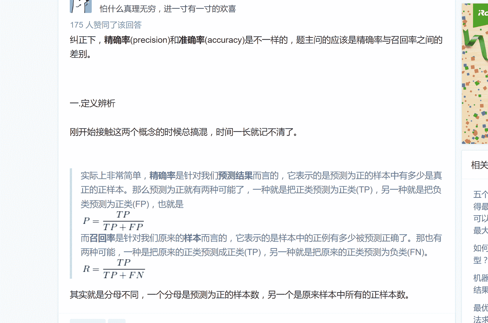

# 招商银行信用卡中心 2019 秋招 IT 笔试（AI 方向第三批）

## 1

```cpp
一个有偏的硬币，抛了 100 次，出现 1 次人头，99 次字。请用最大似然估计（ML）和最小均方误差（LSE）估计出现人头的概率
```

你的答案

本题知识点

Java 工程师 C++工程师 算法工程师 测试工程师 招商银行信用卡中心 2019

讨论

[随缘随缘](https://www.nowcoder.com/profile/367036152)

LSE 的话，应该是 arg min [ (1-theta)**2 + 99*(0-theta)**2]得 theta = 1/100MLE 的话不用算，频率就是 MLE 的结果，即 1/100。 算的话也很容易

发表于 2019-08-13 15:28:38

* * *

[张叮咚](https://www.nowcoder.com/profile/824576152)

```cpp
#include <iostream>
#include <algorithm>
using namespace std;

double MaxLikelihood(const int &x)
{

```
double p;//人头概率
double L,ML,F;//似然、概率函数
L=p^x*(1-p)^(100-x);
ML=(1-p)^(99-x)*p^(x-1)*(x*(1-p)-p);
return p=x/(x+1);
```cpp

}

int main()

{

double p;//人头概率

int x=1;//结果

p=MaxLikelihood(&x);//最大似然估计

cout<<p<<endl;

return 0;

}
```

发表于 2019-06-15 10:11:38

* * *

[徐振杰](https://www.nowcoder.com/profile/2495102)

发表于 2019-04-09 16:39:09

* * *

## 2

以下哪个不属于过拟合解决方式

正确答案: B   你的答案: 空 (错误)

```cpp
bagging/boosting
```

```cpp
batch normalization
```

```cpp
L2 范式
```

```cpp
cross validation
```

本题知识点

Java 工程师 C++工程师 算法工程师 测试工程师 招商银行信用卡中心 2019

讨论

[MIN 大小姐](https://www.nowcoder.com/profile/897984594)

BN 算法也可以防止过拟合啊，为了使数据不至于偏向极端，进行的归一化操作

发表于 2020-03-07 22:05:48

* * *

[尼古拉斯小林](https://www.nowcoder.com/profile/234926)

在训练神经网络时，标准化输入可以提高训练的速度。方法是对训练数据集进行归一化的操作，即将原始数据减去其均值  后，再除以其方差  。

但是标准化输入只是对输入进行了处理，那么对于神经网络，又该如何对各隐藏层的输入进行标准化处理呢？

其实在神经网络中，第  层隐藏层的输入就是第  层隐藏层的输出  。对  进行标准化处理，从原理上来说可以提高  和  的训练速度和准确度。这种对各隐藏层的标准化处理就是 Batch Normalization。值得注意的是，实际应用中，一般是对  进行标准化处理而不是 ，其实差别不是很大。

发表于 2019-01-08 18:07:03

* * *

[兔子 0713](https://www.nowcoder.com/profile/9087881)

首先，集成学习分为两大类，bagging 和 boosting。bagging 用于解决过拟合问题，是一种将基分类器并行训练然后通过投票或者取均值的方式求得最终结果，而 boosting 用于解决欠拟合问题，是一种串行训练方式，每次训练都是基于上一次基分类器的输出与标签的残差而进行的。

那么，为什么说 bagging 可以解决过拟合问题？而 boosting 用于解决欠拟合问题？bagging 的思想是通过有放回选取数据构成数据集，然后在该数据集上每次训练一个基分类器，最终将各个基分类的结果根据少数服从多数的原则得到投票一半以上的结果。假设某个样本被判错的概率一定，各个基分类器是独立的，因此被所有基分类器都判错的概率会随着基分类的数目增加而指数的减小，所以 bagging 可以防止过拟合，减少模型的方差。boosting 是串行训练，每次都是根据上一个基分类的结果和标签的残差来训练，所以一步一步的串行训练后最终的偏差越来越小，可以防止欠拟合。

发表于 2021-12-17 11:21:31

* * *

## 3

下列有关 bagging 和 boosting 的选项哪个正确

正确答案: B C D   你的答案: 空 (错误)

```cpp
boosting 中每轮训练，各个弱分类器重新有放回筛选训练样本
```

```cpp
bagging 在训练中样本的权重保持一致
```

```cpp
bagging 训练中各弱分类器可以并行训练
```

```cpp
bagging 中每个分类器权重一致
```

本题知识点

Java 工程师 C++工程师 算法工程师 测试工程师 招商银行信用卡中心 2019

讨论

[粥粥粥啊喵](https://www.nowcoder.com/profile/59007760)

我怎么觉得这一题的 BCD 都是正确的，只有 A 是不对的呢？另外，Bagging 中也有弱分类器的概念吗？

发表于 2019-03-16 15:35:10

* * *

[尼古拉斯小林](https://www.nowcoder.com/profile/234926)

Bagging 和 Boosting 的区别：

1）样本选择上：

Bagging：训练集是在原始集中有放回选取的，从原始集中选出的各轮训练集之间是独立的。

Boosting：每一轮的训练集不变，只是训练集中每个样例在分类器中的权重发生变化。而权值是根据上一轮的分类结果进行调整。

2）样例权重：

Bagging：使用均匀取样，每个样例的权重相等

Boosting：根据错误率不断调整样例的权值，错误率越大则权重越大。

3）预测函数：

Bagging：所有预测函数的权重相等。

Boosting：每个弱分类器都有相应的权重，对于分类误差小的分类器会有更大的权重。

4）并行计算：

Bagging：各个预测函数可以并行生成

Boosting：各个预测函数只能顺序生成，因为后一个模型参数需要前一轮模型的结果。

发表于 2019-01-08 18:11:12

* * *

## 4

下列关于 LDA(Latent Dirichlet Allocation) 描述中错误的是

正确答案: A   你的答案: 空 (错误)

```cpp
每个文档都表示为词汇的 dirichlet 分布
```

```cpp
每个主题都表示为词汇的 dirichlet 分布
```

```cpp
每个文档都表示为主题的 dirichlet 分布
```

```cpp
求解 LDA 模型常用 Gibbs 采样
```

本题知识点

Java 工程师 C++工程师 算法工程师 测试工程师 招商银行信用卡中心 2019

讨论

[小小雪 201903221734221](https://www.nowcoder.com/profile/460791673)

a

发表于 2019-03-22 19:23:08

* * *

## 5

关于 batch gradient descent, mini-batch gradient descent, stochastic gradient descent，下列叙述错误的是

正确答案: D   你的答案: 空 (错误)

```cpp
BGD 得到全局最优解
```

```cpp
MBGD 既不会太容易震荡，又不容易陷入局部最优解
```

```cpp
SGD 训练速度快，但易产生震荡
```

```cpp
并发最易实现的是 BGD
```

本题知识点

Java 工程师 C++工程师 算法工程师 测试工程师 招商银行信用卡中心 2019

讨论

[牛客网弟中弟](https://www.nowcoder.com/profile/5002895)

并发最容易实现的应该是 SGD(随机梯度下降)

发表于 2018-11-16 02:20:07

* * *

[不跳槽就会死君](https://www.nowcoder.com/profile/787699543)

BGD 不一定得到全局最优解吧，这个有待商榷

发表于 2019-03-24 09:50:51

* * *

[牛客 408853863 号](https://www.nowcoder.com/profile/408853863)

并发（其实我觉得这里的意思是并行）最容易实现的应该是 MBGD，SGD 没有用到并行计算，BGD 一般超过了计算机并行计算的极限

发表于 2022-03-22 20:08:47

* * *

## 6

 以下哪些分类器是线性分类器

正确答案: A D   你的答案: 空 (错误)

```cpp
朴素贝叶斯
```

```cpp
SVM
```

```cpp
逻辑回归
```

```cpp
感知机
```

```cpp
XGBoost
```

本题知识点

Java 工程师 C++工程师 算法工程师 测试工程师 招商银行信用卡中心 2019

讨论

[蒙牛优酸乳](https://www.nowcoder.com/profile/633880038)

逻辑回归，SVM 不是线性的？？？

发表于 2018-11-28 17:26:46

* * *

[风若吹 5](https://www.nowcoder.com/profile/119311698)

逻辑回归不是线性的？？？？

发表于 2020-04-08 16:28:13

* * *

[常 sir 与远方 1](https://www.nowcoder.com/profile/2256634)

朴素贝叶斯是线性分类器？？？

发表于 2018-11-18 11:39:38

* * *

## 7

投掷一枚规整的 6 面骰子（点数 1~6），求掷出的点数的期望和方差

正确答案: D   你的答案: 空 (错误)

```cpp
3,19/6
```

```cpp
7/2,35/2
```

```cpp
7/2,36
```

```cpp
7/2,35/12
```

本题知识点

Java 工程师 C++工程师 算法工程师 测试工程师 招商银行信用卡中心 2019

讨论

[uu123](https://www.nowcoder.com/profile/338766165)

var=E(X²)-E(X)²

发表于 2018-11-20 17:48:29

* * *

[Learn2Learn](https://www.nowcoder.com/profile/140346491)

（0.5²+1.5²+2.5²+0.5²+1.5²+2.5²)/6=35/12

发表于 2019-03-07 19:04:15

* * *

[jack_kuo](https://www.nowcoder.com/profile/9590450)

***这个[骰子](https://www.baidu.com/s?wd=%E9%AA%B0%E5%AD%90&tn=SE_PcZhidaonwhc_ngpagmjz&rsv_dl=gh_pc_zhidao)是 6 面的 上面的点数是 1~6 每个点数的概率是 1/6
那么期望[EX](https://www.baidu.com/s?wd=EX&tn=SE_PcZhidaonwhc_ngpagmjz&rsv_dl=gh_pc_zhidao)就是 1*1/6+2*1/6+3*1/6+4*1/6+5*1/6+6*1/6
= (1+2+3+4+5+6) * 1/6
= 3.5
方差[DX](https://www.baidu.com/s?wd=DX&tn=SE_PcZhidaonwhc_ngpagmjz&rsv_dl=gh_pc_zhidao) = E((X-[EX](https://www.baidu.com/s?wd=EX&tn=SE_PcZhidaonwhc_ngpagmjz&rsv_dl=gh_pc_zhidao))2) = (1-3.5)2 * 1/6 + (2-3.5)2 * 1/6 + (3-3.5)2 * 1/6 + (4-3.5)2 * 1/6 + (5-3.5)2 * 1/6 + (6-3.5)2 * 1/6
=35/12

发表于 2019-04-09 16:25:55

* * *

## 8

服从均值为 10 的正态分布，已知 P(X<=30)=0.7，求 P(X<=-10)

正确答案: A   你的答案: 空 (错误)

```cpp
3/10
```

```cpp
2/10
```

```cpp
1/2
```

```cpp
2/5
```

本题知识点

Java 工程师 C++工程师 算法工程师 测试工程师 招商银行信用卡中心 2019

讨论

[lulu1229](https://www.nowcoder.com/profile/585333538)

正太分布的概率分布函数是对称，对称轴是轮值，＜＝-10 的概率和＞＝30 的概率是一样的都是 0.3

发表于 2019-04-03 01:55:56

* * *

## 9

仅有 A 和 B 两个状态的状态机，初始概率 P(s0=A)=1/3,P(s0=B)=2/3),条件转移概率 P(A|A)=1/3,P(B|A)=2/3,P(B|B)=2/3,P(A|B)=1/3,求 P(s5=A)=?

正确答案: A   你的答案: 空 (错误)

```cpp
1/3
```

```cpp
2/3
```

```cpp
4/9
```

```cpp
(1/3)⁵
```

本题知识点

Java 工程师 C++工程师 算法工程师 测试工程师 招商银行信用卡中心 2019

讨论

[昊 offer](https://www.nowcoder.com/profile/2067915)

P(s1=A) = P(s1=A | s0=A) * P(s0=A) + P(s1=A | s0=B) * P(s0=B) = 1/3 * 1/3 + 1/3 * 2/3 = 1/3 以此类推，P(s5=A)=1/3

发表于 2019-03-04 11:55:58

* * *

[流光 201903042136772](https://www.nowcoder.com/profile/642940859)

P(Sn = A) = P(Sn = A | Sn-1 = A) * P(Sn-1 = A) + P(Sn = A | Sn-1 = B) * P(Sn-1 = B)                 = 1/3 * P(Sn-1 = A) + 1/3 * P(Sn-1 = B)                 = 1/3 * [(P(Sn - 1 = A) + (1 - P(Sn-1 = A))]                 = 1/3 

发表于 2019-08-28 23:16:45

* * *

[caixiongg](https://www.nowcoder.com/profile/5433275)

递推公式:


=> 
从而
并且从最开始的两个式子可以看出
从而 

发表于 2020-09-17 08:19:13

* * *

## 10

算法在数据集上的测试结果是：真正例 80 个，假正例 20 个，假反例 30 个，真反例 70 个。问查准率和查全率分别是多少？

正确答案: C   你的答案: 空 (错误)

```cpp
70/100,70/110
```

```cpp
150/200,80/100
```

```cpp
80/100,80/110
```

```cpp
150/200,70/100
```

本题知识点

Java 工程师 C++工程师 算法工程师 测试工程师 招商银行信用卡中心 2019

讨论

[昊 offer](https://www.nowcoder.com/profile/2067915)



发表于 2019-03-04 11:56:35

* * *

## 11

节点数为 88 的三叉树，深度最少为多少？（根节点深度为 1）

正确答案: B   你的答案: 空 (错误)

```cpp
4
```

```cpp
5
```

```cpp
6
```

```cpp
7
```

本题知识点

Java 工程师 C++工程师 算法工程师 测试工程师 招商银行信用卡中心 2019

讨论

[文剑木然](https://www.nowcoder.com/profile/2036655)

最小深度x 为几叉树，n 为节点数。对于本题，代入之，

编辑于 2018-12-28 09:30:52

* * *

[卡恩思欧](https://www.nowcoder.com/profile/67607315)

第一层满  1  节点数  1 第二层满  3  节点数  4 第三层满  9  节点数  13 第四层满  27 节点数  40 第五层满  81 节点数  121B

发表于 2018-12-28 09:12:22

* * *

[Learn2Learn](https://www.nowcoder.com/profile/140346491)

深度为 1 3⁰+1=1 深度为 2 3¹+1=4
深度为 5 3⁴+1=8288>82 所以深度至少为 6

发表于 2019-03-07 19:07:11

* * *

## 12

堆栈的入栈顺序分别是[1,2,3,4,5]，出栈顺序不可能是？

正确答案: B   你的答案: 空 (错误)

```cpp
3,4,5,2,1
```

```cpp
3,1,2,4,5
```

```cpp
3,4,2,1,5
```

```cpp
3,2,5,4,1
```

本题知识点

Java 工程师 C++工程师 算法工程师 测试工程师 招商银行信用卡中心 2019

讨论

[jack_kuo](https://www.nowcoder.com/profile/9590450)

此类问题是常见题型。解答的基本原理是：一串数据依次通过一个栈，并不能保证出栈数据的次序总是倒置，可以产生多种出栈序列。一串数据通过一个栈后的次序由每个数据之间的进栈、出栈操作序列决定，只有当所有数据“全部进栈后再全部出栈”才能使数据倒置。事实上，存在一种操作序列――“进栈、出栈、进栈、出栈……”――可以使数据通过栈后仍然保持次序不变。
将一组数据入栈后，判断题目备选项中的不可能的出栈顺序，上述这类题目有一个解题技巧：**在输出序列中任意元素后面不能出现比该元素小，并且是升序(指的是元素的序号)的两个元素。**

发表于 2019-04-09 14:37:15

* * *

[小小雪 201903221734221](https://www.nowcoder.com/profile/460791673)

A

发表于 2019-03-22 19:25:11

* * *

## 13

下面关于排序算法空间复杂度说法不正确的是：

正确答案: C   你的答案: 空 (错误)

```cpp
冒泡排序的空间复杂度为 O(1)
```

```cpp
归并排序的空间复杂度为 O(n)
```

```cpp
插入排序的空间复杂度为 O(n)
```

```cpp
快速排序的空间复杂度为 O(1)
```

本题知识点

Java 工程师 C++工程师 算法工程师 测试工程师 招商银行信用卡中心 2019

讨论

[jack_kuo](https://www.nowcoder.com/profile/9590450)


发表于 2019-04-09 16:29:43

* * *

[零葬](https://www.nowcoder.com/profile/75718849)

CD 都是错的吧

发表于 2020-10-30 15:23:57

* * *

[粥粥粥啊喵](https://www.nowcoder.com/profile/59007760)

快排的空间复杂度是 o(1)吗？？递归不都是用栈的吗？我在书上看到的空间复杂度是 o(logn)~o(n).

发表于 2019-03-16 15:57:56

* * *

## 14

下面不属于非监督学习的是：

正确答案: D   你的答案: 空 (错误)

```cpp
关联规则
```

```cpp
Kmeans
```

```cpp
Word2vec
```

```cpp
Knn
```

本题知识点

Java 工程师 C++工程师 算法工程师 测试工程师 招商银行信用卡中心 2019

讨论

[Learn2Learn](https://www.nowcoder.com/profile/140346491)

KNN 的训练数据都是有标签的数据

发表于 2019-03-07 19:11:15

* * *

## 15

以下属于生成模型的是：

正确答案: B   你的答案: 空 (错误)

```cpp
感知器
```

```cpp
朴素贝叶斯模型
```

```cpp
逻辑回顾
```

```cpp
支持向量机
```

本题知识点

Java 工程师 C++工程师 算法工程师 测试工程师 招商银行信用卡中心 算法工程师 招商银行信用卡中心 2019

讨论

[jack_kuo](https://www.nowcoder.com/profile/9590450)

**生成模型**：学习得到联合概率分布 P(x,y)，即特征 x 和标记 y 共同出现的概率，然后求条件概率分布。能够学习到数据生成的机制。

以统计学和 Bayes 作为理论基础：朴素贝叶斯、混合高斯模型、隐马尔可夫模型 (HMM)

**判别模型**：学习得到条件概率分布 P(y|x)，即在特征 x 出现的情况下标记 y 出现的概率。感知机 (线性分类模型)、k 近邻法、决策树、逻辑斯蒂回归模型、最大熵模型、支持向量机 (SVM)、boosting 方法 (AdaBoost 等)、条件随机场 (conditional random field, CRF)、CNN 

发表于 2019-04-09 16:37:29

* * *

[小小雪 201903221734221](https://www.nowcoder.com/profile/460791673)

d

发表于 2019-03-22 19:26:44

* * *

## 16

以下不是优化方法的是：

正确答案: D   你的答案: 空 (错误)

```cpp
GBD
```

```cpp
遗传算法
```

```cpp
模拟退火
```

```cpp
ReLu
```

本题知识点

Java 工程师 C++工程师 算法工程师 测试工程师 招商银行信用卡中心 2019

讨论

[MIN 大小姐](https://www.nowcoder.com/profile/897984594)

Relu 是激活函数

发表于 2020-03-07 22:20:10

* * *

[小小雪 201903221734221](https://www.nowcoder.com/profile/460791673)

a

发表于 2019-03-22 19:27:07

* * *

## 17

关于随机森林描述正确的是：

正确答案: A   你的答案: 空 (错误)

```cpp
随机森林可以降低预测方差
```

```cpp
随机森林可以降低预测偏差
```

```cpp
随机森林可以降低噪音
```

```cpp
以上全部
```

本题知识点

Java 工程师 C++工程师 算法工程师 测试工程师 招商银行信用卡中心 2019

讨论

[失败人士做数据](https://www.nowcoder.com/profile/8188188)

随机森林不是可以降低噪音影响吗？

发表于 2019-02-28 10:58:27

* * *

[召 WEN 天下](https://www.nowcoder.com/profile/6793732)

随机森林可以减缓过拟合，所以是降低方差

发表于 2019-03-07 21:25:09

* * *

[MIN 大小姐](https://www.nowcoder.com/profile/897984594)

随机森林采用 bagging 的集成思想，可以降低方差，对于 boosting 模型可以降低偏差

发表于 2020-03-07 22:19:58

* * *

## 18

下列说法正确的是？

正确答案: A D   你的答案: 空 (错误)

```cpp
决策树剪枝可以防止过拟合
```

```cpp
集成学习的结果一定比单个学习器要好
```

```cpp
相对留出法来说，交叉检验计算量小且更准确
```

```cpp
K-means 算法不能自动选择聚类的类别数量
```

本题知识点

Java 工程师 C++工程师 算法工程师 测试工程师 招商银行信用卡中心 2019

讨论

[下午约球不](https://www.nowcoder.com/profile/545691869)

kmean 类别数量 不是用户给定的？？？？？

发表于 2018-12-27 15:16:12

* * *

## 19

A 盒有 10 个白球、20 个黑球 70 个红球，B 盒有 30 个白球、40 个黑球和 30 个红球，以 0.4 概率选择 A 盒、0.6 概率选择 B 盒，随机取出一个球。下列说法正确的有？

正确答案: B C D   你的答案: 空 (错误)

```cpp
已知取出的球是红色，该球来自 A 盒的概率为 7/10
```

```cpp
已知取出的球是白色，该球来自 B 盒的概率是 9/11
```

```cpp
已知取出的球来自 A 盒，那么该球为红色的概率为 7/10
```

```cpp
取出黑球的概率是 32/100
```

本题知识点

Java 工程师 C++工程师 算法工程师 测试工程师 招商银行信用卡中心 2019

讨论

[凝视深空](https://www.nowcoder.com/profile/4232948)

答案 B 应该为 0.6 × 0.3 / (0.6 * 0.3 + 0.4 * 0.1) = 9 / 11。

发表于 2018-11-18 23:11:45

* * *

[牛客网弟中弟](https://www.nowcoder.com/profile/5002895)

这一题答案 B 不对吧，要么就应该是来自于 A 盒呢概率。。。。

发表于 2018-11-16 02:22:51

* * *

[零葬](https://www.nowcoder.com/profile/75718849)

B 应该是 9/11 啊

发表于 2020-10-30 15:24:14

* * *

## 20

在机器学习的特征选择过程中，可以用到的方法有

正确答案: A B C D   你的答案: 空 (错误)

```cpp
卡方
```

```cpp
信息增益
```

```cpp
交叉熵
```

```cpp
互信息
```

本题知识点

Java 工程师 C++工程师 算法工程师 测试工程师 招商银行信用卡中心 2019

讨论

[尼古拉斯小林](https://www.nowcoder.com/profile/234926)

卡方检验是通过对特征进行打分然后排序，选择排名靠前的特征来表示文本。

发表于 2019-01-08 18:26:35

* * *

[jack_kuo](https://www.nowcoder.com/profile/9590450)

在文本分类中，首先要对数据进行特征提取，特征提取中又分为特征选择和特征抽取两大类，在特征选择算法中有**互信息**，**文档频率**，**信息增益**，**卡方检验**以及**期望交叉熵**。期望交叉熵，以文本分类为例子，期望交叉熵用来度量一个词对于整体的重要程度。在 ID3 决策树中，也使用信息增益作为特征选择的方法，在 C4.5 决策树中，使用信息增益比作为特征选择的方法，在 CART 中，使用基尼指数作为特征选择的方法链接：[`www.nowcoder.com/questionTerminal/bacc960e371c496e9e1ff9b7233a5b0a?orderByHotValue=2&mutiTagIds=631&page=1&onlyReference=false`](https://www.nowcoder.com/questionTerminal/bacc960e371c496e9e1ff9b7233a5b0a?orderByHotValue=2&mutiTagIds=631&page=1&onlyReference=false)
来源：牛客网

发表于 2019-04-09 16:40:30

* * *

[不跳槽就会死君](https://www.nowcoder.com/profile/787699543)

交叉熵做特征选择很少见，各位亲可以参考这篇文章[`blog.csdn.net/liu_zhlai/article/details/53512942`](https://blog.csdn.net/liu_zhlai/article/details/53512942)

发表于 2019-03-24 09:49:27

* * *

## 21

我们有很多区域，每个区域都是从 a 到 b 的闭区间，现在我们要从每个区间中挑选至少 2 个数，那么最少挑选多少个？

本题知识点

Java 工程师 C++工程师 算法工程师 测试工程师 招商银行信用卡中心 贪心 排序 *2019* *讨论

[ElonB](https://www.nowcoder.com/profile/623894)

```cpp
/*
贪心算法，参考课程安排
按右端排序，若挑选的数不在区间内，尽可能取右端
每次更新 p1 计数
*/
#include<bits/stdc++.h>
using namespace std;
#define N 10000
struct area {
    int a, b;
};

bool cmp(pair<int, int> x, pair<int, int> y)
{
    return x.second < y.second;
}

int main()
{
//    freopen("input.txt", "r", stdin);
    int n, i;
    cin >> n;
    vector<pair<int, int> > a(n);
    for(i = 0; i < n; i++) {
        cin >> a[i].first >> a[i].second;
    }
    sort(a.begin(), a.end(), cmp);
    int p1 = -1, p2 = -1, ans = 0;
    for(i = 0; i < n; i++) {
        if(a[i].first > p1) {
            ans++;
            p1 = p2;
            p2 = a[i].second;
        }
        if(a[i].first > p1) {
            ans++;
            p1 = a[i].second - 1;
        }
    }
    cout << ans << endl;
    return 0;
}

```

发表于 2019-07-11 21:48:44

* * *

[earthSaver](https://www.nowcoder.com/profile/975145700)

```cpp
#include<iostream>
#include<vector>
#include<algorithm>
using namespace std;
int main(){
    int n;
    cin>>n;
    vector<pair<int,int>> record;
    for(int i=0;i<n;i++){
        int a,b;
        cin>>a>>b;
        record.push_back(make_pair(a,b));
    }
    sort(record.begin(),record.end());
    int count = 2;
    //l 和 r 表示选点区间
    int l = record[0].first;
    int r = record[0].second;
    for(int i=1;i<record.size();i++){
        if(record[i].first>=l&&record[i].first<=r){
            l = record[i].first;
            r = min(r,record[i].second);
        }else{
            count += 2;
            l = record[i].first;
            r = record[i].second;
        }
    }
    cout<<count<<endl;
    return 0;
}
```

发表于 2019-10-23 19:25:17

* * *

[超越姐姐保佑我 i](https://www.nowcoder.com/profile/4648943)

题意：选择一些点，保证每个区间至少包含这些点中的两个。

目标：让这些选点的数量尽可能的少。

主要思路：区间右端排序 + 贪心

百度搜《区间选点》，有一大堆写的很好的博客，看了就懂了。

```cpp
import java.util.*;
public class Main {
    public static void main(String[] args) {
        Scanner sc = new Scanner(System.in);
        int n = sc.nextInt();
        int[][] arr = new int[n][2];
        for(int i = 0; i < n; i ++) {
            arr[i][0] = sc.nextInt();
            arr[i][1] = sc.nextInt();
        }

        Arrays.sort(arr, (e1, e2) -> e1[1] - e2[1]);

        LinkedList<Integer> list = new LinkedList<>();
        list.add(arr[0][1] - 1);
        list.add(arr[0][1]);
        for(int i = 1; i < n; i ++) {
            if(arr[i][0] > list.peekLast()) { // 相离
                list.add(arr[i][1] - 1);
                list.add(arr[i][1]);
            } else if(arr[i][0] > list.get(list.size() - 2)) {
                list.add(arr[i][1]);
            }
        }

        System.out.println(list.size());
    }
}

```

编辑于 2019-09-04 17:51:33

* * *

## 22

数据是算法的基础，在实验室做的课题，数据都是确定的。但是在实际工作中，数据往往是不确定的。现在我们假设一个场景，我们有很多用户在伪造信息，我们想做一个模型去识别这些伪造信息的用户，请问下，在该种情况下，怎么收集数据，有哪些点需要注意的？

你的答案

本题知识点

Java 工程师 C++工程师 算法工程师 测试工程师 招商银行信用卡中心 2019

讨论

[xinxinxinxinxin](https://www.nowcoder.com/profile/963646648)

专家规则的优势在于实现较为简单、可结实性强，但缺陷在于专家规则存在有严重的滞后性，对于新出现的欺诈手段和方法无法及时的进行应对，往往需要着付出大量损失后才能总结教训提取新的规则。

发表于 2020-06-26 15:55:15

* * *

[随缘随缘](https://www.nowcoder.com/profile/367036152)

参考答案里的滞后性是什么意思呀？

发表于 2019-08-13 16:10:49

* * *

## 23

考虑你从家出发步行去往一处目的地，该目的地恰好离你整数单位步长（大于等于 1）。你只能朝向该目的地或者背向该目的地行走，而你行走的必须为单位步长的整数倍，且要求你第 N 次行走必须走 N 步。请就给出目的地离你距离，判断你是否可以在有限步内到达该目的地。如果可以到达的话，请计算到达目的地的最短总步数(不能到达则输出-1)。

本题知识点

Java 工程师 C++工程师 算法工程师 测试工程师 招商银行信用卡中心 动态规划 数学 2019

讨论

[小蝌蚪 666](https://www.nowcoder.com/profile/5416579)

```cpp
#include <iostream>
using namespace std;
int main(void){
    int T, i, sum = 1;
    cin>>T;
    for(i = 2; (sum-T)&1 || sum < T ; ++i)
        sum += i;
    cout<<i-1<<endl;
    return 0;
}
```

**不用贪心，不用 BFS！**
根据题意画出一棵二叉树，根节点值为 0，表示到家的距离第二层，向左向右走一步，从左往右子节点值为-1，1，即±{1}第三层，向左向右走两步，从左往右子节点值为-3，1，-1，3，即±{1，3}第四层，向左向右走三步，从左往右子节点值为-6，0，2，4，-4，2，0，6，即±{0，2，4，6}...归纳总结，第 i 层，设 sum=1+2+3+...+i-1，sum 为奇数，第 i 层所到达的范围为[-sum,sum]内的所有奇数，sum 为偶数，第 i 层所到达的范围为[-sum,sum]内的所有偶数**sum 可以无穷大，所以总是能够达到的**现在求最短步数，即 T 出现的最早的一层 i，这需要两个条件：

1.  T 和 sum 同奇偶
2.  sum≥T

根据上述结论计算 sum 即可，注意循环退出后 i-1 才是正确答案

编辑于 2019-08-15 21:20:36

* * *

[只是不想说](https://www.nowcoder.com/profile/1587329)

whileTrue:    try:        T =eval(input())        i =1        S =0        while1:            S+=i            #思路，假定一直正向走，则每次都是 S+=i，若一直正向走到不了目的地，则至少需要一次反向走，            #假设第 j 次是反向走的，则总距离减去 2*j，必定是个偶数，即不管有多少次反向走，减去的距离都是个偶数，            #则只需要在一直正向走的基础上，找到第一个偶数能够等于正向走的总距离 S 减去 T，即为最短路径            ifS>=T and(S-T)%2==0:                print(i)                break            i+=1    except:        break

发表于 2018-11-29 09:04:58

* * *

[雷凌云](https://www.nowcoder.com/profile/174189833)

```cpp
"""
广度优先遍历算法
[0]             第 0 层，
[1, -1]         第 1 层，上层的结果 +1，-1
[3, -1, 1, -3]  第 2 层，上层的结果 +2，-2
...             第 i 层，上层的结果 +i，-i
"""
def BFS(n):
    bfs = set([0])
    i = 0
    while True:
        i += 1
        pre = bfs.copy()
        bfs = set()
        for num in pre:
            if num+i==n or num-i==n:
                return i
            else:
                bfs.add(num+i)
                bfs.add(num-i)
n = int(input())
print(BFS(n))
```

发表于 2019-08-21 22:31:43

* * *

## 24

关于下列机器学习理论上的各种描述，请选择下列正确的选项

正确答案: B D   你的答案: 空 (错误)

```cpp
逻辑斯提回归的常用损失函数其实本质是一种相对熵度量
```

```cpp
核方法可以简化再机器学习中高维映射的运算
```

```cpp
随机梯度下降方法可以得到理论上的最优解
```

```cpp
剪枝是防止决策树模型过拟合的一种常见方法
```

本题知识点

Java 工程师 C++工程师 算法工程师 测试工程师 招商银行信用卡中心 2019

讨论

[尼古拉斯小林](https://www.nowcoder.com/profile/234926)

逻辑回归 交叉熵

发表于 2019-01-08 19:17:44

* * *

[随缘随缘](https://www.nowcoder.com/profile/367036152)

原来相对熵就是 KL 散度

发表于 2019-08-13 16:14:29

* * *

[千玺的小狐狸](https://www.nowcoder.com/profile/494191630)

SGB 不是理论的最优解吗？

发表于 2020-03-27 18:27:41

* * *

## 25

已知一组数据 y[i]，服从于泊松分布（其数学期望参数为）。我们知道与另一组数据 x[i]有关并且希望用 来预测。 我们采用指数回归方法。请根据最大似然估计准则写出其损失函数并且根据损失函数的性质判断其是否可解。 最后我们希望使用基于梯度下降的方法来解决这个问题，请写出基本的思路和必要迭代公式（可使用梯度下降法的变种）。

你的答案

本题知识点

Java 工程师 C++工程师 算法工程师 测试工程师 招商银行信用卡中心 2019

讨论

[MIN 大小姐](https://www.nowcoder.com/profile/897984594)

采用随机梯度下降：1.每次从样本集中随机抽取一个样本(xi,yi)2.对其计算损失函数的梯度，设为 w3.然后基于此对λ进行更新，设学习率为α，λ ：= λ-αw4.基于预设定的迭代次数，进行迭代，最后即可得λ

发表于 2020-03-07 22:45:24

* * **