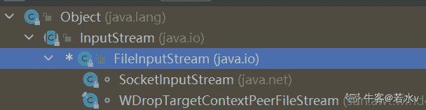
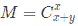

# 美丽联合 2019 届校招-测试类笔试题

## 1

下列选项中，降低进程优先级的合理时机是( )。

正确答案: A   你的答案: 空 (错误)

```cpp
进程的时间片用完
```

```cpp
进程刚完成 I/O，进入就绪队列
```

```cpp
进程长期处于就绪队列中
```

```cpp
进程从就绪状态转为运行态
```

本题知识点

测试工程师 蘑菇街 测试工程师 蘑菇街 2019

## 2

引入线索二叉树的目的是（）

正确答案: A   你的答案: 空 (错误)

```cpp
加快查找结点的前驱或后继结点的速度
```

```cpp
为了能在二叉树中方便插入和删除
```

```cpp
为了能方便找到双亲
```

```cpp
使二叉树的遍历结果唯一
```

本题知识点

测试工程师 蘑菇街 测试工程师 蘑菇街 2019

讨论

[时文康](https://www.nowcoder.com/profile/101764790)

。a

发表于 2019-10-21 19:39:27

* * *

## 3

C++中下列说法正确的是( )

正确答案: C   你的答案: 空 (错误)

```cpp
class 中的 constructor 不可省略
```

```cpp
constructor 必须与 class 同名,方法也可以与 class 同名
```

```cpp
constructor 在一个对象被 new 时执行
```

```cpp
一个 class 只能定义一个 constructor
```

本题知识点

测试工程师 蘑菇街 2019 C++

讨论

[-怦然星动`](https://www.nowcoder.com/profile/674583763)

A ： class 中的构造函数可以省略，编译器会自动添加一个默认的 B ： 方法和类名相同会报错，提示 “构造函数不可以有返回值”C ： 构造函数在 new 时会执行，在声明一个对象时也会执行 D ： 一个类可以有多个构造函数，构造函数可重载

发表于 2020-10-11 14:29:21

* * *

[牛客 346787623 号](https://www.nowcoder.com/profile/346787623)

```cpp
constructor 在一个对象被 new 时执行，第一遍理解错了，以为这里说的是只会在 new 时候才会被执行，再来看发现这话没毛病，在 new 时候肯定会执行构造函数，但是人家也没说在其他情况下不执行构造函数啊，哎，想岔了，记录下
```

发表于 2022-03-08 16:02:05

* * *

[牛客 737285457 号](https://www.nowcoder.com/profile/737285457)

constructor 必须与 class 同名,方法也可以与 class 同名拷贝构造函数不是和类名相同吗？

发表于 2022-03-18 13:30:46

* * *

## 4

新建一个流对象，下面哪个选项的代码是错误的？

正确答案: B   你的答案: 空 (错误)

```cpp
new<br>BufferedWriter(new FileWriter(“a.txt”));
```

```cpp
new<br>BufferedReader(new FileInputStream(“a.dat”));
```

```cpp
new<br>GZIPOutputStream(new FileOutputStream(“a.zip”));
```

```cpp
new<br>ObjectInputStream(new FileInputStream(“a.dat”));
```

本题知识点

测试工程师 蘑菇街 2019

讨论

[若水 v](https://www.nowcoder.com/profile/965721)

```cpp
    public BufferedReader(Reader in) {
        this(in, defaultCharBufferSize);
    }
```

构造器里面传入的是 Reader，但是 FileInputStream 并不是 Reader 的子类或者子接口编译都不会通过，其实这个题，看其他的三个选项来对比也能知道答案 发表于 2020-08-20 16:41:37

* * *

## 5

数据库系统的数据独立性体现在（）

正确答案: B   你的答案: 空 (错误)

```cpp
不会因为数据的变化而影响到应用程序
```

```cpp
不会因为数据存储结构与数据逻辑结构的变化而影响应用程序
```

```cpp
不会因为存储策略的变化而影响存储结构
```

```cpp
不会因为某些存储结构的变化而影响其他的存储结构
```

本题知识点

测试工程师 蘑菇街 测试工程师 蘑菇街 2019

## 6

```cpp
阅读以下代码: 
```

```cpp
               import java.io.*; 
```

```cpp
               import java.util.*;
```

```cpp
               public class foo {
```

```cpp
                                public static void main(String[] args) {
```

```cpp
                                              String s;
```

```cpp
                                              System.out.println(“s=”+s);
```

```cpp
                               }
```

```cpp
               }
```

输出结果为：（）

正确答案: C   你的答案: 空 (错误)

```cpp
代码正常编译，并输出“s=”
```

```cpp
代码正常编译，并输出“s=null”
```

```cpp
代码编译失败
```

```cpp
代码正常编译，抛出 NullPointExeception 异常
```

本题知识点

测试工程师 蘑菇街 2019

## 7

```cpp
有如下代码：请写出程序的输出结果(  )
```

```cpp
public class Test{
```

```cpp
public static Test t1=new Test(); 
```

```cpp
{ 
```

```cpp
System.out.println("blockA"); 
```

```cpp
} 
```

```cpp
static{ 
```

```cpp
System.out.println("blockB"); 
```

```cpp
} 
```

```cpp
public static void main(String[] args) 
```

```cpp
{ 
```

```cpp
Test t2=new Test(); 
```

```cpp
} 
```

```cpp
} 
```

正确答案: B   你的答案: 空 (错误)

```cpp
blockA、blockB
```

```cpp
blockA、blockB、blockA
```

```cpp
blockB、blockA
```

```cpp
blockB、blockA、blockA
```

本题知识点

测试工程师 蘑菇街 2019

讨论

[Dream 静](https://www.nowcoder.com/profile/5094616)

```cpp
{  
```

```cpp
   System.out.println("blockA");  
```

```cpp
}  //构造块,创建对象时执行

```

```cpp
static{  
```

```cpp
   System.out.println("blockB");  
```

```cpp
} //静态块，加载类时执行，即在执行 main 函数之前执行，且只执行一次
```

①    public static Test t1=new Test();     创建对象，执行一次构造块，输出“blockA”
② 然后执行一次静态块，输出“blockB”③ 接下来就是执行 main 方法 Test t2=new Test();   再次创建对象，又执行了一次构造块，再次输出“blockA”所以最后的结果是 “blockA、blockB、blockA”

编辑于 2019-03-04 21:56:33

* * *

## 8

关于 Spring MVC 的核心控制器 DispatcherServlet 的作用，以下说法错误的是(  )

正确答案: C   你的答案: 空 (错误)

```cpp
它负责处理 HTTP 请求
```

```cpp
加载配置文件
```

```cpp
实现业务操作
```

```cpp
初始化上下应用对象 ApplicationContext
```

本题知识点

测试工程师 蘑菇街 测试工程师 蘑菇街 2019

## 9

以下哪项陈述是正确的( )

正确答案: D   你的答案: 空 (错误)

```cpp
垃圾回收线程的优先级很高，以保证不再使用的内存将被及时回收
```

```cpp
垃圾收集允许程序开发者明确指定释放哪一个对象
```

```cpp
垃圾回收机制保证了 Java 程序不会出现内存溢出
```

```cpp
进入”Dead”状态的线程不会被垃圾回收器回收
```

本题知识点

测试工程师 蘑菇街 测试工程师 蘑菇街 2019

## 10

软件开中的瀑布模型典型地刻画了软件生存周期的阶段划分，与其最相适应的软件开发方法是哪个(  )

正确答案: B   你的答案: 空 (错误)

```cpp
构件化方法
```

```cpp
结构化方法
```

```cpp
面向对象方法
```

```cpp
快速原型方法
```

本题知识点

测试工程师 蘑菇街 测试工程师 蘑菇街 2019

## 11

高度为 n 的完全二叉树最少的结点数为（ ）

正确答案: D   你的答案: 空 (错误)

```cpp
2n-1

```

```cpp
2n-1+1
```

```cpp
2n

```

```cpp
2n-1

```

本题知识点

测试工程师 蘑菇街 2019

讨论

[九斤 ing](https://www.nowcoder.com/profile/5228614)

最多 2^k 最少 2^(k-1)

发表于 2019-03-05 19:34:58

* * *

## 12

进出资源图中存在（）是发生死锁的必要条件

正确答案: C   你的答案: 空 (错误)

```cpp
互斥
```

```cpp
可剥夺条件
```

```cpp
环路
```

```cpp
同步
```

本题知识点

测试工程师 蘑菇街 测试工程师 蘑菇街 2019

## 13

下列关于进程的叙述，（）是最不符合操作系统对进程的理解。

正确答案: A   你的答案: 空 (错误)

```cpp
进程是在多程序并行环境中的完整的程序
```

```cpp
进程可以由程序、数据和进程控制块描述
```

```cpp
线程(THREAD)是一种特殊的进程
```

```cpp
进程是程序在一个数据集合上运行的过程，是系统进行资源管理的一个独立单位
```

本题知识点

测试工程师 蘑菇街 2019

## 14

学生关系模式 Student（ Sno，Sname，Sex，Age），Student 的属性分别表示学生的学号、姓名、性别、年龄。要在表 Student 中删除一个属性“年龄”，可选用的 SQL 语句是（）

正确答案: B   你的答案: 空 (错误)

```cpp
DELETE<br>Age from S
```

```cpp
ALTER<br>TABLE S DROP Age
```

```cpp
UPDATE<br>S Age
```

```cpp
ALTER<br>TABLE S ‘Age’
```

本题知识点

测试工程师 蘑菇街 测试工程师 蘑菇街 2019

## 15

在数据库中存储的是（ ）

正确答案: C   你的答案: 空 (错误)

```cpp
数据
```

```cpp
数据库模型
```

```cpp
数据以及数据之间的联系
```

```cpp
信息
```

本题知识点

测试工程师 蘑菇街 测试工程师 蘑菇街 2019

## 16

以下关于测试方法的叙述中，不正确的是（ ）

正确答案: B   你的答案: 空 (错误)

```cpp
根据是否需要执行被测试代码可分为静态测试和动态测试
```

```cpp
黑盒测试也叫做结构测试，针对代码本身进行测试
```

```cpp
动态测试主要是对软件的逻辑、功能等方面进行评估
```

```cpp
白盒测试把被测试代码当成透明的盒子，完全可见
```

本题知识点

测试工程师 蘑菇街 2019

## 17

用边界值法，假定 1 <X<100, 那么 X 应取的边界是（）

正确答案: C   你的答案: 空 (错误)

```cpp
X=1,X=100
```

```cpp
X=2,X=99
```

```cpp
X=1,X=100,<br>X=0,X=101
```

```cpp
X=0,X=101
```

本题知识点

测试工程师 蘑菇街 2019

## 18

以下关于负载压力测试的叙述中，不正确的是（ ）

正确答案: A   你的答案: 空 (错误)

```cpp
在模拟环境下检测系统性能
```

```cpp
预见系统负载起力承受力
```

```cpp
分析系统瓶颈
```

```cpp
在应用实际部署并评估系统性能
```

本题知识点

测试工程师 蘑菇街 2019

## 19

以下关于 Web 测试的叙述中，不正确的是（ ）

正确答案: C   你的答案: 空 (错误)

```cpp
Web 软件的测试贯穿整个软件生命周期
```

```cpp
按系统架构划分，Web 测试分为客户端测试、服务端测试和网络测试
```

```cpp
Web 系统测试与其他系统测试测试内容基本不同但测试重点相同
```

```cpp
Web 性能测试可以采用工具辅助
```

本题知识点

测试工程师 蘑菇街 测试工程师 蘑菇街 2019

## 20

以下关于软件可靠性管理的叙述中，不正确的是（ ）

正确答案: B   你的答案: 空 (错误)

```cpp
在需求分析阶段确定软件的可靠性目标
```

```cpp
在设计阶段进行可靠性评价
```

```cpp
在测试阶段执行可靠性测试
```

```cpp
在实施阶段收集可靠性数据
```

本题知识点

测试工程师 蘑菇街 测试工程师 蘑菇街 2019

## 21

对手机软件的压力测试通常可以包括（）

正确答案: A B C   你的答案: 空 (错误)

```cpp
存储压力
```

```cpp
响应能力压力
```

```cpp
网络流量压力
```

```cpp
并发压力
```

本题知识点

测试工程师 蘑菇街 2019

讨论

[敏捷小菜](https://www.nowcoder.com/profile/644294039)

abc

发表于 2020-04-27 16:08:16

* * *

## 22

集成测试的过程包括有以下哪些？（）

正确答案: A B C D   你的答案: 空 (错误)

```cpp
构建的确认过程
```

```cpp
系统集成测试测试组提交过程
```

```cpp
测试用例设计过程
```

```cpp
Bug 的报告过程
```

本题知识点

测试工程师 蘑菇街 2019

## 23

下面描述测试工具的功能正确的有？（）

正确答案: A B D   你的答案: 空 (错误)

```cpp
JMeter:<br>基于 JAVA 的压力测试工具，Badboy 用来进行脚本的录制
```

```cpp
Junit:<br>白盒测试工具：针对代码测试
```

```cpp
LoadRunner:进行 UI 测试工具
```

```cpp
TestLink:<br>用例管理工具
```

本题知识点

测试工程师 蘑菇街 2019

## 24

如果要修改表中的数据,可采用下面哪种方式( )

正确答案: B D   你的答案: 空 (错误)

```cpp
选择查询
```

```cpp
操作查询
```

```cpp
表对象中的设计视图
```

```cpp
表对象中的数据视图
```

本题知识点

测试工程师 蘑菇街 2019

## 25

下面说法不正确的有（）

正确答案: B D   你的答案: 空 (错误)

```cpp
计算函数 count 的作用是统计记录个数
```

```cpp
文本字段，最长 200 个字符
```

```cpp
数字字段，最大存储空间为 8 个字节
```

```cpp
计算函数 Expression 的作用是选择所在的字段的最后一个值
```

本题知识点

测试工程师 蘑菇街 2019

## 26

查看工资表中实发工资为 2000 元以上(除 2000 元)至 4000 元(除 4000 元)以下的人员记录( )

正确答案: B D   你的答案: 空 (错误)

```cpp
实发工资&gt;2000 OR 实发工资&lt;4000
```

```cpp
实发工资&gt;2000 AND 实发工资&lt;4000C
```

```cpp
实发工资&gt;=2000 AND 实发工资&lt;=4000
```

```cpp
实发工资(Between 2000 and 4000)
```

本题知识点

测试工程师 蘑菇街 2019

## 27

下面选项中哪些是数据链路层的主要功能： （）

正确答案: A B C   你的答案: 空 (错误)

```cpp
提供对物理层的控制
```

```cpp
差错控制
```

```cpp
流量控制
```

```cpp
决定传输报文的最佳路由
```

本题知识点

测试工程师 蘑菇街 2019

## 28

网络拓扑结构设计对通信子网的（ ）有着重大的影响

正确答案: A C D   你的答案: 空 (错误)

```cpp
网络性能
```

```cpp
网络体系结构
```

```cpp
网络系统的可靠性
```

```cpp
通信费用
```

本题知识点

测试工程师 蘑菇街 2019

讨论

[牛客工号：6892094](https://www.nowcoder.com/profile/6892094)

网络体系结构是从功能上来描述，指计算机网络层次结构模型和各层协议的集合

发表于 2021-04-14 15:28:22

* * *

## 29

下列说法正确的是（）

正确答案: A D   你的答案: 空 (错误)

```cpp
当队列中无数据元素时，称为空队列
```

```cpp
队列被称为“先进先出”表
```

```cpp
栈是一种操作不受限的线性表
```

```cpp
栈是一种只允许在一端进行插入和删除的线性表
```

本题知识点

测试工程师 蘑菇街 2019

## 30

TCP 和 UDP 的区别（）

正确答案: A B   你的答案: 空 (错误)

```cpp
TCP 提供面向连接的、可靠的数据流传输
```

```cpp
UDP 提供的是非面向连接的、不可靠的数据流传输
```

```cpp
TCP 数据传输快
```

```cpp
UDP 注重数据安全性
```

本题知识点

测试工程师 蘑菇街 2019

## 31

针对图中 app 搜索图墙功能设计相关测试用例，要求能够表达清晰的测试思路和测试要点即可。 

你的答案

本题知识点

测试工程师 蘑菇街 2019

## 32

有一个 X*Y 的网格，小团要在此网格上从左上角到右下角，只能走格点且只能向右或向下走。请设计一个算法，计算小团有多少种走法。给定两个正整数 int x,int y，请返回小团的走法数目。

本题知识点

Java 工程师 C++工程师 蘑菇街 测试工程师 动态规划 数学 2019

讨论

[超越姐姐保佑我 i](https://www.nowcoder.com/profile/4648943)

题意不太明确，注意只能走格点，你画个网格就知道了。

所以 3 * 2 的网格，实际上格点数却是 4 * 3 。dp 解法

```cpp
import java.util.*;
public class Main {
    public static void main(String[] args) {
        Scanner sc = new Scanner(System.in);
        int n = sc.nextInt();
        int m = sc.nextInt();

        int[][] dp = new int[n + 1][m + 1];
        for(int i = 0; i <= n; i ++) {
            for(int j = 0; j <= m; j ++) {
                if(i == 0 || j == 0) {
                    dp[i][j] = 1;
                } else {
                    dp[i][j] = dp[i - 1][j] + dp[i][j - 1];
                }
            }
        }

        System.out.println(dp[n][m]);
    }
}
```

或者直接计算 C(n + m, n)

```cpp
import java.util.*;
public class Main {
    public static void main(String[] args) {
        Scanner sc = new Scanner(System.in);
        int n = sc.nextInt();
        int m = sc.nextInt();

        int res = 1;
        for(int i = 1; i <= n; i ++) {
            res = res * (m + i) / i;
        }

        System.out.println(res);
    }
}
```

编辑于 2019-08-14 23:55:38

* * *

[pjvs1478](https://www.nowcoder.com/profile/346150842)

因为只能向右走和向下，所以无论怎么走，向右的总距离和向下总距离都只能是 x 和 y（即网格大小，曼哈顿距离不变），可以转换成排列组合问题，假设用 0 代表向右，1 代表向左，题目转化成用 x 个 0 和 Y 个 1 能组成多少个不同的数，由排列组合公式可知，组合数应当是：



```cpp
def cal_couple(num,i):
    sum = 1
    dvi_sum = 1
    for i in range(i):
        sum = sum*(num-i)
        dvi_sum = dvi_sum * (i+1)
    return (sum/dvi_sum)
if __name__ == '__main__':
    x,y = list(map(int,input().split()))
    print('%d' %(cal_couple(x+y,x)))

```

PS:python 学得不好，见谅

发表于 2019-07-16 15:40:58

* * *

[lentolove](https://www.nowcoder.com/profile/572586026)

就是一个排列组个问题  一共要走步，哪步向右下走
注意阶乘溢出就行
import java.io.BufferedReader;
import java.io.IOException;
import java.io.InputStreamReader;

public class Solution15_ 方格走法 {

```cpp
public static void main(String[] args) throws IOException {
    BufferedReader bf = new BufferedReader(new InputStreamReader(System.in));
    String[] split = bf.readLine().split(" ");
    int x = Integer.parseInt(split[0]);
    int y = Integer.parseInt(split[1]);
    long a = 1,b = 1;
    int sum = x + y;
    int min = Math.min(x,y);
    for (int i = 1; i <= min; i++) {
        a *= i;
        b *= sum;
        sum--;
    }
    System.out.println(b / a);
}
```

}

编辑于 2019-08-16 19:09:33

* * *