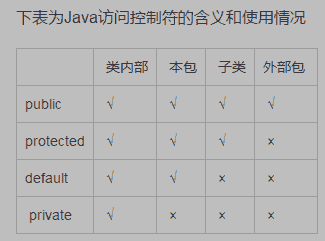
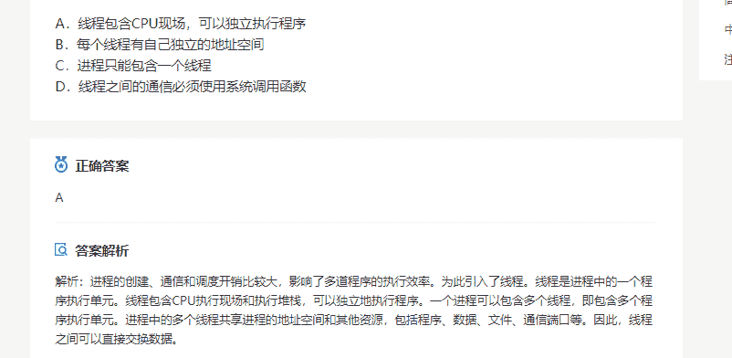

# 蘑菇街 2019 届校招-后端岗位笔试题

## 1

若进栈序列为 1,2,3,4 假定进栈和出栈可以穿插进行，则可能的出栈序列是()

正确答案: C   你的答案: 空 (错误)

```cpp
2,4,1,3
```

```cpp
3,4,1,2
```

```cpp
1,2,3,4
```

```cpp
3,1,4,2
```

本题知识点

Java 工程师 C++工程师 蘑菇街 Java 工程师 C++工程师 蘑菇街 C++工程师 Java 工程师 蘑菇街 2019

讨论

[最爱小怪兽](https://www.nowcoder.com/profile/193667259)

进 1 出 1，进 2 出 2，进 3 出 3，进 4 出 4

发表于 2019-09-01 00:42:21

* * *

## 2

对某二叉树进行先序遍历的结果是 ABDEFC,中序遍历的结果是 DBFEAC，则后序遍历的结果是（）

正确答案: B   你的答案: 空 (错误)

```cpp
DBFEAC
```

```cpp
DFEBCA
```

```cpp
CFEDBA
```

```cpp
CEFBDA
```

本题知识点

Java 工程师 C++工程师 蘑菇街 Java 工程师 C++工程师 蘑菇街 C++工程师 Java 工程师 蘑菇街 2019

## 3

若给定的关键字合集为{20,15,14,18,21,36,40,10}，一趟快速排序结束时，数据的排序为（）

正确答案: A   你的答案: 空 (错误)

```cpp
10,15,14,18,20,36,40,21
```

```cpp
10,15,14,18,20,40,36,21
```

```cpp
10,15,14,20,18,40,36,21
```

```cpp
15,10,14,18,20,36,40,21
```

本题知识点

Java 工程师 C++工程师 蘑菇街 2019

讨论

[kender01](https://www.nowcoder.com/profile/422900652)

首先选取 20 作为枢轴（根据快速排序规则，默认选择第一个），先按从右往左的顺序将每个数与枢轴比较，如果找到一个比枢轴小的数，则与枢轴交换位置，然后再按从左往右的顺序将每个数与枢轴比较，如果找到一个比枢轴小大的数，则与枢轴交换位置，反复执行这两步，直到枢轴左边的数都比枢轴小，右边的数都比枢轴大为止。未交换前：    20,15,14,18,21,36,40,10 第一次交换：10,15,14,18,21,36,40,20 第二次交换：10,15,14,18,20,36,40,21 

发表于 2019-09-04 18:30:14

* * *

## 4

设有 5000 个待排序的记录的关键字，如果需要用最快的方法选出其中最小的 10 个记录关键字，则用下列哪个方法可以达到此目的()

正确答案: B   你的答案: 空 (错误)

```cpp
快速排序
```

```cpp
堆排序
```

```cpp
归并排序
```

```cpp
插入排序
```

本题知识点

Java 工程师 C++工程师 蘑菇街 Java 工程师 C++工程师 蘑菇街 C++工程师 Java 工程师 蘑菇街 2019

讨论

[一起拥有阳光](https://www.nowcoder.com/profile/737767385)

而堆排序只需要在初始堆的基础上再进行 10 次筛选即可，每次筛选的时间复杂度为 O(log2n)

发表于 2019-02-19 12:03:44

* * *

[AKXF2020](https://www.nowcoder.com/profile/732594731)

正确答案为 B。

发表于 2020-04-09 12:41:21

* * *

## 5

一个汽车公司的产品，甲厂占 40%，乙厂占 60%，甲的次品率是 1%，乙的次品率是 2%，现在抽出一件汽车时次品，问是甲生产的可能性？

正确答案: B   你的答案: 空 (错误)

```cpp
0.5
```

```cpp
0.25
```

```cpp
0.4
```

```cpp
0.15
```

本题知识点

Java 工程师 C++工程师 蘑菇街 2019

讨论

[一起拥有阳光](https://www.nowcoder.com/profile/737767385)

p(甲|废品) = p(甲 && 废品) / p(废品) = （0.4 × 0.01） /（0.4 × 0.01 + 0.6 × 0.02） = 0.25

发表于 2019-02-19 12:04:37

* * *

## 6

bitmap 可用于磁盘空间的管理，设某系统磁盘共有 500 块，块号从 0 到 499，第 0 字的第 0 位，表示第 0 块，第 0 字的第 1 位表示第 1 块，依次类推；若用此 bitmap 管理这 500 块的磁盘空间，当字长为 32 位时，第 i 个字第 j 位对应的块号是

正确答案: D   你的答案: 空 (错误)

```cpp
32i+j-1
```

```cpp
32j+i
```

```cpp
i+i+32
```

```cpp
32i+j
```

本题知识点

Java 工程师 C++工程师 蘑菇街 2019

讨论

[一起拥有阳光](https://www.nowcoder.com/profile/737767385)

第 0 字的第 0 位至第 31 位表示：第 0-31 块第 1 字的第 0 位至第 31 位表示：第 32-63 块...这种随便带一个值进去算

发表于 2019-02-19 12:13:22

* * *

## 7

某系统中有 13 台磁带机，K 个进程共享这些设备，每个进程最多请求使用 3 台，则系统不会死
锁的 K 值是（）

正确答案: B   你的答案: 空 (错误)

```cpp
不小于 3
```

```cpp
不大于 6
```

```cpp
不大于 13
```

```cpp
在 6 与 10 之间
```

本题知识点

Java 工程师 C++工程师 蘑菇街 Java 工程师 C++工程师 蘑菇街 C++工程师 Java 工程师 蘑菇街 2019

## 8

程序 P 在机器 M 上的执行时间是 20 秒，编译优化后，P 执行的指令数减少到原来的 70%，而 CPI 增加到原来的 1.2 倍，则 P 在 M 上的执行时间是（）

正确答案: A   你的答案: 空 (错误)

```cpp
16.8s
```

```cpp
14s
```

```cpp
11.8s
```

```cpp
8.4s
```

本题知识点

Java 工程师 C++工程师 蘑菇街 Java 工程师 C++工程师 蘑菇街 C++工程师 Java 工程师 蘑菇街 2019

讨论

[牛客 729197066 号](https://www.nowcoder.com/profile/729197066)

CPI——每条计算机指令执行所需的时钟周期。优化前指令数×优化前 CPI=20 优化后指令×优化后 CPI=20×0.7*1.2=16.8

发表于 2020-07-12 13:26:04

* * *

## 9

在 java 中，要使某个类能被同一个包中的其他类访问，但不能被这个包以外的类访问，可以( )

正确答案: A   你的答案: 空 (错误)

```cpp
让该类不使用任何关键字
```

```cpp
使用 private 关键字
```

```cpp
使用 protected 关键字
```

```cpp
使用 public 关键字
```

本题知识点

Java 工程师 C++工程师 蘑菇街 2019

讨论

[dwdw123](https://www.nowcoder.com/profile/462393309)



发表于 2019-01-13 22:03:34

* * *

## 10

在数据库系统中，视图可以提供数据的？

正确答案: C   你的答案: 空 (错误)

```cpp
并发性
```

```cpp
完善性
```

```cpp
安全性
```

```cpp
可恢复性
```

本题知识点

Java 工程师 C++工程师 蘑菇街 Java 工程师 C++工程师 蘑菇街 C++工程师 Java 工程师 蘑菇街 2019

## 11

冯 · 诺依曼计算机中指令和数据均以二进制形式存放在存储器中， CPU 区分它们的依据是（）

正确答案: C   你的答案: 空 (错误)

```cpp
指令操作码的译码结果
```

```cpp
指令和数据的寻址方式
```

```cpp
指令周期的不同阶段
```

```cpp
指令和数据所在的存储单元
```

本题知识点

Java 工程师 C++工程师 蘑菇街 Java 工程师 C++工程师 蘑菇街 C++工程师 Java 工程师 蘑菇街 2019

## 12

一个有 n 个顶点 n 条边的无向图一定是（）

正确答案: A   你的答案: 空 (错误)

```cpp
有环的
```

```cpp
连通的
```

```cpp
不连通的
```

```cpp
无环的
```

本题知识点

Java 工程师 C++工程师 蘑菇街 2019

讨论

[Wwwwwwwwwwwwwwwjh](https://www.nowcoder.com/profile/982122891)

反例: 6 个顶点 6 条边 两个三角形

发表于 2019-12-12 15:46:28

* * *

## 13

设无向图 G 中有 n 个顶点 e 条边 ，则其对应的邻接表中的表头结点和表结点的个数分别为（）

正确答案: D   你的答案: 空 (错误)

```cpp
n,e
```

```cpp
e,n
```

```cpp
2n,e
```

```cpp
n,2e
```

本题知识点

Java 工程师 C++工程师 蘑菇街 Java 工程师 C++工程师 蘑菇街 C++工程师 Java 工程师 蘑菇街 2019

## 14

设某散列表的长度为 100，散列函数 H(k)=k % P，则 P 通常情况下最好选择( )

正确答案: B   你的答案: 空 (错误)

```cpp
99
```

```cpp
97
```

```cpp
91
```

```cpp
93
```

本题知识点

Java 工程师 C++工程师 蘑菇街 Java 工程师 C++工程师 蘑菇街 C++工程师 Java 工程师 蘑菇街 2019

讨论

[绅蓝](https://www.nowcoder.com/profile/1596072)

P 选择小于长度的最大质数

发表于 2018-12-26 11:37:04

* * *

[小蝈蝈 Cc](https://www.nowcoder.com/profile/754882641)

我选的 c，不应该留几个位置解决冲突吗...

发表于 2021-10-24 20:55:16

* * *

## 15

设一个顺序有序表 A[1:14]中有 14 个元素，则采用二分法查找元素 A[4]的过程中比较元素的顺序为( )

正确答案: C   你的答案: 空 (错误)

```cpp
A[1]，A[2]，A[3]，A[4]
```

```cpp
A[1]，A[14]，A[7]，A[4]
```

```cpp
A[7]，A[3]，A[5]，A[4]
```

```cpp
A[7]，A[5]，A[3]，A[4]
```

本题知识点

Java 工程师 C++工程师 蘑菇街 Java 工程师 C++工程师 蘑菇街 C++工程师 Java 工程师 蘑菇街 2019

## 16

Linux 文件权限一共 10 位长度，分成四段，第三段表示的内容是()

正确答案: C   你的答案: 空 (错误)

```cpp
文件类型
```

```cpp
文件所有者的权限
```

```cpp
文件所有者所在组的权限
```

```cpp
其他用户的权限
```

本题知识点

Java 工程师 C++工程师 蘑菇街 2019

讨论

[最爱小怪兽](https://www.nowcoder.com/profile/193667259)

ABCD 分别对应一直四段

发表于 2019-09-01 00:48:21

* * *

## 17

以下程序中：

| main(){ int  a=7,b=8,*p,*q,*r;p=&a;q=&b;r=p; p=q;q=r;printf("%d,%d,%d,%d\n",*p,*q,a,b);} |

程序运行后的输出结果是(   )

正确答案: C   你的答案: 空 (错误)

```cpp
8,7,8,7
```

```cpp
7,8,7,8
```

```cpp
8,7,7,8
```

```cpp
7,8,8,7
```

本题知识点

Java 工程师 C++工程师 蘑菇街 Java 工程师 C++工程师 蘑菇街 C++工程师 Java 工程师 蘑菇街 2019

## 18

变量 a 是一个 64 位有符号的整数，初始值用 16 进制表示为：0x7FFFFFFFFFFFFFFF;变量 b 是一个 64 位有符号的整数，初始值用 16 进制表示为：0x8000000000000000。则 a+b 的结果用 10 进制表示为多少？

正确答案: B   你的答案: 空 (错误)

```cpp
1
```

```cpp
-1
```

```cpp
0
```

```cpp
2⁶³+2⁶²+…+2²+2¹+2⁰
```

本题知识点

Java 工程师 C++工程师 蘑菇街 Java 工程师 C++工程师 蘑菇街 C++工程师 Java 工程师 蘑菇街 2019

## 19

地址“128.10.0.0”是 （） 地址

正确答案: B   你的答案: 空 (错误)

```cpp
a 类
```

```cpp
b 类
```

```cpp
c 类
```

```cpp
d 类
```

本题知识点

Java 工程师 C++工程师 蘑菇街 Java 工程师 C++工程师 蘑菇街 C++工程师 Java 工程师 蘑菇街 2019

## 20

与十进制数 28.5625 相等的四进制数是()

正确答案: B   你的答案: 空 (错误)

```cpp
121.30
```

```cpp
130.21
```

```cpp
121.31
```

```cpp
222.32
```

本题知识点

Java 工程师 C++工程师 蘑菇街 Java 工程师 C++工程师 蘑菇街 C++工程师 Java 工程师 蘑菇街 2019

## 21

下面关于操作系统的叙述中错误的是（）

正确答案: A B D   你的答案: 空 (错误)

```cpp
从响应时间的角度来看，实时系统与分时系统无本质差别
```

```cpp
多道运行是现代操作系统的特征之一，它是指宏观和微观上都并行
```

```cpp
操作系统的特征是并行性、共享性、虚拟性和不确定性
```

```cpp
在分时系统中，响应时间≈时间片×用户数，因此只要时间片足够小其响应时间一定能改善。
```

本题知识点

Java 工程师 C++工程师 蘑菇街 2019

## 22

下面有关线程的说法错误的是（）

正确答案: A D   你的答案: 空 (错误)

```cpp
每个线程有自己独立的地址空间
```

```cpp
耗时的操作使用线程，提高应用程序响应
```

```cpp
多 CPU 系统中，使用线程提高 CPU 利用率
```

```cpp
线程包含 CPU 现场，可以独立执行程序
```

本题知识点

Java 工程师 C++工程师 蘑菇街 2019

讨论

[dwdw123](https://www.nowcoder.com/profile/462393309)

D 错在哪里？

发表于 2019-01-23 08:57:47

* * *

[牛客 879752232 号](https://www.nowcoder.com/profile/879752232)



发表于 2019-01-09 15:18:39

* * *

## 23

下列关于 java 中的 sleep() 和 wait()方法的区别描述正确的是？

正确答案: A B C   你的答案: 空 (错误)

```cpp
wait()方法属于 Object 类，sleep()属于 Thread 类
```

```cpp
调用 wait()方法的时候，线程会放弃对象锁
```

```cpp
调用 sleep()方法的过程中，线程不会释放对象锁
```

```cpp
sleep()方法导致了程序暂停执行指定的时间，让出 cpu 给其他线程
```

本题知识点

Java 工程师 C++工程师 蘑菇街 2019

## 24

下面哪些不是 java8 的新特性

正确答案: C   你的答案: 空 (错误)

```cpp
lambda 表达式
```

```cpp
函数式接口
```

```cpp
jdk 模块化
```

```cpp
Stream API
```

本题知识点

Java 工程师 C++工程师 蘑菇街 2019

讨论

[karaysn](https://www.nowcoder.com/profile/7759354)

Lambda 表达式、函数式接口、Stream 流应该都是 Java8 出来的吧

发表于 2019-01-07 11:18:33

* * *

## 25

下列关于视图的说法正确的是（）

正确答案: A B D   你的答案: 空 (错误)

```cpp
视图是从一个或多个基本表导出的表，它是虚表
```

```cpp
某一用户可以定义若干个视图
```

```cpp
视图一经定义就可以和基本表一样被查询、删除和更新
```

```cpp
视图可以用来定义新的视图
```

本题知识点

Java 工程师 C++工程师 蘑菇街 2019

讨论

[dwdw123](https://www.nowcoder.com/profile/462393309)

视图一经定义，就可以和基本表一样被查询、被删除。也可以在一个视图之上再定义新的视图，但对视图的更新（增、删、改）操作则有一定的限制。

发表于 2019-01-23 08:54:33

* * *

## 26

下面关于存储过程的描述正确的是？

正确答案: A B D   你的答案: 空 (错误)

```cpp
存储过程实际上是一组 T-SQL 语句
```

```cpp
存储过程预先被编译存放在服务器的系统中
```

```cpp
存储过程独立于数据库而存在
```

```cpp
存储过程可以完成某一特定的业务逻辑
```

本题知识点

Java 工程师 C++工程师 蘑菇街 2019

## 27

关于系统调用的描述中,错误的是()

正确答案: A B   你的答案: 空 (错误)

```cpp
系统调用中被调用的过程运行在&quot;用户态&quot;中
```

```cpp
系统调用把应用程序的请求传输给系统 io 模块执行
```

```cpp
利用系统调用能够得到操作系统提供的多种服务
```

```cpp
系统调用保护了一些只能在内核模式执行的操作指令
```

本题知识点

Java 工程师 C++工程师 蘑菇街 2019

## 28

在 Java 中，以下关于方法重载和方法重写描述正确的是？

正确答案: D   你的答案: 空 (错误)

```cpp
方法重载和方法的重写实现的功能相同
```

```cpp
方法重载出现在父子关系中，方法重写是在同一类中
```

```cpp
方法重载的返回值类型必须一致，参数项必须不同
```

```cpp
方法重写的返回值类型必须相同或相容
```

本题知识点

Java 工程师 C++工程师 蘑菇街 2019

## 29

下面哪些页面调度算法,当进程分配到的页面数增加时,缺页中断的次数可能增加也可能减少

正确答案: A   你的答案: 空 (错误)

```cpp
FIFO 算法
```

```cpp
LRU 算法
```

```cpp
Clock 算法
```

```cpp
LFU 算法
```

本题知识点

Java 工程师 C++工程师 蘑菇街 2019

## 30

下列关于轮询任务调度和可抢占式调度区别描述错误的是？

正确答案: A B   你的答案: 空 (错误)

```cpp
抢占式调度优点是其简洁性，它无需记录当前所有连接的状态
```

```cpp
轮询调度利于后面的请求及时得到响应
```

```cpp
抢占式调度有利于后面的高优先级的任务也能及时得到响应
```

```cpp
抢占式调度实现相对较复杂且可能出现低优先级的任务长期得不到调度
```

本题知识点

Java 工程师 C++工程师 蘑菇街 2019

## 31

有一个 X*Y 的网格，小团要在此网格上从左上角到右下角，只能走格点且只能向右或向下走。请设计一个算法，计算小团有多少种走法。给定两个正整数 int x,int y，请返回小团的走法数目。

本题知识点

Java 工程师 C++工程师 蘑菇街 测试工程师 动态规划 数学 2019

讨论

[超越姐姐保佑我 i](https://www.nowcoder.com/profile/4648943)

题意不太明确，注意只能走格点，你画个网格就知道了。

所以 3 * 2 的网格，实际上格点数却是 4 * 3 。dp 解法

```cpp
import java.util.*;
public class Main {
    public static void main(String[] args) {
        Scanner sc = new Scanner(System.in);
        int n = sc.nextInt();
        int m = sc.nextInt();

        int[][] dp = new int[n + 1][m + 1];
        for(int i = 0; i <= n; i ++) {
            for(int j = 0; j <= m; j ++) {
                if(i == 0 || j == 0) {
                    dp[i][j] = 1;
                } else {
                    dp[i][j] = dp[i - 1][j] + dp[i][j - 1];
                }
            }
        }

        System.out.println(dp[n][m]);
    }
}
```

或者直接计算 C(n + m, n)

```cpp
import java.util.*;
public class Main {
    public static void main(String[] args) {
        Scanner sc = new Scanner(System.in);
        int n = sc.nextInt();
        int m = sc.nextInt();

        int res = 1;
        for(int i = 1; i <= n; i ++) {
            res = res * (m + i) / i;
        }

        System.out.println(res);
    }
}
```

编辑于 2019-08-14 23:55:38

* * *

[pjvs1478](https://www.nowcoder.com/profile/346150842)

因为只能向右走和向下，所以无论怎么走，向右的总距离和向下总距离都只能是 x 和 y（即网格大小，曼哈顿距离不变），可以转换成排列组合问题，假设用 0 代表向右，1 代表向左，题目转化成用 x 个 0 和 Y 个 1 能组成多少个不同的数，由排列组合公式可知，组合数应当是：


```cpp
def cal_couple(num,i):
    sum = 1
    dvi_sum = 1
    for i in range(i):
        sum = sum*(num-i)
        dvi_sum = dvi_sum * (i+1)
    return (sum/dvi_sum)
if __name__ == '__main__':
    x,y = list(map(int,input().split()))
    print('%d' %(cal_couple(x+y,x)))

```

PS:python 学得不好，见谅

发表于 2019-07-16 15:40:58

* * *

[lentolove](https://www.nowcoder.com/profile/572586026)

就是一个排列组个问题  一共要走步，哪步向右下走
注意阶乘溢出就行
import java.io.BufferedReader;
import java.io.IOException;
import java.io.InputStreamReader;

public class Solution15_ 方格走法 {

```cpp
public static void main(String[] args) throws IOException {
    BufferedReader bf = new BufferedReader(new InputStreamReader(System.in));
    String[] split = bf.readLine().split(" ");
    int x = Integer.parseInt(split[0]);
    int y = Integer.parseInt(split[1]);
    long a = 1,b = 1;
    int sum = x + y;
    int min = Math.min(x,y);
    for (int i = 1; i <= min; i++) {
        a *= i;
        b *= sum;
        sum--;
    }
    System.out.println(b / a);
}
```

}

编辑于 2019-08-16 19:09:33

* * *

## 32

Given a string **s** and a dictionary of words **dict**, add spaces in **s** to construct a sentence where each word is a valid dictionary word.
Return all such possible sentences.

本题知识点

Java 工程师 C++工程师 蘑菇街 字符串 *模拟 穷举 2019* *讨论

[ElonB](https://www.nowcoder.com/profile/623894)

```cpp
""""
深度优先搜索 DFS
"""
import sys

def dfs(s, dic, arr, ans):
    if not s:
        ans.append(' '.join(arr))
    for w in dic:
        if s.startswith(w):
            dfs(s[len(w):], dic, arr + (w,), ans)

if __name__ == "__main__":
    # sys.stdin = open("input.txt", "r")
    s = input().strip()
    s = s[s.index('"') + 1:-1]
    dic = input().strip()
    dic = eval("{" + dic[dic.index('"'):] + "}")
    ans = []
    dfs(s, dic, tuple(), ans)
    print('[' + ', '.join(ans) + ']')

```

发表于 2019-07-12 10:43:58

* * *

[勇敢牛牛，不怕困难！](https://www.nowcoder.com/profile/840813925)

```cpp
#include <iostream>
#include <vector>
#include <unordered_set>
#include <cstring> // 导入 C 的标准库
#include <functional>

using namespace std;
int main(void) {
  string s, dict;
  getline(cin, s);
  getline(cin, dict);

  int first = s.find_first_of(34); // 34 == "
  s = s.substr(first + 1, s.length() - first - 2);

  first = dict.find(34);
  dict = dict.substr(first, dict.length() - first);

  char* saved = nullptr;
  char* tok = strtok_r(const_cast<char*>(dict.c_str()), ",", &saved);
  unordered_set<string> words;
  while (tok) {
    string word = string(tok);
    word = word.substr(1, word.length() - 2);
    words.emplace(word);
    tok = strtok_r(nullptr, ",", &saved);
  }

  const int n = s.length();
  vector<string> candidates;
  vector<vector<string>> answer;

  function<void(int)> backtracking_algorithm = & {
    if (position == n) {
      answer.insert(begin(answer), candidates);
      return;
    }

    for (int i = position; i < n; ++i) {
      string ss = s.substr(position, i - position + 1); // ss == substring
      if (not words.count(ss)) continue;
      candidates.emplace_back(ss);
      backtracking_algorithm(i + 1);
      candidates.pop_back(); // backtracing ...
    }
  };

  backtracking_algorithm(0);

  cout << '[';
  for (auto it = begin(answer); it != end(answer); ++it) {  // 答案是由多个句子组成的
    auto& sentence = *it;
    for (auto iter = begin(sentence); iter != end(sentence); ++iter) {  // 句子是由多个单词组成的
      cout << *iter;
      if (iter < end(sentence) - 1) cout << ' ';
    }
    if (it < end(answer) - 1) cout << ", ";
  }
  cout << ']';
  return 0;
}
```

发表于 2021-07-26 15:33:33

* * *

[零葬](https://www.nowcoder.com/profile/75718849)

先穷举出词表的全排列，对于每个排列，都检查不同长度的子串能否拼接得到字符串 s，如果能得到，说明这个子串是 s 的一种拆解方式，将其加入到结果集中。

```cpp
from itertools import permutations

s = input().split('=')[-1].strip().strip('"')
dic = [word.strip() for word in input().split('=')[-1].strip().replace('"', '').split(',')]
n = len(dic)
res = set()
for words in list(permutations(dic)):
    for i in range(1, n + 1):
        if ''.join(words[:i]).strip() == s:
            res.add(' '.join(words[:i]).strip())
print(f"[{', '.join(res).strip(', ')}]")
```

发表于 2021-04-11 13:34:54

* * **