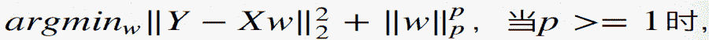
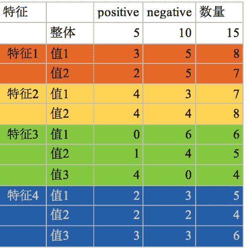

# 蘑菇街 2019 届校招-算法类笔试题

## 1

恰有两个小孩的家庭，若已知一家有一个男孩，则这家小孩都是男孩的概率为？

正确答案: A   你的答案: 空 (错误)

```cpp
1/3
```

```cpp
1/4
```

```cpp
1/6
```

```cpp
1/2
```

本题知识点

算法工程师 蘑菇街 2019

讨论

[尼古拉斯小林](https://www.nowcoder.com/profile/234926)

A 男 B 男 A 男 B 女 A 女 B 男 A 女 B 女因为已知有一个男孩子所以去除 A 女 B 女这种情况那么就是 1/3

发表于 2018-12-12 10:28:23

* * *

[Sci-Hub](https://www.nowcoder.com/profile/4641369)

> 

*来源:*[*https://www.cnblogs.com/mengnan/p/10457888.html*](https://www.cnblogs.com/mengnan/p/10457888.html)

发表于 2019-04-01 10:04:35

* * *

## 2

操作系统实现内存管理的常使用的数据结构为？

正确答案: D   你的答案: 空 (错误)

```cpp
栈
```

```cpp
队列
```

```cpp
数组
```

```cpp
链表
```

本题知识点

算法工程师 蘑菇街 2019

## 3

正负样本采样比从 1:1 到 1:5, auc 的变化会:

正确答案: D   你的答案: 空 (错误)

```cpp
变大
```

```cpp
变小
```

```cpp
不确定
```

```cpp
不变
```

本题知识点

算法工程师 蘑菇街 2019

## 4

下列哪个优化算法适合稀疏数据：

正确答案: D   你的答案: 空 (错误)

```cpp
sgd<br>+ momentum
```

```cpp
nesterov
```

```cpp
LBFGS
```

```cpp
Adagrad
```

本题知识点

算法工程师 蘑菇街 2019

讨论

[零葬](https://www.nowcoder.com/profile/75718849)

在传统机器学习中，一种加速迭代的方法就是将数值归一化到一个以原点为中心的空间内。Adagrad 通过累积梯度约束学习率，提升 SGD 的 robustness，并且能让不频繁出现的参数进行较大的更新、频繁出现的参数进行较小的更新，尤其适用于稀疏数据的情况。

发表于 2020-10-29 17:17:09

* * *

## 5

以下带正则的线性回归模型：

增加会对 bias 和 variance 带来什么影响(假设所有 weights 都大于 1)?

正确答案: B   你的答案: 空 (错误)

```cpp
bias 增加，variance 增加
```

```cpp
bias 增加，variance 减小
```

```cpp
bias 减小，variance 增加
```

```cpp
bias 减小，variance 减小
```

```cpp
信息不充分，无法判断
```

本题知识点

算法工程师 蘑菇街 2019

讨论

[零葬](https://www.nowcoder.com/profile/75718849)

在一定范围内增加正则化强度能够减小方差、增大偏差，增强太多的话模型效果应该会急剧下降

发表于 2021-01-06 10:55:25

* * *

## 6

当需要从中挑选一个特征来构建决策树模型时，以下哪种准则的最大化 最合适？

正确答案: C   你的答案: 空 (错误)

```cpp
P(Y|Xj)
```

```cpp
P(Y)<br>- P(Y|Xj)
```

```cpp
H(Y)<br>- H(Y|Xj)
```

```cpp
H(Y|Xj)
```

```cpp
H(Y)-P(Y)
```

本题知识点

算法工程师 蘑菇街 算法工程师 蘑菇街 算法工程师 蘑菇街 算法工程师 蘑菇街 2019

## 7

神经网络，非线性激活函数包括 sigmoid/tanh/ReLU 等

正确答案: D   你的答案: 空 (错误)

```cpp
加速反向传播时的梯度计算
```

```cpp
只在最后输出层才会用到
```

```cpp
总是输出 0/1
```

```cpp
其他说法都不正确
```

本题知识点

算法工程师 蘑菇街 算法工程师 蘑菇街 算法工程师 蘑菇街 算法工程师 蘑菇街 2019

讨论

[尼古拉斯小林](https://www.nowcoder.com/profile/234926)

sigmod 取值范围[0，1],反向传播速度慢，可能会出现梯度消失 tanh 取值范围[-1,1]relu 小于 0 的部分值为 0，大于 0 的部分值为其本身

发表于 2018-12-13 16:01:22

* * *

## 8


以上特征信息增益最大的是?

正确答案: C   你的答案: 空 (错误)

```cpp
特征 1
```

```cpp
特征 2
```

```cpp
特征 3
```

```cpp
特征 4
```

本题知识点

算法工程师 蘑菇街 2019

## 9

两个人吃苹果，抛硬币决定，抛到正面的人先吃，先抛的人吃到苹果的概率是多少？

正确答案: D   你的答案: 空 (错误)

```cpp
1/2
```

```cpp
3/4
```

```cpp
1/4
```

```cpp
2/3
```

本题知识点

算法工程师 蘑菇街 2019

讨论

[刘文超 201909271409691](https://www.nowcoder.com/profile/758250575)

第一个人吃苹果的，有一个前提是抛硬币的次数一定是奇数。假设抛了一轮：p = 0.5(正)假设抛了两轮：p = 0.5（反）*0.5（反）*0.5（正）=0.5³ 假设抛了三轮：p = 0.5（反）*0.5（反）*0.5（反）*0.5（反）*0.5（正）=0.5⁵
```cpp`N 轮后：p = 0.5^(2N-1)等比 0.25 数列求和：0.5*（1-0.25^N）/(1-0.25) = 0.5/0.75 = 2/3

发表于 2019-12-12 17:20:29

* * *

[abner112](https://www.nowcoder.com/profile/520010259)

这题重复了 n 次，我贴重复贴几次答案。。。 解法 1，利用公式，第一次先抛赢概率/第一次后抛赢概率=第二次先抛赢概率/第二次后抛赢概率。 设 a 赢概率 p，代入第一次先抛赢概率。b 赢概率 1-p，代入第一次先抛赢概率。第二次，a 跟 b 先后角色反转，b 赢概率 1-p，代入第二次先赢概率。a 抛一次有 0.5 被 a 赢了，a 赢概率剩余 p-0.5，代入第二次后赢概率。 p/（1-p）=（1-p）/（p-0.5），， 应该是解得 p 等于 2/3。.................. 解法 2，利用公式，第一轮先抛赢概率/剩余赢概率=第二轮先抛赢概率/剩余赢概率。 设 a 赢概率 p，代入第一轮先抛赢概率。剩余赢概率 1，代入。第二轮，双方都抛了一次，a 有 0.5 概率赢了，b 有 0.25 概率赢了，剩余赢概率为 1-0.5-0.25，代入。a 赢概率剩余 p-0.5，代入。 p/1=（p-0.5）/（1-0.5-0.25） 应该是解得 p 等于 2/3。..................

发表于 2019-12-12 15:49:59

* * *

## 10

下列说法正确的是

正确答案: A   你的答案: 空 (错误)

```
单隐层神经网络可以拟合任意单值连续函数
```cpp

```
测试集的准确率越高越好
```cpp

```
深度神经网络做序列标注优于传统机器学习方法
```cpp

```
参数越多拟合能力越强从而泛化能力越强
```cpp

本题知识点

算法工程师 蘑菇街 算法工程师 蘑菇街 算法工程师 蘑菇街 算法工程师 蘑菇街 2019

## 11

若实现一个未加入任何优化的递归版本的斐波那契序列实现，该递归版本实现的时间复杂度和空间复杂度是怎样的?(不考虑整数溢出和机器的内存限制）

正确答案: B   你的答案: 空 (错误)

```
时间复杂度 O(n)，<br>空间复杂度 O(2^n)
```cpp

```
时间复杂度 O(2^n), 空间复杂度 O(n)
```cpp

```
时间复杂度 O(n), 空间复杂度 O(n)
```cpp

```
时间复杂度 O(2^n), 空间复杂度 O(2^n)
```cpp

本题知识点

算法工程师 蘑菇街 算法工程师 蘑菇街 算法工程师 蘑菇街 算法工程师 蘑菇街 2019

## 12

已知二叉树的先序序列为 ABCDEFI，中序序列为 CBDAEFI,该二叉树的高度为（）

正确答案: C   你的答案: 空 (错误)

```
2
```cpp

```
3
```cpp

```
4
```cpp

```
5
```cpp

本题知识点

算法工程师 蘑菇街 2019

讨论

[果冻 1](https://www.nowcoder.com/profile/254742410)

确定不是 4 而是 3 吗，左子树深度 2，右子树深度 3，左子树完全二叉树，右子树只有右孩子

发表于 2019-04-21 12:10:56

* * *

[零葬](https://www.nowcoder.com/profile/75718849)

这个题应该是 4 吧

发表于 2020-10-29 17:18:09

* * *

[AlanSmith](https://www.nowcoder.com/profile/4386136)

这题答案不是 4 吗？？

发表于 2019-08-22 10:50:35

* * *

## 13

假设你有一个非常大的训练集合，如下机器学习算法中，你觉着有哪些是能够使用 map-reduce 框架并能将训练集划分到多台机器上进行并行训练的（）

正确答案: B C   你的答案: 空 (错误)

```
逻辑斯特回归（LR)，以及随机梯度下降(SGD)
```cpp

```
线性回归及批量梯度下降(BGD)
```cpp

```
神经网络及批量梯度下降(BGD)
```cpp

```
针对单条样本进行训练的在线学习
```cpp

本题知识点

算法工程师 蘑菇街 2019

讨论

[算法求 offer](https://www.nowcoder.com/profile/2640093)

为什么逻辑回归不能用 map-reduce？

发表于 2019-03-03 10:03:28

* * *

## 14

对如下神经网络的描述，正确的是（）

正确答案: C D   你的答案: 空 (错误)

```
对于两层神经网络（输入层/输出层/无隐藏层）可以训练拟合 XOR 操作
```cpp

```
假如神经网络过拟合了，一个可行的操作是减少正则化项的系数
```cpp

```
任何二元逻辑函数（输入为 0/1)，可以使用神经网络来进行建模
```cpp

```
假如神经网络过拟合了，一个可行的操作是增加正则化项的系数
```cpp

本题知识点

算法工程师 蘑菇街 2019

## 15

优化单线程计算密集型的程序运行速度的方法有

正确答案: A D   你的答案: 空 (错误)

```
优化程序
```cpp

```
提升内存大小
```cpp

```
提升缓存大小
```cpp

```
提升 CPU 主频
```cpp

```
增加机器核数
```cpp

```
提升 IO 速度
```cpp

本题知识点

算法工程师 蘑菇街 2019

## 16

下列哪几个优化算法适合大规模训练集的场景：

正确答案: A B D   你的答案: 空 (错误)

```
minibatch<br>sgd
```cpp

```
Adam
```cpp

```
LBFSG
```cpp

```
FTRL
```cpp

本题知识点

算法工程师 蘑菇街 2019

## 17

随机数字序列要多长才能使得序列中 7 出现的概率至少是 9/10？

你的答案

本题知识点

算法工程师 蘑菇街 2019

讨论

[尼古拉斯小林](https://www.nowcoder.com/profile/234926)

初步分析,出现 7 的概率,包括 1 次 或者 2 次 或者 3 次 .,所以无法直接一步计算,我们利用对立事件转换,计算不出现 7 的概率来分析,有
随机数每一位出现数字 7 的概率为 0.1,不出现数字 7 的概率为 0.9
设随机数要 x 位才能使数字 7 出现的概率 至少 0.9
1-0.9^x≥0.9
0.9^x≤0.1
xlg0.9≤-1
x*(2*lg3-1)≤-1
x*(2*0.4771-1)≤-1
-0.0458x≤-1
x≥21.83
故随机数至少要 22 位才能使数字 7 出现的概率 至少 0.9

发表于 2018-12-13 18:44:01

* * *

[芦溪彭于晏](https://www.nowcoder.com/profile/678987627)

22\.每一次出现 7 的概率为 0.1，不出现 7 的概率为 0.9，而 1-(0.9）^x >=0.9，每一次就代表随机的序列长度，算出约为 22。

发表于 2019-04-20 11:03:46

* * *

## 18

请设计一个推荐系统, 结合用户行为推荐商品. 其中基础的推荐的物料为商品集合, 所需的其他数据可以自己设计.请描述算法实现及基本的系统框架.

你的答案

本题知识点

算法工程师 蘑菇街 2019

## 19

给定一个字符串，输出所有指定长度为 n 的子串，没有则输出-1

本题知识点

算法工程师 蘑菇街 字符串 *穷举 2019* *讨论

[Chrety](https://www.nowcoder.com/profile/994602167)

```
s = str(input())
n = input()
if n > len(s): print -1

elif n < 0 :
        print -1

else :
    i = 0
    while i + n <= len(s) :
        print s[i : i + n],
        i += 1
        pass
```cpp

发表于 2019-07-20 07:56:10

* * *

[广州市民林先生](https://www.nowcoder.com/profile/241061362)

有点小坑，注意要做下边界判断，n 可能为负 或者 越界

```
#include <iostream>
#include <string>
using namespace std;

int main(){
    string str;
    int n;
    cin >> str;
    cin >> n;
    if(n > str.length() || n <= 0){
        cout << -1 << endl;
        return 0;
    }
    for(int i = 0; i <= str.length() - n; ++i){
        string temp = str.substr(i, n);
        cout << temp << ' ';
    }
    cout << endl;
    return 0;
}
```cpp

编辑于 2020-05-30 13:26:28

* * *

[无心 2019](https://www.nowcoder.com/profile/991674511)

```
#include <bits/stdc++.h>
using namespace std;
int main()
{
    string s;
    cin>>s;
    int n,j=0;
    cin>>n;
    if(n>s.size())
        cout<<"-1"<<endl;
    else
    {
        cout<<s.substr(0,n);
        for(int i=1;i<=s.size()-n;i++)
            cout<<' '<<s.substr(i,n);
        cout<<endl;
    }
    return 0;
}

```cpp

发表于 2019-07-03 10:18:02

* * *

## 20

请编写一段代码，实现两个单向有序链表的合并

本题知识点

算法工程师 蘑菇街 模拟 链表 *2019* *讨论

[呃(⊙o⊙)…](https://www.nowcoder.com/profile/178391847)

```
public class Main {
    public static void main(String[] args) {
        Scanner in = new Scanner(System.in);
        String[] s1 = in.nextLine().split(" ");
        String[] s2 = in.nextLine().split(" ");
        int[] a = new int[s1.length];
        int[] b = new int[s2.length];
        int[] t = new int[s1.length+s2.length];
        for (int i=0;i<s1.length;i++){
            a[i] = Integer.parseInt(s1[i]);
        }
        for (int i=0;i<s2.length;i++){
            b[i] = Integer.parseInt(s2[i]);
        }
        int i=0,j=0,k=0;
        while (i<a.length && j<b.length){
            if (a[i] < b[j])
                t[k++] = a[i++];
            else
                t[k++] = b[j++];
        }
        while (i < a.length)
            t[k++] = a[i++];
        while (j < b.length)
            t[k++] = b[j++];
        for(i=0;i<t.length;i++)
            System.out.print(t[i]+" ");
    }
}
```cpp

发表于 2019-08-14 15:17:02

* * *

[Chrety](https://www.nowcoder.com/profile/994602167)

```
n = map(int, raw_input().split())
m = map(int, raw_input().split())
n += m
n.sort()
for i in n :
    print i,
```cpp

发表于 2019-07-20 07:56:47

* * *

[Jared_VIP](https://www.nowcoder.com/profile/2614649)

```
class ListNode(object):
    def __init__(self,x=None):
        self.val = x
        self.next = None

class Solution(object):
    def mergeTwoLists(l1,l2):
        """
        :param l1: ListNode
        :param l2: ListNode
        :return: ListNode
        """
        if not l1 and not l2:
            return  None
        if not l1:
            return l2
        if not l2:
            return l1

        l3 = ListNode()
        l3_head = l3
        while l1 is not None and l2:
            if l1.val<=l2.val:
                l3.next = l1
                l1 = l1.next
            else:
                l3.next = l2
                l2 = l2.next
            l3 = l3.next
        if l1 is not None:
            l3.next = l1
        else:
            l3.next = l2

        return l3_head.next

    def Create(list1,list2):
        temp_node1 = ListNode()
        node1 = temp_node1

        temp_node2 = ListNode()
        node2 = temp_node2

        for i in list1:
            if not temp_node1.val:
                temp_node1.val = i
                node1 = temp_node1
            else:
                temp_node1.next = ListNode(i)
                temp_node1 = temp_node1.next

        for i in list2:
            if not temp_node2.val:
                temp_node2.val = i
                node2 = temp_node2
            else:
                temp_node2.next = ListNode(i)
                temp_node2 = temp_node2.next
        return (node1,node2)

    if __name__ == '__main__':
        list1 = list(map(int,input().split()))
        list2 = list(map(int,input().split()))
        # print(list1)
        # print(list2)
        node1,node2 = Create(list1,list2)
        l3_node = mergeTwoLists(node1,node2)
        while l3_node:
            print(l3_node.val,end=' ')
            l3_node = l3_node.next
```

这里贴一下我的代码 这道题 很多人都是误解了题目的意思 他要的是链表 所以应该这样写，希望能顶上去 麻烦大家了

发表于 2019-08-11 10:53:29

* * ***